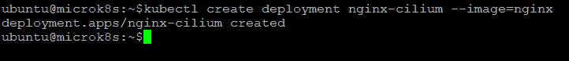

# 6

# 配置容器的连接性

在上一章中，我们学习了如何设置一个 MicroK8s Raspberry Pi 多节点集群，部署示例应用程序，并对已部署的应用程序执行滚动更新。我们还弄清楚了如何扩展已部署的应用程序。我们还了解了一些设计可扩展、安全和高度优化的 Kubernetes 集群的最佳实践。在本章及接下来的章节中，我们将继续使用 MicroK8s 实现各种常见边缘计算应用程序的用例。Kubernetes 提供了多种方式来将服务暴露到外部世界。

在本章中，我们将继续下一个用例，即 MicroK8s 上的容器网络连接性。Kubernetes 网络模型中的每个 Pod 默认都会被分配一个自己的**互联网协议**（**IP**）地址。因此，你无需显式地将 Pods 连接或联网，也不必担心将容器端口映射到主机端口等问题。

Kubernetes 允许你声明性地描述应用程序的部署方式、它们之间以及与 Kubernetes 控制平面的通信方式，以及客户端如何访问它们。

Kubernetes 作为一个高度模块化的开源项目，允许极高的网络实现适应性。Kubernetes 生态系统催生了许多项目，旨在使容器通信变得简单、一致和安全。一个通过插件功能简化 Kubernetes 网络的项目是**容器网络接口**（**CNI**）。CNI 的主要目标是为管理员提供足够的控制来监控流量，同时减少手动配置网络配置所需的时间。

Kubernetes 对任何网络实现施加的基本标准如下：

+   没有**网络地址转换**（**NAT**）的情况下，节点上的 Pods 可以与所有其他节点上的 Pods 通信。

+   节点的代理（如系统守护进程和`kubelet`）可以与该节点的所有 Pods 进行通信。

+   在没有 NAT 的情况下，节点主机网络中的 Pods 可以与所有其他节点上的 Pods 通信。

CNI 允许 Kubernetes 提供商开发独特的网络模型，旨在为所有 Pods 提供一致和可靠的网络。CNI 插件提供命名空间隔离、流量和 IP 过滤，而这些 Kubernetes 默认并不提供。假设程序员希望使用这些高级网络功能。在这种情况下，他们必须将 CNI 插件与 CNI 一起使用，以便促进网络的构建和管理。

市面上有多种 CNI 插件。在本章中，我们将介绍一些流行的选项——如 Flannel、Calico 和 Cilium——并且我们将涵盖以下主要主题：

+   CNI 概述

+   配置 Calico

+   配置 Cilium

+   配置 Flannel

+   选择 CNI 提供商的指南

# CNI 概述

在深入了解 CNI 概述之前，让我们先理解一下 Kubernetes 集群内是如何处理网络的。

当 Kubernetes 将 Pod 调度到一个节点上执行时，节点的 Linux 内核为该 Pod 生成一个网络命名空间。这个网络命名空间建立了`eth0`接口，并允许数据包在 Pod 内外流动。节点根网络命名空间中的相关 VIF 连接到一个 Linux 桥接，允许同一节点上 Pod 之间的通信。Pod 也可以使用相同的 VIF 将数据包发送到节点外部。

在为节点上的 Pod 保留的地址范围内，Kubernetes 为 Pod 的网络命名空间中的 VIF 分配了一个 IP 地址（Pod IP 地址）。这个地址范围是集群中 Pod 的 IP 地址范围的一个子集，你可以在构建集群时指定该范围。

容器在 Pod 中运行时使用的网络命名空间是 Pod 的网络命名空间。从容器的角度看，Pod 像是一台有一个网络接口的物理机器。这个网络接口由 Pod 中的所有容器共享。每个容器的 localhost 通过 Pod 与节点的物理网络接口（如`eth0`）连接。每个 Pod 默认可以不受限制地访问集群中所有节点上运行的其他 Pod，但你可以限制 Pod 之间的访问。

以下图展示了一个节点运行两个 Pod 以及 Pod 之间的网络流量：


图 6.1 – Kubernetes 网络模型：Pod 间流量的流动

# 从 Pod 3 到 Pod 6 的通信流

让我们来看一下从 Pod3 到 Pod6 的通信流，这两个 Pod 位于同一个节点上：

1.  数据包从 Pod `3`通过`eth3`接口离开，经过`veth1234`虚拟接口到达`cbr0`桥接接口。

1.  数据包从`veth1234`离开并到达`cbr0`，寻找 Pod `6`的地址。

1.  数据包从`cbr0`离开并被重定向到`veth5678`。

1.  数据包从`cbr0`通过`veth5678`接口离开，并通过`eth6`接口到达 Pod `6`的网络。

Kubernetes 定期销毁并重建 Pod。因此，必须使用具有稳定 IP 地址并能够在一组 Pod 之间启用负载均衡的服务。节点中的`kube-proxy`组件负责 Pod 与服务之间的通信。

从客户端 Pod `3`到位于不同节点的服务器 Pod `6`的流量如下图所示。Kubernetes 中的`kube-proxy`代理进程在每个节点上配置一个`iptables`规则，将流量导向正确的 Pod：


图 6.2 – Kubernetes 网络模型：不同节点上 Pod 间流量的流动

### 不同节点上 Pod 3 到 Pod 6 的通信流

让我们来看一下从 Pod3 到 Pod6 的通信流，这两个 Pod 位于不同的节点上：

1.  数据包从 Pod `3`通过`eth3`接口离开，并通过`veth1234`虚拟接口到达`cbr0`桥接接口。

1.  数据包从`veth1234`离开，抵达`cbr0`，寻找 Pod `6`的地址。

1.  数据包从`cbr0`离开，并被重定向到`eth0`。

1.  数据包然后从节点`1`的`eth0`离开，抵达网关。

1.  数据包从网关离开，抵达节点`2`的`eth0`接口。

1.  数据包从`eth0`离开，抵达`cbr0`，寻找 Pod `6`的地址。

1.  数据包从`cbr0`通过`veth5678`离开，经过`eth6`接口，抵达 Pod `6`网络。

现在我们已经清楚了 Kubernetes 网络模型中流量的路由方式，接下来我们可以专注于 CNI 的概念。

CNI 是一个网络框架，使用一套标准和模块来实现网络资源的动态配置。插件的规范详细说明了配置网络、分配 IP 地址以及维持多主机通信的接口。

CNI 与 Kubernetes 上下文中的`kubelet`代理无缝连接，允许 Pod 之间的自动网络配置，使用底层或覆盖网络。我们将在这里更详细地了解这一点：

+   **覆盖模式**——处于**覆盖**模式的容器与主机的 IP 地址范围相独立。在跨主机通信时，主机之间会建立隧道，容器内的所有数据包都位于**无类域间路由**（**CIDR**）块内，并被封装（使用虚拟接口，如**虚拟可扩展局域网**，或**VXLAN**），作为底层物理网络中主机之间交换的数据包。这种模式消除了对底层网络的依赖，您可以在下图中查看其概述：


图 6.3 – 覆盖模式

+   **底层模式**——在**底层**模式下，容器和主机位于相同的网络层，并共享相同的位置。容器网络互联由底层网络（网络层的物理层）决定，其中包括路由器和交换机。因此，这种模式对底层能力高度依赖。您可以在下图中查看其概述：


图 6.4 – 底层模式

一旦网络配置类型被定义，运行时会创建一个容器网络，并使用 CNI 插件将接口添加到容器命名空间，并使用**IP 地址管理**（**IPAM**）插件来分配相关的子网和路由。除了 Kubernetes 网络，CNI 还支持**软件定义网络**（**SDN**）方法，以提供集群间统一的容器通信。

现在我们已经清楚了 CNI 的概念，接下来我们将深入探讨如何配置 Calico CNI 插件以实现跨集群的网络连接。

# 配置 Calico

Calico 是 Kubernetes 环境中最流行的开源 CNI 插件。**Tigera**维护 Calico，它设计用于网络性能、灵活性和强大功能至关重要的环境。它具有强大的网络管理安全功能，以及对主机和 Pod 连接的全面视图。

它可以很容易地作为`DaemonSet`在常规 Kubernetes 集群中的每个节点上部署。为了管理大量的网络活动，集群中的每个节点都需要安装三个 Calico 组件：`Felix`、`BIRD`和`confd`。节点路由由 Calico 代理`Felix`处理，而`BIRD`和`confd`则管理路由配置的变化。

Calico 使用**边界网关协议**（**BGP**）路由协议，而不是覆盖网络来在节点之间路由消息。IP-IN-IP 或 VXLAN 可以封装跨子网传输的数据包，作为一种覆盖网络模式。它采用未封装的 IP 网络架构，减少了封装数据包的需求，从而提高了 Kubernetes 工作负载的网络性能。

WireGuard 通过在节点之间建立和管理隧道，确保安全通信，并加密集群内 Pod 之间的通信。与其他工具相比，它使追踪和调试变得更容易，因为它不使用包装器来操作数据包。开发者和管理员可以快速分析数据包行为，并利用复杂的网络功能，如策略管理和**访问控制列表**（**ACLs**）。

Calico 的网络策略实现了拒绝/匹配规则，这些规则可以通过清单应用到 Pods，以分配入口策略。为了监控 Pod 流量、增强安全性并管理 Kubernetes 工作负载，用户可以构建全球范围的策略并与 Istio 服务网格进行交互。

在接下来的步骤中，我们将展示如何通过一个基本的 Kubernetes NetworkPolicy API 示例，使用 Calico 来保护你的 Kubernetes 集群。NetworkPolicy 是以应用为中心的结构，允许你声明 Pods 如何在网络中与各种网络实体进行通信。

Pod 可以通信的实体通过以下三种**标识符**（**IDs**）的组合来识别：

+   其他允许的 Pods（例外：Pod 不能阻止对自身的访问）

+   允许的命名空间

+   允许的 IP 块（例外：无论 Pod 或节点的 IP 地址如何，流量从 Pod 所在节点进出总是允许的）

现在我们对标识符有了清晰的了解，我们将深入探讨配置 Calico CNI 插件以实现集群间网络连接的步骤。以下图示展示了我们的树莓派集群设置：


图 6.5 – 树莓派集群设置

现在我们知道了我们想做什么，让我们来看一下需求。

## 需求

在开始之前，以下是构建树莓派 Kubernetes 集群以及配置 CNI 所需的先决条件：

+   一张 microSD 卡（最低 4 **GB**；推荐 8 GB）

+   一台带有 microSD 卡槽的计算机

+   一台树莓派 2、3 或 4（一个或多个）

+   一根 micro-USB 电源线（Pi 4 使用 USB-C）

+   一个带互联网连接的 Wi-Fi 网络或以太网电缆

+   （可选）带 **高清多媒体接口**（**HDMI**）接口的显示器

+   （可选）用于 Pi 2 和 3 的 HDMI 电缆，以及用于 Pi 4 的 micro-HDMI 电缆

+   （可选）一个 **通用串行总线**（**USB**）键盘

现在我们已经确定了要求，接下来是如何逐步完成该过程的说明。

## 步骤 1 – 创建一个 MicroK8s 树莓派集群

请按照我们在*第五章*中讲解的步骤，*创建和实施多节点树莓派 Kubernetes 集群*，来创建一个 MicroK8s 树莓派集群。这里是一个快速回顾：

+   *步骤 1*：将 **操作系统**（**OS**）镜像安装到 SD 卡

+   *步骤 1a*：配置 Wi-Fi 访问设置

+   *步骤 1b*：配置远程访问设置

+   *步骤 1c*：配置控制组设置

+   *步骤 1d*：配置主机名

+   *步骤 2*：安装和配置 MicroK8s

+   *步骤 3*：添加一个工作节点

一个完全功能的多节点 Kubernetes 集群看起来如下面所示。总结一下，我们已在树莓派板上安装了 MicroK8s，并加入了多个部署形成了集群。我们还向集群中添加了节点：


图 6.6 – 完全功能的 MicroK8s Kubernetes 集群

我们现在可以进入启用 Calico 插件的下一步，因为我们已经拥有一个完全功能的集群。

## 步骤 2 – 启用 Calico CNI 插件

默认情况下，如果启用了集群插件，Calico 会自动启用。我们可以使用以下命令来验证它是否已启用：

```
kubectl get pods – A | grep calico
```

以下命令执行输出表明 Calico 已启用，并且其 Pods 正在运行：


图 6.7 – 验证 Calico Pods 正在运行

现在我们已经让 Calico CNI 正在运行，让我们创建一个示例 `nginx` 部署，以便在下一步中测试网络隔离。默认情况下，Pod 不会对出口和入口进行隔离——也就是说，所有的出站和入站连接都是允许的。

## 步骤 3 – 部署一个示例容器化应用

使用以下命令创建一个示例 `nginx` 部署：

```
kubectl create deployment nginx –-image=nginx
```

以下命令执行输出表明部署没有错误，在接下来的步骤中，我们可以公开我们创建的 `nginx` 部署：


图 6.8 – 示例应用部署

使用以下命令暴露 `nginx` 部署，以便其他 Pods 可以访问：

```
kubectl expose deployment nginx –-port=80
```

以下命令执行输出确认暴露部署已成功：


图 6.9 – 暴露示例应用程序

使用以下命令查看服务是否已被暴露：

```
kubectl get svc
```

以下命令执行输出显示服务已被暴露，并且已经分配了集群 IP。使用集群 IP 和端口，我们可以从其他 Pods 访问该服务。请回顾 *第六章**，* *为负载均衡设置 MetalLB 和 Ingress*，其中不会分配外部 IP，因为必须启用像 `MetalLB` 这样的外部负载均衡器：


图 6.10 – 为服务分配了集群 IP

我们将在服务暴露后创建一个新的 Pod 来访问服务。使用以下命令创建一个新的 Pod，并在 Pod 内打开一个 Shell 会话：

```
kubectl run access --rm -ti –-image busybox /bin/sh
```

以下命令执行输出确认 `run` 命令已成功执行，并且已在 `access` Pod 内打开了一个 Shell 会话：


图 6.11 – `access` Pod 的 Shell 会话

使用以下命令从 `access` Pod 访问 `nginx` 服务：

```
wget -q nginx -O -
```

很棒！我们可以看到，`nginx` 服务可以从 `access` Pod 访问：


图 6.12 – nginx 响应

总结一下，我们已经设置了一个测试 nginx 应用程序，并从 `access` Pod 暴露并测试了服务。在下一步中，我们将通过使用 NetworkPolicy 应用隔离。

## 第 4 步 – 通过使用 NetworkPolicy 应用隔离

让我们为默认命名空间中的所有 Pods 创建一个实现默认拒绝行为的 NetworkPolicy，如下所示：

```
kind: NetworkPolicy
apiVersion: networking.k8s.io/v1
metadata:
  name: default-deny
spec:
  podSelector:
    matchLabels: {}
```

从前面的代码可以看出，`podSelector` 被包含在每个 NetworkPolicy 中，用于选择应用此策略的 Pods 分组。在前面的策略中，空的 `podSelector` 表示它适用于命名空间中的所有 Pods。

使用以下命令通过 NetworkPolicy 创建隔离：

```
kubectl apply -f calico-policy.yaml
```

以下命令执行输出确认部署没有错误，Calico 将阻止对该命名空间中所有 Pods 的连接：


图 6.13 – 创建的 NetworkPolicy

为了测试对`nginx`服务的访问，请在 BusyBox `access` Pod 内运行以下命令：


图 6.14 – 测试从 `access` Pod 访问 nginx 服务

使用相同的`wget`命令从`access` Pod 访问`nginx`服务，如下所示：

```
wget -q nginx -O -
```

以下命令输出确认`nginx`服务不可访问，因此让我们在下一步中尝试带超时设置，如下所示：


图 6.15 – 使用 wget 命令访问 nginx

以下命令输出确认请求在 5 秒后超时：


图 6.16 – 请求在 5 秒后超时

现在我们已经通过拒绝规则测试了隔离，接下来是提供访问权限并测试传入连接。

## 步骤 5 – 启用访问

让我们修改相同的 NetworkPolicy，以授予对`nginx`服务的访问权限。只允许来自我们的 access Pod 的传入连接，其他地方的连接不允许。代码如下所示：

```
kind: NetworkPolicy
apiVersion: networking.k8s.io/v1
metadata:
  name: access-nginx
spec:
  podSelector:
    matchLabels:
      app: nginx
  ingress:
    - from:
      - podSelector:
          matchLabels:
            run: access
```

从前面的代码中，我们可以注意到以下几点：

+   `podSelector`选择与`app: nginx`类型标签匹配的 Pods。

+   `ingress`规则允许流量，如果它与`from`部分匹配。

使用以下命令应用修改后的策略：

```
kubectl apply -f calico-policy.yaml
```

以下命令执行输出确认部署没有错误。来自具有`run: access`标签的 Pod 到具有`app: nginx`标签的 Pod 的流量已被 NetworkPolicy 允许。标签是由`kubectl`自动创建的，并基于资源名称：


图 6.17 – 修改后的策略部署

使用`wget`命令从`access` Pod 访问`nginx`服务，如下所示：

```
wget -q nginx -O -
```

前面命令的输出确认我们可以从`access` Pod 访问`nginx`服务：


图 6.18 – 使用 wget 命令测试访问

为了重新确认，让我们使用以下命令创建一个没有`run: access`标签的 Pod，并测试它是否正常工作：

```
kubectl run access1 --rm -ti --image busybox /bin/sh
```

如下命令执行输出所示，这应该会在`access1` Pod 内启动一个 shell 会话：


图 6.19 – 在 access1 Pod 内的 shell 会话

为了测试对`nginx`服务的访问，从 BusyBox `access1` Pod 中运行`wget`命令，如下所示：

```
wget -q nginx -O -
```

请求应该会超时，因为 NetworkPolicy 只会允许来自具有`run: access`标签的 Pod 的访问，如下所示：


图 6.20 – 请求超时

这只是一个 Kubernetes NetworkPolicy API 的快速演示，以及 Calico 如何帮助你保护 Kubernetes 集群。有关 Kubernetes 网络策略的更多信息，请参考以下链接：[`kubernetes.io/docs/concepts/services-networking/network-policies/`](https://kubernetes.io/docs/concepts/services-networking/network-policies/)。

Calico 强大的网络策略框架使得限制通信变得简单，确保只有你希望的流量通过。此外，通过内置的 WireGuard 加密功能，保护你的 Pod 到 Pod 的网络流量变得前所未有的简单。

Calico 的策略引擎可以在主机网络层强制执行相同的策略模型，从而保护你的基础设施免受受损工作负载的影响，并保护你的工作负载免受受损基础设施的威胁。

Calico 是希望完全控制网络组件的消费者的绝佳选择。它也与多种 Kubernetes 平台兼容，并通过 Calico Enterprise 提供商业支持。

由 Linux 内核开发者创建的高度可扩展的 Cilium CNI 解决方案将在接下来的部分中讨论。

# 配置 Cilium

Cilium 在每个 Kubernetes 集群的节点上使用`cilium-agent`守护进程。Pod 之间通过覆盖网络或路由机制进行通信；例如，支持 IPv4 和 IPv6 地址。VXLAN 隧道用于覆盖网络中的数据包封装，而本地路由则通过未封装的 BGP 协议完成。

eBPF 是 Linux 内核的一项功能，允许在 Linux 内部动态插入复杂的安全可视性和控制逻辑，如下图所示。Cilium 安全策略可以应用和修改，而无需更改应用代码或容器配置，因为 eBPF 在 Linux 内核内部运行。它还具有**超文本传输协议**（**HTTP**）请求过滤器，支持 Kubernetes 网络策略。可以对入站和出站进行强制执行，策略配置可以用**YAML 不是标记语言**（**YAML**）或**JavaScript 对象表示法**（**JSON**）格式表示。在与服务网格（如 Istio）集成时，管理员可以根据请求方法或路径头批准或拒绝请求：


图 6.21 – Cilium：基于 eBPF 的网络、可观察性和安全性

关于 eBPF 技术的更多详情可以在这里找到：[`ebpf.io/`](https://ebpf.io/)。

Cilium 可以跨多个 Kubernetes 集群使用，并提供多种 CNI 功能、高级检查以及 Pod 间交互。数据包检查和应用协议数据包由其网络和应用层感知来管理。

在接下来的步骤中，我们将使用 Kubernetes 的`NetworkPolicy`、`CiliumNetworkPolicy`和`CiliumClusterwideNetworkPolicy`资源来为我们的集群应用策略。Kubernetes 会自动将这些策略分发给所有代理。

由于 Cilium 不支持`arm64`架构，本部分将使用 Ubuntu **虚拟机**（**VM**）。设置 MicroK8s 集群的步骤与*第五章**，* *在多节点 Raspberry Pi Kubernetes 集群中创建和实现更新*相同。

## 第 1 步 – 启用 Cilium 插件

使用以下命令启用 Cilium 插件：

```
microk8s enable cilium
```

以下命令执行输出表明 Cilium 插件已成功启用：


图 6.22 – 启用 Cilium 插件

启用插件需要一些时间，但以下命令执行输出显示 Cilium 已成功启用：


图 6.23 – Cilium 插件已启用

Cilium 现在已配置！我们可以使用`microk8s.cilium` **命令行界面**（**CLI**）来检查 Cilium 配置的状态。以下命令执行输出表明 Cilium CNI 已成功启用，并且控制器状态健康：


图 6.24 – Cilium CNI

现在 Cilium CNI 已成功启用，并且控制器状态已验证为健康，下一步是启用**域名系统**（**DNS**）插件。

## 第 2 步 – 启用 DNS 插件

由于我们需要地址解析服务，我们将启用 DNS 插件。以下命令执行输出表明 DNS 已成功启用：


图 6.25 – 启用 DNS 插件

既然 Cilium CNI 已运行，接下来让我们创建一个示例`nginx`部署，以便我们在下一步测试网络隔离。

## 第 3 步 – 部署示例容器化应用程序

使用以下命令创建一个示例`nginx`部署：

```
kubectl create deployment nginx-cilium –-image=nginx
```

以下命令执行输出表明部署没有错误，在接下来的步骤中，我们可以暴露刚刚创建的`nginx-cilium`部署：



图 6.26 – 示例应用程序部署

使用`kubectl expose`命令暴露`nginx`部署，使其可以从其他 Pod 访问，命令如下：

```
kubectl expose deployment nginx-cilium –-port=80
```

以下命令执行输出确认暴露部署已成功：


图 6.27 – 暴露示例应用程序

现在服务已暴露，我们将创建一个新的 Pod 来访问它们。要创建一个新的 Pod 并在其中打开一个 shell 会话，请运行以下命令：

```
kubectl run access --rm -ti --image busybox /bin/sh
```

以下命令执行输出确认`run`命令已成功执行，并且已在`access` Pod 内打开了一个 shell 会话。我们现在可以确认`nginx-cilium`服务可以从`access` Pod 访问：


图 6.28 – nginx 响应

总结一下，我们创建了一个测试`nginx-cilium`应用，并从`access` Pod 暴露并进行了测试。在下一阶段，将使用 NetworkPolicy 来测试隔离。

## 步骤 4 – 使用 NetworkPolicy 应用隔离

让我们为默认命名空间中的所有 Pod 创建一个 NetworkPolicy，该策略实现默认拒绝行为，如下所示：

```
kind: NetworkPolicy
apiVersion: networking.k8s.io/v1
metadata:
  name: cilium-deny
spec:
  podSelector:
    matchLabels: {}
```

从前面的代码中，我们可以注意到每个 NetworkPolicy 中都包含了`podSelector`，它选择了适用该策略的 Pod 分组。在前面的策略中，空的`podSelector`表示该策略适用于命名空间中的所有 Pod。

使用`kubectl apply`命令通过 NetworkPolicy 创建隔离，如下所示：

```
kubectl apply -f cilium-policy.yaml
```

以下命令执行输出确认部署没有错误，Cilium 将阻止对该命名空间中 Pod 的所有连接：


图 6.29 – NetworkPolicy 已创建

我们也可以通过 MicroK8s Cilium CLI 验证相同的内容。以下命令执行输出确认已创建策略：


图 6.30 – Cilium CLI 显示已创建策略

要测试访问`nginx-cilium`服务，请从 BusyBox `access` Pod 中运行`wget`命令，如下所示：

```
wget -q –-timeout=5 nginx-cilium -O -
```

以下命令输出确认`nginx-cilium`服务不可访问，且请求在 5 秒后超时：


图 6.31 – 测试从 access Pod 访问 nginx-cilium 服务

现在我们已经使用拒绝规则测试了隔离，是时候提供访问并测试传入连接了。

## 步骤 5 – 启用访问

让我们修改相同的 NetworkPolicy，以授予对`nginx-cilium`服务的访问权限。只有来自我们的访问 Pod 的传入连接会被允许，其他地方的连接将被拒绝。代码如下所示：

```
kind: NetworkPolicy
apiVersion: networking.k8s.io/v1
metadata:
  name: access-nginx
spec:
  podSelector:
    matchLabels:
      app: nginx
  ingress:
    - from:
      - podSelector:
          matchLabels:
            run: access
```

从前面的代码中，我们可以注意到以下几点：

+   `podSelector`选择标签类型为`app: nginx`的 Pod。

+   `ingress`规则允许与`from`部分匹配的流量。

使用以下命令应用修改后的 NetworkPolicy 隔离：

```
kubectl apply -f cilium-policy.yaml
```

以下命令执行输出确认部署没有错误。NetworkPolicy 允许来自具有`run: access`标签的 Pod 的流量访问具有`app: nginx`标签的 Pod。标签由`kubectl`自动生成，并基于资源名称：


图 6.32 – 部署修改后的策略

我们也可以通过 MicroK8s Cilium CLI 来验证这一点。以下命令执行输出确认策略已更新：


图 6.33 – Cilium CLI 显示更新后的策略

使用 `wget` 命令从 `access` Pod 访问 `nginx-cilium` 服务，如下所示：

```
wget -q nginx-cilium -O -
```

以下命令的输出确认我们可以从 `access` Pod 访问 `nginx-cilium` 服务：


图 6.34 – 使用 wget 命令测试访问

现在我们已完成与 Cilium 的任务，可以禁用 Cilium CNI，以便 MicroK8s 恢复到默认的 CNI，即 Calico CNI。以下命令执行输出确认 Cilium 已被禁用，MicroK8s 已恢复为 Calico CNI：


图 6.35 – 禁用 Cilium

以下命令执行输出确认 Calico Pods 正在运行，并且默认 CNI 已设置：


图 6.36 – Calico 默认 CNI 已设置，Pods 正在运行

Cilium 保留了通过利用 Linux eBPF 无缝注入安全性可见性和执行的能力，但它是基于 Service/Pod/container 身份（而不是传统系统中的 IP 地址识别）来进行的，并且可以在应用层安全性上进行过滤（例如，HTTP）。由于将安全性与寻址解耦，Cilium 不仅使在高度动态的环境中应用安全策略变得简单，而且还可能提供更强的安全隔离。

在了解 Cilium CNI 后，我们将在下一节继续讨论 Flannel CNI。

# 配置 Flannel CNI

Flannel 是 Kubernetes 最成熟的开源 CNI 项目之一，由 CoreOS 开发。Flannel 是一种简单的网络模型，可用于覆盖最常见的 Kubernetes 网络配置和管理场景。它通过构建一个覆盖网络来为每个 Kubernetes 集群节点分配一个内部 IP 地址子网。子网的租赁和维护由 `flanneld` 守护进程代理处理，`flanneld` 被打包成一个单一的二进制文件，便于在 Kubernetes 集群和发行版中安装和配置。

## 禁用 HA 集群以启用 Flannel 插件

要设置 Flannel 为 CNI，必须禁用 **高可用性** (**HA**) 集群，以将 CNI 设置为 Flannel。以下命令执行输出确认 HA 集群已被禁用，Flannel CNI 已设置：


图 6.37 – 禁用 HA 集群以设置 Flannel CNI

现在 Flannel CNI 已设置完成，我们可以部署一个示例应用并测试网络。

Flannel 使用 Kubernetes 的`etcd`集群或 API 来存储主机映射和其他与网络相关的配置，并在分配 IP 地址后通过封装数据包维持主机/节点之间的连接。默认情况下，它使用`VXLAN`配置进行封装和通信，尽管也有多种后端可用，包括`host-gw`和`UDP`。使用 Flannel 启动`VXLAN-GBP`进行路由也是可行的，这在多个主机连接到同一网络时是必需的。

以下图表展示了通过`VXLAN`隧道在节点之间流量的流动：


图 6.38 – Flannel CNI

默认情况下，Flannel 不提供任何加密封装流量的手段。然而，它启用了**IP 安全**（**IPsec**）加密，允许 Kubernetes 集群在工作节点之间创建加密隧道。这是一个非常适合初学者的 CNI 插件，特别是对于希望从集群管理员的角度开始 Kubernetes CNI 之旅的用户。直到用于调控主机间的流量传输之前，它简单的网络模型没有任何缺点。

让我们总结一下到目前为止学到的内容：我们已经看过了三种最流行的 CNI 插件：Flannel、Calico 和 Cilium。当容器被构建或销毁时，CNI 使得容器网络的配置变得简单。这些插件确保了 Kubernetes 的网络需求得到满足，并且集群管理员可以访问所需的网络功能。在接下来的章节中，我们将探讨选择适合你需求的 CNI 提供商的一些指南。

# 选择 CNI 提供商的指南

没有单一的 CNI 供应商可以满足项目的所有需求。Flannel 是一个非常适合快速设置和配置的选择。Calico 因为采用 BGP 基础网络而具有更优的性能。Cilium 使用 BPF 实现了一种完全不同的应用层过滤模型，更注重企业安全。

在下表中，我们比较了三种最流行的 CNI 插件：


表 6.1 – 流行 CNI 插件的比较

依赖单一的 CNI 提供商是不必要的，因为不同项目的操作要求差异较大。为了满足复杂的网络需求，并提供更可靠的网络体验，将使用并测试多种解决方案。接下来，我们将探讨选择 CNI 提供商时需要考虑的一些重要因素。

## 选择 CNI 提供商时的关键考虑因素

Calico、Flannel 和 Cilium 只是可用的 CNI 插件中的一部分。让我们看看在为生产环境选择合适的 CNI 插件时需要考虑的各种方面。

你应该根据你所操作的环境选择插件，如下所示：

+   `VXLAN` 和 Calico-IPIP 用于限制的底层网络。

+   `VXLAN` 封装可能会导致性能下降。在这种情况下，你可以使用像 Calico-BGP 和 Flannel-HostGW 这样的插件。

+   **对于云环境**—在这种虚拟环境中，基本能力受到严重限制。另一方面，每个公有云都会对容器进行性能优化，并可能提供配置额外网卡或路由功能的 API。为了兼容性和最佳性能，建议使用公有云供应商提供的 CNI 插件。

在评估环境约束之后，你可能会更清楚哪些插件可以使用，哪些插件不能使用。在下一节中，我们将讨论业务需求。

根据业务需求，功能标准也可能会影响你的插件选择。以下是一些应考虑的因素：

+   **安全要求**—Kubernetes 包括 NetworkPolicy，它允许你设置规则来支持诸如是否允许 Pods 之间访问等策略。并非所有 CNI 插件都支持 NetworkPolicy 声明。如果你需要 NetworkPolicy 支持，Calico 是一个不错的选择。

+   **与集群内外资源的连接**—运行在虚拟机或物理机上的应用程序不能同时全部迁移到容器化环境中。因此，虚拟机或物理机与容器之间的 IP 地址连接必须通过互联或在同一层级部署来配置。在这种情况下，选择**Underlay**模式下的插件。例如，Calico-BGP 插件允许 Pod 和传统的虚拟机或物理机共享一个层。即使容器与历史虚拟机或物理机位于不同的 CIDR 块中，Calico-BGP 也可以用于将 BGP 路由发布到原始路由器，使虚拟机和容器能够相互通信。

+   `kube-proxy` 在主机上设置。在这种情况下，插件无法使用 Kubernetes 的服务发现功能。如果你需要这些功能，可以选择**Underlay**模式下的插件，以启用服务发现和负载均衡。

现在我们已经讨论了选择插件的业务标准，接下来可以讨论性能要求。

根据性能要求，Pod 创建速度和 Pod 网络性能可用于评估性能。根据实现模式的不同，可能会有性能损失。选择插件时需要考虑以下几点：

+   **Pod 创建速度**—例如，在业务高峰期间需要立即扩展时，可能需要构建和配置更多的网络资源。在使用 Overlay 模式的 CNI 插件的情况下，你可以轻松地扩展 Pods，因为该插件在节点上实现了虚拟化，创建 Pods 就像调用内核接口一样简单。而在 Underlay 模式下，必须先生成底层网络资源，这会减慢 Pod 创建的过程。因此，当你需要快速扩展 Pods 或构建大量 Pods 时，选择 **Overlay** 模式插件。

+   **Pod 网络性能**—通过诸如 Pod 之间的网络转发、网络带宽和 **每秒脉冲** (**PPS**) 延迟等指标来评估 Pod 网络性能。在 **Overlay** 模式下的插件性能会低于 Underlay 模式的插件，因为前者在节点上实现了虚拟化并封装了数据包。因此，如果你需要在 **机器学习** (**ML**) 和大数据场景中获得卓越的网络性能，请不要选择 Overlay 模式的插件，而应使用 Underlay 模式的 CNI 插件。

# 总结

在本章中，我们探讨了 Kubernetes 集群中的网络处理方式。我们还学习了 CNI 如何支持动态网络资源配置，例如网络配置、IP 地址分配和多主机通信。我们了解了 CNI 如何使用下层或覆盖网络自动配置 Pods 之间的网络。

我们还介绍了如何使用 Calico、Cilium 和 Flannel CNI 插件来实现集群网络。我们发现了每种 CNI 的优缺点。我们还发现，没有任何一个 CNI 供应商能够满足项目的所有需求。Flannel 是一个非常适合快速设置和配置的解决方案。Calico 由于使用了 BGP 下层网络，具有更优越的性能。Cilium 使用 BPF 技术创建了更加专注于企业安全性的应用层过滤方法。我们已经探讨了选择 CNI 服务时需要考虑的一些重要因素。

在下一章，我们将继续讨论下一个用例，涉及如何将你的服务暴露到集群外部。
