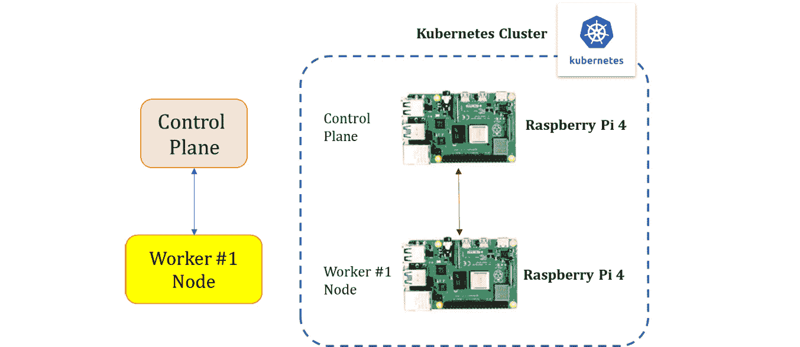
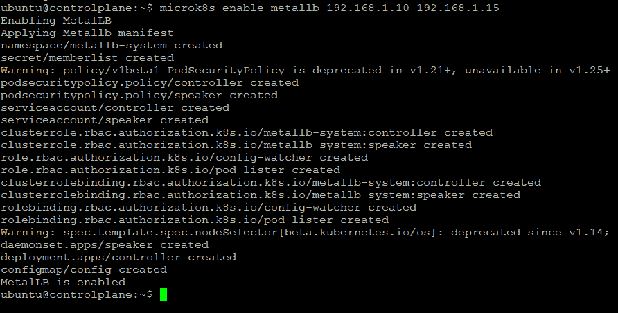
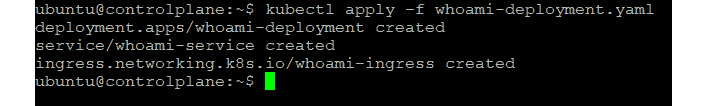

# 第七章：设置 MetalLB 和 Ingress 进行负载均衡

在上一章中，我们已经了解了 Kubernetes 网络模型是如何工作的，并学会了如何使用 Calico、Cilium 和 Flannel CNI 插件来对集群进行网络配置。我们还讨论了选择 CNI 提供商时需要考虑的一些最重要的因素。

在深入探讨 **MetalLB** 负载均衡器和 Ingress 的负载均衡概念之前，我们应该回顾一下第一章中关于 Kubernetes 服务抽象机制的内容。简单来说，Kubernetes **服务**将一组 Pod 与抽象的服务名称和 IP 地址连接起来。服务提供了 Pod 之间的发现和路由。例如，服务将一个应用程序的前端连接到其后端，这些组件都部署在不同的集群部署中。

这里列出了最常见的服务类型：

+   **ClusterIP**：这是默认类型，通过集群的内部 IP 地址暴露服务。这些服务仅在集群内部可访问。

+   `NordPort` 服务，一个 `ClusterIP` 服务会自动创建。

+   `LoadBalancer` 类型的服务将创建一个负载均衡器并将服务暴露到外部。它还会自动创建 `ClusterIP` 和 `NodePort` 服务，并相应地路由流量。

+   通过返回 **规范名称**（**CNAME**）记录的值来配置 `externalName ex.sampleapp.test.com` 字段。

最常见的服务类型如下面的图示所示：


图 7.1 – 常见的服务类型

既然我们已经覆盖了基础知识，接下来让我们深入探讨 MetalLB 和 Ingress 配置。在本章中，我们将涵盖以下主要主题：

+   MetalLB 和 Ingress 概述

+   配置 MetalLB 在集群中进行负载均衡

+   配置 Ingress 以将服务暴露到集群外部

+   选择合适的负载均衡器以服务于你的应用程序的指南

# MetalLB 和 Ingress 概述

尽管 Kubernetes 被广泛采用，但它并没有提供负载均衡器的实现。如果你的 Kubernetes 集群运行在云平台（如 Azure）上，`Pending` 状态将无限期持续。

`NodePort` 和 `externalIPs` 服务是将用户流量引入裸金属集群的唯一选项。这两种策略在输出方面都有相当大的缺陷。MetalLB 通过提供一个网络负载均衡器的实现来解决这个问题，该负载均衡器与传统的网络设备连接，从而允许裸金属集群上的外部服务。

简而言之，MetalLB 使你能够在没有云服务提供商的集群中建立 `LoadBalancer` Kubernetes 服务。地址分配和外部公告是共同作用来提供此服务的两个特点。接下来我们将详细了解这些内容，具体如下：

+   **地址分配**：MetalLB 无法自行生成 IP 地址；相反，我们必须提供 IP 地址池供其选择。当 Services 创建和删除时，MetalLB 会负责分配和取消分配个别地址，但它只会分发预设池中的 IP 地址。设置 IP 地址池的方式取决于我们的环境；例如，如果你在一个共置设施中运行裸金属集群，你的托管服务提供商可能会提供 IP 地址供租用，或者如果你在一个私有**局域网**（**LAN**）中运行，你可以选择来自某个私有地址空间的 IP 地址范围。

+   **外部公告**：在为 Service 分配外部 IP 地址后，MetalLB 必须通知集群外部网络该 IP 地址已驻留在集群中。MetalLB 使用传统的路由协议来实现这一点，如**地址解析协议**（**ARP**）、**邻居发现协议**（**NDP**）或**边界网关协议**（**BGP**）。在**第二层**（**L2**）模式下，如 ARP/NDP，集群中的一个节点会接管该 Service，并使用标准的地址发现协议（IPv4 的 ARP；IPv6 的 NDP）使这些 IP 在本地网络中可见；而在 BGP 模式下，集群中的所有节点都会与你控制的相邻路由器创建 BGP 对等会话，并告知这些路由器如何将流量转发到 Service IP。BGP 的策略机制使得在多个节点之间实现真正的负载均衡，并提供精细化的流量控制。

另一种选择是使用**Ingress**（Kubernetes 对象）来暴露你的 Service。尽管它充当集群的入口点，但 Ingress 并不是一种 Service 类型。

Ingress 的工作原理如下图所示：


图 7.2 – Ingress 的工作原理

Ingress 控制器帮助将不同应用程序的路由规则整合成一个实体。在 `NodePort` 或 `LoadBalancer` 的帮助下，Ingress 控制器暴露给外部世界。它更适合 `nginx` 或 `HAProxy` 的内部负载均衡。对于 `LoadBalancer` 类型的服务，MetalLB 在这种情况下为我们提供了帮助。

在下一节中，我们将讨论如何将 MetalLB 设置为集群的负载均衡器。

# 配置 MetalLB 以实现集群负载均衡

现在我们已经明确了 MetalLB 的概念，接下来我们将深入探讨如何配置 MetalLB 实现集群的负载均衡。下图展示了我们的 Raspberry Pi 集群设置：



图 7.3 – MicroK8s Raspberry Pi 集群

现在我们知道了我们要做什么，接下来让我们看看要求。

## 要求

在开始之前，以下是构建 Raspberry Pi Kubernetes 集群和配置 MetalLB 负载均衡器所需的先决条件：

+   一张 microSD 卡（最小容量为 **4 GB**（**GB**），推荐使用 8 GB）

+   一台带有 microSD 卡读卡器的计算机

+   一个 Raspberry Pi 2、3 或 4（一个或多个）

+   一根 micro-USB 电源线（Pi 4 使用 USB-C）

+   一个 Wi-Fi 网络或带有互联网连接的以太网电缆

+   （可选）带有 **High-Definition Multimedia Interface**（**HDMI**）接口的显示器

+   （可选）适用于 Pi 2 和 3 的 HDMI 线缆以及适用于 Pi 4 的 micro-HDMI 线缆

+   （可选）一个 **Universal Serial Bus**（**USB**）键盘

现在我们已经确定了所需的要求，接下来我们将逐步介绍如何完成此过程的说明。

## 步骤 1 – 创建 MicroK8s Raspberry Pi 集群

请按照我们在 *第五章* 中介绍的步骤，*在多节点 Raspberry Pi Kubernetes 集群上创建和实施更新*，创建 MicroK8s Raspberry Pi 集群。以下是一个快速复习：

1.  将 **操作系统**（**OS**）镜像安装到 **Secure Digital**（**SD**）卡：

    1.  配置 Wi-Fi 访问设置

    1.  配置远程访问设置

    1.  配置控制组设置

    1.  配置主机名

1.  安装和配置 MicroK8s

1.  添加工作节点

完全功能的多节点 Kubernetes 集群应如下截图所示。总结一下，我们已在 Raspberry Pi 板上安装了 MicroK8s，并加入了多个部署以形成集群。我们还向集群添加了节点：


图 7.4 – 完全功能的 MicroK8s Raspberry Pi 集群

现在我们可以进入下一步，启用 MetalLB 插件，因为我们已经拥有了一个完全功能的集群。

## 步骤 2 – 启用 MetalLB 插件

MicroK8s 支持各种插件 ([`microk8s.io/docs/addons`](https://microk8s.io/docs/addons))，这些是预打包的组件，为您的 Kubernetes 集群提供额外的功能。

使用以下命令轻松设置：

```
microk8s enable <<add-on>>
```

使用以下命令启用 MetalLB 负载均衡器：

```
microk8s enable metallb <<list of IP address>>
```

下面的命令执行输出表示 MetalLB 插件已成功启用：



图 7.5 – 启用 MetalLB 插件

我们已指示 MetalLB 使用以下命令在 `192.168.1.10` - `192.168.1.15` 范围内分配地址。要检查可用和已安装的插件列表，请使用 `status` 命令，如下所示：

```
microk8s status
```

注意

或者，您可以使用 `192.168.2.1/24` 子网，并选择为 MetalLB 分配一半的 IP 地址。IP 数字 `192.168.2.1` 到 `192.168.2.126` 组成了子网的第一部分。可以使用 /25 子网来表示这个范围：`192.168.2.1`/`25`。

一个 /25 子网也可以用来表示网络的第二部分，例如，`192.168.2.128`/`25`。每半部分有 126 个 IP 地址。

确保选择适合您网络的子网，并正确配置您的路由器和 MetalLB。

以下命令执行输出表明（请参阅高亮部分）MetalLB 插件已启用：


图 7.6 – MicroK8s 状态

对于其组件，MetalLB 使用 `metallb-system` 命名空间。要验证所有组件是否正在运行，请使用以下命令：

```
kubectl get all -n metallb-system
```

以下命令执行输出表明所有组件处于 `Running` 状态：


图 7.7 – MetalLB 组件及其状态

在前述 MetalLB 命令执行输出中看到的组件将在此进行更详细的说明：

+   `metallb-system/controller`（部署）：这是整个集群的 IP 地址分配控制器。

+   `metallb-system/speaker`（DaemonSet）：该组件使用您选择的协议与服务进行通信。

现在我们已经激活了 MetalLB 插件，下一步是启动一个示例应用程序，查看它是否能够进行负载均衡。

已启用的插件可以随时通过使用 `disable` 命令禁用，如下所示：

```
microk8s disable <<add-on>>
```

此时，您已经拥有了一个完全功能的多节点 Kubernetes 集群，并启用了 MetalLB 插件。

注意

节点之间，端口 `7946`（TCP 和 UDP）必须被允许。此外，在安装 MetalLB 之前，请确保没有其他软件在节点上的端口 `7946` 上运行。

## 第三步 – 部署示例容器化应用程序

在此步骤中，我们将会在多节点 MicroJ8s 集群设置中部署以下 Apache web 服务器，如下所示：

```
apiVersion: v1
kind: Namespace
metadata:
  name: web
---
apiVersion: apps/v1
kind: Deployment
metadata:
  name: web-server
  namespace: web
spec:
  selector:
    matchLabels:
      app: web
  template:
    metadata:
      labels:
        app: web
    spec:
      containers:
      - name: httpd
        image: httpd:2.4-alpine
        ports:
        - containerPort: 80
---
apiVersion: v1
kind: Service
metadata:
  name: web-server-service
  namespace: web
spec:
  selector:
    app: web
  ports:
    - protocol: TCP
      port: 80
      targetPort: 80
  type: LoadBalancer
```

在我们部署 web 服务器之前，先使用以下命令验证集群节点是否已准备就绪：

```
kubectl get nodes
```

以下命令执行输出显示所有节点处于 `Ready` 状态。现在我们已准备好开始：


图 7.8 – 检查节点是否处于 Ready 状态

以下命令将部署 web 服务器应用程序：

```
kubectl apply -f webserver-deploy.yaml
```

以下命令执行输出表明部署没有错误，在接下来的步骤中，我们可以使用 `get deployments` 命令验证相同内容：


图 7.9 – 部署 web 服务器

使用以下命令检查部署状态，以验证应用程序已成功部署并正在运行：

```
kubectl get deployments -n web
```

以下命令执行输出确认部署已 `Ready`：


图 7.10 – 确认部署已就绪

现在我们已准备好示例 web 服务器应用程序，接下来可以测试负载均衡机制。

## 第四步 – 验证负载均衡机制

总结一下，我们已部署了一个示例 web 服务器应用程序。接下来我们将在本部分测试负载均衡机制。

使用以下命令查看负载均衡器是否已分配外部 IP 和端口：

```
kubectl get all -n web
```

以下命令执行输出（参见高亮部分）显示外部 IP 和端口已分配：


图 7.11 – 检查是否已分配外部 IP 和端口

现在已经分配了外部 IP，我们可以使用任意节点的外部 IP 地址或外部网络访问应用程序，如下所示：

```
curl 192.168.1.10 
```

如果你已经按照前面的步骤操作，你应该能够看到 `<html><body><h1>It works!</h1></body></html>` Apache web 服务器输出，如以下命令执行输出所示：


图 7.12 – Apache web 服务器输出

让我们扩展部署，看看负载均衡器是否仍然正常工作。为此，请运行 `kubectl scale` 命令，如下所示：

```
kubectl scale deployments/web-server --replicas=5 -n web
```

以下命令执行输出确认部署没有错误，接下来的步骤中，我们可以验证部署中有五个 Pods：


图 7.13 – 扩展部署

使用以下命令检查部署状态：

```
kubectl get deployments -n web
```

以下命令输出显示命令已成功执行，且部署已更新：


图 7.14 – 检查部署状态

部署已更新后，让我们使用以下命令检查 Pods 如何在节点间分布：

```
kubectl get pods -n web -o wide
```

以下命令执行输出显示，三个 Pods 正在 `master` 节点上运行，其中两个在 `worker1` 上运行：


图 7.15 – Pods 如何在节点间分布

让我们使用以下命令检查外部 IP 和端口是否有任何变化：

```
kubectl get all -n web
```

以下命令执行输出显示分配的外部 IP 和端口没有变化：


图 7.16 – 重新检查外部 IP 和端口是否有变化

让我们使用相同的`curl`命令访问应用程序并验证其是否正常工作，如下所示：


图 7.17 – Apache web 服务器输出

命令执行输出确认负载均衡器正常工作。即使 Pods 分布在各个节点上，我们的 web 服务器应用程序仍然能够有效地处理用户请求。

下图展示了 MetalLB 的负载均衡功能。MetalLB 实现了`LoadBalancer` Kubernetes 服务。当外部请求`LoadBalancer`服务时，MetalLB 会从预设范围内为客户端分配一个 IP 地址，并通知网络该 IP 地址在集群内：


图 7.18 – MetalLB 负载均衡功能

默认情况下，MetalLB 在 MicroK8s 中配置为 L2 模式。可以使用以下命令确认这一点：

```
kubectl describe configmap config -n metallb-system
```

以下命令执行输出确认了 MetalLB 处于 L2 模式，并且我们还可以看到 IP 范围：


图 7.19 – MetalLB ConfigMap

要将 MetalLB 设置为 BGP 模式，需要重新配置`ConfigMap config`，将操作模式设置为`BGP`并配置外部 IP 地址范围。

在 BGP 模式下，speakers 会与集群外的路由器建立 BGP 对等连接，并指示这些路由器如何将流量重定向到服务 IP。BGP 的策略机制使得跨多个节点实现真正的负载均衡，并且能够进行精细化的流量控制。

你可以使用普通的路由器硬件配合 BGP 作为负载均衡方法。然而，它确实存在一些缺点。有关这些限制的更多信息，以及如何克服它们的方法，可以在 MetalLB BGP 文档页面找到（[`metallb.universe.tf/configuration/#bgp-configuration`](https://metallb.universe.tf/configuration/#bgp-configuration)）。

总结来说，MetalLB 使你能够在无需将集群部署在云平台上的情况下，建立 Kubernetes `LoadBalancer`服务。MetalLB 提供两种操作模式：一种是无需外部硬件或配置的基本 L2 模式，另一种是更为强大且适合生产环境的 BGP 模式，但需要更多的网络设置任务。在下一节中，我们将介绍如何使用`Ingress`方法进行负载均衡配置。

# 配置 Ingress 以将服务暴露到集群外部

正如我们在*MetalLB 和 Ingress 概述*部分中讨论的那样，Ingress 提供了从集群外部到集群内服务的 HTTP 和 HTTPS 路由。Ingress 上定义的规则控制流量的路由。NGINX Ingress Controller 是常见的 Kubernetes Ingress，也是 MicroK8s 的默认 Ingress 控制器。

另一种选择是使用负载均衡器，如 MetalLB，它可以部署在同一个 Kubernetes 集群中，然后服务可以暴露到外部网络。

下面是两种方法的图示：


图 7.20 – Ingress 负载均衡功能

以下选项将在后续部分中更详细地讨论。

## 选项 1 – 使用 Ingress NodePort 方法

对于这一选项和下一个选项，我们将使用为 MetalLB 配置建立的相同 MicroK8s Raspberry Pi 集群。

### 第 1 步 – 启用 Ingress 插件

可以使用与启用 MetalLB 时相同的命令启用 Ingress 插件，如此处所示：

```
microk8s enable ingress
```

以下命令执行输出表示 Ingress 插件已成功启用：


图 7.21 – 启用 Ingress 插件

现在 Ingress 插件已经启用，下一步是部署一个示例应用程序来测试负载均衡功能。

### 第 2 步 – 部署示例容器化应用程序

我们将在我们的多节点 MicroK8s 集群上应用以下 `whoami` 部署，这是一个 Tiny Go Web 服务器，能够输出操作系统信息和 HTTP 请求：

```
apiVersion: apps/v1
kind: Deployment
metadata:
  name: whoami-deployment
spec:
  replicas: 1
  selector:
    matchLabels:
      app: whoami
  template:
    metadata:
      labels:
        app: whoami
    spec:
      containers:
      - name: whoami-container
        image: containous/whoami
---
apiVersion: v1
kind: Service
metadata:
  name: whoami-service
spec:
  ports:
  - name: http
    targetPort: 80
    port: 80
  selector:
    app: whoami
---
apiVersion: networking.k8s.io/v1
kind: Ingress
metadata:
  name: whoami-ingress
spec:
  rules:
  - http:
      paths:
      - path: /whoami
        pathType: Exact
        backend:
          service:
            name: whoami-service
            port:
              number: 80
```

以下命令将部署 `whoami` 应用程序：

```
kubectl apply -f whoami-deployment.yaml
```

以下命令执行输出表示部署没有错误，在接下来的步骤中，我们可以使用 `get deployments` 命令验证这一点：



图 7.22 – 部署 whoami 应用程序

使用以下命令检查部署状态，验证应用程序是否已部署并正在运行：

```
kubectl get deployments
```

以下命令执行输出表示部署已 `Ready`：


图 7.23 – 检查部署状态

使用以下命令检查是否已创建 Ingress 对象：

```
kubectl get ingress
```

前述命令的输出表示已创建一个名为 `whoami-ingress` 的 Ingress 对象：


图 7.24 – 检查我们创建的 Ingress 对象

使用 `describe` 命令查看我们刚创建的 Ingress 对象的详细信息：


图 7.25 – 使用 Ingress 描述命令检查已创建的 Ingress 对象的详细信息

从命令执行输出来看，以下是各个字段的表示：

+   `Host`：由于在之前的输出中没有提到主机，规则适用于通过提供的 IP 地址进入的所有 HTTP 流量。如果提供了主机（例如 `foo.com`），则规则适用于该站点。

+   `Path`：由 `service.name` 和 `service.port.name` 或 `service.port.number` 描述的后端的路由列表（例如 `/whoami`）。在负载均衡器将流量分发到指定服务之前，主机和路径必须与传入请求的内容匹配。

+   `Backends`：该服务将后端描述为服务和端口名称的组合。所述后端接收与规则的主机和路径匹配的 HTTP（和 HTTPS）请求，传递给对应的 Ingress 对象。

有关 Ingress 的更多信息，请参阅 Kubernetes 的官方文档：[`kubernetes.io/docs/concepts/services-networking/ingress/`](https://kubernetes.io/docs/concepts/services-networking/ingress/)。

### 步骤 3 – 验证负载均衡器机制

使用`curl`命令检查是否能够访问应用程序，如下所示：


图 7.26 – 访问已部署的应用程序

让我们扩展部署，看看负载均衡器是否正常工作。为此，请运行`kubectl scale`命令，如下所示：

```
kubectl scale deployments/whoami-deployment --replicas=5
```

以下命令执行输出确认部署没有错误，接下来的步骤中让我们检查 Pods 如何在节点间分布：


图 7.27 – 扩展部署

以下命令执行输出表明，两个 Pods 正在 `master` 节点上运行，三个 Pods 正在 `worker1` 节点上运行：


图 7.28 – 检查 Pods 如何在节点之间分布

我们使用相同的`curl`命令访问应用程序并验证其是否正常工作，如下所示：


图 7.29 – 重新检查负载均衡器是否正常工作

命令执行输出确认负载均衡器正常工作。尽管 Pods 分布在不同节点上，我们的 `whoami` 应用程序仍然能够有效地响应用户请求。

## 选项 2 – 使用 Ingress 和负载均衡器

在此方法中，我们必须为 Kubernetes 集群配置负载均衡器才能继续。由于我们已经安装并配置了 MetalLB 负载均衡器，因此将重用它。然而，我们仍然需要为我们的示例 `whoami` 应用程序定义一个简单的负载均衡器服务，以确保它获得外部 IP 和端口。

以下是简单负载均衡器服务部署 `whoami` 应用程序的代码：

```
apiVersion: v1
kind: Service
metadata:
  name: metallb-load-balancer
spec:
  selector:
    app: whoami
  ports:
    - protocol: TCP
      port: 80
      targetPort: 80
  type: LoadBalancer
```

以下命令将部署前述应用程序：

```
kubectl apply -f loadbalancer.yaml
```

以下命令输出表明命令已成功执行，并且已创建负载均衡器。我们将在接下来的步骤中确认这一点：


图 7.30 – 创建的负载均衡器服务

使用以下命令检查是否已创建负载均衡器服务，并且外部 IP 和端口已分配。如果负载均衡器不可用，`EXTERNAL-IP` 不会获得 IP 地址，而是显示为 `<pending>`。在这种情况下，请检查负载均衡器的可用性：

```
kubectl get svc
```

以下命令输出显示已分配外部 IP 和端口：


图 7.31 – 负载均衡器已分配外部 IP 和端口

既然外部 IP 已经分配，我们可以通过任何节点或外部网络访问应用，如下所示：

```
curl 192.168.1.11/whoami 
```

以下命令输出显示命令已成功运行，且负载均衡器正常工作。尽管应用分布在各个节点上，我们的 `whoami` 应用仍然能够有效地处理用户请求：


图 7.32 – 检查负载均衡器是否正常工作

总结一下，Kubernetes 提供了几种将服务暴露到外部世界的方法。`LoadBalancer` 和 Ingress 控制器是最常见的选择。在本章中，我们通过示例探讨了这两种选项。

# 选择合适的负载均衡器的指南

现在我们已经了解了不同的选择，拥有一份备忘单来快速比较一些关键特性将会非常有帮助，帮助我们决定使用哪个选项。

在下表中，我们将介绍选择正确选项时需要考虑的一些重要参数：


表 7.1 – 如何选择合适的负载均衡器

总结一下，最终选择可以归结为几个选项。当使用 `LoadBalancer`，特别是在裸机环境下，它表现非常好，因为服务可以选择其希望使用的端口。缺点是，它可能比较昂贵，因为每个服务都需要自己的负载均衡器和外部 IP 地址，而这在云环境中都是需要付费的。Ingress 变成了最受欢迎的服务，尤其是当与 MetalLB 负载均衡器一起使用时，因为它减少了使用的 IP 数量，同时仍然允许每个服务拥有自己的名称和/或 **统一资源标识符** (**URI**) 路由。

# 总结

在本章中，我们讨论了将服务暴露到集群外部的技术，并且我们已经看到负载均衡器如何将应用暴露到外部网络。传入的请求会通过负载均衡器的单一 IP 地址路由到你的应用。MetalLB 实现了 `LoadBalancer` Kubernetes 服务。当请求 `LoadBalancer` 服务时，MetalLB 从预设的范围中为客户端分配一个 IP 地址，并通知网络该 IP 地址位于集群内。

我们还看到了 NGINX Ingress 控制器选项，这是一个常见的 Kubernetes Ingress 选项。MetalLB 可以与 Ingress 一起部署在同一个 Kubernetes 集群中，也可以用作负载均衡器。`NodePort` 是另一种将 Ingress 控制器暴露到外部世界的方式。在本章中，我们讨论了这两种选项，并提供了不同的示例。

在下一章中，我们将介绍如何使用像 Prometheus、Grafana、Elastic、Fluentd、Kibana 和 Jaeger 等工具来监控基础设施和应用程序的健康状况。你还将学习如何配置和访问各种仪表盘/指标。
