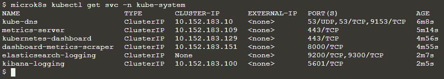

# 第八章：监控基础设施和应用程序的健康状况

在上一章中，我们探讨了如何将服务暴露到集群外部，并使用负载均衡器将应用程序暴露到外部网络。单一的`LoadBalancer` Kubernetes 服务是通过`MetalLB`实现的。当请求`LoadBalancer`服务时，`MetalLB`会从预定义的范围中分配一个 IP 地址给客户端，并通知网络该 IP 地址属于集群内。`MetalLB`可以与 Ingress 一起在同一 Kubernetes 集群中部署，也可以作为负载均衡器使用。另一种将 Ingress 控制器暴露到外部世界的方式是通过`NodePort`。这两种选项在上一章中已经详细探讨，并给出了各种示例。

在本章中，我们将探讨监控、日志记录和警报的各种选项，适用于您的基础设施和应用程序。在传统的以主机为中心的基础设施中，曾经只有两种监控层级：应用程序和运行它们的主机。随后，容器抽象技术出现了，位于主机和应用程序之间，之后 Kubernetes 用于协调这些容器。

为了全面管理基础设施，Kubernetes 本身现在也必须进行监控。因此，必须监控四个不同的组件，每个组件都有自己的一组挑战：

+   主机

+   容器

+   应用程序

+   最终，Kubernetes 集群本身

为了跟踪 Kubernetes 基础设施的健康状况，需要从所有容器和 Pod 中收集指标和事件。然而，为了完全理解客户或用户的经历，现在还需要跟踪在这些 Pod 中运行的应用程序。需要注意的是，当使用 Kubernetes 时，您通常对工作负载的运行位置几乎没有控制权，因为 Kubernetes 会自动安排它们。

在监控方面，Kubernetes 迫使你重新考虑策略。但如果你知道该关注什么，在哪里查找以及如何聚合和分析数据，你可以确保你的应用程序运行顺利，同时 Kubernetes 能有效地执行其任务。

对于从集群中聚合和报告监控数据，Kubernetes 生态系统目前提供了两个内置的附加组件，具体细节如下。

Metrics Server 从每个节点上的每个 `kubelet` 收集资源消耗统计信息，并通过 `Metrics` 返回汇总的指标；`kube-state-metrics` 插件使集群状态数据公开。与提供 Pod 和节点资源利用率指标的 Metrics Server 不同，`kube-state-metrics` 会查询控制平面 API 服务器，获取有关 Kubernetes 对象（节点、Pod、部署等）整体状态的信息，以及资源限制和分配。然后，利用这些信息生成指标，用户可以通过 Metrics API 访问。这意味着，`kube-state-metrics` 侧重于从 Kubernetes 的对象状态生成全新的指标，而 `metrics-server` 只是保存最新数据，并不负责将指标传输到第三方目的地。

在接下来的章节中，我们将详细介绍如何使用 Metrics Server 和 `kube-state-metrics` 获取指标的各种选项。MicroK8s 的优点是监控工具只需几条命令即可在一分钟内启用。它足够小，可以运行在 Raspberry Pi 上，并且可以用于开发一个可以部署到任何地方的监控堆栈，甚至是边缘环境。此外，它是使用一些最流行的开源组件构建的，这些组件在 MicroK8s 中已经预装。

在本章中，我们将探讨如何轻松地在边缘部署监控工具。这样的部署提供了隐私保护、低延迟和最小带宽成本，适用于 **物联网**（**IoT**）/边缘应用程序。在本章中，我们将讨论以下几个主要主题：

+   监控、日志记录和警报选项概述

+   使用 Prometheus、Grafana 和 Alertmanager 工具配置监控和警报堆栈

+   使用 **Elasticsearch、Fluentd 和 Kibana**（**EFK**）工具集配置监控、日志记录和警报堆栈

+   需要监控的关键指标

# 监控、日志记录和警报选项概述

Kubernetes 有很多优点，但它也增加了很多复杂性。它能够将容器化应用分布在多个节点甚至不同的数据中心（例如云提供商），这就需要一个全面的监控解决方案，能够从多个来源收集和汇总指标。

许多免费和付费的解决方案提供 Kubernetes 集群及其托管的应用程序的实时监控，持续监控系统和应用程序健康至关重要。这里列出了一些著名的开源 Kubernetes 监控工具：

1.  `kubelets` 并通过以下 Metrics API 端点在 Kubernetes API 服务器中公开它们：


表 8.1 – 指标 API 端点

1.  **Kubernetes Dashboard**（内置）是一个为 Kubernetes 集群提供的网页**用户界面**（**UI**）插件，允许您跟踪工作负载的健康状况。通过简单的网页界面，Kubernetes Dashboard 使您能够管理集群资源并排查容器化应用程序的故障。它提供了集群范围和单个节点资源的简明概览。它还列出了所有集群的命名空间以及所有已声明的存储类。

1.  **Prometheus** 是一个开源系统，用于收集 Kubernetes 健康状况的度量数据。它在每个集群节点上部署节点出口（node exporter）Pod，并且其服务器收集来自节点、Pod 和任务的数据。最终的时间序列度量数据保存在数据库中，并且可以根据预定义条件自动生成警报。

Prometheus 具有自己的仪表板，功能有限，但通过使用其他可视化工具（如 Grafana）得到了扩展，Grafana 使用 Prometheus 数据库提供针对开发、测试和生产团队设计的高级查询、调试和报告功能。

它的设计目标是大规模监控容器中的应用程序和微服务，能够连接各种第三方数据库，并支持桥接来自其他工具的数据。它的核心由三个组件组成，如下所示：

+   所有度量数据将存储在内置的时间序列数据库中。

+   数据检索工作者负责从外部来源获取度量指标，并将其输入数据库。

+   配备简单网页界面的 web 服务器，用于配置和查询存储的数据。

下面是 Prometheus 的一些关键特性：

+   时间序列数据按度量名称和键/值对进行分类，采用多维数据模型。

+   使用 **Prometheus 查询语言**（**PromQL**），这是一种灵活的查询语言，允许我们在不依赖分布式存储的情况下利用这种维度。

+   单服务器节点是自包含的，时间序列通过 **超文本传输协议**（**HTTP**）的拉取模型进行收集。

+   另外，可以使用中介网关将时间序列推送到通过服务发现或静态配置发现的目标。

+   支持多种图表和仪表板选项。

1.  **Grafana** 是一个开源分析和度量可视化平台，包含四个仪表板：**集群**、**节点**、**Pod/容器** 和 **部署**。Kubernetes 管理员常常使用 Grafana 和 Prometheus 数据源来创建信息丰富的仪表板。

1.  **Elasticsearch、Fluentd 和 Kibana**组成了 EFK 堆栈，这是三个协同工作的工具的组合。Fluentd 是 Kubernetes 集群节点的日志收集器，它从 Pods 收集日志，并将这些日志发送到 Elasticsearch 搜索引擎，后者将数据摄取并存储在一个集中位置。EFK 堆栈的 UI 是 Kibana，它是一个 Elasticsearch 的可视化插件，允许用户可视化收集的日志和度量指标，并构建自定义仪表板。

现在我们已经看到各种监控、日志记录和告警的选择，我们将讨论如何配置它们。

# 使用 Prometheus、Grafana 和 Alertmanager 工具配置监控和告警堆栈

MicroK8s 随 Prometheus Operator 一起提供预集成的插件，处理 Kubernetes 服务的简化监控定义，以及 Prometheus 实例的部署和管理。

注意

Operators 是 Kubernetes 特定的应用程序（Pods），它们自动化配置、管理和优化其他 Kubernetes 部署。Operators 通常负责以下任务：

a. 安装 Kubernetes 集群的规格，并为您的部署提供初始设置和大小调整。

b. 实时重新加载部署和 Pod，以适应任何用户请求的参数变化（热配置重载）。

c. 根据性能数据自动进行上下扩展。

d. 应执行备份、完整性检查和其他维护任务。

启用 Prometheus 插件后，Prometheus Operator 负责安装和配置以下项目：

+   **Kubernetes-Prometheus 堆栈**：

    1.  Prometheus 服务器

    1.  Alertmanager

    1.  Grafana

    1.  主机节点出口器

    1.  `kube-state-metrics`

+   **ServiceMonitor**实体定义了度量端点的自动配置。

+   **Operator 自定义资源定义（CRDs）和 ConfigMaps**，可以用来定制和扩展服务，从而使我们的配置完全可移植和声明式。

以下 CRD 由 Prometheus Operator 管理：

+   **PrometheusDeployment**—Operator 确保与资源定义匹配的部署始终处于运行状态。

+   **ServiceMonitor**—声明性地指定如何监控一组服务。根据定义，Operator 会自动生成 Prometheus 抓取设置。

+   **PrometheusRule**—指定一个 Prometheus 规则文件，供 Prometheus 实例加载并执行 Prometheus 告警规则。

+   **AlertManager**—指定所需的 Alertmanager 部署。Operator 确保与资源定义匹配的部署始终处于运行状态。

如需了解有关 Prometheus Operator 的更多信息，请参阅以下链接：

[`github.com/prometheus-operator/prometheus-operator`](https://github.com/prometheus-operator/prometheus-operator)

以下图表显示了我们之前讨论的组件：


图 8.1 – Prometheus Operator 组件

总结一下，我们将使用以下工具来收集、汇总和可视化度量：

+   从度量端点拉取的 Kubernetes 度量。

+   使用 Prometheus Node Exporter 监控主机度量。

+   使用 Prometheus Alertmanager 进行告警。

+   Prometheus 从配置的目标（即前一节讨论的 Kubernetes 端点）以预定的时间间隔收集数据，分析规则表达式，展示结果，还能在匹配特定标准时发送告警。

+   使用 Grafana 预构建的仪表板进行可视化。

现在我们已经了解了所需工具，接下来我们将深入配置监控和告警堆栈的步骤。以下图示展示了我们的 Raspberry Pi 集群设置：


图 8.2 – Raspberry Pi 集群设置

现在我们已经知道了要做什么，接下来看看需求。

## 设置 MicroK8s Raspberry Pi 集群的要求

在开始之前，以下是构建 Raspberry Pi Kubernetes 集群的前提条件：

+   一张 microSD 卡（最低 4 **千兆字节**（**GB**）；推荐 8 GB）

+   一台带 microSD 卡驱动的计算机

+   一台 Raspberry Pi 2、3 或 4（一个或多个）

+   一条 micro-USB 电源线（Pi 4 使用 USB-C）

+   一条带有互联网连接的 Wi-Fi 网络或以太网电缆

+   （可选）带有**高清多媒体接口**（**HDMI**）接口的显示器

+   （可选）Pi 2 和 3 的 HDMI 电缆，Pi 4 的 micro-HDMI 电缆

+   （可选）一款**通用串行总线**（**USB**）键盘

现在我们已经明确了需求，接下来是一步一步的操作指导，教你如何完成整个过程。

## 第一步 – 创建一个 MicroK8s Raspberry Pi 集群

请按照我们在*第五章*《在多节点 Raspberry Pi Kubernetes 集群上创建和实施更新》一章中讲解的步骤，来创建一个 MicroK8s Raspberry Pi 集群。以下是快速回顾：

+   *步骤 1*：将**操作系统**（**OS**）镜像安装到**安全数字**（**SD**）卡上

+   *步骤 1a*：配置 Wi-Fi 访问设置

+   *步骤 1b*：配置远程访问设置

+   *步骤 1c*：配置控制组设置

+   *步骤 1d*：配置主机名

+   *步骤 2*：安装和配置 MicroK8s

+   *步骤 3*：添加工作节点

完全可用的多节点 Kubernetes 集群应该像以下截图所示。总结一下，我们已经在 Raspberry Pi 板上安装了 MicroK8s，并将多个部署加入到集群中。我们还添加了节点到集群中：


图 8.3 – 完全可用的 MicroK8s Kubernetes 集群

现在，我们可以进入下一步，部署监控工具，因为我们已经有了一个完全可用的集群。

默认情况下，MicroK8s 的所有附加组件都是关闭的。因此，必须在安装后激活 Grafana 和 Prometheus。

## 步骤 2 – 配置 Prometheus、Grafana 和 Alertmanager

在本节中，我们将启用 Prometheus 附加组件并访问 Prometheus 和 Grafana 仪表盘，以便我们可以监控 Kubernetes 集群，并在出现问题时查看警报。使用以下命令启用仪表盘和 Prometheus 附加组件：

```
microk8s enable dashboard prometheus
```

以下命令执行输出表明仪表盘和 Prometheus 附加组件已成功启用：


图 8.4 – 启用仪表盘和 Prometheus 附加组件

启用附加组件需要一些时间，但以下命令执行输出表明 Prometheus 已成功启用：


图 8.5 – 已激活的附加组件

Grafana 无法通过命令启用。当启用 Kubernetes 仪表盘时，它会自动启动。

要访问 Kubernetes 仪表盘，我们需要创建一个用户和管理员角色绑定。在接下来的步骤中，我们将为此创建一个部署：

```
apiVersion: v1
kind: ServiceAccount
metadata:
  name: admin-user
  namespace: kube-system
---
apiVersion: rbac.authorization.k8s.io/v1
kind: ClusterRoleBinding
metadata:
  name: admin-user
roleRef:
  apiGroup: rbac.authorization.k8s.io
  kind: ClusterRole
  name: cluster-admin
subjects:
- kind: ServiceAccount
  name: admin-user
  namespace: kube-system
```

创建一个名为 `dashboard-adminuser.yaml` 的文件，包含前述内容，并使用以下命令创建用户和管理员角色绑定：

```
kubectl apply -f dashboard-adminuser.yaml
```

以下命令执行输出确认部署没有错误：


图 8.6 – 创建用户和管理员角色绑定

要访问仪表盘，我们需要一个访问令牌，可以通过调用 `kubectl` 命令获取，方法如下：

```
kubectl -n kube-system describe secret $(microk8s kubectl -n kube-system get secret | grep admin-user | awk '{print $1}')
```

从命令的输出中复制令牌，并在下一步中使用它。

需要使用以下命令构建与集群的安全通道，以便访问 Kubernetes 仪表盘：

```
kubectl proxy &
```

以下命令执行输出确认已创建安全通道，我们可以在下一步中访问仪表盘：


图 8.7 – 为仪表盘创建安全通道

之后，您将能够通过以下地址访问仪表盘：

```
http://<ip address>>:8001/api/v1/namespaces/kube-system/services/https:kubernetes-dashboard:/proxy/
```

通过复制和粘贴上一步生成的令牌，您将能够访问集群的基于 Web 的 **命令行界面** (**CLI**)，如下图所示：


图 8.8 – Kubernetes 仪表盘

如前所述，仪表盘是一个可以通过网页访问的 Kubernetes UI。它可以用于将容器化应用部署到 Kubernetes 集群、进行故障排除并控制集群的资源。仪表盘可以用于多种用途，包括：

+   所有节点和持久存储卷都列在 **管理员概览** 中，并显示每个节点的汇总指标。

+   **工作负载视图**显示按命名空间分类的所有运行应用程序的列表，以及当前 Pod 的内存利用率和 Deployment 中当前就绪的 Pod 数量。

+   **发现视图**显示已公开并启用集群发现的服务列表。

+   通过使用**日志查看器**功能，可以深入查看属于单个 Pod 的容器日志。

+   对于集群中的每个应用程序和所有正在运行的 Kubernetes 资源，**存储视图**会标识持久卷声明。

启用了所有必需的附加组件后，我们将进入下一步，访问 Prometheus、Grafana 和 Alertmanager。

## 第 3 步 – 访问 Prometheus、Grafana 和 Alertmanager

在继续执行其他步骤之前，我们可以验证 Grafana、Prometheus 和 Alertmanager 是否在集群上运行。

在 Kubernetes 仪表盘中，导航到 **命名空间** 下的 **监控**，然后点击 **服务**。将显示运行在集群上的监控服务列表、集群 IP 地址、内部端点和端口，如下图所示：


图 8.9 – 验证 Grafana、Prometheus 和 Alertmanager 是否在集群上运行

从 Kubernetes 仪表盘中（如*图 8.9*所示），我们可以确保以下组件处于正常运行状态：

+   `prometheus-operator` Pod——堆栈的核心，负责管理其他部署，例如 Prometheus 服务器或 Alertmanager 服务器

+   `node-exporter` Pod——每个物理主机（本示例中为一个）

+   `kube-state-metrics` 导出器

+   `prometheus-k8s`（副本数：1）

+   `alertmanager-main`（副本数：1）

+   `grafana`（副本数：1）

然后，只需将服务 IP 和端口输入浏览器，格式为 `<IP 地址>:<端口>`，即可访问 Grafana 和 Prometheus 的 UI。Grafana 的登录用户名和密码为 `admin/admin`。

默认情况下，Grafana 使用端口 `3000`，因此，请在网页浏览器中导航到 `http://localhost:3000`，你将能够访问 Grafana 界面，其中已经填充了一些有趣的仪表板，如下所示：


图 8.10 – Grafana 预构建仪表板

Grafana 自带预安装的 Prometheus 作为数据源，如下图所示：


图 8.11 – Grafana/Prometheus 数据源

同样，Prometheus UI 也可以访问。无需用户名或密码。默认情况下，Prometheus 使用端口 `9090`，并公开其内部指标和性能。Node Exporter Prometheus 进程运行在端口 `9100` 上。它公开有关节点的详细信息，包括存储空间，路径为`http://<IP 地址:9090/metrics`。你可以在此查看 Prometheus UI 概述：


图 8.12 – Prometheus UI

Prometheus 将根据预定义的配置抓取和存储数据。请访问仪表盘查看 Prometheus 是否获取了此端点在节点上暴露的时间序列信息。

要查看此服务器收集的度量指标列表，请使用下拉菜单，`node_`旁边的指标可在列表中找到。以`cpu metric`节点为例，它显示了节点的 CPU 利用率，如下截图所示：


图 8.13 – Prometheus 度量指标可视化

ServiceMonitor 会自动检测并注册 Prometheus 配置中的每个目标，如此处所示：


图 8.14 – Prometheus 抓取目标

在 Prometheus 服务器界面中，**告警**标签页显示已创建的告警，如下截图所示：


图 8.15 – Prometheus Alertmanager

请参考 Prometheus 社区的 GitHub 仓库，查看预定义的告警规则，链接如下：

[`github.com/prometheus-community/helm-charts/tree/main/charts/kube-prometheus-stack/templates/prometheus/rules-1.14`](https://github.com/prometheus-community/helm-charts/tree/main/charts/kube-prometheus-stack/templates/prometheus/rules-1.14)

总结来说，我们了解了如何通过 Prometheus 插件快速部署 Kubernetes 监控和告警堆栈，同时，这个堆栈也很容易根据需求进行扩展、修改或迁移到新的服务器集群。

生产环境部署时需要注意以下事项：

+   **长期存储**——Prometheus 数据库默认存储过去 15 天的度量指标。Prometheus 不提供长期存储功能。没有备份、数据冗余、趋势分析、数据挖掘等选项。

+   **授权和认证**——Prometheus 及其组件不提供服务器端的认证、授权或加密功能。

+   不支持垂直/水平可扩展性。

我们已经了解了如何使用 Prometheus 插件启用 Kubernetes 监控和告警，接下来，我们将探讨如何使用 EFK 工具集配置日志记录、监控和告警堆栈。

# 使用 EFK 工具集配置日志记录、监控和告警堆栈

在需要分析由多个服务和应用程序在 Kubernetes 集群中运行的 Pods 收集的大量日志数据时，集中式集群级别的日志堆栈可能非常有用。EFK 是最流行的集中式日志解决方案。Elasticsearch 是一个实时搜索引擎，支持全文和结构化搜索，以及分析功能，且是分布式和可扩展的。它最常用于索引和搜索大量的日志数据。Elasticsearch 通常与 Kibana 一起使用，后者是一个强大的数据可视化前端和 Elasticsearch 的仪表盘。Kibana 是一个基于 Web 的工具，可以通过查看 Elasticsearch 日志数据、创建仪表盘和查询来快速查询并深入了解 Kubernetes 应用程序。为了收集、转换并将日志数据传输到 Elasticsearch 后端，我们将使用 Fluentd，这是一个流行的开源数据收集器，它可以跟踪容器日志文件、过滤和更改数据，并将其传输到 Elasticsearch 集群进行索引和存储。下图展示了我们希望通过 EFK 工具集实现的目标：


图 8.16 – 集中式日志解决方案：EFK 工具集

由于 EFK 不支持 `arm64` 架构，我将在本节使用 Ubuntu **虚拟机**（**VM**）。设置 MicroK8s 集群的步骤与 *第五章**，创建和实施多节点树莓派 Kubernetes 集群更新* 中的指示相同。

现在我们已经清楚了要实现的目标，接下来将详细介绍步骤。

## 步骤 1 – 启用 Fluentd 插件

我们将在本节启用 Fluentd 插件，它允许 EFK 工具集收集日志数据，传递给 Elasticsearch 进行索引，然后通过 Kibana 仪表盘查看聚合日志。使用以下命令启用 Fluentd 插件：

```
microk8s enable fluent
```

启用此插件后，Elasticsearch、Fluentd 和 Kibana（EFK 堆栈）将会添加到 MicroK8s 中。

以下命令执行输出确认已启用 EFK 插件：


图 8.17 – 启用 Fluentd 插件

在进入下一步之前，让我们确认插件是否已激活。

为此，请使用 `microk8s status` 命令。以下命令执行输出表示 Fluentd 插件已启用：


图 8.18 – 验证插件是否已激活

所有 EFK 服务均已激活，如下列命令输出所示：



图 8.19 – 验证 EFK Pods 是否正在运行

现在我们已经启动了 EFK 的所有服务。要访问 Kibana 仪表板，我们需要构建一个安全通道（就像我们为 Kubernetes 仪表板做的那样）到集群，使用下列命令：

```
microk8s kubectl port-forward -n kube-system service/kibana-logging 8181:5601
```

以下命令执行输出确认端口转发成功：


图 8.20 – 为 Kibana 仪表板创建安全通道

Kibana 仪表板现在应该可以通过以下地址访问：

```
http://<IP address>:8001/api/v1/namespaces/kube-system/services/kibana-logging/proxy/app/kibana
```

总结一下，我们现在已经拥有一个完全功能性的 EFK 堆栈，可以进行配置。下一步是开始在 Kibana 仪表板中定义索引模式。

## 第 2 步 – 定义索引模式

我们将分析 EFK 容器是否能自行启动日志。为此，我们需要建立一个索引模式。具有相似特征的文档集合称为一个索引。索引会被赋予一个名称，在执行索引、搜索、更新和删除其包含的文档时使用该名称来引用它。

启动 Kibana 仪表板，你应该看到 Kibana 欢迎页面，如下图所示：


图 8.21 – Kibana 欢迎页面

单击`logstash-*`，如下面的截图所示：


图 8.22 – 创建索引模式

Kibana 将请求一个带时间戳的字段，以便它可以用来可视化时间序列数据。对我们来说，这是`@timestamp`字段，如下图所示：


图 8.23 – 创建带时间戳字段的索引模式

单击**创建索引模式**，现在只需几分钟，既然我们已经构建了索引模式。你可以在这里看到输出：


图 8.24 – 索引模式创建

从左侧下拉菜单中选择**发现**选项，你应该看到容器日志事件，如下图所示：


图 8.25 – 使用索引模式发现数据

下一步是过滤并查看容器启动日志事件，现在我们已经创建了索引模式并整理了数据。

## 第 3 步 – 过滤并查看数据

左侧将列出所有日志事件，并提供可用于过滤的字段，如下图所示。你可以创建新的过滤器，或者使用**Kibana 查询语言**（**KQL**）中的`kubernetes.podname`参数来过滤事件：


图 8.26 – 为特定 Pod 过滤日志事件

日志列表现在已过滤，只显示来自特定 Pod 的日志事件。你可以查看任何事件或过滤以查看更多信息。

启用 Fluent Bit 日志处理器后，它将读取、解析并过滤 Kubernetes 集群中每个 Pod 的日志，为每条日志条目添加以下数据：

+   Pod 名称

+   Pod **标识符** (**ID**)

+   容器名称

+   容器 ID

+   标签

+   注释

一旦所有事件被索引，Kibana 的告警配置可以用来创建规则，检测失败场景，并在满足这些条件时执行操作。

有关告警的更多细节，请参见这里：

[`www.elastic.co/guide/en/kibana/current/alerting-getting-started.xhtml`](https://www.elastic.co/guide/en/kibana/current/alerting-getting-started.xhtml)

`Fluentd` 有一个更轻量的版本，Fluent Bit，这是同一团队为资源有限的情况而创建的。从功能上讲，`Fluentd` 是一个日志聚合器，而 Fluent Bit 只是一个转发器。`Fluentd` 提供了一个更强大的生态系统，而 Fluent Bit 更常见于物联网设备中。

有关 Fluent Bit 的更多细节，请参见这里：

[`fluentbit.io/`](https://fluentbit.io/)

恭喜！通过使用 EFK 栈，我们已经学会了如何聚合所有 Kubernetes 容器日志并集中分析它们。

总结一下，我们查看了一些最流行的监控、日志记录和告警栈选项。下一步是确定哪些关键指标需要被监控，以便有效管理你的基础设施和应用程序。

# 需要监控的关键指标

容器在企业组织中的快速普及为开发人员带来了许多好处。然而，Kubernetes 在部署容器化应用程序时提供的灵活性和可扩展性，也带来了新的复杂性。跟踪由容器抽象出来的应用程序的健康状况，然后再由 Kubernetes 抽象出来，可能没有合适的工具就会变得非常困难，因为应用程序和其运行的服务器之间不再是一对一的关系。

容器化应用程序可以分布在多个环境中，而 Kubernetes 是一个复杂的环境。监控工具应该具备从分布式环境中收集指标的能力，并处理容器化资源的瞬态特性。监控工具依赖服务作为其端点，因为 Pods 和它们的容器处于不断移动和动态调度状态。服务广播一个可以从 Pods 外部访问的 IP 地址，允许服务在 Pods 和容器创建和移除时实时通信。

在 Kubernetes 中，有两个级别的监控，如下所述：

+   **集群监控**—监控整个 Kubernetes 集群的健康状态。帮助检查节点是否是最新并且正在运行，每个节点上运行了多少个应用程序，以及集群整体如何使用资源。

+   **Pod 监控**—跟踪影响单个 Pod 的问题，包括 Pod 的资源使用情况、应用程序度量以及与复制或自动扩展相关的度量。

正如我们在前面章节中讨论的，基于 Kubernetes 的架构已经提供了分析和监控应用程序的框架。即使执行这些应用程序的容器不断在主机之间移动或上下扩展，您仍然可以通过适当的监控解决方案，结合 Kubernetes 内置的抽象，全面了解应用程序的健康状况和性能。

接下来，我们将查看一些应该监控的关键度量。以下列出了这些度量。

**集群级别**—以下集群状态度量可以为您提供集群当前状态的概览。它们能够揭示节点或 Pods 的问题，提醒您可能存在瓶颈或需要扩展集群的风险：


表 8.2 – 集群状态度量

**节点级别**—以下措施为您提供节点健康状况的概览，并帮助判断调度程序是否可以在该节点上调度 Pods。当您将资源利用率与资源请求和限制进行比较时，您可以更好地了解集群是否有足够的资源来处理工作负载并容纳新的工作负载。维护并跟踪集群各个级别的资源利用率，尤其是节点及其上运行的 Pods，非常关键：


表 8.3 – 节点级别度量

**Pod 级别**—尽管一个 Pod 可能正在运行，但如果它不可访问，意味着它还不能接收流量。在某些情况下，这是正常现象，例如当 Pod 刚启动时，或者当 Pod 的规格发生变化并进行部署时。然而，如果您注意到不可用的 Pods 数量激增，或者 Pods 一直不可用，这可能意味着存在配置问题。跟踪以下度量，以评估 Pods 的健康状况：


表 8.4 – Pod 级别度量

**容器级别**—以下是一些应跟踪的容器度量，用于评估容器健康状况：


表 8.5 – 容器度量

**存储**—卷在 Kubernetes 存储架构中作为关键的抽象层存在。容器可以通过称为卷声明的机制动态请求存储资源，且卷可以是持久的或非持久的，具体详情如下：


表 8.6 – 存储度量

**控制平面**—集群中的工作节点和 Pods 由控制平面管理。以下是需要监控的控制平面组件：

+   **etcd**—存储集群中每个节点可以使用的配置信息

+   **API 服务器**——验证并配置如 Pods、服务、复制控制器等 API 对象的数据。

+   **调度器**——管理工作负载的使用和 Pod 分配到可用节点的任务。

+   **控制器管理器**——一个守护进程，负责收集并将数据发送到 API 服务器。

你可以在这里查看更多关于这些组件的详细信息：


表 8.7 – 控制平面指标

## Kubernetes 事件

Kubernetes 事件是 Kubernetes 中的一种资源类型，当其他资源的状态变化、发生错误或需要向系统广播其他消息时，事件会自动创建。以下是需要监控的各种事件类型：

1.  **失败事件**——容器经常被创建，但操作经常会失败；因此，Kubernetes 无法成功创建该容器。失败的事件通常与镜像拉取错误相关。这些失败可能是由于拼写错误、权限不足或上游构建失败造成的。此外，节点本身也可能会失败。当这些失败发生时，应用程序应回退到功能正常的剩余节点，但需要某种警报系统来确定故障原因。因为失败是一个决定性问题——即你的容器在问题解决之前无法运行——你应该特别关注此事件类型。

1.  **驱逐事件**——某些 Pods 相较于其运行时可能消耗过多的计算和内存资源。Kubernetes 通过驱逐这些 Pods，并将磁盘、内存或 CPU 空间重新分配到其他地方来解决这个问题。

1.  **存储特定事件**——Pod 内的存储通常被应用程序和工作负载使用。各个提供商提供的卷存储着应用运行时所需的重要内容。Pod 在创建时会挂载这些卷，为成功运行铺平道路。这些事件可以在存储卷出现异常行为时发出警报。此外，节点的健康状况可能不足以挂载卷，这些错误可能让 Pod 看起来像是刚刚启动。但发现这些事件可以帮助你解决由错误的卷挂载导致的潜在问题。

1.  `FailedScheduling` 事件发生在 Kubernetes 调度器无法找到合适的节点时。

1.  `NodeNotReady` 事件表示某个节点尚未准备好进行 Pod 调度。

以下是需要监控的 Kubernetes 事件、指标和警报标准：


表 8.8 – Kubernetes 事件指标

# 总结

总结一下，我们已经覆盖了关键的 Kubernetes 组件，以及可以帮助你跟踪它们健康状况和性能的指标和事件。我们还讨论了如何使用 Kubernetes 内置的 API 和工具收集所有指标，从而让你能够全面了解容器基础设施和工作负载的状态。

我们已经研究了 Prometheus、Grafana 和 Alertmanager 作为设置监控和告警堆栈的工具。我们还介绍了如何使用 EFK 工具集设置集中式的集群级别日志记录堆栈，该工具集能够处理大量日志数据。最后，我们回顾了应该监视的关键指标，以便成功管理基础设施和应用程序。

下一章，我们将探讨如何使用 Kubeflow MLOps 平台开发和部署机器学习模型。Kubeflow 和 MicroK8s 提供可靠高效的操作以及基础设施优化。

使用 Prometheus、Grafana 和 Alertmanager 工具配置监控和告警堆栈

使用 Prometheus、Grafana 和 Alertmanager 工具配置监控和告警堆栈

使用 Prometheus、Grafana 和 Alertmanager 工具配置监控和告警堆栈

使用 Prometheus、Grafana 和 Alertmanager 工具配置监控和告警堆栈

使用 Prometheus、Grafana 和 Alertmanager 工具配置监控和告警堆栈

使用 Prometheus、Grafana 和 Alertmanager 工具配置监控和告警堆栈

使用 Prometheus、Grafana 和 Alertmanager 工具配置监控和告警堆栈
