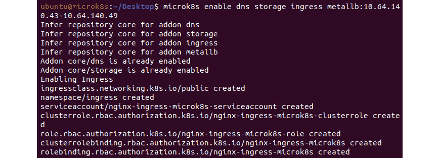

# 第九章：使用 Kubeflow 运行 AI/MLOps 工作负载

在上一章中，我们讨论了几种日志记录、监控和警报选项，以便全面了解我们的容器基础设施和工作负载。关于设置监控和警报堆栈的工具，我们介绍了 Prometheus、Grafana 和 Alert Manager。我们还讨论了如何使用 EFK 工具集设置一个集中式的集群级日志堆栈，以处理大量的日志数据。最后，我们探讨了应密切关注的关键指标，以便有效管理你的基础设施和应用程序。

在本章中，我们将介绍使用 Kubeflow MLOps 平台创建 **机器学习** (**ML**) 流水线的步骤，该流水线将构建并部署一个示例 ML 模型。ML 是人工智能（AI）领域的一个子领域。ML 的目的是教会计算机从你提供的数据中学习。机器并不通过描述行为来进行操作，而是根据预期行为的样本来调整其算法。训练好的模型是算法与学习到的参数结合后所生成的代码。

以下是典型 ML 工作流中各个阶段的高级概览：

1.  获取并准备相关数据

1.  开发 ML 模型

1.  训练模型、评估模型精度，并调整模型

1.  部署训练好的模型

1.  从模型中获取预测结果

1.  监控正在进行的预测

1.  管理模型及其版本

这些是迭代阶段。在整个过程中，你可能需要重新思考并返回到之前的阶段。

ML 流水线有助于自动化 ML 工作流，并允许将序列数据转换并相关联，以便在模型中进行评估。它还允许生成输出。ML 流水线旨在将数据从原始数据格式转换为有意义的信息。它提供了一种构建多 ML 并行流水线系统的方法，用于调查各种 ML 算法的输出。流水线中有多个阶段。每个阶段接收来自前一阶段处理的数据 —— 例如，处理单元的输出会输入到下一阶段。

Kubeflow 是一个供数据科学家构建和实验 ML 流水线的平台。它允许你部署和构建 ML 工作流。你可以使用 Kubeflow 配置来指定工作流所需的 ML 工具。然后，可以将工作流部署到云端、本地及本地部署的多个平台进行测试和生产使用。

数据科学家和 ML 工程师使用 Kubeflow 在 MicroK8s 上快速原型开发、构建和部署 ML 流水线。Kubeflow 通过弥合 AI 工作负载与 Kubernetes 之间的差距，使 MLOps 更加可管理。

此外，Kubeflow 在 MicroK8s 上的设置和配置非常简便，并且轻量级，能够模拟生产环境以进行流水线的创建、迁移和部署。

在本章中，我们将涵盖以下主要内容：

+   机器学习工作流概览

+   部署 Kubeflow

+   访问 Kubeflow 仪表板

+   创建一个 Kubeflow 管道来构建、训练和部署一个示例机器学习模型

+   推荐 — 在 Kubernetes 上运行 AL/ML 工作负载

# 机器学习工作流概览

Kubeflow 旨在成为您的 Kubernetes 机器学习工具包。您可以使用 Kubeflow 配置来指定工作流所需的机器学习工具，然后将工作流部署到各种平台进行测试和生产使用。

在深入了解机器学习工作流的复杂性之前，让我们先来看看 Kubeflow 的各个组件。

## 介绍 — Kubeflow 及其组件

Kubeflow 是一个基于 Kubernetes 部署、扩展和管理复杂系统的系统。对于数据科学家来说，Kubeflow 是构建和测试机器学习管道的首选平台。它也适用于希望在不同环境中部署机器学习系统的机器学习开发人员和运维团队，涵盖开发、测试和生产等各个环节。

Kubeflow 是一个框架，用于在 Kubernetes 之上构建机器学习系统的各个组件，如下图所示：


图 9.1 — Kubeflow 组件在 Kubernetes 之上的布局

我们可以通过利用 Kubeflow 配置接口来指定工作流所需的机器学习工具。然后，工作流可以部署到多个云平台、本地和内部平台进行测试和生产使用。

以下机器学习工具由 Kubeflow 支持：

+   **Chainer**：基于 Python 的深度学习框架。

+   **Jupyter**：一个互动式开发环境，适用于笔记本、代码和数据，可以通过网页访问。用户可以通过其多功能的界面在数据科学、科学计算、计算新闻学和机器学习中创建和安排工作流。

+   **MPI**：这是一个标准化且可移植的消息传递标准，可用于并行计算平台。

+   **MXNet**：这是一个开源深度学习软件框架，用于训练和部署深度神经网络。

+   **PyTorch**：这是一个基于 Torch 库的开源机器学习框架，广泛应用于计算机视觉和自然语言处理等领域。

+   **Scikit-learn**：这是一个 Python 机器学习库，支持支持向量机、随机森林、梯度提升、k-means 和 DBSCAN 等分类、回归和聚类技术，并且设计上与 Python 的数值计算和科学计算库 NumPy 和 SciPy 兼容。

+   **TensorFlow**：这是一个开源的机器学习和人工智能软件库，适用于各种应用，特别是深度神经网络的训练和推理。

+   **XGBoost**：这是一个开源软件库，提供了一个正则化的梯度提升框架，支持 C++、Java、Python、R、Julia、Perl 和 Scala 等语言。

以下是构成 Kubeflow 的逻辑组件：

+   **Dashboard** 允许你快速访问集群中安装的 Kubeflow 组件。

+   **Kubeflow Notebooks** 允许你通过将其封装在 pods 中，在 Kubernetes 集群内运行基于 Web 的开发环境。

+   **Kubeflow Pipelines** 是一个基于 Docker 的平台，用于创建和部署可移植、可扩展的机器学习工作流。

+   **KServing** 提供高性能、高抽象接口，用于使用标准机器学习框架（如 TensorFlow、XGBoost、scikit-learn、PyTorch 和 ONNX）为生产模型提供服务，解决生产模型服务的应用场景。

+   **TensorFlow Serving** 负责为 TensorFlow 模型提供服务功能。

+   **PyTorch Serving** 负责与 Seldon 一起为 PyTorch 模型提供服务功能。

+   **Seldon** 在 Kubernetes 上管理、提供和扩展任何语言或框架的模型。

+   **Katib** 是一个可扩展且灵活的超参数调优框架，紧密集成了 Kubernetes。

+   **训练操作符** 通过操作符训练机器学习模型。

+   **Istio 集成**（针对 TF Serving）提供了诸如指标、身份验证和配额、发布和 A/B 测试等功能。

+   **Argo workflows** 是一个工作流引擎，Kubeflow Pipelines 使用它来执行各种操作，如监控 pod 日志、收集工件、管理容器生命周期等。

+   **Prometheus** 负责 Kubeflow 指标和 Kubernetes 组件的日志记录和监控。

+   **多租户** 是自服务的 – 新用户可以通过 UI 自行注册来创建和拥有他们的工作区。当前是围绕 *用户命名空间* 构建的。

现在我们已经了解了各种 Kubeflow 组件和机器学习工具，让我们深入理解机器学习工作流的具体内容。

## 机器学习工作流简介

机器学习工作流通常包含多个阶段，在开发和部署机器学习系统时，这是一个迭代过程。为了确保模型继续生成所需的结果，必须审查机器学习工作流各个阶段的输出，并根据需要调整模型和参数。

下图展示了实验阶段工作流的各个阶段顺序：


图 9.2 – 实验阶段工作流

在实验阶段，模型会基于初始假设构建，并通过迭代测试和更新，以实现预期的结果：

1.  确定需要由机器学习系统解决的问题。

1.  收集并分析训练机器学习模型所需的数据。

1.  选择一个机器学习框架和算法，然后编写模型的第一个版本。

1.  实验数据和模型的训练。

1.  调整模型的超参数。

下图展示了生产阶段工作流的各个阶段顺序：


图 9.3 – 生产阶段工作流

在生产阶段，将部署一个处理以下任务的系统：

+   将数据转化为训练系统所需的格式。为了确保模型在训练和预测过程中表现一致，实验阶段和生产阶段的转化过程必须相同。

+   开发 ML 模型。

+   为在线预测或批处理提供模型服务。

+   监控模型的性能，并将结果反馈到模型中，以进行调优或重新训练过程。

现在我们知道了实验和生产阶段的各项活动，接下来看看每个阶段涉及的 Kubeflow 组件。

## 每个阶段的 Kubeflow 组件

以下图表展示了实验阶段工作流的各个步骤以及每个阶段涉及的 Kubeflow 组件：


图 9.4 – 实验阶段步骤和 Kubeflow 组件

以下图表展示了生产阶段工作流的各个步骤以及每个阶段涉及的 Kubeflow 组件：


图 9.5 – 生产阶段步骤和 Kubeflow 组件

Kubeflow 中一些最重要的组件如下：

+   可以使用 Kubeflow 的服务创建和管理 Jupyter 笔记本。笔记本用于交互式数据科学和 ML 工作流实验。

+   Kubeflow Pipelines 是一个基于容器的平台，用于创建、部署和管理基于 Docker 容器的多步骤 ML 过程。

+   Kubeflow 拥有多个组件，可用于 ML 训练、超参数调整以及跨多个平台的工作负载服务。

现在我们已经看过了涉及 ML 过程各个阶段的 Kubeflow 组件和步骤，接下来让我们来看一下 Kubeflow Pipelines。

## Kubeflow Pipelines

Kubeflow Pipelines 是 Kubeflow 中最重要的元素之一，使 AI/ML 实验具有可重现性、可组合性、可扩展性，并且易于共享。每个管道组件，表示为一个块，都是一个自包含的代码片段，打包为 Docker 镜像。它具有输入（参数）和输出，并完成管道中的一个阶段。

最后，当管道运行时，每个容器将根据 Kubernetes 调度在集群中执行，同时考虑依赖关系。这种容器化架构使得在工作流发生变化时，轻松重用、共享和替换组件，符合常见的需求。

运行管道后，结果可以在 Kubeflow 仪表板上的管道 UI 中查看。在这里，您可以调试和调整参数，并创建更多的“运行”。

总结一下，Kubeflow 是为 Kubernetes 提供的 ML 工具包，提供以下功能：

+   为希望构建和实验 ML 管道的数据科学家提供的平台

+   为希望将 ML 系统部署到各种环境中进行开发、测试和生产级服务的 ML 工程师和运维团队提供的平台。

+   用于创建和管理 Jupyter notebook 的服务，支持交互式数据科学和 ML 工作流的实验。

+   一个基于 Docker 容器的平台，用于构建、部署和管理多步骤的机器学习工作流。

+   一些组件，可用于跨多个平台构建你的 ML 训练、超参数调优和服务工作负载。

在下一部分中，我们将回顾部署 Kubeflow 的步骤。

# 部署 Kubeflow。

从 MicroK8s 版本 1.22 开始，Kubeflow 不再作为附加组件提供；相反，Ubuntu 发布了 Charmed Kubeflow ([`charmed-kubeflow.io/`](https://charmed-kubeflow.io/))，这是一整套 Kubernetes 操作器，用于提供构成最新版本 Kubeflow 的 30 多个应用和服务，便于在任何地方进行简单操作，从桌面到本地、公共云和边缘设备。

Kubeflow 作为 charm 提供，这是一个包含 Kubernetes 操作器的软件包，此外还包含允许你将多个操作器集成到统一系统中的信息。这项技术利用了 Juju **操作生命周期管理器**（**OLM**）来提供从第 0 天到第 2 天的 Kubeflow 操作。

为了概述 Juju，它是一个用于云软件操作的开源建模工具。它使你能够快速高效地在公共云、物理服务器、OpenStack 和容器上部署、设置、管理、维护和扩展云应用。更多细节请参阅 [`ubuntu.com/blog/what-is-juju-introduction-video`](https://ubuntu.com/blog/what-is-juju-introduction-video)。

Juju 提供了部署的 Kubernetes 操作器的集中视图，包括它们的配置、可扩展性和状态，以及连接它们的集成线。它跟踪每个操作器的潜在升级和更新，并协调它们之间事件和通信的流动。

Charmed Kubeflow 提供两种套件：

+   **Full** ([`charmhub.io/kubeflow`](https://charmhub.io/kubeflow)): 包含所有 Kubeflow 服务。需要至少 14 GB 内存和 60 GB 存储空间。

+   **Lite** ([`charmhub.io/kubeflow-lite`](https://charmhub.io/kubeflow-lite)): 移除了完整套件中较少使用的服务，同时保持了用户友好的仪表盘。此套件专为资源有限的环境设计。

现在我们对 Charmed Kubeflow 有了更好的了解，让我们来回顾一下 Kubeflow 的部署过程。

## 我们想要实现的目标。

我们希望在这一部分中做以下事情：

1.  安装并配置 Microk8s。

1.  安装 Juju 操作生命周期管理器。

1.  部署 Kubeflow。

现在我们知道了要做的事情，让我们看看设置 Kubeflow 平台的前提条件：

+   一台运行 Ubuntu 20.04（focal）或更高版本的虚拟机。

+   至少需要 16 GB 的空闲内存和 20 GB 的磁盘空间

+   访问互联网以下载所需的 snaps 和 charms

既然我们已经确定了前提条件，让我们学习如何设置 Kubeflow 平台。

## 第 1 步 – 安装和配置 MicroK8s

以下步骤与我们在*第五章*中跟随的步骤类似，*创建并实施多节点 Raspberry Pi Kubernetes 集群的更新*，用于创建 MicroK8s 集群。

我们将设置 snap 来安装 Kubernetes 的 1.21 版本，因为 Kubeflow 目前不支持更新的 1.22 版本。

使用以下命令安装 MicroK8s：

```
sudo snap install microk8s --classic --channel=1.21/stable
```

以下输出表明 MicroK8s 已成功安装：


图 9.6 – MicroK8s 安装

正如我们之前看到的，MicroK8s 创建了一个名为 `microk8s` 的组，这样就可以在不使用 `sudo` 执行每个命令的情况下工作。我们将把当前用户添加到该组，以便更轻松地运行命令：

```
sudo usermod -a -G microk8s $USER
newgrp microk8s
```

确保能够正确访问 kubectl 配置文件：

```
sudo chown -f -R $USER ~/.kube
```

一旦 MicroK8s 安装完成，它将开始启动。Kubernetes 集群现在完全运行，如下图所示：


图 9.7 – MicroK8s 完全运行中

在安装 Kubeflow 之前，让我们先启用一些插件。我们将设置 DNS 服务，以便应用程序能够发现彼此，还包括存储、用于访问 Kubeflow 组件的入口控制器，以及 MetalLB 负载均衡器应用程序。所有这些都可以通过以下命令同时启用：

```
microk8s enable dns storage ingress metallb:10.64.140.43-10.64.140.49
```

通过此命令，我们已经指示 MetalLB 在 `10.64.140.43 - 10.64.140.49` 范围内分配地址。

以下输出显示插件正在启用：



图 9.8 – 插件成功启用

MicroK8s 可能需要几分钟时间来安装和配置这些额外的功能。在继续之前，我们应该再次检查插件是否已正确启用，以及 MicroK8s 是否已准备好使用。从以下输出可以推断，所有必需的插件都已启用：


图 9.9 – 插件成功启用

我们可以使用 `microk8s status` 命令并指定 `--wait-ready` 选项来实现这一点，该选项指示 MicroK8s 在返回之前完成其当前正在进行的所有进程。

既然我们已经有了一个正在运行的 Kubernetes 集群，让我们来安装 Juju。

## 第 2 步 – 安装 Juju 操作生命周期管理器

正如我们之前讨论的，Juju 是云端、裸机或 Kubernetes 的 OLM。它可以用于部署和管理构成 Kubeflow 的各种组件。

与 MicroK8s 类似，Juju 也可以通过以下命令从 snap 包安装：

```
sudo snap install juju –-classic
```

以下输出显示 Juju snap 已成功安装：


图 9.10 – 已安装 Juju

由于 Juju OLM 可识别 MicroK8s，因此无需进一步设置或配置。要在我们使用 MicroK8s 架设的 Kubernetes 会话中部署 Juju 控制器，我们只需运行以下命令：

```
juju bootstrap microk8s --agent-version="2.9.22"
```

注意

在最新版本中，您可以只使用`latest`而不是指定代理版本。

以下输出显示 Juju OLM 引导配置已成功：


图 9.11 – 已引导 Juju OLM

控制器是 Juju 的基于 Kubernetes 的代理，可用于部署和控制 Kubeflow 组件。控制器可以与多种模型配合工作，这些模型对应 Kubernetes 命名空间。建议为 Kubeflow 设置新模型：

```
juju add-model kubeflow
```

注意

在撰写本文时，模型必须命名为`kubeflow`，但计划在未来版本中解决此问题。

以下输出显示`kubeflow`模型已成功添加：


图 9.12 – Juju 模型添加

现在 Kubeflow 模型已添加，我们的下一步是部署 Charmed Kubeflow bundle。Charmed Kubeflow 本质上是一个魅力收藏。每个魅力部署和控制一个单独的应用程序，这些应用程序组成 Kubeflow。您可以通过逐个部署魅力并将它们连接在一起来创建 Kubeflow，仅安装所需的组件。但是，为方便起见，提供了三个捆绑包。这些捆绑包本质上是某种 Kubeflow 部署的配方，以这种方式设置和连接应用程序，最终您将获得一个可工作的部署，而付出的努力最少。

完整的 Kubeflow bundle 将需要大量资源（至少 4 个 CPU、14 GB 的空闲 RAM 和 60 GB 的磁盘空间），因此从`kubeflow-lite` bundle 开始是最佳选择：

```
juju deploy kubeflow-lite –-trust
```

以下输出显示 Juju 将开始获取应用程序并将它们部署到 MicroK8s Kubernetes 群集。这个过程可能需要相当长的时间，但根据您的硬件配置可能有所不同：


图 9.13 – Juju 部署

通过运行`juju status`命令，您可以跟踪部署的进度：


图 9.14 – Juju 部署成功

由于许多组件依赖于其他操作的运行，可能会出现错误消息，因此在一切正常运行之前可能需要一些时间。

现在捆绑已部署，让我们完成一些安装后的配置。

## 步骤 3 – 安装后配置

需要设置一些配置项，包含 URL，这样我们就可以进行身份验证并访问仪表盘服务。具体配置依赖于底层网络提供者，但对于这个本地部署，我们知道在本地 MicroK8s 上运行时的 URL。可以使用以下命令在 Juju 中配置：

```
juju config dex-auth public-url=http://10.64.140.43.nip.io
juju config oidc-gatekeeper public-url=http://10.64.140.43.nip.io
```

以下输出确认 `dex-auth public-url` 和 `oidc-gatekeeper public-url` 已成功设置：


图 9.15 – 设置仪表盘服务的 public-url

运行以下命令以启用基本身份验证，并为 Kubeflow 部署创建用户名和密码：

```
juju config dex-auth static-username=admin
juju config dex-auth static-password=admin
```

以下输出确认 Kubeflow 部署的用户名和密码已成功设置：


图 9.16 – 设置 Kubeflow 部署的用户名和密码

至此，我们已经安装并配置了 MicroK8s。我们还部署了 Juju Charmed Operator 框架来管理应用程序和自动化操作，并集成了所有所需的 Kubeflow 组件。最后，我们配置了 Kubeflow 仪表盘服务的身份验证。现在，让我们来学习如何访问 Kubeflow 仪表盘。

# 访问 Kubeflow 仪表盘

Kubeflow 仪表盘让你可以轻松访问集群中安装的所有 Kubeflow 组件。将浏览器指向 `http://10.64.140.43.nip.io`（我们之前设置的 URL），你将进入登录界面，在那里我们可以输入用户名 `admin` 和密码 `admin`（这些组件之前我们已经设置过）。

**欢迎** 页面应该会出现。点击 **开始设置** 将引导你进入 **创建命名空间** 页面。当你输入命名空间并点击 **完成** 按钮时，仪表盘将会出现，如下截图所示：


图 9.17 – Kubeflow 仪表盘

很棒！我们刚刚安装了 Kubeflow。

既然 Kubeflow 已经安装并且可以运行，让我们来学习如何将 ML 模型转化为 Kubeflow 管道。

# 创建一个 Kubeflow 管道来构建、训练和部署一个示例 ML 模型

在本节中，我们将使用 Fashion MNIST 数据集和 TensorFlow 的基础分类方法，逐步构建管道，并将示例 ML 模型转化为 Kubeflow 管道。

在部署 Kubeflow 之前，我们先来看一下我们将要使用的数据集。Fashion-MNIST ([`github.com/zalandoresearch/fashion-mnist`](https://github.com/zalandoresearch/fashion-mnist)) 是一个 Zalando 文章图像数据集，包含 60,000 个训练样本和 10,000 个测试样本。每个样本都是一个 28 x 28 的灰度图像，标签来自 10 个类别之一。

数据集中的每个训练或测试项都被分配到以下标签之一：


表 9.1 – Fashion MNIST 数据集中的类别

现在我们的数据集已准备好，可以通过 Kubeflow 仪表板启动一个新的笔记本服务器。

## 步骤 1 – 从 Kubeflow 仪表板启动新的笔记本服务器

你可以通过点击**新建服务器**按钮来启动一个新的笔记本。在**笔记本服务器**标签页中，选择一个 Docker **镜像**用于笔记本服务器，并为其命名**名称**。选择适当的**CPU**、**RAM** 和 **工作空间卷**值，然后点击**启动**。

要浏览由服务器公开的 Web 界面，请点击**连接**：


图 9.18 – 启动新的笔记本服务器

确保新笔记本上启用了**允许访问 Kubeflow Pipelines**，这样我们才能在下一步中使用 Kubeflow Pipelines SDK：


图 9.19 – 新的笔记本配置

从右侧菜单启动一个新的终端（`git`命令）：

```
$ git clone https://github.com/manceps/manceps-canonical.git
```

这将克隆并打开`KF_Fashion_MNIST`笔记本，如下图所示：


图 9.20 – Fashion MNIST 笔记本

在笔记本的**第一部分**中，我们可以熟悉我们拥有的数据集；我们将通过探索数据进行快速分析。以下是对数据集的简要回顾：

+   训练标签有 60,000 个，测试标签有 10,000 个

+   每个标签对应 10 个类别名称中的一个，是一个介于 0 和 9 之间的数字

在开始任何形式的分析之前，理解数据总是一个好主意。在笔记本的`1.4 节`中，我们将对数据进行预处理——即，数据必须进行归一化，使每个值都在 0 和 1 之间，以便成功训练模型。

以下截图显示了值在 0 和 255 之间：


图 9.21 – 数据集中的第一张图片

在下一步，我们必须将训练集和测试集的值除以`255`来缩放数据。关键的是，训练集和测试集必须以相同的方式进行预处理：


图 9.22 – 将训练集和测试集的值除以 255

以下是 Jupyter 笔记本执行前述代码的输出：


图 9.23 – 数据预处理

让我们检查训练集中的前 25 张图片及其类别名称，确保数据格式正确。然后，我们就可以开始构建和训练网络了：


图 9.24 – 训练集前 25 张图片的图示

以下是前面代码的 Jupyter notebook 输出：


图 9.25 – 检查训练集中的 25 张图片

现在数据已经预处理完毕，我们可以构建模型。

我们正在处理的 TensorFlow 模型是一个基本分类示例([`www.tensorflow.org/tutorials/keras/classification`](https://www.tensorflow.org/tutorials/keras/classification))。

## 步骤 2 – 创建一个 Kubeflow 管道

我们将使用 Kubeflow Pipelines SDK，它是一组用于指定和运行机器学习工作流的 Python 包。一个管道是机器学习工作流的描述，包含了工作流中各个步骤的所有组件，以及它们如何相互作用。

在当前用户空间中安装 Kubeflow Pipelines SDK（`kfp`），以确保您可以在 Jupyter notebook 实例中访问所需的包：


图 9.26 – 安装 Kubeflow Pipelines SDK

既然我们已经安装了 Kubeflow Pipelines SDK，下一步是使用`func_to_container_op`为 Docker 容器创建 Python 脚本。

为了将我们的 Python 代码打包到容器中，我们必须创建一个包含管道中逻辑步骤的标准 Python 函数。在这个例子中，已经定义了两个函数：`train` 和 `predict`。我们的模型将通过训练组件进行训练、评估并保存（参考笔记本中的`第 2.2 节`）：


图 9.27 – 训练并保存的模型

神经网络的层必须在模型编译之前进行配置。层是神经网络中最基本的组成部分。数据被输入到层中，然后从中提取表示：


图 9.28 – 需要配置的神经网络层

预测组件将模型应用于测试数据集中的一张图片，从而生成预测结果：


图 9.29 – 从测试数据集中进行预测

我们的最终步骤是将这些函数转换为容器组件。可以使用`func_to_container_op`方法来实现这一点：


图 9.30 – 将 Python 脚本转换为 Docker 容器

在将 Python 脚本转换为 Docker 容器之后，下一步是定义一个 Kubeflow 管道。

Kubeflow 使用 YAML 模板来定义 Kubernetes 资源。通过 Kubeflow Pipelines SDK，无需手动修改 YAML 文件，您可以描述代码如何执行。它在编译时生成一个压缩的 YAML 文件，定义我们的管道。这个文件可以在未来重用或共享，使工作流具有可扩展性和可重复性。

我们的第一步是启动一个 Kubeflow 客户端，它包含 Kubeflow Pipelines API 的客户端库，允许我们直接在 Jupyter notebook 中构建更多实验并运行这些实验：


图 9.31 – 启动 Kubeflow 客户端

前面的组件构建了一个客户端来与管道的 API 服务器进行通信。下一步将是设计管道的各个组件。

管道函数已经定义，并且包含一些在执行期间将传递给不同组件的参数。Kubeflow Pipelines 是声明式构建的。这意味着代码在管道编译之前不会执行：


图 9.32 – 定义管道

为了在组件之间保存和持久化数据，可以使用`VolumeOp`方法快速创建持久化卷声明。

`VolumeOp`的参数包括以下内容：

+   `name`：在创建卷操作时显示的名称

+   `resource_name`：可以被其他资源引用的名称

+   `size`：卷声明的大小

+   `modes`：卷的访问模式

现在终于是定义我们管道的组件和依赖关系的时候了。可以使用`ContainerOp`来完成这一任务，`ContainerOp`是一个从容器中定义管道组件的对象：


图 9.33 – 创建训练和预测组件

`train_op`和`predict_op`组件接受来自原始 Python 函数的参数。我们在函数末尾附加`VolumeOp`，并提供一个包含路径和与之关联的持久化卷的字典，这些卷将在执行前挂载到容器中。

当`train_op`使用`pvolumes`字典中的`vop.volume`值时，`<Container Op>`中的`pvolume`参数确保使用来自前一个`ContainerOp`的卷，而不是创建一个新的卷：


图 9.34 – 将卷附加到容器

`ContainerOp`的参数包括以下内容：

+   `name`：在运行时显示的组件执行名称

+   `image`：用于 Docker 容器的镜像标签

+   `pvolumes`：一个字典，包含路径和与之关联的*持久化卷*，将在执行前挂载到容器中

+   `arguments`：容器在运行时执行的命令

现在我们已经为训练和预测创建了独立的组件，我们可以开始在笔记本中编译和运行管道代码。

## 步骤 3 – 编译和运行

最后，是时候在笔记本中编译和运行管道代码了。笔记本指定了运行名称和实验（多个运行的集合），然后在 Kubeflow 仪表板中显示。通过点击笔记本中的运行链接，你可以看到管道在 Kubeflow Pipelines UI 中运行：


图 9.35 – 编译和运行管道

现在管道已经创建并设置为运行，我们可以查看其结果。通过点击笔记本中的运行链接，我们可以进入 Kubeflow Pipelines 仪表板。管道定义的组件将显示出来。随着它们的完成，数据管道的路径会被更新：


图 9.36 – Kubeflow Pipelines 仪表板

要查看组件的详细信息，我们可以直接点击它，并通过几个标签进行导航。要查看在运行组件时生成的日志，请前往**日志**标签：


图 9.37 – 模型训练日志

随着模型训练的进行，损失和准确率指标会被显示。在训练数据上，模型的准确率约为 0.91（即 91%），如*图 9.37*所示。

一旦`echo_result`组件执行完毕，你可以检查该组件的日志，查看发生了什么。它将显示预测的图像类别、模型对预测的信心以及图像的实际标签：


图 9.38 – 来自管道的最终预测结果

通过这些，我们使用了 Fashion MNIST 数据集和 TensorFlow 的基础分类将示例模型转化为一个 Kubeflow 管道。

现在，让我们来看一下在 Kubernetes 上运行 AI/ML 工作负载的最佳实践。

# 建议 – 在 Kubernetes 上运行 AL/ML 工作负载

如果你是数据科学家或 ML 工程师，你可能在思考如何高效地部署你的 ML 模型。你本质上会寻找方法来扩展模型，将其分布到服务器集群中，并利用各种技术优化模型性能。

这些都是 Kubernetes 非常擅长的任务。但 Kubernetes 并不是为了成为一个 ML 部署平台而设计的。然而，随着越来越多的数据科学家转向 Kubernetes 来运行他们的模型，Kubernetes 和 ML 正成为流行的技术栈。

作为一个训练和部署 ML 模型的平台，Kubernetes 提供了几个关键的优势。为了理解这些好处，让我们比较一下 Kubernetes 解决方案提供的主要挑战和解决方案：


表 9.2 – Kubernetes 解决方案

Kubernetes 有助于抵消数据科学家在大规模运行模型时面临的一些最重要的挑战。现在，让我们来看一下运行 AI/ML 工作负载的一些最佳实践。

## 运行 AI/ML 工作负载的最佳实践

随着机器学习从研究走向实际应用，我们必须提升其运营过程的成熟度。为了解决这些挑战，我们需要结合 DevOps 和数据工程方法，以及一些专门针对机器学习的方法。

MLOps 将机器学习、DevOps 和数据工程结合成一套方法。MLOps 旨在以可靠且高效的方式在生产环境中部署和管理机器学习系统。以下是一些 MLOps 的主要实践：

+   **数据管道**：机器学习模型始终需要某种类型的数据转换，通常通过脚本或甚至笔记本中的单元格来完成，这使得它们难以管理并保持一致运行。创建一个独立的数据管道在代码重用、运行时可见性、管理和可扩展性方面带来了许多好处。

+   **管道版本**：大多数机器学习模型需要两种管道版本：一个用于训练，一个用于服务。这是因为数据格式和访问方法通常彼此非常不同，特别是对于需要在实时请求中提供服务的模型（与批处理预测不同）。机器学习管道应该是一个独立于任何特定数据的纯代码产物。这意味着可以在源代码控制中跟踪它的版本，并通过常规的 CI/CD 管道自动部署。这将使我们能够以结构化和自动化的方式连接代码和数据平面。

+   **多重管道**：此时，显而易见，机器学习管道有两种类型：训练管道和服务管道。它们有一个共同点：必须进行的数据转换必须产生相同格式的数据，但它们的实现可能大不相同。例如，训练管道通常运行在包含所有特征的批处理文件上，而服务管道则经常在线运行，并且仅接收请求中的部分特征，剩余部分从数据库中检索。然而，确保这两种管道的一致性至关重要，因此应尽可能重用代码和数据。

+   **模型和数据版本控制**：一致的版本跟踪对于可重复性至关重要。在传统软件领域，版本控制代码就足够了，因为它定义了所有行为。而在机器学习中，我们还必须跟踪模型版本，以及用于训练它们的数据和一些元信息，如训练超参数。同时，还需要对数据进行版本控制，并将每个训练好的模型与我们所使用的代码、数据和超参数的确切版本相关联。

+   **模型验证**：为了确定模型是否适合部署，必须确定正确的跟踪指标和可接受值的阈值，通常是通过经验并与之前的模型或基准进行对比。

+   **数据验证**：一个好的数据流水线通常会从验证输入数据开始。文件格式和大小、列类型、空值或无效值都是常见的验证内容。这些都是机器学习训练和预测所必需的，否则您可能会得到一个表现异常的模型。输入数据的更高层次统计特性也应由 ML 流水线验证。例如，如果某一特征的平均值或标准差在不同训练数据集之间变化显著，训练出来的模型及其预测结果很可能会受到影响。

+   **监控**：对于机器学习系统来说，监控变得至关重要，因为它们的性能不仅依赖于我们可以控制的因素，如基础设施和软件，还依赖于我们控制较少的数据。此外，除了标准的指标（如延迟、流量、错误和饱和度）外，我们还必须监控模型的预测性能。为了检测影响特定分段的问题，我们必须跨切片（而不仅仅是全局）监控指标，就像验证模型时一样。

总结来说，将机器学习（ML）应用于生产环境不仅仅是将模型发布为预测 API。实际上，它还包括建立一个能够自动化重新训练和部署新模型的 ML 流水线。设置 CI/CD 系统可以让您自动测试和发布新的流水线实现。这个系统使我们能够应对快速变化的数据和商业环境。作为一个新兴领域，MLOps 正在迅速获得数据科学家、ML 工程师和 AI 爱好者的关注。

# 总结

总结来说，Kubeflow 提供了一个易于部署和使用的工具链，允许数据科学家整合他们需要在 Kubernetes 上运行模型的各种资源，如 Jupyter Notebooks、Kubernetes 部署文件以及 PyTorch 和 TensorFlow 等 ML 库。

另一个 Kubeflow 显著简化的流行 ML 任务是与 Jupyter Notebooks 的工作。您可以使用 Kubeflow 内置的笔记本服务构建笔记本并与您的团队或多个团队分享，您可以通过 UI 访问这些服务。在本章中，我们学习了如何设置一个 ML 流水线，该流水线将使用 Kubeflow ML 平台开发和部署示例模型。我们还意识到，Kubeflow 在 MicroK8s 上的设置和配置既简单又轻量，同时能够在构建、迁移和部署流水线的过程中模拟现实世界的条件。

在下一章中，您将学习如何使用 Knative 和 OpenFaaS 框架部署和运行无服务器应用程序。
