# 第十章：使用 Knative 和 OpenFaaS 框架实现无服务器

在上一章中，我们讨论了 Kubeflow，它为数据科学家提供了一个易于部署、简便使用的工具链，使他们能够集成运行模型所需的各种资源，如 Jupyter 笔记本、Kubernetes 部署文件以及像 PyTorch 和 TensorFlow 这样的机器学习库。

通过使用 Kubeflow 内置的 Notebooks 服务，您可以创建笔记本并与团队共享。我们还讲解了如何设置机器学习管道，利用 Kubeflow 机器学习平台开发和部署示例模型。此外，我们已经确认，Kubeflow 在 MicroK8s 上的设置和配置简单、轻量，能够在构建、迁移和部署管道时模拟真实世界的条件。

在本章中，我们将探讨最受欢迎的开源无服务器框架，这些框架通过为部署、操作和管理无服务器云原生应用程序提供组件，扩展了 Kubernetes。这些框架使您能够通过将代码封装在容器镜像中并提供所需的功能来创建服务。无服务器框架会自动启动和停止实例，因此您的代码仅在需要时运行。除非您的代码需要完成某些任务，否则不会使用资源。

Kubernetes 的容器编排能力（如调度、负载均衡和健康监控）使容器的扩展变得更加容易。然而，这要求开发者执行或模板化多个重复性任务，如从代码仓库中拉取应用源代码、围绕代码构建和配置容器镜像，以及使用各种工具配置 Kubernetes 之外的网络连接。此外，将 Kubernetes 管理的容器集成到自动化的**持续集成/持续交付**（**CI/CD**）管道中，需使用新的工具和脚本。

通过无服务器框架在 Kubernetes 内自动化上述活动，消除了复杂性。开发者可以在单一的 YAML 清单文件中定义容器的内容和配置，其他工作将由无服务器框架处理，包括构建容器、进行网络编程以设置路由，应该是 Ingress、负载均衡等。

无服务器计算正在成为首选的云原生执行方式，因为它使得开发和运行应用程序变得更加容易和具有成本效益。

无服务器计算模型提供以下优势：

+   按需提供资源，基于需求透明地进行扩展，并在没有请求时扩展到零

+   将所有基础设施管理责任转移给基础设施提供商，让开发者可以将时间和精力用于创造和创新

+   仅按实际使用的资源收费，避免闲置容量的费用

Kubernetes 本身无法运行无服务器应用；我们需要定制的软件，将 Kubernetes 与特定基础设施提供商的无服务器平台结合起来。通过抽象代码并处理网络路由、事件触发和自动扩展，服务器无框架将使任何容器都能在任何 Kubernetes 集群上作为无服务器工作负载运行；无论该容器是围绕无服务器函数构建的，还是其他应用程序代码（例如微服务）。

无服务器计算，尤其是在网络边缘部署时，被认为是未来构建日益复杂的**物联网**（**IoT**）系统的关键推动力。然而，在为无服务器工作负载安装新的边缘基础设施时，必须特别关注资源使用和网络连接性。研究表明，面向边缘的分发版，如 MicroK8s，在大多数测试中表现更好，包括冷启动延迟、串行执行性能、单副本并行执行以及使用各种自动扩展技术的并行执行。

本章我们将讨论 MicroK8s 附带的两大流行无服务器框架：Knative 和 OpenFaaS。这两大无服务器框架都是基于 Kubernetes 的平台，用于构建、部署和管理现代的无服务器工作负载。本章我们将涵盖以下主要内容：

+   Knative 框架概述

+   启用 Knative 插件

+   在 Knative 上部署和运行示例服务

+   OpenFaaS 框架概述

+   启用 OpenFaaS 插件

+   在 OpenFaaS 上部署和运行示例函数

+   开发和部署无服务器应用的最佳实践

# Knative 框架概述

Knative 是一个基于 Kubernetes 的平台，用于部署、管理和扩展现代的无服务器工作负载。Knative 具有以下三个主要组件：

+   **构建**：提供简化的源代码到容器的构建，使用起来非常方便。通过利用常见的构建模块，你将获得优势。

+   **服务**：Knative 处理所有的网络、自动扩展和版本跟踪。现在你只需要专注于你的核心逻辑。

+   **事件处理**：处理事件的订阅、传递和管理。通过声明式事件连接和开发者友好的对象架构将容器连接到数据流，你可以创建现代应用程序。

MicroK8s 是启动 Knative（构建、服务和事件处理）所有组件的最佳解决方案，因为它原生支持 Knative。我们将在下一节详细讨论每个组件。

## 构建组件

Knative Build 组件简化了从源代码构建容器的过程。这个过程通常包括以下步骤：

1.  从代码仓库（如 GitHub）下载源代码

1.  安装代码运行所需的基础依赖项，如环境变量和软件库

1.  容器镜像创建

1.  将容器镜像放置在 Kubernetes 集群可访问的镜像库中

在其构建过程中，Knative 利用 Kubernetes **应用程序编程接口** (**APIs**) 及其他技术。开发人员可以使用单一清单（通常是 YAML 文件）来描述源代码的位置、所需的依赖项等所有变量。Knative 利用该清单自动化容器构建和镜像创建过程。

## Serving 组件

容器通过 Serving 组件作为可扩展的 Knative 服务进行部署和运行。以下是 Serving 组件提供的关键功能：

+   **配置**：服务的状态由配置定义并维护。它还具有版本控制功能。每次更改配置时，都会创建服务的新版本，并与早期版本一起保存。

+   **智能服务路由**：开发人员可以使用智能服务路由将流量引导到服务的不同版本。例如，你已创建了服务的新版本，并希望在将所有用户切换过去之前，先在小范围内测试。智能服务路由允许你将一部分用户请求发送到新服务，其余请求发送到旧版本。随着对新服务的信心增加，你可以将更多流量发送到它。

+   **自动扩缩**：Knative 可以将服务扩展到数千个实例，或缩减到零实例，这对于无服务器应用程序至关重要。

+   **Istio** ([`istio.io/`](https://istio.io/)): 这是一个开源 Kubernetes 服务网格，与 Knative 一同部署。它提供服务请求认证、自动流量加密以保证服务间的安全通信，并为开发人员和管理员提供微服务和无服务器函数操作的广泛指标，用于改进基础设施。

Knative Serving 由一组被称为 Kubernetes **自定义资源定义** (**CRDs**) 的对象定义。以下组件定义并管理集群中无服务器工作负载的行为：

+   **服务**：控制工作负载的整个生命周期。它通过控制附加对象的创建，确保应用程序始终有路由、配置和每次服务更新时的新修订版本。可以将服务配置为始终将流量发送到最新的修订版本，或固定某个修订版本。

+   **路由**：网络端点映射到一个或多个修订版本。流量可以通过多种方式进行管理，包括流量分配和命名路由。

+   **修订版本**：这是工作负载在特定时间点对代码和配置的快照。修订版本是不可变对象，可以根据需要保留。Knative Serving 修订版本可以根据流量的变化自动进行扩缩容。

+   **配置**：这保持了部署在所需的状态下。它遵循十二因素应用（Twelve-Factor App）范式，并提供代码与配置之间的清晰分离。每当更改配置时，都会创建一个新的修订版本。

总结来说，Serving 组件负责部署和运行容器，作为可扩展的 Knative 服务。

## Eventing 组件

Knative 的 Eventing 组件允许各种事件触发基于容器的服务和函数。无需开发脚本或实现中间件，因为 Knative 队列处理事件的分发到相应的容器。一个分发事件到容器和通道的消息总线（通道仅仅是事件队列，开发者可以选择）也由 Knative 处理。开发人员还可以建立连接事件和特定操作的馈送，指示容器应执行的动作。

Knative 事件源让开发人员与第三方事件提供者的集成变得更加简单。Eventing 组件将连接到事件生产者，并自动路由生成的事件。它还提供了将事件从事件生产者路由到接收器的工具，允许开发人员构建使用事件驱动架构的应用程序。

Knative Eventing 资源是松散耦合的，可以单独开发和部署。任何生产者都可以生成事件，任何事件消费者都可以对该事件或一组事件表示兴趣。Knative Eventing 还负责通过标准的 HTTP POST 请求在事件生产者和接收器之间发送和接收事件。以下是 Eventing 组件：

+   **事件源**：这些是 Knative Eventing 部署中的主要事件生产者。事件被路由到接收器或订阅者。

+   **Broker 和 Trigger**：这些提供了一个事件网格模型，允许事件生产者将事件交付给 Broker，Broker 然后通过 Trigger 均匀地分发给消费者。

+   **通道与订阅**：这些组件共同作用，创建一个事件管道模型，通过订阅在通道之间转换和路由事件。该模型适用于事件流水线，其中来自一个系统的事件必须在路由到另一个进程之前进行转换。

+   **事件注册**：Knative Eventing 定义了一个 EventType 对象，帮助消费者发现来自 Broker 的可用事件类型。注册表由各种事件类型组成。存储在注册表中的事件类型包含了消费者创建触发器所需的所有信息，而无需使用带外机制。

在下图中，展示了 Knative 组件。Serving 和 Eventing 共同协作执行任务和应用程序，以自动化和管理它们：

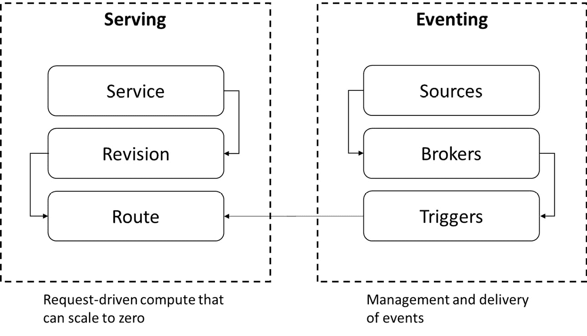

图 10.1 – Knative 组件

总结一下，Knative 提供了以下组件：

+   无服务器容器可以快速部署。

+   可以将 Pod 缩放到零，并根据需求进行自动缩放。

+   支持多个网络层的集成，包括 Contour、Kourier 和 Istio。

+   支持已部署代码和配置的时间点快照。

+   支持 HTTP 和 HTTPS 网络协议。

现在我们已经覆盖了 Knative 的基础知识，接下来我们将在下一部分启用附加组件并部署其中一个示例。

# 启用 Knative 附加组件

由于 Knative 不支持 ARM64 架构，我们将在本部分使用 Ubuntu 虚拟机。设置 MicroK8s 集群的说明与*第五章*中*，*《创建和实现多节点树莓派 Kubernetes 集群的更新》相同。

我们将启用 Knative 附加组件，将 Knative 中间件添加到您的集群中。使用以下命令启用 Knative 附加组件：

```
microk8s enable knative
```

启用此附加组件时，Istio 和 DNS 也将添加到 MicroK8s。

以下命令执行输出确认 Knative 附加组件正在启用：

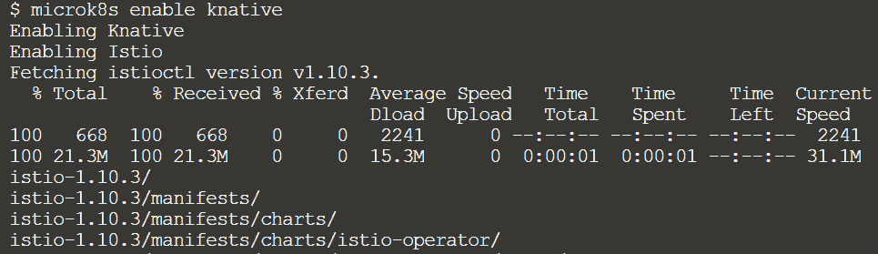

图 10.2 – 启用 Knative 附加组件

启动附加组件需要一些时间。以下命令执行输出显示 Knative 已成功启用：

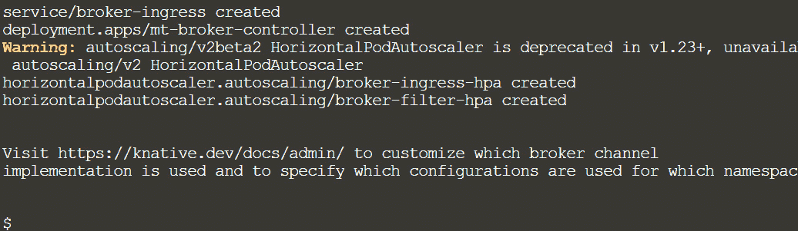

图 10.3 – Knative 附加组件已激活

在继续下一步之前，让我们验证附加组件是否已启用，并且所有必需的 Pod 都在运行。

要查看附加组件是否已激活，请使用`kubectl get pods -n knative-serving`命令。以下命令执行输出表明 Knative Serving 组件正在运行：

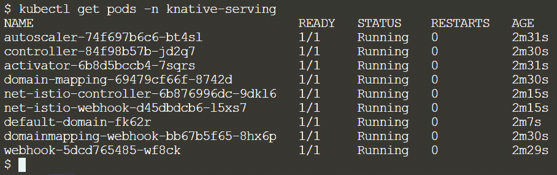

图 10.4 – Knative Serving 组件的 Pod 正在运行

在继续下一步之前，让我们使用以下命令确认所有 Knative Eventing 组件是否都已启动并正常运行：

```
kubectl get pods –n knative-eventing
```

以下命令执行输出表明 Knative Eventing 组件也在运行：

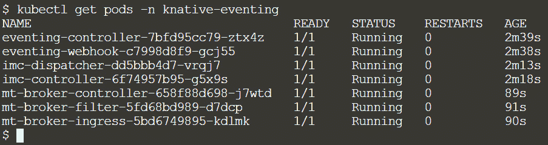

图 10.5 – Knative Eventing 组件正在运行

现在我们已经启动并运行了所有 Knative 组件。

我们将继续安装 Knative `kn` 的下一步。无需手动创建或编辑 YAML 文件，`kn` 提供了一个快速简便的界面来构建 Knative 资源，如服务和事件源。它还简化了诸如自动扩展和流量分配等任务，这些任务否则可能会比较复杂。

可以从发布页面下载 `kn` 二进制文件（[`github.com/knative/client/releases`](https://github.com/knative/client/releases)），并使用以下命令将其复制到 `/usr/local/bin` 目录：

```
sudo curl –o /usr/local/bin/kn –sL https://github.com/knative/client/releases/download/knative-v1.3.1kn-linux-amd64
```

以下命令执行输出确认 `kn` CLI 已成功下载，并且可在 `/usr/local/bin` 目录下使用：

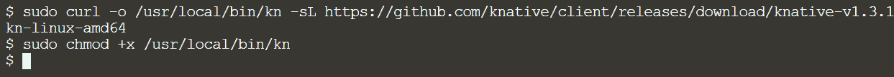

图 10.6 – 安装 Knative CLI

在进入下一步之前，让我们通过运行以下 `kn version` 命令来验证 `kn` CLI 是否正常工作：

```
kn version
```

以下输出确认 `kn` CLI 正常运行，并显示其版本和构建日期：

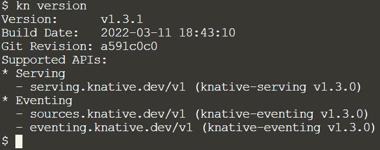

图 10.7 – 验证 kn CLI 是否正常运行

为了让 `kn` CLI 访问 Kubernetes 配置文件，请将 MicroK8s 配置文件复制到 `$HOME/.kube/config`，操作命令如下：

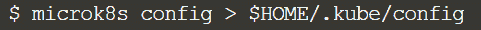

图 10.8 – 将 MicroK8s 配置文件复制到 $HOME 文件夹

所有 Knative 组件以及 Knative CLI `kn` 配置现在都已启动并运行。接下来我们将进入下一步：部署并运行示例服务。

# 在 Knative 上部署并运行示例服务

在本节中，我们将从 Knative 示例仓库中部署 `Hello world` 示例服务。该示例服务会读取 `TARGET` 环境变量并打印 `Hello` `$TARGET!`。如果没有提供 `TARGET`，默认值为 "`World`"。

接下来的步骤中，我们将通过指定镜像位置和 `TARGET` 环境变量来部署服务。我们将创建一个 Knative 服务（Serving 组件），它是基于时间的单一无服务器容器环境（如微服务）的表示形式。它包含访问该服务的网络地址以及运行该服务所需的应用程序代码和设置。

Knative 服务的生命周期由 `serving.knative.dev` CRD 控制。为了创建 Knative 服务，我们将使用 `kn` CLI，具体命令如下：

```
kn service create kn-serverless --image gcr.io/knative-samples/helloworld-go --env TARGET=upnxtblog.com
```

以下命令执行输出表示服务创建成功，并且可以通过 URL `http//kn-serverless.default.example.com` 访问该服务：

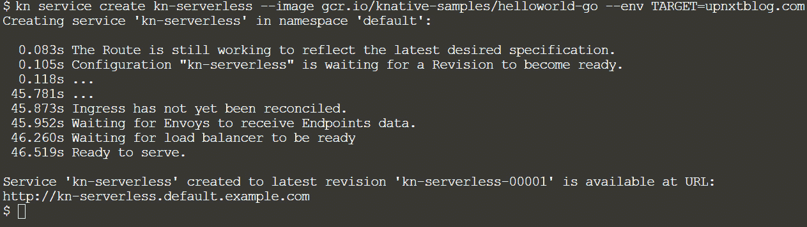

图 10.9 – 创建新的 Knative 服务

恭喜！我们已经成功创建了一个新的 Knative 服务并进行了部署。

以下是 Serving 组件的概览：

+   **服务**：管理工作负载的整个生命周期

+   **路由**：负责将网络端点映射到一个或多个修订版本

+   **配置**：保持部署的期望状态

+   **修订**：工作负载代码和配置的某一时刻快照

在定义和控制无服务器工作负载在集群上行为的 Serving 组件，如下图所示：

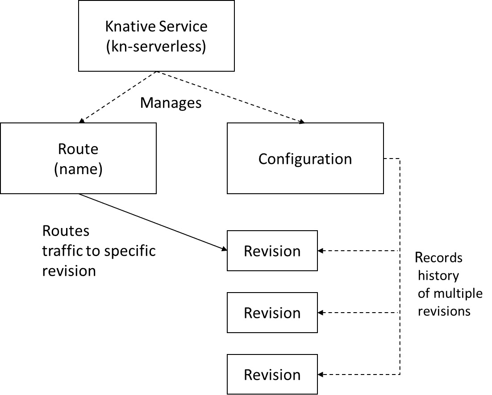

图 10.10 – Knative Serving 组件

我们现在可以像下面这样使用`curl`命令调用我们之前创建的服务：

```
curl http://$SERVICE_IP:$INGRESS_PORT/ -H 'Host: kn-serverless.default.example.com'
```

`$SERVICE_IP`和`$INGRESS_PORT`指向 Knative 服务和暴露的 Ingress 端口。以下命令的输出确认 Knative 服务已经被调用，并且已显示输出：

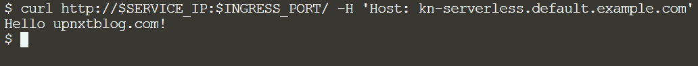

图 10.11 – 调用 Knative 服务

要观察 Pod 如何被创建以处理请求，请在新的终端标签页中运行`watch kubectl get pods`命令。如果 60 秒内没有传入请求，Knative 将自动将该 Pod 缩减至零，如下所示的命令执行输出：

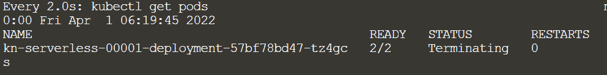

图 10.12 – 如果 60 秒内没有传入请求，Pods 将被终止

在 Pods 缩减至零后，您也可以发出前述的`curl`命令，以查看 Pod 如何启动并服务请求零，如下所示的命令执行输出：

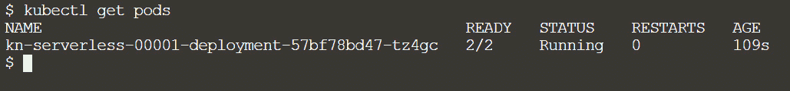

图 10.13 – Pods 被启动以服务请求

简而言之，Knative 是一个基于 Kubernetes 的开发、部署和管理现代无服务器工作负载的平台。我们还发现，MicroK8s 原生支持 Knative，并且是入门 Knative 所有组件（构建、服务和事件）的最佳方式。

我们已部署了一个示例应用程序，并使用其端点从命令行调用它。接下来，我们将在下一节中查看选择 OpenFaaS 以运行示例应用程序，并分析它提供的功能。

# OpenFaaS 框架概述

OpenFaaS（**FaaS**代表**函数即服务**）是一个使用 Docker 和 Kubernetes 容器技术创建无服务器函数的框架。任何进程都可以被封装为一个函数，从而无需重复编写样板代码即可消费各种 Web 事件。这是一个开源项目，在社区中正获得越来越多的关注。

OpenFaaS 框架的一些关键优势如下：

+   在任何基础设施上运行函数，无需担心与开源函数框架的锁定问题。

+   在任何编程语言中创建函数并将其打包在 Docker/OCI 容器中。

+   内置 UI、强大的 CLI 和一键安装使其使用起来非常简单。

+   随着需求增长进行扩展——处理流量峰值，并在不使用时缩减规模。

+   提供社区版和专业版，并附带生产支持。

现在我们已经介绍了 OpenFaaS 的基本概念，接下来我们将在下一部分启用插件并部署其中一个示例。

# 启用 OpenFaaS 插件

由于 OpenFaaS 不支持 ARM64 架构，我们将在本部分使用 Ubuntu 虚拟机。设置 MicroK8s 集群的指令与 *第五章* 相同，*创建和实施多节点 Raspberry Pi Kubernetes 集群的更新*。

在启用 OpenFaaS 插件之前，使用以下命令启用 DNS 和注册表插件：

```
microk8s enable dns
```

DNS 用于为 Kubernetes 提供地址解析服务，以便各个服务能够相互通信。以下命令执行输出确认 DNS 插件已启用：

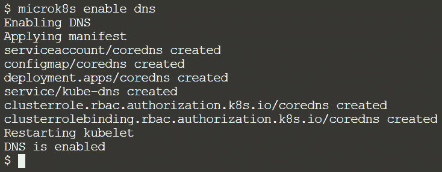

图 10.14 – 启用 DNS 插件

DNS 插件已启用后，我们将继续启用注册表插件，使用以下命令：

```
microk8s enable registry
```

注册表插件在 Docker 中创建一个私有注册表，并将其暴露在 `localhost:32000`。作为此插件的一部分，存储插件也将按以下方式启用：

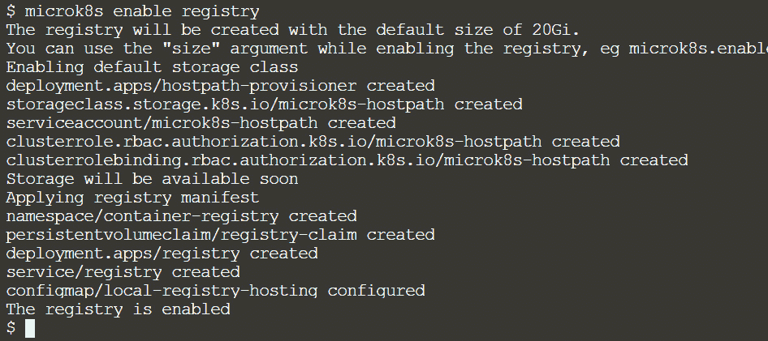

图 10.15 – 启用注册表插件

在启用了 DNS 和注册表插件后，我们可以继续下一步启用 OpenFaaS 插件。

使用以下命令启用 OpenFaaS 插件：

```
microk8s enable openfaas
```

以下命令执行输出确认 OpenFaaS 插件正在启用：

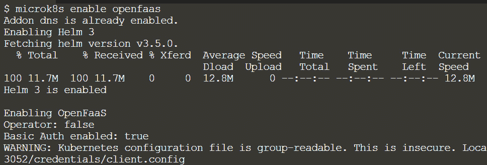

图 10.16 – 启用 OpenFaaS 插件

启用插件需要一些时间。以下命令执行输出显示 OpenFaaS 插件已成功启用：

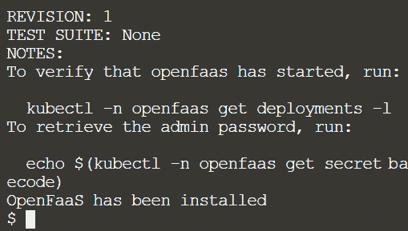

图 10.17 – OpenFaaS 插件已启用

如你所见，部署脚本在安装过程中会生成一个用户名（admin）和密码组合。请保存凭据，以便在后续步骤中使用。

在继续下一步之前，让我们验证插件是否已启用，并且所有所需的 pods 都在运行。

要查看插件是否已激活，请使用 `kubectl get pods` 命令。以下命令执行输出表明 OpenFaaS 组件正在运行：

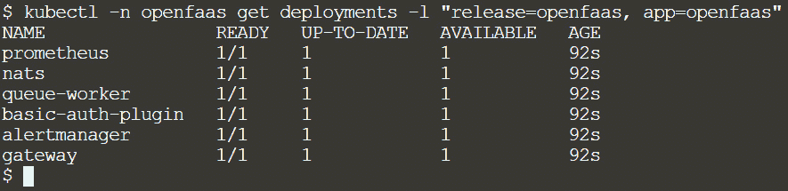

图 10.18 – OpenFaaS pods 正在运行

我们现在已经启动并运行了 OpenFaaS 的以下所有组件：

1.  `nats` 提供异步执行和排队功能。

1.  `prometheus` 提供指标并通过 `alertmanager` 启用自动扩展。

1.  `gateway` 提供了外部访问函数的路由，并根据需求对函数进行扩展。

1.  `queue-worker` 负责处理异步请求。

接下来，我们将继续安装 OpenFaaS CLI 工具。该 CLI 可用于创建和部署 OpenFaaS 函数。通过一组支持的语言模板，您可以创建 OpenFaaS 函数（例如 Node.js、Python、C# 和 Ruby）。更多信息，请参见 [`github.com/openfaas/templates`](https://github.com/openfaas/templates)。

您可以使用 `curl` 命令安装 CLI，方法是从发布页面获取二进制文件，如下所示：

```
curl –sSL –– insecure https://cli.openfaas.com | sudo –E sh
```

注意

这里我们使用 `–insecure` 标志来避免任何证书下载问题。

以下命令执行结果确认 CLI 安装成功。安装完成后，`faas-cli` 命令和 `faas` 别名可用，如下所示：

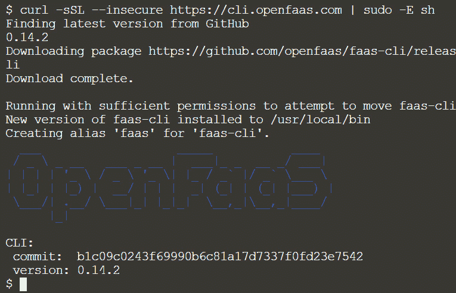

图 10.19 – 安装 OpenFaaS CLI

现在我们已经安装了 `faas-cli`，接下来我们可以使用 `faas-cli` 命令来创建和部署函数，进入下一部分。

# 在 OpenFaaS 上部署并运行一个示例函数

本节将介绍创建、构建和部署新的 FaaS Python 函数。我们还将使用 OpenFaaS CLI 命令来测试已部署的函数。OpenFaaS CLI 拥有一个模板引擎，可以用来设置任何编程语言的新函数。要创建一个新函数，请使用以下命令：

```
faas-cli new –lang <language template> ––prefix localhost:32000 <function name>
```

这里的 `–prefix` `localhost:32000` 指的是我们在前面步骤中启用的本地 MicroK8s 注册表。

此命令通过读取当前工作文件夹中 `./template` 目录下的模板列表来工作。

您还可以使用 `faas-cli template pull` 命令，从 GitHub 拉取官方 OpenFaaS 语言模板。

要查看支持的语言列表，请使用 `faas-cli new –list` 命令。

以下命令执行结果表明新的 `openfaas-serverless` Python 函数已创建：

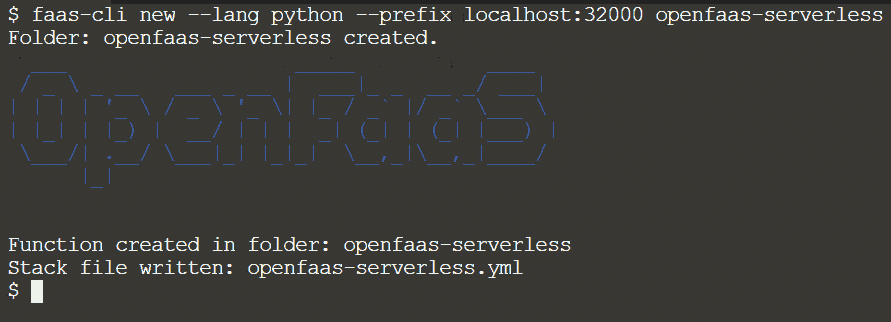

图 10.20 – 使用 CLI 创建新函数

在当前工作文件夹中，生成了一个堆栈文件和一个以函数名命名的新文件夹，如下所示：

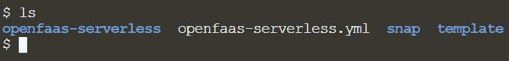

图 10.21 – 生成堆栈文件和包含函数名称的新文件夹

现在我们已经创建了一个新函数，接下来我们需要构建它，以便在后续步骤中创建和使用容器镜像。

使用以下命令来构建新函数：

```
faas-cli build –f ./openfaas-serverless.yml
```

`faas-cli build` 命令在本地 MicroK8s 注册中心创建一个 Docker 镜像，该镜像可以在本地使用，也可以上传到远程容器注册中心（如果是多节点集群设置）。每次更改函数时，都需要执行新的 `faas-cli build` 命令。

以下命令执行表明新的 `openfaas-serverless` Python 函数已成功构建：

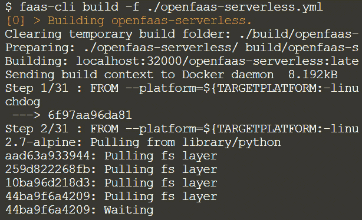

图 10.22 – 构建新的 OpenFaaS 函数

构建过程可能需要一些时间，但一旦完成，您应该看到以下输出：

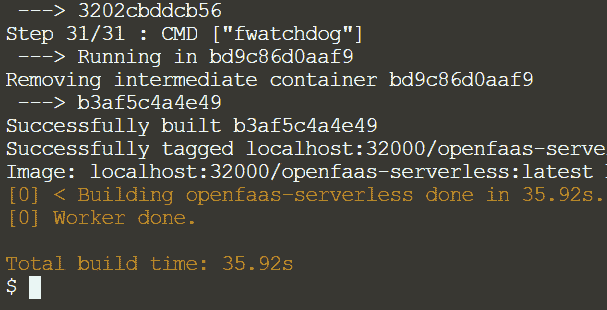

图 10.23 – 成功构建 OpenFaaS 函数

由于镜像已构建完成，我们现在可以进入下一步，将 Docker 镜像推送到注册中心。

使用以下命令将 Docker 镜像推送到我们的本地注册中心：

```
faas-cli push –f ./openfaas-serverless.yml
```

以下命令执行输出表明 `openfaas-serverless` 函数已成功推送到注册中心：

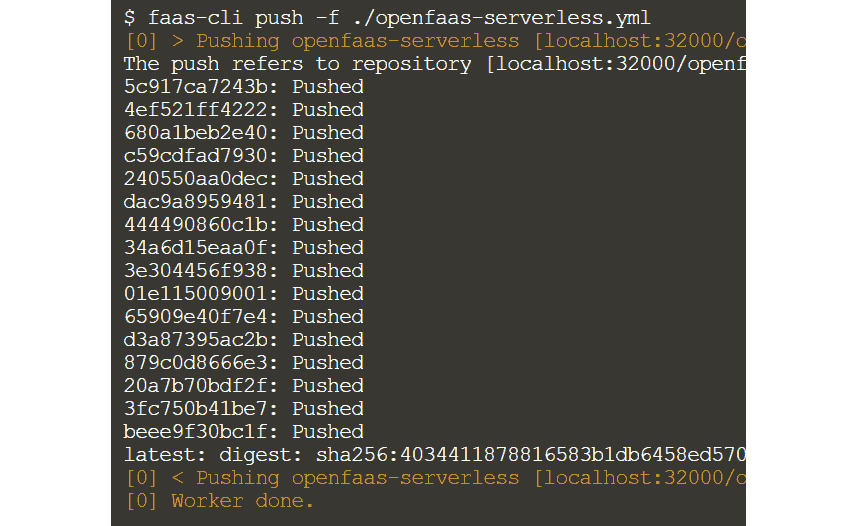

图 10.24 – OpenFaaS 函数已推送到本地注册中心

在进入下一步部署函数之前，让我们设置 `OPENFAAS_URL` 环境变量并检索所需的管理员凭证。

一个 `OPENFAAS_URL` 环境变量定义了 CLI 用来联系 OpenFaaS 服务器的默认网关 URL，如下所示：

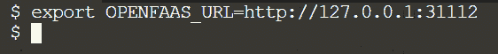

图 10.25 – 设置 OPENFAAS_URL 环境变量

要检索管理员凭证，请使用在安装过程中打印的以下命令：

```
echo $(kubectl -n openfaas get secret basic-auth -o jsonpath="{.data.basic-auth-password}" | base64 --decode)
```

以下命令执行输出表明命令已成功执行，并且密码已被检索：

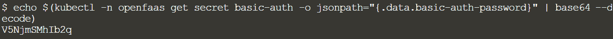

图 10.26 – 检索管理员凭证

让我们使用管理员凭证登录到 OpenFaaS 服务器，以便我们可以部署该函数。以下命令执行结果表示登录成功，并且凭证已保存到本地存储：

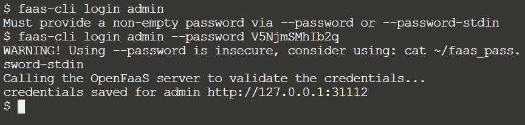

图 10.27 – 使用检索到的密码登录到 OpenFaaS 服务器

凭证已保存后，我们可以继续部署该函数到 OpenFaaS 服务器的下一步骤。

使用以下命令来部署该函数：

```
faas-cli deploy –f ./openfaas-serverless.yml
```

以下命令执行输出表明部署成功，并且我们现在拥有访问该函数的 URL：

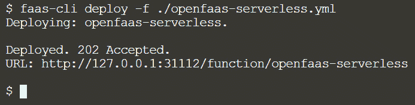

图 10.28 – 函数部署成功

或者，你可以使用 `faas-cli up` 命令在一个命令中构建、推送并部署函数。

恭喜！我们成功创建了一个新函数并部署了它。

要调用函数，我们将使用 CLI 的 `invoke` 功能，如下所示：

```
faas-cli invoke –f openfaas-serverless.yml openfaas-serverless
```

默认情况下，函数接受一个输入参数并输出该参数值。要更改逻辑，需修改堆栈文件和处理程序文件，然后重新部署函数：

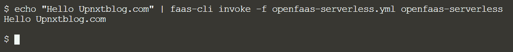

图 10.29 – 调用函数

你还可以使用 OpenFaaS 用户界面来调用已部署的函数，如下所示：

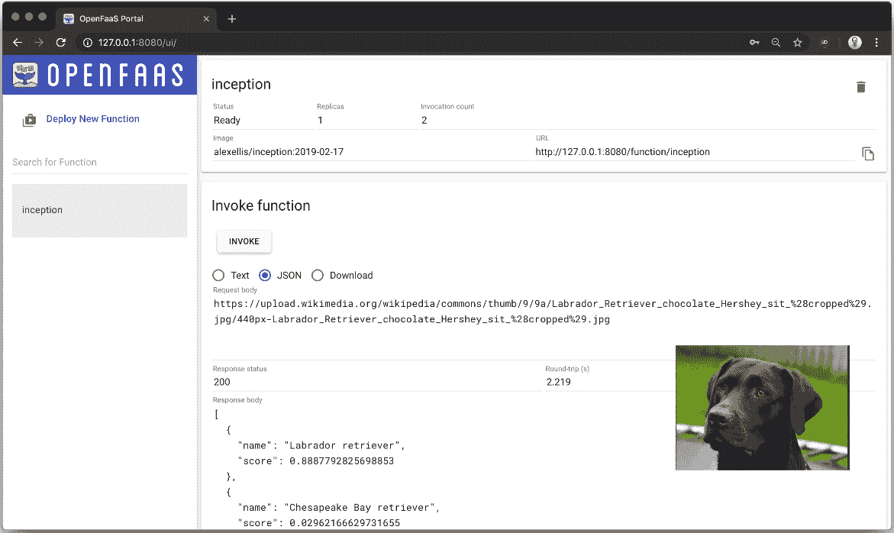

图 10.30 – OpenFaaS 用户界面

简而言之，OpenFaaS 提供以下功能：

+   一种简单的方法来打包任何代码或二进制文件，以及一个多样化的语言模板生态系统

+   内置的自动扩展和用于协作与共享度量的函数库

+   原生支持 Kubernetes 体验以及一个专注的社区

接下来将讨论开发和部署无服务器应用程序的最佳实践。

# 开发和部署无服务器应用程序的最佳实践

我们必须遵循最佳实践，以保护我们的资源、应用程序和基础设施服务提供商账户。以下是需要考虑的一些指导原则。

## 无服务器函数 = 特定函数

无服务器函数必须完成特定任务。无服务器函数应该执行一个逻辑功能，类似于任何代码中的函数或方法应该完成一件事情。

## 使用微服务

微服务使我们能够以可管理的方式将数据存储和功能链接在一起。微服务将受合同约束，规定允许和禁止的操作。例如，一个支付微服务可以用来创建、更新和删除用户支付记录。除用户账户数据存储之外，这个微服务不应修改任何数据。它还会有自己的 API。其他微服务现在可以以一致的方式与用户账户无服务器函数交互，而无需修改任何用户账户数据存储。

## 为不同资源使用适当的堆栈

在部署资源时，无服务器框架允许我们使用多种语言栈，每个框架配置都部署相应的栈。每种资源类型应该有一个目标栈。例如，我们的用户支付微服务可能会有一个数据库栈（用于存储 MongoDB 中的账户元数据）、一个**身份提供者**（**IdP**）栈（用于设置和维护与 OAuth2 提供者的用户会话）、一个函数栈（用于部署提供用户支付微服务 API 的函数）和一个对象存储栈（用于在 S3 中捕捉用户账户的头像）。这使得我们能够在不影响其他资源的情况下编辑某一资源类型。例如，如果你在部署函数栈时出错，其他栈不会受到影响。

## 应用最小权限原则

应该对所有资源应用最小权限的 IAM 权限。例如，一个读取 MongoDB 表格的无服务器函数，只应包含该 MongoDB 表格的读取权限。在定义权限时，应尽量避免使用星号（*）。如果你的函数被攻击者利用且使用了星号，那么它就能读取和删除所有数据库数据，从而使得所有 MongoDB 资源可访问，且每个操作都可执行。

## 执行负载测试

对无服务器函数进行负载测试有助于你识别需要分配多少内存以及使用什么超时值。在无服务器环境中，可能会有复杂的应用程序，而且你可能没有意识到应用程序内部的依赖关系，这些依赖关系会在高负载下阻止其执行功能。负载测试使你能够识别可能会影响高可用性应用程序运行的关键问题。

## 使用 CI/CD 管道

当你开始构建应用程序时，通过 CLI 进行部署是可以的。理想情况下，你应该在将代码发布到生产环境之前，使用 CI/CD 管道来部署代码。在启用拉取请求合并之前，管道的 CI 部分允许你进行代码风格检查、单元测试和其他各种自动化检查。当 PR 合并或分支更新时，管道的 CD 部分允许你自动部署无服务器应用程序。使用 CI/CD 管道可以消除人为错误，并确保你的流程可重复。

## 需要持续监控

我们应该使用 Knative 监控、Prometheus 等服务来监控我们的无服务器资源。可能会有许多资源，而且它们的使用频繁，手动检查它们是否存在故障将会很困难。健康状况、执行时间过长、延迟和错误等都可以通过监控服务报告。当我们的无服务器应用和资源出现问题时，拥有一个服务（如 Alert Manager）来向我们发出警报，可以让我们更快地定位和解决问题。

## 除了监控，还需要审计

我们希望除了监控之外，还能进行审计。当任何事情停止工作或出现问题时，监控会发出警报。当我们的资源偏离已知配置或配置错误时，审计会发出警报。我们可能会开发规则，使用 Knative 配置或 OpenFaaS 堆栈文件等服务来审计我们的资源及其配置。

## 审计软件依赖

我们还希望审计我们的软件依赖。仅仅因为我们不再有服务器，并不意味着我们免于“打补丁”。我们希望确保我们指定的任何软件依赖都是最新的，并且不包含已知的漏洞。我们可以利用自动化工具来跟踪哪些软件包需要更新。

# 总结

在本章中，我们研究了 MicroK8s 中最流行的两种无服务器框架：Knative 和 OpenFaaS，它们都是基于 Kubernetes 的平台，用于开发、部署和管理现代的无服务器工作负载。我们部署了一些示例，并通过 CLI 调用它们的端点。我们还看到了无服务器框架如何在没有请求时将 Pod 缩减到零，并在有更多请求时启动新的 Pod。

我们意识到，MicroK8s 的部署简便性似乎与无服务器框架的实现难易度相关。我们还讨论了一些在开发和部署无服务器应用时需要牢记的指导原则。然而，部署无服务器资源非常简单。我们还意识到，为了保护我们的资源、应用和基础设施服务提供商账户，我们需要遵循最佳实践。

在下一章中，我们将学习如何使用 OpenEBS 实现存储复制，从而在多个节点之间同步数据。

# 第四部分：在 MicroK8s 上部署和管理应用

本部分重点介绍了典型物联网/边缘计算应用的部署和管理方面，例如为有状态应用设置存储复制，为跨切关注点实现服务网格，以及设置高可用集群以应对组件故障并继续无中断地提供工作负载服务，配置带有工作负载隔离的容器，并在与主机系统隔离的环境中运行受保护的容器。

本书的这一部分包括以下章节：

+   *第十一章**，使用 OpenEBS 管理存储复制*

+   *第十二章**，为跨切关注点实现服务网格*

+   *第十三章**，通过 HA 集群抵御组件故障*

+   *第十四章**，用于安全容器的硬件虚拟化*

+   *第十五章**，为隔离容器实现严格限制*

+   *第十六章**，深入未来*
