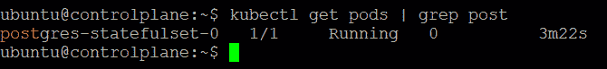
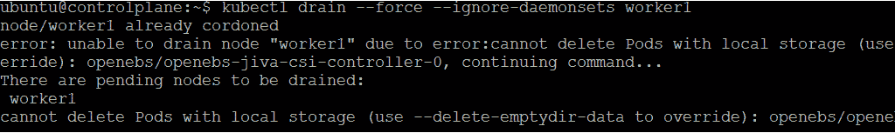

# 11

# 使用 OpenEBS 管理存储复制

在上一章中，我们介绍了 MicroK8s 提供的两种无服务器框架，这两种框架都是基于 Kubernetes 的平台，用于设计、部署和管理现代无服务器工作负载。我们还注意到，无服务器框架的实施易用性似乎与 MicroK8s 的部署易用性密切相关。创建和部署无服务器应用时需要记住的一些指导原则也已被强调。我们还意识到，为了保护我们的资源、应用程序和基础设施服务提供商账户，我们需要遵循最佳实践。

在本章中，我们将研究支持云原生存储解决方案（如 OpenEBS）的下一个用例，以为我们的容器应用程序提供持久存储。云原生存储解决方案提供了全面的存储机制。这些解决方案模拟了云环境的特性，如可扩展性、可靠性、容器架构和高可用性。这些特性使得与容器管理平台的接口变得简单，并为基于容器的应用程序提供持久存储。

首先，我们将先了解 Kubernetes 存储基础知识，再深入了解 OpenEBS 的概念。容器是短暂的，这意味着它们是为特定目的建立的，在完成任务后会被关闭。容器本身不维护状态数据，新创建的容器实例无法记住之前容器的状态/数据。虽然容器提供存储，但它只是短暂存储，因此当容器关闭时，存储也会被清除。开发人员需要管理持久存储，作为容器化应用程序的一部分，因为他们在为新用例采用容器时，可能需要让容器持续存储数据。例如，开发人员可能希望在容器中运行数据库，并将数据存储在一个在容器关闭时仍然存在的卷中。

Kubernetes 为容器集群提供了多种管理选项。管理持久存储的能力是其中之一。管理员可以使用 Kubernetes 持久存储来跟踪 Kubernetes 集群中的持久数据和非持久数据。集群中的多个应用程序可以动态地利用存储资源。

为了帮助管理持久存储，Kubernetes 支持两种主要机制：

+   **PersistentVolume**（**PV**）是一个存储元素，可以根据存储类别手动或动态创建。它的生命周期不受 Kubernetes Pod 生命周期的影响。Pod 可以挂载一个 PV，但 PV 在 Pod 关闭后仍然存在，其数据仍然可以访问。每个 PV 可以有自己的一组参数，例如磁盘类型、存储层次和性能。

+   **PersistentVolumeClaim** (**PVC**) 是 Kubernetes 用户提出的存储请求。根据自定义参数，任何在容器上运行的应用程序都可以请求存储，并定义其所需的大小和其他属性（例如，特定类型的存储，如 SSD 存储）。根据可用的存储资源，Kubernetes 集群可以供给一个 PV。

`StorageClass` 是一个 Kubernetes API 对象，用于配置存储参数。它是一种动态配置方法，根据需求生成新卷。`StorageClass` 定义了卷插件的名称，以及任何外部提供者和 **容器存储接口** (**CSI**) 驱动程序，允许容器与存储设备进行通信。CSI 是一种标准，允许容器化工作负载访问任何块存储和文件存储系统。

`StorageClass` 可以由 Kubernetes 管理员定义并分配 PV。每个 `StorageClass` 表示不同类型的存储，例如快速的 SSD 存储与传统的磁盘驱动器或远程云存储。这使得 Kubernetes 集群能够根据工作负载的变化需求提供不同类型的存储。

动态卷供给是 Kubernetes 的一项功能，允许根据需求创建存储卷。管理员不再需要手动在云端或存储提供商中构建新存储卷，然后创建 PV 对象使其在集群中可用。当用户请求特定的存储类型时，整个过程会自动化并进行供给。`StorageClass` 对象由集群管理员根据需要定义。像 OpenEBS 这样的卷插件，也称为供给器，被每个 `StorageClass` 引用。当存储卷被自动供给时，卷插件提供一组参数并将其传递给供给器。

管理员可以定义多个 `StorageClass`，每个 `StorageClass` 可以代表不同类型的存储或具有不同规格的相同存储。这使得用户可以选择多种存储解决方案，而无需担心实施细节。

**容器附加存储** (**CAS**) 正迅速成为管理有状态工作负载的可行选项，并且正成为执行耐久性和容错有状态应用程序的首选方法。CAS 是通过 OpenEBS 项目引入 Kubernetes 平台的。它可以在本地集群、公共云中的托管集群，甚至在隔离的气隙集群中轻松部署。MicroK8s 通过附加组件内置支持 OpenEBS，使其成为在气隙 Edge/IoT 场景中运行 Kubernetes 集群的最佳解决方案。

本章将涵盖以下主要主题：

+   OpenEBS 概述

+   配置和实现 PostgreSQL 有状态工作负载

+   Kubernetes 存储最佳实践

# OpenEBS 概述

在 Kubernetes 中，存储通常作为操作系统内核模块与各个节点集成。即便是 PV 也属于单体化和传统资源，因为它们与底层组件紧密绑定。CAS 允许 Kubernetes 用户将存储实体视为微服务。CAS 由两部分组成：控制平面和数据平面。控制平面作为一组 **自定义资源定义**（**CRDs**）实现，处理低级存储实体。数据平面作为靠近工作负载的一组 pod 运行，负责 I/O 事务，即读写操作。

控制平面和数据平面的清晰分离提供了与在 Kubernetes 上运行微服务相同的好处。该架构将持久化与底层存储实体解耦，使得工作负载更加可移植。它还为存储增加了扩展能力，允许管理员和运维人员根据工作负载动态扩展卷。最后，CAS 确保数据（PV）和计算（pod）始终以超融合模式共置，以最大化吞吐量和容错能力。

数据通过 OpenEBS 的同步复制功能跨多个节点进行复制。节点故障只会影响该节点上的卷副本。其他节点上的数据将保持可用，并且性能不受影响，从而使应用程序对故障具有更高的容错性：


图 11.1 – 同步复制

使用 OpenEBS CAS 架构还可以创建即时快照。这些快照可以通过常规的 `kubectl` 命令进行创建和管理。与 Kubernetes 的深度集成使得作业具有更好的可移植性，同时也简化了数据备份和迁移。

以下图展示了 OpenEBS 的典型组件：


图 11.2 – OpenEBS 控制平面和数据平面

OpenEBS 是一个基于 CAS 概念精心设计的系统。我们将在以下章节中更详细地了解其架构。

## 控制平面

控制平面、磁盘管理器和数据平面被分配给每个已安装的存储卷。控制平面更接近存储基础设施；它跟踪通过 SAN 或块存储连接到每个集群节点的存储卷。卷的配置、快照的启动、克隆的创建、存储策略的制定、存储策略的执行以及将卷指标导出到其他系统（如 Prometheus）等操作，都是由控制平面直接处理的。

OpenEBS 存储管理员通过控制平面与集群范围的存储活动进行交互。通过 API 服务器，OpenEBS 控制平面可以对外访问。Pod 暴露 REST API 用于控制资源，如卷和策略。声明最初作为 YAML 文件提交到 API 服务器，然后启动工作流。API 服务器与 Kubernetes 主控的 API 服务器进行通信，以便在数据平面中调度卷 Pod。

动态供应通过控制平面的供应器组件使用标准 Kubernetes 外部存储插件来实现。当应用程序从现有存储类创建 PVC 时，OpenEBS 供应器会从存储类中的原语构建一个 PV，并将其绑定到 PVC。

OpenEBS 控制平面在很大程度上依赖于 `etcd` 数据库，它作为集群的单一数据源。

现在我们已经了解了控制平面，接下来让我们更深入地了解数据平面。

## 数据平面

数据平面接近工作负载，并且仍然位于卷的 I/O 路径中。它在用户空间中运行的同时管理 PV 和 PVC 的生命周期。数据平面上提供了多种具有不同功能的存储引擎。在写作时，**Jiva**、**cStor** 和 **Local PV** 是可用的三种存储引擎。Jiva 提供标准存储能力（块存储），通常用于较小规模的工作负载，而 cStor 提供企业级功能和广泛的快照功能。另一方面，Local PV 通过如复制和快照等高级功能提供更好的性能。

让我们更深入地了解每个存储引擎。

## 存储引擎

OpenEBS 的首选存储引擎是 cStor。它是一个功能丰富且轻量级的存储引擎，旨在满足高可用性工作负载的需求，例如数据库。它包括企业级功能，如同步数据复制、快照、克隆、精简数据供应、高数据弹性、数据一致性和按需的容量或性能增加。通过仅一个副本，cStor 的同步复制确保了有状态 Kubernetes 部署的优秀可用性。当有状态应用需要高数据可用性时，cStor 会设置为三个副本，数据会同步写入每个副本。终止和调度新的 Pod 到不同节点时不会导致数据丢失，因为数据已经写入多个副本。

Jiva 是首个被包含在早期 OpenEBS 版本中的存储引擎。Jiva 是所有选项中最简单的，因为它完全运行在用户空间，并具有常规的块存储功能，如同步复制。运行在没有额外块存储设备的节点上的小型应用程序将受益于 Jiva。因此，它不适用于需要高性能或高级存储能力的关键任务。

**本地持久卷**（**Local PV**）是 OpenEBS 的第三个也是最简单的存储引擎。Local PV 是直接附加到单个 Kubernetes 节点的本地磁盘。Kubernetes 应用程序现在可以使用传统的卷 API 消耗高性能本地存储。OpenEBS 的 Local PV 是一种存储引擎，可以在工作节点上使用本地磁盘或主机路径构建 PV。Local PV 可用于不需要高级存储功能（如复制、快照或克隆）的云原生应用程序。例如，管理复制和高可用性的 StatefulSet 可以基于 OpenEBS 设置 Local PV。

除了前面提到的存储引擎之外，**Mayastor 数据引擎**是一种低延迟引擎，目前正在开发中，具有声明式的数据平面，为有状态应用提供灵活、持久的存储。它是 Kubernetes 原生的，提供快速、冗余的存储，可在任何 Kubernetes 集群中使用。Mayastor 插件将在 MicroK8s 1.24 中提供：[`microk8s.io/docs/addon-mayastor`](https://microk8s.io/docs/addon-mayastor)。

OpenEBS 的另一个可选且受欢迎的功能是写时复制快照。快照可以即时创建，并且没有创建快照数量的限制。增量快照功能改善了 Kubernetes 集群之间以及不同云服务商或数据中心之间的数据迁移和可移植性。常见的应用场景包括高效的备份复制和利用克隆进行故障排除或开发，针对数据的只读副本。

OpenEBS 卷还支持与 Kubernetes 备份和恢复解决方案（如 Velero）兼容的备份和恢复功能 ([`velero.io/`](https://velero.io/))。

要了解更多信息，您可以查看我关于如何备份和恢复 Kubernetes 集群资源（包括 PVs）的博客文章：[`www.upnxtblog.com/index.php/2019/12/16/how-to-back-up-and-restore-your-kubernetes-cluster-resources-and-persistent-volumes/`](https://www.upnxtblog.com/index.php/2019/12/16/how-to-back-up-and-restore-your-kubernetes-cluster-resources-and-persistent-volumes/)。

通过容器附加存储技术，OpenEBS 将软件定义存储的优势扩展到云原生应用程序。有关各存储引擎的详细比较和推荐使用场景，请参阅 OpenEBS 文档：[`openebs.io/docs/`](https://openebs.io/docs/)。

综述一下，OpenEBS 可以从 Kubernetes 工作节点可用的任何存储中创建本地或分布式的 Kubernetes PV。这使得应用和平台团队可以轻松实现需要快速、可靠和可扩展 CAS 的 Kubernetes 有状态工作负载。它还确保每个存储卷都有一个独立的 Pod 以及一组副本 Pod，这些 Pod 像其他容器或微服务一样，在 Kubernetes 中进行管理和部署。OpenEBS 也作为容器安装，允许按应用、集群或容器分配存储服务。

现在，让我们学习如何在利用 OpenEBS Jiva 存储引擎的同时，配置并实现一个 PostgreSQL 有状态应用。

# 配置并实现 PostgreSQL 有状态工作负载

在本节中，我们将配置并实现一个 PostgreSQL 有状态工作负载，同时使用 OpenEBS 存储引擎。我们将使用 Jiva 存储引擎来确保 PostgreSQL 的持久性，创建测试数据，模拟节点故障以查看数据是否仍然完整，并确认 OpenEBS 的复制功能是否正常工作。

现在我们了解了 OpenEBS，我们将深入探讨在集群上配置和部署 OpenEBS 的步骤。下图展示了我们的树莓派集群设置：


图 11.3 – MicroK8s 树莓派集群

现在我们知道了想要做什么，让我们来看看需求。

## 需求

在开始之前，您需要以下前提条件来构建一个树莓派 Kubernetes 集群并配置 OpenEBS：

+   一张 microSD 卡（最小 4GB，推荐 8GB）

+   一台带有 microSD 卡驱动器的计算机

+   一台树莓派 2、3 或 4（1 台或更多）

+   一根 micro-USB 电源线（Pi 4 需要 USB-C）

+   一个 Wi-Fi 网络或一根带有互联网连接的以太网线

+   （可选）一台带有 HDMI 接口的显示器

+   （可选）Pi 2 和 3 使用 HDMI 电缆，Pi 4 使用 micro-HDMI 电缆

+   （可选）一只 USB 键盘

现在我们已经了解了测试由 OpenEBS 支持的 PostgreSQL 有状态工作负载的需求，接下来我们开始实施。

## 步骤 1 – 创建 MicroK8s 树莓派集群

请按照我们在*第五章*中介绍的步骤，*在多节点树莓派 Kubernetes 集群上创建并实施更新*，来创建 MicroK8s 树莓派集群；下面是简短的回顾：

1.  在 SD 卡上安装操作系统镜像：

    1.  配置 Wi-Fi 访问设置。

    1.  配置远程访问设置。

    1.  配置控制组设置。

    1.  配置主机名。

1.  安装并配置 MicroK8s。

1.  添加一个工作节点。

一个完全功能的多节点 Kubernetes 集群如下所示。总结一下，我们在树莓派板上安装了 MicroK8s，并将多个部署加入到集群中。我们还向集群中添加了节点：


图 11.4 – 完全功能的 MicroK8s 树莓派集群

现在，让我们启用 OpenEBS 插件。

## 步骤 2 – 启用 OpenEBS 插件

OpenEBS 插件在 MicroK8s 中默认可用。使用以下命令启用 OpenEBS：

```
microk8s enable openebs
```

以下命令的输出表明，必须启用 `iscsid` 控制器作为前提条件。对于存储管理，OpenEBS 使用 **互联网小型计算机系统接口** (**iSCSI**) 技术。iSCSI 协议是一种基于 TCP/IP 的协议，用于创建存储区域网络并在 IP 存储设备、主机和客户端之间建立和管理互联（SAN）。这些 SAN 允许在高速数据传输网络中使用 SCSI 协议，进行不同数据存储网络之间的块级数据传输：


图 11.5 – 启用 OpenEBS 插件

使用以下命令启用 `iscsid` 控制器：

```
sudo systemctl enable iscsid
```

以下输出表明 `iscsid` 已成功安装。现在，我们可以启用 OpenEBS 插件：


图 11.6 – 启用 iSCSI 控制器

以下输出表明 OpenEBS 插件已成功启用：


图 11.7 – 启用 OpenEBS 插件

Helm3 插件默认也已启用。在继续之前，让我们通过以下命令确保所有 OpenEBS 组件都已启动并运行：

```
kubectl get pods –n openebs
```

以下输出表明所有组件都在 `运行`：


图 11.8 – OpenEBS 组件已启动并运行

现在 OpenEBS 插件已启用，让我们部署 PostgreSQL 有状态工作负载。

## 步骤 3 – 部署 PostgreSQL 有状态工作负载

回顾*第一章*，*Kubernetes 入门*，StatefulSet 是 Kubernetes 工作负载 API 对象，用于管理有状态应用程序。在典型的部署中，用户并不关心 Pod 是如何调度的，只要它不会对部署的应用程序产生负面影响。然而，为了在具有持久存储的有状态应用中保持状态，Pod 必须被标识。这个功能由 StatefulSet 提供，它创建具有持久标识符的 Pod，这些标识符在重新调度时保持一致。这样，即使 Pod 被重新创建，它也会正确地映射到存储卷，应用程序的状态将被保留。

随着在 Kubernetes 中部署数据库集群的普及，在容器化环境中管理状态变得更加重要。

我们需要设置以下资源来使 PostgreSQL 配置正常运行：

+   存储类

+   PersistentVolume

+   PersistentVolumeClaim

+   StatefulSet

+   ConfigMap

+   服务

为了管理持久存储，Kubernetes 提供了 `PersistentVolume` 和 `PersistentVolumeClaim` 存储机制，我们在简介中简要讨论过。这是它们的快速概述：

+   **PersistentVolume** (**PV**) 存储在由集群管理员预配置的集群中，或通过存储类动态配置。

+   **PersistentVolumeClaim** (**PVC**) 是用户（开发者）对存储的请求。它类似于 pod。PVC 使用 PV 资源，而 pod 使用节点资源：


图 11.9 – PV 和 PVC 存储基础

在创建 PV 和 PVC 之前，先查看一下 OpenEBS 为我们创建的存储类。

`StorageClass` 允许管理员描述他们提供的 *存储类*。不同的类可能对应不同的 **服务质量** (**QoS**) 等级、备份策略或由集群管理员确定的任意策略。

使用以下命令检索 OpenEBS 创建的存储类：

```
kubectl get sc
```

以下输出显示有三个可用的 `StorageClass`：


图 11.10 – OpenEBS 存储类

`openebs-hostpath` 和 `openebs-device` 推荐用于单节点集群，对于多节点集群，推荐使用 `openebs-jiva-csi-default`。

现在，我们必须定义 `PersistentVolume`，它将使用存储类，以及 `PersistentVolumeClaim`，它将用于声明此卷：

```
kind: PersistentVolume
apiVersion: v1
metadata:
  name: postgres-pv
  labels:
    app: postgres
    type: local
spec:
  storageClassName: openebs-jiva-csi-default
  capacity:
    storage: 5Gi
  accessModes:
    - ReadWriteOnce
  hostPath:
    path: "/var/data"
---
kind: PersistentVolumeClaim
apiVersion: v1
metadata:
  name: postgres-pv-claim
  labels:
    app: postgres
spec:
  storageClassName: openebs-jiva-csi-default
  capacity:
  accessModes:
    - ReadWriteOnce
  resources:
    requests:
      storage: 5Gi
```

因为我们使用的是 OpenEBS 磁盘供应程序，所以我们需要指定数据在主机节点上的存储位置。在此我们使用`/var/data/`。`accessMode` 选项也至关重要。此处我们使用`ReadWriteOnce`。这确保每次只有一个 pod 可以写入。因此，不会有两个 pod 同时写入同一个卷。我们还可以指定该卷的大小，这里选择了 5 GB。

访问模式说明

即使一个卷支持多种访问模式，它们也只能一次挂载一个模式：

**ReadOnlyMany** (**ROX**)：可以由多个节点以只读模式挂载

**ReadWriteOnce** (**RWO**)：可以由单个节点以读写模式挂载

**ReadWriteMany** (**RWX**)：多个节点可以以读写模式挂载

使用以下命令创建 PV 和 PVC：

```
kubectl apply –f postgres.yaml
```

以下输出表示 `PersistentVolume` 和 `PersistentVolumeClaim` 已成功创建：


图 11.11 – PV 和 PVC 创建成功

在继续之前，先检查 PV 和 PVC 是否处于 `Bound` 状态。`Bound` 状态表示应用程序已访问所需的存储：


图 11.12 – PV 和 PVC 已绑定

如果 PVC 变得卡住等待，`StatefulSet`也会被卡住，因为它将无法访问其存储。因此，请仔细检查`StorageClass`和`PersistentVolume`是否已正确设置。

现在我们已经设置了 PV 和 PVC，我们将设置`ConfigMap`，并包含一些如用户名和密码等配置，以便我们的设置能正常工作。为了简化，本示例中我们将这些值硬编码到`ConfigMap`中：

```
apiVersion: v1
kind: ConfigMap
metadata:
  name: postgres-configuration
  labels:
    app: postgres
data:
  POSTGRES_DB: postgresdb
  POSTGRES_USER: postgres
  POSTGRES_PASSWORD: postgrespassword
```

使用以下命令创建`ConfigMap`：

```
kubectl apply –f postgres-config.yaml
```

以下输出表明`postgres-configuration.yaml`文件的`ConfigMap`已成功创建：


图 11.13 – PostgreSQL ConfigMap 已创建

让我们使用`describe`命令获取我们创建的`ConfigMap`对象的详细信息。以下输出显示我们的 PostgreSQL 设置所需的配置已就绪：


图 11.14 – PostgreSQL ConfigMap

现在我们已经定义了`ConfigMap`和存储卷，我们可以定义一个`StatefulSet`来使用它们：

```
apiVersion: apps/v1
kind: StatefulSet
metadata:
  name: postgres-statefulset
  labels:
    app: postgres
spec:
  serviceName: "postgres"
  replicas: 2
  selector:
    matchLabels:
      app: postgres
  template:
    metadata:
      labels:
        app: postgres
    spec:
      containers:
      - name: postgres
        image: postgres:12
        envFrom:
        - configMapRef:
            name: postgres-configuration
        ports:
        - containerPort: 5432
          name: postgresdb
        volumeMounts:
        - name: pv-data
          mountPath: /var/lib/postgresql/data
      volumes:
      - name: pv-data
        persistentVolumeClaim:
          claimName: postgres-pv-claim
---
apiVersion: v1
kind: Service
metadata:
  name: postgres-service
  labels:
    app: postgres
spec:
  ports:
  - port: 5432
    name: postgres
  type: NodePort 
  selector:
    app: postgres
```

`StatefulSet`的定义与部署类似。我们增加了两项内容：

+   我们已将`ConfigMap`中的环境变量加载到 Pod 中。

+   我们定义了卷，它将在 Pod 内映射到`/var/lib/PostgreSQL/data`。该卷是通过我们之前讨论的 PVC 来定义的。

最后，我们还创建了一个`Service`资源，将暴露我们的数据库。

使用以下命令创建`StatefulSet`和`Service`资源以暴露数据库：

```
kubectl apply –f postgres-deployment.yaml
```

以下输出表明`StatefulSet`和`Service`已成功创建：


图 11.15 – Postgres 部署成功

在继续之前，让我们验证一下 Pod 和 Service 是否已创建。以下输出显示 Pod 正在`Running`：



图 11.16 – Postgres Pod 正在运行

以下输出显示服务已通过端口`5432`暴露：


图 11.17 – Postgres 服务已暴露

让我们使用以下命令查看`StatefulSet`的 Pod 是如何分布在集群中的：

```
kubectl get pods –o wide | grep post
```

以下输出显示 PostgreSQL 数据库 Pod 正在两个节点上运行（`1`在`controlplane`，`1`在`worker1`）：


图 11.18 – 数据库 Pod 运行在两个节点上

至此，我们已经成功配置了 PostgreSQL 并使其正常运行。

现在，让我们创建一个测试数据库和表，并添加一些记录。

## 第 4 步 – 创建测试数据

为了创建测试数据，使用 `PgSQL` 客户端或登录到其中一个 Pod，这样我们可以创建测试数据库和表。

使用以下命令登录到 PostgreSQL Pod：

```
kubectl exec –it postgres-statefulset-0 -- psql –U postgres
```

以下输出显示我们可以登录到 PostgreSQL Pod：


图 11.19 – 登录到其中一个 PostgreSQL Pod

现在我们已经登录到 Pod，我们可以使用 `psql` PostgreSQL 客户端。使用以下命令创建测试数据库：

```
CREATE DATABASE inventory_mgmt;
```

以下输出显示我们的测试数据库`inventory_mgmt`已成功创建：


图 11.20 – 创建测试数据库

让我们通过使用 `\c inventory_mgmt` 切换到我们创建的新数据库。以下输出显示我们已成功切换到新数据库。现在，我们可以创建表了：


图 11.21 – 切换到新数据库连接

在新数据库中，使用 `CREATE TABLE` 命令创建测试表。以下输出表示新表 `products_master` 已成功创建：


图 11.22 – 创建测试表

现在测试表已经创建，使用 `INSERT` 命令添加一些记录，如下所示：


图 11.23 – 向测试表中添加一些记录

在这里，我们已经向测试表中添加了记录。在继续之前，让我们使用`SELECT`命令列出记录，如下图所示：


图 11.24 – 测试表中的记录

总结一下，在这一部分中，我们已经创建了一个测试数据库，创建了一个新表，并向表中添加了一些记录。现在，让我们模拟节点故障。

## 第五步 – 模拟节点故障

为了模拟节点故障，我们将使用 `cordon` 命令将节点标记为 `不可调度`。如果节点是 `不可调度` 的，Kubernetes 控制器将不会在该节点上调度新的 Pod。

让我们定位 PostgreSQL 数据库 Pod 所在的节点，并将其封锁，防止新的 Pod 在该节点上调度。

以下输出显示数据库 Pod 正在 `2` 个节点上运行（`1` 在 `controlplane`，`1` 在 `worker1`）：


图 11.25 – PostgreSQL 数据库 Pods

让我们在 `worker1` 节点上使用 `cordon`，以防止新的 Pod 在该节点上被调度：

```
kubectl cordon worker1
```

以下输出显示 `worker1` 已被封锁：


图 11.26 – 已被封锁的 Worker1 节点

即使`worker1`节点已经被隔离，现有的 pod 仍然会运行，因此我们可以使用 `drain` 命令删除所有的 pod：

```
kubectl drain --force --ignore-daemonsets worker1
```

以下输出显示，由于存在具有本地存储配置的 pod，`worker1` 无法被清空：



图 11.27 – 清空 Worker1 节点

最后，我们将使用`kubectl delete`命令删除当前在已隔离节点上运行的 pod。

以下输出显示，运行在 `worker1` 上的 pod 已成功删除：


图 11.28 – 删除在 Worker1 节点上运行的 pod

一旦 pod 被删除，Kubernetes 控制器将重新创建一个新 pod，并将其调度到不同的节点上。由于调度被禁用，它不能被放置到同一节点上；这是因为我们已经隔离了`worker1`节点。

让我们使用 `kubectl get pods` 命令查看 pod 的运行位置。以下输出显示，新 pod 已被重新调度到 `controlplane` 节点：


图 11.29 – PostgreSQL 数据库 pod

即使 PVC 的访问模式为`ReadWriteOnce`，并且由特定节点进行读写挂载，重新创建的新 pod 仍然可以使用由底层 `OpenEBS` 卷抽象出的 PVC，这些卷已合并为单一的存储层。

为了验证新 pod 是否正在使用相同的 PVC，我们可以连接到新 pod，并使用 `kubectl exec` 命令查看数据是否仍然完好无损：


图 11.30 – 登录 PostgreSQL pod

以下输出显示，即使删除了 pod 并将其重新调度到不同的节点上，数据仍然完好无损。这证明了复制的`OpenEBS`正在正常工作：


图 11.31 – 数据完好无损

总结来说，数据引擎负责维护由有状态应用生成的实际状态，并提供足够的存储容量来保留这些信息，确保它随时间保持完好无损。例如，状态可以创建一次，在接下来的几分钟或几天内访问、更新，或干脆在几个月或几年后再取回。根据 Kubernetes 工作节点关联的存储类型和应用的性能需求，你可以使用**本地 PV**、**Jiva**、**cStor**或**Mayastor**。

选择引擎完全取决于你的平台（资源和存储类型）、应用工作负载以及应用当前和未来的容量和/或性能增长。在下一节中，我们将探讨一些 Kubernetes 存储最佳实践，并提供一些数据引擎的推荐。

# Kubernetes 存储最佳实践

对于在 Kubernetes 上部署的现代容器化应用程序，存储是一个至关重要的问题。Kubernetes 从容器中挂载的本地节点文件系统，逐步发展到 NFS，最终到本地存储，如 CSI 规范所描述的那样，它支持数据持久性和共享。在本节中，我们将探讨在配置 PV 时需要考虑的一些最佳实践：

+   避免静态创建和分配 PV，以减少管理成本并促进扩展。改为使用动态供应。为您的存储类定义适当的回收策略，以便在删除 Pod 时减少存储成本。

+   每个节点只能支持一定数量的大小，因此不同的节点大小提供不同的本地存储和容量。为了安装最佳的节点大小，请根据应用程序的需求进行规划。

+   PV 的生命周期与集群中任何单个容器无关。PVC 是由容器用户或应用程序发出的对特定类型存储的请求。Kubernetes 文档建议构建 PV 时执行以下操作：

    +   PVC 应始终包含在容器设置中。

    +   PV 永远不应在容器配置中使用，因为它会将容器绑定到特定的卷。

    +   如果 PVC 未指定特定的类，并且没有默认的 `Storage Class`，则会失败。

    +   给存储类起具有意义的名称。

+   在命名空间级别，也提供资源配额，您可以通过这种方式对集群资源的使用进行更细粒度的控制。命名空间中所有容器可以使用的总 CPU、内存和存储资源受资源限制的限制。还可以根据服务级别或备份需求设置存储资源限制。

+   持久化存储硬件有多种形状和尺寸。例如，SSD 在读写性能方面优于 HDD，而 NVMe SSD 尤其适合高负载工作。某些 Kubernetes 提供商会在 PVC 描述中添加 QoS 标准。这意味着它优先处理特定安装的读写卷，从而在应用程序需要时提供更高的性能。

现在，让我们看看选择 OpenEBS 数据引擎的一些指南。

# 选择 OpenEBS 数据引擎的指南

每个存储引擎都有其优点，如下表所示。选择引擎完全取决于您的平台（资源和存储类型）、应用程序工作负载以及应用程序当前和未来的容量和/或性能增长。以下指南将帮助您选择合适的引擎：


表 11.1 – 选择 OpenEBS 数据引擎

总结来说，OpenEBS 提供了一套数据引擎，每个引擎都针对在 Kubernetes 节点上执行有状态工作负载而设计并优化，且节点的资源水平各异。在 Kubernetes 集群中，平台 SRE 或管理员通常会选择一个或多个数据引擎。这些数据引擎的选择依据节点能力或有状态应用的需求。

# 总结

在本章中，我们学习了 Kubernetes 持久化存储如何为 Kubernetes 应用程序提供便捷的存储资源请求和消耗方式。PVC 由用户的 pod 声明，Kubernetes 会找到一个 PV 来与之匹配。如果没有可匹配的 PV，它将进入相应的`StorageClass`，帮助创建一个 PV，并将其绑定到 PVC。新创建的 PV 必须使用附加的主节点为主机创建远程磁盘，然后通过每个节点的`kubelet`组件将附加的远程磁盘挂载到主机目录。

Kubernetes 在促进运行有状态工作负载方面取得了显著进展，通过为平台（或集群管理员）和应用程序开发者提供必要的抽象。这些抽象确保了不同类型的文件和块存储（无论是临时的还是持久的，本地的还是远程的）能够在容器调度的任何地方使用（包括配备/创建、附加、挂载、卸载、分离和删除卷），存储容量管理（容器临时存储使用、卷大小调整和常规操作），以及基于存储影响容器调度（数据重力、可用性等）。

在下一章中，你将学习如何部署 Istio 和 Linkerd 服务网格。你还将学习如何部署和运行一个示例应用程序，以及如何配置和访问仪表盘。
