# 第十二章：实现跨切关注点的服务网格

在上一章中，我们研究了 OpenEBS 云原生存储解决方案，以便为我们的容器应用程序提供持久存储。我们还讨论了 **容器附加存储**（**CAS**）如何迅速获得作为管理有状态工作负载并利用持久、容错的有状态应用程序的可行解决方案的接受。MicroK8s 内置支持 OpenEBS，使其成为在隔离的 Edge/IoT 环境中运行 Kubernetes 集群的理想选择。通过 OpenEBS 存储引擎，我们配置并实现了 PostgreSQL 有状态工作负载。我们还回顾了一些创建持久卷和选择 OpenEBS 数据引擎时需要牢记的最佳实践。

云原生应用程序的兴起与服务网格的出现密切相关。在云原生世界中，一个应用程序可能由数百个服务组成，每个服务可能有成千上万个实例，而这些实例由于 Kubernetes 等调度器的动态调度而可能不断变化。服务之间的通信不仅极为复杂，而且是应用程序运行时行为的一个关键组成部分。管理它对于确保端到端的性能、可靠性和安全性至关重要。

服务网格，如 Linkerd 或 Istio，是一种工具，用于将可观察性、安全性和可靠性功能透明地嵌入到云原生应用程序的基础设施层，而不是应用程序层。服务网格正在迅速成为云原生技术栈的一个关键组成部分，尤其是在 Kubernetes 用户中。通常，服务网格构建为一组可扩展的网络代理，这些代理与应用程序代码（边车模式）一起运行。这些代理调解微服务之间的通信，并作为实现服务网格功能的一个切入点。

服务网格层可以作为边车与应用程序一起在容器中运行。每个应用程序都有多个相同的边车副本附加到其上，如下图所示：

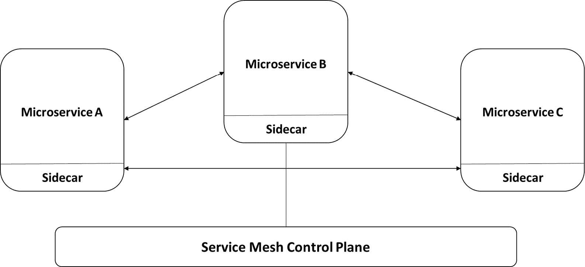

图 12.1 – 服务网格边车模式

边车代理处理来自单一服务的所有进出网络流量。因此，边车控制微服务之间的流量，收集遥测数据并应用策略。在某些方面，应用服务对网络并不知情，只知道连接到它的边车代理。

在服务网格中，存在数据平面和控制平面：

+   **数据平面**协调网格中各服务之间的通信，并执行诸如服务发现、负载均衡、流量管理、健康检查等功能。

+   **控制平面**管理和配置边车代理，以便执行策略并收集遥测数据。

服务网格提供服务发现、自动负载均衡、通过路由规则、重试、故障转移等对流量行为的精细控制等功能。它还具有可插拔的策略层和 API 配置，支持访问控制、速率限制和配额。最后，它还提供服务监控，自动收集所有流量的度量、日志和跟踪数据，并在网格中实现安全的服务间通信。

在本章中，我们将看两个流行的服务网格提供商来实现此模式：Linkerd 和 Istio。我们不会深入探讨服务网格的所有功能，而是将重点介绍使用示例应用程序进行的监控方面。

在本章中，我们将覆盖以下主题：

+   Linkerd 服务网格概述

+   启用 Linkerd 附加组件并运行示例应用程序

+   Istio 服务网格概述

+   启用 Istio 附加组件并运行示例应用程序

+   服务网格的常见用例

+   选择服务网格的指南

+   配置服务网格的最佳实践

# Linkerd 服务网格概述

Linkerd 是一个基于 Kubernetes 的服务网格。它通过提供运行时调试、可观察性、可靠性和安全性，简化并保障了服务的运行，而无需任何代码更改。

每个服务实例通过一套超轻量、透明的代理系统与 Linkerd 连接。这些代理自动处理进出服务的所有流量。它们作为高度仪表化的外部进程网络堆栈运行，向控制平面发送遥测数据并接收控制信号。Linkerd 还可以在不引入不必要延迟的情况下，衡量和管理进出服务的流量。

如前一章所讨论的，Linkerd 由控制平面组成，控制平面是一组服务，用于控制整个 Linkerd，并由数据平面组成，数据平面由透明的微代理构成，这些代理更靠近每个服务实例，并作为 Sidecar 容器运行在 Pod 中。这些代理自动处理所有进出服务的 TCP 流量，并与控制平面进行配置通信。

以下图展示了 Linkerd 的架构：

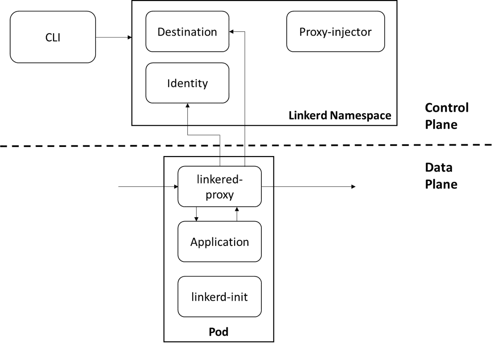

图 12.2 – Linkerd 服务网格组件

现在我们已经提供了一个高层次的概述并查看了架构，接下来让我们更详细地了解每个组件：

+   **目标服务**：数据平面代理使用目标服务来确定它们行为的各个方面。它用于检索服务发现信息，获取关于哪些类型的请求被允许的策略信息，以及检索服务配置文件信息，这些信息用于指导每条路由的度量、重试、超时等。

+   **身份服务**：身份服务充当 TLS 证书颁发机构，接受来自代理的 CSR 并签发证书。这些证书在代理初始化时颁发，并用于在代理间连接上实现 mTLS。

+   `linkerd.io/inject: enabled`) 在资源中。当该注解存在时，注入器会修改 pod 的规格，添加 `proxy-init` 和 `linkerd-proxy` 容器，并将相关的启动时配置添加到 pod 中。

+   **Linkerd2-proxy**：Linkerd2-proxy 是一个超轻量级、透明的微代理，专为服务网格用例设计，并非通用代理。

+   `linkerd-init` 容器作为 Kubernetes 的 `init` 容器，在其他容器启动之前运行。所有进出 pod 的 TCP 流量都通过 iptables 路由到代理。

现在我们已经掌握了基础知识，接下来启用 Linkerd 插件并运行一个示例应用程序。

# 启用 Linkerd 插件并运行示例应用程序

在本节中，您将启用 MicroK8s Kubernetes 集群中的 Linkerd 插件。然后，为了展示 Linkerd 的功能，您将部署一个示例应用程序。

注意

我将在本节中使用 Ubuntu 虚拟机。设置 MicroK8s 集群的说明与*第五章*中的内容相同，*创建和实施多节点 Raspberry Pi Kubernetes 集群的更新*。

## 步骤 1 – 启用 Linkerd 插件

使用以下命令启用 Cilium 插件：

```
microk8s enable linkerd 
```

以下输出表示 Linkerd 插件已经启用：

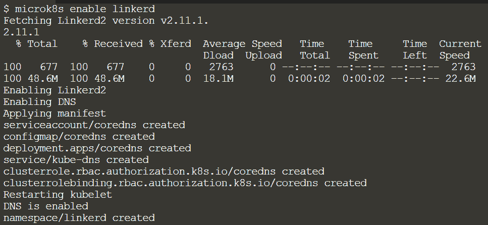

图 12.3 – 启用 Linkerd 插件

启用插件的过程需要一些时间。以下输出表明 Linkerd 已成功启用：

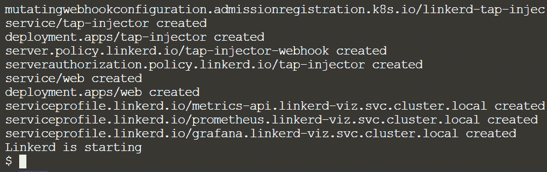

图 12.4 – 成功启用 Linkerd

在进入下一步之前，让我们使用以下命令确保所有 Linkerd 组件都已启动并运行：

```
kubectl get pods –n linkerd
```

以下输出表示所有组件均处于 `Running` 状态：

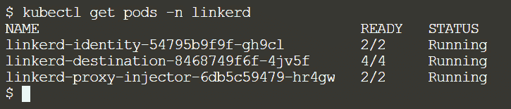

图 12.5 – Linkerd pod 正在运行

现在 Linkerd 插件已经启用，让我们部署一个示例 Nginx 应用程序。

## 步骤 2 – 部署示例应用程序

在此步骤中，我们将从 Kubernetes 示例库部署一个示例 Nginx 应用程序。

使用以下命令创建示例 Nginx 部署：

```
kubectl apply –f https://k8s.io/examples/application/deployment.yaml
```

以下输出表示部署过程中没有错误。现在，我们可以确保 pod 已被创建：

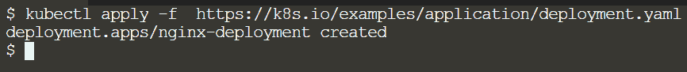

图 12.6 – 示例 Nginx 应用程序部署

现在部署成功了，让我们使用 `kubectl` 命令来检查 pods 是否处于 `Running` 状态：

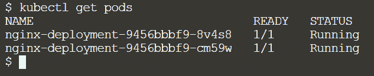

图 12.7 – 示例应用程序的 pods

在这里，我们可以看到示例应用程序的部署已成功，并且所有 pods 都在运行。我们的下一步是通过将 `linkerd inject` 和 `kubectl apply` 命令串联起来，向其注入 Linkerd。在没有任何停机时间的情况下，Kubernetes 将执行滚动部署，并更新每个 pod 的数据平面代理。

使用以下命令将 Linkerd 注入到示例应用程序中：

```
kubectl get deployment nginx-deployment –n default –o yaml | microk8s linkerd inject – | kubectl apply –f –
```

下面的输出确认了 `linkerd inject` 命令已成功，并且示例应用程序部署已重新配置：

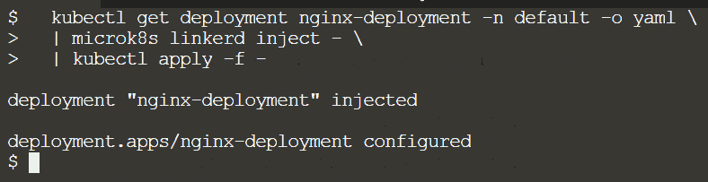

图 12.8 – 将 Linkerd 注入示例应用程序

`linkerd inject` 命令只是简单地向 pod 规范添加注释，指示 Linkerd 在创建时将代理注入到 pods 中。

恭喜！现在已将 Linkerd 添加到示例 Nginx 应用程序中！我们在不改动原始 YAML 的情况下，向示例应用程序服务添加了 Linkerd。

在数据平面方面，可以通过以下命令双重检查一切是否正常运行。使用以下命令检查数据平面：

```
microk8s linkerd check --proxy
```

Linkerd CLI (`microk8s linkerd`) 是与 Linkerd 一起工作的主要接口。它可以在集群上设置控制平面，向服务添加代理，并为服务提供详尽的性能指标。

下面的输出确认了 `linkerd check` 命令已开始对数据平面进行检查：

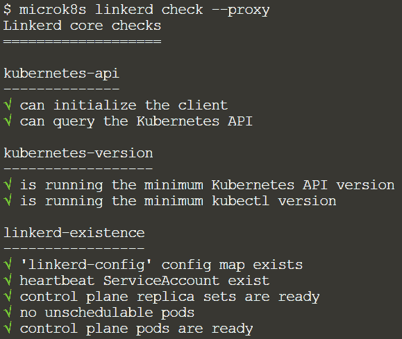

图 12.9 – Linkerd 检查

数据平面检查需要一些时间来完成。下面的输出显示 Linkerd 检查已完成：

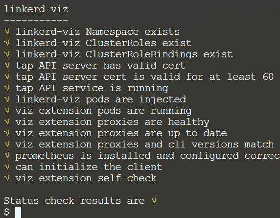

图 12.10 – Linkerd 检查完成

现在数据平面检查已完成，我们可以使用 `kubectl describe` 命令查看是否已向示例应用程序部署添加了 Linkerd 注释。

下面的输出确认了已添加 Linkerd 注释：

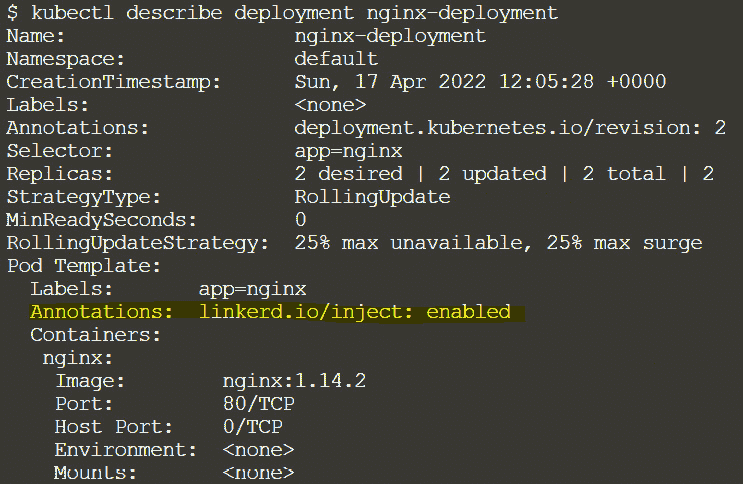

图 12.11 – 添加了 Linkerd 注释

此外，我们已经成功注入了 Linkerd，无需编写任何特殊配置或更改应用程序的代码。如果可以提供给 Linkerd 附加信息，它将能够强加各种限制，如超时和重试。然后，它可以为每个路由提供统计信息。

接下来，我们将开始检索关于示例 Nginx 部署中每个服务表现的重要信息。由于已向应用程序注入 Linkerd，我们将查看各种指标和仪表板。

## 步骤 3 – 探索 Linkerd 仪表板

Linkerd 提供了一个集群内度量堆栈，包括一个 Web 仪表板和预配置的 Grafana 仪表板。在这一步，我们将学习如何启动 Linkerd 和 Grafana 仪表板。

使用以下命令启动 Linkerd 仪表板：

```
microk8s linkerd viz dashboard
```

以下输出表明 Linkerd 仪表板已启动，并且可以在端口`50750`上访问。

要查看这些度量数据，您可以使用 Grafana 仪表板，Grafana 仪表板可以通过`http://localhost:50750/grafana`访问：

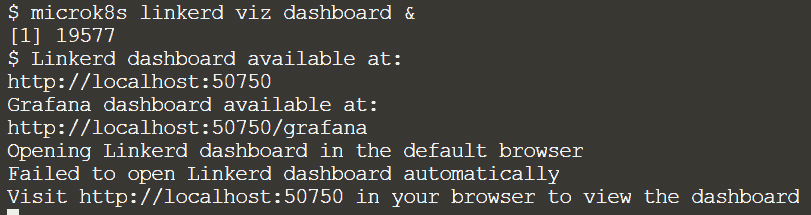

图 12.12 – 启动 Linkerd 仪表板

Linkerd 仪表板为您提供了实时查看服务状态的鸟瞰图。它可以用来查看如成功率、每秒请求数和延迟等度量数据，并可视化服务依赖关系，了解某些服务路由的健康状况：

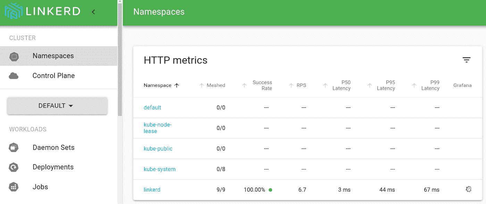

图 12.13 – Linkerd 仪表板

虽然 Linkerd 仪表板为您提供了实时查看服务状态的鸟瞰图，但 Grafana 仪表板也是 Linkerd 控制面的一部分，提供了开箱即用的服务仪表板。这些仪表板还可以用来监控服务。即使是 Pods，我们也能获取高层次的统计数据并深入了解细节：

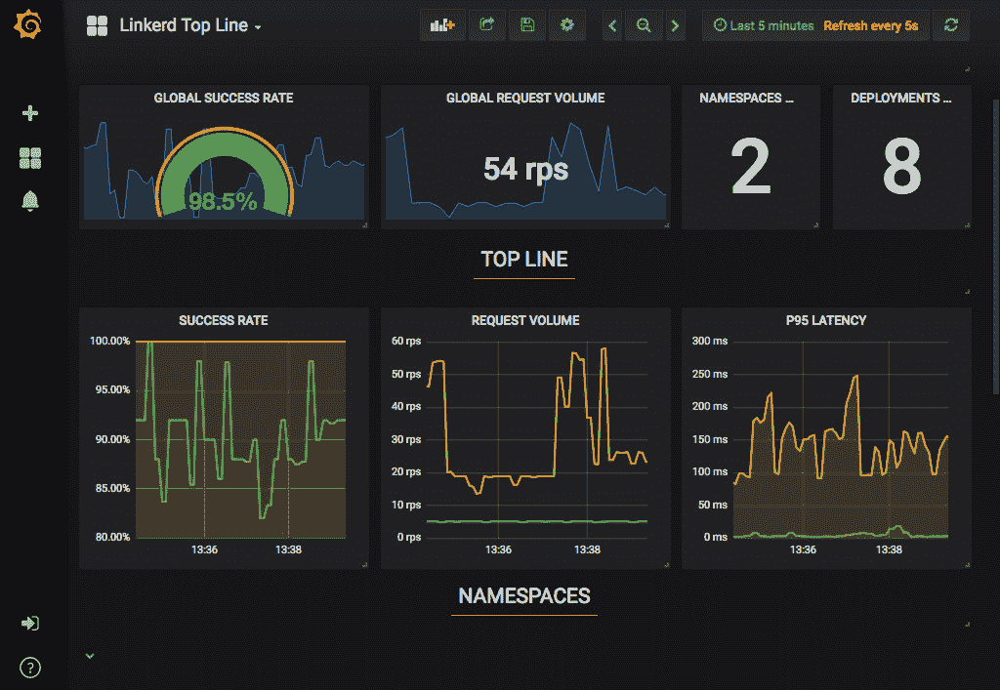

图 12.14 – Linkerd 顶级度量仪表板

总结一下，我们已在 MicroK8s Kubernetes 集群上启用 Linkerd，并使用它来监控示例 Nginx 应用程序的服务。我们还收集了相关的遥测数据，如成功率、吞吐量和延迟。之后，我们查看了一些开箱即用的 Grafana 仪表板，以查看高层次的度量数据并深入探讨细节。

在下一节中，我们将介绍 Istio，另一个著名的服务网格提供商。

# Istio 服务网格概述

Istio 是一个开源的、平台无关的服务网格，它管理流量、执行策略并收集遥测数据。它是一个管理微服务和应用程序之间通信的平台。它还为所有服务间通信提供自动化的基准流量弹性、服务度量收集、分布式跟踪、流量加密、协议升级和高级路由功能，而无需对底层服务进行任何更改。

以下是 Istio 的一些重要功能：

+   通过 TLS 加密、基于强身份的认证和授权实现安全的*服务间*通信

+   HTTP、gRPC、WebSocket 和 TCP 流量的自动负载均衡

+   通过丰富的路由规则、重试、故障转移和故障注入实现精细化流量控制

+   一个可插拔的策略层和配置 API，支持访问控制、速率限制和配额

+   自动化的度量、日志和跟踪，涵盖所有集群流量，包括集群的入口和出口流量

一个 Istio 服务网格在逻辑上被划分为两个平面：数据平面和控制平面。

数据平面由一组智能代理组成，这些代理作为边车部署。所有微服务之间的网络通信都由这些代理调解和控制。此外，它们收集并报告所有网格流量的遥测数据。

控制平面负责管理和配置用于路由流量的代理。

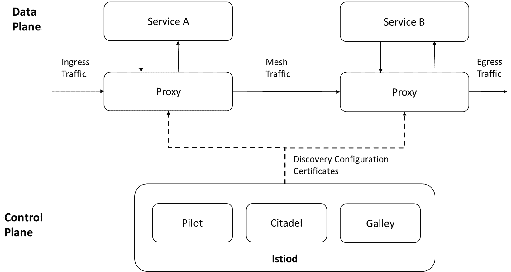

图 12.15 – Istio 组件

现在我们已经提供了高层次的概述并看过架构，让我们更详细地了解每个组件：

+   **Istiod**：它管理服务发现、配置和证书。它将高层的流量路由规则转换为 Envoy 特定的配置，并在运行时将其传播到边车。Pilot 组件将平台特定的服务发现机制进行抽象，并将其合成成标准格式，可以被任何遵循 Envoy API 的边车使用。Istio 还支持多种环境下的发现，包括 Kubernetes 和虚拟机。

+   **Envoy**：这是一款高性能的代理，调解所有进出服务网格的流量。唯一与数据平面流量交互的 Istio 组件是 Envoy 代理。Envoy 代理作为服务的边车部署，在逻辑上增强了服务，提供了许多内置功能，例如：

    +   动态服务发现

    +   负载均衡

    +   TLS 终止

    +   HTTP/2 和 gRPC 代理

    +   熔断器

    +   健康检查

    +   基于百分比流量分配的分阶段发布

    +   故障注入

    +   丰富的指标

以下是 Istio 系统的各种组件，以及它所使用的抽象：

+   **流量管理**：Istio 提供的流量路由规则使你可以轻松地控制服务之间流量和 API 调用的流向。Istio 简化了配置服务级属性（如熔断器、超时和重试）以及 A/B 测试、金丝雀发布和基于百分比的分阶段发布等重要任务。它还包括开箱即用的可靠性功能，有助于提高应用程序对依赖服务或网络故障的容错能力。

+   **可观察性**：对于所有网格服务通信，Istio 创建了广泛的遥测数据。这些遥测数据让用户能够观察服务行为，帮助他们调试、维护和优化应用程序，而无需给服务开发人员增加额外负担。用户可以全面了解被监控服务如何相互交互以及与 Istio 组件的关系。

Istio 创建以下几种遥测，以实现对整个服务网格的可观察性：

+   **指标**：基于四个监控属性，Istio 创建了一组服务指标（延迟、流量、错误和饱和度）。此外，Istio 提供了广泛的网格控制平面度量。在这些指标基础上，提供了一组基础的网格监控仪表盘。

+   **分布式追踪**：分散的追踪会生成每个服务的分布式追踪跨度，提供用户一个全面的调用流和服务关系视图，展示网格内部的调用关系。

+   **访问日志**：当流量进入网格中的服务时，Istio 会生成每个请求的完整记录，包括源和目标的元数据。用户可以利用这些信息检查服务行为，直到单个工作负载实例。

+   **安全性**：为了保护托管服务和数据，Istio 安全性包括强大的身份认证、强大的策略管理、透明的 TLS 加密、身份验证和审计工具。

现在我们已经涵盖了基础内容，可以继续下一步，即启用 Istio 插件并运行示例应用。

# 启用 Istio 插件并运行示例应用

在本节中，您将启用 MicroK8s Kubernetes 集群中的 Istio 插件。然后，您将启动示例应用来展示 Istio 的能力。

注意

在本节中，我将使用一台 Ubuntu 虚拟机。设置 MicroK8s 集群的指令与*第五章*中的*创建和实现多节点 Raspberry Pi Kubernetes 集群更新*相同。

## 第一步 – 启用 Istio 插件

使用以下命令启用 Istio 插件：

```
microk8s enable istio
```

以下输出表示 Istio 插件已成功启用：

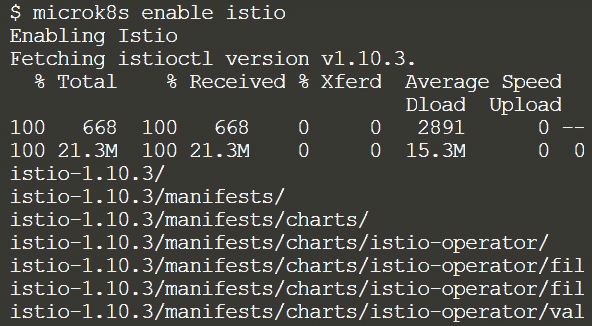

图 12.16 – 启用 Istio 插件

启用插件需要一些时间。以下输出显示 Istio 已成功启用：

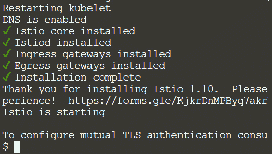

图 12.17 – Istio 插件已启用

在继续下一步之前，让我们通过以下命令确保所有 Istio 组件都已启动并正常运行：

```
kubectl get pods –n istio-system
```

以下输出表明所有组件都处于`Running`状态：

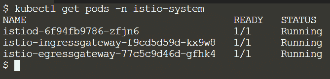

图 12.18 – Istio pod 正在运行

现在 Istio 插件已经启用，我们可以部署示例应用了。

## 第二步 – 部署示例应用

在部署示例 Nginx 应用之前，我们需要将命名空间标记为`istio-injection=enabled`，这样 Istio 就可以将 sidecar 注入到部署的 pod 中。

使用以下命令标记命名空间：

```
microk8s kubectl label namespace default istio-injection=enabled
```

以下输出表明部署没有错误。现在我们可以部署示例应用了：


图 12.19 – 标记命名空间

使用以下命令创建一个示例 Nginx 部署：

```
kubectl apply –f https://k8s.io/examples/application/deployment.yaml
```

以下输出表示部署中没有错误。现在，我们可以确保 Istio 已经被注入到 pods 中：

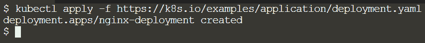

图 12.20 – 示例应用部署

部署完成后，我们可以使用 `kubectl describe` 命令检查 Istio 标签是否已添加到示例应用部署中。

以下输出确认 Istio 标签已被添加：

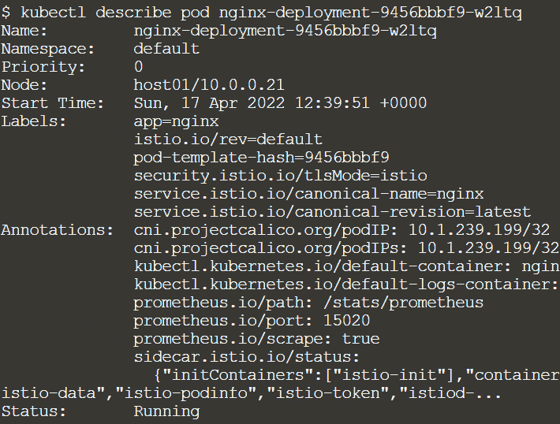

图 12.21 – 已添加 Istio 注解

我们还可以使用 `istioctl` 命令行工具获取 Istio 网格的概况：

```
microk8s istioctl proxy-status
```

以下输出表示我们的示例 Nginx 部署已与 Istiod 控制平面 `SYNCED`：

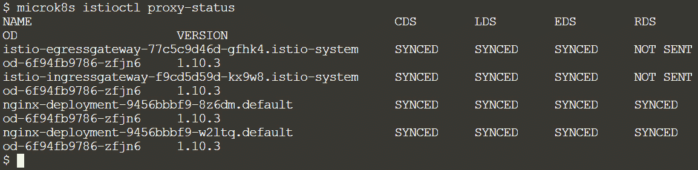

图 12.22 – Istio 代理状态

如果某些 sidecar 没有收到配置或不同步，可以使用 `proxy-status` 命令。

如果没有列出某个代理，说明它当前没有连接到 Istiod 实例：

+   `SYNCED` 表示 Envoy 代理已确认接收到 Istiod 提供的最新配置。

+   `NOT SENT` 表示 Istiod 尚未向 Envoy 代理发送任何消息。这通常是因为 Istiod 没有要发送的内容。

+   `STALE` 表示 Istiod 向 Envoy 代理发送了更新，但未收到响应。这通常表示 Envoy 代理与 Istiod 之间的网络存在问题，或 Istio 本身存在缺陷。

恭喜！你已将 Istio 代理添加到示例应用中！我们将 Istio 添加到现有服务中，而没有修改原始的 YAML。

## 步骤 3 – 探索 Istio 服务仪表盘

在网格中的所有服务通信中，Istio 创建了广泛的遥测数据。这些遥测数据可以帮助观察服务行为，使服务网格用户能够进行故障排除、维护和优化应用，而不会增加服务开发人员的工作负担。

正如我们之前讨论的，为了启用整体服务网格可观测性，Istio 创建了以下几种形式的遥测数据：

+   **指标**：根据监控性能，Istio 会生成一组服务指标（延迟、流量、错误和饱和度）。对于网格控制平面，Istio 还提供详细的指标。在这些指标的基础上，提供了一套默认的网格监控仪表盘：

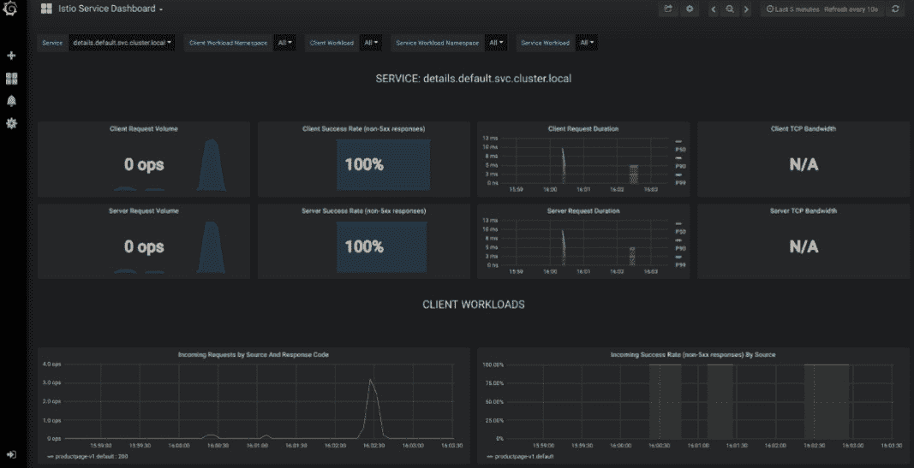

图 12.23 – Istio 服务仪表盘

资源使用仪表盘如下所示。在这里，我们可以查看关于内存、CPU 和磁盘使用的详细信息：

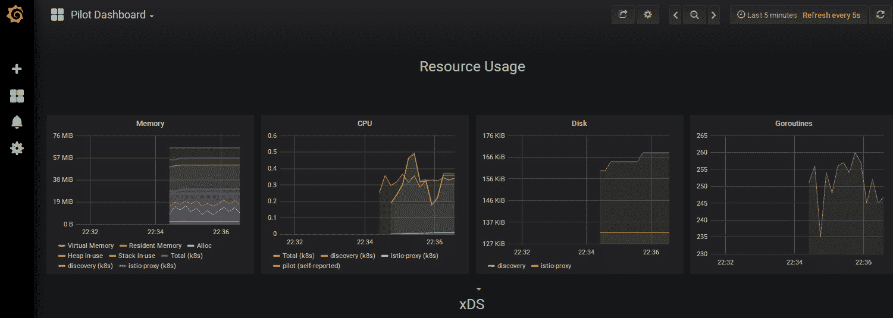

图 12.24 – Istio 资源使用仪表盘

+   **分布式追踪**：Istio 为每个服务创建分布式追踪跨度，向用户展示完整的调用流和服务依赖关系图：

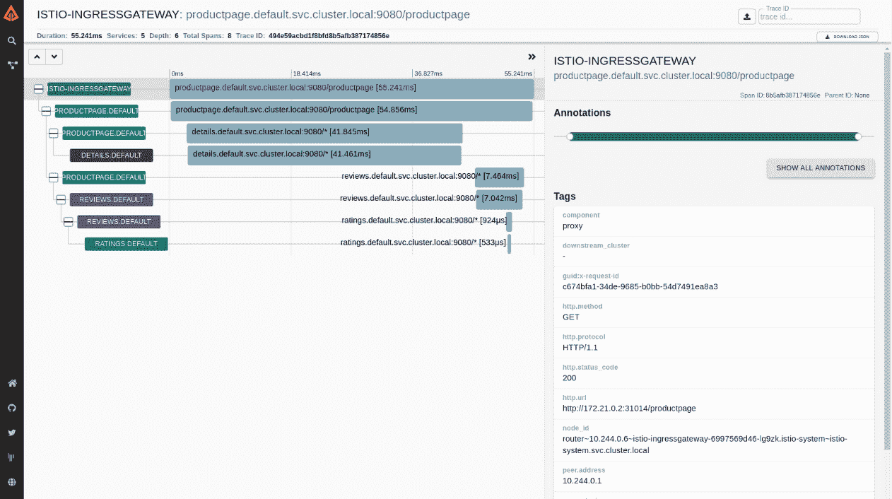

图 12.25 – Istio 分布式追踪

+   **访问日志**：Istio 为每个请求生成完整的记录，当流量进入网格中的某个服务时，包括源和目的地的元数据。用户可以利用这些数据审计服务行为，直至单个工作负载实例级别。

总结来说，我们在 MicroK8s Kubernetes 集群上部署了 Istio，并使用它来监控一个示例 Nginx 应用程序的服务。我们还查看了 Istio 服务仪表盘，利用它可以检查遥测数据进行调试、维护和改进应用程序。最后，我们了解了如何使用度量、分布式追踪和访问日志来增强整体的服务网格可观察性。

简而言之，服务网格提供了统一的发现、安全、追踪、监控和故障管理。因此，如果 Kubernetes 集群中有一个服务网格，你可以在不改变应用代码的情况下实现以下功能：

+   自动负载均衡

+   通过路由规则、重试、故障转移等实现流量行为的精细控制

+   可插拔的策略层

+   一个支持访问控制、速率限制和配额的配置 API

+   服务发现

+   对所有流量进行自动指标、日志和追踪的服务监控

+   安全的服务间通信

在大多数实现中，服务网格作为微服务架构的单一视窗。它是你用于故障排查、执行流量策略、设置速率限制和测试新代码的地方。它作为你监控、追踪和控制所有服务交互的中心点——即它们是如何连接、执行和保障的。在接下来的部分中，我们将看看一些最常见的使用案例。

# 服务网格的常见使用案例

从运营角度来看，服务网格对任何类型的微服务架构都非常有用。这是因为它允许你控制流量、安全性、权限和可观察性。以下是当前服务网格最常见、标准化且广泛接受的使用案例：

+   **提升可观察性**：通过服务级别的可见性、追踪和监控，我们可以提升分布式服务的可观察性。服务网格的一些主要特性大幅提升了可见性，以及故障排查和管理的能力。例如，如果架构中的某个服务成为瓶颈，重试通常是一个选择，尽管这可能由于超时而加剧瓶颈问题。使用服务网格，你可以快速断开与故障服务的连接，禁用无法正常工作的副本，并保持 API 的响应性。

+   **蓝绿部署**：服务网格使你能够利用蓝绿部署来成功推出新的应用升级，而不会因其流量控制功能而影响现有服务。你可以首先将新版本暴露给有限的用户群体，进行测试，之后再推广到所有生产实例。

+   **混沌猴子/生产环境测试**：为了提高部署的稳健性，还可以注入延迟和错误。

+   **现代化你的遗留应用**：如果你正在将旧应用升级为基于 Kubernetes 的微服务，可以利用服务网格作为支持工具来拆解应用。你可以将现有的应用注册为服务到服务目录中，并随着时间的推移将其迁移到 Kubernetes 上，而无需更改它们之间的通信方式。

+   **API 网关技术**：借助服务网格，你可以利用 API 网关技术实现集群内服务间连接以及复杂的 API 管理方案。服务网格充当超级粘合剂，动态地将微服务连接在一起，并提供流量控制、限制和测试功能。

随着服务网格的普及，许多新的、被广泛接受的使用案例将加入到之前列出的那些案例中。现在，让我们来看看选择服务网格提供商时需要考虑的因素。

# 选择服务网格的指南

在本节中，我们将简要比较各个服务网格提供商所提供的功能。选择一个满足基本要求的服务网格，关键在于你是否需要超出基础功能的更多特性。Istio 提供了最多的功能和灵活性，但请记住，灵活性也意味着复杂性。Linkerd 可能是支持 Kubernetes 的基本策略的最佳选择：

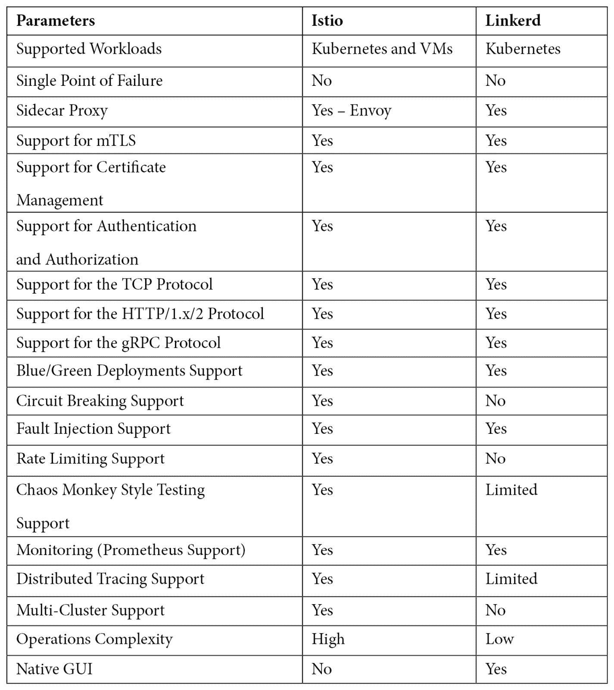

表 12.1 – Istio 与 Linkerd 服务网格的比较

现在，我们已经看过了一些选择服务网格的建议，接下来让我们看看配置服务网格的最佳实践。

# 配置服务网格的最佳实践

尽管服务网格对开发团队非常有益，但实施一个服务网格需要一些努力。服务网格提供了极大的灵活性和定制空间，因为它有许多可调组件。灵活性通常伴随着复杂性。在使用服务网格时，以下最佳实践将为你提供一些有用的指导：

+   **采用 GitOps 方法**：流量管制、速率限制和网络配置都是服务网格配置的一部分。该配置可以用来从零开始安装服务网格、更新其版本并在集群之间迁移。因此，建议将配置视为代码，并结合持续部署管道使用 GitOps。

+   **使用较少的集群**：较少的集群并且有大量服务器的表现优于多个集群和较少实例的服务网格产品。因此，最好将冗余集群的数量保持在最低限度，这样你就可以利用服务网格方法的简单操作和集中配置。

+   **使用适当的监控警报和请求追踪**：服务网格应用是管理日益复杂的分布式应用流量的高级应用。对于系统可观察性，指标收集、可视化和仪表板是至关重要的。通过你的服务网格提供的 Prometheus 或 Grafana，你可以根据需要创建警报。

+   **关注全面的安全性**：大多数服务网格系统提供互相 TLS、证书管理、身份验证和授权等安全功能。为了限制集群应用之间的通信，你可以设计并执行网络策略。然而，应该强调的是，设计网络策略并非一项简单的操作。你必须考虑未来的可扩展性，并覆盖当前正在运行的应用的所有可能性。因此，使用服务网格来执行网络策略是不方便的，并且容易出现错误和安全漏洞。谁在传输或接收数据对服务网格解决方案来说并不重要。如果网络策略允许，任何恶意或故障的应用都可以获取你的敏感数据。因此，除了依赖服务网格设备的安全功能外，思考更广泛的整体安全措施是至关重要的。

总之，服务网格使你能够将应用的业务逻辑与可观察性、网络和安全策略解耦。你可以使用它来连接、保护和监控你的微服务。

# 总结

随着单体应用被拆分为微服务，构成应用的服务数量急剧增加。管理大量实体并不容易。通过标准化和自动化服务之间的通信，Kubernetes 本地服务网格（如 Istio 或 Linkerd）解决了微服务架构中容器和服务扩展带来的问题。服务网格对安全性、服务发现、流量路由、负载均衡、服务故障恢复和可观察性进行了标准化和自动化。

在本章中，我们学习了如何启用 Linkerd 和 Istio 插件，并将边车注入到示例应用中。然后，我们检查了各自的仪表板，这使我们能够查看遥测数据，以调试、维护和改进应用。我们还研究了如何使用指标、分布式跟踪和访问日志来提升整体服务网格的可观察性。

之后，我们讨论了今天服务网格最常见的一些使用场景，并提供了一些关于如何选择合适的服务网格的建议。我们还列出了服务网格配置的最佳实践。

在下一章中，你将学习如何设置一个高可用性集群。一个高可用的 Kubernetes 集群能够承受组件故障，并且在不中断的情况下继续为工作负载提供服务。
