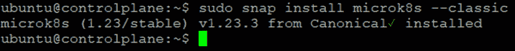
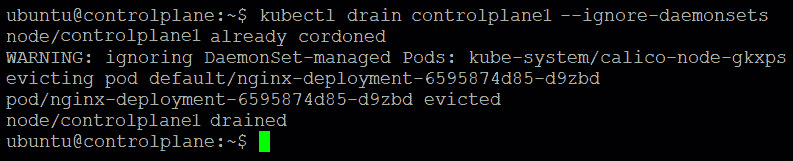

# 13

# 使用高可用性集群抵御组件故障

在上一章中，我们探讨了如何启用 Linkerd 或 Istio 服务网格附加组件并将边车注入到示例应用程序中。我们还查看了允许我们查看遥测数据的仪表板，以便进行故障排除、管理和改进应用程序。然后，我们了解了指标、分布式追踪和访问日志如何帮助整体服务网格的可观察性。我们还查看了当前一些最常见的服务网格用例，并提供了一些关于如何选择正确服务网格的建议。我们还涵盖了服务网格配置的最佳实践清单。

通过动态容器调度，Kubernetes 为分布式应用程序提供了更高的可靠性和韧性。但如何确保当组件，甚至整个数据中心站点故障时，Kubernetes 本身仍能保持运行呢？在本章中，我们将探讨如何为**高可用性（HA）**集群配置 Kubernetes 的下一个用例。

**高可用性（HA）**确保即使站点部分或完全故障，应用程序仍能持续运行。高可用性的基本目标是消除潜在的故障点。它可以在许多基础设施层级和不同的集群组件中实现。然而，适合特定情况的可用性水平由多个因素决定，包括你的业务需求、与客户的服务级别协议以及资源可用性。

Kubernetes 旨在为应用程序和基础设施提供高可用性。每个控制平面（主节点）组件都可以配置为多节点复制（多主节点设置），以提高可用性。然而，重要的是要记住，高可用性和多主节点设置并不等同。即使你有三个或更多的控制平面节点，并且只有一个 NGINX 实例在这些主节点前进行负载均衡，你也有一个多主节点集群设置，但不是高可用性设置，因为 NGINX 仍然可能随时发生故障并导致故障。

控制平面节点至关重要，因为它们运行控制、监视和维护 Kubernetes 集群状态的服务。API 服务器、集群状态存储、调度器和控制器管理器都是控制平面的一部分。如果集群中的某个控制平面节点发生故障，集群的操作和稳定性可能会受到严重影响。高可用性集群通过同时运行多个控制平面节点来解决这个问题，虽然这不能完全消除风险，但可以大大减少风险。

MicroK8s 的高可用性选项已经简化并默认启用。这意味着集群可以在节点故障的情况下继续为工作负载提供服务，不会中断。高可用性是企业部署容器和 Pod 时所需的关键特性，能够提供在大规模工作时所需的稳定性。

Canonical 的轻量级 Dqlite SQL 数据库用于实现 HA 集群功能。通过将数据库嵌入 Kubernetes，Dqlite 减少了集群的内存占用并消除了进程开销。这对于物联网和边缘应用程序来说至关重要。当 Dqlite 作为 Kubernetes 数据存储使用时，边缘的弹性 Kubernetes 集群部署得以简化。边缘应用程序现在可以在 x86 或 ARM 的普通设备上，如 Intel NUC 或树莓派板等集群，低成本地实现卓越的可靠性。本章将涵盖以下主要内容：

+   HA 拓扑概述

+   设置 HA Kubernetes 集群

+   Kubernetes HA 最佳实践

# HA 拓扑概述

在本节中，我们将介绍两种最常见的 HA 拓扑，以启用 HA 集群。Kubernetes 集群的控制平面大多是无状态的。作为整个集群唯一真实数据来源的集群数据存储是控制平面中唯一有状态的组件。内外部用户可以通过 API 服务器访问和修改状态，API 服务器作为集群数据存储的网关。MicroK8s 使用 Dqlite，这是一种分布式且高可访问性的 SQLite 变体，作为关键值数据库来保持集群的状态。

在查看 HA 拓扑之前，让我们先来看一些可能会妨碍集群操作的潜在故障场景：

+   **控制平面（主节点）丧失**：主节点或其服务的丧失将产生重大影响。集群将无法响应 API 命令或节点的部署。主节点中的每个服务，以及存储层，都是至关重要的，必须设计为 HA。

+   **集群数据存储丢失**：无论集群数据存储是运行在主节点上，还是单独设置，丢失集群数据将是灾难性的，因为它包含所有集群信息。为了避免这种情况，集群数据存储必须配置在 HA 集群中。

+   **工作节点故障**：在大多数情况下，Kubernetes 将能够自动识别并故障转移 Pods。应用程序的最终用户可能不会察觉到任何差异，具体取决于服务的负载均衡方式。如果某个节点上的 Pods 变得无响应，kubelet 将检测到这一点并通知主节点启动另一个 Pod。

+   **网络故障**：网络中断和分区可能导致 Kubernetes 集群中的主节点和工作节点变得无法访问。在某些情况下，它们将被归类为节点故障。

现在我们已经看到了几个可能的故障情况，接下来让我们看看如何通过 HA 拓扑来缓解这些问题，这些拓扑可以在运行 Kubernetes 生产工作负载时，承受一个或多个主节点的故障。

高可用 Kubernetes 集群的拓扑可以通过两种方式进行配置，具体取决于集群数据存储的配置方式。第一种拓扑基于堆叠式集群设计，每个节点承载一个 Dqlite 实例以及控制平面。在每个控制平面节点上运行 `kube-apiserver` 实例、`kube-scheduler` 实例和 `kube-controller-manager` 实例。负载均衡器将 `kube-apiserver` 实例暴露给工作节点。

每个控制平面节点生成一个本地 Dqlite 成员，该成员仅与该节点的 `kube-apiserver` 实例进行通信。本地的 `kube-controller-manager` 实例和 `kube-scheduler` 实例相同。

在这种拓扑结构中，控制平面和本地 Dqlite 成员在同一节点上相连。该设计更容易设置和管理用于复制。然而，堆叠式集群容易受到失效耦合的影响。当一个节点发生故障时，本地 Dqlite 成员和控制平面实例会丢失，从而使冗余性面临风险。通过增加更多的控制平面节点，可以降低这种威胁。

因此，对于高可用 Kubernetes 集群，这种设计至少需要三个堆叠式控制平面节点，如*图 13.1*所示：


图 13.1 – 堆叠式控制平面拓扑

第二种拓扑利用了安装并由一组独立主机控制的外部 Dqlite 集群。

在这种架构中，每个控制平面节点运行一个 `kube-apiserver` 实例、一个 `kube-scheduler` 实例和一个 `kube-controller-manager` 实例，每个 Dqlite 主机与每个控制平面节点的 `kube-apiserver` 实例进行通信：


图 13.2 – 外部集群数据存储的拓扑结构

在这种拓扑结构中，控制平面和本地 Dqlite 成员是解耦的。因此，它提供了一种高可用配置，其中失去一个控制平面实例或 Dqlite 成员的影响较小，并且不像堆叠式高可用架构那样影响集群的冗余性。

然而，这种设计需要比堆叠式高可用拓扑多出两倍的主机数量。采用这种拓扑的高可用集群至少需要三台主机作为控制平面节点，以及三台主机作为 Dqlite 节点。

在下一节中，我们将介绍使用堆叠式集群高可用拓扑设置高可用集群的步骤。高可用 MicroK8s 所需的仅仅是集群中的三个或更多节点，之后 Dqlite 会自动变为高可用。如果集群有超过三个节点，额外的节点将被指定为数据存储的备用候选节点，并在数据存储的某个节点发生故障时自动提升。备用节点自动提升为 Dqlite 投票集群，使得高可用 MicroK8s 自给自足，并确保即使没有执行任何管理操作，也能保持法定人数。

# 设置 HA Kubernetes 集群

我们将配置并实施一个高可用性（HA）MicroK8s Kubernetes 集群，采用之前讨论过的堆叠集群 HA 拓扑结构。我们将使用三台节点，在每个节点上安装并配置 MicroK8s，并模拟节点故障，查看集群是否能抵抗组件故障并按预期运行。

总结一下，控制平面由 HA 集群中的所有节点运行。集群中的一部分节点（至少三个）保留 Kubernetes 集群数据存储的副本（Dqlite 数据库）。使用投票程序选举数据库维护的领导节点。除了投票节点之外，还有非投票节点，它们悄悄地存储数据库的副本。这些节点准备替代离开的投票节点。最后，有些节点既不投票也不复制数据库，这些节点被称为备用节点。总结一下，三个节点角色如下：

+   **投票节点**：复制数据库，参与选举领导节点

+   **待命节点**：复制数据库，*不*参与选举领导节点

+   **备用节点**：*不*复制数据库，*不*参与选举领导节点

管理员不需要监控集群的形成、数据库同步或投票和领导选举的过程，因为这些都是透明的并且已经处理好了。*图 13.3* 展示了我们的 Raspberry Pi 集群设置：


图 13.3 – 完全功能的 HA 集群设置

现在我们知道了想要做什么，让我们来看一下要求。

## 要求

在开始之前，以下是构建 Raspberry Pi Kubernetes 集群的先决条件：

+   一张 microSD 卡（至少 4 GB，推荐 8 GB）

+   一台带有 microSD 卡槽的计算机

+   一台 Raspberry Pi 2、3 或 4（至少三台节点）

+   一根 micro-USB 电源线（Pi 4 使用 USB-C 电缆）

+   一条 Wi-Fi 网络或带有互联网连接的以太网电缆

+   一台带有 HDMI 接口的显示器（可选）

+   一根适用于 Pi 2 和 Pi 3 的 HDMI 电缆，或适用于 Pi 4 的 micro-HDMI 电缆（可选）

+   一只 USB 键盘（可选）

现在我们已经确定了设置 HA MicroK8s Kubernetes 集群的要求，接下来将进入逐步说明如何完成这一过程。

## 步骤 1 – 创建 MicroK8s Raspberry Pi 集群

请按照我们在 *第五章* 中介绍的步骤，*创建并实现多节点 Raspberry Pi Kubernetes 集群的更新*，来创建 MicroK8s Raspberry Pi 集群。以下是简要回顾：

1.  将操作系统镜像安装到 SD 卡中：

    1.  配置 Wi-Fi 访问设置。

    1.  配置远程访问设置。

    1.  配置控制组设置。

    1.  配置主机名。

1.  安装并配置 MicroK8s。

1.  向集群添加额外的控制平面节点和工作节点。

注意

从 MicroK8s 1.23 版本开始，现在可以选择添加仅作为工作节点的节点。这类节点不执行控制平面，也不为集群的高可用性做出贡献。另一方面，它们消耗较少的资源，因此适用于低端设备。仅作为工作节点的节点在执行 Kubernetes 工作负载的节点不可靠或无法信任其承载控制平面的系统中也非常适用。

要将一个仅作为工作节点的节点添加到集群中，请在运行 `microk8s join` 命令时使用 `--worker` 标志：

**microk8s join 192.168.1.8:25000/92b2db237428470dc4fcfc4ebbd9dc81/ 2c0cb3284b05 --worker**

一个 Traefik 负载均衡器运行在工作节点上，允许本地服务（kubelet 和 kube-proxy）与多个控制平面节点上运行的 API 服务器之间的通信。当添加一个工作节点时，MicroK8s 会尝试发现集群中所有 API 服务器的端点，并正确设置新节点。在本节中，我们将不使用仅作为工作节点的节点，而是使用同时承载控制平面的工作节点。

我们将重复在*第五章*中介绍的方法，*创建和实施多节点 Raspberry Pi Kubernetes 集群的更新*，以用于我们当前的设置，具体内容如下表所示：


表 13.1 – Raspberry Pi 集群设置

现在我们已经明确了目标，我们将逐步在每个 Raspberry Pi 板上安装和配置 MicroK8s，然后将多个部署结合起来，构建一个功能完整的集群。

### 安装和配置 MicroK8s

SSH 登录到控制平面节点并安装 MicroK8s Snap：

```
sudo snap install microk8s --classic
```

以下命令执行输出确认 MicroK8s Snap 已成功安装：



图 13.4 – MicroK8s 安装

以下命令执行输出确认 MicroK8s 正在成功运行：


图 13.5 – 检查您的 MicroK8s 集群

如果安装成功，您应该会看到以下输出：


图 13.6 – 验证节点是否处于准备就绪状态

在其他节点上重复 MicroK8s 安装过程。

下一步是将控制平面节点和工作节点添加到集群中。打开 PuTTY shell 连接到控制平面节点并运行以下命令以生成连接字符串：

```
sudo microk8s.add-node
```

以下命令执行输出验证该命令已成功执行，并提供连接字符串的说明：


图 13.7 – 生成用于添加节点的连接字符串

如前面命令执行的输出所示，连接字符串以 `<control plane_ip>:<port>/<token>` 的形式生成。

### 添加额外的控制平面节点

我们现在拥有与控制平面节点连接的连接字符串。打开 PuTTY shell 连接到 `controlplane1` 节点，运行 `join` 命令将其添加到集群：

```
microk8s join <control plane_ip>:<port>/<token>
```

命令成功执行，节点已加入集群，输出如下所示：


图 13.8 – 向集群添加额外的控制平面节点

由于我们已经添加了一个额外的控制平面节点，接下来我们将向集群添加一个工作节点，以便模拟节点故障，看看集群是否能抵抗组件故障并按预期工作。

### 添加一个工作节点

我们现在拥有与控制平面节点连接的连接字符串。打开 PuTTY shell 连接到工作节点，运行 `join` 命令将其添加到集群：

```
microk8s join <control plane_ip>:<port>/<token>
```

命令成功执行，节点已加入集群，输出如下所示：


图 13.9 – 向集群添加一个工作节点

如前面命令执行的输出所示，您应该能够在几秒钟内在控制平面上看到新节点。

使用以下命令验证新节点是否已被添加到集群：

```
kubectl get nodes
```

以下命令执行输出显示 `controlplane`、`controlplane1` 和 `worker2` 是集群的一部分：


图 13.10 – 集群已准备就绪，控制平面和 worker2 是集群的一部分

一个完全功能的多节点 Kubernetes 集群看起来就像*图 13.3*所示。总结一下，我们已经在 Raspberry Pi 板上安装了 MicroK8s，并将多个部署加入集群。我们还向集群中添加了控制平面节点和工作节点。

现在我们已经有了一个完全功能的集群，我们将继续下一步，检查高可用性（HA）设置。

## 步骤 2 – 检查 HA 设置

由于我们有多个节点运行控制平面，MicroK8s 的 HA 会自动实现。要实现 HA Kubernetes 集群，需要满足三个条件：

+   在任何时候，都必须有多个节点可用。

+   控制平面必须运行在多个节点上，以确保即使一个节点失败，集群也不会变得不可用。

+   集群状态必须存储在一个高度可访问的数据存储中。

我们可以使用以下命令检查当前 HA 集群的状态：

```
microk8s status
```

以下命令执行输出确认 HA 已经实现，并显示了数据存储主节点。由于我们只有三台节点，备用节点被设置为 `none`；如果增加节点，这些额外的节点将会被指定为数据存储的备用候选节点，如果其中一个数据存储节点发生故障，将会自动晋升为主节点：


图 13.11 - 检查 MicroK8s 高可用集群

恭喜！你现在已经拥有一个安全、分布式、高可用的 Kubernetes 集群，已经准备好作为生产级别的 MicroK8s 集群环境使用。在下一节中，我们将会在我们刚刚创建的 MicroK8s 集群上部署一个示例应用程序。

## 第三步 - 部署示例容器化应用程序

在本节中，我们将在我们的多节点高可用 MicroK8s 集群环境中，从 Kubernetes `examples` 仓库部署 NGINX 部署。

以下命令将部署示例应用程序：

```
kubectl apply -f https://k8s.io/examples/controllers/nginx-deployment.yaml
```

以下命令执行输出表明部署没有错误，在接下来的步骤中，我们可以使用 `get deployments` 命令验证这一点：


图 13.12 - 示例应用程序部署

以下命令执行输出显示了部署的相关信息：


图 13.13 - 示例应用程序部署已处于就绪状态

让我们使用以下命令检查 Pods 的运行位置：

```
kubectl get pod –o=custom-columns=NODE:.spec.nodeName,NAME:.metadata.name
```

以下命令执行输出表明 Pods 在各节点之间分布均匀：


图 13.14 - Pods 在各节点上的分布

太棒了！我们刚刚在 Raspberry 多节点高可用集群上部署了示例应用程序。总结来说，我们构建了一个 Kubernetes Raspberry Pi 集群，并使用它来部署了一个示例应用程序。接下来，我们将进行一些测试，检查我们的集群在面对故障时的抗压能力。

注意

如果在多节点高可用集群上启用了附加组件，并且为附加组件下载并安装了客户端二进制文件，则这些二进制文件只会在启用了附加组件的特定节点上可用。

## 第三步 - 模拟控制平面节点故障

为了模拟节点故障，我们将使用`cordon`命令将节点标记为`unschedulable`。如果节点处于不可调度状态，Kubernetes 控制器将不会在该节点上调度新的 Pods。

让我们在 `controlplane1` 节点上使用 `cordon`，以模拟控制平面故障。使用以下命令将节点标记为不可调度：

```
kubectl cordon controlplane1
```

以下命令执行输出显示 `controlplane1` 已被标记为不可调度：


图 13.15 - 将 controlplane1 节点标记为不可调度

即使 `controlplane1` 节点已被隔离，现有的 Pod 仍然会继续运行。现在我们可以使用 `drain` 命令删除所有 Pod。使用以下命令来排空该节点：

```
kubectl drain –force --ignore-daemonsets controlplane1
```

使用 `--ignore-daemonsets` 标志来排空包含由 DaemonSet 管理的 Pod 的节点。

以下命令执行输出显示，运行在 `controlplane1` 上的 Pod 已成功删除：



图 13.16 – 排空 controlplane1 节点

因为控制平面由 HA 集群中的所有节点运行，如果某个控制平面节点（例如 `controlplane1`）失败，集群决策可以切换到另一个控制平面节点，并继续正常工作，几乎不会有中断。

作为新控制平面决策的一部分，Kubernetes 控制器将在 Pod 被删除后尽快重建新的 Pod，并将其调度到其他节点。由于调度已被禁用（因为我们已经隔离了 `controlplane1` 节点），新 Pod 不能被调度到同一节点上。

让我们使用 `kubectl get pods` 命令查看 Pod 正在运行的位置。以下命令执行输出显示，新 Pod 已重新调度到 `controlplane` 节点：


图 13.17 – Pod 在节点间的重新分配

以下命令执行输出显示，尽管控制平面节点之一失败，部署也已恢复：


图 13.18 – 部署已处于就绪状态

几乎所有的 HA 集群管理对于管理员来说都是不可见的，并且需要最小的配置。只有管理员才能添加和移除节点。为了确保集群的健康，应该考虑以下参数：

+   如果领导节点被*移除*，比如崩溃后永远无法恢复，集群可能需要最多 5 秒钟的时间来选举新的领导者。

+   将非选民节点转换为选民节点最多可能需要 30 秒。当一个新节点加入集群或选民节点失败时，就会发生这个提升。

总结来说，我们使用堆叠式集群 HA 拓扑配置并实现了一个高可用的 MicroK8s Kubernetes 集群。我们使用三个节点，在每个节点上安装并配置了 MicroK8s，同时模拟节点故障以查看集群是否能承受组件故障并继续按预期工作。在下一节中，我们将讨论一些实施生产级 Kubernetes 集群的最佳实践。

# Kubernetes HA 最佳实践

随着人们对 Kubernetes 的熟悉，平台的使用趋势趋向于更高级的应用，比如用户在高可用性架构中部署 Kubernetes，以确保生产环境的持续正常运行。根据最近的 *Kubernetes 和云原生操作报告，2022*（[`juju.is/cloud-native-kubernetes-usage-report-2022`](https://juju.is/cloud-native-kubernetes-usage-report-2022)），许多受访者似乎正在利用 Kubernetes 的高可用架构来处理对数据安全性要求较高的应用。

在本节中，我们将介绍一些在 Kubernetes 中部署高可用应用的最佳实践。这些指南基于我们在 *第五章* 中看到的内容，*在多节点 Raspberry Pi Kubernetes 集群上创建和实现更新*。

如你所知，在 Kubernetes 中部署一个基本的应用设置非常简单。然而，要使你的应用程序可用且具有容错能力，则意味着会遇到一系列挑战和问题。通常，实施高可用性（HA）需要以下几个方面：

+   **确定应用程序的预期可用性水平**：允许的停机时间因应用程序和业务目标而异。

+   **为你的应用提供冗余且可靠的控制平面**：控制平面管理集群状态，并有助于应用程序对用户的可用性。

+   **为你的应用提供冗余且可靠的数据平面**：这意味着将数据复制到所有集群节点。

在部署 Kubernetes 高可用性时，需要考虑和决策的因素有很多，这些因素可能会影响应用程序及其操作和存储资源的消耗。以下是一些需要考虑的事项：

+   **使用副本**：使用副本而非 Pods 来部署高可用应用。使用副本可以确保你的应用始终在一致的 Pod 集合上运行。为了使应用程序被声明为最小可访问，必须至少有两个副本。

+   `Ready` 状态下降至更新前 75% 的水平。因此，在更新过程中，应用程序的计算能力可能降至正常水平的 75%，从而导致部分失败（应用程序性能降级）。`RollingUpdate.maxUnavailable` 参数让你选择升级过程中可以下线的最大 Pod 百分比。因此，要么确保你的应用程序在 25% 的 Pod 不可用的情况下仍能正常运行，要么降低 `maxUnavailable` 参数。根据应用的需求，还可以评估其他部署策略，如蓝绿部署和金丝雀发布等，以获得比默认策略更好的替代方案。

+   **正确的节点大小配置**：可以分配给 Pod 的最大内存量由节点的大小决定。对于生产集群，节点的大小通常足够大（2.5 GB 或更大），能够承载任何宕机节点的工作负载。

+   **用于 HA 的节点池**：生产工作负载的节点池应至少包含三个节点，以提供高可用性（HA）。这可以让集群在某个节点不可用时，能够将工作调度到其他节点。

+   在应用程序规范中为所有部署使用 `request` 和 `limit` 对象：

    1.  **请求**：指定一个 Pod 在节点上调度前所需的资源数量（如 CPU 和内存）。如果节点缺乏所需资源，Pod 将无法调度。这可以防止将 Pod 调度到已经超负荷的节点上。

    1.  **限制**：指定一个 Pod 在节点上允许使用的资源数量（如 CPU 和内存）。这可以防止 Pod 占用过多资源，从而可能影响其他 Pod 的运行。

+   **设置 Pod 中断预算**：为了避免生产环境中的中断，例如在集群升级时，可以配置 Pod 中断预算，限制同一时间内可以停机的副本 Pod 数量。

+   **确保集群已升级**：确保利用最新的功能、安全补丁和稳定性改进。

+   **避免单点故障**：Kubernetes 通过提供冗余组件并确保应用容器可以跨多个节点调度，从而提高可靠性。为了实现高可用性（HA），可以使用反亲和性或节点选择来帮助将应用分散到 Kubernetes 集群中。基于标签，节点选择允许你指定集群中哪些节点有资格运行你的应用。标签通常描述节点属性，如带宽或专用资源，如 GPU。例如，为了正确地提交数据变更，Apache ZooKeeper 需要一个服务器的多数节点。一个三节点的集群中，两个节点必须是健康的，写操作才会成功。因此，可靠的部署必须确保服务器分布在不同的故障域中。

+   **使用存活性和就绪性探针**：默认情况下，Kubernetes 会立即将流量转发到应用程序容器。通过配置健康检查，可以在应用程序 Pod 准备好接收流量或变得不可响应时通知 Kubernetes，从而提高应用程序的稳定性。

+   `startupProbe` 或 `readinessProbe`，可以使用 `initContainers` 来检查外部依赖项。对于 `initContainers`，无需更改应用程序代码。也不需要在容器中嵌入额外工具来检查应用程序容器中的外部依赖项。

+   **使用大量描述性标签**：标签非常强大，因为它们是任意的键值对，可以帮助你在集群中逻辑地组织所有 Kubernetes 工作负载。

+   **使用 sidecar 进行代理和监视**：有时，需要一组进程与另一个进程进行通信。然而，你不希望所有这些进程都在一个容器中运行，而是希望它们在一个 Pod 中运行。当你在运行一个代理或监视程序，而你的进程依赖于它时，这种情况也是如此。例如，对于一个依赖的数据库，凭据不会硬编码到每个容器中。相反，你可以将凭据作为一个代理部署在 sidecar 中，确保安全地处理连接。

+   **自动化你的 CI/CD 流水线，避免手动 Kubernetes 部署**：因为每天可能有大量部署，这种策略通过消除易出错的手动任务，为团队节省了大量时间。

+   在同一集群中使用 `Prod`、`Dev` 和 `Test` 命名空间，你还可以利用命名空间限制资源数量，从而避免一个有问题的进程占用所有集群资源。

+   **监控控制平面**：这有助于识别集群中的问题或威胁，并增加延迟。建议使用自动化监控工具，而不是手动管理警报。

总结一下，我们回顾了优化 Kubernetes 环境的一些最佳实践。

# 摘要

在本章中，我们探讨了如何使用堆叠集群 HA 拓扑设置 HA MicroK8s Kubernetes 集群。我们利用三台节点在每台节点上安装和配置 MicroK8s，并模拟节点故障，查看集群是否能够容忍组件故障并继续正常运行。

我们讨论了一些在生产就绪集群中实现 Kubernetes 应用程序的最佳实践。我们还提到，MicroK8s 的 HA 选项已经简化，并默认启用。

高可用性（HA）是组织在部署容器和 Pod 时，提供大规模可靠性所需的重要特性。我们还认识到 Canonical 的轻量级 Dqlite SQL 数据库的价值，它用于提供 HA 集群。通过将数据库嵌入 Kubernetes，Dqlite 减少了集群的内存占用，并消除了进程开销。对于物联网（IoT）或边缘计算应用，这一点至关重要。

在下一章中，我们将探讨如何使用 Kata Containers，一种安全的容器运行时，通过利用硬件虚拟化技术提供更强的工作负载隔离。
