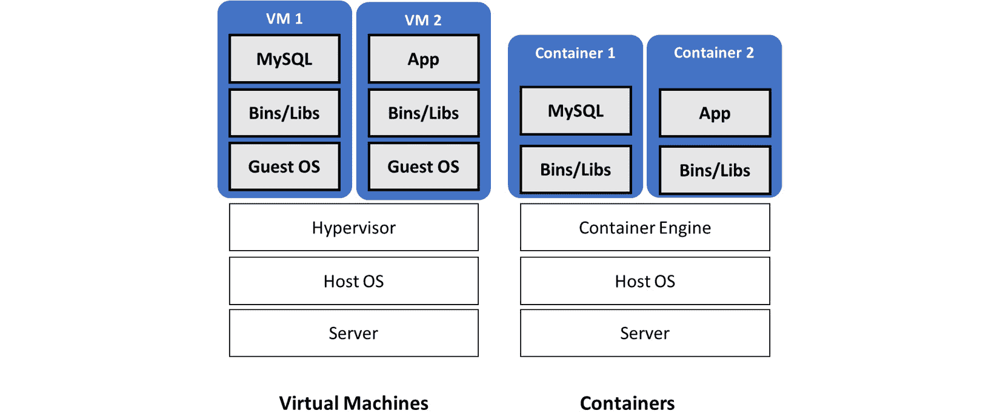
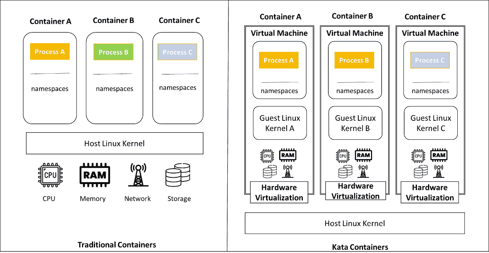
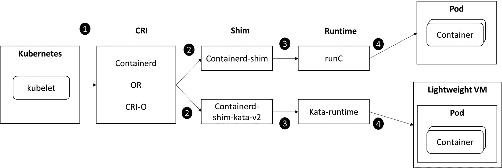
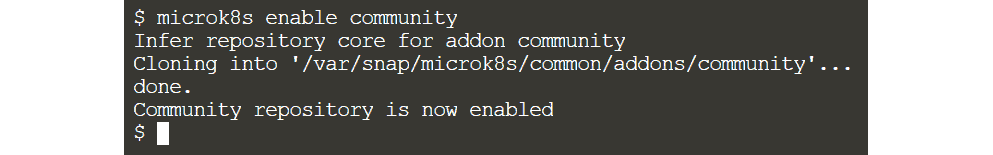
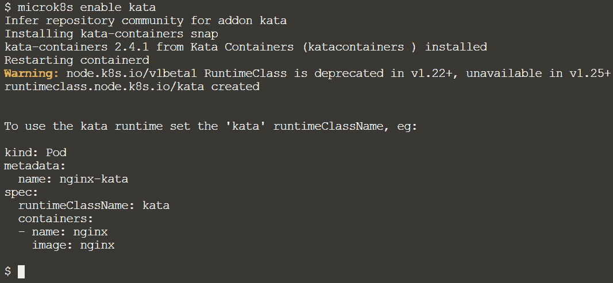
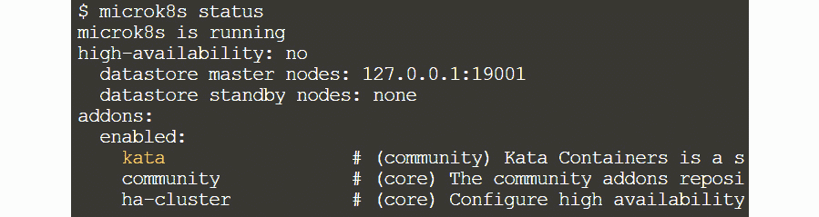

# 第十四章：用于保护容器的硬件虚拟化

在上一章中，我们看到如何使用堆叠集群**高可用性**（**HA**）拓扑创建高可用的 MicroK8s Kubernetes 集群。我们在三个节点上安装和配置了 MicroK8s，并模拟了节点故障，以查看集群是否能够抵抗组件故障并正常工作。我们还讨论了在生产就绪的集群上部署 Kubernetes 应用程序的一些最佳实践。我们注意到 MicroK8s 的 HA 选项现在也已经被简化，并默认激活。

容器技术在近年来主导了行业，并成为构建现代 IT 基础设施的事实标准。由于其轻量化设计和接近裸机的性能，它们经常优先于标准的**虚拟机（VMs）**。然而，安全性和隔离性是最常见的采用问题之一（参考 2022 年发布的 Kubernetes 和云原生运营报告，网址为[`juju.is/cloud-native-kubernetes-usage-report-2022`](https://juju.is/cloud-native-kubernetes-usage-report-2022)）。在本章中，我们将看看如何使用 Kata Containers 创建安全的容器运行时，并利用硬件虚拟化技术提供更好的工作负载隔离。

在了解什么是 Kata Containers 之前，让我们回顾一下容器的运作方式及其与虚拟化技术的关系。容器更像是一个**VM**，允许将软件及其所有依赖项打包为一个单独的实体，在任何支持的环境中执行。

另一方面，VMs 更大且设置时间更长。与 VMs 相比，容器的占用空间大大降低，因此设置（和拆除）速度更快。与保留整个操作系统副本的 VMs 不同，容器仅共享主机系统的操作系统内核。



图 14.1 – VMs 与容器的比较

容器运行时是桥接软件，允许主机系统为容器分离其资源，拆除容器镜像，并管理容器生命周期。Kubernetes 集群的每个节点都必须安装容器运行时。

Canonical MicroK8s 已经简化了启用 Kata Containers（一种容器运行时）的过程，只需一条命令即可大大提高您的容器操作的安全性和隔离性。它结合了增强安全性等优点的虚拟化监控程序与 Kubernetes 的容器编排功能。在本章中，我们将介绍以下主要内容：

+   Kata Containers 概述

+   启用 Kata 插件并运行示例应用程序

+   容器安全最佳实践

# Kata Containers 概述

**开放容器接口**（**OCI**）是 Linux 基金会的一个倡议，旨在为 Linux 容器建立原则、标准和规范。OCI 运行时规范主要涉及多系统（包括 Linux、Windows 和 Solaris）的容器生命周期管理和配置。低级运行时是符合 OCI 规范的容器运行时，主要负责容器的创建和管理。由 Docker 设计，runC 是低级容器运行时的一个示例，并且是低级容器运行时的标准。

低级运行时是本机运行时，这意味着它们在主机内核上运行容器化进程。还有一些沙盒化和虚拟化运行时，通过不在主机内核上运行进程来提供改进的进程隔离。Kata Containers 是虚拟化运行时之一。为了运行容器化进程，这些运行时使用类似于容器的 VM 接口，但具有 VM 的工作负载隔离和安全性优势。

最初发布 Kubernetes 时，Docker 运行时是默认的容器运行时。随着平台的发展，支持不同运行时的需求也在增加。

**容器运行时接口**（**CRI**）旨在使 Kubernetes 更具运行时无关性。这是一个高级规范，主要关注容器编排。与 OCI 不同，CRI 处理容器管理的额外方面，如镜像管理、快照和网络，而将容器执行留给符合 OCI 规范的运行时（例如 runC）。

Kata Containers（[`katacontainers.io/`](https://katacontainers.io/)）是一个开源项目，旨在创建一个安全且符合 OCI 标准的容器运行时，通过将每个容器封装在轻量级 VM 中并利用硬件虚拟化来提高容器工作负载的安全性和隔离性。每个 VM 都有自己的内核。

如*图 14.2*所示，传统容器采用 runC 作为容器运行时，依赖诸如 cgroups 和命名空间等内核特性以在共享内核中实现隔离；然而，Kata Containers 利用硬件虚拟化将容器隔离在其自己的轻量级 VM 中，具体如下：



图 14.2 – 传统容器与 Kata Containers 的对比

Kata Containers 在与现有容器编排技术（如 Kubernetes）无缝集成的能力方面具有多个优势。在启动 VM 时，仍然可以使用本地 Kubernetes 功能，例如自动扩展和滚动更新。这使得虚拟化技术的优势能够与容器编排能力结合起来。在接下来的部分中，我们可以看看如何使用 kata-runtime 实例化 Kata 容器。

## Kata 容器的工作原理

当 Kubernetes 集群配置了高层次运行时，如 containerd 或 CRI-O 时，会安装一个容器运行时 shim，以确保 CRI（containerd 或 CRI-O）与低级容器运行时（如 runC，默认运行时）之间的顺畅通信，且该低级容器运行时负责在 Pod 中运行容器。



图 14.3 – Kata 容器的工作原理

创建具有隔离内核和命名空间的 Kata 容器的步骤如下：

1.  Kubernetes 被配置为使用高层次容器运行时，如**containerd**或**CRI-O**。

1.  容器运行时 shim（**containerd-shim**）充当 CRI（containerd 或 CRI-O）与低级容器运行时（如 runC，默认运行时）之间的桥梁，以确保顺畅的通信。

1.  低级容器运行时（如 runC 或 kata-runtime）负责在 Pod 中运行容器。

1.  Kata 容器使用运行时类（kata-runtime）在独立的内核和命名空间中运行容器。

容器可以通过`containerd-shim-kata-v2`在轻量级虚拟机中运行，这是一种新型 shim，充当 containerd 与`kata-runtime`之间的桥梁，同时还需要启用 Kata 容器的运行时类以便在独立的内核和命名空间中运行容器。

简而言之，Kata 是一个容器运行时，它提供了容器之间更强的隔离，同时保持其他运行时的性能和效率。以下是它的一些显著特点：

+   **安全性**：它运行在专用和隔离的内核中，可以轻松与 containerd 或其他任何容器运行时集成。它还支持多个虚拟化管理程序，如 QEMU、Cloud Hypervisor 和 Firecracker。

+   **与 Docker 和 Kubernetes 的兼容性**：通过提供 kata-runtime 作为容器运行时，它可以与 Docker 和 Kubernetes 轻松配合使用。

+   **性能**：它与其他任何 Linux 容器具有相同的一致性，但隔离性更强。它还支持 AMD64、ARM、IBM pSeries 和 IBM zSeries 平台。

+   **简化**：无需在虚拟机内嵌套容器，也无需牺牲容器速度。

除了虚拟化运行时或 Kata 容器，还有各种技术可以隔离容器（参考[`thenewstack.io/how-to-implement-secure-containers-using-googles-gvisor/`](https://thenewstack.io/how-to-implement-secure-containers-using-googles-gvisor/)），每种技术都有一套适合特定应用的属性。选择适合您应用的技术是容器安全架构的关键部分。

现在我们已经掌握了 Kata 容器的基本原理，可以继续下一步，启用 Kata 附加组件并运行示例应用程序。

# 启用 Kata 附加组件并运行示例应用程序

在本节中，我们将介绍在 MicroK8s Kubernetes 集群中启用 Kata 插件的过程。然后，为了展示 Kata 的能力，我们将部署一个示例应用。

注意

本节我们将使用一台 Ubuntu 虚拟机。设置 MicroK8s 集群的步骤与*第五章**,* *创建并实施多节点树莓派 Kubernetes 集群更新*中的说明相同。

## 步骤 1 – 启用 Kata 插件

从 MicroK8s v1.24 开始，必须执行`enable community`命令才能启用 community 插件仓库。

使用以下命令启用`community`仓库：

```
microk8s enable community 
```

启用插件需要一些时间，以下命令执行输出显示`community`仓库已成功启用：



图 14.4 – 启用 community 仓库

现在我们已经启用了`community`仓库，接下来可以进行启用 Kata 插件的下一步操作。

使用以下命令启用 Kata 插件：

```
microk8s enable kata 
```

以下命令执行输出表明 Kata 插件正在启用中：



图 14.5 – 启用 Kata 插件

从前面的命令执行输出中，我们可以看到`kata runtimeClassName`（kata）已被添加，这使我们可以指定哪些工作负载应在 Kata 容器中启动。

注意

`--runtime-path`参数还可以用来指定 Kata 运行时的安装位置。

使用以下命令启用带有运行时路径的 Kata 插件：

`microk8s enable kata --runtime-path=<<kata-runtime-binary-path>>`

在继续下一步之前，让我们确保通过`microk8s status`命令确认 Kata 插件已成功启用：



图 14.6 – Kata 插件已启用

现在 Kata 插件已启用，我们可以在下一步中部署一个示例 nginx 应用。

关于在多节点集群上使用 Kata 容器的注意事项

`microk8s enable kata`必须在多节点集群的每个节点上执行，才能在目标节点上启用 Kata 运行时。

## 步骤 2 – 部署示例应用

在这一步，我们将部署以下示例 nginx 应用部署清单，该清单使用了 Kata 运行时：

```
apiVersion: v1
kind: Pod
metadata:
  labels:
    app: kata
  name: nginx-kata
spec:
  runtimeClassName: kata
  containers:
    - name: nginx
      image: nginx
```

使用以下命令创建一个示例 nginx 部署：

```
kubectl apply –f kata-nginx.yaml
```

以下命令执行输出表明部署没有错误，接下来的步骤中我们可以确保 Pods 已创建：


图 14.7 – 部署示例 nginx 应用

部署成功后，使用以下`kubectl`命令检查 Pods 是否处于`Running`状态：


图 14.8 – 检查 pods 是否处于运行状态

`nginx-kata`现在处于`Running`状态，这意味着容器正在一个轻量级虚拟机中运行，并使用 containerd 运行时。它使用了`containerd-shim-kata-v2`，该工具充当 containerd 和 kata-runtime 之间的桥梁——kata-runtime 是一种随 Kata Containers 提供的运行时类，允许容器在自己的内核和命名空间中运行。

现在我们已经了解了启用 Kata 插件并运行示例应用程序是多么简单，接下来让我们进入下一节，讨论运行容器的最佳实践。

# 容器安全最佳实践

容器提供了许多优势，但也存在一些安全问题，这些问题可能难以解决。由于基于许多不同底层镜像的大量容器，每个容器都可能存在漏洞，因此容器比传统工作负载具有更广泛的攻击面。

另一个重要考虑因素是容器共享的内核架构。仅确保主机安全不足以保证安全。你还必须保持安全配置，限制容器权限，并确保容器隔离有效。例如，具有可利用漏洞、暴露元数据和错误凭证配置的容器，可能会危及整个基础设施。

我们将介绍运行容器时需要考虑的一些最重要因素。

## 利用 DevSecOps

在软件开发和部署生命周期中无缝集成安全性测试和保护，称为 DevSecOps。你可以在发布或构建应用程序之前扫描代码以检测缺陷或可能的漏洞代码。针对应用程序代码有各种**静态应用程序安全测试**（**SAST**）工具，例如**SonarQube**，它为多种编程语言提供漏洞扫描，并基于规则、代码检查器等检测漏洞。你可以在开发工作站上使用它们，但将代码扫描工具纳入 CI/CD 工作流程可以确保代码质量的最低标准。例如，如果某些检查失败，你可以默认拒绝拉取请求。

此外，移除任何应用程序不需要的组件。例如，移除默认安装在任何 UNIX 系统上的`sed`和`awk`二进制文件。这可以帮助你降低攻击面。

## 通过依赖扫描扫描外部漏洞

外部依赖项，例如应用程序中使用的第三方库或框架，可能包含缺陷和漏洞。任何应用程序构建过程都应将依赖扫描作为最佳实践。

漏洞数据库（例如 NVD）还可以与应用程序依赖项配合使用，利用 `npm`、`maven`、`go` 等包管理工具生成有用的警报/警告。

## 使用镜像扫描工具分析容器镜像

使用镜像扫描工具分析你的容器镜像。镜像扫描工具会查找容器镜像基础发行版提供的操作系统包中的漏洞（如`rpm`、`dpkg`、`apk`等）。它还会发现 Java、Node.js、Python 等语言的包依赖项中的漏洞。

自动化和强制执行镜像扫描非常简单。它可以集成到你的 CI/CD 流水线中，当新镜像上传到注册库时触发扫描，确保不合规的镜像不再被允许运行。

## 强制执行镜像内容信任

如果你不是从零开始制作镜像，应该选择可靠的镜像。任何人都可以使用公共镜像库，例如 Docker Hub，但这些镜像可能包含病毒或配置错误。

通过使用 Docker Notary 或类似服务为镜像添加数字签名，也可以强制执行容器镜像的完整性，这样就可以在容器运行时验证这些签名。

## 保护注册库

容器镜像通常保存在私有或公共注册库中。确保这些注册库的安全至关重要，这样所有团队成员和合作人员就能使用尽可能安全的镜像。

如果你有自己的私有注册库，必须设置访问控制，明确谁可以访问和发布镜像。访问控制是一项基础安全措施，可以防止未授权人员篡改、发布或删除你的镜像。

## 保护宿主机

保证宿主机的安全和容器的安全同样重要。容器运行的宿主机通常由操作系统（Linux 内核）、一系列库、容器运行时以及各种后台服务和帮助程序组成。任何这些组件可能都不安全或配置错误，从而允许未经授权的访问容器或遭受**拒绝服务**（**DoS**）攻击。

例如，容器运行时本身出现问题，例如 DoS 攻击导致宿主机无法创建新容器，可能会影响正在运行的容器。你可以使用宿主扫描工具识别宿主机容器运行时、服务、标准库（如 glibc）以及内核中的已知安全漏洞（这与镜像扫描为容器镜像所做的类似）。

## 保护你的运行时

以下是一些确保运行时安全的最佳实践：

+   *为容器创建独立的虚拟网络*：这可以增加一层隔离，帮助限制攻击面。

+   *使用最小权限原则*：仅允许真正需要连接的容器之间的互联。

+   *仅暴露应用所需的端口*：除了 SSH 外，不要暴露任何额外的端口。将这一思想应用于容器和底层计算机。

+   *使用 TLS 来保护服务通信*：这种方法加密流量，并确保只有授权的端点才能访问。

+   *使用 Docker 镜像策略插件*：该插件可以防止任何进程获取未被允许列入白名单的镜像。

## 审查容器权限

容器内漏洞被利用的范围在很大程度上取决于容器的权限以及与主机和其他资源的隔离。现有和潜在的漏洞可以通过以下方式使用运行时设置来减轻：

+   以用户身份运行容器，而不是以 root 身份运行。如果可能，使用随机的 UID。

+   Docker 和 Kubernetes 都允许移除某些能力并禁用特权容器。Seccomp 和 AppArmor 可以限制容器执行的操作类型。

+   为了避免某个容器占用所有内存或 CPU 并导致其他应用程序资源匮乏，请使用资源限制。

+   定期检查共享存储或卷，特别注意主机路径和共享的文件系统。

+   可以使用 Pod 安全策略在集群中创建保护措施，并防止容器配置错误。

## 使用实时事件和日志审计

通过评估异常活动和审计多个日志和事件来源，可以检测到容器安全威胁。以下是一些事件来源的示例：

+   主机和 Kubernetes 的日志

+   容器对操作系统的调用

使用工具（如 Falco 和 Sysdig Secure）来追踪系统调用，并在出现任何异常时发送警报。它应该带有预配置的规则库，并且可以使用简单的语法编写自己的规则。它还应该能够监控 Kubernetes 审计日志。

## 监控资源使用

过度的资源使用（CPU、RAM 和网络）、可用磁盘空间的急剧下降、异常的错误率或延迟增加，可能都是系统出现问题的迹象。

以与 Prometheus 相同的方式收集指标（参考 *第八章*，*监控基础设施和应用程序的健康状况*）。设置警报，当数据超过预定阈值时及时通知。使用有用的仪表板来跟踪指标的变化，并查看它们如何与系统中的其他指标和事件相关联。

## 常见的安全配置错误及修复方法

配置错误的主机、容器运行时、集群、资源等可能为攻击者提供提升权限并向上移动的途径。

学习如何识别配置错误，了解它们为何成问题，以及如何通过使用基准测试、最佳实践和加固指南来修正这些问题。**互联网安全中心**(**CIS**) ([`www.cisecurity.org/benchmark/kubernetes`](https://www.cisecurity.org/benchmark/kubernetes)) 是提供各种情境下免费基准测试的最权威的信息来源，任何人或公司都可以贡献其专业知识。

确保安全的最简单方法是尽可能地自动化。有许多工具，例如 kube-bench ([`github.com/aquasecurity/kube-bench`](https://github.com/aquasecurity/kube-bench))，它们大多基于静态配置分析，可以让你在不同层次上评估配置参数，并提供关于如何修改它们的建议。

总结一下，保护容器和基础设施的安全控制应该作为容器安全的一部分进行实施和维护。将安全性集成到开发流水线中可以确保所有组件从开发阶段开始直到生命周期结束都得到保护。

# 摘要

我们探讨了如何使用 Kata Containers 构建一个安全的容器运行时，并如何利用硬件虚拟化技术来改善工作负载隔离。我们还介绍了如何启用 Kata 插件并运行示例应用程序。

我们讨论了在生产级集群上建立容器安全性的最佳实践。我们还注意到，MicroK8s 插件选项使得启用 Kata Containers 更加简便，这能显著提高容器操作的安全性和隔离性。

随着 Kata Containers 成熟为生产级容器运行时，并且逐步被采纳，改进托管的构建和开发环境以解决“噪声邻居”问题，并处理独特和特权需求，而不影响当前主机设置或政策，成为了一个巨大的机会。

在接下来的章节中，我们将继续探讨实施严格隔离的容器使用案例。
