# 第十五章：为隔离容器实现严格限制

在上一章中，我们探讨了如何使用 Kata Containers 构建安全的容器，并如何通过硬件虚拟化技术提高工作负载的隔离性。我们还讨论了如何通过容器保护您的生产级集群的最佳实践。MicroK8s 插件选项还简化了 Kata Containers 的激活，使容器操作的安全性和隔离性显著增强。

本章中，我们将探讨使用 Snap 限制选项进行隔离的另一种方法，运行容器时实现完全隔离，这意味着没有文件、网络、进程或任何其他系统资源的访问，除非通过接口请求特定的访问权限。限制模型描述了特定 Snap 对用户机器的访问程度。目前有三种可供选择的模型，如下所示：

+   *严格*限制级别在完全隔离的环境中运行，访问权限仅限于始终被视为安全的程度。因此，未经通过接口请求特定访问权限的严格限制 Snap 无法访问您的文件、网络、进程或任何其他系统资源。

+   *经典*的限制级别类似于传统的 Linux 包，可以访问系统的资源。

+   *开发模式*限制级别在一个有限的环境中运行，具有对系统资源的完全访问权限，并生成调试输出，以便定位未识别的接口。这专为 Snap 创建者和开发人员设计。

正如我们在 *第二章* 中讨论的那样，*介绍 MicroK8s*，MicroK8s 是一个 Snap，在本书中我们使用了经典的限制模型。每个 Snap 的接口都由作者精心挑选，以便根据 Snap 的需求启用对某个资源的专门访问。例如，网络访问、桌面访问和音频访问都是通过常见的接口提供的。

在本章中，我们将涵盖以下主要主题：

+   Snap、Snapcraft 和 Ubuntu Core 概述

+   在树莓派板上设置 Ubuntu Core

+   在 Ubuntu Core 上设置 MicroK8s

+   部署一个示例容器化应用程序

# Snap、Snapcraft 和 Ubuntu Core 概述

在详细讨论严格限制的 Snap 如何为应用程序提供隔离之前，我们将简要回顾一下在 Snap 出现之前，嵌入式 Linux 开发是如何进行的。

传统上，将软件安装到嵌入式 Linux 系统上一直是一个困难的问题。不同的 Linux 包格式（RPM、DEB 等）没有统一的标准化格式。此外，软件包通常需要复杂的代码来管理安装和更新，而这些代码相互不兼容、存在未满足的依赖关系，或者会写入整个系统。

Snaps 的初衷是解决嵌入式 Linux 开发人员对运行应用程序时所需的安全环境和精确配置的需求。它们允许软件发布者和开发者管理其提供的二进制文件以及用户可以访问的精确版本。

相比于标准的 Linux 软件分发方式，Snaps 更容易创建、构建和部署。Snaps 会自动 **通过空中升级** (**OTA**) 和增量更新，保持嵌入式 Linux 设备的功能始终保持最新，减少了出现故障的风险。Snaps 兼容所有主要的 Linux 发行版，并且可以在从桌面到云端以及物联网设备的任何类型设备上使用。

Snapcraft ([`snapcraft.io/`](https://snapcraft.io/)) 是一个框架，用于通过将应用程序的不同组件整合成一个单一、协调的包来创建和分发 snaps。开发人员将他们的 snaps 提交到一个中央存储库——Snap Store，一个通用的应用商店，允许用户发布、浏览、安装、分发并在云端、桌面和物联网设备上部署应用程序，无论是任何 Linux 发行版。

Ubuntu Core 嵌入式操作系统 ([`ubuntu.com/core`](https://ubuntu.com/core)) 是建立在 snaps 之上的，并且是免费开源的。在 Ubuntu Core 中，一切都是 snap。甚至连内核也是一个 snap。在 Ubuntu Core 中，只有使用严格限制模型的 snaps 才能被安装。它是一个全新设计的操作系统（OS），从零开始构建，具有零信任安全性。它通过容器化 Linux 内核和运行时环境有效地解耦了基础系统和已安装的应用程序。容器化使得您可以分离并提供封锁功能，应用程序默认在安全沙箱中运行（利用内核功能，如 AppArmor、seccomp、安全策略和设备权限）。

MicroK8s 和 Ubuntu Core 具有一些共同特征，包括自愈、高可用性、自动 OTA 更新、可靠性和安全性。在 Ubuntu Core 上运行 MicroK8s 为 Kubernetes 提供了坚实的计算基础。此外，将 Ubuntu Core 和 MicroK8s 结合起来为物联网和边缘应用程序提供了一个简化的嵌入式 Kubernetes 体验，具有小巧的占用空间和性能优化。

在下一节中，我们将介绍设置一个使用 snap 严格限制的 Kubernetes 树莓派集群的过程。

# 在树莓派板上设置 Ubuntu Core

现在我们已经了解了 snap 限制概念，接下来我们将深入探讨创建一个使用 snap 严格限制的 Kubernetes 树莓派集群的步骤。

## 我们试图实现的目标

在本节中，我们将列出我们要进行的步骤如下：

1.  将 Ubuntu Core 镜像设置到 SD 卡

1.  创建 Ubuntu SSO 账户

1.  生成 SSH 密钥对

1.  启动树莓派上的 Ubuntu Core

我们将在这一步构建的 Raspberry Pi 集群如*图 15.1*所示：

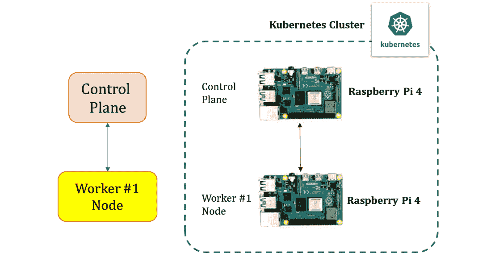

图 15.1 – 使用 Snap 严格限制的 Raspberry Pi 集群

现在我们已经知道想做什么，接下来来看一下需求。

## 需求

以下是构建 Ubuntu Core Raspberry Pi Kubernetes 集群的前提条件：

+   一张 microSD 卡（最小 4 GB，推荐 8 GB）

+   一台配有 microSD 卡驱动器的计算机

+   Raspberry Pi 2、3 或 4（1 台或更多）

+   一根 micro-USB 电源线（Pi 4 使用 USB-C）

+   一种 Wi-Fi 网络或带有互联网连接的以太网电缆

+   （可选）带 HDMI 接口的显示器

+   （可选）用于 Pi 2 和 3 的 HDMI 电缆，Pi 4 使用 micro-HDMI 电缆

+   （可选）一只 USB 键盘

现在我们已经确定了需求，接下来我们将进入一步步的指导，讲解如何创建使用 Snap 严格限制的 Kubernetes Raspberry Pi 集群。

## 步骤 1 – 将 Ubuntu Core 镜像设置到 SD 卡

第一步是将 Ubuntu Core 镜像安装到 microSD 卡上。为此，我们将使用**Raspberry Pi Imager 工具**将操作系统镜像写入 microSD 卡，然后可以用它在 Raspberry Pi 上运行。

从 Raspberry Pi 网站下载并安装**Raspberry Pi Imager**到一台配有 SD 卡读卡器的计算机上。

如*图 15.2*所示，运行 Raspberry Pi Imager 并插入 microSD 卡，然后打开**选择操作系统**菜单，如下所示：

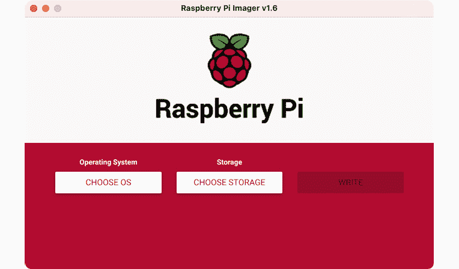

图 15.2 – Raspberry Pi Imager

从操作系统菜单中，选择**其他通用操作系统**，如以下所示：

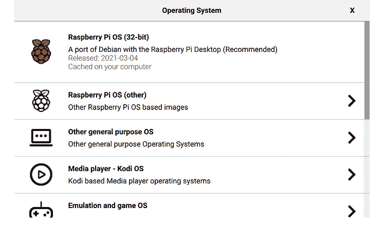

图 15.3 – Raspberry Pi Imager 操作系统选项

从选项中选择与 Raspberry Pi 2、3 和 4 兼容的**Ubuntu Core 64 位版本**（参见*图 15.4*），如以下所示：

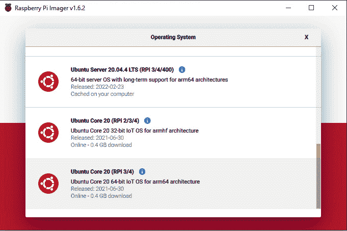

图 15.4 – 选择 Ubuntu Core 64 位版本

如*图 15.5*所示，选择**Ubuntu Core 64 位镜像**后，打开**存储**菜单。选择您插入的 microSD 卡，如下所示：

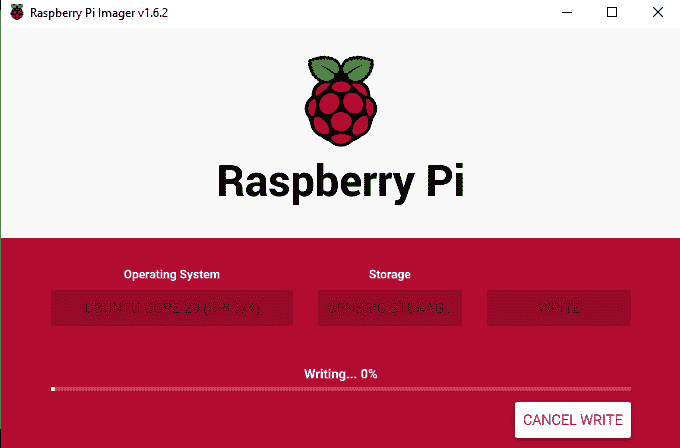

图 15.5 – Raspberry Pi Imager 写入操作

最后，点击**写入**以开始操作，Raspberry Pi Imager 会清除您的 microSD 卡数据；系统会提示您确认此过程。

确认后，Raspberry Pi Imager 将开始将操作系统镜像写入 microSD 卡。完成此操作需要一些时间。

完成后，继续创建一个 Ubuntu 单点登录（SSO）账户。

## 步骤 2 – 创建一个 Ubuntu SSO 账户

需要创建一个 Ubuntu **SSO** 帐户，以便存储并将安全外壳（SSH）公钥链接到电子邮件地址。这允许 Ubuntu Core 设备仅允许来自那些具有与 SSO 帐户中匹配的公钥的设备进行 SSH 连接。

访问 [`login.ubuntu.com/`](https://login.ubuntu.com/)，填写相关信息，并在创建 SSO 帐户后，按照以下部分的说明生成 SSH 密钥对。

## 步骤 3 – 生成 SSH 密钥对

**SSH**，正如我们所知道的，是一种连接到远程 Linux 服务器的流行方式。身份验证过程涉及将本地私钥与远程公钥配对，用于保护从你的设备到托管应用程序的 Linux 服务器之间的通信。

使用 Windows 10 中包含的免费开源 OpenSSH 软件，可以生成 SSH 密钥。SSH 密钥还可以通过 PuTTYgen 工具生成，该工具支持各种平台。接下来的步骤我们将使用内置的 Windows OpenSSH 客户端。

从 PowerShell 窗口，输入以下命令：

```
ssh-keygen
```

第一步询问你希望将密钥保存在哪里，按`Return`键可以接受默认选项，如*图 15.6*所示的命令执行输出所示。第二步要求输入密码短语。当输入密码短语时，每次访问密钥时都需要使用该密码短语。密码短语是可选的；如果按`Return`键两次，则会创建一个没有密码短语的密钥对，具体如下：

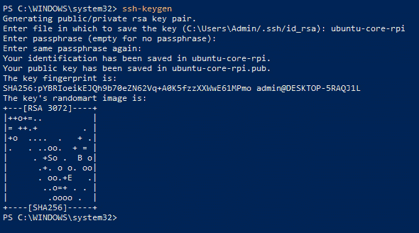

图 15.6 – SSH 密钥生成

完成过程后，私钥和公钥将位于同一文件夹中，具体如下：


图 15.7 – 生成的私钥和公钥

现在，我们可以使用生成的公钥和私钥来安装 Ubuntu Core。接下来的步骤是将公钥添加到 Ubuntu SSO 帐户中，以便它可以用来允许拥有公钥的设备连接。

从 Ubuntu SSO 帐户登录后，在 `ubuntu-core-rpi.pub`（公钥）文件下导入公钥，如下所示：

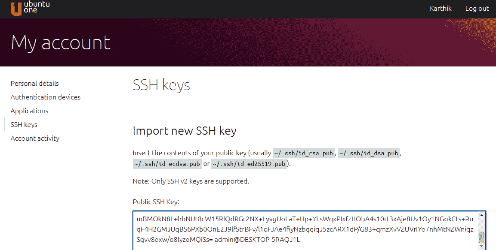

图 15.8 – 导入 SSH 密钥

以下截图显示了公钥已成功导入：

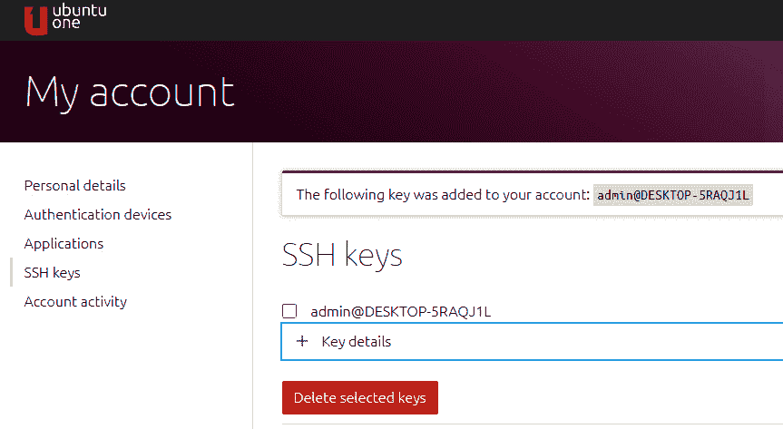

图 15.9 – SSH 密钥已导入

现在我们已经将 SSH 密钥导入到 Ubuntu SSO 帐户，接下来的步骤是为 Raspberry Pi 供电并启动 Ubuntu Core。

## 步骤 4 – 在 Raspberry Pi 上启动 Ubuntu Core

从笔记本电脑中取出 SD 卡并插入 Raspberry Pi。在为 Pi 供电之前，连接 HDMI 屏幕和 USB 键盘。启动 Pi 后，你将能够在屏幕上看到启动过程。通常启动过程会在 5 分钟内完成。

启动过程完成后，您将看到配置网络和创建管理员帐户的说明。在此配置下，您将能够配置 Wi-Fi 设置，下一步将要求您提供与 SSO 帐户相关的电子邮件地址。配置完成后，设备将自动更新，并在必要时重启。

在提供您的电子邮件并且 Pi 连接到您的帐户后，您将能够使用任何 SSH 客户端，例如 PuTTY，连接到您的 Pi。

*成功！您现在已连接到运行 Ubuntu Core 的 Raspberry Pi。*

我们已完成配置设置，现在可以进入下一步，安装并配置带有严格限制的 MicroK8s snap。

# 在 Ubuntu Core 上设置 MicroK8s

通过 SSH 登录到控制平面节点，并安装最新版本的 MicroK8s snap，并启用严格限制，如以下命令所示：

```
sudo snap install microk8s --channel=latest/edge/strict
```

以下是执行前述命令后的输出，确认带有严格限制的 MicroK8s snap 已成功配置：

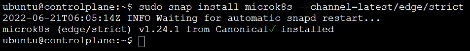

图 15.10 – MicroK8s snap 安装成功

现在我们已经安装了 MicroK8s snap，让我们运行 `microk8s status` 命令来验证其运行状态，如下所示：

```
microk8s status
```

以下是执行前述命令后的输出，确认带有严格限制的 MicroK8s snap 已成功运行：

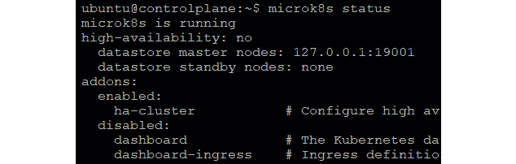

图 15.11 – MicroK8s snap 正在运行

严格限制（*strict confinement*）利用 Linux 内核的安全能力将应用程序锁定在 snap 中。对于没有明确接口的高度受限应用程序，访问将受到极大限制。MicroK8s 成功运行表明所有必要的接口已被指定，且满足应用程序访问要求。

要查看 MicroK8s snap 接口，请使用以下命令：

```
snap connections microk8s
```

以下是执行前述命令后的输出，列出了 MicroK8s snap 的接口：

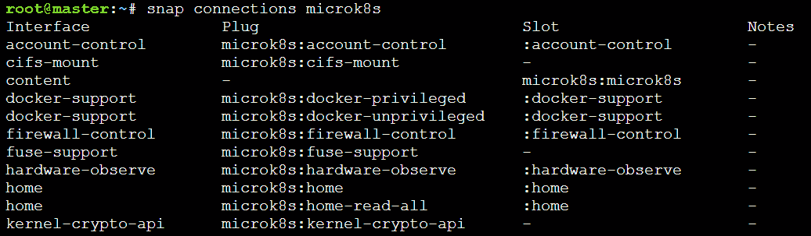

图 15.12 – MicroK8s snap 接口

最终，所有 snap 都需要达到严格限制级别，仅使用应用程序正常运行所需的 API，其他的则不使用。此外，Ubuntu Core 要求所有 snap 都采用严格限制模型。

在 Snapcraft 文档中了解更多关于接口和限制的信息，访问 [`docs.snapcraft.io`](https://docs.snapcraft.io)。

现在我们已经安装了 MicroK8s，让我们使用 `kubectl get nodes` 命令来验证节点状态是否为 `Ready`，如下所示：

```
kubectl get nodes
```

如果安装成功，您应该会看到以下输出：

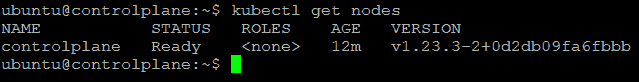

图 15.13 – 验证节点是否处于 Ready 状态

由于 MicroK8s 被打包为 snap 包，它将自动升级到更新的版本。此外，MicroK8s 的严格封闭版本目前位于一个专用的 snap 通道中，与 Kubernetes 的上游最新版本同步，Kubernetes 是由云原生计算基金会管理和维护的开源版本。

基于 MicroK8s 的发布，通道由一个轨道（或系列）和一个预期的稳定性级别（*stable*、*candidate*、*beta* 和 *edge*）组成。有关发布和通道的更多信息，请运行以下命令：

```
snap info microk8s
```

以下是执行上述命令后的输出，显示了各个通道（*stable*、*candidate*、*beta* 和 *edge*）及其发布日期：

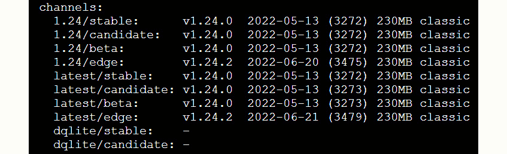

图 15.14 – MicroK8s 通道列表（stable、candidate、beta 和 edge）及其发布日期

在其他节点上重复 MicroK8s 的安装过程。

在工作节点上安装 MicroK8s 的命令输出如下：

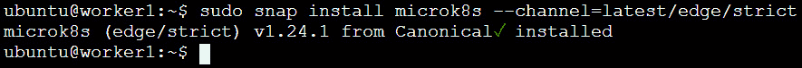

图 15.15 – 在 worker1 节点上成功安装 MicroK8s snap

以下是执行`microk8s status`命令后的输出，确认 MicroK8s 也已在工作节点上成功运行：

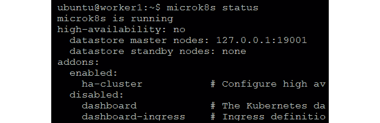

图 15.16 – 验证 MicroK8s 是否正在运行

现在 MicroK8s 已经运行，接下来的步骤是检查`kubectl get nodes`命令是否显示节点处于`Ready`状态，具体如下所示：

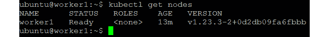

图 15.17 – 验证节点是否处于 Ready 状态

我们已经在所有节点上完成了 MicroK8s 的安装。接下来的步骤是将工作节点添加到控制平面节点中。打开 PuTTY 终端连接到控制平面节点，并运行以下命令生成连接字符串：

```
sudo microk8s.add-node
```

以下是执行上述命令后的输出。它验证了命令已成功执行，并提供了生成连接字符串的说明：

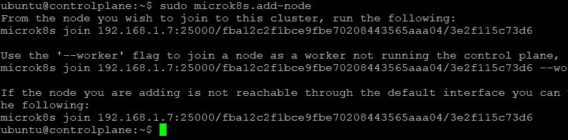

图 15.18 – 生成用于添加节点的连接字符串

如前述命令执行输出所示，连接字符串以`<control plane_ip>:<port>/<token>`的形式生成。

## 添加工作节点

我们现在有连接字符串来与控制平面节点连接。打开 PuTTY 终端连接到 worker 节点，并运行 `join` 命令将其添加到集群中，以下是该命令的执行情况：

```
microk8s join <control plane_ip>:<port>/<token>
```

命令成功执行，节点已成功加入集群，输出如下所示：

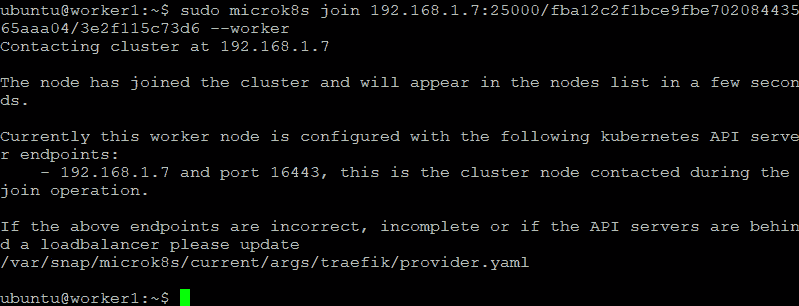

图 15.19 – 将 worker#1 节点添加到集群

如*图 15.19*所示的命令执行输出所示，您应该能在几秒钟内在控制平面节点上看到新节点。

使用以下命令验证新节点是否已添加到集群中：

```
kubectl get nodes
```

以下命令执行输出显示控制平面和`worker1`节点是集群的一部分：

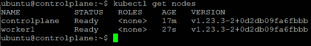

图 15.20 – 集群已就绪，控制平面和 worker1 节点已加入集群

此时，您已拥有一个完全功能的多节点 Kubernetes 集群，并启用了严格的隔离。总结一下，我们已在运行 Ubuntu Core 的树莓派板上安装了 MicroK8s snap，并将多个部署连接起来形成集群。我们也看到了如何向集群中添加节点。接下来，我们将要在刚刚创建的 MicroK8s 集群上部署一个示例应用程序。

# 部署一个示例容器化应用程序

在本节中，我们将在我们的 MicroK8s 集群环境中部署 Kubernetes 示例库中的 nginx 部署，具体如下：

```
kubectl apply -f https://k8s.io/examples/controllers/nginx-deployment.yaml
```

以下是前述命令执行后的输出，显示部署没有错误，接下来的步骤中，我们可以使用 `get pods` 命令来验证部署是否成功：

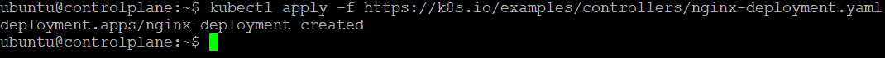

图 15.21 – 示例应用程序部署

检查 pods 状态，以验证应用程序是否已成功部署并运行，如下所示：

```
kubectl get pods -l app=nginx
```

以下是前述命令执行后的输出，显示了 pods 已被创建，并且其状态为`Running`：

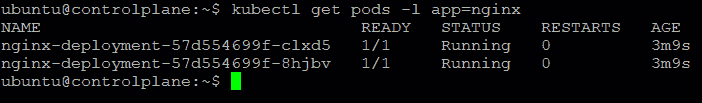

图 15.22 – 检查 pods 是否处于 Running 状态

*太棒了！我们刚刚在运行 Ubuntu Core 的树莓派多节点集群上部署并检查了我们的示例应用程序部署。*

总结来说，利用快照、Snapcraft 和 Ubuntu Core 进行嵌入式 Linux 开发比市场上现有的选项更快捷、更安全、更可靠。由于它能够通过全球 Snap Store 打包、分发和更新任何应用程序，Snapcraft 使得为嵌入式设备寻找新软件变得更加简单。此外，应用程序更新要么完全成功，要么根本不会部署。在进行应用程序和系统更新时，运行 Ubuntu Core 的嵌入式设备始终保持完全功能。

# 总结

在这一章中，我们学习了如何使用严格限制选项安装 MicroK8s 快照，监控安装进度，并管理在 Ubuntu Core 上运行的 Kubernetes 集群。我们还部署了一个示例应用程序，并检查了该应用程序是否能够在启用了严格限制的 Kubernetes 集群上运行。

我们还介绍了一个新的嵌入式操作系统，Ubuntu Core，它通过启用自动更新、应用商店和软件管理来符合企业标准。我们还了解到，它从零开始构建，旨在成为最安全的连接设备平台。此外，Ubuntu Core 提供了基于快照的模块化设计、防弹的应用更新、通过 Snapcraft 无缝的开发者体验以及内置的安全性，以应对嵌入式 Linux 开发中的挑战。

在这一章及之前的章节中，我们详细讨论了使用 MicroK8s 进行物联网/边缘计算应用程序所需的多数实施方面；包括在多节点 Raspberry Pi 集群上运行应用程序、配置负载均衡机制、为网络连接安装/配置不同的 CNI 插件、为集群配置日志、监控和警报选项，以及构建/部署机器学习模型和无服务器应用程序。

此外，我们还探讨了为有状态应用程序设置存储复制、为跨领域问题实现服务网格、设置高可用性集群以承受组件故障并持续为工作负载提供服务、配置具有工作负载隔离的容器以及运行与主机系统隔离的安全容器。在接下来的章节中，我们将探讨 MicroK8s 如何在加速物联网（IoT）和边缘计算部署方面独树一帜，并分析塑造我们新未来的关键趋势。
