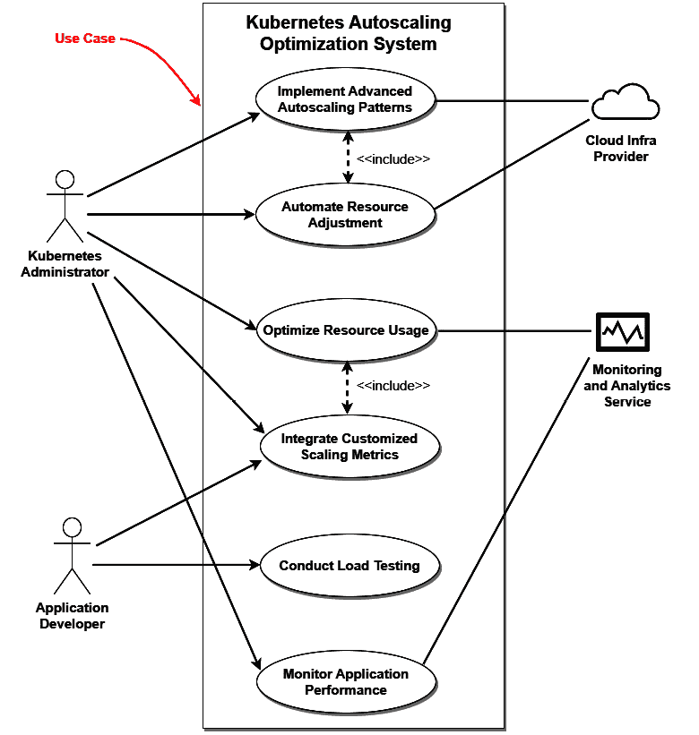

# 5

# 真实世界的案例研究

本章呈现了一系列真实案例，展示了与 Kubernetes 反模式相关的挑战和解决方案。通过实际组织经验的视角，突显了从遇到操作陷阱到实施战略解决方案所必须经历的过程。这些叙述涵盖了从科技创业公司资源过度配置到银行业安全增强的各个行业和问题，提供了 Kubernetes 最佳实践的实际应用洞见。每个案例都强调了为克服特定障碍而量身定制策略的重要性，为未来的进步铺平了道路，并为 Kubernetes 环境中的运营卓越设立了先例。

本章将涵盖以下主题：

+   从实际组织的经验中学习

+   反模式与解决方案的案例研究

+   未来的方向

# 从实际组织的经验中学习

我作为 Kubernetes 顾问的经验使我亲眼目睹了应对这些反模式所带来的变革性效果。我讲述了一些企业的故事，这些企业认识到了他们最初 Kubernetes 策略中的陷阱——这些故事充满了适应一个既复杂又实用的系统的挑战。

我回想起与一家新兴科技创业公司的早期合作。他们充满热情，但却陷入了常见的资源过度配置陷阱。在引导他们进行战略性缩减时，我们发现了资源可用性与成本效益之间的微妙平衡。这是一次关于在 Kubernetes 中进行资源管理的微妙艺术的形成性课程。

然后是那家大型零售公司，在高峰季节的流量压力下几乎崩溃。我们共同解决了他们的负载均衡问题，制定了一个不仅稳定了他们的在线平台，而且提高了客户满意度的解决方案。这次经验让我更加深刻地理解了响应性负载管理在 Kubernetes 环境中的关键作用。

我在医疗行业的参与凸显了数据完整性和合规性在 Kubernetes 管理的存储系统中的至关重要性。与他们密切合作，重新规划他们的持久化存储策略，我深入了解了将技术基础设施与严格的监管要求对接的复杂性。

每个组织的故事都是我职业成长的一章，贡献了我至今仍在汲取的知识储备。从增强银行业的安全措施到简化制造业的部署流程，每一个我克服的挑战都是走向更高专业水平的垫脚石。

在我们探讨每个案例时，我们将看到一些模式的出现——这些共同的线索将这些不同的经验联系在一起。这些就是锻造更强大架构师、开发人员和管理员的经验，它们使他们能够预见并消除反模式，防止它们生根发芽。

在分享这些经验时，我不仅旨在传授所学的经验教训，还希望展示每个 Kubernetes 部署中蕴藏的增长潜力。无论是减少电信领域的微服务依赖，还是改善教育机构的自动扩展，这些真实世界的经验磨练了我的技能，并塑造了我作为 Kubernetes 专家的方法。它们提醒我们，超越技术解决方案，正是学习和适应的过程，真正改变了组织。

# 反模式和解决方案的案例研究

在这一部分，我们将讨论几个用例，以便理解问题、可能的解决方案以及我们可以从中学到的经验教训。

## 用例 1 —— 一家金融科技创业公司通过战略性解决方案克服过度配置资源的问题

**背景**：

一家新兴的金融科技创业公司寻求通过提供尖端的支付处理服务来开辟市场。为了确保高可用性和容错性，创业公司在 Kubernetes 集群中过度配置资源。这种做法导致运营成本大幅上涨，开始侵蚀公司的资本储备，并妨碍其在其他关键领域（如研发和客户获取）的投资。

**问题陈述**：

随着用户基础的增长，工作负载需求变得更加不可预测，创业公司发现其静态资源分配策略既不可持续，也不具备成本效益。Kubernetes 集群在非高峰时段通常处于空闲状态，但资源仍然被预留且产生费用。此外，在需求出现意外激增时，手动扩展过程过慢，导致性能瓶颈，影响了最终用户体验。

创业公司的领导层意识到，尽管其 Kubernetes 基础设施非常稳健，但并没有得到优化。显然，为了维持其竞争优势和财务健康，创业公司需要解决资源过度配置的反模式。挑战在于实施一种能够动态适应波动工作负载、优化成本并维持金融服务标准要求的最高服务水平的资源分配策略。

问题是多方面的：

+   **成本低效**：维持过剩容量的财务开销不可持续，尤其是对于一家在资本密集型金融科技行业中运营的创业公司

+   **资源闲置**：大量计算资源被闲置，导致没有相应业务价值的浪费开支

+   **可扩展性滞后**：无法及时根据负载变化扩展资源，导致在关键时期性能受到影响

+   **管理复杂性**：手动干预进行扩展和资源分配容易出错，且随着公司规模扩展，长期来看不可行。

**解决方案实施**：

图 5.1 – 动态资源管理系统解决方案

前述用例图中展示的解决方案围绕着一个动态资源管理系统，解决了金融科技初创公司 Kubernetes 集群中的资源分配低效问题。Kubernetes 管理员通过评估系统中当前的资源利用情况来启动这一过程。这一评估对理解哪些资源得到有效使用，哪些资源未得到充分利用至关重要。

自动扩展参数随后被配置，以使资源分配与实际工作负载需求对齐。这些参数使得系统能够在高流量期间自动扩展资源，确保客户交易能够高效处理。相反，在低活动期间，系统会缩减资源，防止不必要的空闲资源浪费开支。此扩展由自动扩展服务管理，该服务根据工作负载实时调整资源。

监控服务通过持续监督资源消耗来支持这些操作。它确保自动扩展服务拥有最准确的系统需求信息，从而能够执行精准的扩展操作。

**结果**：

这些组件协同工作，创建了一个响应灵敏、成本高效的基础设施，能够动态适应初创公司运营中不断变化的需求，而无需频繁手动调整。该系统不仅在关键时期最小化了性能问题的风险，还优化了初创公司的运作。

## 用例 2 —— 改善大型零售公司中的负载均衡

**背景**：

零售行业的成功依赖于其提供无缝客户服务的能力，特别是在高峰购物季节。一家大型零售公司，拥有显著的在线业务和大量产品，面临着其 Kubernetes 基础设施中的负载均衡机制的关键挑战。该公司的在线平台经历了大量且不可预测的流量，尤其在促销活动和节假日期间更加严重。

**问题陈述**：

他们现有的负载均衡解决方案是静态的，无法高效地在可用节点之间分配流量，导致服务器超载并随之出现停机。

这种低效的负载均衡导致了几个不良后果：

+   **客户服务中断**：在流量高峰期间，客户遇到响应缓慢的问题，最糟糕的情况是服务中断，直接影响客户满意度和信任。

+   **销售损失**：每分钟的停机时间都意味着由于交易中断和购物车放弃而导致的重大财务损失。

+   **过载的基础设施**：某些节点持续过载，而其他节点则未得到充分利用，导致不均衡的磨损和潜在的硬件早期故障。

+   **运营效率低下**：IT 团队花费大量时间处理流量激增相关的问题，而无法专注于战略性任务。

领导层意识到，企业基于 Kubernetes 的平台需要一个动态且智能的负载均衡解决方案，不仅能应对当前需求，还能根据未来的流量模式进行预测和扩展。这一挑战不仅包括实施一个更响应快速的负载均衡系统，还包括将该系统与现有的 Kubernetes 设置集成，同时不干扰正在进行的操作。

**解决方案实施**：

图 5.2 – 动态负载均衡系统

Kubernetes 管理员是此解决方案的核心，负责推动改善在线平台处理来流量的方式。这位管理员首先评估流量分布，了解瓶颈的形成位置以及哪些节点存在过度或不足的利用情况。

在此评估之后，Kubernetes 管理员会更新负载均衡器，可能涉及引入更动态和响应式的负载均衡算法，这些算法可以实时适应流量。这项任务对于防止服务器在用户活动意外激增时过载至关重要。

为确保这些新算法按预期工作，管理员模拟流量，创建一个受控的测试环境，观察更新后的负载均衡器在不同条件下的表现。此步骤对于验证负载均衡策略在投入生产前的有效性至关重要。

负载均衡服务是一个自动化系统，主动管理平台节点之间流量的分配。它与 Kubernetes 管理员的配置协同工作，确保资源的有效分配。

监控性能是一个持续的过程，正如用例图所示。负载均衡器的性能会被追踪，以确保新实施的策略能够有效缓解之前响应时间慢和服务中断的问题。

最后，流量分析工具起到了支持作用，通过提供有关流量模式的详细见解，使得收集的数据能为持续改进负载均衡策略提供支持。

**结果**：

通过分析负载均衡日志，系统可以从过去的性能中学习，识别成功的配置和需要进一步优化的领域。这种数据驱动的方法确保系统越来越适应公司的具体流量模式和需求。

## 用例 3 – 解决医疗行业中持久存储问题

**背景**：

在医疗行业中，基于 Kubernetes 的 IT 环境面临着持久存储的关键挑战——这是维护电子健康记录和支持实时病人护理系统的基础需求。该行业对 Kubernetes 的依赖源于其对高可用性和可扩展性的需求。

**问题陈述**：

当前的持久存储解决方案未能满足该行业严格的数据管理和监管合规要求。

持久存储问题表现为多种方式：

+   **数据完整性风险**：不一致的数据复制和备份策略引发了对数据完整性和潜在丢失的担忧，这可能对病人的护理产生严重后果。

+   **访问延迟**：医疗记录的检索时间过长，妨碍了医疗提供者及时访问关键病人信息。

+   **可扩展性瓶颈**：随着数据量的增长，现有的存储解决方案在扩展方面遇到了困难，导致性能下降。

+   **合规性问题**：无法保证数据的可用性和完整性引发了与医疗法规相关的严重合规问题。

随着病人数据库的增长以及对数字解决方案的日益依赖，解决这些持久存储问题不仅是操作效率的问题，更关乎病人的安全和合规性。挑战在于在不干扰病人和医疗提供者依赖的关键服务的情况下，彻底改革 Kubernetes 持久存储策略。

**解决方案实施**：

图 5.3 – Kubernetes 持久存储策略

上述用例图展示了全面改进持久存储策略的方法。目标是创建一个确保高可用性、可扩展性，并符合患者护理所需严格数据管理法规的系统。

在该策略的核心，Kubernetes 管理员负责升级存储类资源，以满足不断增长的数据需求，并确保存储解决方案能够有效扩展。这一升级是维护数据完整性和确保医疗提供者能够快速访问病历的关键步骤。

管理员还致力于优化存储性能，这对于处理医疗行业每日涉及的大量敏感数据至关重要。该优化有助于解决此前导致性能问题的可扩展性瓶颈。

集成对有状态应用程序的支持是另一个关键元素，确保需要持久存储的应用程序可以在 Kubernetes 环境中可靠运行。此集成对处理电子健康记录和患者护理系统的应用至关重要，因为这些应用的数据持久性是不可妥协的。

自动化备份程序已实施，以防止数据丢失。这些自动化流程旨在确保数据复制和备份的一致性，从而保护数据完整性。

作为预防措施，已制定灾难恢复计划。这些计划为在系统故障时恢复数据和服务提供了明确的协议，确保持续的患者护理。

**结果**：

强制数据加密和安全性是符合医疗行业规定并保护患者信息的战略关键步骤。此步骤确保所有数据，无论是静态数据还是传输中的数据，都能安全加密，从而解决合规问题并防止未经授权的访问。

云存储合作伙伴和监管合规服务是外部实体，提供支持和监督。云存储合作伙伴提供可扩展的存储解决方案和备份服务，而监管合规服务确保存储策略符合医疗行业的规定。

## 用例 4 – 提升小型金融银行集群安全性

**背景**：

安全性是银行业的基石，随着银行业越来越依赖技术来管理资产、交易和客户数据，Kubernetes 作为容器化应用的编排工具在行业中的采用成为了一大趋势。然而，这一转型并非没有挑战。最紧迫的问题之一是需要加强集群安全，以防止外部攻击和内部漏洞的风险。

**问题陈述**：

银行的 Kubernetes 集群面临着若干安全问题：

+   **对网络攻击的脆弱性**：随着网络攻击的日益复杂化，集群内现有的安全措施已显不足，风险涉及财务数据和客户信任。

+   **合规性和监管障碍**：银行需遵守严格的监管要求，而现有的 Kubernetes 配置未能完全合规，这可能导致法律和财务上的后果。

+   **内部威胁和配置错误**：迫切需要减少因内部配置错误和内部威胁带来的风险，这些问题可能导致未经授权的访问或数据泄露。

+   **事件响应与取证**：现有基础设施缺乏强大的事件响应和取证分析机制，而这些对于处理安全漏洞和理解攻击向量至关重要。

风险非常高；任何安全漏洞都可能导致巨大的财务损失、客户信任的流失以及严厉的监管处罚。银行面临的挑战是实施一个全面、灵活、并与 Kubernetes 的动态特性完全集成的集群安全框架，同时确保金融服务不间断运行。

**解决方案实施**：

图 5.4 – Kubernetes 安全系统增强

上述用例图展示了一个战略性方法，用于增强 Kubernetes 集群的安全框架。它代表了一个行动计划，旨在防范网络威胁，确保遵守严格的监管标准，并建立强大的事件响应协议。

IT 安全团队首先通过自动化部署安全补丁，确保系统能够及时且持续地防护已知的漏洞。同时，实施实时威胁检测，为团队提供潜在安全漏洞的即时警报，从而可以迅速采取行动。

访问控制被严格执行，以维持安全环境，限制未授权访问并减轻内部威胁。这与入侵检测系统的集成相辅相成，后者监控网络中的妥协迹象，并为银行的主动安全姿态提供信息。

开发了取证分析能力，深入分析安全事件，找出根本原因并防止重复发生。这种取证准备确保银行能够迅速从事件中恢复，并为任何必要的法律程序提供证据。

合规性经理负责监督合规报告的执行，这是确保银行满足所有监管义务的关键环节。定期进行安全审计，以审查安全措施的有效性和合规性。

**结果**：

支持这些活动的是外部网络安全工具，它们提供了先进的威胁检测、分析和响应能力。合规性服务发挥着咨询作用，确保所有安全措施符合最新的法规和行业最佳实践。

## 用例 5 – 解决电商巨头监控不足的问题

**背景**：

对于一家电子商务巨头来说，保持系统可靠性和客户满意度至关重要，而这取决于有效监控复杂分布式系统的能力。不幸的是，这家公司在其 Kubernetes 环境中陷入了多种监控反模式。对传统监控工具的依赖、不充分的警报配置以及从收集的数据中缺乏可操作的洞察，导致公司采取了反应性而非主动的系统健康和性能管理方法。

**问题陈述**：

以下是困扰该电子商务巨头 Kubernetes 设置的主要反模式：

+   **静默故障**：关键性故障未被及时发现，只通过客户投诉而非内部警报才浮出水面。

+   **警报疲劳**：非关键性警报的泛滥使运营团队对警告麻木，导致在噪音中无法识别出重大问题。

+   **手动关联**：缺乏智能自动化，迫使团队手动跨系统关联数据以诊断问题，导致延误和潜在的人为错误。

+   **性能盲点**：关键性能指标未得到充分监控，导致在理解客户体验和系统效率方面存在盲点。

这家电子商务巨头面临着双重挑战：既要彻底改造其监控基础设施，摆脱这些反模式，又要在不干扰持续服务的情况下，确保这一改造能够在全球范围内扩展。

**解决方案实施**：

图 5.5 – 电子商务监控系统

上面的用例图展示了一个为一家电子商务巨头升级的监控系统，该系统正在应对在 Kubernetes 环境中有效监控其分布式系统这一复杂挑战。该策略专注于从反应式监控转向主动监控，解决了影响系统可靠性和客户满意度的静默故障、警报疲劳、手动关联和盲点问题。

运营团队处于前沿，集成了先进的监控工具，提供更深入的系统操作可视性。这一集成使得问题能够更细致地被检测，理想情况下在问题影响客户之前就能得到预防。

为了应对导致警报疲劳的非关键性警报泛滥，团队建立了一个智能警报系统，旨在优先处理警报。这样可以确保最关键的问题得到立即处理，减少噪音，并帮助团队专注于真正影响系统事件。

DevOps 工程师负责实施异常检测自动化，这对于快速识别和应对意外系统行为至关重要，无需依赖费时的手动数据分析。

通过集成全面的日志分析，系统获得了对不同服务日志进行深入分析和关联的能力，这对于诊断可能跨多个基础设施组件的复杂问题至关重要。这一集成对于摆脱先前手动且易出错的关联过程至关重要。

数据分析师通过建立实时性能仪表板发挥其专业知识，提供系统健康和效率的实时视图。这些仪表板对于揭示以前未充分监控的性能指标至关重要，帮助识别和解决影响客户体验的问题。

为了进一步关注客户满意度，采取了增强客户体验追踪的措施。这使得电商公司能够捕捉和分析客户反馈和行为，确保数字体验与客户的期望和需求一致。

团队还开发了预测性维护模型。这些模型利用历史数据预测潜在的系统问题，从而实现预防性维护，减少了意外停机的可能性。

**结果**：

支持内部团队的努力，外部服务如云监控服务、可观测性和可视化工具提供了额外的监控和数据可视化功能。这些服务补充了公司的监控工作，提供了可扩展性和先进的分析工具。此外，集成了客户反馈系统，用于收集用户的直接意见，从而推动系统性能和用户体验的持续改进。

## 用例 6 – 简化制造公司中的复杂部署

**背景**：

一家使用 Kubernetes 来协调应用程序的制造公司面临了部署工作流复杂化的常见反模式。为了支持生产的各个阶段，公司的基础设施具有多方面的特点，Kubernetes 部署过程变得越来越复杂。这种复杂性不仅减慢了新应用和更新的部署速度，还增加了出错的风险，可能导致生产停滞或制造流程中的缺陷。

**问题陈述**：

Kubernetes 部署工作流的复杂性以几种问题的形式表现出来：

+   **部署瓶颈**：过于复杂的部署流程造成了瓶颈，导致新特性和更新的推出出现重大延误。

+   **停机风险增加**：每次部署都伴随着较高的错误风险，可能会扰乱制造操作，导致昂贵的停机时间。

+   **资源管理不当**：低效的部署模式导致计算资源利用率低，从而产生了不必要的开销。

+   **操作开销**：随着 IT 团队在复杂的部署过程中处理操作负载，他们的关注点从创新和优化工作转移，导致操作效率降低。

面对简化 Kubernetes 部署过程的需求，制造公司启动了一项战略计划，重新设计其部署管道。目标是采用一种更简洁、自动化且无错误的部署策略，符合现代制造业的及时生产原则。

**解决方案实施**：

图 5.6 – Kubernetes 部署自动化

计划从 DevOps 工程师开始，他实施 **持续集成/持续部署**（**CI/CD**），这是一种自动化部署管道的方法。这种自动化确保了新应用程序和更新的更高效交付，有助于防止之前发生的性能下降。

为支持这一过程，自动化部署管道至关重要，它们确保部署的一致性和无误性，直接解决了生产中可能出现的中断问题。

监控服务是战略的一个核心部分，它为每个部署过程提供了可见性。这种可见性是防止停机的关键，因为它能立即检测并解决部署过程中出现的任何问题。

Kubernetes 管理员专注于优化部署期间的资源分配，这对于计算资源的高效使用和避免不必要的开支至关重要。

为确保每次部署符合质量标准，团队会进行全面的测试和验证。这一步骤对于在问题影响生产环境之前及时发现问题至关重要。

**结果**：

这建立了安全功能，允许系统在部署过程中引入错误时恢复到稳定状态，确保制造操作的连续性和稳定性。

## 用例 7 – 在一家全国性媒体公司中管理资源限制

**背景**：

一家全国性媒体公司，拥有广泛的数字化存在和大量的每日内容更新，面临着 Kubernetes 反模式问题，即资源限制管理不当。这种管理不当导致了 Kubernetes 环境中的多个问题，从低效的资源利用到在新闻高峰周期期间应用程序的严重故障。由于没有明确定义资源请求和限制，Kubernetes 调度器无法有效地在公司的 Pod 和节点之间分配资源，导致了资源短缺和过度承诺的问题。

**问题陈述**：

未能有效管理 Kubernetes 资源限制的后果是多方面的：

+   **服务不稳定**：资源限制设置不当导致 Pods 因超出限制被杀死，或因资源不足而表现不佳，从而导致服务中断。

+   **应用性能不一致**：缺乏适当的资源分配导致应用性能不可预测，一些服务运行缓慢，而其他服务则占用了未使用的资源。

+   **成本低效**：公司通过过度配置资源以避免服务中断，导致了不必要的成本，造成了巨大的财务浪费。

+   **可扩展性受限**：无法根据观看需求动态扩展服务，影响了公司在突发新闻事件中的敏捷性和响应能力。

这家全国性媒体公司的挑战是实施一种资源管理策略，能够动态调整以应对突发新闻和波动的观看量，同时优化成本并保持高服务可用性。

**解决方案实施**：

图 5.7 – Kubernetes 资源限制优化

Kubernetes 管理员的任务是定义明确的资源分配策略。这些策略将指导公司应用程序间的资源分配，确保每个组件都能获取所需的资源，而不浪费任何资源。

基于性能分析提供的洞察，管理员可以调整资源限制以匹配实际使用模式。在观看量波动较大的高峰新闻周期中，这种灵活性至关重要，因为资源需要快速分配或取消分配。

监控应用程序性能是一个持续的过程，得益于先进的监控工具。这些工具提供了应用程序性能和资源使用的实时洞察，帮助主动管理资源分配。

实施资源配额是管理员采取的另一步骤。配额防止任何单一应用程序或服务使用超过必要的资源，从而避免过度承诺，并确保其他可能需要资源的服务也能获得资源。

自动化资源扩展是策略中的一个重要部分。此自动化使系统能够迅速响应需求变化，在观看量高时自动扩展，在需求下降时自动缩减，确保高效使用资源并帮助管理成本。

性能分析师进行成本效益分析，以评估资源分配策略的财务影响。

**结果**：

这项分析通过确保资源使用与公司预算和资源支出带来的价值相一致，帮助避免财务浪费。

外部服务，如云基础设施提供商，提供可扩展的资源选项，可以在需要时迅速扩展公司的容量。

## 用例 8 – 在电信中减少微服务依赖

**背景**：

在快速发展的电信行业中，快速适应和扩展服务的能力至关重要。一家领先的电信公司在利用 Kubernetes 管理微服务架构时，遇到了一个显著的反模式：微服务之间过度的相互依赖。

**问题陈述**：

这种复杂的依赖关系导致了一个脆弱且复杂的系统架构，其中一个服务的变更可能会无意中影响到其他服务，从而引发稳定性问题，并阻碍新功能的部署。

以下是由这些微服务依赖关系引发的一些挑战：

+   **部署复杂性**：服务之间的相互依赖使得部署变得繁琐且具有风险，因为单一的变更可能会影响多个服务。

+   **隔离故障的困难**：当问题发生时，由于复杂的依赖链，难以准确定位和隔离问题，导致停机时间延长。

+   **可扩展性障碍**：扩展单个服务变得困难，因为这需要仔细的协调，以确保依赖服务不受不良影响。

+   **创新受限**：由于担心引发广泛的问题，导致对更新或改进单个服务的抵触，从而抑制了创新和进步。

面对简化和解耦微服务的需求，该电信公司决定对其 Kubernetes 环境进行战略性转型。目标是重构微服务架构，减少依赖，从而提高系统的稳定性、可扩展性和敏捷性。

**解决方案实施**：

图 5.8 – 微服务架构优化

微服务架构师通过分析现有的微服务之间的相互依赖关系，开始优化过程。这一分析对于理解复杂的互动关系网络，并识别哪些服务之间的依赖过于紧密至关重要。

在完成分析后，架构师设计了解耦的微服务。通过分离这些服务并减少它们之间的依赖关系，系统的整体架构变得更加健壮，且不容易受到服务间相互影响而导致的级联故障的影响。

Kubernetes 管理员在这一战略中扮演着至关重要的角色。他们促进微服务的独立扩展，使得每个服务可以根据需求进行扩展或缩减，而不会影响其他服务。这种独立性是解决之前面临的可扩展性难题的关键。

管理员还实现了服务网格，这是一种基础设施层，允许不同微服务之间进行安全高效的通信。服务网格有助于管理服务交互，提供更细粒度的控制和可观察性。

**结果**：

为了简化部署流程，借助 DevOps 工具实现服务部署自动化。自动化确保部署的一致性、可重复性，减少了人为错误的发生，从而降低了部署的复杂性以及手动部署所带来的风险。

微服务的性能通过先进的监控工具进行持续监控。这些工具提供了每个微服务的表现情况，帮助快速识别和隔离任何故障。

## 用例 9 – 改善教育机构中低效的自动伸缩

**背景**：

一所使用 Kubernetes 的教育机构在现有的自动伸缩设置上面临着重大挑战。现有的自动伸缩机制效率低下，常常导致在关键时段（如在线注册或电子学习课程期间）伸缩延迟。

**问题陈述**：

这种低效不仅影响了用户体验，还导致了非高峰时段的资源浪费。

该机构 Kubernetes 自动伸缩存在的主要问题如下：

+   **对流量激增的响应延迟**：自动伸缩系统对需求的突增反应迟缓，导致高峰使用时段的性能瓶颈。

+   **低流量时的资源过度配置**：相反，当需求下降时，系统对缩减资源的反应较慢，导致不必要的资源使用和相关成本。

+   **缺乏定制化伸缩指标**：自动伸缩主要基于基本的指标，如 CPU 和内存使用情况，这些指标无法准确反映教育机构运行的不同应用的需求。

+   **操作挑战**：IT 团队在管理伸缩过程时遇到了困难，这些过程需要频繁的人工干预和调整。

该教育机构认识到需要改进其自动伸缩策略，以确保其数字化学习平台能够可靠地应对变动负载，同时优化资源使用。

**解决方案实施**：

图 5.9 – Kubernetes 自动伸缩优化系统

Kubernetes 管理员将实施更先进的自动伸缩模式。这些模式比基本的 CPU 和内存指标更为复杂，旨在快速响应需求变化。在在线注册或电子学习课程等时段，系统必须无延迟地处理用户活动的激增，这种响应能力至关重要。

资源调整的自动化是这一策略的关键元素。通过自动化，系统可以在需求激增时迅速扩展资源，而在需求下降时则缩减资源，从而优化资源使用，防止在低流量期间过度配置。

管理员还集成了为教育机构的应用程序量身定制的扩展度量标准。与之前使用的基本度量标准不同，这些定制度量标准能更准确地反映每个应用程序的资源需求。

一名应用开发人员参与了负载测试。这项测试对确保自动扩展系统在不同负载条件下按预期表现至关重要。负载测试有助于模拟高峰期和非高峰期场景，验证自动扩展是否正确响应。

**结果**：

监控和分析服务持续跟踪应用程序的性能，提供有助于进一步优化自动扩展系统的洞察。

## 用例 10 – 修正大型能源公司中的配置漂移

**背景**：

一家领先的能源公司，利用 Kubernetes 管理其多样化和庞大的数字基础设施，面临配置漂移这一常见问题。由于公司的运营规模和复杂性，这一现象，配置随时间变化或不一致，特别成了一个问题。

**问题陈述**：

这种漂移不仅危及系统稳定性和性能，还在合规性和安全性方面带来了重大风险，这些都是能源行业中的关键问题。

在公司 Kubernetes 环境中，由配置漂移带来的一些挑战如下：

+   **部署不一致性**：环境配置的差异导致了从开发到生产不同阶段应用程序行为的不可预测性。

+   **暴露于安全威胁**：跨集群不一致地应用安全更新和补丁增加了漏洞和潜在安全 breaches 的风险。

+   **合规性偏差**：由于这些配置不一致，公司在严格的监管标准下面临着严重的合规风险。

+   **资源密集型纠正**：识别、故障排除和修正配置差异所需的努力消耗了大量资源，影响了操作效率。

面对这些挑战，该能源公司开始系统地解决 Kubernetes 环境中的配置漂移问题。目标是建立一个机制，确保所有部署的一致性、安全性和合规性。

**解决方案实施**：

图 5.10 – 配置管理与合规性系统

Kubernetes 管理员首先通过标准化配置模板开始工作。这些模板作为部署的蓝图，确保公司数字基础设施的一致性。这种标准化对于减少部署不一致性，并确保应用程序从开发到生产的过程中行为可预测至关重要。

为了简化流程，配置部署已实现自动化，这有助于在基础设施不断发展的过程中保持一致性。自动化确保安全更新和补丁在所有集群中统一应用，从而降低了可能导致安全漏洞的风险。

合规经理实施持续合规监控，以确保遵守能源行业严格的监管标准。这种持续的监控对于及时识别和解决合规性偏差至关重要。

定期审计 Kubernetes 配置也已安排。这些审计对于检测配置漂移以及识别当前状态与标准化模板之间的差异至关重要。

进行配置漂移分析是另一项重要行动。它包括详细检查，以理解漂移的根本原因，并为制定防止未来发生的策略提供依据。

**结果**：

这一努力最终产生了提供必要技术来大规模管理配置的工具，以及提供专业知识的安全服务，帮助保持 Kubernetes 环境的安全态势。

通过探索多个现实世界的案例，了解组织如何成功应对 Kubernetes 反模式，我们亲眼见证了战略性解决方案如何将潜在的挫折转变为操作上的成功。从技术初创公司到大型零售企业，每个案例研究都为我们提供了通过创新方法和量身定制的解决方案克服特定 Kubernetes 挑战的独特视角。

随着这些挑战的解决，我们将把焦点转向未来的方向。下一部分将讨论组织如何继续发展和调整其 Kubernetes 环境，以保持领先地位。我们将探讨新兴趋势、潜在的新挑战，以及 Kubernetes 能力的持续发展，以确保您的基础设施不仅能够满足当前需求，而且为未来的需求做好准备。

# 未来方向

在克服了过去案例中的挑战后，随着 Kubernetes 的强大与稳定，企业可以期待充满激情的未来。

Kubernetes 将很快成为数字化转型的关键角色。已经改善运营的企业现在可以利用 Kubernetes 来实现更多创新。它将成为 DevSecOps 的基础，其中安全是整个过程的一部分，而不仅仅是事后补充。

使用微服务让我们看到了，模块化和分离不仅仅是设计问题，它还是一个聪明的商业决策。Kubernetes 将继续帮助公司独立发展这些服务。这意味着更快速、更有针对性的更新，能够更快适应市场需求。

数据将成为一个重要领域。Kubernetes 将帮助组织复杂的数据工作，推动分析和机器学习。那些已经解决了资源问题的公司将利用 Kubernetes 改进他们的数据系统，以便进行实时洞察。

在技术方面，更多的工具将加入 Kubernetes 社区。将会有新的插件和工具，使集群管理更加简便，并能更好地控制更新。这些工具将更加用户友好，使 Kubernetes 变得更加易于使用。

最后，Kubernetes 将与云服务紧密合作。这将创造新的方式来使用公共和私有云，提供更多的灵活性和力量。Kubernetes，已经在单一公司中展现了它的强大，现在将在以云为中心的运营中发挥重要作用。

这一发展路径表明，Kubernetes 正从仅仅管理基础设施，转变为在以云为先的世界中，成为提升公司创新力和竞争力的重要组成部分。

# 总结

本章通过真实的案例研究展开了 Kubernetes 反模式的复杂性，展示了各种组织在实践中面临的挑战和创新的解决方案。它说明了定制化策略的重要性，以应对从资源分配到安全漏洞等独特的运营问题。它甚至强调了 Kubernetes 在具备专业知识的前提下，能够适应多种运营需求。通过展示这些案例研究的全景，它进一步强调了 Kubernetes 不仅仅是一个工具，而是一个多功能的平台，掌握后可以显著提升系统运营和效率。

在下一章中，我们将探讨优化 Kubernetes 性能的多种技术，并涵盖集群资源分配、镜像管理和网络调优。接下来，我们将探讨通过设计原则如无状态性和采用微服务架构来增强可扩展性的策略。最后，我们将研究通过与云原生生态系统的集成、利用持续部署和优化多云策略来最大化 Kubernetes 的潜力。下一章还涉及成本管理、人工智能的使用和安全最佳实践。
