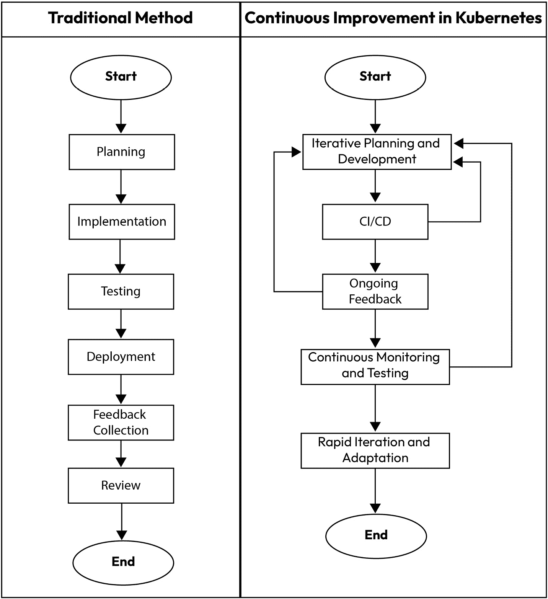

# 第七章：拥抱 Kubernetes 中的持续改进

本章聚焦于在 Kubernetes 中拥抱持续改进，这是跟上技术快速发展的关键策略。它涉及多个话题，从持续改进的基础概念，到如何在迭代过程中有效地整合反馈。章节还对比了传统方法和现代持续改进方法，讨论如何衡量这些举措的成功，并强调培养成长型思维的心理学方面。它还涵盖了实践方面，如持续学习、将改进与 DevOps 实践对齐，以及如何进行迭代式风险管理。此外，章节提供了适应 Kubernetes 生态系统变化的指南，包括如何采纳新特性和更新，以及理解社区和协作的角色。

本章将涵盖以下主题：

+   持续改进的概念

+   实施迭代实践

+   适应不断发展的 Kubernetes 生态系统

# 持续改进的概念

本节探讨了 Kubernetes 中持续改进的基础，强调反馈循环的作用，并与传统模型进行比较，衡量举措成功的标准，理解成长型思维模式的心理学方面，持续学习以及其对团队动态的影响。此外，还讨论了将持续改进与 DevOps 实践结合的方式。

## Kubernetes 中持续改进的基础

理解 Kubernetes 中持续改进的基础，首先要认识到平台的不断变化特性。Kubernetes 不是一个静态工具，它随着技术发展不断演进，以应对新的需求和挑战。这一特性要求我们具备持续优化和提升的思维模式。

这一方法的核心是跟上 Kubernetes 更新的步伐。这些更新可能包括新特性、安全增强和性能改进。保持对这些变化的了解至关重要，确保 Kubernetes 环境始终有效并保持最新状态。团队需要承诺进行持续学习，确保他们了解最新的进展，并能够将其应用于提高性能和效率。

定期审查和评估 Kubernetes 配置是另一个关键步骤。这个过程应该涵盖 Kubernetes 的各个方面，从集群配置到部署策略。这些审查有助于识别改进领域，无论是在效率、可扩展性、安全性还是可维护性方面。

实验也至关重要。Kubernetes 的灵活性允许尝试不同的配置和方法。找到更有效使用 Kubernetes 的方式，通常源于这种愿意进行实验的态度。然而，重要的是确保新方法在被应用到更关键的环境之前，已经经过充分测试。

反馈是一个至关重要的元素。通过监控和日志收集系统数据，并通过调查或直接沟通从用户那里收集数据，能够提供指导改进的见解。这确保了 Kubernetes 环境在技术上保持一致，并满足用户需求。

自动化日常任务是实现持续改进的重要步骤。Kubernetes 中的自动化可以从简单的脚本到复杂的**持续集成和持续部署**（**CI/CD**）管道不等。它减少了人为错误，并腾出时间让团队专注于战略任务。

协作和知识共享也是基础组成部分。Kubernetes 环境通常涉及不同的团队和利益相关者。促进开放的沟通与协作有助于采取全面的方式管理和改进 Kubernetes。

设定可衡量的目标和指标对于跟踪进展至关重要。这些目标和指标应与 Kubernetes 环境的目标对齐，如减少部署时间或提高系统可靠性。

风险管理也是一个关键组成部分。预见并减轻潜在风险，确保改进不会影响系统的稳定性或安全性。

最后，培养一种韧性和适应性的文化有助于团队有效应对挑战和变化。能够很好地适应变化的团队，更可能将持续改进融入到他们的工作流程中，从而打造出更强大、更高效的 Kubernetes 环境。

这些基础构成了 Kubernetes 持续改进策略的核心，强调了采用适应性强、信息充分且具有协作性的方式的必要性。

## 反馈环路在 Kubernetes 演进中的作用

反馈环路在 Kubernetes 环境的发展中至关重要。它们提供了一种结构化的方式来收集和分析信息，这是识别改进领域的关键。在 Kubernetes 中，反馈可以来自多个来源，如系统日志、监控工具和用户反馈。每个来源都提供了有关 Kubernetes 环境表现及其改进空间的宝贵见解。

Kubernetes 中的系统日志提供了大量的信息。它们记录了系统的事件和所采取的操作，可用于追踪问题并了解配置变更如何影响系统的性能。通过定期检查这些日志，团队可以发现模式和异常，这些模式和异常可能表明潜在问题或优化空间。

监控工具是反馈环路的另一个关键组成部分。这些工具提供了关于 Kubernetes 集群健康状况和性能的实时数据。这些数据帮助团队快速识别并响应问题，如资源瓶颈或服务故障。此外，监控工具可以配置为在特定条件下向团队发出警报，使其能够迅速反应，保持系统稳定性和性能。

用户反馈在 Kubernetes 演进过程中同样至关重要。无论是内部开发团队还是外部客户，Kubernetes 环境的用户都能提供一些从系统日志或监控工具中无法直接看出的见解。这些反馈可能涵盖广泛的方面，从应用程序部署的便利性到 Kubernetes 上运行服务的性能。积极寻求并采纳这些反馈，确保 Kubernetes 环境与用户需求和期望保持一致。

在 Kubernetes 中实施有效的反馈循环需要一个系统化的方法。这包括设置收集反馈所需的工具和流程，分析这些反馈以提取有意义的见解，然后利用这些见解来指导 Kubernetes 环境的改进。这是一个持续的过程，帮助保持 Kubernetes 系统与不断变化的需求和行业最佳实践保持一致。

反馈循环鼓励对 Kubernetes 环境的主动管理。团队可以利用反馈来预测和预防问题，而不是在问题发生后进行反应。这种主动的态度不仅提升了 Kubernetes 系统的可靠性和性能，还改善了依赖该系统的用户的整体体验。

反馈循环在有效管理 Kubernetes 环境中至关重要，但它们可能会遇到若干陷阱和障碍。这里简要讨论了常见的挑战和克服这些挑战的策略。

### 反馈循环管理中的常见陷阱

在反馈循环管理中常见的陷阱包括以下几点：

+   数据过载

+   反馈孤岛

+   响应延迟

+   缺乏可操作的见解

### 克服这些障碍的策略

以下策略是推荐的：

+   实施能够自动筛选和优先处理数据的工具和流程，专注于最相关的信息，以管理噪音并防止信息过载。

+   确保从所有来源收集的反馈集中在一个系统中，方便进行相关性分析和汇总。

+   使用配置了自动警报的监控工具，快速响应关键问题，缩短问题识别与解决之间的时间。

+   建立持续改进的文化，定期分析反馈以获取见解，并迅速实施这些发现，以改进 Kubernetes 操作。

## 将持续改进与传统模型进行比较

将 Kubernetes 的持续改进与传统模型进行比较，揭示了在管理 IT 基础设施和应用程序方面思维方式和方法的转变。传统模型通常依赖于更静态、线性的开发和部署进程。这些模型通常包括较长的规划阶段，接着是实施和最终的评审阶段。变更不频繁，通常需要完整的周期才能实现新想法或解决问题。

相比之下，Kubernetes 中的持续改进采纳了更为动态和迭代的方法。这种方法的特点是频繁的小规模变更，而非大规模的彻底改造。在 Kubernetes 的背景下，这意味着持续更新和完善配置、部署以及集群本身，以应对新的需求或提升效率和可靠性。

关键的区别之一在于反馈的整合方式。在传统模型中，反馈通常是在开发周期结束时收集的，这可能会延迟必要变更的实施。而在持续改进中，反馈是一个持续的过程，贯穿于开发和部署的每一个阶段。这种即时的反馈整合能够更快地适应变化，提升系统及其管理团队的灵活性。

另一个显著的区别在于风险管理领域。传统模型通常将变更视为需要最小化的潜在风险，这导致了对更新和改进的谨慎态度。然而，Kubernetes 中的持续改进则将变更视为提升的机会。虽然风险仍然被谨慎管理，但更愿意进行实验和迭代，从而打造出更具韧性和适应性的系统。

自动化在持续改进中的作用要比传统模型中更为显著。虽然传统模型可能会使用自动化工具，但在 Kubernetes 生态系统中，自动化是持续改进过程的基石。它使得快速部署、一致应用配置和在需要时即时回滚成为可能，这些都是维持动态和响应式环境的关键。

在团队动态和协作方面，持续改进鼓励采用更加整合和跨职能的方式。传统模型通常有不同的阶段由不同的团队处理，例如开发、测试和运维。而 Kubernetes 则提倡一个更具协作性的环境，在整个过程中团队共同工作，打破了各个部门之间的壁垒，增强了沟通。

此外，学习和发展的方式也存在显著差异。传统模型通常依赖于既定的实践，并抵制偏离这些规范。相反，Kubernetes 中的持续改进则培养了一种持续学习和适应的文化，新的工具、技术和实践不断被探索并整合进来。

这一比较表明，Kubernetes 中的持续改进不仅仅是实施一套工具或实践，它代表了组织在应用和基础设施开发、部署和管理方式上的根本转变。这一转变使得 Kubernetes 环境能够更灵活、高效和有效地管理，更好地适应现代技术快速变化的特点。

图 7.1 – 传统模型与 Kubernetes 中的持续改进

## 在持续改进计划中的成功衡量

在 Kubernetes 环境中衡量持续改进计划的成功需要多方面的方法。成功不仅仅关乎即时的结果；它还涉及 Kubernetes 系统的长期可持续性和适应性。为了有效衡量成功，几个**关键绩效指标**（**KPI**）和指标是必不可少的。

首先，部署频率作为一个主要指标。频繁且成功的部署表明 Kubernetes 环境健康并在持续改进中。这个指标不仅反映了团队引入变更的能力，还反映了系统的稳定性和可靠性。

另一个关键指标是变更的前置时间。它衡量从提交变更到变更成功部署到生产环境所花费的时间。较短的前置时间表明 Kubernetes 环境更加高效和响应迅速。

错误率也能提供宝贵的洞察。监控部署后错误的数量和严重性可以反映持续改进过程的质量。错误率随着时间的减少，表明团队有效地从过去的错误中学习，并改进了他们的实践。

系统停机时间和可用性同样重要。**高可用性**（**HA**）和最小停机时间是 Kubernetes 环境中的关键目标。跟踪这些指标有助于评估持续改进工作对系统可靠性的影响。

客户满意度是一个不容忽视的指标。终端用户的反馈直接反映了 Kubernetes 环境及其支持的应用程序的有效性。高满意度表明系统满足或超出了用户的期望。

资源利用效率是另一个关键因素。有效的持续改进计划往往能更好地利用资源，降低成本并提高整体系统性能。

创新的步伐也可以作为成功的衡量标准。一个持续进化并采纳新功能或技术的 Kubernetes 环境，展示了一个成功的持续改进文化。

团队士气和参与度虽然有些难以量化，但却极为重要。一个有动力且参与度高的团队更有可能有效地为持续改进工作做出贡献，从而带来更好的成果。

对失败的响应及恢复所需的时间也是重要的指标。成功的持续改进过程使团队能够快速识别、解决并从故障中恢复，最大限度地减少其影响。

将 Kubernetes 关键绩效指标（KPIs）与更广泛的商业目标对齐，对于确保技术改进直接支持组织目标至关重要。通过一个结构化的框架或模型，可以促进这一对齐，指导商业战略与技术绩效指标的结合。以下是实现这一对齐的逐步方法。

1.  **识别** **商业目标**

    **目标**：理解组织的主要目标，如增加市场份额、降低成本、提高客户满意度或加速产品交付。

    **行动**：与关键利益相关者召开会议，明确这些目标及其与 Kubernetes 环境的关系。

1.  **定义** **相关 KPIs**

    **目标**：选择直接影响或反映商业目标的 KPIs。

    **行动**：针对每个商业目标，识别在 Kubernetes 环境中有助于实现这些目标的技术指标。

    **示例**：

    **增加市场份额**：关注部署频率和创新速度，以确保快速响应市场需求。

    **降低成本**：跟踪资源利用率和系统效率，以优化开支。

1.  **设定** **具体目标**

    **目标**：为每个 KPI 确定清晰、可衡量的目标，反映预期的商业成果。

    **行动**：为每个 KPI 定义量化目标，例如“在 6 个月内将部署前置时间减少 30%”或“实现 99.9% 的系统可用性”。

1.  **将 KPIs 融入持续** **改进流程**

    **目标**：确保 KPI 持续监控，并将获得的见解反馈到改进循环中。

    **行动**：使用监控工具实时跟踪这些 KPI，并为偏离预期值设置警报。将定期审查这些指标纳入持续改进周期。

1.  **沟通** **与协作**

    **目标**：保持透明度，确保所有团队成员理解他们的行动如何为商业目标做出贡献。

    **行动**：定期在跨部门会议中共享 KPI 进展和挑战，确保技术团队与**业务部门**（**BUs**）保持一致。

1.  **审查** **与调整**

    **目标**：根据反馈和不断变化的商业环境调整战略。

    **行动**：定期进行战略审查，评估 KPI 是否仍然与商业目标对齐，并根据需要进行调整。这包括完善 KPI、设定新目标，甚至重新定义商业目标。

1.  **庆祝成功并从** **失败中学习**

    **目标**：建立一种文化，将成功和建设性的失败都视为学习和发展的机会。

    **行动**：表彰那些对商业目标产生重大影响的成就，并分析短期内的不足，以了解其原因并改进未来的工作。

## 培养成长心态的心理学方面

在 Kubernetes 环境中培养成长型思维对于团队成员的个人发展和项目整体成功起着至关重要的作用。这种思维方式强调学习、适应能力和韧性，尤其在快速变化和不断发展的 Kubernetes 及云原生技术领域中尤为重要。

拥抱成长型思维的 Kubernetes 团队将挑战视为学习和发展的机会，而非障碍。这种视角对于应对 Kubernetes 中的复杂性和持续变化至关重要。它使团队能够以解决问题为导向，激发创造力和创新。

这种思维方式还增强了适应变化的能力。Kubernetes 本质上是一个动态的平台，经常通过更新和新增功能进行演进。具有成长型思维的团队更能够积极地整合这些变化，将其视为改进系统和提升技能的机会。

合作和开放的沟通也因成长型思维而得到进一步加强。在像 Kubernetes 这样复杂的环境中，知识和经验的分享是有效解决问题的关键。鼓励相互学习的团队能够创造出一个更具包容性和创新性的工作环境。

成长型思维的一个重要好处是建设性地利用反馈。来自 Kubernetes 系统及其用户的持续反馈是改进的基石。那些将反馈视为学习机会的团队可以做出更加明智的决策，并更有效地完善他们的策略。

持续学习是这种思维方式的另一个紧密相关的方面。Kubernetes 的生态在不断变化，新工具和新实践层出不穷。持续学习的态度确保团队成员能够跟上最新的技术进展，保持技术的更新与提升。

积极主动的问题解决也是成长型思维的一个特点。团队不仅仅是对问题作出反应，而是预见到潜在的挑战和改进机会。这种积极主动的方式通常会导致一个更加稳健和高效的 Kubernetes 环境。

创新来自于愿意进行实验和承担经过深思熟虑的风险。那些乐于在 Kubernetes 中探索新方法和新工具的团队，可以发现更高效、更有效的工作方式，推动其环境中可能性的边界。

强调个人和职业发展补充了 Kubernetes 技术工作的各个方面。鼓励团队成员拓展技能，不论这些技能与 Kubernetes 是否直接相关，有助于培养一个更具多样性和能力的团队。

庆祝成功并从挫折中汲取教训也是这一心态的核心。无论成就的规模如何，认可和重视它们能建立信心和动力。同样，把失败视为学习经验，而不是挫折，也有助于营造积极向上和前瞻性的团队氛围。

将成长型思维融入到 Kubernetes 实践中，不仅提升了环境的技术层面，还打造了一个更具韧性、适应性和创新性的团队文化。这一心理层面的因素在应对 Kubernetes 复杂且不断变化的世界时，和技术技能一样重要。

## 持续学习

提升技能和知识是有效使用 Kubernetes 的关键组成部分。这一概念围绕着不断提升技能和知识，以跟上这项快速发展的技术的最新进展。在 Kubernetes 的背景下，持续学习不仅仅是跟进新版本或特性，而是深化对整个生态系统的理解，并改进其使用方式。

在 Kubernetes 的领域中，技术和最佳实践的发展速度非常快。那些致力于持续学习的专业人士能够更好地利用新兴的工具和方法。这一持续的教育过程确保了团队能够充分发挥 Kubernetes 的全部功能，从而实现更高效、更安全、更稳定的部署。

Kubernetes 中持续学习的一个关键方面是保持对最新版本和更新的关注。Kubernetes 定期进行更新，推出增强功能、安全补丁和新特性。理解这些更新并将其整合到现有系统中，对于维护最先进的环境至关重要。

另一个重要的因素是探索更广泛的 Kubernetes 生态系统，包括相关的工具和服务。这样的探索能够增强构建更全面有效解决方案的能力。它不仅涉及学习与 Kubernetes 直接相关的技术，还包括学习那些能够优化和补充 Kubernetes 部署的周边工具。

实践经验对于学习过程至关重要。实践者通常发现，通过积极操作 Kubernetes 系统，他们能获得更深入的见解和更具实践性的理解。这种动手实践的方法允许实验，并通过成功与挑战亲身学习。

社区参与是持续学习的另一途径。通过论坛、社交媒体、会议和聚会与 Kubernetes 社区互动，能够接触到丰富的知识和经验。这是一个向他人学习经验、分享知识以及了解新兴趋势和最佳实践的机会。

专业培训和认证课程也很有益。这些课程提供了结构化的学习路径，并通过公认的认证来验证技能。它们是确保所学知识全面且符合行业标准的一种方式。

自学和研究也起着至关重要的作用。随着大量资源在线上可用，包括官方文档、博客、教程和课程，个人可以访问广泛的学习材料。这种自我导向的学习使个人能够根据自己的兴趣和需求量身定制教育旅程。

团队内的同伴学习和知识共享同样重要。鼓励分享见解和经验的团队能够培养一种协作学习的环境。这种集体学习的方法有助于将知识传播到整个团队，确保每个人都在同一水平线上，并能有效地贡献力量。

反思过去的经验和项目是一个宝贵的学习工具。通过分析哪些做得好，哪些需要改进，个人和团队可以获得洞察力，指导未来的策略和行动。这种反思实践是成熟学习过程的关键组成部分。

持续学习不仅仅是建议，它是必须的。它使个人和团队能够跟上技术发展的步伐，提升他们解决复杂问题的能力，并最终带来更成功和创新的 Kubernetes 部署。

## 持续改进对团队动态的影响

在 Kubernetes 环境中，持续改进显著影响团队动态，培养协作、创新和共同成长的文化。这一影响在团队互动和整体表现的各个方面都有所体现。

其中一个主要效果是增强协作。持续改进需要频繁的沟通和思想、解决方案的共享。当团队共同努力找出改进的领域时，他们会更深刻地理解彼此的优势和技能，从而促成更有效的团队合作，增强团队的凝聚力。

这一过程还促进了共享责任的文化。在 Kubernetes 环境中，变更是不断且迅速的，传统的角色壁垒变得不再那么明确。开发人员、运维团队和系统管理员经常发现自己更加紧密地合作，模糊了各自职责的界限。这种共享责任确保每个人都对项目的成功感到投入，培养了更具凝聚力和动力的团队。

创新是持续改进影响团队动态的另一个方面。在 Kubernetes 中不断追求更好的解决方案和实践，激励团队成员进行创造性思考并提出创新的想法。在这种鼓励实验和计算风险的环境中，团队变得更加充满活力和前瞻性。

对持续改进的关注还促进了团队成员的个人和职业成长。随着团队致力于优化 Kubernetes 环境，个体被鼓励提升他们的技能和知识。这不仅有利于项目，还促进了每个团队成员的职业发展，打造出一个更有技能和自信的团队。

持续改进强化了解决问题的能力。随着团队定期遇到并解决 Kubernetes 环境中的挑战，他们发展出更精细的问题解决方法。这一经验是无价的，因为它使团队成员具备了更高效、有效地应对复杂问题的能力。

团队士气和动力也会受到积极影响。通过取得渐进性的改进并看到努力的实际成果，团队成员会获得成就感和目标感。这增强了士气，并促使一个积极的工作环境，团队成员感到被重视和激励。

持续改进有助于更有效的冲突解决。随着团队成员紧密合作，他们学会了更有效地沟通，并建设性地解决分歧。这种改善的沟通对于维持和谐且富有成效的团队动态至关重要。

这一方法还鼓励团队成员之间的适应性和灵活性。在不断变化的 Kubernetes 环境中，团队需要能够迅速适应新的工具、实践和挑战。持续改进培养了这种适应能力，使团队更加韧性，能够应对变化。

另一个影响是培养了一个支持性的环境。当团队朝着共同目标努力时，他们建立了一个支持性的网络，成员们互相帮助克服挑战并分享知识。这种支持感对于维持高水平的参与度和工作满意度至关重要。

值得记住的是，Kubernetes 环境中对持续改进的重视带来了团队动态的显著积极变化。它促进了协作、共同责任、创新、个人成长以及更加韧性和支持的团队文化。这些变化不仅有利于项目，还为所有团队成员创造了一个更加充实和富有成效的工作环境。

与此同时，由于压力、误解或对项目方向的不同意见，冲突可能会更频繁地发生。

在快速变化的环境中可能出现的冲突包括：

+   角色模糊

+   资源分配

+   抵制变革

+   决策

这些技术可以帮助更好地缓解冲突：

+   定期安排会议、清晰开放的沟通渠道，以及建立的反馈通道。

+   明确界定并定期更新所有团队成员的角色和责任。

+   让团队参与设定适应快速变化的目标和任务。

+   提供持续的培训和支持，帮助团队成员适应新工具和新实践。

+   在决策过程中采用更民主或参与式的方法。

+   认可并奖励那些适应变化良好或在过渡过程中做出积极贡献的团队成员。

## 将持续改进与 DevOps 实践相结合

在 Kubernetes 环境中，持续改进与 DevOps 实践的融合是一种战略性的方法，显著提升了软件开发与运维的效率和效果。这种协同作用充分发挥了两种方法论的优势，培养了一个持续改进和优化的环境。

自动化是这一整合中的关键元素。DevOps 已经非常重视自动化重复性任务，而与持续改进相结合时，这一关注点扩展到了识别新的自动化领域。这些实践不仅优化了 Kubernetes 中的工作流，还释放了团队的精力，使其能够专注于创新并应对更复杂的挑战。

在这种综合方法中，反馈回路得到了极大的增强。与传统模型不同，传统模型中的反馈可能会延迟到部署后才得到处理，而与 DevOps 交织在一起的持续改进确保了即时反馈。这种即时性使得能够快速将反馈融入到后续的迭代中，从而加速改进并优化最终产品。

实验和学习的文化是这一方法的核心。DevOps 鼓励测试新想法，而持续改进为这些实验提供了一个结构化的框架。这种环境使得团队能够快速迭代，从成功和失败中学习，并不断完善他们的流程和工具。

开发和运维团队之间的协作显著增强。持续改进与 DevOps 的结合打破了传统的孤岛壁垒，创造了一个更加紧密和一体化的团队环境。这种协作方式对于开发和运维方面的全面和有效改进至关重要。

优化资源使用是这种整合的另一个关键优势。资源管理的高效性是 DevOps 的核心组成部分，而持续改进策略进一步增强了这一点。这带来了成本节约，并提高了 Kubernetes 环境中的性能。

在这种背景下，风险管理变得更加积极主动。团队能够更好地预见并提前规避潜在的风险，从而保障 Kubernetes 环境的稳定性和安全性。

目标设定和指标追踪变得更加集中，并与组织目标对齐。明确且可衡量的持续改进目标确保它们能有效地推动组织的更广泛目标。

在这个集成框架中，扩展性也得到了更有效的管理。随着 Kubernetes 环境复杂性的增加，DevOps 与持续改进实践的结合确保了系统和流程的扩展是高效的，并且干扰最小。

在 Kubernetes 环境中，将持续改进与 DevOps 实践相结合，创造了一个动态且具有韧性的框架。这种框架带来了软件开发和运维的敏捷性提升、更高质量的结果，以及一个强大且适应性强的 IT 基础设施，能够高效地随着组织需求的变化进行演进。

我们已经讨论了 Kubernetes 中的持续改进概念，从基础知识到心理学和团队动态方面都有所涉及。这种综合方法凸显了持续改进不仅仅是一套实践，而是一种推动 Kubernetes 环境演化和有效性的变革性思维方式。

接下来，我们将探讨迭代实践的实施，这是持续改进的关键组成部分。这涉及迭代开发的原则、有效周期的结构化，以及从现实案例中汲取经验教训。通过关注速度与稳定性的平衡，并整合强大的反馈机制，我们将揭示如何增强 Kubernetes 部署的敏捷性和响应能力，确保它们能够快速且高效地适应新挑战和新机会。

# 实施迭代实践

本节重点讨论 Kubernetes 中的迭代开发原则、有效周期结构、案例研究、速度与稳定性的平衡、支持工具、规划、反馈集成和风险管理策略。

## Kubernetes 中的迭代开发原则

采纳迭代开发方法是有效的系统管理和演进的关键。这种方法以逐步和持续的变化为特点，与容器编排的动态特性完美契合。

从最小可行配置开始，并逐步构建，是这种方法的基本特点。在 Kubernetes 中，这意味着首先实现最基本的功能，然后逐步添加更复杂的功能。这一策略允许在每一步进行测试和验证，从而最大程度地减少潜在的干扰。

经常进行小规模更新，而不是大规模、间隔较长的更新，是另一个关键点。这种策略确保了变更可管理，任何问题都能快速被识别和解决。它有助于构建一个更稳定、更可靠的 Kubernetes 环境，从而促进更新和维护的顺利进行。

跨团队协作在迭代开发中至关重要。开发人员、运维人员及其他利益相关者需要不断沟通，以保持对系统目标和挑战的共同理解。这种协作对于快速决策和有效解决问题至关重要。

定期的反馈，无论是来自用户还是系统性能数据，都是优化 Kubernetes 配置和应用程序的关键。这种持续的反馈循环使得团队可以根据实际使用情况和性能调整策略，确保系统能够有效满足用户需求。

持续的测试和集成在这种开发方式中起着核心作用。在每次迭代中，确保新加入的内容符合质量标准，并与现有组件无缝集成是至关重要的。利用自动化测试和持续集成工具在这个过程中至关重要。

在迭代开发中，适应性是关键。团队应准备好根据新的见解、技术挑战或需求变化调整计划和策略。这种灵活性推动开发进程向前发展，确保 Kubernetes 环境始终保持相关性和高效性。

在设计和配置中应该优先考虑简单性和可维护性。一个更简单、更易维护的 Kubernetes 配置能够降低复杂性风险，并使得扩展和管理变得更加直观。

定期反思和评估有助于推动持续改进。在每次迭代后，评估哪些方面做得好，哪些方面可以改进，为不断的精细化奠定基础，确保每个周期都能带来宝贵的学习和改进。

用户中心的焦点至关重要。迭代开发应始终考虑最终用户的需求和体验，以确保 Kubernetes 环境有效地服务于其预期目的。

为每次迭代设定清晰、可衡量的目标对于跟踪进展和保持专注非常重要。这些目标作为成功的基准，帮助团队的努力与 Kubernetes 项目的更大目标保持一致。

通过采纳这些迭代开发的要素，团队能够更有效地管理和演进 Kubernetes 环境，确保其稳健性、可扩展性，以及与组织和用户需求的对接。

## 结构化有效的迭代周期

有效的迭代周期依赖于建立一个明确的过程，这个过程能够支持持续的改进和适应。其目标是以一种最大化效率、最小化干扰的方式开发、测试和部署变更。

清晰的规划是有效迭代周期的基础。这意味着为每个周期设定具体、可实现的目标，并确保这些目标与 Kubernetes 项目的更大目标保持一致。这些明确的目标有助于聚焦团队的努力，并为周期的进展提供路线图。

一个关键组成部分是为每个迭代设定短期、可管理的时间框架。这些时间框架应足够长，以便实现有意义的进展，但又要足够短，以保持动力和灵活性。这个平衡确保团队能够快速响应反馈和变化的需求。

定期设置检查点进行回顾和评估非常重要。这些检查点提供了评估进展与设定目标的机会，识别任何问题或挑战，并做出必要的调整。定期回顾有助于保持团队的进度，并确保周期朝着正确的方向发展。

有效的迭代周期还需要强调沟通。确保所有团队成员在整个周期中都能得到信息，并保持参与，对协作至关重要，确保每个人都与周期的目标和进展保持一致。

另一个重要方面是将持续测试整合到整个周期中。在 Kubernetes 中，持续测试有助于及早发现并解决问题，从而降低后期出现重大问题的风险。这种方法确保每个迭代尽可能稳定和可靠。

灵活性和适应性是有效迭代周期的基本特征。团队应该准备好根据收到的反馈或突发的挑战调整计划。这种适应性确保即使在面临不可预见的情况时，周期仍然保持相关性和有效性。

文档在结构化这些周期中发挥着重要作用。保持每个迭代的详细记录，包括做了什么、为什么做以及结果如何，对于未来的参考和持续学习非常宝贵。

关注在每个周期结束时交付实际成果是非常重要的。这种关注有助于维持成就感和动力，为组织和最终用户提供切实的好处。

将用户反馈整合到每个周期中至关重要。收集并纳入最终用户的意见确保开发工作与用户需求和期望一致，从而增强 Kubernetes 环境的整体有效性。

确保各周期之间的顺利过渡对维持连续性和效率至关重要。这需要适当的规划和准备，以确保一个周期中的学习和成果能有效地在下一个周期中得到应用。

通过构建有效的迭代周期，Kubernetes 团队可以创建一个动态且响应迅速的开发环境。这种方法不仅提升了 Kubernetes 实现的质量和可靠性，而且确保它随着用户需求和组织目标的变化而不断发展。

## 案例研究 – 迭代的成功与失败

通过研究成功和失败的迭代案例，可以获得关于 Kubernetes 环境中迭代开发实际应用的宝贵见解。这些案例提供了如何通过这种方法实现显著改进的真实示例，同时也有警示性的故事，提醒人们迭代方法可能带来的问题。

一个值得注意的成功案例涉及一家公司采用迭代方法来完善其 Kubernetes 部署。他们从一个基本配置开始，通过多个迭代逐步引入更复杂的功能。这一逐步推进的过程使他们能够有效管理风险，因为他们可以在问题出现时及时解决，而不会让团队或资源感到不堪重负。他们成功的关键是定期评估和适应，确保每次迭代都朝着理想状态迈进。

相反，一个迭代失败的案例则展示了清晰目标设定和反馈整合的重要性。另一家组织试图对其 Kubernetes 基础设施实施迭代更改，但缺乏每个周期的明确目标。没有这些目标，他们的迭代变得毫无方向，基于最新趋势而非实际需求来实施更改。此外，他们未能充分整合反馈，导致迭代未能与用户期望对接或解决持续存在的问题。

另一个成功案例涉及一家公司专注于自动化其部署过程。通过将自动化过程分解为较小的迭代，他们成功地从手动部署过渡到完全自动化的流水线。每次迭代都使他们能够排除故障并改进自动化脚本，最终实现了更加可靠和高效的部署过程。

另一方面，迭代过程中的失败也可能源于沟通和协作不畅。在一个实例中，一个 Kubernetes 项目团队在各自孤立的环境中工作，开发团队和运维团队分开操作。这种缺乏协作导致迭代之间常常相互矛盾，造成了延误和挫败感。这个教训突显了在成功的迭代开发中跨职能协作的重要性。

一个特别有教育意义的案例研究围绕着一家成功通过迭代改进扩展其 Kubernetes 操作的公司展开。最初，他们在规模化操作时遇到性能问题，但通过针对性迭代解决了这些问题，重点优化了集群配置和资源分配。他们的成功在很大程度上归功于一种系统化的方法，通过每个周期识别和解决特定的瓶颈。

在失败的案例中，另一个例子涉及一家公司急于推进迭代，却没有充分的测试。为了快速实现新功能，他们在每个周期中忽视了彻底的测试，导致了稳定性和安全性问题。这个案例强调了在迭代过程中平衡速度与质量保证的重要性。

通过回顾这些案例研究，成功的迭代开发的共同因素包括明确的目标设定、定期的反馈整合、有效的沟通与合作，以及平衡的风险管理方法。相反，失败往往源于缺乏方向、不充分的测试、沟通不畅和忽视用户反馈。这些真实世界的案例为希望在其 Kubernetes 环境中采用迭代方法的组织提供了宝贵的经验。

## 平衡迭代的速度与稳定性

在 Kubernetes 管理中，平衡迭代的速度与稳定性至关重要，确保开发的快速进展不会破坏系统的可靠性。这个平衡通过若干个专注的策略来实现。

在迭代过程的每个阶段确保全面的测试至关重要。它可以帮助团队迅速发现并解决问题，从而维持系统的稳定性。自动化测试尤其具有优势，因为它能够高效地进行重复性测试，在保持质量标准的同时促进快速开发。

设定现实的时间表至关重要。快速开发固然重要，但不应以规划、开发、测试和部署的周密性为代价。节奏应当快速但可控，允许在每个阶段仔细执行。

持续监控和分析系统性能是至关重要的。这种持续的监督帮助及时发现并纠正稳定性问题，确保系统始终保持稳健和响应迅速。

版本控制和能够回滚到先前状态的能力在维护稳定性方面至关重要。如果新的迭代引入了问题，团队可以恢复到一个稳定版本，从而确保操作的连续性。

团队成员之间清晰的沟通与协作有助于提升开发速度。有效的沟通能够更快地解决问题和做出决策，这在快节奏的环境中至关重要。

优先处理更新和变更是另一种有效策略。通过集中精力处理最有影响力或最紧迫的更新，团队可以更有效地分配资源，在推动开发的同时保持稳定性。

融入多元化的观点和见解可以指导每一次迭代。这种方法包括从不同角度理解变化的影响，确保速度不会掩盖系统对稳定和可靠性的需求。

培养一个重视快速开发和系统稳定性的团队文化非常重要。这种文化确保所有团队成员在追求速度的同时，能够理解速度对稳定性的影响。

通过采纳这些策略，团队可以在快速开发和 Kubernetes 环境的稳定性之间保持微妙的平衡。这种平衡对于及时、有效地交付更新以及保持可靠且高性能的系统至关重要。

## 支持迭代实践的工具和技术

支持迭代实践的工具和技术发挥着至关重要的作用。这些工具使开发、测试和部署变得高效且有效，帮助团队自信地采纳迭代开发方法。

由 Kubernetes 主导的容器编排工具是基础性工具，因为它们提供了大规模部署和管理容器化应用程序所需的基本基础设施。尤其是 Kubernetes，提供了自动化发布与回滚、自愈和可扩展性等功能，这些对于迭代开发来说是不可或缺的。

**源代码管理**（**SCM**）工具，如 Git，是版本控制的基础。它们使团队能够跟踪变更、协作开发代码，并在需要时回退到之前的版本。这一功能对于管理频繁更新和回滚，通常是迭代开发中的一部分，至关重要。

CI/CD 工具是支持迭代实践的关键工具。像 Jenkins、GitHub Actions 和 GitLab CI 等工具可以自动化代码变更的测试与部署，促进快速和频繁的更新。它们帮助确保每次迭代都能高效地进行测试和部署，减少团队的手动工作量。

自动化测试工具在迭代开发中不可或缺。像 Selenium、JUnit 等工具可以让团队为他们的应用程序创建并运行自动化测试。这些测试确保新的代码能够与现有代码无缝集成，并且符合质量标准。

监控和日志工具，如 Prometheus 和 ELK（Elasticsearch、Logstash、Kibana）堆栈，提供应用程序性能和系统健康状况的深入分析。这些工具对于在迭代过程中早期发现问题并理解更改对系统性能的影响至关重要。

配置管理工具，如 Ansible，有助于自动化服务器和其他基础设施的配置。这种自动化对于保持一致性和可靠性至关重要，尤其是在迭代开发过程中需要频繁更改时。

像 Docker 这样的容器化工具发挥着重要作用。它们允许应用程序与其依赖项一起打包，确保不同环境间的一致性。这种一致性在迭代开发中至关重要，因为应用程序需要在不同条件下频繁部署。

基于云的开发环境和服务提供了灵活性和可扩展性，有利于迭代实践。像 Amazon Web Services（AWS）、Azure 和 Google Cloud 等云平台提供了一系列支持 Kubernetes 和容器化的服务，使团队能够更轻松地部署和管理他们的应用程序。

像 JFrog Artifactory 和 Nexus 这样的构件库对于存储和管理构建工件非常重要。它们为工件提供了一个集中存储的位置，使得跨不同迭代管理开发过程的输出更加便捷。

像 Slack、Jira 和 Trello 这样的协作和项目管理工具促进了团队之间有效的沟通与组织。这些工具有助于跟踪进度、分配任务，并确保每个人都与项目目标和时间表保持一致。

通过利用这些工具和技术，使用 Kubernetes 的团队可以采纳并增强他们的迭代实践。这种采纳带来了更高效的开发周期、更高质量的输出，最终构建了一个更加稳健和可扩展的 Kubernetes 环境。

## 迭代规划与路线图

迭代规划和路线图包括将项目分解为更小、更易管理的部分，随着项目的发展，可以灵活应对并做出调整。

该过程从概述 Kubernetes 项目的总体愿景和长期目标开始。这个初始阶段确立了方向和目的，进而指导后续的规划阶段。明确项目的目标和它如何与更广泛的组织目标相契合至关重要。

接下来，项目被分解为更小的迭代或阶段。每个迭代都应该有具体且可实现的目标。这种分解使得项目更加易于管理，并允许频繁的重新评估和调整。确保这些目标清晰且可衡量，提供了评估进展的具体依据。

为每个迭代设定现实的时间表至关重要。这些时间表应该考虑任务的复杂性、任务之间的依赖关系以及潜在的风险。经过深思熟虑的时间表有助于保持稳定的开发进度，并确保团队有足够的时间按要求完成每项任务。

让整个团队参与到规划过程中是非常有益的。这种协作方法确保了不同观点的考虑，从而制定出更全面的计划。同时，也确保了所有团队成员都在同一页面上，并理解每个迭代中的角色和责任。

定期回顾和更新路线图是迭代规划的一个重要方面。随着项目进展，新的信息、变化的需求或不可预见的挑战可能会出现。定期回顾使团队能够根据这些变化调整计划，确保项目始终在正轨上并保持相关性。

在每次迭代中对任务进行优先排序是另一个重要步骤。并非所有任务都具有相同的重要性或紧急性。通过对任务进行优先排序，团队可以将精力集中在最关键的任务上，确保资源和时间的高效使用。

将之前迭代的反馈纳入规划过程是关键步骤之一。从早期阶段中获得的教训应当指导未来的规划，帮助避免以往的错误，并利用成功的策略。

风险评估和缓解应当融入到规划过程中。及早识别潜在风险并为其制定应对措施，能够节省大量的时间和资源。此方法确保项目保持韧性并具备适应性。

向所有利益相关者传达计划和路线图至关重要。保持信息透明不仅能够促进透明度，还能确保各方对项目的支持和一致性。

保持灵活性并愿意接受变化至关重要。迭代规划并非死板地执行计划，而是要根据新信息和新情况作出调整。这种灵活性是管理成功的 Kubernetes 项目的关键。

有效执行的迭代规划和路线图规划将使项目管理过程更加可控且具有适应性。这种方法不仅有助于实现每次迭代的即时目标，还确保整个项目与长期目标保持一致。

## 迭代过程中的反馈整合

将反馈有效地融入到迭代过程中，确保每次迭代不仅满足技术要求，还符合用户期望和业务目标。这个反馈整合过程包括几个关键步骤和策略。

建立明确的反馈收集渠道是至关重要的，这包括各种方法，如用户调查、直接的客户访谈或来自内部团队的反馈。此外，Kubernetes 系统本身的性能指标和日志也能提供宝贵的见解，帮助了解变更如何影响系统的性能和稳定性。

一旦收集到反馈，重要的是要系统性地分析并优先排序。并非所有反馈都有相同的紧急性或影响力。团队需要根据反馈可能对系统改进的潜力及其与项目整体目标的对齐来进行评估。这种优先排序帮助集中精力解决最具影响力的变化。

将反馈纳入每次迭代的规划阶段是一个关键步骤。这一规划应基于收到的反馈，修订目标和任务。它可能还需要重新定义即将进行的迭代的工作范围，以解决关键问题或融入新的需求。

有效传达如何利用反馈也同样重要。利益相关者和团队成员希望了解他们的意见是如何产生影响的。这种透明度能够提高参与度和对流程的信任，从而在未来的周期中获得更具建设性和可操作性的反馈。

另一个重要方面是基于反馈的迭代性变更测试。当新的变更被实施时，应该不仅测试其技术性能，还要测试它们在多大程度上解决了收到的反馈。这些测试可以成为 CI/CD 流水线的一部分。

迭代评审和回顾提供了反思反馈整合方式及其结果的机会。这些回顾能够提供关于反馈整合过程有效性的见解，并指出改进的方向。

随着时间的推移，调整反馈整合过程也很重要。随着项目的发展，反馈的类型以及收集和整合反馈的方法可能需要改变。保持灵活性并愿意调整流程，确保反馈整合在 Kubernetes 项目生命周期内始终有效。

在整个迭代过程中保持以客户为中心的态度，确保反馈的整合始终是首要任务。在每个阶段始终牢记最终用户，有助于做出能够提升 Kubernetes 环境整体价值和可用性的决策。

通过有效地将反馈整合到迭代过程中，Kubernetes 团队能够确保他们的项目不仅在技术上扎实，而且与用户需求和业务目标紧密对接。这种方法能带来更成功的结果，并使 Kubernetes 环境不断演化，以满足不断变化的需求。

## 迭代风险管理和缓解策略

在 Kubernetes 中采用迭代风险管理和缓解策略对于在整个开发过程中持续识别、评估和应对风险至关重要。

及早识别潜在风险对有效的风险管理至关重要。这需要对每次迭代进行彻底分析，以找出可能的问题，例如代码漏洞和基础设施不足。主动识别这些风险有助于防止它们发展成重大问题。

一旦识别出风险，需要评估其潜在影响和发生的可能性。这种评估有助于优先处理那些可能对项目产生最大影响的风险。高影响的风险需要更迅速和详细的关注。

为每个已识别的风险制定缓解计划是至关重要的。这些计划应列出采取哪些步骤来降低风险发生的可能性，或者如果风险发生时，如何最小化其影响。例如，可以实施备份策略来缓解数据丢失的风险。

将这些缓解策略纳入迭代过程至关重要。通过将风险管理融入定期的开发周期，团队可以确保持续处理潜在问题。这种对风险的持续关注有助于保持 Kubernetes 环境的稳定性和安全性。

定期回顾和更新风险评估非常重要。随着项目的发展，新的风险可能会出现，现有的风险性质也可能发生变化。定期的评审确保了风险管理策略始终保持相关性和有效性。

文档在这一过程中起着关键作用。详细记录已识别的风险、评估和缓解措施，为未来的迭代提供了清晰的历史记录，可以作为参考。这些文档对于理解过去的挑战及其应对方式具有不可估量的价值。

关于风险和缓解策略的沟通至关重要。所有团队成员都应该了解潜在风险及正在采取的应对措施。这种透明性确保每个人都能够在问题发生时作出适当的反应。

除了主动的风险管理外，制定应急计划也是必要的。尽管采取了最佳措施，仍然有一些风险会发生。应急计划列出了发生风险时应采取的步骤，帮助减少干扰并快速恢复正常操作。

专注于培训和意识提升也是一种关键策略。教育团队成员了解 Kubernetes 环境中常见的风险以及如何避免或缓解这些风险，可以显著降低问题发生的可能性。

在可能的情况下，利用自动化来增强风险管理。自动化工具可以监控系统潜在问题的迹象，进行定期的安全扫描，甚至自动实施某些缓解策略。

通过将这些迭代的风险管理和缓解策略融入工作流程中，Kubernetes 团队可以创建一个更安全、更稳定的环境。这种方法不仅解决了眼前的风险，还有助于项目的长期健康和成功。

# 适应不断发展的 Kubernetes 生态系统

本节内容涵盖了追踪和应对 Kubernetes 生态系统变化、接受新特性和更新、社区与协作在适应过程中的作用、针对新挑战调整部署策略、持续的安全实践、依赖关系管理、预测 Kubernetes 开发的未来趋势以及为技术演进建立韧性思维等方面。

## 追踪和应对 Kubernetes 生态系统变化

有效管理 Kubernetes 环境需要策略来跟踪和响应 Kubernetes 生态系统中的变化。这包括实施各种做法和方法，以保持系统的时效性、安全性和效率。

定期与 Kubernetes 社区和行业来源进行互动是至关重要的。这包括参与论坛、参加会议以及订阅相关的新闻通讯。这样的互动提供了对新兴趋势、最佳实践和即将到来的变化的洞察，这些变化可能会影响 Kubernetes 环境。

保持与官方 Kubernetes 版本和更新同步已不再是选择项。团队应监控 Kubernetes 项目提供的发布计划和说明。这些信息对于理解新功能、修复漏洞、安全补丁以及任何可能需要关注的已废弃功能至关重要。

实施一个监控与 Kubernetes 相关的技术进展的系统，可以显著帮助及时响应变化。追踪与 Kubernetes 相关的特定关键字或话题的工具，可以在不同平台上提供关于新发展的早期预警。

定期对当前的 Kubernetes 配置进行审计和评审非常重要。这些评审有助于识别可能需要更新或改进的领域，以适应生态系统中的新变化。它们确保系统保持优化，并与最新的标准保持一致。

团队成员的培训和发展是跟上生态系统变化的关键。鼓励持续学习并提供培训资源，有助于建设一个能够适应新技术和做法的知识型团队。

制定整合新变化进现有 Kubernetes 环境的战略计划是有益的。该计划应包括评估变化的影响，在受控环境中测试新特性，并制定减少干扰的发布策略。

与专注于 Kubernetes 的供应商和合作伙伴建立密切关系，可以提供额外的支持。这些关系可以提供专业的知识和见解，帮助更有效地应对复杂的变化。

听取用户反馈以应对 Kubernetes 生态系统中的变化同样重要。用户反馈可以提供关于变化如何影响系统可用性和性能的实际见解。

在采纳新进展与保持系统稳定性之间保持平衡非常重要。虽然使用新功能和改进是必要的，但同样重要的是确保这些变化不会损害系统的完整性。

通过采用这些策略，团队可以有效跟踪和应对 Kubernetes 生态系统中的变化，确保其环境保持最新、安全，并优化性能。

## 采纳新的 Kubernetes 特性和更新

采纳 Kubernetes 的新功能和更新是一个重要的过程，可以保持系统高效、安全，并与技术进步保持同步。这涉及一系列步骤和考虑因素，以有效地整合新的发展。

理解每个新功能或更新的具体内容是至关重要的。这需要阅读 Kubernetes 提供的发布说明和文档。通过掌握新功能的优势、潜在限制和用例，团队可以就采纳哪些更新做出明智的决策。

评估新功能与现有 Kubernetes 环境的兼容性至关重要。这种评估应考虑新更新如何与当前设置（包括应用程序、集成和自定义配置）交互。兼容性检查有助于防止冲突，并确保无缝集成。

在全面实施之前，在受控环境中测试新功能至关重要。可以在模拟生产设置的暂存或开发环境中进行测试。测试有助于识别任何需要调整的问题，并评估更新对整体系统性能的影响。

规划新功能的分阶段推出通常是明智的方法。与其一次性在整个系统中实施更新，不如逐步引入变更，以便更密切地监控，并降低广泛问题的风险。这种分阶段的方法还提供了如果需要时回滚或调整计划的灵活性。

对团队成员进行新功能和更新的培训和知识共享至关重要。组织培训课程、研讨会或知识共享会议，确保所有团队成员都能跟上并有效地使用新的 Kubernetes 功能。

实施后监控和分析新功能的影响至关重要。集成新更新后，持续监控有助于跟踪它们的性能和影响。这种监控提供了宝贵的反馈，并影响未来决定是否采用和利用 Kubernetes 的功能。

参与 Kubernetes 社区可以提供额外的见解和支持。社区论坛、用户组和在线讨论可以是有关新功能的技巧、最佳实践和故障排除建议的优秀资源。

在 Kubernetes 环境中保持变更和更新的文档记录也是有益的。详细记录变更的内容、原因及其结果，有助于保持系统演变的清晰历史，并可作为故障排除和未来规划的宝贵资源。

保持灵活和适应变化至关重要。Kubernetes 生态系统不断发展，新功能或更新可能需要调整策略或方法。保持对变化的开放和适应性，确保团队能够有效地利用 Kubernetes 的新发展。

## 社区和协作在适应中的作用

在适应不断发展的 Kubernetes 生态系统中，社区和协作的作用非常重要。与更广泛的 Kubernetes 社区互动，并促进团队内部和跨团队的协作，可以显著提高有效应对和利用生态系统变化的能力。

参与论坛、邮件列表、**特殊兴趣小组**（**SIGs**）以及参加如 *KubeCon* 之类的 Kubernetes 相关活动非常重要。这种参与能够接触到来自多样化用户和贡献者的丰富知识、经验和见解。它使团队能够保持对最佳实践、 emerging trends 和他人在该领域中面临的常见挑战的最新了解。

与其他团队和组织的协作同样至关重要。与同行分享经验和解决方案能够提供新的视角和创新的方法来解决常见问题。这种协作可以采取多种形式，如联合研讨会、共同开发计划，或是定期的知识交流会议。

组织内部的协作在适应 Kubernetes 变化中起着重要作用。鼓励开放沟通和跨职能团队合作，确保不同的视角和专业知识得以整合。这种协作环境对于有效评估、规划和实施 Kubernetes 生态系统中的变更至关重要。

利用专门的 Kubernetes 在线资源和平台可以增强协作努力。专注于 Kubernetes 的网站、论坛和社交媒体小组作为讨论、问题解决和知识共享的平台。这些资源对于跟上快速发展的动态以及寻求具体挑战的建议尤其有价值。

回馈 Kubernetes 社区是另一个重要环节。通过分享经验、代码贡献甚至文档改进，团队可以回馈支持他们的社区。这种贡献不仅丰富了社区，同时也有助于在生态系统中建立良好的声誉和网络。

在团队中培养持续学习的文化对于跟上 Kubernetes 生态的不断发展至关重要。鼓励团队成员参与持续教育，无论是通过正式培训、自学，还是社区活动，确保集体技能保持最新且多样化。

创建专注于 Kubernetes 的内部论坛或小组可以让团队成员分享见解、提问并讨论与 Kubernetes 相关的挑战。这些内部社区可以作为支持网络和集体问题解决的中心。

与 Kubernetes 专家或顾问合作可以提供额外的支持和指导。这些专家能够提供专业的知识和经验，帮助团队更有效地应对复杂的变化或采用新的实践方法。  

通过与更广泛的社区互动、促进内部合作并不断学习，团队可以有效地应对变化、共享知识，并共同提升 Kubernetes 实践。这种协作方式不仅有益于各个团队和组织，还能增强更广泛的 Kubernetes 社区的力量和活力。  

## 适应新的挑战并调整部署策略  

调整部署策略以应对 Kubernetes 环境中的新挑战，对于保持效率、安全性和性能至关重要。这种适应性涉及根据不断变化的需求、技术进步和新兴的最佳实践，评估并调整现有的部署过程。  

了解新挑战的性质是第一步。这可能涉及应用需求的变化、Kubernetes 本身的更新、用户期望的转变，或新兴的安全威胁。清晰理解这些挑战有助于制定有效的适应策略。  

可能需要修订容器化实践。随着应用程序的演进，它们的依赖关系和配置可能发生变化，从而需要更新容器的构建和管理方式。此修订可能包括优化 Dockerfile、更新基础镜像或采用新的容器技术。  

修改 CI/CD 管道以适应新的要求通常是至关重要的。随着部署过程的发展，CI/CD 工作流可能需要调整。这可能涉及集成新的测试工具、自动化更多步骤，或重新配置管道以提高效率。  

扩展策略可能需要重新审视。Kubernetes 提供了多种扩展选项，包括水平 Pod 自动扩展和集群自动扩展。调整这些策略以应对不断变化的流量模式或工作负载特征，确保资源得到最佳利用。  

加强部署过程中的安全措施至关重要，尤其是应对新的漏洞或合规要求时。这可能涉及实施更强大的身份验证和授权实践、加密传输中的数据以及静态数据，或整合先进的安全扫描工具。  

优化资源管理可以提高部署效率。这包括精细调整 Pod 的资源请求和限制，利用更高效的存储解决方案，或采用具成本效益的云服务。  

引入先进的部署技术，如金丝雀发布、蓝绿部署或特性开关，可以降低风险。这些技术允许逐步发布和更轻松的回滚，减少新部署中潜在问题的影响。

应加强监控和可观察性，以便提供对部署过程和应用性能的更深入洞察。先进的监控工具可以帮助尽早发现问题，并提供基于数据的见解，以进一步优化系统。

了解最新的 Kubernetes 特性和社区最佳实践也很重要。定期更新知识和技能可以确保部署策略始终保持最新且有效。

定期审查和更新文档可以确保整个团队都能获取最新的部署流程和策略信息。良好的文档维护对保持一致性和高效性至关重要，尤其是在快速变化的环境中。

## 在不断变化的生态系统中，持续的安全实践

在一个不断变化的 Kubernetes 生态系统中，跟进安全实践对于防御新兴的威胁和漏洞至关重要。这一持续的安全努力包括多种关键策略，确保 Kubernetes 环境能够抵御新出现的挑战，保持安全性和韧性。

这些策略应该涵盖 Kubernetes 环境的各个方面，从访问控制和网络策略到资源限制和 Pod 安全。定期审查和更新这些策略，以应对新的威胁或生态系统中的最佳实践至关重要。

尽可能自动化安全流程，提高效率和一致性。自动化安全扫描、补丁管理和合规检查的工具，可以显著减少人为错误的风险，并确保在整个环境中一致地应用安全措施。

持续监控和记录安全事件对于早期检测潜在威胁至关重要。监控解决方案应配置为跟踪异常活动，如未经授权的访问尝试或资源使用中的意外变化。这种持续的警惕能够让我们迅速应对潜在的安全事件。

定期进行漏洞评估和渗透测试对于识别和解决 Kubernetes 环境中的弱点非常重要。这些评估应该定期进行，或者在系统发生重大更改时进行，确保新的更新或配置不会引入漏洞。

了解 Kubernetes 生态系统中的最新安全威胁和趋势是至关重要的。订阅安全公告、参与 Kubernetes 安全论坛以及参加相关会议可以提供有关新兴威胁和推荐的防护措施的宝贵见解。

对团队成员进行安全最佳实践的教育和培训也非常关键。定期举办培训课程、研讨会和安全演练，可以确保所有团队成员都了解最新的安全风险，并知道如何有效应对。

制定一个健全的**事件响应计划**（**IRP**）是有效应对安全漏洞或漏洞的必要步骤。该计划应明确响应不同类型安全事件的程序，包括联系谁、如何隔离受影响的系统，以及如何与利益相关者沟通。

将安全考虑因素融入开发和部署过程中有助于防止漏洞进入环境。这包括对代码和配置进行安全审查，并将安全测试集成到 CI/CD 流水线中。

与外部安全专家或供应商合作可以提供额外的支持和专业知识。这些合作伙伴可以提供专门的知识、工具和服务，以增强 Kubernetes 环境的安全性。

最后，在组织内培养安全文化是很重要的。鼓励每个人都对安全负责的心态，并促进关于安全问题的开放沟通，可以促使更积极和警觉的安全实践。

通过实施这些持续的安全实践，组织可以确保其 Kubernetes 环境在面对不断变化的生态系统时保持安全和韧性。这种主动和全面的安全方法对于防范当前的威胁并为未来的挑战做好准备至关重要。

## 在动态环境中管理依赖关系

在动态的 Kubernetes 环境中有效地管理依赖关系对于保持系统的稳定性和效率至关重要。依赖关系对应用性能和可靠性有很大影响，因此实施有效的管理策略对于应对不断发展的生态系统至关重要。

一项关键策略是实施自动化的依赖管理系统。像 Kubernetes 的 Helm 工具可以管理复杂的依赖关系，自动化部署过程，并确保使用正确版本的应用程序及其依赖项。自动化减少了人为错误的风险，并简化了管理过程。

定期审计和更新依赖关系非常重要。这涉及跟踪每个应用程序使用的依赖关系，并定期检查更新或补丁。保持与最新版本的同步可以防止安全漏洞并确保与 Kubernetes 环境的兼容性。

制定清晰的依赖管理政策是有益的。这些政策应定义如何添加新依赖项、更新它们的流程以及选择第三方库或服务的标准。明确的指导方针有助于保持一致性并降低引入问题依赖的风险。

有效使用容器化有助于隔离依赖关系。通过将应用程序与其依赖关系打包在容器中，可以最小化不同应用程序或同一应用程序不同部分之间的冲突。这种隔离简化了依赖关系管理，并提高了环境的稳定性。

严格实施版本控制至关重要。适当的版本控制实践确保对依赖关系的更改进行跟踪，从而使在更新导致问题时更容易回退到先前的版本。这一做法对于维护稳定和功能正常的环境至关重要。

测试是管理依赖关系的关键组成部分。应使用自动化测试来验证依赖关系的更新不会破坏应用程序。特别是集成测试，可以确保应用程序与更新后的依赖关系一起正常工作。

监控依赖关系的性能影响也是必要的。有时，依赖关系的更新可能会影响应用程序的性能。持续监控有助于迅速识别并解决因依赖关系变化而产生的性能问题。

记录依赖关系及其影响对于未来参考和新团队成员至关重要。文档应包含有关为何使用特定依赖关系、它如何与应用程序交互以及其维护的任何特殊注意事项的信息。

与更广泛的社区合作可以提供有关其他人如何管理依赖关系的见解。参与论坛、参加聚会或参与开源项目可以提供宝贵的建议和最佳实践。

规划依赖关系的弃用非常重要，因为依赖关系可能会随着时间的推移变得不再支持或被弃用。为替换或更新这些依赖关系制定计划，可以确保应用程序保持安全、稳定，并保持最新状态。

通过优先考虑这些策略，团队可以有效地处理动态 Kubernetes 环境中的依赖关系，最小化与依赖关系问题相关的风险，并确保应用程序的无缝运行。

## 预测 Kubernetes 开发的未来趋势

预测 Kubernetes 开发的未来趋势需要分析当前的模式、技术进步和组织不断变化的需求。通过保持对这些趋势的领先，团队可以更好地为 Kubernetes 生态系统中的变化和机遇做好准备。

一个关键趋势是越来越注重简化和用户友好性。随着 Kubernetes 成为主流，越来越注重使其对更广泛的用户群体更加可访问，包括那些可能没有深厚容器编排技术专长的用户。这可能意味着更直观的界面、简化的管理工具以及增强的自动化，以减少部署和管理 Kubernetes 的复杂性。

人工智能和**机器学习**（**ML**）与 Kubernetes 的集成可能会继续获得动力。这些技术可以用来增强 Kubernetes 的各个方面，例如优化资源分配、通过预测分析提高安全性，以及自动化日常任务。这种集成将使 Kubernetes 更智能、更高效。

边缘计算预计将在 Kubernetes 开发中变得更加重要。随着网络边缘生成的数据量不断增长，Kubernetes 可能会发展以更好地支持边缘计算场景。这包括在分布式基础设施中管理部署，并确保在云和边缘环境中的无缝操作。

安全性将继续是优先事项，Kubernetes 环境的安全性将持续得到加强。这可能涉及开发更强大的内建安全功能、增强加密技术以及与现有安全工具和框架的更紧密集成。

混合云和多云部署的趋势可能会继续。由于 Kubernetes 能够在不同的云提供商之间一致地运行，因此它在这些环境中成为首选编排工具。未来的 Kubernetes 开发可能会集中在改善其无缝管理跨多个云的资源和应用程序的能力。

无服务器计算是 Kubernetes 可能会出现显著发展的另一个领域。随着对无服务器选项需求的增加，Kubernetes 可能会发展以更好地支持无服务器架构，使组织能够在不管理底层基础设施的情况下运行应用程序。

可持续性和环保计算可能会成为新的关注领域。这可能包括优化 Kubernetes 使其更加节能，减少碳足迹，并支持绿色计算倡议。

服务网格技术的增长预计将继续，这项技术通过管理复杂的服务到服务通信来增强 Kubernetes 的能力。未来的 Kubernetes 版本可能会提供与服务网格技术的更深集成，提供开箱即用的高级网络、安全性和可观察性功能。

社区驱动的创新将继续塑造 Kubernetes。Kubernetes 的开源性质意味着它的开发受到来自个人开发者到大型企业的广泛贡献者的影响。这种协作方法将推动多样化的创新，并确保 Kubernetes 始终处于容器编排技术的前沿。

## 建立应对技术进化的韧性思维

在技术演进过程中，尤其是在 Kubernetes 及其快速变化的环境下，培养一种具有韧性的思维方式对团队和组织适应和发展至关重要。这种思维方式包括几种关键态度和方法，帮助个人和团队有效应对技术变革。

鼓励适应性是另一个重要方面。团队必须为新技术和更新出现时调整其战略和计划做好准备。这种适应性确保他们能够迅速抓住新机会，并减轻由生态系统变化带来的潜在挑战。

在团队内部促进实验和创新的文化也是至关重要的。鼓励团队成员尝试新工具、新技术和新流程，可能带来宝贵的见解和突破。创新文化帮助团队找到应对新兴挑战的创新解决方案，并在竞争激烈的环境中保持领先。

培养强大的问题解决能力对于应对挑战至关重要。随着技术的发展，新的挑战和问题不断涌现。具备扎实问题解决能力的团队能够更有效地应对这些挑战，将潜在的障碍转化为成长和进步的机会。

强调协作与知识分享的重要性，有助于建设一个支持性的环境。在技术演进面前，在团队内外分享经验、见解和学习，能够显著提升集体的理解力和能力。

对变化保持积极的态度是关键。将技术演进视为机会而非威胁，可以改变团队应对新发展的方式。这种积极的视角促进了更加开放和主动的学习与适应。

与更广泛的技术社区保持联系，包括 Kubernetes 用户组、论坛和会议，能够提供更广阔的视角。这些联系提供了关于他人如何适应变化的见解，激发灵感并为自身的环境提供实用的思路。

平衡短期需求与长期愿景的关注同样重要。虽然应对新技术带来的即时挑战和机会是必要的，但放眼未来确保决策和策略与长期目标和趋势保持一致，也至关重要。

在面对失败和挫折时培养韧性至关重要。在快速发展的技术环境中，并非每个项目或倡议都会成功。从这些经历中学习并将其作为未来努力的垫脚石，是韧性思维的标志。

# 总结

本章深入探讨了 Kubernetes 环境中的持续改进，强调其在快速变化的技术环境中适应的关键作用。我们审视了持续改进的基础概念，以及将反馈融入迭代过程中的重要性。传统模型与现代持续改进方法进行了对比。还讨论了衡量持续改进举措成功的关键，以及培养成长心态的心理因素。实践方面，包括持续学习、将持续改进与 DevOps 实践对接、以及在迭代过程中进行有效的风险管理，也进行了详细探讨。此外，还提供了如何适应 Kubernetes 生态系统中不断变化的指导，包括拥抱新特性、更新以及社区与协作的关键作用。

在下一章中，我们将探讨 Kubernetes 环境中的主动评估和预防，分析培养主动思维方式的重要性，预见潜在的陷阱，并实施预防措施，以保持系统的稳定性和安全性。
