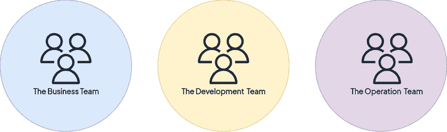
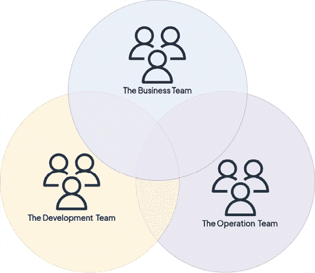
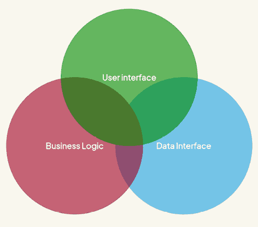
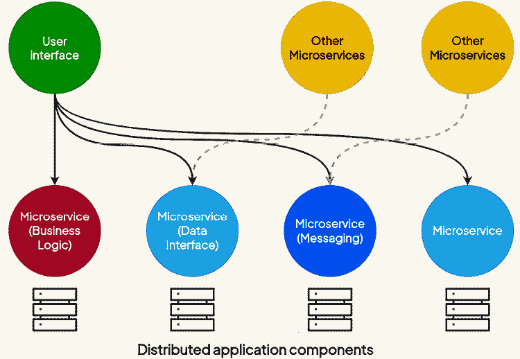
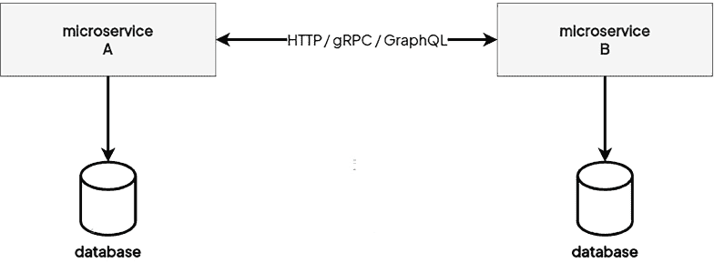
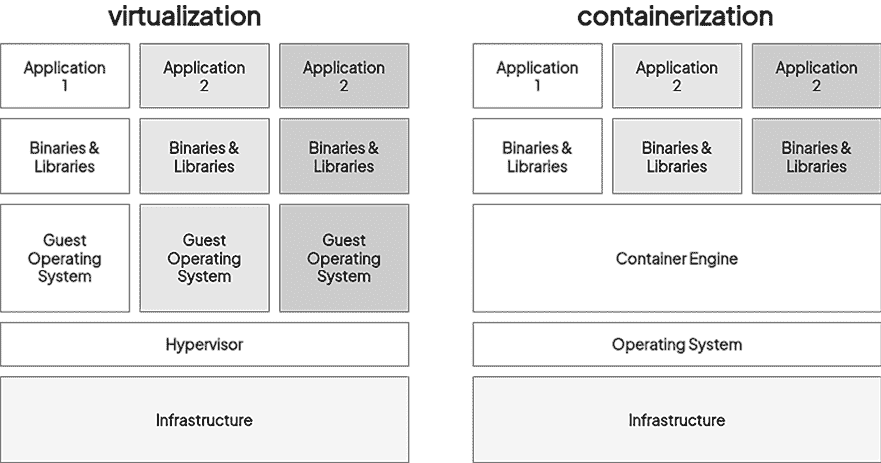
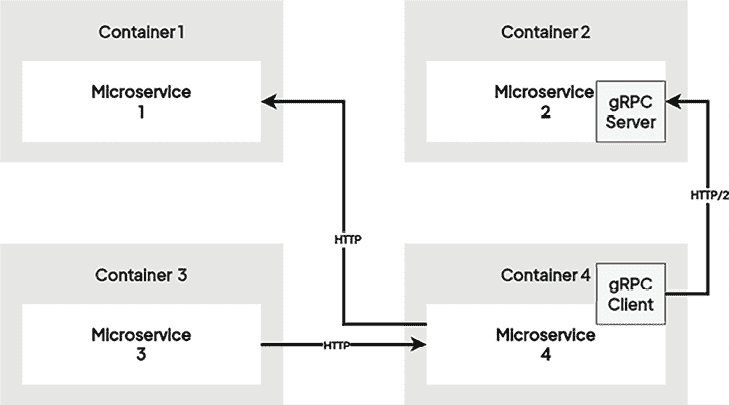
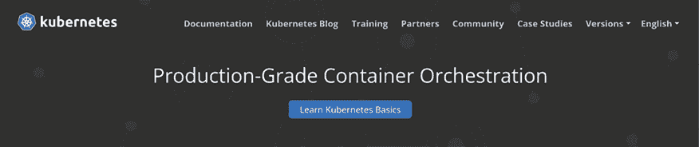
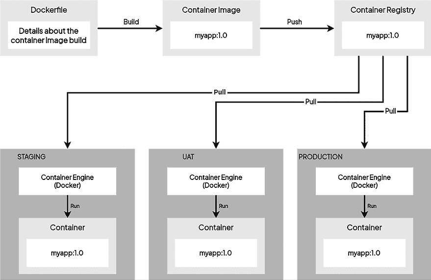
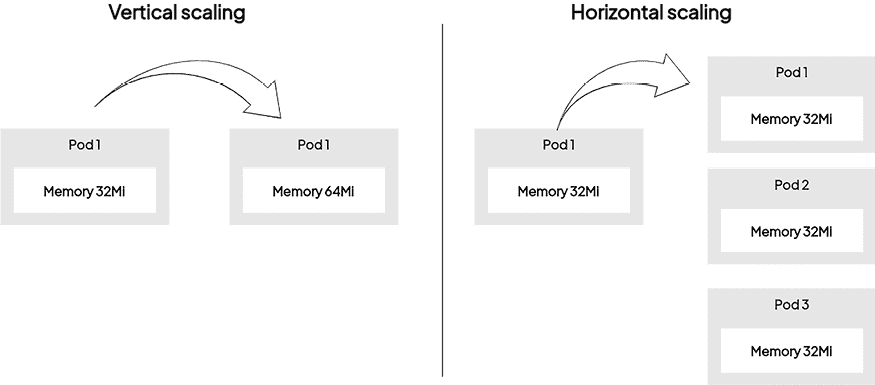

# 第一章：Kubernetes 基础

欢迎来到 *Kubernetes 圣经*，我们很高兴陪伴你一起走上 Kubernetes 的学习之旅。如果你从事软件开发行业，你可能听说过 Kubernetes。这是很正常的，因为 Kubernetes 的受欢迎程度在近几年大幅上升。

由 Google 构建的 Kubernetes 是目前最流行且被广泛采用的容器编排解决方案：如果你在寻找一个解决方案来管理生产环境中大规模的容器化应用，无论是在本地还是公共云中，它都是你所需要的工具。请专注于这个词。大规模部署和管理容器是极其困难的，因为默认情况下，像 Docker 这样的容器引擎本身并不提供任何方法来保持容器的大规模可用性和可扩展性。

Kubernetes 最初作为 Google 的一个项目出现，Google 在构建一个能够在其大规模分布式基础设施上部署大量容器的解决方案上投入了大量的精力。通过将 Kubernetes 作为你技术栈的一部分，你将获得一个由互联网最大公司之一构建的开源平台，该公司在稳定性方面有着最为严苛的需求。

尽管 Kubernetes 可以与许多不同的容器运行时一起使用，本书将专注于 Kubernetes 与容器（Docker 和 Podman）的组合。

也许你已经在日常工作中使用 Docker，但容器编排的世界对你来说可能完全陌生。甚至可能你看不到使用这种技术的好处，因为对于你来说，仅仅使用原生 Docker 就已经足够了。这就是为什么在本章中，我们不会详细讲解 Kubernetes。相反，我们将重点解释 Kubernetes 是什么，以及它如何帮助你管理生产环境中的应用容器。如果你了解它为什么被构建出来，那么学习这项新技术会更容易。

在本章中，我们将涵盖以下主要内容：

+   理解单体应用与微服务

+   理解容器

+   Kubernetes 如何帮助你管理容器？

+   理解 Kubernetes 的历史

+   探索 Kubernetes 解决的问题

你可以从官方 GitHub 仓库下载本章的最新代码示例，地址是 [`github.com/PacktPublishing/The-Kubernetes-Bible-Second-Edition/tree/main/Chapter01`](https://github.com/PacktPublishing/The-Kubernetes-Bible-Second-Edition/tree/main/Chapter01)

# 理解单体应用与微服务

现在让我们暂时把 Kubernetes 和 Docker 放到一边，换个角度来谈一谈过去 20 年里互联网和软件开发是如何共同发展的。这将帮助你更好地理解 Kubernetes 的定位及其所解决的问题。

## 理解自 1990 年代末以来互联网的增长

自 1990 年代末以来，互联网的普及迅速增长。在 1990 年代，甚至是 2000 年代初期，全球只有几十万人在使用互联网。如今，几乎有 20 亿人使用互联网进行电子邮件、网页浏览、视频游戏等活动。

现在互联网用户数量庞大，我们用它来满足各种不同的需求，而这些需求由部署在不同设备上的数十个应用程序来解决。

此外，联网设备的数量也在增加，因为现在每个人可以有多种不同类型的设备连接到互联网：笔记本电脑、台式电脑、智能手机、电视、平板电脑等。

如今，我们可以使用互联网购物、工作、娱乐、阅读或做任何事情。互联网几乎渗透到我们社会的每个角落，并且在过去 20 年里引发了深刻的范式转变。所有这些都使得软件开发变得至关重要。

## 理解更频繁发布软件版本的需求

为了应对这不断增长的用户需求，这些用户总是希望软件能提供更多的功能，软件开发行业不得不进化，以便更快、更频繁地发布新版本。

事实上，回到 1990 年代，你可以构建一个应用程序，将其部署到生产环境中，并且每年更新一次或两次。今天，企业必须能够在生产环境中更新软件，有时甚至是一天好几次，无论是部署新功能、与社交媒体平台集成、支持最新流行智能手机的分辨率，还是发布一个前一天发现的安全漏洞补丁。今天的一切都变得更加复杂，你必须比以前更快。

我们不断需要更新软件，最终，许多公司的生存直接取决于它们能多频繁地向用户发布新版本。但我们如何加速软件开发生命周期，以便能更频繁地向用户交付新版本呢？

企业的 IT 部门必须进行转型，无论是从组织层面还是技术层面。在组织上，他们改变了管理项目和团队的方式，以便转向敏捷方法；在技术上，云计算平台、容器技术和虚拟化等技术被广泛采用，并在很大程度上帮助将技术敏捷性与组织敏捷性对齐。所有这些都是为了确保更频繁的软件发布！接下来，我们将重点讨论这一演变。

## 理解组织向敏捷方法论转型

从纯粹的组织角度来看，敏捷方法论如 Scrum、Kanban 和 DevOps 成为组织 IT 团队的标准方式。

典型的 IT 部门如果不采用敏捷方法，通常由三个不同的团队组成，每个团队在开发和发布生命周期中负责单一的任务。

请放心，尽管我们目前讨论的是敏捷方法论和互联网的历史，但这本书的主题实际上是 Kubernetes！我们只是需要解释一些在正式引入 Kubernetes 之前遇到的问题！

在采用敏捷方法论之前，开发和运维通常在不同的孤岛中工作。这可能导致低效和沟通障碍。敏捷方法论帮助弥补了这些沟通空白，促进了合作。以下是三个孤立的团队。

+   **业务团队**：他们就像是客户的声音。他们的工作是解释应用程序中需要哪些功能，以满足用户需求。他们将业务目标转化为开发人员的明确指令。

+   **开发团队**：这些是将应用程序付诸实践的工程师。他们将业务团队的功能需求转化为代码，构建用户将交互的功能和特性。来自业务团队的清晰沟通至关重要。如果指令定义不清，就像打电话游戏一样——误解会导致延迟和返工。

+   **运维团队**：他们是服务器的守护者。他们的主要工作是保持应用程序的平稳运行。新功能可能会带来干扰，因为它们需要更新，这可能具有风险。过去，他们并不总是知道即将推出的新功能，因为他们未参与计划。

这些就是我们所说的孤岛，如*图 1.1*所示：



图 1.1：典型 IT 部门中孤立的团队

各角色分工明确，来自不同团队的人很少一起合作，当出现问题时，每个人都浪费时间寻找正确的信息来源。

这种孤立的组织方式已经导致了许多重大问题：

+   显著更长的开发时间

+   部署的发布版本可能完全无法在生产环境中运行的更大风险

这正是敏捷方法论和 DevOps 所解决的问题。敏捷方法论带来的改变是通过创建跨职能团队，让人们一起工作。

DevOps 是一种协作文化和一套实践，旨在弥合开发（Dev）和运维（Ops）团队之间的鸿沟。DevOps 推动了整个软件生命周期中的协作和自动化，从开发、测试到部署和维护。

一个敏捷团队由产品负责人组成，他们通过将功能写成用户故事的方式，向开发人员描述具体特性，开发人员在同一个团队中工作。开发人员应当能看到生产环境，并能够在其上进行部署，最好是采用**持续集成和持续部署**（**CI/CD**）方法。测试人员也应该是敏捷团队的一部分，以便编写测试。

通过协作方式，团队将更好地理解整体情况，如下图所示。



图 1.2: 团队协作打破了隔阂

只需要理解的是，通过采用敏捷方法和 DevOps，这些隔阂被打破了，能够将需求正式化、实施、测试、发布，并在生产环境中维护的跨职能团队得以建立。*表 1.1* 展示了从传统开发到敏捷和 DevOps 方法的转变。

| **特性** | **传统开发** | **敏捷 & DevOps** |
| --- | --- | --- |
| 团队结构 | 隔离的部门（开发、运维） | 跨职能、多学科的团队 |
| 工作方式 | 隔离的工作流程，有限的沟通 | 协作的，迭代的开发周期 |
| 拥有权 | 开发交给运维进行部署和维护 | “你构建它，你运行它” - 团队负责整个生命周期 |
| 关注点 | 特性和功能 | 商业价值，持续改进 |
| 发布周期 | 长周期发布，部署不频繁 | 短冲刺，频繁发布并带有反馈循环 |
| 测试 | 开发后单独的测试阶段 | 在整个开发周期中进行集成测试 |
| 基础设施 | 静态、手动管理的基础设施 | 自动化的基础设施配置和管理（DevOps） |

表 1.1: DevOps 与传统开发 – 协作方式的转变

所以，我们已经讨论了采用敏捷方法所带来的组织转型。现在，让我们来讨论过去几年我们经历的技术演变。

## 理解从本地托管到云托管的转变

拥有敏捷团队非常好，但敏捷性也必须应用到软件的构建和托管方式上。

为了始终实现更快速和更频繁的发布，敏捷软件开发团队必须重新审视软件开发和发布的两个重要方面：

+   托管

+   软件架构

现在，应用程序不仅仅是为几百个用户提供服务，而是可能为数百万个用户同时使用。更多的互联网用户意味着需要更多的计算能力来处理这些用户。的确，托管应用程序已成为一个非常大的挑战。

在早期的网页托管时代，企业主要依赖两种主要方法来托管其应用程序：其中一种方法是本地托管。这种方式涉及到物理拥有和管理运行其应用程序的服务器。实现本地托管有两种主要方式：

1.  **专用服务器**：从已有的数据中心供应商租用物理服务器：这涉及到从托管公司租用专用服务器硬件。托管服务提供商管理物理基础设施（电力、冷却、安全），但服务器配置、软件安装和持续维护的责任则由业务方承担。这种方式相比共享托管提供了更大的控制和定制化，但仍然需要大量的内部技术专长。

1.  **建设您自己的数据中心**：建设和维护私有数据中心：此选项涉及公司大量投资以建设和维护其自己的物理数据中心设施。这包括购买服务器硬件、网络设备和存储解决方案，并实施强大的电源、冷却和安全措施。尽管提供了最高级别的控制和安全性，但这种方法非常昂贵且资源密集，通常只由具有重要 IT 资源的大公司才能承担。

此外，本地托管还涵盖了操作系统的管理、安全补丁、备份和服务器灾难恢复计划。公司通常需要专门的 IT 人员来管理和维护其本地基础设施，从而增加了总体成本。

当您的用户基础增长时，您需要获取更强大的机器来处理负载。解决方案是购买一台更强大的服务器，并从一开始就在其上安装您的应用程序，或者如果您管理您的数据中心，则是订购和安装新的硬件。这不是很灵活。今天，许多公司仍在使用本地解决方案，通常情况下，这种方案不是很灵活。

改变游戏规则的是采用另一种方法，即公共云，这与本地不同。云计算的理念是，像亚马逊、谷歌和微软这样的大公司，拥有大量数据中心，决定在其庞大的基础设施上构建虚拟化，以确保通过 API 访问虚拟机的创建和管理。换句话说，您只需点击几下或输入几个命令就可以获得虚拟机。

下表提供了云计算对组织有益的高级信息。

| **特性** | **本地** | **云** |
| --- | --- | --- |
| 可扩展性 | 有限 – 扩展时需要购买新硬件 | 高度可扩展 – 可按需增加或减少资源 |
| 灵活性 | 不灵活 – 变更需要物理硬件调整 | 高度灵活 – 资源可以快速配置和去配置 |
| 成本 | 硬件、软件许可和 IT 人员的高前期成本 | 低前期成本 – 按使用资源付费模式 |
| 维护 | 需要专门的 IT 人员进行维护和更新 | 最小维护要求 – 云服务提供商管理基础设施 |
| 安全性 | 对安全性有很高的控制，但需要显著的专业知识 | 云服务提供商实施了强大的安全措施 |
| 宕机时间 | 从硬件故障中恢复可能耗时 | 云提供商提供高可用性和灾难恢复功能 |
| 位置 | 仅限于数据中心的物理位置 | 可通过任何具有互联网连接的地方访问 |

表 1.2：云计算对组织的重要性

我们将在下一节中学习云计算技术如何帮助组织扩展其 IT 基础设施。

## 理解为什么云计算非常适合可扩展性

今天，几乎任何人都可以通过几次点击，获得数百或数千台服务器，这些服务器以虚拟机或实例的形式存在，由**亚马逊 AWS**、**谷歌云平台**和**微软 Azure**等云服务提供商在物理基础设施上维护。许多公司决定将其工作负载从本地迁移到云服务提供商，并且在过去几年中，这种采用率巨大。

借助这一点，现在计算能力是你最容易获取的资源之一。

云计算提供商如今是敏捷团队工具库中的典型托管解决方案。其主要原因是云计算非常适合现代开发。

虚拟机配置、CPU、操作系统、网络规则等都是公开显示并完全可配置的，因此你的团队在了解生产环境构成时没有任何秘密。由于云服务提供商的可编程特性，复制一个生产环境到开发或测试环境变得非常容易，这为团队提供了更多的灵活性，帮助他们在开发软件时应对挑战。这对于基于 DevOps 理念的敏捷开发团队来说，是一个非常有用的优势，他们需要管理生产环境中的应用开发、发布和维护。

云服务提供商提供了许多好处，具体如下：

+   弹性和可扩展性

+   有助于打破信息孤岛并推动敏捷方法论的实施

+   与敏捷方法论和 DevOps 高度契合

+   低成本和灵活的计费模型

+   确保无需管理物理服务器

+   允许虚拟机随时销毁并重新创建

+   相较于每月租用裸金属机器，更加灵活

由于这些好处，云计算成为了敏捷开发团队工具库中的宝贵资产。本质上，你可以不断构建和复制生产环境，而无需自己管理物理机器。云计算使你能够根据使用者数量或他们消耗的计算资源来扩展你的应用。你将使你的应用高可用并具备容错能力。结果是为终端用户提供更好的体验。

**重要提示**

请注意，Kubernetes 可以在云端和本地运行。Kubernetes 非常灵活，你甚至可以在 Raspberry Pi 上运行它。Kubernetes 与公共云非常匹配，但你并不需要或被强制在云端运行它。

既然我们已经解释了云计算带来的变化，让我们接着谈谈软件架构，因为多年来，这里也发生了一些变化。

## 探索单体架构

过去，应用程序大多由单体架构构成。一个典型的单体应用程序由一个简单的进程、一个二进制文件或一个包组成，如*图 1.3*所示。

这个独立组件负责整个业务逻辑的实现，软件必须对其作出响应。如果你想开发一些不一定会频繁更新的简单应用程序，单体架构是一个不错的选择。为什么？因为单体架构有一个主要的缺点。如果你的单体架构因某些原因变得不稳定或崩溃，整个应用程序将无法使用：



图 1.3：单体应用程序由一个大组件组成，包含了所有的软件

单体架构可以在开发过程中为你节省大量时间，也许这是你选择这种架构时唯一能找到的好处。然而，它也有许多缺点。以下是其中的一些：

+   一个部署到生产环境的失败可能会破坏整个应用程序。

+   扩展活动变得难以实现；如果你无法扩展，所有的应用程序可能都会变得无法使用。

+   单体应用程序的任何类型的失败都可能导致整个应用程序的宕机。

在 2010 年代，这些缺点开始带来实际问题。随着部署频率的增加，必须考虑一种新架构，能够支持频繁的部署和更短的更新周期，同时降低应用程序的风险或一般不可用性。这就是为什么微服务架构被设计出来的原因。

## 探索微服务架构

微服务架构是将软件应用程序作为一组独立的微应用程序进行开发。每个应用程序被称为**微服务**，它有自己的版本控制、生命周期、环境和依赖关系。此外，它还可以有自己的部署生命周期。每个微服务只能负责有限数量的业务规则，所有的微服务一起构成整个应用程序。可以将微服务视为独立的完整软件，具有自己的生命周期和版本控制过程。

由于微服务仅应承载整个应用程序的一部分功能，它们必须是可访问的，以便暴露其功能。你必须从一个微服务获取数据，但也可能希望向其推送数据。你可以通过广泛支持的协议（如 HTTP 或 AMQP）使你的微服务可访问，并且它们需要能够相互通信。

这就是为什么微服务通常作为通过明确定义的 API 暴露其功能的 Web 服务构建的原因。虽然 HTTP（或 HTTPS）REST API 由于其简单性和广泛采用而成为流行的选择，但其他协议，如 GraphQL、AMQP 和 gRPC，正在获得关注并被广泛使用。

关键要求是微服务提供一个良好文档化且可发现的 API 端点，无论选择何种协议。这允许其他微服务无缝地进行交互并交换数据。

这是与单体架构大不相同的地方：



图 1.4：一个微服务架构，其中不同的微服务通过 HTTP 协议进行通信

微服务架构的另一个关键方面是微服务需要解耦：如果一个微服务变得不可用或不稳定，它必须不会影响其他微服务或整个应用程序的稳定性。你必须能够独立地部署、扩展、启动、更新或停止每个微服务，而不影响其他任何部分。如果你的微服务需要与数据库引擎一起工作，记住即使是数据库也必须解耦。每个微服务应该有自己的数据库，等等。所以，如果**微服务 A**的数据库崩溃，它不会影响到**微服务 B**：



图 1.5：一个微服务架构，其中不同的微服务相互通信并与专用的数据库服务器进行交互；通过这种方式，微服务是隔离的，没有共同的依赖关系

关键规则是尽可能地解耦，使你的微服务完全独立。因为微服务旨在独立运作，它们还可以拥有完全不同的技术环境，并且可以用不同的语言实现。你可以有一个用 Go 实现的微服务，一个用 Java 实现的微服务，另一个用 PHP 实现的微服务，它们共同构成一个应用程序。在微服务架构的背景下，这不是问题。因为 HTTP 是标准协议，它们即使底层技术不同，也能够互相通信。

微服务必须与其他微服务解耦，但它们也必须与运行它们的操作系统解耦。微服务不应该在主机系统级别操作，而应该在更高层次上操作。你应该能够根据需要将它们部署到不同的机器上，而无需依赖于主机系统的强依赖性；这就是为什么微服务架构和容器是一个很好的组合。

如果你需要在生产环境中发布新特性，你只需要部署受到新特性版本影响的微服务，其他的可以保持不变。

正如你可以想象的那样，微服务架构在现代应用开发中具有巨大的优势：

+   它更容易执行周期性的生产交付，同时对整个应用的稳定性影响最小。

+   你每次只能升级特定的微服务，而不是整个应用程序。

+   扩展活动更加顺畅，因为你可能只需要扩展特定的服务。

然而，从另一方面来看，微服务架构也有一些缺点：

+   该架构需要更多的规划，并且开发难度较大。

+   管理每个微服务的依赖关系存在问题。

微服务应用被认为难以开发。这种方法可能很难理解，尤其是对于初级开发人员而言。依赖关系管理也可能变得复杂，因为所有微服务可能具有不同的依赖关系。

## 在单体架构和微服务架构之间做出选择

构建一个成功的软件应用需要谨慎的规划，而你面临的关键决策之一就是选择使用哪种架构。两种主要的架构方法主导了这一领域：单体架构和微服务架构：

+   **单体架构**：想象一个紧凑的、集成的系统。这就是单体架构的精髓。一切都存在于同一个代码库中，使得对于小型项目或资源有限的团队来说，开发和初始部署都变得简单。此外，单体架构的更新往往很快，因为只需要管理一个系统。

+   **微服务**：可以把它看作是一个复杂的应用被分解成独立的、模块化的组件。每个服务都可以单独构建、扩展和部署。这种方法在大型功能丰富的项目和拥有多样技能团队中表现尤为出色。微服务提供了灵活性和可能较快的开发周期。然而，它们也带来了在故障排除和安全管理上的额外复杂性。

最终，单体架构和微服务架构的选择取决于你的具体需求。考虑项目的规模、团队结构以及所需的灵活性水平。不要被趋势左右——选择能帮助你的团队高效开发和管理应用的架构。

Kubernetes 提供了灵活性，适用于快速变化的单体架构和微服务架构，允许你选择最适合你项目需求的架构。

在下一节中，我们将了解容器以及它们如何帮助微服务软件架构。

# 了解容器

通过单体架构和微服务架构的比较，你应该已经明白，最能结合敏捷性和 DevOps 的架构是微服务架构。正是这种架构，我们将在本书中讨论，因为它是 Kubernetes 能够很好管理的架构。

现在，我们将讨论如何使用 Docker，作为 Linux 的容器引擎，来管理微服务。如果你已经对 Docker 有很多了解，可以跳过这一节。否则，我建议你仔细阅读这一节。

## 了解为什么容器适用于微服务

回顾微服务架构的两个重要方面：

1.  每个微服务可以有自己的技术环境和依赖关系。

1.  同时，它必须与运行它的操作系统解耦。

让我们暂时搁置后面提到的问题，先讨论第一个问题：同一个应用的两个微服务可能使用两种不同的编程语言开发，或者使用相同的编程语言，但作为两个不同的版本。现在，假设你想在同一台 Linux 机器上部署这两个微服务，那将是一个噩梦。

原因在于你需要安装所有不同运行时的版本，以及相应的依赖项，而且两个微服务之间可能也存在版本冲突或重叠。此外，所有这些都将运行在同一宿主操作系统上。现在，假设你想从机器上移除其中一个微服务，将其部署到另一台服务器上，并清理掉该微服务使用的所有依赖项。当然，如果你是一个才华横溢的 Linux 工程师，你会成功做到这一点。但是对于大多数人来说，依赖项之间冲突的风险非常大，最终你可能只是让你的应用在这种噩梦般的基础设施下变得不可用。

这有一个解决方案：你可以为每个微服务构建一个机器镜像，然后将每个微服务部署到一个专用的虚拟机上。换句话说，你避免在同一台机器上部署多个微服务。然而，在这个例子中，你将需要与微服务数量相等的机器。当然，在 AWS 或 GCP 的帮助下，启动大量服务器，每台服务器只负责运行一个微服务将变得非常容易，但如果不共享宿主机提供的计算能力，这将是一个巨大的浪费。

在容器世界中有类似的解决方案，但默认的容器运行时并不提供微服务之间的完全隔离。这正是**Kata 运行时**和**保密容器**项目发挥作用的地方。这些技术为容器化应用程序提供了增强的安全性和隔离性。我们将在本书的后续章节中深入探讨这些容器隔离的概念。

我们将在下一节中学习容器如何帮助实现隔离。

## 理解容器隔离的好处

像 Docker 和 Podman 这样的容器引擎在管理微服务中起着至关重要的作用。与需要完整操作系统的**虚拟机**（**VMs**）不同，容器是轻量级单元，它们共享宿主机的 Linux 内核。这使得容器比虚拟机更快地启动和停止。

容器引擎提供了一个用户友好的 API，用于构建、部署和管理容器。容器引擎并不会引入额外的虚拟化层，而是利用 Linux 内核的内建能力来实现进程隔离、安全性和资源分配。这种高效的方式使得容器化成为部署微服务的一个有吸引力的解决方案。

下图展示了容器与虚拟机的区别：



图 1.6：虚拟机与容器之间的区别

您的微服务将会在这一层之上启动，而不是直接在宿主系统上运行，宿主系统的唯一角色是运行您的容器。

由于容器是隔离的，您可以根据需要运行任意数量的容器，并且让它们运行用不同语言编写的应用程序，而不会发生任何冲突。微服务的迁移变得像停止运行一个容器并从相同镜像在另一台机器上启动一个新容器一样简单。

使用容器与微服务结合提供了三个主要的好处：

+   它减少了对宿主系统的占用。

+   它使得宿主系统可以互相共享，而不会有不同微服务之间的冲突。

+   它消除了微服务与宿主系统之间的耦合。

一旦微服务被容器化，您可以消除它与宿主操作系统的耦合。微服务将仅依赖于它所运行的容器。由于容器比真正的全功能 Linux 操作系统轻得多，因此它可以轻松地共享并部署到多台不同的机器上。因此，容器和您的微服务可以在任何运行容器引擎的机器上工作。

下图展示了一个微服务架构，其中每个微服务都被一个容器封装：



图 1.7：一个微服务应用，其中所有微服务都被容器封装；应用的生命周期与容器绑定，并且可以轻松地在任何运行容器引擎的机器上进行部署。

容器也与 DevOps 方法论非常契合。通过在容器中本地开发，稍后在生产环境中构建并部署，您可以确保在与最终运行应用程序的环境相同的环境中进行开发。

容器引擎不仅能管理容器的生命周期，还能管理围绕容器的整个生态系统。它们可以管理网络、不同容器之间的通信，这些特性特别适应我们之前提到的微服务架构的特点。

通过将云和容器结合使用，您可以构建一个非常强大的基础设施来托管您的微服务。云将为您提供任意数量的机器。您只需在每台机器上安装容器引擎，就可以在这些机器上部署多个容器化的微服务。

Docker 或 Podman 等容器引擎本身就是非常优秀的工具。然而，您会发现，单独在生产环境中运行它们是很困难的，就像它们本身一样。

容器引擎在开发环境中表现出色，原因在于：

+   **简便性**：容器引擎易于安装和使用，允许开发人员快速构建、测试和运行容器化的应用程序。

+   **灵活性**：开发人员可以使用容器引擎尝试不同的容器配置，探索容器化的世界。

+   **隔离**：容器引擎确保应用程序之间的隔离，防止冲突并简化调试。

然而，生产环境有严格的要求，仅依靠容器引擎无法满足所有需求：

+   **扩展性**：容器引擎（如 Docker 或 Podman）并不提供内建的自动扩展功能，无法根据资源利用率动态调整容器部署。

+   **灾难恢复**：容器引擎并不提供全面的灾难恢复能力，无法确保在故障发生时服务的可用性。

+   **安全性**：尽管容器引擎提供基本的隔离功能，但在多个机器上管理大规模容器化部署的安全策略可能是一个挑战。

+   **标准化**：容器引擎需要自定义脚本或集成来与外部系统交互，例如 CI/CD 流水线或监控工具。

尽管容器引擎在开发环境中表现出色，但生产部署需要更强大的方法。Kubernetes 是一个强大的容器编排平台，通过提供全面的功能套件来解决这个挑战。它管理整个容器生命周期，从调度容器运行在可用资源上，到根据需求扩展或缩减部署规模，再到分配流量以优化性能（负载均衡）。与容器引擎的自定义脚本不同，Kubernetes 提供了一个明确定义的 API，用于与容器化应用程序交互，简化了与生产环境中其他工具的集成。除了基本的隔离，Kubernetes 还提供了高级安全功能，如基于角色的访问控制和网络策略。这使得能够高效管理多个团队或项目在同一基础设施上运行的容器化工作负载，优化资源利用，并简化复杂的部署。

在我们深入探讨 Kubernetes 相关话题之前，让我们先在下一节讨论容器和容器引擎的基础知识。

## 容器引擎

一个 **容器引擎** 作为终端用户和 REST 客户端的接口，管理用户输入，从容器注册中心下载容器镜像，将下载的镜像提取到磁盘，转换用户或 REST 客户端数据以与容器引擎交互，准备容器挂载点，并促进与容器引擎的通信。从本质上讲，容器引擎作为面向用户的层，简化了镜像和容器管理，而底层的容器运行时处理容器和镜像管理的复杂低级细节。

Docker 脱颖而出，成为最广泛采用的容器引擎之一，但需要注意的是，容器化领域中存在各种替代品。值得注意的有 **LXD**、**Rkt**、**CRI-O** 和 **Podman**。

Docker 的核心依赖于 `containerd` 容器运行时，后者负责容器管理的关键方面，包括容器生命周期、镜像传输和存储、执行与监控，以及存储和网络附件。`containerd` 进一步依赖于诸如 `runc` 和 `hcsshim` 等组件。`runc` 是一个命令行工具，用于在 Linux 中创建和运行容器，而 `hcsshim` 在创建和管理 Windows 容器方面发挥着关键作用。

值得注意的是，`containerd` 通常不是为了直接与终端用户交互而设计的。相反，像 Docker 这样的容器引擎通过与容器运行时交互来促进容器的创建和管理。`runc` 的核心作用非常明显，它不仅服务于 `containerd`，还被 Podman、CRI-O 以及间接地被 Docker 本身使用。

## 容器基础知识

正如我们在上一节中所学，Docker 是一个广为人知且被广泛使用的容器引擎。现在，让我们了解一些与容器相关的基本术语。

### 容器镜像

容器镜像是一种由容器引擎用来启动容器的模板。容器镜像是一个自包含的可执行包，封装了应用程序及其依赖项。它包含运行软件所需的一切，如代码、运行时、库和系统工具。容器镜像是从 `Dockerfile` 或 `Containerfile` 创建的，这些文件指定了构建步骤。容器镜像存储在镜像仓库中，并通过 Docker Hub 等容器注册中心共享，是容器化的基本组成部分。

### 容器

容器可以视为容器镜像的一个运行实例。容器就像是应用程序的模块化运输箱。它们将应用程序的代码、依赖关系和运行时环境打包成一个轻量级的单一包裹。容器在不同的环境中运行时保持一致，因为它们包含运行软件所需的所有内容。每个容器独立运行，避免了与系统中其他应用程序的冲突。容器共享主机操作系统的内核，使得容器比虚拟机启动和停止更快。

### 容器注册中心

容器注册表是一个集中式仓库，用于存储和共享容器镜像。它充当分发机制，允许用户将镜像推送到注册表或从注册表拉取镜像。流行的公共注册表包括 Docker Hub、Red Hat Quayi、Amazon 的 **Elastic Container Registry** (**ECR**)、Azure Container Registry、Google Container Registry 和 GitHub Container Registry。组织通常使用私有注册表来安全地存储和共享自定义镜像。注册表在 Docker 生态系统中起着至关重要的作用，促进了容器化应用程序的协作和高效管理。

### Dockerfile 或 Containerfile

Dockerfile 或 Containerfile 是一个包含构建容器镜像一系列指令的文本文件。它定义了基础镜像、设置环境、复制应用程序代码、安装依赖项，并配置运行时设置。Dockerfile 或 Containerfile 提供了一种可重复和自动化的方式来创建一致的镜像，使开发人员能够对应用程序配置进行版本管理并共享。

一个示例 Dockerfile 可以在以下代码片段中看到：

```
# syntax=docker/dockerfile:1

FROM node:18-alpine
WORKDIR /app
COPY . .
RUN yarn install --production
CMD ["node", "src/index.js"]
EXPOSE 3000 
```

下面是对所提供的 Dockerfile 的逐行解释：

1.  `# syntax=docker/dockerfile:1`：这一行定义了构建镜像时使用的 Dockerfile 语法版本。在本例中，它指定了标准 Dockerfile 语法的版本 1。

1.  `FROM node:18-alpine`：这一行定义了容器的基础镜像。它指示容器引擎使用官方的 Node.js 18 镜像，并基于 Alpine Linux。这样为您的应用程序提供了一个轻量高效的基础。

1.  `WORKDIR /app`：这一行设置了容器内的工作目录。这里，它将 `/app` 设置为工作目录。接下来的 Dockerfile 命令将相对于这个目录执行。

1.  `COPY . .`：这一行将当前上下文中的所有文件和目录（即包含 Dockerfile 的目录）复制到前一步中定义的工作目录（`/app`）中。实际上，它是将整个应用程序代码库复制到容器中。

1.  `RUN yarn install --production`：这一行指示容器引擎在容器内执行一个命令。这里，它运行 `yarn install --production`。这个命令使用 `yarn` 包管理器安装 `package.json` 文件中列出的所有生产环境依赖项。`--production` 标志确保只安装生产依赖项，排除开发依赖项。

1.  `CMD ["node", "src/index.js"]`：这一行定义了容器启动时执行的默认命令。这里，它指定了一个包含两个元素的数组：`"node"` 和 `"src/index.js"`。这告诉 Docker 启动 Node.js 解释器（node）并执行应用程序的入口脚本（`src/index.js`）。

1.  `EXPOSE 3000`：这一行暴露了容器中的一个端口。在这里，它暴露了容器中的端口 `3000`。这默认并不会将端口映射到主机，但允许你在稍后运行容器时通过 `-p` 标志来映射（例如 `docker run -p 3000:3000 my-image`）。暴露端口 `3000` 表明你的应用可能正在此端口监听传入连接。

    **重要提示**

    要构建容器镜像，你可以使用支持的容器引擎（如 Docker 或 Podman）或容器构建工具，例如 Buildah 或 kaniko。

### Docker Compose 或 Podman Compose

Docker Compose 是一个定义和运行多容器应用程序的工具。它使用 YAML 文件来配置应用所需的服务、网络和数据卷，允许开发人员在一个文件中定义整个应用堆栈。Docker Compose 或 Podman Compose 简化了复杂应用程序的编排，使得管理多个容器作为一个单一应用堆栈变得更加容易。

以下 `compose.yaml` 文件将通过单个 `docker compose` 或 `podman compose` 命令启动两个容器，构建一个 WordPress 应用堆栈：

```
# compose.yaml
services:
  db:
    image: docker.io/library/mariadb
    command: '--default-authentication-plugin=mysql_native_password'
    volumes:
      - db_data:/var/lib/mysql
    restart: always
    environment:
      - MYSQL_ROOT_PASSWORD=somewordpress
      - MYSQL_DATABASE=wordpress
      - MYSQL_USER=wordpress
      - MYSQL_PASSWORD=wordpress
    expose:
      - 3306
      - 33060
    networks:
      - wordpress
  wordpress:
    image: wordpress:latest
    ports:
      - 8081:80
    restart: always
    environment:
      - WORDPRESS_DB_HOST=db
      - WORDPRESS_DB_USER=wordpress
      - WORDPRESS_DB_PASSWORD=wordpress
      - WORDPRESS_DB_NAME=wordpress
    networks:
      - wordpress
volumes:
  db_data:
networks:
  wordpress: {} 
```

在下一节中，我们将学习 Kubernetes 如何高效地编排所有这些容器操作。

# Kubernetes 如何帮助你管理容器？

在本节中，我们将重点讨论 Kubernetes，这也是本书的目的所在。

## Kubernetes – 旨在运行生产环境中的工作负载

如果你打开官方 Kubernetes 网站（[`kubernetes.io`](https://kubernetes.io)），你会看到的标题是 **生产级容器编排**：



图 1.8：Kubernetes 首页展示标题并将 Kubernetes 介绍为生产级容器编排平台

这四个词完美地总结了 Kubernetes 的功能：它是一个面向生产的容器编排平台。Kubernetes 并不旨在取代 Docker 或 Docker 或其他容器引擎的任何功能；而是旨在管理运行容器运行时的机器集群。在使用 Kubernetes 时，你同时使用 Kubernetes 和完整功能的标准容器运行时安装。

标题提到的**生产**一词确实非常关键。事实上，生产概念是 Kubernetes 的核心：它是为了满足现代生产需求而构思和设计的。如今，管理生产工作负载的方式与 2000 年代的做法不同。2000 年代时，你的生产工作负载通常由少数几台裸金属服务器组成，甚至可能只有一台本地服务器。这些服务器大多直接在宿主 Linux 系统上运行单体应用。然而今天，得益于公共云平台，如**Amazon Web Services**（**AWS**）或**Google Cloud Platform**（**GCP**），任何人都可以通过几个点击获取数百甚至数千台机器，作为实例或虚拟机。更棒的是，我们不再在宿主系统上部署应用程序，而是将其作为容器化的微服务部署在 Docker Engine 之上，从而减少了宿主系统的负担。

当你必须在云端的每台虚拟机上管理 Docker 安装时，问题就会出现。假设你在首选云平台上启动了 10 台（或者 100 台或 1,000 台）机器，并且你希望完成一个非常简单的任务：在这些机器上部署容器化的 Docker 应用程序。

你可以通过在每台机器上运行`docker run`命令来实现这个操作。虽然这样是可行的，但当然有更好的方法，那就是使用**容器编排工具**，例如**Kubernetes**。为了让你对 Kubernetes 有一个极其简化的理解，它是一个**REST API**，用于保持你运行 Docker 守护进程的机器的注册表。

再次强调，这只是对 Kubernetes 的一个极其简化的定义。实际上，它并不是由单一的集中式 REST API 组成，因为正如你可能已经了解的那样，Kubernetes 是作为一组微服务构建的。

另外需要注意的是，虽然 Kubernetes 在管理容器化工作负载方面表现出色，但它并不能完全取代虚拟机（**VMs**）。虚拟机在某些特定的应用场景中仍然非常有价值，例如运行遗留应用程序或具有复杂依赖关系且难以容器化的软件。然而，Kubernetes 正在不断发展，弥补容器和虚拟机之间的差距。

## KubeVirt – 容器与虚拟机之间的桥梁

**KubeVirt**是一个扩展 Kubernetes 管理虚拟机能力的项目，使用的是熟悉的 Kubernetes API。这使得用户能够利用 Kubernetes 的强大功能和灵活性来部署虚拟机，并与容器化应用一起管理。KubeVirt 采用了**基础设施即代码**（**IaC**）原则，使用户能够在 Kubernetes 清单中声明性地定义和管理虚拟机。这简化了虚拟机管理，并无缝地将其集成到现有的 Kubernetes 工作流程中。

通过将虚拟机纳入 Kubernetes 的框架，KubeVirt 为需要容器和虚拟机混合环境的组织提供了一种有吸引力的解决方案。这展示了 Kubernetes 作为一个平台在管理多样化工作负载方面的持续演变，可能会推动更加统一的应用程序部署和管理方式。

我们已经了解了容器及其在大规模管理和编排中的复杂性。在接下来的部分，我们将了解 Kubernetes 的历史和演变。

# 了解 Kubernetes 的历史

现在，让我们来讨论一下 Kubernetes 项目的历史。了解 Kubernetes 项目的背景以及推动这个项目发展的人员，对你来说将非常有帮助。

## 了解 Kubernetes 是如何以及在何处开始的

自 1998 年成立以来，谷歌在大规模管理高需求工作负载方面积累了大量经验，特别是基于容器的工作负载。从 2000 年代中期开始，谷歌一直处于将应用程序开发为 Linux 容器的前沿。在 Docker 简化容器使用之前，谷歌就已经认识到容器化的优势，并发起了一个名为 Borg 的内部项目。为了增强 Borg 的架构，使其更加可扩展和健壮，谷歌启动了另一个容器编排项目，名为 Omega。随后，Omega 引入的几个改进也被纳入了 Borg 项目中。

Kubernetes 最初是作为谷歌的一个内部项目诞生的，Kubernetes 的第一次提交发生在 2014 年，由 Brendan Burns、Joe Beda 和 Craig McLendon 等人完成。然而，谷歌并没有独立开源 Kubernetes。正是像 Clayton Coleman 这样的个人努力推动了 Kubernetes 的开源，并确保其作为社区驱动项目的成功。当时在 Red Hat 工作的 Clayton Coleman 在这一过程中发挥了至关重要的作用。Kelsey Hightower 是 CoreOS 的早期 Kubernetes 支持者，他成为了倡导这项技术的重要声音。通过他的演讲、写作以及作为 KubeCon 共同创始人的工作，他大大推动了 Kubernetes 的普及和社区的发展。

今天，除了谷歌，Red Hat、亚马逊、微软等公司也在积极参与 Kubernetes 项目。

**重要提示**

Borg 并不是 Kubernetes 的前身，因为该项目并没有死亡，至今仍在谷歌使用。更准确的说法是，Borg 中的许多理念被重新利用于 Kubernetes 的开发。请记住，Kubernetes 不是 Borg 或 Omega。Borg 是用 C++编写的，而 Kubernetes 是用 Go 编写的。事实上，它们是两个完全不同的项目，但一个深受另一个的启发。这一点非常重要：Borg 和 Omega 是谷歌的两个内部项目，它们并不是为公众开发的。

Kubernetes 是通过 Google 在生产环境中管理容器的经验开发的。最重要的是，它继承了 Borg 和 Omega 的思想、概念和架构。以下是从 Borg 和 Omega 中提取的思想和概念简要列表，这些现在已经在 Kubernetes 中实现：

+   Pods 概念用于管理容器：Kubernetes 使用一个逻辑对象，称为 Pod，用来创建、更新和删除容器。

+   每个 Pod 在集群中都有自己的 IP 地址。

+   存在分布式组件，它们都监视着中央 Kubernetes API，以获取集群状态。

+   Pods 和 Services 之间存在内部负载均衡。

+   标签和选择器是元数据，用于在 Kubernetes 中一起管理和编排资源。

这就是为什么 Kubernetes 在大规模生产环境中管理容器时如此强大的原因。事实上，你从 Kubernetes 中学到的概念比 Kubernetes 本身还要古老。尽管 Kubernetes 是一个年轻的项目，但它是建立在坚实的基础上的。

## 今天谁在管理 Kubernetes？

Kubernetes 不再由 Google 维护，因为 Google 于 2018 年 8 月 29 日将 Kubernetes 项目的运营控制权移交给了**云原生计算基金会**（**CNCF**）。CNCF 是一个非营利组织，旨在促进和维持云原生技术的开放生态系统。

Google 是 CNCF 的创始成员之一，与思科、红帽、英特尔等公司一起。Kubernetes 的源代码托管在 GitHub 上，并且是该平台上一个非常活跃的项目。Kubernetes 的代码使用 Apache 2.0 许可证，这是一种宽松的开源许可证。你无需为使用 Kubernetes 付费，如果你精通 Go 语言，你甚至可以为代码做贡献。

## Kubernetes 现在的现状如何？

在容器编排领域，Kubernetes 面临着来自各种替代方案的竞争，包括开源解决方案和平台特定的服务。一些 notable 竞争者包括：

+   Apache Mesos

+   HashiCorp Nomad

+   Docker Swarm

+   亚马逊 ECS

虽然这些编排工具各有优劣，但 Kubernetes 在该领域仍然以其广泛的采用度和受欢迎程度脱颖而出。

Kubernetes 已经赢得了流行度和采用度的竞争，成为了在生产环境中部署基于容器的工作负载的标准方式。随着其巨大的增长，Kubernetes 已经成为 IT 行业最热门的话题之一，对于云服务提供商来说，推出 Kubernetes 服务成为了一个至关重要的任务。因此，Kubernetes 几乎在任何地方都得到了支持。

以下基于 Kubernetes 的服务可以帮助你只需几次点击就能启动并运行一个 Kubernetes 集群：

+   Google Cloud Platform 上的 Google Kubernetes Engine（GKE）

+   弹性 Kubernetes 服务（Amazon EKS）

+   Microsoft Azure 上的 Azure Kubernetes Service

+   阿里云 Kubernetes 容器服务（ACK）

它不仅仅涉及云服务的提供。它还涉及平台即服务（PaaS）市场。**Red Hat** 从 2015 年发布 OpenShift 版本 3 开始，将 Kubernetes 融入其 OpenShift 容器平台。这标志着 OpenShift 架构的重大转变，从原有设计转向基于 Kubernetes 的容器编排系统，为用户提供了增强的容器管理功能，并提供了一整套企业级工具，用于在 Kubernetes 上构建、部署和管理容器。除此之外，其他项目如 Rancher 也作为 **Kubernetes 发行版** 提供围绕 Kubernetes 编排器的完整工具集，而像 **Knative** 这样的项目则使用 Kubernetes 编排器管理无服务器工作负载。

**重要提示**

AWS 是一个例外，因为它有两个容器编排服务。第一个是 Amazon ECS，完全由 AWS 制作。第二个是 Amazon EKS，发布的时间晚于 ECS，是 AWS 上完整的 Kubernetes 服务。这些服务不相同，所以不要被它们相似的名称误导。

## Kubernetes 将去向何方？

Kubernetes 不仅仅局限于容器！它正在发展，以管理更广泛的工作负载。KubeVirt 将其扩展到虚拟机，而与 TensorFlow 等 AI/ML 框架的集成可能使 Kubernetes 甚至能够编排机器学习任务。Kubernetes 的未来充满灵活性，可能成为管理容器、虚拟机甚至 AI/ML 工作流的“一站式”平台。

如果你从事云原生应用的生产管理，今天学习 Kubernetes 是你能做出的最明智的决定之一。Kubernetes 正在快速发展，完全不必怀疑它的增长会停止。

通过掌握这个强大的工具，你将获得目前 IT 行业中最受欢迎的技能之一。希望你现在已经信服了！

在下一部分中，我们将学习 Kubernetes 如何简化运维工作。

# 探索 Kubernetes 解决的问题

那么，为什么 Kubernetes 适合 DevOps 团队呢？这里有个联系：Kubernetes 作为容器编排平台，在容器化应用的部署、扩展和网络管理方面表现突出。容器是轻量级的包，将应用及其依赖项捆绑在一起，从而使跨不同环境的部署更快、更可靠。用户选择使用 Kubernetes 的原因有很多：

+   **自动化**：Kubernetes 自动化了与部署和管理容器化应用程序相关的许多手动任务，让开发人员可以腾出时间专注于创新。

+   **可扩展性**：Kubernetes 方便地根据需求扩展或缩减应用程序，确保资源的最佳利用。

+   **一致性**：Kubernetes 确保在不同环境中一致的部署，从开发到生产，最小化配置错误并简化交付过程。

+   **灵活性**：Kubernetes 兼容 DevOps 团队常用的各种工具和技术，简化了与现有工作流的集成。

你可以想象，在本地机器或开发环境上启动容器并不会像在可能面临数百万用户的远程机器上启动这些容器那样需要相同级别的规划。生产环境中特有的问题将会出现，而 Kubernetes 在生产中使用容器时，正是解决这些问题的绝佳方式：

+   确保高可用性

+   处理发布管理和容器部署

+   容器自动扩展

+   网络隔离

+   基于角色的访问控制（RBAC）

+   有状态工作负载

+   资源管理

## 确保高可用性

高可用性是生产环境中的核心原则。这意味着你的应用程序应始终保持可访问，并且永远不应出现宕机。 当然，这个目标有些乌托邦化，甚至最大的大公司也会经历服务中断。然而，你应该始终记住，这就是你的目标。Kubernetes 包含一整套功能，能够通过将容器复制到多个主机并定期频繁地监控它们的健康状况来确保容器的高可用性。

当你部署容器时，应用程序的可访问性将直接取决于容器的健康状况。假设由于某种原因，包含你某个微服务的容器变得不可访问；仅凭 Docker，你无法自动确保容器被终止并重新创建以保证服务恢复。而在 Kubernetes 中，这是可能的，因为 Kubernetes 会帮助你设计能够自动修复自己的应用程序，执行如健康检查和容器替换等自动化任务。

如果集群中的一台机器发生故障，所有在其上运行的容器都会消失。Kubernetes 会立即察觉到这一点，并将所有容器重新调度到另一台机器上。通过这种方式，你的应用程序将变得高度可用并具备容错能力。

## 发布管理和容器部署

部署管理是 Kubernetes 解决的另一个生产特定的问题。部署过程包括在生产环境中更新应用程序，用新版本替换某个微服务的旧版本。

生产环境中的部署总是复杂的，因为你必须更新那些正在响应终端用户请求的容器。如果你错过了它们，可能会对你的应用程序造成严重后果，因为它可能会变得不稳定或无法访问，这就是为什么你应该始终能够通过执行回滚操作快速恢复到应用程序的先前版本。部署的挑战在于，它需要以最不显眼的方式进行，尽量减少对终端用户的影响。

每当你发布新版本的应用时，涉及的多个过程如下：

1.  更新 `Dockerfile` 或 `Containerfile`，加入最新的应用信息（如果有的话）。

1.  使用应用的最新版本构建一个新的 Docker 容器镜像。

1.  将新的容器镜像推送到容器镜像仓库。

1.  从容器镜像仓库将新的容器镜像拉取到预发布/UAT/生产系统（Docker 主机）中。

1.  停止并删除系统上运行的现有（旧版本）应用容器。

1.  在预发布/UAT/生产系统中启动包含新版本应用容器镜像的新容器镜像。

请参考下图以了解典型场景中的高层次流程（请注意，这是一个理想场景，因为在实际环境中，你可能会为开发、预发布和生产环境使用不同且隔离的容器镜像仓库）。



图 1.9：容器管理的高层次工作流

**重要提示**

容器构建过程与 Kubernetes 完全无关：它纯粹是容器镜像管理的部分。Kubernetes 直到你需要基于新构建的镜像部署新容器时才会发挥作用。

如果没有 Kubernetes，你将不得不在你想要部署新版本容器的机器上运行所有这些操作，包括 `docker pull`、`docker stop`、`docker delete` 和 `docker run`。然后，你还需要在每台运行容器副本的服务器上重复这些操作。这样虽然能工作，但由于没有自动化，过程非常繁琐。而且，猜猜看？Kubernetes 可以为你自动化这一切。

Kubernetes 具有可以管理 Docker 容器部署和回滚的功能，这将在你应对这个问题时让你的生活变得更加轻松。只需一条命令，你就可以要求 Kubernetes 更新你所有机器上的容器，具体操作如下：

```
$ kubectl set image deploy/myapp myapp_container=myapp:1.0.0 
```

在一个真实的 Kubernetes 集群中，这条命令将更新每台机器上运行的名为 `myapp_container` 的容器，并将其部署为应用 `myapp` 的一部分，更新到 `1.0.0` 标签版本。

无论是必须更新在单台机器上运行的容器，还是更新跨多个数据中心的数百万个容器，这个命令的作用是相同的。更棒的是，它能确保高可用性。

记住，目标始终是满足高可用性的要求；部署不应导致你的应用崩溃或服务中断。Kubernetes 本身能够管理像滚动更新这样的部署策略，旨在防止服务中断。

此外，Kubernetes 会将特定部署的所有版本保存在内存中，并允许你通过一个命令回滚到先前的版本。这是一个非常强大的工具，可以让你通过一个命令更新整个 Docker 容器集群。

## 自动扩展容器

扩展是另一个与生产相关的问题，已经通过公共云服务如**亚马逊 Web 服务**（**AWS**）和**谷歌云平台**（**GCP**）被广泛普及。扩展是指根据所面临的负载调整计算能力，再次是为了满足高可用性和负载均衡的要求。永远记住，目标是防止系统宕机和停机。

当你的生产机器面临流量激增，而其中一个容器不再能够应对负载时，你需要找到一种有效的方式来扩展容器工作负载。有两种扩展方法：

+   **垂直扩展**：这使得你的容器可以使用主机提供的更多计算能力。

+   **水平扩展**：你可以在同一台机器或另一台机器上复制你的容器，并且可以在多个容器之间进行负载均衡。

Docker 无法单独应对这个问题；然而，当你使用 Kubernetes 来管理 Docker 时，这变得可能。



图 1.10：垂直扩展与水平扩展的对比

Kubernetes 可以自动管理垂直和水平扩展。它通过让容器从主机获取更多计算能力，或通过创建可以部署在集群中同一节点或其他节点上的额外容器来实现。如果你的 Kubernetes 集群无法处理更多容器，因为所有节点已满，Kubernetes 甚至可以通过一个名为**集群自动扩展器**的组件，与云提供商接口，自动且透明地启动新的虚拟机。

**重要提示**

集群自动扩展器仅在 Kubernetes 集群部署在支持的云提供商（私有云或公共云）上时才有效。

如果没有容器编排工具，无法实现这些目标。原因很简单，你无法承担这些任务；你需要考虑 DevOps 的文化和敏捷性，寻求自动化这些任务，使你的应用能够自我修复，具备容错性，并且具有高可用性。

与扩展容器或集群不同，如果负载开始下降，你还必须能够减少容器的数量，以便根据负载调整资源，无论负载是上升还是下降。Kubernetes 也能做到这一点。

## 网络隔离

在数百万用户的环境中，确保容器之间的安全通信至关重要。传统方法可能涉及复杂的手动配置。此时，Kubernetes 发挥了它的优势：

+   **Pod 网络**：Kubernetes 为你的 Pods 创建了一个虚拟网络覆盖层。默认情况下，同一 Pod 内的容器可以直接通信，而不同 Pod 之间的容器则默认是隔离的。这防止了容器之间的非预期通信，增强了安全性。

+   **网络策略**：Kubernetes 允许你定义精细的网络策略，进一步限制 Pod 之间的通信方式。你可以指定允许的 ingress（入站流量）和 egress（出站流量），确保 Pod 只访问它们所需的资源。这种方法简化了网络配置，增强了生产环境中的安全性。

## 基于角色的访问控制（RBAC）

在生产环境中，管理对容器资源的访问权限至关重要。以下是 Kubernetes 如何实现安全访问控制：

+   **用户角色**：Kubernetes 定义了用户角色，指定了访问和管理容器资源的权限。这些角色可以分配给单个用户或用户组，从而实现对谁可以执行特定操作（如查看 Pod 日志和部署新容器）的精细控制。

+   **服务账户**：Kubernetes 使用服务账户为在集群中运行的 Pod 提供身份。这些服务账户可以被分配角色，确保 Pod 只获得其正常运行所需的访问权限。

通过使用用户角色和服务账户的多层次方法，加强了生产环境部署中的安全性和治理。

## 有状态工作负载

尽管容器通常是无状态的（即数据在停止后不会持久化），但一些应用程序需要持久存储。Kubernetes 提供了管理有状态工作负载的解决方案：**持久卷（PVs）**和**持久卷声明（PVCs）**。Kubernetes 引入了 PV 的概念，它是由管理员配置的持久存储资源（如主机目录、云存储）。应用程序可以通过 PVC 请求存储。这种抽象将存储管理与应用程序解耦，使容器能够利用持久存储，而无需担心底层细节。

## 资源管理

在生产环境中，合理分配资源以优化容器性能并避免资源瓶颈变得至关重要。Kubernetes 提供了用于资源管理的功能：

+   **资源配额**：Kubernetes 允许你为命名空间或 Pod 设置资源配额（限制和请求），包括 CPU、内存和其他资源。这确保了资源的公平分配，防止单个 Pod 消耗过多资源，导致其他应用程序资源短缺。

+   **资源限制和请求**：在定义部署时，你可以为容器指定资源请求（最小保障资源）和资源限制（最大允许资源）。这些确保了你的应用能够获得正常运行所需的资源，同时避免了资源的滥用。

我们将在接下来的章节中学习所有这些功能。

我们应该在每个地方使用 Kubernetes 吗？让我们在下一部分讨论这个问题。

## Kubernetes 何时及何地不是解决方案？

Kubernetes 有着不可否认的优势；然而，它并不总是最佳解决方案。在这里，我们列出了几个其他解决方案可能更为适用的情况：

+   **无容器架构**：如果你完全不使用容器，那么 Kubernetes 对你将没有任何帮助。

+   **非常少量的微服务或应用**：当必须管理大量容器时，Kubernetes 尤为突出。如果你的应用由两到三个微服务组成，那么一个更简单的调度器可能更适合。

# 总结

第一章为我们提供了一个大致的介绍空间。我们讨论了很多主题，例如单体架构、微服务、Docker 容器、云计算和 Kubernetes。我们还讨论了这个项目是如何诞生的。现在，你应该对如何使用 Kubernetes 在生产环境中管理容器有了一个全面的了解。你也学到了 Kubernetes 为何被引入，以及它是如何成为一个广为人知的容器编排工具的。

在下一章中，我们将讨论 Kubernetes 启动 Docker 容器的过程。你将发现，你可以向 Kubernetes 发出命令，这些命令将被 Kubernetes 解释为运行容器的指令。我们将列出并解释 Kubernetes 的每个组件及其在整个集群中的角色。Kubernetes 集群由许多组件组成，我们将一一介绍它们。我们还将解释 Kubernetes 是如何构建的，重点讲解主节点、工作节点和控制平面组件之间的区别。

# 进一步阅读

+   Kubernetes 文档： [`kubernetes.io/docs/home/`](https://kubernetes.io/docs/home/)

+   Podman 文档: [`docs.podman.io/en/latest/`](https://docs.podman.io/en/latest/)

+   Docker 文档：[`docs.docker.com/`](https://docs.docker.com/)

+   Kata 容器: [`katacontainers.io/`](https://katacontainers.io/)

+   kaniko: [`github.com/GoogleContainerTools/kaniko`](https://github.com/GoogleContainerTools/kaniko)

+   Buildah: [`buildah.io`](https://buildah.io)

+   KubeVirt: [`kubevirt.io`](https://kubevirt.io)

+   Knative: [`knative.dev/docs/`](https://knative.dev/docs/)

+   Kubernetes: 纪录片 [PART 1]: [`www.youtube.com/watch?v=BE77h7dmoQU`](https://www.youtube.com/watch?v=BE77h7dmoQU)

+   Kubernetes: 纪录片 [PART 2]: [`www.youtube.com/watch?v=318elIq37PE`](https://www.youtube.com/watch?v=318elIq37PE)

+   从技术角度谈：Clayton Coleman 讲述 Kubernetes 的历史：[`www.youtube.com/watch?v=zUJTGqWZtq0`](https://www.youtube.com/watch?v=zUJTGqWZtq0)

# 加入我们社区的 Discord

加入我们社区的 Discord 空间，与作者和其他读者讨论：

[`packt.link/cloudanddevops`](https://packt.link/cloudanddevops)


