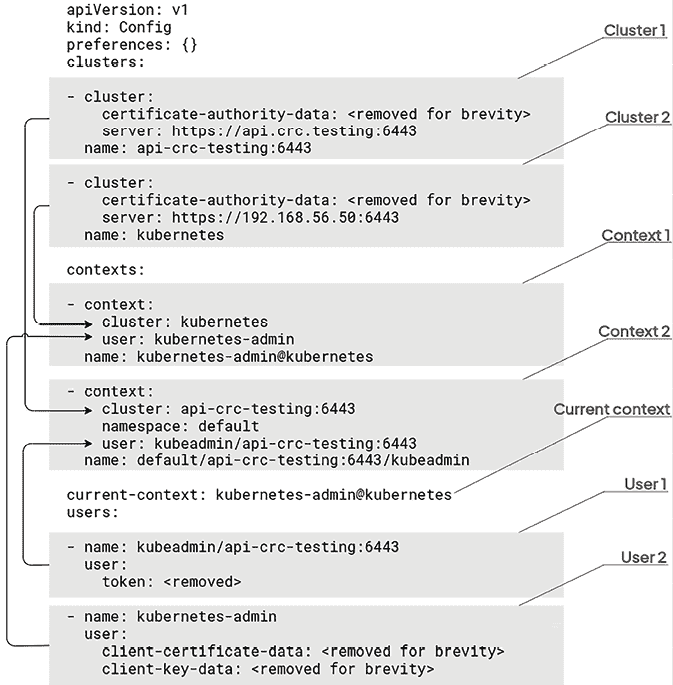

# 2

# Kubernetes 架构 – 从容器镜像到运行的 Pods

在上一章节中，我们从功能角度铺垫了关于 Kubernetes 的基础知识。现在你应该更清楚 Kubernetes 如何帮助你管理运行容器化微服务的机器集群。接下来，让我们深入探讨一些技术细节。在本章节中，我们将研究 Kubernetes 如何使你能够管理分布在不同机器上的容器。在本章节结束后，你应该能够更好地理解 Kubernetes 集群的构成，特别是你将更清楚每个 Kubernetes 组件的职责，以及它们在执行容器时的作用。

Kubernetes 由多个分布式组件组成，每个组件在容器执行过程中都扮演着特定角色。为了理解每个 Kubernetes 组件的角色，我们将跟随容器的生命周期，看看它是如何由 Kubernetes 创建和管理的：即，从你执行创建容器命令的那一刻，到容器最终在你的 Kubernetes 集群中的某台机器上执行的时刻。

本章节将涵盖以下主要内容：

+   名称 – Kubernetes

+   理解控制平面节点和计算节点之间的区别

+   Kubernetes 组件

+   控制平面组件

+   计算节点组件

+   探索 `kubectl` 命令行工具和 YAML 语法

+   如何使 Kubernetes 高可用

# 技术要求

以下是继续本章节的技术要求：

+   基本了解 Linux 操作系统以及如何在 Linux 中处理基本操作

+   一台或多台 Linux 机器

本章节中使用的代码和片段已经在 Fedora 工作站上测试过。所有本章节的代码、命令和其他片段都可以在 GitHub 仓库中找到，链接：[`github.com/PacktPublishing/The-Kubernetes-Bible-Second-Edition/tree/main/Chapter02`](https://github.com/PacktPublishing/The-Kubernetes-Bible-Second-Edition/tree/main/Chapter02)。

# 名称 – Kubernetes

Kubernetes 源自希腊语，特别是来自单词“**kubernētēs**”，意思是舵手或驾驶员。这个海事术语指的是擅长驾驶和导航船只的人。选择这个名字与平台在引导和编排容器化应用程序的部署和管理方面的基本角色相契合，就像舵手在复杂的数字世界中引导船只一样。

除了正式名称，Kubernetes 在社区中通常被称为“K8s”。这个昵称巧妙地源于通过计算“K”和“s”之间的八个字母来缩写这个词。这种缩写不仅简化了沟通，还为 Kubernetes 生态系统中的讨论增添了一丝非正式感。

# 理解控制平面节点和计算节点之间的区别

要运行 Kubernetes，您将需要 Linux 机器，这些机器在 Kubernetes 中被称为节点。节点可以是物理机器，也可以是云提供商上的虚拟机器，例如 EC2 实例。Kubernetes 中有两种类型的节点：

+   控制平面节点（也称为主节点）

+   计算节点（也称为工作节点）

## 主节点和工作节点

在不同的上下文中，您可能会遇到“主节点”和“工作节点”这些术语，这些术语以前用来描述分布式系统中传统的角色层次分配。在这种设置中，“主”节点负责监督并分配任务给“工作”节点。然而，这些术语可能带有历史和文化上的含义，可能被认为是不敏感或不合适的。针对这一问题，Kubernetes 社区决定用“控制平面节点”（或控制器节点）来替代这些术语，指代负责管理集群整体状态的组件集合。同样，术语“节点”或“计算节点”现在取代了“工作”节点，用于标识集群中执行请求任务或运行应用工作负载的单独机器。控制平面负责维护 Kubernetes 集群的状态，而计算节点负责运行容器和应用程序。

## Linux 和 Windows 容器

您可以灵活地利用基于 Windows 的节点在 Kubernetes 集群中启动适用于 Windows 的容器。值得注意的是，您的集群可以和谐地容纳 Linux 和 Windows 机器；然而，尝试在 Linux 工作节点上启动 Windows 容器，反之亦然，是不可行的。在集群中找到 Linux 和 Windows 机器之间的平衡，以确保最佳性能。

在本章接下来的章节中，我们将学习不同的 Kubernetes 组件及其职责。

# Kubernetes 组件

根据 Kubernetes 的固有设计，它作为一个分布式应用程序运行。当我们提到 Kubernetes 时，它并不是一个独立的、在单个构建中发布并安装到专用机器上的大型应用程序。相反，Kubernetes 是由多个小型项目组成，每个项目都用 Go 语言编写，共同构成了 Kubernetes 这个整体项目。

要建立一个完全可操作的 Kubernetes 集群，您需要单独安装和配置这些组件，确保它们之间的无缝通信。完成这些先决条件后，您可以开始使用 Kubernetes 调度器运行您的容器。

对于开发或本地测试，将所有 Kubernetes 组件安装在同一台机器上是可以的。然而，在生产环境中，为了满足高可用性、负载均衡、分布式计算、扩展性等需求，这些组件应该分布在不同的主机上。通过将不同组件分布在多台机器上，你将获得两个好处：

+   你可以使你的集群高度可用和容错。

+   你可以让集群更具可扩展性。每个组件都有自己的生命周期，它们可以独立扩展而不会影响其他组件。

这样，即使你的某台服务器宕机，也不会影响整个集群，只会影响其中的一小部分，增加更多机器到你的服务器也变得很容易。

每个 Kubernetes 组件都有自己明确的责任。了解每个组件的职责以及它如何与其他组件协调运作，对于理解 Kubernetes 的整体工作原理非常重要。

根据其角色，组件需要部署在控制平面节点或计算节点上。虽然一些组件负责维护整个集群的状态并操作集群本身，但其他组件则负责通过与容器运行时（例如，`containerd` 或 Docker 守护进程）直接交互来运行我们的应用容器。因此，Kubernetes 的组件可以分为两类：控制平面组件和计算节点组件。

你不应该自己启动容器，因此，你不会直接与计算节点交互。相反，你将指令发送给控制平面。然后，控制平面会代表你委派实际的容器创建和维护工作给计算节点。


图 2.1：一个典型的 Kubernetes 工作流

由于 Kubernetes 的分布式特性，控制平面组件可以分布在多台机器上。设置控制平面组件有两种方式：

+   你可以将所有控制平面组件运行在同一台机器上，也可以运行在不同的机器上。为了实现最大的容错能力，最好将控制平面组件分布在不同的机器上。其核心思想是，Kubernetes 组件必须能够相互通信，即使它们安装在不同的主机上，这一点也能得到保证。

+   在计算节点（或工作节点）方面，事情变得更简单。在这些节点上，你从一台运行支持的容器运行时的标准机器开始，然后将计算节点组件安装到该容器运行时旁边。这些组件将与已安装在该机器上的本地容器引擎进行交互，并根据你发送到控制平面组件的指令执行容器。向集群添加更多计算能力很简单；你只需要添加更多的工作节点，并让它们加入集群，以便为更多容器腾出空间。

通过将控制平面和计算节点的组件分布到不同的机器上，你可以使你的集群具备高度可用性和可扩展性。Kubernetes 的设计考虑了所有云原生相关问题；它的组件是无状态的，易于扩展，并且可以分布在不同的主机上。整体思路是通过将所有组件分散在不同的主机上，避免出现单点故障。

这里是一个简化的图示，展示了一个具有所有组件的完整功能 Kubernetes 集群。在本章中，我们将解释这个图中列出的所有组件，它们的角色和职责。在此，所有控制平面组件都安装在单一的主节点机器上：


图 2.2：一个完整功能的 Kubernetes 集群，包含一个控制平面节点和三个计算节点。

上图展示了一个四节点的 Kubernetes 集群，包含所有必要的组件。

请记住，Kubernetes 是可修改的，因此可以根据特定的环境进行修改。当 Kubernetes 部署并作为某些发行版的一部分使用时，例如 Amazon EKS 或 Red Hat OpenShift，可能会有额外的组件，或者默认组件的行为可能会有所不同。在本书中，大部分情况下，我们将讨论裸 Kubernetes。 本章讨论的组件是默认组件，你会在任何地方看到它们，因为它们是 Kubernetes 的核心组成部分。

以下图示展示了 Kubernetes 集群的基本核心组件。


图 2.3：Kubernetes 集群的组件（图片来源：[`kubernetes.io/docs/concepts/overview/components`](https://kubernetes.io/docs/concepts/overview/components)）

你可能注意到，这些组件中的大多数名称都以 `kube` 开头：这些是 Kubernetes 项目的一部分。此外，你可能注意到，有两个组件的名称并没有以 `kube` 开头。其他两个组件（`etcd` 和 `容器引擎`）是两个外部依赖，它们并不是严格意义上的 Kubernetes 项目一部分，但 Kubernetes 的正常运行依赖于它们：

+   `etcd` 是 Kubernetes 项目使用的第三方数据存储。别担心，你不需要精通它就能使用 Kubernetes。

+   容器引擎也是一个第三方引擎。

请放心，你不需要自己安装和配置这些组件。几乎没有人会自己管理这些组件，事实上，获得一个正常工作的 Kubernetes 集群是非常容易的，不需要单独安装组件。

对于开发目的，你可以使用 **minikube**，它是一个允许开发者在本地机器上运行单节点 Kubernetes 集群的工具。它是一个轻量级且易于使用的解决方案，可以在不需要完整集群的情况下测试和开发 Kubernetes 应用。绝对不推荐将 minikube 用于生产环境。

对于生产部署，像 Amazon EKS 或 Google GKE 这样的云服务提供了集成的、可扩展的 Kubernetes 集群。或者，**kubeadm** 作为一个 Kubernetes 安装工具，适用于没有云访问的平台。

出于教育目的，著名的教程 *Kubernetes the Hard Way* 由 *Kelsey Hightower* 提供，指导用户通过手动安装，涵盖了 PKI 管理、网络配置和 Google Cloud 中裸机 Linux 机器上的计算资源配置。虽然这个教程对于初学者来说可能会感觉困难，但仍然推荐实践，它提供了一个理解 Kubernetes 内部机制的宝贵机会。需要注意的是，建立和管理一个生产级的 Kubernetes 集群，如 *Kubernetes the Hard Way* 中所示，是复杂且耗时的。建议不要在生产环境中使用该教程的结果。你会在互联网上看到许多对该教程的引用，因为它非常有名。

我们将在下一节学习 Kubernetes 控制平面和计算节点组件。

## 控制平面组件

这些组件负责维护集群的状态。它们应该安装在控制平面节点上。这些组件会记录由 Kubernetes 集群执行的容器列表或集群中的机器数量。作为管理员，当你与 Kubernetes 交互时，你实际上是与控制平面组件交互，以下是控制平面的主要组件：

+   `kube-apiserver`

+   `etcd`

+   `kube-scheduler`

+   `kube-controller-manager`

+   `cloud-controller-manager`

## 计算节点组件

这些组件负责与容器运行时进行交互，以根据它们从控制平面组件接收到的指令启动容器。计算节点组件必须安装在运行受支持容器运行时的 Linux 机器上，且不应直接与这些组件进行交互。在 Kubernetes 集群中可能有数百或数千个计算节点。以下是计算节点的主要组件部分：

+   `kubelet`

+   `kube-proxy`

+   容器运行时

## 附加组件

附加组件利用 Kubernetes 资源，如 DaemonSet、Deployment 等，来实现集群特性。由于这些特性在集群级别运行，因此具有命名空间的附加组件资源位于 `kube-system` 命名空间内。以下是你在 Kubernetes 集群中常见的一些附加组件：

+   DNS

+   Web UI（仪表盘）

+   容器资源监控

+   集群级别日志记录

+   网络插件

## 托管 Kubernetes 集群中的控制平面

与自管理的 Kubernetes 集群相比，像 Amazon EKS、Google GKE 等云服务会处理大部分 Kubernetes 控制平面组件的安装和配置。它们提供对 Kubernetes 端点的访问，或者可选地，`kube-apiserver` 端点，而无需暴露底层机器或已配置负载均衡器的复杂细节。这适用于 `kube-scheduler`、`kube-controller-manager`、`etcd` 等组件。

下面是一个在 Amazon EKS 服务上创建的 Kubernetes 集群截图：


图 2.4：UI 控制台显示在 Amazon EKS 上配置的 Kubernetes 集群详细信息

本书后续章节将详细介绍 EKS、GKE 和 AKS。

在接下来的章节中，我们将学习控制平面组件，它们负责维护集群的状态。

# 控制平面组件

在接下来的章节中，让我们探索不同的控制平面组件及其职责。

## kube-apiserver

Kubernetes 最重要的组件是一个 **表述性状态转移** (**REST**) API，称为 `kube-apiserver`，它暴露了 Kubernetes 的所有功能。你将通过 `kubectl` 命令行工具、直接 API 调用或 Kubernetes 仪表盘（Web UI）工具与 Kubernetes 进行交互。

### kube-apiserver 的角色

`kube-apiserver` 是 Kubernetes 控制平面的一部分。它是用 Go 编写的，源代码开源并可以在 GitHub 上通过 Apache 2.0 许可证获取。与 Kubernetes 交互的过程非常简单。每当你想指示 Kubernetes 时，你只需要发送一个 HTTP 请求到 `kube-apiserver`。无论是创建、删除还是更新容器，你总是通过正确的 HTTP 动词向相应的 `kube-apiserver` 端点发出这些请求。这就是 Kubernetes 的常规操作—`kube-apiserver` 是所有指向调度器的操作的唯一入口点。避免直接与容器运行时交互是一个良好的实践（除非是进行故障排除活动）。

`kube-apiserver` 是按照 REST 标准构建的。REST 通过 HTTP 端点展示功能非常高效，使用 HTTP 协议的不同方法（如 `GET`、`POST`、`PUT`、`PATCH` 和 `DELETE`）可以访问这些端点。当你将 HTTP 方法和路径结合时，可以对通过路径标识的资源执行方法指定的各种操作。

REST 标准提供了相当大的灵活性，允许通过添加新的路径轻松扩展任何 REST API，添加新的资源。通常，REST API 使用数据存储来管理对象或资源的状态。

在此类 API 中，数据保留可以通过多种方式处理，包括以下几种：

**REST API 内存存储**：

+   将数据保存在自己的内存中。

+   然而，这会导致一个有状态的 API，使得扩展变得不可能。

Kubernetes 使用`etcd`来存储状态，`etcd`的发音是/ˈɛtsiːdiː/，意思是分布式的`etc`目录。`etcd`是一个开源的分布式键值存储，用于保存和管理分布式系统所需的关键信息，以保持系统运行。

**数据库引擎使用**：

+   使用像 MariaDB 或 PostgreSQL 这样的全功能数据库引擎。

+   将存储委托给外部引擎使得 API 无状态并且具有水平扩展性。

任何 REST API 都可以轻松升级或扩展，以实现比最初设计更多的功能。总结来说，REST API 的基本属性如下：

+   依赖于 HTTP 协议

+   定义由 URL 路径标识的一组资源

+   指定一组由 HTTP 方法标识的操作

+   基于正确构造的 HTTP 请求对资源执行操作

+   在数据存储上维护其资源的状态

总结来说，`kube-apiserver`只不过是一个 REST API，它是你将要设置的任何 Kubernetes 集群的核心，无论是本地的、云上的，还是本地部署的。它也是无状态的；也就是说，它通过依赖名为`etcd`的数据库引擎来保持资源的状态。这意味着你可以通过将`kube-apiserver`部署到多台机器上，使用七层负载均衡器来负载均衡请求，并且不会丢失数据，从而实现`kube-apiserver`组件的水平扩展。

由于 HTTP 几乎被所有地方支持，因此与 Kubernetes 集群进行通信并向其发出指令非常容易。然而，我们大多数时候是通过名为`kubectl`的命令行工具与 Kubernetes 互动，它是 Kubernetes 项目官方支持的 HTTP 客户端。当你下载`kube-apiserver`时，你将得到一个用 Go 语言编译的二进制文件，能够在任何 Linux 机器上执行。Kubernetes 开发者为我们定义了一组资源，这些资源直接打包在该二进制文件中。因此，可以预期在`kube-apiserver`中涉及容器管理、网络和计算的一般资源。

以下是其中一些资源：

+   `Pod`

+   `ReplicaSet`

+   `PersistentVolume`

+   `NetworkPolicy`

+   `Deployment`

当然，这个资源列表并不详尽。如果你想查看完整的 Kubernetes 组件列表，可以从 Kubernetes 官方文档的 API 参考页面访问：[`kubernetes.io/docs/reference/kubernetes-api/`](https://kubernetes.io/docs/reference/kubernetes-api/)。

你可能会想，为什么这里没有*容器*资源？正如在*第一章*，*Kubernetes 基础*中提到的，Kubernetes 使用一种名为 Pod 的资源来管理容器。目前，你可以将 Pod 视为容器。

虽然 Pod 可以容纳多个容器，但通常一个 Pod 中只有一个容器。如果你有兴趣在一个 Pod 内使用多个容器，我们将在*第五章*，*使用多容器 Pod 和设计模式*中探讨如`sidecar`和`init` `containers`等模式。

我们将在接下来的章节中深入学习它们。每个资源都与一个专用的 URL 路径关联，调用该 URL 路径时，改变 HTTP 方法会产生不同的效果。所有这些行为都在`kube-apiserver`中定义。请注意，这些行为不是你需要开发的；它们是`kube-apiserver`的一部分，已经直接实现。

在 Kubernetes 对象存储到`etcd`数据库后，其他 Kubernetes 组件会*转换*这些对象为原始的容器指令。

记住，`kube-apiserver`是整个 Kubernetes 集群的中央枢纽和最终源。Kubernetes 中的所有操作都围绕它展开。其他组件，包括管理员，通过 HTTP 与`kube-apiserver`交互，在大多数情况下避免直接与集群组件交互。

这是因为`kube-apiserver`不仅管理集群的状态，还包括许多身份验证、授权和 HTTP 响应格式化机制。因此，强烈建议避免手动干预，因为这些过程非常复杂。

### 如何运行 kube-apiserver？

在*第三章*，*安装你的第一个 Kubernetes 集群*中，我们将重点介绍如何在本地安装和配置 Kubernetes 集群。

本质上，有两种方式可以运行`kube-apiserver`（以及其他组件），如下所示：

+   通过将`kube-apiserver`作为容器镜像运行

+   通过下载并安装`kube-apiserver`并使用`systemd`单元文件运行它

由于推荐的方法是运行容器化的`kube-apiserver`，我们暂时放下`systemd`方法。根据 Kubernetes 集群的部署机制，`kube-apiserver`和其他组件将通过从容器注册表（例如`registry.k8s.io`）下载相应的镜像，作为容器进行配置。

### 你在哪里运行 kube-apiserver？

`kube-apiserver`应在控制平面节点上运行，因为它是控制平面的一部分。确保`kube-apiserver`组件安装在专门用于控制平面操作的强大机器上。这个组件至关重要，如果它变得无法访问，尽管你的容器仍然存在，但它们将失去与 Kubernetes 的连接。本质上，它们会变成“孤立”容器，处于独立的机器上，不再受 Kubernetes 管理。

此外，来自所有集群节点的其他 Kubernetes 组件会不断向`kube-apiserver`发送 HTTP 请求，以了解集群的状态或更新状态。而且，计算节点越多，向`kube-apiserver`发出的 HTTP 请求就越多。因此，`kube-apiserver`应该随着集群的扩展而进行独立扩展。

如前所述，`kube-apiserver`是一个无状态组件，它本身并不直接维护 Kubernetes 集群的状态，而是依赖于第三方数据库来实现这一点。你可以通过将其托管在一组机器上并放置在负载均衡器后面（如 HTTP API）来横向扩展它。在这种设置下，你通过调用 API 负载均衡器的端点与`kube-apiserver`进行交互。

在接下来的章节中，我们将学习 Kubernetes 如何使用`etcd`存储集群和资源信息。

## etcd 数据存储

我们之前解释过，`kube-apiserver`可以横向扩展。我们还提到，`kube-apiserver`使用`etcd`来存储集群状态和详细信息，`etcd`是一个开源的分布式键值存储。严格来说，`etcd`不是 Kubernetes 项目的一部分，而是由`etcd-io`社区维护的独立项目。

虽然`etcd`是 Kubernetes 集群中常用的数据存储，但一些发行版，如**k3s**，默认使用其他替代方案，例如 SQLite，甚至是像 MySQL 或 PostgreSQL 这样的外部数据库（[`docs.k3s.io/datastore`](https://docs.k3s.io/datastore)）。

`etcd`也是一个开源项目（像 Kubernetes 一样用 Go 编写），可以在 GitHub 上找到（[`github.com/etcd-io/etcd`](https://github.com/etcd-io/etcd)），并采用 Apache 2.0 许可证。它还是一个由**云原生计算基金会**（**CNCF**）孵化的项目（2018 年孵化，2020 年毕业），该基金会是 Kubernetes 的维护组织。

当你调用`kube-apiserver`时，每次通过调用 Kubernetes API 进行读写操作时，都会从`etcd`中读取或写入数据。

现在，让我们深入了解主节点内部的内容：


图 2.5：kube-apiserver 组件位于 etcd 数据存储前面，充当其代理；kube-apiserver 是唯一可以从 etcd 读取或写入数据的组件。

`etcd`就像你集群的“心脏”。如果丢失了`etcd`中的数据，你的 Kubernetes 集群将无法再正常工作。它比`kube-apiserver`还要关键。如果`kube-apiserver`崩溃，你可以重启它。但如果`etcd`数据丢失或损坏且没有备份，你的 Kubernetes 集群就完了。

幸运的是，你不需要深入掌握`etcd`才能使用 Kubernetes。如果你不知道自己在做什么，强烈建议你完全不要接触它。因为操作不当可能会破坏`etcd`中存储的数据，从而影响集群的状态。

记住，Kubernetes 架构中的一般规则是，每个组件都必须通过`kube-apiserver`来读取或写入`etcd`。这是因为，从技术角度看，`kubectl`通过 TLS 客户端证书对`kube-apiserver`进行身份验证，而只有`kube-apiserver`拥有该证书。因此，它是唯一有权读取或写入`etcd`的 Kubernetes 组件。这在 Kubernetes 的架构中是一个非常重要的概念。所有其他组件都无法在没有通过 HTTP 调用`kube-apiserver`端点的情况下，读取或写入`etcd`中的任何内容。

请注意，`etcd`也被设计为一个 REST API。默认情况下，它监听`2379`端口。

让我们探讨一个简单的`kubectl`命令，如下所示：

```
$ kubectl run nginx --restart Never --image nginx 
```

当你执行上述命令时，`kubectl`工具将创建一个 HTTP `POST`请求，该请求将执行针对`kube-apiserver`组件的操作，该组件在`kubeconfig`文件中指定。`kube-apiserver`会在`etcd`中写入一个新条目，该条目将持久化存储在磁盘上。

此时，Kubernetes 的状态发生了变化：接下来，将由其他 Kubernetes 组件来协调集群的实际状态与目标状态（即`etcd`中的状态）。

与 Redis 或 Memcached 不同，`etcd`不是内存存储。如果你重启机器，你不会丢失数据，因为它保存在磁盘上。

### 你在哪里运行`etcd`？

在自我管理的 Kubernetes 环境中，你可以在容器内或作为`systemd`单元文件的一部分操作`etcd`。`etcd`可以通过将数据集分布到多个服务器上，天然地进行水平扩展，成为一个独立的集群解决方案。

此外，你有两个地方可以运行 Kubernetes 的`etcd`，如下所示：

+   `etcd`可以与`kube-apiserver`（以及其他控制平面组件）一起部署在控制平面节点上——这是默认且简单的设置（在大多数 Kubernetes 集群中，像`etcd`和`kube-apiserver`这样的组件通常使用静态清单进行初始化部署。我们将在本书后面更详细地探讨这种方法及其替代方案）。

+   你可以配置使用专用的`etcd`集群——这是一种更复杂的方法，但如果你的环境对可靠性有较高要求，它会更可靠。

### 操作 Kubernetes 的`etcd`集群

有关单节点或多节点专用`etcd`集群的详细信息，请参见 Kubernetes 官方文档：[`kubernetes.io/docs/tasks/administer-cluster/configure-upgrade-etcd/`](https://kubernetes.io/docs/tasks/administer-cluster/configure-upgrade-etcd/)。

### 了解更多关于`etcd`的信息

如果你有兴趣了解`etcd`的工作原理，并想尝试`etcd`数据集，可以访问一个免费的在线游乐场。访问[`play.etcd.io/play`](http://play.etcd.io/play)，学习如何管理`etcd`集群和其中的数据。

让我们在下一节中探讨并了解`kube-scheduler`。

## kube-scheduler

`kube-scheduler`负责从可用的工作节点中选举出一个节点来运行新创建的 Pod。

在创建时，Pods 是未调度的，表示尚未指定任何工作节点来执行它们。未调度的 Pod 会被记录在`etcd`中，但没有分配工作节点。因此，任何活动的`kubelet`都不会收到启动此 Pod 的通知，导致 Pod 规范中列出的容器无法执行。

在内部，Pod 对象在`etcd`中存储时有一个属性叫做`nodeName`。顾名思义，这个属性应该包含将托管 Pod 的工作节点的名称。当这个属性被设置时，我们称该 Pod 已被*调度*；否则，Pod 仍处于*挂起*状态，等待调度。

`kube-scheduler`会定期查询`kube-apiserver`，列出那些尚未被*调度*或`nodeName`属性为空的 Pods。一旦找到这些 Pods，它将执行一个算法来选举一个工作节点。然后，它会通过向`kube-apiserver`组件发出 HTTP 请求来更新 Pod 中的`nodeName`属性。在选举工作节点时，`kube-scheduler`组件会考虑一些配置值，这些配置值是你可以传递的：


图 2.6：`kube-scheduler`组件轮询`kube-apiserver`组件以查找未调度的 Pod

`kube-scheduler`组件将考虑你可以选择传递的一些配置值。通过使用这些配置，你可以精确控制`kube-scheduler`组件如何选举工作节点。以下是调度 Pods 到你首选节点时需要注意的一些特性：

+   节点选择器

+   节点亲和性和反亲和性

+   污点和容忍度

也有一些高级调度技术可以完全绕过`kube-scheduler`组件。我们稍后将讨论这些特性。

`kube-scheduler`组件可以被自定义组件替代。你可以实现自己的`kube-scheduler`组件，使用自定义逻辑选择节点并在集群中使用它。这是 Kubernetes 组件分布式特性的一大优势。

### 你应该将`kube-scheduler`安装在哪里？

你可以选择将`kube-scheduler`安装在一台专用机器上，或与`kube-apiserver`安装在同一台机器上。这是一个简短的过程，不会消耗太多资源，但有一些事项需要注意。

`kube-scheduler`组件应该是高可用的。这就是为什么你应该在多台机器上安装它。如果你的集群没有一个正常工作的`kube-scheduler`组件，新的 Pods 将无法被调度，结果就是会有大量挂起的 Pods。同时请注意，如果没有`kube-scheduler`组件，它不会对已经调度的 Pods 产生影响。

在下一节中，我们将学习另一个重要的控制平面组件，叫做`kube-controller-manager`。

## kube-controller-manager

`kube-controller-manager` 是一个重要的单一二进制文件，包含了各种功能，实质上嵌入了所谓的控制器。它是执行我们所称的协调循环的组件。`kube-controller-manager` 尝试保持集群的实际状态与 `etcd` 中描述的状态一致，以确保两者之间没有差异。

在某些情况下，集群的实际状态可能会偏离存储在 `etcd` 中的期望状态。这种差异可能由 Pod 故障或其他因素引起。因此，`kube-controller-manager` 组件在协调实际状态和期望状态方面发挥着至关重要的作用。例如，考虑到复制控制器，这是 `kube-controller-manager` 组件内运行的控制器之一。实际上，Kubernetes 允许你在不同的计算节点上指定并维护一定数量的 Pod。如果由于任何原因，实际的 Pod 数量与指定的数量不符，复制控制器会向 `kube-apiserver` 组件发起请求，试图在 `etcd` 中重建一个新的 Pod，从而替换在计算节点上失败的 Pod。

以下是 `kube-controller-manager` 中的一些控制器：

+   **节点控制器**：处理节点的生命周期，负责节点的添加、删除和在集群中的更新

+   **复制控制器**：确保始终保持指定数量的副本，以符合 Pod 规格

+   **端点控制器**：为服务填充端点对象，反映每个服务可用的当前 Pod

+   **服务账户控制器**：管理命名空间中的 ServiceAccount，确保每个当前活跃的命名空间中都存在名为 `default` 的 ServiceAccount

+   **命名空间控制器**：管理命名空间的生命周期，包括创建、删除和隔离

+   **部署控制器**：管理部署的生命周期，确保每个部署的 Pod 数量保持在所需状态

+   **StatefulSet 控制器**：管理有状态集的生命周期，保持所需的副本数、Pod 顺序和身份

+   **DaemonSet 控制器**：管理守护进程集的生命周期，确保每个集群节点上都有一个守护进程 Pod 副本处于活动状态

+   **任务控制器**：管理任务的生命周期，确保每个任务的 Pod 数量保持在指定数量，直到任务完成

+   **水平 Pod 自动扩展器 (HPA) 控制器**：根据资源利用率或其他指标动态调整部署或有状态集的副本数量

+   **Pod 垃圾回收器**：移除不再由所有者（如复制控制器或部署）控制的 Pod

正如你所理解的，`kube-controller-manager`组件相当庞大。但本质上，它是一个单一的二进制文件，负责将集群的实际状态与存储在`etcd`中的期望状态进行调节。

### 你在哪里运行 kube-controller-manager？

`kube-controller-manager`组件可以像`kube-apiserver`一样，作为容器或`systemd`服务运行在控制平面节点上。此外，你还可以选择将`kube-controller-manager`组件安装在专用的机器上。现在，让我们来谈谈`cloud-controller-manager`。

## cloud-controller-manager

`cloud-controller-manager`是 Kubernetes 控制平面中的一个组件，负责管理 Kubernetes 与底层云基础设施之间的交互。`cloud-controller-manager`处理云资源的供应和管理，包括节点和卷，以促进 Kubernetes 工作负载。它专门操作针对云提供商定制的控制器。在 Kubernetes 是自托管的、在个人计算机上的学习环境中，或在本地部署时，集群不会拥有云控制器管理器。

类似于`kube-controller-manager`，`cloud-controller-manager`将多个逻辑上独立的控制循环整合为一个统一的二进制文件，并作为一个单独的进程执行。通过运行多个副本来实现水平扩展，这是提高性能或增强容错性的一种选择。

具有潜在云提供商依赖的控制器包括：

+   **节点控制器**：验证节点在停止响应后是否已被云中删除

+   **路由控制器**：在底层云基础设施中建立路由

+   **服务控制器**：管理云提供商负载均衡器的创建、更新和删除

### 你在哪里运行 cloud-controller-manager？

`cloud-controller-manager`组件可以像`kube-apiserver`一样，作为容器或`systemd`服务运行在控制平面节点上。

在接下来的章节中，我们将讨论 Kubernetes 集群中计算节点（也称为工作节点）的组成部分。

# 计算节点组件

我们将在本章的这一部分中，详细解释计算节点的组成，介绍运行在其上的三个组件：

+   容器引擎和容器运行时

+   `kubelet`

+   `kube-proxy`组件

    `kubelet`、`kube-proxy`和容器运行时是控制平面（主节点）和工作节点的必备组件。我们将在本节中介绍它们，以突出它们在这两种环境中的功能。

## 容器引擎和容器运行时

**容器引擎**是一个旨在监督容器创建、执行和生命周期的软件平台。与**容器运行时**相比，它提供了一个更抽象的层次，简化了容器管理并提高了开发者的可访问性。知名的容器引擎包括 Podman、Docker Engine 和 CRI-O。相对而言，**容器运行时**是一个基础的软件组件，负责在容器引擎或容器编排器的指示下创建、执行和管理容器。它为容器操作提供必要的功能，包括镜像加载、容器创建、资源分配和容器生命周期管理等任务。`Containerd`、`runc`、`dockerd`和 Mirantis Container Runtime 是一些知名的容器运行时。

“容器引擎”和“容器运行时”这两个术语有时可以互换使用，这可能会导致混淆。容器运行时（低层次）是负责执行容器镜像、管理其生命周期（启动、停止、暂停）并与底层操作系统交互的核心引擎。例子包括`runc`和 CRI-O（当用作运行时时）。容器引擎（高层次）建立在容器运行时之上，提供额外的功能，如镜像构建、注册表和管理工具。可以参考 Docker、Podman 或 CRI-O（当与 Kubernetes 一起使用时）。记住，关键在于理解核心功能：低层次的运行时处理容器执行，而高层次的引擎则添加了一层管理和用户友好性。

在早期，Docker 是 Kubernetes 后台运行容器的默认选项。但现在 Kubernetes 不再仅限于 Docker；它可以使用多个其他容器运行时，如`containerd`、CRI-O（与`runc`一起使用）、Mirantis Container Runtime 等。然而，在本书中，我们将使用`containerd`或 CRI-O 与 Kubernetes 结合，原因包括以下几点：

+   **专注与灵活性**：`containerd`和 CRI-O 专注于容器运行时功能，使它们相比于 Docker 更轻量，且在安全性上可能更具优势。这种专注还使它们能更无缝地与 Kubernetes 等容器编排平台集成。与 Docker 不同，您不需要像`cri-dockerd`这样的额外组件来确保与 Kubernetes 的兼容性。

+   **与 Kubernetes 的对齐**：Kubernetes 正在积极地将默认运行时从 Docker 迁移出去。之前（v1.24 之前），Docker 依赖一个名为`dockershim`的组件与 Kubernetes 进行集成。

然而，这种方法已经被弃用，Kubernetes 现在鼓励使用符合**容器运行时接口**（**CRI**）标准的运行时，专门为该平台设计。通过选择`containerd`或 CRI-O，可以确保与 Kubernetes 环境的更加本地化和高效的集成。

+   **以 Kubernetes 为中心的设计**：特别是 CRI-O，作为一个轻量级容器运行时，专为 Kubernetes 设计。它严格遵循 Kubernetes 版本发布周期（如 1.x.y），简化了版本管理。当 Kubernetes 版本达到生命周期结束时，相应的 CRI-O 版本也可能被视为废弃，从而简化了维护安全且最新的 Kubernetes 环境的决策过程。

### 容器运行时接口

Kubernetes 使用容器运行时在 Pod 内执行容器。默认情况下，Kubernetes 利用 CRI 与选定的容器运行时建立通信。CRI 最早在 Kubernetes 1.5 版本中引入，该版本于 2016 年 12 月发布。

CRI 作为一个插件接口，使得 kubelet 能够与各种容器运行时无缝集成。这种灵活性使得可以根据特定的环境需求选择最优的容器运行时，如 `containerd`、Docker Engine 或 CRI-O。

在 CRI 内，一组已定义的 API 使得 kubelet 可以高效地与容器运行时进行交互。这些 API 涵盖了基本操作，如创建、启动、停止和删除容器，以及管理 Pod 沙箱和网络。

以下表格展示了适用于 Linux 机器的已知端点。

| **运行时** | **Unix 域套接字路径** |
| --- | --- |
| `containerd` | `unix:///var/run/containerd/containerd.sock` |
| CRI-O | `unix:///var/run/crio/crio.sock` |
| Docker Engine（使用 `cri-dockerd`） | `unix:///var/run/cri-dockerd.sock` |

表 2.1：适用于 Linux 机器的已知容器运行时端点

请参考文档（[`kubernetes.io/docs/setup/production-environment/tools/kubeadm/install-kubeadm`](https://kubernetes.io/docs/setup/production-environment/tools/kubeadm/install-kubeadm)）了解更多信息。

#### Kubernetes 与 Docker

在 v1.24 版本之前的 Kubernetes 版本中，通过一个名为 **dockershim** 的组件实现了与 Docker Engine 的直接集成。然而，这种集成已经停止，并且在 v1.20 版本中宣布移除。Docker 作为基础运行时的弃用正在进行中，Kubernetes 现在鼓励使用与 Kubernetes 设计的 CRI 对应的运行时。

尽管发生了这些变化，Docker 生成的镜像仍然会在任何运行时中持续正常工作，确保与之前的兼容性。如需了解更多信息，请参考 [`kubernetes.io/blog/2020/12/02/dont-panic-kubernetes-and-docker/`](https://kubernetes.io/blog/2020/12/02/dont-panic-kubernetes-and-docker/)。

因此，任何运行 `containerd` 的 Linux 机器都可以用作构建 Kubernetes 工作节点的基础。（我们将在本书后续章节中讨论 Windows 计算节点。）

#### 开放容器倡议

**开放容器倡议**（**OCI**）是一个开源倡议，定义了容器镜像、容器、容器运行时和容器注册表的标准。这个努力旨在建立跨容器系统的互操作性和兼容性，确保在不同环境中容器的一致执行。此外，CRI 与 OCI 合作，提供了一个标准化的接口，使得`kubelet`能够与容器运行时进行通信。OCI 定义了由 CRI 支持的容器镜像和运行时的标准，从而促进了 Kubernetes 中容器管理和部署的高效性。

#### 容器运行时 RuntimeClass

Kubernetes **RuntimeClass**允许你为 Pods 定义并分配不同的容器运行时配置。这使得你可以在应用程序的性能和安全性之间取得平衡。想象一下，使用硬件虚拟化运行时调度高安全性的工作负载，以便提供更强的隔离性，即使这意味着稍微降低性能。RuntimeClass 还允许你为特定的 Pods 使用相同的运行时，但具有不同的设置。要利用这一点，你需要在节点上配置 CRI（安装过程有所不同），并在 Kubernetes 中创建相应的 RuntimeClass 资源。

在下一节中，我们将学习`kubelet`代理，这是 Kubernetes 集群节点的另一个重要组件。

## kubelet

`kubelet`是计算节点中最重要的组件，因为它是与计算节点上安装的本地容器运行时进行交互的组件。

`kubelet`仅作为系统守护进程运行，不能在容器内操作。它的执行必须直接在主机系统上进行，通常通过`systemd`来实现。这使得`kubelet`与其他 Kubernetes 组件有所区别，突出了它必须在主机机器上运行的独特要求。

当`kubelet`启动时，默认情况下，它会读取位于`/etc/kubernetes/kubelet.conf`的配置文件。

该配置指定了两个对`kubelet`工作至关重要的值：

+   `kube-apiserver`组件的端点

+   本地容器运行时 UNIX 套接字

一旦计算节点加入集群，`kubelet`将充当`kube-apiserver`与本地容器运行时之间的桥梁。`kubelet`会不断向`kube-apiserver`发送 HTTP 请求，以获取有关它必须启动的 pods 的信息。

默认情况下，**每 20 秒**，`kubelet`会对`kube-apiserver`组件发出一个 GET 请求，以列出在`etcd`上创建并指向它的 pods。

一旦它从`kube-apiserver`接收到 HTTP 响应体中的 pod 规格，它就可以将其转换为容器规格，并在指定的 UNIX 套接字上执行。结果是在计算节点上使用本地容器运行时（例如`containerd`）创建容器。

记住，像其他 Kubernetes 组件一样，`kubelet` 并不会直接从 `etcd` 中读取数据；它是通过与 `kube-apiserver` 交互来暴露 `etcd` 数据层中的内容。kubelet 甚至不知道它所轮询的 `kube-apiserver` 后面运行着一个 `etcd` 服务器。

Kubernetes 中的轮询机制，术语中称为 **watch** 机制，正是为了定义 Kubernetes 如何在规模化地对工作节点执行容器的运行和删除。这里有两点需要注意：

+   `kubelet` 和 `kube-apiserver` 必须能够通过 HTTP 相互通信。这就是为什么计算节点和控制平面节点之间必须开放 HTTPS 端口 `6443`。

+   由于它们运行在同一台机器上，kubelet、CRI 和容器运行时是通过使用 UNIX 套接字进行接口通信的。

Kubernetes 集群中的每个工作节点都需要自己的 kubelet，导致对 `kube-apiserver` 的 HTTP 轮询在增加节点后更加频繁。在较大的集群中，尤其是那些有数百台机器的集群，这种增加的活动可能会影响 `kube-apiserver` 的性能，甚至可能导致影响 API 可用性的情况。高效的扩展非常重要，以确保 `kube-apiserver` 和其他控制平面组件的高可用性。

另外，请注意，您可以完全绕过 Kubernetes，在工作节点上创建容器而不使用 kubelet，而 kubelet 的唯一工作就是确保其本地容器运行时反映存储在 `etcd` 中的配置。因此，如果您手动在工作节点上创建容器，kubelet 将无法管理它。然而，将容器运行时套接字暴露给容器化工作负载是一个安全风险。它绕过了 Kubernetes 的安全机制，是攻击者常常瞄准的目标。一项重要的安全实践是防止容器挂载此套接字，从而保护您的 Kubernetes 集群。

请注意，运行在工作节点上的容器引擎并不知道它是通过本地 kubelet 代理由 Kubernetes 管理的。计算节点不过是运行容器运行时的 Linux 机器，旁边安装了 kubelet 代理，执行容器管理指令。

我们将在下一节中学习 `kube-proxy` 组件。

## kube-proxy 组件

Kubernetes 的一个重要部分是网络。我们将在后续深入学习网络；然而，您需要理解，Kubernetes 在暴露 Pod 给外界或暴露 Pod 之间相互通信时有着许多机制。

这些机制在 kube-proxy 级别实现；也就是说，每个工作节点都需要运行一个 kube-proxy 实例，以便可以访问运行在其上的 Pod。我们将探讨一个称为**Service**的 Kubernetes 特性，该特性在 kube-proxy 组件的级别实现。就像 kubelet 一样，kube-proxy 组件还与`kube-apiserver`组件通信。

其他几个子组件或扩展在计算节点级别操作，如**cAdvisor**或**容器网络接口**（**CNI**）。但它们是我们稍后会讨论的高级主题。

现在我们已经了解了不同的 Kubernetes 组件和概念，让我们在下一节学习`kubectl`客户端实用程序以及它如何与 Kubernetes API 交互。

# 探索 kubectl 命令行工具和 YAML 语法

`kubectl`是官方的命令行工具，用于管理 Kubernetes 平台。这是一个完全优化的 HTTP 客户端，可与 Kubernetes 进行交互，并允许您向 Kubernetes 集群发出命令。

**基于 Kubernetes 和 Linux 的学习环境**

为了在 Linux 容器和相关主题中进行有效学习，最好使用安装有 Linux 操作系统的工作站或实验机器。对 Linux 基础知识的良好理解对于处理容器和 Kubernetes 至关重要。在工作站上使用 Linux 操作系统会自动将您置于 Linux 环境中，从而提升学习体验。您可以选择自己喜欢的 Linux 发行版，如 Fedora、Ubuntu 或其他发行版。我们致力于包容性，并将在必要时为 Windows 和 macOS 用户提供替代步骤，确保每个人都能获得多样化且无障碍的学习体验。但是，并不需要在安装有 Linux 操作系统的工作站上学习 Kubernetes。如果您使用的是 Windows 机器，则可以使用**Windows 子系统用于 Linux**（**WSL**）([`learn.microsoft.com/en-us/windows/wsl/`](https://learn.microsoft.com/en-us/windows/wsl/))等替代方案。

## 安装 kubectl 命令行工具

`kubectl`命令行工具可以安装在您的 Linux、Windows 或 macOS 工作站上。您需要确保您的`kubectl`客户端版本与您的 Kubernetes 集群的次要版本兼容，以获得最佳兼容性。这意味着 v1.30 的`kubectl`可以管理 v1.29、v1.30 和 v1.31 的集群。坚持使用最新的兼容版本有助于避免潜在问题。

由于您将在接下来的章节中需要 kubectl 实用程序，请立即按照以下部分的说明安装它。

### Kubernetes 遗留包存储库

截至 2024 年 1 月，遗留的 Linux 包仓库——即 `apt.kubernetes.io` 和 `yum.kubernetes.io`（也称为 `packages.cloud.google.com`）——自 2023 年 9 月 13 日起被冻结，现已不可用。建议用户迁移到新的社区维护的 Debian 和 RPM 包仓库 `pkgs.k8s.io`，该仓库于 2023 年 8 月 15 日推出。这些仓库取代了现在已废弃的 Google 托管的仓库（`apt.kubernetes.io` 和 `yum.kubernetes.io`）。此变更直接影响那些安装上游版本 Kubernetes 的用户，以及通过遗留包仓库安装 `kubectl` 的用户。详细信息请参见官方公告：遗留包仓库弃用（[`kubernetes.io/blog/2023/08/31/legacy-package-repository-deprecation/`](https://kubernetes.io/blog/2023/08/31/legacy-package-repository-deprecation/)）。

### 在 Linux 上安装 kubectl

在 Linux 上安装 `kubectl` 时，你需要下载 `kubectl` 工具并将其复制到可执行路径，具体操作如下：

```
$ curl -LO “https://dl.k8s.io/release/$(curl -L -s https://dl.k8s.io/release/stable.txt)/bin/linux/amd64/kubectl”
$ chmod +x ./kubectl
$ sudo mv ./kubectl /usr/local/bin/kubectl
$ kubectl version
Client Version: v1.30.0
Kustomize Version: v5.0.4-0.20230601165947-6ce0bf390ce3
The connection to the server localhost:8080 was refused - did you specify the right host or port? 
```

忽略此处的连接错误，因为你没有配置 Kubernetes 集群供 `kubectl` 访问。

路径 `/usr/local/bin/kubectl` 在你的环境中可能不同。你需要确保配置了合适的 **PATH** 变量，确保 `kubectl` 工具处于可检测路径下。你也可以使用 `/etc/profile` 来配置 `kubectl` 工具路径。

要下载特定版本，可以将命令中的`$(curl -L -s https://dl.k8s.io/release/stable.txt)`部分替换为所需版本。

例如，如果你希望在 Linux x86-64 上下载版本 1.28.4，请输入：

```
$ curl -LO https://dl.k8s.io/release/v1.30.0/bin/linux/amd64/kubectl 
```

此命令将下载特定版本的 `kubectl` 工具，你可以将其复制到你希望的路径。

现在让我们学习如何在 macOS 上安装 `kubectl` 工具。

### 在 macOS 上安装 kubectl

安装过程与 macOS 上相似，唯一不同的是针对 Intel 和 Apple 版本的 `kubectl` 包：

```
# Intel
$ curl -LO “https://dl.k8s.io/release/$(curl -L -s
 https://dl.k8s.io/release/stable.txt)/bin/darwin/amd64/kubectl”
# Apple Silicon
$ curl -LO “https://dl.k8s.io/release/$(curl -L -s https://dl.k8s.io/release/stable.txt)/bin/darwin/arm64/kubectl”
$ chmod +x ./kubectl
$ sudo mv ./kubectl /usr/local/bin/kubectl
$ sudo chown root: /usr/local/bin/kubectl 
```

### 在 Windows 上安装 kubectl

使用浏览器或 curl 下载 `kubectl.exe` （[`dl.k8s.io/release/v1.28.4/bin/windows/amd64/kubectl.exe`](https://dl.k8s.io/release/v1.28.4/bin/windows/amd64/kubectl.exe)）（如果你在 Windows 上安装了 curl 或等效的命令工具）：

```
$ curl.exe -LO https://dl.k8s.io/release/v1.28.4/bin/windows/amd64/kubectl.exe 
```

最后，将 `kubectl` 二进制文件夹添加到或前置到你的 **PATH** 环境变量中，并进行测试，确保 `kubectl` 的版本与下载的版本匹配。

你也可以使用本地包管理器安装 `kubectl`，如 apt-get、yum、Zypper、brew（macOS）或 Chocolatey（Windows）。参考文档（[`kubernetes.io/docs/tasks/tools/install-kubectl-linux`](https://kubernetes.io/docs/tasks/tools/install-kubectl-linux)）了解更多信息。

我们将在下一节中学习如何使用 `kubectl` 命令。

## kubectl 的作用

由于 `kube-apiserver` 本质上只是一个 HTTP API，任何 HTTP 客户端都可以用来与 Kubernetes 集群进行交互。你甚至可以使用 curl 来管理 Kubernetes 集群，但当然，有更好的方式来做到这一点。

那么，为什么你要使用这样的客户端而不是直接使用 curl 命令呢？原因就是简便性。实际上，`kube-apiserver` 管理着许多不同的资源，每个资源都有其独立的 URL 路径。

通过 curl 不断调用 `kube-apiserver` 是可行的，但极其耗时。这是因为记住每个资源的路径以及如何调用它并不友好。实际上，curl 并不是最佳选择，因为 `kubectl` 还管理与 Kubernetes 认证层的身份验证、集群上下文等多个方面。

你需要不断查阅文档来记住 URL 路径、HTTP 头或查询字符串。`kubectl` 会通过让你调用 `kube-apiserver` 来为你处理这些，它的命令易于记忆、安全，并且专门用于 Kubernetes 管理。

当你调用 `kubectl` 时，它会读取你传递给它的参数，并基于这些参数创建并发送 HTTP 请求给 Kubernetes 集群中的 `kube-apiserver` 组件。


图 2.7：kubectl 命令行将通过 HTTP 协议调用 kube-apiserver；你将通过 kubectl 与 Kubernetes 集群进行交互。

一旦 `kube-apiserver` 组件接收到来自你的有效 HTTP 请求，它将根据你提交的请求读取或更新 `etcd` 中集群的状态。如果是写操作——例如，更新正在运行的容器的镜像——`kube-apiserver` 将在 `etcd` 中更新集群的状态。然后，托管该容器的工作节点上的组件将发出适当的容器管理命令，以根据新的镜像启动一个新的容器。这是为了确保容器的实际状态与 `etcd` 中的状态一致。

由于你不需要直接与容器引擎或 `etcd` 进行交互，我们可以说，掌握 Kubernetes 很大程度上依赖于你对 `kubectl` 命令的了解。要有效使用 Kubernetes，你必须尽可能掌握 Kubernetes API 和相关细节。你只需要与 `kube-apiserver` 和允许你调用它的 `kubectl` 命令行工具进行交互，其他组件则无需直接操作。

由于 `kube-apiserver` 组件可以通过 HTTP(S) 协议访问，你可以使用任何基于 HTTP 的库或通过你喜欢的编程语言与 Kubernetes 集群进行交互。虽然有许多替代 `kubectl` 的工具，但作为 Kubernetes 项目的官方工具，`kubectl` 一直是文档中的主要示例。你遇到的大多数示例都会使用 `kubectl`。

## `kubectl` 是如何工作的？

当你调用`kubectl`命令时，它将尝试从默认位置`$HOME/.kube/config`读取名为`kubeconfig`的配置文件。`kubeconfig`文件应包含以下信息，以便`kubectl`可以使用它并对`kube-apiserver`进行身份验证：

+   `kube-apiserver`端点的 URL 和端口

+   用户账户

+   用于验证`kube-apiserver`的客户端证书（如果有的话）

+   用户与集群的映射，也就是上下文

也可以将详细信息（例如集群信息、用户认证信息等）作为参数传递给`kubectl`命令，但当你有多个集群需要管理时，这种方法并不方便。

下图展示了一个典型的`kubeconfig`文件及其详细信息。



图 2.8：kubeconfig 上下文和结构

在上面的图示中，配置了多个集群、用户和上下文：

+   **集群**：该部分定义了你可以与之交互的 Kubernetes 集群。它包含了每个集群的服务器地址、API 版本、证书授权信息等，允许`kubectl`连接并向它们发送命令。

+   **用户**：该部分存储你访问 Kubernetes 集群的凭证。通常包括用户名和用于与 API 服务器进行身份验证的密钥（如令牌或客户端证书）。`kubeconfig`文件还可以在`用户`部分引用证书，以便安全地验证用户与 Kubernetes API 服务器的身份。这种双向验证确保只有具有有效证书的授权用户才能访问集群，从而防止未经授权的访问和潜在的安全漏洞。

+   **上下文**：该部分充当集群与用户之间的桥梁。每个上下文引用一个特定的集群和该集群中的特定用户。通过选择一个上下文，你可以定义`kubectl`在后续命令中使用哪个集群和用户凭证。

在`kubeconfig`文件中配置了多个集群、用户和上下文后，切换到不同的 Kubernetes 集群并使用不同的用户凭证变得很容易。

可以通过设置名为`KUBECONFIG`的环境变量，或在调用`kubectl`时使用`--kubeconfig`参数，来覆盖系统中的`kubeconfig`路径：

```
$ export KUBECONFIG=”/custom/path/.kube/config”
$ kubectl --kubeconfig=”/custom/path/.kube/config” 
```

每次运行`kubectl`命令时，`kubectl`命令行工具会按照以下顺序查找`kubeconfig`文件以加载其配置：

1.  首先，它检查是否传递了`--kubeconfig`参数，并加载配置文件。

1.  如果在此时没有找到`kubeconfig`文件，`kubectl`会查找`KUBECONFIG`环境变量。

1.  最终，它会回退到`$HOME/.kube/config`中的默认位置。

要查看本地`kubectl`安装当前使用的配置文件，你可以运行以下命令：

```
$ kubectl config view 
```

然后，HTTP 请求被发送到`kube-apiserver`，该组件生成 HTTP 响应，`kubectl`将其重新格式化为人类可读的格式并输出到终端。

以下命令可能是你在使用 Kubernetes 时几乎每天都会输入的命令：

```
$ kubectl get pods 
```

该命令列出了*Pods*。本质上，它会向`kube-apiserver`发出`GET`请求，以检索集群中容器（Pod）的列表。在内部，`kubectl`将命令中传递的`Pods`参数与`/api/v1/pods`URL 路径关联，这是`kube-apiserver`用来公开 Pod 资源的路径。

这是另一个命令：

```
$ kubectl run nginx --restart Never --image nginx 
```

这个命令稍微复杂一点，因为`run`不是一个 HTTP 方法。此命令会向`kube-apiserver`组件发出一个**POST**请求，最终会创建一个名为`nginx`的容器，该容器基于容器注册表中托管的`nginx`镜像（例如，Docker Hub 或 quay.io）。

事实上，这个命令不会创建一个容器，而是创建一个 Pod。我们将在*第四章*，*在 Kubernetes 中运行你的容器*中详细讨论 Pod 资源。让我们尽量不再谈论容器，而是转向 Pod，并熟悉 Kubernetes 的概念和术语。从现在开始，如果你看到*容器*一词，它指的是从容器角度来看一个真正的容器。此外，Pod 指的是 Kubernetes 资源。

我们将在下一节学习如何启用`kubectl`的补全功能。

## kubectl 自动补全

`kubectl`为各种 Shell 提供了内置的自动补全功能，节省了你宝贵的时间和避免了沮丧。`kubectl`支持常用 Shell 的自动补全，如：

+   Bash

+   Zsh

+   Fish

+   PowerShell

以 Linux Bash 为例，启用自动补全的方法如下：

```
# Install Bash Completion (if needed)
$ sudo yum install bash-completion  # For RPM-based systems
$ sudo apt install bash-completion  # For Debian/Ubuntu-based systems
# Add the source line to your shell configuration
$ echo ‘source <(kubectl completion bash)’ >>~/.bashrc 
```

现在，当你开始输入`kubectl`命令时，魔法就会发生！`kubectl`将根据可用的资源和选项建议补全。只需按*Tab*键接受建议，或者继续输入以缩小选项范围。

启用自动补全的过程可能会因其他 Shell（如 Zsh 或 Fish）而略有不同。请参阅官方`kubectl`文档以获取具体说明：[`kubernetes.io/docs/reference/kubectl/generated/kubectl_completion/`](https://kubernetes.io/docs/reference/kubectl/generated/kubectl_completion/)

这个设置确保每次你打开新的终端会话时，自动补全都能正常工作。

在下一节中，我们将从`kubectl`命令开始，介绍如何使用命令式和声明式语法。

## 命令式语法

你发送给`kube-apiserver`的几乎每一条指令都可以使用两种语法编写：**命令式**和**声明式**。命令式语法侧重于发出直接修改集群状态的命令，这些命令基于你传递给`kubectl`命令的参数和选项。

让我们来看一些命令式风格的操作，具体如下：

```
# Creates a pod, called my-pod, based on the busybox:latest container image:
$ kubectl run my-pod --restart Never --image busybox:latest
#  list all the ReplicaSet resources in the my-namespace namespace created on the Kubernetes cluster:
$ kubectl get rs -n my-namespace
# Delete a pod, called my-pod, in the default namespace:
$ kubectl delete pods my-pod 
```

命令式语法有很多优点。如果你已经理解了要向 Kubernetes 发送什么样的指令以及如何正确地执行这些指令，那么你将非常迅速。命令式语法容易输入，而且你可以用少数几个命令做很多事。有些操作只有在命令式语法下才能进行。例如，列出集群中的现有资源，只有通过命令式语法才能实现。

然而，命令式语法有一个大问题。如果你需要记住之前在集群中做的操作记录，这将变得非常复杂。如果由于某些原因，你丢失了集群的状态并且需要从头开始重建，那么你会发现很难记得之前输入的所有命令，来使集群恢复到你想要的状态。你可以查看 `.bash_history` 文件，但显然还有更好的方法，我们将在下一节学习声明式方法。

## 声明式语法

“声明式”正如其名所示。我们“声明”我们希望集群的状态，然后 Kubernetes 创建所需的资源来达到该状态。JSON 和 YAML 格式都被支持；然而，根据约定，Kubernetes 用户更喜欢 YAML 语法，因为它简单易懂。

YAML（“YAML Ain’t Markup Language” 或 “Yet Another Markup Language”）是一种广泛用于 Kubernetes 的人类可读的数据序列化格式。它允许你以清晰简洁的方式定义 Kubernetes 资源的配置，如 Deployments、Services 和 Pods。该格式使得管理和版本控制 Kubernetes 配置变得简单，促进了协作和可重复性。同时需要注意，YAML 不是一种编程语言，它背后没有真正的逻辑。它仅仅是一种 `key:value` 配置语法，许多项目现在都在使用这种语法，Kubernetes 就是其中之一。

每个 `key:value` 对表示你想要设置到 Kubernetes 资源的配置数据。

以下是使用之前我们使用过的 `busybox:latest` 容器镜像创建名为 `my-pod` 的 pod 的命令：

```
$ kubectl run my-pod --restart Never --image busybox:latest 
```

现在我们将使用声明式语法做相同的操作：

```
apiVersion: v1
kind: Pod
metadata:
  name: my-pod
spec:
  containers:
  -  name: busybox-container
     image: busybox:latest 
```

假设这个文件被保存为 `pod.yaml`。要创建实际的 pod，你需要运行以下命令：

```
$ kubectl create -f pod.yaml 
```

这个结果将等同于之前的命令。

每个为 Kubernetes 创建的 YAML 文件必须包含四个必需的键：

+   `apiVersion`：此字段告诉你资源声明的 API 版本。每种资源类型都有一个 `apiVersion` 键，必须在此字段中设置。pod 资源类型使用 API 版本 `v1`。

+   `kind`：此字段表示 YAML 文件将创建的资源类型。在这里，它将创建一个**pod**。

+   `metadata`：此字段告诉 Kubernetes 关于实际资源的名称。在这里，pod 的名称是 `my-pod`。此字段描述的是 Kubernetes 资源，而不是容器资源。该元数据是为 Kubernetes 提供的，而不是为像 Docker Engine 或 Podman 这样的容器引擎提供的。

+   `spec`：此字段告诉 Kubernetes 对象的组成。在前面的示例中，pod 由一个容器组成，该容器将基于 `busybox:latest` 容器镜像命名为 `busybox-container`。这些是将在后台容器运行时创建的容器。

声明式语法的另一个重要方面是，它允许你在同一个文件中声明多个资源，并使用三个破折号作为资源之间的分隔符。下面是修订版的 YAML 文件，它将创建两个 pods：

```
apiVersion: v1
kind: Pod
metadata:
  name: my-pod
spec:
  containers:
  -  name: busybox-container
     image: busybox:latest
---
apiVersion: v1
kind: Pod
metadata:
  name: my-second-pod
spec:
  containers:
  - name: nginx-container
    image: nginx:latest 
```

你应该能够自己阅读这个文件并理解它；它仅创建了两个 pods。第一个使用 `busybox` 镜像，第二个使用 `nginx` 镜像。

当然，你不必记住所有语法以及为每个键设置什么值。你可以随时参考官方的 Kubernetes 文档，获取示例声明的 YAML 文件。如果文档不足或没有解释某些细节，你可以使用 `kubectl explain` 命令来理解资源的详细信息，如下所示：

```
$ kubectl explain pod.spec.containers.image
KIND:       Pod
VERSION:    v1
FIELD: image <string>
DESCRIPTION:
    Container image name. More info:
    https://kubernetes.io/docs/concepts/containers/images 
```

你将从 `kubectl` 的 `explain` 输出中获得非常清晰的解释和字段信息。

声明式语法也带来了许多好处。使用它，你的速度可能会变慢，因为编写这些 YAML 文件比直接以命令式方式执行命令要耗时得多。然而，它有两个主要好处：

+   **基础设施即代码（IaC）管理**：你可以将配置存储在某个地方，并使用 Git（源代码管理）对 Kubernetes 资源进行版本控制，就像处理 IaC 一样。如果你丢失了集群的状态，保持 YAML 文件在 Git 中的版本化将使你能够清洁有效地重新创建它。

+   **同时创建多个资源**：由于你可以在同一个 YAML 文件中声明多个资源，因此可以将整个应用及其所有依赖项放在同一个地方。此外，你可以通过一个命令创建并重新创建复杂的应用程序。稍后，你将发现一个叫做 Helm 的工具，它可以在 Kubernetes YAML 文件的基础上实现模板化。

没有*更好的*方式来使用 `kubectl`；这些只是与其交互的两种方式，你需要掌握这两种方式。因为某些功能在命令式语法中不可用，而另一些功能在声明式语法中不可用。请记住，最终，两者都通过 HTTP 协议调用 `kube-apiserver` 组件。

`kubectl` 应该安装在任何需要与集群交互的机器上。

从技术角度来看，每当你想与 Kubernetes 集群进行交互时，必须安装并配置 `kubectl` 命令行工具。

当然，这台机器可以是你的本地机器或你访问 Kubernetes 集群的服务器。不过，在较大的项目中，将 `kubectl` 安装到持续集成平台的代理/运行器中也是一个好主意。

实际上，你可能会希望自动化维护或部署任务，以便对 Kubernetes 集群进行操作，并且你可能会使用 **持续集成** (**CI**) 平台，如 GitLab CI、Tekton 或 Jenkins 来完成这些任务。

如果你希望能够在 CI 管道中运行 Kubernetes 命令，你需要在 CI 代理上安装 `kubectl`，并且在 CI 代理的文件系统中写入正确配置的 `kubeconfig` 文件。这样，你的 CI/CD 管道就能够向 Kubernetes 集群发出命令，并更新集群的状态。

需要补充的是，`kubectl` 不应仅仅被视为*人类*用户使用的 Kubernetes 客户端。它应被视为与 Kubernetes 通信的通用工具：将其安装在你希望与集群通信的任何地方。

# 如何使 Kubernetes 高可用

正如你之前观察到的，Kubernetes 是一种集群解决方案。它的分布式特性使得它能够在多台机器上运行。通过将不同的组件分配到不同的机器上，你可以使 Kubernetes 集群具备高可用性。接下来，我们将简要讨论不同的 Kubernetes 配置。

## 单节点集群

如果你想在生产环境中部署 Kubernetes，将所有 Kubernetes 组件安装在同一台机器上是最糟糕的选择。然而，对于测试开发来说，这是完全可以接受的。单节点方式是将所有不同的 Kubernetes 组件聚集在同一主机或虚拟机上的方式：


图 2.9：所有组件都运行在同一台机器上

通常，这种配置被认为是通过本地测试入门 Kubernetes 的坚实起点。有一个名为 minikube 的工具，使你可以轻松地在计算机上设置单节点 Kubernetes。它运行一个虚拟机，并且所有必要的组件已经配置好。虽然 minikube 对于本地测试非常方便，并且运行 minikube 作为多节点集群也是可能的，但请记住，minikube 绝对不推荐用于生产环境。下表提供了一些使用单节点 Kubernetes 集群的优缺点。

| **优点** | **缺点** |
| --- | --- |
| 适合测试 | 无法扩展 |
| 本地设置简单 | 不具备高可用性 |
| minikube 原生支持 | 不推荐用于生产环境 |

表 2.2：单节点 Kubernetes 集群的优缺点

单节点 Kubernetes 是一个非常适合资源受限边缘环境的选项。它提供了轻量级的占用空间，同时仍然支持具有灾难恢复策略的强大部署。

## 单主节点集群

这种配置包含了一个执行所有控制平面组件的节点，以及你想要的多个计算节点：


图 2.10：单一控制平面节点管理所有计算节点（这里是三个）

这种配置相比于单节点集群已经很好，且由于有多个计算节点，将能为容器化应用提供高可用性。然而，仍然有改进的空间：

+   存在单点故障，因为只有一个控制平面节点。如果这个节点发生故障，你将无法以 Kubernetes 的方式管理你的运行容器。你的容器将成为孤儿，唯一的停止/更新方法是通过 SSH 进入工作节点，执行传统的容器管理命令（例如 `ctr`、`crictl` 或 Docker 命令，取决于你使用的容器运行时）。

+   此外，这里有一个重大问题：通过使用单个 `etcd` 实例，如果控制平面节点损坏，将会有巨大的风险丢失你的数据集。如果发生这种情况，你的集群将无法恢复。

+   最后，如果你开始扩展工作节点，你的集群将会遇到一个问题。每个计算节点都会带有自己的 kubelet 代理，且 kubelet 每 20 秒会周期性地向 `kube-apiserver` 发送请求。如果你开始添加几十台服务器，可能会影响 `kube-apiserver` 的可用性，导致控制平面宕机。记住，控制平面必须能够扩展并处理这样的流量。

| **优点** | **缺点** |
| --- | --- |
| 拥有高可用计算节点 | 控制平面是单点故障 |
| 支持多节点功能 | 运行单个 `etcd` 实例 |
| 可以与 kind 或 minikube 等项目一起在本地运行，但并不完美 | 无法有效扩展 |

表 2.3：单控制器多计算节点 Kubernetes 集群的优缺点

总体来说，这种配置总是优于单节点 Kubernetes；然而，它仍然不是高可用的。

## 多主节点多计算节点集群

这是实现高可用 Kubernetes 集群的最佳方式。你的运行容器和控制平面都会被复制，以避免单点故障。


图 2.11：多控制平面节点 Kubernetes 集群

通过使用这样的集群，你消除了我们在早期集群架构中学到的许多风险，因为你正在运行多个计算节点和控制平面节点的实例。你需要在 `kube-apiserver` 实例上使用负载均衡器，以便在它们之间均匀分配负载，这需要稍微更多的规划。像 Amazon EKS 或 Google GKE 这样的云服务提供商正在提供多控制器和多计算节点的 Kubernetes 集群。如果你希望进一步提升，可以将所有不同的控制平面组件拆分到专用主机上。这样更好，但不是强制的。前面图示的集群完全可以使用。

## 在 Kubernetes 中管理具有多个控制平面节点的 etcd

在一个多控制平面集群中，每个控制平面节点都运行一个 `etcd` 实例。这确保了即使某些控制平面节点不可用，集群仍然具有高可用性的 `etcd` 存储。在一个多控制平面 Kubernetes 集群中，`etcd` 实例将在内部形成一个 `etcd` 集群。这意味着 `etcd` 实例会相互通信，以复制集群状态，并确保所有实例具有相同的数据。`etcd` 集群将使用一种共识算法，称为 Raft，以确保始终只有一个领导者。领导者负责接受对集群状态的写操作，并将更改复制到其他实例。如果领导者变得不可用，其他实例将选举一个新的领导者。

在本书的后续章节中，我们将学习 `etcd` 成员管理和 `etcd` 备份/恢复机制。

在我们结束本章之前，我们想总结一下所有 Kubernetes 组件。以下的表格将帮助你记住它们的所有职责：

| **组件名称** | **通信对象** | **角色** |
| --- | --- | --- |
| `kube-apiserver` | `kubectl clients, etcd, kube-scheduler, kube-controller-manager, kubelet, kube-proxy` | HTTP REST API。它读取和写入存储在 `etcd` 中的状态。是唯一能够直接与 `etcd` 通信的组件。 |
| `etcd` | `kube-apiserver` | 这个存储了 Kubernetes 集群的状态。 |
| kube-scheduler | `kube-apiserver` | 它每 20 秒读取一次 API，列出未调度的 pod（一个空的 nodeName 属性），选择一个工作节点，并通过调用 `kube-apiserver` 更新 pod 条目的 nodeName 属性。 |
| kube-controller-manager | `kube-apiserver` | 它轮询 API 并运行协调循环。 |
| kubelet | `kube-apiserver` 和容器运行时 | 它每 20 秒读取一次 API，获取调度到其运行节点的 pods，并通过调用本地容器运行时操作将 pod 规范转换为正在运行的容器。 |
| kube-proxy | `kube-apiserver` | 它实现了 Kubernetes 的网络层。 |
| 容器引擎 | kubelet | 通过接收来自本地 kubelet 的指令来运行容器。 |

表 2.4：Kubernetes 组件及其连接性

这些组件是默认组件，且作为 Kubernetes 项目的一部分被官方支持。请记住，其他 Kubernetes 发行版可能会带来额外的组件，或改变这些组件的行为。

这些组件是你需要的最基本组件，用于构建一个可工作的 Kubernetes 集群。

# 总结

这一章内容相当庞大，但至少你现在已经列出了所有 Kubernetes 组件。我们接下来的所有操作都会与这些组件相关，它们是 Kubernetes 的核心。虽然这一章充满了技术细节，但依然偏向理论。如果你还感到不太清楚，不用担心，通过实践你将更好地理解。

好消息是，你现在已经完全准备好在本地安装你的第一个 Kubernetes 集群，从现在开始，一切将变得更加实用。这是下一步，我们将在下一章进行。在下一章之后，你将在本地的工作站上运行一个 Kubernetes 集群，并且你将准备好使用 Kubernetes 运行你的第一个 Pods！

# 进一步阅读

若要了解更多本章中涉及的主题，请查看以下资源：

+   Kubernetes 组件：[`kubernetes.io/docs/concepts/overview/components/`](https://kubernetes.io/docs/concepts/overview/components/)

+   云控制器管理器：[`kubernetes.io/docs/concepts/architecture/cloud-controller/`](https://kubernetes.io/docs/concepts/architecture/cloud-controller/)

+   安装 Kubernetes 工具（kubectl, kind, kubeadm, 和 minikube）：[`kubernetes.io/docs/tasks/tools/`](https://kubernetes.io/docs/tasks/tools/)

+   Kubernetes 旧版包仓库变更（2023 年 9 月 13 日）：[`kubernetes.io/blog/2023/08/31/legacy-package-repository-deprecation/`](https://kubernetes.io/blog/2023/08/31/legacy-package-repository-deprecation/)

+   `pkgs.k8s.io`：介绍 Kubernetes 社区拥有的包仓库：[`kubernetes.io/blog/2023/08/15/pkgs-k8s-io-introduction/`](https://kubernetes.io/blog/2023/08/15/pkgs-k8s-io-introduction/)

+   操作 Kubernetes 的 etcd 集群：[`kubernetes.io/docs/tasks/administer-cluster/configure-upgrade-etcd/`](https://kubernetes.io/docs/tasks/administer-cluster/configure-upgrade-etcd/)

+   kubectl 完成： [`kubernetes.io/docs/reference/kubectl/generated/kubectl_completion/`](https://kubernetes.io/docs/reference/kubectl/generated/kubectl_completion/)

+   运行时类：[`kubernetes.io/docs/concepts/containers/runtime-class/`](https://kubernetes.io/docs/concepts/containers/runtime-class/)

# 加入我们的 Discord 社区

加入我们社区的 Discord 空间，与作者和其他读者进行讨论：

[`packt.link/cloudanddevops`](https://packt.link/cloudanddevops)


