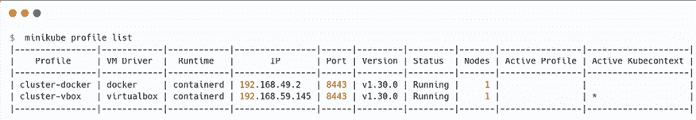
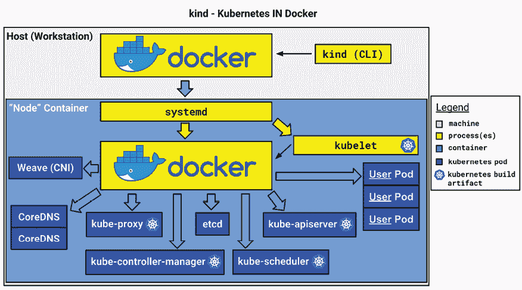

# 第三章：安装你的第一个 Kubernetes 集群

在上一章中，我们有机会解释了 Kubernetes 是什么，它的分布式架构，一个正常工作的集群的构成，以及它如何在多台 Linux 机器上管理 Docker 容器。现在，我们要亲自动手了，因为是时候安装 Kubernetes 了。本章的主要目标是为接下来的章节安装一个可用的 Kubernetes 集群。这样，你就可以拥有自己的集群进行实践、操作和学习，边读这本书边实践。

安装 Kubernetes 意味着你需要让不同的组件协同工作。当然，我们不会采用手动设置单个集群组件的繁琐方法；相反，我们将使用自动化工具。这些工具的好处在于它们可以本地启动并配置所有组件。这个自动化的 Kubernetes 集群设置对于 DevOps 团队快速测试 YAML 更改、开发人员希望拥有一个本地环境来测试应用程序，以及安全团队快速测试 Kubernetes 对象 YAML 定义的更改尤其有益。

如果你不想在本地计算机上搭建 Kubernetes 集群，我们还将在本书的后续章节中设置简化但功能完整的生产级 Kubernetes 集群，分别使用**Google Kubernetes Engine**（**GKE**）、**Amazon Elastic Kubernetes Service**（**EKS**）和**Azure Kubernetes Service**（**AKS**）。这些都是基于云的、生产就绪的解决方案。这样，你可以在一个实际的 Kubernetes 集群上进行实践和学习，该集群托管在云端。

无论你是选择本地搭建还是使用云端服务，这由你来决定。你需要通过考虑每种解决方案的优缺点来选择最适合你的方式。然而，在这两种情况下，你都需要在本地工作站上安装一个可用的`kubectl`，以便与最终的 Kubernetes 集群进行通信。关于`kubectl`的安装说明可以在上一章中找到，*第二章*，*Kubernetes 架构 – 从容器镜像到运行的 Pod*。

在本章中，我们将涵盖以下主要主题：

+   使用`minikube`安装 Kubernetes 集群

+   使用`kind`的多节点 Kubernetes 集群

+   替代的 Kubernetes 学习环境

+   生产级 Kubernetes 集群

# 技术要求

为了跟随本章的示例，你将需要以下内容：

+   在本地计算机上安装`kubectl`

+   一台配备至少 2 个 CPU、2GB 可用内存和 20GB 可用磁盘空间的工作站。（如果你想探索多节点集群环境，你将需要更多的资源。）

+   在工作站上安装的容器或虚拟机管理器，如 Docker、QEMU、Hyperkit、Hyper-V、KVM、Parallels、Podman、VirtualBox 或 VMware Fusion/Workstation

+   可靠的互联网连接

你可以从官方 GitHub 仓库下载本章的最新代码示例：[`github.com/PacktPublishing/The-Kubernetes-Bible-Second-Edition/tree/main/Chapter03`](https://github.com/PacktPublishing/The-Kubernetes-Bible-Second-Edition/tree/main/Chapter03)

# 使用 minikube 安装 Kubernetes 集群

在本节中，我们将学习如何使用 `minikube` 安装本地 Kubernetes 集群。这可能是获得本地工作 Kubernetes 安装的最简单方法。在本节结束时，你将能够在本地机器上安装一个工作中的单节点 Kubernetes 集群。

`minikube` 使用起来很简单，且完全免费。它会在本地机器上安装所有 Kubernetes 组件并进行配置。通过 `minikube` 卸载所有组件也很容易，因此如果有一天你想销毁本地集群，也不会被困住。

与完整的生产集群部署方法相比，`minikube` 有一个很大的优势：它是一个非常有用的工具，可以快速测试 Kubernetes 场景。如果你不希望使用 `minikube`，可以完全跳过这一部分，选择本章中描述的其他方法。

虽然 `minikube` 是本地 Kubernetes 开发的热门选择，但与完整的生产集群相比，它在资源使用和功能一致性上有一些权衡：

+   **资源压力**：在本地机器上运行 `minikube` 与其他进程一起运行时可能会占用大量资源。当你想创建更大的 Kubernetes 集群时，它需要较多的 CPU 和内存，这可能会影响其他应用程序的性能。

+   **网络差异**：与生产环境中的 Kubernetes 集群不同，`minikube` 的默认网络设置可能无法完全模拟现实世界中的网络环境。这可能会在复制或排除生产中可能发生的网络相关问题时带来挑战。

+   **兼容性考虑**：某些 Kubernetes 特性或第三方工具可能需要比 `minikube` 提供的更完整的 Kubernetes 设置，这可能导致开发过程中的兼容性问题。

+   **持久存储挑战**：由于 `minikube` 在持久卷支持方面的限制，管理应用程序的持久存储可能会很麻烦，相较于完整的 Kubernetes 集群。

我们将在下一节学习如何安装 `minikube` 并部署和开发 Kubernetes 集群。

## 安装 minikube

在这里，我们将看到如何在 Linux、macOS 和 Windows 上安装 `minikube` 工具。使用二进制文件或包管理器方法安装 `minikube` 是一项简单的任务，如下文所述。

你可以使用本地包管理器，如 `apt-get`、`yum`、Zypper、Homebrew（macOS）或 Chocolatey（Windows）来安装 `minikube`。请参考文档（[`minikube.sigs.k8s.io/docs/start`](https://minikube.sigs.k8s.io/docs/start)）了解更多信息。

### 在 Linux 上安装 minikube

在 Linux 上，`minikube`可以通过 Debian 包、RPM 包或二进制文件安装，如下所述：

```
$ curl -LO https://storage.googleapis.com/minikube/releases/latest/minikube-linux-amd64
$ sudo install minikube-linux-amd64 /usr/local/bin/minikube
# Verify minikube command and path
$ which minikube
/usr/local/bin/minikube 
```

请注意，路径在你的工作站上可能会有所不同，这取决于操作系统。你需要确保路径已包含在**PATH**环境变量中，以便`minikube`命令能正常工作。

### 在 macOS 上安装 minikube

在 macOS 上，`minikube`可以通过二进制文件安装，如下所述：

```
$ curl -LO https://storage.googleapis.com/minikube/releases/latest/minikube-darwin-amd64
$ sudo install minikube-darwin-amd64 /usr/local/bin/minikube
# Verify minikube command and path
$ which minikube 
```

也可以通过包管理器 Homebrew 在 macOS 上安装`minikube`。

### 在 Windows 上安装 minikube

与 macOS 和 Linux 一样，也可以通过多种方式在 Windows 上安装`minikube`，如下所示：

```
# Using Windows Package Manager (if installed)
$ winget install minikube
# Using Chocolatey
$ choco install minikube
# Via .exe download and setting the PATH
# 1\. Download minikube: https://storage.googleapis.com/minikube/releases/latest/minikube-installer.exe
# 2\. Set PATH 
```

一旦你配置了`minikube`，你就可以使用`minikube`创建不同类型的 Kubernetes 集群，具体说明见接下来的章节。

## minikube 配置

`minikube`工具提供了适用于开发环境的最基本但有效的定制功能。

例如，通过`minikube`创建的 Kubernetes 集群的默认配置为 2 个 CPU 和 2GB 内存。如果你需要更大的 Kubernetes 集群节点，可以使用以下命令调整这个值：

```
$ minikube config set cpus 4
❗  These changes will take effect upon a minikube delete and then a minikube start
$ minikube config set memory 16000
❗  These changes will take effect upon a minikube delete and then a minikube start
$ minikube config set container-runtime containerd
❗  These changes will take effect upon a minikube delete and then a minikube start 
```

如你在屏幕上看到的，你需要删除并重新创建`minikube`集群以应用设置。

## minikube 的驱动程序

`minikube`作为一种简单而轻量的方式，用于在你的开发机器上运行本地 Kubernetes 集群。为了实现这一点，它利用**驱动程序**——这些是管理集群生命周期的核心组件。这些驱动程序与不同的虚拟化和容器化技术进行交互，使`minikube`能够创建、配置并控制本地 Kubernetes 环境的底层基础设施。`minikube`的驱动程序灵活性使你能够根据特定的需求和偏好，将集群部署为虚拟机、容器，甚至直接部署到开发机器的裸机上，从而量身定制设置：

+   **容器驱动程序**：对于容器化的方式，`minikube`可以利用本地的 Podman 或 Docker 安装。这允许你在开发机器的容器中直接运行`minikube`，从而可能提供更轻量和更高效的资源配置。

+   **虚拟机（VM）驱动程序**：如果你更倾向于虚拟机的方式，`minikube`可以在你的机器上启动虚拟机。这些虚拟机将容纳并封装所需的 Kubernetes 组件，为你的本地集群提供一个更为隔离的环境。

选择容器驱动程序还是虚拟机驱动程序取决于你的具体需求和偏好，以及你的开发环境的能力。

参考`minikube`驱动程序文档([`minikube.sigs.k8s.io/docs/drivers/`](https://minikube.sigs.k8s.io/docs/drivers/))了解可用和支持的`minikube`驱动程序及支持的操作系统。

你也可以使用以下命令设置`minikube`的默认驱动程序：

```
$  minikube config set driver docker
❗  These changes will take effect upon a minikube delete and then a minikube start
# or set the VirtualBox as driver
$  minikube config set driver virtualbox
❗  These changes will take effect upon a minikube delete and then a minikube start$  minikube config view driver
- driver: docker 
```

此外，可以在创建`minikube`集群时设置驱动程序，方法如下：

```
$ minikube start --driver=docker 
```

先决条件取决于各个`minikube`驱动程序，必须先安装并准备好。这些可能包括安装 Docker、Podman 或 VirtualBox，并在特定操作系统上授予权限。安装和配置说明可以在`minikube`驱动程序特定的文档中找到（[`minikube.sigs.k8s.io/docs/drivers`](https://minikube.sigs.k8s.io/docs/drivers)）。

让我们在下一部分学习如何使用`minikube`启动我们的第一个 Kubernetes 集群。

## 使用 minikube 启动单节点 Kubernetes 集群

`minikube`的主要目的是在本地系统上启动 Kubernetes 组件，并使它们彼此通信。在接下来的部分中，我们将学习如何使用 VirtualBox 驱动程序和 Docker 部署`minikube`集群。

### 使用虚拟机设置 minikube

VM 方法要求您在工作站上安装虚拟机管理程序，如下所示：

+   Linux: KVM2（推荐），VirtualBox，QEMU

+   Windows: Hyper-V（推荐），VirtualBox，VMware Workstation，QEMU

+   macOS: Hyperkit, VirtualBox, Parallels, VMware Fusion, QEMU

然后，`minikube`将把所有 Kubernetes 组件封装成一个虚拟机，并启动该虚拟机。

在以下示例中，我们使用 Fedora 39 作为工作站，并将 VirtualBox 作为我们的虚拟机管理程序软件，因为它适用于 Linux、macOS 和 Windows。

请参考[`www.virtualbox.org/wiki/Downloads`](https://www.virtualbox.org/wiki/Downloads)下载并安装适用于您工作站的 VirtualBox。您可以自由选择您喜欢的虚拟化软件，并始终按照文档（[`minikube.sigs.k8s.io/docs/drivers/`](https://minikube.sigs.k8s.io/docs/drivers/)）查看支持的虚拟化软件。

不要混淆`minikube`版本和已部署的 Kubernetes 版本。例如，`minikube 1.32`使用 Kubernetes 1.28，出于稳定性和兼容性的考虑。这可以进行彻底的测试，提供更广泛的工具支持，控制版本发布，并对旧版本提供长期支持。用户仍然可以独立运行不同版本的 Kubernetes。这种稳定性与灵活性之间的平衡使得`minikube`成为开发人员可靠且多功能的平台。

在您已经安装了`minikube`和 VirtualBox 的工作站上，执行以下命令：

```
$  minikube start --driver=virtualbox --memory=8000m --cpus=2 
```

如果您使用的是特定版本的`minikube`，但想要安装不同版本的 Kubernetes，则可以指定特定版本，如下所示：

```
$ minikube start --driver=virtualbox --memory=8000m --cpus=2 --kubernetes-version=1.29.0 
```

您将看到`minikube`正在启动 Kubernetes 部署过程，包括 VM 镜像的下载，如下所示：

```
😄  minikube v1.32.0 on Fedora 39
❗  Specified Kubernetes version 1.29.0 is newer than the newest supported version: v1.28.3\. Use `minikube config defaults kubernetes-version` for details.
❗  Specified Kubernetes version 1.29.0 not found in Kubernetes version list
🤔  Searching the internet for Kubernetes version...
✅  Kubernetes version 1.29.0 found in GitHub version list
✨  Using the virtualbox driver based on user configuration
👍  Starting control plane node minikube in cluster minikube
🔥  Creating virtualbox VM (CPUs=2, Memory=8000MB, Disk=20000MB) ...
🐳  Preparing Kubernetes v1.29.0 on Docker 24.0.7 ...
    ▪ Generating certificates and keys ...
    ▪ Booting up control plane ...
    ▪ Configuring RBAC rules ...
🔗  Configuring bridge CNI (Container Networking Interface) ...
    ▪ Using image gcr.io/k8s-minikube/storage-provisioner:v5 
```

根据您工作站的操作系统和虚拟化软件，您还可能会看到以下信息，作为建议：

```
│    You have selected "virtualbox" driver, but there are better options!                          │    For better performance and support consider using a different driver:
│            - kvm2                                                                                 │            - qemu2                                                                                │
│    To turn off this warning run:
│            $ minikube config set WantVirtualBoxDriverWarning false                                │    To learn more about on minikube drivers checkout https://minikube.sigs.k8s.io/docs/drivers/    │
│    To see benchmarks checkout https://minikube.sigs.k8s.io/docs/benchmarks/cpuusage/              │ 
```

最后，您将看到`minikube`显示以下成功消息：

```
🔎  Verifying Kubernetes components...
🌟  Enabled addons: storage-provisioner, default-storageclass
🏄  Done! kubectl is now configured to use "minikube" cluster and "default" namespace by default 
```

是的，你已经在一分钟内部署了一个完全工作的 Kubernetes 集群，并准备好部署你的应用。

现在使用 `minikube` 命令验证 Kubernetes 集群的状态，如下所示：

```
$  minikube status
minikube
type: Control Plane
host: Running
kubelet: Running
apiserver: Running
kubeconfig: Configured 
```

你还可以在 VirtualBox UI 中看到新的 `minikube` 虚拟机，如下所示：


图 3.1：VirtualBox UI 中的 minikube 虚拟机

在接下来的部分中，我们将学习如何使用 `minikube` 和容器部署 Kubernetes 集群。

### 使用容器设置 minikube

容器方法更简单。`minikube` 不使用虚拟机，而是使用本地的 Docker 引擎实例或 Podman 启动一个大容器内的 Kubernetes 组件。要使用基于容器的 `minikube`，确保按照你所安装 `minikube` 的工作站操作系统的说明安装 Docker 或 Podman；`minikube` 不会为你安装 Podman 或 Docker。如果缺少提供的驱动程序，或者 `minikube` 无法在系统上找到该驱动程序，你可能会遇到如下错误：

```
$ minikube start --driver=podman
😄 minikube v1.32.0 on Fedora 39 (hyperv/amd64)
✨ Using the podman driver based on user configuration
🤷 Exiting due to PROVIDER_PODMAN_NOT_FOUND: The 'podman' provider was not found: exec: "podman": executable file not found in $PATH 
```

Docker 安装过程很简单，但步骤可能因操作系统不同而有所变化，你可以查看文档 ([`docs.docker.com/engine/install/`](https://docs.docker.com/engine/install/)) 获取更多信息。同样，Podman 的安装步骤也可以在 [`podman.io/docs/installation`](https://podman.io/docs/installation) 上找到，适用于不同的操作系统版本。

如果你正在使用 Windows 工作站和基于 Hyper-V 的虚拟机进行实践实验，记得在安装 `minikube` 和容器引擎的虚拟机中禁用动态内存。

当使用 Podman 驱动程序运行时，`minikube` 在启动时会检查可用内存，并报告“正在使用的”内存（动态设置）。因此，你需要确保有足够的内存可用，或者为 Kubernetes 节点配置内存需求。

在以下示例中，我们使用 Fedora 39 作为工作站，Docker 作为容器引擎：

```
$ minikube start --driver=docker --kubernetes-version=1.29.0
😄  minikube v1.32.0 on Fedora 39
❗  Specified Kubernetes version 1.29.0 is newer than the newest supported version: v1.28.3\. Use `minikube config defaults kubernetes-version` for details.
❗  Specified Kubernetes version 1.29.0 not found in Kubernetes version list
🤔  Searching the internet for Kubernetes version...
✅  Kubernetes version 1.29.0 found in GitHub version list
✨  Using the docker driver based on user configuration
📌  Using Docker driver with root privileges
👍  Starting control plane node minikube in cluster minikube
🚜  Pulling base image ...
🔥  Creating docker container (CPUs=2, Memory=8000MB) ...
🐳  Preparing Kubernetes v1.29.0 on Docker 24.0.7 ...
    ▪ Generating certificates and keys ...
    ▪ Booting up control plane ...
    ▪ Configuring RBAC rules ...
🔗  Configuring bridge CNI (Container Networking Interface) ...
    ▪ Using image gcr.io/k8s-minikube/storage-provisioner:v5
🔎  Verifying Kubernetes components...
🌟  Enabled addons: storage-provisioner, default-storageclass
🏄  Done! kubectl is now configured to use "minikube" cluster and "default" namespace by default 
```

我们也可以使用 Podman 作为容器引擎，并通过以下命令使用 `minikube` 创建 Kubernetes 集群：

```
$ minikube start --driver=podman 
```

现在我们已经创建了一个通过 `minikube` 部署的 Kubernetes 集群，在接下来的部分中，让我们学习如何使用 `kubectl` 访问和管理该集群。

## 访问由 minikube 创建的 Kubernetes 集群

现在，我们需要为本地的 `kubectl` 命令行工具创建一个 `kubeconfig` 文件，以便它能与这个新的 Kubernetes 安装进行通信。好消息是，当我们执行 `minikube start` 命令时，`minikube` 会即时为我们生成一个 `kubeconfig` 文件。`minikube` 生成的 `kubeconfig` 文件指向本地的 `kube-apiserver` 端点，且你的本地 `kubectl` 已配置为默认调用该集群。因此，实际上不需要做任何额外操作：`kubeconfig` 文件已经被正确格式化并放置在合适的位置。

默认情况下，这个配置在`~/.kube/config`中，你应该能够看到现在有一个`minikube`上下文：

```
$ cat ~/.kube/config
...<removed for brevity>..
- context:
    cluster: minikube
    extensions:
    - extension:
        last-update: Mon, 03 Jun 2024 13:06:44 +08
        provider: minikube.sigs.k8s.io
        version: v1.33.1
      name: context_info
    namespace: default
    user: minikube
  name: minikube
...<removed for brevity>.. 
```

使用以下命令显示当前的`kubeconfig`文件。你应该能看到一个名为`minikube`的集群，它指向一个本地 IP 地址：

```
$ kubectl config view 
```

接下来，运行以下命令，这将显示当前你的`kubectl`指向的 Kubernetes 集群：

```
$ kubectl config current-context
minikube 
```

现在，让我们尝试发出一个真实的`kubectl`命令，列出属于我们`minikube`集群的节点。如果一切正常，此命令应该会到达由`minikube`启动的`kube-apiserver`组件，该组件将返回一个节点，因为`minikube`是单节点解决方案。让我们使用以下命令列出节点：

```
$ kubectl get nodes
NAME       STATUS   ROLES           AGE     VERSION
minikube   Ready    control-plane   3m52s   v1.29.0 
```

如果运行此命令时没有看到任何错误，说明你的`minikube`集群已经准备好并且完全正常工作！

这是你作为本书的一部分运行的第一个真实的`kubectl`命令。在这里，真实的`kube-apiserver`组件接收了你的 API 调用，并返回了来自真实`etcd`数据存储的 HTTP 响应数据。在我们的场景中，这是集群中节点的列表。

由于`minikube`默认创建一个单节点的 Kubernetes 集群，这个命令只会输出一个节点。这个节点既是控制平面节点，又是计算节点。适合本地测试，但不要在生产环境中部署这种配置。

现在我们可以做的，是列出控制平面组件的状态，以便你开始熟悉`kubectl`：

```
$ kubectl get componentstatuses
Warning: v1 ComponentStatus is deprecated in v1.19+
NAME                 STATUS    MESSAGE   ERROR
controller-manager   Healthy   ok       
scheduler            Healthy   ok       
etcd-0               Healthy   ok 
```

此命令应输出控制平面组件的状态。你应该看到如下内容：

+   一个正在运行的`etcd`数据存储

+   一个正在运行的`kube-scheduler`组件

+   一个正在运行的`kube-controller-manager`组件

在接下来的章节中，我们将学习如何通过停止并删除`minikube` Kubernetes 集群来清理你的 Kubernetes 学习环境。

## 停止并删除本地的 minikube 集群

你可能想停止或删除本地的`minikube`安装。继续操作时，不要直接杀死虚拟机或容器，而是使用`minikube`命令行工具。以下是执行此操作的两个命令：

```
$ minikube stop
✋  Stopping node "minikube"  ...
🛑  1 node stopped. 
```

上面的命令将停止集群。然而，集群将继续存在；其状态将被保留，你可以稍后使用以下`minikube start`命令重新启动它。你可以通过再次运行`minikube status`命令来检查它：

```
$ minikube status
minikube
type: Control Plane
host: Stopped
kubelet: Stopped
apiserver: Stopped
kubeconfig: Stopped 
```

也可以暂停集群，而不是停止它，这样你可以快速重新启动 Kubernetes 集群：

```
$  minikube pause
⏸️  Pausing node minikube ...
⏯️  Paused 14 containers in: kube-system, kubernetes-dashboard, storage-gluster, istio-operator
$  minikube status
minikube
type: Control Plane
host: Running
kubelet: Stopped
apiserver: Paused
kubeconfig: Configured 
```

之后，你可以按如下方式恢复集群：

```
$ minikube unpause 
```

如果你想销毁集群，请使用以下命令：

```
$ minikube delete
🔥  Deleting "minikube" in docker ...
🔥  Deleting container "minikube" ...
🔥  Removing /home/gmadappa/.minikube/machines/minikube ...
💀  Removed all traces of the "minikube" cluster. 
```

如果你使用此命令，集群将被完全销毁。它的状态将丢失，无法恢复。

现在你的`minikube`集群已经运行，决定是否使用它继续后续章节，或选择其他解决方案，就由你来定。

## 使用 minikube 的多节点 Kubernetes 集群

也可以使用`minikube`创建多节点 Kubernetes 集群。在接下来的演示中，我们将使用`minikube`创建一个三节点 Kubernetes 集群：

在创建多节点集群时，您需要确保工作站有足够的资源来创建多个 Kubernetes 节点（无论是虚拟机还是容器）。同时，注意`minikube`会根据您在设置或参数中指定的 vCPU 和内存配置启动节点。

```
$ minikube start --driver=podman --nodes=3 
```

集群创建完成后，检查节点详情并查看所有节点，如下所示：

```
$ kubectl get nodes
NAME           STATUS   ROLES           AGE   VERSION
minikube       Ready    control-plane   93s   v1.29.0
minikube-m02   Ready    <none>          74s   v1.29.0
minikube-m03   Ready    <none>          54s   v1.29.0 
```

`minikube`创建了一个三节点集群（`--nodes=3`），其中第一个节点为控制平面节点（或主节点），其余两个节点为计算节点（稍后您需要分配适当的标签；我们将在后续章节中学习此内容）。

## 使用 minikube 的多主节点 Kubernetes 集群

可能会有这种情况：您想要部署并测试具有高可用控制平面的 Kubernetes 集群，带有多个控制平面节点。您可以使用`minikube`通过以下命令实现这一点：

```
$ minikube start \
  --driver=virtualbox \
  --nodes 5 \
  --ha true \
  --cni calico \
  --cpus=2 \
  --memory=2g \
  --kubernetes-version=v1.30.0 \
  --container-runtime=containerd
$ kubectl get nodes
NAME           STATUS   ROLES           AGE     VERSION
minikube       Ready    control-plane   6m28s   v1.30.0
minikube-m02   Ready    control-plane   4m36s   v1.30.0
minikube-m03   Ready    control-plane   2m45s   v1.30.0
minikube-m04   Ready    <none>          112s    v1.30.0
minikube-m05   Ready    <none>          62s     v1.30.0 
```

`minikube`将创建一个五节点集群（`--nodes 5`），并将前 3 个节点配置为控制平面节点（`--ha true`）。

再次提醒，确保您的工作站有足够的资源来创建这样一个多节点集群。

## 使用 minikube 的多个 Kubernetes 集群

正如我们所学，`minikube`是为 Kubernetes 环境的开发和测试设计的。可能会有这样的情况：您想要模拟一个包含多个 Kubernetes 集群的环境。在这种情况下，您可以再次使用`minikube`，因为使用`minikube`可以创建多个 Kubernetes 集群。但请记住，为您的不同 Kubernetes 集群指定不同的名称（`--profile`），如下面所示：

```
# Start a minikube cluster using VirtualBox as driver.
$  minikube start --driver=virtualbox --kubernetes-version=1.30.0 --profile cluster-vbox
# Start another minikube cluster using Docker as driver
$ minikube start --driver=docker --kubernetes-version=1.30.0 --profile cluster-docker 
```

您可以列出`minikube`集群并查看详细信息，如下图所示：



图 3.2：minikube 配置文件列表显示多个 Kubernetes 集群

```
# Stop cluster with profile name
$ minikube stop --profile cluster-docker
# Remove the cluster with profile name
$ minikube delete --profile cluster-docker 
```

我们已经学习了如何创建不同类型和大小的 Kubernetes 集群；现在让我们来看看另一个用于设置本地 Kubernetes 集群的工具，名为`kind`。

# 使用 kind 的多节点 Kubernetes 集群

在本节中，我们将讨论一个名为`kind`的工具，它也被设计用于在本地运行 Kubernetes 集群，就像`minikube`一样。

`kind`的核心思想是使用 Docker 或 Podman 容器作为 Kubernetes 节点，通过**Docker-in-Docker**（**DinD**）或**容器内容器**模型。通过启动容器（容器内包含容器引擎和 kubelet），可以使它们表现为 Kubernetes 工作节点。

下图展示了`kind`集群组件的高层架构：



图 3.3：kind 集群组件（图片来源：https://kind.sigs.k8s.io/docs/design/initial）

这与使用 Docker 驱动的`minikube`完全相同，唯一不同的是，在这里，它不会在单个容器中完成，而是在多个容器中完成。结果是一个本地多节点集群。类似于`minikube`，`kind`是一个免费的开源工具。

类似于`minikube`，`kind`是一个用于本地开发和测试的工具。请勿在生产环境中使用它，因为它并未为此设计。

## 在本地系统上安装 kind

由于`kind`是完全围绕 Docker 和 Podman 构建的工具，因此你需要在本地系统上安装并运行这两个容器引擎之一。

由于 Docker 和 Podman 的安装说明已经作为文档提供，我们将在这里跳过这些步骤（请参阅之前部分 *使用容器设置 minikube* 以获取详细信息）。

请参考`kind`发布页面以获取`kind`版本信息和可用性（[`github.com/kubernetes-sigs/kind/releases`](https://github.com/kubernetes-sigs/kind/releases)）。

同样，安装`kind`的过程将取决于你的操作系统：

+   对于 Linux，请使用以下命令：

    ```
    $  curl -Lo ./kind https://kind.sigs.k8s.io/dl/v0.23.0/kind-linux-amd64
    $ chmod +x ./kind
    $ mv ./kind /usr/local/bin/kind
    # Check version
    $ kind version
    kind v0.23.0 go1.21.10 linux/amd64 
    ```

+   对于 macOS，请使用以下命令：

    ```
    $  curl -Lo ./kind https://kind.sigs.k8s.io/dl/v0.20.0/kind-darwin-amd64
    $ chmod +x ./kind
    $ mv ./kind /usr/local/bin/kind 
    ```

+   你也可以使用 Homebrew 进行安装：

    ```
    $ brew install kind 
    ```

+   对于 Windows PowerShell，请使用以下命令：

    ```
    $ curl.exe -Lo kind-windows-amd64.exe https://kind.sigs.k8s.io/dl/v0.23.0/kind-windows-amd64
    $ Move-Item .\kind-windows-amd64.exe c:\some-dir-in-your-PATH\kind.exe 
    ```

+   你也可以使用 Chocolatey 进行安装：

    ```
    $ choco install kind 
    ```

+   如果你已安装 Go 语言环境，那么可以使用以下命令：

    ```
    $ go install sigs.k8s.io/kind@v0.22.0 && kind create cluster 
    ```

请参考文档（https://kind.sigs.k8s.io/docs/user/quick-start#installation）了解适用于你系统的其他安装方法。

接下来，让我们学习如何使用`kind`创建 Kubernetes 集群。

## 使用 kind 创建 Kubernetes 集群

一旦`kind`安装到你的系统上，你可以立即使用以下命令启动一个新的 Kubernetes 集群：

```
$ kind create cluster --name test-kind
Creating cluster "kind" ... 
```

当你运行此命令时，`kind`将通过拉取一个包含所有控制平面组件的容器镜像，在本地开始构建 Kubernetes 集群。最终结果将是一个单节点的 Kubernetes 集群，其中一个 Docker 容器充当*控制平面节点*。

如果你喜欢，也可以使用 Podman 作为`kind`集群的提供者，方法如下：

```
$ KIND_EXPERIMENTAL_PROVIDER=podman kind create cluster 
```

我们不想要这种设置，因为我们已经可以通过`minikube`实现它。我们想要的是一个可以定制集群和节点的`kind`多节点集群。为此，我们需要编写一个非常小的配置文件，并告诉`kind`使用它作为模板来构建本地 Kubernetes 集群。因此，先让我们删除刚才构建的单节点`kind`集群，并重新构建它为多节点集群：

1.  运行此命令删除集群：

    ```
    $ kind delete cluster
    Deleting cluster "kind" ... 
    ```

1.  然后，我们需要创建一个`config`文件，作为`kind`构建我们集群的模板。只需将以下内容复制到该目录下的本地文件中，例如`~/.kube/kind_cluster`：

    ```
     kind: Cluster
    apiVersion: kind.x-k8s.io/v1alpha4
    nodes:
    - role: control-plane
    - role: worker
    - role: worker
    - role: worker 
    ```

请注意，此文件采用 YAML 格式。请注意`nodes`数组，这是文件中最重要的部分。在这里，你可以告诉`kind`你希望集群中有多少个节点。角色键可以有两个值：控制平面和工作节点。

根据你选择的角色，会创建不同的节点。

1.  让我们使用这个`config`文件重新启动`kind create`命令来构建我们的多节点集群。对于给定的文件，结果将是一个包含一个主节点和三个工作节点的 Kubernetes 集群：

    ```
    $ kind create cluster --config ~/.kube/kind_cluster 
    ```

通过在创建`kind`集群时使用适当的镜像信息，也可以构建特定版本的 Kubernetes，如下所示：

```
$ kind create cluster \
  --name my-kind-cluster \
  --config ~/.kube/kind_cluster \
  --image kindest/node:v1.29.0@sha256:eaa1450915475849a73a9227b8f201df25e55e268e5d619312131292e324d570 
```

一个新的 Kubernetes 集群将由`kind`部署和配置，且你将在最后收到与集群访问相关的消息，内容如下：

```
Creating cluster "my-kind-cluster" ...
✓ Ensuring node image (kindest/node:v1.29.0) 🖼
✓ Preparing nodes 📦 📦 📦 
✓ Writing configuration 📜
✓ Starting control-plane 🕹️
✓ Installing CNI 🔌
✓ Installing StorageClass 💾
✓ Joining worker nodes 🚜
Set kubectl context to "kind-my-kind-cluster"
You can now use your cluster with:
kubectl cluster-info --context kind-my-kind-cluster
Thanks for using kind! 😊 
```

接下来，你应该有四个新的 Docker 容器：一个作为主节点运行，另外三个作为同一 Kubernetes 集群的工作节点。

现在，像往常一样，我们需要为我们的`Kubectl`工具编写一个`kubeconfig`文件，以便能够与新的集群进行交互。猜猜看，`kind`已经生成了正确的配置，并将其附加到我们的`~/.kube/config`文件中。此外，`kind`还将当前上下文设置为我们的新集群，因此实际上没有什么需要做的了。我们可以立即开始查询我们的新集群。让我们使用`kubectl get nodes`命令列出节点。如果一切正常，我们应该看到四个节点：

```
$ kubectl get nodes
NAME                            STATUS   ROLES           AGE     VERSION
my-kind-cluster-control-plane   Ready    control-plane   4m      v1.29.0
my-kind-cluster-worker          Ready    <none>          3m43s   v1.29.0
my-kind-cluster-worker2         Ready    <none>          3m42s   v1.29.0 
```

一切看起来都很完美。你的`kind`集群正在运行！

就像我们对`minikube`所做的那样，你也可以使用以下命令检查组件的状态：

```
$ kubectl cluster-info
Kubernetes control plane is running at https://127.0.0.1:42547
CoreDNS is running at https://127.0.0.1:42547/api/v1/namespaces/kube-system/services/kube-dns:dns/proxy 
```

为了进一步调试和诊断集群问题，可以使用`'kubectl cluster-info dump`'命令：

```
$  kubectl get --raw='/readyz?verbose'
[+]ping ok
[+]log ok
[+]etcd ok
...<removed for brevity>...
[+]poststarthook/apiservice-openapiv3-controller ok
[+]shutdown ok
readyz check passed 
```

作为开发和学习环境管理的一部分，我们需要学习如何停止和删除使用`kind`创建的 Kubernetes 集群。接下来，我们将学习如何操作。

## 停止并删除本地的 kind 集群

你可能想要停止或移除`kind`在本地系统上创建的所有内容，以便在实践后清理环境。为此，你可以使用以下命令：

```
$ kind stop 
```

该命令将停止`kind`正在管理的 Docker 容器。如果你手动在容器上运行 Docker `stop`命令，你将得到相同的结果。这会停止容器，但会保持集群的状态。也就是说，集群不会被销毁，只需要通过以下命令重新启动它，就可以恢复到停止前的状态。

如果你想完全从系统中移除集群，可以使用以下命令。运行此命令将会从你的系统中删除集群及其状态，你将无法恢复该集群：

```
$ kind delete cluster
Deleting cluster "kind" ... 
```

现在你的 `kind` 集群已投入使用，接下来你可以决定是否在接下来的章节中一边阅读一边进行实践。你还可以选择是否使用本章接下来的部分中描述的其他解决方案。`kind` 特别适合，因为它是免费的，并且允许你安装一个多节点集群。然而，它并非为生产环境设计，依然是一个面向开发和测试的非生产环境解决方案。`kind` 利用 Docker 容器创建 *Kubernetes 节点*，这些节点在实际环境中应该是 Linux 机器。

接下来我们将了解一些替代的 Kubernetes 学习和测试环境。

# 替代的 Kubernetes 学习环境

你还可以利用一些可用的零配置学习环境，这些环境旨在让你的 Kubernetes 之旅更加顺畅和愉快。

## 玩转 Kubernetes

由 **Docker** 和 **Tutorius** 提供的这个互动沙盒（`labs.play-with-k8s.com`），为你提供了一个简单有趣的方式来实验 Kubernetes。在几秒钟内，你就可以直接在浏览器中运行你自己的 Kubernetes 集群。

该环境具备以下特点：

+   免费的 Alpine Linux 虚拟机：体验一个真实的虚拟机环境，无需离开浏览器。

+   DinD：该技术创造了多个虚拟机的假象，让你能够探索分布式系统的概念。

## Killercoda Kubernetes 沙盒

**Killercoda** ([`killercoda.com/playgrounds/scenario/kubernetes`](https://killercoda.com/playgrounds/scenario/kubernetes)) 是一个零配置沙盒环境，提供一个可通过浏览器访问的临时 Kubernetes 环境。通过他们承诺在发布几周后提供最新的 kubeadm Kubernetes 版本，让你时刻掌握最新趋势。

该环境具备以下特点：

+   瞬态环境：使用预配置集群快速开始，集群在你完成后会消失。这使其非常适合快速实验，无需任何承诺。

+   带有两个节点的空 kubeadm 集群：通过一个现成的两节点集群，深入了解 Kubernetes 的核心功能。

+   带有调度能力的控制平面节点：与一些沙盒环境不同，这个环境允许你在控制平面节点上调度工作负载，为测试提供了更多的灵活性。

接下来，我们将探讨一些生产级 Kubernetes 选项。

# 生产级 Kubernetes 集群

到目前为止，我们一直在讨论用于开发和学习的 Kubernetes 环境。如何构建一个满足你特定需求的生产级 Kubernetes 环境？接下来，我们将看到一些 Kubernetes 用户采纳的知名选项。

在接下来的部分，我们将了解主要 **云服务提供商**（**CSPs**）提供的托管 Kubernetes 服务。

## 使用云服务的托管 Kubernetes 集群

如果你更倾向于使用托管服务来搭建 Kubernetes 环境，那么有多个选择可以使用，如 GKE、AKS、EKS 等：

+   **Google Kubernetes Engine** (**GKE**)：由**Google Cloud Platform**（**GCP**）提供，GKE 是一个完全托管的 Kubernetes 服务。它负责集群生命周期的各个环节，从配置、扩展到维护。GKE 与其他 GCP 服务无缝集成，是现有 GCP 用户的理想选择。

+   **Azure Kubernetes Service** (**AKS**)：是 Microsoft Azure 的一部分，AKS 是另一个托管的 Kubernetes 解决方案。与 GKE 类似，AKS 处理所有集群管理工作，让你可以专注于容器化应用的部署和管理。AKS 与其他 Azure 服务很好地集成，使其成为 Azure 用户的自然选择。

+   **Amazon Elastic Kubernetes Service** (**EKS**)：由**Amazon Web Services**（**AWS**）提供，EKS 提供了 AWS 生态系统中的托管 Kubernetes 服务。像 GKE 和 AKS 一样，EKS 负责集群管理，让你可以专注于应用程序的开发。EKS 与其他 AWS 服务集成，是 AWS 用户的强大选择。

这些托管 Kubernetes 服务提供了一种方便且可扩展的方式来部署和管理容器化应用程序，避免了自管理 Kubernetes 集群的复杂性。

我们有详细的章节来学习如何部署和管理这些集群，如下所示：

+   *第十五章*，*在 Google Kubernetes Engine 上运行 Kubernetes 集群*

+   *第十六章*，*在 Amazon Web Services 上使用 Amazon Elastic Kubernetes Service 启动 Kubernetes 集群*

+   *第十七章*，*在 Microsoft Azure 上使用 Azure Kubernetes Service 运行 Kubernetes 集群*

如果你没有本地 Kubernetes 环境，如我们在本章前面的部分所述，你可以通过参考相关章节，在你选择的云平台上使用托管 Kubernetes 服务创建一个。但在开始阅读本书的下一部分 *第二部分*：*深入了解 Kubernetes 核心概念* 之前，必须拥有一个正常工作的 Kubernetes 集群。

我们将在下一节学习 Kubernetes 发行版和平台。

## Kubernetes 发行版

Kubernetes 发行版本质上是 Kubernetes 的预打包版本，除了核心 Kubernetes 提供的功能外，还包括其他附加功能和特性。它们像增值包一样，满足特定需求并简化用户的部署过程。为了获得更丰富的体验，可以考虑以下 Kubernetes 发行版：

+   **Red Hat OpenShift**：这个企业级发行版通过开发者工具（镜像构建和 CI/CD 流水线）、多集群管理、安全特性（RBAC 和 SCC）以及内建的复杂部署扩展功能来扩展 Kubernetes（[`www.redhat.com/en/technologies/cloud-computing/openshift`](https://www.redhat.com/en/technologies/cloud-computing/openshift)）。

+   **Rancher**：一个完整的容器管理平台，Rancher 超越了 Kubernetes。它提供跨多环境的多集群管理、各种编排平台的工作负载管理以及预配置应用程序的市场（[`www.rancher.com/`](https://www.rancher.com/)）。

+   **VMware Tanzu**：为 VMware 生态系统设计，Tanzu 无缝集成基础设施供应、安全性和混合云部署。它提供了针对 VMware 环境中容器化应用程序的生命周期管理工具（[`tanzu.vmware.com/platform`](https://tanzu.vmware.com/platform)）。

请注意，以上列出的某些 Kubernetes 发行版是基于订阅或许可证的产品，并非免费提供。

在下一节中，让我们了解一些 Kubernetes 部署工具。

## Kubernetes 安装工具

以下工具提供了对 Kubernetes 集群设置的灵活性和控制。当然，你还需要使用其他第三方工具和平台添加更多的自动化，以管理你的 Kubernetes 环境：

+   **kubeadm**：这是 Kubernetes 官方工具，提供了一种用户友好的方式来设置 Kubernetes 集群，适用于测试和生产环境。它的简便性使得集群可以快速部署，但可能需要额外的配置来实现生产级别的功能，如高可用性（[`kubernetes.io/docs/reference/setup-tools/kubeadm/`](https://kubernetes.io/docs/reference/setup-tools/kubeadm/)）。

+   **kops**：为了管理生产中的强大 Kubernetes 集群，kops 是 Kubernetes 的一个官方项目，提供命令行控制。它简化了高可用集群的创建、升级和维护，确保容器化应用程序的可靠运行（[`kops.sigs.k8s.io/`](https://kops.sigs.k8s.io/)）。

+   **Kubespray**：想要在裸金属或虚拟机上部署 Kubernetes？Kubespray 利用 Ansible 自动化的力量。它将 Ansible 剧本与 Kubernetes 资源相结合，允许在你首选的基础设施上自动化集群部署（[`github.com/kubespray`](https://github.com/kubespray)）。

+   **Terraform**：该工具允许你在不同的云提供商上定义和管理 Kubernetes 集群基础设施。基于代码的方法确保了在不同环境中部署集群时的一致性和可重复性（[`www.terraform.io/`](https://www.terraform.io/)）。

+   **Pulumi**：类似于 Terraform，Pulumi 提供基础设施即代码功能。它允许你使用 Python 或 Go 等编程语言定义和管理 Kubernetes 集群基础设施。与纯声明性配置语言相比，这种方法提供了更大的灵活性和定制化（[`www.pulumi.com/`](https://www.pulumi.com/)）。

如果 Kubernetes 的景观非常广阔，有多个 Kubernetes 集群，那么您需要考虑混合多集群管理解决方案；让我们在下一节中了解这些内容。

## 混合和多云解决方案

跨不同环境管理 Kubernetes 集群需要强大的工具，有一些工具提供了这样的多集群管理功能：

+   **Anthos**（Google）：这个混合和多云平台便于在不同环境中管理 Kubernetes 集群。Anthos 允许组织在本地、云端或边缘上采用一致的方法来部署和管理容器化应用程序（[`cloud.google.com/anthos`](https://cloud.google.com/anthos)）。

+   **Red Hat 高级集群管理（RHACM）for Kubernetes**：Red Hat 也提供了一种解决方案，用于管理混合和多云环境中的 Kubernetes 集群。他们的高级集群管理平台为您的容器化工作负载提供了一致的部署、管理和治理的集中控制平面（[`www.redhat.com/en/technologies/management/advanced-cluster-management`](https://www.redhat.com/en/technologies/management/advanced-cluster-management)）。

+   **VMware Tanzu Mission Control**：这个集中管理工具简化了跨多个环境管理 Kubernetes 集群的过程。从单个控制台，您可以无论在本地、云端还是混合环境，进行集群的配置、监控和管理（[`docs.vmware.com/en/VMware-Tanzu-Mission-Control/index.html`](https://docs.vmware.com/en/VMware-Tanzu-Mission-Control/index.html)）。

如何选择您的 Kubernetes 平台和管理解决方案？让我们在下一节中探讨一些关键点。

## 选择正确的环境

最佳的生产级 Kubernetes 环境取决于几个因素：

+   **控制级别**：您是否需要完全控制集群配置，还是对预配置的托管服务感到满意？

+   **现有基础设施**：在选择部署方法时，请考虑您的现有基础设施（云提供商、裸金属）。

+   **可扩展性需求**：您需要多快地扩展或缩减集群以满足变化的需求？

+   **团队专业知识**：评估您的团队在 Kubernetes 和云基础设施方面的经验，以确定哪种解决方案最适合他们的技能。

通过仔细考虑这些因素并探索各种可用的选项，您可以构建一个适合您容器化应用程序的生产级 Kubernetes 环境，以实现最佳性能和可扩展性。

在接下来的部分中，我们将讨论一些集群维护任务。

# 在本地运行 Kubernetes：挑战与考虑因素

在本地环境中运行 Kubernetes 提供了对基础设施的更多控制，但也需要仔细的管理。与云托管解决方案相比，维护本地 Kubernetes 集群需要手动处理从供应到升级的所有方面。下面，我们将探讨在管理本地 Kubernetes 时遇到的关键考虑事项和挑战。

+   **基础设施供应**：在本地设置 Kubernetes 的基础设施意味着自动化节点的供应。像 Rancher 的云控制器或 Terraform 这样的工具可以帮助简化这一过程，确保一致性。Packer 也可以用于创建虚拟机镜像，通过在节点之间部署更新的镜像，从而实现更顺畅的升级。

+   **集群设置与维护**：在本地部署 Kubernetes 集群需要使用`kubeadm`等工具。与云托管环境相比，这一过程通常更加复杂。集群维护任务包括更新证书、管理节点和处理高可用性设置，这些都增加了进一步的复杂性。

+   **负载均衡与访问**：在本地环境中为应用程序提供外部访问可能具有挑战性。像**NodePort**和**LoadBalancer**服务这样的标准 Kubernetes 选项可能不足以满足需求。**MetalLB**可以为裸金属环境提供负载均衡解决方案，但也有一些限制，例如无法在高可用性环境中负载均衡 API 服务器。

+   **持久存储**：持久存储对于运行生产工作负载至关重要。Kubernetes 依赖于**PersistentVolumeClaims**（**PVCs**）和**PersistentVolumes**（**PVs**），它们需要与物理存储系统进行集成。像 Longhorn 这样的工具可以实现卷的动态供应和跨节点的复制，从而提供本地环境中的灵活性。

+   **升级与扩展性**：Kubernetes 发布频繁的更新，这意味着在本地环境中管理升级可能会变得棘手。必须在将新版本推向生产环境之前进行测试。像 Packer 和 Terraform 这样的工具可以通过简化节点的添加和升级来帮助扩展。

+   **网络**：本地 Kubernetes 网络依赖于数据中心的配置。需要手动管理 DNS、负载均衡器和网络设置。像 Prometheus 这样的监控工具，以及像 MetalLB 这样的负载均衡解决方案可以提供帮助，尽管它们需要集成和持续的监控。

+   **监控与管理**：监控本地集群对于确保系统健康至关重要。可以使用像 Prometheus 和 Grafana 这样的工具来监控资源使用情况。此外，应该设置日志记录和告警系统，以便快速发现和解决问题，帮助减少停机时间。

+   **工具与自动化**：自动化任务，如节点管理和升级，对于本地集群至关重要。像 Rancher 或 OpenShift 这样的企业 Kubernetes 平台有助于减少人工干预，提供更简化且易于管理的 Kubernetes 环境。

+   **安全与合规性**：安全性在企业 Kubernetes 部署中至关重要。从一开始就包括**FIPS**（**联邦信息处理标准**）支持，有助于满足合规性需求，并在系统发展过程中保持安全的环境。

+   总结来说，管理本地 Kubernetes 提供了更多灵活性，但需要仔细关注基础设施、网络和存储配置。借助合适的工具和策略，组织可以在自己的基础设施上有效地扩展和维护强大的 Kubernetes 环境。

# 总结

这一章内容非常密集！要跟随本书，您需要一个 Kubernetes 集群，因此我们探讨了五种在不同平台上设置 Kubernetes 集群的方法。您了解了`minikube`，它是设置本地集群最常用的方法。您还发现了`kind`，这是一种可以设置多节点本地集群的工具，这是`minikube`的一个限制。

我们了解了一些 Kubernetes 的学习环境，并探索了包括三个主要 Kubernetes 云服务（GKE、Amazon EKS 和 AKS）在内的生产级 Kubernetes 环境。这三个服务允许您在云端创建 Kubernetes 集群，供您进行实践和训练。这只是对这些服务的简要介绍，我们以后会有机会更深入地了解它们。目前，您只需要选择最适合您的解决方案。

在下一章，我们将深入探讨 Kubernetes，首先了解 Pods 的概念。Pod 资源是 Kubernetes 管理的最重要资源。我们将学习如何创建、更新和删除 Pods。此外，我们还将了解如何配置它们，如何从中获取信息，以及如何更新它们运行的容器。

我们将在 Kubernetes 集群上部署一个 NGINX Pod，并查看如何从外部访问它。在下一章结束时，您将能够通过 Pods 在 Kubernetes 集群上启动您的第一个容器。您在此安装的集群将在您跟随下一章的实际示例时非常有用。

# 进一步阅读

+   安装`minikube`：[`minikube.sigs.k8s.io/docs/start/`](https://minikube.sigs.k8s.io/docs/start/)

+   `minikube`驱动程序：[`minikube.sigs.k8s.io/docs/drivers/`](https://minikube.sigs.k8s.io/docs/drivers/)

+   安装 Docker：[`docs.docker.com/engine/install/`](https://docs.docker.com/engine/install/)

+   安装 Podman：[`podman.io/docs/installation`](https://podman.io/docs/installation)

+   使用 `minikube` 的多节点 Kubernetes： [`minikube.sigs.k8s.io/docs/tutorials/multi_node/`](https://minikube.sigs.k8s.io/docs/tutorials/multi_node/ )

+   安装 `kind`： [`kind.sigs.k8s.io/docs/user/quick-start#installation`](https://kind.sigs.k8s.io/docs/user/quick-start#installation )

# 加入我们的 Discord 社区

加入我们社区的 Discord 空间，与作者和其他读者进行讨论：

[`packt.link/cloudanddevops`](https://packt.link/cloudanddevops)


