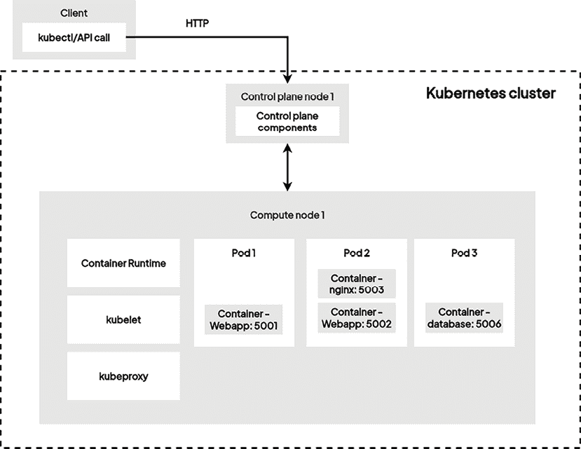
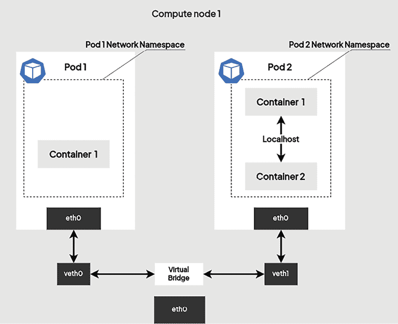
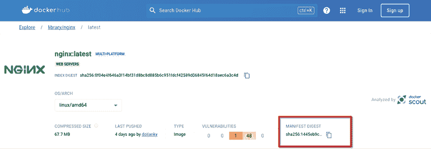
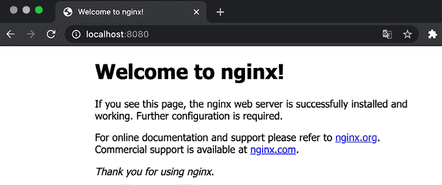
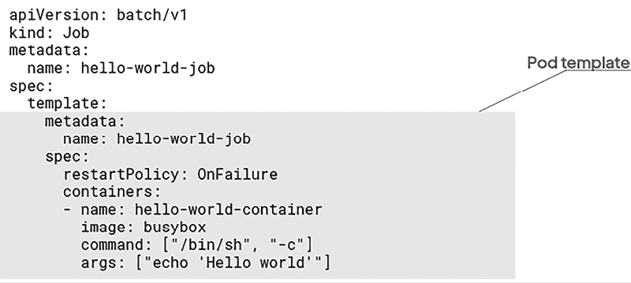
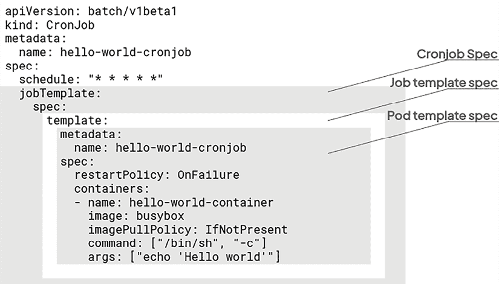

# 4

# 在 Kubernetes 中运行你的容器

本章可能是本书中最重要的一章。在这里，我们将讨论 **Pods** 的概念，Pods 是 Kubernetes 用来启动应用程序容器的对象。Pods 是 Kubernetes 的核心，掌握它们至关重要。

在*第三章*，*安装你的第一个 Kubernetes 集群*中，我们提到过 Kubernetes API 定义了一组表示计算单元的资源。Pods 是在 Kubernetes API 中定义的资源，表示一个或多个容器。我们从不直接使用 Kubernetes 创建容器，而是总是创建 Pods，这些 Pods 会在 Kubernetes 集群的计算节点上*转化*为容器。

起初，理解 Kubernetes Pods 和容器之间的关系可能会有些困难，这就是为什么我们要解释什么是 Pods 以及为什么我们使用 Pods 而不是直接使用容器的原因。Kubernetes Pod 可以包含一个或多个应用程序容器。但在本章中，我们将重点讨论只包含一个容器的 Kubernetes Pod。接下来，在下一章中，我们将有机会了解包含多个容器的 Pods。

我们将使用**BusyBox**镜像来创建、删除和更新 Pods，BusyBox 是一个基于 Linux 的镜像，包含许多在运行测试时有用的工具。我们还将基于 NGINX 容器镜像启动一个 Pod 来启动 HTTP 服务器。我们将探索如何通过 `kubectl` 提供的端口转发功能访问默认的 NGINX 主页。这将有助于我们通过 Web 浏览器访问和测试在 Kubernetes 集群中运行的 Pods。

然后，我们将探索如何为 Pods 添加标签和注释，使它们更易于访问。这将帮助我们组织 Kubernetes 集群，以确保集群尽可能清晰。最后，我们将介绍两个额外的资源，分别是 **Jobs** 和 **CronJobs**。到本章结束时，你将能够启动第一个由 Kubernetes 管理的容器，这是成为 Kubernetes 大师的第一步！

本章中我们将讨论以下主要内容：

+   让我们来解释一下 Pods 的概念

+   启动你的第一个 Pod

+   给 Pods 添加标签和注释

+   启动你的第一个 Job

+   启动你的第一个 CronJob

# 技术要求

为了跟随本章中的示例，你需要以下资源：

+   一个正确配置的 Kubernetes 集群，以便你可以在阅读时实践文中的命令。无论是 minikube、Kind、GKE、EKS 还是 AKS 集群，都无关紧要。

+   本地机器上安装了可用的 `kubectl`。你可以选择多个节点，但至少需要一个 `Ready` 节点才能保证 Kubernetes 设置正常运行。

你可以从官方 GitHub 仓库下载本章的最新代码示例，链接：[`github.com/PacktPublishing/The-Kubernetes-Bible-Second-Edition/tree/main/Chapter04`](https://github.com/PacktPublishing/The-Kubernetes-Bible-Second-Edition/tree/main/Chapter04)

# 让我们来解释一下 Pods 的概念

在这一部分，我们将从理论角度解释 Pods 的概念。Pods 有一些特性，必须理解这些特性，如果你想掌握它们的话。

## 什么是 Pods？

当你想通过 Kubernetes 创建、更新或删除容器时，你是通过 Pod 来实现的。Pod 是一个或多个你希望在同一台机器上、同一个 Linux 命名空间中启动的容器组。这是理解 Pods 的第一个规则：它们可以由一个或多个容器组成，但所有属于同一个 Pod 的容器都会在同一个工作节点上启动。Pod 不能，也*永远不会*跨多个工作节点：这是一个绝对的规则。

但是，为什么我们要将容器的管理委托给这个中介资源呢？毕竟，Kubernetes 本可以有一个容器资源，直接启动一个单独的容器。原因是，容器化让你在思考时应该更多关注 Linux 进程，而不是虚拟机。你可能已经知道，容器最大的反模式之一就是将容器当作虚拟机的替代品：过去，你通常会将所有进程安装并部署在虚拟机上。但容器并不是虚拟机的替代品，它们并不设计用来运行多个进程。

容器技术要求你遵循一条黄金法则：*容器和 Linux 进程之间应该有一一对应的关系*。也就是说，现代应用通常由多个进程组成，而不仅仅是一个进程，因此在大多数情况下，单独使用一个容器不足以运行一个功能齐全的微服务。这意味着这些进程，也就是容器，应该能够通过共享文件系统、网络等进行相互通信。这正是 Kubernetes Pods 所提供的功能：让你能够逻辑上地组织容器。构成应用的所有容器/进程应当被分组到同一个 Pod 中。这样，它们就会一起启动，并在促进进程间和容器间通信时，受益于所有相关功能。



图 4.1：容器和 Pods

为了帮助你理解这一点，假设你有一个在虚拟机上运行的 WordPress 博客，并且你想将这台虚拟机转换成一个 WordPress Pod，来在 Kubernetes 集群中部署你的博客。WordPress 是最常见的软件之一，是一个完美的示例，用来说明 Pods 的必要性。这是因为 WordPress 需要多个进程才能正常工作。

WordPress 是一个 PHP 应用程序，需要 Web 服务器和 PHP 解释器才能工作。我们来列举一下 WordPress 在 Linux 上运行时所需的进程：

+   **NGINX HTTP 服务器**：它是一个 Web 应用程序，因此需要一个 HTTP 服务器进程来接收并提供服务器的博客页面。NGINX 是一个非常好的 HTTP 服务器，能够完美地完成这项工作。

+   **PHP-FastCGI-Process-Manager (FPM) 解释器**：它是用 PHP 编写的博客引擎，因此需要 PHP 解释器才能工作。

NGINX 和 PHP-FPM 是两个进程：它们是两个二进制文件，需要分别启动，但它们需要能够协同工作。在虚拟机上，这项工作很简单：只需在虚拟机上安装 NGINX 和 **PHP-FPM**，并通过 Unix 套接字使它们进行通信。你可以通过配置 `/etc/nginx.config` 文件告诉 NGINX，PHP-FPM 的 Linux 套接字是可访问的。

在容器世界中，情况变得更加复杂，因为将这两个进程运行在同一个容器中是一种反模式：你必须运行两个容器，每个容器运行一个进程，而且它们需要能够互相通信并共享一个公共目录，以便它们都能够访问应用程序代码。为了解决这个问题，你必须使用 Docker 网络层，使 NGINX 容器能够与 PHP-FPM 容器进行通信。然后，你还需要使用卷挂载来在这两个容器之间共享 WordPress 的代码。你可以通过一些 Docker 命令做到这一点，但现在想象一下它在生产环境中的规模，涉及多个机器、多个环境等等。在裸 Docker 中实现进程间通信是可能的，但在大规模环境中实现这一点，同时保持所有生产相关的要求，是非常困难的。随着大量微服务的管理，分布在不同的机器上，管理所有这些 Docker 网络、卷挂载等将变得非常复杂。正如你可以想象的那样，这正是 Kubernetes Pod 资源解决的问题。Pods 非常有用，因为它们封装了多个容器，并实现了简单的进程间通信。以下是 Pods 为你带来的核心优势：

+   同一 Pod 中的所有容器可以通过 localhost 相互访问，因为它们共享相同的网络命名空间。

+   同一 Pod 中的所有容器共享相同的端口空间。

+   你可以将卷附加到 Pod，然后将卷挂载到底层容器中，使它们能够共享目录和文件位置。

利用 Kubernetes 带来的优势，你可以轻松配置你的 WordPress 博客，只需创建一个运行两个容器的 Pod：NGINX 和 PHP-FPM。由于它们可以在 localhost 上相互访问，因此它们之间的通信非常简单。然后，你可以使用卷将 WordPress 的代码暴露给这两个容器。

最复杂的应用程序将强制要求多个容器，因此最好将它们分组在同一个 Pod 内，这样 Kubernetes 就可以将它们一起启动。请记住，Pod 只有一个目的：简化大规模的容器间（或进程间）通信。

话虽如此，只有一个容器的 Pod 并不罕见。但无论如何，Pod 是 Kubernetes API 提供的最低抽象级别，也是你将与之交互的对象。

最后，请注意，手动在 Kubernetes 集群管理的机器上启动的容器，Kubernetes 不会将其视为它所管理的容器。它会变成一种*孤立*容器，超出了调度器的管理范围。Kubernetes 仅管理通过其 Pod API 启动的容器。

## 每个 Pod 都会获得一个 IP 地址

单个 Pod 内的容器能够通过 localhost 相互通信，但 Pods 之间也能够相互通信。每个 Pod 在启动时会获得一个私有 IP 地址。每个 Pod 可以通过其 IP 地址与集群中的任何其他 Pod 进行通信。

Kubernetes 使用平面网络模型，该模型由一个名为 **容器网络接口**（**CNI**）的组件实现。CNI 充当容器化应用程序和 Kubernetes 集群内底层网络基础设施之间的标准化桥梁。这消除了为每个容器配置自定义网络的需要，从而简化了通信和数据流。

CNI 利用灵活的插件架构。这些插件使用各种语言编写，通过标准输入/输出与容器运行时通信。插件规范定义了一个清晰的接口，用于网络配置、IP 地址分配和跨多个主机的连接维护。容器运行时调用这些插件，从而在 Kubernetes 环境内实现容器网络的动态管理和更新。这种方法确保了容器化应用程序的无缝和适应性强的网络连接。

以下图表展示了 Pods 与容器之间的高层次通信流程。



图 4.2：容器与 Pod 的通信

## 你应该如何设计你的 Pods？

尽管理解 Pods 至关重要，但在 Kubernetes 的实际应用中，大多数团队会利用一个更强大的构件：部署（Deployment）。部署提供了一个更高级别的抽象，用于管理 Pods。它们自动化了任务，如扩展和在故障时重新启动 Pods，确保应用程序体验更加稳健和可管理。稍后我们将深入讨论部署，但现在先让我们探索 Pods API，巩固对这些基础构建块的理解。

所以，关于 Pods 的第二条黄金法则是：它们应该容易被销毁并重新创建。Pods 可以自愿或非自愿地被销毁。例如，如果某个工作节点运行了四个 Pods，并且该节点发生故障，则每个底层容器都会变得不可访问。因此，您应该能够随时销毁和重新创建 Pods，而不会影响应用的稳定性。实现这一点的最佳方法是在构建 Pods 时遵循两条简单的设计规则：

+   一个 Pod 应该包含启动应用所需的所有内容。

+   一个 Pod 应该将任何类型的状态存储在 Pod 外部，使用外部存储（PersistentVolume）。

当您开始设计 Kubernetes 上的 Pods 时，很难确切知道一个 Pod 应该包含什么，不该包含什么。解释起来相当简单：一个 Pod 必须包含一个应用或一个微服务。以我们之前提到的 WordPress Pod 为例：该 Pod 应该包含启动 WordPress 所需的 NGINX 和 PHP-FPM 容器。如果这样的 Pod 失败，我们的 WordPress 将无法访问，但重新创建该 Pod 会使 WordPress 再次可用，因为 Pod 包含了运行 WordPress 所需的一切。

也就是说，每个现代应用都会利用外部存储来存储其状态，数据库存储，例如 Redis 或 MySQL，或者通过调用另一个微服务应用来存储状态。WordPress 本身也这么做——它使用 MySQL（或 MariaDB）来存储和检索您的帖子。所以，您还需要在某个地方运行一个 MySQL 容器。这里有两种解决方案：

+   您将 MySQL 容器作为 WordPress Pod 的一部分运行。

+   您将 MySQL 容器作为专用 MySQL Pod 的一部分运行。

两种解决方案都可以使用，但第二种更为推荐。一个好主意是将您的应用（在这里是 WordPress，但明天可能是一个微服务）与其数据库或逻辑层解耦，分别运行在两个独立的 Pods 中。记住，Pods 之间是可以通信的。您可以通过将一个 Pod 专门用于运行 MySQL，并将其 Pod IP 地址提供给您的 WordPress 博客，从中获益。

通过将数据库层与应用分离，您可以提高设置的稳定性：应用 Pod 崩溃不会影响数据库。

总结来说，将应用层合并在同一个 Pod 中会导致三个问题：

+   数据持久性

+   可用性

+   稳定性

这就是为什么建议尽可能保持应用 Pods 无状态，通过将其状态存储在独立的 Pod 中来实现。通过将数据层视为一个独立的应用，并具有自己的开发和管理生命周期，我们可以实现解耦架构。这种分离使得数据层可以独立扩展、更新和测试，而不会影响应用代码本身。

**有状态的单体应用**

尽管有一些特殊的使用场景，但在 2024 年，通常不建议在 Kubernetes 上运行快速变化的单体有状态工作负载，因为在容器中管理单体应用程序的复杂性、在快节奏环境中频繁更新的潜在低效性，以及与传统部署相比，持续存储需求带来的更高管理开销。

**通过 IP 地址访问 Pods**

您可以使用 Pod 的 IP 地址来访问它们；然而，这不是与正在运行的应用程序交互的推荐方法。在接下来的章节中，我们将深入探讨 Service 资源，它在将 IP 地址映射到 Pods 中发挥着至关重要的作用。敬请关注如何通过 Services 提高 Pod 可访问性和应用程序之间的通信的详细解释。

现在，让我们启动我们的第一个 Pod。创建一个 WordPress Pod 目前过于复杂，所以我们先从启动一些 NGINX Pods 开始，看看 Kubernetes 如何管理容器。

# 启动您的第一个 Pods

在本节中，我们将解释如何在 Kubernetes 集群中创建我们的第一个 Pods。Pods 有一些特殊性，必须理解这些特性才能很好地掌握它们。

目前我们不会在您的 Kubernetes 集群上创建资源；相反，我们将简单地解释什么是 Pods。在下一节中，我们将开始构建我们的第一个 Pods。

## 使用命令式语法创建 Pod

在本节中，我们将基于 NGINX 镜像创建一个 Pod。我们需要两个参数来创建一个 Pod：

+   Pod 的名称，由您随意定义

+   用于构建其基础容器的容器镜像

与 Kubernetes 中的几乎所有内容一样，您可以使用两种可用的语法来创建 Pods：命令式语法和声明式语法，您在*第二章*，*Kubernetes 架构 – 从容器镜像到运行的 Pods*中已经了解过。提醒一下，命令式语法是直接从终端运行 `kubectl` 命令，而声明式语法则需要编写一个包含 Pod 配置信息的 YAML 文件，然后使用 `kubectl apply -f` 命令应用该文件。

要在 Kubernetes 集群上创建 Pod，您必须使用 `kubectl run` 命令。这是启动 Pod 在 Kubernetes 集群上运行的最简单和最快的方法。下面是如何调用此命令：

```
$ kubectl run nginx-pod --image nginx:latest 
```

在此命令中，Pod 的名称设置为 `nginx-pod`。这个名称非常重要，因为它是指向该 Pod 的标识：当您需要对这个 Pod 执行 `update` 或 `delete` 命令时，必须指定这个名称，以告知 Kubernetes 应在哪个 Pod 上执行该操作。`--image` 标志将用于指定该 Pod 将要运行的容器。一旦 Pod 被集群创建，您可以通过以下方式检查其状态：

```
$ kubectl get pods
NAME        READY   STATUS    RESTARTS   AGE
nginx-pod   1/1     Running   0          79s 
```

立即创建一个 Pod 并非即时完成。如果容器镜像在本地不可用，Kubernetes 可能需要从注册表拉取该镜像并配置 Pod 的环境。要实时跟踪此过程，请使用`kubectl get po -w`命令，该命令显示 Pod 的信息并自动刷新。

在这里，您告诉 Kubernetes 基于 Docker Hub 上托管的`nginx:latest`容器镜像构建一个 Pod。这个`nginx-pod` Pod 只包含一个基于这个`nginx:latest`镜像的容器：在此处不能指定多个镜像；这是命令式语法的一个限制。

如果您想要构建一个包含多个容器的 Pod，这些容器由几个不同的容器镜像构建而成，那么您将不得不通过声明性语法编写一个 YAML 文件。

### 标签与摘要 – 确保镜像一致性

在创建 Pod 时，您可能会遇到标签和摘要的引用。两者都用于标识容器镜像，但有一个关键区别：

+   **标签**：将标签视为镜像版本的可读名称。它们可以更改为指向相同镜像的不同版本，可能会导致意外行为。

+   **摘要**：这些是镜像的唯一指纹，确保您始终引用确切的所需版本。这对于安全性和可重现性至关重要，特别是考虑到潜在的软件供应链攻击。

例如，而不是使用`nginx:latest`（标签），您可能使用`nginx@sha256:1445eb9c6dc5e9619346c836ef6fbd6a95092e4663f27dcfce116f051cdbd232`（摘要）。您可以从注册表本身获取容器镜像的摘要信息，或者使用`podman manifest inspect nginx:latest`命令。



图 4.3：从容器注册表获取镜像摘要

这确保您部署具有唯一`abcd1234`哈希的特定镜像版本。这种做法在安全和可靠部署方面变得越来越重要。

让我们学习如何在下一节中使用 YAML 声明创建 Pod。

## 使用声明性语法创建 Pod

使用声明性语法创建 Pod 也很简单。您只需创建一个包含 Pod 定义的 YAML 文件，并使用`kubectl apply -f`命令将其应用于您的 Kubernetes 集群。

请记住，Kubernetes 不能在同一命名空间（例如，在我们的情况下是`default`命名空间）中运行两个具有相同名称的 Pod：Pod 的名称是唯一标识符，用于识别命名空间内的 Pod。在创建新 Pod 与前一步骤中相同名称的 Pod 之前，您需要删除现有的 Pod：

```
$ kubectl delete pod nginx-pod
pod "nginx-pod" deleted 
```

这里是`nginx-pod.yaml`文件的内容，您可以在本地工作站上创建：

```
apiVersion: v1
kind: Pod
metadata:
  name: nginx-pod
spec:
  containers:
    - name: nginx-container
      image: nginx:latest 
```

尝试阅读此文件并理解其内容。YAML 文件仅包含键值对。Pod 的名称是`nginx-Pod`，然后我们在文件的`spec:`部分有一个容器数组，该数组仅包含从`nginx:latest`镜像创建的一个容器。容器本身的名称是`nginx-container`。

一旦保存了`nginx-Pod.yaml`文件，请运行以下命令以创建 Pod：

```
$ kubectl apply -f nginx-pod.yaml
pod/nginx-pod created 
```

如果您的集群中已经存在名为`nginx-pod`的 Pod，则此命令将失败。尝试编辑 YAML 文件以更新 Pod 的名称，然后再次应用它。

### Kubernetes 中的命名空间

在资源创建过程中，如果您忘记指定命名空间，则默认为默认命名空间。敬请关注第六章，《Kubernetes 中的命名空间、配额和多租户限制》，我们将深入探讨 Kubernetes 命名空间的重要性。

## 读取 Pod 的信息和元数据

此时，您的 Kubernetes 集群应该已经运行了一个 Pod。在这里，我们将尝试读取其信息。随时，我们需要能够检索和阅读有关在您的 Kubernetes 集群上创建的资源的信息；这对于 Pods 尤其重要。可以通过两个`kubectl`命令实现读取 Kubernetes 集群的操作：`kubectl get`和`kubectl describe`。让我们来看看它们：

+   `kubectl get`：`kubectl get`命令是一个列表操作；您可以使用此命令列出一组对象。还记得我们在上一章节中描述的所有安装过程后列出集群节点的情况吗？我们使用了`kubectl get nodes`命令。该命令通过要求您传递想要列出的对象类型来工作。在我们的情况下，将是`kubectl get pods`操作。在接下来的章节中，我们将发现其他对象，如`configmaps`和`secrets`。要列出它们，您需要键入`kubectl get configmaps`；对其他对象类型也是如此。例如，`nginx-pod`可以按以下方式列出：

    ```
    $ kubectl get pods 
    ```

+   `kubectl describe`：`kubectl describe`命令有所不同。它旨在检索已从其种类和对象名称标识的一个特定对象的完整信息集。您可以使用`kubectl describe pods nginx-pod`检索我们之前创建的 Pod 的信息。调用此命令将返回关于该特定 Pod 的全部可用信息，例如其 IP 地址。要查看`nginx-pod`的详细信息，可以使用以下命令：

    ```
    $ kubectl describe pod nginx-pod
    Name:             nginx-pod
    Namespace:        default
    ...<removed for brevity>...
    Containers:
      nginx-container:
        Container ID:   containerd://3afbbe30b51b77994df69f4c4dbefb02fc304efb2bf0f5bdb65a65
    1154a8e311
        Image:          nginx:latest
    ...<removed for brevity>...
    Conditions:
      Type                        Status
      PodReadyToStartContainers   True
      Initialized                 True
    ...<removed for brevity>...
    Events:
      Type    Reason     Age   From               Message
      ----    ------     ----  ----               -------
    ...<removed for brevity>...
      Normal  Created    112s  kubelet            Created container nginx-container
      Normal  Started    112s  kubelet            Started container nginx-container 
    ```

从前面的命令输出中，您可以读取大量信息，包括以下内容：

+   **Pod 名称和命名空间**：这标识了您请求信息的特定 Pod（例如，`nginx-pod`）。

+   **容器详细信息**：列出 Pod 内的容器信息，包括镜像名称、资源请求/限制和当前状态。

+   **Pod 状态**：显示 Pod 的当前操作状态（例如，Running、Pending、CrashLoopBackOff）。

+   **事件**：提供与 Pod 生命周期相关的事件历史记录，包括创建、重启或错误。

现在，让我们来看一下在 Kubernetes 中列出和描述对象的一些更高级的选项。

## 以 JSON 或 YAML 格式列出对象

`-o` 或 `--output` 选项是 `kubectl` 命令行中最有用的选项之一。这个选项有一些你必须了解的好处。它允许你自定义 `kubectl` 命令行的输出。默认情况下，`kubectl get pods` 命令将以一种格式化的方式返回你 Kubernetes 集群中的 Pod 列表，方便最终用户查看。你还可以使用 `-o` 选项以 JSON 格式或 YAML 格式检索这些信息：

```
$ kubectl get pods --output yaml # In YAML format
$ kubectl get pods --output json # In JSON format 
```

如果你知道 Pod 的名称，你还可以获取特定的 Pod：

```
$ kubectl get pods <POD_NAME> -o yaml
# OR
$ kubectl get pods <POD_NAME> -o json 
```

通过这种方式，你可以以适合脚本的格式从 Kubernetes 集群中检索和导出数据。

## 使用列出操作备份资源

你还可以使用这些标志来备份你的 Kubernetes 资源。假设你使用命令式方式创建了一个 Pod，因此你没有将 YAML 声明文件存储在计算机上。如果 Pod 失败，重新创建它将变得很困难。`-o`选项帮助我们检索 Kubernetes 中已创建资源的 YAML 声明文件，即使我们是通过命令式方式创建的。要做到这一点，请运行以下命令：

```
$ kubectl get pods/nginx-pod -o yaml > nginx-pod-output.yaml 
```

通过这种方式，你拥有了一个与运行中的集群 `nginx-pod` 资源相对应的 YAML 备份。你可以随时将输出文件与原始 YAML 声明进行比较，并使用 `diff` 命令或其他工具分析差异：

```
$ diff nginx-pod.yaml nginx-pod-output.yaml 
```

有一些工具可以清理 YAML 并获得干净的可用声明输出。例如，`kube-neat` 就是这样一个工具，它可以帮助清理详细输出中的不需要的信息。请参考 [`github.com/itaysk/kubectl-neat`](https://github.com/itaysk/kubectl-neat) 了解更多。

如果发生问题，你将能够轻松地重新创建 Pod。请注意此命令的`nginx-pod`部分。要检索 YAML 声明，你需要指定你要操作的资源。通过将此命令的输出重定向到文件中，你可以轻松地获取并备份 Kubernetes 集群中对象的配置。

## 从列出操作中获取更多信息

还值得提到的是`-o`宽格式，这对你来说非常有用：使用此选项可以将默认输出扩展以添加更多数据。例如，使用它查看`Pods`对象时，你将获得 Pod 所在工作节点的名称：

```
$ kubectl get pods -o wide
NAME        READY   STATUS    RESTARTS   AGE   IP           NODE       NOMINATED NODE   READINESS GATES
nginx-pod   1/1     Running   0          15m   10.244.0.4   minikube   <none>           <none> 
```

请记住，`-o` 选项可以接受许多不同的参数，其中一些要高级得多，比如 `jsonpath`，它允许您直接在 JSON 主体文档上执行排序操作，仅检索特定信息，就像您之前使用过的 `jq` 库，如果您已经编写了一些处理 JSON 解析的 bash 脚本。

## 从外部世界访问 Pod

此时，您的 Kubernetes 集群应包含一个 Pod，其中运行着一个 NGINX HTTP 服务器。现在您应该能够从 web 浏览器访问它。但是，这有点复杂。

默认情况下，您的 Kubernetes 集群不会将其运行的 Pod 暴露给外部世界。为此，您需要使用另一种称为服务的资源，我们将在 *第八章* 中详细介绍如何使用服务公开您的 Pod。不过，`kubectl` 确实提供了一条快速访问集群上正在运行的容器的命令，称为 `kubectl port-forward`。以下是如何使用它：

```
$ kubectl port-forward pod/nginx-pod 8080:80
Forwarding from 127.0.0.1:8080 -> 80
Forwarding from [::1]:8080 -> 80 
```

这条命令非常容易理解：我们告诉 `kubectl` 将本地机器（运行 `kubectl` 的机器）上的端口 `8080` 转发到由 `pod/nginx-Pod` 标识的 Pod 上的端口 `80`。

然后，kubectl 输出一条消息，告诉您它已开始将本地 `8080` 端口转发到 Pod 的 `80` 端口。如果收到错误消息，可能是因为您的本地端口 `8080` 当前正在使用中。尝试设置不同的端口或简单地从命令中删除本地端口，让 `kubectl` 随机选择一个本地端口：

```
$ kubectl port-forward pod/nginx-pod 8080:80
Forwarding from 127.0.0.1:8080 -> 80
Forwarding from [::1]:8080 -> 80 
```

现在，您可以启动浏览器，并尝试访问 `http://localhost:<localport>` 地址，您的情况下是 `http://localhost:8080`：



图 4.4：运行在 Pod 中并可以在本地主机上访问的 NGINX 默认页面，表明端口转发命令已生效

完成测试后，请使用 *Ctrl + C* 命令结束端口转发任务。

## 进入 Pod 内部的容器

当 Pod 被启动时，您可以访问它包含的 Pod。在 Docker 下，执行在运行的容器中执行命令的命令称为 `docker exec`。Kubernetes 通过称为 `kubectl exec` 的命令复制此行为。使用以下命令访问我们早些时候启动的 `nginx-pod` 内部的 NGINX 容器：

```
$ kubectl exec -it nginx-pod -- bash
root@nginx-pod:/# hostname
nginx-pod 
```

运行此命令后，您将进入 NGINX 容器。您可以在这里像处理任何其他容器一样做任何操作。上述命令假设您正在尝试访问的容器中安装了 `bash` 二进制文件。否则，许多容器通常安装了 `sh` 二进制文件，可能会用于访问容器。不要害怕采取完整的二进制路径，就像这样：

```
$ kubectl exec -it nginx-pod -- /bin/bash 
```

测试完成后，请使用 `exit` 命令退出容器的 bash shell：

```
root@nginx-pod:/# exit
exit 
```

重要提示：**容器中的安全性与非 root 用户**

一般建议使用非 root 用户运行容器。你需要限制漏洞可能带来的潜在损害。如果漏洞被利用，非 root 用户对系统的访问权限较少，从而减少影响。此外，遵循最小权限原则，仅授予容器运行所需的权限，从而减少其攻击面。我们将在*第十八章*，*Kubernetes 中的安全性*中探讨安全上下文。

现在，让我们了解如何从 Kubernetes 集群中删除 Pod。

## 删除 Pod

删除 Pod 非常简单。你可以使用`kubectl delete`命令来删除。你需要知道你想删除的 Pod 的名称。在我们的例子中，Pod 的名称是`nginx-pod`。运行以下命令：

```
$ kubectl delete pods nginx-pod
# or...
$ kubectl delete pods/nginx-pod 
```

如果你不知道 Pod 的名称，记得运行`kubectl get pods`命令以获取 Pod 列表，并找到你想删除的 Pod。

你还需要知道一件事：如果你使用声明式语法构建了 Pod，并且仍然拥有其 YAML 配置文件，你可以删除 Pod，而无需知道容器的名称，因为它包含在 YAML 文件中。

运行以下命令，使用声明式语法删除 Pod：

```
$ kubectl delete -f nginx-pod.yaml 
```

在你运行此命令后，Pod 将以相同的方式被删除。

请记住，Pod 所属的所有容器都将被删除。容器的生命周期与启动它的 Pod 的生命周期绑定。如果 Pod 被删除，它管理的容器也会被删除。记得始终与 Pod 交互，而不是直接与容器交互。

至此，我们已经回顾了 Pod 管理中的最重要方面，例如使用命令式或声明式语法启动 Pod，删除 Pod，以及列出和描述它们。现在，我们将介绍 Kubernetes 中 Pod 管理的一个重要方面：标签和注释。

# 对 Pod 进行标签和注释

我们现在将讨论 Kubernetes 的另一个关键概念：标签和注释。标签是你可以附加到 Kubernetes 对象的键值对。标签用于标记你的 Kubernetes 对象，标签的键值对由你定义。一旦 Kubernetes 对象被标记，你就可以构建自定义查询，基于它们所持有的标签检索特定的 Kubernetes 对象。在这一节中，我们将通过`kubectl`与标签交互，给我们的 Pod 分配一些标签。

## 什么是标签，为什么我们需要它们？

你为对象定义的标签由你决定——对此没有具体的规则。这些标签是属性，允许你在 Kubernetes 集群中组织对象。举个非常具体的例子，你可以为一些 Pod 附加一个名为`environment = prod`的标签，然后使用`kubectl get pods`命令列出该环境中的所有 Pod。因此，你可以通过一个命令列出属于生产环境的所有 Pod：

```
$ kubectl get pods --label "environment=production" 
```

如你所见，这可以通过`--label`参数来实现，并且可以使用其`-l`等效参数进行简化：

```
$ kubectl get pods --label "environment=production" 
```

这个命令将列出所有持有名为`environment`且值为`production`的标签的 Pod。当然，在我们的例子中，由于之前创建的 Pod 都没有持有此标签，所以不会找到任何 Pod。你必须在创建 Pod 或其他对象时非常自律，确保每次都设置标签，这也是我们在本书中较早介绍标签的原因：不仅是 Pod 几乎所有 Kubernetes 对象都可以被标记，你应该利用这一特性来保持集群资源的组织和整洁。

你使用标签不仅是为了组织集群，还可以在不同的 Kubernetes 对象之间建立关系：你会注意到，一些 Kubernetes 对象会读取某些 Pod 携带的标签，并根据它们携带的标签执行某些操作。如果你的 Pod 没有标签，或者标签命名不当，或者标签包含错误的值，那么这些机制可能无法按预期工作。

另一方面，使用标签是完全任意的：没有特定的命名规则，也没有 Kubernetes 期望你遵循的约定。因此，你可以根据自己的需要使用标签并构建自己的约定。如果你负责 Kubernetes 集群的管理，你应该强制使用强制标签，并建立一些监控规则，以便快速识别没有标签的资源。

请记住，标签的字符数限制为 63 个；它们旨在简短。以下是一些你可以使用的标签示例：

+   `environment`（`prod`、`dev`、`uat`等）

+   `stack`（`blue`、`green`等）

+   `tier`（`frontend`和`backend`）

+   `app_name`（`wordpress`、`magento`、`mysql`等）

+   `team`（`business`和`developers`）

标签不要求在对象之间唯一。例如，也许你想列出所有属于生产环境的 Pod。在这里，集群中可以同时存在具有相同标签键值对的多个 Pod 而不会引发问题——如果你希望查询列表正常工作，甚至建议这么做。例如，如果你想列出所有属于 prod 环境的资源，应该在多个资源上创建一个名为`environment = prod`的标签。接下来，让我们看一下注解，它是另一种为 Pod 分配元数据的方式。

## 注解是什么，它们与标签有何不同？

Kubernetes 还使用另一种元数据类型，称为**注解**。注解与标签非常相似，因为它们也是键值对。然而，注解与标签的用途不同。标签旨在识别资源并建立它们之间的关系，而注解用于提供有关定义在其上的资源的上下文信息。

例如，当你创建一个 Pod 时，可以添加一个注解，包含支持团队的电子邮件地址，以便在该应用无法正常工作时进行联系。这个信息应该放在注解中，而与标签无关。

尽管强烈建议在可能的地方定义标签，但你可以省略注解：它们对集群的操作比标签重要性要低。不过，要注意，某些 Kubernetes 对象或第三方应用程序通常会读取注解并将其作为配置使用。在这种情况下，它们对注解的使用将在其文档中明确说明。

## 添加标签

在本节中，我们将学习如何向 Pod 添加和移除标签和注解。我们还将学习如何修改已经存在于集群中的 Pod 的标签。

让我们以之前使用的基于 NGINX 镜像的 Pod 为例。我们将在这里重新创建它，并添加一个名为 `tier` 的标签，值为 `frontend`。这是用于此操作的 `kubectl` 命令：

```
$ kubectl run nginx-pod --image nginx --labels "tier=frontend" 
```

如你所见，可以使用 `--labels` 参数分配标签。你还可以通过使用 `--labels` 参数和逗号分隔的值，像这样添加多个标签：

```
$ kubectl run nginx-pod --image nginx  --labels="app=myapp,env=dev,tier=frontend" 
```

在这里，`nginx` Pod 将创建两个标签。

`--labels` 标志有一个简写版本 `-l`。你可以使用这个简写使命令更简洁、更易读。标签可以附加到 YAML Pod 定义中。这里是相同的 Pod，包含我们之前创建的两个标签，但这次，它是通过声明式语法创建的：

```
# labelled_pod.yaml
apiVersion: v1
kind: Pod
metadata:
  name: nginx-pod
  labels:
    environment: prod
    tier: frontend
spec:
  containers:
    - name: nginx-container
      image: nginx:latest 
```

考虑一下在 `~/labelled_pod.yaml` 中创建的文件。以下 `kubectl` 命令将以与之前相同的方式创建该 Pod：

```
$ kubectl apply -f ~/labelled_pod.yaml 
```

这次，运行我们之前使用的命令应该至少返回一个 Pod——我们刚刚创建的那个：

```
$ kubectl get pod -l environment=prod
NAME        READY   STATUS    RESTARTS   AGE
nginx-pod   1/1     Running   0          31m 
```

现在，让我们学习如何列出附加到 Pod 的标签。

## 列出附加到 Pod 的标签

没有专门的命令来列出附加到 Pod 的标签，但你可以通过使 `kubectl get pods` 的输出更加详细来实现。通过使用 `--show-labels` 参数，命令的输出将包含附加到 Pod 的标签：

```
$  kubectl get pods --show-labels
NAME        READY   STATUS    RESTARTS   AGE   LABELS
nginx-pod   1/1     Running   0          56s   environment=prod,tier=frontend 
```

该命令并不根据标签执行任何查询；相反，它将标签本身作为输出的一部分显示。

## 向运行中的 Pod 添加或更新标签

现在我们已经学会了如何创建带标签的 Pod，我们将学习如何向正在运行的 Pod 添加标签。你可以随时使用 `kubectl label` 命令来添加、创建或修改资源的标签。在这里，我们将向 `nginx` Pod 添加另一个标签。这个标签名为 `stack`，值为 `blue`：

```
$ kubectl label pod nginx-pod stack=blue
pod/nginx-pod labeled 
```

该命令仅在 Pod 没有名为 `stack` 的标签时有效。执行该命令时，它只能添加一个新标签，而不能更新它。此命令将通过添加一个名为 `stack` 且值为 `blue` 的标签来更新 Pod。运行以下命令以查看更改是否已应用：

```
$ kubectl get pods nginx-pod --show-labels
NAME        READY   STATUS    RESTARTS   AGE   LABELS
nginx-pod   1/1     Running   0          38m   environment=prod,stack=blue,tier=frontend 
```

要更新现有的标签，必须在前面的命令中附加 `--overwrite` 参数。让我们将 `stack=blue` 标签更新为 `stack=green`；请注意 `overwrite` 参数：

```
$ kubectl label pod nginx-pod stack=green --overwrite
pod/nginx-pod labeled 
```

在这里，标签应该已经更新。`stack` 标签的值现在应为 `green`。运行以下命令再次显示 Pod 及其标签：

```
$ kubectl get pods nginx-pod --show-labels
NAME        READY   STATUS    RESTARTS   AGE   LABELS
nginx-pod   1/1     Running   0          41m   environment=prod,stack=green,tier=frontend 
```

使用 `kubectl label` 命令添加或更新标签可能是危险的。正如我们之前提到的，你会根据标签在不同的 Kubernetes 对象之间建立关系。通过更新它们，你可能会破坏其中的一些关系，导致资源的行为不如预期。因此，最好在 Pod 创建时添加标签，并保持 Kubernetes 配置不可变。比起更新已经在运行的配置，销毁并重新创建更为安全。

我们必须做的最后一件事是学习如何删除附加到正在运行的 Pod 上的标签。

## 删除附加到正在运行的 Pod 上的标签

就像我们向正在运行的 Pod 添加和更新标签一样，我们也可以删除它们。这个命令稍微有点复杂。在这里，我们将删除名为 `stack` 的标签，方法是在标签名称后加一个减号符号（`-`）：

```
$ kubectl label pod nginx-pod stack-
pod/nginx-pod unlabeled 
```

在命令末尾添加减号符号可能会让人感觉有些奇怪，但再次运行 `kubectl get pods --show-labels` 命令后，应该能看到 `stack` 标签已消失：

```
$ kubectl get pods nginx-pod --show-labels 
```

现在，让我们在下一部分学习 Kubernetes 中的注解。

## 添加注解

Kubernetes 注解是键值对，你可以将其附加到各种 Kubernetes 对象上，如 Pod、Deployment 和 Service。它们允许你向这些对象添加额外信息，而不改变它们的核心功能。与用于标识和选择的标签不同，注解旨在存储可以供人类阅读或由外部工具使用的附加数据。注解可以包括配置相关信息或创建者的名称等细节。

让我们学习如何向 Pod 添加注解：

```
# annotated_pod.yaml
apiVersion: v1
kind: Pod
metadata:
  annotations:
    tier: webserver
  name: nginx-pod
  labels:
    environment: prod
    tier: frontend
spec:
  containers:
    - name: nginx-container
      image: nginx:latest 
```

在这里，我们仅仅添加了 `tier:` `webserver` 注解，它帮助我们识别该 Pod 正在运行 HTTP 服务器。请记住，这只是添加额外元数据的一种方式。

当你应用这个新配置时，可以使用 `kubectl replace -f` 命令来替换现有的 Pod 配置。

`kubectl replace` 是一个命令，用于使用清单文件更新或替换现有的 Kubernetes 资源。与 `kubectl apply -f` 相比，它提供了一种更强制的方法。`kubectl replace` 命令将现有资源定义替换为清单文件中指定的定义。本质上，它会覆盖现有资源配置。与可能尝试合并更改的 `kubectl apply` 不同，`kubectl replace` 的目的是完全替换。这条命令对于你想要确保资源的配置特定于某种状态时很有用，无论当前状态如何。它也适用于资源定义可能已损坏，需要完全替换的情况。

注解的名称可以以 DNS 名称为前缀。这适用于 Kubernetes 组件，如 `kube-scheduler`，它必须向集群用户表明该组件是 Kubernetes 核心的一部分。前缀可以完全省略，如前面的例子所示。

你可以通过使用 `kubectl` `describe` Pod、`kubectl get po -o yaml` 或者 `jq` 工具来查看注解，具体方法如下：

```
$ kubectl get pod nginx-pod -o json | jq '.metadata.annotations'
{
  "cni.projectcalico.org/containerID": "666d12cd2fb7d6ffe09add73d8466db218f01e7c7ef5315ef0187a675725b5ef",
  "cni.projectcalico.org/podIP": "10.244.151.1/32",
  "cni.projectcalico.org/podIPs": "10.244.151.1/32",
  "kubectl.kubernetes.io/last-applied-configuration": "{\"apiVersion\":\"v1\",\"kind\":\"Pod\",\"metadata\":{\"annotations\":{},\"name\":\"nginx-pod\",\"namespace\":\"default\"},\"spec\":{\"containers\":[{\"image\":\"nginx:latest\",\"name\":\"nginx-container\"}]}}\n"
} 
```

接下来让我们在本章的下一节学习 Kubernetes 中的 Jobs。

# 启动你的第一个 Job

现在，让我们来探索另一个 Kubernetes 资源——Job 资源。 在 Kubernetes 中，计算资源是 Pod，其他一切只是操作 Pods 的中介资源。

这就是 `Job` 对象的情况，它会创建一个或多个 Pods 来完成特定的计算任务，比如运行一个 Linux 命令。

## 什么是 Jobs？

Job 是 Kubernetes API 提供的另一种资源。最终，Job 会创建一个或多个 Pods 来执行你定义的命令。这就是 Jobs 的工作原理：它们启动 Pods。你必须理解两者之间的关系：Jobs 不是独立于 Pods 的，若没有 Pods，它们将毫无意义。最终，它们能做的两件事就是启动 Pods 并管理它们。Jobs 旨在处理特定任务并在完成后退出。以下是 Kubernetes Job 的一些典型用例：

+   数据库备份

+   发送电子邮件

+   消费队列中的一些消息

这些是你不希望永远运行的任务。你希望 Pods 在完成任务后被终止。这时，Jobs 资源将为你提供帮助。

但为什么要使用另一个资源来执行命令呢？毕竟，我们可以直接创建一个或多个 Pods 来运行命令然后退出。

这是事实。你可以使用基于容器镜像的 Pod 来运行你想要的命令，这样是可以正常工作的。然而，Jobs 在它们的层面实现了允许它们以更高级方式管理 Pods 的机制。以下是 Jobs 能够做的一些事情：

+   运行多个 Pods

+   并行运行多个 Pods

+   如果遇到错误，重新尝试启动 Pods

+   在指定的秒数后终止一个 Pod

另一个优点是，job 会管理它所创建的 Pods 的标签，因此你无需直接管理这些 Pods 上的标签。

所有这些都可以在不使用 job 的情况下完成，但这将非常难以管理，这也是 Kubernetes 中有 Jobs 资源的原因。

## 创建具有 restartPolicy 的 job

由于创建 job 可能需要一些高级配置，我们将在此集中讲解声明式语法。这是通过 YAML 创建 Kubernetes job 的方式。我们将简化操作，job 仅仅回显 `Hello world`：

```
# hello-world-job.yaml
apiVersion: batch/v1
kind: Job
metadata:
  name: hello-world-job
spec:
  template:
    metadata:
      name: hello-world-job
    spec:
      restartPolicy: OnFailure
      containers:
      - name: hello-world-container
        image: busybox
        command: ["/bin/sh", "-c"]
        args: ["echo 'Hello world'"] 
```

请注意 `kind` 资源，它告诉 Kubernetes 我们需要创建一个 job，而不是像之前那样创建 Pod。同时，注意 `apiVersion:`，它与创建 Pod 时使用的版本不同。



图 4.5：Job 定义细节与 Pod 模板

你可以使用以下命令创建 job：

```
$ kubectl apply -f hello-world-job.yaml 
```

如你所见，这个 job 将基于 `busybox` 容器镜像创建一个 Pod：

```
$ kubectl get jobs
NAME              COMPLETIONS   DURATION   AGE
hello-world-job   1/1           9s         8m46s 
```

这将运行 `echo 'Hello World'` 命令。最后，`restartPolicy` 选项设置为 `OnFailure`，这告诉 Kubernetes 在 Pod 或容器失败时重新启动它。如果整个 Pod 失败，将重新启动一个新的 Pod。如果容器失败（内存限制已达或出现非零退出代码），该容器会在同一节点上重新启动，因为 Pod 会保持不变，这意味着它仍然会调度到同一台机器上。

`restartPolicy` 参数可以选择两个选项：

+   `Never`

+   `OnFailure`

将其设置为 `Never` 会阻止 job 在失败时重新启动 Pods。调试失败的 job 时，设置 `restartPolicy` 为 `Never` 是个好主意，这有助于调试。否则，新的 Pods 可能会被反复创建，这会让你在调试时更加困难。

在我们的例子中，我们的 job 成功的可能性很大，因为我们只想运行一个简单的 `Hello world`。为了确保我们的 job 成功执行，我们可以按以下方式查看 job 日志：

```
$kubectl logs jobs/hello-world-job
Hello world 
```

我们还可以使用 `kubectl get pods` 命令来检索 job 创建的 Pod 的名称。然后，我们可以使用 `kubectl logs` 命令，如下所示：

```
$  kubectl logs pods/hello-world-job-2qh4d
Hello world 
```

在这里，我们可以看到我们的 job 执行得很好，因为我们能在 Pod 的日志中看到 `Hello world` 消息。但是，如果它失败了呢？嗯，这取决于 `restartPolicy` —— 如果设置为 `Never`，那么什么都不会发生，Kubernetes 不会尝试重新启动 Pods。

然而，如果 `restartPolicy` 设置为 `OnFailure`，Kubernetes 会在 10 秒后尝试重新启动 job，然后在每次失败时将时间加倍。10 秒，20 秒，40 秒，80 秒，依此类推。6 分钟后，Kubernetes 会放弃。

## 理解 job 的 backoffLimit

默认情况下，Kubernetes 任务会在 Pod 失败后的六分钟内尝试重新启动该 Pod 六次。你可以通过修改`backoffLimit`选项来改变这个限制。以下是更新后的 YAML 文件：

```
# hello-world-job-2.yaml
apiVersion: batch/v1
kind: Job
metadata:
  name: hello-world-job-2
spec:
  backoffLimit: 3
  template:
    metadata:
      name: hello-world-job-2
    spec:
      restartPolicy: OnFailure
      containers:
      - name: hello-world-container
        image: busybox
        command: ["/bin/sh", "-c"]
        args: ["echo 'Hello world'"] 
```

这样，任务在失败后只会尝试重新启动 Pod 两次。

## 使用`completions`选项多次运行任务

你也可以指示 Kubernetes 使用`Job`对象多次启动一个任务。你可以通过使用`completions`选项来指定你希望命令执行的次数。在下面的示例中，完成次数将创建 10 个不同的 Pod，它们将依次启动。一旦一个 Pod 完成，下一个 Pod 将启动。以下是更新后的 YAML 文件：

```
# hello-world-job-3.yaml
apiVersion: batch/v1
kind: Job
metadata:
  name: hello-world-job-3
spec:
  backoffLimit: 3
  completions: 10
  template:
    metadata:
      name: hello-world-job-3
    spec:
      restartPolicy: OnFailure
      containers:
      - name: hello-world-container
        image: busybox
        command: ["/bin/sh", "-c"]
        args: ["echo 'Hello world'"] 
```

这里添加了`completions`选项。此外，请注意，我们更新了`args`部分，添加了`sleep 3`选项。使用此选项会让任务在完成前休眠三秒钟，给我们足够的时间注意到下一个 Pod 的创建。一旦你将此配置文件应用到你的 Kubernetes 集群中，你可以运行以下命令：

```
$ kubectl get pods --watch
$ kubectl get jobs -w
NAME                STATUS     COMPLETIONS   DURATION   AGE
hello-world-job-2   Complete   1/1           10s        52s
hello-world-job-3   Running    5/10          49s        49s
hello-world-job-3   Running    5/10          51s        51s
hello-world-job-3   Running    5/10          52s        52s
hello-world-job-3   Running    6/10          52s        52s
hello-world-job-3   Running    6/10          56s        56s
<removed for brevity> 
```

`watch`（`-w` 或 `–watch`）机制将在有新内容到达时更新你的`kubectl`输出，例如新创建的 Pod 被 Kubernetes 管理时。如果你希望等待任务完成，你将看到 10 个 Pod 被创建，每个之间有 3 秒的延迟。

## 并行运行任务多次

`completions`选项确保 Pod 按顺序一个接一个地创建。你也可以使用`parallelism`选项强制并行执行。如果这样做，你可以去掉`completions`选项。Kubernetes 任务可以利用并行性显著加快执行速度。通过并行运行多个 Pod，你将工作负载分配到集群中，从而加快完成时间并提高资源利用率，尤其是在处理大型或复杂任务时。以下是更新后的 YAML 文件：

```
# hello-world-job-4.yaml
apiVersion: batch/v1
kind: Job
metadata:
  name: hello-world-job-4
spec:
  backoffLimit: 3
  parallelism: 5
  template:
    metadata:
      name: hello-world-job-4
    spec:
      restartPolicy: OnFailure
      containers:
      - name: hello-world-container
        image: busybox
        command: ["/bin/sh", "-c"]
        args: ["echo 'Hello world'; sleep 3"] 
```

请注意，`completions`选项已被移除，我们用`parallelism`代替了它。现在，任务会同时启动五个 Pod，并且会并行运行：

```
$ kubectl get pods -w
NAME                      READY   STATUS              RESTARTS   AGE
hello-world-job-4-9dspk   0/1     ContainerCreating   0          7s
hello-world-job-4-n6qv9   0/1     Completed           0          7s
hello-world-job-4-pv754   0/1     ContainerCreating   0          7s
hello-world-job-4-ss4g8   1/1     Running             0          7s
hello-world-job-4-v78cj   1/1     Running             0          7s
...<removed for brevity>... 
```

在下一部分，我们将学习如何在特定时间后自动终止一个任务。

## 在特定时间后终止任务

你也可以决定在特定时间后终止一个 Pod。当你运行一个任务时，可能会用到这个功能，例如，当任务要处理一个队列时。你可以在轮询消息一分钟后自动终止进程。你可以通过使用`activeDeadlineSeconds`参数来实现这一点。以下是更新后的 YAML 文件：

```
# hello-world-job-5.yaml
apiVersion: batch/v1
kind: Job
metadata:
  name: hello-world-job-5
spec:
  backoffLimit: 3
  activeDeadlineSeconds: 60
  template:
    metadata:
      name: hello-world-job-5
    spec:
      restartPolicy: OnFailure
      containers:
      - name: hello-world-container
        image: busybox
        command: ["/bin/sh", "-c"]
        args: ["echo 'Hello world'"] 
```

在这里，不管发生什么，任务将在 60 秒后终止。如果你希望一个进程在特定时间内运行并在之后终止，使用这个功能是个不错的选择。

## 如果任务成功，会发生什么？

如果你的任务完成了，它将保留在 Kubernetes 集群中，并不会自动删除：这是默认行为。原因是，你可以在任务完成很久之后查看它的日志。然而，长时间保留这些任务在 Kubernetes 集群中可能不适合你。你可以通过使用 `ttlSecondsAfterFinished` 选项来自动删除任务及其创建的 Pods。以下是实现此解决方案的更新 YAML 文件：

```
# hello-world-job-6.yaml
apiVersion: batch/v1
kind: Job
metadata:
  name: hello-world-job-6
spec:
  backoffLimit: 3
  ttlSecondsAfterFinished: 30
  template:
    metadata:
      name: hello-world-job-6
    spec:
      restartPolicy: OnFailure
      containers:
      - name: hello-world-container
        image: busybox
        command: ["/bin/sh", "-c"]
        args: ["echo 'Hello world'"] 
```

在这里，任务将在完成后 30 秒被删除。

## 删除一个任务

请记住，创建的 Pods 绑定到其父资源的生命周期。删除任务会导致删除它们管理的 Pods。

首先获取你想要删除的任务的名称。在我们的例子中，它是 `hello-world-job`。否则，可以使用 `kubectl get jobs` 命令来获取正确的名称。然后，运行以下命令：

```
$ kubectl delete jobs hello-world-job 
```

如果你想删除这些任务，但不想删除它们所创建的 Pods，你需要在 `delete` 命令中添加 `--cascade=false` 参数：

```
$ kubectl delete jobs hello-world-job --cascade=false 
```

通过这个命令，你可以清除所有在 Kubernetes 集群中完成后的任务。现在，我们继续讨论如何启动第一个 CronJob。

# 启动你的第一个 CronJob

为了结束关于 Pods 的第一章，我们将介绍另一个 Kubernetes 资源 —— **CronJob**。

## 什么是 CronJobs？

**CronJob** 这个名字可以有两种不同的含义，我们需要明确区分这两者：

+   Unix 的 `cron` 功能

+   Kubernetes 的 `CronJob` 资源

历史上，CronJobs 是使用 Unix 的 cron 功能调度的命令，这是在 Unix 系统中调度命令执行的最强大方法。这个概念后来被引入到 Kubernetes 中。

要小心，因为尽管这两个概念相似，但它们的工作方式完全不同。在 Unix 和其他类似 Unix 的系统中，你是通过编辑一个名为 `Crontab` 的文件来调度命令，通常该文件位于 `/etc/crontab` 或相关路径。而在 Kubernetes 的世界里，事情则有所不同：你不是调度命令的执行，而是调度 Job 资源的执行，而这些 Job 资源会创建 Pod 资源。记住，你创建的 `CronJob` 对象将会创建 Job 对象。

可以将其看作是 Job 资源的一个封装：在 Kubernetes 中，我们称之为控制器。`CronJob` 能做所有 Job 资源能够做的事情，因为它不过是 Job 资源的一个封装，具体取决于所指定的 `cron` 表达式。

好消息是，Kubernetes 的 `CronJob` 资源使用的是从 Unix 继承的 `cron` 格式。所以，如果你已经在 Linux 系统上写过一些 CronJobs，掌握 Kubernetes 的 CronJobs 会变得非常简单。

但首先，为什么你需要执行一个 Pod 呢？答案很简单，这里有一些具体的使用场景：

+   每周日凌晨 1 点定期进行数据库备份

+   每周一下午 4 点清除缓存数据

+   每隔 5 分钟发送一次排队的邮件。

+   各种需要定期执行的维护操作。

Kubernetes CronJobs 的使用场景与 Unix 中的类似 – 它们用于解决相同的需求，但它们提供了一个巨大的优势，即允许你使用已经配置好的 Kubernetes 集群，通过你的容器镜像在现有的 Kubernetes 集群上调度定期任务。

## 准备你的第一个 CronJob

现在是时候创建你的第一个 `CronJob` 了。我们将使用声明式语法来实现。首先，创建一个 `cronjob.yaml` 文件，并将以下 YAML 内容放入其中：

```
# hello-world-cronjob.yaml
apiVersion: batch/v1beta1
kind: CronJob
metadata:
  name: hello-world-cronjob
spec:
  schedule: "* * * * *"
  jobTemplate:
    spec:
      template:
        metadata:
          name: hello-world-cronjob
        spec:
          restartPolicy: OnFailure
          containers:
          - name: hello-world-container
            image: busybox
            imagePullPolicy: IfNotPresent
            command: ["/bin/sh", "-c"]
            args: ["echo 'Hello world'"] 
```

在将该文件应用到 Kubernetes 集群之前，我们先开始解释它。这里有两点非常重要需要注意：

+   `schedule` 键，让你输入 `cron` 表达式

+   `jobTemplate` 部分，实际上就是你在作业 YAML 清单中输入的内容。

在应用这个文件之前，我们先快速解释一下这两个键。

## 理解 schedule 键

`schedule` 键允许你插入一个类似 Linux 中 cron 格式的表达式。我们来解释一下这些表达式是如何工作的；如果你已经知道这些表达式的用法，可以跳过这些解释：

```
# ┌───────────── minute (0 - 59)
# │ ┌───────────── hour (0 - 23)
# │ │ ┌───────────── day of the month (1 - 31)
# │ │ │ ┌───────────── month (1 - 12)
# │ │ │ │ ┌───────────── day of the week (0 - 6) (Sunday to Saturday;
# │ │ │ │ │                                   7 is also Sunday on some systems)
# │ │ │ │ │                                   OR sun, mon, tue, wed, thu, fri, sat
# │ │ │ │ │
# * * * * * 
```

一个 `cron` 表达式由五个条目组成，这些条目通过空格分隔。从左到右，这些条目分别对应以下内容：

+   分钟

+   小时

+   每月的日期

+   月份

+   星期几

每个条目都可以用星号填充，这表示 *每个*。你还可以通过用 `,` 来分隔多个值为一个条目设置多个值。你也可以使用 `–` 输入一个值的范围。让我给你一些示例：

+   “`10 11 * * *`” 表示“每天的 11:10 执行。”

+   “`10 11 * 12 *`” 表示“每年 12 月的每天 11:10 执行。”

+   “`10 11 * 12 1`” 表示“每年 12 月的每个星期一的 11:10 执行。”

+   “`10 11 * * 1,2`” 表示“每个月的每周一和周二的 11:10 执行。”

+   “`10 11 * 2-5 *`” 表示“每年 2 月到 5 月的每天 11:10 执行。”

这里有一些示例可以帮助你理解 cron 的工作原理。当然，你不必记住所有语法：大多数人通过查阅文档或使用在线的 cron 表达式生成器来帮助自己，比如 crontab.cronhub.io 和 crontab.guru。如果觉得这太复杂，可以随时使用这类工具；它可以帮助你在将对象部署到 Kubernetes 前确认你的语法是否有效。

## 理解 jobTemplate 部分的作用

如果你注意到 YAML 文件的结构，可能会发现 `jobTemplate` 键包含了 Job 对象的定义。当我们使用 `CronJob` 对象时，我们实际上是将 Job 对象的创建委托给了 `CronJob` 对象。



图 4.6：CronJob YAML 架构

因此，`CronJob` 对象是一个仅操作另一个资源的资源。

稍后我们将发现许多对象，它们可以帮助我们创建 Pods，这样我们就不需要自己手动创建了。这些特殊的对象被称为**控制器**：它们按照自己的逻辑操作其他 Kubernetes 资源。此外，当你仔细思考时，Job 对象本身也是一个控制器，因为最终它只操作 Pods，通过为 Pods 提供自己的特性，比如并行运行 Pods 的能力。

在实际应用中，你应该始终尝试使用这些中间对象来创建 Pods，因为它们提供了额外的、更高级的管理功能。

尝试记住这个规则：Kubernetes 中的基本单元是 Pod，但你可以将 Pod 的创建委托给许多其他对象。在本节的剩余部分，我们将继续探索*裸 Pod*。稍后我们将学习如何通过控制器来管理 Pod 的创建和管理。

## 控制 CronJob 执行截止时间

由于某些原因，`CronJob`可能无法执行。在这种情况下，Kubernetes 无法在预定的启动时间执行 Job。如果 Job 超过其配置的截止时间，Kubernetes 会将其视为失败。

可选的`.spec.startingDeadlineSeconds`字段设定了一个截止时间（以完整的秒数表示），用于在因任何原因错过预定时间时启动 Job。一旦错过截止时间，Cronjob 会跳过该特定实例的 Job，但未来的执行仍然会被调度。

## 管理 Job 的历史记录限制

Cronjob 完成后，无论其成功与否，你的 Kubernetes 集群都会保留历史记录。历史记录的设置可以在`CronJob`级别进行配置，允许你决定是否保留每个`CronJob`的历史记录。如果你选择保留历史记录，你可以使用可选的`.spec.successfulJobsHistoryLimit`和`.spec.failedJobsHistoryLimit`字段来指定保留成功和失败的 Job 条目的数量。

## 创建一个 CronJob

如果你已经有了 YAML 清单文件，创建一个`CronJob`对象很简单：

```
# hello-world-cronjob.yaml
apiVersion: batch/v1
kind: CronJob
metadata:
  name: hello-world-cronjob
spec:
  schedule: "*/1 * * * *"
  # Run every minute
  successfulJobsHistoryLimit: 5
  startingDeadlineSeconds: 30
  jobTemplate:
    spec:
      template:
        metadata:
          name: hello-world-cronjob
        spec:
          restartPolicy: OnFailure
          containers:
            - name: hello-world-container
              image: busybox
              imagePullPolicy: IfNotPresent
              command: ["/bin/sh", "-c"]
              args: ["echo 'Hello world'"] 
```

请参阅前面 YAML 示例中的详细信息。

`successfulJobsHistoryLimit: 5`指示`CronJob`控制器保留最近的 5 次成功执行的 Job 记录。较早的成功 Job 将被自动删除。

你可以使用`kubectl apply -f`命令来创建`CronJob`，命令如下：

```
$ kubectl apply -f hello-world-cronjob.yaml
cronjob.batch/hello-world-cronjob created 
```

这样，`CronJob`已经在你的 Kubernetes 集群上创建成功。它将启动一个按 YAML 文件配置的调度 Pod；在这个例子中，每分钟执行一次：

```
$  kubectl get cronjobs
NAME                  SCHEDULE      TIMEZONE   SUSPEND   ACTIVE   LAST SCHEDULE   AGE
hello-world-cronjob   */1 * * * *   <none>     False     0        37s             11m
$ kubectl get jobs
NAME                           COMPLETIONS   DURATION   AGE
hello-world-cronjob-28390196   1/1           3s         4m47s
hello-world-cronjob-28390197   1/1           3s         3m47s
hello-world-cronjob-28390198   1/1           3s         2m47s
hello-world-cronjob-28390199   1/1           3s         107s
hello-world-cronjob-28390200   1/1           4s         47s
$ kubectl get pods
NAME                                 READY   STATUS      RESTARTS   AGE
hello-world-cronjob-28390196-fpmc6   0/1     Completed   0          4m52s
hello-world-cronjob-28390197-vkzw2   0/1     Completed   0          3m52s
hello-world-cronjob-28390198-tj6qv   0/1     Completed   0          2m52s
hello-world-cronjob-28390199-dd666   0/1     Completed   0          112s
hello-world-cronjob-28390200-kn89r   0/1     Completed   0          52s 
```

由于你配置了`successfulJobsHistoryLimit: 5`，只有最后的 5 个 Job 或 Pod 会显示出来。

## 删除一个 CronJob

与其他 Kubernetes 资源一样，删除一个`CronJob`可以通过`kubectl delete`命令实现。和之前一样，如果你有 YAML 清单文件，这会非常简单：

```
$ kubectl delete -f ~/cronjob.yaml
cronjob/hello-world-cronjob deleted 
```

这样，`CronJob`就被你的 Kubernetes 集群销毁了。以后将不再启动任何调度的 Job。

# 总结

我们已经结束了本章关于 Pods 以及如何创建 Pods 的内容；希望你觉得有趣。你已经学会了如何使用 Kubernetes 中最重要的对象：Pods。

你在本章中所学到的知识是掌握 Kubernetes 的基础之一：你在 Kubernetes 中所做的一切都是操作 Pods、为它们打标签以及访问它们。但也请记住，在实际的 Kubernetes 环境中，你不会直接创建或修改资源，而是通过其他方法来部署你的应用程序 Pods 和其他资源。此外，你已经看到 Kubernetes 像传统的 API 一样，通过执行 CRUD 操作与集群中的资源进行交互。在本章中，你学习了如何在 Kubernetes 上启动容器，如何通过 `kubectl` 端口转发访问这些容器，如何为 Pods 添加标签和注释，如何删除 Pods，以及如何使用 `CronJob` 资源启动和调度任务。

只要记住关于容器管理的这个规则：任何将在 Kubernetes 中启动的容器，都会通过对象启动。掌握这个对象就像掌握大多数 Kubernetes：其他一切都将围绕 Pods 的管理进行自动化，就像我们用 `CronJob` 对象所做的那样；你已经看到，`CronJob` 对象仅启动 Job 对象，而 Job 对象又启动 Pods。如果你理解了某些对象可以管理其他对象，但最终所有容器都是由 Pods 管理的，那么你就理解了 Kubernetes 背后的哲学，这样你就能轻松地继续使用这个编排工具。

此外，我们鼓励你为 Pods 添加标签和注释，即使你目前看不到它们的必要性。知道良好的标签管理对保持一个干净、结构化且有条理的集群至关重要。

然而，在管理 Pods 方面，你仍然有很多东西需要发现，因为到目前为止，我们仅看到了由一个 Docker 容器组成的 Pods。Pods 的最大优势在于它们允许你同时管理多个容器，当然，为了做好这件事，当 Pods 由多个容器组成时，我们可以遵循几种设计模式来管理我们的 Pods。

在下一章中，我们将学习如何管理由多个容器组成的 Pods。虽然这与我们迄今为止看到的 Pods 非常相似，但你会发现一些小地方不同，且有些不同之处是值得了解的。首先，你将学习如何使用 `kubectl` 启动多容器 Pods（提示：`kubectl` 不会直接生效），然后学习如何让容器之间进行通信。接下来，你将学习如何访问多容器 Pod 中的特定容器，以及如何访问特定容器的日志。最后，你将学习如何在同一个 Pod 中共享卷。

在你阅读下一章时，你将学习 Kubernetes 中 Pods 的其他基础知识。这样，你将对 Pods 有一个概览，同时我们将继续向前迈进，探索 Kubernetes 中其他对部署应用于集群有帮助的对象。

# 进一步阅读

+   **管理 Pods**: [`kubernetes.io/docs/concepts/workloads/pods/`](https://kubernetes.io/docs/concepts/workloads/pods/)

+   **Kubernetes 作业**: [`kubernetes.io/docs/concepts/workloads/controllers/job/`](https://kubernetes.io/docs/concepts/workloads/controllers/job/)

+   **常见标签、注解和污点**: [`kubernetes.io/docs/reference/labels-annotations-taints/`](https://kubernetes.io/docs/reference/labels-annotations-taints/)

+   **Kubernetes CronJob**: [`kubernetes.io/docs/concepts/workloads/controllers/cron-jobs/`](https://kubernetes.io/docs/concepts/workloads/controllers/cron-jobs/)

# 加入我们在 Discord 上的社区

加入我们社区的 Discord 空间，与作者和其他读者进行讨论：

[`packt.link/cloudanddevops`](https://packt.link/cloudanddevops)


