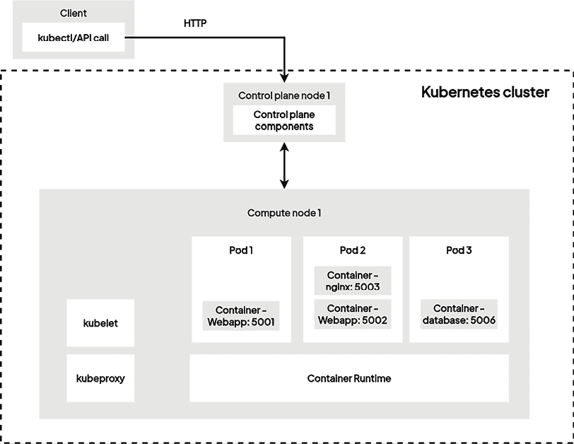
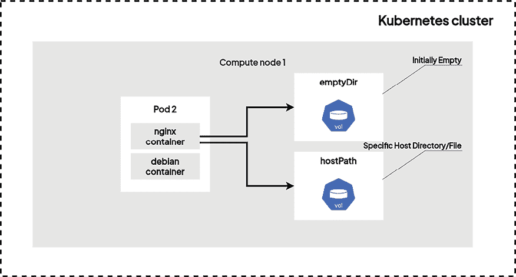
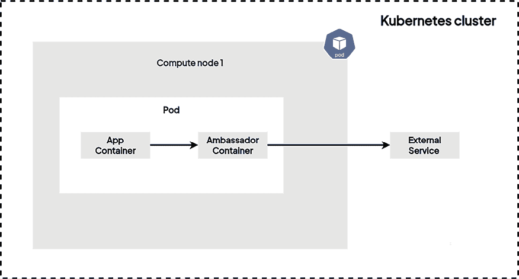
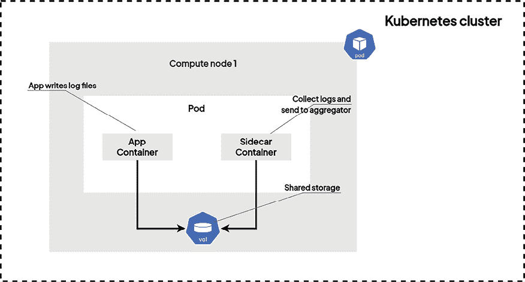
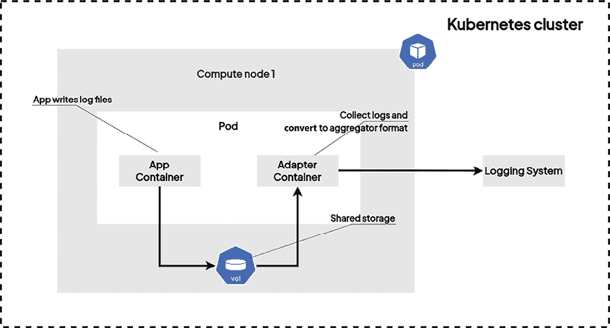

# 第五章：使用多容器 Pod 和设计模式

在 Kubernetes 上运行复杂应用程序需要在同一个 Pod 中运行多个容器，而不仅仅是一个。Kubernetes 的优势也在于它能够创建由多个容器组成的 Pod。本章将重点研究这些 Pod，探讨在同一个 Pod 中托管多个容器的不同方面，以及如何让这些不同的容器彼此通信。

到目前为止，我们只创建了运行单一容器的 Pod：这些是最简单的 Pod 形式，你将使用这些 Pod 来管理最简单的应用程序。我们还发现了如何通过使用 `kubectl` 命令行工具对这些 Pod 执行简单的 **创建**、**读取**、**更新和删除**（**CRUD**）操作来更新和删除它们。

除了掌握 CRUD 操作的基础知识，你还需要学会如何访问 Kubernetes 集群中正在运行的 Pod。

虽然单容器 Pod 更为常见，但也有一些情况，使用单个 Pod 中的多个容器会更有益。例如，在 Pod 内使用专门的容器来处理日志收集，或者使用另一个专用容器来实现服务之间的代理通信。本章将进一步探讨如何管理多个容器的 Pod，并学习如何处理这些 Pod。当 Pod 用于启动不止一个容器时，你所学到的一切都将适用于多容器 Pod。在原始的 Pod 管理方面没有太大不同，因为更新和删除 Pod 的操作没有区别，无论 Pod 包含多少个容器。

除了这些基本操作外，我们还将讲解如何访问多容器 Pod 中的特定容器以及如何访问其日志。当一个 Pod 包含多个容器时，你需要运行一些特定的命令和参数来访问它，这正是我们将在本章中讨论的内容。

我们还将探索一些重要的设计模式，例如大使（Ambassador）、边车（Sidecar）和适配器（Adapter）容器。你需要学习这些架构，以有效管理多容器 Pod。你还将学习如何处理 Kubernetes 中的卷。Docker 也提供卷，但在 Kubernetes 中，卷用于在由同一个 Pod 启动的容器之间共享数据，这将是本章的一个重要部分。学习完本章后，你将能够在 Kubernetes Pod 内启动复杂应用程序。

本章将涵盖以下主要内容：

+   理解多容器 Pod

+   在同一个 Pod 中共享容器之间的卷

+   大使设计模式

+   边车设计模式

+   适配器设计模式

+   边车与 Kubernetes 本地边车

# 技术要求

本章需要以下前置条件：

+   一个有效的 `kubectl` 命令行工具。

+   一个本地或基于云的 Kubernetes 集群用于实践。

你可以从官方 GitHub 仓库下载本章的最新代码示例：[`github.com/PacktPublishing/The-Kubernetes-Bible-Second-Edition/tree/main/Chapter05`](https://github.com/PacktPublishing/The-Kubernetes-Bible-Second-Edition/tree/main/Chapter05)。

# 理解什么是多容器 Pod

多容器 Pod 是将紧密耦合的应用程序打包在一起的方式，适用于 Kubernetes。这使得多个容器可以共享资源并轻松地相互通信，非常适合像边车（sidecar）和服务网格（service mesh）这样的场景。在本节中，我们将通过讨论一些具体的多容器 Pod 示例，来了解管理多个容器时的 Pod 核心概念。

## 需要使用多容器 Pod 的具体场景

当容器需要紧密关联时，你应该将它们分组为一个 Pod。从更广义的角度来看，一个 Pod 必须对应于在 Kubernetes 集群中运行的一个应用程序或进程。如果你的应用程序需要多个容器才能正常工作，那么这些容器应该通过一个 Pod 来启动和管理。

当这些容器需要协同工作时，应该将它们分组为一个 Pod。需要记住的是，Pod 不能跨多个计算节点。因此，如果你创建了一个包含多个容器的 Pod，那么所有这些容器都会被创建在同一个计算节点上。为了理解何时以及如何使用多容器 Pod，可以通过以下两个简单应用程序的示例来进行说明：

+   **日志转发器**：在这个示例中，假设你已经部署了一个如 NGINX 这样的 Web 服务器，并将其日志存储在一个专用目录中。你可能希望收集并转发这些日志。为此，你可以将像 Splunk 转发器这样的工具作为容器，部署在与 NGINX 服务器相同的 Pod 中。

这些日志转发工具用于将日志从源位置转发到目标位置，通常会部署像 Splunk、Fluentd 或 Filebeat 这样的代理，来从容器中获取日志并将其转发到一个中心位置，比如 Elasticsearch 集群。在 Kubernetes 环境中，这通常是通过运行一个多容器 Pod 来实现，其中一个容器专门用于运行应用程序，另一个容器专门用于获取日志并将其发送到其他地方。将这两个容器由同一个 Pod 管理，可以确保它们在同一个节点上启动，并且同时运行。

+   **代理服务器**：想象一个与主应用程序位于同一 Pod 中的 NGINX 反向代理容器，它高效地处理流量路由和安全性，使用自定义规则。这一概念扩展到**服务网格**，在这里像 Envoy 这样的专用代理可以与应用程序容器一起部署，从而在微服务架构中启用负载均衡和服务发现等功能。（我们将在*第八章*《通过服务暴露 Pod》详细学习服务网格。）通过将这两个容器捆绑在同一个 Pod 中，你将得到两个 Pod 运行在同一个节点上。你也可以在同一个 Pod 中运行第三个容器，将其他两个容器发出的日志转发到中央日志位置！这是因为 Kubernetes 对同一个 Pod 中的容器数量没有限制，只要你有足够的计算资源来运行它们。



图 5.1：示例多容器 Pod 场景

通常，每当多个容器一起工作并紧密耦合时，你应该将它们放在一个多容器 Pod 中。

现在，让我们来了解如何创建多容器 Pod。

## 创建一个由两个容器组成的 Pod

在上一章中，我们发现了两种用于操作 Kubernetes 的语法：

+   命令式语法

+   声明式语法

本书中我们将要探索的大多数 Kubernetes 对象都可以通过这两种方法创建或更新，但不幸的是，多容器 Pod 的情况并非如此。

当你需要创建一个包含多个容器的 Pod 时，你需要使用声明式语法。这意味着你需要创建一个 YAML 文件，包含 Pod 及其将管理的所有容器的声明，然后通过`kubectl apply -f file.yaml`来应用它。

请考虑以下存储在`~/multi-container-pod.yaml`中的 YAML 清单文件：

```
# multi-container-pod.yaml
apiVersion: v1
kind: Pod
metadata:
  name: multi-container-pod
spec:
  restartPolicy: Never
  containers:
    - name: nginx-container
      image: nginx:latest
    - name: debian-container
      image: debian
      command: ["/bin/sh"]
      args: ["-c", "while true; do date;echo debian-container; sleep 5 ; done"] 
```

这个 YAML 清单将创建一个由两个容器组成的 Kubernetes Pod：一个基于`nginx:latest`镜像，另一个基于`debian`镜像。

要创建它，请使用以下命令：

```
$ kubectl apply -f multi-container-pod.yaml
pod/multi-container-pod created 
```

这将导致 Pod 被创建。选定节点上的 kubelet 将拥有容器运行时（例如 containerd、CRI-O 或 Docker 守护进程）来拉取两个镜像并实例化两个容器。

为了检查 Pod 是否正确创建，我们可以运行`kubectl get pods`：

```
$ kubectl get pods
NAME                  READY   STATUS    RESTARTS   AGE
multi-container-pod   2/2     Running   0          2m7s 
```

你还记得来自*第二章*《Kubernetes 架构——从容器镜像到运行 Pod》中`kubelet`的角色吗？这个组件运行在 Kubernetes 集群中的每个节点上，负责将从`kube-apiserver`接收到的 Pod 清单转换为实际的容器。

所有在同一个 Pod 中声明的容器都会被调度或启动在同一个节点上，Pod 不能跨多个机器。

相同 Pod 中的容器是共存的。如果终止 Pod，则所有其容器将一同终止；创建 Pod 时，kubelet 至少会尝试一起创建其所有容器。

通常通过在多个节点上复制多个 Pods 来实现高可用性，这是您稍后在本书中将学习的内容。

从 Kubernetes 的角度来看，应用此文件会导致由两个容器组成的完全工作的多容器 Pod，并且可以通过运行标准的 `kubectl get pods` 命令从 `kube-apiserver` 获取 Pod 列表来确保 Pod 正在运行。

您看到前一个 `kubectl` 命令输出中标有 `2/2` 的列了吗？这是 Pod 中的容器数量。在这里，它表示成功启动了两个容器！我们可以查看来自不同容器的日志如下。

```
$ kubectl logs multi-container-pod -c debian-container
Mon Jan  8 01:33:23 UTC 2024
debian-container
Mon Jan  8 01:33:28 UTC 2024
debian-container
...<removed for brevity>...
$ kubectl logs multi-container-pod -c nginx-container
/docker-entrypoint.sh: /docker-entrypoint.d/ is not empty, will attempt to perform configuration
...<removed for brevity>...
2024/01/08 01:33:20 [notice] 1#1: start worker process 39
2024/01/08 01:33:20 [notice] 1#1: start worker process 40 
```

我们学习了如何创建和管理多容器 Pods，接下来，我们将学习当多容器 Pod 失败时如何进行故障排除。

## 当 Kubernetes 无法启动 Pod 中的一个容器时会发生什么？

Kubernetes 记录了在同一 Pod 中启动的所有容器。但经常发生特定容器无法启动的情况。让我们在 YAML 清单中引入一个打字错误，以演示当某些特定 Pod 的容器无法启动时 Kubernetes 的反应。

在以下示例中，我们定义了一个容器镜像，对于 NGINX 容器根本不存在；请注意 `nginx:i-do-not-exist` 标签：

```
# failed-multi-container-pod.yaml
apiVersion: v1
kind: Pod
metadata:
  name: multi-container-pod
spec:
  restartPolicy: Never
  containers:
    - name: nginx-container
      image: nginx:i-do-not-exist
    - name: debian-container
      image: debian
      command: ["/bin/sh"]
      args: ["-c", "while true; do date;echo debian-container; sleep 5 ; done"] 
```

现在，我们可以使用 `kubectl apply -f failed-multi-container-pod.yaml` 命令应用以下容器：

```
$ kubectl apply -f failed-multi-container-pod.yaml
pod/failed-multi-container-pod created 
```

在这里，您可以看到 Pod 已有效创建。这是因为即使存在不存在的镜像，从 Kubernetes 的角度来看，YAML 仍然有效。因此，Kubernetes 简单地创建 Pod 并将条目持久化到 `etcd` 中，但我们可以轻松想象，当 kubelet 尝试从容器注册表（例如 Docker Hub）中检索镜像以启动容器时会遇到错误。

让我们使用 `kubectl get pod` 命令检查 Pod 的状态：

```
$ kubectl get pod
NAME                         READY   STATUS             RESTARTS   AGE
failed-multi-container-pod   1/2     ImagePullBackOff   0          93s 
```

正如您所见，Pod 的状态为 `ImagePullBackOff`。这意味着 Kubernetes 正试图启动 Pod，但由于镜像访问问题而失败。要查明失败原因，您必须使用以下命令描述 Pod：`kubectl describe pod failed-multi-container-pod`。

```
$  kubectl describe pod failed-multi-container-pod
Name:             failed-multi-container-pod
Namespace:        default
...<removed for brevity>...
Events:
  Type     Reason     Age                    From               Message
  ----     ------     ----                   ----               -------
...<removed for brevity>...
  Warning  Failed     5m23s (x3 over 6m13s)  kubelet            Error: ErrImagePull
  Warning  Failed     4m55s (x5 over 6m10s)  kubelet            Error: ImagePullBackOff
  Normal   Pulling    4m42s (x4 over 6m17s)  kubelet            Pulling image "nginx:i-do-not-exist"
  **Warning  Failed     4m37s (x4 over 6m13s)  kubelet            Failed to pull image "nginx:i-do-not-exist": Error response from daemon: manifest for nginx:i-do-not-exist not found: manifest unknown: manifest unknown**
  Normal   BackOff    75s (x19 over 6m10s)   kubelet            Back-off pulling image "nginx:i-do-not-exist" 
```

稍微有点难以阅读，但通过跟随此日志，您可以看到 `debian-container` 是正常的，因为 `kubelet` 已成功创建它，如前一输出的最后一行所示。但另一个容器存在问题，即 `nginx-container`。

在这里，您可以看到输出错误为 `ErrImagePull`，正如您猜测的那样，它表示无法启动容器，因为镜像拉取无法检索到 `nginx:i-do-not-exist` 镜像标签。

因此，Kubernetes 执行以下操作：

1.  首先，如果 YAML 文件中的 Pod 有效，它会在 `etcd` 中创建条目。

1.  然后，它只是尝试启动容器。

1.  如果遇到错误，它将反复尝试重新启动失败的容器。

如果其他容器正常工作也没问题。然而，由于失败的容器，你的 Pod 永远无法进入 `Running` 状态。毕竟，你的应用程序肯定需要失败的容器才能正常工作；否则，这个容器根本不该存在！

现在，让我们学习如何删除一个多容器 Pod。

## 删除多容器 Pod

当你想删除包含多个容器的 Pod 时，你必须通过`kubectl delete`命令，就像删除单容器 Pod 一样。

然后，你有两个选择：

+   你可以通过使用 `-f` 选项来指定 YAML 清单文件的路径。

+   如果你知道 Pod 的名称，可以不使用 YAML 路径直接删除它。

第一种方式是指定 YAML 清单文件的路径。你可以使用以下命令来执行：

```
$ kubectl delete -f multi-container-pod.yaml 
```

否则，如果你已经知道 Pod 的名称，可以按以下方式进行操作：

```
$ kubectl delete pods/multi-pod
$ # or equivalent
$ kubectl delete pods multi-pod 
```

要弄清楚 Pod 的名称，可以使用 `kubectl get` 命令：

```
$ kubectl get pod
NAME                         READY   STATUS             RESTARTS   AGE
failed-multi-container-pod   1/2     ImagePullBackOff   0          13m 
```

当我们运行它们时，集群中只创建了 `failed-multi-container-pod`，所以你在输出中只看到一行。

这里是如何在不指定创建它的 YAML 文件的情况下命令式地删除 `failed-multi-container-pod`：

```
$ kubectl delete -f failed-multi-container-pod.yaml
pod "failed-multi-container-pod" deleted 
```

几秒钟后，Pod 会从 Kubernetes 集群中移除，所有容器也会从容器守护进程和 Kubernetes 集群节点中移除。

在命令发出之前，Pod 的名称被删除并释放的时间称为 **宽限期**。让我们来了解如何处理它！

## 理解 Pod 删除的宽限期

删除 Pods 相关的一个重要概念是所谓的宽限期。单容器 Pod 和多容器 Pod 都有这个宽限期，在删除它们时可以观察到。通过传递 `--grace-period=0 --force` 选项到 `kubectl delete` 命令，可以忽略这个宽限期。

在删除 Pod 的过程中，某些 `kubectl` 命令会显示其状态为 `Terminating`。值得注意的是，这个 `Terminating` 状态并不属于标准的 Pod 阶段。Pod 会被分配一个专门的宽限期以实现优雅终止，通常设置为 30 秒。要强制终止 Pod，可以使用 `--force` 标志。当通过设置 `--grace-period=0` 和 `--force` 标志来强制删除时，Pod 的名称会立即释放，并可供另一个 Pod 使用。在非强制删除的情况下，宽限期会被尊重，Pod 的名称会在其被有效删除后释放。

```
$ kubectl delete pod failed-multi-container-pod --grace-period=0 --force
Warning: Immediate deletion does not wait for confirmation that the running resource has been terminated. The resource may continue to run on the cluster indefinitely.
pod "failed-multi-container-pod" force deleted 
```

如果你不知道自己在做什么，使用这个命令时需要小心。强制删除 Pod 不应被视为常规操作，因为正如输出所示，你无法确保 Pod 已被有效删除。如果由于某种原因 Pod 无法被删除，它可能会无限期运行，因此如果你不确定该怎么做，请不要运行这个命令。

现在，让我们来了解如何访问运行在多容器 Pod 中的特定容器。

## 访问多容器 Pod 中的特定容器

当你在同一个 Pod 中有多个容器时，可以单独访问每个容器。在这里，我们将访问我们多容器 Pod 中的 NGINX 容器。让我们从重新创建它开始，因为我们在之前的例子中已经删除了它：

```
$ kubectl apply -f multi-container-pod.yaml
pod/multi-container-pod created 
```

要访问一个正在运行的容器，你需要使用 `kubectl exec` 命令，就像在没有 Kubernetes 的 Docker 环境中使用 `docker exec` 在已创建的容器中启动命令一样。

该命令会要求提供两个重要参数：

+   包裹你想要访问的容器的 Pod

+   容器本身的名称，如 YAML 清单文件中所写的那样

我们已经知道 Pod 的名称，因为我们可以轻松地通过 `kubectl get` 命令检索它。在我们的例子中，Pod 被命名为 `multi-container-pod`。

然而，我们无法获取容器的名称，因为没有 `kubectl get` 容器命令来列出正在运行的容器。这就是为什么我们必须使用 `kubectl describe pods/multi-container-pod` 命令来查看该 Pod 中包含了什么：

```
$ kubectl describe pods/multi-container-pod 
```

该命令将显示目标 Pod 中所有容器的名称。在这里，我们可以看到我们的 Pod 正在运行两个容器，一个名为 `debian-container`，另一个名为 `nginx-container`。

此外，以下是列出某个专用 Pod 中所有容器名称的命令：

```
$ kubectl get pod/multi-container-pod -o jsonpath="{.spec.containers[*].name}"
nginx-container debian-container 
```

这个命令将避免你使用 `describe` 命令。然而，它使用了 `jsonpath`，这是 `kubectl` 的高级功能：这个命令看起来可能有些奇怪，但它主要由一个排序过滤器组成，应用于该命令。`jsonpath` 表达式 `{.spec.containers[*].name}` 可以与 `kubectl get pod` 命令一起使用，获取特定 Pod 中所有容器的名称。`.` 表示整个响应对象，而 `spec.containers` 指向 Pod 规范中的容器部分。`[*]` 操作符指示 `jsonpath` 遍历容器列表中的所有元素，`.name` 提取每个容器对象的 `name` 属性。本质上，这个表达式返回指定 Pod 中容器名称的逗号分隔列表。

`jsonpath` 过滤器不容易正确编写，因此，可以将此命令添加为 bash 别名或记下来，因为它非常有用。

无论如何，我们现在可以看到在 `multi-container-pod` Pod 中有这两个容器：

+   `nginx-container`

+   `busybox-container`

现在，让我们访问`nginx-container`。你可以在目标 Pod 中找到目标容器的名称，然后使用以下命令访问该 Pod：

```
$ kubectl exec -it multi-container-pod --container nginx-container -- /bin/bash
root@multi-container-pod:/# hostname
multi-container-pod
root@multi-container-pod:/# 
```

运行此命令后，你会发现自己已经进入了`nginx-container`。让我们稍微解释一下这个命令。`kubectl exec`的作用和`docker exec`一样：

+   `kubectl exec`：这是在 Kubernetes 容器中执行命令的命令。

+   `-it`：这些是执行命令的选项。`-t`分配一个伪终端，`-i`允许与容器进行交互。

+   `multi-container-pod`：这是你希望执行命令的 Pod 的名称。

+   `--container nginx-container`：这指定了在 Pod 中执行命令的容器。在多容器的 Pod 中，你需要指定你想要交互的容器。

+   `-- /bin/bash`：这是将在指定容器中执行的实际命令。它启动一个交互模式的 Bash shell（`/bin/bash`），允许你与容器的命令行进行交互。

当你运行这个命令时，你将进入多容器 Pod 内容器的 Shell，此时你准备好在 Kubernetes 集群中的这个特定容器内运行命令了。

与单容器 Pod 的情况相比，主要的不同是`--container`选项（`-c`短选项也有效）。你需要传递这个选项，告诉`kubectl`你要访问哪个容器。

现在，让我们来学习如何在你的 Pod 中的容器中运行命令！

## 在容器中运行命令

Kubernetes 的一个强大之处是，你可以随时访问运行在 Pod 中的容器，以执行一些命令。我们之前做过这个，但你知道吗，你也可以直接从`kubectl`命令行工具中执行任何你想要的命令？

首先，我们将重新创建多容器 Pod：

```
$ kubectl apply -f multi-container-pod.yaml
pod/multi-container-pod created 
```

要在容器中运行命令，你需要使用`kubectl exec`，就像我们之前做的那样。但这次，你必须去掉`-ti`参数，以防止`kubectl`附加到你正在运行的终端会话。

在这里，我们正在运行`ls`命令，以列出`nginx-container`容器中的文件，来自`multi-container-pod` Pod：

```
$ kubectl exec pods/multi-container-pod -c nginx-container -- ls
bin
boot
dev
docker-entrypoint.d
docker-entrypoint.sh
...<removed for brevity> 
```

你可以省略容器名称，但如果这么做，`kubectl`将使用默认的第一个容器。

接下来，我们将学习如何覆盖容器运行的命令。

## 覆盖容器运行的默认命令

在多容器 Pod 中，覆盖默认命令非常重要，因为它可以让您单独控制每个容器的行为。这意味着您可以定制 Pod 中每个容器的工作方式。例如，一个 Web 服务器容器通常会运行 `start server` 命令，但您可以覆盖旁车容器的命令，使其处理日志记录。此方法还可以帮助资源管理。如果一个容器通常运行一个资源密集型的进程，您可以将其更换为一个更轻的进程，从而确保其他容器有足够的资源。最后，这有助于依赖关系管理。例如，一个数据库容器可能通常会立即启动，但您可以覆盖它的命令，直到相关的应用容器准备好为止。

使用 Docker 时，您可以编写名为 `Dockerfile` 的文件来构建容器镜像。`Dockerfile` 使用两个关键字来告诉我们，当通过 `docker run` 命令创建容器时，使用此镜像构建的容器将启动哪些命令和参数。这两个关键字是 `ENTRYPOINT` 和 `CMD`：

+   `ENTRYPOINT` 是容器将要启动的主命令。

+   `CMD` 用于替换传递给 `ENTRYPOINT` 命令的参数。

例如，一个经典的 `Dockerfile`，应当启动并运行 `sleep` 命令 30 秒，代码如下：

```
# ~/Dockerfile
FROM busybox:latest
ENTRYPOINT ["sleep"]
CMD ["30"] 
```

**Containerfile 和 Podman**

Containerfile 就像 Dockerfile 一样，是构建容器镜像的配方。它包含一系列指令，指定操作系统、安装依赖项、复制应用程序代码和配置设置。Podman 是一个类似于 Docker 的工具，它可以解析此 Containerfile 并根据指令构建镜像。

```
CMD argument is what you can pass to the docker run command. If you build this image with this Dockerfile using the docker build command, you’ll end up with a BusyBox image that just runs the sleep command (ENTRYPOINT) when the docker run command is run for 30 seconds (the CMD argument).
```

通过 `CMD` 指令，您可以覆盖默认的 30 秒，如下所示：

```
$ docker run my-custom-ubuntu:latest 60
$ docker run my-custom-ubuntu:latest # Just sleep for 30 seconds 
```

另一方面，Kubernetes 允许我们通过 YAML Pod 定义文件来覆盖 `ENTRYPOINT` 和 `CMD`。为此，您需要在 YAML 配置文件中添加两个可选键：`command` 和 `args`。

这是 Kubernetes 带来的一个非常大的好处，因为您可以决定向容器的 `Dockerfile` 运行命令附加参数，就像裸 Docker 中的 `CMD` 参数一样，或者完全覆盖 `ENTRYPOINT`！

在这里，我们将编写一个新的清单文件，覆盖 `busybox` 镜像的默认 `ENTRYPOINT` 和 `CMD` 参数，使得 `busybox` 容器休眠 60 秒。操作步骤如下：

```
# nginx-debian-with-custom-command-and-args
apiVersion: v1
kind: Pod
metadata:
  name: nginx-debian-with-custom-command-and-args
spec:
  restartPolicy: Never
  containers:
    - name: nginx-container
      image: nginx:latest
    - name: debian-container
      image: debian
      command: ["sleep"] # Corresponds to the ENTRYPOINT
      args: ["60"] # Corresponds to CMD 
```

这有点难理解，因为 `Dockerfile` 中的 `ENTRYPOINT` 对应 YAML 清单文件中的 `command` 参数，而 `Dockerfile` 中的 `CMD` 对应 YAML 清单文件中的 `args` 配置项。

如果你遗漏其中之一会怎样？Kubernetes 会默认使用容器镜像中的内容。如果你在 YAML 中省略了 `args` 键，Kubernetes 会使用 `Dockerfile` 中提供的 `CMD`，而如果你省略了 `command` 键，Kubernetes 会使用 `Dockerfile` 中声明的 `ENTRYPOINT`。大多数情况下，或者至少当你对容器的 `ENTRYPOINT` 感到满意时，你只需要覆盖 `args` 文件（`CMD Dockerfile` 指令）。

当我们创建 Pod 时，我们可以查看输出，如下所示：

```
$ kubectl apply -f nginx-debian-with-custom-command-and-args.yaml
pod/nginx-debian-with-custom-command-and-args created
$ kubectl get po -w
NAME                                        READY   STATUS     RESTARTS   AGE
nginx-debian-with-custom-command-and-args   0/2     ContainerCreating   0          2s
nginx-debian-with-custom-command-and-args   2/2     Running             0          6s
nginx-debian-with-custom-command-and-args   1/2     NotReady            0          66s 
```

因此，覆盖默认命令为多容器 Pod 中的容器行为提供了更精细的控制。这使得在 Pod 操作中能够实现量身定制的功能、资源优化和依赖管理。在本节中，我们了解到 Kubernetes 允许通过 Pod YAML 定义中的`command`和`args`字段来覆盖默认值。

现在，让我们来看一下另一个功能：`initContainers`！在下一节中，你将看到另一种方式，来在 Pod 中执行一些额外的侧容器以配置主容器。

## 引入 initContainers

`initContainers`是 Kubernetes Pods 提供的一项功能，用于在实际容器启动之前运行设置脚本。你可以将它们看作是你可以在 Pod YAML 清单文件中定义的额外侧容器：它们会在 Pod 创建时首先运行。然后，一旦它们完成，Pod 开始创建其主容器。

你可以在同一个 Pod 中执行不止一个 `initContainers`，但当你定义多个时，请记住它们会一个接一个地运行，而不是并行运行。一旦一个 `initContainer` 完成，下一个就会开始，依此类推。一般来说，`initContainers` 用于准备工作；其中一些任务在以下列表中列出：

+   **数据库初始化**：在主应用程序启动之前，设置并配置数据库。

+   **配置文件下载**：从远程位置下载必要的配置文件。

+   **包安装**：安装主应用程序所需的依赖项。

+   **等待外部服务**：在启动主容器之前，确保外部服务可用。

+   **运行前检查**：在启动主应用程序之前，执行必要的检查或验证。

+   **机密管理**：安全地下载并注入机密到主容器的环境中。

+   **数据迁移**：在主应用程序启动之前，将数据迁移到数据库或存储系统。

+   **自定义文件权限**：为主应用程序设置适当的文件权限。

由于 `initContainers` 可以有自己的容器镜像，你可以通过保持主容器镜像尽可能小，来卸载一些配置，从而通过从主容器镜像中移除不必要的工具，增强整个设置的安全性。以下是一个引入 `initContainer` 的 YAML 清单：

```
# nginx-with-init-container.yaml
---
apiVersion: v1
kind: Pod
metadata:
  name: nginx-with-init-container
  labels:
    environment: prod
    tier: frontend
spec:
  restartPolicy: Never
  volumes:
    - name: website-volume
      emptyDir: {}
  initContainers:
    - name: download-website
      image: busybox
      command:
        - sh
        - -c
        - |
          wget https://github.com/iamgini/website-demo-one-page/archive/refs/heads/main.zip -O /tmp/website.zip && \
          mkdir /tmp/website && \
          unzip /tmp/website.zip -d /tmp/website && \
          cp -r /tmp/website/website-demo-one-page-main/* /usr/share/nginx/html
      volumeMounts:
        - name: website-volume
          mountPath: /usr/share/nginx/html
  containers:
    - name: nginx-container
      image: nginx:latest
      volumeMounts:
        - name: website-volume
          mountPath: /usr/share/nginx/html 
```

正如你从这个 YAML 文件中看到的，`initContainer`运行 BusyBox 镜像，它会下载应用程序（在此案例中为[`github.com/iamgini/website-demo-one-page`](https://github.com/iamgini/website-demo-one-page)中的简单网站内容），并将相同的应用程序复制到一个名为`website-volume`的共享卷中。（你将在*第九章*，*Kubernetes 中的持久存储*中学习卷和持久存储。）同一个卷还被配置为挂载在 NGINX 容器下，以便 NGINX 使用它作为默认的网站内容。`initContainer`执行完毕后，Kubernetes 将创建`nginx-container`容器。

请记住，如果`initContainer`失败，Kubernetes 将不会启动主容器。重要的是不要把`initContainer`当作可选组件，或者认为它可以失败。如果在 YAML 清单文件中包含了它们，它们是必需的，而且它们的失败会阻止主容器的启动！

让我们创建 Pod。创建后，我们将运行`kubectl get Pods -w`命令，以便`kubectl`可以监控 Pod 列表中的变化。该命令的输出将定期更新，显示 Pod 状态的变化。请注意`status`列，显示`initContainer`正在运行：

```
$ kubectl apply -f nginx-with-init-container.yaml
pod/nginx-with-init-container created
$ kubectl get po -w
NAME                        READY   STATUS     RESTARTS   AGE
nginx-with-init-container   0/1     Init:0/1   0          3s
nginx-with-init-container   0/1     Init:0/1   0          4s
nginx-with-init-container   0/1     PodInitializing   0          19s
nginx-with-init-container   1/1     Running           0          22s 
```

如你所见，`Init:0/1`表示`initContainer`正在启动。完成后，`Init:`前缀消失，显示下一个状态，表示我们已完成`initContainer`，Kubernetes 现在正在创建主容器——在我们的例子中是 NGINX 容器！

如果你想进一步探索，你可以通过以下方式使用 NodePort 服务暴露 Pod：

```
$ kubectl expose pod nginx-with-init-container --port=80 --type=NodePort
service/nginx-with-init-container exposed 
```

现在，使用`kubectl port-forward`命令启动端口转发服务，以便我们可以在集群外部访问该服务：

```
$ kubectl port-forward pod/nginx-with-init-container 8080:80
Forwarding from 127.0.0.1:8080 -> 80
Forwarding from [::1]:8080 -> 80 
```

现在，访问`http://localhost:8080`，你将看到一个一页式网站，内容来自于[`github.com/iamgini/website-demo-one-page`](https://github.com/iamgini/website-demo-one-page)。我们将在*第八章*，*通过服务暴露你的 Pods*中学习如何暴露服务。并且在继续到下一部分之前，记得通过按下*ctrl + c*停止端口转发。

在构建 Pods 时，明智地使用`initContainer`！你不一定必须使用`init`容器，但它们在运行配置脚本或在启动实际容器之前从外部服务器拉取内容时非常有用！

现在，让我们学习如何访问正在运行的 Pod 中某个特定容器的日志！

## 访问特定容器的日志

当在单个 Pod 中使用多个容器时，你可以检索 Pod 中某个专用容器的日志。正确的操作方式是使用`kubectl logs`命令。

容器化应用程序暴露日志的最常见方式是将日志发送到`stdout`。`kubectl logs`命令能够流式传输专门容器中`stdout`属性的内容，并从容器中检索应用程序日志。为了使其正常工作，你需要知道容器及其父 Pod 的精确名称，就像我们使用`kubectl exec`访问特定容器时一样。

请阅读上一节，*访问多容器 Pod 中的特定容器*，了解如何执行此操作：

```
$ kubectl logs -f pods/multi-container-pod --container nginx-container 
```

请注意`--container`选项（`-c`短选项也可以使用），它指定了你想要获取日志的容器。注意，这对于`initContainers`同样适用：你必须将其名称传递给此选项以检索其日志。

请记住，如果你没有传递`--container`选项，你将检索 Pod 中所有容器的所有日志。如果 Pod 中只有一个容器，这时不传递该选项是有用的，但在使用多个容器的 Pod 时，你每次都应该考虑传递这个选项。

在访问 Pod 中容器日志时，还有其他一些有用的选项你需要了解。你可以通过以下命令来检索过去两小时内写入的日志：

```
$ kubectl logs --since=2h pods/multi-container-pod --container nginx-container 
```

此外，你还可以使用`--tail`选项来检索日志输出中最近的几行。以下是操作方法：

```
$ kubectl logs --tail=30 pods/multi-container-pod --container nginx-container 
```

在这里，我们正在检索`nginx-container`日志输出中的 30 行最新内容。

现在，你已经准备好读取并检索 Kubernetes Pod 中的日志，无论它们由一个容器还是多个容器组成！

在本节中，我们学习了如何创建、更新和删除多容器 Pod。我们还学习了如何强制删除 Pod。然后我们发现了如何访问 Pod 中的特定容器，以及如何检索 Pod 中特定容器的日志。尽管我们在 Pod 中创建了 NGINX 和 Debian 容器，但它们之间的连接较弱，因为它们没有协同工作。为了改善这一点，我们将学习如何处理卷，以便在两个容器之间共享文件。

# 在同一 Pod 中的容器之间共享卷

在本节中，我们将从 Kubernetes 的角度了解卷是什么以及如何使用它们。Docker 也有卷，但它们与 Kubernetes 卷不同：它们满足相同的需求，但并不相同。

我们将了解 Kubernetes 卷是什么，它们为什么有用，以及它们在处理 Kubernetes 卷时如何帮助我们。

## 什么是 Kubernetes 卷？

我们将解答一个简单的问题。我们的多容器 Pod 目前由两个容器组成：一个 NGINX 容器和一个 Debian 容器。我们将尝试通过将 NGINX 容器中的日志目录挂载到 Debian 容器中的目录来共享日志目录。这样，我们将创建两个容器之间的关系，使它们共享一个目录。

Kubernetes 有两种类型的卷：

+   卷，这是我们将在这里讨论的内容。

+   `PersistentVolume`，这是一个更高级的功能，我们将在*第九章*、*Kubernetes 中的持久存储*中讨论。

请记住，这两者并不相同。`PersistentVolume` 是一个独立的资源，而“卷”是 Pod 配置。顾名思义，`PersistentVolume` 是持久的，而卷不应是持久的。但请记住，这并不总是如此！

简单来说，Kubernetes 中的卷与 Pod 的生命周期密切相关。当你实例化一个 Pod 时，可以定义并将卷连接到其中的容器。实质上，卷表示与 Pod 存在性相关联的存储。一旦 Pod 被删除，任何关联的卷也会被删除。

尽管卷的用途远超这一场景，但需要注意的是，这一描述并不适用于所有情况。然而，你可以将卷视为一种特别有效的方式，用于促进同一 Pod 中多个容器之间共享目录和文件。

记住，卷与 Pod 的生命周期绑定，而不是容器的生命周期。如果一个容器崩溃，卷会继续存在，因为容器崩溃不会导致其父 Pod 崩溃，因此不会删除任何卷。只要 Pod 存活，其卷也会存在。

卷是管理容器化应用程序中数据的核心概念。它们提供了一种使数据独立于容器生命周期而持久化的方式。Kubernetes 支持各种类型的卷，包括从主机文件系统、云提供商和网络存储系统挂载的卷。

然而，Kubernetes 通过引入对各种驱动程序的支持，扩展了这一点，使得 Pod 卷能够与外部解决方案进行集成。例如，AWS EBS（弹性块存储）卷可以无缝作为 Kubernetes 卷。一些广泛使用的解决方案包括：

+   `hostPath`

+   `emptyDir`

+   `nfs`

+   `persistentVolumeClaim`（当你需要使用一个`PersistentVolume`，但这超出了本章的范围）

请注意，在最新的 Kubernetes 版本中，某些旧的卷类型已被移除或弃用；更多信息请参阅文档（[`kubernetes.io/docs/concepts/storage/volumes/`](https://kubernetes.io/docs/concepts/storage/volumes/)）。以下是一些示例：

+   `azureDisk`（已移除）

+   `gcePersistentDisk`（已移除）

+   `glusterfs`（已移除）

+   `azureFile`（已弃用）

请注意，使用外部解决方案来管理 Kubernetes 卷将要求您遵循这些外部解决方案的要求。例如，使用 AWS EBS 卷作为 Kubernetes 卷将要求您的 Pod 运行在 Kubernetes 工作节点上，这通常是一个 EC2 实例。原因在于 AWS EBS 卷只能附加到 EC2 实例。因此，利用此类卷的 Pod 需要在 EC2 实例上启动。有关更多信息，请参阅[`kubernetes.io/docs/concepts/storage/volumes/`](https://kubernetes.io/docs/concepts/storage/volumes/)。

以下图表展示了关于`hostPath`和`emptyDir`卷的高层次概念。



图 5.2：hostPath 和 emptyDir 卷

我们将在这里介绍两种基本的卷驱动器：`emptyDir`和`hostPath`。我们还将讨论`persistentVolumeClaim`，因为与其他卷相比，它有些特殊，并将在*第九章*《Kubernetes 中的持久存储》中进行全面介绍。

现在，让我们开始发现如何在同一个 Pod 中的容器之间使用`emptyDir`卷类型共享文件！

## 创建并挂载一个 emptyDir 卷

正如名称所示，它只是一个在 Pod 创建时初始化的空目录，你可以将其挂载到 Pod 中每个容器的位置。

这无疑是最简单和最直接的方式，让你的容器之间共享数据。让我们创建一个 Pod 来管理两个容器。

在以下示例中，我们将创建一个 Pod，该 Pod 将启动两个容器，和之前一样，它将是一个 NGINX 容器和一个 Debian 容器。我们将覆盖 Debian 容器启动时执行的命令，以防止它完成。通过这种方式，我们将让它作为一个长时间运行的进程持续运行，并能够启动额外的命令来检查我们的`emptyDir`是否已正确初始化。

两个容器将有一个共同的卷挂载在`/var/i-am-empty-dir-volume/`，这个就是我们的`emptyDir`卷，它在同一个 Pod 中初始化。以下是创建 Pod 的 YAML 文件：

```
# multi-container-with-emptydir-pod.yaml
---
apiVersion: v1
kind: Pod
metadata:
  name: multi-container-with-emptydir-pod
spec:
  containers:
    - name: nginx-container
      image: nginx:latest
      volumeMounts:
      - mountPath: /var/i-am-empty-dir-volume
        name: empty-dir-volume
    - name: debian-container
      image: debian
      command: ["/bin/sh"]
      args: ["-c", "while true; do sleep 30; done;"] # Prevents container from exiting after completion
      volumeMounts:
      - mountPath: /var/i-am-empty-dir-volume
        name: empty-dir-volume
  volumes:
  - name: empty-dir-volume # name of the volume
    emptyDir: {} # Initialize an empty directory # The path on the worker node. 
```

请注意，我们将在 Kubernetes 集群中创建的对象会随着本示例的进行而变得更加复杂，正如你想象的那样，大多数复杂的事情无法仅通过命令式命令来实现。这就是为什么你会看到越来越多的示例依赖于 YAML 清单文件的原因：你应该养成尝试阅读它们以弄清楚它们所做的事情的习惯。

现在，我们可以使用以下`kubectl apply -f`命令来应用清单文件：

```
$ kubectl apply -f multi-container-with-emptydir-pod.yaml
pod/multi-container-with-emptydir-pod created 
```

现在，我们可以通过执行`kubectl get Pods`命令来检查 Pod 是否成功运行：

```
$ kubectl get po
NAME                                READY   STATUS    RESTARTS   AGE
multi-container-with-emptydir-pod   2/2     Running   0          25s 
```

现在我们确认 Pod 正在运行，并且 NGINX 和 Debian 容器都已启动，我们可以通过执行`ls`命令来检查在两个容器中是否可以访问该目录。

如果命令没有失败，正如我们之前看到的，我们可以通过运行 `kubectl exec` 命令在容器中执行 `ls` 命令。正如你记得的，命令需要 Pod 的名称和容器的名称作为参数。我们将执行两次，以确保卷在两个容器中都已挂载：

```
$ kubectl exec multi-container-with-emptydir-pod -c debian-container -- ls /var
backups
cache
i-am-empty-dir-volume
lib
local
lock
log
mail
opt
run
spool
tmp
$ kubectl exec multi-container-with-emptydir-pod -c nginx-container  -- ls /var
backups
cache
i-am-empty-dir-volume
lib
local
lock
log
mail
opt
run
spool
tmp 
```

如你所见，`ls /var` 命令显示了两个容器中的文件名！这意味着 `emptyDir` 已经初始化并正确地挂载到两个容器中。

现在，让我们在两个容器中的其中一个创建一个文件。该文件应该立即在另一个容器中可见，证明卷挂载正常工作！

在以下命令中，我们只是简单地在挂载目录中创建一个名为 `hello-world.txt` 的 `.txt` 文件：

```
$ kubectl exec multi-container-with-emptydir-pod -c debian-container -- bin/sh -c "echo 'hello world' >> /var/i-am-empty-dir-volume/hello-world.txt"
$ kubectl exec multi-container-with-emptydir-pod -c nginx-container -- cat /var/i-am-empty-dir-volume/hello-world.txt
hello world
$ kubectl exec multi-container-with-emptydir-pod -c debian-container -- cat /var/i-am-empty-dir-volume/hello-world.txt
hello world 
```

如你所见，我们使用 `debian-container` 创建了 `/var/i-am-empty-dir-volume/hello-world.txt` 文件，该文件包含了 `hello-world` 字符串。然后，我们只是使用 `cat` 命令从两个容器中访问该文件；你可以看到，在两种情况下，文件都可以访问。再次提醒，记住 `emptyDir` 卷完全与 Pod 的生命周期绑定。如果 Pod 声明已销毁，那么卷也会被销毁，所有内容也会丢失，并且将无法恢复！

现在，我们将介绍另一种卷类型：`hostPath` 卷。正如你所想，它将是一个目录，你可以将其挂载到容器上，该目录由宿主机上的路径支持——也就是运行 Pod 的 Kubernetes 节点！

## 创建并挂载一个 `hostPath` 卷

正如其名称所示，hostPath 允许你将宿主机上的目录挂载到 Pod 中的容器上！宿主机是执行 Pod 的 Kubernetes 计算节点（或控制节点）。以下是一些示例：

+   如果你的集群是基于 minikube（一个单节点集群），那么宿主机就是你的本地机器。

+   在 Amazon EKS 上，宿主机将是一个 EC2 实例。

+   在 `kubeadm` 集群中，宿主机通常是一个标准的 Linux 机器。

宿主机是运行 Pod 的机器，你可以将宿主机文件系统中的目录挂载到 Kubernetes Pod 中！

在以下示例中，我们将在基于 minikube 的 Kubernetes 集群上进行操作，因此 `hostPath` 将是你在电脑上创建的目录，然后将其挂载到 Kubernetes Pod 中。

使用 `hostPath` 卷类型可能会有用，但在 Kubernetes 的世界中，它可以被认为是一种反模式。虽然 `hostPath` 卷类型很方便，但由于其可移植性差和潜在的安全风险，它在 Kubernetes 中是不推荐使用的。它也可能与像 SELinux **多类别安全** (**MCS**) 等高级安全功能不兼容，而这类功能现在已被许多 Kubernetes 发行版支持。为了实现更具可移植性、安全性和未来兼容性的解决方案，建议使用 **持久化卷** (**PVs**) 和 **持久化卷声明** (**PVCs**) 来管理容器化应用中的持久数据。

Pods 的整体理念是，它们应该能够轻松删除并重新调度到另一个工作节点上而不产生问题。使用`hostPath`会在 Pod 和工作节点之间创建紧密的关系，如果你的 Pod 失败并被重新调度到一个主机上没有所需路径的节点，可能会导致重大问题。

现在，让我们探索如何创建 `hostPath`。

假设我们在工作节点上的 `worker-node/nginx.conf` 有一个文件，我们希望将它挂载到 `nginx` 容器的 `/var/config/nginx.conf` 中。

这是用于创建该设置的 YAML 文件。如你所见，我们在文件底部声明了一个 `hostPath` 卷，定义了应存在于主机上的路径。现在，我们可以将它挂载到任何需要处理该卷的容器上，位于 `containers` 块中：

```
# multi-container-with-hostpath.yaml
---
apiVersion: v1
kind: Pod
metadata:
  name: multi-container-with-hostpath
spec:
  containers:
    - name: nginx-container
      image: nginx:latest
      volumeMounts:
      - mountPath: /foo
        name: my-host-path-volume
    - name: debian-container
      image: debian
      command: ["/bin/sh"]
      args: ["-c", "while true; do sleep 30; done;"] # Prevents container from exiting after completion
  volumes:
  - name: my-host-path-volume
    hostPath:
      path: /tmp # The path on the worker node.
      type: Directory 
```

如你所见，挂载该值就像我们在上一节中使用 `emptyDir` 卷类型时所做的那样。通过在 Pod 级别使用卷组合，并在容器级别使用 `volumeMounts`，你可以在容器上挂载卷。

```
type: Directory, which means the directory already exists on the host machine. If you want to create the directory or file on the host machine, then use DirectoryOrCreate and FileOrCreate respectively.
```

你也可以将目录挂载到 Debian 容器中，以便它能够访问主机上的目录。

在运行 YAML 清单文件之前，你需要在主机上创建路径并创建必要的文件：

```
$ echo "Hello World" >> /tmp/hello-world.txt 
```

如果你使用的是 minikube 集群，请记住在 minikube 虚拟机中执行此步骤，具体如下：

```
$ minikube ssh
docker@minikube:~$ echo "Hello World" > /tmp/hello-world.txt
docker@minikube:~$ exit
Logout 
```

如果你的 minikube 集群是使用 Podman 容器创建的（例如，`minikube start --profile cluster2-podman --driver=podman`），那么请登录到 minikube Pod 中并创建该文件：

```
$ sudo podman exec -it minikube /bin/bash
root@minikube:/# cat /tmp/hello-world.txt 
```

既然路径已经在主机上存在，我们可以将 YAML 文件应用到我们的 Kubernetes 集群中，并在之后立即运行`kubectl get Pod`命令来检查 Pod 是否已正确创建：

```
$ kubectl apply -f multi-container-with-hostpath.yaml
pod/multi-container-with-hostpath created
$ kubectl get pod
NAME                            READY   STATUS    RESTARTS   AGE
multi-container-with-hostpath   2/2     Running   0          11 
```

一切看起来都很好！现在，让我们输出应挂载到`/foo/hello-world.txt`的文件：

```
$ kubectl exec multi-container-with-hostpath -c nginx-container -- cat /foo/hello-world.txt
Hello World 
```

我们可以看到本地文件（在 Kubernetes 节点上）通过 `hostPath` 卷挂载可在容器内使用。

在本章的开始部分，我们发现了多容器 Pods 的不同方面！我们了解到如何创建、更新和删除多容器 Pods，以及如何使用 `initContainers`、访问日志、重写通过 Pod 资源直接传递给容器的命令行参数，并使用两个基本卷在容器之间共享目录。

现在，我们将结合一些架构原则，并探索与多容器 Pods 相关的一些概念，称为“模式”。

# 使者设计模式

设计多容器 Pod 时，你可以决定遵循一些架构原则来构建你的 Pod。这些设计原则回答了某些典型需求，其中使者模式就是其中之一。

在这里，我们将探索什么是使者设计模式，学习如何在 Kubernetes Pods 中构建使者容器，并查看它们的具体示例。

## 什么是 Ambassador 设计模式？

实质上，Ambassador 设计模式适用于多容器 Pod。我们可以在同一个 Pod 中定义两个容器：

+   第一个容器将被称为主容器。

+   另一个容器将被称为 Ambassador 容器。

在这个设计模式中，我们假设主容器可能需要访问外部服务进行通信。例如，你可能有一个应用程序，必须与位于 Pod 外部的 SQL 数据库进行交互，并且你需要访问这个数据库以从中检索数据。



图 5.3：Kubernetes 中的 Ambassador 设计模式

这是一个典型的用例，你可以在主容器旁边部署一个适配器容器，两个容器位于同一个 Pod 中。整体思路是让 Ambassador 容器充当代理，将主容器发出的请求转发到数据库服务器。

在这种情况下，Ambassador 容器实际上将充当 SQL 代理。每当主容器想要访问数据库时，它不会直接访问，而是会创建与 Ambassador 容器的连接，后者将充当代理角色。

运行 Ambassador 容器是可以的，但前提是外部 API 不在同一 Kubernetes 集群中。要在另一个 Pod 上运行请求，Kubernetes 提供了强大的机制，称为服务（Services）。我们将在*第八章*，*通过服务暴露 Pod* 中有机会了解它们。

但为什么你需要通过代理访问外部数据库呢？以下是这种设计模式能为你带来的具体好处：

+   卸载 SQL 配置

+   **安全套接层**/**传输层安全**（**SSL**/**TLS**）证书的管理

请注意，拥有 Ambassador 代理并不限于 SQL 代理，这个示例仅展示了这种设计模式能为你带来的好处。请注意，Ambassador 代理仅用于从主容器到其他地方（如数据存储或外部 API）的出站连接，不能视为进入集群的入口点！现在，让我们快速了解如何通过 YAML 文件创建一个 Ambassador SQL 代理。

## Ambassador 多容器 Pod —— 一个示例

现在我们了解了 Ambassador 容器，让我们学习如何通过 Kubernetes 创建一个。以下 YAML 清单文件创建一个 Pod，其中创建了两个容器：

+   `nginx-app`，基于 `nginx:latest` 镜像

+   `sql-ambassador-proxy`，基于 `mysql-proxy:latest` 容器镜像创建

以下示例仅用于展示 Ambassador SQL 代理的概念。如果你想测试完整功能，你应该有一个可以从 Kubernetes 集群访问的 AWS **RDS**（**关系数据库服务**）实例，并有一个合适的应用程序来测试数据库操作。

```
# ~/ nginx-with-ambassador.yaml
apiVersion: v1
kind: Pod
metadata:
  name: nginx-with-ambassador
spec:
  containers:
    - name: mysql-proxy-ambassador-container
      image: mysql-proxy:latest
      ports:
         - containerPort: 3306
      env:
      - name: DB_HOST
        value: mysql.xxx.us-east-1.rds.amazonaws.com
    - name: nginx-container
      image: nginx:latest 
```

如你所想，开发者的工作是让 NGINX 容器中的应用代码查询使者，而不是查询 Amazon RDS 端点。由于使者容器可以通过环境变量进行配置，所以你可以轻松地将配置变量输入到`ambassador-container`中。

不要被 YAML 文件中容器的顺序所迷惑。使者容器出现得较早，并不意味着它是 Pod 中的*主*容器。从 Kubernetes 的角度来看，*主*容器这个概念根本不存在——这两个容器是平行运行的容器，它们之间没有层级关系。在这里，我们只是通过 NGINX 容器来访问 Pod，这使得 NGINX 容器成为最重要的容器。

记住，和 NGINX 容器在同一个 Pod 中运行的使者容器使得它可以通过`localhost:3306`从 NGINX 访问。

在下一节中，我们将学习侧车模式，这是多容器 Pod 中的另一个重要概念。

# 侧车设计模式

侧车设计模式适用于当你想扩展主容器的功能，而这些功能是主容器本身通常无法实现的。

就像我们为使者容器做的那样，我们将通过一些示例来详细解释侧车设计模式到底是什么。

## 什么是侧车设计模式？

可以将侧车容器视为主容器的扩展或助手。它的主要作用是扩展主容器，为其带来新的功能，但不改变主容器本身。与使者设计模式不同，主容器甚至可能不知道有一个侧车的存在。

就像使者设计模式一样，侧车设计模式至少需要两个容器：

+   主容器——运行应用程序的容器。

+   侧车容器——就是那个给第一个容器带来额外功能的容器。

你可能已经猜到了，但这种模式在你想运行监控或日志转发代理时特别有用。下图展示了一个简单的侧车设计，包含一个主应用容器和一个收集应用日志的侧车容器。



图 5.4：Kubernetes 中的侧车设计模式

当你想构建一个侧车来将日志转发到另一个位置时，有三件事需要理解：

+   你必须找到主容器写入数据的目录（例如，日志）。

+   你必须创建一个卷，使得这个目录对侧车容器可访问（例如，日志转发侧车）。

+   你必须以正确的配置启动侧车容器。

基于这些概念，主容器保持不变，即使侧车失败，也不会影响主容器，主容器仍然可以继续工作。

## 什么时候使用侧车设计模式？

在考虑使用 sidecar 容器时，它们在以下场景中尤其有用：

+   **网络代理**：可以配置网络代理在 Pod 中其他容器之前初始化，确保它们的服务能立即可用。Istio 的“Envoy”代理就是作为代理使用的 sidecar 容器的一个很好的例子。

+   **增强的日志记录**：日志收集 sidecar 可以尽早启动并持续运行，直到 Pod 终止，即使在 Pod 崩溃的情况下，也能可靠地捕获日志。

+   **任务**：Sidecar 可以与 Kubernetes Jobs 一同部署，而不会影响任务的完成。sidecar 在 Jobs 内运行不需要额外的配置。

+   **凭证管理**：许多第三方凭证管理平台利用 sidecar Pods 在工作负载中注入并管理凭证。它们还可以促进安全的凭证轮换和撤销。

## Sidecar 多容器 Pod – 示例

就像大使设计模式一样，sidecar 利用多容器 Pod。我们将在同一个 Pod 中定义两个容器，分别是 NGINX 容器（作为应用容器）和`Fluentd 容器`（作为 sidecar 容器，用于收集 NGINX web 服务器的日志）：

```
# nginx-with-fluentd-sidecar.yaml
apiVersion: v1
kind: Pod
metadata:
  name: nginx-with-sidecar
spec:
  containers:
    - name: nginx-container
      image: nginx:latest
      ports:
        - containerPort: 80
      volumeMounts:
        - name: log-volume
          mountPath: /var/log/nginx
    - name: fluentd-sidecar
      image: fluent/fluentd:v1.17
      volumeMounts:
        - name: log-volume
          mountPath: /var/log/nginx
  volumes:
    - name: log-volume
      emptyDir: {} 
```

请注意，为了使 Fluentd 正常工作，我们需要通过 ConfigMap 传递配置；一个典型的配置可以在以下代码中找到（你将在*第七章*中学到更多关于 ConfigMap 的内容，*使用 ConfigMap 和 Secrets 配置你的 Pods*）：

```
---
apiVersion: v1
kind: ConfigMap
metadata:
  name: fluentd-config-map
  namespace: default
data:
  fluentd.conf: |
    <source>
      @type tail
      path /var/log/nginx/*.log
      pos_file /var/log/nginx/nginx.log.pos
      tag nginx
      <parse>
        @type nginx
      </parse>
    </source>
    <match nginx.**>
      @type elasticsearch
      host elastic.lab.example.com
      port 9200
      logstash_format true
      logstash_prefix fluentd
      logstash_dateformat %Y.%m.%d
    </match> 
```

**Fluentd**是一个流行的开源日志收集和转发代理，常作为 Kubernetes 部署中的 sidecar 容器使用。它高效地收集来自不同来源的日志，解析其结构，并将其转发到集中式日志平台，如 Elasticsearch、Google Cloud Logging 或 Amazon CloudWatch Logs。这使得日志管理更加简洁，提升了可观察性，并且简化了应用程序健康状况和性能的分析。尽管这个示例展示了将日志发送到一个虚拟的 Elasticsearch 服务器（例如`elastic.lab.example.com`），Fluentd 仍然提供灵活性，可以根据具体需求集成各种外部日志解决方案。

在本章的下一个部分，我们将讨论适配器设计模式。

# 适配器设计模式

正如其名字所示，适配器设计模式将把源格式中的输入*适配*为目标格式。

与大使和 sidecar 设计模式一样，这种模式要求你至少运行两个容器：

+   第一个是主容器。

+   第二个是适配器容器。

这种设计模式非常有用，当主容器以格式 A 发出数据，而另一个应用程序期望数据以格式 B 接收时，就应该使用这种模式。正如其名字所示，适配器容器的作用就是进行*适配*。

同样，这种设计模式特别适合日志或监控管理。想象一个 Kubernetes 集群，里面运行着几十个应用程序；它们以 Apache 格式写入日志，你需要将这些日志转换为 JSON 格式，以便可以被搜索引擎索引。这正是适配器设计模式发挥作用的地方。在应用程序容器旁边运行适配器容器可以帮助你在日志被发送到其他地方之前将其适配为源格式。

就像在 sidecar 设计模式中一样，这种方法只有在 Pod 中的两个容器通过卷访问同一个目录时才有效。

## 适配器多容器 Pod – 示例

在这个示例中，我们将使用一个 Pod，它使用适配器容器，并将共享目录作为 Kubernetes 卷进行挂载。



图 5.5：Kubernetes 中的适配器设计模式

这个 Pod 将运行两个容器：

+   `alpine-writer`：主应用容器，负责将日志写入`/var/log/app`。

+   `log-adapter`：适配器容器，它将读取日志并将其转换为另一种格式（例如，在每条日志末尾添加`PROCESSED`字符串）。

以下的 YAML 文件包含了适配器多容器 Pod 的定义，里面有多个容器：

```
# alpine-with-adapter.yaml
apiVersion: v1
kind: Pod
metadata:
  name: pod-with-adapter
spec:
  containers:
    - name: alpine-writer
      image: alpine:latest
      command: [ "sh", "-c", "i=1; while true; do echo \"$(date) - log $i\" >> /var/log/app/app.log; i=$((i+1)); sleep 5; done" ]
      volumeMounts:
        - name: log-volume
          mountPath: /var/log/app
      # adapter container
    - name: log-adapter
      image: alpine:latest
      command: [ "sh", "-c", "while true; do cat /logs/app.log | sed 's/$/ PROCESSED/' > /logs/processed_app.log; cat /logs/processed_app.log; sleep 10; done" ]
      volumeMounts:
        - name: log-volume
          mountPath: /logs
  volumes:
    - name: log-volume
      emptyDir: {} 
```

应用 YAML 并检查 Pod 状态，如下所示：

```
$ kubectl apply -f nginx-with-adapter.yaml
pod/pod-with-adapter created 
```

一旦 Pod 创建完成，日志将被生成，我们可以从两个容器中验证日志。以下命令将显示由`alpine-writer`容器生成的日志：

```
$ kubectl exec -it pod-with-adapter -c alpine-writer -- head -5 /var/log/app/app.log
Sun Jun 30 15:05:26 UTC 2024 - log 1
Sun Jun 30 15:05:31 UTC 2024 - log 2
Sun Jun 30 15:05:36 UTC 2024 - log 3
Sun Jun 30 15:05:41 UTC 2024 - log 4
Sun Jun 30 15:05:46 UTC 2024 - log 5 
```

我们也可以通过使用`log-adapter`来检查转换后的日志：

```
$ kubectl exec -it pod-with-adapter -c log-adapter -- head -5 /logs/processed_app.log
Sun Jun 30 15:05:26 UTC 2024 - log 1 PROCESSED
Sun Jun 30 15:05:31 UTC 2024 - log 2 PROCESSED
Sun Jun 30 15:05:36 UTC 2024 - log 3 PROCESSED
Sun Jun 30 15:05:41 UTC 2024 - log 4 PROCESSED
Sun Jun 30 15:05:46 UTC 2024 - log 5 PROCESSED 
```

通过使用适配器容器，能够在不修改原始应用容器的情况下处理复杂的操作。

在我们结束这一章之前，在下一部分，我们将了解 Kubernetes 中与多容器 Pod 相关的另一个特性。

# Sidecars 与 Kubernetes 原生 Sidecars

传统上，Kubernetes 中的 sidecar 是与主应用程序一起部署在 Pod 中的常规容器，正如我们在前面部分所学的那样。这种方法提供了额外的功能，但也有局限性。例如，即使主应用程序退出，sidecar 仍可能继续运行，浪费资源。此外，Kubernetes 本身并不固有地了解 sidecar 及其与主应用程序的关系。

为了解决这些限制，Kubernetes v1.28 引入了一个新概念：原生 sidecar。它们利用现有的`init`容器并进行特殊配置。这允许你为 Pod 的`initContainers`部分中的容器定义`restartPolicy`。这些特殊的 sidecar 容器可以独立启动、停止或重启，而不会影响主应用程序或其他初始化容器，从而提供对其生命周期的更细粒度控制。

以下的 Deployment 定义文件解释了如何在 Kubernetes 中配置原生 sidecar 容器：

```
...<removed for brevity>...
    spec:
      containers:
        - name: myapp
          image: alpine:latest
          command: ['sh', '-c', 'while true; do echo "logging" >> /opt/logs.txt; sleep 1; done']
          volumeMounts:
            - name: data
              mountPath: /opt
      initContainers:
        - name: logshipper
          image: alpine:latest
          **restartPolicy:****Always**
          command: ['sh', '-c', 'tail -F /opt/logs.txt']
          volumeMounts:
            - name: data
              mountPath: /opt
      volumes:
        - name: data
          emptyDir: {} 
```

这种方法确保了侧车容器与主容器的同步启动和关闭，优化了资源的使用。更重要的是，Kubernetes 会意识到侧车在 Pod 中的角色，未来可能会启用更紧密集成的功能。

通过利用带有初始化容器、侧车容器以及适配器或代理模式的多容器 Pod，Kubernetes 使你能够将复杂的应用程序构建为模块化单元。这简化了部署，并促进了在容器化环境中高效的资源利用。

# 总结

本章内容较长，但你现在应该对 Pod 有了较为深入的理解，特别是在同一 Pod 中管理多个容器时。

我们建议你专注于掌握声明式的方式来创建 Kubernetes 资源。正如你在本章中所注意到的，使用 Kubernetes 实现最复杂的任务的关键就在于编写 YAML 文件。举个例子，你根本无法轻松创建一个多容器的 Pod，而不编写 YAML 文件。

本章是对上一章的补充：*第四章*，*在 Kubernetes 中运行容器*。你需要明白的是，我们在 Kubernetes 中做的所有操作都与 Pod 管理相关，因为 Kubernetes 中的一切都围绕着 Pod 进行。请记住，容器从不直接创建，而是总是通过 Pod 对象来创建，并且同一 Pod 中的所有容器都在同一 Kubernetes 节点上创建。如果你理解这一点，那么你可以继续阅读下一章！

在下一章中，我们将讨论 Kubernetes 的另一个重要方面——命名空间。

# 进一步阅读

+   如何通过 Pod 管理多个容器：[`kubernetes.io/docs/concepts/workloads/pods/#how-pods-manage-multiple-containers`](https://kubernetes.io/docs/concepts/workloads/pods/#how-pods-manage-multiple-containers)

+   Kubernetes 存储卷：[`kubernetes.io/docs/concepts/storage/volumes/`](https://kubernetes.io/docs/concepts/storage/volumes/)

+   侧车容器：[`kubernetes.io/docs/concepts/workloads/pods/sidecar-containers/`](https://kubernetes.io/docs/concepts/workloads/pods/sidecar-containers/)

# 加入我们社区的 Discord

加入我们社区的 Discord 空间，与作者和其他读者进行讨论：

[`packt.link/cloudanddevops`](https://packt.link/cloudanddevops)


