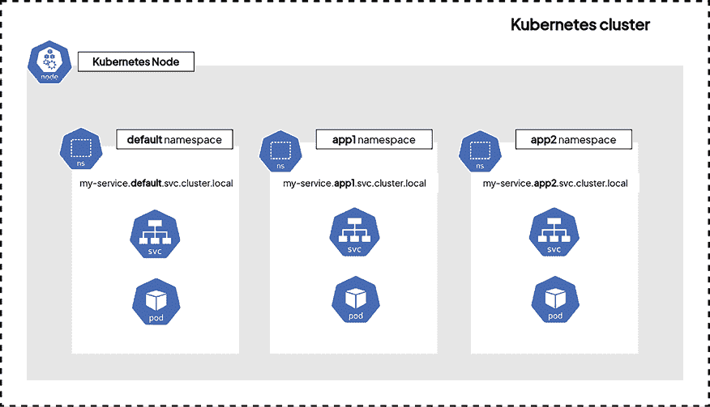

# 6

# Kubernetes 中的多租户命名空间、配额和限制

到目前为止，我们已经通过在集群中启动对象并观察它们的行为来学习 Kubernetes 的关键概念。你可能已经注意到，从长远来看，保持集群的清晰组织将变得非常困难。随着集群的不断增长，管理集群中日益增多的资源将变得愈加困难。这时，Kubernetes 命名空间就发挥了作用。

在本章中，我们将学习**命名空间**。它们帮助我们通过按应用程序或环境对资源进行分组来保持集群的良好组织。Kubernetes 命名空间是 Kubernetes 管理的另一个关键方面，掌握它们非常重要！

在本章中，我们将涵盖以下主要主题：

+   Kubernetes 命名空间简介

+   命名空间如何影响你的资源和服务

+   在命名空间级别配置 ResourceQuota 和限制

# 技术要求

本章你需要具备以下条件：

+   一个正常工作的 Kubernetes 集群（本地或基于云的，但这不重要）

+   配置好的`kubectl` CLI，以便与集群进行通信

如果你没有这些技术要求，请阅读*第二章*、*Kubernetes 架构——从容器镜像到运行的 Pods*和*第三章*、*安装你的第一个 Kubernetes 集群*来了解这些要求。

你可以从官方 GitHub 仓库下载本章的最新代码示例，网址为[`github.com/PacktPublishing/The-Kubernetes-Bible-Second-Edition/tree/main/Chapter06`](https://github.com/PacktPublishing/The-Kubernetes-Bible-Second-Edition/tree/main/Chapter06)。

# Kubernetes 命名空间简介

在 Kubernetes 集群上部署的应用越多，保持集群资源有序的需求就越大。你可以使用标签和注解来管理集群中的对象，但你可以通过使用**命名空间**进一步提高组织性。Kubernetes 中的命名空间可以让你逻辑上隔离集群的各个部分，帮助你更有效地管理资源。然而，为了强制执行资源分配和限制，还需要像`ResourceQuotas`这样的额外对象。一旦创建了命名空间，你就可以启动 Kubernetes 对象，如 Pod，这些对象只会存在于该命名空间中。因此，所有针对集群执行的`kubectl`操作将仅限于该特定命名空间，你可以在其中执行尽可能多的操作，同时消除影响其他命名空间中资源的风险。

我们首先来了解命名空间到底是什么，以及它们为何会被创建。

在 Kubernetes 的高级多集群和多租户场景中，像**Capsule** ([`capsule.clastix.io/`](https://capsule.clastix.io/))和**HyperShift** ([`github.com/openshift/hypershift`](https://github.com/openshift/hypershift))等项目提供了强大的解决方案。Capsule 通过允许不同团队或租户管理他们自己的隔离命名空间，从而实现安全的多租户 Kubernetes 集群。HyperShift 则通过提供一种轻量且可扩展的方式来安全地隔离和管理不同环境中的 Kubernetes 资源，简化了多集群的管理。

现在，让我们继续下一节，讨论 Kubernetes 中命名空间的重要性。

## Kubernetes 中命名空间的重要性

正如我们之前提到的，Kubernetes 中的命名空间是一种帮助集群管理员保持一切整洁有序，同时提供资源隔离的方式。

最大的 Kubernetes 集群可以运行数百个甚至数千个应用。当所有内容都部署在同一个命名空间时，了解哪个特定资源属于哪个应用程序可能变得非常复杂。

如果不幸的是，你更新或修改了错误的资源，可能会导致集群中运行的应用出现故障。为了解决这个问题，你可以使用标签和选择器，但即便如此，随着资源数量的增加，如果不开始使用命名空间，集群的管理很快会变得混乱。

我们在*第八章*《通过服务暴露你的 Pods》中学习了创建命名空间的基础知识，但没有深入了解。现在，让我们详细了解命名空间如何帮助保持一切整洁有序，同时提供资源隔离。

## 命名空间如何用来将资源划分为不同的块

在你安装 Kubernetes 之后，当你的集群是全新的时，它会为集群组件创建一些命名空间。所以即使你之前没有注意到，你实际上已经在使用命名空间，如下所示：

```
$ kubectl get namespaces
NAME              STATUS   AGE
default           Active   8d
kube-node-lease   Active   8d
kube-public       Active   8d
kube-system       Active   8d 
```

主要概念是将你的 Pods 和其他对象部署到 Kubernetes 中，同时指定你偏好的命名空间。这种做法有助于保持集群的整洁和良好的结构。值得注意的是，Kubernetes 默认带有一个命名空间，如果你没有显式指定，系统将使用默认命名空间。

下图展示了命名空间和隔离的高层次概览。



图 6.1：Kubernetes 命名空间与资源隔离

从更广泛的意义上看，Kubernetes 命名空间为管理员提供了几个用途，包括：

+   资源隔离

+   作用域资源名称

+   硬件分配和消费限制

+   基于角色的访问控制中的权限和访问控制

我们建议你为每个微服务或应用程序创建一个命名空间，然后将所有属于该微服务的资源部署在该命名空间中。然而，请注意，Kubernetes 并没有对你施加任何特定的规则。例如，你可以选择以下方式使用命名空间：

+   **区分环境**：例如，一个命名空间用于生产环境，另一个用于开发环境。

+   **区分层次**：一个命名空间用于数据库，另一个用于应用程序 Pod，另一个则用于中间件部署。

+   **使用默认命名空间**：对于仅部署少量资源的小型集群，你可以选择最简单的设置，使用一个大的默认命名空间，将所有内容部署到其中。

无论哪种方式，请记住，即使两个 Pod 部署在不同的命名空间并通过服务暴露，它们仍然可以互相互动和通信。即使 Kubernetes 服务是在某个命名空间中创建的，它们会收到**完全限定的域名**（**FQDN**），并且该域名在整个集群中都可以访问。所以，即使运行在命名空间 A 中的应用程序需要与命名空间 B 中的应用程序互动，它也必须通过 FQDN 调用暴露应用 B 的服务。你不需要担心跨命名空间的通信，因为默认情况下是允许的，并且可以通过网络策略进行控制。

现在，让我们了解一下默认命名空间。

## 理解默认命名空间

大多数 Kubernetes 集群默认创建了几个命名空间。你可以使用`kubectl get namespaces`（或`kubectl get ns`）列出你的命名空间，如下所示：

```
$ kubectl get namespaces
NAME              STATUS   AGE
default           Active   8d
kube-node-lease   Active   8d
kube-public       Active   8d
kube-system       Active   8d 
```

例如，我们使用的是一个 minikube 集群。通过查看该命令的输出，我们可以看到当前使用的集群在开始时就已经设置了以下命名空间：

+   `default`：Kubernetes 会自动提供此命名空间，允许你在不手动创建命名空间的情况下开始使用新集群。迄今为止，这个命名空间一直是创建所有资源的默认位置，当没有指定其他命名空间时，也会作为默认命名空间使用。

+   `kube-public`：此命名空间对所有客户端可访问，包括没有认证的客户端。主要用于集群范围内的目的，确保某些资源在整个集群中是公开可见且可读取的。然而，需要注意的是，命名空间的公开性更多的是一种约定，而非严格要求。当前该命名空间未被使用，你可以放心将其保留原样。

+   `kube-system`：这个命名空间是为 Kubernetes 系统本身创建的对象保留的。Kubernetes 在此命名空间中部署其操作所需的对象。在典型的 Kubernetes 设置中，`kube-scheduler`和`kube-apiserver`等关键组件作为 Pod 在此命名空间中部署。

这些组件对 Kubernetes 集群的正常运行至关重要。因此，建议避免对该命名空间进行更改，因为任何修改都可能会扰乱集群的功能。

+   `kube-node-lease`：这个命名空间的目的是存储与各个节点相关的 Lease 对象。这些节点租约使得 kubelet 能够发送心跳，从而帮助控制平面检测节点故障。

根据你使用的 Kubernetes 发行版，预先存在的命名空间集合可能会有所不同。但大多数时候，这些命名空间会默认创建。

现在我们先把这个命名空间放一边，因为我们要进入主题，开始创建命名空间。我们将查看这些命名空间对你的 Pod 可能产生的影响，特别是在服务的 DNS 解析层面。

# 命名空间如何影响你的资源和服务

在这一节中，我们将学习如何创建、更新和删除命名空间，以及命名空间对服务和 Pod 的影响。

我们还将学习如何通过指定自定义命名空间来创建资源，以便我们不依赖默认的命名空间。

## 列出集群中的命名空间

我们在前一节中看到了这一点，*了解默认命名空间*，但在这一节中，我们将学习如何列出并探索已经在 Kubernetes 集群中创建的命名空间：

```
$ kubectl get namespaces
NAME              STATUS   AGE
default           Active   8d
kube-node-lease   Active   8d
kube-public       Active   8d
kube-system       Active   8d 
```

请记住，所有使用`namespaces`资源`kind`的命令也可以使用`ns`别名，以便使用更简短的格式。

## 检索特定命名空间的数据

使用`kubectl describe`命令可以检索特定命名空间的数据，方法如下：

```
$ kubectl describe namespaces default
Name:         default
Labels:       kubernetes.io/metadata.name=default
Annotations:  <none>
Status:       Active
No resource quota.
No LimitRange resource. 
```

你还可以使用`get`命令并将 YAML 格式的输出重定向到文件，以获取特定命名空间的数据：

```
$ kubectl get namespaces default -o yaml > default-ns.yaml 
```

请注意，命名空间可以处于两种状态之一：

+   **活动**：命名空间处于活动状态，可以用来放置新对象。

+   **终止**：命名空间正在被删除，所有对象也将一并删除。在此状态下，不能再向命名空间中添加新对象。

现在，让我们学习如何命令式地创建一个新命名空间。

## 使用命令式语法创建命名空间

要使用命令式方法创建命名空间，你可以通过指定要创建的命名空间名称，使用`kubectl create namespaces`命令。在这里，我们将创建一个名为`custom-ns`的新命名空间。请注意，所有与命名空间相关的`kubectl`操作都可以使用更简短的`ns`别名：

```
$ kubectl create ns custom-ns
namespace/custom-ns created 
```

新的命名空间，名为`custom-ns`，现在应该已经在你的集群中创建。你可以再次运行`kubectl get`命令来检查它：

```
$ kubectl get ns custom-ns
NAME        STATUS   AGE
custom-ns   Active   35s 
```

如你所见，命名空间已经创建，并处于`活动`状态。我们现在可以将资源放入其中。

请避免将集群命名为以`kube-`为前缀的名称，因为这是 Kubernetes 对象和系统命名空间的术语。

现在，让我们学习如何使用声明式语法创建另一个命名空间。

## 使用声明式语法创建命名空间

让我们看看如何使用声明式语法创建命名空间。像往常一样，你必须使用 YAML（或 JSON）文件。以下是一个基本的 YAML 文件，用于在集群中创建一个新的命名空间。请注意文件中的`kind: Namespace`部分：

```
# custom-ns-2.yaml
apiVersion: v1
kind: Namespace
metadata:
  name: custom-ns-2 
```

使用`kubectl create`命令应用定义，通过指定 YAML 文件路径：

```
$ kubectl apply -f custom-ns-2.yaml
namespace/custom-ns-2 created 
```

到此为止，我们已经创建了两个自定义命名空间。第一个命名空间是通过命令式方式创建的，名为`custom-ns`，而第二个命名空间是通过声明式方式创建的，名为`custom-ns-2`。

现在，让我们学习如何使用`kubectl`删除这两个命名空间。

## 删除命名空间

你可以使用`kubectl delete`命令删除命名空间，如下所示：

```
$ kubectl delete namespaces custom-ns
namespace "custom-ns" deleted 
```

请注意，这也可以通过声明式语法实现。让我们删除之前使用 YAML 文件创建的`custom-ns-2`命名空间：

```
$ kubectl delete -f custom-ns-2.yaml
namespace "custom-ns-2" deleted 
```

运行此命令将使命名空间从`Active`状态变为`Terminating`状态。在命令执行后，命名空间将无法再承载新对象，几秒钟后，它应该完全从集群中消失。

我们必须警告你使用`kubectl delete namespace`命令，因为它极其危险。删除命名空间是永久性的，无法恢复。所有在该命名空间中创建的资源都会被销毁。如果你需要使用此命令，确保你有 YAML 文件来重新创建被销毁的资源，甚至是被销毁的命名空间。

现在，让我们来看看如何在特定命名空间内创建资源。

## 在命名空间中创建资源

以下代码演示了如何通过指定自定义命名空间来创建 NGINX Pod。这里，我们将重新创建一个新的`custom-ns`命名空间，并在其中启动一个 NGINX Pod：

```
$ kubectl create ns custom-ns
$ kubectl run nginx --image nginx:latest -n custom-ns
Pod/nginx created 
```

注意`-n`选项，它的长格式是`--namespace`选项。这个选项用于输入你想要创建资源（或获取资源详情）的命名空间的名称。所有可以在命名空间中范围限定的`kind`资源都支持这个选项。

这是另一个命令来演示这一点。以下命令将在`custom-ns`命名空间中创建一个新的`configmap`：

```
$ kubectl create configmap configmap-custom-ns --from-literal=Lorem=Ipsum -n custom-ns
configmap/configmap-custom-ns created 
```

使用声明式语法时，你也可以指定命名空间。以下是如何在特定命名空间中使用声明式语法创建 Pod：

```
# pod-in-namespace.yaml
apiVersion: v1
kind: Pod
metadata:
  name: nginx2
  namespace: custom-ns
spec:
  containers:
  - name: nginx
    image: nginx:latest 
```

请注意`metadata`部分下 Pod 名称下的`namespace`键，它指示将 Pod 创建在`custom-ns`命名空间中。现在，我们可以使用`kubectl`应用此文件：

```
$ kubectl apply -f pod-in-namespace.yaml
pod/nginx2 created 
```

到目前为止，我们应该已经有一个名为`custom-ns`的命名空间，里面包含两个`nginx` Pods，以及一个名为`configmap-custom-ns`的`configmap`。

使用命名空间时，你应该始终指定`-n`标志来指定你选择的特定命名空间。否则，你可能会在错误的命名空间中执行操作。

现在，让我们继续列出特定命名空间中的资源。

## 列出特定命名空间中的资源

要列出某个命名空间中的资源，必须添加`-n`选项，就像创建资源时一样。使用以下命令列出`custom-ns`命名空间中的 Pod：

```
$ kubectl get pods -n custom-ns 
NAME     READY   STATUS    RESTARTS   AGE 
nginx    1/1     Running   0          9m23s 
nginx2   1/1     Running   0          94s 
```

在这里，您可以看到我们之前创建的`nginx` Pod 存在于命名空间中。从现在开始，所有针对该 Pod 的命令都应该包含`-n custom-ns`选项。

这样做的原因是 Pod 在默认命名空间中不存在，如果您省略了`-n`选项，则会请求默认命名空间。让我们尝试从`get`命令中删除`-n custom-ns`。我们会看到`nginx` Pod 不再存在：

```
$ kubectl get pods
No resources found in default namespace. 
```

现在，我们还可以运行`get` `configmap`命令来检查`configmap`是否列出在输出中。如您所见，行为与尝试列出 Pod 时相同。如果省略`-n`选项，则列出操作将在`default`命名空间中进行：

```
$ kubectl get cm
NAME               DATA   AGE
kube-root-ca.crt   1      9d
$ kubectl get cm -n custom-ns
NAME                  DATA   AGE
configmap-custom-ns   1      70m
kube-root-ca.crt      1      76m 
```

从我们到目前为止讨论的内容中，最重要的一点是：在操作有多个命名空间的集群时，千万不要忘记添加`-n`选项。这个小小的疏忽可能会浪费您的时间，因为如果忘记了，您做的所有操作都会在`default`命名空间中进行。

不必每次在命令行中传递命名空间信息，也可以在 kubeconfig 上下文中进行设置。在下一部分中，我们将学习如何在当前`kubeconfig`上下文中设置工作命名空间。

## 使用 kubectl config set-context 设置当前命名空间

在某些情况下，也可以设置当前的命名空间。例如，如果您正在处理一个特定项目，并为您的应用程序和其他资源使用特定的命名空间，那么可以按如下方式设置命名空间上下文：

```
$ kubectl config set-context --current --namespace=custom-ns
Context "minikube" modified. 
```

我们还可以检查当前上下文中是否配置了任何命名空间，如下所示：

```
$ kubectl config view --minify --output 'jsonpath={..namespace}'
custom-ns 
```

现在，我们可以在不提及`-n <namespace>`选项的情况下获取应用程序的详细信息或应用配置：

```
$ kubectl get pods
NAME     READY   STATUS    RESTARTS   AGE
nginx    1/1     Running   0          79m
nginx2   1/1     Running   0          71m 
```

运行`kubectl config`命令及其子命令仅会触发对`~/.kube/config`文件的修改或读取操作，这是`kubectl`使用的配置文件。

当您使用`kubectl config set-context`命令时，您只是更新该文件，使其指向另一个命名空间。

知道如何使用`kubectl`在命名空间之间切换非常重要，但在执行任何写操作（如`kubectl delete`或`kubectl create`）之前，请确保您处于正确的命名空间中。否则，您应该继续使用`-n`标志。由于这种切换操作可能会执行很多次，Kubernetes 用户通常会创建 Linux 别名以便更方便使用。如果您认为对您有帮助，不妨定义一个 Linux 别名。

例如，您可以在`~/.bashrc`文件中设置一个别名（假设您使用的是 Linux 或 macOS），如下所示：

```
alias kubens='kubectl config set-context --current --namespace' 
```

下次使用此别名，如下所示：

```
$ kubens custom-ns
Context "minikube" modified.
$ kubectl config view --minify --output 'jsonpath={..namespace}'
custom-n
# change to another namespace
$ kubens default
Context "minikube" modified.
$ kubectl config view --minify --output 'jsonpath={..namespace}'
default 
```

但再次强调，强烈建议使用`-n namespace`选项，以避免在 Kubernetes 操作中发生任何意外。

在继续本章内容和实践教程之前，让我们通过运行以下命令将命名空间设置回正常状态：

```
$  kubectl config set-context --current --namespace=default
Context "minikube" modified. 
```

现在，让我们来了解如何列出特定命名空间中的所有资源。

## 列出特定命名空间中的所有资源

如果你想列出特定命名空间中的所有资源，有一个非常有用的命令可以使用，叫做`kubectl get all -n custom-ns`：

```
$ kubectl get all -n custom-ns 
```

正如你所看到的，这个命令可以帮助你检索在`-n`标志指定的命名空间中创建的所有资源。

## 了解在命名空间中名称是如何被限定的

理解命名空间提供了额外的优势：它们为所包含的资源的名称定义了作用域。

以 Pod 名称为例。当你不使用命名空间时，你与默认命名空间交互，并且当你创建两个具有相同名称的 Pod 时，会出现错误，因为 Kubernetes 使用 Pod 的名称作为它们的唯一标识符来区分它们。

让我们尝试在默认命名空间中创建两个名为`nginx`的 Pod。在这里，我们可以简单地连续运行相同的命令两次：

```
$ kubectl run nginx --image nginx:latest
Pod/nginx created
$ kubectl run nginx --image nginx:latest
Error from server (AlreadyExists): Pods "nginx" already exists 
```

第二个命令会产生一个错误，提示 Pod 已经存在，而它确实存在。如果我们运行`kubectl get pods`，我们可以看到只存在一个 Pod：

```
$ kubectl get pods
NAME    READY   STATUS    RESTARTS   AGE
nginx   1/1     Running   0          64s 
```

现在，让我们再尝试列出 Pod，这次是在`custom-ns`命名空间中：

```
$ kubectl get Pods --namespace custom-ns
NAME     READY   STATUS    RESTARTS   AGE
nginx    1/1     Running   0          89m
nginx2   1/1     Running   0          23m 
```

正如你所看到的，这个命名空间中也有一个名为`nginx`的 Pod，它与`default`命名空间中的 Pod 不同。这是命名空间的一个主要优势。通过使用命名空间，你的 Kubernetes 集群现在可以定义多个具有相同名称的资源，只要它们位于不同的命名空间中。你可以通过使用命名空间元素轻松复制微服务或应用程序。

另外，请注意，你可以通过声明性地创建资源时覆盖资源的命名空间键。通过在`kubectl create`命令中添加`-n`选项，你强制将命名空间作为命令的上下文；`kubectl`将考虑命令中传递的命名空间，而不是 YAML 文件中存在的命名空间。这样做可以非常方便地在不同命名空间之间复制资源——例如，将生产环境放在`production`命名空间中，将测试环境放在`test`命名空间中。

## 理解并非所有资源都在命名空间中

在 Kubernetes 中，并非所有对象都属于某个命名空间。例如，节点就是这种情况，它在集群级别以`Node`类型的条目表示，但并不属于任何特定命名空间。你可以使用以下命令列出不属于命名空间的资源：

```
$ kubectl api-resources --namespaced=false
NAME                              SHORTNAMES   APIVERSION                        NAMESPACED   KIND
componentstatuses                 cs           v1                                false        ComponentStatus
namespaces                        ns           v1                                false        Namespace
nodes                             no           v1                                false        Node
persistentvolumes                 pv           v1                                false        PersistentVolume
…<removed for brevity>... 
```

你还可以通过将`--namespaced`参数设置为`true`来列出属于某个命名空间的所有资源：

```
$ kubectl api-resources --namespaced=true 
```

现在，让我们学习命名空间如何影响服务的 DNS。

## 使用命名空间解析服务

正如我们在*第八章*中发现的那样，*通过服务暴露你的 Pods*，Pods 可以通过一种称为服务的对象进行暴露。创建时，服务会分配一个 DNS 记录，允许集群中的 Pods 访问它们。

然而，当一个 Pod 尝试通过 DNS 调用服务时，只有在服务与 Pod 处于同一个命名空间时，它才能访问到该服务，这就带来了限制。命名空间为此问题提供了解决方案。当一个服务在特定命名空间中创建时，它的服务名称会被添加到 DNS 中：

```
<service_name>.<namespace_name>.svc.cluster.local 
```

通过查询该域名，你可以轻松查询到 Kubernetes 集群中任何命名空间中的服务。因此，你不受限于某一层级。即使 Pods 不在同一命名空间中，它们仍然能够进行相互通信。

在接下来的部分中，我们将探讨一些 Kubernetes 命名空间的最佳实践。

## Kubernetes 命名空间的最佳实践

尽管创建和管理命名空间没有严格的规则，但让我们来学习一些与命名空间相关的行业最佳实践。

+   组织和分离

    +   **逻辑分组**：根据应用程序、服务和资源的功能、它们所处的开发阶段（如开发、测试和生产）或谁拥有它们（例如，不同的团队），将它们组织在一起。这有助于保持结构清晰并简化资源管理。

    +   **隔离**：使用命名空间将部署隔离开。这意味着一个命名空间中的应用不会影响另一个命名空间中的内容，从而减少冲突。你还可以通过应用适当的**基于角色的访问控制**（**RBAC**）网络策略，进一步提高安全性和隔离性。

+   命名规则

    +   **清晰且具描述性**：为你的命名空间取一个能清楚表明其用途的名字。这样可以更容易地跟踪它们，尤其是在大型环境中。可以使用常见的命名方式，如 `dev-`、`test-` 或 `prod-` 来区分不同的环境。

    +   **保持一致性**：在集群中使用相同的命名风格，这样你的团队可以更容易地讨论和理解正在发生的事情。

+   管理资源

    +   **资源限制**：设置命名空间的资源使用限制。这可以防止某个部署占用所有资源，确保每个人都能获得公平的资源分配。请记住，也可以在 Pod 级别设置资源限制，以获得更精细的控制。

    +   **资源限制总览**：为命名空间中的每个 Pod 和容器设置资源使用限制。这使你能更好地控制资源的使用方式。

+   控制访问

    +   **基于角色的访问控制**：使用 RBAC 来控制每个命名空间中谁可以做什么。为人员和服务分配合适的权限，以管理他们命名空间中的内容。

+   关注资源使用情况

    +   **监控资源**：关注每个命名空间中资源的使用情况以及你的应用是否健康。这有助于你发现问题并更好地利用资源。

    +   **命名空间生命周期**：定期检查你的命名空间。删除不再使用的命名空间，以保持整洁并避免安全风险。考虑自动化命名空间的创建和删除。

+   其他需要考虑的事项

    +   **非完美隔离**：尽管命名空间有助于保持事物的分离，但它们并非万无一失。你可能还需要网络规则来提供额外的安全性。

    +   **集群与命名空间**：如果你的设置较为复杂并且需要大量的隔离，考虑使用不同的 Kubernetes 集群，而不仅仅是命名空间。

通过遵循这些最佳实践，你可以使用命名空间保持 Kubernetes 设置的组织性、安全性和易管理性。只要记得根据你的具体设置调整内容，以获得最佳结果。至此，我们已经掌握了 Kubernetes 中命名空间的基础知识。我们了解了命名空间是什么，如何创建和删除它们，如何使用它们保持集群的整洁和有序，以及如何更新 `kubeconfig` 上下文以使 `kubectl` 指向特定命名空间。

现在，我们将介绍一些与命名空间相关的更高级选项。此时，介绍 `ResourceQuota` 和 `Limit` 是个不错的时机，你可以使用它们来限制部署在 Kubernetes 上的应用程序可以访问的计算资源！

# 在命名空间级别配置资源配额（ResourceQuota）和限制（Limit）

在本节中，我们将发现命名空间不仅可以用于对集群中的资源进行排序，还可以限制 Pods 能够访问的计算资源。

使用 `ResourceQuota` 和 `Limits` 配合命名空间，你可以为 Pods 可以访问的计算资源设置限制。我们将学习如何操作以及如何使用这些新概念。通常，定义 `ResourceQuota` 和 `Limits` 被认为是生产集群的好实践——这就是为什么你应该明智地使用它们。

## 理解设置 ResourceQuota 的必要性

就像应用程序或系统一样，Kubernetes Pods 需要一定量的计算资源才能正常工作。在 Kubernetes 中，你可以配置两种类型的计算资源：

+   CPU

+   内存

所有的节点（计算节点和控制节点）共同工作，提供 CPU 和内存，在 Kubernetes 中，添加更多的 CPU 和内存只需添加更多的计算（或工作）节点，以为更多的 Pods 腾出空间。根据你的 Kubernetes 集群是基于本地部署还是云端，添加更多计算节点可以通过购买硬件并进行设置来实现，或者简单地调用云 API 来创建额外的虚拟机。

## 了解 Pods 如何消耗这些资源

当你在 Kubernetes 上启动一个 Pod 时，一个控制平面组件，称为 `kube-scheduler`，将选举出一个计算节点并将 Pods 分配给它。然后，选举出的计算节点上的 `kubelet` 将尝试启动在 Pod 中定义的容器。

计算节点选举过程在 Kubernetes 中被称为 **Pod 调度**。

当一个 Pod 被调度并在计算节点上启动时，默认情况下，它可以访问计算节点拥有的所有资源。没有任何东西能阻止它在应用程序使用过程中访问更多的 CPU 和内存，最终，如果 Pods 耗尽了内存或 CPU 资源，导致无法正常工作，那么应用程序就会崩溃。

这可能会成为一个真正的问题，因为计算节点可以同时运行多个应用程序——因此，也可以运行多个 Pod。所以，如果 10 个 Pod 在同一个计算节点上启动，但其中一个消耗了所有的计算资源，那么这将对该计算节点上运行的所有 10 个 Pod 产生影响。

这个问题意味着你有两个必须考虑的方面：

+   每个 Pod 都应该能够要求一些计算资源来运行。

+   集群应该能够限制 Pod 的资源消耗，使其不会占用所有可用资源，而是与其他 Pod 共享资源。

在 Kubernetes 中有可能解决这两个问题，我们将探索如何使用暴露给 Pod 对象的两个选项。第一个叫做**资源请求**，它是用来让 Pod 指示所需的计算资源量，另一个叫做**资源限制**，用于指示 Pod 能够访问的最大计算资源。

让我们现在来探索这些选项。

## 理解 Pods 如何要求计算资源

`request`和`limit`选项将被声明在 Pod 资源的 YAML 定义文件中，或者你可以使用`kubectl set resource`命令将其应用到正在运行的部署中。在这里，我们将重点讨论`request`选项。

资源请求只是 Pod 为正常工作所需的最小计算资源量，建议始终为 Pods 定义`request`选项，至少对于那些计划在生产环境中运行的 Pod 来说。

假设你想在 Kubernetes 集群上启动一个 NGINX Pod。通过填写`request`选项，你可以告诉 Kubernetes，你的 NGINX Pod 至少需要 512 MiB 的内存和 25%的 CPU 核心才能正常工作。

这是将创建该 Pod 的 YAML 定义文件：

```
# pod-in-namespace-with-request.yaml 
```

```
apiVersion: v1
kind: Pod
metadata:
  name: nginx-with-request
  namespace: custom-ns
spec:
  containers:
    - name: nginx
      image: nginx:latest
      resources:
        requests:
          memory: "512Mi"
          cpu: "250m" 
request at the container level and set different ones for each container.
```

有三点需要注意关于这个 Pod：

+   它是在`custom-ns`命名空间内创建的。

+   它需要`512Mi`的内存。

+   它需要`250m`的 CPU。

## 那么这些指标是什么意思呢？

内存以字节为单位表示（1 MiB 等于 1,048,576 字节），而 CPU 以 **千核心** 表示，并允许小数值。如果你希望 Pod 消耗一个完整的 CPU 核心，可以将 `cpu` 键设置为 `1000m`。如果你想要两个核心，必须设置为 `2000m`；如果是半个核心，则为 `500m` 或 `0.5`；以此类推。然而，为了请求一个完整的 CPU 核心，使用整数（例如 `2`）而不是 `2000m` 更为简单且常见。所以前面的 YAML 定义表示我们将要创建的 NGINX Pod 强制要求 512 MiB 的内存（因为内存以字节为单位表示），以及一个底层计算节点的四分之一 CPU 核心。这里没有涉及 CPU 或内存频率。

当你将这个 YAML 定义文件应用到集群时，调度器将寻找一个能够启动你的 Pods 的计算节点。这意味着你需要一个计算节点，其中有足够的可用 CPU 和内存资源来满足 Pod 的请求。

那么，如果没有计算节点能够满足这些要求呢？在这种情况下，Pod 将永远不会被调度，也永远不会启动。除非你删除一些正在运行的 Pod，为这个 Pod 腾出空间，或者添加一个能够启动该 Pod 的计算节点，否则它将永远不会被启动。

请记住，Pods 不能跨多个节点运行。所以如果你设置了 `8000m`（表示八个 CPU 核心），但你的集群由两个各有四个核心的计算节点组成，那么没有任何计算节点能够满足这一请求，你的 Pod 将无法调度。

因此，明智地使用 `request` 选项——可以将其视为 Pod 运行所需的最小计算资源。如果你设置的请求过高，可能会导致 Pod 永远不会被调度，但另一方面，如果你的 Pod 成功调度并启动，这部分资源是有保障的。

现在，让我们来看一下如何限制资源消耗。

## 了解如何限制资源消耗

当你编写 YAML 定义文件时，可以定义有关 Pod 能够消耗的资源限制。

设置资源请求不足以正确完成任务。每次设置资源时，都应设置一个限制。设置限制会告诉 Kubernetes 让 Pod 消耗最多到这个限制的资源，而不会超过这个限制。这样，你就能确保 Pod 不会把所有计算资源占为己有。

但是，要小心——根据达到的限制类型，Kubernetes 的行为会有所不同。如果 Pod 达到其 CPU 限制，它将被限速，你会注意到性能下降。但如果 Pod 达到其内存限制，则可能会被终止。原因是内存不是可以限速的资源，Kubernetes 仍然需要确保其他应用不会受到影响并保持稳定。因此，要对此有所了解。

如果没有设置限制，Pod 将能够消耗计算节点的所有资源。以下是更新后的 YAML 文件，对应我们之前看到的 NGINX Pod，现在它已更新，定义了内存和 CPU 的限制。

在这里，Pod 将能够消耗最多 1 GiB 的内存和 1 个完整 CPU 核心的底层计算节点：

```
# pod-in-namespace-with-request-and-limit.yaml
apiVersion: v1
kind: Pod
metadata:
  name: nginx-with-request-and-limit
  namespace: quota-ns
spec:
  containers:
    - name: nginx
      image: nginx:latest
      resources:
        requests:
          memory: "512Mi"
          cpu: "250m"
        limits:
          memory: "1Gi"
          cpu: "1000m" 
```

所以在设置请求时，也要设置限制。让我们在接下来的实践实验中尝试这种请求和限制。

在这个练习中，让我们检查当前系统资源的可用性。由于我们使用的是 minikube 集群进行演示，接下来让我们启用指标以获取详细的资源使用信息。你将在 *第十章*，*运行生产级 Kubernetes 工作负载* 中使用这些指标：

```
$ minikube addons enable metrics-server 
```

等待指标服务器 Pod 进入 `Running` 状态后再继续：

```
$ kubectl get po -n kube-system | grep metrics
metrics-server-7c66d45ddc-82ngt            1/1     Running   0               113m 
```

让我们使用指标信息检查集群的使用情况：

```
$ kubectl top node
NAME       CPU(cores)   CPU%   MEMORY(bytes)   MEMORY%  
minikube   181m         1%     806Mi           2% 
```

在这种情况下，我们的 Kubernetes 集群有大约 800Mi 内存和 180m CPU 可供消耗。

如果你使用的是带有 Podman 或 Docker 驱动的`minikube`，则`minikube`将显示实际主机的 CPU 和内存，而不是`minikube` Kubernetes 集群节点的内存。在这种情况下，你可以尝试使用 VirtualBox 创建另一个`minikube`集群（`minikube start --profile cluster2-vb --driver=virtualbox`），这样它将使用`minikube` VM 的 CPU 和内存资源。

让我们为资源请求和限制演示创建一个新的命名空间：

```
$ kubectl create ns quota-ns
namespace/quota-ns created 
```

现在，让我们创建一个新的 YAML 文件，其中包含不真实的内存请求，例如 `100Gi resources.requests.memory`，如下所示：

```
# pod-with-request-and-limit-1.yaml
apiVersion: v1
kind: Pod
metadata:
  name: nginx-with-request-and-limit-1
  namespace: quota-ns
spec:
  containers:
    - name: nginx
      image: nginx:latest
      resources:
        requests:
          memory: "100Gi"
          cpu: "100m"
        limits:
          memory: "100Gi"
          cpu: "500m" 
```

使用 `kubectl apply` 创建 Pod，如下所示：

```
$ kubectl apply -f pod-with-request-and-limit-1.yaml
pod/nginx-with-request-and-limit-1 created 
```

检查 Pod 状态以查看 Pod 创建情况：

```
$ kubectl get pod -n quota-ns
NAME                             READY   STATUS    RESTARTS   AGE
nginx-with-request-and-limit-1   0/1     Pending   0          45s 
```

这表示状态为 `Pending`，Pod 尚未运行。让我们使用 `kubectl describe` 命令查看 Pod 的详细信息，如下所示：

```
$ kubectl describe po nginx-with-request-and-limit-1 -n quota-ns
Name:             nginx-with-request-and-limit-1
Namespace:        quota-ns
...<removed for brevity>...
Status:           Pending
IP:              
IPs:              <none>
Containers:
  nginx:
...<removed for brevity>...
    Limits:
      cpu:     500m
      memory:  100Gi
    Requests:
      cpu:        100m
      memory:     100Gi
    Environment:  <none>
...<removed for brevity>...
  Warning  FailedScheduling  105s  default-scheduler  0/1 nodes are available: 1 Insufficient memory. preemption: 0/1 nodes are available: 1 No preemption victims found for incoming pod. 
```

你会看到一个错误，因为调度器找不到集群中有足够内存请求的节点来容纳你的 Pod，这意味着 Pod 将一直等待，直到 Kubernetes 集群有合适的节点来部署该 Pod。

现在，我们将使用合理的内存更新 YAML，`1Gi resources.requests.memory`，如下所示：

```
# pod-with-request-and-limit-2.yaml
apiVersion: v1
kind: Pod
metadata:
  name: nginx-with-request-and-limit-2
  namespace: quota-ns
spec:
  containers:
    - name: nginx
      image: nginx:latest
      resources:
        requests:
          memory: "1Gi"
          cpu: "100m"
        limits:
          memory: "2Gi"
          cpu: "500m" 
```

现在，让我们创建 Pod：

```
$ kubectl apply -f pod-with-request-and-limit-2.yaml
pod/nginx-with-request-and-limit-2 created
$ kubectl get po -n quota-ns
NAME                             READY   STATUS    RESTARTS   AGE
nginx-with-request-and-limit-1   0/1     Pending   0          8m24s
nginx-with-request-and-limit-2   1/1     Running   0          20s 
```

现在，Kubernetes 调度器可以根据资源请求找到合适的节点，Pod 已经开始按常规运行。

现在你已经了解了这种请求和限制的考虑因素，别忘了将其添加到你的 Pods 中！

## 理解为什么你需要使用 ResourceQuota：

你可以完全依赖其请求和限制选项来管理 Pod 的资源消耗。Kubernetes 中的所有应用程序都是 Pod，因此设置这两个选项可以为你提供一种强大且可靠的方式来管理集群中的资源消耗，前提是你永远不要忘记设置它们。

很容易忘记这两个选项，并在集群上部署一个没有定义任何请求或限制的 Pod。也许是你，或者是你团队中的某个成员，但部署这样的 Pod 风险很大，因为每个人都可能忘记这两个选项。如果这样做，应用的不稳定性风险会很高，因为没有限制的 Pod 可以消耗其启动的计算节点上的所有资源。

Kubernetes 提供了一种解决这个问题的方法，通过两个名为 `ResourceQuota` 和 `LimitRange` 的对象。这两个对象非常有用，因为它们可以在命名空间级别强制执行这些约束。

`ResourceQuota` 是另一种资源类型，就像 Pod 或 ConfigMap 一样。工作流程相当简单，包含两个步骤：

1.  你必须创建一个新的命名空间。

1.  你必须在该命名空间中创建一个 `ResourceQuota` 和一个 `LimitRange` 对象。

然后，所有在该命名空间内启动的 Pod 都将受到这两个对象的约束。

这些配额用于确保例如命名空间中的所有容器不会消耗超过 4 GiB 的 RAM。

因此，设置对 Pod 内部可以运行和不能运行的内容进行限制是可能的，甚至是推荐的。强烈建议你在集群中为每个命名空间始终定义一个 `ResourceQuota` 和一个 `LimitRange` 对象！

如果没有这些配额，部署的资源可能会消耗任意多的 CPU 或 RAM，这将使得你的集群以及所有运行在其中的应用不稳定，因为 Pod 并没有在其各自配置中设置请求和限制。

一般来说，`ResourceQuota` 用于执行以下操作：

+   限制命名空间内的 CPU 消耗

+   限制命名空间内的内存消耗

+   限制命名空间内运行的对象数量，例如 Pod、Service、ReplicationController、Replica、Deployment 等。

+   根据关联的存储类限制存储资源的消耗

有很多使用场景，你可以直接在 Kubernetes 文档中发现它们。现在，让我们学习如何在命名空间中定义 `ResourceQuota`。

## 创建一个 ResourceQuota

为了演示 `ResourceQuota` 的实用性，我们将为命名空间 `quota-ns` 创建一个 `ResourceQuota` 对象。这个 `ResourceQuota` 将用于创建所有 Pod 合并后的请求和限制。以下是将创建 `ResourceQuota` 的 YAML 文件；请注意资源类型：

```
# resourcequota.yaml
apiVersion: v1
kind: ResourceQuota
metadata:
  name: resourcequota
  namespace: quota-ns
spec:
  hard:
    requests.cpu: "1000m"
    requests.memory: "1Gi"
    limits.cpu: "2000m"
    limits.memory: "2Gi" 
```

请记住，`ResourceQuota` 对象的作用范围仅限于一个命名空间。

这个声明表示，在这个命名空间中，将会发生以下情况：

+   所有 Pod 合并起来的 CPU 核心请求不能超过 1 个。

+   所有 Pod 合并起来的内存请求不能超过 1 GiB。

+   所有 Pod 合并起来的 CPU 核心消耗不能超过 2 个。

+   所有 Pod 合并起来的内存消耗不能超过 2 GiB。

通过应用 YAML 配置来创建 `ResourceQuota`：

```
$ kubectl apply -f resourcequota.yaml
resourcequota/resourcequota created
$ kubectl get quota -n quota-ns
NAME            AGE   REQUEST                                          LIMIT
resourcequota   4s    requests.cpu: 100m/1, requests.memory: 1Gi/1Gi   limits.cpu: 500m/2, limits.memory: 2Gi/2Gi 
```

让我们检查 `quota-ns` 命名空间中的当前资源，如下所示：

```
$ kubectl get po -n quota-ns
NAME                             READY   STATUS    RESTARTS        AGE
nginx-with-request-and-limit-2   1/1     Running   1 (5h41m ago)   7h18m
$ kubectl top pod -n quota-ns
NAME                             CPU(cores)   MEMORY 
```

有一个 nginx Pod（如果你没有删除之前的演示 Pod），并且使用量非常低。

现在，我们有了一个新的 Pod YAML 文件，但我们为 Pod 请求 `3Gi` 内存，如下所示：

```
# pod-with-request-and-limit-3.yaml
apiVersion: v1
kind: Pod
metadata:
  name: nginx-with-request-and-limit-3
  namespace: quota-ns
spec:
  containers:
    - name: nginx
      image: nginx:latest
      resources:
        requests:
          memory: "3Gi"
          cpu: "100m"
        limits:
          memory: "4Gi"
          cpu: "500m" 
```

现在，让我们尝试创建这个 Pod，看看结果会是什么：

```
$ kubectl apply -f pod-with-request-and-limit-3.yaml
Error from server (Forbidden): error when creating "pod-with-request-and-limit-3.yaml": pods "nginx-with-request-and-limit-3" is forbidden: exceeded quota: resourcequota, requested: limits.memory=4Gi,requests.memory=3Gi, used: limits.memory=2Gi,requests.memory=1Gi, limited: limits.memory=2Gi,requests.memory=1Gi 
```

是的，错误信息非常清楚；我们请求的资源超出了配额，Kubernetes 不允许创建新的 Pod。

只要它们遵循这些约束，你可以在命名空间中拥有任意数量的 Pods 和容器。大多数情况下，`ResourceQuota` 用于强制执行请求和限制的约束，但它们也可以用于在命名空间级别强制这些限制。

在命名空间级别设置 `ResourceQuota` 时，至关重要的是防止任何单一命名空间消耗所有集群资源；同时，在 Pod 或 Deployment 级别应用资源请求和限制也很重要。这种双重方法确保了资源消耗的控制，既限于各个命名空间，也在应用级别进行管理。通过强制执行这些限制，你能创建一个更可预测、稳定的环境，防止任何一个组件扰乱整个系统。

在以下示例中，前面的 `ResourceQuota` 已被更新，指定了创建该资源的命名空间不能包含超过 10 个 ConfigMap 和 5 个服务，这个示例看似无意义，但它很好地展示了 `ResourceQuota` 的不同应用可能性：

```
# resourcequota-with-object-count.yaml
apiVersion: v1
kind: ResourceQuota
metadata:
  name: my-resourcequota
  namespace: quota-ns
spec:
  hard:
    requests.cpu: "1000m"
    requests.memory: "1Gi"
    limits.cpu: "2000m"
    limits.memory: "2Gi"
    configmaps: "10"
    services: "5" 
```

在应用 `ResourceQuota` 的 YAML 定义时，确保 `ResourceQuota` 被分配到正确的命名空间。如果 YAML 文件中未指定命名空间，请记得使用 `--namespace` 标志来指定 `ResourceQuota` 应应用的位置。

如下所示创建 `ResourceQuota`：

```
$ kubectl apply -f resourcequota-with-object-count.yaml 
```

在以下部分，我们将学习 Kubernetes 中的存储 `ResourceQuota`。

## 存储资源配额

在 Kubernetes 中，资源配额允许你控制一个命名空间内请求的总存储资源。你可以限制所有持久卷声明的存储请求总和，以及允许的持久卷声明数量。此外，还可以根据特定的存储类定义配额，从而为不同的存储类类型设置单独的限制。例如，你可以分别为黄金和铜存储类设置配额。从 1.8 版本开始，配额还支持本地临时存储，允许你限制命名空间内所有 Pod 的本地临时存储请求和限制总和。

现在，让我们来学习如何列出 `ResourceQuota`。

## 列出 ResourceQuota

`ResourceQuota` 对象可以通过 `kubectl` 使用配额的资源名称选项来访问。`kubectl get` 命令将为我们完成这项工作：

```
$ kubectl get resourcequotas -n quota-ns
NAME            AGE   REQUEST                                          LIMIT
resourcequota   15m   requests.cpu: 100m/1, requests.memory: 1Gi/1Gi   limits.cpu: 500m/2, limits.memory: 2Gi/2Gi 
```

现在，让我们学习如何从 Kubernetes 集群中删除 `ResourceQuota`。

## 删除 ResourceQuota

要从集群中删除 `ResourceQuota` 对象，可以使用 `kubectl delete` 命令：

```
$ kubectl delete -f resourcequota-with-object-count.yaml
resourcequota "my-resourcequota" deleted 
```

现在，让我们介绍 `LimitRange` 的概念。

## 介绍 LimitRange

`LimitRange` 是另一个类似于 `ResourceQuota` 的对象，它是在命名空间级别创建的。`LimitRange` 对象用于强制为单个容器设置默认的请求和限制值。即使你使用 `ResourceQuota` 对象，也可以创建一个占用命名空间内所有可用资源的对象，因此 `LimitRange` 对象的作用是防止你在命名空间中创建过小或过大的容器。

这里是一个 YAML 文件，它将创建 `LimitRange`：

```
# limitrange.yaml
apiVersion: v1
kind: LimitRange
metadata:
  name: my-limitrange
  namespace: quota-ns
spec:
  limits:
    - default: # this section defines default limits
        cpu: 500m
        memory: 256Mi
      defaultRequest: # this section defines default requests
        cpu: 500m
        memory: 128Mi
      max: # max and min define the limit range
        cpu: "1"
        memory: 1000Mi
      min:
        cpu: 100m
        memory: 128Mi
      type: Container 
```

如你所见，`LimitRange` 对象由四个重要的键组成，它们都包含 `memory` 和 `cpu` 配置。这些键如下：

+   `default`：如果你忘记在 Pod 层面应用 `memory` 和 `cpu` 限制，这将帮助你强制执行容器的默认值。每个没有设置限制的容器将从 `LimitRange` 对象中继承这些默认值。

+   `defaultRequest`：这与 `default` 相同，但适用于 `request` 选项。如果你没有为 Pod 中的某个容器设置 `request` 选项，`LimitRange` 对象中此键的值将自动作为默认值使用。

+   `max`：该值表示 Pod 可以设置的容器的最大限制（不是请求）。你无法配置一个超出该限制的 Pod 容器。它与 `default` 值相同，即不能大于这里定义的值。

+   `min`：该值类似于 `max`，但适用于请求。它是 Pod 可以请求的计算资源的最小值，`defaultRequest` 选项不能低于该值。

最后，注意，如果你省略 `default` 和 `defaultRequest` 键，那么 `max` 键将作为 `default` 键使用，`min` 键将作为 `default` 键使用。

定义 `LimitRange` 是一个好主意，如果你想避免忘记为 Pod 设置请求和限制。至少通过 `LimitRange`，这些对象将有默认的请求和限制！

```
$ kubectl apply -f limitrange.yaml 
```

现在，让我们学习如何列出 `LimitRanges`。

## 列出 LimitRanges

`kubectl` 命令行工具将帮助你列出你的 `LimitRanges`。不要忘记加上 `-n` 标志，将请求限定到特定的命名空间：

```
$ kubectl get limitranges -n quota-ns
NAME            CREATED AT
my-limitrange   2024-03-10T16:13:00Z
$ kubectl describe limitranges my-limitrange -n quota-ns
Name:       my-limitrange
Namespace:  quota-ns
Type        Resource  Min    Max     Default Request  Default Limit  Max Limit/Request Ratio
----        --------  ---    ---     ---------------  -------------  -----------------------
Container   memory    128Mi  1000Mi  128Mi            256Mi          -
Container   cpu       100m   1       500m             500m           - 
```

现在，让我们学习如何从命名空间中删除 `LimitRange`。

## 删除 LimitRange

删除 `LimitRange` 可以使用 `kubectl` 命令行工具。以下是具体步骤：

```
$ kubectl delete limitranges my-limitrange -n quota-ns
limitrange "my-limitrange" deleted 
```

一如既往，不要忘记加上 `-n` 标志，将请求限定到特定的命名空间；否则，你可能会错误地操作到其他命名空间！

# 总结

本章介绍了命名空间，它在 Kubernetes 中非常重要。如果不使用命名空间，你无法有效地管理你的集群，因为它们提供了集群内的逻辑资源隔离。例如，大多数人使用生产和开发命名空间，或者为每个应用程序创建一个命名空间。创建数百个命名空间的集群并不罕见。

我们发现大多数 Kubernetes 资源都与命名空间相关联，虽然也有一些例外。请记住，Kubernetes 默认配置了一些预设的命名空间，例如 `kube-system`，而且通常不建议更改这些命名空间中的内容，特别是如果你不知道自己在做什么的话。

我们还发现，命名空间可以用来设置配额并限制 Pod 可消耗的资源，且在命名空间级别设置这些配额和限制是一个非常好的实践，可以通过 `ResourceQuota` 和 `LimitRange` 对象来防止 Pod 消耗过多计算资源。通过实施这些措施，你为有效的容量管理奠定了基础，这对那些旨在维持集群中所有应用程序的稳定性和效率的组织至关重要。

在下一章中，我们将学习如何使用 ConfigMaps 和 Secrets 来处理 Kubernetes 中的配置信息和敏感数据。

# 进一步阅读

+   *初始命名空间*：[`kubernetes.io/docs/concepts/overview/working-with-objects/namespaces/#initial-namespaces`](https://kubernetes.io/docs/concepts/overview/working-with-objects/namespaces/#initial-namespaces)

+   *Pod 和容器的资源管理*：[`kubernetes.io/docs/concepts/configuration/manage-resources-containers/`](https://kubernetes.io/docs/concepts/configuration/manage-resources-containers/)

+   *资源配额*：[`kubernetes.io/docs/concepts/policy/resource-quotas/`](https://kubernetes.io/docs/concepts/policy/resource-quotas/)

+   *限制范围*：[`kubernetes.io/docs/concepts/policy/limit-range/`](https://kubernetes.io/docs/concepts/policy/limit-range/)

+   *资源度量管道*：[`kubernetes.io/docs/tasks/debug/debug-cluster/resource-metrics-pipeline/`](https://kubernetes.io/docs/tasks/debug/debug-cluster/resource-metrics-pipeline/)

+   *配置命名空间的默认内存请求和限制*：[`kubernetes.io/docs/tasks/administer-cluster/manage-resources/memory-default-namespace/`](https://kubernetes.io/docs/tasks/administer-cluster/manage-resources/memory-default-namespace/)

# 加入我们的 Discord 社区

加入我们社区的 Discord 空间，与作者和其他读者讨论：

[`packt.link/cloudanddevops`](https://packt.link/cloudanddevops)


