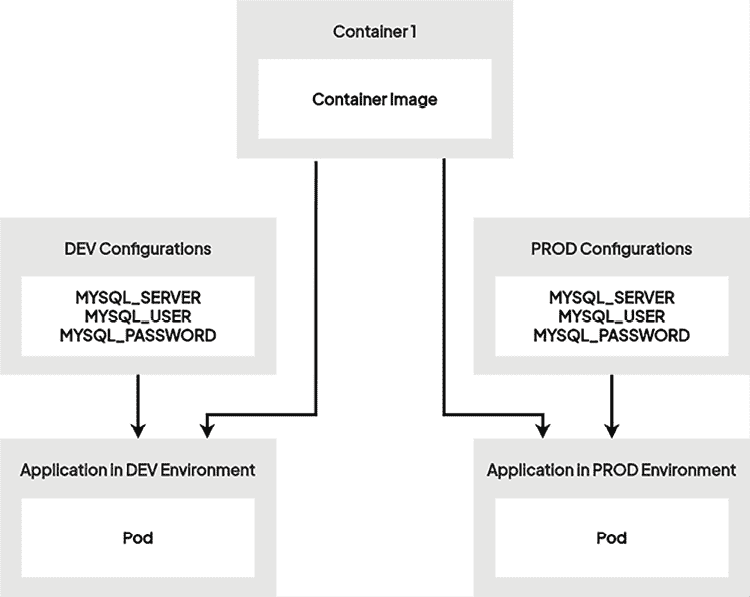

# 7

# 使用 ConfigMaps 和 Secrets 配置你的 Pods

前几章介绍了如何使用 Kubernetes 启动应用容器。现在你知道，每当你需要在 Kubernetes 上启动容器时，必须通过 Pods 来实现。这是你需要理解和掌握的关键概念。Kubernetes 是一个通过 RESTful API 管理的复杂系统。处理这一过程的核心组件是 Kubernetes API 服务器，它提供了与集群交互的主要接口。当用户通过这个 API 创建 Kubernetes 对象，如 Pods 时，系统会在集群节点上分配必要的资源。在这些资源中，Pod 非常重要，因为它在 Kubernetes 节点上创建时会启动应用容器。

在本章中，我们将学习两个新的 Kubernetes 对象：**ConfigMaps** 和 **Secrets**。Kubernetes 使用 ConfigMaps 和 Secrets 来将应用配置与代码本身解耦。这些对象提供了一种独立管理配置值的机制，从而增强了应用的可移植性和安全性。ConfigMaps 将非敏感数据以键值对的形式存储，而 Secrets 则处理诸如密码或 API 密钥等敏感信息。这两者都可以作为环境变量注入到 Pods 中，或者作为卷挂载，允许应用动态访问配置，而无需硬编码值。通过将配置与应用分离，你可以在 Kubernetes 生态系统中创建更灵活、更具韧性和更安全的部署。

以下是本章我们将要覆盖的主要内容：

+   理解 ConfigMaps 和 Secrets 的概念

+   使用 ConfigMaps 配置你的 Pods

+   使用 Secret 对象管理敏感配置

# 技术要求

本章你将需要以下内容：

+   一个正在运行的 Kubernetes 集群（本地或云端，虽然这并不重要）

+   一个已配置的 `kubectl` CLI，用于与 Kubernetes 集群通信

你可以通过阅读 *第二章*、*Kubernetes 架构 - 从容器镜像到运行的 Pod* 和 *第三章*、*安装你的第一个 Kubernetes 集群*，分别获得一个工作中的 Kubernetes 集群和正确配置的 `kubectl` 客户端。

你可以从官方 GitHub 仓库下载本章的最新代码示例：[`github.com/PacktPublishing/The-Kubernetes-Bible-Second-Edition/tree/main/Chapter07`](https://github.com/PacktPublishing/The-Kubernetes-Bible-Second-Edition/tree/main/Chapter07)。

# 理解 ConfigMaps 和 Secrets 的概念

Kubernetes 环境是动态的，并且不断变化。这使得应用配置的管理变得复杂。传统方法通常无法跟上云原生开发的快速步伐。

为了解决这个问题，Kubernetes 提供了 ConfigMaps 和 Secrets，这些是处理不同类型配置数据的专用方式。通过将配置与应用程序代码分离，这些资源显著提高了应用程序的可移植性、安全性和可管理性。

在接下来的部分中，我们将深入探讨 ConfigMaps 和 Secrets 的细节，了解它们是如何工作的，以及如何在 Kubernetes 部署中最好地利用它们。

## 解耦应用程序和配置

容器天生是不可变的，这意味着一旦创建，就无法更改。这在配置管理时带来了挑战。将配置嵌入容器镜像中需要在每次配置更改时重建整个镜像，这个过程既费时又低效。仅依赖环境变量或命令行参数进行配置也会显得繁琐，尤其是对于复杂的设置，并且不能保证在容器重启时配置的持久性。这些限制突显了在 Kubernetes 中需要更有效的配置管理策略。

当我们使用 Kubernetes 时，我们希望我们的应用程序尽可能具有可移植性。实现这一目标的一个好方法是将应用程序与其配置解耦。早些时候，配置和应用程序是同一个概念；由于应用程序代码只设计用于在单一环境中运行，配置值通常会被捆绑在应用程序代码中，因此配置和应用程序代码是紧密耦合的。

将应用程序代码和配置值视为相同的内容会降低应用程序的可移植性。如今，情况发生了很大变化，我们必须能够更新应用程序配置，因为我们希望尽可能地使应用程序具有可移植性，使我们能够在多个环境中无缝部署应用程序。

考虑以下问题：

1.  你将一个 Java 应用程序部署到开发环境进行测试。

1.  测试完成后，应用程序准备好进入生产环境，并且需要进行部署。然而，生产环境的 MySQL 端点与开发环境中的不同。

这里有两种可能性：

+   配置和应用程序代码没有解耦，MySQL 被硬编码并捆绑在应用程序代码中；你被困住了，在编辑应用程序代码后需要重新构建整个应用程序。

+   配置和应用程序代码已解耦。这对你来说是好消息，因为你可以在部署到生产环境时，简单地覆盖 MySQL 端点。

这就是可移植性概念的关键——应用程序代码应独立于其运行的基础设施。实现这一目标的最佳方法是将应用程序代码与其配置解耦。

在下图中，我们有一个常见的应用程序容器镜像，并且为不同环境配置了不同的配置。



图 7.1：应用程序配置解耦

让我们来看一些典型的例子，看看您应该从应用程序中解耦的配置值类型：

+   访问 Amazon S3 存储桶的 API 密钥

+   您的应用程序使用的 MySQL 服务器的密码

+   您的应用程序使用的 Redis 集群的端点

+   预计算的值，如 JWT 令牌的私钥

这些值可能会在不同的环境之间发生变化，而在您的 Pod 中启动的应用程序应该能够加载不同的配置，具体取决于它们所启动的环境。这就是为什么我们要系统地维护应用程序与它们所消耗配置之间的隔离的原因。这样做可以让我们在 Kubernetes 集群中将它们视为两个完全不同的实体。实现这一目标的最佳方法是将应用程序及其配置视为两个不同的实体。

这就是 Kubernetes 建议使用 ConfigMap 和 Secret 对象的原因，它们旨在承载您的配置数据。然后，您需要在创建 Pod 时附加这些 ConfigMap 和 Secret。

请避免将您的配置值作为容器镜像的一部分，比如 Docker 镜像。您的 Dockerfile（或 Podman 的 Containerfile）应该构建您的应用程序，而不是配置它。在构建时包含容器配置，会在应用程序与其配置之间建立强关系，从而减少容器在不同环境中的可移植性。

ConfigMap 用于保存非敏感的配置值，而 Secret 通常是相同的，但用于保存敏感的配置值，如数据库密码、API 密钥等。

因此，您可以为每个环境和每个应用程序想象一个 ConfigMap 和 Secret，其中将包含应用程序在特定上下文和环境中运行所需的参数。关键点是，ConfigMap 和 Secret 作为 Kubernetes 集群内配置数据的键值对存储机制。这些键值对可以包含称为 `literals` 的纯值或完整的配置文件，如 `YAML`、`TOML` 等。然后，在创建 Pod 时，您可以选择 ConfigMap 或 Secret 的名称，并将其与 Pod 链接，以便将配置值暴露给运行在其中的容器。

您始终按此顺序进行，以确保在 Pod 启动时配置数据可用：

1.  使用配置值创建一个 ConfigMap 或 Secret。

1.  创建一个引用 ConfigMap 或 Secret 的 Pod。

通过采用这种方法，您可以增强应用程序的可移植性和可维护性，符合常见的 DevOps 最佳实践。

现在我们已经解释了为何将应用程序代码与配置值解耦很重要，接下来是时候解释为什么以及如何以 Kubernetes 友好的方式实现这一目标。

## 了解 Pods 如何使用 ConfigMap 和 Secret

在深入了解 ConfigMap 和 Secrets 的具体细节之前，让我们先来看看在容器化环境中管理配置的传统方法。在 Kubernetes 之外，现代容器化应用程序通过多种方式使用它们的配置：

+   作为操作系统环境变量

+   作为配置文件

+   命令行参数

+   API 访问

这是因为在 Docker 或 Podman 中覆盖环境变量非常容易，而且所有编程语言都提供了轻松读取环境变量的功能。配置文件可以很容易地在容器之间共享并作为卷挂载。

重要

虽然 ConfigMap 和 Secrets 是 Kubernetes 中管理配置的主要方法，但也有其他替代方法。命令行参数可以直接将配置传递给容器，但这种方法比 ConfigMap 和 Secrets 更不灵活和安全。直接访问 Kubernetes API 获取配置通常不被推荐，因为它存在安全风险和增加的复杂性。

在 Kubernetes 环境中，ConfigMap 和 Secrets 遵循这两种方法。一旦在 Kubernetes 集群中创建，ConfigMap 可以通过以下两种方式使用：

+   作为容器中运行的 Pod 的环境变量

+   像其他任何卷一样，作为 Kubernetes 卷进行挂载

你可以选择将 ConfigMap 或 Secret 中的某个值注入为环境变量，或者将 ConfigMap 或 Secret 中的所有值注入为环境变量。

重要

强烈不推荐使用环境变量来暴露 Secrets，因为这可能带来安全风险并导致值被截断。建议使用基于文件的 Secrets 卷挂载方法，利用 kubelet 缓存实现动态更新和增强安全性。

ConfigMap 和 Secrets 也可以作为卷挂载。当你将 ConfigMap 挂载为卷时，可以将它包含的所有值作为一个目录注入到容器中。如果你将完整的配置文件存储在 ConfigMap 中，使用此功能覆盖配置目录变得异常简单。

通过这部分内容的介绍，你应该理解为什么在配置应用程序时，ConfigMap 和 Secrets 如此重要。如果你打算在 Kubernetes 中进行干净且扎实的工作，掌握它们至关重要。正如我们在本章前面提到的，ConfigMap 用于存储*不安全*的配置值，而 Secrets 用于存储更为敏感的配置信息，如哈希值或数据库密码。

下表展示了 Kubernetes 中 ConfigMap 和 Secrets 之间的高级差异。

| **功能** | **ConfigMaps** | **Secrets** |
| --- | --- | --- |
| 目的 | 存储非敏感配置数据 | 存储敏感信息 |
| 数据格式 | 明文文本 | Base64 编码 |
| 安全性 | 不太安全 | 更加安全 |
| 常见用途 | 应用程序配置、环境变量和命令行参数 | 密码、API 密钥、SSH 密钥和 TLS 证书 |
| 处理敏感数据 | 不推荐 | 强烈推荐 |

表 7.1：ConfigMap 和 Secrets 之间的区别

由于 ConfigMap 和 Secrets 的行为不同，我们将分别探讨它们。首先，我们将了解 ConfigMap 的工作原理，之后再讨论 Secrets。

# 使用 ConfigMap 配置你的 Pods

在本节中，我们将学习如何列出、创建、删除和读取 ConfigMap。同时，我们还将学习如何将它们附加到 Pods 上，以便将其值作为环境变量或卷注入到 Pods 中。

在接下来的几节中，我们将学习如何列出、创建和管理 Kubernetes 中的 ConfigMap。

## 列出 ConfigMap

列出在集群中创建的 ConfigMap 非常简单，可以像使用 Kubernetes 中的其他对象一样使用 `kubectl` 完成。你可以通过使用完整的资源名称 `configmaps` 来实现：

```
$ kubectl get configmaps 
```

或者，你可以使用较短的别名 `cm`：

```
$ kubectl get cm 
```

这两个命令的效果相同。执行时，`kubectl` 可能会显示一些默认的 ConfigMap，或者出现错误，提示没有找到 ConfigMap。这种差异是因为某些云服务会为内部流程生成默认的 ConfigMap，而有些则不会。这些默认 ConfigMap 的存在与否取决于 Kubernetes 集群的部署环境。

```
$  kubectl get configmaps -A
NAMESPACE         NAME                                                   DATA   AGE
default           kube-root-ca.crt                                       1      23d
kube-node-lease   kube-root-ca.crt                                       1      23d
kube-public       cluster-info                                           1      23d
kube-public       kube-root-ca.crt                                       1      23d
...<removed for brevity>... 
```

如前面的输出所示，默认命名空间和 Kubernetes 管理的命名空间中有多个 ConfigMap，这是在集群部署过程中创建的。现在，让我们学习如何在下一节中创建一个新的 ConfigMap。

## 创建一个 ConfigMap

像其他 Kubernetes 对象一样，ConfigMap 可以通过命令式或声明式方法创建。你可以选择创建一个空的 ConfigMap 然后添加值，或者直接创建一个包含初始值的 ConfigMap。以下命令将通过命令式方法创建一个名为 `my-first-configmap` 的空 ConfigMap：

```
$ kubectl create configmap my-first-configmap
configmap/my-first-configmap created 
```

执行完此命令后，你可以再次输入 `kubectl get cm` 命令，查看你新创建的 `configmap`：

```
$ kubectl get cm
NAME                 DATA   AGE
my-first-configmap   0      42s 
```

现在，我们将创建一个新的空 ConfigMap，但这次我们将采用声明式方法创建。这样，我们需要创建一个 YAML 文件，并通过 `kubectl` 来应用它。

以下内容应该放置在名为 `~/my-second-configmap.yaml` 的文件中：

```
# ~/my-second-configmap.yaml
apiVersion: v1
kind: ConfigMap
metadata:
  name: my-second-configmap 
```

一旦这个文件创建完成，你可以通过 `kubectl apply -f` 命令将其应用到 Kubernetes 集群中：

```
$ kubectl apply -f ~/my-second-configmap.yaml
configmap/my-second-configmap created 
```

你可以再次输入 `kubectl get cm` 命令，以查看你新创建的 `configmap` 是否出现在你之前创建的 `configmap` 旁边：

```
$  kubectl get cm
NAME                  DATA   AGE
kube-root-ca.crt      1      23d
my-first-configmap    0      5s
my-second-configmap   0      2s 
```

请注意，`kubectl get cm` 命令的输出还会在 `DATA` 列中返回每个 ConfigMap 所包含的键的数量。目前是零，但在接下来的示例中，你将看到我们可以在创建 ConfigMap 时填写 `configmap`，因此 `DATA` 将反映我们在 `configmap` 中放入的键的数量。

## 从字面值创建一个 ConfigMap

拥有一个空的 ConfigMap 是相当无用的，所以让我们学习如何在 ConfigMap 中创建带有值的对象。我们通过命令式方式来实现：向 `kubectl create cm` 命令添加 `–from-literal` 标志。

在这里，我们将创建一个名为 `my-third-configmap` 的 ConfigMap，键名为 `color`，其值设置为 `blue`：

```
$ kubectl create cm my-third-configmap --from-literal=color=blue
configmap/my-third-configmap created 
```

同时，请注意，您可以创建一个包含多个参数的 ConfigMap；您只需要通过在命令中链式添加所需数量的 `from-literals`，来将任意数量的配置数据添加到 `configmap` 中：

```
$ kubectl create cm my-fourth-configmap --from-literal=color=blue --from-literal=version=1 --from-literal=environment=prod
configmap/my-fourth-configmap created 
```

在这里，我们创建了一个包含三个配置值的 ConfigMap。现在，您可以再次使用此命令列出您的 ConfigMap。您应该能看到刚刚创建的几个额外的 ConfigMap。

请注意，`kubectl get cm` 的返回结果中的 `DATA` 列现在反映了每个 `configmap` 内部的配置值数量：

```
$ kubectl get cm
NAME                  DATA   AGE
my-first-configmap    0      9m30s
**my-fourth-configmap   3      6m23s**
my-second-configmap   0      8m2s
my-third-configmap    1      7m9s 
```

我们还可以通过以 YAML 或 JSON 格式显示良好格式化的输出，查看 ConfigMap（或其他任何对象）的详细信息，如下所示。

```
$ kubectl get cm my-fourth-configmap -o yaml
apiVersion: v1
data:
  color: blue
  environment: prod
  version: "1"
kind: ConfigMap
metadata:
  creationTimestamp: "2024-08-10T06:20:49Z"
  name: my-fourth-configmap
  namespace: default
  resourceVersion: "25647"
  uid: 3c8477dc-f3fe-4d69-b66a-403679a88450 
```

这种方法也有助于以 YAML 或 JSON 格式备份对象，符合 **配置即代码**（**CaC**）和 **基础设施即代码**（**IaC**）的最佳实践。

现在，也可以通过声明方式创建相同的 ConfigMap。下面是一个准备应用于集群的声明式 YAML 配置文件。请注意新的数据 YAML 键，它包含了所有的配置值：

```
# ~/my-fifth-configmap.yaml
apiVersion: v1
kind: ConfigMap
metadata:
  name: my-fifth-configmap
data:
  color: "blue"
  version: "1"
  environment: "prod" 
```

一旦创建了文件，您可以使用 `kubectl apply` 命令创建 ConfigMap，如下所示：

```
$ kubectl apply -f my-fifth-configmap.yaml
configmap/my-fifth-configmap created 
```

基于 `my-fifth-configmap.yaml` 文件，创建一个新的 ConfigMap 对象，其中包括按 YAML 定义的数据。

现在，让我们在本章的下一个部分学习如何将整个配置文件存储在 ConfigMap 中。

## 将整个配置文件存储在 ConfigMap 中

如前所述，也可以将完整的文件存储在 ConfigMap 中——您不局限于字面值。技巧是将文件在文件系统中的路径提供给 `kubectl` 命令行。然后，`kubectl` 会获取文件的内容，并将其用于填充 `configmap` 中的参数。

将配置文件的内容存储在 ConfigMap 中非常有用，因为您可以像挂载卷一样，将 ConfigMap 挂载到您的 Pods 中。

好消息是，您可以在 ConfigMap 中混合使用字面值和文件。字面值通常是短字符串，而文件则被视为较长的字符串；它们并不是两种不同的数据类型。

我们在*第五章*的*Sidecar 多容器 Pod 示例*部分中已经看到过一个这样的示例 ConfigMap，我们将 Fluentd 配置内容作为文件内容存储在 ConfigMap 中。

在这里，创建了第六个 ConfigMap，它与之前一样包含字面值，但现在我们也将存储一个文件的内容。

让我们在 `$HOME/configfile.txt` 位置创建一个名为 `configfile.txt` 的文件，并填入任意内容：

```
$ echo "I'm just a dummy config file" >> $HOME/configfile.txt 
```

这里的配置文件扩展名为 `.txt`，但它也可以是 `.yaml`、`.toml`、`.rb` 或任何其他您的应用程序可以使用的配置格式。

现在，我们需要将该文件导入到一个 ConfigMap 中，因此让我们创建一个全新的 ConfigMap 来演示这一点。您可以使用 `--from-file` 标志来实现此操作，该标志可以与 `--from-literal` 标志一起使用：

```
$ kubectl create cm my-sixth-configmap --from-literal=color=yellow --from-file=$HOME/configfile.txt
configmap/my-sixth-configmap created 
```

让我们再次运行 `kubectl get cm` 命令，以确保我们的第六个 `configmap` 已创建。该命令将显示它包含两个配置值——在我们的案例中，一个是从字面值创建的，另一个是从文件内容创建的：

```
$ kubectl get cm my-sixth-configmap
NAME                  DATA   AGE
my-sixth-configmap    2      38s 
```

如您所见，`my-sixth-configmap` 包含两条数据：字面值和文件。

现在，让我们创建第七个 ConfigMap。就像第六个一样，它将包含一个字面值和一个文件，但这次我们将以声明方式创建它。

YAML 格式允许您使用 `|` 符号来表示多行。我们在声明文件中使用了这种语法：

```
# ~/my-seventh-configmap.yaml
apiVersion: v1
kind: ConfigMap
metadata:
  name: my-seventh-configmap
data:
  color: "green"
  configfile.txt: |
    I'm another configuration file. 
```

让我们使用 `kubectl apply` 命令应用这个 YAML 文件来创建我们的 `configmap`：

```
$ kubectl apply -f my-seventh-configmap.yaml
configmap/my-seventh-configmap created 
```

让我们使用 `kubectl get cm` 列出集群中的 ConfigMap，确保我们的第七个 `configmap` 已创建并包含两个值。所以我们再运行一次 `kubectl get cm` 命令：

```
$ kubectl get configmap/my-seventh-configmap
NAME                   DATA   AGE
my-seventh-configmap   2      36s 
```

现在，让我们发现创建 ConfigMap 的最后一种可能方式——那就是从 `env` 文件创建。

## 从 env 文件创建 ConfigMap

如您所料，您可以通过使用 `--from-env-file` 标志，从 `env` 文件中命令式地创建 ConfigMap。

`env` 文件是一种 `key=value` 格式的文件，每个键由换行符分隔。这是某些应用程序使用的配置格式，因此 Kubernetes 引入了一种从现有 `env` 文件生成 ConfigMap 的方式。如果您有已经存在的应用程序，并希望将其迁移到 Kubernetes 中，这非常有用。

下面是一个典型的 `env` 文件：

```
# ~/my-env-file.env
hello=world
color=blue
release=1.0
production=true 
```

按惯例，`env` 文件命名为 `.env`，但这不是强制要求。只要文件格式正确，Kubernetes 就能基于参数生成 ConfigMap。

您可以使用以下命令将 `env` 文件中的配置作为 ConfigMap 导入到 Kubernetes 集群中：

```
$ kubectl create cm my-eight-configmap --from-env-file my-env-file.env
configmap/my-eight-configmap created 
```

最后，让我们列出集群中的 ConfigMap，以检查我们的新 ConfigMap 是否已创建，并包含三个配置值：

```
$ kubectl get cm my-eight-configmap
NAME                 DATA   AGE
my-eight-configmap   4      7s 
```

如您所见，新创建的 `configmap` 现在已在集群中可用，并且它是根据 `env` 文件中的三个参数创建的。这是将您的 `env` 文件导入 Kubernetes ConfigMap 的一种可靠方法。

请记住，`ConfigMap` 并不适合存储敏感值。ConfigMap 中的数据没有加密，这也是为什么你只需通过 `kubectl describe cm` 命令就能查看它们。对于任何需要隐私保护的内容，你必须使用 `Secret` 对象，而不是 `ConfigMap` 对象。需要注意的是，尽管 `Secrets` 本身默认并不加密，但它们以 base64 格式存储，提供了基本的混淆保护。此外，在 Kubernetes 1.27 及之后的版本中，你可以利用 Kubernetes **密钥管理系统**（**KMS**）插件提供者来加密 Secrets 和 ConfigMap 中的数据，这为敏感信息提供了更强大的安全层。

现在，让我们来探索如何读取 ConfigMap 中的值。

## 读取 ConfigMap 中的值

到目前为止，我们只列出了 ConfigMap 以查看其中的键的数量。让我们再进一步：你可以读取 ConfigMap 中的实际数据，而不仅仅是计数 ConfigMap 的数量。如果你想调试 ConfigMap 或者对其存储的数据类型不确定，这非常有用。

ConfigMap 中的数据并非敏感数据，因此你可以轻松地通过 `kubectl` 阅读并获取它；它将在终端的输出中显示。

你可以使用 `kubectl describe` 命令来读取 ConfigMap 中的值。我们将针对 `my-fourth-configmap` 这个 ConfigMap 运行此命令，因为它包含的数据最多。输出内容相当多，但正如你所看到的，两项配置信息被清晰地显示了出来：

```
$ kubectl describe cm my-fourth-configmap
Name:         my-fourth-configmap
Namespace:    default
Labels:       <none>
Annotations:  <none>
Data
====
color:
----
blue
environment:
----
prod
version:
----
1
BinaryData
====
Events:  <none> 
```

`kubectl describe cm` 命令返回这些结果。你可以预期会收到类似于此的结果，而不是计算机友好的格式（如 JSON 或 YAML）的结果。

由于数据在终端输出中清晰显示，请记住，任何 Kubernetes 集群的用户（只要有访问该 ConfigMap 的权限）都能够通过输入 `kubectl describe cm` 命令直接获取这些数据，因此请小心不要在 ConfigMap 中存储任何敏感数据。

现在，让我们来探索如何将 ConfigMap 数据注入到正在运行的 Pods 作为环境变量。

## 将 ConfigMap 作为环境变量链接

在本节中，我们将通过将 ConfigMap 链接到 Pods 来“赋予”它们生命。首先，我们将重点讲解如何将 ConfigMap 注入为环境变量。在这里，我们希望 Pod 中容器的环境变量来自一个 ConfigMap 的值。

你可以通过两种不同的方式来实现：

+   **在给定的 ConfigMap 中注入一个或多个指定值**：你可以根据一个或多个 ConfigMap 中的参数设置环境变量的值。

+   **注入一个 ConfigMap 中的所有值**：你可以将一个 ConfigMap 中包含的所有值一次性注入到环境中。如果你为每个 Pod 规范或应用程序创建一个 ConfigMap，那么这种方式非常适合，这样每个应用程序就有一个准备好部署的 ConfigMap。

请注意，无法通过`kubectl`的`命令式`方法将 ConfigMap 链接到 Pod。原因是无法通过`kubectl run`命令直接创建引用 ConfigMap 的 Pod。你必须编写声明式的 YAML 文件来在 Pod 中使用你的 ConfigMap。

在本章前面，我们创建了一个名为`my-third-configmap`的 ConfigMap，它包含一个名为`color`的参数，值为`blue`。在这个示例中，我们将创建一个使用`quay.io/iamgini/my-flask-app:1.0`镜像的 Pod，并将`my-third-configmap`链接到 Pod，使得 Flask 应用程序容器创建时，环境变量`COLOR`的值设置为`blue`，与我们在 ConfigMap 中的设置一致。以下是实现这一目标的 YAML 清单。请注意`env:`键在`container`规范中的位置：

```
# flask-pod-with-configmap.yaml
apiVersion: v1
kind: Pod
metadata:
  name: flask-pod-with-configmap
  labels:
    app: my-flask-app
spec:
  containers:
    - name: flask-with-configmap
      image: quay.io/iamgini/my-flask-app:1.0
      env:
        - name: COLOR # Any other name works here.
          valueFrom:
            configMapKeyRef:
              name: my-third-configmap
              key: color 
```

现在，我们可以使用`kubectl apply`命令创建这个 Pod：

```
$ kubectl apply -f flask-pod-with-configmap.yaml
pod/flask-pod-with-configmap created
$ kubectl get pod
NAME                       READY   STATUS    RESTARTS   AGE
flask-pod-with-configmap   1/1     Running   0          5s 
```

现在我们的应用程序 Pod 已经创建完成，让我们在容器内部运行`env`命令，列出容器中所有可用的环境变量。正如你可能猜到的，我们将在这个特定容器内通过调用`kubectl exec`命令来执行`env` Linux 命令。以下是命令及预期输出：

```
$ kubectl exec pods/flask-pod-with-configmap -- env
PATH=/usr/local/bin:/usr/local/sbin:/usr/local/bin:/usr/sbin:/usr/bin:/sbin:/bin
HOSTNAME=flask-pod-with-configmap
**COLOR=blue**
KUBERNETES_PORT_443_TCP=tcp://10.96.0.1:443
...<removed for brevity>... 
```

如果你的 ConfigMap 已正确链接到 Pod，你应该在输出中看到`COLOR`环境变量。

你还可以通过暴露 Pod 使用服务来检查部署的应用程序，如下所示：

```
$ kubectl expose pod flask-pod-with-configmap --port=8081 --target-port=5000 --type=NodePort 
```

让我们通过浏览器使用`kubectl port-forward`方法来测试应用程序。

你可以启动一个`port-forward`来测试应用程序，如下所示：

```
$ kubectl port-forward flask-pod-with-configmap 20000:5000
Forwarding from 127.0.0.1:20000 -> 5000
Forwarding from [::1]:20000 -> 5000 
```

## 使用 kubectl port-forward

`kubectl port-forward`在本地机器和 Kubernetes 集群中的特定 Pod 之间创建一个安全的隧道。这使得你可以像访问本地应用程序一样访问和与运行在 Pod 内的应用程序进行交互。它是一个有价值的调试、测试和开发工具，提供对服务的直接访问，而无需外部暴露。

```
20000 to the target port 5000 temporarily. You can now access the application in your local browser using the address 127.0.0.1:20000.
```

虽然 NodePort 服务是为外部访问设计的，但它们也可以在 minikube 环境中使用。在这种情况下，要外部访问你的应用程序，使用`minikube service`命令获取 NodePort 和相应的 IP 地址。例如，minikube 服务`--url flask-pod-with-configmap`可能会输出`http://192.168.49.2:31997`，从而允许你通过这个 URL 访问你的 Flask 应用程序。

现在，你可以通过网页浏览器访问 flask 应用程序，并看到背景为蓝色，因为它在 ConfigMap 中被配置为`COLOR=blue`。你可以更改 ConfigMap 中`COLOR`的值并重新创建`flask-pod-with-configmap` Pod 来查看更改。

我们将在*第八章*，*通过服务暴露你的 Pods*中学习更多关于 Kubernetes 服务和 DNS 的内容。

请注意，`kubectl port-forward`会继续转发，直到你结束命令（例如，按下*Ctrl + C*键）。

现在，我们将探索将 ConfigMap 作为环境变量注入的第二种方式。

在这个示例中，我们将链接另一个 ConfigMap，名为`my-fourth-configmap`。这次，我们不打算获取该 ConfigMap 中的单个值，而是获取它里面的所有值。以下是更新后的 YAML Pod 清单。这次，我们不使用单独的`env`键，而是使用`envFrom`键来代替：

```
# flask-pod-with-configmap-all.yaml
apiVersion: v1
kind: Pod
metadata:
  name: flask-pod-with-configmap-all
spec:
  containers:
    - name: flask-with-configmap
      image: quay.io/iamgini/my-flask-app:1.0
      envFrom:
        - configMapRef:
            name: my-fourth-configmap 
```

一旦清单文件准备好，你可以重新创建 NGINX Pod：

```
$ kubectl apply -f flask-pod-with-configmap-all.yaml
pod/ flask-pod-with-configmap-all created 
```

现在，让我们在`nginx`容器中再次运行`env`命令，使用`kubectl exec`命令列出环境变量：

```
$ kubectl exec pods/flask-pod-with-configmap-all -- env
PATH=/usr/local/bin:/usr/local/sbin:/usr/local/bin:/usr/sbin:/usr/bin:/sbin:/bin
HOSTNAME=flask-pod-with-configmap-all
environment=prod
version=1
color=blue
KUBERNETES_PORT_443_TCP_PORT=443
KUBERNETES_PORT_443_TCP_ADDR=10.96.0.1
...<removed for brevity>... 
```

请注意，`my-fourth-configmap`中声明的三个参数`– color`、`version`和`environment`已经作为环境变量设置在容器中，但这次，你无法控制环境变量在容器中的命名方式。它们的名称直接继承自 ConfigMap 中的参数键名称。

现在，是时候学习如何将 ConfigMap 作为卷挂载到容器中了。

## 将 ConfigMap 挂载为卷挂载

在本章前面，我们创建了两个存储虚拟配置文件的 ConfigMap。`kubectl` 允许你将 ConfigMap 作为卷挂载到 Pod 内部。当 ConfigMap 包含你希望注入到容器文件系统中的文件内容时，这尤其有用。

就像我们注入环境变量时一样，我们需要通过 YAML 清单文件以命令式方式进行操作。在这里，我们将把名为`my-sixth-configmap`的 ConfigMap 挂载为卷挂载到新的 Pod `flask-pod-with-configmap-volume`，如下所示：

```
# flask-pod-with-configmap-volume.yaml
apiVersion: v1
kind: Pod
metadata:
  name: flask-pod-with-configmap-volume
spec:
  containers:
    - name: flask-with-configmap-volume
      image: quay.io/iamgini/my-flask-app:1.0
      volumeMounts:
        - name: configuration-volume # match the volume name
          mountPath: /etc/conf
  volumes:
    - name: configuration-volume
      configMap:
        name: my-sixth-configmap # Configmap name goes here 
```

在这里，我们声明了一个名为`configuration volume`的卷，它与容器处于同一层级，并且我们告诉 Kubernetes 这个卷是从 ConfigMap 构建的。所引用的 ConfigMap（此处为`my-sixth-configmap`）在我们应用此文件时必须存在于集群中。然后，在容器级别，我们将之前声明的卷挂载到`/etc/conf:`路径上。ConfigMap 中的参数应当出现在指定的位置。

让我们应用这个文件来创建一个新的 ConfigMap，并将卷附加到我们的集群：

```
$ kubectl apply -f flask-pod-with-configmap-volume.yaml
pod/flask-pod-with-configmap-volume created 
```

在容器中运行`ls`命令，确保目录已经成功挂载：

```
$  kubectl exec pods/flask-pod-with-configmap-volume -- ls /etc/conf
color
configfile.txt 
```

在这里，目录已成功挂载，且在目录中创建的两个参数作为普通文件可用。

让我们运行`cat`命令，确保这两个文件包含正确的值：

```
$ kubectl exec pods/flask-pod-with-configmap-volume -- cat /etc/conf/color
yellow
$ kubectl exec pods/flask-pod-with-configmap-volume -- cat /etc/conf/configfile.txt
I'm just a dummy config file 
```

很好！这两个文件包含了我们创建 ConfigMap 时之前声明的值！例如，你可以存储一个虚拟主机 NGINX 配置文件，并将其挂载到正确的目录，从而使 NGINX 根据存储在 ConfigMap 中的配置值提供你的网站。这就是如何覆盖默认配置并在 Kubernetes 中干净地管理你的应用程序。现在，你拥有了一个非常强大且一致的界面来管理和配置运行在 Kubernetes 中的容器。

接下来，我们将学习如何删除和更新 ConfigMap。

## 删除 ConfigMap

删除 ConfigMap 非常简单。但是，请注意，即使容器正在使用 ConfigMap 的值，你也可以删除 ConfigMap。一旦 Pod 启动，它就与 `configmap` 对象独立：

```
$ kubectl delete cm my-first-configmap
configmap "my-first-configmap" deleted 
```

无论 ConfigMap 的值是否被容器使用，一旦输入此命令，它将立即被删除。请注意，ConfigMap 无法恢复，因此在删除你直接创建的 ConfigMap 时请三思，因为你将无法重新创建它。与声明式创建的 ConfigMap 不同，它的内容不会存储在任何 YAML 文件中。但正如我们之前学到的，通过格式化 `kubectl get` 命令，仍然可以以 YAML 格式收集这些资源的内容——例如，`kubectl get cm <configmap-name> -o YAML > my-first-configmap.yaml`。

此外，我们建议在删除 ConfigMap 时要小心，特别是当你删除正在运行的 Pod 使用的 ConfigMap。如果 Pod 崩溃了，在没有更新清单文件的情况下，你将无法重新启动它；Pods 会寻找你删除的缺失的 ConfigMap。

让我们用 `my-sixth-configmap` ConfigMap 测试这个场景；按照以下步骤删除 ConfigMap 资源：

```
$ kubectl delete cm my-sixth-configmap
configmap "my-sixth-configmap" deleted 
```

现在，尝试重新启动 `flask-pod-with-configmap-volume` Pod（或重新创建 Pod）以查看问题：

```
$ kubectl apply -f flask-pod-with-configmap-volume.yaml
pod/flask-pod-with-configmap-volume created
$ kubectl get pod
NAME                              READY   STATUS              RESTARTS   AGE
flask-pod-with-configmap-volume   0/1     ContainerCreating   0          61s 
```

你会看到 Pod 处于 `ContainerCreating` 状态，而不是 `Running` 状态。让我们查看 Pod 的详细信息，如下所示：

```
$ kubectl describe pod flask-pod-with-configmap-volume
Name:             flask-pod-with-configmap-volume
Namespace:        default
...<removed for brevity>...
Events:
  Type     Reason       Age               From               Message
  ----     ------       ----              ----               -------
  Normal   Scheduled    71s               default-scheduler  Successfully assigned default/flask-pod-with-configmap-volume to minikube-m03
  **Warning  FailedMount  7s (x8 over 71s)  kubelet            MountVolume.SetUp failed for volume "configuration-volume" : configmap "my-sixth-configmap" not found** 
ContainerCreating state.
```

## 更新 ConfigMap

在 Kubernetes 中，有两种主要方法可以更新 ConfigMap。第一种方法是使用 `kubectl apply` 命令与修改后的 ConfigMap 定义文件。这种方法适用于版本控制和协作环境。只需对 ConfigMap YAML 文件进行必要的更改，并使用 `kubectl apply` 应用更新。

或者，你可以直接使用 `kubectl edit` 命令编辑现有的 ConfigMap。这为你提供了一种交互式的方式来修改 ConfigMap 的内容。但是，在使用此方法时要小心，因为它不涉及版本控制。

## 不可变 ConfigMap

Kubernetes 提供了一个名为 Immutable ConfigMaps 的功能，以防止 ConfigMap 数据被意外或故意修改。通过将 ConfigMap 标记为不可变，你可以确保它的内容保持不变。

此功能对于高度依赖 ConfigMap 的集群特别有益，因为它可以防止配置错误导致应用程序中断。此外，通过减少 `kube-apiserver` 的负载，它还能提高集群性能。

要创建一个不可变的 ConfigMap，只需在 ConfigMap 定义中将 immutable 字段设置为 `true`，如下所示：

```
# immutable-configmap.yaml
apiVersion: v1
kind: ConfigMap
metadata:
  name: immutable-configmap
data:
  color: "blue"
  version: "1.0"
  environment: "prod"
immutable: true 
```

一旦标记为不可变，您就无法修改 ConfigMap 的数据。如果需要进行更改，您必须删除现有的 ConfigMap 并创建一个新的。为了保持正确的配置，必须重新创建所有引用已删除 ConfigMap 的 Pods。

在本章的下一节中，我们将学习 Kubernetes Secrets。

# 使用 Secret 对象管理敏感配置

Secret 对象是一个允许您配置运行在 Kubernetes 上的应用程序的资源。Secrets 与 ConfigMap 极为相似，并且可以一起使用。不同之处在于，Secrets 被编码，用于存储敏感数据，如密码、令牌或私有 API 密钥，而 ConfigMap 用于存储非敏感配置数据。除此之外，Secrets 和 ConfigMap 在大多数情况下的行为相同。

为了确保 Kubernetes Secrets 中存储的敏感信息得到保护，请遵循以下最佳实践：

+   **限制访问**：利用 **基于角色的访问控制**（**RBAC**）来根据用户角色和权限限制对 Secrets 的访问。仅授予个人或服务必要的权限。

+   **避免硬编码密钥**：绝不将 Secrets 直接嵌入到应用程序代码或配置文件中。

+   **定期轮换密钥**：为 Secrets 实施定期轮换计划，以降低未授权访问的风险。

+   **考虑外部秘密管理**：对于高级安全需求，探索像 HashiCorp Vault 或 AWS Secrets Manager 这样的专用秘密管理解决方案。

+   **利用加密**：使用 KMS 插件对 Secrets 数据进行静态加密，提供额外的保护层。

+   **监控和审计**：定期审查访问日志和审计轨迹，以检测可疑活动和潜在的安全漏洞。

+   **教育您的团队**：通过提供有关处理和管理 Secrets 的最佳实践的培训，培养安全意识文化。

虽然 Secrets 用于存储敏感信息并且其数据是以 base64 编码的，但仅凭编码并不能保证强大的安全性。Base64 是一种可逆编码格式，这意味着原始数据可以轻易恢复。为了更好地保护敏感信息，请考虑采用额外的安全措施，如使用 KMS 插件进行静态加密或外部的秘密管理解决方案。

虽然 Secrets 主要用于存储敏感数据，但 Kubernetes 提供了额外的安全措施。通过引入**密钥管理服务**（**KMS**）插件提供者，现在你可以在 Secrets 和 ConfigMaps 中加密数据。这为存储在 ConfigMaps 中的敏感信息提供了额外的保护层，使它们更加安全。

通过对 ConfigMaps 使用 KMS 加密，你可以在不依赖 Secrets 的情况下保护敏感的配置数据。这种方法简化了配置管理，同时保持了高水平的安全性。

即使使用了 KMS 加密，仍然需要仔细考虑存储在 ConfigMaps 中数据的敏感性。对于高度机密的信息，Secrets 依然是推荐的选项。

请参阅文档（[`kubernetes.io/docs/tasks/administer-cluster/kms-provider/`](https://kubernetes.io/docs/tasks/administer-cluster/kms-provider/)）了解有关数据加密的 KMS 提供者的更多信息。

让我们从了解如何列出 Kubernetes 集群中可用的 Secrets 开始。

## 列出 Secrets

像其他 Kubernetes 资源一样，你可以使用 `kubectl get` 命令来列出 Secrets。这里的资源标识符是 Secret：

```
$ kubectl get secret -A 
```

与 ConfigMaps 一样，`DATA` 列告诉你已被哈希并保存到 `secret` 中的敏感参数数量。当执行时，`kubectl` 可能会显示一些默认的 Secrets 或报错，表示没有找到资源。这种差异出现的原因是某些云服务为内部流程生成默认的 Secrets，而其他云服务则没有。这些默认 ConfigMaps 的存在与否取决于 Kubernetes 集群的部署环境。

## 使用 --from-literal 创建一个 Secret（命令式方式）

你可以命令式或声明式地创建一个 Secret —— 两种方式都被 Kubernetes 支持。让我们从了解如何命令式地创建一个 Secret 开始。在这里，我们想将数据库密码 `my-db-password` 存储在 Kubernetes 集群中的一个 Secret 对象中。你可以通过将 `--from-literal` 标志添加到 `kubectl create secret` 命令中来命令式地实现这一点：

```
$ kubectl create secret generic my-first-secret --from-literal='db_password=my-db-password' 
```

现在，运行 `kubectl get secrets` 命令，获取 Kubernetes 集群中 Secrets 的列表。新创建的 Secret 应该会显示出来：

```
$ kubectl get secrets
NAME              TYPE     DATA   AGE
my-first-secret   Opaque   1      37s 
```

让我们使用 YAML 输出格式查看 Secret 的详细信息，如下所示：

```
$ kubectl get secrets my-first-secret -o yaml
apiVersion: v1
data:
  db_password: bXktZGItcGFzc3dvcmQ=
kind: Secret
metadata:
  creationTimestamp: "2024-08-10T13:13:32Z"
  name: my-first-secret
  namespace: default
  resourceVersion: "36719"
  uid: 7ccf5120-d1c5-4874-ba4b-894274fd27e6
type: Opaque 
```

你将看到包含`db_password: bXktZGItcGFzc3dvcmQ=`行的`data`，其中密码以编码格式存储。

现在，让我们来了解如何声明式地创建一个 Secret。

## 使用 YAML 文件声明式地创建一个 Secret

可以通过使用 YAML 文件声明性地创建 Secrets。虽然可以手动将秘密值编码为 base64 并放入 `data` 字段，但 Kubernetes 提供了更方便的方法。`stringData` 字段允许你将秘密值指定为明文字符串。Kubernetes 在创建 Secret 时会自动将这些值编码为 base64 格式。这种方法简化了过程，并帮助防止敏感数据在明文配置文件中被意外暴露。

注意：虽然 base64 编码提供了基本的混淆功能，但必须记住，它并不是一种强加密方法。为了提高安全性，考虑使用 KMS 插件或外部的秘密管理解决方案。

当你使用 `--from-literal` 时，Kubernetes 会自动将字符串编码为 base64，但如果你从 YAML 清单文件创建 Secret，你需要自己处理这一步。

所以，让我们从将 `my-db-password` 字符串转换为 `base64` 开始：

```
$ echo -n 'my-db-password' | base64
bXktZGItcGFzc3dvcmQ= 
```

`bXktZGItcGFzc3dvcmQ=` 是 `my-db-password` 字符串的 `base64` 表示形式，这也是我们需要写入 YAML 文件中的内容。以下是正确创建 Secret 对象的 YAML 文件内容：

```
# ~/secret-from-file.yaml
apiVersion: v1
kind: Secret
metadata:
  name: my-second-secret
type: Opaque
data:
    db_password: bXktZGItcGFzc3dvcmQ= 
```

一旦这个文件存储在你的系统上，你可以使用 `kubectl apply` 命令创建 `secret`：

```
$ kubectl apply -f ~/secret-from-file.yaml 
```

我们可以通过在 Kubernetes 集群中列出所有 secrets 及其详细信息，来确保 `secret` 已正确创建：

```
$ kubectl get secret my-second-secret -o yaml
apiVersion: v1
data:
  db_password: bXktZGItcGFzc3dvcmQ=
kind: Secret
...<removed for brevity>...
type: Opaque 
```

现在，让我们通过使用 `stringData` 来创建相同的 Secret，这样我们就不需要手动编码它。创建一个新的 YAML 文件，如下所示：

```
# ~/secret-from-file-stringData.yaml
apiVersion: v1
kind: Secret
metadata:
  name: my-secret-stringdata
type: Opaque
stringData:
  db_password: my-db-password 
```

注意密码是以明文形式而不是编码后的文本形式出现。

如下所示，从文件中创建 Secret：

```
kubectl apply -f secret-from-file-stringData.yaml
secret/my-secret-stringdata created 
```

验证 secret 内容并将其与 Secret `my-second-secret` 进行比较，以查看编码后的内容：

```
$ kubectl get secrets my-secret-stringdata -o yaml
apiVersion: v1
data:
  db_password: bXktZGItcGFzc3dvcmQ=
kind: Secret
...<removed for brevity>...
  name: my-secret-stringdata
  namespace: default
  resourceVersion: "37229"
  uid: 5078124b-7318-44df-a2da-a30ea5088e3f
type: Opaque 
```

你会注意到，`stringData` 已经被编码并存储在 `data` 部分。

现在，让我们发现 Kubernetes 的另一个功能：从文件中创建 Secret 的能力。

## 使用文件内容创建 Secret

我们可以像使用 ConfigMaps 一样，通过文件中的值来创建一个 Secret。我们首先创建一个包含秘密值的文件。假设我们需要将密码存储在文件中，并将其作为 Secret 对象导入 Kubernetes 中：

```
$ echo -n 'mypassword' > ./password.txt 
```

执行这个命令后，我们会得到一个名为 `password.txt` 的文件，里面包含一个名为 `mypassword` 的字符串，它应该是我们的 Secret 值。`-n` 标志用于确保 `password.txt` 文件末尾没有额外的空白行。

现在，让我们通过传递 `password.txt` 的位置给 `--from-file` 标志来运行 `kubectl create secret` 命令。这样将创建一个新的 `secret`，其中包含 `mypassword` 字符串的 `base64` 表示形式：

```
$ kubectl create secret generic mypassword --from-file=./password.txt
secret/mypassword created 
```

这个新的 `secret` 现在在你的 Kubernetes 集群中可用！接下来，我们来学习如何读取 Kubernetes Secret。

## 读取一个 Secret

如观察到的，Secrets 应该托管敏感数据，因此，`kubectl` 输出不会显示密钥的解码数据，以确保机密性。你必须自己解码才能理解。为什么要保持这种机密性呢？我们来看一下：

+   为了防止密钥被不应有权限的人意外打开。

+   为了防止密钥作为终端输出的一部分显示，这可能导致它被记录到某个地方。

虽然 Base64 编码使密钥数据变得模糊，但它并不提供强加密。任何拥有 API 访问权限的用户都可以检索并解码 Secret。为了保护敏感信息，实施 RBAC 来根据用户角色和权限限制对 Secrets 的访问。通过精确定义 RBAC 规则，你可以限制谁可以查看、修改或删除 Secrets，从而增强集群的整体安全性。

由于这些安全性措施，你将无法检索到密钥的实际内容，但仍然可以获取有关其大小等信息。

你可以像我们之前对 ConfigMaps 做的那样，使用 `kubectl describe` 命令来查看。正如我们之前提到的，ConfigMaps 和 Secrets 非常相似；它们几乎表现得一样：

```
$ kubectl describe secret/mypassword
Name:         mypassword
Namespace:    default
Labels:       <none>
Annotations:  <none>
Type:  Opaque
Data
====
password.txt:  10 bytes 
```

如果你的输出与此稍有不同，请不要感到困惑。如果你收到类似的内容，说明新的密钥已经在你的 Kubernetes 集群中可用，并且你成功地检索到了它的数据！

然而，也要记住，编码后的数据可以通过 `kubectl` 和 YAML 输出格式显示，如下所示：

```
$ kubectl get secret my-second-secret -o yaml
apiVersion: v1
data:
  db_password: bXktZGItcGFzc3dvcmQ=
kind: Secret
metadata:
  creationTimestamp: "2024-02-13T04:15:56Z"
  name: my-second-secret
  namespace: default
  resourceVersion: "90372"
  uid: 94b7b529-baed-4844-8097-f6c2a001fa7b
type: Opaque 
```

任何有权限访问此 Secret 的人都可以解码数据，如下所示：

```
$  echo 'bXktZGItcGFzc3dvcmQ=' | base64 --decode
my-db-password 
```

重要提示

Base64 编码并不是加密；它仅仅是一种将二进制数据表示为 ASCII 字符的方式。虽然它使数据看起来不那么容易读取，但这并不是加密。任何具备相应知识和工具的人都可以轻松地将其解码回纯文本。为了有效保护 Secrets，可以将 Base64 编码与额外的安全控制措施（如 RBAC 和加密）结合使用，或者考虑使用外部密钥管理解决方案。

现在我们已经探讨了如何创建和管理 Secrets，让我们深入了解如何使这些敏感信息在 Pods 中的应用程序可以访问。

## 将密钥作为环境变量进行使用

我们已经看到如何将 ConfigMap 的值作为环境变量注入到 Pod 中，我们也可以对 Secrets 做同样的操作。回到我们 NGINX 容器的例子中，我们将检索 `my-first-secret` Secret 的 `db_password` 值，并将其作为环境变量注入到 Pod 中。以下是 YAML 清单。同样，所有操作都发生在 `env:` 键下：

```
# flask-pod-with-secret.yaml
apiVersion: v1
kind: Pod
metadata:
  name: flask-pod-with-secret
  labels:
    app: flask-with-secret
spec:
  containers:
    - name: flask-with-secret
      image: quay.io/iamgini/my-flask-app:1.0
      env:
        - name: PASSWORD_ENV_VAR # Name of env variable
          valueFrom:
            secretKeyRef:
              name: my-first-secret # Name of secret object
              key: db_password # Name of key in secret object 
```

现在，你可以使用 `kubectl apply` 命令来应用这个文件：

```
$ kubectl apply -f flask-pod-with-secret.yaml 
```

现在，运行 `env` 命令来列出容器中的环境变量：

```
$  kubectl exec pods/flask-pod-with-secret -- env
PATH=/usr/local/bin:/usr/local/sbin:/usr/local/bin:/usr/sbin:/usr/bin:/sbin:/bin
HOSTNAME=flask-pod-with-secret
**PASSWORD_ENV_VAR=my-db-password**
KUBERNETES_SERVICE_PORT=443
...<removed for brevity>... 
```

如你所见，`my-db-password` 字符串作为环境变量 `PASSWORD_ENV_VAR` 可用。

查找 Secret 详细信息的另一种方法是使用 `envFrom` YAML 键。使用此键时，您将从 Secret 中读取所有值，并将它们作为环境变量一次性加载到 Pod 中。其工作原理与 ConfigMap 对象相同。

要使 Pod 成功启动，引用的 Secret 必须存在，除非在 Pod 定义中明确标记为可选。请确保在部署依赖于该 Secret 的 Pod 之前先创建该 Secret。

先通过使用以下 YAML 和 `envFrom` 示例创建一个 Secret：

```
# secret-from-file-database.yaml
apiVersion: v1
kind: Secret
metadata:
  name: appdb-secret
type: Opaque
stringData:
  db_user: appadmin
  db_password: appdbpassword 
```

```
$ kubectl apply -f secret-from-file-database.yaml
secret/appdb-secret created 
```

这里是一个之前的 Pod 示例，但已使用 `envFrom` 键进行了更新：

```
# flask-pod-with-secret-all.yaml
apiVersion: v1
kind: Pod
metadata:
  name: flask-pod-with-secret-all
  labels:
    app: flask-with-secret
spec:
  containers:
    - name: flask-with-secret
      image: quay.io/iamgini/my-flask-app:1.0
      envFrom:
        - secretRef:
            name: appdb-secret # Name of the secret object 
```

使用 `kubectl apply` 命令创建 Pod：

```
$ kubectl apply -f flask-pod-with-secret-all.yaml
pod/flask-pod-with-secret-all created 
```

使用此方法，Secret 对象中的所有键都将作为 Pod 中的环境变量使用。让我们验证 Pod 中的环境变量，以确保 Secret 对象中的变量已正确加载：

```
$ kubectl exec pods/flask-pod-with-secret-all -- env |grep -i app
db_user=appadmin
db_password=appdbpassword 
```

请注意，如果某个键名不能作为环境变量名使用，它将被忽略！

现在，让我们在下一节学习如何将 Secret 作为卷挂载使用。

## 将 Secret 作为卷挂载使用

您可以将 Secrets 作为卷挂载到 Pod 中，但只能以声明方式进行。因此，您必须编写 YAML 文件才能成功实现这一点。

您必须从一个 YAML 清单文件开始，该文件将创建一个 Pod。以下是一个挂载名为 `mypassword` 的 Secret 到 `/etc/passwords-mounted-path` 路径的 YAML 文件：

```
# flask-pod-with-secret-volume.yaml
apiVersion: v1
kind: Pod
metadata:
  name: flask-pod-with-secret-volume
  labels:
    app: flask-with-secret-volume
spec:
  containers:
    - name: flask-with-secret
      image: quay.io/iamgini/my-flask-app:1.0
      volumeMounts:
        - name: mysecret-volume
          mountPath: '/etc/password-mounted-path'
          readOnly: true  # Setting readOnly to true to prevent writes to the secret
  volumes:
    - name: mysecret-volume
      secret:
        secretName: my-second-secret # Secret name goes here 
```

一旦您在文件系统中创建了此文件，可以使用 `kubectl` 应用 YAML 文件：

```
$ kubectl apply -f flask-pod-with-secret-volume.yaml 
```

在尝试创建 Secret 之前，请确保`my-second-secret`已存在。

最后，您可以在 `flask-with-secret` 中运行一个命令，使用 `kubectl exec` 命令，检查包含 Secret 的卷是否已正确设置：

```
$ kubectl exec pods/flask-pod-with-secret-volume --  cat /etc/password-mounted-path/db_password
my-db-password 
```

如您所见，`my-db-password` 字符串已正确显示；Secret 已成功挂载为卷！

现在我们已经学会了如何在 Kubernetes 中创建 Secret，并通过多种方法将其与 Pod 配合使用，让我们在下一节学习如何删除和更新 Secrets。

## 删除一个 Secret

删除一个 Secret 非常简单，可以通过 `kubectl delete` 命令完成：

```
$ kubectl delete secret my-first-secret
secret "my-first-secret" deleted 
```

现在，让我们学习如何在 Kubernetes 集群中更新一个现有的 Secret。

## 更新一个 Secret

要更新 Kubernetes 中的 Secret，您可以使用 `kubectl apply` 命令并修改 Secret 定义，或使用 `kubectl edit` 命令。

Kubernetes Secrets 提供了一种安全存储和管理敏感信息（如密码、API 密钥和证书）的方法。与 ConfigMaps 不同，Secrets 是经过编码的，以保护数据的机密性。本节介绍了如何使用 YAML 命令和声明性方法创建 Secrets。您学习了如何通过环境变量和卷挂载将 Secrets 注入 Pod，从而使应用程序能够访问敏感数据，而无需以明文形式暴露。

# 概述

本章深入探讨了 Kubernetes 配置管理的基本概念。我们研究了 ConfigMap 和 Secrets 之间的关键区别，了解了它们在处理非敏感数据和敏感数据方面的各自作用。通过有效利用这些 Kubernetes 资源，您可以显著增强应用程序的可移植性和安全性。

我们学习了如何创建和管理 ConfigMap 和 Secrets，采用了命令式和声明式方法。您还了解了如何通过环境变量和卷挂载将配置信息注入到 Pods 中，确保应用程序设置的无缝访问。

为了保护敏感信息，我们强调了实施强大安全措施的重要性，超越了仅使用 base64 编码。通过结合 RBAC、加密和外部机密管理解决方案，您可以显著增强 Kubernetes 环境的安全性。

通过掌握本章介绍的概念，您将能够构建具有弹性和安全性的 Kubernetes 应用程序，这些应用程序与配置解耦，从而促进灵活性和可维护性。在下一章中，我们将继续探索 Kubernetes，介绍 Kubernetes 的另一个核心概念——服务。服务是 Kubernetes 对象，允许您将 Pods 暴露给彼此以及互联网。这是 Kubernetes 中一个非常重要的网络概念，掌握它对于正确使用 Kubernetes 至关重要。幸运的是，掌握服务并不复杂，下一章将讲解如何实现这一点。您将学习如何将容器的端口与其运行的工作节点的端口关联，以及如何将静态 IP 地址与 Pods 关联，以便其他集群中的 Pods 始终可以通过相同的地址访问它们。

# 进一步阅读

+   ConfigMap：[`kubernetes.io/docs/concepts/configuration/configmap/`](https://kubernetes.io/docs/concepts/configuration/configmap/)

+   配置 Pod 使用 ConfigMap：[`kubernetes.io/docs/tasks/configure-pod-container/configure-pod-configmap/`](https://kubernetes.io/docs/tasks/configure-pod-container/configure-pod-configmap/)

+   使用 kubectl 管理机密：[`kubernetes.io/docs/tasks/configmap-secret/managing-secret-using-kubectl/`](https://kubernetes.io/docs/tasks/configmap-secret/managing-secret-using-kubectl/)

+   使用配置文件管理机密：[`kubernetes.io/docs/tasks/configmap-secret/managing-secret-using-config-file/`](https://kubernetes.io/docs/tasks/configmap-secret/managing-secret-using-config-file/)

+   使用 KMS 提供程序进行数据加密：[`kubernetes.io/docs/tasks/administer-cluster/kms-provider/`](https://kubernetes.io/docs/tasks/administer-cluster/kms-provider/)

+   关于 Secrets 的安全性，以及合规性和 DevOps 实践：Kubernetes Secrets 手册：设计、实现和维护生产级 Kubernetes Secrets 管理解决方案：[`www.amazon.com/Kubernetes-Secrets-Handbook-production-grade-management/dp/180512322X/`](https://www.amazon.com/Kubernetes-Secrets-Handbook-production-grade-management/dp/180512322X/)

# 加入我们在 Discord 上的社区

加入我们社区的 Discord 空间，与作者和其他读者进行讨论：

[`packt.link/cloudanddevops`](https://packt.link/cloudanddevops)


