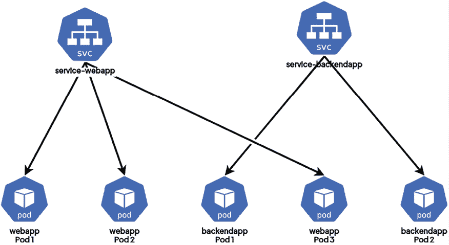
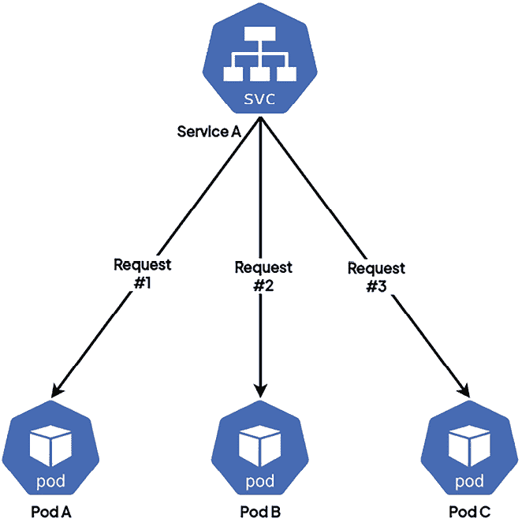
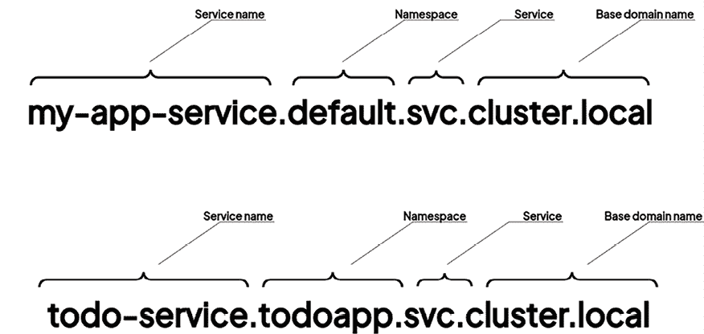
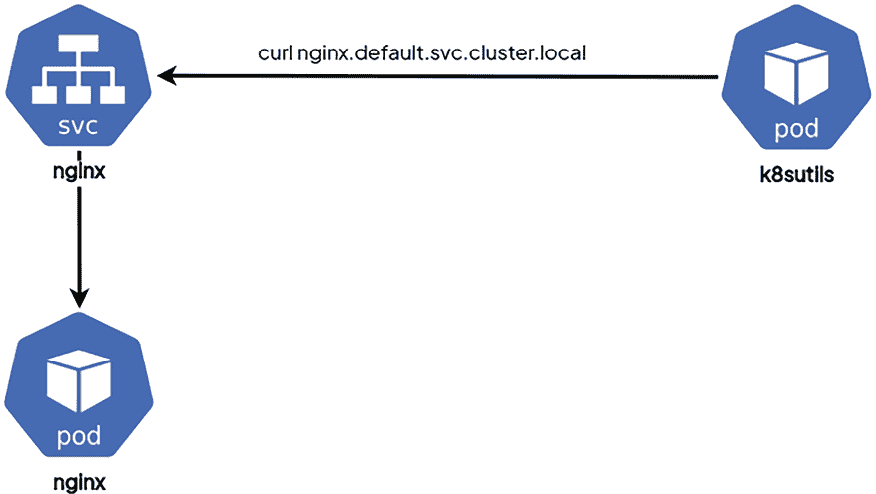
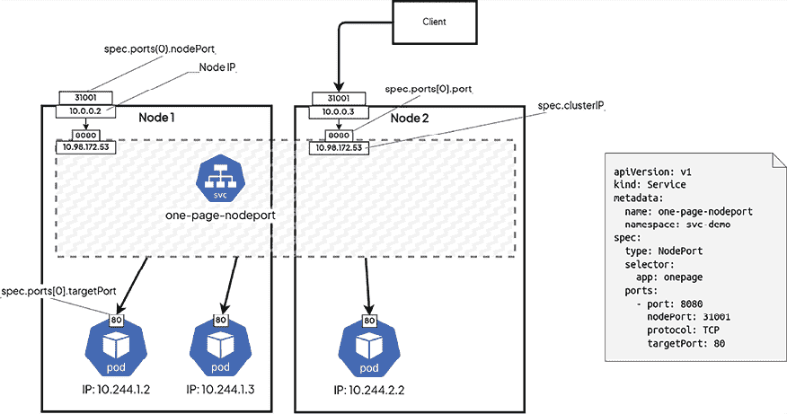
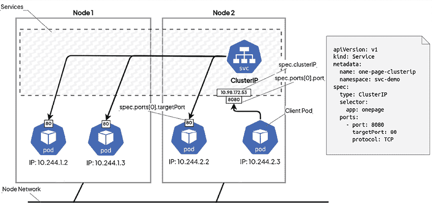
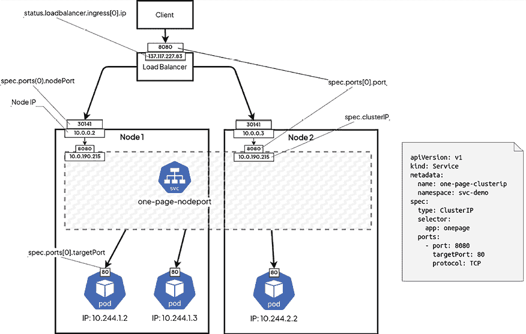
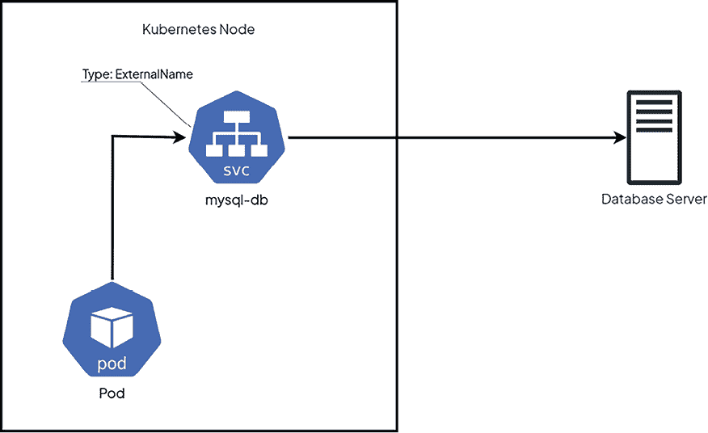
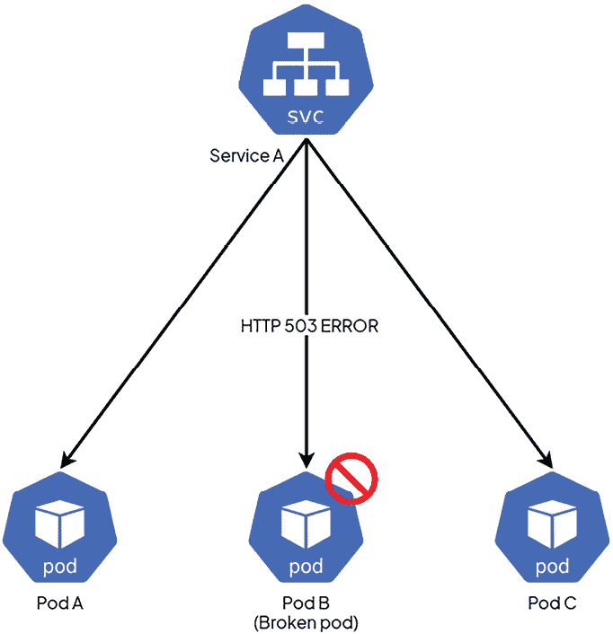

# 第八章：使用 Services 暴露你的 Pods

阅读了前几章之后，你现在已经知道如何通过构建 Pods 来部署应用程序，这些 Pods 可以包含一个容器，或者在更复杂的应用程序中包含多个容器。你还知道，通过将 Pods 和 **ConfigMaps** 一起使用，可以将应用程序与其配置解耦，并且 Kubernetes 也能够存储你的敏感配置，感谢 **Secret** 对象。

好消息是，凭借这三种资源，你可以开始在 Kubernetes 上正确地部署应用程序并让你的第一个应用程序运行。不过，你仍然缺少一些重要的东西：你需要能够将 Pods 暴露给终端用户，甚至暴露给 Kubernetes 集群中的其他 Pods。这就是 Kubernetes **Services** 的作用，我们现在就来探索这个概念！

在本章中，我们将学习一种新的 Kubernetes 资源类型，称为 Service。由于 Kubernetes Services 是一个涉及众多内容的大主题，本章将包含大量信息，内容也会比较多。但一旦你掌握了这些 Services，你就能暴露你的 Pods，并将终端用户连接到你的应用程序！

服务也是掌握 **高可用性** (**HA**) 和冗余的关键概念。在 Kubernetes 配置中，简单来说，掌握它们对于有效使用 Kubernetes 至关重要！

在本章中，我们将覆盖以下主要内容：

+   为什么你需要暴露你的 Pods？

+   `NodePort` Service

+   `ClusterIP` Service

+   `LoadBalancer` Service

+   `ExternalName` Service 类型

+   使用探针实现服务就绪状态

# 技术要求

要跟随本章中的示例，请确保你具备以下条件：

+   一个正常工作的 Kubernetes 集群（无论是本地的还是基于云的，都无关紧要）

+   一个正常工作的 `kubectl` **命令行界面** (**CLI**)，已配置与 Kubernetes 集群进行通信

你可以从官方 GitHub 仓库下载本章的最新代码示例，地址为 [`github.com/PacktPublishing/The-Kubernetes-Bible-Second-Edition/tree/main/Chapter08`](https://github.com/PacktPublishing/The-Kubernetes-Bible-Second-Edition/tree/main/Chapter08)。

# 为什么你需要暴露你的 Pods？

在前几章中，我们讨论了微服务架构，它通过 **表现层状态转移** (**REST**) **应用程序编程接口** (**APIs**) 暴露你的功能。这些 APIs 完全依赖于 **超文本传输协议** (**HTTP**)，这意味着你的微服务必须可以通过网络访问，因此必须通过 **互联网协议** (**IP**) 地址进行访问。

尽管 REST API 常用于微服务架构中的通信，但在服务之间的性能和效率至关重要的场景下，评估其他通信协议，如**gRPC**，是很重要的。gRPC 基于**HTTP/2**并使用二进制序列化（协议缓冲区），可以在分布式系统中提供显著的优势，例如更快的通信、更低的延迟和支持流媒体。在默认使用 REST 之前，考虑一下 gRPC 是否更适合你的系统需求。

在接下来的部分，我们将学习 Kubernetes 中的集群网络。

## Kubernetes 中的集群网络

网络是 Kubernetes 的一个基本方面，使容器、Pod、服务和外部客户端之间能够进行通信。了解 Kubernetes 如何管理网络有助于确保分布式环境中的顺利运行。Kubernetes 解决了四个关键的网络挑战：

+   **容器到容器的通信**：这通过 Pod 来解决，允许同一个 Pod 中的容器通过 localhost（即内部通信）进行通信。

+   **Pod 之间的通信**：Kubernetes 通过其网络模型实现了跨节点的 Pod 间通信。

+   **Pod 到服务的通信**：服务抽象了一组 Pod，并提供稳定的端点进行通信。

+   **外部到服务的通信**：这允许集群外部的流量访问服务，如 Web 应用程序或 API。

在 Kubernetes 集群中，多个应用程序运行在同一组机器上。这会带来一些挑战，例如，当不同的应用程序使用相同的网络端口时，如何防止冲突。

### Kubernetes 中的 IP 地址管理

Kubernetes 集群使用不重叠的 IP 地址范围来为 Pod、服务和节点分配地址。网络模型通过以下配置实现：

+   **Pods**：一个网络插件，通常是**容器网络接口**（**CNI**）插件，为 Pod 分配 IP 地址。

+   **服务**：kube-apiserver 负责为服务分配 IP 地址。

+   **节点**：节点的 IP 地址由 kubelet 或 cloud-controller-manager 管理。

你可以参考以下网站，了解更多 Kubernetes 中的网络知识：[`kubernetes.io/docs/concepts/cluster-administration/networking/`](https://kubernetes.io/docs/concepts/cluster-administration/networking/)。

现在，在探讨 Pod 网络和服务之前，让我们了解一下 Kubernetes 网络空间中的一些基础技术。

## 学习网络插件

**CNI**是由**云原生计算基金会**（**CNCF**）开发的一个规范和一组库。其主要目的是标准化 Linux 容器上网络接口的配置，实现容器与外部环境之间的无缝通信。

这些插件对于实现 Kubernetes 网络模型至关重要，确保集群内的连接性和通信。选择一个与您的 Kubernetes 集群需求和兼容性要求相匹配的 CNI 插件非常重要。在 Kubernetes 生态系统中有各种插件，包括开源和闭源插件，选择合适的插件对于确保集群顺利运行至关重要。

这里是 CNI 插件的简洁列表，每个插件的简要描述：

**开源 CNI 插件：**

+   **Calico**：提供网络和网络安全，重点是第 3 层连接性和细粒度的策略控制。

+   **Flannel**：一个简单的 CNI，为 Kubernetes 集群提供基本的网络功能，适合覆盖网络。

+   **Weave Net**：专注于简单的设置和加密，适用于云环境和本地环境。

+   **Cilium**：利用 **eBPF** 提供先进的安全功能和网络可观察性，完美适用于微服务架构。

**闭源 CNI 插件：**

+   **AWS VPC CNI**：将 Kubernetes Pods 与 AWS VPC 直接集成，实现无缝的 IP 管理和连接。

+   **Azure CNI**：允许 Pods 使用 Azure VNet 中的 IP 地址，确保与 Azure 网络基础设施的集成。

+   **VMware NSX-T**：为 VMware 环境中的 Kubernetes 提供先进的网络功能，如微分段和安全性。

在本书的一些练习中，我们将使用 Calico。现在，让我们了解什么是服务网格。

## 什么是服务网格？

**服务网格** 是微服务架构中不可或缺的基础设施层，促进服务间的通信。它包括服务发现、负载均衡、加密、认证和监控等功能，所有这些都在网络基础设施内实现。通常，服务网格是通过部署在各个服务旁边的轻量级代理来实现的，从而精确控制流量路由，并强制执行如速率限制和断路等策略。通过将复杂的网络任务抽象化，服务网格简化了微服务应用程序的开发、部署和管理，同时提高了可靠性、安全性和可观察性。著名的服务网格实现包括**Istio**、**Linkerd**和**Consul Connect**。然而，值得注意的是，这个话题超出了本书的范围。

接下来，我们将解释它们的用途以及它们如何帮助您暴露 Pod 启动的微服务。

## 理解 Pod 的 IP 分配

要理解什么是服务，我们需要再次讨论一下 Pods。在 Kubernetes 中，一切都是 Pod 管理：Pods 托管您的应用程序，并且它们具有一个特殊的属性。Kubernetes 在 Pods 被创建在您的集群中时会为其分配一个私有 IP 地址。记住这一点，因为它非常重要：集群中创建的每个 Pod 都会被 Kubernetes 分配一个唯一的 IP 地址。

为了说明这一点，我们将从创建一个 nginx Pod 开始。我们在这里使用 nginx 容器镜像来创建一个 Pod，但实际上，使用任何容器镜像创建 Pod 都会得到相同的结果。

让我们使用声明式的方法，结合以下 YAML 定义来完成这项操作：

```
# new-nginx-pod.yaml
apiVersion: v1
kind: Pod
metadata:
  name: new-nginx-pod
spec:
  containers:
  - image: nginx:1.17
    name: new-nginx-container
    ports:
    - containerPort: 80 
```

从之前的 YAML 文件中可以看到，这个名为 `new-nginx-pod` 的 Pod 没有什么特别之处，它只会基于 `nginx:1.17` 容器镜像启动一个名为 `new-nginx-container` 的容器。

一旦我们有了这个 YAML 文件，我们可以使用以下命令应用它，让 Pod 在我们的集群上运行：

```
$ kubectl apply -f new-nginx-pod.yaml
pod/new-nginx-pod.yaml created 
```

一旦调用这个命令，Pod 就会在集群中创建，并且在 Pod 被创建的瞬间，Kubernetes 会为其分配一个唯一的 IP 地址。

```
-o wide option, which will display the IP address as part of the output:
```

```
$  kubectl get po -o wide
NAME            READY   STATUS    RESTARTS   AGE   IP             NODE       NOMINATED NODE   READINESS GATES
new-nginx-pod   1/1     Running   0          99s   10.244.0.109   minikube   <none>           <none> 
```

在我们的例子中，IP 地址是 `10.244.0.109`。这个 IP 地址在我的 Kubernetes 集群中是唯一的，并且被分配给这个特定的 Pod。

当然，如果你在自己的集群中进行操作，你会看到不同的 IP 地址。这个 IP 地址是私有的 IPv4 地址，并且只存在于 Kubernetes 集群中。如果你尝试在浏览器中输入这个 IP 地址，你将不会得到任何响应，因为这个地址并不存在于外部网络或公共互联网中，它只存在于你的 Kubernetes 集群内。

无论你使用的是哪种云平台——无论是**Amazon Web Services**（**AWS**）、**Google Cloud Platform**（**GCP**）还是 Azure——Kubernetes 集群都利用云服务商提供的网络段。这个网络段通常被称为**虚拟私有云**（**VPC**），定义了一个私有且隔离的网络，类似于你本地局域网中的私有 IP 范围。在所有情况下，Kubernetes 使用的 CNI 插件确保每个 Pod 都被分配一个唯一的 IP 地址，从而在 Pod 层面提供细粒度的隔离。这一规则适用于所有云环境和本地环境。

我们现在将发现，这个 IP 地址分配是动态的，并且还会了解到它在规模化过程中可能会带来的问题。

## 理解 Kubernetes 中 Pod IP 分配的动态性

分配给 Pods 的 IP 地址不是静态的，如果你删除并重新创建一个 Pod，你会发现该 Pod 会获得一个新的 IP 地址，这个地址与之前使用的地址完全不同，即使是用相同的 YAML 配置重新创建的。为了演示这一点，我们来删除 Pod 并使用相同的 YAML 文件重新创建它，如下所示：

```
$ kubectl delete -f new-nginx-pod.yaml
pod/new-nginx-pod.yaml deleted
$ kubectl apply -f new-nginx-pod.yaml
pod/new-nginx-pod.yaml created 
```

现在我们可以再次运行 `kubectl get pods -o wide` 命令，来确认新的 IP 地址与之前的不同，如下所示：

```
$ kubectl get pods -o wide
NAME            READY   STATUS    RESTARTS   AGE   IP             NODE       NOMINATED NODE   READINESS GATES
new-nginx-pod   1/1     Running   0          97s   10.244.0.110   minikube   <none>           <none> 
```

现在，IP 地址是 `10.244.0.110`。这个 IP 地址与之前的 `10.244.0.109` 不同。

正如你所看到的，当一个 Pod 被销毁然后重新创建时，即使你用相同的名称和配置重新创建它，它也会有一个不同的 IP 地址。

原因是从技术上讲，这不是同一个 Pod 而是两个不同的 Pod；这就是为什么 Kubernetes 分配两个完全不同 IP 地址的原因。

现在，想象一下，您有一个应用程序访问那个使用其 IP 地址与之通信的 nginx Pod。如果由于某种原因删除并重新创建 nginx Pod，则您的应用程序将中断，因为该 IP 地址将不再有效。

在下一节中，我们将讨论为什么不建议在应用程序代码中硬编码 Pod IP 地址，并探讨在生产环境中所面临的挑战。我们还将探讨在 Kubernetes 中确保稳定微服务之间通信的更可靠方法。

## 在应用程序开发中不要硬编码 Pod 的 IP 地址

在生产环境中，依赖 Pod IP 地址进行应用程序通信带来了重大挑战。设计用于通过 HTTP 相互交互且依赖 TCP/IP 的微服务，需要一种可靠的方法来识别并连接彼此。

因此，建立一种强大的机制来检索 Pod 信息，而不仅仅是 IP 地址，是至关重要的。这样可以确保即使 Pod 在工作节点间被重新创建或重新调度，通信也能保持一致。

至关重要的是，应避免直接在应用程序中硬编码 Pod IP 地址，因为 Pod IP 地址是动态的。Pod 的短暂性质意味着它们可以被删除、重新创建或移动，这使得在应用程序的 YAML 中硬编码 Pod IP 地址的做法变得不可靠。如果具有硬编码 IP 的 Pod 被重新创建，依赖它的应用程序将由于 IP 解析为空而失去连接。

我们可以提供一些具体案例，说明这个问题可能会出现，如下所述：

+   运行微服务 *A* 的 Pod 有一个依赖项，并调用同一 Kubernetes 集群中另一个 Pod 上运行的微服务 *B*。

+   作为 Pod 运行的应用程序需要从同一 Kubernetes 集群上也作为 Pod 运行的 **MySQL** 服务器检索一些数据。

+   一个应用程序在同一集群中的多个 Pod 上部署了 **Redis 集群** 作为缓存引擎。

+   您的最终用户通过调用 IP 地址访问应用程序，由于 Pod 失败，该 IP 地址会发生变化。

任何时候当服务之间存在互联或任何网络通信时，都会出现这个问题。

解决此问题的方法是使用 Kubernetes **Service** 资源。

Service 对象将作为一个中间对象留在您的集群上。Service 不应被销毁，但即使被销毁，也可以重新创建而不会有任何影响，因为使用的是 Service 名称，而不是 IP 地址。实际上，它们可以长期保留在您的集群中而不会引起任何问题。Service 对象提供了一个抽象层，通过整个生命周期在网络层级上暴露在 Pod(s) 中运行的应用程序，而无需进行任何代码或配置更改。

## 理解 Services 如何将流量路由到 Pods

Kubernetes **Services** 作为集群中的资源存在，并充当网络流量管理的抽象层。Services 利用 CNI 插件促进客户端与后端 Pods 之间的通信。Services 通过创建服务端点实现这一点，服务端点代表一组 Pods，支持负载均衡并确保流量到达健康的实例。

Kubernetes Services 提供了一种静态且可靠的方式来访问集群中的 Pods。即使底层 Pods 因部署、扩展或重启而发生变化，它们提供的 DNS 名称也会保持不变。Services 利用 **服务发现** 机制和内部 **负载均衡** 有效地将流量路由到健康的 Pods。



图 8.1：service-webapp 正在暴露 webapp Pods 1、2 和 3，而 service-backendapp 正在暴露 backendapp Pods 1 和 2。

实际上，Services 作为资源类型部署到 Kubernetes，就像大多数 Kubernetes 对象一样，你可以使用交互式命令或声明式 YAML 文件将它们部署到集群中。

和 Kubernetes 中的其他资源一样，当你创建一个 Service 时，必须为它指定一个名称。Kubernetes 会使用这个名称来构建一个 DNS 名称，集群中的所有 Pods 都能访问这个名称。这个 DNS 条目会解析到你的 Service，它应该始终驻留在集群中。唯一有点棘手的部分是你需要为 Service 提供一个 Pods 列表：我们将在本章中学习如何做到这一点。别担心，这只是一个基于 **标签** 和 **选择器** 的配置。

一旦所有配置完成，你只需通过调用 Service 来访问 Pods。这个 Service 会接收请求并将其转发到 Pods。就这么简单！

## 理解 Kubernetes 中的轮询负载均衡

Kubernetes Services 一旦配置正确，就可以暴露一个或多个 Pods。当同一个 Service 暴露多个 Pods 时，使用轮询算法将请求均匀地负载均衡到背后的 Pods，如下图所示：



图 8.2：Service A 将三个请求代理到它背后的三个 Pods。在大规模情况下，每个 Service 将接收到由 Service 收到的 33% 请求。

扩展应用变得容易。只需通过 Pod 副本向 Service 添加更多的 Pods 即可。你将在*第十一章*，*使用 Kubernetes 部署无状态工作负载*中了解有关 Deployments 和副本的内容。由于 Kubernetes Service 实现了轮询逻辑，它可以将请求均匀地代理到其背后的 Pods。

Kubernetes Services 提供的不仅仅是轮询负载均衡。虽然轮询通常在使用 kube-proxy 的 IPVS 模式的设置中使用，但需要注意的是，iptables（许多发行版中的默认模式）通常使用随机或基于哈希的方法来分配流量。

Kubernetes 还支持其他负载均衡算法以满足各种需求：最少连接数用于平衡负载，源 IP 用于一致路由，甚至为更复杂的场景提供自定义逻辑。用户还应注意，IPVS 提供了更高级的流量管理功能，如会话亲和性和流量整形，而这些功能可能在 iptables 模式下不可用。

了解你的集群正在使用的模式（无论是 iptables 还是 IPVS）可以帮助你根据你的扩展和流量分配需求微调服务的行为。有关更多信息，请参考文档 ([`kubernetes.io/docs/reference/networking/virtual-ips/`](https://kubernetes.io/docs/reference/networking/virtual-ips/))。

如果前面的 Pod 有四个副本，那么每个副本大约会接收到该服务收到的所有请求的 25%。如果该服务背后有 50 个 Pod，那么每个 Pod 大约会接收到该服务收到的所有请求的 2%。你只需要理解的是，服务通过遵循特定的负载均衡算法，表现得像负载均衡器一样。

现在让我们探索如何从另一个 Pod 中调用 Kubernetes 中的服务。

## 了解如何在 Kubernetes 中调用服务

当你在 Kubernetes 中创建一个服务时，它会附加到两个非常重要的事物，如下所示：

+   一个 IP 地址，它是唯一且特定的（就像 Pod 获得它们自己的 IP 一样）

+   一个自动生成的内部 DNS 名称，它不会改变并且是静态的

你可以使用其中任何一个来访问服务，然后它将把你的请求转发到其后端配置的 Pod。大多数情况下，你会通过其生成的 DNS 名称调用该服务，它是容易确定且可预测的。让我们探索一下 Kubernetes 如何为服务分配 DNS 名称。

## 了解如何为服务生成 DNS 名称

为服务生成的 DNS 名称是根据其名称派生的。例如，如果你创建一个名为 `my-app-service` 的服务，它的 DNS 名称将是 `my-app-service.default.svc.cluster.local`。

这个比较复杂，所以我们将它分解成更小的部分，如下所示：



图 8.3：服务 FQDN

这两个活动部分是前两个部分，基本上是服务名称和它所在的命名空间。DNS 名称将始终以 `.svc.cluster.local` 字符串结尾。

因此，在任何时刻，只要你在集群中的任何地方尝试使用 `curl` 或 `wget` 调用 `my-app-service.default.svc.cluster.local` 地址，你就知道你会到达你的服务。

该名称将在从集群中的 Pod 执行时解析为该服务。但默认情况下，如果服务没有配置来获取要代理的 Pod 列表，它们不会代理任何内容。我们现在将探索如何做到这一点！

## 服务如何在 Kubernetes 中发现并将流量路由到 Pod

在 Kubernetes 中使用服务时，你经常会遇到“暴露”你的 Pods 这一概念。实际上，这就是 Kubernetes 用来表示服务正在将网络流量代理到 Pods 上的术语。这个术语无处不在：有一天你的同事可能会问你，“*哪个服务暴露了那个 Pod？*”以下截图显示了被暴露的 Pods：


图 8.4：Webapp Pods 1、2 和 3 通过 service-webapp 暴露，而 backendapp Pods 1 和 2 通过 service-backendapp 暴露。

你可以通过`kubectl`在一条命令中成功创建一个 Pod 和一个服务来暴露它，使用`--expose`参数。为了演示这个例子，我们创建一个 nginx Pod 和服务，如下所示。

我们还需要为命令提供一个端口，以指定该服务将在哪个端口上可访问：

```
$ kubectl run nginx --image nginx --expose=true --port=80
service/nginx created
pod/nginx created 
```

现在，让我们使用`kubectl`列出 Pods 和服务，以演示以下命令创建了这两个对象：

```
$ kubectl get po,svc nginx
NAME        READY   STATUS    RESTARTS   AGE
pod/nginx   1/1     Running   0          24s
NAME            TYPE        CLUSTER-IP      EXTERNAL-IP   PORT(S)   AGE
service/nginx   ClusterIP   10.111.12.100   <none>        80/TCP    24s 
```

如你从命令的输出结果中看到的那样，两个对象都已经创建。我们之前提到过，服务可以根据 Pod 的标签来查找需要暴露的 Pod。我们刚刚创建的`nginx` Pod 当然有一些标签。为了展示这些标签，我们可以运行`kubectl get pods nginx --show-labels`命令。

```
--show-labels parameter, which will display the labels as part of the output:
```

```
$  kubectl get po nginx --show-labels
NAME    READY   STATUS    RESTARTS   AGE   LABELS
nginx   1/1     Running   0          51s   run=nginx 
```

如你所见，一个名为`run`、值为`nginx`的标签被添加到了创建的`nginx` Pod 上。现在让我们描述一下`nginx`服务。它应该有一个与这个标签匹配的选择器。代码如下：

```
$ kubectl describe svc nginx
Name:              nginx
Namespace:         default
Labels:            <none>
Annotations:       <none>
Selector:          run=nginx
Type:              ClusterIP
IP Family Policy:  SingleStack
IP Families:       IPv4
IP:                10.111.12.100
IPs:               10.111.12.100
Port:              <unset>  80/TCP
TargetPort:        80/TCP
Endpoints:         10.244.0.9:80
Session Affinity:  None
Events:            <none> 
```

你可以清楚地看到，服务有一行叫做 `Selector`，它匹配了分配给`nginx` Pod 的标签。通过这种方式，两个对象之间建立了连接。我们现在可以 100% 确定，服务可以访问`nginx` Pod，并且一切应该正常工作。

请注意，如果你在实验室中使用 minikube，你将无法从集群外部访问该服务，因为 ClusterIP 服务只能从集群内部访问。你需要使用调试方法，如`kubectl port-forward`或`kubectl proxy`，来处理这种情况。你将在下一节中学习如何测试 ClusterIP 类型的服务。

此外，为了测试服务的访问，让我们创建一个临时的端口转发，如下所示：

```
$ kubectl port-forward pod/nginx 8080:80
Forwarding from 127.0.0.1:8080 -> 80
Forwarding from [::1]:8080 -> 80 
```

现在，打开另一个控制台并访问以下 URL：

```
$ curl 127.0.0.1:8080
<!DOCTYPE html>
<html>
...<removed for brevity>... 
```

在前面的代码片段中，端口`8080`是我们用于端口转发的本地主机端口，而 80 是 nginx 端口，用于暴露 Web 服务。

请注意，`kubectl port-forward`命令将持续运行，直到你通过 *Ctrl+C* 终止它。

虽然这样可以工作，但我们强烈建议你在生产环境中永远不要这么做。服务是高度可定制的对象，而`--expose`参数隐藏了它们的许多功能。相反，你应该使用声明式语法，并调整 YAML 文件以满足你的具体需求。

让我们通过使用`dnsutils`容器镜像来演示这一点。

## 使用调试工具 Pod 来调试你的服务。

由于您的服务是在集群内创建的，因此通常很难像我们之前提到的那样访问它们，特别是如果我们的 Pod 旨在仅在您的集群内保持可访问性，或者如果您的集群没有互联网连接等。

在这种情况下，最好在您的集群中部署一个调试 Pod，只需安装一些二进制文件即可运行基本的网络命令，例如`wget`、`nslookup`等。让我们使用我们的自定义实用容器镜像`quay.io/iamgini/k8sutils:debian12`来实现这个目的。

如果需要，您可以在实用容器镜像中添加更多工具或实用程序；参考`Chapter-070/Containerfile`获取源代码。

在这里，我们将通过调用暴露 Pod 的服务来对`nginx` Pod 的首页运行 curl。该服务的名称只是`nginx`。因此，我们可以忽略 Kubernetes 为其分配的 DNS 名称：`nginx.default.svc.cluster.local`。

如果您尝试从集群内部的 Pod 访问这个**统一资源定位符**（**URL**），您应该可以成功访问`nginx`首页。

下面的 Pod 定义将帮助我们使用`k8sutils`镜像创建一个调试 Pod。

```
# k8sutils.yaml
apiVersion: v1
kind: Pod
metadata:
  name: k8sutils
  namespace: default
spec:
  containers:
    - name: k8sutils
      image: **quay.io/iamgini/k8sutils:debian12**
      command:
        - sleep
        - "infinity"
      # imagePullPolicy: IfNotPresent
  restartPolicy: Always 
```

让我们运行以下命令，在我们的集群上启动`k8sutils` Pod：

```
$ kubectl apply -f k8sutils.yaml
pod/k8sutils created 
```

现在运行`kubectl get pods`命令，以验证 Pod 是否成功启动，如下所示：

```
$ kubectl get po k8sutils
NAME       READY   STATUS    RESTARTS   AGE
k8sutils   1/1     Running   0          13m 
```

太棒了！现在让我们从`k8sutils` Pod 运行`nslookup`命令来查询服务的 DNS 名称，如下所示：

```
$ kubectl exec -it k8sutils -- nslookup nginx.default.svc.cluster.local
Server:         10.96.0.10
Address:        10.96.0.10#53
Name:   nginx.default.svc.cluster.local
Address: 10.106.124.200 
```

在前面的代码片段中，

+   `Server: 10.96.0.10` - 是`kube-dns`服务的 IP 地址（`kubectl get svc kube-dns -n kube-system -o wide`）。如果您使用不同的 DNS 服务，请相应地检查服务详细信息。

+   `nginx.default.svc.cluster.local`解析为`nginx`服务的 IP 地址（`kubectl get svc nginx -o wide`），即`10.106.124`。

一切看起来都很好。现在让我们运行一个`curl`命令来检查我们是否可以获取`nginx`首页，如下所示：

```
$ kubectl exec -it k8sutils -- curl nginx.default.svc.cluster.local
...<removed for brevity>....
<body>
<h1>Welcome to nginx!</h1>
<p>If you see this page, the nginx web server is successfully installed and
working. Further configuration is required.</p>
...<removed for brevity>... 
```

这里一切都很完美！我们成功通过使用`k8sutils`调试 Pod 调用了`nginx`服务，如下截图所示：



图 8.5：k8sutils Pod 用于对 nginx 服务运行 curl，与服务背后的 nginx Pod 通信

请记住，您需要在集群内部署一个`k8sutils` Pod 以便调试服务。确实，`nginx.default.svc.cluster.local` DNS 名称不是公共名称，只能从集群内部访问。

让我们解释为什么不应该使用`expose`命令来暴露您的 Pod，在下一节中。

## 了解在 Kubernetes 中直接使用 kubectl expose 的缺点

不建议使用`kubectl expose`来创建服务，因为您无法控制服务的创建方式。默认情况下，`kubectl expose`将创建一个`ClusterIP`服务，但您可能希望创建一个`NodePort`服务。

也可以使用命令式语法定义 Service 类型，但最终你需要执行的命令将会非常长且难以理解。因此，我们鼓励你不要使用 `expose` 选项，而是对像 Service 这样复杂的对象使用声明式语法。

现在让我们讨论在 Kubernetes 中使用 Services 时，DNS 名称是如何生成的。

## 理解 DNS 名称是如何为 Services 生成的

你现在已经知道，Kubernetes 中的 Service 到 Pod 的通信完全依赖于 Pod 端的标签和 Service 端的选择器。

如果你没有正确使用这两者之间的配合，通信将无法建立。

流程如下：

1.  你创建了一些 Pods，并且随意设置了标签。

1.  你创建一个 Service，并配置其选择器以匹配 Pods 的标签。

1.  Service 启动后会查找与其选择器匹配的 Pods。

1.  你可以通过 DNS 或 IP 调用 Service（DNS 更为便捷）。

1.  Service 会将流量转发到与其标签匹配的某个 Pod。

如果你查看之前通过命令式风格和 `kubectl expose` 参数实现的例子，你会发现 Pod 和 Service 分别使用了合适的标签（在 Pod 端）和选择器（在 Service 端），这就是为什么 Pod 能够成功暴露的原因。请注意，在实际应用中，你需要为 Pods 使用合适的标签，而不是默认标签。

除此之外，你现在必须理解，Kubernetes 中不仅有一种类型的 Service，而是有几种类型的 Service——让我们更深入地了解一下。

## 理解不同类型的 Services

Kubernetes 中有几种类型的 Service。虽然 Kubernetes 中只有一种叫做 Service 的类型，但这种类型可以通过不同的配置来实现不同的效果。

幸运的是，不论你选择哪种类型的 Service，目标始终不变：使用单一的静态接口来暴露你的 Pods。

每种类型的 Service 都有其特定的功能和用途，因此基本上，每种用途都有对应的 Service。一个 Service 不能同时属于多种类型，但你仍然可以通过使用具有不同类型的两个 Service 对象来暴露相同的 Pods，只要这些 Service 对象的名称不同，Kubernetes 就能为其分配不同的 DNS 名称。

在本章中，我们将介绍三种主要类型的 Services，如下所示：

+   `NodePort`：这种类型将主机机器（工作节点）上的临时端口范围内的一个端口绑定到 Pod 上的一个端口，从而使其可以公开访问。通过调用主机机器的端口，你将能够访问关联的 Kubernetes Pod。这是从集群外部访问你的 Pods 的方法。

+   `ClusterIP`：`ClusterIP` 服务是用于 Kubernetes 集群内 Pod 之间私密通信的服务。这就是我们在本章中实验过的服务，也是 `kubectl expose` 默认创建的服务。它无疑是最常用的，因为它允许 Pod 之间的相互通信：正如它的名字所示，它有一个集群范围内设置的静态 IP 地址。通过访问该 IP 地址，你将被重定向到其背后的 Pod。如果有多个 Pod 在背后，`ClusterIP` 服务将提供负载均衡机制，采用轮询或其他算法。

+   `LoadBalancer`：Kubernetes 中的 `LoadBalancer` 服务简化了将 Pod 暴露给外部流量的过程。它通过在支持的云平台上自动配置一个云特定的负载均衡器（如 AWS ELB）来实现这一点。这消除了在云环境中手动设置外部负载均衡器的需求。然而，需要认识到，除非手动配置，否则该服务不支持裸金属或非云管理的集群。虽然 Terraform 等替代方案可以用于管理云基础设施，但 `LoadBalancer` 服务为无缝集成云原生负载均衡器到 Kubernetes 部署中提供了一个便捷的选项，特别是在以云为中心的场景中。请记住，它的适用性取决于你的具体需求和基础设施配置。

现在，让我们立即深入了解第一种类型的服务——`NodePort` 服务。

如前所述，这将非常有用，能够让我们在开发环境中通过将 Pod 绑定到 Kubernetes 节点的端口，从外部访问我们的 Pod。

# NodePort 服务

`NodePort` 是一种 Kubernetes 服务类型，旨在使 Pod 通过主机机器（工作节点）上可用的端口进行访问。在本节中，我们将深入了解这种类型的端口，并专注于 `NodePort` 服务！

## 为什么你需要 NodePort 服务？

首先要理解的是，`NodePort` 服务允许我们通过 Kubernetes 节点上的端口访问正在运行的 Pod。在你通过 `NodePort` 类型的服务暴露 Pod 后，你将能够通过获取节点的 IP 地址和 `NodePort` 服务的端口（如 `<node_ip_address>:<node port>`）来访问这些 Pod。

端口可以在你的 YAML 声明中声明，或者由 Kubernetes 随机分配。让我们通过声明一些 Kubernetes 对象来说明这一点。

大多数时候，`NodePort` 服务作为 Kubernetes 集群的入口点。在接下来的示例中，我们将基于 Docker Hub 上的 `containous/whoami` 容器镜像创建两个 Pod，这个容器镜像非常简洁，会简单地打印出容器的主机名。

我们将创建两个 Pods，以便得到两个具有不同主机名的容器，并通过`NodePort`服务暴露它们。

## 创建两个 containous/whoami Pods

让我们首先创建两个 Pods，别忘了添加一个或多个标签，因为我们将需要标签来告诉服务哪些 Pods 将被暴露。

我们还需要在 Pod 端打开端口。虽然这并不会使它自动暴露，但它会打开一个 Service 能够访问的端口。代码如下：

```
$ kubectl run whoami1 --image=containous/whoami --port 80 --labels="app=whoami"
pod/whoami1 created
$ kubectl run whoami2 --image=containous/whoami --port 80 --labels="app=whoami"
pod/whoami2 created 
```

现在，我们可以运行`kubectl get pods`命令来验证我们的两个 Pods 是否正确运行。我们还可以添加`--show-labels`参数，以便在命令输出中显示标签，如下所示：

```
$ kubectl get pods --show-labels
NAME      READY   STATUS    RESTARTS   AGE    LABELS
whoami1   1/1     Running   0          3m5s   app=whoami
whoami2   1/1     Running   0          3m     app=whoami 
```

一切看起来都正常！现在我们已经创建了两个带有标签的 Pods，我们将能够通过一个 Service 将它们暴露出去。接下来，我们将了解用于创建`NodePort`服务并暴露这两个 Pods 的 YAML 清单文件。

## 理解 NodePort YAML 定义

由于服务是相当复杂的资源，最好通过 YAML 文件而不是直接命令输入来创建服务。

这是将通过`NodePort`服务暴露`whoami1`和`whoami2` Pods 的 YAML 文件：

```
# ~/nodeport-whoami.yaml
apiVersion: v1
kind: Service
metadata:
  name: nodeport-whoami
spec:
  type: NodePort
  selector:
    app: whoami
  ports:
  - nodePort: 30001
    port: 80
    targetPort: 80 
```

这个 YAML 可能比较难理解，因为它涉及到三个不同的端口以及一个`selector`块。

在解释 YAML 文件之前，让我们先应用它并检查 Service 是否被正确创建，操作如下：

```
$ kubectl apply -f nodeport-whoami.yaml
service/nodeport-whoami created
$ kubectl get service nodeport-whoami
NAME              TYPE       CLUSTER-IP     EXTERNAL-IP   PORT(S)        AGE
nodeport-whoami   NodePort   10.98.160.98   <none>        80:30001/TCP   14s 
```

之前的`kubectl get services`命令表明 Service 已正确创建！

selector 块对于 NodePort 服务至关重要，它充当标签过滤器来确定服务暴露哪些 pods。它基本上告诉服务要将流量路由到哪些 pods。如果没有 selector，服务将保持不活动。在此示例中，selector 定位带有标签键“app”和标签值“`whoami`”的 pods。这将通过 Service 有效地暴露“`whoami1`”和“`whoami2`”两个 pods。

接下来，我们在`spec`下有一个`type`子键，用来指定我们的 Service 类型。当我们创建`ClusterIP`或`LoadBalancer`服务时，需要更新此行。在这里，我们创建的是`NodePort`服务，因此对我们来说这行是正确的。

最后一个比较难理解的部分是`ports`块。在这里，我们定义了多个端口组合的映射。我们指明了三个端口，如下所示：

+   `nodePort`: 您希望此`NodePort`服务可以从中访问的主机机器/工作节点上的端口。在这里，我们指定了端口`30001`，这使得此`NodePort`服务可以通过工作节点的 IP 地址上的端口`30001`进行访问。您将通过调用以下地址来访问此`NodePort`服务及其所暴露的 Pods：`<WORKER_NODE_IP_ADDRESS>:30001`。此`NodePort`设置不能随意设定。事实上，在默认的 Kubernetes 安装中，它只能是`30000`到`32767`范围内的端口。

+   `port`：此设置表示 `NodePort` 服务本身的端口。理解起来可能有点难，但 `NodePort` 服务确实有自己的端口，这就是你在此处指定它的地方。只要它是有效端口，你可以随便填入任何你想要的值。

+   `targetPort`：如你所料，`targetPort` 是目标 Pods 的端口。它是应用程序运行的地方：NodePort 会将流量转发到通过前述选择器找到的 Pod 上的端口。

这里有一张简明的图表来总结这一切：



图 8.6：NodePort 服务。NodePort 设置中涉及三个端口——nodePort 位于工作节点 n006Fde 上，端口位于 Service 本身，targetPort 位于顶部。

在这种情况下，TCP 端口 `31001` 被用作每个节点的外部端口。如果你没有指定 `nodePort`，它将使用动态分配的范围分配端口。对于内部通信，该服务仍然像一个简单的 `ClusterIP` 服务一样工作，你可以使用它的 `ClusterIP` 地址。

为了方便起见并减少复杂性，`NodePort` 服务端口和目标端口（Pod 的端口）通常定义为相同的值。

## 确保 NodePort 按预期工作

要尝试你的 `NodePort` 设置，首先要做的是获取运行该服务的机器的公共 IP 地址。在我们的例子中，我们使用的是本地的单机 Kubernetes 设置，并通过 `minikube` 运行。若在 AWS、GCP 或 Azure 上，你的节点可能拥有公共 IP 地址，或者如果通过 **虚拟专用网络**（**VPN**）访问节点，则可能是私有 IP 地址。

在 `minikube` 上，获取 IP 地址的最简单方法是执行以下命令：

```
$ minikube ip
192.168.64.2
Or you can access the full URL as follows.
$ minikube service --url nodeport-whoami
http://192.168.49.2:30001 
```

现在我们有了所有信息，可以打开浏览器并输入 URL 来访问 `NodePort` 服务和正在运行的 Pods。你应该能看到轮询算法的执行，访问 `whoami1` 然后是 `whoami2`，依此类推。`NodePort` 服务正在按预期工作！

## 这个设置是生产就绪的吗？

这个问题可能没有明确的答案，因为它取决于你的配置。

`NodePort` 提供了一种通过在节点端口上暴露 Pods 来将其公开到外部世界的方式。在当前的设置中，你没有高可用性（HA）：如果你的两个 Pods 出现故障，你将无法自动重新启动它们，因此你的服务将无法将流量转发到任何地方，导致最终用户体验较差。

请注意，当我们使用 Deployments 和 replicasets 创建 Pods 时，Kubernetes 会在其他可用节点中创建新的 Pods。我们将在*第十一章*《使用 Kubernetes 部署无状态工作负载》中学习 Deployments 和 replicasets。

另一个问题是端口选择的限制。事实上，默认情况下，你只能使用 `30000-32767` 范围内的端口，而这种限制对很多人来说会很不方便。实际上，如果你想暴露一个 HTTP 应用程序，你可能会希望使用前端机器的 `80` 或 `443` 端口，而不是 `30000` 到 `32767` 范围内的端口，因为所有的 web 浏览器都将 `80` 和 `443` 端口配置为标准 HTTP 和 **HTTPS**（**HTTP Secure**）端口。

解决方案是使用分层架构。事实上，许多 Kubernetes 架构师倾向于不将 `NodePort` 服务暴露为架构中的第一层，而是将 Kubernetes 集群放置在反向代理后面，例如 AWS 应用负载均衡器（AWS Application Load Balancer）等。Kubernetes 的两个其他概念是 `Ingress` 和 `IngressController` 对象：这两个对象允许你直接从 Kubernetes 对象配置反向代理，例如 `nginx` 或 HAProxy，并帮助你将应用程序作为 Kubernetes 入口的第一层使其公开可访问。但这已经超出了 Kubernetes 服务的范围。

让我们在接下来的章节中探索更多有关 `NodePort` 的信息，包括如何列出服务以及如何将 Pods 添加到 `NodePort` 服务。

## 列出 NodePort 服务

列出 `NodePort` 服务可以通过使用 `kubectl` 命令行工具来实现。你只需要执行 `kubectl get services` 命令来获取集群中创建的服务。

```
$ kubectl get service
NAME              TYPE        CLUSTER-IP       EXTERNAL-IP   PORT(S)        AGE
example-service   ClusterIP   10.106.224.122   <none>        80/TCP         26d
kubernetes        ClusterIP   10.96.0.1        <none>        443/TCP        26d
nodeport-whoami   NodePort    10.100.85.171    <none>        80:30001/TCP   21s 
```

话虽如此，现在让我们来了解如何更新 `NodePort` 服务，以便使其执行我们想要的操作。

## 向 NodePort 服务添加更多的 Pods

如果你想将 Pod 添加到服务所提供的池中，这是非常容易的。事实上，你只需要添加一个与服务定义的标签选择器匹配的新 Pod——Kubernetes 会处理剩下的工作。这个 Pod 将成为服务所提供池的一部分。如果你删除一个 Pod，它将在进入 `Terminating` 状态后被从服务池中删除。

Kubernetes 基于 Pod 可用性来处理服务流量——例如，如果你有三个副本的 web 服务器，其中一个出现故障，创建一个匹配服务标签选择器的新副本就足够了。你将在后面的 *第十一章*，*使用 Kubernetes 部署无状态工作负载* 中发现，这种行为可以完全自动化。

## 描述 NodePort 服务

描述 `NodePort` 服务非常简单，可以通过 `kubectl describe` 命令来实现，就像任何其他 Kubernetes 对象一样。让我们在以下命令的输出中探索 `nodeport-whoami` 服务的详细信息：

```
$ kubectl describe Service nodeport-whoami:
Name:                     nodeport-whoami
...<removed for brevity>...
**Selector:                 app=whoami**
Type:                     NodePort
IP Family Policy:         SingleStack
IP Families:              IPv4
**IP:                       10.98.160.98**
IPs:                      10.98.160.98
Port:                     <unset>  80/TCP
TargetPort:               80/TCP
NodePort:                 <unset>  30001/TCP
**Endpoints:                10.244.0.16:80,10.244.0.17:80**
...<removed for brevity>... 
```

在上述输出中，我们可以看到几个详细信息，包括以下内容：

+   `IP:10.98.160.98`：分配给服务的 `ClusterIP`。这是集群中其他服务可以用来访问此服务的内部 IP 地址。

+   `Port: <unset> 80/TCP`：该服务监听端口 `80` 并使用 TCP 协议。`<unset>` 表示该端口没有指定名称。

+   `NodePort: <unset> 30001/TCP`：`NodePort` 是集群中每个节点上的端口，通过这个端口外部流量可以访问该服务。在这里，它设置为端口 `30001`，允许通过任何节点的 IP 地址和端口 `30001` 来访问该服务。

+   `Endpoints: 10.244.0.16:80, 10.244.0.17:80`：服务背后实际的 Pods 的 IP 地址和端口。在这种情况下，两个 Pods 支持该服务，可以通过 `10.244.0.16:80` 和 `10.244.0.17:80` 访问。

在接下来的部分，我们将学习如何使用 `kubectl delete svc` 命令删除一个服务。

## 删除服务

删除服务，无论它是否为 `NodePort` 服务，都不应频繁进行。事实上，虽然 Pods 应该是易于删除和重建的，但服务应该是长期存在的。它们为你的 Pod 提供了一种一致的暴露方式，删除它们将影响到你的应用程序如何被访问。

因此，你在删除服务时需要小心：它不会删除服务背后的 Pods，但这些 Pods 将无法再从集群外部访问！

以下是删除用来暴露 `whoami1` 和 `whoami2` Pods 的服务的命令：

```
$ kubectl delete svc/nodeport-whoami
service "nodeport-whoami" deleted 
```

现在你可以运行 `kubectl get svc` 命令来检查服务是否已正确删除，然后通过刷新网页浏览器再次访问它。你会发现应用程序不再可访问，但 Pods 将继续存在于集群中。Pods 和服务有完全独立的生命周期。如果你想删除 Pods，那么你需要单独删除它们。

你可能还记得我们在创建 nginx Pod 并测试显示主页时使用的 `kubectl port-forward` 命令。你可能认为 `NodePort` 和 `kubectl port-forward` 是相同的，但它们并不是。接下来的部分，我们将简要解释这两者之间的区别。

## NodePort 还是 kubectl port-forward？

将 `NodePort` 服务与 `kubectl port-forward` 命令进行比较可能会很有诱惑力，因为到目前为止，我们已经使用这两种方法通过网页浏览器访问集群中正在运行的 Pod。

`kubectl port-forward` 命令是一个测试工具，而 `NodePort` 服务则用于实际应用场景，并且是一个生产就绪的功能。

请记住，`kubectl port-forward` 必须保持在终端会话中开启才能工作。一旦该命令被终止，端口转发也会停止，且你的应用程序将再次无法从集群外部访问。它只是一个测试工具，供 `kubectl` 用户使用，并且是 `kubectl` CLI 中捆绑的有用工具之一。

另一方面，`NodePort` 确实是为了生产环境使用的，并且是一个长期的生产就绪解决方案。它不需要 `kubectl` 就能工作，并且使您的应用程序可以被任何调用该服务的人访问，只要该服务配置正确，Pods 标签正确。

简单来说，如果您只需要测试应用程序，使用 `kubectl port-forward`。如果您需要将 Pod 真正暴露到外部世界，选择 `NodePort`。不要为了测试而创建 `NodePort`，也不要在生产环境中使用 `kubectl port-forward`！每种用例都选择合适的工具！

现在，我们将探索另一种 Kubernetes 服务类型，叫做 `ClusterIP`。这可能是最广泛使用的一种，甚至比 `NodePort` 类型还要常用！

# ClusterIP 服务

现在，我们将了解另一种服务类型，称为 `ClusterIP`。实际上，`ClusterIP` 是 Kubernetes 提供的最简单的服务类型。有了 `ClusterIP` 服务，您可以暴露您的 Pod，使得 Kubernetes 中的其他 Pods 可以通过其 IP 地址或 DNS 名称与其通信。

## 为什么需要 `ClusterIP` 服务？

`ClusterIP` 服务类型与 `NodePort` 服务类型非常相似，但它们有一个很大的区别：`NodePort` 服务旨在将 Pod 暴露给外部世界，而 `ClusterIP` 服务旨在将 Pod 暴露给 Kubernetes 集群内部的其他 Pod。

事实上，`ClusterIP` 服务允许同一集群中的不同 Pods 通过静态接口互相通信：即 `ClusterIP` 服务对象本身。

`ClusterIP` 完全解决了我们在 `NodePort` 服务中遇到的对静态 DNS 名称或 IP 地址的需求：如果 Pod 失败、被重新创建、删除、重新启动等等，那么 Kubernetes 会为其分配另一个 IP 地址。`ClusterIP` 服务通过提供一个仅能从集群内部访问的内部 DNS 名称，解决了这个问题，该名称会解析到由标签选择器定义的 Pods。

正如 `ClusterIP` 这个名字所暗示的，这种服务会在集群内分配一个静态 IP 地址！现在让我们来看看如何使用 `ClusterIP` 暴露我们的 Pods！请记住，`ClusterIP` 服务不能从集群外部访问——它们仅用于集群内部 Pod 之间的通信。

## 我怎么知道我需要 `NodePort` 还是 `ClusterIP` 服务来暴露我的 Pods？

选择这两种服务类型非常简单，基本上是因为它们不是为同样的用途设计的。

如果你需要让你的应用程序可以从集群外部访问，那么你需要一个`NodePort`服务（或者本章后面将探讨的其他服务），但如果你的需求是让应用程序从集群内部访问，那么你需要一个`ClusterIP`服务。`ClusterIP`服务也适用于可以扩展、销毁、重新创建等的无状态应用程序。原因在于，`ClusterIP`服务将维持对整个 Pod 池的静态入口点，而不受工作节点端口的限制，这与`NodePort`服务不同。

`ClusterIP`服务通过 kube-proxy 在每个节点上管理的内部可见虚拟 IP 地址来暴露 Pods。这意味着该服务仅能在集群内部访问。我们已经在下面的图表中展示了`ClusterIP`服务的原理：



图 8.7：`ClusterIP`服务

在前面的图片中，`ClusterIP`服务配置成将来自其 IP 和 TCP 端口`8080`的请求映射到容器的 TCP 端口`80`。实际的`ClusterIP`地址是动态分配的，除非你在规格中明确指定了一个。Kubernetes 集群中的内部 DNS 服务负责将`nginx-deployment-example`名称解析为实际的`ClusterIP`地址，作为服务发现的一部分。

kube-proxy 负责节点上虚拟 IP 地址的管理，并相应地调整转发规则。Kubernetes 中的服务本质上是集群内的逻辑构造。集群内并没有为每个服务单独运行物理进程来处理代理。而是，kube-proxy 基于这些逻辑服务执行必要的代理和路由操作。

与`NodePort`服务不同，`ClusterIP`服务不会占用工作节点的一个端口，因此无法从 Kubernetes 集群外部访问。

请记住，没有任何东西可以阻止你为同一组 Pods 使用两种类型的服务。实际上，如果你有一个应用程序需要对外部可访问，但又需要私密地暴露给其他 Pods，那么你可以简单地创建两个服务，一个是`NodePort`服务，另一个是`ClusterIP`服务。

在这个特定的用例中，你只需要为这两个服务命名不同，以便在创建时避免与`kube-apiserver`发生冲突。没有其他任何东西能阻止你这样做！

## 列出`ClusterIP`服务

列出`ClusterIP`服务非常简单。它基本上与用于`NodePort`服务的命令相同。这里是要运行的命令：

```
$ kubectl get svc 
```

与往常一样，这个命令会列出服务，并将其类型添加到输出中。

## 使用命令式方法创建`ClusterIP`服务

创建`ClusterIP`服务可以通过多种不同的方法来实现。由于它是一个广泛使用的功能，因此有很多方法可以创建这些服务，如下所示：

+   使用`--expose`参数或`kubectl expose`方法（命令式方式）

+   使用 YAML 清单文件（声明式方式）

命令式方式是使用`--expose`方法。这将通过`kubectl run`命令直接创建`ClusterIP`服务。在以下示例中，我们将创建一个`nginx-clusterip` Pod，并创建一个`ClusterIP`服务来同时暴露它们。使用`--expose`参数还需要定义`ClusterIP`端口。`ClusterIP`将监听端口，以使 Pod 可访问。代码如下所示：

```
$ kubectl run nginx-clusterip --image nginx --expose=true --port=80
service/nginx-clusterip created
pod/nginx-clusterip created 
```

正如你所看到的，我们得到了一个 Pod 和一个暴露它的服务。让我们来描述这个服务。

## 描述 ClusterIP 服务

描述`ClusterIP`服务的过程与描述 Kubernetes 中任何类型的对象相同，使用`kubectl describe`命令来完成。你只需要知道服务的名称，即可进行描述。

这里，我将访问之前创建的`ClusterIP`服务：

```
$ kubectl describe svc/nginx-clusterip
Name:              nginx-clusterip
Namespace:         default
Labels:            <none>
Annotations:       <none>
**Selector:          run=nginx-clusterip**
Type:              ClusterIP
IP Family Policy:  SingleStack
IP Families:       IPv4
IP:                10.101.229.225
IPs:               10.101.229.225
Port:              <unset>  80/TCP
TargetPort:        80/TCP
Endpoints:         10.244.0.10:80
Session Affinity:  None
Events:            <none> 
```

该命令的输出显示了`Selector`块，表明`ClusterIP`服务是通过`--expose`参数创建的，并且已正确配置标签。这个标签与我们同时创建的`nginx-clusterip` Pod 相匹配。为了确认这一点，让我们显示该 Pod 的标签，如下所示：

```
$ kubectl get pods/nginx-clusterip --show-labels
NAME              READY   STATUS    RESTARTS   AGE   LABELS
nginx-clusterip   1/1     Running   0          76s   **run=nginx-clusterip** 
```

正如你所看到的，服务上的选择器与 Pod 上定义的标签相匹配。因此，二者之间建立了通信。接下来，我们将从集群中的另一个 Pod 直接调用`ClusterIP`服务。

由于`ClusterIP`服务名为`nginx-clusterip`，我们知道它可以通过这个地址访问：`nginx-clusterip.default.svc.cluster.local`。

让我们重用`k8sutils`容器，如下所示：

```
$ kubectl exec k8sutils -- curl nginx-clusterip.default.svc.cluster.local
  % Total    % Received % Xferd  Average Speed   Time    Time     Time  Current
                                 Dload  Upload   Total   Spent    Left  Speed
  0     0    0     0    0     0      0      0 --:--:-- --:--:-- --:--:--     0<!DOCTYPE ...<removed for brevity>...
<body>
<h1>Welcome to nginx!</h1>
<p>If you see this page, the nginx web server is successfully installed and
working. Further configuration is required.</p>
 ...<removed for brevity>... 
```

`ClusterIP`服务正确地将请求转发到 nginx Pod，我们确实看到了 nginx 的默认首页。服务正常工作！

这次我们没有使用`containous/whoami`作为 Web 服务，但请记住，`ClusterIP`服务内部也在执行负载均衡，采用轮询算法。如果你在`ClusterIP`服务后有 10 个 Pod，并且该服务接收到 1,000 个请求，那么每个 Pod 将收到 100 个请求。

现在让我们了解如何使用 YAML 创建`ClusterIP`服务。

## 使用声明式方式创建`ClusterIP`服务

`ClusterIP`服务也可以通过应用 YAML 配置文件对`kube-apiserver`来声明式创建。

这是一个 YAML 清单文件，我们可以用它来创建与之前命令式创建的完全相同的`ClusterIP`服务：

```
# clusterip-service.yaml
apiVersion: v1
kind: Service
metadata:
  name: nginx-clusterip
spec:
  type: ClusterIP # Indicates that the service is a ClusterIP
  ports:
    - port: 80 # The port exposed by the service
      protocol: TCP
      targetPort: 80 # The destination port on the pods
  selector:
    run: nginx-clusterip 
```

花点时间阅读 YAML 中的注释，特别是关于`port`和`targetPort`的部分。

确实，`ClusterIP`服务具有独立于 Pod 端暴露端口的端口。你通过调用其 DNS 名称及端口来访问`ClusterIP`服务，流量将被转发到匹配标签和选择器的 Pods 的目标端口。

请记住，这里没有涉及工作节点端口。我们在讨论 `ClusterIP` 场景时提到的端口与主机机器完全无关！

在继续下一节之前，你可以通过以下方式删除 `nginx-clusterip` 服务来清理环境：

```
$ kubectl delete  svc nginx-clusterip
service "nginx-clusterip" deleted 
```

请记住，删除集群不会删除它暴露的 Pods。这是一个不同的过程；你需要单独删除 Pods。接下来我们将介绍一个与 `ClusterIP` 服务相关的额外资源——无头服务。

## 理解无头服务

无头服务源自 `ClusterIP` 服务。它们技术上不是一种专用类型的服务（如 `NodePort` 或 `ClusterIP`），而是 `ClusterIP` 的一种选项。

无头服务可以通过在 `ClusterIP` 服务的 YAML 配置文件中将 `.spec.clusterIP` 选项设置为 `None` 来配置。以下是从我们之前的 YAML 文件中派生的示例：

```
# clusterip-headless.yaml
apiVersion: v1
kind: Service
metadata:
  name: nginx-clusterip-headless
spec:
  clusterIP: None
  type: ClusterIP # Indicates that the service is a ClusterIP
  ports:
  - port: 80 # The port exposed by the service
    protocol: TCP
    targetPort: 80 # The destination port on the pods
  selector:
    run: nginx-clusterip 
```

一个无头服务大致由一个没有负载均衡和没有预分配 `ClusterIP` 地址的 `ClusterIP` 服务组成。因此，负载均衡逻辑和与 Pod 的接口不由 Kubernetes 定义。

由于无头服务没有 IP 地址，你将直接访问其背后的 Pod，而没有代理和负载均衡逻辑。无头服务的作用是返回背后 Pods 的 DNS 名称，以便你可以直接访问它们。这里仍然存在一些负载均衡逻辑，但它是在 DNS 层面实现的，而不是作为 Kubernetes 的逻辑。

当你使用普通的 `ClusterIP` 服务时，你将始终访问分配给该服务的一个静态 IP 地址，这将作为与其背后 Pod 通信的代理。使用无头服务时，`ClusterIP` 服务只会返回背后 Pods 的 DNS 名称，客户端将负责与其选择的 DNS 名称建立连接。

Kubernetes 中的无头服务主要用于需要与单个 Pod 直接通信的场景，而不是与单一端点或负载均衡的 Pods 集合进行通信。

当你想与集群状态服务（如**轻量目录访问协议**（**LDAP**））建立连接时，无头服务非常有用。在这种情况下，你可能想使用一个 LDAP 客户端，它将能够访问托管 LDAP 服务器的 Pods 的不同 DNS 名称，而这不能通过普通的 `ClusterIP` 服务实现，因为普通的 `ClusterIP` 服务会带来一个静态 IP 地址以及 Kubernetes 的负载均衡实现。现在，让我们简要介绍另一种类型的服务，叫做 `LoadBalancer`。

# 负载均衡服务

`LoadBalancer` 服务非常有趣，因为它依赖于 Kubernetes 集群所在的云平台。为了使其工作，必须使用支持 `LoadBalancer` 服务类型的云平台上的 Kubernetes。

对于提供外部负载均衡器的云服务提供商，指定`type`字段为`LoadBalancer`会为你的服务配置负载均衡器。负载均衡器的创建是异步进行的，关于所提供负载均衡器的详细信息将在服务的`.status.loadBalancer`字段中提供。

某些云服务提供商提供定义`loadBalancerIP`的选项。在这种情况下，负载均衡器会使用指定的`loadBalancerIP`进行生成。如果没有提供`loadBalancerIP`，负载均衡器将配置为一个临时 IP 地址。然而，如果你在不支持此功能的云服务提供商上指定了`loadBalancerIP`，则提供的`loadBalancerIP`将被忽略。

对于类型设置为 LoadBalancer 的服务，`.spec.loadBalancerClass`字段允许你使用云服务提供商默认负载均衡器以外的负载均衡器实现。当`.spec.loadBalancerClass`未指定时，`LoadBalancer`类型的服务将自动使用云服务提供商提供的默认负载均衡器实现，前提是集群已使用`--cloud-provider`组件标志配置了云服务提供商。然而，如果你指定了`.spec.loadBalancerClass`，则表示一个与指定类匹配的负载均衡器实现正在积极监控服务。在这种情况下，任何默认的负载均衡器实现，例如云服务提供商提供的负载均衡器，将忽略设置了该字段的服务。需要注意的是，`spec.loadBalancerClass`只能在`LoadBalancer`类型的服务上设置，并且一旦设置，就不能更改。此外，`spec.loadBalancerClass`的值必须符合标签样式的标识符格式，前缀可选，如`internal-vip`或`example.com/internal-vip`，而不带前缀的名称保留给终端用户使用。

以下图表展示了 Kubernetes `Loadbalancer`类型服务的原理：



图 8.8：LoadBalancer 服务

在下一节中，我们将学习支持`LoadBalancer`服务类型的云服务提供商。

## 支持`LoadBalancer`服务类型的云服务提供商

并非所有云服务提供商都支持`LoadBalancer`服务类型，但我们可以列出几个支持的服务提供商。它们如下：

+   AWS

+   GCP

+   Azure

+   OpenStack

这个列表并不详尽，但值得注意的是，所有三大主要公共云服务提供商都受支持。

如果你的云服务提供商受支持，请记住，负载均衡的逻辑将由云服务提供商实现：你对流量如何从 Kubernetes 路由到你的 Pods 的控制较少，你需要了解你的云服务提供商的负载均衡器组件如何工作。将其视为作为 Kubernetes 资源实现的第三方组件。

## 是否应该使用 LoadBalancer 服务类型？

这个问题很难回答，但许多人因以下几个原因倾向于不使用`LoadBalancer`服务类型。

主要原因是，`LoadBalancer`服务几乎无法从 Kubernetes 进行配置。事实上，如果必须使用云服务提供商，最好通过提供商提供的工具进行配置，而不是通过 Kubernetes 来配置。`LoadBalancer`服务类型是一个通用的方式来提供`LoadBalancer`服务，但无法暴露云服务提供商可能提供的所有高级功能。

此外，云服务提供商提供的负载均衡器通常会产生额外费用，具体费用取决于提供商和处理的流量量。

在接下来的章节中，我们将学习另一种服务类型，称为`ExternalName`服务。

# ExternalName 服务类型

`ExternalName`服务是一种强大的方式，可以将你的 Kubernetes 集群连接到外部资源，如数据库、API 或托管在集群外部的服务。它们通过将集群中的服务映射到 DNS 名称而不是集群内的 Pod 来工作。这使得集群内的应用程序能够无缝访问外部资源，而无需知道其 IP 地址或内部细节。

```
ExternalName type Service YAML definition:
```

```
# externalname-service.yaml
apiVersion: v1
kind: Service
metadata:
  name: mysql-db
  namespace: prod
spec:
  type: ExternalName
  externalName: app-db.database.example.com 
```

它是如何工作的：你无需将外部名称或 IP 地址链接到内部 Pod，而是简单地在服务配置中定义一个 DNS 名称，如`app-db.database.example.com`。现在，当集群中的应用程序尝试访问`mysql-db`时，魔法发生了——集群的 DNS 服务将它们指向你的外部数据库！它们与数据库的交互是无缝的，就像任何其他服务一样，但重定向发生在 DNS 级别，保持了简洁和透明。



图 8.9：ExternalName 服务类型

`ExternalName`服务可以是托管在另一个 Kubernetes 命名空间中的服务，Kubernetes 集群外部的服务，托管在另一个 Kubernetes 集群中的服务，等等。

这种方法有几个好处：

+   **简化配置**：应用程序只需要知道服务名称，而不需要了解外部资源的详细信息，这使得配置变得更加简单。

+   **灵活的资源管理**：如果你稍后将数据库迁移到集群内，你只需更新服务并在集群内管理它，而不会影响到应用程序。

+   **增强的安全性**：像 IP 地址这样的敏感信息会隐藏在集群内，从而提高整体安全性。

记住，`ExternalName`服务的重点是连接到外部资源。如果是集群内的资源访问，请使用常规服务或无头服务。

现在我们已经学习了 Kubernetes 中的不同服务类型，接下来让我们探索如何使用探针来确保服务可用性。

# 使用探针实现服务就绪性

当你创建一个 Service 来暴露运行在 Pods 中的应用程序时，Kubernetes 不会自动验证该应用程序的健康状况。Pods 可能已经启动并运行，但应用程序本身可能仍然存在问题，而 Service 将继续向其路由流量。这可能导致用户或其他应用程序接收到错误或完全没有响应。为了防止这种情况发生，Kubernetes 提供了名为探针的健康检查机制。在接下来的部分，我们将探讨不同类型的探针——存活探针、就绪探针和启动探针——以及它们如何帮助确保你的应用程序正常运行。

## 什么是 ReadinessProbe，为什么需要它？

`ReadinessProbe`与`LivenessProbe`一起，是掌握 Kubernetes 中提供最佳用户体验的重要方面。我们将首先了解如何实现`ReadinessProbe`以及它如何帮助确保容器已完全准备好接受流量。

就技术而言，Readiness probes 并不是 Services 的一部分，但在了解 Kubernetes Services 的同时，了解这个特性非常重要。

正如 Kubernetes 中的所有功能一样，`ReadinessProbe`是为了解决一个问题而实现的。这个问题是：如何确保 Pod 在可以接收流量之前完全准备好，可能是来自 Service 的流量。

Services 遵循一个简单规则：它们会向每个与其标签选择器匹配的 Pod 提供流量。一旦 Pod 被分配，如果该 Pod 的标签与集群中 Service 的选择器匹配，那么该 Service 将立即开始向它转发流量。这可能会导致一个简单的问题：如果应用程序尚未完全启动，因为它有一个缓慢的启动过程，或者需要从远程 API 获取一些配置，等等，那么它可能会在准备好之前就收到来自 Services 的流量。结果将是一个糟糕的**用户体验**（**UX**）。

为确保此场景永远不会发生，我们可以使用名为`ReadinessProbe`的功能，这是一种需要添加到 Pod 配置中的附加配置。

当 Pod 配置了就绪探针时，它可以向控制平面发送信号，表示它还没有准备好接收流量，而当 Pod 尚未准备好时，Services 将不会向其转发流量。让我们来看看如何实现就绪探针。

## 实现 ReadinessProbe

`ReadinessProbe`的实现通过向 Pod 的 YAML 清单添加一些配置数据来完成。请注意，它与`Service`对象本身无关。通过向 Pod 对象中的容器`spec`添加一些配置，你基本上可以告诉 Kubernetes，在 Pod 完全准备好之前，它不能接收来自 Services 的流量。

`ReadinessProbe`可以有三种不同的类型，如下所述：

+   `Command`：在 Pod 内部发出一个命令，该命令应以退出代码`0`完成，表示 Pod 已准备好。

+   `HTTP`：一个 HTTP 请求，该请求应以响应码>=`200`且<`400`完成，表示 Pod 已准备好。

+   `TCP`：发起 TCP 连接尝试。如果连接建立，Pod 就准备好了。

这是一个 YAML 文件，配置了带有 HTTP 类型准备性探测的 nginx Pod：

```
# nginx-pod-with-readiness-http.yaml
apiVersion: v1
kind: Pod
metadata:
  name: nginx-pod-with-readiness-http
spec:
  containers:
    - name: nginx-pod-with-readiness-http
      image: nginx
      readinessProbe:
        initialDelaySeconds: 5
        periodSeconds: 5
        httpGet:
          path: /ready
          port: 80 
```

如您所见，我们在`readinessProbe`键下有两个重要的输入，如下所示：

+   `initialDelaySeconds`，表示探测在进行第一次健康检查之前将等待的秒数

+   `periodSeconds`，表示探测在两个连续健康检查之间将等待的秒数

准备性探测将定期重放，两个检查之间的间隔将由`periodSeconds`参数定义。

在我们的示例中，`ReadinessProbe`将针对`/ready`路径进行 HTTP 调用。如果此请求收到的 HTTP 响应代码>= `200` 且 < `400`，则探测将成功，Pod 将被视为健康。

`ReadinessProbe`是非常重要的。在我们的示例中，被调用的端点应该测试应用程序是否真的处于能够接收流量的状态。因此，尝试调用与实际应用程序状态相关的端点。例如，您可以尝试调用一个页面，该页面将内部打开一个 MySQL 连接，以确保应用程序能够与数据库通信（如果它使用的是数据库），等等。如果您是开发人员，不要犹豫，创建一个专用的端点，该端点仅打开与不同后端的连接，以确保应用程序确实已经准备好。

然后，Pod 将加入由 Service 提供服务的池，并开始接收流量。`ReadinessProbe`也可以配置为 TCP 和命令，但我们将这些示例保留给`LivenessProbe`。现在，让我们来探索它们吧！

## 什么是 LivenessProbe，它为什么重要？

`LivenessProbe`与`ReadinessProbe`非常相似。事实上，如果您以前使用过任何云服务提供商，您可能已经听说过“健康检查”这一概念。`LivenessProbe`基本上就是健康检查。

Liveness 探测用于确定 Pod 是否处于故障状态，`LivenessProbe`特别适用于像 Web 服务这样的长期运行的进程。假设有一个情况，您的 Service 正在将流量转发到三个 Pod，其中一个 Pod 出现故障。服务无法自行检测到这一点，它们会继续将流量转发到这三个 Pod，包括故障的那个 Pod。在这种情况下，33%的请求必然会导致错误响应，导致用户体验差，如以下截图所示：



图 8.10：其中一个 Pod 出现故障，但 Service 仍然会将流量转发给它

您希望避免这种情况， 为此，您需要一种方法来检测 Pod 故障的情况，并且需要一种方法来终止这种容器，使其不再处于由 Service 指向的 Pod 池中。

`LivenessProbe`是解决这个问题的方案，它是在 Pod 级别实现的。需要小心的是，`LivenessProbe`无法修复 Pod：它只能检测 Pod 不健康并命令其终止。让我们看看如何实现一个带有`LivenessProbe`的 Pod。

## 实现 LivenessProbe

`LivenessProbe`是一个定期执行的健康检查，用于长期跟踪应用程序的状态。这些健康检查由`kubelet`组件执行，可以是不同类型的，正如这里所列：

+   **Command**，你在容器中发出一个命令，命令的结果将告诉你 Pod 是否健康（退出码=`0`表示健康）

+   **HTTP**，你对 Pod 发出一个 HTTP 请求，它的结果告诉你 Pod 是否健康（HTTP 响应码>=`200`且<`400`意味着 Pod 健康）

+   **TCP**，在这里你定义一个 TCP 调用（成功连接意味着 Pod 健康）

+   **GRPC**，如果应用程序支持并实现了 gRPC 健康检查协议

每个 livenessProbe 都需要你输入一个名为`periodSeconds`的参数，必须是一个整数。该参数告诉`kubelet`组件在执行新的健康检查之前等待的秒数。你还可以使用另一个名为`initialDelaySeconds`的参数，它表示执行第一次健康检查之前等待的秒数。实际上，在一些常见的情况下，健康检查可能会导致应用程序被标记为不健康，仅仅是因为检查太早执行了。这就是为什么在执行第一次健康检查之前等待一段时间可能是个好主意，这个参数就是为此提供帮助的。

`LivenessProbe`配置是在 Pod 的 YAML 配置清单中实现的，而不是在 Service 中实现的。Pod 中的每个容器都可以有自己的`livenessProbe`。

### HTTP livenessProbe

Kubernetes 中的 HTTP 探针提供了额外的可定制字段，如主机、方案、路径、头部和端口，可以精细调整健康检查请求如何发送到应用程序。这里是一个配置文件，它通过对 nginx 容器中的`/healthcheck`端点进行 HTTP 调用来检查 Pod 是否健康：

```
# nginx-pod-with-liveness-http.yaml
apiVersion: v1
kind: Pod
metadata:
  name: nginx-pod-with-liveness-http
spec:
  containers:
    - name: nginx-pod-with-liveness-http
      image: nginx
      livenessProbe:
        initialDelaySeconds: 5
        periodSeconds: 5
        httpGet:
          path: /healthcheck
          port: 80
          httpHeaders:
            - name: My-Custom-Header
              value: My-Custom-Header-Value 
```

请注意`livenessProbe`块之后的所有部分。如果你理解这一点，你会看到我们将在执行第一次健康检查前等待 5 秒钟，然后每 5 秒钟对端口`80`上的`/healthcheck`路径进行一次 HTTP 调用。一个自定义 HTTP 头部已经被添加。添加这样的头部将有助于在访问日志中识别我们的健康检查。需要小心的是，`/healthcheck`路径可能在我们的 nginx 容器中不存在，因此该容器将永远不会被视为健康，因为活跃探针将返回`404` HTTP 响应。请记住，要使 HTTP 健康检查成功，必须返回一个 HTTP 响应代码>=`200`且<`400`。`404`不在此范围内，因此答复的 Pod 不会被视为健康。

### 命令型 livenessProbe

你也可以使用命令来检查 Pod 是否健康。让我们获取相同的 YAML 配置，但这次我们将在存活探针中使用命令而不是 HTTP 调用，如下所示：

```
# nginx-pod-with-liveness-command.yaml
apiVersion: v1
kind: Pod
metadata:
  name: nginx-pod-with-liveness-command
spec:
  containers:
    - name: nginx-pod-with-liveness-command
      image: nginx
      livenessProbe:
        initialDelaySeconds: 5
        periodSeconds: 5
        exec:
          command:
            - cat
            - /hello/world 
```

如果你查看这个示例，你会发现它比 HTTP 健康检查要简单得多。这里，我们基本上每 5 秒运行一次 `cat /hello/world` 命令。如果文件存在且 `cat` 命令以退出代码 `0` 完成，则健康检查成功。否则，如果文件不存在，健康检查将失败，Pod 将永远不会被视为健康，并且会被终止。

### TCP 型 livenessProbe

在这种情况下，我们将尝试连接到 `80` 端口的 TCP 套接字。如果连接成功建立，健康检查将通过，容器将被认为已准备好。否则，健康检查将失败，Pod 最终会被终止。代码如下所示：

```
# nginx-pod-with-liveness-tcp.yaml
apiVersion: v1
kind: Pod
metadata:
  name: nginx-pod-with-liveness-tcp
spec:
  containers:
    - name: nginx-pod-with-liveness-tcp
      image: nginx
      livenessProbe:
        initialDelaySeconds: 5
        periodSeconds: 5
        tcpSocket:
          port: 80 
```

使用 TCP 健康检查与使用 HTTP 健康检查非常相似，因为 HTTP 是基于 TCP 的。但如果你要监控一个不基于 HTTP 协议的应用，且使用该命令对你来说无关紧要（例如在健康检查 LDAP 连接时），那么使用 TCP 作为存活探针尤其有用。

### 使用命名端口配置 TCP 和 HTTP 型 livenessProbe

你可以使用命名端口来配置 `livenessProbe`，适用于 HTTP 和 TCP 类型（但不适用于 gRPC），如下所示：

```
# nginx-pod-with-liveness-http-named-port.yaml
apiVersion: v1
kind: Pod
metadata:
  name: nginx-pod-with-liveness-http-named-port
spec:
  containers:
    - name: nginx-pod-with-liveness-http-named-port
      image: nginx
      ports:
        - name: liveness-port
          containerPort: 8080
          hostPort: 8080
      livenessProbe:
        initialDelaySeconds: 5
        periodSeconds: 5
        httpGet:
          path: /healthcheck
          port: liveness-port 
```

在前面的示例中，`liveness-port` 已在 `ports` 部分中定义，并在 `livenessProbe` 的 `httpGet` 中使用。

既然我们已经探讨了多种存活探针，让我们在下一节学习 `startupProbe`。

## 使用 `startupProbe`

传统应用程序有时在首次启动时需要更多时间。这在设置存活探针时可能会造成困境，因为快速的响应时间对于检测死锁至关重要。

解决方案在于使用 `initialDelaySeconds` 或专门的 `startupProbe`。`initialDelaySeconds` 参数允许你推迟首次就绪探针的执行，为应用程序提供初始化的时间。

然而，若需要更精细的控制，可以考虑使用 `startupProbe`。这个探针与存活探针（命令、HTTP 或 TCP 检查）类似，但具有更长的 `failureThreshold * periodSeconds` 时长。这个扩展的等待时间确保应用程序有足够的时间进行初始化，才会被认为已准备好接收流量，同时仍然能让存活探针在之后迅速检测到问题，正如以下的 YAML 片段所示：

```
# nginx-pod-with-startupprobe.yaml
apiVersion: v1
kind: Pod
metadata:
  name: nginx-pod-with-startupprobe
spec:
  containers:
    - name: nginx-pod-with-startupprobe
      image: nginx
      ports:
        - name: liveness-port
          containerPort: 8080
          hostPort: 8080
      livenessProbe:
        initialDelaySeconds: 5
        periodSeconds: 5
        httpGet:
          path: /healthcheck
          port: liveness-port
      startupProbe:
        httpGet:
          path: /healthz
          port: liveness-port
        failureThreshold: 30
        periodSeconds: 10 
```

正如你在上面的示例代码中看到的，确实可以结合使用多个探针来确保应用程序准备好提供服务。在接下来的部分中，我们还将学习如何同时使用 `ReadinessProbe` 和 `LivenessProbe`。

## 同时使用 ReadinessProbe 和 LivenessProbe

你可以在同一个 Pod 中同时使用 `ReadinessProbe` 和 `LivenessProbe`。

它们的配置方式几乎相同——它们的目的并不完全相同，且可以一起使用。请注意，这两个探针共享以下参数：

+   `initialDelaySeconds`：在执行第一次探针前等待的秒数。

+   `periodSeocnds`：两个探针之间的秒数。

+   `timeoutSeconds`：在超时之前等待的秒数。

+   `successThreshold`：将 Pod 视为已准备好（对于 `ReadinessProbe`）或健康（对于 `LivenessProbe`）的成功尝试次数。

+   `failureThreshold`：将 Pod 视为未准备好（对于 `ReadinessProbe`）或准备好被终止（对于 `LivenessProbe`）的失败尝试次数。

+   `TerminationGracePeriodSeconds`：在强制停止容器之前，给予容器优雅关闭的宽限期（默认继承 Pod 层级的值）。

我们现在已经了解了`ReadinessProbe`和`LivenessProbe`，并且本章关于 Kubernetes 服务和实现方法的内容已经结束。

# 总结

本章内容较为密集，涵盖了在 Kubernetes 中应用的网络知识。服务就像 Pods 一样：它们是 Kubernetes 的基础，掌握它们对使用这个编排工具至关重要。

总体来说，本章我们了解到，Pods 拥有动态 IP 分配，在创建时会获得一个唯一的 IP 地址。为了建立一个可靠的连接方式来连接到你的 Pods，你需要一个被称为 `Service` 的代理。我们还了解到 Kubernetes 服务可以有多种类型，每种类型的服务都旨在解决特定的需求。我们还发现了 `ReadinessProbe` 和 `LivenessProbe` 是什么，以及它们如何帮助你设计健康检查，确保 Pods 在准备好和存活时能接收到流量。

在下一章，我们将继续探索 Kubernetes 的基础知识，了解 `PersistentVolume` 和 `PersistentVolumeClaims` 的概念，它们是 Kubernetes 处理持久化数据的方法。如果你希望在 Kubernetes 集群上构建和提供有状态应用程序，如数据库或文件存储解决方案，这将是一个非常有趣的章节。

# 进一步阅读

+   服务、负载均衡与网络: [`kubernetes.io/docs/concepts/services-networking/`](https://kubernetes.io/docs/concepts/services-networking/)

+   Kubernetes 无头服务: [`kubernetes.io/docs/concepts/services-networking/service/#headless-services`](https://kubernetes.io/docs/concepts/services-networking/service/#headless-services)

+   配置 Liveness、Readiness 和 Startup 探针: [`kubernetes.io/docs/tasks/configure-pod-container/configure-liveness-readiness-startup-probes/`](https://kubernetes.io/docs/tasks/configure-pod-container/configure-liveness-readiness-startup-probes/)

+   网络策略: [`kubernetes.io/docs/concepts/services-networking/network-policies/`](https://kubernetes.io/docs/concepts/services-networking/network-policies/)

+   声明网络策略：https://kubernetes.io/docs/tasks/administer-cluster/declare-network-policy/

+   默认网络策略：[`kubernetes.io/docs/concepts/services-networking/network-policies/#default-policies`](https://kubernetes.io/docs/concepts/services-networking/network-policies/#default-policies)

+   EndpointSlices：[`kubernetes.io/docs/concepts/services-networking/endpoint-slices/`](https://kubernetes.io/docs/concepts/services-networking/endpoint-slices/)

+   网络插件：[`kubernetes.io/docs/concepts/extend-kubernetes/compute-storage-net/network-plugins/`](https://kubernetes.io/docs/concepts/extend-kubernetes/compute-storage-net/network-plugins/)

+   集群网络： [`kubernetes.io/docs/concepts/cluster-administration/networking/`](https://kubernetes.io/docs/concepts/cluster-administration/networking/)

# 加入我们的 Discord 社区

加入我们社区的 Discord 空间，与作者和其他读者一起讨论：

[`packt.link/cloudanddevops`](https://packt.link/cloudanddevops)


