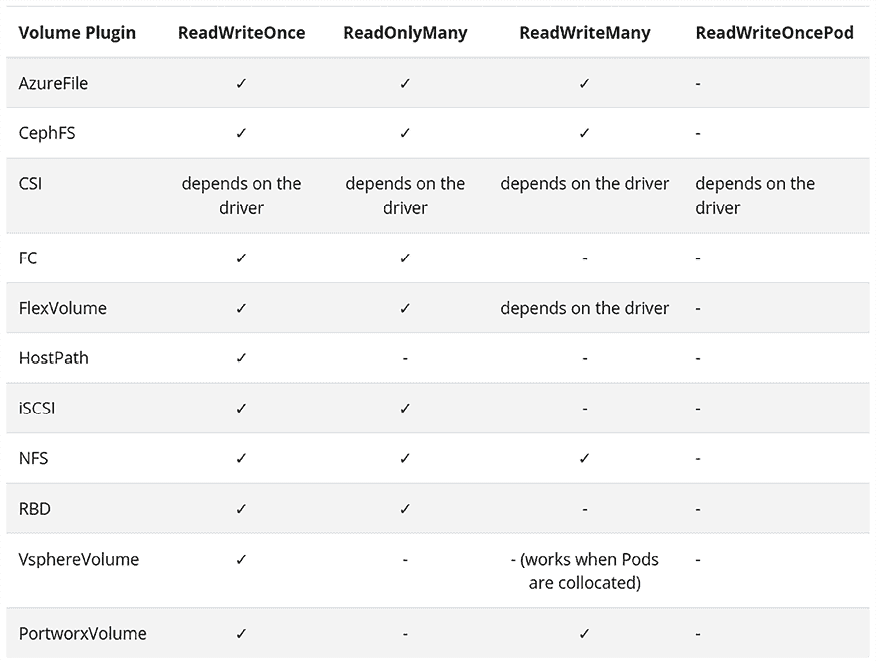
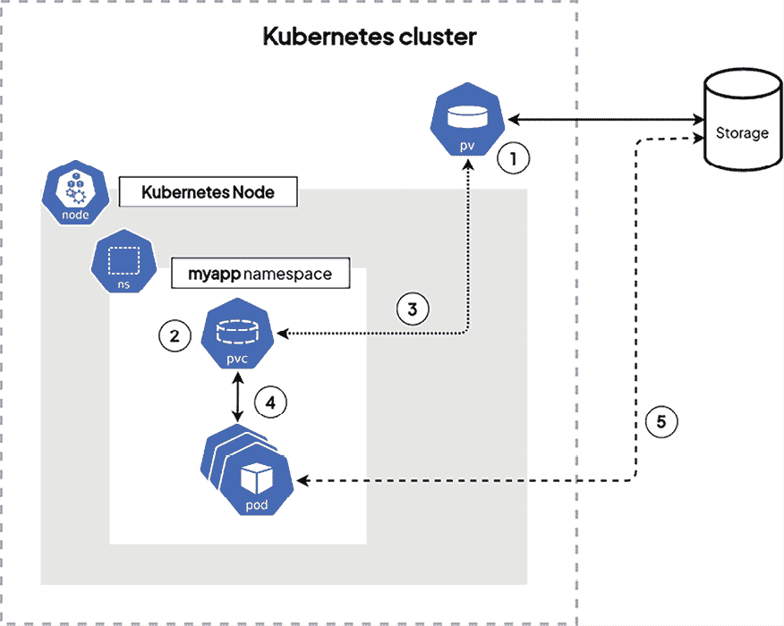
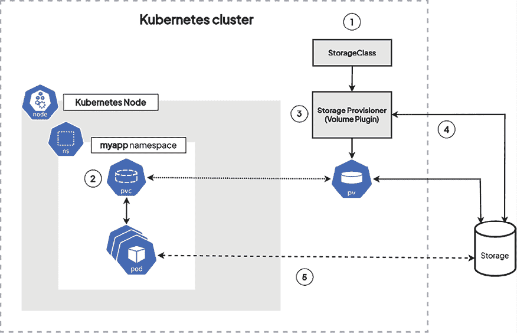

# 9

# Kubernetes 中的持久化存储

在前面的章节中，我们学习了 Kubernetes 的关键概念，而本章将是关于这些概念的最后一章。到目前为止，我们已经发现 Kubernetes 的核心目标是通过在其`etcd`数据存储中创建一个对象，表示所需的状态，从而将所有传统的 IT 层转化为集群中的实际计算资源。

本章将重点讨论有状态应用的持久化存储。与其他资源抽象一样，这将是我们需要掌握的一组对象，用以在集群中获得持久化存储。Kubernetes 通过使用`PersistentVolume`资源类型来实现持久化存储，它有其自己的机制。说实话，这些内容最初可能相对难以理解，但我们将逐一探索并深入讲解它们！

本章将涵盖以下主要主题：

+   为什么要使用持久化存储？

+   理解如何将`PersistentVolume`挂载到你的 Pod 中

+   理解 Kubernetes 中`PersistentVolume`对象的生命周期

+   理解静态和动态`PersistentVolume`配置

+   高级存储主题

# 技术要求

+   一个可用的 Kubernetes 集群（无论是本地集群还是云端集群）

+   配置好的工作`kubectl`命令行工具，用于与集群通信

如果你没有满足这些技术要求，可以参考*第二章*，*Kubernetes 架构——从容器镜像到运行的 Pod*，以及*第三章*，*安装 Kubernetes 集群*，以获取这两个先决条件。

你可以从官方 GitHub 仓库下载本章的最新代码示例，地址为[`github.com/PacktPublishing/The-Kubernetes-Bible-Second-Edition/tree/main/Chapter09`](https://github.com/PacktPublishing/The-Kubernetes-Bible-Second-Edition/tree/main/Chapter09)。

# 为什么要使用持久化存储？

存储是 IT 世界中的一个重要资源，因为它提供了一种逻辑方式来**创建**、**读取**、**更新**和**删除**（**CRUD**）信息，从员工工资单的 PDF 文件格式到 PB 级的医疗记录。虽然存储是向用户提供相关信息的关键元素，但容器和微服务应该是无状态的。换句话说，在运行的容器中保存的信息在重新调度或迁移到其他集群时将不可用。微服务也同理；数据组件应该解耦，允许微服务保持微型，不关心数据的状态和可用性，也不关心在重新调度时的情况。

那么，我们将应用数据保存在哪里呢？可以保存到任何类型的数据存储中，从业务连续性的角度来看，如果相关的数据存储运行在与微服务相同的 Kubernetes 集群中，它应该具有与应用相关的复制机制。但请记住，Kubernetes 是一个资源协调器，它会根据你为应用定义的期望状态进行操作。当你配置 Pods 时，你可以定义将要使用的存储组件，给容器提供创建、读取、更新和删除数据的方式。让我们探索 Kubernetes 提供的持久化数据的不同选项。

## 引入卷

存储抽象的第一层是访问 Kubernetes 对象并将它们挂载到容器中，像数据卷一样。这可以为以下内容完成：

+   一个 ConfigMap

+   一个 Secret

+   一个 ServiceAccount 令牌（与 Secret 相同）

这使得应用团队能够将微服务的配置与容器或部署定义解耦。如果我们考虑到应用的生命周期，外部服务的凭证、证书或令牌可能需要刷新，或者配置参数可能需要更新。出于明显的安全原因，我们不希望这些信息被硬编码在部署清单或容器镜像中。

让我们看一下一个带有清单 `nginx-configmap.yaml` 的 configMap 示例：

```
# nginx-configmap.yaml
apiVersion: v1
kind: ConfigMap
metadata:
  name: nginx-hello
  labels:
    app: test
immutable: false
data:
  hello1.html: |
    <html>
      hello world 1
    </html>
  hello2.html: |
    <html>
      hello world 2
    </html> 
```

这个 `ConfigMap` 有两个定义，分别对应两个不同的文件，我们将使用清单 `nginx-pod.yaml` 将它们挂载到 NGINX Pod 中：

```
# nginx-pod.yaml
apiVersion: v1
kind: Pod
metadata:
  name: nginx-hello
  labels:
    app: test
spec:
  containers:
    - name: nginx
      image: nginx:1.14.2
      ports:
        - containerPort: 80
      volumeMounts:
        - name: nginx-hello
          mountPath: "/usr/share/nginx/html/hello"
  volumes:
    - name: nginx-hello
      configMap:
        name: nginx-hello 
```

让我们应用这两个清单：

```
$ kubectl apply -f nginx-configmap.yaml
configmap/nginx-hello created
$ kubectl apply -f nginx-pod.yaml
pod/nginx-hello created 
```

让我们验证这两个对象的状态：

```
$ kubectl get pod,cm
NAME              READY   STATUS    RESTARTS   AGE
pod/nginx-hello   1/1     Running   0          7m26s
NAME                         DATA   AGE
configmap/kube-root-ca.crt   1      7d17h
configmap/nginx-hello        2      7m31s 
```

验证我们提供的挂载路径 `/usr/share/nginx/hello` 中是否有文件：

```
$ kubectl exec -t pod/nginx-hello -- ls -al /usr/share/nginx/html/hello/
total 12
...<removed for brevity>...
lrwxrwxrwx 1 root root   18 Sep  7 21:19 hello1.html -> ..data/hello1.html
lrwxrwxrwx 1 root root   18 Sep  7 21:19 hello2.html -> ..data/hello2.html 
```

让我们通过 `port-forward` 验证数据是否通过 NGINX 提供，以避免设置服务：

```
$ kubectl port-forward nginx-hello 8080:80
Forwarding from 127.0.0.1:8080 -> 80
Forwarding from [::1]:8080 -> 80 
```

在第二个终端中，你可以使用 `curl` 请求这两个 URL：

```
$ curl 127.0.0.1:8080/hello/hello1.html
<html>
  hello world 1
</html>
$ curl 127.0.0.1:8080/hello/hello2.html
<html>
  hello world 2
</html> 
```

尽管这是一个很好的开始，但这些对象的一个限制是你可以存储的数据量。由于它依赖于 `etcd` 数据存储系统，为避免性能问题，限制为 1.5 MB（参见 [`etcd.io/docs/v3.5/dev-guide/limit`](https://etcd.io/docs/v3.5/dev-guide/limit)）。因此，下一组对象将允许你的应用存储更多的数据，实际上，可以存储与托管这些卷对象的系统能够存储的所有数据。

让我们考虑一个具有两个工作节点的 Kubernetes 集群，在这些节点上可以调度 Pods，并探索以下五种卷类型：

+   一个 `emptyDir`

+   一个 `hostPath`

+   本地卷

+   一个**光纤通道** (**FC**) 块磁盘

+   一个**网络文件系统** (**NFS**) 卷导出

前三种类型，`emptyDir`、`hostPath` 和本地卷，有两个主要的限制：

+   它们仅限于它们所在工作节点上可用的磁盘空间。

+   它们绑定到 Pod 将要部署的节点。如果你的 Pod 部署在工作节点 1 上，数据将只存储在工作节点 1 上。

这些卷类型可能会导致服务降级，甚至更糟，例如出现脑裂（split-brain）情形。如果工作节点 1 变得不健康，导致 Pod 被重新调度到工作节点 2，则应用程序将在没有数据的情况下启动，可能会导致严重的服务中断。

请注意，有些应用程序具有原生的复制引擎。此类应用程序的典型部署会运行两个副本，并在每个节点上创建一个 `hostPath` 卷。在这种情况下，如果一个工作节点变得不健康，应用程序会出现降级，但只是在高可用性和性能方面。

作为 Kubernetes 集群的计算资源之外的外部资源，最后两种类型的卷，FC 块存储和 NFS 卷，解决了上述的弱点，但引入了更多的复杂性。虽然前三种类型的卷不需要与存储管理员交互，但最后两种类型需要。简单来说，您的存储管理员将需要：

+   在**存储区域网络**（**SAN**）中提供一个**逻辑单元号**（**LUN** – FC 块存储磁盘），并通过 FC 光纤网络连接到 Kubernetes 工作节点，并允许通过 zoning 配置进行访问。

+   在连接到企业网络并且可以被您的 Kubernetes 工作节点访问的**网络附加存储** (**NAS**) 上提供数据空间，并允许通过导出策略进行访问。

请注意，测试这两种类型的卷需要专用设备，并且设置过程并不简单，尽管 NAS 在家庭实验室中越来越受欢迎。然而，从 Kubernetes 的角度来看，这些卷的配置与 configMap 示例一样简单。以下是修改后的 NGINX Pod 定义版本：

+   对于 FC 卷（`nginx-pod-fiberchannel.yaml`）：

    ```
    ...
        - name: nginx
          image: nginx:1.14.2
          ports:
            - containerPort: 80
          volumeMounts:
            - name: fc-vol
              mountPath: "/usr/share/nginx/html/hello"
      volumes:
        - name: fc-vol
          fc:
            targetWWNs:
              - 500a0982991b8dc5
              - 500a0982891b8dc5
            lun: 2
            fsType: ext4
            readOnly: true 
    ```

`fc` 部分是您的 SAN 和 LUN 必须配置的地方。

+   对于 NFS 卷（`nginx-pod-nfs-volume.yaml`）：

    ```
    ...
      containers:
        - name: nginx
          image: nginx:1.14.2
          ports:
            - containerPort: 80
          volumeMounts:
            - name: nfs-volume
              mountPath: "/usr/share/nginx/html/hello"
      volumes:
        - name: nfs-volume
          nfs:
            server: nfs.corp.mycompany.org
            path: /k8s-nginx-hello
            readOnly: true 
    ```

`nfs` 部分是您的 NAS 和导出卷必须配置的地方。

请注意以下几点：

+   这两种类型的卷，FC 块存储和 NFS，将根据 Pod 的存在需求附加到节点。

+   虽然这两种类型的卷可以解决一系列挑战，但它们代表了配置与资源解耦的反模式。

+   虽然 configMap 作为卷挂载在容器上，并包含两个 HTML 文件，但其他类型的卷需要不同的方法来注入数据。

+   还有其他类型的存储卷可供选择：[`kubernetes.io/docs/concepts/storage/volumes/`](https://kubernetes.io/docs/concepts/storage/volumes/)。

在 Kubernetes 中，卷的概念是部署有状态应用程序的一个很好的起点。然而，由于某些卷的限制、其他卷的复杂性以及所需的存储知识，似乎很难通过这种对象定义来扩展数百个或数千个微服务。幸运的是，通过增加一个抽象层，Kubernetes 提供了一种无关存储的方式，通过使用 `PersistentVolume` 对象来按规模消耗存储，我们将在下一节中介绍这一点。

## 引入 PersistentVolumes

就像 `Pod` 或 `ConfigMap`，`PersistentVolume` 是通过 `kube-apiserver` 暴露的资源类型；你可以像操作其他 Kubernetes 对象一样，使用 YAML 和 `kubectl` 来创建、更新和删除**持久卷**（**PVs**）。

以下命令将演示如何列出当前在 Kubernetes 集群中已配置的 `PersistentVolume` 资源类型：

```
$ kubectl get persistentvolume
No resource found 
```

`persistentvolume` 对象也可以通过复数形式 `persistentvolumes` 和别名 `pv` 访问。以下三个命令本质上是相同的：

```
$ kubectl get persistentvolume
No resource found
$ kubectl get persistentvolumes
No resource found
$ kubectl get pv
No resource found 
```

你会发现，在 Kubernetes 世界中，`pv` 别名被广泛使用，很多人直接称持久卷为 `pv`，所以请注意这一点。到目前为止，我们的 Kubernetes 集群中尚未创建任何 `PersistentVolume` 对象，这也是我们在前一个命令的输出中没有看到任何资源的原因。

`PersistentVolume` 是一个对象，本质上代表一个你可以附加到 Pod 的存储。这个存储被称为*持久性*存储，因为它不应该与 Pod 的生命周期绑定。

事实上，正如*第五章*《使用多容器 Pod 和设计模式》中提到的，Kubernetes Pods 使用了卷的概念。此外，我们还发现了 `emptyDir` 卷，它初始化一个空目录，Pod 可以共享这个目录。它还定义了一个在工作节点文件系统中的路径，该路径将暴露给你的 Pods。两个卷都应该与 Pod 的生命周期绑定。这意味着，一旦 Pod 被销毁，存储在卷中的数据也会被销毁。

然而，有时候，你并不希望卷被销毁。你只是希望它有自己的生命周期，即使 Pod 失败，卷和其数据依然能够保持存活。这时，`PersistentVolumes`就派上用场了：本质上，它们是与 Pod 生命周期无关的卷。由于它们是像 Pod 一样的资源类型，它们可以独立存在！从本质上讲，PV 确保了你的存储在 Pod 存在之外仍然可用，这对于在有状态应用中保持数据完整性至关重要。现在，让我们来分解一下`PersistentVolume`对象：它们由两个关键元素组成——后端技术（`PersistentVolume`类型）和访问模式（如**ReadWriteOnce** (**RWO**)）。理解这些概念对于在 Kubernetes 环境中有效利用 PV 至关重要。

请记住，`PersistentVolumes`对象仅仅是`etcd` 数据存储中的条目，它们本身并不是实际的磁盘。

`PersistentVolume`仅仅是 Kubernetes 中指向某个存储资源的指针，比如 NFS、磁盘、Amazon **弹性块存储** (**EBS**) 卷等。这样，你就可以通过 Kubernetes 以 Kubernetes 的方式访问这些技术。

在接下来的章节中，我们将首先解释什么是`PersistentVolume`类型。

## 引入 PersistentVolume 类型

正如你已经知道的，最简单的 Kubernetes 配置只包含一个简单的`minikube`安装，而最复杂的 Kubernetes 配置则可能由数十台服务器组成，运行在一个大规模可扩展的基础设施上。所有这些不同的配置必然会有不同的方式来管理持久化存储。例如，三大著名的公共云提供商提供了许多不同的解决方案。我们来列举几个，如下所示：

+   Amazon EBS 卷

+   Amazon **弹性文件系统** (**EFS**) 文件系统

+   Google GCE **持久磁盘** (**PD**)

+   Microsoft Azure 磁盘

这些解决方案都有自己独特的设计和原则，并且有各自的逻辑和机制。Kubernetes 的构建原则是，所有这些配置应当通过一个对象进行抽象，以便处理所有不同的技术；这个单一的对象就是`PersistentVolume`资源类型。`PersistentVolume`资源类型是将附加到运行中的 Pod 上的对象。事实上，Pod 是 Kubernetes 的一种资源，并不知道 EBS 或 PD 是什么；Kubernetes Pod 只与`PersistentVolumes`协同工作，而`PersistentVolumes`也是一种 Kubernetes 资源。

无论你的 Kubernetes 集群是在 Google GKE、Amazon EKS 上运行，还是在本地机器上的单个 minikube 集群上运行，都没有关系。当你希望管理持久化存储时，你需要创建、使用并部署`PersistentVolumes`对象，并将它们绑定到你的 Pods！

以下是 Kubernetes 开箱即用的一些后端技术：

+   `csi`：**容器存储接口** (**CSI**)

+   `fc`：FC 存储

+   `iscsi`：通过 IP 的 SCSI

+   `local`：使用本地存储

+   `hostPath`：HostPath 卷

+   `nfs`：常规网络文件存储

上述列表并不详尽：Kubernetes 非常灵活，可以与许多存储解决方案一起使用，这些解决方案可以在您的集群中抽象为 `PersistentVolume` 对象。

请注意，在 Kubernetes 的最新版本中，几个 `PersistentVolume` 类型已经被弃用或删除，这表明存储管理方式发生了变化。这一变化是 Kubernetes 持续演进的一部分，旨在简化其 API 并提高与现代存储解决方案的兼容性。

例如，从 Kubernetes 1.29 起，以下 `PersistentVolume` 类型已被删除或弃用：

+   `awsElasticBlockStore` – 亚马逊 EBS

+   `azureDisk` – Azure 磁盘

+   `azureFile` – Azure 文件

+   `portworxVolume` – Portworx 卷

+   `flexVolume` – FlexVolume

+   `vsphereVolume` – vSphere VMDK 卷

+   `cephfs` – CephFS 卷

+   `cinder`

这些变化反映了朝着标准化存储接口的更广泛趋势，并强调了更具可移植性和云中立的解决方案。如需详细指南和有关 PV 和支持类型的更新信息，您可以参考官方的 Kubernetes 文档：[`kubernetes.io/docs/concepts/storage/persistent-volumes/#types-of-persistent-volumes`](https://kubernetes.io/docs/concepts/storage/persistent-volumes/#types-of-persistent-volumes)。

## PersistentVolume 带来的好处

PV 是 Kubernetes 中管理有状态应用程序的关键组件。与短暂存储不同，PVs 确保数据超越单个 Pod 的生命周期，因此它们非常适合需要数据保留和一致性的应用程序。这些存储资源为 Kubernetes 生态系统带来了灵活性和可靠性，提升了性能和弹性。

`PersistentVolume` 有三个主要的好处：

+   Kubernetes 中的 PV 独立于使用它的 Pod 存在。这意味着，如果您删除或重新创建一个附加到 `PersistentVolume` 的 Pod，该卷上存储的数据将保持不变。数据的持久性取决于 `PersistentVolume` 的回收策略：在保留策略下，数据将继续保留供未来使用，而删除策略则在 Pod 被删除时同时删除该卷及其数据。因此，您可以管理您的 Pod，而无需担心丢失存储在 `PersistentVolumes` 上的数据。

+   当 Pod 崩溃时，`PersistentVolume` 对象将继续存在，不会从集群中删除。

+   `PersistentVolume` 是集群级别的；这意味着它可以附加到任何节点上运行的任何 Pod。（您将在本章后面了解有关限制和方法的内容。）

请记住，这三个声明并不总是 100% 有效。事实上，有时，`PersistentVolume` 对象可能会受到其底层技术的影响。

为了演示这一点，假设有一个 `PersistentVolume` 对象，它是指向计算节点上 `hostPath` 存储的指针。在这样的设置中，`PersistentVolume` 不会对其他节点可用。

然而，如果你考虑另一个例子，比如 NFS 设置，情况就不一样了。实际上，你可以从多个机器同时访问 NFS。因此，一个由 NFS 支持的`PersistentVolume`对象可以从运行在不同节点的多个 Pod 访问，而不会出现太大问题。为了理解如何在多个不同节点上同时创建`PersistentVolume`对象，我们需要考虑访问模式的概念，接下来我们将深入探讨这个话题。

## 引入 PersistentVolume 访问模式

顾名思义，访问模式是你在创建`PersistentVolume`类型时可以设置的选项，它将告诉 Kubernetes 该如何挂载卷。

`PersistentVolumes`支持四种访问模式，分别如下：

+   **ReadWriteOnce**（**RWO**）：此卷仅允许一个节点同时进行读写操作。

+   **ReadOnlyMany**（**ROX**）：此卷允许多个节点同时以只读模式访问。

+   **ReadWriteMany**（**RWX**）：此卷允许多个节点同时进行读写操作。

+   **ReadWriteOncePod**：这是最近引入的一种新模式，并且在 Kubernetes 1.29 版本中已稳定。在此访问模式下，卷可以被单个 Pod 以读写方式挂载。当你希望整个集群中只有一个 Pod 可以读取或写入**持久卷声明**（**PVC**）时，请使用`ReadWriteOncePod`访问模式。

即使某个`PersistentVolume`类型支持多种访问模式，仍然必须至少设置一种访问模式。事实上，并非所有`PersistentVolume`类型都支持所有访问模式，具体如下面的表格所示。



表 9.1：不同 PersistentVolume 类型支持的访问模式（图片来源：kubernetes.io/docs/concepts/storage/persistent-volumes）

在 Kubernetes 中，`PersistentVolume`类型的访问模式与底层存储技术及其数据处理方式密切相关。这就是为什么不同的 PV 类型只支持特定模式的原因：

**文件存储与块存储：**

+   文件存储（如**网络文件系统**（**NFS**）或**常见互联网文件系统**（**CIFS**））允许多个客户端同时访问相同的文件。这就是为什么文件存储系统能够支持多种访问模式，如 RWO、ROX 和 RWX。它们设计用于处理网络上的多客户端访问，使得多个节点能够从同一卷读取和写入，而不会导致数据损坏。

+   块存储（如本地存储或 hostPath）本质上有所不同。块存储设计用于一次只能由一个客户端访问，因为它处理的是原始磁盘扇区，而不是文件。多个客户端的并发访问会导致数据不一致或损坏。因此，块存储仅支持 RWO 模式，在该模式下，单个节点可以对卷进行读写操作。

**内部存储与外部存储：**

+   `hostPath`卷，指的是与工作负载位于同一节点上的存储，天生受到该节点的限制。由于此存储与物理节点绑定，它不能被集群中的其他节点访问。这使得它仅与 RWO 模式兼容。

+   另一方面，NFS 或其他外部存储解决方案被设计为允许通过网络访问，使多个节点能够共享相同的存储。这种灵活性使它们能够支持额外的模式，如 RWX。

理解这一区分有助于澄清为什么某些`PersistentVolume`类型支持更灵活的访问模式，而其他类型则受限。

现在，让我们创建我们的第一个`PersistentVolume`对象。

## 创建我们的第一个 PersistentVolume 对象

让我们使用声明式方法在 Kubernetes 集群上创建一个`PersistentVolume`。由于`PersistentVolume`是更复杂的资源，强烈建议避免使用命令式方法。声明式方法允许你在`YAML`文件中一致地定义和管理资源，使得跟踪更改、版本控制配置，并确保在不同环境中重复执行变得更加容易。这个方法也使得管理像`PersistentVolume`这样的大型或复杂资源变得更简单，因为精确的配置和细致的规划至关重要。

请参阅下面的示例 YAML 定义，用于创建`PersistentVolume`对象：

```
---
apiVersion: v1
kind: PersistentVolume
metadata:
  name: pv-hostpath
  labels:
    type: local
spec:
  storageClassName: manual
  capacity:
    storage: 1Gi
  accessModes:
    - ReadWriteOnce
  hostPath:
    path: "/mnt/data" 
```

这是`PersistentVolume`的最简单形式。本质上，这个`YAML`文件在 Kubernetes 集群中创建了一个`PersistentVolume`条目。因此，这个`PersistentVolume`将是`hostPath`类型。

`hostPath`类型的`PersistentVolume`不建议用于生产或关键工作负载。我们在这里仅用于演示目的。

让我们按如下方式将 PV 配置应用到集群中：

```
$ kubectl apply -f pv-hostpath.yaml
persistentvolume/pv-hostpath created 
```

它可以是更复杂的卷，比如基于云的磁盘或 NFS，但在最简单的形式下，`PersistentVolume`可以仅仅是运行 Pod 的节点上的`hostPath`类型。

## Kubernetes 的 PersistentVolumes 如何处理存储？

正如我们之前学到的，`PersistentVolume`资源类型是指向一个存储位置的指针，这个位置可以是磁盘、NFS 驱动器，或者是由存储操作员控制的磁盘卷。所有这些不同的技术都以不同的方式进行管理。然而，幸运的是，在 Kubernetes 中，它们都由`PersistentVolume`对象表示。

简单来说，创建`PersistentVolume`的`YAML`文件会根据`PersistentVolume`背后的后端技术有所不同。例如，如果你希望你的`PersistentVolume`指向 NFS 共享，你需要满足以下两个条件：

+   NFS 共享已经配置好，并且可以从 Kubernetes 节点访问。

+   用于创建`PersistentVolume`的`YAML`文件必须包含 NFS 服务器的详细信息和 NFS 共享信息。

以下 YAML 定义是使用 NFS 作为后端创建`PersistentVolume`的示例：

```
# pv-nfs.yaml
apiVersion: v1
kind: PersistentVolume
metadata:
  name: pv-nfs
spec:
  capacity:
    storage: 5Gi
  volumeMode: Filesystem
  accessModes:
    - ReadWriteOnce
  persistentVolumeReclaimPolicy: Recycle
  storageClassName: slow
  mountOptions:
    - hard
    - nfsvers=4.1
  nfs:
    path: /appshare
    server: nfs.example.com 
```

为了让`PersistentVolume`正常工作，它需要能够将 Kubernetes 与实际的存储进行连接。所以，你需要在 Kubernetes 外部创建一个存储资源或进行存储资源的供应，然后通过包含由外部存储技术支持的磁盘或卷的唯一 ID 来创建`PersistentVolume`条目。接下来，让我们在下一节详细了解一些`PersistentVolume`的 YAML 文件示例。

## 使用原始块存储卷创建 PersistentVolume

这个示例展示了一个指向原始块存储卷的`PersistentVolume`对象：

```
# pv-block.yaml
apiVersion: v1
kind: PersistentVolume
metadata:
  name: pv-block
spec:
  capacity:
    storage: 100Gi
  accessModes:
    - ReadWriteOnce
  volumeMode: Block
  persistentVolumeReclaimPolicy: Retain
  fc:
    targetWWNs: ["50060e801049cfd1"]
    lun: 0
    readOnly: false 
```

如你所见，在这个`YAML`文件中，fc 部分包含了这个`PersistentVolume`对象所指向的 FC 存储卷的详细信息。具体的原始卷通过`targetWWNs`键来识别。就是这么简单。通过这个 YAML 文件，Kubernetes 能够找到合适的**全球唯一名称**（**WWN**）并保持指向它的指针。

现在，让我们稍微讨论一下存储资源的供应。

## Kubernetes 能否处理资源本身的供应或创建？

需要单独创建实际的存储资源，然后在 Kubernetes 中创建`PersistentVolume`这一事实可能有些繁琐。

幸运的是，Kubernetes 也能够与云提供商或其他存储后端的**API**进行通信，以便动态创建卷或磁盘。这里有一个叫做**动态供应**的功能，专门用于管理`PersistentVolume`。当涉及到`PersistentVolume`供应时，它让事情变得更加简单，但仅在受支持的存储后端或云提供商上有效。

然而，这是一个高级话题，我们将在本章稍后详细讨论。

现在我们已经知道如何在集群内部署`PersistentVolume`对象，接下来可以尝试将它们挂载到 Pod 上。实际上，在 Kubernetes 中，一旦你创建了一个`PersistentVolume`，你需要将它挂载到 Pod 上才能使用。在这里，事情会稍微变得更为复杂和概念化；Kubernetes 使用一个中间对象来将`PersistentVolume`挂载到 Pod 上。这个中间对象叫做`PersistentVolumeClaim`。接下来我们将专注于它。

# 理解如何将 PersistentVolume 挂载到你的 Pod

现在我们可以尝试将一个`PersistentVolume`对象挂载到 Pod。为了实现这一点，我们需要使用另一个对象，这也是本章需要探索的第二个对象，叫做`PersistentVolumeClaim`。

## 介绍 PersistentVolumeClaim

就像`PersistentVolume`或`ConfigMap`一样，`PersistentVolumeClaim`也是在你的 Kubernetes 集群中存在的另一种独立资源类型。

首先，请记住，即使这两个名字几乎相同，`PersistentVolume`和`PersistentVolumeClaim`是两个不同的资源，代表着两种不同的事物。

你可以使用`kubectl`列出在集群内创建的`PersistentVolumeClaim`资源类型，如下所示：

```
$ kubectl get persistentvolumeclaims
No resources found in default namespace. 
```

以下输出告诉我们，在我的集群中没有创建任何`PersistentVolumeClaim`资源。请注意，`pvc`别名同样有效：

```
$ kubectl get pvc
No resources found in default namespace. 
```

你会很快发现，很多使用 Kubernetes 的人简单地将`PersistentVolumeClaim`资源称为`pvc`。所以，在使用 Kubernetes 时，如果看到`pvc`这个术语，不要感到惊讶。话虽如此，接下来让我们来解释一下 Kubernetes 中的`PersistentVolumeClaim`资源。

## 存储创建与存储消费的分离

理解`PersistentVolume`和`PersistentVolumeClaim`之间区别的关键在于理解：一个是用来表示存储本身，而另一个则表示 Pod 请求实际存储的需求。

原因在于 Kubernetes 通常是由两类人使用：

+   **Kubernetes 管理员**：这个人负责维护集群、操作集群，并添加计算资源和持久存储。

+   **Kubernetes 应用开发者**：这个人负责开发和部署应用程序，简单来说，就是消费管理员提供的计算资源和存储。

事实上，如果你在你的组织中同时承担这两个角色也是没有问题的；然而，这个信息对于理解如何将`PersistentVolume`挂载到 Pods 的工作流程至关重要。

Kubernetes 的设计理念是，`PersistentVolume`对象应该属于集群管理员的范围，而`PersistentVolumeClaim`对象属于应用开发者的范围。集群管理员负责添加`PersistentVolumes`（或动态卷操作器），因为它们可能是硬件资源，而开发者更清楚需要多少存储以及需要什么样的存储，这就是为什么构建了`PersistentVolumeClaim`对象。

本质上，Pod 无法直接挂载`PersistentVolume`对象。它需要明确地请求它。这种*请求*操作是通过创建`PersistentVolumeClaim`对象并将其附加到需要`PersistentVolume`对象的 Pod 上来实现的。

这就是为什么存在额外抽象层的唯一原因。现在，让我们理解下一部分总结的`PersistentVolume`工作流程。

## 理解 PersistentVolume 的工作流程

一旦开发者构建好应用程序，如果需要，他们有责任请求一个`PersistentVolume`对象。为此，开发者将编写两个`YAML`清单：

+   一个清单将会写为 Pod 或部署。

+   另一个清单将会写为`PersistentVolumeClaim`。

Pod 必须按如下方式编写，以便 `PersistentVolumeClaim` 对象作为 `volumeMount` 配置键挂载在 YAML 文件中。请注意，为了使其工作，`PersistentVolumeClaim` 对象需要与挂载它的应用程序 Pod 在同一命名空间中。当两个 YAML 文件都应用并且资源都在集群中创建时，`PersistentVolumeClaim` 对象将查找一个符合声明要求的 `PersistentVolume` 对象。假设在 Kubernetes 集群中创建并准备了一个能够满足声明的 `PersistentVolume` 对象，那么该对象将被附加到 `PersistentVolumeClaim` 对象上。

如果一切正常，声明被认为已完成，卷被正确挂载到 Pod 上：如果你理解这个工作流程，基本上你就理解了与 `PersistentVolume` 使用相关的一切。

以下图示展示了 Kubernetes 中静态存储供应的工作流程。



图 9.1：Kubernetes 中的静态存储供应

你将在本章的后续部分学习动态存储供应，*介绍动态供应*。

想象一下，一个开发者需要为其在 Kubernetes 中运行的应用程序提供持久存储。以下是接下来发生的流程：

1.  管理员准备 `PersistentVolume`：Kubernetes 管理员准备后端存储并创建一个 `PersistentVolume` 对象。该 PV 类似于存储声明，指定容量、访问模式（读写、只读）以及底层存储系统（例如，hostPath、NFS）等细节。

1.  开发者使用 `PersistentVolumeClaim` 发出请求：开发者创建一个 `PersistentVolumeClaim` 对象。这个 PVC 就像一个存储请求，列出了开发者的需求。它指定了大小、访问模式和任何存储类的偏好（可以将其视为存储的愿望清单）。开发者还在 Pod 的 YAML 文件中定义了一个卷挂载，指定了 Pod 如何访问持久存储卷。

1.  Kubernetes 执行请求：在 Pod 和 PVC 创建后，Kubernetes 会查找一个合适的 PV，匹配 PVC 中列出的要求。这就像一个配对服务，确保请求的存储与可用的存储相符。

1.  Pod 使用 `volumeMount` 利用存储：一旦 Kubernetes 找到一个匹配的 PV，它会将其绑定到 PVC 上。这使得存储对 Pod 可访问。

1.  数据流开始（**读/写操作**）：现在，Pod 可以根据 PV 中定义的访问模式与持久存储进行交互。它可以对存储在卷中的数据执行读写操作，即使 Pod 重启也能确保数据持久性。

请注意，`PersistentVolume` 是集群范围的，而 `PersistentVolumeClaim`、Pod 和 `volumeMount` 是命名空间范围的对象。

PV、PVC 和 Kubernetes 之间的协作确保了开发人员可以访问持久存储，以支持他们的应用程序，从而使他们能够在 Pod 生命周期之间存储和检索数据。

这种设置可能一开始看起来有些复杂，但你很快就会习惯它。

在接下来的部分，我们将学习如何使用`PersistentVolume`和`PersistentVolumeClaim`在 Pod 中使用存储。

## 创建一个带有 PersistentVolumeClaim 对象的 Pod

在这一部分，我们将创建一个 Pod，该 Pod 会在`minikube`集群中挂载`PersistentVolume`。这将是一个`PersistentVolume`对象，但这次它不会绑定到 Pod 的生命周期。实际上，由于它将作为一个真正的`PersistentVolume`对象进行管理，`hostPath`类型将使其生命周期独立于 Pod。

第一件事是创建一个`PersistentVolume`对象，它将是一个`hostPath`类型。以下是实现该操作的 YAML 文件。请注意，我们在`metadata`部分为这个`PersistentVolume`对象创建了一些任意标签。这样，稍后从`PersistentVolumeClaim`对象中获取它时会更容易。

```
# pv.yaml
apiVersion: v1
kind: PersistentVolume
metadata:
  name: my-hostpath-pv
  labels:
    type: hostpath
    env: prod
spec:
  capacity:
    storage: 1Gi
  accessModes:
    - ReadWriteOnce
  hostPath:
    path: "/tmp/test"
  storageClassName: slow 
```

请注意 YAML 中的以下项目，我们稍后将用于匹配 PVC：

+   `labels`

+   `capacity`

+   `accessModes`

+   `StorageClassName`

现在我们可以创建并列出我们集群中可用的`PersistentVolume`条目，并且应该看到这个条目已存在。请注意，`pv`别名同样有效：

```
$ kubectl apply -f pv.yaml
persistentvolume/my-hostpath-pv created
$ kubectl get pv
NAME             CAPACITY   ACCESS MODES   RECLAIM POLICY   STATUS      CLAIM   STORAGECLASS   VOLUMEATTRIBUTESCLASS   REASON   AGE
my-hostpath-pv   1Gi        RWO            Retain           Available           slow           <unset>                          3s 
```

我们可以看到，`PersistentVolume`已经成功创建，状态为`Available`。

现在，我们需要创建两个东西来挂载`PersistentVolume`对象：

+   一个针对特定`PersistentVolume`对象的`PersistentVolumeClaim`对象

+   一个使用`PersistentVolumeClaim`对象的 Pod

为了演示命名空间范围的项目和集群范围的项目，让我们为 PVC 和 Pod 创建一个命名空间（请参阅`pv-ns.yaml`文件）：

```
$ kubectl apply -f pv-ns.yaml
namespace/pv-ns created 
```

接下来，让我们按顺序创建`PersistentVolumeClaim`对象：

```
# pvc.yaml
apiVersion: v1
kind: PersistentVolumeClaim
metadata:
  name: my-hostpath-pvc
  namespace: pv-ns
spec:
  resources:
    requests:
      storage: 1Gi
  accessModes:
    - ReadWriteOnce
  selector:
    matchLabels:
      type: hostpath
      env: prod
  storageClassName: slow 
```

让我们创建 PVC，并检查它是否在集群中成功创建。请注意，`pvc`别名在这里也能正常工作：

```
$ kubectl apply -f pvc.yaml
persistentvolumeclaim/my-hostpath-pvc created
$ kubectl get pvc -n pv-ns
NAME              STATUS   VOLUME           CAPACITY   ACCESS MODES   STORAGECLASS   VOLUMEATTRIBUTESCLASS   AGE
my-hostpath-pvc   Bound    my-hostpath-pv   1Gi        RWO            slow           <unset>                 2m29s 
```

请注意，现在 PVC 的状态是`Bound`，这意味着 PVC 已经与 PV 匹配，并准备好使用存储。

现在，`PersistentVolume`对象和`PersistentVolumeClaim`对象已经存在，我们可以创建一个 Pod，该 Pod 将使用 PVC 挂载 PV。

让我们创建一个 NGINX Pod 来完成这个任务：

```
# pod.yaml
apiVersion: v1
kind: Pod
metadata:
  name: nginx
  namespace: pv-ns
spec:
  containers:
    - image: nginx
      name: nginx
      volumeMounts:
        - mountPath: "/var/www/html"
          name: mypersistentvolume
  volumes:
    - name: mypersistentvolume
      persistentVolumeClaim:
        claimName: my-hostpath-pvc 
```

如您所见，在`volumeMounts`部分，`PersistentVolumeClaim`对象被作为一个卷引用，我们通过其名称来引用 PVC。请注意，PVC 必须与挂载它的 Pod 位于同一命名空间。这是因为 PVC 是**命名空间范围**的资源，而 PV 不是。这个资源没有标签和选择器；要将 PVC 绑定到 Pod，只需使用 PVC 的名称即可。

这样，Pod 将会附加到 `PersistentVolumeClaim` 对象上，该对象会找到对应的 `PersistentVolume` 对象。最终，这将使主机路径在我的 NGINX Pod 上可用并挂载。

创建 Pod 并测试状态：

```
$ kubectl apply -f pod.yaml
pod/nginx created
$ kubectl get pvc,pod -n pv-ns
NAME                                    STATUS   VOLUME           CAPACITY   ACCESS MODES   STORAGECLASS   VOLUMEATTRIBUTESCLASS   AGE
persistentvolumeclaim/my-hostpath-pvc   Bound    my-hostpath-pv   1Gi        RWO            slow           <unset>                 4m32s
NAME        READY   STATUS    RESTARTS   AGE
pod/nginx   1/1     Running   0          13s 
```

Pod 启动并运行，主机路径 `/tmp/test` 通过 PV 和 PVC 挂载在里面。到目前为止，我们已经了解了 `PersistentVolume` 和 `PersistentVolumeClaim` 对象是什么，以及如何使用它们在 Pod 上挂载持久存储。

接下来，我们必须继续探索 `PersistentVolume` 和 `PersistentVolumeClaim` 的机制，解释这两个对象的生命周期。由于它们独立于 Pod，它们的生命周期具有一些特定的行为，需要你特别关注。

# 理解 Kubernetes 中 PersistentVolume 对象的生命周期

`PersistentVolume` 对象非常适合用来维护应用的状态，而不受运行它们的 Pods 或容器生命周期的限制。

然而，由于 `PersistentVolume` 对象有自己的生命周期，它们具有一些你在使用时需要注意的特定机制。我们接下来会更详细地探讨它们。

## 理解为什么 PersistentVolume 对象不绑定到命名空间

在使用 `PersistentVolume` 对象时需要注意的第一件事是，它们不是 `namespaced`（命名空间限定的）资源，而 `PersistentVolumeClaim` 对象是。

```
$ kubectl api-resources --namespaced=false |grep -i volume
persistentvolumes                 pv           v1                                false        PersistentVolume
volumeattachments                              storage.k8s.io/v1                 false        VolumeAttachment 
```

因此，如果 Pod 想要使用 `PersistentVolume`，那么 `PersistentVolumeClaim` 必须与 Pod 在同一个命名空间内创建。

`PersistentVolume` 通常会有以下生命周期阶段：

+   **供应**：管理员创建 PV，定义容量、访问模式以及可选的详细信息，如存储类和回收策略。

+   **未绑定状态**：最初，PV 可用但未附加到任何 Pod（未绑定）。

+   **声明**：开发者创建 PVC，指定大小、访问模式和存储类偏好（请求存储）。

+   **匹配和绑定**：Kubernetes 查找一个未绑定的 PV，该 PV 满足 PVC 的要求，并将它们绑定在一起。

+   **使用**：Pod 通过其 YAML 文件中定义的卷挂载访问绑定的 PV。

+   **释放**：当使用 PVC 的 Pod 被删除时，PVC 变为未绑定（PV 状态取决于回收策略）。

+   **删除**：管理员可以根据存储资源的回收策略删除 PV 对象本身。

现在，让我们检查一下 `PersistentVolume` 的另一个重要方面，称为回收策略。这在你想要卸载运行中的 Pod 上的 PVC 时非常重要。

## 回收 PersistentVolume 对象

当涉及到`PersistentVolume`时，有一个非常重要的选项是你需要理解的，那就是回收策略。那么这个选项具体有什么作用呢？

这个选项会告诉 Kubernetes 在删除与之关联的 `PersistentVolumeClaim` 对象时，应该对你的 `PersistentVolume` 对象执行何种操作。

实际上，删除 `PersistentVolumeClaim` 对象就是删除 Pods 与 `PersistentVolume` 对象之间的连接，所以这就像是卸载卷，然后该卷可以再次被其他应用程序使用。

然而，在某些情况下，你可能不希望这种行为；相反，你希望在删除相应的 `PersistentVolumeClaim` 对象后，`PersistentVolume` 对象会被自动移除。这就是回收策略选项存在的原因，也是你应该配置的内容。

让我们来解释这三种回收策略：

+   **删除**：这是三者中最简单的一种。当你将回收策略设置为删除时，在删除对应的 `PersistentVolumeClaim` 对象时，`PersistentVolume` 对象会被清除，并且 `PersistentVolume` 记录将从 Kubernetes 集群中移除。你可以在希望删除数据并不让其他应用程序使用时使用这种策略。请记住，这是一个永久性选项，所以如果你需要恢复任何内容，可能需要与底层存储提供商建立备份策略。

在我们的示例中，PV 是通过 hostPath 手动创建的，路径为`/tmp/`。删除操作在这里将没有任何问题。然而，当你手动创建 PV 时，删除操作可能并不适用于所有 PV 类型。强烈建议使用动态 PV 配置，稍后在本章中你将学习到它。

+   **保留**：这是第二种策略，与删除策略相反。如果你设置了这个回收策略，那么在删除对应的 `PersistentVolumeClaim` 对象时，`PersistentVolume` 对象不会被删除。相反，`PersistentVolume` 对象会进入释放状态，这意味着它仍然可在集群中使用，且集群管理员可以手动取回所有数据。

+   **回收**：这是一种结合前两种策略的策略。首先，卷会被清空所有数据，例如基本的 `rm -rf volume/*` 操作。然而，卷本身仍然会在集群中可访问，因此你可以将它重新挂载到你的应用程序上。

回收策略中的回收模式已经被弃用。现在建议采用动态配置作为首选方法。

回收策略可以在集群中直接通过 `PersistentVolume` 的 YAML 定义文件进行设置。

## 更新回收策略

回收策略的好消息是，你可以在创建 `PersistentVolume` 对象后更改它；这是一个可变的设置。

为了演示回收策略的差异，让我们使用之前创建的 Pod、PV 和 PVC，如下所示：

```
$ kubectl get pod,pvc -n pv-ns
NAME        READY   STATUS    RESTARTS   AGE
pod/nginx   1/1     Running   0          30m
NAME                                    STATUS   VOLUME           CAPACITY   ACCESS MODES   STORAGECLASS   VOLUMEATTRIBUTESCLASS   AGE
persistentvolumeclaim/my-hostpath-pvc   Bound    my-hostpath-pv   1Gi        RWO            slow           <unset>                 34m 
```

先删除 Pod，因为它正在使用 PVC：

```
$ kubectl delete pod nginx -n pv-ns
pod "nginx" deleted
$ kubectl delete pvc my-hostpath-pvc -n pv-ns
persistentvolumeclaim "my-hostpath-pvc" deleted 
```

现在，检查 PV 的状态：

```
$ kubectl get pv
NAME             CAPACITY   ACCESS MODES   RECLAIM POLICY   STATUS     CLAIM                   STORAGECLASS   VOLUMEATTRIBUTESCLASS   REASON   AGE
my-hostpath-pv   1Gi        RWO            Retain           Released   pv-ns/my-hostpath-pvc   slow           <unset>                          129m 
```

从输出中可以看出，PV 处于`Released`状态，但尚未进入`Available`状态，无法供下一个 PVC 使用。

让我们使用`kubectl patch`命令更新回收策略为`Delete`，如下所示：

```
$ kubectl patch pv/my-hostpath-pv -p '{"spec":{"persistentVolumeReclaimPolicy":"Delete"}}'
persistentvolume/my-hostpath-pv patched
Since the PV is not bound to any PVC, the PV will be instantly deleted due to the Delete reclaim policy:
$ kubectl get pv
No resources found 
```

如前面的输出所示，我们更新了 PV 的回收策略，然后 PV 被从 Kubernetes 集群中删除。

现在，让我们讨论一下 PV 和 PVC 可能具有的不同状态。

## 理解 PersistentVolume 和 PersistentVolumeClaim 的状态

就像 Pods 可以处于不同的状态，如`Pending`、`ContainerCreating`、`Running`等，`PersistentVolume`和`PersistentVolumeClaim`也可以有不同的状态。你可以通过执行`kubectl get pv`和`kubectl get pvc`命令来查看它们的状态。

`PersistentVolume`有以下不同的状态，你需要了解：

+   `Available`：这是新创建的 PV 的初始状态，表示该 PV 已准备好绑定到 PVC。

+   `Bound`：该状态表示 PV 当前已被特定的 PVC 声明，并且正在 Pod 中使用。基本上，它表示该卷目前正在使用中。当此状态应用于`PersistentVolumeClaim`对象时，表示该 PVC 当前正在使用：即，Pod 正在使用它并通过它访问 PV。

+   `Terminating`：`Terminating`状态适用于`PersistentVolumeClaim`对象。这是当你执行`kubectl delete pvc`命令后，PVC 进入的状态。

+   `Released`：如果使用该 PV 的 PVC 被删除（并且 PV 的回收策略设置为“Retain”），则 PV 将转为此状态。它本质上是未绑定的，但仍然可以供未来的 PVC 使用。

+   `Failed`：该状态表示 PV 出现问题，无法使用。可能的原因包括存储提供商错误、访问问题或供给器的问题（如果适用）。

+   `Unknown`：在少数情况下，由于与底层存储系统的通信失败，PV 状态可能为未知。

现在我们已经掌握了与`PersistentVolume`和`PersistentVolumeClaim`相关的基础知识，这些足以开始在 Kubernetes 中使用持久存储。然而，还有一个重要的概念需要了解，那就是动态供给。这是 Kubernetes 的一个非常令人印象深刻的功能，它能够与云服务提供商的 API 进行交互，在云端创建持久存储。此外，它还可以通过动态创建 PV 对象，将这些存储提供给集群。在下一节中，我们将对比静态和动态供给。

# 理解静态与动态 PersistentVolume 供给

到目前为止，我们仅通过静态供给来配置了`PersistentVolume`。现在，我们将探索动态`PersistentVolume`供给，它允许直接从 Kubernetes 集群进行`PersistentVolume`供给。

## 静态与动态供给

到目前为止，使用静态配置时，您已经学会了必须遵循以下工作流程：

1.  您针对云提供商或后端技术创建存储部分。

1.  接着，您创建`PersistentVolume`对象，作为指向实际存储的 Kubernetes 指针。

1.  随后，您创建一个 Pod 和一个 PVC，将 PV 绑定到 Pod。

这就是静态配置。它是静态的，因为您必须在创建 Kubernetes 中的 PV 和 PVC 之前创建存储部分。它工作得很好；但是，在规模上，尤其是在管理数百个 PV 和 PVC 时，管理起来可能变得越来越困难。假设您要创建一个 Amazon EBS 卷，并将其挂载为`PersistentVolume`对象，您可以像这样使用静态配置：

1.  对 AWS 控制台进行身份验证。

1.  创建一个 EBS 卷。

1.  复制/粘贴其唯一 ID 到`PersistentVolume` YAML 定义文件中。

1.  使用您的 YAML 文件创建 PV。

1.  创建一个 PVC 来获取此 PV。

1.  将 PVC 挂载到 Pod 对象。

同样，它应该以手动或自动化的方式工作，但如果在规模上进行操作，特别是处理可能有数十个 PV 和 PVC 时，操作可能变得复杂且极其耗时。

这就是为什么 Kubernetes 开发人员决定，如果 Kubernetes 能够代表您配置实际存储部分，并创建`PersistentVolume`对象来作为指向它的指针，那将会更好。这就是所谓的动态配置。

## 引入动态配置

当使用动态配置时，您需要配置您的 Kubernetes 集群，以便对接后端存储提供商（如 AWS、Azure 或其他存储设备）。然后，您发出一个命令来提供存储磁盘或卷，并自动创建`PersistentVolume`，以便 PVC 可以使用它。这样，通过自动化可以节省大量时间。动态配置非常有用，因为 Kubernetes 支持各种存储技术。在本章的前面部分，我们已经介绍了其中一些，例如 NFS 和其他类型的存储。

那么，Kubernetes 如何实现这种多功能性呢？答案是它利用第三种资源类型，即`StorageClass`对象，我们将在本章中学习它。

## CSI 简介

在我们讨论`StorageClass`之前，让我们了解一下 CSI，它充当 Kubernetes 与各种存储解决方案之间的桥梁。它定义了一种标准接口，用于将存储公开给容器工作负载。CSI 为与 Kubernetes 原语（如`PersistentVolume`）交互提供了抽象层，使得可以将各种存储解决方案集成到 Kubernetes 中，并保持供应商中立的方法。

Kubernetes 动态存储配置通常涉及以下步骤：

1.  安装并配置`StorageClass`和提供者：管理员安装 CSI 驱动程序（或内置提供者）并配置`StorageClass`，该类定义了存储类型、参数和回收策略。

1.  开发人员创建包含`StorageClass`信息的 PVC：开发人员创建`PersistentVolumeClaim`，指定所需的大小和访问模式，并引用`StorageClass`以请求动态配置。

1.  `StorageClass`/CSI 驱动程序触发向后端提供者的请求：当 Kubernetes 检测到 PVC 时，自动触发 CSI 驱动程序（或提供者），将请求发送给后端存储系统以进行存储配置。

1.  提供者与后端存储通信并创建卷：提供者与后端存储系统通信，创建卷，并在 Kubernetes 中生成与 PVC 绑定的`PersistentVolume`。

1.  PVC 挂载到 Pod，允许访问存储：PVC 挂载到请求的 Pod，使 Pod 能够访问根据 Pod 配置中的`volumeMount`指定的存储。

下图展示了动态 PV 配置工作流。



图 9.2：Kubernetes 中的动态 PV 配置

**CSI 驱动程序**是存储供应商提供的容器化实现，符合 CSI 规范，提供存储卷的配置、附加、分离和管理等功能。

CSI 节点和控制器服务是 Kubernetes 服务，分别在工作节点和控制平面上运行 CSI 驱动程序逻辑，促进 Pod 与存储系统之间的通信。

一旦在 Kubernetes 集群上部署了支持 CSI 的卷驱动程序，用户可以利用`csi`卷类型。（参考文档：[`kubernetes-csi.github.io/docs/drivers.html`](https://kubernetes-csi.github.io/docs/drivers.html)，了解可以与 Kubernetes 一起使用的 CSI 驱动程序集合）。这使得用户可以附加或挂载由 CSI 驱动程序暴露的卷。在 Pod 中使用`csi`卷有三种方法：

+   引用`PersistentVolumeClaim`：这种方法将 Pod 与由 Kubernetes 管理的持久存储连接起来。

+   使用通用临时卷：此方法提供不在 Pod 重启之间保持的临时存储。

+   利用 CSI 临时卷（如果驱动程序支持）：这为驱动程序提供了特定的临时存储选项，超出了通用版本的范畴。

请记住，您不会直接与 CSI 交互。`StorageClass`可以通过`provisioner`字段按名称引用 CSI 驱动程序，利用 CSI 进行卷配置。

## 引入 StorageClasses

`StorageClass`是由`kube-apiserver`暴露的另一种资源类型。您可能已经在`kubectl get pv`命令输出中注意到了此字段。此资源类型使 Kubernetes 能够透明地处理多种底层技术。

`StorageClasses`充当用户接口，用于定义存储需求。**CSI 驱动程序**，由`StorageClasses`引用，提供了基于特定存储系统来供应和管理存储的实际实现细节。`StorageClasses`本质上弥合了存储需求与 CSI 驱动程序所提供的能力之间的差距。

你可以通过使用`kubectl`来访问并列出在 Kubernetes 集群中创建的`storageclasses`资源。以下是列出存储类的命令：

```
$ kubectl get sc
NAME                 PROVISIONER                RECLAIMPOLICY   VOLUMEBINDINGMODE   ALLOWVOLUMEEXPANSION   AGE
standard (default)   k8s.io/minikube-hostpath 
```

我们还可以使用`-o yaml`选项查看关于`StorageClass`的详细信息：

```
$ kubectl get storageclasses standard  -o yaml
apiVersion: storage.k8s.io/v1
kind: StorageClass
...<removed for brevity>...
  name: standard
  resourceVersion: "290"
  uid: f41b765f-301f-4781-b9d0-46aec694336b
provisioner: k8s.io/minikube-hostpath
reclaimPolicy: Delete
volumeBindingMode: Immediate 
```

此外，你还可以使用`storageclasses`的复数形式以及`sc`别名。以下三个命令本质上是相同的：

```
$ kubectl get storageclass
$ kubectl get storageclasses
$ kubectl get sc 
```

请注意，为了简化起见，我们没有包含命令的输出，但对于这三个命令来说，它们的输出本质上是相同的。命令输出中有两个对我们来说很重要的字段：

+   `NAME`：这是`storageclass`对象的名称和唯一标识符。

+   `PROVISIONER`：这是底层存储技术的名称：这基本上是 Kubernetes 集群用来与底层技术交互的代码。

请注意，你可以创建多个使用相同`provisioner`的`StorageClass`对象。

由于我们当前在实验室环境中使用的是`minikube`集群，我们有一个名为`standard`的`storageclass`资源，它使用了`k8s.io/minikube-hostpath`供应器。

这个提供程序处理我的主机文件系统，为我的 Pod 自动创建预配置的主机路径卷，但对于 Amazon EBS 卷或 Google PD 也可以是相同的。

在 GKE 中，Google 构建了一个存储类，具有一个能够与 Google PD API 交互的供应器，这是一个纯 Google Cloud 功能，你可以通过`StorageClass`来实现，方法如下：

```
# gce-pd-sc.yaml
apiVersion: storage.k8s.io/v1
kind: StorageClass
metadata:
  name: slow
provisioner: kubernetes.io/gce-pd
parameters:
  type: pd-standard 
```

相比之下，在 AWS 中，我们有一个`storageclass`对象，其供应器能够处理 EBS 卷 API。这些供应器只是与不同云提供商的 API 交互的库。

`storageclass`对象使得 Kubernetes 能够处理如此多不同的存储技术。从 Pod 的角度来看，无论它是 EBS 卷、NFS 驱动器，还是 GKE 卷，Pod 只会看到一个`PersistentVolume`对象。所有与实际存储技术相关的底层逻辑都由`storageclass`对象使用的供应器实现。

好消息是，你可以像插件一样向 Kubernetes 集群中添加任意多个`storageclass`对象及其供应器。

顺便说一下，什么也不妨碍你通过向集群添加`storageclasses`来扩展你的集群。你只需要为你的集群添加处理不同存储技术的能力。例如，我们可以将一个 Amazon EBS `storageclass`对象添加到我们的`minikube`集群中。然而，尽管这是可能的，但它将完全没用。事实上，如果你的`minikube`设置不是运行在 EC2 实例上，而是在本地机器上，它将无法附加 EBS。

话虽如此，若采用更实用的方法，你可以考虑使用支持本地部署的 CSI 驱动程序，例如 OpenEBS、TopoLVM 或 Portworx。这些驱动程序允许你即使在 minikube 上，也能使用本地的持久存储。此外，大多数云服务提供商提供免费层，适用于小规模的 Kubernetes 部署，这对于在云环境中测试存储解决方案非常有用，并且不会产生过多成本。

在下一部分中，我们将了解在使用 PVC 时动态存储供应的区别。

## 理解 PersistentVolumeClaim 在动态存储供应中的角色

使用动态存储供应时，`PersistentVolumeClaim`对象将会有一个全新的角色。由于在这种使用情况下`PersistentVolume`已被移除，你将只需要管理`PersistentVolumeClaim`对象，因为`PersistentVolume`对象将由`StorageClass`管理。

让我们通过创建一个 NGINX Pod 来动态挂载一个`hostPath`类型来展示这一点。在这个例子中，管理员根本不需要预配置`PersistentVolume`对象。这是因为`PersistentVolumeClaim`对象和`StorageClass`对象将能够一起创建并供应`PersistentVolume`。

让我们从创建一个名为`dynamicstorage`的新命名空间开始，在这里我们将运行我们的示例：

```
$ kubectl create ns dynamicstorage
namespace/dynamicstorage created 
```

现在，让我们运行`kubectl get sc`命令，检查我们是否有一个能够处理在集群中配置的`hostPath`的存储类。

对于这个特定的`storageclass`对象，在这个特定的 Kubernetes 设置（`minikube`）中，我们无需做任何事情来获取`storageclass`对象，因为它在集群安装时默认创建。然而，根据你的 Kubernetes 发行版，这种情况可能有所不同。

记住这一点，因为它非常重要：在 GKE 上设置的集群可能有默认的存储类，能够处理 Google 的存储产品，而基于 AWS 的集群可能有`storageclass`来与 Amazon 的存储产品进行通信等等。对于`minikube`，我们至少有一个默认的`storageclass`对象，能够处理基于`hostPath`的`PersistentVolume`对象。如果你理解这一点，你应该明白`kubectl get sc`命令的输出会根据你的集群所在的位置而有所不同：

```
$ kubectl get sc
NAME                 PROVISIONER                RECLAIMPOLICY   VOLUMEBINDINGMODE   ALLOWVOLUMEEXPANSION   AGE
standard (default)   k8s.io/minikube-hostpath   Delete          Immediate           false                  21d 
```

如你所见，我们的集群中确实有一个名为`standard`的存储类，它能够处理`hostPath`。

一些跨多个云环境和/或本地部署的复杂集群可能会配置大量不同的`storageclass`对象，以便与多种存储技术进行通信。请记住，Kubernetes 并不依赖于任何特定的云提供商，因此不会在使用支持存储解决方案方面强制或限制您。

现在，我们将创建一个`PersistentVolumeClaim`对象，它将动态创建一个`hostPath`类型。以下是创建 PVC 的 YAML 文件。请注意，`storageClassName`被设置为`standard`：

```
# pvc-dynamic.yaml
apiVersion: v1
kind: PersistentVolumeClaim
metadata:
  name: my-dynamic-hostpath-pvc
spec:
  accessModes:
    - ReadWriteOnce
  storageClassName: standard # VERY IMPORTANT !
  resources:
    requests:
      storage: 1Gi
  selector:
    matchLabels:
      type: hostpath
      env: prod 
```

接下来，我们可以在正确的命名空间中创建它：

```
$ kubectl apply -f pvc-dynamic.yaml -n dynamicstorage
persistentvolumeclaim/my-dynamic-hostpath-pvc created 
```

现在让我们检查 PV 和 PVC 的状态：

```
$ kubectl get pod,pvc,pv -n dynamicstorage
NAME                                            STATUS   VOLUME                                     CAPACITY   ACCESS MODES   STORAGECLASS   VOLUMEATTRIBUTESCLASS   AGE
persistentvolumeclaim/my-dynamic-hostpath-pvc   Bound    pvc-4597ab27-c894-40de-a7ac-1b6ca961bcdc   1Gi        RWO            standard       <unset>                 7s
NAME                                                        CAPACITY   ACCESS MODES   RECLAIM POLICY   STATUS   CLAIM                                    STORAGECLASS   VOLUMEATTRIBUTESCLASS   REASON   AGE
persistentvolume/pvc-4597ab27-c894-40de-a7ac-1b6ca961bcdc   1Gi        RWO            Delete           Bound    dynamicstorage/my-dynamic-hostpath-pvc   standard       <unset>                          7s 
```

我们可以看到，PV 已经通过`StorageClass`创建，并根据请求与 PVC 绑定。

现在，既然这个 PVC 已经创建，我们可以添加一个新的 Pod，它将挂载这个`PersistentVolumeClaim`对象。以下是一个 Pod 的 YAML 定义文件，它将挂载之前创建的`PersistentVolumeClaim`对象：

```
# pod-with-dynamic-pvc.yaml
apiVersion: v1
kind: Pod
metadata:
  name: nginx-dynamic-storage
spec:
  containers:
    - image: nginx
      name: nginx
      volumeMounts:
        - mountPath: "/var/www/html"
          name: mypersistentvolume
  volumes:
    - name: mypersistentvolume
      persistentVolumeClaim:
        claimName: my-dynamic-hostpath-pvc 
```

现在，让我们在正确的命名空间中创建它：

```
$ kubectl apply -f pod-with-dynamic-pvc.yaml -n dynamicstorage
pod/nginx-dynamic-storage created
$ kubectl get pod,pvc,pv -n dynamicstorage
NAME                        READY   STATUS    RESTARTS   AGE
pod/nginx-dynamic-storage   1/1     Running   0          45s
NAME                                            STATUS   VOLUME                                     CAPACITY   ACCESS MODES   STORAGECLASS   VOLUMEATTRIBUTESCLASS   AGE
persistentvolumeclaim/my-dynamic-hostpath-pvc   Bound    pvc-4597ab27-c894-40de-a7ac-1b6ca961bcdc   1Gi        RWO            standard       <unset>                 7m39s
NAME                                                        CAPACITY   ACCESS MODES   RECLAIM POLICY   STATUS   CLAIM                                    STORAGECLASS   VOLUMEATTRIBUTESCLASS   REASON   AGE
persistentvolume/pvc-4597ab27-c894-40de-a7ac-1b6ca961bcdc   1Gi        RWO            Delete           Bound    dynamicstorage/my-dynamic-hostpath-pvc   standard       <unset>                          7m39s 
```

一切正常！我们终于完成了动态供给！请注意，默认情况下，回收策略将设置为`delete`，这样当创建它的 PVC 被删除时，PV 也会被删除。如果您需要保留敏感数据，请随时更改回收策略。

您可以通过删除 Pod 和 PVC 来进行测试；PV 将由`StorageClass`自动删除：

```
$ kubectl delete po nginx-dynamic-storage -n dynamicstorage
pod "nginx-dynamic-storage" deleted
$ kubectl delete pvc my-dynamic-hostpath-pvc -n dynamicstorage
persistentvolumeclaim "my-dynamic-hostpath-pvc" deleted
$ kubectl get pod,pvc,pv -n dynamicstorage
No resources found 
```

从上面的代码片段中我们可以看到，当 PVC 被删除时，PV 也会被自动删除。

我们已经覆盖了 PVs、PVCs、`StorageClasses`的基础知识，以及静态和动态供给之间的区别。在下一部分中，我们将深入探讨 Kubernetes 中的一些高级存储话题，研究如何优化和扩展您的存储策略。

# 高级存储话题

除了了解 PVs、PVCs 和`StorageClasses`的基础知识之外，深入探讨一些 Kubernetes 中的高级存储话题也是非常有益的。虽然这不是强制性的，但掌握这些概念能够显著提升你作为 Kubernetes 从业者的专业能力。在接下来的章节中，我们将介绍一些高级话题，如临时存储的短暂卷、灵活的卷管理的 CSI 卷克隆，以及扩展`PersistentVolumeClaims`以满足增加的存储需求。这些话题将为你提供关于 Kubernetes 存储能力和实际应用的更广泛视角。

## Kubernetes 中的临时存储短暂卷

短暂卷提供了一种便捷的方式为 Kubernetes 中的 Pod 提供临时存储。它们非常适合需要临时空间进行缓存或需要只读数据的应用程序，如配置文件或 Secrets。与 PVs 不同，短暂卷在 Pod 终止时会自动删除，从而简化了部署和管理。

以下是临时存储卷的一些关键好处：

+   Pod 的临时存储

+   Pod 终止时自动删除

+   简化部署和管理

Kubernetes 中有多种类型的临时存储，如下所示：

+   emptyDir：这会在节点的本地存储上创建一个空目录。

+   ConfigMap、downwardAPI、Secret：将 Kubernetes 对象中的数据注入到 Pod 中

+   CSI 临时卷：这些由外部 CSI 驱动程序提供（需要特定驱动程序支持）。

+   通用临时卷：这些由支持 PV 的存储驱动程序提供。

现在我们已经了解了有关临时卷的一些细节，让我们继续学习 CSI 卷克隆和卷快照的相关知识。

## CSI 卷克隆和卷快照

CSI 引入了一个强大的功能：卷克隆。此功能允许您将现有的 `PersistentVolumeClaim` 完全复制为新的 PVC。

以下 YAML 片段演示了一个典型的 PVC 克隆声明：

```
# pv-cloning.yaml
apiVersion: v1
kind: PersistentVolumeClaim
metadata:
  name: cloned-pvc
  namespace: mynamespace
spec:
  accessModes:
    - ReadWriteOnce
  storageClassName: custom-storage-class
  resources:
    requests:
      storage: 5Gi
  dataSource:
    kind: PersistentVolumeClaim
    name: original-pvc 
```

以下是 CSI 卷克隆的一些关键好处：

+   **简化工作流程**：CSI 卷克隆自动化数据复制，消除了手动复制的需求，简化了存储管理。

+   **提高效率**：轻松创建现有卷的副本，优化部署和资源利用。

+   **故障排除实时数据**：您可以复制生产数据并将其用于 QA、故障排除等，而不是直接操作生产数据。

请参阅文档以了解更多关于 CSI 卷克隆的信息：[`kubernetes.io/docs/concepts/storage/volume-pvc-datasource`](https://kubernetes.io/docs/concepts/storage/volume-pvc-datasource)。

与卷克隆类似，Kubernetes 还通过 CSI 驱动程序提供了一种称为卷快照的数据备份机制。`VolumeSnapshot` 提供了一种标准化的方式来创建卷数据的时间点副本。类似于 `PersistentVolume` 和 `PersistentVolumeClaim` 资源，Kubernetes 使用 VolumeSnapshot、`VolumeSnapshotContent` 和 `VolumeSnapshotClass` 资源来管理卷快照。VolumeSnapshots 是用户请求的快照，而 VolumeSnapshotContent 表示存储系统中的实际快照。这些资源使用户能够在不创建全新卷的情况下捕获卷的状态，适用于在执行重要更新或删除之前进行数据库备份等场景。与常规 PV 不同，这些快照资源是 **自定义资源定义** (**CRD**) 并且需要支持快照功能的 CSI 驱动程序。CSI 驱动程序使用名为 `csi-snapshotter` 的 sidecar 容器来处理 `CreateSnapshot` 和 `DeleteSnapshot` 操作。

当用户创建快照时，它可以是由管理员预先配置的，或者是从现有 PVC 动态配置的。在这两种情况下，快照控制器都将绑定 VolumeSnapshot 和 VolumeSnapshotContent，确保快照内容与用户请求匹配。根据设置的 `DeletionPolicy`，快照可以轻松删除或保留，从而提供灵活的数据管理方式。此外，Kubernetes 还提供了将快照的卷模式（例如，从文件系统到块）转换并将数据从快照恢复到新 PVC 的选项。这一功能使得 VolumeSnapshot 成为数据保护中的强大工具，可以通过 CSI 卷克隆与之配合使用，从而创建高效的备份或测试环境，为 Kubernetes 中的存储管理增加更多灵活性。

在 Kubernetes 中，卷克隆非常适合创建`PersistentVolumes`的相同副本，通常用于开发和测试环境。另一方面，快照捕捉了卷的某一时刻状态，使其在备份和恢复过程中非常有用。

请参考文档（https://kubernetes.io/docs/concepts/storage/volume-snapshots/）了解有关卷快照的更多信息。

在接下来的章节中，我们将学习如何扩展 PVC。

## 学习如何扩展 PersistentVolumeClaim

Kubernetes 提供了内置的 PVC 扩展支持，可以无缝地增加应用程序的存储容量。此功能目前仅限于由 CSI 驱动程序提供的卷（从 1.29 版本开始，其他类型的卷已被弃用）。

要启用特定 `StorageClass` 的 PVC 扩展，您需要在 `StorageClass` 定义中将 `allowVolumeExpansion` 字段设置为 `true`。此标志控制引用该 `StorageClass` 的 PVC 是否可以请求更多的存储空间：

**示例存储类配置：**

```
# storageclass-expandable.yaml
apiVersion: storage.k8s.io/v1
kind: StorageClass
metadata:
  name: expadable-sc
provisioner: vendor-name.example/magicstorage
...<removed for brevity>...
allowVolumeExpansion: true 
```

当应用程序需要更多存储时，只需编辑 PVC 对象，并在 `resources.requests.storage` 字段中指定更大的容量。Kubernetes 将启动扩展过程，调整由 CSI 驱动程序管理的底层卷的大小。这消除了创建新卷和迁移数据的需要，简化了存储管理。

请参考文档（https://kubernetes.io/docs/concepts/storage/persistent-volumes/#expanding-persistent-volumes-claims）了解更多信息。

# 总结

本章已结束，您已经学习了如何在 Kubernetes 上管理持久存储。您发现 `PersistentVolume` 是一种资源类型，指向底层的资源技术，例如 `hostPath` 和 NFS，以及基于云的解决方案，如 Amazon EBS 和 Google PD。

此外，您还了解了 `PersistentVolume`、`PersistentVolumeClaim` 和 `storageClass` 之间的关系。您了解到，`PersistentVolume` 可以拥有不同的回收策略，这使得在其对应的 `PersistentVolumeClaim` 对象被删除时，可以选择移除、回收或保留它们。

最后，我们了解了什么是动态供应以及它如何帮助我们。请记住，您需要了解此功能，因为如果创建并保留了太多卷，即使可以通过命名空间的资源配额来限制存储使用，它也可能会对月末的云账单产生负面影响。

我们现在已经掌握了 Kubernetes 的基础知识，本章也结束了这一部分。在下一部分，您将会学习 Kubernetes 控制器，它们是设计用来自动化 Kubernetes 中某些任务的对象，例如使用 Deployment 或 StatefulSet 资源类型来维持一定数量的 Pod 副本。还有很多内容需要学习！

# 进一步阅读

+   持久卷：[`kubernetes.io/docs/concepts/storage/persistent-volumes/`](https://kubernetes.io/docs/concepts/storage/persistent-volumes/)

+   持久卷类型：[`kubernetes.io/docs/concepts/storage/persistent-volumes/#types-of-persistent-volumes`](https://kubernetes.io/docs/concepts/storage/persistent-volumes/#types-of-persistent-volumes)

+   动态卷供应：[`kubernetes.io/docs/concepts/storage/dynamic-provisioning/`](https://kubernetes.io/docs/concepts/storage/dynamic-provisioning/)

+   扩展持久卷声明：[`kubernetes.io/docs/concepts/storage/persistent-volumes/#expanding-persistent-volumes-claims`](https://kubernetes.io/docs/concepts/storage/persistent-volumes/#expanding-persistent-volumes-claims)

+   CSI 卷克隆： [`kubernetes.io/docs/concepts/storage/volume-pvc-datasource/`](https://kubernetes.io/docs/concepts/storage/volume-pvc-datasource/)

# 加入我们的 Discord 社区

加入我们社区的 Discord 空间，与作者和其他读者进行讨论：

[`packt.link/cloudanddevops`](https://packt.link/cloudanddevops)


