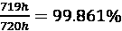
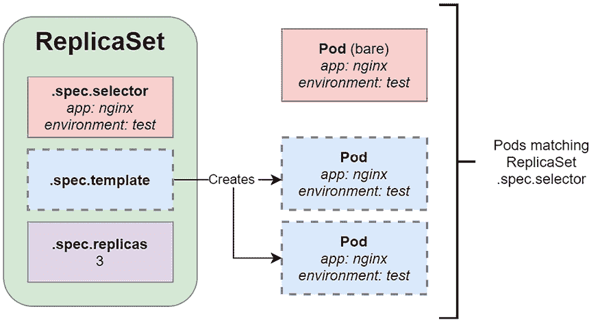

# 第十章：运行生产级 Kubernetes 工作负载

在前几章中，我们专注于容器化概念和基本的 Kubernetes 构建模块，如 Pods、Jobs 和 ConfigMaps。到目前为止，我们的旅程主要涵盖了单机场景，其中应用程序仅需要一个容器主机或 Kubernetes 节点。对于**生产级** Kubernetes，您必须考虑不同的方面，如 **可扩展性**、**高可用性（HA）** 和 **负载均衡**，这总是需要在多个主机上进行容器的**编排**。

简而言之，**容器编排** 是在大型动态环境中管理多个容器生命周期的一种方式——这可以包括部署和维护容器网络的所需状态，提供容器的冗余和高可用性（使用外部组件），扩展集群和容器副本，自动健康检查以及收集遥测数据（日志和指标）。解决云规模下高效容器编排的问题并不直接——这就是 Kubernetes 存在的原因！

在本章中，我们将涵盖以下主题：

+   在 Kubernetes 上确保高可用性和容错性

+   什么是复制控制器（ReplicationController）？

+   什么是副本集（ReplicaSet）？

# 技术要求

对于本章，您将需要以下内容：

+   已部署 Kubernetes 集群。您可以使用本地或基于云的集群，但为了全面理解概念，我们建议使用多节点、基于云的 Kubernetes 集群。

+   在本地机器上安装并配置用于管理 Kubernetes 集群的 Kubernetes **命令行界面（CLI）**（`kubectl`）。

Kubernetes 集群部署（本地和基于云）以及在 *第三章* *安装您的第一个 Kubernetes 集群* 中介绍的 `kubectl` 安装。

您可以从官方 GitHub 仓库 [`github.com/PacktPublishing/The-Kubernetes-Bible-Second-Edition/tree/main/Chapter10`](https://github.com/PacktPublishing/The-Kubernetes-Bible-Second-Edition/tree/main/Chapter10) 下载本章的最新代码示例。

# 在 Kubernetes 上确保高可用性和容错性

首先，让我们快速回顾一下我们如何定义 **高可用性** 和 **容错性（FT）** 以及它们之间的区别。这些是云应用中的关键概念，描述了系统或解决方案持续运行的能力，具有期望的长时间。从系统最终用户的角度来看，可用性方面，以及数据一致性，通常是最重要的要求。

## 高可用性

简而言之，系统工程中的*可用性*描述的是系统在用户端完全功能性和可操作性的时间百分比。换句话说，它是系统正常运行时间与正常运行时间和停机时间总和（即总时间）的比值。例如，如果在过去的 30 天（720 小时）中，你的云应用程序有 1 小时的计划外维护时间，并且对终端用户不可用，这意味着你的应用程序的可用性指标为。通常，在设计系统时，为了简化这个表示，可用性将以所谓的“九”来表示：例如，如果我们说一个系统有五个九的可用性，意味着它至少在 99.999%的总时间内可用。换句话说，这样的系统每月最多只能有 26 秒的停机时间！这些指标通常是定义**服务水平协议**（**SLA**）的基础，这些协议适用于计费的云服务。

基于此，高可用性的定义相对直接，尽管不够精确——如果一个系统在长时间内能够不中断地运行（可用），则认为它具有高可用性。通常，我们可以说五个九的可用性是高可用性的黄金标准。

在你的系统中实现高可用性（HA）通常涉及以下一种或多种技术：

+   **消除系统中的单点故障（SPOF）**。这通常通过组件冗余来实现。

+   **故障切换设置**，这是一种可以自动将当前活跃（可能不健康）的组件切换到冗余组件的机制。

+   **负载均衡**，指的是管理流入系统的流量，并将其路由到可以处理流量的冗余组件。这通常会涉及适当的故障切换设置、组件监控和遥测。

让我们介绍与 FT 相关的概念，它在分布式系统中也非常重要，例如运行在 Kubernetes 上的应用程序。

## 容错

现在，FT 可以作为 HA 概念的补充来展示：如果一个系统在其一个或多个组件发生故障时仍能继续保持功能和运行，那么这个系统就是容错的。例如，像 RAID 这样的 FT 机制用于数据存储，将数据分布在多个磁盘上，或者负载均衡器将流量重定向到健康的节点，通常用于确保系统的韧性并尽量减少中断。实现完整的 FT 意味着实现 100%的 HA，这在许多情况下需要复杂的解决方案，能够主动检测故障并在不间断的情况下修复组件中的问题。根据实现的不同，故障可能会导致性能的平滑降级，降级程度与故障的严重程度成比例。这意味着系统中的小故障对整体性能的影响较小，同时仍然可以响应终端用户的请求。

## Kubernetes 应用的 HA 和 FT

在前面的章节中，你了解了 Pods 以及如何通过 Services 将其暴露给外部流量（*第八章*，*通过 Services 暴露你的 Pods*）。Services 是 Kubernetes 中的对象，它为一组健康的 Pods 提供一个稳定的网络地址。在 Kubernetes 集群内部，Service 通过每个节点上的`kube-proxy`组件管理的虚拟 IP 地址使 Pods 可以被寻址。在外部，云环境通常使用云负载均衡器来暴露 Service。这个负载均衡器通过`cloud-controller-manager`组件中的云特定插件与 Kubernetes 集群集成。通过外部负载均衡器，运行在 Kubernetes 上的微服务或工作负载可以在同一节点或不同节点上的健康 Pods 之间实现负载均衡，这是高可用性的一个关键构建模块。

Services 是请求负载均衡到 Pods 所必需的，但我们还没有讨论如何维护可能冗余并分配到不同节点上的同一 Pod 对象定义的多个副本。Kubernetes 提供了多个构建模块来实现这一目标，具体如下：

+   **ReplicationController 对象**—是 Kubernetes 中定义 Pod 复制的原始形式。

+   **ReplicaSet 对象**—是 ReplicationController 的继任者。主要的区别是 ReplicaSet 支持基于集合的 Pod 选择器。

管理 ReplicaSets 的首选方式是通过 Deployment 对象，它简化了更新和回滚操作。

+   **Deployment 对象**—是 ReplicaSet 之上的另一层抽象。它提供对 Pods 和 ReplicaSets 的*声明式*更新，包括发布和回滚。它用于管理*无状态*的微服务和工作负载。

+   **StatefulSet 对象**—类似于 Deployment，但用于管理集群中的*有状态*微服务和工作负载。在分布式系统设计中，管理集群内的状态通常是最难解决的挑战。

+   **DaemonSet 对象**—用于在集群的所有（或部分）节点上运行 Pod 的单例副本。这些对象通常用于管理内部 Services，如日志聚合或节点监控。

在接下来的章节中，我们将介绍 ReplicationController 和 ReplicaSets 的基础知识。更高级的对象，如 Deployment、StatefulSet 和 DaemonSet，将在后续章节中讨论。

本章介绍了 Kubernetes 工作负载和应用程序的 HA 和 FT。如果你对如何确保 Kubernetes 本身的 HA 和 FT 感兴趣，请参考官方文档：[`kubernetes.io/docs/setup/production-environment/tools/kubeadm/high-availability/`](https://kubernetes.io/docs/setup/production-environment/tools/kubeadm/high-availability/)。请注意，在云端的托管 Kubernetes 服务中，例如 **Azure Kubernetes Service** (**AKS**)，Amazon **Elastic Kubernetes Service** (**EKS**)，或 **Google Kubernetes Engine** (**GKE**)，你将获得高度可用的集群，无需自行管理主节点。

# 什么是 ReplicationController？

实现高可用性（HA）和故障转移（FT）需要为组件提供冗余，并在组件的副本之间对传入流量进行适当的负载均衡。我们来看一下 Kubernetes 中第一个允许你创建和维护 Pod 副本的对象：ReplicationController。请注意，我们主要讨论 ReplicationController 是出于历史原因，因为它是 Kubernetes 中最初用于创建多个 Pod 副本的方式。我们建议你在可能的情况下使用 ReplicaSet，它基本上是 ReplicationController 的下一代，具有扩展的规格 API。

Kubernetes 中的控制器对象有一个主要目标：观察当前和期望的集群状态，这些状态通过 Kubernetes API 服务器暴露，并指挥变更，试图将当前状态更改为期望的状态。它们作为持续反馈循环，尽最大努力将集群带入由你对象模板描述的期望状态。

ReplicationController 的任务很简单——它需要确保集群中始终有指定数量的 Pod 副本（由模板定义）在运行并处于健康状态。这意味着，如果 ReplicationController 配置为维护给定 Pod 的三个副本，它将尝试通过创建和终止 Pod 来确保始终保持恰好三个 Pod。例如，在你创建 ReplicationController 对象后，它将根据模板定义创建三个新的 Pod。如果由于某种原因集群中有四个这样的 Pod，ReplicationController 会终止一个 Pod；如果某个 Pod 被删除或变得不健康，它将被一个新的、 hopefully 健康的 Pod 替换。

由于现在推荐使用配置了 ReplicaSet 的 Deployment 来管理副本，我们将在此不讨论 ReplicationController。接下来的章节将专注于理解和实践 ReplicaSet 概念。关于 Deployments 的详细探讨将在 *第十一章*，《使用 Kubernetes 部署无状态工作负载》中进行。

# 什么是 ReplicaSet？

让我们介绍另一个 Kubernetes 对象：ReplicaSet。它与我们刚刚讨论的 ReplicationController 密切相关。实际上，ReplicaSet 是 ReplicationController 的**继任者**，它具有非常相似的规格 API 和功能。ReplicaSet 的目的也是相同的——旨在维护一定数量的健康且相同的 Pods（副本），以满足特定条件。因此，你只需为 Pod 指定一个模板，并提供合适的标签选择器和所需的副本数量，Kubernetes ReplicaSetController（这是负责维护 ReplicaSet 对象的控制器的实际名称）将执行必要的操作，确保 Pods 运行。

在我们深入了解 ReplicaSet 之前，让我们在下一节中学习 ReplicationController 和 ReplicaSet 之间的主要区别。

## ReplicaSet 与 ReplicationController 有何不同？

ReplicaSet 和 ReplicationController 之间的差异总结如下表所示：

| **特性** | **ReplicaSet** | **ReplicationController** |
| --- | --- | --- |
| 标签选择器 | 支持基于集合的选择器（例如，包含/排除标签）。允许更复杂的逻辑，如包含 `environment=test` 或 `environment=dev`，同时排除 `environment=prod`。 | 仅支持基于等式的选择器（例如，`key=value`）。不支持高级标签匹配。 |
| 与其他 Kubernetes 对象的集成 | 作为更高级对象（如**Deployment**和**HorizontalPodAutoscaler**（**HPA**））的基础。 | 主要直接管理 Pod 的复制，未实现此类集成。 |
| Pod 更新发布 | 通过 Deployment 对象声明式管理，支持**分阶段发布**和**回滚**。 | 使用现在已弃用的 `kubectl rolling-update` 命令进行手动管理。 |
| 未来支持 | 一个更现代且灵活的资源，具备面向未来的功能。 | 预计未来将被弃用。 |

表 10.1：ReplicaSet 和 ReplicationController 的区别

底线—始终选择 ReplicaSet 而非 ReplicationController。然而，你也应该记住，单独使用 ReplicaSet 在生产集群中通常没有实际意义，你应该使用更高级的抽象，如 Deployment 对象来管理 ReplicaSet。我们将在下一章介绍这个概念。

在下一节中，我们将学习如何创建和管理 ReplicaSet 对象。

## 创建 ReplicaSet 对象

在接下来的演示中，我们使用的是一个多节点集群，基于 `kind`，你已经在*第三章*《安装你的第一个 Kubernetes 集群》中学过：

```
$ kind create cluster --config Chapter03/kind_cluster --image kindest/node:v1.31.0
$ kubectl get nodes
NAME                 STATUS   ROLES           AGE   VERSION
kind-control-plane   Ready    control-plane   60s   v1.31.0
kind-worker          Ready    <none>          47s   v1.31.0
kind-worker2         Ready    <none>          47s   v1.31.0
kind-worker3         Ready    <none>          47s   v1.31.0 
```

首先，让我们创建一个命名空间来存放我们的 ReplicaSet 资源。

```
$ kubectl create -f ns-rs.yaml
namespace/rs-ns created 
```

现在，让我们来看一下 `nginx-replicaset.yaml` 示例 YAML 清单文件的结构，该文件维护三个 `nginx` Pod 的副本，如下所示：

```
# nginx-replicaset-example.yaml
apiVersion: apps/v1
kind: ReplicaSet
metadata:
  name: nginx-replicaset-example
  namespace: rs-ns
spec:
  replicas: 4
  selector:
    matchLabels:
      app: nginx
      environment: test
  template:
    metadata:
      labels:
        app: nginx
        environment: test
    spec:
      containers:
        - name: nginx
          image: nginx:1.17
          ports:
            - containerPort: 80 
```

ReplicaSet 规范有三个主要组件，如下所示：

+   `replicas`：定义应该使用给定 `template` 和匹配标签 `selector` 运行的 Pod 副本数量。可以创建或删除 Pods，以保持所需的副本数量。

+   `selector`：一个标签选择器，定义如何识别 ReplicaSet 对象拥有或获取的 Pods。再次提醒，与 ReplicationController 的情况类似，请注意，如果现有裸 Pods 与选择器匹配，它们可能会被 ReplicaSet 获取！

+   `template`：定义 Pod 创建的模板。`metadata` 中使用的标签必须与 `selector` 标签查询匹配。

这些概念已经在下图中进行了可视化：



图 10.1：Kubernetes ReplicaSet

如你所见，ReplicaSet 对象使用 `.spec.template` 来创建 Pods。这些 Pods 必须与 `.spec.selector` 中配置的标签选择器匹配。请注意，也可能会获取与 ReplicaSet 对象标签匹配的现有裸 Pods。在 *图 10.1* 所示的情况下，ReplicaSet 对象只创建了两个新的 Pods，而第三个 Pod 是一个被获取的裸 Pod。

在前面的示例中，我们使用了由 `spec.selector.matchLabels` 指定的简单 **基于相等的** 选择器。也可以使用 `spec.selector.matchExpressions` 定义更高级的 **基于集合的** 选择器——例如，像这样：

```
# nginx-replicaset-expressions.yaml
...<removed for brevity>...
spec:
  replicas: 4
  selector:
    matchLabels:
      app: nginx
    matchExpressions:
      - key: environment
        operator: In
        values:
          - test
          - dev
  template:
...<removed for brevity>... 
```

该规范将使 ReplicaSet 仍然只匹配 `app=nginx` 且 `environment=test` 或 `environment=dev` 的 Pods。

在定义 ReplicaSet 时，`.spec.template.metadata.labels` 必须与 `spec.selector` 匹配，否则将被 API 拒绝。

现在，让我们使用 `kubectl apply` 命令将 ReplicaSet 清单应用到集群中，如下所示：

```
$ kubectl apply -f nginx-replicaset-example.yaml
replicaset.apps/nginx-replicaset-example created 
```

你可以立即使用以下命令观察名为 `nginx-replicaset-example` 的新 ReplicaSet 对象的状态：

```
$ kubectl describe replicaset/nginx-replicaset-example -n rs-ns
...
Replicas:     4 current / 4 desired
Pods Status:  4 Running / 0 Waiting / 0 Succeeded / 0 Failed
... 
```

你可以使用 `kubectl get pods -n rs-ns` 命令观察由 ReplicaSet 对象管理的 Pods。如果你感兴趣，你可以使用 `kubectl describe pod <podId>` 命令检查 Pods 的标签，并且看到它包含一个 `Controlled By: ReplicaSet/nginx-replicaset-example` 属性，以标识我们的示例 ReplicaSet 对象。

在使用 `kubectl` 命令时，你可以使用 `rs` 缩写来代替输入 `replicaset`。

现在，让我们进入下一部分，测试 ReplicaSet 的行为。

## 测试 ReplicaSet 的行为

为了展示我们 ReplicaSet 对象的灵活性，现在让我们使用以下 `kubectl delete` 命令删除一个由 `nginx-replicaset-example` ReplicaSet 对象拥有的 Pod：

```
$ kubectl delete po nginx-replicaset-example-6qc9p -n rs-ns 
```

现在，如果你足够快速，你将能够通过使用 `kubectl get pods` 命令看到其中一个 Pod 正在终止，并且 ReplicaSet 会立即创建一个新的 Pod，以便匹配目标副本数量！

如果你想查看与我们示例的 ReplicationController 对象相关的事件的更多细节，可以使用 `kubectl describe` 命令，如下所示：

```
$ kubectl describe rs/nginx-replicaset-example -n rs-ns
...
Events:
  Type    Reason            Age   From                   Message
  ----    ------            ----  ----                   -------
...<removed for brevity>...
  Normal  SuccessfulCreate  9m9s  replicaset-controller  Created pod: nginx-replicaset-example-r2qfn
  Normal  SuccessfulCreate  3m1s  replicaset-controller  Created pod: nginx-replicaset-example-krdrs 
```

在这个例子中，`nginx-replicaset-example-krdrs` Pod 是一个由 ReplicaSet 创建的新 Pod。

现在，让我们尝试不同的操作，创建一个与我们 ReplicaSet 对象的标签选择器匹配的裸 Pod。你可以预期，匹配 ReplicaSet 的 Pod 数量将是四个，因此 ReplicaSet 将终止其中一个 Pod 以将副本数恢复到三个。

小心裸 Pod（没有 ReplicaSet 管理的 Pod）上的标签。ReplicaSets 可以控制任何具有匹配标签的 Pod，可能会无意中管理你的裸 Pod。请为裸 Pod 使用唯一的标签，以避免冲突。

首先，让我们创建一个简单的裸 Pod 清单文件，命名为 `nginx-pod-bare.yaml`，如下所示：

```
# nginx-pod-bare.yaml
apiVersion: v1
kind: Pod
metadata:
  name: nginx-pod-bare-example
  namespace: rs-ns
  labels:
    app: nginx
    environment: test
spec:
  containers:
    - name: nginx
      image: nginx:1.17
      ports:
        - containerPort: 80 
```

`Pod` 的 metadata 必须有与 ReplicaSet 选择器匹配的标签。现在，使用以下命令将清单应用到你的集群中：

```
$ kubectl apply -f nginx-pod-bare.yaml
pod/nginx-pod-bare-example created
$ kubectl  get pods
NAME                             READY   STATUS        RESTARTS   AGE
nginx-pod-bare-example           0/1     Terminating   0          1s
nginx-replicaset-example-74kq9   1/1     Running       0          23h
nginx-replicaset-example-qfvx6   1/1     Running       0          23h
nginx-replicaset-example-s5cwc   1/1     Running       0          23h 
```

紧接着，使用 `kubectl describe` 命令检查我们示例 ReplicaSet 对象的事件，如下所示：

```
$ kubectl describe rs/nginx-replicaset-example
...
Events:
  Type    Reason            Age   From                   Message
  ----    ------            ----  ----                   -------
...
  Normal  SuccessfulDelete  29s   replicaset-controller  Deleted pod: nginx-pod-bare-example 
```

如你所见，ReplicaSet 对象已经立即检测到有一个新 Pod 被创建，并且与其标签选择器匹配，并已终止该 Pod。

同样，通过修改 Pod 的标签，使其不再匹配选择器，可以从 ReplicaSet 对象中移除 Pods。这在各种调试或故障排查场景中非常有用。

在接下来的章节中，我们将学习 ReplicaSet 如何帮助应用程序实现高可用性（HA）和容错（FT）。

## 使用 ReplicaSet 测试 HA 和 FT

为了演示这个场景，我们将使用之前部署的 ReplicaSet `nginx-replicaset-example`。不过，我们将创建一个 Service 来暴露这个应用程序，具体如下。

```
$ kubectl apply -f nginx-service.yaml
service/nginx-service created 
```

为了测试目的，让我们像下面这样转发 Service：

```
$ kubectl port-forward svc/nginx-service 8080:80 -n rs-ns
Forwarding from 127.0.0.1:8080 -> 80
Forwarding from [::1]:8080 -> 80 
```

打开另一个控制台并验证应用程序的访问。

```
$ curl localhost:8080 
```

你应该能得到一个默认的 NGINX 页面输出。

之前我们测试了删除 Pod，并验证了 ReplicaSet 会根据副本数重新创建 Pod。现在，让我们移除一个 Kubernetes 节点并观察其行为。在删除节点之前，先检查当前的 Pod 分配情况，如下所示：

```
$ kubectl get po -n rs-ns -o wide
NAME                             READY   STATUS    RESTARTS   AGE   IP           NODE           NOMINATED NODE   READINESS GATES
nginx-replicaset-example-cfcfs   1/1     Running   0          24m   10.244.1.3   kind-worker2   <none>           <none>
nginx-replicaset-example-krdrs   1/1     Running   0          17m   10.244.3.5   kind-worker    <none>           <none>
nginx-replicaset-example-kw7cl   1/1     Running   0          24m   10.244.3.4   kind-worker    <none>           <none>
nginx-replicaset-example-r2qfn   1/1     Running   0          24m   10.244.2.4   kind-worker3   <none>           <none> 
kind-worker node; let us remove this node from the Kubernetes cluster as follows:
```

```
$ kubectl cordon kind-worker
node/kind-worker cordoned
$ kubectl drain kind-worker --ignore-daemonsets
...<removed for brevity>...
pod/nginx-replicaset-example-kw7cl evicted
node/kind-worker drained
$ kubectl delete node kind-worker
node "kind-worker" deleted 
```

现在，让我们检查 Pod 的分配情况和副本数量。

```
$ kubectl get po -n rs-ns -o wide
NAME                             READY   STATUS    RESTARTS   AGE     IP           NODE           NOMINATED NODE   READINESS GATES
nginx-replicaset-example-8lz9x   1/1     Running   0          2m33s   10.244.1.4   kind-worker2   <none>           <none>
nginx-replicaset-example-cfcfs   1/1     Running   0          30m     10.244.1.3   kind-worker2   <none>           <none>
nginx-replicaset-example-d8rz5   1/1     Running   0          2m33s   10.244.2.5   kind-worker3   <none>           <none>
nginx-replicaset-example-r2qfn   1/1     Running   0          30m     10.244.2.4   kind-worker3   <none>           <none> 
```

根据输出，ReplicaSet 已经在可用节点上创建了所需数量的 Pods。

如果你的 `kubectl port-forward` 仍然在运行，你可以再次验证应用程序的访问（`curl localhost:8080`）并确认其可用性。请注意，在生产环境中，最佳做法是集成监控工具，如 **Prometheus** 或 **Grafana**，用于实时健康检查和资源可视化，并使用 **Fluentd** 进行日志记录，捕获 Pod 日志以诊断故障。

现在我们通过多个示例已经了解了 ReplicaSet 的行为，接下来让我们学习如何扩展 ReplicaSet。

## 扩展 ReplicaSet

对于 ReplicaSet，我们可以执行类似于前一节中 ReplicationController 的扩展操作。通常，在常规场景下，你不会手动扩展 ReplicaSet。而是 ReplicaSet 对象的大小将由另一个更高层的对象（如 Deployment）来管理。

让我们首先扩展我们的示例 ReplicaSet 对象。打开`nginx-replicaset.yaml`文件，并将`replicas`属性修改为`5`，如下所示：

```
...
spec:
  replicas: 5
... 
```

现在，我们需要声明性地将更改应用于集群状态。使用以下`kubectl apply`命令来实现：

```
$ kubectl apply -f ./nginx-replicaset.yaml 
```

若要查看 ReplicaSet 对象控制的 Pod 数量是否发生变化，可以使用`kubectl get pods`或`kubectl describe rs/nginx-replicaset-example`命令。

你可以使用`kubectl scale rs/nginx-replicaset-example --replicas=5`这种命令来达到与 ReplicationController 类似的扩展效果。通常，这种命令只推荐在开发或学习场景中使用。

同样，如果你想进行缩容，你需要打开`nginx-replicaset.yaml`文件，并将`replicas`属性修改为`2`，如下所示：

```
...
spec:
  replicas: 2
... 
```

再次声明性地将更改应用于集群状态。使用以下`kubectl apply`命令来实现：

```
$ kubectl apply -f ./nginx-replicaset.yaml 
```

此时，你可以使用`kubectl get pods`或`kubectl describe rs/nginx-replicaset-example`命令来验证 Pods 的数量已减少至`2`。

## 将 Pod 活性探针与 ReplicaSet 一起使用

有时，即使容器中的主进程未崩溃，你可能仍希望将 Pod 视为不健康并需要重启容器。你已经在*第八章*《使用服务暴露 Pod》中了解了探针。我们将快速演示如何将**活性探针**与 ReplicaSet 结合使用，以增强容器化组件故障的容错能力。

在我们的示例中，我们将创建一个 ReplicaSet 对象，运行带有额外活性探针的`nginx` Pods，该探针会检查主容器的路径`/`是否能返回*成功*的 HTTP 状态码。你可以想象，一般情况下，容器中的`nginx`进程始终会保持健康（直到崩溃），但这并不意味着 Pod 本身可以被认为是健康的。如果 Web 服务器无法成功提供内容，说明 Web 服务器进程运行正常，但可能发生了其他问题，这时 Pod 就不再适用。我们通过简单地删除容器中的`/index.html`文件来模拟这种情况，这会导致活性探针失败。

首先，让我们为新的`nginx-replicaset-livenessprobe-example` ReplicaSet 对象创建一个名为`nginx-replicaset-livenessprobe.yaml`的 YAML 清单文件，内容如下：

```
# nginx-replicaset-livenessprobe.yaml
apiVersion: apps/v1
kind: ReplicaSet
metadata:
  name: nginx-replicaset-livenessprobe-example
spec:
  replicas: 3
  selector:
    matchLabels:
      app: nginx
      environment: test
  template:
    metadata:
      labels:
        app: nginx
        environment: test
    spec:
      containers:
        - name: nginx
          image: nginx:1.17
          ports:
            - containerPort: 80
          **livenessProbe:**
            **httpGet:**
              **path:****/**
              **port:****80**
            **initialDelaySeconds:****2**
            **periodSeconds:****2** 
```

上述代码块中突出显示的部分包含了存活探针定义，这是与我们之前的 ReplicaSet 示例的唯一区别。存活探针被配置为每 2 秒对容器的 `/` 路径和 `80` 端口执行 HTTP `GET` 请求（`periodSeconds`）。第一次探测将在容器启动后的 2 秒后（`initialDelaySeconds`）开始。

如果你正在修改现有的 ReplicaSet 对象，你需要先删除它并重新创建，以便应用对 Pod 模板的更改。

现在，使用以下命令将清单文件应用到集群中：

```
$ kubectl apply -f ./nginx-replicaset-livenessprobe.yaml 
```

使用以下命令验证 Pod 是否已成功启动：

```
$ kubectl get pods 
```

现在，你需要选择一个 ReplicaSet Pod，以模拟容器内部导致存活探针失败的故障。在我们的示例中，我们将使用列表中的第一个 Pod，并删除 Pod 内的 `index.html` 文件。为了模拟故障，运行以下命令。该命令将删除由 `nginx` Web 服务器提供的 `index.html` 文件，并导致 HTTP `GET` 请求以非成功的 HTTP 状态码失败：

```
$ kubectl exec -it nginx-replicaset-livenessprobe-example-lgvqv -- rm /usr/share/nginx/html/index.html 
```

使用 `kubectl describe` 命令检查该 Pod 的事件，如下所示：

```
$ kubectl describe pod/nginx-replicaset-livenessprobe-example-lgvqv
Name:             nginx-replicaset-livenessprobe-example-lgvqv
...<removed for brevitt>...
Events:
  Type     Reason     Age                 From               Message
  ----     ------     ----                ----               -------
  Normal   Scheduled  2m9s                default-scheduler  Successfully assigned default/nginx-replicaset-livenessprobe-example-lgvqv to kind-worker2
  Normal   Pulled     60s (x2 over 2m8s)  kubelet            Container image "nginx:1.17" already present on machine
  Normal   Created    60s (x2 over 2m8s)  kubelet            Created container nginx
  Normal   Started    60s (x2 over 2m8s)  kubelet            Started container nginx
  Warning  Unhealthy  60s (x3 over 64s)   kubelet            Liveness probe failed: HTTP probe failed with statuscode: 403
  Normal   Killing    60s                 kubelet            Container nginx failed liveness probe, will be restarted 
```

如你所见，存活探针已正确检测到 Web 服务器变得不健康，并重新启动了 Pod 内的容器。

然而，请注意，ReplicaSet 对象本身并未以任何方式参与重启——该操作是在 Pod 层面执行的。这展示了各个 Kubernetes 对象如何提供不同的功能，并能够协同工作以实现更好的故障转移。没有存活探针的话，最终用户可能会被一个无法提供内容的副本服务，而这将无法被发现！

## 删除 ReplicaSet 对象

最后，让我们来看一下如何删除 ReplicaSet 对象。有两种可能性，概述如下：

1.  删除 ReplicaSet 对象及其拥有的 Pod——这一过程首先会自动缩容。

1.  删除 ReplicaSet 对象并保持 Pod 不受影响。

要删除 ReplicaSet 对象及其 Pod，可以使用常规的 `kubectl delete` 命令，如下所示：

```
$ kubectl delete rs/nginx-replicaset-livenessprobe-example 
```

你会看到，Pod 会首先被终止，然后 ReplicaSet 对象会被删除。

现在，如果你只想删除 ReplicaSet 对象，则需要为 `kubectl delete` 命令使用 `--cascade=orphan` 选项，如下所示：

```
$ kubectl delete rs/nginx-replicaset-livenessprobe-example --cascade=orphan 
```

执行此命令后，如果检查集群中的 Pod，你仍然会看到所有由 `nginx-replicaset-livenessprobe-example` ReplicaSet 对象拥有的 Pod。这些 Pod 现在可以被其他具有匹配标签选择器的 ReplicaSet 对象获取。

# 概述

在这一章中，你了解了为在 Kubernetes 集群中运行的应用程序提供高可用性（HA）和容错性（FT）的关键构建块。首先，我们解释了 HA 和 FT 为什么重要。接着，你了解了如何使用 ReplicaSet 提供组件复制和故障转移的更多细节，ReplicaSet 用于 Kubernetes 中提供相同 Pods 的多个副本（replicas）。我们演示了 ReplicationController 和 ReplicaSet 之间的区别，并解释了为什么当前推荐使用 ReplicaSet 来提供多个 Pods 副本。

本书接下来的章节将概述如何使用 Kubernetes 来编排容器应用程序和工作负载。你将熟悉与最重要的 Kubernetes 对象相关的概念，如 Deployment、StatefulSet 和 DaemonSet。此外，在下一章中，我们将重点介绍 ReplicaSet 上的下一个抽象层：Deployment 对象。你将学习如何部署并轻松管理应用程序的新版本的发布和回滚。

# 进一步阅读

+   ReplicaSet: [`kubernetes.io/docs/concepts/workloads/controllers/replicaset`](https://kubernetes.io/docs/concepts/workloads/controllers/replicaset)

+   ReplicationController: [`kubernetes.io/docs/concepts/workloads/controllers/replicationcontroller`](https://kubernetes.io/docs/concepts/workloads/controllers/replicationcontroller)

# 加入我们社区的 Discord

加入我们社区的 Discord 空间，与作者和其他读者讨论：

[`packt.link/cloudanddevops`](https://packt.link/cloudanddevops)


