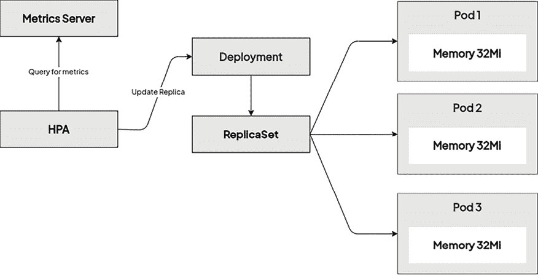

# 11

# 使用 Kubernetes 部署无状态工作负载

前一章介绍了两个重要的 Kubernetes 对象：**ReplicationController** 和 **ReplicaSet**。到此为止，你已经知道它们在保持 Pod 的相同健康副本（拷贝）方面起着类似的作用。实际上，ReplicaSet 是 ReplicationController 的继任者，在 Kubernetes 的最新版本中，应该使用 ReplicaSet 来代替 ReplicationController。

现在，是时候介绍 **Deployment** 对象了，它为你的无状态 Kubernetes 应用程序和服务提供了轻松的可扩展性、滚动更新和版本回滚。部署对象建立在 ReplicaSets 之上，并且提供了一种声明式的管理方式——只需在部署清单中描述所需的状态，Kubernetes 将负责以受控、可预测的方式协调底层的 ReplicaSets。与 StatefulSet 一起，它是 Kubernetes 中最重要的工作负载管理对象，本章将涵盖 StatefulSet。Deployment 将是你在 Kubernetes 上开发和运维的核心！本章的目标是确保你掌握所有工具和知识，使用 Deployment 对象部署无状态应用组件，并通过 Deployment 的滚动更新安全地发布新版本的组件。

本章将涵盖以下内容：

+   介绍部署对象

+   Kubernetes 部署如何无缝处理修订和版本发布

+   部署对象的最佳实践

# 技术要求

本章需要以下内容：

+   一个已部署的 Kubernetes 集群。你可以使用本地集群或云集群，但为了更好地理解本章展示的概念，如果有条件，建议使用多节点的云基础 Kubernetes 集群。

+   必须在本地计算机上安装 Kubernetes 命令行工具（`kubectl`），并将其配置为管理你的 Kubernetes 集群。

Kubernetes 集群的部署（本地和云端）以及 `kubectl` 安装已在 *第三章*，*安装你的第一个 Kubernetes 集群* 中涵盖。

你可以从官方 GitHub 仓库下载本章的最新代码示例：[`github.com/PacktPublishing/The-Kubernetes-Bible-Second-Edition/tree/main/Chapter11`](https://github.com/PacktPublishing/The-Kubernetes-Bible-Second-Edition/tree/main/Chapter11)。

# 介绍部署对象

Kubernetes 在运行不同类型的工作负载方面为您提供了开箱即用的灵活性，具体取决于您的使用案例。通过了解哪种工作负载类型适合您的应用需求，您可以做出更明智的决策，优化资源使用，并确保在云端应用程序中获得更好的性能和可靠性。这一基础知识帮助您充分发挥 Kubernetes 的灵活性，使您能够自信地部署和扩展应用程序。让我们简要看看支持的工作负载类型，以了解 Deployment 对象的适用场景及其目的。

以下图示展示了 Kubernetes 中不同类型的应用程序工作负载，我们将在接下来的章节中进行解释。


图 11.1：Kubernetes 中的应用程序工作负载类型

在实施基于云的应用程序时，您通常需要以下类型的工作负载：

+   **无状态**：在容器的世界里，无状态应用程序是指那些不在容器内部保存数据（状态）的应用程序。设想两个 Nginx 容器执行相同的任务：一个将用户数据存储在容器内的文件中，而另一个使用像 MongoDB 这样的独立容器进行数据持久化。尽管它们实现了相同的目标，第一个 Nginx 容器因为依赖内部存储而变成了有状态。第二个 Nginx 容器则使用外部数据库，保持无状态。这种无状态的方式使得在 Kubernetes 中管理和扩展应用程序更加简单，因为它们可以轻松重启或替换，而无需担心数据丢失。在 Kubernetes 中，通常使用 Deployment 对象来管理这些无状态工作负载。

+   **有状态**：在容器和 Pod 的情况下，如果它们内部存储任何可修改的数据，我们称之为有状态。一个典型的有状态 Pod 示例是 MySQL 或 MongoDB Pod，它将数据读写到持久化存储卷（PersistentVolume）。有状态工作负载的管理难度较大——在发布、回滚和扩展时，您需要仔细管理粘性会话或数据分区。一般来说，如果可能的话，尽量将有状态工作负载保持在 Kubernetes 集群之外，例如使用基于云的**软件即服务**（**SaaS**）数据库服务。在 Kubernetes 中，StatefulSet 对象用于管理有状态工作负载。*第十二章*，*StatefulSet – 部署有状态应用程序*，提供了有关这些对象的更多详细信息。

+   **Job 或 CronJob**：这种类型的工作负载执行作业或任务处理，可以是定时任务或按需执行。根据应用程序的类型，批处理工作负载可能需要成千上万个容器和大量节点——这可以是任何发生在*后台*的事情。用于批处理的容器也应该是无状态的，以便更容易恢复中断的作业。在 Kubernetes 中，Job 和 CronJob 对象用于管理批处理工作负载。*第四章*，*在 Kubernetes 中运行容器*，提供了有关这些类型对象的更多详细信息。

+   **DaemonSet**：在某些情况下，我们希望在每个 Kubernetes 节点上运行工作负载，以支持 Kubernetes 的功能。这可以是监控应用程序、日志应用程序、存储管理代理（用于 PersistentVolumes）等。对于这些工作负载，我们可以使用一种特殊的部署类型，称为 DaemonSet，它保证在集群中的每个节点上都运行该工作负载的一个副本。*第十三章*，*DaemonSet - 在节点上维护 Pod 单例*，提供了有关这些类型对象的更多详细信息。

通过了解 Kubernetes 中不同类型工作负载的概念，我们可以更深入地探讨如何使用 Deployment 对象管理无状态工作负载。简而言之，它们为 Pods 和 ReplicaSets 提供声明式和可控的更新。

你可以通过使用 Deployment 对象声明性地执行以下操作：

+   **新 ReplicaSet 的发布**：部署擅长管理受控发布。你可以在 Deployment 对象中定义一个具有所需 Pod 模板的新 ReplicaSet。Kubernetes 随后通过逐步扩展新的 ReplicaSet 并缩减旧的 ReplicaSet 来进行发布，最小化停机时间，确保平稳过渡。

+   **通过 Pod 模板变更进行受控发布**：部署允许你在 Deployment 定义中更新 Pod 模板。当你部署更新后的 Deployment 时，Kubernetes 会执行滚动更新，使用修改后的模板扩展新的 ReplicaSet，同时缩减旧的 ReplicaSet。这使你能够以受控的方式对应用程序的 Pods 进行变更。

+   **回滚到之前的版本**：部署会跟踪其修订历史。如果你在新版本中遇到任何问题，可以轻松回滚到先前的稳定部署版本。这使你能够快速恢复更改，最小化中断。

+   **扩展 ReplicaSets**：直接扩展 Deployment 将会扩展相关的 ReplicaSet。你可以指定 Deployment 所需的副本数量，Kubernetes 会自动扩展底层的 ReplicaSet 以满足该需求。

+   **暂停和恢复发布**：部署提供了暂停新 ReplicaSet 发布的功能，如果你需要解决任何问题或进行额外配置，可以暂停发布。同样，问题解决后，可以恢复发布。这为部署过程提供了灵活性。

通过这种方式，Deployment 对象提供了一个端到端的管道，用于管理运行在 Kubernetes 集群中的无状态组件。通常，你会将它们与 Service 对象结合使用，正如 *第八章* 中所展示的 *通过服务暴露你的 Pods*，以实现高容错性、健康监控和智能负载均衡，从而处理进入应用的流量。

现在，让我们更仔细地看看 Deployment 对象规范的结构，以及如何在我们的 Kubernetes 集群中创建一个简单的示例 Deployment。

## 创建一个 Deployment 对象

不用担心 Deployment 骨架，因为你可以使用任何支持的工具来创建 Deployment YAML。你可以通过以下 `kubectl create deployment` 命令来创建 Deployment 骨架，该命令基本上会显示包含这些值的 YAML：

```
$ kubectl create deployment my-deployment --replicas=1 --image=my-image:latest --dry-run=client --port=80 -o yaml 
```

你可以将输出重定向到一个文件，并将其用作你的部署配置的基础：

```
$ kubectl create deployment my-deployment --replicas=1 --image=my-image:latest --dry-run=client --port=80 -o yaml >my-deployment.yaml 
```

首先，让我们看一下一个示例 Deployment YAML 清单文件 `nginx-deployment.yaml` 的结构，它保持三个 `nginx` Pod 副本：

```
# nginx-deployment.yaml
apiVersion: apps/v1
kind: Deployment
metadata:
  name: nginx-deployment-example
spec:
  replicas: 3
  selector:
    matchLabels:
      app: nginx
      environment: test
  minReadySeconds: 10
  strategy:
    type: RollingUpdate
    rollingUpdate:
      maxUnavailable: 1
      maxSurge: 1
  template:
    metadata:
      labels:
        app: nginx
        environment: test
    spec:
      containers:
        - name: nginx
          image: nginx:1.17
          ports:
            - containerPort: 80 
```

如你所见，Deployment 规范的结构与 ReplicaSet 几乎相同，尽管它有一些额外的参数来配置发布新版本的策略。上述的 YAML 规范有四个主要组件：

+   `replicas`：定义应该使用给定的 `template` 和匹配的标签 `selector` 运行的 Pod 副本数量。Pods 可以被创建或删除，以保持所需的数量。此属性由底层的 ReplicaSet 使用。

+   `selector`：标签选择器，用于定义如何识别底层 ReplicaSet 所拥有的 Pods。可以包括基于集合的选择器和基于相等性的选择器。在 Deployments 的情况下，底层的 ReplicaSet 还会使用生成的 `pod-template-hash` 标签来确保在滚动发布新版本时，不同子 ReplicaSets 之间没有冲突。此外，这通常可以防止无意间获取裸 Pods，这在简单的 ReplicaSets 中很容易发生。然而，Kubernetes 不会阻止你在不同的 Deployments 或甚至其他类型的控制器之间定义重叠的 Pod 选择器。但如果发生这种情况，它们可能会发生冲突并表现出异常行为。

+   `template`：定义 Pod 创建的模板。`metadata` 中使用的标签必须与我们的 `selector` 匹配。

+   `strategy`：定义用于用新 Pods 替换现有 Pods 的策略细节。你将在接下来的章节中了解更多关于此类策略的内容。在这个例子中，我们展示了默认的 `RollingUpdate` 策略。简而言之，这个策略通过慢慢地用新版本的 Pods 替换旧版本的 Pods，从而确保零停机时间，并与 Service 对象和就绪探针一起，为能够处理传入流量的 Pods 提供流量负载均衡。

Deployment 规格提供了高度的可重配置性，以满足您的需求。我们建议参考官方文档以获取所有详细信息：[Kubernetes 官方文档](https://kubernetes.io/docs/reference/generated/kubernetes-api/v1.31/#deployment-v1-apps)（请根据您的 Kubernetes 集群版本选择合适的版本，例如 v1.31）。

为了更好地理解 Deployment、其底层的子 ReplicaSet 以及 Pods 之间的关系，请查看以下图表：


图 11.2：Kubernetes Deployment

一旦定义并创建了 Deployment，就无法更改其 `selector`。这是因为如果可以更改 `selector`，您很容易会遇到孤立的 ReplicaSets。您可以对现有 Deployment 对象执行两种重要操作：

+   **修改模板**：通常，您可能希望将 Pod 定义更改为应用程序的新镜像版本。这将根据发布 `策略` 开始进行发布。

+   **修改副本数**：仅更改副本数将导致 ReplicaSet 平稳地进行扩展或缩减。

现在，让我们声明性地应用我们的示例 Deployment YAML 清单文件 `nginx-deployment.yaml` 到集群中，使用 `kubectl apply` 命令：

```
$ kubectl apply -f ./nginx-deployment.yaml 
```

使用 `--record` 标志对于跟踪对对象所做的更改非常有用，还可以检查哪些命令导致了这些更改。然后，您将看到一个额外的自动注释 `kubernetes.io/change-cause`，该注释包含有关命令的信息。但是，`--record` 标志已被弃用，并将在未来移除。因此，如果您依赖该注释，最佳实践是手动将该注释作为 Deployment 更新的一部分进行添加。

如果需要，可以使用 `kubectl annotate` 命令手动向 Deployment 添加注释，如下所示：

```
$ kubectl annotate deployment/ nginx-deployment-example kubernetes.io/change-cause='Updated image to 1.2.3' 
```

在 Deployment 对象创建之后，立即使用 `kubectl rollout` 命令来实时跟踪 Deployment 的状态：

```
$ kubectl rollout status deployment nginx-deployment-example
Waiting for deployment "nginx-deployment-example" rollout to finish: 0 of 3 updated replicas are available...
deployment "nginx-deployment-example" successfully rolled out 
```

这是一个有用的命令，可以帮助我们深入了解正在进行的 Deployment 发布的情况。您还可以使用常见的 `kubectl get` 或 `kubectl describe` 命令：

```
$ kubectl get deploy nginx-deployment-example
NAME                       READY   UP-TO-DATE   AVAILABLE   AGE
nginx-deployment-example   3/3     3            3           6m21s 
```

如您所见，Deployment 已成功创建，所有三个 Pods 当前处于就绪状态。

在输入 `deployment` 时，您可以使用 `deploy` 缩写来代替，在使用 `kubectl` 命令时。

您可能还会对查看底层的 ReplicaSets 感兴趣：

```
$ kubectl get rs
NAME                                  DESIRED   CURRENT   READY   AGE
nginx-deployment-example-5b8dc6b8cd   3         3         3       2m17s 
```

请注意，我们的 ReplicaSet 名称中生成的哈希值 `5b8dc6b8cd`，这也是 `pod-template-hash` 标签的值，如前所述。

最后，您可以使用以下命令查看由 Deployment 对象创建的集群中的 Pods：

```
$ kubectl get pods
NAME                                        READY   STATUS    RESTARTS   AGE
nginx-deployment-example-5b8dc6b8cd-lj2bz   1/1     Running   0          3m30s
nginx-deployment-example-5b8dc6b8cd-nxkbj   1/1     Running   0          3m30s
nginx-deployment-example-5b8dc6b8cd-shzmd   1/1     Running   0          3m30s 
```

恭喜—您已经创建并检查了第一个 Kubernetes Deployment！接下来，我们将看看如何使用 Service 对象将 Deployment 暴露给集群外部的流量。

## 使用 Service 对象暴露 Deployment Pods

Service 对象已在*第八章*，*通过服务暴露你的 Pods* 中详细介绍，因此在本节中，我们将简要回顾 Service 的作用以及它们通常如何与 Deployments 一起使用。

以下图示可作为 Kubernetes 集群中不同网络的基础参考。


图 11.3：Kubernetes 中的不同网络

服务是 Kubernetes 对象，允许你将 Pods 暴露给集群中的其他 Pods 或终端用户。它们是高可用和容错的 Kubernetes 应用程序的关键构建块，因为它们提供了一个负载均衡层，主动将传入流量路由到就绪和健康的 Pods。

另一方面，Deployment 对象提供 Pod 复制、故障发生时的自动重启、轻松扩展、受控版本发布和回滚。但有一个问题：由 ReplicaSets 或 Deployments 创建的 Pods 有一个有限的生命周期。到某个时刻，你可以预计它们会被终止；然后，将在它们的位置创建具有新 IP 地址的新 Pod 副本。那么，如果你有一个运行 Web 服务器 Pods 的 Deployment，并且这些 Pods 需要与作为另一个 Deployment 一部分创建的 Pods（例如后端 Pods）进行通信怎么办？Web 服务器 Pods 不能假设后端 Pods 的 IP 地址或 DNS 名称，因为它们可能会随着时间的推移而变化。这个问题可以通过 Service 对象来解决，后者为一组 Pods 提供可靠的网络连接。

简而言之，服务针对一组 Pods，这由标签选择器决定。这些标签选择器的工作原理与您在 ReplicaSets 和 Deployments 中学到的相同。最常见的场景是通过使用相同的标签选择器为现有的 Deployment 暴露一个 Service。

Service 负责提供可靠的 DNS 名称和 IP 地址，并监控选择器的结果，更新与之关联的端点对象，包含匹配 Pods 的当前 IP 地址。对于集群内部的通信，通常使用简单的 `ClusterIP` 服务，而要将其暴露给外部流量，你可以使用 `NodePort` 服务，或者在云部署中更常见的是使用 `LoadBalancer` 服务。

要可视化 Service 对象与 Kubernetes 中的 Deployment 对象如何交互，请查看以下图示：


图 11.4：客户端 Pod 执行请求到通过 ClusterIP 服务暴露的 Kubernetes 部署

此图示展示了集群中任何客户端 Pod 如何透明地与通过我们的 Deployment 对象创建并通过 `ClusterIP` 服务暴露的 `nginx` Pods 进行通信。ClusterIP 本质上是由每个节点上运行的 `kube-proxy` 服务管理的虚拟 IP 地址。`kube-proxy` 负责集群中的所有巧妙路由逻辑，确保路由对客户端 Pods 完全透明——它们无需知道自己是在与同一节点、不同节点，甚至是外部组件进行通信。在后台，`kube-proxy` 监视服务对象的更新，并维护每个节点上所需的所有路由规则，以确保正确的流量。`kube-proxy` 通常使用 `iptables` 或 **IP 虚拟服务器** (**IPVS**) 来管理流量路由。

服务对象的作用是定义一组应当被 *隐藏* 在稳定 ClusterIP 后的准备就绪的 Pods。通常，内部客户端不会使用 ClusterIP 调用服务 Pods，而是使用与服务名称相同的 DNS 短名称——例如，`nginx-service-example`。这将通过集群的内部 DNS 服务解析为 ClusterIP。或者，它们也可以使用 DNS **完全限定域名** (**FQDN**) 形式的 `<serviceName>.<namespaceName>.svc.<clusterDomain>`；例如，`nginx-service-example.default.svc.cluster.local`。

对于暴露 Pods 给外部流量的 `LoadBalancer` 或 `NodePort` 服务，其原理与内部服务类似；它们也提供用于内部通信的 ClusterIP。不同之处在于，它们还配置了更多组件，以便外部流量能够被路由到集群。

现在您已掌握了有关服务对象及其与 Deployment 对象交互的必要知识，让我们把所学的知识付诸实践！

请参阅 *第八章*，*通过服务暴露您的 Pods*，了解更多关于服务以及 Kubernetes 中不同类型的服务的信息。

### 声明式创建服务

在本节中，我们将通过执行以下步骤，使用 `LoadBalancer` 类型的 `nginx-service-example` 服务对象暴露我们的 `nginx-deployment-example` Deployment。

1.  创建一个 `nginx-service.yaml` 清单文件，内容如下：

    ```
    # nginx-service.yaml
    apiVersion: v1
    kind: Service
    metadata:
      name: nginx-service-example
    spec:
      selector:
        app: nginx
        environment: test
      type: LoadBalancer
      ports:
        - port: 80
          protocol: TCP
          targetPort: 80 
    ```

服务的标签选择器与我们为 Deployment 对象使用的标签选择器相同。服务的规格指示我们将 Deployment 暴露在云负载均衡器的 `80` 端口上，然后将来自目标端口 `80` 的流量路由到底层的 Pods。

根据你的 Kubernetes 集群部署方式，你可能无法使用`LoadBalancer`类型。在这种情况下，你可能需要为本次练习使用`NodePort`类型，或者坚持使用简单的`ClusterIP`类型，并跳过有关外部访问的部分。对于本地开发部署，如`minikube`，你将需要使用`minikube service`命令来访问你的服务。你可以在文档中找到更多细节：[`minikube.sigs.k8s.io/docs/commands/service/`](https://minikube.sigs.k8s.io/docs/commands/service/)。

1.  创建`nginx-service-example`服务，并使用`kubectl get`或`kubectl describe`命令获取有关新服务及相关负载均衡器状态的信息：

    ```
    $  kubectl apply -f nginx-service.yaml
    service/nginx-service-example created
    $ kubectl describe service nginx-service-example
    Name:                     nginx-service-example
    Namespace:                default
    Labels:                   <none>
    Annotations:              <none>
    Selector:                 app=nginx,environment=test
    ...<removed for brevity>...
    Endpoints:                10.244.1.2:80,10.244.2.2:80,10.244.2.3:80
    Session Affinity:         None
    External Traffic Policy:  Cluster
    Events:                   <none> 
    ```

1.  现在，让我们像在*第八章*中那样，从另一个 Pod 访问该服务，*通过服务暴露你的 Pods*。我们将按如下方式创建一个`k8sutils` Pod，并测试服务的访问：

    ```
    $ kubectl apply -f ../Chapter07/k8sutils.yaml
    pod/k8sutils created
    $ kubectl exec -it k8sutils -- curl nginx-service-example.default.svc.cluster.local |grep Welcome -A2
    <title>Welcome to nginx!</title>
    <style>
        body {
    --
      <h1>Welcome to nginx!</h1>
    <p>If you see this page, the nginx web server is successfully installed and
    working. Further configuration is required.</p> 
    ```

这展示了如何使用服务将部署的 Pods 暴露给外部流量。现在，我们将快速展示如何使用命令式命令为我们的部署对象创建一个服务，从而实现类似的效果。

### 命令式创建服务

使用命令式的`kubectl expose`命令也可以实现类似的效果——一个名为`nginx-deployment-example`的服务将为我们的部署对象创建。使用以下命令：

```
$ kubectl expose deployment --type=LoadBalancer nginx-deployment-example
service/nginx-deployment-example exposed 
```

让我们解释一下前面的代码片段：

+   这将创建一个与部署对象同名的服务——即`nginx-deployment-example`。如果你希望使用不同的名称，如声明式示例所示，可以使用`--name=nginx-service-example`参数。

+   此外，将由服务使用的端口`80`将与 Pods 定义的端口相同。如果你希望更改此端口，可以使用`--port=<number>`和`--target-port=<number>`参数。

查看`kubectl expose deployment --help`以查看暴露部署时可用的选项。

请注意，这个命令式命令仅推荐在开发或调试场景中使用。对于生产环境，你应尽可能采用声明式的*基础设施即代码*和*配置即代码*方法。

在接下来的章节中，让我们学习如何在部署中使用就绪探针、存活探针和启动探针。

### 就绪探针、存活探针和启动探针的作用

在*第八章*，*通过服务暴露你的 Pods*中，我们学到了有三种类型的探针可以为每个运行在 Pod 中的容器配置：

+   就绪探针

+   存活探针

+   启动探针

所有这些探针在你配置部署时都非常有用——总是尝试预测运行在容器中的进程可能的生命周期场景，并相应地为你的部署配置探针。

请注意，默认情况下，Pod 中的容器没有配置任何探针。Kubernetes 会在 Pod 容器启动成功后通过服务提供流量，但只有在容器成功启动时才会提供流量，并且如果容器崩溃，它会使用默认的`always-restart`策略重启容器。这意味着你需要负责确定在特定情况下需要什么类型的探针和设置。你还需要理解配置错误的探针可能带来的后果和注意事项——例如，如果你的存活探针过于严格，且超时设置过短，可能会错误地重启容器，进而降低应用程序的可用性。

现在，让我们演示如何在你的部署中配置**就绪探针**，以及它如何在实时中工作。

如果你对其他类型的探针的配置细节感兴趣，可以参考*第八章*、*通过服务暴露你的 Pod*，以及官方文档：[`kubernetes.io/docs/tasks/configure-pod-container/configure-liveness-readiness-startup-probes/`](https://kubernetes.io/docs/tasks/configure-pod-container/configure-liveness-readiness-startup-probes/)。

我们使用的`nginx`部署非常简单，不需要任何专门的就绪探针。相反，我们将安排容器的设置，以便根据需要让容器的就绪探针失败或成功。具体来说，在容器设置过程中，我们将创建一个名为`/usr/share/nginx/html/ready`的空文件，`nginx`将通过`/ready`端点提供该文件（就像其他任何文件一样），并配置一个`httpGet`类型的就绪探针，用于查询`/ready`端点并获取成功的 HTTP 状态码。现在，通过使用`kubectl exec`命令删除或重新创建`ready`文件，我们可以轻松模拟导致就绪探针失败或成功的 Pod 故障。

按照以下步骤配置和测试就绪探针：

1.  使用以下命令删除现有的部署：

    ```
    $ kubectl delete deployment nginx-deployment-example 
    ```

1.  按如下方式创建一个新的部署 YAML：

    ```
    # nginx-deployment-readinessprobe.yaml
    apiVersion: apps/v1
    kind: Deployment
    metadata:
      name: nginx-deployment-readiness
    spec:
      replicas: 3
      selector:
        matchLabels:
          app: nginx
          environment: test
      minReadySeconds: 10
      strategy:
        type: RollingUpdate
        rollingUpdate:
          maxUnavailable: 1
          maxSurge: 1
    ... 
    ```

现在，我们有如下的`spec.template`部分：

```
# nginx-deployment-readinessprobe.yaml
...<continues>...
  template:
    metadata:
      labels:
        app: nginx
        environment: test
    spec:
      containers:
        - name: nginx
          image: nginx:1.25.4
          ports:
            - containerPort: 80
          command:
            - /bin/sh
            - -c
            - |
              touch /usr/share/nginx/html/ready
              echo "You have been served by Pod with IP address: $(hostname -i)" > /usr/share/nginx/html/index.html
              nginx -g "daemon off;"
          readinessProbe:
            httpGet:
              path: /ready
              port: 80
            initialDelaySeconds: 5
            periodSeconds: 2
            timeoutSeconds: 10
            successThreshold: 1
            failureThreshold: 2 
```

部署清单中有多个部分发生了变化，所有这些变化都已被突出显示。首先，我们通过`command`覆盖了默认的容器入口点命令，并传递了额外的参数。`command`被设置为`/bin/sh`，用于执行自定义 Shell 命令。额外的参数构造方式如下：

+   `-c`是`/bin/sh`的一个参数，指示它后续内容是要在 Shell 中执行的命令。

+   `touch /usr/share/nginx/html/ready`是容器 Shell 中使用的第一个命令。这将创建一个空的`ready`文件，`nginx`将通过`/ready`端点提供该文件。

+   `echo "You have been served by Pod with IP address: $(hostname -i)" > /usr/share/nginx/html/index.html`是第二个命令，它将`index.html`的内容设置为关于内部集群 Pod 的 IP 地址信息。`hostname -i`是用于获取容器 IP 地址的命令。此值在每个运行在我们部署中的 Pod 中会有所不同。

+   `nginx -g "daemon off;"`：最后，我们执行`nginx:1.25.4`镜像的默认`entrypoint`命令。该命令将启动`nginx` Web 服务器，并作为容器中的主进程运行。

通常，你会使用新的容器镜像进行这种自定义，该镜像继承自通用的容器镜像（例如`nginx`镜像）作为基础，并添加专用的应用程序脚本。这里展示的方法是用于演示目的，并展示了 Kubernetes 运行时的灵活性。有关创建自定义容器镜像的更多信息，请参考 GitHub 仓库中的示例`Chapter11/Containerfile`。

我们在 YAML 清单中所做的第二组更改是针对`readinessProbe`的定义，其配置如下：

+   探针的类型是`httpGet`，并执行一个 HTTP GET 请求，访问容器的`/ready` HTTP 端点，端口为`80`。

+   `initialDelaySeconds`：此值设置为`5`秒，配置探针在容器启动后 5 秒开始查询。

+   `periodSeconds`：此值设置为`2`秒，配置探针以 2 秒为间隔进行查询。

+   `timeoutSeconds`：此值设置为`10`秒，配置 HTTP GET 请求超时的秒数。

+   `successThreshold`：此值设置为`1`，配置探针在失败后需要连续成功查询的最小次数，才会被认为是成功的。

+   `failureThreshold`：此值设置为`2`，配置探针在连续失败查询达到最小次数后，才会被认为失败。将其设置为大于`1`的值可以确保探针不会出现假阳性。

按照以下步骤创建部署：

1.  使用以下命令将新的 YAML 清单文件应用到集群中：

    ```
    $ kubectl apply -f ./nginx-deployment-readinessprobe.yaml 
    ```

1.  验证`nginx-service-example`服务是否显示后端 Pod 的 IP 地址。你可以看到该服务有三个端点，分别映射到我们的部署 Pod，所有端点都准备好为流量提供服务：

    ```
    $  kubectl describe svc nginx-service-example
    Name:                     nginx-service-example
    Namespace:                default
    Labels:                   <none>
    Annotations:              <none>
    Selector:                 app=nginx,environment=test
    Type:                     LoadBalancer
    IP Family Policy:         SingleStack
    IP Families:              IPv4
    IP:                       10.96.231.126
    IPs:                      10.96.231.126
    Port:                     <unset>  80/TCP
    TargetPort:               80/TCP
    NodePort:                 <unset>  32563/TCP
    Endpoints:                10.244.1.6:80,10.244.1.7:80,10.244.2.6:80
    Session Affinity:         None
    External Traffic Policy:  Cluster
    Events:                   <none> 
    ```

1.  使用本章早些时候创建的`k8sutils` Pod 测试 nginx Web 服务器访问。你会注意到，响应会在不同的 Pod IP 地址之间循环。这是因为我们的部署配置了三个 Pod 副本。每次你发起请求时，可能会命中不同的 Pod：

    ```
    $ kubectl exec -it k8sutils -- curl nginx-service-example.default.svc.cluster.local
    You have been served by Pod with IP address: 10.244.1.7
    Chapter07  $  kubectl exec -it k8sutils -- curl nginx-service-example.default.svc.cluster.local
    You have been served by Pod with IP address: 10.244.2.6 
    ```

1.  现在，让我们模拟第一个 Pod 的就绪失败。在我们的案例中，Pod 为`nginx-deployment-readiness-69dd4cfdd9-4pkwr`，其 IP 地址为`10.244.1.7`。为了做到这一点，我们只需要使用`kubectl exec`命令删除容器中的`ready`文件：

    ```
    $ kubectl exec -it nginx-deployment-readiness-69dd4cfdd9-4pkwr -- rm /usr/share/nginx/html/ready 
    ```

1.  就绪探针现在开始失败，但不会立即失败！我们已经设置了它，要求至少失败两次，并且每次检查的间隔是 2 秒。稍后你会注意到，只有两个其他仍然就绪的 Pod 为你提供服务。

1.  现在，如果你描述 `nginx-service-example` 服务，你会看到它只有两个可用的端点，正如预期的那样：

    ```
    $  kubectl describe svc nginx-service-example |grep Endpoint
    Endpoints:                10.244.1.6:80,10.244.2.6:80 
    ```

1.  在 Pod 的事件中，你还可以看到它被认为是未就绪的：

    ```
    $  kubectl describe pod nginx-deployment-readiness-69dd4cfdd9-4pkwr
    Name:             nginx-deployment-readiness-69dd4cfdd9-4pkwr
    ...<removed for brevity>...
      Normal   Started    21m                  kubelet            Started container nginx
      Warning  Unhealthy  72s (x25 over 118s)  kubelet            Readiness probe failed: HTTP probe failed with statuscode: 404 
    ```

我们可以进一步推动这一过程。删除其他两个 Pod 中的就绪文件，使整个服务失败：

```
$ kubectl exec -it nginx-deployment-readiness-69dd4cfdd9-7n2kz -- rm /usr/share/nginx/html/ready
$ kubectl exec -it nginx-deployment-readiness-69dd4cfdd9-t7rp2 -- rm /usr/share/nginx/html/ready
You can see, the Pods are Running but none of them are Ready to serve the webservice due to readinessProbe failure.
$ kubectl get po -w
NAME                                          READY   STATUS    RESTARTS   AGE
k8sutils                                      1/1     Running   0          166m
nginx-deployment-readiness-69dd4cfdd9-4pkwr   0/1     Running   0          25m
nginx-deployment-readiness-69dd4cfdd9-7n2kz   0/1     Running   0          25m
nginx-deployment-readiness-69dd4cfdd9-t7rp2   0/1     Running   0          25m 
```

现在，当你从 `k8sutils` Pod 检查服务时，你会看到请求处于挂起状态，最终会因为超时而失败。我们现在处于一种非常糟糕的状态——我们的部署中所有 Pod 副本都未就绪！

```
$ kubectl exec -it k8sutils -- curl nginx-service-example.default.svc.cluster.local
curl: (7) Failed to connect to nginx-service-example.default.svc.cluster.local port 80 after 5 ms: Couldn't connect to server
command terminated with exit code 7 
```

1.  最后，让我们通过重新创建文件使其中一个 Pod 再次就绪。你可以刷新网页，让请求处于挂起状态，并同时执行必要的命令以创建 `ready` 文件：

    ```
    $ kubectl exec -it nginx-deployment-readiness-69dd4cfdd9-4pkwr -- touch /usr/share/nginx/html/ready
    After about 2 seconds (this is the probe interval), the pending request in the web browser should succeed and you will be presented with a nice response from nginx:
    $  kubectl exec -it k8sutils -- curl nginx-service-example.default.svc.cluster.local
    You have been served by Pod with IP address: 10.244.1.7 
    ```

恭喜你——你已成功配置并测试了你的部署 Pod 的就绪探针！这应该能让你深入了解探针是如何工作的，以及如何将它们与暴露你部署的服务一起使用。

接下来，我们将简要了解如何扩展你的部署。

## 扩展部署对象

部署的优点在于，你可以根据需求几乎即时地扩展或缩减它们。当部署通过服务暴露时，新 Pods 会在扩展时自动作为新端点被发现，或者在缩减时自动从端点列表中移除。操作步骤如下：

1.  首先，让我们声明式地扩展我们的部署。打开 `nginx-deployment-readinessprobe.yaml` 清单文件并修改副本数量：

    ```
    apiVersion: apps/v1
    kind: Deployment
    metadata:
      name: nginx-deployment-readiness
    spec:
      replicas: 10
    ... 
    ```

1.  使用 `kubectl apply` 命令将这些更改应用到集群中：

    ```
    $ kubectl apply -f ./nginx-deployment-readinessprobe.yaml
    deployment.apps/nginx-deployment-readiness configured 
    ```

1.  现在，如果你使用 `kubectl get pods` 命令检查 Pod，你会立即看到正在创建新的 Pod。类似地，如果你检查 `kubectl describe` 命令的输出，你会看到以下事件：

    ```
    $ kubectl describe deployments.apps nginx-deployment-readiness
    Name:                   nginx-deployment-readiness
    ...<removed fro brevity>...
    Events:
      Type    Reason             Age   From                   Message
      ----    ------             ----  ----                   -------
      Normal  ScalingReplicaSet  32m   deployment-controller  Scaled up replica set nginx-deployment-readiness-69dd4cfdd9 to 3
      Normal  ScalingReplicaSet  9s    deployment-controller  Scaled up replica set nginx-deployment-readiness-69dd4cfdd9 to 10 from 3 
    ```

你也可以使用 `imperative` 命令达到相同的效果，这仅推荐用于开发场景：

```
$ kubectl scale deploy nginx-deployment-readiness --replicas=10
deployment.apps/nginx-deployment-readiness scaled 
```

1.  要声明式地缩小我们的部署，只需修改 `nginx-deployment-readinessprobe.yaml` 清单文件并更改副本数量：

    ```
    apiVersion: apps/v1
    kind: Deployment
    metadata:
      name: nginx-deployment-readiness
    spec:
      replicas: 2
    ... 
    ```

1.  使用 `kubectl apply` 命令将更改应用到集群中：

    ```
    $ kubectl apply -f ./nginx-deployment-readinessprobe.yaml 
    ```

1.  你也可以通过命令式方式达到相同的效果。例如，你可以执行以下命令：

    ```
    $ kubectl scale deploy nginx-deployment-readiness --replicas=2 
    ```

如果你描述该部署，你会看到这个缩小操作在事件中有所反映：

```
$ kubectl describe deploy nginx-deployment-readiness
...
Events:
  Type    Reason             Age    From                   Message
  ----    ------             ----   ----                   -------
Normal  ScalingReplicaSet  27s    deployment-controller  Scaled down replica set nginx-deployment-readiness-69dd4cfdd9 to 2 from 10 
```

部署事件非常有用，如果你想了解扩展的确切时间线以及可以在部署对象上执行的其他操作。

你可以使用 `HorizontalPodAutoscaler` 自动扩展你的 Deployments。这将在*第二十章*，*自动扩展 Kubernetes Pods 和节点*中讲解。

接下来，你将学习如何从集群中删除一个 Deployment。

## 删除 Deployment 对象

要删除 Deployment 对象，你可以做两件事：

+   删除 Deployment 对象以及它所拥有的 Pods。这可以通过首先自动缩减来完成。

+   删除 Deployment 对象，同时保持其他 Pods 不受影响。

要删除 Deployment 对象及其 Pods，你可以使用常规的 `kubectl delete` 命令：

```
$ kubectl delete deploy nginx-deployment-readiness 
```

你会看到 Pods 被终止，Deployment 对象也随之被删除。

现在，如果你只想删除 Deployment 对象，你需要在 `kubectl delete` 命令中使用 `--cascade=orphan` 选项：

```
$ kubectl delete deploy nginx-deployment-readiness --cascade=orphan 
```

执行此命令后，如果你检查集群中的 Pods，你仍然会看到所有由 `nginx-deployment-example` Deployment 所拥有的 Pods。

在接下来的部分，我们将探索如何使用 Deployment 管理不同的修订和发布。

# Kubernetes Deployments 如何无缝处理修订和版本发布

到目前为止，我们只讨论了对一个活跃的 Deployment 进行的单一修改——我们通过修改规范中的 `replicas` 参数来进行扩缩容。但这并不是我们能做的所有操作！你还可以在规范中修改 Deployment 的 Pod 模板（`.spec.template`），通过这种方式触发发布。这个发布可能是由于简单的更改，比如更改 Pods 的标签，但当 Pod 定义中的容器镜像更换为不同版本时，这也可能是一个更复杂的操作。这是最常见的场景，因为它使你作为 Kubernetes 集群操作员，能够进行可控、可预测的新版镜像发布，并有效地创建 Deployment 的新修订。

你的 Deployment 使用了发布策略，这可以通过 YAML 清单中的 `.spec.strategy.type` 来指定。Kubernetes 默认支持两种策略：

+   `RollingUpdate`：这是默认的发布策略，允许你以可控的方式发布应用程序的新版本。此策略内部使用两个 ReplicaSets。当你在 Deployment 规范中进行导致发布的更改时，Kubernetes 会创建一个新的 ReplicaSet，并将新的 Pod 模板初始扩容为零个 Pods。此时，旧的 ReplicaSet 将保持不变。接下来，旧的 ReplicaSet 将逐步缩减，而新的 ReplicaSet 将同时逐步扩容。通过 `.spec.strategy.rollingUpdate.maxUnavailable` 参数，可以控制在发布过程中可能出现的不可用 Pods（就绪探针失败的 Pods）数量。

可以调度的额外 Pod 数量（超出目标数量的 Pod）由`.spec.strategy.rollingUpdate.maxSurge`参数控制。此外，这种策略提供了自动修订历史记录，可用于在发生故障时进行快速回滚。

+   `Recreate`：这是一种简单的策略，适用于开发场景，其中所有旧的 Pod 都已终止，并被新的 Pod 替换。它会立即删除任何现有的底层 ReplicaSet，并用新的 ReplicaSet 替换。除非有特定的用例，否则不应将此策略用于生产工作负载。

将部署策略视为更高级部署场景的基本构建块。例如，如果你有兴趣进行蓝绿部署，可以通过使用部署和服务的组合，并操控标签选择器，轻松在 Kubernetes 中实现。你可以在 Kubernetes 官方博客文章中了解更多内容：[`kubernetes.io/blog/2018/04/30/zero-downtime-deployment-kubernetes-jenkins/`](https://kubernetes.io/blog/2018/04/30/zero-downtime-deployment-kubernetes-jenkins/)。

现在，我们将使用`RollingUpdate`策略执行一次滚动更新。`Recreate`策略更简单，类似地也可以使用。

## 更新一个部署对象

本节将通过实际例子来探讨`RollingUpdate`策略。首先，让我们重新创建之前用于演示就绪探针的部署：

1.  复制前一个 YAML 清单文件：

    ```
    $ cp nginx-deployment-readinessprobe.yaml nginx-deployment-rollingupdate.yaml 
    ```

1.  确保你已经设置了`RollingUpdate`类型的策略，名为`readinessProbe`，并使用了`nginx:1.17`的镜像版本。如果你完成了之前的章节，这些内容应该已经在`nginx-deployment-readinessprobe.yaml`清单文件中设置好了：

    ```
    # nginx-deployment-rollingupdate.yaml
    apiVersion: apps/v1
    kind: Deployment
    metadata:
      name: nginx-deployment-rollingupdate
    spec:
      replicas: 3
    ...
      minReadySeconds: 10
      strategy:
        type: RollingUpdate
        rollingUpdate:
          maxUnavailable: 1
          maxSurge: 1
      template:
    ...
        spec:
          containers:
            - name: nginx
              image: nginx:1.17
    ...
              readinessProbe:
                httpGet:
    ... 
    ```

1.  在这个例子中，我们使用`maxUnavailable`设置为`1`，这意味着我们允许三个 Pod 中只有一个（即目标数量）不可用（未准备好）。这意味着，在任何时候，必须有至少两个 Pod 准备好提供流量。

1.  类似地，将`maxSurge`设置为`1`意味着我们允许在滚动更新期间创建一个额外的 Pod，使其数量超过目标的三个 Pod。实际效果是，在滚动更新期间，集群中最多可以有四个 Pod（无论是否准备好）。请注意，这些参数也可以设置为百分比值（例如`25%`），这在自动伸缩场景中非常有用。

1.  此外，`minReadySeconds`（设置为`10`）为 Pod 提供了额外的时间段，只有 Pod 准备好后才能在滚动更新期间被*宣布*为成功。

1.  将清单文件应用到集群中：

    ```
    $ kubectl apply -f nginx-deployment-rollingupdate.yaml
    deployment.apps/nginx-deployment-rollingupdate created
    $ kubectl get pod
    NAME                                              READY   STATUS    RESTARTS   AGE
    nginx-deployment-rollingupdate-69d855cf4b-nshn2   1/1     Running   0          24s
    nginx-deployment-rollingupdate-69d855cf4b-pqvjh   1/1     Running   0          24s
    nginx-deployment-rollingupdate-69d855cf4b-tdxzl   1/1     Running   0          24s 
    ```

部署在集群中准备好后，我们可以开始发布应用程序的新版本。我们将更改部署 Pod 模板中的镜像为更新版本，并观察在发布过程中发生了什么。按照以下步骤操作：

1.  将部署中使用的容器镜像修改为`nginx:1.18`：

    ```
    ...
      template:
        metadata:
          labels:
            app: nginx
            environment: test
        spec:
          containers:
            - name: nginx
              **image:****nginx:1.18**
    ... 
    ```

1.  使用以下命令将更改应用到集群中：

    ```
    $  kubectl apply -f nginx-deployment-rollingupdate.yaml
    deployment.apps/nginx-deployment-rollingupdate configured 
    ```

1.  紧接着，使用`kubectl rollout status`命令查看实时进度：

    ```
    $ kubectl rollout status deployment.apps/nginx-deployment-rollingupdate
    deployment "nginx-deployment-rollingupdate" successfully rolled out 
    ```

1.  部署过程需要一些时间，因为我们在部署规格中配置了`minReadySeconds`，并在 Pod 容器就绪探针中配置了`initialDelaySeconds`。

1.  同样，使用`kubectl describe`命令，你可以查看有关部署的事件，这些事件会告诉我们 ReplicaSets 是如何被扩展和缩减的：

    ```
    $ kubectl describe deploy nginx-deployment-rollingupdate
    Name:                   nginx-deployment-rollingupdate
    ...<removed for brevity>...
    Events:
      Type    Reason             Age    From                   Message
      ----    ------             ----   ----                   -------
      Normal  ScalingReplicaSet  8m21s  deployment-controller  Scaled up replica set nginx-deployment-rollingupdate-69d855cf4b to 3
      Normal  ScalingReplicaSet  2m51s  deployment-controller  Scaled up replica set nginx-deployment-rollingupdate-5479f5d87f to 1
      Normal  ScalingReplicaSet  2m51s  deployment-controller  Scaled down replica set nginx-deployment-rollingupdate-69d855cf4b to 2 from 3
      Normal  ScalingReplicaSet  2m51s  deployment-controller  Scaled up replica set nginx-deployment-rollingupdate-5479f5d87f to 2 from 1
      Normal  ScalingReplicaSet  2m24s  deployment-controller  Scaled down replica set nginx-deployment-rollingupdate-69d855cf4b to 1 from 2
      Normal  ScalingReplicaSet  2m24s  deployment-controller  Scaled up replica set nginx-deployment-rollingupdate-5479f5d87f to 3 from 2
      Normal  ScalingReplicaSet  2m14s  deployment-controller  Scaled down replica set nginx-deployment-rollingupdate-69d855cf4b to 0 from 1 
    ```

1.  现在，让我们查看集群中的 ReplicaSets：

    ```
    $ kubectl get rs
    NAME                                        DESIRED   CURRENT   READY   AGE
    nginx-deployment-rollingupdate-5479f5d87f   3         3         3       4m22s
    nginx-deployment-rollingupdate-69d855cf4b   0         0         0       9m52s 
    ```

你将在这里看到一些有趣的事情：旧的 ReplicaSet 仍然存在于集群中，但已被缩减为零个 Pod！其原因是我们保留了部署的修订历史——每个修订都有一个匹配的 ReplicaSet，可以在需要回滚时使用。每个部署保留的修订历史的数量由`.spec.revisionHistoryLimit`参数控制——默认情况下，设置为`10`。修订历史非常重要，尤其是当你对部署进行命令式更改时。如果你使用声明式模型，并且总是将更改提交到源代码仓库，那么修订历史可能不那么重要。

1.  最后，我们可以检查 Pods 是否确实已更新为新的镜像版本。使用以下命令并在输出中验证其中一个 Pod：

    ```
    $ kubectl get po
    NAME                                              READY   STATUS    RESTARTS   AGE
    nginx-deployment-rollingupdate-5479f5d87f-2k7d6   1/1     Running   0          5m41s
    nginx-deployment-rollingupdate-5479f5d87f-6gn9m   1/1     Running   0          5m14s
    nginx-deployment-rollingupdate-5479f5d87f-mft6b   1/1     Running   0          5m41s
    $ kubectl describe pod nginx-deployment-rollingupdate-5479f5d87f-2k7d6|grep 'Image:'
        Image:         nginx:1.1 
    ```

这表明我们确实已经进行了新的`nginx`容器镜像版本的部署！

你可以通过`kubectl set image deployment nginx-deployment-example nginx=nginx:1.18`命令以*命令式*方式更改部署容器镜像。这种方法仅建议在非生产环境中使用，并且与*命令式*回滚配合使用效果良好。

接下来，你将学习如何回滚一个部署对象。

## 回滚部署对象

如果你使用声明式模型向 Kubernetes 集群引入更改，并将每个更改提交到源代码仓库，执行回滚非常简单，只需恢复提交并重新应用配置即可。通常，应用更改的过程作为源代码仓库的 CI/CD 管道的一部分执行，而不是由操作员（如应用团队或管理员）手动应用更改。这是管理部署的最简单方式，通常建议在基础设施即代码（Infrastructure-as-Code）和配置即代码（Configuration-as-Code）范式中使用。

一个使用声明式模型的强大示例是 **Flux** ([`fluxcd.io/`](https://fluxcd.io/))。Flux 最初由 **Cloud Native Computing Foundation** (**CNCF**) 孵化，后来已毕业并成为 CNCF 生态系统中的一个成熟项目。Flux 是 GitOps 方法的核心，GitOps 是实现云原生应用持续部署的一种方法论。它通过利用 Git 和持续部署管道等熟悉的工具，优先考虑开发者中心的体验，从而简化了基础设施管理。

然而，Kubernetes 仍然提供了一种通过修订历史回滚 Deployment 的命令式方法。即使是通过声明式更新的 Deployments，也可以执行命令式回滚。现在，我们将演示如何使用 `kubectl` 进行回滚。请按照以下步骤操作：

1.  首先，我们命令式地发布另一个版本的 Deployment。这次，我们将 `nginx` 镜像更新为版本 `1.19`：

    ```
    $ kubectl set image deployment nginx-deployment-rollingupdate nginx=nginx:1.19
    deployment.apps/nginx-deployment-rollingupdate image updated 
    ```

1.  请注意，`nginx=nginx:1.19` 表示我们正在为名为 `nginx` 的容器设置 `nginx:1.19` 镜像，该容器位于 `nginx-deployment-rollingupdate` Deployment 中。

1.  使用 `kubectl rollout status`，等待 Deployment 完成：

    ```
    $ kubectl rollout status deployment.apps/nginx-deployment-rollingupdate
    deployment "nginx-deployment-rollingupdate" successfully rolled out 
    ```

1.  现在，假设新版本的应用镜像 `1.19` 造成了一些问题，你的团队决定回滚到之前的版本，这个版本运行良好。

1.  使用以下 `kubectl rollout history` 命令查看 Deployment 可用的所有修订：

    ```
    $ kubectl rollout history deployment.apps/nginx-deployment-rollingupdate
    deployment.apps/nginx-deployment-rollingupdate
    REVISION  CHANGE-CAUSE
    1         <none>
    2         <none>
    3         <none> 
    ```

1.  如你所见，我们有三个修订版本。第一个修订是我们最初创建的 Deployment。第二个修订是将 Deployment 声明式更新为 `nginx:1.18` 镜像。最后，第三个修订是我们最后一次的命令式更新，将 `nginx:1.19` 镜像发布。这里 `CHANGE-CAUSE` 为空，因为我们没有使用 `--record` 标志，`--record` 标志已被弃用，并将在未来的版本中删除。如果你有更新 `CHANGE-CAUSE` 的需求，你需要手动更新 Deployment 注解，正如我们在本章前面学到的那样。

1.  作为声明式更改创建的修订中，`CHANGE-CAUSE` 并未包含太多信息。若要了解第二个修订版本的更多信息，你可以使用以下命令：

    ```
    $ kubectl rollout history deploy nginx-deployment-rollingupdate --revision=2
    deployment.apps/nginx-deployment-rollingupdate with revision #2
    Pod Template:
    ...<removed for brevity>...
      Containers:
       nginx:
        Image:      nginx:1.18
    ...<removed for brevity>... 
    ```

1.  现在，让我们回滚到这个修订版本。由于它是上一个修订，你可以简单地执行以下命令：

    ```
    $ kubectl rollout undo deploy nginx-deployment-rollingupdate
    deployment.apps/nginx-deployment-rollingupdate rolled back 
    ```

1.  这相当于执行回滚到特定的修订版本：

    ```
    $ kubectl rollout undo deploy nginx-deployment-rollingupdate --to-revision=2 
    ```

1.  再次，和正常的发布一样，你可以使用以下命令跟踪回滚过程：

    ```
    $ kubectl rollout status deploy nginx-deployment-rollingupdate
    $ kubectl rollout history deployment.apps/nginx-deployment-rollingupdate
    deployment.apps/nginx-deployment-rollingupdate
    REVISION  CHANGE-CAUSE
    1         <none>
    3         <none>
    4         <none> 
    ```

1.  你会注意到版本 2 缺失，并且创建了一个新的部署版本。

请注意，你还可以在当前正在进行的发布中执行回滚。回滚可以以声明式和命令式两种方式进行。

如果你需要暂停并恢复正在进行的 Deployment 部署，可以使用 `kubectl rollout pause deployment nginx-deployment-example` 和 `kubectl rollout resume deployment nginx-deployment-example` 命令。

恭喜 – 你已经成功回滚了你的 Deployment。在下一部分，我们将为你提供一套最佳实践，帮助你管理 Kubernetes 中的 Deployment 对象。

## Canary 部署策略

Canary 部署为应用程序的发布提供了一种宝贵的风险最小化策略。它们的灵感来自于将金丝雀（鸟类）带入煤矿中以检测危险气体的做法。类似地，canary 部署将应用程序的新版本首先引入一小部分用户中，然后再向整个生产环境开放。

这种受控发布允许在现实环境中测试新版本，同时最小化潜在的中断。以下是它的工作原理：假设你正在为电子商务网站部署一个更新。传统方法下，整个网站会同时切换到新版本。而使用 canary 部署时，可以创建两个部署：一个运行当前版本、为大多数用户提供服务的稳定部署，以及一个运行新版本、为少部分用户提供服务的 canary 部署。流量路由机制，如 ingress 控制器或服务注释，然后将特定比例的流量（例如 10%）路由到 canary 部署。

通过密切监控 canary 部署的性能，利用错误率、响应时间和用户反馈等指标，你可以评估新版本的稳定性。如果一切顺利，你可以逐步增加指向 canary 部署的流量比例，直到它为所有用户提供服务。相反，如果出现问题，你可以轻松回滚 canary 部署，并保持稳定版本，从而防止对用户群体产生更广泛的影响。

参考这个 YAML 示例，展示了前端应用程序的 canary 部署：我们有一个稳定版本的 app 部署配置，其中 `image: frontend-app:1.0` 如下所示。

```
# Stable app
  ...
  name: frontend-stable
  replicas: 3
  ...
  labels:
    app: myapp
    tier: frontend
    version: stable
  ...
  image: frontend-app:1.0 
```

现在我们有一个相同应用程序的 canary 部署配置，其中 `image: frontend-app:2.0` 如下所示。

```
# Canary version
  ...
  name: frontend-canary
  replicas: 1
  ...
  labels:
    app: myapp
    tier: frontend
    version: canary
  ...
  image: frontend-app:2.0 
```

我们需要一个 Service 来将流量路由到 Deployment 的两个版本。请注意，我们只使用了 `app: myapp` 和 `tier: frontend` 标签作为选择器，这样 Service 就会同时使用 `stable` 和 `Canary` Pods 来处理流量：

```
# Service (routes traffic to both deployments)
apiVersion: v1
kind: Service
metadata:
  name: frontend-service
spec:
  selector:
    app: myapp
    tier: frontend
  ports:
  - protocol: TCP
    port: 80
    targetPort: 8080 
```

通过调整每个 Deployment 中的副本数量，你可以控制指向每个版本的用户比例。

另一种方式是为稳定版本和 canary 版本创建不同的 Service 对象，并使用如 ingress 控制器或服务注释等机制，将特定比例的流量（例如 10%）路由到 canary 部署。

关键部分是监控金丝雀部署，并确保新版本按预期工作。根据结果，你可以将金丝雀部署推广为稳定部署，或删除金丝雀并在稳定部署中更新新的应用镜像（例如，`image: frontend-app:2.0`）。

请参考文档（[`kubernetes.io/docs/concepts/workloads/management/#canary-deployments`](https://kubernetes.io/docs/concepts/workloads/management/#canary-deployments)）了解更多关于金丝雀部署的内容。

现在，让我们进入下一部分，讨论如何处理部署对象的最佳实践。

# 部署对象最佳实践

本节将总结在 Kubernetes 中使用部署对象的最佳实践。这个列表并不完整，但它是你开始使用 Kubernetes 的一个良好起点。

## 使用声明式对象管理进行部署

在 DevOps 和容器化应用的世界中，更新基础设施和应用时，坚持使用声明式模型是一个好习惯。这是 *基础设施即代码* 和 *配置即代码* 范式的核心。在 Kubernetes 中，你可以轻松地使用 `kubectl apply` 命令进行声明式更新，该命令可以用于单个文件，甚至整个目录的 YAML 清单文件。

删除对象时，最好还是使用命令式的方式。这更可预测且不容易出错。在 CI/CD 和 GitOps 场景中，声明式删除集群资源通常更有用，因为整个过程是完全自动化的。

同样的原则也适用于部署对象。当你的 YAML 清单文件已经版本化并保存在源代码控制仓库中时，执行发布或回滚是简单且可预测的。在生产环境中，通常不建议使用 `kubectl rollout undo` 和 `kubectl set image deployment` 命令。由于多人共同在集群中进行操作时，这些命令会变得更加复杂。

## 不要在生产工作负载中使用 Recreate 策略

使用 `Recreate` 策略可能会让人觉得很有诱惑力，因为它能为你的部署提供即时更新。然而，这同时也意味着你的最终用户会经历停机时间。这是因为所有旧版本部署的现有 Pod 会被一次性终止，并用新的 Pod 替换。新的 Pod 变为就绪状态可能会有显著的延迟，这意味着停机时间。通过在生产场景中使用 `RollingUpdate` 策略，可以轻松避免这种停机时间。

Kubernetes 中的 `Recreate` 部署策略最适用于可以接受停机时间的特定场景，并且相较于其他策略有一些优势。例如，在部署重大应用变更或引入全新版本时，`Recreate` 策略可以提供一个干净的环境，确保新版本与之前的版本独立运行。

## 不要创建与现有部署标签选择器匹配的 Pods

可以创建与某个现有部署的标签选择器匹配的 Pods。这可以通过裸 Pods 或其他部署或副本集来完成。这可能会导致冲突，而 Kubernetes 不会阻止这种情况，且可能使现有的部署*误认为*它已经创建了其他 Pods。结果可能不可预测，通常情况下，你需要注意如何标记集群中的资源。我们建议你在这里使用语义化标签，更多信息可以参考官方文档：[`kubernetes.io/docs/concepts/configuration/overview/#using-labels`](https://kubernetes.io/docs/concepts/configuration/overview/#using-labels)。

## 仔细配置你的容器探针

Pod 容器的存活、就绪和启动探针可以提供很多好处，但如果配置错误，也可能导致宕机，包括级联故障。你应始终确保理解每个探针进入失败状态的后果，以及它如何影响其他 Kubernetes 资源，如 Service 对象。

有一些已建立的就绪探针最佳实践，你应该考虑以下几点：

+   当容器启动后可能无法立即准备好处理流量时，请使用此探针。

+   在就绪探针评估期间，确保检查诸如缓存预热或数据库迁移状态等事项。你也可以考虑启动实际的预热过程（如果尚未开始），但要谨慎使用这种方法——就绪探针会在 Pod 生命周期内持续执行，这意味着你不应该在每次请求时执行任何昂贵的操作。另一个选择是，你可以为此目的使用启动探针。

+   对于暴露 HTTP 端点的微服务应用，考虑配置 `httpGet` 就绪探针。这将确保在容器成功运行但 HTTP 服务器尚未完全初始化时，所有基础工作都已覆盖。

+   为你的应用使用一个独立的 HTTP 端点进行就绪检查是个好主意。例如，一个常见的约定是使用 `/health`。

+   如果你在此类探针中检查依赖项的状态（外部数据库、日志服务等），请注意共享依赖项，例如数据库。在这种情况下，你应考虑使用探针超时，该超时应大于外部依赖项的最大允许超时——否则，你可能会遇到级联故障和更低的可用性，而不是偶尔增加的延迟。

与就绪探针类似，关于何时以及如何使用存活探针有一些指导原则：

+   存活探针应该谨慎使用。错误地配置这些探针可能会导致服务的级联故障和容器重启循环。

+   除非有充分的理由，否则不要使用存活探针。一个充分的理由可能是，如果你的应用程序中存在已知的死锁问题，但根本原因尚不明确。

+   执行简单且快速的检查来确定进程的状态，而不是其依赖项。换句话说，你不希望在存活探针中检查外部依赖项的状态，因为这可能会导致级联故障，进而引发容器重启的雪崩效应，并使一小部分服务 Pod 过载。

+   如果容器中运行的进程在遇到无法恢复的错误时可能崩溃或退出，你可能根本不需要存活探针。

+   对`initialDelaySeconds`使用保守的设置，以避免任何过早的容器重启并防止进入重启循环。

这些是有关 Pod 探针的最重要事项。接下来，让我们讨论如何标记你的容器镜像。

## 使用有意义且符合语义的镜像标签

管理部署回滚和检查发布历史记录需要我们对容器镜像使用良好的标签。如果你依赖于`latest`标签，执行回滚将变得不可能，因为这个标签会随着时间的推移指向不同版本的镜像。使用语义版本控制来标记你的容器镜像是一种良好的做法。此外，你可以考虑使用源代码哈希（例如 Git 提交哈希）来标记镜像，以确保你可以轻松追踪 Kubernetes 集群中运行的内容。

## 从 Kubernetes 的旧版本迁移

如果你正在处理在旧版本的 Kubernetes 上开发的工作负载，你可能会注意到，从 Kubernetes 1.16 开始，你无法将部署应用到集群中，因为出现以下错误：

```
error: unable to recognize "deployment": no matches for kind "Deployment" in version "extensions/v1beta1" 
```

之所以这样，是因为在 1.16 版本中，Deployment 对象已从 `extensions/v1beta1` API 组中移除，符合 API 版本控制政策。你应该改为使用 `apps/v1` API 组，自 1.9 版本起，Deployment 就属于该组。这也展示了在使用 Kubernetes 时需要遵循的一条重要规则：始终遵循 API 版本控制政策，并在迁移到 Kubernetes 新版本时尽量将资源升级到最新的 API 组。这可以避免在资源最终被弃用时遇到令人不悦的意外。

## 在 Deployment 中包含资源管理

为你的 Deployment 中的容器定义资源请求（最小保证资源）和资源限制（最大允许资源）。这有助于 Kubernetes 调度器高效地分配资源并防止资源不足。此外，切勿高估或低估资源需求。分析应用程序行为以确定适当的资源请求和限制，避免资源浪费或性能瓶颈。

## 扩展和副本管理

使用 **HorizontalPodAutoscaler** (**HPA**) 根据预定义的度量标准（如 CPU 或内存使用情况）自动扩展或缩减你的 Deployment 副本。

以下图片展示了 HPA 如何处理所需的副本数：



图 11.5：HPA 基于度量信息处理 Deployment

同时，最佳实践是根据预期工作负载和资源可用性等因素设置 Deployment 的初始副本数（Pod 实例数量）。

## 安全性考虑

实现 Deployment 策略，禁止以不必要的权限（例如 root 用户）运行容器。这可以减少攻击面和潜在的安全漏洞。此外，记得将敏感信息（如密码或配置详情）存储在 Secrets 和 ConfigMaps 中，而不是直接嵌入到 Deployments 中。参考*第十八章*，*Kubernetes 安全性*，以探索 Kubernetes 的不同安全方面。

# 概述

在本章中，你学会了如何在 Kubernetes 上使用 Deployment 对象处理**无状态**工作负载和应用程序。首先，你创建了一个示例 Deployment，并使用 `LoadBalancer` 类型的 Service 对象暴露其 Pods 以供外部流量访问。接下来，你了解了如何在集群中扩展和管理 Deployment 对象。我们涵盖的管理操作包括推出新的 Deployment 版本，以及在失败时回滚到早期版本。最后，我们为你提供了一套在使用 Deployment 对象时的已知最佳实践。

下一章将通过介绍管理**有状态**工作负载和应用程序的细节来扩展这些知识。与此同时，我们将介绍一个新的 Kubernetes 对象：StatefulSet。

# 进一步阅读

+   Kubernetes 部署：[`kubernetes.io/docs/concepts/workloads/controllers/deployment`](https://kubernetes.io/docs/concepts/workloads/controllers/deployment)

+   StatefulSets（有状态副本集）：[`kubernetes.io/docs/concepts/workloads/controllers/statefulset/`](https://kubernetes.io/docs/concepts/workloads/controllers/statefulset/)

+   Canary 部署：[`kubernetes.io/docs/concepts/workloads/management/#canary-deployments`](https://kubernetes.io/docs/concepts/workloads/management/#canary-deployments)

# 加入我们的 Discord 社区

加入我们社区的 Discord 空间，与作者和其他读者一起讨论：

[`packt.link/cloudanddevops`](https://packt.link/cloudanddevops)


