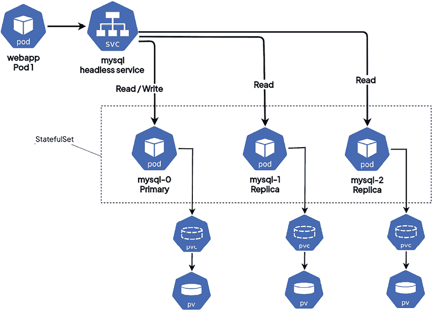

# 12

# StatefulSet – 部署有状态应用程序

在上一章中，我们解释了如何使用 Kubernetes 集群运行 *无状态* 工作负载和应用程序，以及如何为此目的使用 Deployment 对象。 在云中运行无状态工作负载通常更容易处理，因为任何容器副本都可以处理请求，而无需依赖于用户先前操作的结果。换句话说，每个容器副本都会以相同的方式处理请求；你需要关心的只是适当的负载均衡。

然而，主要的复杂性在于管理应用程序的 *状态*。这里的 *状态* 指的是应用程序或组件需要存储的 *数据*，这些数据用于服务请求，并且可以被这些请求修改。应用程序中最常见的有状态组件是数据库——例如，它可以是 **关系型 MySQL 数据库** 或 **NoSQL MongoDB 数据库**。在 Kubernetes 中，你可以使用专门的对象来运行 *有状态* 工作负载和应用程序：StatefulSet。在管理 StatefulSet 对象时，你通常需要与 Persistent Volumes (PVs) 一起工作，这部分内容已经在 *第九章*，*Kubernetes 中的持久化存储* 中介绍过。本章将向你介绍 StatefulSet 在 Kubernetes 中的作用，以及如何创建和管理 StatefulSet 对象来发布你有状态应用程序的新版本。

本章将涵盖以下主题：

+   介绍 StatefulSet 对象

+   管理 StatefulSet

+   发布作为 StatefulSet 部署的应用的新版本

+   StatefulSet 最佳实践

# 技术要求

本章你需要以下内容：

+   需要一个已部署的 Kubernetes 集群。你可以使用本地集群或云端集群，但为了更好地理解这些概念，建议使用 **多节点** 的云端 Kubernetes 集群。该集群必须支持创建 PersistentVolumeClaims。任何云端集群或本地集群，例如使用 `k8s.io/minikube-hostpath` 提供程序的 `minikube`，都足够了。

+   必须在本地计算机上安装 Kubernetes CLI (`kubectl`)，并配置它来管理你的 Kubernetes 集群。

Kubernetes 集群的部署（本地和云端）和 `kubectl` 安装已在 *第三章*，*安装你的第一个 Kubernetes 集群* 中介绍过。

你可以从官方 GitHub 仓库下载本章的最新代码示例，地址是 [`github.com/PacktPublishing/The-Kubernetes-Bible-Second-Edition/tree/main/Chapter12`](https://github.com/PacktPublishing/The-Kubernetes-Bible-Second-Edition/tree/main/Chapter12)。

# 介绍 StatefulSet 对象

你可能会想，为什么在分布式云中运行有状态工作负载通常被认为比运行无状态工作负载**更困难**。在经典的三层应用中，所有的状态都会存储在数据库中（*数据层*或*持久化层*），这没有什么特别的地方。对于 SQL 服务器，你通常会添加一个故障转移设置和数据复制，如果需要更高的性能，你可以通过购买更好的硬件来进行*纵向*扩展。然后，某个时刻，你可能会考虑集群化的 SQL 解决方案，引入*数据分片*（水平数据分区）。但即便如此，从运行你应用的 web 服务器的角度来看，数据库也只是一个用于读写数据的单一连接字符串。数据库将负责持久化一个*可变状态*。

记住，除非应用程序仅提供静态内容或只是转换用户输入，否则每个应用程序*整体*上都是有状态的。然而，这并不意味着应用程序中的*每个*组件都是有状态的。运行应用程序逻辑的 web 服务器可以是*无状态*组件，但这个应用程序存储用户输入和会话的数据库将是*有状态*组件。

我们将首先解释如何在容器中管理状态，并阐明我们认为的应用程序或系统状态。

## 在容器中管理状态

现在，假设你将 SQL 服务器（单实例）部署在容器中。你会注意到的第一件事是，每次重新启动容器后，数据库中存储的数据都会丢失——每次重新启动时，你得到的是 SQL 服务器的一个全新实例。容器是*临时性的*。这对于我们的使用案例来说似乎不太有用。幸运的是，容器提供了挂载数据卷的选项。一个卷可以是，例如，一个*主机目录或外部磁盘卷*，它会被*挂载*到容器文件系统中的特定路径。你在这个路径中存储的任何东西，即使容器终止或重新启动，也会保存在卷中。类似地，你可以使用 NFS 共享或外部磁盘实例作为卷。现在，如果你配置 SQL 服务器将其数据文件放在挂载卷的路径下，即使容器重新启动，你也能实现数据持久化。容器本身仍然是临时性的，但数据（状态）却*不是*。

这是关于如何在普通容器中持久化状态的高级概述，而不涉及 Kubernetes。但在我们进入 Kubernetes 之前，我们需要澄清我们实际认为的**状态**是什么。

假设你有一个只提供简单 *静态* 内容的 Web 服务器（这意味着它始终是相同的，比如一个简单的 HTML 网页）。虽然仍然有一些数据是持久化的，例如 HTML 文件，但这 *不是* 状态：用户请求无法修改这些数据，因此 *之前* 的请求不会影响 *当前* 请求的结果。同样，Web 服务器的配置文件也不是它的状态，磁盘上写入的日志文件也不是（嗯，这个可以争论，但从最终用户的角度来看，它不是）。

现在，如果你有一个 Web 服务器，用来保持用户会话并存储有关用户是否已登录的信息，那么这确实是状态。根据这些信息，Web 服务器将返回不同的网页（响应），以区分用户是否登录。假设这个 Web 服务器运行在一个容器中 —— 当涉及到它是否是你应用程序中的 *有状态* 组件时，会有一些细节需要注意。如果 Web 服务器进程将用户会话存储为容器内的文件（警告：这可能是一个相当糟糕的设计），那么 Web 服务器容器就是一个 *有状态* 组件。但如果它将用户会话存储在一个运行在独立容器中的数据库或 Redis 缓存中，那么 Web 服务器就是 *无状态* 的，而数据库或 Redis 容器则成为有状态组件。

这从单个容器的角度来看大致是这样的。现在我们需要稍微放大一些，来看看在 **Kubernetes Pods** 中的状态管理。

## 在 Kubernetes Pods 中管理状态

在 Kubernetes 中，容器卷的概念通过 **持久卷**（**PVs**）、**持久卷声明**（**PVCs**）和 **存储类**（**SCs**）得到了扩展，这些都是专门用于存储的对象。PVC 的目标是 *解耦* Pods 与实际存储之间的关系。PVC 是一个 Kubernetes 对象，用于表示对特定类型、类或大小存储的请求 —— 比如说 *我需要 10 GB 的一次性读写 SSD 存储*。为了满足这样的请求，必须有一个 PV 对象，它是由集群的自动化过程提供的实际存储 —— 可以将其理解为主机系统上的一个目录或存储驱动程序管理的磁盘。PV 类型通过插件实现，类似于 Docker 或 Podman 中的卷。现在，整个 PV 提供过程可以是 *动态的* —— 它需要创建一个 SC 对象，并在定义 PVC 时使用该 SC。创建新的 SC 时，你提供一个 *提供者*（或插件细节）与特定参数，每个使用该 SC 的 PVC 会自动创建一个 PV，使用所选的提供者。例如，提供者可以创建云管理磁盘来提供后端存储。除此之外，给定 Pod 的容器可以通过使用相同的 PV 来共享数据，并将其挂载到文件系统中。

这只是 Kubernetes 提供的状态存储的简要概述。我们在*第九章*《Kubernetes 中的持久存储》中对此进行了更详细的讲解。

除了单个 Pod 及其容器的状态管理外，还有*多个副本*的 Pod 的状态管理。让我们考虑一下，如果我们使用 Deployment 对象来运行多个 MySQL Server Pod 会发生什么。首先，您需要确保在容器中的卷上持久化状态——为此，您可以在 Kubernetes 中使用 PVs。但这样，您实际上会得到多个独立的 MySQL 服务器，如果您想要高可用性和容错性，这并不十分有用。如果您通过服务暴露这样的部署，它也将没有用处，因为每次您可能会连接到不同的 MySQL Pod 并获得不同的数据。

所以，您要么设计一个带有主从复制的*多节点故障转移设置*，要么设计一个复杂的*数据分片集群*。无论哪种情况，您的单个 MySQL Server Pod 副本都需要具有*唯一身份*，并且最好具有*可预测的网络名称*，以便节点和客户端可以进行通信。

在为 Kubernetes 集群设计云原生应用程序时，请始终分析将应用程序状态存储为有状态组件*在 Kubernetes 中运行*的所有优缺点。

这就是 StatefulSet 的作用。让我们更详细地看看这个 Kubernetes 对象。

## StatefulSet 及其与 Deployment 对象的区别

Kubernetes StatefulSet 是一个类似于 Deployment 对象的概念。它也提供了一种管理和扩展 Pod 集合的方式，但它提供了关于 Pod 的*顺序和唯一性*（唯一身份）的保证。与 Deployment 一样，它使用 Pod 模板来定义每个副本的样子。您可以进行扩展和缩减，并进行新版本的发布。但在 StatefulSet 中，单个 Pod 副本是*不可互换*的。每个 Pod 的唯一持久身份在任何重新调度或发布期间都得以保持——这包括**Pod 名称**和其**集群 DNS 名称**。这个唯一的持久身份可以用于标识分配给每个 Pod 的 PVs，即使 Pods 在故障后被替换。为此，StatefulSet 在其规格中提供了另一种类型的模板，名为`volumeClaimTemplates`。该模板可以用于动态创建给定 SC 的 PVC。通过这种方式，整个存储配置过程完全动态——您只需创建一个 StatefulSet。底层存储对象由 StatefulSet 控制器管理。

StatefulSet 中单个 Pod 的集群 DNS 名称保持不变，但其集群 IP 地址不保证保持不变。这意味着，如果您需要连接到 StatefulSet 中的单个 Pod，应该使用集群 DNS 名称。

基本上，您可以将 StatefulSet 用于以下应用程序：

+   由 Kubernetes 集群管理的持久化存储（这是主要使用场景，但不是唯一的）

+   为每个 Pod 副本提供稳定且唯一的网络标识符（通常是 DNS 名称）

+   有序部署和扩展

+   有序的滚动更新

在以下图示中，您可以看到 StatefulSets 可以视为 Deployment 对象的一个更具可预测性的版本，并且可以使用 PVC 提供的持久化存储。



图 12.1：StatefulSet 高层视图

总结一下，StatefulSet 和 Deployment 之间的主要区别如下：

+   StatefulSet 确保为 Pod 提供 *确定性*（粘性）名称，名称由 `<statefulSetName>-<ordinal>` 组成。对于 Deployments，您将获得一个由 `<deploymentName>-<podTemplateHash>-<randomHash>` 组成的 *随机* 名称。

+   对于 StatefulSet 对象，Pod 是以 *特定* 和 *可预测* 的顺序启动和终止的，这确保了在扩展 ReplicaSet 时的一致性、稳定性和协调性。以前面提到的 MySQL StatefulSet 示例为例，Pod 将按顺序创建（mysql-0、mysql-1 和 mysql-2）。当您缩小 StatefulSet 时，Pod 将按相反的顺序终止 —— mysql-2、mysql-1，最后是 mysql-0。

+   在存储方面，Kubernetes 会根据 StatefulSet 规范中的 `volumeClaimTemplates` 为 StatefulSet 中的每个 Pod 创建 PVC，并始终将其附加到具有 *相同* 名称的 Pod。对于 Deployment，如果您选择在 Pod 模板中使用 `persistentVolumeClaim`，Kubernetes 将创建一个单一的 PVC，并将其附加到 Deployment 中的所有 Pods。这在某些场景下可能有用，但并不是常见的使用场景。

+   您需要创建一个 `headless` 服务对象，负责管理 Pod 的 *确定性网络标识*（集群 DNS 名称）。Headless 服务使我们能够将所有 Pod 的 IP 地址作为 DNS A 记录返回，而不是将其作为带有 `ClusterIP` 服务的单一 DNS A 记录。只有在不使用常规服务时，才需要 Headless 服务。StatefulSet 的规范要求在 `.spec.serviceName` 中提供服务名称。请参阅《第八章，*通过服务暴露您的 Pod*》中的 *理解 Headless 服务*。

在我们探索 StatefulSet 之前，需要了解一些 StatefulSet 对象的局限性，具体内容将在以下部分中解释。

## 探索 StatefulSet 的局限性

以下是使用 StatefulSets 时需要注意的具体事项：

+   **存储设置**：StatefulSets 不会自动为您的 Pod 创建存储。您需要使用内建工具（如 PersistentVolume Provisioner）或事先手动设置存储。

+   **残留存储**：当你缩减或删除一个 StatefulSet 时，其 Pod 使用的存储会保留下来。这是因为你的数据很重要，不应被意外删除。如果需要，你需要手动清理存储。否则，残留的存储可能会成为一个问题，因为随着时间的推移，所有这些未使用的存储会积累，导致资源浪费和存储成本增加。

+   **Pod 地址**：你需要设置一个单独的服务（称为无头服务），以为 Pod 提供唯一且稳定的网络名称。

+   **停止 StatefulSets**：当你删除 StatefulSet 时，无法保证 Pod 会按特定顺序关闭。为了确保干净地关闭，最好在完全删除 StatefulSet 之前，将其缩放为零个 Pod。

+   **更新 StatefulSets**：使用 StatefulSets 的默认更新方法有时会导致需要手动修复的问题。请注意这一点，并在需要时考虑替代的更新策略。

在开始使用 StatefulSet 进行练习之前，请阅读下一节关于 StatefulSets 的重要信息。

## Statefulset 中的数据管理

Kubernetes 提供了 StatefulSets 作为管理有状态应用程序的强大工具。然而，成功地部署和维护有状态应用程序需要用户的参与，远远不止是定义 StatefulSet 本身。以下是需要你关注的关键领域：

+   **数据克隆和同步**：与无状态应用程序不同，有状态应用程序依赖于持久化数据。虽然 StatefulSets 管理 Pod 的顺序和身份，但它们不处理 Pods 之间的数据复制。你需要自己实现这一功能。常见的做法包括使用初始化容器在 Pod 创建时从预定义的源复制数据，利用应用程序内部的内建复制功能（例如 MySQL 复制），或使用外部脚本来管理数据同步。

+   **远程存储可访问性**：StatefulSets 确保 Pod 可以在集群中可用的节点之间重新调度。为了在重新调度期间保持数据持久性，PV 提供的存储需要能够从所有工作节点访问。这意味着选择一个跨节点复制数据的存储类，或使用所有机器都能访问的网络附加存储解决方案。

+   **外部备份**：StatefulSets 旨在管理 Pod 生命周期和集群内的数据持久化。然而，它们不处理外部备份。为了确保在灾难性事件发生时的灾难恢复，实施一个单独的外部备份解决方案是至关重要的。这可能涉及将你的 PV 备份到云存储服务或 Kubernetes 集群外的专用备份服务器。

有关于在 StatefulSets 中处理数据的最佳实践和推荐方法。下一节将解释一些 StatefulSets 的复制管理技术。

## 复制管理

正如名称所示，处理数据的有状态应用通常需要数据初始化或同步。你可能需要使用以下方法来实现这些功能：

+   **初始化容器**：在启动应用程序之前，将数据从源（如配置映射）复制到持久化存储。

+   **应用级别的复制**：利用应用内置的复制功能，在 Pods 之间处理数据更新。

+   **外部脚本**：使用外部脚本或工具，在更新过程中管理数据迁移。

现在，让我们来看一个具体的 StatefulSet 示例，它部署了 MySQL Pods，并且支持持久化存储。

# 管理 StatefulSet

为了演示 StatefulSet 对象的工作原理，我们将修改 MySQL 部署并将其适配为 StatefulSet。StatefulSet 规格中的重要部分与部署（Deployments）相同。由于我们希望演示在 StatefulSet 对象中 PVC 的自动管理如何工作，我们将在规格中使用 `volumeClaimTemplates` 来创建 PVC 和 PV，这些 PVC 和 PV 会被 Pods 使用。每个 Pod 都会在容器文件系统中将其分配的 PV 挂载到 `/var/lib/mysql` 路径下，这里是 MySQL 数据文件的默认位置。通过这种方式，即使我们强制重启 Pods，也能演示如何保持 *状态* 持久化。

本章将使用的示例仅用于演示，目的是尽可能简单。如果你对 *复杂* 的示例感兴趣，例如在 StatefulSets 中部署和管理分布式数据库，请查看官方 Kubernetes 博文，关于部署 Cassandra 数据库的教程，网址是 [`kubernetes.io/docs/tutorials/stateful-application/cassandra/`](https://kubernetes.io/docs/tutorials/stateful-application/cassandra/)。通常，这类情况下的复杂性主要来自于在扩展 StatefulSet 时处理 Pod 副本的加入与移除。

现在，我们将逐一查看创建 StatefulSet 所需的所有 YAML 清单，并将它们应用到集群中。

## 创建 StatefulSet

我们已经讨论了 StatefulSet 的概念，现在是时候学习如何管理它们了。首先，让我们来看一下名为 `mysql-statefulset.yaml` 的 StatefulSet YAML 清单文件：

```
# mysql-statefulset.yaml
apiVersion: apps/v1
kind: StatefulSet
metadata:
  name: mysql-stateful
  labels:
    app: mysql
  namespace: mysql
spec:
  serviceName: mysql-headless
  replicas: 3
  selector:
    matchLabels:
      app: mysql
      environment: test
# (to be continued in the next paragraph) 
```

上述文件的第一部分与 Deployment 对象规格非常相似，你需要提供 `replicas` 数量以及 Pod 的 `selector`。有一个新参数 `serviceName`，稍后我们会解释它。

文件的下一部分涉及 StatefulSet 使用的 Pod 模板的规格：

```
# (continued)
  template:
    metadata:
      labels:
        app: mysql
        environment: test
    spec:
      containers:
        - name: mysql
          image: mysql:8.2.0
          ports:
            - containerPort: 3306
          volumeMounts:
            - name: mysql-data
              mountPath: /var/lib/mysql
          env:
            - name: MYSQL_ROOT_PASSWORD
              valueFrom:
                secretKeyRef:
                  name: mysql-secret
                  key: MYSQL_ROOT_PASSWORD
            - name: MYSQL_USER
              valueFrom:
                secretKeyRef:
                  name: mysql-secret
                  key: MYSQL_USER
            - name: MYSQL_PASSWORD
              valueFrom:
                secretKeyRef:
                  name: mysql-secret
                  key: MYSQL_PASSWORD
# (to be continued in the next paragraph) 
```

如果你仔细观察，会发现其结构与部署（Deployments）是相同的。注意，我们通过 Secret 对象提供的环境变量，这些环境变量需要在创建 StatefulSet 之前创建。此外，文件的最后部分包含了 `volumeClaimTemplates`，它用于定义 Pod 使用的 PVC 模板：

```
# (continued)
  volumeClaimTemplates:
    - metadata:
        name: mysql-data
      spec:
        accessModes:
          - "ReadWriteOnce"
        resources:
          requests:
            storage: 1Gi 
```

如你所见，通常 StatefulSet 规范的结构与 Deployment 相似，尽管它有一些额外的参数用于配置 PVC 和相关的服务对象。该规范有五个主要组件：

+   `replicas`：定义应该使用给定的 `template` 和匹配的标签 `selector` 运行的 Pod 副本数。Pods 可能会被创建或删除，以维持所需的数量。

+   `serviceName`：管理 StatefulSet 并为 Pod 提供网络身份的服务名称。此服务必须在创建 StatefulSet 之前创建。我们将在下一步中创建 `mysql-headless` 服务。

+   `selector`：一个 **标签选择器**，定义如何识别 StatefulSet 所拥有的 Pods。这可以包括 *基于集合* 和 *基于相等* 的选择器。

+   `template`：定义 Pod 创建的模板。`metadata` 中使用的标签必须与 `selector` 匹配。Pod 名称不是随机的，遵循 `<statefulSetName>-<ordinal>` 的约定。你可以选择使用 `.spec.ordinals` 来控制分配给 StatefulSet 中每个 Pod 的唯一标识符的起始数字。

+   `volumeClaimTemplates`：定义为每个 Pod 创建的 PVC 模板。StatefulSet 对象中的每个 Pod 都将获得自己的 PVC，并且该 PVC 始终与给定的 Pod 名称关联。在我们的示例中，这是一个 1 GB 的卷，访问模式为 `ReadWriteOnce`。此访问模式允许仅由 *单个* 节点挂载该卷进行读写。我们没有指定 `storageClassName`，因此 PVC 将使用集群中的默认 SC 进行配置。PVC 名称不是随机的，遵循 `<volumeClaimTemplateName>-<statefulSetName>-<ordinal>` 的约定。

集群中的默认 SC 通过 `storageclass.kubernetes.io/is-default-class` 注解标记。是否有默认 SC 以及它如何定义，取决于你的集群部署。例如，在 Azure Kubernetes Service 集群中，默认 SC 为名为 `default` 的 SC，使用 `kubernetes.io/azure-disk` 提供者。在 `minikube` 中，默认 SC 为名为 `standard` 的 SC，使用 `k8s.io/minikube-hostpath` 提供者。

规范还包含与滚动发布 StatefulSet 新修订版相关的其他字段——我们将在下一部分中详细解释这些内容。

接下来，让我们看一下我们名为 `mysql-headless` 的 *无头* 服务。创建一个 `mysql-headless-service.yaml` 文件，内容如下：

```
# mysql-headless-service.yaml
apiVersion: v1
kind: Service
metadata:
  name: mysql-headless
  namespace: mysql
spec:
  selector:
    app: mysql
    environment: test
  clusterIP: None
  ports:
    - port: 3306 
```

该规范与我们之前为 Deployment 创建的普通服务非常相似；唯一的区别是它的 `clusterIP` 字段的值为 `None`。这将导致创建一个无头服务 `mysql-headless`。无头服务允许我们将 *所有* Pods 的 IP 地址作为 DNS `A 记录` 返回，而不是使用带有 `clusterIP` 服务的单个 DNS `A 记录`。我们将在接下来的步骤中演示这在实际中的意义。

使用所有的 YAML 清单文件，我们可以开始部署我们的示例 StatefulSet！请执行以下步骤：

1.  创建一个名为 `mysql` 的命名空间（使用 `mysql-ns.yaml`）：

    ```
    $ kubectl apply –f mysql-ns.yaml
    namespace/mysql created 
    ```

1.  创建一个 Secret 来存储 MySQL 环境变量：

    ```
    $ kubectl create secret generic mysql-secret \
      --from-literal=MYSQL_ROOT_PASSWORD='mysqlroot' \
      --from-literal=MYSQL_USER='mysqluser' \
      --from-literal=MYSQL_PASSWORD='mysqlpassword' \
      -n mysql
    secret/mysql-secret created 
    ```

请注意，也可以使用 YAML 和 base64 编码的值（例如，`echo -n 'mysqlroot' | base64`）在其中创建相同的 Secret（请参考仓库中的 `mysql-secret.yaml` 查看示例 YAML 文件）；我们使用这种命令式方法来演示带有实际值的 Secret。

1.  使用以下命令创建一个无头服务 `mysql-headless`：

    ```
    $ kubectl apply -f mysql-headless-service.yaml
    service/mysql-headless created 
    ```

1.  使用以下命令创建一个名为 `mysql-stateful` 的 StatefulSet 对象：

    ```
    $ kubectl apply -f mysql-statefulset.yaml
    statefulset.apps/mysql-stateful created 
    ```

1.  现在，您可以使用 `kubectl describe` 命令来观察 StatefulSet 对象的创建（或者，您也可以在使用 kubectl 命令时使用 `sts` 作为 StatefulSet 的缩写）：

    ```
    $ kubectl describe statefulset mysql-stateful -n mysql
    $  kubectl get sts -n mysql
    NAME             READY   AGE
    mysql-stateful   3/3     2m3s 
    ```

1.  使用 `kubectl get pods` 命令查看是否已创建三个期望的 Pod 副本。请注意，这可能需要一些时间，因为 Pods 必须根据其 PVC 获取已提供的 PV。

    ```
    $ kubectl get pod -n mysql
    NAME               READY   STATUS    RESTARTS   AGE
    mysql-stateful-0   1/1     Running   0          2m32s
    mysql-stateful-1   1/1     Running   0          2m29s
    mysql-stateful-2   1/1     Running   0          2m25s 
    ```

请注意有序、确定性的 Pod 命名——这是为 StatefulSet 对象中的 Pods 提供唯一标识的关键。

1.  如果您描述其中一个 Pod，您将看到与之关联的 PV 和 PVC 的更多详细信息：

    ```
    $ kubectl -n mysql describe pod mysql-stateful-0
    Name:             mysql-stateful-0
    Namespace:        mysql
    Priority:         0
    Service Account:  default
    ...<removed for brevity>...
    Volumes:
      mysql-data:
        Type:       PersistentVolumeClaim (a reference to a PersistentVolumeClaim in the same namespace)
        ClaimName:  mysql-data-mysql-stateful-0
        ReadOnly:   false
    ...<removed for brevity>... 
    ```

对于第二个 Pod，您将看到类似以下的输出，但 PVC 会有所不同：

```
$ kubectl -n mysql describe pod mysql-stateful-1
Name:             mysql-stateful-1
Namespace:        mysql
Priority:         0
...<removed for brevity>...
Volumes:
  mysql-data:
    Type:       PersistentVolumeClaim (a reference to a PersistentVolumeClaim in the same namespace)
    ClaimName:  mysql-data-mysql-stateful-1
    ReadOnly:   false
...<removed for brevity>... 
```

如您所见，这个 `mysql-stateful-0` Pod 使用的 PVC 名为 `mysql-data-mysql-stateful-0`，而这个 `mysql-stateful-1` Pod 使用的 PVC 名为 `mysql-data-mysql-stateful-1`。在 Pod 被调度到其目标节点后，PV 会通过各自的 StorageClass 被提供并绑定到各个 PVC。之后，实际的容器会被创建，并内部挂载这个 PV。

1.  使用 `kubectl get` 命令，我们可以揭示更多关于 PVC 的详细信息：

    ```
    $  kubectl get pvc -n mysql
    NAME                          STATUS   VOLUME                                     CAPACITY   ACCESS MODES   STORAGECLASS   VOLUMEATTRIBUTESCLASS   AGE
    mysql-data-mysql-stateful-0   Bound    pvc-453dbfee-6076-48b9-8878-e7ac6f79d271   1Gi        RWO            standard       <unset>                 8m38s
    mysql-data-mysql-stateful-1   Bound    pvc-36494153-3829-42aa-be6d-4dc63163ea38   1Gi        RWO            standard       <unset>                 8m35s
    mysql-data-mysql-stateful-2   Bound    pvc-6730af33-f0b6-445d-841b-4fbad5732cde   1Gi        RWO            standard       <unset>                 8m31s 
    ```

1.  最后，让我们来看看被提供的 PV：

    ```
    $ kubectl get pv
    NAME                                       CAPACITY   ACCESS MODES   RECLAIM POLICY   STATUS   CLAIM                               STORAGECLASS   VOLUMEATTRIBUTESCLASS   REASON   AGE
    pvc-36494153-3829-42aa-be6d-4dc63163ea38   1Gi        RWO            Delete           Bound    mysql/mysql-data-mysql-stateful-1   standard       <unset>                          11m
    pvc-453dbfee-6076-48b9-8878-e7ac6f79d271   1Gi        RWO            Delete           Bound    mysql/mysql-data-mysql-stateful-0   standard       <unset>                          11m
    pvc-6730af33-f0b6-445d-841b-4fbad5732cde   1Gi        RWO            Delete           Bound    mysql/mysql-data-mysql-stateful-2   standard       <unset>                          11m 
    ```

请注意，在我们的示例中，我们使用的是 minikube 的 `hostPath` 类型。如果您的 Kubernetes 集群使用了不同的存储后端，您将看到不同的输出。

我们已经成功创建了 StatefulSet 对象，现在是时候验证它在基本场景中的工作情况了。为此，我们将使用一个更新的 `k8sutils` 容器镜像，里面安装了默认的 MySQL 客户端包。（请查看 `Chapter12/Containerfile` 查看 `k8sutils` 镜像的详细信息。）按照以下方式创建 `k8sutils.yaml`：

```
# k8sutils.yaml
apiVersion: v1
kind: Pod
metadata:
  name: k8sutils
  # namespace: default
spec:
  containers:
    - name: k8sutils
      image: quay.io/iamgini/k8sutils:debian12-1.1
      command:
        - sleep
        - "infinity"
      # imagePullPolicy: IfNotPresent
  restartPolicy: Always 
```

按照以下方式创建 `k8sutils` Pod：

```
$ kubectl apply -f k8sutils.yaml -n mysql
pod/k8sutils created 
```

请注意，在应用 YAML 时我们使用了 `-n mysql`，这样资源将被创建在 `mysql` 命名空间中。

按照以下步骤验证 StatefulSet 中不同 Pods 的内容：

1.  进入 `k8sutil` Pod 执行我们的测试命令：

    ```
    $ kubectl exec -it -n mysql k8sutils -- /bin/bash
    root@k8sutils:/# 
    ```

1.  使用我们之前创建的默认无头服务访问 MySQL Stateful 应用（记得之前通过 Secret 对象创建的密码）：

    ```
    root@k8sutils:/# mysql -u root -p -h mysql-headless.mysql.svc.cluster.local
    Enter password: <mysqlroot>
    Welcome to the MariaDB monitor.  Commands end with ; or \g.
    Your MySQL connection id is 8
    Server version: 8.2.0 MySQL Community Server - GPL
    Copyright (c) 2000, 2018, Oracle, MariaDB Corporation Ab and others.
    Type 'help;' or '\h' for help. Type '\c' to clear the current input statement.
    MySQL [(none)]> show databases;
    +--------------------+
    | Database           |
    +--------------------+
    | information_schema |
    | mysql              |
    | performance_schema |
    | sys                |
    +--------------------+
    4 rows in set (0.003 sec)
    MySQL [(none)]> 
    ```

基本的 MySQL 连接已正常工作，我们能够访问作为 StatefulSet 应用程序运行的 MySQL 服务器。现在，我们将快速查看无头服务的行为。

## 使用无头服务和稳定的网络身份

之前，我们了解了 Kubernetes 中的无头服务以及如何使用它来访问有状态集应用程序。（参考 *第八章* 中的 *理解无头服务* 部分，*通过服务暴露你的 Pods*）。在本节中，让我们深入探讨 StatefulSet 后端中的无头服务机制。

让我们做一个实验，演示如何使用 `headless` 服务为我们的 Pod 提供稳定且可预测的网络身份：

1.  登录到我们在上一个测试中使用的相同 k8sutils Pod。

1.  对无头服务 `mysql-headless` 执行 DNS 检查：

    ```
    root@k8sutils:/# nslookup mysql-headless
    Server:         10.96.0.10
    Address:        10.96.0.10#53
    Name:   mysql-headless.mysql.svc.cluster.local
    Address: 10.244.0.14
    Name:   mysql-headless.mysql.svc.cluster.local
    Address: 10.244.0.15
    Name:   mysql-headless.mysql.svc.cluster.local
    Address: 10.244.0.16 
    ```

我们收到了三个 `A 记录`，它们直接指向 Pod 的 IP 地址。此外，它们有 `CNAME 记录`，形式为 `<podName>-<ordinal-number>.<headless-serviceName>.<namespace>.svc.cluster.local`。因此，与默认服务的不同之处在于，具有 `ClusterIP` 的服务会进行负载均衡，达到 *虚拟 IP* 级别（在 Linux 中，通常通过 `iptables` 规则，由 `kube-proxy` 配置在内核级别处理），而对于无头服务，负载均衡或选择目标 Pod 的责任由发起请求的 *客户端* 承担。

1.  对于 StatefulSet 中的 Pods，拥有 *可预测的* FQDN 给了我们直接向单个 Pods 发送请求的选项，而无需猜测它们的 IP 地址或名称。让我们尝试通过无头服务提供的短 DNS 名称来访问由 `mysql-stateful-0` 提供的 MySQL 服务器：

    ```
    root@k8sutils:/# mysql -u root -p -h mysql-stateful-0.mysql-headless
    Enter password: <mysqlroot>
    Welcome to the MariaDB monitor.  Commands end with ; or \g.
    Your MySQL connection id is 8
    Server version: 8.2.0 MySQL Community Server - GPL
    Copyright (c) 2000, 2018, Oracle, MariaDB Corporation Ab and others.
    Type 'help;' or '\h' for help. Type '\c' to clear the current input statement.
    MySQL [(none)]> 
    ```

正如预期的那样，你已经直接连接到 Pod，并由正确的 Pod 提供服务。

1.  让我们在 MySQL 数据库服务器中创建一个数据库，如下所示：

    ```
    MySQL [(none)]> create database ststest;
    Query OK, 1 row affected (0.002 sec)
    MySQL [(none)]> exit;
    Bye 
    ```

1.  现在，我们将展示即使 Pod 重启，DNS 名称也保持不变。Pod 的 IP 地址会变化，但 DNS 名称不会变化。更重要的是，挂载的 PV 也会保持不变，但我们将在接下来的段落中调查这一点。在另一个 shell 窗口中，容器外执行以下命令，强制重启 `mysql-stateful-0` Pod：

    ```
    $ kubectl delete po -n mysql mysql-stateful-0 
    ```

检查 Pods，你会看到 `mysql-stateful-0` 已被重新创建，并挂载了相同的 `mysql-data-mysql-stateful-0` PVC：

```
$ kubectl get po -n mysql
NAME               READY   STATUS    RESTARTS   AGE
k8sutils           1/1     Running   0          35m
mysql-stateful-0   1/1     Running   0          6s
mysql-stateful-1   1/1     Running   0          52m
mysql-stateful-2   1/1     Running   0          51m 
```

1.  在 `k8sutils` shell 中，执行 MySQL 客户端命令以检查数据库服务器内容：

    ```
    root@k8sutils:/# mysql -u root -p -h mysql-stateful-0.mysql-headless
    Enter password: <mysqlroot>
    Welcome to the MariaDB monitor.  Commands end with ; or \g.
    Your MySQL connection id is 8
    Server version: 8.2.0 MySQL Community Server - GPL
    Copyright (c) 2000, 2018, Oracle, MariaDB Corporation Ab and others.
    Type 'help;' or '\h' for help. Type '\c' to clear the current input statement.
    MySQL [(none)]> show databases;
    +--------------------+
    | Database           |
    +--------------------+
    | information_schema |
    | mysql              |
    | performance_schema |
    | ststest            |
    | sys                |
    +--------------------+
    5 rows in set (0.003 sec) 
    ```

你可以看到我们在 Pod 删除之前创建的数据库 `ststest` 仍然存在，这意味着数据是持久的或有状态的。同时，注意到 Pod 的 IP 地址发生了变化，但 DNS 名称保持不变。

这解释了如何利用无头服务来获取一个稳定且可预测的网络标识符，该标识符在 Pod 被重启或重建时不会改变。你可能会想，这到底有什么实际用途，为什么它对 StatefulSet 对象如此重要。这里有几个可能的使用案例：

+   部署集群数据库，如 `etcd` 或 MongoDB，需要指定数据库集群中其他节点的网络地址。如果数据库没有提供*自动发现*功能，这一点尤其重要。在这种情况下，由无头服务提供的稳定 DNS 名称可以帮助在 Kubernetes 上以 StatefulSets 的形式运行此类集群。仍然存在在扩展期间添加或删除 Pod 副本时更改配置的问题。在某些情况下，*sidecar 容器模式*可以解决这个问题，它监控 Kubernetes API 以动态更改数据库配置。

+   如果你决定实现自己的存储解决方案，并将其作为 StatefulSet 运行，具有高级数据分片功能，你很可能需要将逻辑分片映射到集群中的物理 Pod 副本。然后，稳定的 DNS 名称可以作为映射的一部分使用。它们将确保每个逻辑分片的查询始终发送到正确的 Pod，无论该 Pod 是否被重新调度到另一个节点或重启。

最后，让我们看看运行在 StatefulSet 中的 Pods 的状态持久性。

## 状态持久性

正如我们之前演示的，数据会在 PV 内持久化，并将绑定到具有相同顺序号的新创建的 Pod。

在以下示例中，我们正在删除 StatefulSet 中的所有 Pods：

```
$ kubectl delete po -n mysql mysql-stateful-0 mysql-stateful-1 mysql-stateful-2
pod "mysql-stateful-0" deleted
pod "mysql-stateful-1" deleted
pod "mysql-stateful-2" deleted 
```

Kubernetes 会按以下顺序重新创建所有 Pods：

```
$ kubectl get pod -n mysql
NAME               READY   STATUS    RESTARTS   AGE
k8sutils           1/1     Running   0          47m
mysql-stateful-0   1/1     Running   0          44s
mysql-stateful-1   1/1     Running   0          43s
mysql-stateful-2   1/1     Running   0          41s 
```

我们还可以验证已挂载的 PV，以确保 Pod 到 PVC 的绑定成功：

```
$ kubectl describe pod -n mysql -l app=mysql |egrep 'ClaimName|Name:'
Name:             mysql-stateful-0
    ClaimName:  mysql-data-mysql-stateful-0
    ConfigMapName:           kube-root-ca.crt
Name:             mysql-stateful-1
    ClaimName:  mysql-data-mysql-stateful-1
    ConfigMapName:           kube-root-ca.crt
Name:             mysql-stateful-2
    ClaimName:  mysql-data-mysql-stateful-2
    ConfigMapName:           kube-root-ca.crt 
```

正如你所学到的，StatefulSet 控制器不会在 Pod 或 StatefulSet 删除时删除 PV。若你完全删除 StatefulSet 对象，清理数据并手动删除 PV 是你的责任。

接下来，我们将看看如何扩展 StatefulSet 对象。

## 扩展 StatefulSet

在 StatefulSet 的情况下，你可以像操作 Deployment 对象一样执行类似的*扩展*操作，通过更改规格中的 `replicas` 数量或使用 `kubectl scale` 命令。新 Pods 会在扩展时自动作为服务的新 Endpoints 被发现，或者在缩减时自动从 Endpoints 列表中移除。

然而，与 Deployment 对象相比，仍然存在一些差异：

+   当你部署一个有 `N` 个副本的 StatefulSet 对象时，部署过程中，Pods 是按顺序创建的，从 `0` 到 `N`-`1`。在我们的示例中，创建一个有三个副本的 StatefulSet 对象时，第一个 `mysql-stateful-0` Pod 被创建，然后是 `mysql-stateful-1`，最后是 `mysql-stateful-2`。

+   当你*扩容*StatefulSet 时，新的 Pod 也会按顺序创建，并且有序进行。

+   当你*缩容*StatefulSet 时，Pod 会按*反向顺序*依次终止，从`N`*-*`1`到`0`。在我们的例子中，当 StatefulSet 对象缩容至零副本时，`mysql-stateful-2` Pod 首先被终止，然后是`mysql-stateful-1`，最后是`mysql-stateful-0`。

+   在 StatefulSet 对象进行扩容时，在按顺序创建下一个 Pod 之前，所有前一个 Pod 必须是*运行中*并且*就绪的*。

+   在 StatefulSet 对象进行*缩容*时，在下一个 Pod 按反向顺序终止之前，所有前一个 Pod 必须完全*终止*并被*删除*。

+   此外，通常在对 StatefulSet 对象中的 Pod 执行*任何*扩展操作之前，所有前一个 Pod 必须处于运行并就绪状态。这意味着，如果在从四个副本缩容到一个副本时，`mysql-stateful-0` Pod 突然失败，那么就不会对`mysql-stateful-1`、`mysql-stateful-2`和`mysql-stateful-3` Pod 进行进一步的扩展操作。扩展操作将在`mysql-stateful-0` Pod 重新就绪后恢复。

通过更改规范中的`.spec.podManagementPolicy`字段，可以放宽扩展操作的顺序行为。默认值为`OrderedReady`。如果将其更改为`Parallel`，则扩展操作将在 Pod 上并行执行，类似于 Deployment 对象中的操作。请注意，这仅影响扩展操作。使用`RollingUpdate`类型的`updateStrategy`更新 StatefulSet 对象的方式不变。

具备了这些知识后，让我们*扩容*我们的 StatefulSet 对象，快速演示一下：

1.  使用以下命令扩展 StatefulSet：

    ```
    $ kubectl scale statefulset -n mysql mysql-stateful --replicas 4
    statefulset.apps/mysql-stateful scaled 
    ```

1.  如果你现在使用`kubectl get pods`命令检查 Pod，你将看到新的 Pod 按顺序创建：

    ```
    $ kubectl get pod -n mysql
    NAME               READY   STATUS    RESTARTS   AGE
    k8sutils           1/1     Running   0          56m
    mysql-stateful-0   1/1     Running   0          9m13s
    mysql-stateful-1   1/1     Running   0          9m12s
    mysql-stateful-2   1/1     Running   0          9m10s
    mysql-stateful-3   1/1     Running   0          4s 
    ```

同样，如果你检查 StatefulSet 对象的`kubectl describe`命令输出，你会在事件中看到以下内容：

```
$ kubectl describe sts -n mysql mysql-stateful
Name:               mysql-stateful
Namespace:          mysql
...<removed for brevity>...
Events:
  Type    Reason                   Age                 From                    Message
  ----    ------                   ----                ----                    -------
  Normal  SuccessfulCreate         23m (x2 over 75m)   statefulset-controller  create Pod mysql-stateful-0 in StatefulSet mysql-stateful successful
  Normal  RecreatingTerminatedPod  11m (x13 over 23m)  statefulset-controller  StatefulSet mysql/mysql-stateful is recreating terminated Pod mysql-stateful-0
  Normal  SuccessfulDelete         11m (x13 over 23m)  statefulset-controller  delete Pod mysql-stateful-0 in StatefulSet mysql-stateful successful
  Normal  SuccessfulCreate         2m28s               statefulset-controller  create Claim mysql-data-mysql-stateful-3 Pod mysql-stateful-3 in StatefulSet mysql-stateful success
  Normal  SuccessfulCreate         2m28s               statefulset-controller  create Pod mysql-stateful-3 in StatefulSet mysql-stateful successful
Let us scale down our StatefulSet object imperatively and check the Pods as follows:
$ kubectl scale statefulset -n mysql mysql-stateful --replicas 2
statefulset.apps/mysql-stateful scaled 
```

你可以看到最后两个 Pod——`mysql-stateful-3`和`mysql-stateful-2`——已按顺序删除。现在，让我们检查`statefulset`中的 Pod，如下所示：

```
$  kubectl get pod -n mysql
NAME               READY   STATUS    RESTARTS   AGE
k8sutils           1/1     Running   0          61m
mysql-stateful-0   1/1     Running   0          15m
mysql-stateful-1   1/1     Running   0          15m 
```

1.  现在检查 PVC，你会发现 PVC 仍然存在。这是 StatefulSet 的预期情况，正如我们之前所学到的：

    ```
    $ kubectl get pvc -n mysql
    NAME                          STATUS   VOLUME                                     CAPACITY   ACCESS MODES   STORAGECLASS   VOLUMEATTRIBUTESCLASS   AGE
    mysql-data-mysql-stateful-0   Bound    pvc-453dbfee-6076-48b9-8878-e7ac6f79d271   1Gi        RWO            standard       <unset>                 79m
    mysql-data-mysql-stateful-1   Bound    pvc-36494153-3829-42aa-be6d-4dc63163ea38   1Gi        RWO            standard       <unset>                 79m
    mysql-data-mysql-stateful-2   Bound    pvc-6730af33-f0b6-445d-841b-4fbad5732cde   1Gi        RWO            standard       <unset>                 79m
    mysql-data-mysql-stateful-3   Bound    pvc-6ec1ee2a-5be3-4bf9-84e5-4f5aee566c11   1Gi        RWO            standard       <unset>                 7m4s 
    ```

当使用**水平 Pod 自动扩展器**（**HPA**）或类似的水平扩展工具管理 StatefulSet 时，避免在清单中为`.spec.replicas`指定值。相反，保持该字段为空。Kubernetes 控制平面会根据资源需求动态调整副本数，从而有效地扩展你的应用程序，无需手动干预。

恭喜！我们已经学会了如何部署和扩展 StatefulSet 对象。接下来，我们将演示如何删除 StatefulSet 对象。

## 删除 StatefulSet

删除 StatefulSet 对象有两种可能性：

+   删除 StatefulSet 及其拥有的 Pods

+   删除 StatefulSet 并保持 Pods 不受影响

在这两种情况下，使用 `volumeClaimTemplates` 为 Pods 创建的 PVC 和 PV 默认*不会*被删除。这确保了状态数据不会意外丢失，除非你明确清理 PVC 和 PV。

但是在最新的 Kubernetes 版本（从 v1.27 开始）中，你可以使用 `.spec.persistentVolumeClaimRetentionPolicy` 字段来控制 PVC 在 StatefulSet 生命周期中的删除：

```
apiVersion: apps/v1
kind: StatefulSet
...
spec:
  persistentVolumeClaimRetentionPolicy:
    whenDeleted: Retain
    whenScaled: Delete
... 
```

请参阅文档以了解更多关于 `persistentVolumeClaimRetentionPolicy` 的信息（https://kubernetes.io/docs/concepts/workloads/controllers/statefulset/#persistentvolumeclaim-retention）。

要删除 StatefulSet 对象及其 Pods，你可以使用常规的 `kubectl delete` 命令：

```
$ kubectl delete sts -n mysql mysql-stateful
statefulset.apps "mysql-stateful" deleted 
```

你将看到 Pods 会首先被终止，然后是 StatefulSet 对象。请注意，这一操作与将 StatefulSet 对象*缩容*至零副本并删除它的操作不同。如果你删除包含现有 Pods 的 StatefulSet 对象，无法保证单个 Pods 的终止顺序。在大多数情况下，它们会被同时终止。

可选地，如果你只想删除 StatefulSet 对象，你需要为 `kubectl delete` 命令使用 `--cascade=orphan` 选项：

```
$ kubectl delete sts -n mysql mysql-stateful --cascade=orphan 
```

执行此命令后，如果你检查集群中的 Pods，你仍然会看到所有由 `mysql-stateful` StatefulSet 所拥有的 Pods。

最后，如果你希望在删除 StatefulSet 对象后清理 PVC 和 PV，你需要手动执行此步骤。使用以下命令删除作为 StatefulSet 一部分创建的 PVC：

```
$ kubectl delete -n mysql pvc mysql-data-mysql-stateful-0 mysql-data-mysql-stateful-1 mysql-data-mysql-stateful-2 mysql-data-mysql-stateful-3
persistentvolumeclaim "mysql-data-mysql-stateful-0" deleted
persistentvolumeclaim "mysql-data-mysql-stateful-1" deleted
persistentvolumeclaim "mysql-data-mysql-stateful-2" deleted
persistentvolumeclaim "mysql-data-mysql-stateful-3" deleted 
```

此命令将删除 PVC 及相关的 PV。

重要提示

请注意，如果你想在下一部分的新版本发布过程中验证状态持久性，你不应该删除 PVC。否则，你将丢失存储在 PV 中的 MySQL 文件。

通过这一部分，我们完成了对 Kubernetes 中 StatefulSet 对象基本操作的学习。接下来，让我们看看如何发布作为 StatefulSet 部署的应用的新版本，以及 StatefulSet 修订版是如何管理的。

# 发布作为 StatefulSet 部署的应用的新版本

我们在上一节中已经介绍了 StatefulSet 的*扩缩容*，通过`kubectl scale`命令（或通过修改规范中的`.spec.replicas`数量）。你所学到的关于 Pod 的顺序和有序变化的知识在使用`RollingUpdate`策略推出 StatefulSet 对象的新版本时发挥着重要作用。StatefulSet 和 Deployment 对象之间有许多相似之处。我们在*第十一章*《使用 Kubernetes 部署无状态工作负载》中详细讨论了 Deployment 更新的内容。对 StatefulSet Pod *模板*（`spec.template`）的更改也会导致 StatefulSet 的新版本发布。

StatefulSet 支持两种*更新策略*，你可以通过规范中的`.spec.updateStrategy.type`字段来定义它们：

+   `RollingUpdate`：默认策略，允许你以可控的方式推出应用程序的新版本。这与 Deployment 对象中已知的`RollingUpdate`策略略有不同。对于 StatefulSet，该策略会以顺序和有序的方式终止并重新创建 Pod，并确保在继续处理下一个 Pod 之前，Pod 已经重新创建并处于就绪状态。

+   `OnDelete`：此策略实现了 Kubernetes 1.7 之前 StatefulSet 更新的传统行为。然而，它仍然非常有用！在这种策略下，StatefulSet *不会*通过重新创建 Pod 副本来自动更新 Pod 副本。你需要手动删除 Pod 副本，以便应用新的 Pod 模板。在需要在继续处理下一个 Pod 副本之前执行额外的手动操作或验证的场景中，这非常有用。例如，如果你在 StatefulSet 中运行一个*Cassandra 集群*或*etcd 集群*，你可能想要验证新的 Pod 在删除旧版本 Pod 之后，是否正确地加入了现有集群。当然，使用`RollingUpdate`策略时，也可以通过 Pod 模板生命周期中的`postStart`和`preStop`钩子来执行类似的检查，但这需要在钩子中处理更复杂的错误。

现在让我们仔细看看`RollingUpdate`策略，这是 StatefulSet 最重要和最常用的更新策略。关键在于，这个策略尊重我们在上一节中解释的关于扩缩容的 StatefulSet 保证。发布是按相反的顺序进行的；例如，第一个 Pod `mysql-stateful-2` 会使用新的 Pod 模板重新创建，接着是`mysql-stateful-1`，最后是`mysql-stateful-0`。

如果发布过程中失败（不一定是当前重新创建的 Pod），StatefulSet 控制器会将任何失败的 Pod 恢复到其*当前版本*。这意味着已经成功更新到当前版本的 Pod 将保持在当前版本，而尚未更新的 Pod 将保持在之前的版本。这样，StatefulSet 会尽力保持应用的健康和一致性。然而，这也可能导致 StatefulSet 的*失败*发布。如果某个 Pod 副本*永远*没有变为运行并准备好，StatefulSet 将停止发布并等待*手动*干预。仅仅再次应用模板到 StatefulSet 的先前版本是不够的——这个操作不会继续，因为 StatefulSet 会等待失败的 Pod 变为就绪。唯一的解决方法是手动删除失败的 Pod，然后让 StatefulSet 应用 Pod 模板的先前版本。

最后，`RollingUpdate`策略还提供了使用`.spec.updateStrategy.rollingUpdate.partition`字段执行*分阶段*发布的选项。此字段定义了一个数字，所有*较小*的 Pod 副本序号将不会被更新，即使它们被删除，也会按之前的版本重新创建。因此，在我们的示例中，如果将`partition`设置为`1`，这意味着在发布过程中，只有`mysql-stateful-1`和`mysql-stateful-2`会被更新，而`mysql-stateful-0`将保持不变，并运行在之前的版本。通过控制`partition`字段，你可以轻松地发布单个*金丝雀*副本并执行*分阶段*发布。请注意，默认值为`0`，这意味着所有 Pod 副本都会被更新。

现在，我们将使用`RollingUpdate`策略发布新的 mysqlserver 版本。

## 更新 StatefulSet

我们现在将演示如何使用之前创建的 StatefulSet YAML 清单文件，发布 Pod 容器的新镜像版本：

1.  复制之前的 YAML 清单文件：

    ```
    $ cp mysql-statefulset.yaml mysql-statefulset-rolling-update.yaml 
    ```

1.  确保你使用的是`RollingUpdate`策略类型，并将`partition`设置为`0`。同时请注意，如果你曾尝试先使用不同的策略创建 StatefulSet 对象，在删除 StatefulSet 之前无法修改它：

    ```
    # mysql-statefulset-rolling-update.yaml
    apiVersion: apps/v1
    kind: StatefulSet
    metadata:
      name: mysql-stateful
      labels:
        app: mysql
      namespace: mysql
    spec:
      serviceName: mysql-headless
      **podManagementPolicy:****OrderedReady**
      updateStrategy:
        type: RollingUpdate
        rollingUpdate:
          **partition:****0**
      replicas: 3
    ...<removed for brevity>...
    (Refer to the GitHub repo for full YAML) 
    ```

这些值是默认值，但明确指定它们有助于理解实际发生了什么。

1.  将清单文件应用到集群中，以使用新配置创建`mysql-stateful` StatefulSet：

    ```
    $ kubectl apply -f mysql-statefulset-rolling-update.yaml
    statefulset.apps/mysql-stateful created 
    ```

在继续滚动更新任务之前，等待 Pod 运行。我们可以通过以下`kubectl get pods`命令验证由 StatefulSet 创建的 Pod：

```
$ kubectl get pods -n mysql
NAME               READY   STATUS    RESTARTS      AGE
k8sutils           1/1     Running   1 (21h ago)   23h
mysql-stateful-0   1/1     Running   0             65s
mysql-stateful-1   1/1     Running   0             62s
mysql-stateful-2   1/1     Running   0             58s 
```

1.  当 StatefulSet 在集群中准备好后，我们将通过 k8sutils Pod 在 StatefulSet 内部创建一个新数据库，如下所示：

    ```
    $ kubectl exec -it -n mysql k8sutils -- /bin/bash
    root@k8sutils:/# mysql -u root -p -h mysql-stateful-0.mysql-headless
    Enter password: <mysqlroot>
    Welcome to the MariaDB monitor.  Commands end with ; or \g.
    ...<removed for brevity>...
    MySQL [(none)]> create database stsrolling;
    Query OK, 1 row affected (0.027 sec)
    MySQL [(none)]> exit; 
    ```

现在，我们有了一个新的 StatefulSet，带有`updateStrategy`，并在其中创建了一个新的数据库。

接下来，我们可以为我们的 StatefulSet 对象发布一个新的 MySQL 容器镜像版本。为此，执行以下步骤：

1.  将 StatefulSet Pod 模板中使用的容器镜像修改为`mysql:8.3.0`：

    ```
    # mysql-statefulset-rolling-update.yaml
    ...<removed for brevity>...
        spec:
          containers:
            - name: mysql
              image: mysql:8.3.0
    ...<removed for brevity>... 
    ```

1.  使用以下命令将更改应用到集群中：

    ```
    $ kubectl apply -f mysql-statefulset-rolling-update.yaml
    statefulset.apps/mysql-stateful configured 
    ```

1.  紧接着，使用`kubectl rollout status`命令查看实时进度。由于发布是按顺序和有序的方式进行的，这个过程比 Deployment 对象要稍长一些：

    ```
    $ kubectl rollout status statefulset -n mysql
    Waiting for 1 pods to be ready...
    Waiting for 1 pods to be ready...
    Waiting for 1 pods to be ready...
    Waiting for 1 pods to be ready...
    Waiting for partitioned roll out to finish: 1 out of 3 new pods have been updated...
    Waiting for 1 pods to be ready...
    Waiting for 1 pods to be ready...
    Waiting for 1 pods to be ready...
    Waiting for 1 pods to be ready...
    Waiting for partitioned roll out to finish: 2 out of 3 new pods have been updated...
    Waiting for 1 pods to be ready...
    Waiting for 1 pods to be ready...
    Waiting for 1 pods to be ready...
    Waiting for 1 pods to be ready...
    partitioned roll out complete: 3 new pods have been updated... 
    ```

1.  类似地，使用`kubectl describe`命令，你可以查看 StatefulSet 的事件，这些事件精确展示了 Pod 副本重建的顺序：

    ```
    $ kubectl describe sts -n mysql mysql-stateful
    Name:               mysql-stateful
    Namespace:          mysql
    ...<removed for brevity>...
    Events:
      Type     Reason                   Age                From                    Message
      ----     ------                   ----               ----                    -------
    ...<removed for brevity>...
      Normal   SuccessfulDelete         72s (x7 over 73s)  statefulset-controller  delete Pod mysql-stateful-2 in StatefulSet mysql-stateful successful
      Normal   RecreatingTerminatedPod  72s (x7 over 72s)  statefulset-controller  StatefulSet mysql/mysql-stateful is recreating terminated Pod mysql-stateful-2
      Warning  FailedDelete             72s                statefulset-controller  delete Pod mysql-stateful-2 in StatefulSet mysql-stateful failed error: pods "mysql-stateful-2" not found
      Normal   SuccessfulDelete         70s (x2 over 71s)  statefulset-controller  delete Pod mysql-stateful-1 in StatefulSet mysql-stateful successful
      Normal   RecreatingTerminatedPod  70s                statefulset-controller  StatefulSet mysql/mysql-stateful is recreating terminated Pod mysql-stateful-1 
    ```

如预期的那样，发布是按*相反*顺序完成的。第一个重建的 Pod 是`mysql-stateful-2`，然后是`mysql-stateful-1`，最后是`mysql-stateful-0`。此外，由于我们使用了默认的`partition`值`0`，所有的 Pods 都被更新了。这是因为所有 Pod 副本的顺序编号都大于或等于`0`。

1.  现在，我们可以验证 Pods 是否使用新镜像进行了重建。执行以下命令来验证 StatefulSet 对象中的第一个 Pod 副本：

    ```
    $ kubectl describe pod -n mysql mysql-stateful-0|grep Image
        Image:          mysql:8.3.0
        Image ID:       docker.io/library/mysql@sha256:9de9d54fecee6253130e65154b930978b1fcc336bcc86dfd06e89b72a2588ebe 
    ```

1.  最后，你可以验证*状态*是否得以保持，因为新 Pods 使用了现有的 PVC。请注意，只有在你没有在前一部分手动删除 StatefulSet 的 PVC 时，这一过程才能正常工作：

    ```
    $ kubectl exec -it -n mysql k8sutils -- /bin/bash
    root@k8sutils:/# mysql -u root -p -h mysql-stateful-0.mysql-headless
    Enter password: **<mysqlroot>**
    ...<removed for brevity>...
    Server version: **8.3.0 MySQL Community Server - GPL**
    Copyright (c) 2000, 2018, Oracle, MariaDB Corporation Ab and others.
    Type 'help;' or '\h' for help. Type '\c' to clear the current input statement.
    MySQL [(none)]> show databases;
    +--------------------+
    | Database           |
    +--------------------+
    | information_schema |
    | mysql              |
    | performance_schema |
    **| stsrolling         |**
    | sys                |
    +--------------------+
    5 rows in set (0.004 sec)
    MySQL [(none)]> 
    ```

如你在上面的输出中所看到的，MySQL 新版本的发布已成功完成，状态得以保持，尽管 Pods 被重建了；你可以看到`stsrolling`数据库，这是你在滚动更新之前创建的。

你可以通过使用`kubectl -n mysql set image sts mysql-stateful mysql=mysql:8.3.0`命令*命令式*地修改 StatefulSet 容器镜像。这种方法仅推荐用于非生产环境和测试场景。一般来说，StatefulSets 比起命令式管理，更容易通过声明式方式进行管理。

现在，让我们学习如何使用`partition`字段进行*分阶段*发布，并使用*金丝雀发布*。假设我们想要将 mysql 镜像版本更新为`8.4.0`。你希望通过金丝雀发布确保更改在你的环境中正常工作，这是一种将单个（或部分）Pod 副本更新为新镜像（或其他镜像）版本的方法。请参考以下步骤：

1.  修改`mysql-statefulset-rolling-update.yaml`清单文件，使`partition`数字等于当前`replicas`，在我们的案例中是`3`：

    ```
    ...<removed for brevity>...
    spec:
      serviceName: mysql-headless
      podManagementPolicy: OrderedReady
      updateStrategy:
        type: RollingUpdate
        rollingUpdate:
          **partition: 3**
    ...<removed for brevity>...
    Also, update the image to 8.4.0 as follows:
    ...
        spec:
          containers:
            - name: mysql
              **image: mysql:8.4.0**
    ...<removed for brevity>... 
    ```

当`partition`的数字与`replicas`的数量相同，我们可以将 YAML 清单文件应用到集群中，而 Pods 将不会立即发生变化。这称为**发布预演**。

1.  将清单文件应用到集群中：

    ```
    $ kubectl apply -f mysql-statefulset-rolling-update.yaml
    statefulset.apps/mysql-stateful configured 
    ```

1.  现在，让我们为新版本创建一个*金丝雀*。在清单文件中将`partition`数量减少 1 至`2`。这意味着所有序号小于`2`的 Pod 副本将不会更新——在我们的例子中，这仅意味着更新`mysql-stateful-2` Pod。其他 Pod 将保持不变：

    ```
    ...
    spec:
      serviceName: mysql-headless
      podManagementPolicy: OrderedReady
      updateStrategy:
        type: RollingUpdate
        rollingUpdate:
          partition: 2
      replicas: 3
    ... 
    ```

1.  再次将清单文件应用到集群中：

    ```
    $ kubectl apply -f mysql-statefulset-rolling-update.yaml
    statefulset.apps/mysql-stateful configured 
    ```

1.  使用`kubectl rollout status`命令来跟踪进程。如预期，只有一个 Pod 会被重新创建：

    ```
    $ kubectl rollout status statefulset -n mysql
    Waiting for partitioned roll out to finish: 0 out of 1 new pods have been updated...
    Waiting for 1 pods to be ready...
    Waiting for 1 pods to be ready...
    Waiting for 1 pods to be ready...
    partitioned roll out complete: 1 new pods have been updated... 
    ```

1.  如果你描述 MySQL `mysql-stateful-0` 和 MySQL `mysql-stateful-2` Pods，你会发现第一个 Pod 使用的是旧版本的镜像，而第二个 Pod 则使用的是新版本：

    ```
    $ kubectl describe pod -n mysql mysql-stateful-0|grep Image
        Image:          mysql:8.3.0
        Image ID:       docker-pullable://mysql@sha256:9de9d54fecee6253130e65154b930978b1fcc336bcc86dfd06e89b72a2588ebe
    $ kubectl describe pod -n mysql mysql-stateful-2|grep Image
        Image:          mysql:8.4.0
        Image ID:       docker-pullable://mysql@sha256:4a4e5e2a19aab7a67870588952e8f401e17a330466ecfc55c9acf51196da5bd0 
    ```

1.  此时，你可以对金丝雀进行验证和冒烟测试。登录到 k8sutils Pod，并确保新的 Pod 使用新镜像（例如，8.4.0）运行正常。金丝雀看起来没有问题，所以我们可以继续进行新版本的*阶段性*发布：

    ```
    $ kubectl exec -it -n mysql k8sutils -- /bin/bash
    root@k8sutils:/# mysql -u root -p -h mysql-stateful-2.mysql-headless
    Enter password: <mysqlroot>
    Welcome to the MariaDB monitor.  Commands end with ; or \g.
    Your MySQL connection id is 11
    Server version: 8.4.0 MySQL Community Server - GPL
    ... 
    ```

1.  对于阶段性发布，你可以在清单中使用任何*较低*的`partition`值。你可以进行几个小的阶段性发布，或者直接进行完全发布。让我们通过将`partition`减少到`0`来进行完全发布：

    ```
    ...
      updateStrategy:
        type: RollingUpdate
        rollingUpdate:
          partition: 0
    ... 
    ```

1.  再次将清单文件应用到集群中：

    ```
    $ kubectl apply -f mysql-statefulset-rolling-update.yaml
    statefulset.apps/mysql-stateful configured 
    ```

1.  使用`kubectl rollout status`命令观察发布的下一个阶段：

    ```
    $ kubectl rollout status statefulset -n mysql
    Waiting for partitioned roll out to finish: 1 out of 3 new pods have been updated...
    Waiting for 1 pods to be ready...
    Waiting for 1 pods to be ready...
    Waiting for partitioned roll out to finish: 2 out of 3 new pods have been updated...
    Waiting for 1 pods to be ready...
    Waiting for 1 pods to be ready...
    Waiting for 1 pods to be ready...
    Waiting for 1 pods to be ready...
    partitioned roll out complete: 3 new pods have been updated... 
    ```

如你所见，`mysql:8.4.0` 镜像版本的阶段性发布已成功完成。

可以通过*命令式*的方式进行阶段性发布。为此，你需要使用`kubectl patch`命令来控制`partition`数量，例如，`kubectl patch sts mysql-stateful -p '{"spec":{"updateStrategy":{"type":"RollingUpdate","rollingUpdate":{"partition":3}}}}' -n mysql`。然而，这种方式的可读性较差，且比*声明式*变更更容易出错。

接下来，我们将看一下如何在下一部分执行 StatefulSets 的回滚操作。

## 回滚 StatefulSet

在之前的*第十一章*《*使用 Kubernetes 部署无状态工作负载*》中，我们已经描述了如何对部署进行*命令式*回滚。对于 StatefulSets，你可以做完全相同的操作。为此，你需要使用`kubectl rollout undo`命令。然而，特别是对于 StatefulSets，我们建议使用*声明式*模型来引入更改到 Kubernetes 集群中。在这种模型下，通常会将每个更改提交到源代码仓库中。执行回滚非常简单，只需要恢复提交并再次应用配置即可。通常，应用更改（包括部署和更新）的过程可以作为源代码仓库的 CI/CD 管道的一部分来执行，而不是由操作员手动应用更改。这是管理 StatefulSets 最简单的方法，在基础设施即代码（Infrastructure-as-Code）和配置即代码（Configuration-as-Code）范式中通常是推荐的方式。

在执行对 StatefulSets 的回滚操作时，你必须充分意识到一些操作的后果，例如在保持状态的同时将容器镜像降级到早期版本。例如，如果你在升级到新版本时引入了*数据模式变化*，那么除非确保实现了*数据状态的向下迁移*，否则你将无法安全地回滚到早期版本！

在我们的示例中，如果你想将 StatefulSet 回滚到 mysql:8.3.0 镜像版本，你可以手动修改 YAML 清单文件，或者如果你使用源代码仓库，可以恢复该提交。然后，你需要做的就是对集群执行 `kubectl apply` 命令。

现在，在本章的最后一节，我们将为你提供一套在 Kubernetes 中管理 StatefulSets 的最佳实践。

# StatefulSet 最佳实践

本节总结了在使用 Kubernetes 中的 StatefulSet 对象时已知的最佳实践。这个列表并非完整，但为你与 Kubernetes StatefulSet 的使用旅程提供了一个很好的起点。

## 对 StatefulSets 使用声明式对象管理

在 DevOps 领域，遵循声明式模型来引入基础设施和应用程序更新是一种良好的实践。使用声明式更新方式是像基础设施即代码（Infrastructure-as-Code）和配置即代码（Configuration-as-Code）这样的范式的核心概念。在 Kubernetes 中，你可以通过 `kubectl apply` 命令轻松地执行声明式更新，这个命令可以用于单个文件甚至整个 YAML 清单文件目录。

对于删除对象，仍然最好使用命令式操作。这样更具可预测性，且更不容易出错。声明式删除集群中的资源主要适用于 CI/CD 场景，在这些场景中，整个过程是完全自动化的。

同样的原则也适用于 StatefulSets。当你的 YAML 清单文件被版本化并保存在源代码控制库中时，执行升级或回滚是简单且可预测的。通常在生产环境中不会使用 `kubectl rollout undo` 方法和 `kubectl set image deployment` 命令。当有多人在集群中进行操作时，使用这些命令会变得更加复杂。

## 不要在 StatefulSets 中使用 TerminationGracePeriodSeconds 值为 0 的 Pod

Pod 的规格允许你设置 `TerminationGracePeriodSeconds`，该参数告诉 `kubelet` 在尝试终止 Pod 时，它应该允许多少时间来优雅地终止该 Pod。如果你将 `TerminationGracePeriodSeconds` 设置为 `0`，这将使 Pods *立即*终止，这对于 StatefulSets 强烈不推荐。StatefulSets 通常需要优雅的清理，或者需要在容器被移除之前运行 `preStop` 生命周期钩子。否则，StatefulSet 的状态可能会变得不一致。请参考容器钩子文档 (https://kubernetes.io/docs/concepts/containers/container-lifecycle-hooks/#container-hooks) 以了解更多信息。

## 在删除 StatefulSets 之前缩减规模

当你删除一个 StatefulSet 并打算稍后重新使用 PVC 时，你需要确保 StatefulSet 以有序的方式优雅终止，这样后续的重新部署就不会因为 PVC 状态不一致而失败。如果你对 StatefulSet 执行 `kubectl delete` 操作，所有的 Pods 会*同时*终止。这通常是不可取的，你应该首先将 StatefulSet 优雅地缩减到零副本，然后再删除 StatefulSet 本身。

## 确保 StatefulSet 回滚期间的状态兼容性

如果你打算使用 StatefulSet 回滚，你需要了解在持久化状态的同时，执行操作（例如降级到较早版本的容器镜像）所带来的后果。例如，如果你升级到新版本时引入了数据架构变化，那么除非你确保实现了状态数据的向下迁移，否则你将无法安全地回滚到早期版本。否则，你的回滚将仅重新创建具有旧版本容器镜像的 Pods，而这些 Pods 将无法正常启动，因为状态数据不兼容。

## 不要创建与现有 StatefulSet 标签选择器匹配的 Pods

可以创建与某些现有 StatefulSet 标签选择器匹配的 Pods。这可以通过裸 Pods 或其他 Deployment 或 ReplicaSet 来完成。这会导致冲突，Kubernetes 并不会阻止这种情况，并使现有的 StatefulSet *认为*它已经创建了其他 Pods。结果可能是不可预测的，通常来说，你需要注意如何在集群中组织资源的标签。建议使用语义化标签。你可以在官方文档中了解更多关于这种方法的信息：[`kubernetes.io/docs/concepts/configuration/overview/#using-labels`](https://kubernetes.io/docs/concepts/configuration/overview/#using-labels)。

## 使用远程存储作为 PV

使用 StatefulSets 时，确保使用远程存储非常重要。这意味着将应用程序的数据存储在一个单独的存储系统中，通常是**网络附加存储**（**NAS**）、**存储区域网络**（**SAN**）或云存储服务。通过远程存储数据，你可以确保从应用程序的任何实例（或集群中的任何节点）访问这些数据，即使该实例被替换或移动。这提供了数据持久性和弹性，帮助防止在 StatefulSet 失败或更新时的数据丢失。

## 定义活跃性和就绪性探针

对于有状态的应用程序，一个健康的 Pod 需要不仅仅是运行，还要能够访问和处理其持久化的状态。活跃性探针有助于确保这一功能。如果活跃性探针持续失败，这意味着 Pod 处理其状态的能力存在更深层次的问题。在这种情况下，重启 Pod 可能会触发恢复机制，或允许 StatefulSet 控制器将故障切换到另一个健康的、具有相同状态的 Pod。

StatefulSets 通常管理依赖于特定数据或配置在处理流量之前必须可用的服务。就绪探针可以根据 Pod 的状态来判断其是否准备就绪并且正常运行。通过防止流量进入未准备好的 Pod，你可以确保平稳的用户体验，并避免潜在的数据不一致问题。

## 监控你的 StatefulSets

监控你的 StatefulSets 的健康状态和性能至关重要。利用监控工具跟踪关键指标，如 Pod 重启、资源利用率和应用程序错误。这可以帮助你主动识别并解决潜在问题，以免影响应用程序的功能。

# 总结

本章演示了如何使用 StatefulSets 在 Kubernetes 上处理*有状态*的工作负载和应用程序。我们首先了解了在容器和 Kubernetes Pods 中持久化状态的方法，并基于此描述了如何使用 StatefulSet 对象来持久化状态。接下来，我们创建了一个示例 StatefulSet，并与一个*无头*服务一起使用。在此基础上，你学习了如何在 StatefulSets 中使用 PVCs 和 PVs 来确保 Pod 重启时状态得以持久化。然后，我们学习了如何扩展 StatefulSet，以及如何使用*金丝雀发布*和*阶段发布*来引入更新。最后，我们提供了一组处理 StatefulSets 时的已知最佳实践。

在下一章中，你将学习如何管理需要在 Kubernetes 中每个节点上保持恰好一个 Pod 的特殊工作负载。我们将介绍一个新的 Kubernetes 对象：DaemonSet。

# 进一步阅读

+   StatefulSets: https://kubernetes.io/docs/concepts/workloads/controllers/statefulset/

+   无头服务: https://kubernetes.io/docs/concepts/services-networking/service/#headless-services

+   容器钩子： [`kubernetes.io/docs/concepts/containers/container-lifecycle-hooks/#container-hooks`](https://kubernetes.io/docs/concepts/containers/container-lifecycle-hooks/#container-hooks)

# 加入我们在 Discord 的社区

加入我们社区的 Discord 空间，与作者和其他读者进行讨论：

[`packt.link/cloudanddevops`](https://packt.link/cloudanddevops)


