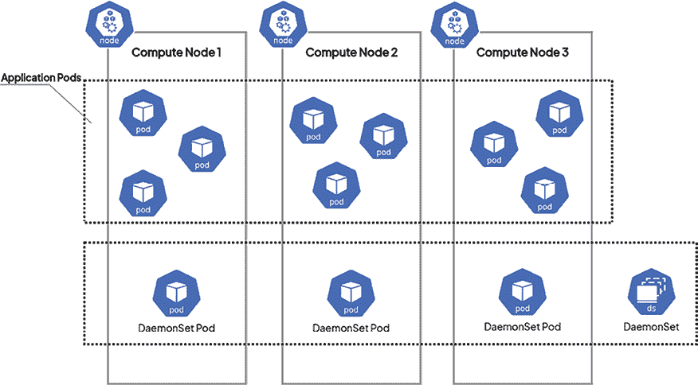

# 第十三章：DaemonSet – 在节点上维护 Pod 单例

前几章已经解释并演示了如何使用最常见的 Kubernetes 控制器来管理 Pods，如 ReplicaSet、Deployment 和 StatefulSet。通常，当运行包含实际*业务逻辑*的云应用组件时，你将需要使用 Deployments 或 StatefulSets 来控制你的 Pods。在某些情况下，当你需要将批处理工作负载作为应用程序的一部分运行时，你将使用 Jobs 和 CronJobs。

然而，在某些情况下，你需要运行具有支持功能的组件，例如执行维护任务或聚合日志和度量数据。更具体地说，如果你有需要在集群中的每个节点上执行的任务，可以使用**DaemonSet**来执行。DaemonSet 的目的是确保*每个*节点（除非另有指定）运行*单个*副本的 Pod。如果你向集群添加新节点，它将自动调度一个 Pod 副本。同样，如果你从集群中移除节点，Pod 副本将被终止——DaemonSet 会执行所有必需的操作。

在本章中，我们将涵盖以下主题：

+   介绍 DaemonSet 对象

+   创建和管理 DaemonSets

+   DaemonSet 的常见使用案例

+   DaemonSet 的替代方案

# 技术要求

本章中，你将需要以下内容：

+   已部署的 Kubernetes 集群。你可以使用本地或基于云的集群，但为了更好地理解这些概念，我们建议使用*多节点*Kubernetes 集群。

+   安装在本地机器上的 Kubernetes CLI（`kubectl`）并已配置用于管理你的 Kubernetes 集群。

Kubernetes 集群部署（本地和基于云的）以及`kubectl`安装已经在*第三章*，*安装你的第一个 Kubernetes 集群*中介绍过。

你可以从官方 GitHub 仓库下载本章的最新代码示例：[`github.com/PacktPublishing/The-Kubernetes-Bible-Second-Edition/tree/main/Chapter13`](https://github.com/PacktPublishing/The-Kubernetes-Bible-Second-Edition/tree/main/Chapter13)。

# 介绍 DaemonSet 对象

操作系统中的**守护进程**一词有着悠久的历史，简而言之，用于描述作为后台进程运行的程序，用户无法进行交互控制。在许多情况下，守护进程负责处理维护任务、提供网络请求或监控硬件活动。这些通常是你希望一直可靠地在后台运行的进程，从启动操作系统到关闭它的整个过程。

守护进程通常与类 Unix 操作系统相关联。在 Windows 中，你更常见到的术语是*Windows 服务*。

想象一下，你需要一个程序在办公室的每台计算机上运行，以确保一切井然有序。在 Kubernetes 中，DaemonSet 就是为此而设。它们就像是 Pod 的特殊管理者，确保每个节点（Node）上都有一个 Pod 的副本运行。此外，在像 gRPC 这样的应用场景中，这一点尤为重要，因为 gRPC 可能需要在节点的文件系统上创建一个专用的套接字，单节点一个 Pod 的管理方式会更加简便。

这些 Pod 处理集群的关键任务，如：

+   **监控**：监控每个节点的健康状况

+   **日志记录**：收集有关每个节点及其上运行的 Pod 的状态信息

+   **存储管理**：处理应用程序的存储空间请求

+   **网络管理**：集群组件，如 kube-proxy 和**容器网络接口**（**CNI**）（例如，Calico）用于连接性

随着集群的扩展（添加更多节点），DaemonSet 会自动为新的机器添加更多 Pod。相反，当节点被移除时，节点上的 Pod 会被自动清理。可以把它想象成一个自我调节的团队，始终确保每个节点都能得到所需的帮助。

以下图表显示了 DaemonSet 对象的高级细节。



图 13.1：Kubernetes 中的 DaemonSet

在简单的设置中，一个 DaemonSet 可以处理所有节点上某一特定任务（如监控）。更复杂的情况可能会使用多个 DaemonSet 来执行相同的任务，但根据节点类型的不同，配置或资源需求也会有所不同（例如，高性能机器与基础机器之间的差异）。

通过使用 DaemonSet，你可以确保你的 Kubernetes 集群在每个节点上都运行着必要的工具，保持系统顺畅、高效地运行。

你在前面章节中学到的关于 ReplicaSets、Deployments 和 StatefulSets 的知识在 DaemonSet 中基本适用。它的规范要求你提供 Pod 模板、Pod 标签选择器，此外，如果你希望仅在部分节点上调度 Pod，还可以选择提供节点选择器。

根据不同的情况，你可能不需要从其他 Pod 或外部网络与 DaemonSet 进行通信。例如，如果 DaemonSet 的任务只是定期清理节点上的文件系统，那么你可能不希望与这些 Pod 进行通信。如果你的应用场景需要与 DaemonSet Pod 进行任何入口或出口通信，那么你可以使用以下常见模式：

+   **将容器端口映射到主机端口**：由于 DaemonSet 的 Pod 在集群节点上保证是单一副本，因此可以使用映射的主机端口。客户端必须知道节点的 IP 地址。

+   **将数据推送到不同的服务**：在某些情况下，DaemonSet 仅负责向其他服务发送更新，而无需允许入口流量。

+   **无头服务匹配 DaemonSet Pod 标签选择器**：这与 StatefulSets 的情况类似，你可以使用集群 DNS，通过无头服务的 DNS 名称来检索多个 `A 记录`，以获取 Pod。

+   **正常服务匹配 DaemonSet Pod 标签选择器**：较少情况下，你可能需要访问 DaemonSet 中的 *任意* Pod。使用普通的 Service 对象，比如 `ClusterIP` 类型，将允许你与 DaemonSet 中的随机 Pod 进行通信。

正如我们所讨论的，DaemonSets 确保了关键服务的 Pods 会在所有或选定的节点上运行。接下来我们将探讨 DaemonSets 如何有效地进行调度。

## 如何调度 DaemonSet Pods

DaemonSets 保证每个符合条件的节点上都会运行一个 Pod。DaemonSet 控制器根据节点亲和性规则创建 Pods，目标是特定节点。这确保了 DaemonSet 的 Pods 只会调度到满足条件的节点上，这对于在复杂应用程序设置中定位特定类型的节点非常有用。默认的调度器随后将 Pod 绑定到目标节点，如果资源不足，可能会抢占现有 Pods。虽然可以指定自定义调度器，但最终是 DaemonSet 控制器确保 Pod 的位置与所需的节点亲和性一致。

在接下来的部分，我们将学习如何检查 Kubernetes 集群中的 DaemonSet 资源。

## 检查 DaemonSets

一旦部署了 Kubernetes 集群，你可能已经在集群支持组件（如 DNS 服务或 CNI）中使用了一些作为 DaemonSets 部署的组件。

```
minikube Kubernetes cluster:
```

```
$ minikube start \
  --driver=virtualbox \
  --nodes 3 \
  --cni calico \
  --cpus=2 \
  --memory=2g \
  --kubernetes-version=v1.31.0 \
  --container-runtime=containerd 
```

集群创建完成后，验证集群中的节点如下：

```
$ kubectl get nodes
NAME           STATUS   ROLES           AGE     VERSION
minikube       Ready    control-plane   3m28s   v1.31.0
minikube-m02   Ready    <none>          2m29s   v1.31.0
minikube-m03   Ready    <none>          91s     v1.31.0 
```

现在，让我们检查新安装的系统中是否有可用的 DaemonSet：

```
$ kubectl get daemonsets -A
NAMESPACE     NAME          DESIRED   CURRENT   READY   UP-TO-DATE   AVAILABLE   NODE SELECTOR            AGE
kube-system   calico-node   3         3         3       3            3           kubernetes.io/os=linux   63m
kube-system   kube-proxy    3         3         3       3            3           kubernetes.io/os=linux   63m 
-A or --all namespaces lists the requested objects across all namespaces.
```

如果你按照相同的方法创建 `minikube` 集群，你会看到类似的输出，包含 `calico-node` 和 `kube-proxy`，它们作为 DaemonSets 部署。（你也可以在其他 Kubernetes 集群中安装 Calico，并按照这里的剩余步骤进行操作。）你可能已经注意到，我们之前已经在 `minikube` 集群中启用了 Calico 作为 CNI 插件。当 Calico 用于 Kubernetes 网络时，通常会作为 DaemonSet 部署。

暂时忽略 `kube-proxy` DaemonSet，因为 `minikube` 将 kube-proxy 作为 DaemonSet 运行。这保证了负责管理集群内网络流量的 `kube-proxy` 在你的 `minikube` 环境中的每台机器上始终运行。

现在，让我们检查由 `calico-node` DaemonSet 部署的 Pods。

```
$ kubectl get po -n kube-system -o wide|grep calico
calico-kube-controllers-ddf655445-jx26x   1/1     Running   0          82m   10.244.120.65    minikube       <none>           <none>
calico-node-fkjxb                         1/1     Running   0          82m   192.168.59.126   minikube       <none>           <none>
calico-node-nrzpb                         1/1     Running   0          81m   192.168.59.128   minikube-m03   <none>           <none>
calico-node-sg66x                         1/1     Running   0          82m   192.168.59.127   minikube-m02   <none>           <none> 
```

从这个输出中，我们可以看到：

+   Calico Pods 被部署在所有 `minikube` 节点上。这些 Pods 分布在不同的节点上，对应你的 `minikube` 虚拟机（`minikube`、`minikube-m02` 和 `minikube-m03`）。这表明 Calico 正在使用 DaemonSet 确保每个节点上都有一个 Pod 运行。

+   Pod `calico-kube-controllers-ddf655445-jx26x` 是 Calico CNI 的控制器。

由于 Calico DaemonSet 是由 `minikube` 安装的，因此我们不会深入探讨这一方面。但在下一部分，我们将学习如何从头开始部署 DaemonSet 并详细探索它。

# 创建和管理 DaemonSets

为了演示 DaemonSet 如何工作，我们将使用 **Fluentd** Pods。Fluentd 是一个流行的开源日志聚合器，用于将来自各种来源的日志数据集中化。它高效地收集、过滤和转换日志消息，然后将它们转发到不同的目的地进行分析和存储。

为了访问 DaemonSet 端点，我们将使用一个 *无头* 服务，类似于我们在 *第十二章* 中为 StatefulSet 所做的。DaemonSets 的大多数实际使用案例相对复杂，涉及将各种系统资源挂载到 Pods。为了展示基本原理，我们将使 DaemonSet 示例尽可能简单。

如果你想尝试另一个 DaemonSet 示例，我们提供了一个可以工作的 Prometheus `node-exporter` 示例，该示例作为 DaemonSet 部署，并通过一个无头服务进行访问：`node-exporter.yaml`。在本节中，唯一的区别是，你需要使用 `node-exporter` 作为服务名称，使用端口 `9100`，并在请求中添加 `/metrics` 路径，使用 `wget` 发送请求。这个 DaemonSet 会在端口 `9100` 的 `/metrics` 路径下以 *Prometheus 数据模型* 格式公开节点指标。

接下来，我们将通过所有创建 DaemonSet 所需的 YAML 清单并将其应用于集群。

## 创建 DaemonSet

作为最佳实践，让我们采用声明式方式来创建 DaemonSet 以进行动手操作。首先，让我们看一下名为 `Fluentd-daemonset.yaml` 的 DaemonSet YAML 清单文件。

YAML 的第一部分用于为日志创建一个独立的命名空间。

```
---
apiVersion: v1
kind: Namespace
metadata:
  name: logging 
```

之后，我们将展示 DaemonSet 声明的详细信息如下。

```
apiVersion: apps/v1
kind: DaemonSet
metadata:
  name: fluentd-elasticsearch
  namespace: kube-system
  labels:
    k8s-app: fluentd-logging
spec:
  selector:
    matchLabels:
      name: fluentd-elasticsearch
# (to be continued in the next paragraph) 
```

前面文件的第一部分包含 DaemonSet 的 `metadata` 和 Pod 标签 `selector`，与您在 Deployments 和 StatefulSets 中看到的非常相似。文件的第二部分展示了 DaemonSet 将使用的 Pod 模板：

```
# (continued)
  template:
    metadata:
      labels:
        name: fluentd-elasticsearch
    spec:
      containers:
        - name: fluentd-elasticsearch
          image: quay.io/fluentd_elasticsearch/fluentd:v4.7
          resources:
            limits:
              memory: 200Mi
            requests:
              cpu: 100m
              memory: 200Mi
          volumeMounts:
            - name: varlog
              mountPath: /var/log
      terminationGracePeriodSeconds: 30
      volumes:
        - name: varlog
          hostPath:
            path: /var/log 
```

正如你所看到的，DaemonSet 规格的结构与 Deployments 和 StatefulSets 的结构类似。大体思路是相同的；你需要配置 Pod 模板，并使用合适的标签选择器来匹配 Pod 标签。请注意，您在此处*不会*看到 `replicas` 字段，因为集群中运行的 Pods 数量将取决于集群中的节点数。DaemonSet 规格有两个主要组件：

+   `spec.selector`：一个标签选择器，用于定义如何识别 DaemonSet 所拥有的 Pods。这可以包括 *基于集合* 和 *基于相等性* 的选择器。

+   `spec.template`：这定义了 Pod 创建的模板。`metadata` 中使用的标签必须与 `selector` 匹配。

也很常见通过指定`.spec.template.spec.nodeSelector`或`.spec.template.spec.tolerations`来控制 DaemonSet Pods 部署到哪些节点。我们将在*第十九章*，*调度 Pod 的高级技术*中详细讲解 Pod 调度。此外，你还可以指定`.spec.updateStrategy`，`.spec.revisionHistoryLimit`和`.spec.minReadySeconds`，这些与 Deployment 对象的配置类似。

如果你运行混合的 Linux-Windows Kubernetes 集群，Node 选择器或 Node 亲和性在 DaemonSets 中的一个常见用例是确保 Pod 仅调度到 Linux 节点或仅调度到 Windows 节点。这样做是有意义的，因为容器运行时和操作系统在这些节点之间非常不同。

另外，请注意卷挂载行，Fluentd Pods 将访问宿主机（Pod 所在的主机）上的`/var/log`目录，以便 Fluentd 可以处理数据并将其发送到日志聚合器。

请注意，在实际部署中，我们需要向 Fluentd Pods 提供目标 Elasticsearch 服务器，以便 Fluentd 可以发送日志。在我们的演示中，我们没有覆盖 Elasticsearch 的设置，你现在可以忽略这一部分。

你可以通过环境变量将这些参数传递给容器，如下所示。（请参考`fluentd-daemonset.yaml`文件了解更多信息。）

```
 env:
            - name:  FLUENT_ELASTICSEARCH_HOST
              value: "elasticsearch-logging"
            - name:  FLUENT_ELASTICSEARCH_PORT
              value: "9200" 
```

我们有所有必要的 YAML 清单文件进行演示，现在可以继续将这些清单应用到集群中。请按照以下步骤操作：

1.  使用以下命令创建`fluentd-elasticsearch` DaemonSet：

    ```
    $ kubectl apply -f fluentd-daemonset.yaml
    namespace/logging created 
    daemonset.apps/fluentd-elasticsearch created 
    ```

1.  现在，你可以使用`kubectl describe`命令来观察 DaemonSet 的创建过程：

    ```
    $ kubectl describe daemonset fluentd-elasticsearch -n logging 
    ```

或者，你可以使用`ds`作为`daemonset`的缩写，在使用`kubectl`命令时。

1.  使用`kubectl get pods`命令并加上`-w`选项，你可以看到每个集群中的节点都会调度一个 Pod，如下所示：

    ```
    $ kubectl get po -n logging -o wide
    NAME                          READY   STATUS    RESTARTS   AGE     IP               NODE           NOMINATED NODE   READINESS GATES
    fluentd-elasticsearch-cs4hm   1/1     Running   0          3m48s   10.244.120.68    minikube       <none>           <none>
    fluentd-elasticsearch-stfqs   1/1     Running   0          3m48s   10.244.205.194   minikube-m02   <none>           <none>
    fluentd-elasticsearch-zk6pt   1/1     Running   0          3m48s   10.244.151.2     minikube-m03   <none>           <none> 
    ```

在我们的例子中，集群中有三个节点，因此正好创建了三个 Pod。

我们已经成功部署了 DaemonSet，现在可以验证它是否按预期工作。确保 Fluentd Pods 能够访问 Kubernetes 节点的日志文件。为此，登录到一个 Fluentd Pod 并检查`/var/log`目录。

```
$ kubectl exec -n logging -it fluentd-elasticsearch-cs4hm -- /bin/bash
root@fluentd-elasticsearch-cs4hm:/# ls -l /var/log/
total 20
drwxr-xr-x  3 root root 4096 May 29 10:56 calico
drwxr-xr-x  2 root root 4096 May 29 12:40 containers
drwx------  3 root root 4096 May 29 10:55 crio
drwxr-xr-x  2 root root 4096 May 29 11:53 journal
drwxr-x--- 12 root root 4096 May 29 12:40 pods
root@fluentd-elasticsearch-cs4hm:/# 
```

这展示了 DaemonSet Pods 在 Kubernetes 中调度的最重要原理。

最佳实践是为节点使用适当的**污点**和**容忍**，以实现 DaemonSets。我们将在*第十九章*，*调度 Pod 的高级技术*中学习污点和容忍。

让我们在下一节中了解一些 DaemonSet 的高级配置。

## 在 Kubernetes 中优先考虑关键的 DaemonSets

在 Kubernetes 中使用 DaemonSets 管理关键系统组件时，确保其连续运行至关重要。以下是如何利用 Pod 优先级和 PriorityClasses 来保证这些关键 Pods 不会被低优先级任务中断的方法。

Kubernetes 为每个 Pod 分配一个优先级，决定其在集群中的相对重要性。较高优先级的 Pods 被认为比低优先级的 Pods 更重要。

通过为 DaemonSet 分配更高的 `PriorityClass`，你可以提升其 Pods 的重要性。这样可以确保这些关键 Pods 在资源紧张时不会被调度器抢占，以腾出空间给低优先级的 Pods。

PriorityClass 定义了 Pods 的特定优先级。此类中的值可以从负整数到最大 10 亿。较高的值表示较高的优先级。

**PriorityClass** 的 YAML 示例定义如下。

```
# priorityclass.yaml
apiVersion: scheduling.k8s.io/v1
kind: PriorityClass
metadata:
  name: fluentd-priority
value: 100000  # A high value for criticality
globalDefault: false  # Not a default class for all Pods
description: "Fluentd Daemonset priority class" 
```

一旦创建了 PriorityClass，你可以在 DaemonSet 配置中按如下方式使用它。

```
spec:
  template:
    spec:
      priorityClassName: fluentd-priority 
```

作为参考，像 kube-proxy 和集群 CNI（如 Calico）这样的系统组件通常使用内置的 `system-node-critical` PriorityClass。此类拥有最高优先级，确保这些重要 Pods 在任何情况下都不会被驱逐。

现在，我们将展示如何修改 DaemonSet 以便为 Pods 推出新版本的容器镜像。

## 修改 DaemonSet

更新 DaemonSet 可以通过类似于 Deployments 的方式进行。如果修改了 DaemonSet 的 *Pod 模板*，这将触发 DaemonSet 新版本的 *滚动更新*，并根据其 `updateStrategy` 进行。提供了两种策略：

+   `RollingUpdate`：默认策略，允许以受控的方式推出你的守护进程的新版本。它类似于 Deployments 中的滚动更新，你可以定义 `.spec.updateStrategy.rollingUpdate.maxUnavailable` 来控制在滚动过程中集群中最多有多少 Pods 是不可用的（默认为 `1`），以及 `.spec.minReadySeconds`（默认为 `0`）。可以保证，在滚动过程中的每个节点上，DaemonSet 至多只有一个 Pod 处于运行状态。

+   `OnDelete`：此策略实现了 Kubernetes 1.6 之前 StatefulSet 更新的旧行为。在这种策略下，DaemonSet *不会*通过重新创建 Pods 来自动更新。你需要手动删除节点上的 Pod，才能应用新的 Pod 模板。此策略适用于在继续下一个节点之前，需要进行额外的手动操作或验证的场景。

新的 DaemonSet 版本的滚动更新可以通过与 Deployment 对象类似的方式进行控制。你可以使用 `kubectl rollout status` 命令并通过 `kubectl rollout undo` 命令执行 *强制* 回滚。以下是如何 *声明性* 地将 DaemonSet Pod 中的容器镜像更新到新版本的演示：

1.  修改 `fluentd-daemonset.yaml` YAML 清单文件，使其在模板中使用 `quay.io/fluentd_elasticsearch/fluentd:v4.7.5` 容器镜像：

    ```
    ...
          containers:
            - name: fluentd-elasticsearch
              **image: quay.io/fluentd_elasticsearch/fluentd:v4.7.5**
    ... 
    ```

1.  将清单文件应用到集群中：

    ```
    $ kubectl apply -f fluentd-daemonset.yaml
    namespace/logging unchanged
    daemonset.apps/fluentd-elasticsearch configured 
    ```

1.  紧接着，使用 `kubectl rollout status` 命令实时查看进度：

    ```
    $ kubectl rollout status ds -n logging
    Waiting for daemon set "fluentd-elasticsearch" rollout to finish: 2 out of 3 new pods have been updated...
    Waiting for daemon set "fluentd-elasticsearch" rollout to finish: 2 out of 3 new pods have been updated...
    Waiting for daemon set "fluentd-elasticsearch" rollout to finish: 2 of 3 updated pods are available...
    daemon set "fluentd-elasticsearch" successfully rolled out 
    ```

1.  同样，使用 `kubectl describe` 命令，你可以查看 DaemonSet 的事件，准确显示 Pod 重建的顺序：

    ```
    $ kubectl describe ds -n logging
    Name:           fluentd-elasticsearch
    Selector:       name=fluentd-elasticsearch
    ...<removed for brevity>...
    Events:
      Type    Reason            Age    From                  Message
      ----    ------            ----   ----                  -------
    ...<removed for brevity>...
    -elasticsearch-24v2z
      Normal  SuccessfulDelete  5m52s  daemonset-controller  Deleted pod: fluentd-elasticsearch-zk6pt
      Normal  SuccessfulCreate  5m51s  daemonset-controller  Created pod: fluentd-elasticsearch-fxffp 
    ```

你可以看到 Pod 被一个个替换。

你可以通过 `kubectl set image ds fluentd-elasticsearch fluentd-elasticsearch=quay.io/fluentd_elasticsearch/fluentd:v4.7.5 -n logging` 命令*强制*更改 DaemonSet 容器镜像。此方法仅推荐用于非生产环境。

此外，如果新节点加入集群，DaemonSet 会自动创建 Pod（前提是节点符合选择器和亲和性参数）。如果一个节点从集群中移除，相应的 Pod 也会被终止。如果你修改节点上的标签或污点使其符合 DaemonSet 的条件，那么会为该节点创建一个新的 Pod。如果你修改节点的标签或污点，使其不再符合 DaemonSet 的条件，现有的 Pod 将被终止。

接下来，我们将学习如何回滚 DaemonSet 更新。

## 回滚 DaemonSet

正如我们在前面的章节中所学，你也可以通过以下 `kubectl rollback` 命令回滚 DaemonSet。

```
$ kubectl rollout undo daemonset fluentd-elasticsearch -n logging 
```

然而，强烈建议在生产环境中通过更新 YAML 并以声明式方式应用配置。

接下来，我们将展示如何删除 DaemonSet。

## 删除 DaemonSet

要删除 DaemonSet 对象，有两种可能性：

+   删除 DaemonSet 及其所拥有的 Pod。

+   删除 DaemonSet 并保持 Pod 不受影响。

要删除 DaemonSet 及其 Pod，可以使用常规的 `kubectl delete` 命令，如下所示：

```
$ kubectl delete ds fluentd-elasticsearch -n logging 
```

你会看到 Pod 首先会被终止，然后 DaemonSet 会被删除。

现在，如果你只想删除 DaemonSet，可以在 `kubectl delete` 命令中使用 `--cascade=orphan` 选项：

```
$ kubectl delete ds fluentd-elasticsearch -n logging --cascade=orphan 
```

执行此命令后，如果你检查集群中的 Pod，你仍然会看到所有由 `fluentd-elasticsearch` DaemonSet 所管理的 Pod。

如果你正在使用 `kubectl drain` 命令进行节点排空，并且该节点正在运行由 DaemonSet 管理的 Pod，你需要传递 `--ignore-daemonsets` 标志，以完全排空该节点。

现在让我们来看看 Kubernetes 中 DaemonSet 的最常见使用场景。

# DaemonSet 的常见使用场景

到此时，你可能会想，DaemonSet 实际上是做什么的，现实中的使用场景有哪些。一般来说，DaemonSets 要么用于集群的基础功能，没有这些功能集群无法使用，要么用于执行维护或数据收集的辅助工作负载。我们在以下几点中总结了 DaemonSets 的常见和有趣的使用场景：

+   根据你的集群部署方式，`kube-proxy` 核心服务可能会作为 DaemonSet 而不是常规操作系统服务进行部署。例如，在 **Azure Kubernetes Service**（**AKS**）的情况下，你可以使用 `kubectl describe ds -n kube-system kube-proxy` 命令查看该 DaemonSet 的定义。这是一个典型的示例，展示了需要在集群中每个节点上以单例方式运行的骨干服务。你还可以在这里看到 `kube-proxy` 的示例 YAML 清单：[`github.com/kubernetes/kubernetes/blob/master/cluster/addons/kube-proxy/kube-proxy-ds.yaml`](https://github.com/kubernetes/kubernetes/blob/master/cluster/addons/kube-proxy/kube-proxy-ds.yaml)。

+   另一个作为 DaemonSets 运行的基础服务示例是运行 **CNI** 插件和代理程序，用于维护 Kubernetes 集群中的网络。我们已经在本章开始时通过 `minikube` 集群测试过 Calico CNI DaemonSet。另一个很好的 DaemonSet 示例是 Flannel 代理（[`github.com/flannel-io/flannel/blob/master/Documentation/kube-flannel.yml`](https://github.com/flannel-io/flannel/blob/master/Documentation/kube-flannel.yml)），它在每个节点上运行，负责从更大的、预配置的地址空间中为每个主机分配一个子网租约。当然，这取决于集群中安装的网络类型。

+   集群存储守护进程通常会作为 DaemonSets 部署。一个常见的守护进程示例是 **对象存储守护进程**（**OSD**），它是 **Ceph** 的一部分，Ceph 是一个分布式的对象、块和文件存储平台。OSD 负责在每个节点的本地文件系统上存储对象，并通过网络提供访问。你可以在这里找到一个示例清单文件（作为 Helm 图表模板的一部分）：[`github.com/ceph/ceph-container/blob/master/examples/helm/ceph/templates/osd/daemonset.yaml`](https://github.com/ceph/ceph-container/blob/master/examples/helm/ceph/templates/osd/daemonset.yaml)。

+   Kubernetes 中的 Ingress 控制器有时作为 DaemonSet 部署。我们将在 *第二十一章*，*高级 Kubernetes：流量管理、多集群策略及更多* 中更详细地探讨 Ingress。例如，当你在集群中部署 `nginx` 作为 Ingress 控制器时，你可以选择将其作为 DaemonSet 部署：[`github.com/nginxinc/kubernetes-ingress/blob/master/deployments/daemon-set/nginx-ingress.yaml`](https://github.com/nginxinc/kubernetes-ingress/blob/master/deployments/daemon-set/nginx-ingress.yaml)。如果你在裸机服务器上进行 Kubernetes 集群部署，将 Ingress 控制器作为 DaemonSet 部署尤其常见。

+   日志收集和聚合代理通常作为 DaemonSet 部署。例如，`fluentd` 可以作为 DaemonSet 在集群中部署。你可以在官方仓库中找到多个包含示例的 YAML 清单文件：[`github.com/fluent/fluentd-kubernetes-daemonset`](https://github.com/fluent/fluentd-kubernetes-daemonset)。

+   用于收集节点指标的代理非常适合作为 DaemonSet 部署。一个著名的例子是 Prometheus 的 `node-exporter`：[`github.com/prometheus-operator/kube-prometheus/blob/main/manifests/nodeExporter-daemonset.yaml`](https://github.com/prometheus-operator/kube-prometheus/blob/main/manifests/nodeExporter-daemonset.yaml)。

这只是其中一部分——正如你所看到的，DaemonSet 是为设计在 Kubernetes 集群上运行的工作负载的工程师提供的另一个构建模块。在许多情况下，DaemonSet 是集群的隐性支柱，使其能够完全运行。

现在，让我们学习一下 DaemonSet 实现的推荐最佳实践。

## DaemonSet 最佳实践

DaemonSet 是 Kubernetes 中强大的工具，用于管理需要在每个节点上运行的 Pods。但为了确保它们按预期工作，有一些关键点需要记住：

+   **资源请求与限制**：简要提到为 DaemonSet Pods 设置适当的资源请求与限制的重要性，有助于用户有效地管理资源分配。这可以帮助避免集群中其他 Pods 资源的饥饿问题。

+   **清晰且分离**：通过将每个 DaemonSet 放在其自己的命名空间中来组织它们。这可以保持整洁，并简化资源管理。

+   **调度智能**：创建 DaemonSet 时，建议使用 `preferredDuringSchedulingIgnoredDuringExecution` 而不是 `requiredDuringSchedulingIgnoredDuringExecution`。第一个选项在初始时如果没有足够的节点可用时，提供更多的灵活性。

+   **等待就绪**（可选）：你可以在 Pod 模式中使用 `minReadySeconds` 设置。这告诉 Kubernetes 在更新期间创建新 Pod 之前，等待一段时间。这有助于确保所有现有 Pods 都处于健康状态，然后再添加新 Pods。

+   **监控与日志**：简要提一下监控与日志对于 DaemonSet Pods 的重要性是有帮助的。这允许用户跟踪 DaemonSets 的健康状态和性能，并识别潜在问题。

+   **始终运行**：确保你的 DaemonSet Pods 的 **重启策略** 设置为 `Always`（或保持未指定）。这保证了 Pods 在崩溃时会自动重启。

+   **高优先级**：为你的 DaemonSet Pods 设置高优先级（例如 `10000`），以确保它们获得所需的资源，并且不会被其他 Pods 驱逐。

+   **匹配标签**：定义一个 Pod 选择器，匹配你的 DaemonSet 模板的标签。这样可以确保 DaemonSet 部署的 Pods 是你所期望的。

通过遵循这些最佳实践，你可以配置你的 DaemonSets 使其平稳运行，并保持 Kubernetes 集群的最佳性能。

接下来，让我们讨论一下使用 DaemonSets 的可能替代方案。

# DaemonSets 的替代方案

使用 DaemonSets 的原因非常简单——你希望在集群中的每个节点上都有一个具有特定功能的 Pod。然而，有时你应该考虑其他可能更适合你需求的方法：

+   在日志收集场景中，你需要评估是否希望基于 DaemonSets 或 *sidecar* 容器模式来设计你的日志管道架构。两者各有优缺点，但通常来说，运行 sidecar 容器可能更容易实现，且更具稳健性，尽管可能需要更多的系统资源。

+   如果你只是想运行定期任务，并且不需要在集群中的每个节点上都执行，使用 **Kubernetes CronJobs** 可能是更好的解决方案。再次强调，了解实际的用例是什么，以及是否必须在每个节点上运行独立的 Pod 是非常重要的。

+   操作系统守护进程（例如，Ubuntu 中由 `systemd` 提供的守护进程）可以用来执行与 DaemonSets 类似的任务。该方法的缺点是，你不能像管理 Kubernetes 集群一样使用相同的工具（例如 `kubectl`）来管理这些本地守护进程。但同时，你不依赖于任何 Kubernetes 服务，在某些情况下这可能是个好处。

+   静态 Pods ([`kubernetes.io/docs/tasks/configure-pod-container/static-pod/`](https://kubernetes.io/docs/tasks/configure-pod-container/static-pod/)) 可以用来实现类似的结果。这种类型的 Pod 是基于 `kubelet` 监视的特定目录中的静态清单文件创建的。静态 Pods 无法通过 `kubectl` 管理，最常用于集群引导功能。

最后，我们现在可以总结我们关于 DaemonSets 的知识。

# 摘要

在本章中，你已经学习了如何在 Kubernetes 中使用 DaemonSets，以及它们是如何用于管理必须作为单例在每个节点上运行的特殊类型的工作负载或进程。你首先创建了一个示例 DaemonSet，并了解了其规范中最重要的部分。接下来，你练习了如何向集群推出 DaemonSet 的新版本，并观察了如何监控该部署。此外，我们还讨论了这种特殊类型的 Kubernetes 对象的最常见使用案例以及你可以考虑的替代方案。

这是我们在本书这一部分讨论的最后一种 Pod 管理控制器。在本书的下一部分，我们将探讨一些更高级的 Kubernetes 使用方法，从 Helm Charts 开始，然后是 Kubernetes Operators。

# 深入阅读

+   DaemonSet: [`kubernetes.io/docs/concepts/workloads/controllers/daemonset/`](https://kubernetes.io/docs/concepts/workloads/controllers/daemonset/)

)

+   网络策略: [`minikube.sigs.k8s.io/docs/handbook/network_policy/`](https://minikube.sigs.k8s.io/docs/handbook/network_policy/)

)

+   Fluentd 在 Kubernetes 上的部署: [`docs.fluentd.org/container-deployment/kubernetes`](https://docs.fluentd.org/container-deployment/kubernetes)

)

+   对 DaemonSet 进行滚动更新: https://kubernetes.io/docs/tasks/manage-daemon/update-daemon-set/

# 加入我们的社区 Discord

加入我们社区的 Discord 空间，与作者和其他读者进行讨论：

[`packt.link/cloudanddevops`](https://packt.link/cloudanddevops)


