# 14

# 使用 Helm Charts 和 Operators

在 Kubernetes 生态系统中，当你希望让应用程序便于客户下载和安装，或者希望在团队之间共享时，管理应用程序的重新分配和依赖关系管理非常重要。与像 APT 或 YUM 这样的 Linux 包管理器不同，Kubernetes 工具（如 Helm）有一个显著的区别，那就是它们是通用的，并且不依赖于特定的 Kubernetes 发行版。Helm 通过将多个资源打包成 charts，使应用程序的分发创建变得简单，支持在不同环境中轻松地重用和定制应用程序。这减轻了在应用程序部署中管理大量 YAML 清单的难题，从而减轻了开发者或运维人员的负担。

Kubernetes Operators 通过增加自动化管理应用生命周期的能力（如升级、故障转移和备份），并维护一致的配置，从而进一步补充 Helm。Helm 和 Operators 共同帮助解决在 Kubernetes 中扩展和管理应用程序的一些挑战。本章将深入探讨这些工具：Helm chart 开发，如何安装流行组件，以及 Kubernetes 应用程序的成功重分发。

本章将涵盖以下主题：

+   了解 Helm

+   使用 Helm 向 Kubernetes 发布软件

+   使用 Helm Charts 安装 Kubernetes Dashboard

+   介绍 Kubernetes Operators

+   使用 Prometheus 和 Grafana 启用 Kubernetes 监控

# 技术要求

本章所需内容：

+   部署的 Kubernetes 集群。如果可能的话，建议使用*多节点的或*基于云的 Kubernetes 集群。你需要确保为 Kubernetes 集群分配了 CPU、内存和存储资源，以确保可以调度多个 Pods（例如，你可以使用命令 `minikube start --kubernetes-version=1.31.0 --cpus=4 --memory=8g` 创建一个较大的 minikube 集群）。

+   本地机器上安装并配置的 Kubernetes **命令行接口**（**CLI**）（`kubectl`），用于管理你的 Kubernetes 集群。

基本的 Kubernetes 集群部署（本地和基于云的）和 `kubectl` 安装已经在*第三章*《安装你的第一个 Kubernetes 集群》中讲解。接下来的第*15*、*16* 和 *17* 章将为你提供如何在不同云平台上部署一个功能完善的 Kubernetes 集群的概览。你可以从官方 GitHub 仓库下载本章的最新代码示例：[`github.com/PacktPublishing/The-Kubernetes-Bible-Second-Edition/tree/main/Chapter14`](https://github.com/PacktPublishing/The-Kubernetes-Bible-Second-Edition/tree/main/Chapter14)

)

# 了解 Helm

这种方法通常作为展示如何将给定应用程序作为容器运行在 Kubernetes 上的基本示例。然而，直接共享原始 YAML 清单有很多缺点：

+   YAML 模板中的所有值都是*硬编码*的。这意味着，如果你想更改 Service 对象目标的副本数或存储在 ConfigMap 对象中的值，你需要通过清单文件，找到你想要配置的值，然后进行编辑。同样，如果你想将清单部署到与创建者原意不同的集群命名空间，你也需要编辑所有的 YAML 文件。此外，除非创建者有文档说明，否则你并不知道哪些 YAML 模板中的值是打算由创建者配置的。

+   部署过程因应用程序而异。没有标准化的方法来定义创建者提供哪些 YAML 清单，以及你需要手动部署哪些组件。

+   没有*依赖管理*。例如，如果你的应用程序需要在集群中以 StatefulSet 形式运行的 **MySQL** 服务器，你要么需要自己部署它，要么依赖应用程序的创建者提供 MySQL 服务器的 YAML 清单。

如果你不使用 **Application Store** 或类似 **Chocolatey**、**APT**、**YUM**、**DNF** 等包管理器，其他应用程序也有类似的情况。有些下载的应用程序会提供作为 `setup.sh` 脚本文件的安装程序，有些提供 `.exe` 文件，有些是 `.msi` 文件，还有的只是 `.zip` 文件，需要你自行解压并配置。

在 Kubernetes 中，你可以使用**Helm**（[`helm.sh`](https://helm.sh)），它是最流行的 Kubernetes 应用程序和服务包管理器之一。如果你熟悉流行的包管理器，如 APT、yum、npm 或 Chocolatey，你会发现 Helm 中的许多概念非常相似且易于理解。以下是 Helm 中三个最重要的概念：

+   **图表**是 Helm *包*。当你使用 Helm **CLI** 时，安装的就是这个图表。一个 Helm 图表包含了所有需要部署特定应用程序到集群上的 Kubernetes YAML 清单。请注意，这些 YAML 清单可能是*参数化*的，因此你可以轻松地注入由安装图表的用户提供的配置值。

+   **仓库**是 Helm 图表的存储位置，用于收集和共享图表。它们可以是公开的或私有的 – 有多个公共仓库可以浏览，你可以在 Artifact Hub 上找到它们（[`artifacthub.io`](https://artifacthub.io)）。私有仓库通常用于在同一个产品的不同团队之间分发 Kubernetes 上运行的组件。

+   **发布** 是已安装并在 Kubernetes 集群中运行的 Helm chart 的*实例*。这是您通过 Helm CLI 管理的内容，例如通过升级或卸载它。您可以在同一集群上多次安装同一个 chart，并拥有多个通过发布名称唯一标识的发布。

简而言之，Helm charts 包含可以参数化的 YAML 清单，您将其存储在 Helm 仓库中以供分发。当您安装 Helm chart 时，在您的集群中会创建一个 Helm 发布，您可以进一步管理它。

让我们快速总结一些 Helm 的常见使用场景：

+   将流行的软件部署到您的 Kubernetes 集群。这使得在 Kubernetes 上进行*开发*变得更加容易——您可以在几秒钟内将第三方组件部署到集群中。相同的方法也可以用于*生产*集群。您无需依赖为这些第三方组件编写自己的 YAML 清单。

+   Helm charts 提供*依赖管理*功能。如果 chart A 需要先安装 chart B，并带有特定参数，Helm 支持这种语法。

+   共享您自己的应用程序作为 Helm charts。这可以包括将产品打包供最终用户使用，或将 Helm 作为您产品中微服务的内部包和依赖管理器。

+   确保应用程序获得适当的升级。Helm 有自己的一套升级 Helm 发布的流程。

+   为您的需求配置软件部署。Helm charts 基本上是 Kubernetes 对象清单的通用 YAML 模板，可以进行*参数化*。Helm 使用 **Go** 模板（[`godoc.org/text/template`](https://godoc.org/text/template)）进行参数化。

目前，Helm 以二进制客户端（库）的形式分发，具有类似于 `kubectl` 的 CLI。您使用 Helm 执行的所有操作都不需要在 Kubernetes 集群上安装任何额外组件。

请注意，Helm 的架构在 Helm 3.0.0 版本发布时发生了变化。以前，Helm 的架构是不同的，需要在 Kubernetes 上运行一个名为 Tiller 的特殊专用服务。这造成了各种问题，例如与 **基于角色的访问控制** (**RBAC**) 和在集群内运行的具有提升权限的 Pods 相关的安全问题。您可以在官方 FAQ 中阅读更多关于最新主要版本 Helm 与之前版本之间的区别：

https://helm.sh/docs/faq/#changes-since-helm-2

这对于您找到的任何仍然提到 Tiller 的在线指南非常有用——它们很可能是为 Helm 的旧版本编写的。

现在我们已经了解了 Helm 及其重要概念，我们将安装 Helm 并从 Artifact Hub 部署一个简单的 Helm chart，以验证它在您的集群中是否正常工作。

# 使用 Helm 向 Kubernetes 发布软件

在本节中，你将学习如何安装 Helm，并通过部署示例 Helm 图表来测试安装。Helm 以二进制发布的形式提供（[`github.com/helm/helm/releases`](https://github.com/helm/helm/releases)），支持多个平台。你可以使用这些版本，或者参考以下指南通过包管理器在你所选的操作系统上安装。

## 在 Linux 上安装 Helm

在 Fedora 上安装 Helm，你需要确保默认的 Fedora 仓库已配置并正常工作：

```
$ sudo dnf repolist | grep fedora
fedora                                         Fedora 39 – x86_64 
```

然后按如下方式安装 Helm：

```
$ sudo dnf install helm 
```

安装完成后，你可以验证已安装 Helm 包的版本：

```
$ helm version
version.BuildInfo{Version:"v3.11", GitCommit:"", GitTreeState:"", GoVersion:"go1.21rc3"} 
```

也可以使用脚本安装 Helm（https://helm.sh/docs/intro/install/#from-script），该脚本会自动检测平台、下载最新的 Helm，并将其安装到你的机器上。

安装完成后，你可以继续进行本节中的 *部署示例图表 – WordPress*。

## 在 Windows 上安装 Helm

在 Windows 上安装 Helm，最简单的方法是使用 Chocolatey 包管理器。如果你之前没有使用过 Chocolatey，可以在官方文档中找到更多详细信息和安装指南，网址是 [`chocolatey.org/install`](https://chocolatey.org/install)。

在 PowerShell 或命令行中执行以下命令来安装 Helm：

```
PS C:\Windows\system32> choco install kubernetes-helm
PS C:\Windows\system32> helm version
version.BuildInfo{Version:"v3.15.0-rc.2", GitCommit:"c4e37b39dbb341cb3f716220df9f9d306d123a58", GitTreeState:"clean", GoVersion:"go1.22.3"} 
```

安装完成后，你可以继续进行本节稍后的 *部署示例图表 – WordPress*。

## 在 macOS 上安装 Helm

在 macOS 上安装 Helm，你可以使用标准的 **Homebrew** 包管理器。使用以下命令来安装 Helm 配方：

```
$ brew install helm 
```

通过尝试从命令行获取 Helm 版本来验证安装是否成功：

```
 $ helm version
version.BuildInfo{Version:"v3.16.2", GitCommit:"13654a52f7c70a143b1dd51416d633e1071faffb", GitTreeState:"dirty", GoVersion:"go1.23.2"} 
```

安装完成后，我们可以部署一个示例图表来验证 Helm 是否在你的 Kubernetes 集群上正常工作。

## 从二进制发布版安装

也可以直接从二进制文件安装最新的 Helm 包。你需要从发布页面（[`github.com/helm/helm/releases`](https://github.com/helm/helm/releases)）找到最新或所需版本的二进制文件，并根据你的操作系统下载它。在以下示例中，我们将展示如何在 Fedora 工作站上从二进制文件安装最新版本的 Helm：

下载并安装 Helm：

```
$ wget https://get.helm.sh/helm-v3.15.1-linux-amd64.tar.gz
$ tar -zxvf helm-v3.15.1-linux-amd64.tar.gz
linux-amd64/
linux-amd64/README.md
linux-amd64/LICENSE
linux-amd64/helm
$ sudo mv linux-amd64/helm /usr/local/bin/helm
$ helm version
version.BuildInfo{Version:"v3.15.1", GitCommit:"e211f2aa62992bd72586b395de50979e31231829", GitTreeState:"clean", GoVersion:"go1.22.3"} 
```

现在，我们将在下一节中通过 *部署示例图表 – WordPress* 来测试 Helm 包。

## 部署示例图表 – WordPress

默认情况下，Helm 没有配置任何仓库。一个不再推荐的做法是添加 `stable` 仓库，以便浏览最受欢迎的 Helm 图表：

```
$ helm repo add stable https://charts.helm.sh/stable
"stable" has been added to your repositories 
```

为部署添加随机的 Helm 图表仓库可能会带来严重的安全风险。必须进行安全审计，确保在 Kubernetes 环境中仅部署受信任且安全的负载。

请注意，大多数图表现在正处于弃用过程中，因为它们被迁移到不同的 Helm 仓库，并由原始创建者维护。如果你尝试使用`helm search repo`命令搜索可用的 Helm 图表，你会看到这一点：

```
$ helm search repo stable|grep -i deprecated|head
stable/acs-engine-autoscaler            2.2.2           2.1.1                   DEPRECATED Scales worker nodes within agent pools
stable/aerospike                        0.3.5           v4.5.0.5                DEPRECATED A Helm chart for Aerospike in Kubern...
stable/airflow                          7.13.3          1.10.12                 DEPRECATED ...<removed for brevity>... 
```

相反，新的推荐方法是使用`helm search hub`命令，它允许你直接从 CLI 浏览 Artifact Hub：

```
$ helm search hub|head
URL                                                     CHART VERSION                                           APP VERSION                                             DESCRIPTION                                      
https://artifacthub.io/packages/helm/mya/12factor       24.1.2                                                                                                          Easily deploy any application that conforms to ...
https://artifacthub.io/packages/helm/gabibbo97/...      0.1.0                                                   fedora-32                                               389 Directory Server                             
...<removed for brevity>... 
```

现在，让我们尝试搜索一些最受欢迎的 Helm 图表，以测试我们的安装。我们希望在我们的 Kubernetes 集群上部署**WordPress**。我们选择 WordPress 作为示范，因为它是一个典型的三层应用程序，包含公共访问层（服务）、网页层（WordPress）和数据库层（MariaDB）。首先，让我们查看 Artifact Hub 上关于 WordPress 的可用图表：

```
$ helm search hub wordpress
URL                                                     CHART VERSION   APP VERSION            DESCRIPTION                                      
https://artifacthub.io/packages/helm/kube-wordp...      0.1.0           1.1                    this is my wordpress package                     
https://artifacthub.io/packages/helm/wordpress-...      1.0.2           1.0.0                  A Helm chart for deploying Wordpress+Mariadb st...
https://artifacthub.io/packages/helm/bitnami-ak...      15.2.13         6.1.0                  WordPress is the world's most popular blogging ...
...<removed for brevity>... 
```

同样，你也可以直接使用 Artifact Hub 的网页 UI 搜索 WordPress Helm 图表，如下所示：

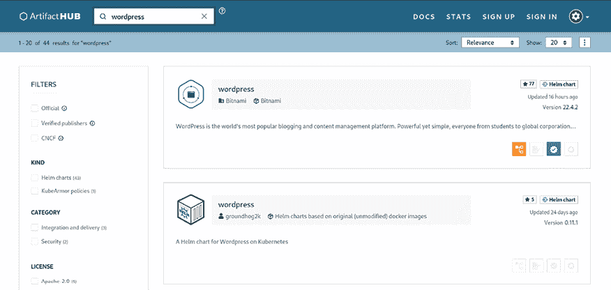

图 14.1：Artifact Hub 上 WordPress Helm 图表的搜索结果

我们将使用**Bitnami**提供并维护的 Helm 图表，Bitnami 是一家专门在各种平台（如 Kubernetes）上分发开源软件的公司。如果你导航到 Bitnami 提供的 WordPress 图表的搜索结果，你将看到以下内容：

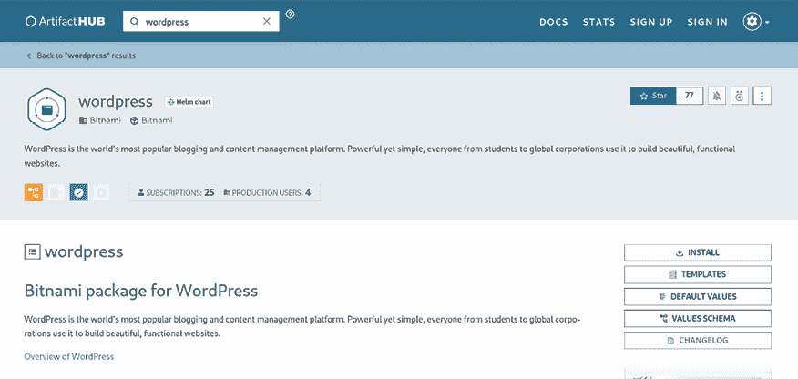

图 14.2：Artifact Hub 上 Bitnami WordPress Helm 图表的安装说明

该页面提供了详细的信息，介绍了如何添加`bitnami`仓库并安装 WordPress 的 Helm 图表。此外，你还会找到有关可用配置、已知限制和故障排除的详细信息。你还可以导航到每个图表的主页，以查看组成该图表的 YAML 模板（[`github.com/bitnami/charts/tree/master/bitnami/wordpress`](https://github.com/bitnami/charts/tree/master/bitnami/wordpress)）。

我们现在可以通过遵循网页上的说明进行安装。首先，将`bitnami`仓库添加到你的 Helm 安装中：

```
$ helm repo add bitnami https://charts.bitnami.com/bitnami
"bitnami" has been added to your repositories 
```

作为最佳实践，我们将在名为`wordpress`的专用命名空间内安装 WordPress：

```
$ kubectl create ns wordpress 
namespace/wordpress created 
```

在添加仓库后，我们可以安装`bitnami/wordpress` Helm 图表，但在此之前，我们需要为部署准备一些细节。请查看 Artifact Hub 上的图表页面（[`artifacthub.io/packages/helm/bitnami/wordpress`](https://artifacthub.io/packages/helm/bitnami/wordpress)）。你将看到很多参数供你配置和定制你的 WordPress 部署。如果你不提供任何参数，将使用默认值进行 Helm 发布部署。为了演示，让我们配置一些参数，而不是使用默认值。

你可以通过`--set`参数传递单独的参数，如下所示：

```
$ helm install wp-demo bitnami/wordpress -n wordpress --set wordpressUsername=wpadmin 
```

当您有多个参数需要配置时，您可以传递多个`--set`参数，但建议使用文件中的变量；您可以使用一个或多个文件传递变量。

让我们创建一个`wp-values.yaml`文件来存储变量和值如下：

```
# wp-values.yaml
wordpressUsername: wpadmin
wordpressPassword: wppassword
wordpressEmail: admin@example.com
wordpressFirstName: WP
wordpressLastName: Admin
service:
  type: NodePort
volumePermissions:
  enabled: true 
```

正如您所见，我们将一些 WordPress 配置传递给 Helm 图表。请注意，由于我们在使用 minikube 集群，我们正在将默认的 WordPress 类型更改为`NodePort`。如果您使用不同的 Kubernetes 集群（例如基于云的 Kubernetes），那么您可以将其保留为默认值，即`LoadBalancer`。

现在我们已经配置了 Helm 仓库，创建了一个专用命名空间，并在变量文件中配置了参数，让我们使用 Helm 部署 WordPress；我们将为此发布使用名称`wp-demo`：

```
$ helm install wp-demo bitnami/wordpress -n wordpress --values wp-values.yaml
NAME: wp-demo
LAST DEPLOYED: Tue Jun  4 21:27:49 2024
NAMESPACE: wordpress
STATUS: deployed
REVISION: 1
TEST SUITE: None
NOTES:
CHART NAME: wordpress
CHART VERSION: 22.4.2
APP VERSION: 6.5.3
...<to be continued>... 
```

Helm 将显示基本的发布信息，如此处所示。过一会儿，您还将看到部署详细信息，包括服务名称，如何访问 WordPress 网站等：

```
...
** Please be patient while the chart is being deployed **
Your WordPress site can be accessed through the following DNS name from within your cluster:
    wp-demo-wordpress.wordpress.svc.cluster.local (port 80)
To access your WordPress site from outside the cluster follow the steps below:
Get the WordPress URL by running these commands:
   export NODE_PORT=$(kubectl get --namespace wordpress -o jsonpath="{.spec.ports[0].nodePort}" services wp-demo-wordpress)
   export NODE_IP=$(kubectl get nodes --namespace wordpress -o jsonpath="{.items[0].status.addresses[0].address}")
   echo "WordPress URL: http://$NODE_IP:$NODE_PORT/"
...<removed for brevity>... 
```

这就是 Helm 的美妙之处——您只需执行单个`helm install`命令，即可获得如何在*您的*集群上使用部署组件的详细指南。与此同时，WordPress 实例部署无需任何干预！

首先检查由 Helm 生成的 Kubernetes 对象的 YAML 清单是一种良好的做法。您可以通过带有额外标志的`helm install`命令来执行此操作：`helm install wp-demo bitnami/wordpress --dry-run --debug`。输出将包含 YAML 清单的联合输出，它们将不会应用于集群。

您还可以使用`--version`参数来指定 Helm 图表的特定版本，如下所示：

```
$ helm install my-wordpress bitnami/wordpress --version 22.4.2 
```

现在让我们按照 Helm 图表安装输出的说明进行操作：

1.  等待一会儿，因为数据库需要初始化并部署 Pods。检查 Pod 状态：

    ```
    $ kubectl get po -n wordpress
    NAME                                 READY   STATUS    RESTARTS        AGE
    wp-demo-mariadb-0                    1/1     Running   9 (5m57s ago)   31m
    wp-demo-wordpress-5d98c44785-9xd6h   1/1     Running   0               31m 
    ```

1.  注意数据库部署为 StatefulSet 如下：

    ```
    $ kubectl get statefulsets.apps -n wordpress
    NAME              READY   AGE
    wp-demo-mariadb   1/1     99s 
    ```

1.  等待`wp-demo` Service 对象（NodePort 类型）获取端口详细信息：

    ```
    $  kubectl get svc -n wordpress
    NAME                TYPE        CLUSTER-IP      EXTERNAL-IP   PORT(S)                      AGE
    wp-demo-mariadb     ClusterIP   10.100.118.79   <none>        3306/TCP                     2m39s
    wp-demo-wordpress   NodePort    10.100.149.20   <none>        80:30509/TCP,443:32447/TCP   2m39s 
    ```

在我们的情况下，端口将是`80:31979/TCP`。

1.  在这种情况下，由于我们正在使用 minikube，请找到 IP 地址和端口详细信息（如果您使用`LoadBalancer`类型，则可以直接访问 IP 地址查看 WordPress 站点）：

    ```
    $ minikube service --url wp-demo-wordpress -n wordpress
    http://192.168.59.150:30509
    http://192.168.59.150:32447 
    ```

1.  现在打开您的 Web 浏览器并导航到 WordPress URL，`http://192.168.59.150:30509`（另一个端口用于 HTTPS URL）：


图 14.3：部署在 Kubernetes 上的 WordPress 图表——主页

1.  现在，您可以登录 WordPress 仪表板，网址为`http://192.168.59.150:30509/wp-admin`。请注意，如果您错过了设置 WordPress 参数（包括密码），您需要查找 Helm 使用的默认值。例如，要检索 WordPress 登录密码，请按以下方式检查秘密。使用以下命令获取存储在专用`wp-demo-wordpress` Secret 对象中的凭据：

    ```
    $ kubectl get secret --namespace wordpress wp-demo-wordpress -o jsonpath="{.data.wordp
    ress-password}" | base64 --decode
    wppassword 
    ```

1.  使用凭据登录为 WordPress 管理员：

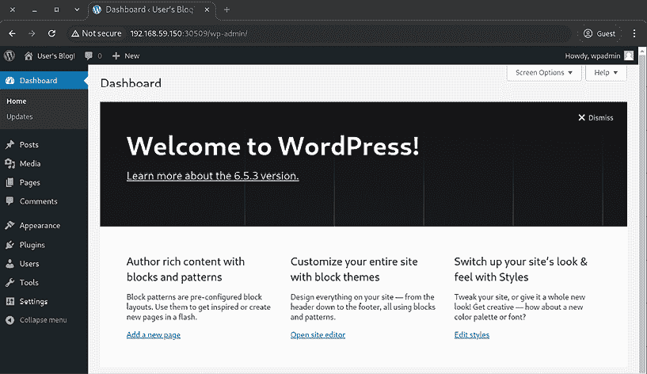

图 14.4：部署在 Kubernetes 上的 WordPress chart —— 管理员仪表盘

现在你可以尽情享受你的 WordPress 了，恭喜！如果你感兴趣，可以检查作为该 Helm chart 一部分部署的 Pods、Services、Deployments 和 StatefulSets。这将帮助你深入了解 chart 的组件以及它们是如何交互的。

Helm CLI 提供了对各种 shell 的*自动补全*功能。你可以运行 `helm completion` 命令以了解更多信息。

如果你想获取关于所有已部署的 Helm 发布的信息，可以使用以下命令：

```
$ helm list -n wordpress
NAME    NAMESPACE       REVISION        UPDATED                                 STATUS          CHART              APP VERSION
wp-demo wordpress       1               2024-06-04 22:20:32.556683096 +0800 +08 deployed        wordpress-22.4.2   6.5.3 
```

在接下来的章节中，我们将学习如何使用 Helm 删除一个已部署的发布。

## 删除 Helm 发布

正如我们在前面的章节中所学到的，Helm chart 已经部署了多个资源，包括 Deployment、PVC、Services、Secrets 等。逐一查找并删除这些项目并不实际。但 Helm 提供了一种简单的方法来使用 `helm uninstall` 命令删除部署。当你准备好时，可以通过以下命令卸载 Helm 发布，从而清理发布：

```
$ helm uninstall wp-demo -n wordpress
release "wp-demo" uninstalled 
```

这将删除该发布创建的所有 Kubernetes 对象。但请注意，Helm chart 创建的 PersistentVolumes 和 PersistentVolumeClaims 将不会被清理——你需要手动清理它们。接下来，我们将更详细地了解 Helm charts 的内部结构。

## Helm chart 结构

作为一个示例，我们将使用 Bitnami 提供的 WordPress Helm chart（[`github.com/bitnami/charts/tree/master/bitnami/wordpress`](https://github.com/bitnami/charts/tree/master/bitnami/wordpress)），我们刚刚用它在集群中执行了测试部署。Helm charts 只是具有特定结构（约定）的目录，这些目录可以存在于本地文件系统或 Git 仓库中。目录名称同时也是 chart 的名称——在本例中为 `wordpress`。chart 目录中文件的结构如下：

+   `Chart.yaml`：包含关于 chart 的元数据的 YAML 文件，如版本、关键词以及必须安装的依赖 charts 的引用。

+   `LICENSE`：可选的纯文本文件，包含许可证信息。

+   `README.md`：最终用户的 README 文件，将在 Artifact Hub 上可见。

+   `values.yaml`：chart 的默认配置值，这些值将作为 YAML 模板参数使用。用户可以通过 Helm 覆盖这些值，方法是在 CLI 中逐个传递，或使用单独的 YAML 文件传递值。你已经通过传递 **-**`-values wp-values.yaml` 参数使用了这种方法。

+   `values.schema.json`：可选地，你可以提供一个 `values.yaml` 必须遵循的 JSON 模式。

+   `charts/`：可选目录，包含附加的依赖 charts。

+   `crds/`：可选的 Kubernetes 自定义资源定义。

+   `templates/`：包含所有 YAML*模板*的最重要目录，用于生成 Kubernetes YAML 清单文件。这些 YAML 模板将与提供的*值*结合，最终生成的 YAML 清单文件将被应用到集群中。

+   `templates/NOTES.txt`：包含简短使用说明的可选文件。

例如，如果你检查 WordPress Helm 图表中的`Chart.yaml`，你会发现它依赖于 Bitnami 的**MariaDB**图表，前提是提供的值中`mariadb.enabled`被设置为`true`：

```
...
appVersion: 6.5.3
dependencies:
- condition: memcached.enabled
  name: memcached
  repository: oci://registry-1.docker.io/bitnamicharts
  version: 7.x.x
- condition: mariadb.enabled
  name: mariadb
  repository: oci://registry-1.docker.io/bitnamicharts
  version: 18.x.x
... 
```

现在，如果你查看`values.yaml`文件（它包含默认值并且内容较为冗长），你可以看到默认情况下启用了 MariaDB：

```
...
## MariaDB chart configuration
## ref: https://github.com/bitnami/charts/blob/main/bitnami/mariadb/values.yaml
##
mariadb:
  ## @param mariadb.enabled Deploy a MariaDB server to satisfy the applications database requirements
  ## To use an external database set this to false and configure the `externalDatabase.*` parameters
  ##
  enabled: true
... 
```

最后，让我们来看一下其中一个 YAML 模板的样子——打开`deployment.yaml`文件（[`github.com/bitnami/charts/blob/master/bitnami/wordpress/templates/deployment.yaml`](https://github.com/bitnami/charts/blob/master/bitnami/wordpress/templates/deployment.yaml)），这是一个 Kubernetes 部署对象的模板，用于包含 WordPress 容器的 Pod。例如，你可以看到`replicas`的数量是如何从提供的值中引用的：

```
kind: Deployment
...
spec:
...
  replicas: {{ .Values.replicaCount }}
... 
```

这将被`replicaCount`的值替换（`values.yaml`文件中的默认值为`1`）。关于如何使用 Go 模板的详细信息可以在[`pkg.go.dev/text/template`](https://pkg.go.dev/text/template)找到。你还可以通过分析现有的 Helm 图表来通过示例学习——大多数图表使用类似的模式来处理提供的值。

关于 Helm 图表结构的详细文档可以在 https://helm.sh/docs/topics/charts/找到。

在大多数情况下，你在安装图表时需要覆盖`values.yaml`文件中的某些默认值，正如我们之前所学到的。

现在，你已经了解了关于 Helm 图表结构的最重要细节，在接下来的章节中，我们将使用 Helm 图表部署 Kubernetes 仪表盘。

# 使用 Helm Charts 安装 Kubernetes 仪表盘

Kubernetes 仪表盘是官方的 Web UI，用于提供集群概览。这个组件的 Helm 图表由 Kubernetes 社区官方维护（[`artifacthub.io/packages/helm/k8s-dashboard/kubernetes-dashboard`](https://artifacthub.io/packages/helm/k8s-dashboard/kubernetes-dashboard)）。我们将以默认参数安装它，因为此时没有必要进行任何自定义。

对于 minikube 集群，你可以通过一个命令启用仪表盘并访问它：`minikube dashboard`。但我们此时的目的是学习如何为任何类型的 Kubernetes 集群部署仪表盘。

首先，将`kubernetes-dashboard`仓库添加到 Helm：

```
$ helm repo add kubernetes-dashboard https://kubernetes.github.io/dashboard/
"kubernetes-dashboard" has been added to your repositories 
```

现在，我们可以将 Helm 图表作为`kubernetes-dashboard`发布安装到集群中，方法如下：

```
$ helm upgrade --install kubernetes-dashboard kubernetes-dashboard/kubernetes-dashboard --create-namespace --namespace kubernetes-dashboard 
```

等待安装完成并查看输出信息。注意以下信息，因为我们稍后将用它来访问仪表盘 WEBUI：

```
...
Congratulations! You have just installed Kubernetes Dashboard in your cluster.
To access the Dashboard, run the following:
  kubectl -n kubernetes-dashboard port-forward svc/kubernetes-dashboard-kong-proxy 8443:443
... 
```

同时，确保 Pods 的状态为 `Running`：

```
$  kubectl get pod -n kubernetes-dashboard
NAME                                                    READY   STATUS    RESTARTS   AGE
kubernetes-dashboard-api-86c68c7896-7jxwz               1/1     Running   0          2m53s
kubernetes-dashboard-auth-59784dd8b-vsr99               1/1     Running   0          2m53s
kubernetes-dashboard-kong-7696bb8c88-6q7zs              1/1     Running   0          2m53s
kubernetes-dashboard-metrics-scraper-5485b64c47-9d69q   1/1     Running   0          2m53s
kubernetes-dashboard-web-84f8d6fff4-nxt5f               1/1     Running   0          2m53s 
```

目前您可以忽略 Helm 图表部署的其他 Pods。我们将在下一部分学习如何访问 Dashboard UI。

## 确保 Kubernetes Dashboard 的访问安全

默认情况下，Kubernetes Dashboard 优先考虑安全性，使用最小化的 RBAC 配置。这有助于保护您的集群数据。目前，登录 Dashboard 需要使用 Bearer Token。

本示例用户创建指南可能会授予管理员权限。请务必仅将其用于教育目的，并为生产环境实施适当的 RBAC 控制。

按照以下步骤创建一个令牌以访问 Kubernetes Dashboard WEBUI：

1.  创建一个 ServiceAccount；准备以下 YAML 文件：

    ```
    # dashboard-sa.yaml
    apiVersion: v1
    kind: ServiceAccount
    metadata:
      name: admin-user
      namespace: kubernetes-dashboard 
    ```

1.  按如下方式创建 ServiceAccount：

    ```
    $ kubectl apply -f dashboard-sa.yaml
    serviceaccount/admin-user created 
    ```

1.  创建 `ClusterRoleBinding` 以允许访问。准备以下 YAML 文件：

    ```
    # dashboard-rbac.yml
    apiVersion: rbac.authorization.k8s.io/v1
    kind: ClusterRoleBinding
    metadata:
      name: admin-user
    roleRef:
      apiGroup: rbac.authorization.k8s.io
      kind: ClusterRole
      name: cluster-admin
    subjects:
      - kind: ServiceAccount
        name: admin-user
        namespace: kubernetes-dashboard 
    ```

1.  通过应用 YAML 定义创建 `ClusterRoleBinding`：

    ```
    $ kubectl apply -f dashboard-rbac.yml
    clusterrolebinding.rbac.authorization.k8s.io/admin-user created 
    ```

1.  创建令牌：

    ```
    $ kubectl -n kubernetes-dashboard create token admin-user 
    ```

复制生成的长令牌字符串，我们将在下一部分使用它登录集群 Dashboard。

## 访问 Dashboard WEBUI

Kubernetes Dashboard 提供了多种访问方式。在这里，我们将重点介绍默认方法。此方法假设在安装过程中您没有更改标准配置。如果您进行过修改，步骤可能会有所不同。

执行以下命令（该命令是您从 `helm install` 输出中复制的），以获取 Dashboard 访问权限。该命令会保持在 `port-forward` 状态；请不要退出该命令：

```
$ kubectl -n kubernetes-dashboard port-forward svc/kubernetes-dashboard-kong-proxy 8443:443
Forwarding from 127.0.0.1:8443 -> 8443
Forwarding from [::1]:8443 -> 8443
... 
```

现在，在浏览器中访问 `https://localhost:8443/`。您可以忽略 SSL 证书警告，因为 Dashboard 正在使用自签名的 SSL 证书。输入在 *步骤* *3* 中生成的令牌，*确保访问 Kubernetes Dashboard 的安全性*，并按图示登录 Dashboard。

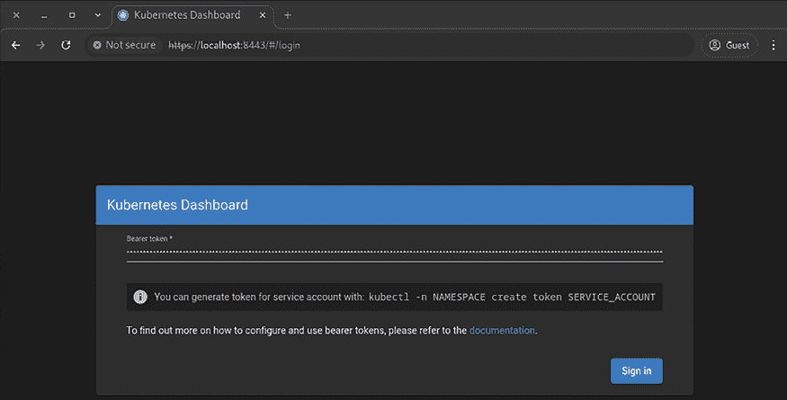

图 14.5：Kubernetes Dashboard 图表 – 登录页面

此时，您已能够访问 Dashboard，并且可以浏览其功能：

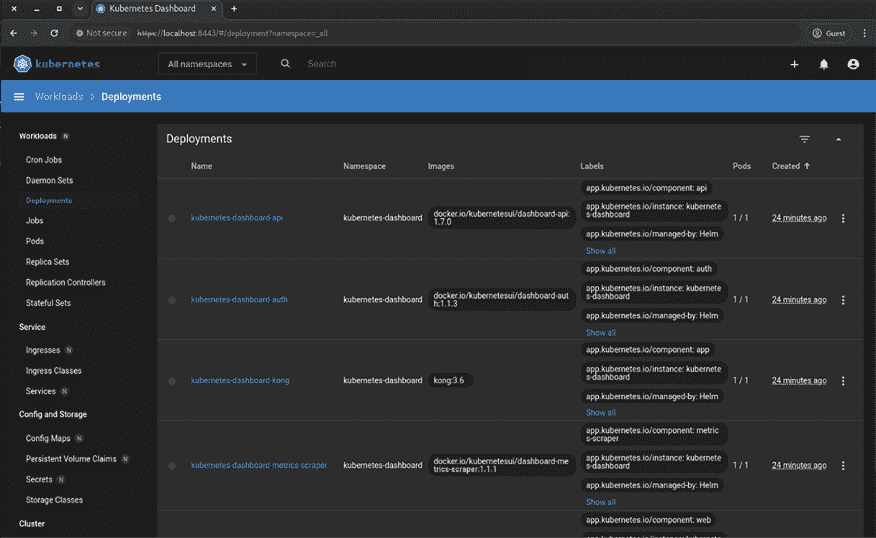

图 14.6：Kubernetes Dashboard 图表 – 部署页面

承载令牌是为具有 `cluster-admin` 角色的用户准备的，因此请小心使用，因为您可以执行任何操作，包括删除资源。

恭喜，您已经成功通过 Helm 图表部署了 Kubernetes Dashboard，并使用令牌验证了访问权限。您可以根据我们在下一部分的讲解，探索更多通过 Helm 图表的部署。

## 使用 Helm 图表安装其他流行的解决方案

若要更多地练习 Helm 图表，您可以快速安装 Kubernetes 集群的其他软件。这在您的开发场景中可能非常有用，或者作为云原生应用程序的构建模块。

### Elasticsearch 与 Kibana

Elasticsearch 是一个流行的全文搜索引擎，常用于日志索引和日志分析。Kibana 是 Elasticsearch 生态系统的一部分，是一个用于 Elasticsearch 数据库的可视化 UI。为了安装这个堆栈，我们需要使用两个图表，这两个图表都由 Elasticsearch 的创建者维护：

+   **Elasticsearch 图表** ([`artifacthub.io/packages/helm/elastic/elasticsearch`](https://artifacthub.io/packages/helm/elastic/elasticsearch))

+   **Kibana 图表** ([`artifacthub.io/packages/helm/elastic/kibana`](https://artifacthub.io/packages/helm/elastic/kibana))

### Prometheus 与 Grafana

Prometheus 是一个流行的监控系统，具有时间序列数据库，Grafana 用作可视化 UI。类似于 Elastic Stack，为了安装 Prometheus 和 Grafana 堆栈，我们需要使用两个图表：

+   **Prometheus** ([`artifacthub.io/packages/helm/prometheus-community/prometheus`](https://artifacthub.io/packages/helm/prometheus-community/prometheus))

+   **Grafana** ([`artifacthub.io/packages/helm/grafana/grafana`](https://artifacthub.io/packages/helm/grafana/grafana))

由于我们已经解释了如何在 Kubernetes 集群中部署 Helm 图表，因此我们将跳过这些步骤的详细说明。你可以继续部署这些图表并探索其功能。

在本节中，我们将探讨一些 Helm 图表的关键安全考虑因素。

## Helm 图表的安全考虑

Helm 图表简化了应用程序在 Kubernetes 中的部署，但它们也可能引入一些需要管理的安全漏洞。需要牢记的一些重要事项包括以下几点：

+   **源验证**：在部署 Helm 图表之前，始终检查图表的来源，绝不要安装来自不信任或名声较差的仓库的图表。可能会包含恶意或不安全的应用程序。验证图表的来源，并尽量使用官方图表或维护良好的社区仓库。

+   **定期审计**：定期对 Helm 图表及其依赖项进行安全审计。此过程有助于识别已知的漏洞，从而确保部署的应用程序足够安全，符合组织设定的标准。使用 Trivy 或 Anchore 等工具进行 Helm 图表的漏洞扫描。

+   **图表配置**：注意 Helm 图表中的默认配置。大多数图表附带的配置设置并不适合你的生产环境。根据组织的安全政策和最佳实践，考虑必要时审查和调整默认设置。

+   **基于角色的访问控制 (RBAC)**：实现这一功能，以限制在 Kubernetes 集群中部署和管理 Helm 图表的权限。这将减少未经授权的更改，并确保只有受信任的人才能部署敏感应用程序。

+   **依赖管理：** 监控和管理在 Helm charts 中显示的依赖项列表。定期更新这些依赖项，以避免应用程序中的安全漏洞，并确保它们接收到最新的安全补丁和改进。

+   **命名空间隔离：** 考虑使用 Helm charts，并将每个 chart 放在各自独立的命名空间中，这样可以提高安全性。如果发生问题，爆炸范围将被限制，从而为应用程序及其资源提供更好的隔离。

通过在这些领域采取主动措施，你可以大大提高 Kubernetes 部署的安全性，确保潜在的漏洞不会摧毁你的应用程序和数据。

现在，我们已经在本章的前半部分探讨并实践了 Helm charts。我们还了解到，Helm chart 是在 Kubernetes 中部署和管理复杂应用程序的一个极好的方式。

随着 Kubernetes 的普及，管理应用程序的生产环境的复杂性也在增加。虽然 Helm 和类似的工具改进了应用程序部署的过程，但它们不能独立解决有状态应用程序在运行时的操作需求，如扩展、配置管理和故障恢复。我们需要能够将应用程序知识和最佳实践打包的解决方案，以便在应用程序生命周期的每个阶段自动化操作任务，同时确保健康和高性能。通过这些解决方案，团队可以最小化人工干预，减少人为错误，并专注于通过应用程序交付价值，而不是管理基础设施。Kubernetes 操作员的引入正是为了满足这些需求。

在接下来的部分中，我们将了解 Kubernetes 操作员是什么，以及如何使用 Kubernetes 操作员安装复杂的部署。

# 引入 Kubernetes 操作员

我们已经探讨了 Deployment 和 StatefulSet 之间的差异，其中 StatefulSet 管理需要持久数据存储的有状态应用程序。我们还了解了 StatefulSet 正常运行所需的手动（和自动）操作，例如 Pod 副本之间的数据同步和初始化任务。

然而，人工干预违背了 Kubernetes 的核心原则，即自动化和自愈至关重要。这时，Kubernetes 操作员发挥作用。

## 从人到软件

想象一下，将人类操作员替换为软件操作员。Kubernetes 操作员本质上是软件扩展，它们自动化了复杂的应用程序管理任务，尤其是有状态应用程序。操作员不再依赖人工干预来维护应用程序栈，而是利用其内建的软件组件和智能来有效地执行和管理这些任务。

以下图像展示了 Kubernetes 集群中组件与操作员之间的高级关系。

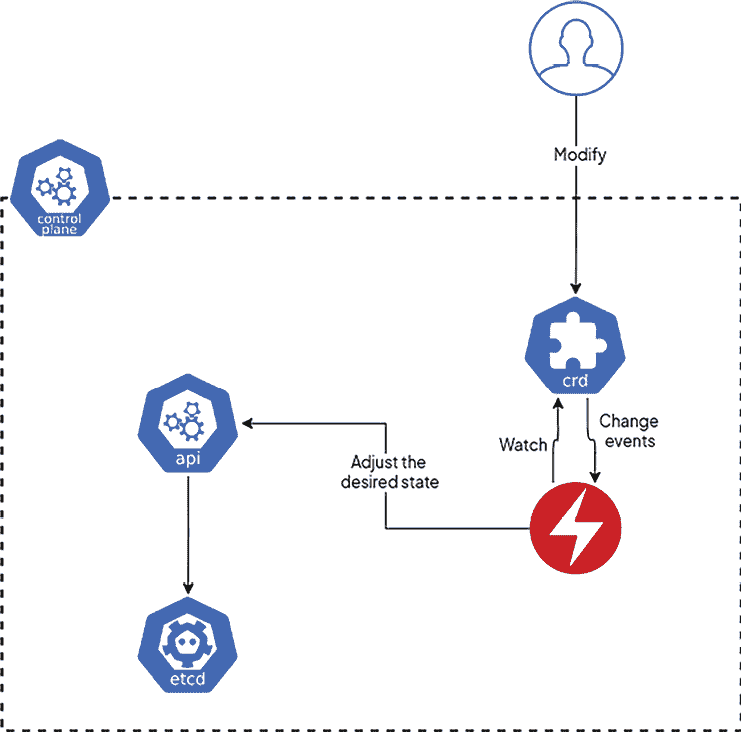

图 14.7：操作员如何在 Kubernetes 中管理资源

在接下来的章节中，我们将讨论 Kubernetes 操作员的优势和好处。

## Helm Charts 与 Kubernetes 操作员

虽然 Helm charts 是与 Kubernetes 上的应用程序管理相关的组件，它们与操作员不同。使用 Helm，用户可以比使用操作员更快地安装应用程序，因为 Helm 是一个有效的包管理器，使用预设计的 chart，使得这一过程更加简单。

它在需要速度的情况下最为适用，因此非常适合一次性安装或较小的应用程序。然而，Helm 仍然更多地关注部署阶段，而不是在应用程序运行时的持续操作需求。

操作员是旨在承担复杂和有状态应用程序整个生命周期管理责任的软件程序。通过**自定义资源定义**（**CRDs**），它们编码了应用程序如何运行的知识，并允许扩展、配置管理、自动化升级和自我修复机制。操作员不断观察应用程序的健康状况，并采取纠正措施使其恢复到期望的状态。这就是为什么它们在那些需要大量管理和监控的应用程序中变得非常宝贵。简而言之，Helm charts 简化了部署过程，但操作员扩展了 Kubernetes 到生产环境操作性，让团队能够自动化并简化如何管理生产环境中的应用程序。

在下一节中，我们将探讨与 Helm charts 相比，Kubernetes 操作员的一些主要特点。

## 操作员如何帮助应用程序部署？

操作员具备管理和维护应用程序的所有可能操作的能力，包括以下内容：

+   **生命周期管理**：操作员管理应用程序或应用程序堆栈的生命周期，不仅仅限于初始部署。它们自动化关键的操作任务，如升级、扩展和故障恢复，以保持应用程序的健康和长期性能。其他方法，如 Helm charts，通常仅停留在部署阶段，而操作员则不断监控当前应用程序状态，并在发生变化或问题时自动将其与期望配置进行对比。这允许自动化升级、配置更改和状态监控——所有这些都无需干预，甚至不希望干预。对于需要复杂生命周期管理的有状态应用程序，操作员相较于 Helm 提供了显著的优势，对于那些需要持续维护和自动化管理的应用程序，应优先选择操作员。

+   **资源编排**：操作员创建应用程序正常运行所需的基本资源，如 **ConfigMaps**、**Secrets** 和 **PVCs**。

+   **自动化部署**：操作员可以基于用户提供的配置或默认值来部署应用程序堆栈，从而简化部署过程。

+   **数据库管理**：以 PostgreSQL 集群为例，Operator 可以利用 StatefulSets 部署它们，并确保副本之间的数据同步。

+   **自愈能力**：Operator 能够检测并响应应用程序故障，触发恢复或故障转移机制，以保持服务的连续性。

## 自动化的可重用性

Operator 促进了可重用性。相同的 Operator 可以在不同项目或多个 Kubernetes 集群中使用，确保在整个基础设施中一致且高效的应用程序管理。

## Operator 如何确保应用程序状态

Kubernetes Operator 的功能与 Kubernetes 本身类似，利用控制循环来管理应用程序。该循环不断监控由 CRD 定义的应用程序期望状态，并与集群中应用程序的实际状态进行比较。任何差异都会触发 Operator 采取纠正措施。这些措施可能包括扩展应用程序、更新配置或重启 Pods。控制循环的持续运行确保你的应用程序始终与期望状态保持一致，从而促进自愈和自动化管理。

## 自定义资源定义——Operator 的构建模块

Kubernetes Operator 依赖于 CRD。这些实际上是 Kubernetes API 的扩展，允许你为应用程序或其需求定义特定的自定义资源。可以把它们看作是 Kubernetes 生态系统中应用程序期望配置的蓝图。

CRD 本质上扩展了 Kubernetes API，允许你定义特定于应用程序的自定义资源。这些资源代表了你在 Kubernetes 集群中构建应用程序的基本模块。它们可以指定以下细节：

+   应用程序副本（Pods）的期望数量。

+   内存和 CPU 的资源请求与限制。

+   持久数据的存储配置。

+   环境变量和配置设置。

### CRD 的优势

使用 CRD 部署应用程序有多个好处，包括以下几点：

+   **声明式管理**：与手动配置单独的资源（如部署或服务）不同，CRD 让你可以以声明式的方式定义应用程序的期望状态。然后，Operator 会负责将该期望状态转换为集群中实际运行的资源。

+   **应用程序特定配置**：CRD 满足应用程序的独特需求。你可以定义特定于应用程序逻辑或配置要求的自定义字段。

+   **简化管理**：CRD 提供了一个集中管理应用程序配置的点。与不同资源类型分散配置的方式相比，这简化了管理过程。

## Operator 分发机制

Operators 主要由拥有特定应用堆栈部署经验的应用供应商创建和分发。然而，一个充满活力的社区积极开发、分发和维护着各种 Operators。

OperatorHub ([`operatorhub.io/`](https://operatorhub.io/)) 作为一个中央仓库，供你发现和安装适用于各种应用和功能的 Operators。

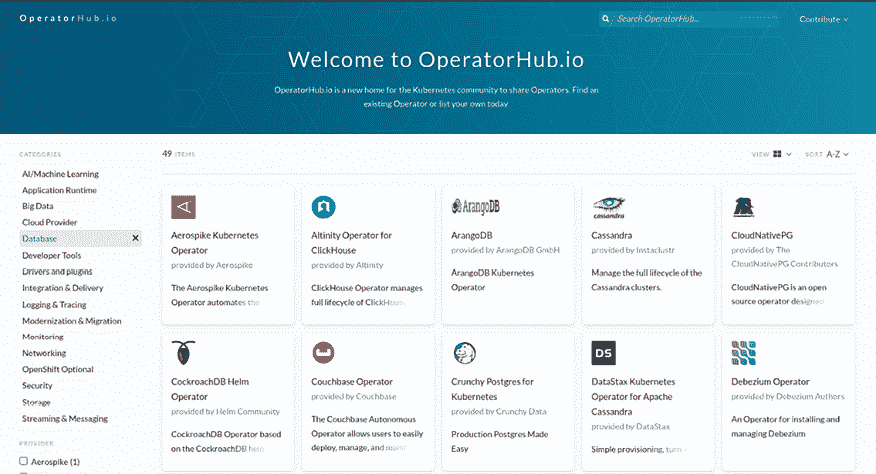

图 14.8：OperatorHub 主页面

## 构建你自己的 Operator

**Operator 框架**提供了一个强大的工具包，称为 **Operator SDK**。这个开源宝石使你能够开发和构建自定义 Operators，从而掌控 Kubernetes 中的应用管理。Operator SDK 简化了通常复杂的 Operator 创建过程。它提供了预构建的组件和功能，处理与 Kubernetes API 交互、管理自定义资源以及实现控制循环等常见任务。这使你能够专注于特定应用程序的独特逻辑和配置需求。

构建你自己的 Operators 解锁了几个优势。首先，你获得了对应用管理的精细控制。Operator 可以根据应用程序的具体需求进行定制，完美地处理配置、部署策略和扩展要求。其次，Operators 自动化了与应用生命周期相关的重复性任务，从而显著提高效率。最后，自定义的 Operators 是可重用的。一旦为特定应用程序构建，它们可以在同一应用的不同部署中应用，从而节省你在管理 Kubernetes 基础设施上的时间和精力。

你可以在 [`sdk.operatorframework.io/`](https://sdk.operatorframework.io/) 了解更多关于 Operator SDK 的信息。

在我们动手操作 Operator 之前，让我们在下一节中了解一些关于**Operator 生命周期管理器**（**OLM**）的细节。

## Operator 生命周期管理器（OLM）

Kubernetes 中的 Operator 生命周期管理器简化了将应用程序作为 Operator 打包并进行部署和管理的过程。OLM 使用声明式方法通过 YAML 文件指定资源。在此过程中，无需依赖特定顺序的复杂多文件部署。安装和自动升级也确保你的 Operators 始终保持最新。它还提供了一个名为目录源（Catalog Sources）的包发现功能，使你能够使用来自例如 OperatorHub 或其他选择来源的 Operators。通过 OLM，你将获得几个优势。首先，它通过管理依赖关系和顺序，减少了部署的复杂性。OLM 可以在大规模集群中管理成千上万的 Operators。更重要的是，OLM 强制执行所需的配置，这将简化发布和更新过程。更不用说，OLM 通过提供一种一致的方式来打包和部署应用程序作为 Operators，推动了标准化。

这是一个关于环境和个人偏好的问题。OLM 与 Kubernetes 更加集成和原生，而 Helm 由于在其他部署中更为常见，具有更丰富的软件包生态系统。

在学习 Operators 和 OLM 的过程中，了解 **ClusterServiceVersion**（**CSV**）同样很重要。ClusterServiceVersion 是 Kubernetes Operator 生命周期管理器中的一个重要部分，它是 Operator 的核心元数据处理和部署信息。它定义了 Operator 的名称及其所包含的版本，并给出了简短的描述。它还概述了 Operator 正常运行所需的权限或角色。它定义了 Operator 所管理的 CRD、安装策略以及升级流程。有关 CSV 的更多信息，请参见文档（[`olm.operatorframework.io/docs/concepts/crds/clusterserviceversion/`](https://olm.operatorframework.io/docs/concepts/crds/clusterserviceversion/)）。

在接下来的部分，我们将探讨如何使用 OLM 和 Prometheus Operator 在 Kubernetes 上部署 Prometheus 监控，展示这两种方法在应用程序管理中的强大功能。

# 使用 Prometheus 和 Grafana 启用 Kubernetes 监控

保持 Kubernetes 应用程序健康和高效运行的成功取决于多个因素，其中之一是拥有一个强大且可靠的环境。在这里，像 **Prometheus** 和 **Grafana** 这样的监控工具可以提供帮助。Prometheus 在幕后工作，它收集并存储有关 Kubernetes 集群的宝贵指标。Grafana 则将这些宝贵的数据以易于理解的格式进行可视化，帮助你深入了解应用程序和基础设施的健康状况和行为。

下图展示了 Prometheus 组件的高层架构。（这是官方参考资料。）

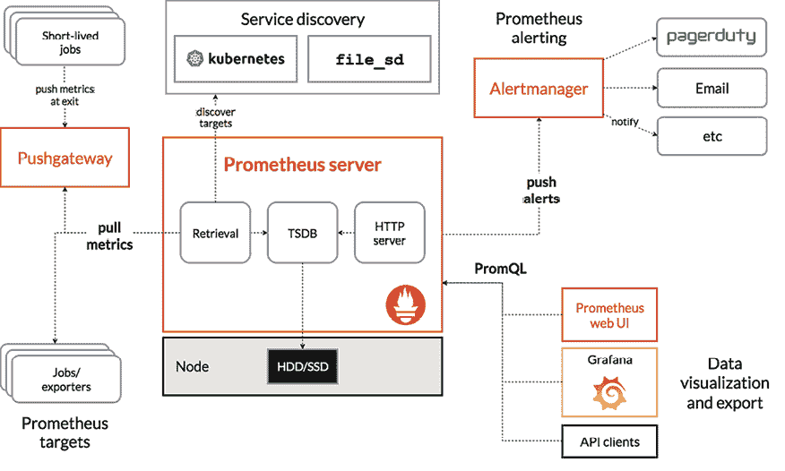

图 14.9：Prometheus 及其一些生态系统组件的架构（来源：[`prometheus.io/docs/introduction/overview/`](https://prometheus.io/docs/introduction/overview/)）

传统的部署方式，例如部署包含 Prometheus 和 Grafana 的监控栈，往往非常繁琐。手动编写多个 YAML 清单，处理所有的依赖关系和正确的部署顺序，不仅繁琐，而且容易出错。Prometheus 和 Grafana Operators 提供了一个更高效、更易维护的解决方案。

可以利用 Helm charts 部署整个监控栈——包括 Operators 和实例——使用如 `kube-prometheus-stack`（[`artifacthub.io/packages/helm/prometheus-community/kube-prometheus-stack`](https://artifacthub.io/packages/helm/prometheus-community/kube-prometheus-stack)）这样的项目。但在下一部分，我们的目的是使用 OLM 设置相同的监控栈。

在接下来的部分，我们将探索在 Kubernetes 集群中部署 Prometheus 和 Grafana 的过程，帮助你有效地监控应用程序，确保它们的顺利运行。

## 安装 Operator 生命周期管理器

要利用基于 OLM 的操作员安装，我们需要在集群中安装 OLM。 您可以使用`operator-sdk`实用程序，Helm 图表甚至通过应用于 OLM 的 Kubernetes YAML 清单来在集群中安装 OLM。 对于这个练习，让我们使用`install.sh`脚本为基础的安装。

```
$ curl -sL https://github.com/operator-framework/operator-lifecycle-manager/releases/download/v0.28.0/install.sh | bash -s v0.28.0 
```

等待脚本完成并使用 OLM 配置 Kubernetes 集群。 完成后，请验证 Pods 是否在`olm`命名空间中运行：

```
$ kubectl get pods -n olm
NAME                               READY   STATUS    RESTARTS   AGE
catalog-operator-9f6dc8c87-rt569   1/1     Running   0          36s
olm-operator-6bccddc987-nrlkm      1/1     Running   0          36s
operatorhubio-catalog-6l8pw        0/1     Running   0          21s
packageserver-6df47456b9-8fdt7     1/1     Running   0          24s
packageserver-6df47456b9-lrvzp     1/1     Running   0          24s 
```

还要使用`kubectl get csv`命令检查 ClusterServiceVersion 详细信息如下：

```
$ kubectl get csv -n olm
NAME            DISPLAY          VERSION   REPLACES   PHASE
packageserver   Package Server   0.28.0               Succeeded 
```

具有成功状态 - 我们可以看到 OLM 已部署并准备好管理操作员。 在下一部分中，我们将使用 OLM 部署 Prometheus 和 Grafana 操作员。

## 使用 OLM 安装 Prometheus 和 Grafana 操作员

一旦配置 OLM，部署操作员就非常简单。 大多数情况下，您会在`operatorhub.io`的操作员页面上找到操作员安装命令和说明。

要使用 OLM 安装 Prometheus 操作员（[`operatorhub.io/operator/prometheus`](https://operatorhub.io/operator/prometheus)），请按照以下步骤操作：

1.  在 OperatorHub 中搜索 Prometheus Operator：

    ```
    $ kubectl get packagemanifests | grep prometheus
    ack-prometheusservice-controller           Community Operators   12m
    prometheus                                 Community Operators   12m
    prometheus-exporter-operator               Community Operators   12m 
    ```

1.  使用 OLM 安装 Prometheus 操作员：

    ```
    $ kubectl create -f https://operatorhub.io/install/prometheus.yaml
    subscription.operators.coreos.com/my-prometheus created 
    ```

    [`operatorhub.io/install/prometheus.yaml`](https://operatorhub.io/install/prometheus.yaml)提供了创建订阅的基本 YAML 定义。 您可以创建带有所有所需自定义的本地 YAML 文件。

1.  等待几分钟并确保 Prometheus 操作员已正确部署：

    ```
    $ kubectl get csv -n operators
    NAME                         DISPLAY               VERSION   REPLACES                     PHASE
    prometheusoperator.v0.70.0   Prometheus Operator   0.70.0    prometheusoperator.v0.65.1   Succeeded 
    ```

1.  验证 Prometheus 操作员 Pods 是否在运行：

    ```
    $ kubectl get pods -n operators
    NAME                                   READY   STATUS    RESTARTS   AGE
    prometheus-operator-84f9b76686-2j27n   1/1     Running   0          87s 
    ```

1.  以相同方式，使用 OLM 找到并安装 Grafana 操作员（按照先前的步骤进行参考）：

    ```
    $ kubectl create -f https://operatorhub.io/install/grafana-operator.yaml 
    ```

1.  现在，还要验证在后端创建的 CRDs，因为这些条目是作为操作员安装的一部分创建的：

    ```
    $ kubectl get crd
    AME                                                  CREATED AT
    alertmanagerconfigs.monitoring.coreos.com             2024-10-18T09:14:03Z
    alertmanagers.monitoring.coreos.com                   2024-10-18T09:14:04Z
    catalogsources.operators.coreos.com                   2024-10-18T09:10:00Z
    clusterserviceversions.operators.coreos.com           2024-10-18T09:10:00Z
    grafanaalertrulegroups.grafana.integreatly.org        2024-10-18T09:25:19Z
    ...<removed for brevity>... 
    ```

1.  您将在 Kubernetes 集群中找到多个创建的 CRD。

现在我们已经部署了操作员，是时候创建 Prometheus 和 Grafana 实例并配置堆栈以监视 Kubernetes 集群了。 我们将在下一部分了解这些操作。

## 使用操作员配置 Prometheus 和 Grafana 实例

要配置新实例，让我们使用带有 CRD 配置的标准 YAML 定义。 此练习的说明和 YAML 定义文件存储在 GitHub 存储库的`第十四章`目录中。

按照步骤配置使用 Prometheus 和 Grafana 在 Kubernetes 中的监控堆栈：

1.  作为最佳实践，让我们创建一个命名空间来部署监控解决方案（参考`monitoring-ns.yaml`）：

    ```
    $ kubectl apply -f monitoring-ns.yaml
    namespace/monitoring created 
    ```

1.  使用适当的角色和 RBAC 配置 ServiceAccount（请参阅存储库中的`monitoring-sa.yaml`）：

    ```
    $ kubectl apply -f monitoring-sa.yaml
    serviceaccount/prometheus created
    role.rbac.authorization.k8s.io/prometheus-role created
    rolebinding.rbac.authorization.k8s.io/prometheus-rolebinding created 
    ```

1.  为新的 Prometheus 实例准备 YAML（请参阅`promethues-instance.yaml`）：

    ```
    apiVersion: monitoring.coreos.com/v1
    kind: Prometheus
    metadata:
      name: example-prometheus
      namespace: monitoring
    spec:
      replicas: 2
      serviceAccountName: prometheus
      serviceMonitorSelector:
        matchLabels:
          app.kubernetes.io/name: node-exporter 
    ```

注意在前述 YAML 定义中的`kind: Prometheus`，因为我们在这里使用 CRD； Prometheus 操作员将理解此 CRD 并采取必要的操作以创建部署。

1.  通过将配置应用到集群，创建一个新的 Prometheus 实例：

    ```
    $ kubectl apply -f promethues-instance.yaml
    prometheus.monitoring.coreos.com/example-prometheus 
    ```

1.  以类似的方式，使用 Operator 部署 Grafana 实例：

    ```
    # grafana-instnace.yaml
    apiVersion: grafana.integreatly.org/v1beta1
    kind: Grafana
    metadata:
      labels:
        dashboards: grafana-a
        folders: grafana-a
      name: grafana-a
      namespace: monitoring
    spec:
      config:
        auth:
          disable_login_form: 'false'
        log:
          mode: console
        security:
          admin_password: start
          admin_user: root 
    ```

在这里我们直接在 YAML 定义中以明文方式使用了配置和密码。在生产环境中，你应该使用 Kubernetes Secrets 来存储这些敏感数据。

1.  应用 YAML 定义以创建 Grafana 实例：

    ```
    $ kubectl apply -f grafana-instance.yaml
    grafana.grafana.integreatly.org/grafana-a created 
    ```

1.  验证 Prometheus 和 Grafana Operator 在 `monitoring` 命名空间中创建的对象：

    ```
    $ kubectl get pod,svc,sts -n monitoring
    NAME                                     READY   STATUS    RESTARTS   AGE
    pod/grafana-a-deployment-69f8999f8-82zbv   1/1   Running   0          17m
    pod/node-exporter-n7tlb                    1/1   Running   0          93s
    pod/prometheus-example-prometheus-0        2/2   Running   0          20m
    pod/prometheus-example-prometheus-1        2/2   Running   0          20m
    NAME                          TYPE        CLUSTER-IP       EXTERNAL-IP   PORT(S)    AGE
    service/grafana-a-service     ClusterIP   10.107.212.241   <none>        3000/TCP   17m
    service/prometheus-operated   ClusterIP   None             <none>        9090/TCP   20m
    NAME                                             READY   AGE
    statefulset.apps/prometheus-example-prometheus   2/2     20m 
    ```

1.  你可以看到，在前面的输出中，Operators 已根据 CRD 创建了适当的 Kubernetes 资源。你甚至可以看到 Prometheus 和 Grafana 服务已创建，并且能够访问它。我们将在本练习的后续阶段演示这一过程。

为了演示，我们在集群中启用 Node Exporter，并通过 Grafana 进行可视化。Node Exporter 是 Prometheus 的一种导出器，它暴露了主机机器的详细指标，包括硬件和操作系统信息，如 CPU 使用率、内存使用率以及其他系统级别的指标。它作为一个独立服务在 Kubernetes 集群的每个节点上运行，或在物理/虚拟服务器上运行，并通过 HTTP 端点暴露这些指标。通过抓取这些数据，Prometheus 可以了解节点的健康状况和性能，从而使管理员能够理解资源利用情况并指出基础设施中的问题。

以 DaemonSet 方式运行 Node Exporter 意味着 Kubernetes 集群中的每个节点都会运行一个导出器实例。通过这种方式，Prometheus 将能够持续抓取所有节点的系统指标，从而有效观察整个集群的健康状况和性能。使用 `node-exporter-daemonset.yaml` 创建 Node Exporter，配置如下：

```
$ kubectl apply -f node-exporter-daemonset.yaml
daemonset.apps/node-exporter created 
```

应该创建一个 Node Exporter 服务（`svc`）来暴露 Node Exporter 收集的指标，以便 Prometheus 抓取。这项服务为 Prometheus 提供了一种方式，帮助它发现并抓取运行在每个节点上的 Node Exporter pods 的指标，从而实现对 Kubernetes 集群中节点性能的集中监控。创建 Node Exporter 服务，配置如下：

```
$ kubectl apply -f node-exporter-svc.yaml
service/node-exporter created 
```

一个 Node Exporter serviceMonitor 通常会启用 Prometheus 来发现并抓取 Node Exporter 服务的指标。这个配置简化了整个监控过程，通过定义 Prometheus 应该如何以及在哪里抓取指标（例如，指定目标服务、间隔、标签等），确保在无需管理员干预的情况下收集的一致性。如下所示，创建一个 serviceMonitor CRD：

```
$ kubectl apply -f servicemonitor-instance.yaml
servicemonitor.monitoring.coreos.com/node-exporter created
Now it is our time to verify the monitoring stack deployment in Kubernetes cluster. 
```

让我们验证 Prometheus 门户，确保那里收集了相关详细信息。在你的某个控制台中，启动 `kubectl port-forward` 命令以暴露 Prometheus 服务，命令如下（测试完成后，你可以通过按 *Ctrl+C* 结束 `port-forward`）：

```
$ kubectl port-forward -n monitoring svc/prometheus-operated 9091:9090
Forwarding from 127.0.0.1:9091 -> 9090
Forwarding from [::1]:9091 -> 9090 
```

打开浏览器并访问`http://localhost:9091/targets`，以确保`node-exporter`对 Prometheus 可见。

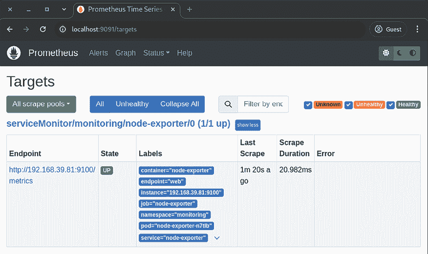

图 14.10：Prometheus 门户，Kubernetes 节点上可见 node-exporter

你可以从上面的截图确认 Prometheus 正在成功获取节点指标。

现在，让我们使用可视化工具 Grafana 来可视化指标和监控数据。打开控制台，使用`kubectl port-forward`命令将 Grafana 服务暴露出来，如下所示：

```
$ kubectl port-forward -n monitoring service/grafana-a-service 3000:3000
Forwarding from 127.0.0.1:3000 -> 3000
Forwarding from [::1]:3000 -> 3000 
```

打开浏览器并访问`http://localhost:3000`查看 Grafana 仪表板。

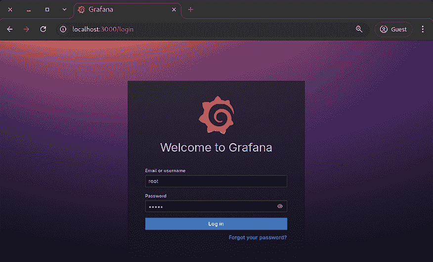

图 14.11：Grafana 门户

使用你在`grafana-instance.yaml`中配置的登录凭据（或者如果使用了密钥，则使用密钥），登录 Grafana 仪表板。

在那里你只会看到一个默认的仪表板，因为我们需要为自己的目的配置一个新的仪表板。

从左侧菜单中，转到**Connections | Data sources**，如下图所示。

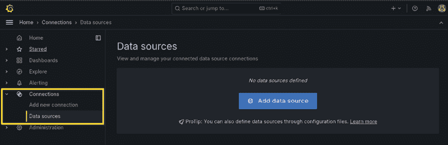

图 14.12：在 Grafana 中添加数据源

在下一个窗口中，选择**Prometheus**作为数据源，并输入 Prometheus URL，如下图所示。记得输入 FQDN（例如`http://prometheus-operated.monitoring.svc.cluster.local:9090` – 参见*第八章*，*使用服务暴露你的 Pods*，了解更多关于服务和 FQDN 的内容）。

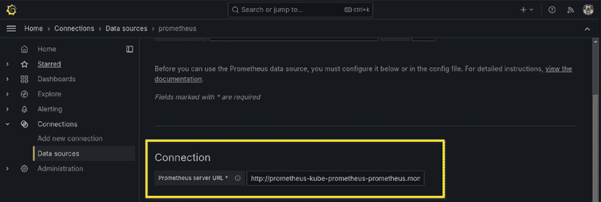

图 14.13：配置 Grafana 数据源

点击页面底部的**保存并测试**按钮，你将收到成功消息，如下图所示。（如果出现任何错误消息，请检查你使用的 Prometheus URL，包括 FQDN 和端口号。）

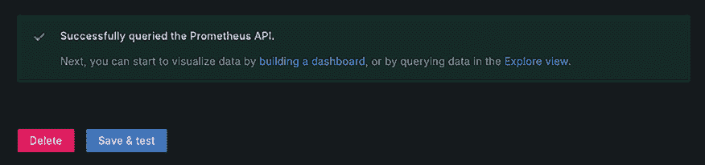

图 14.14：Grafana 数据源配置成功

现在我们已有数据源，需要创建一个仪表板来可视化数据。你可以从头开始创建一个仪表板，也可以导入一个带有预定义配置的仪表板。为此，访问`https://grafana.com/grafana/dashboards/`并找到**Node Exporter Full**仪表板。点击**复制 ID 到剪贴板**按钮，如下所示。

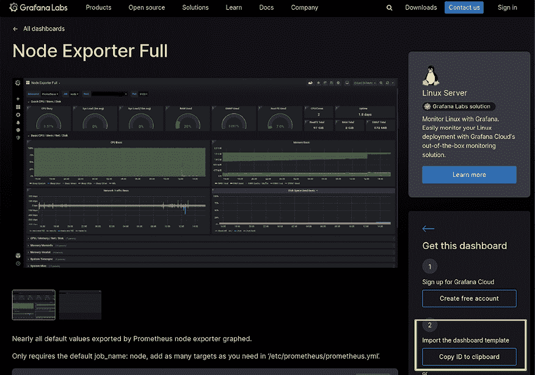

图 14.15：复制 Grafana 仪表板 ID 以导入

返回到 Grafana 的**WEBUI | Dashboards | New | Import**，如下图所示。

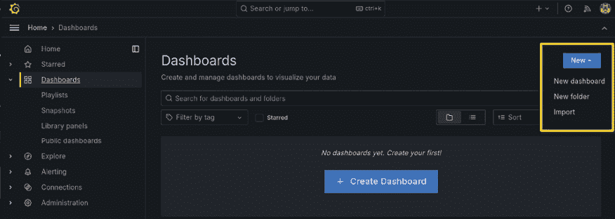

图 14.16：将新仪表板导入 Grafana

输入你在前一步已经复制的**Node Exporter Full**仪表板 ID，如下所示，然后点击**加载**按钮。

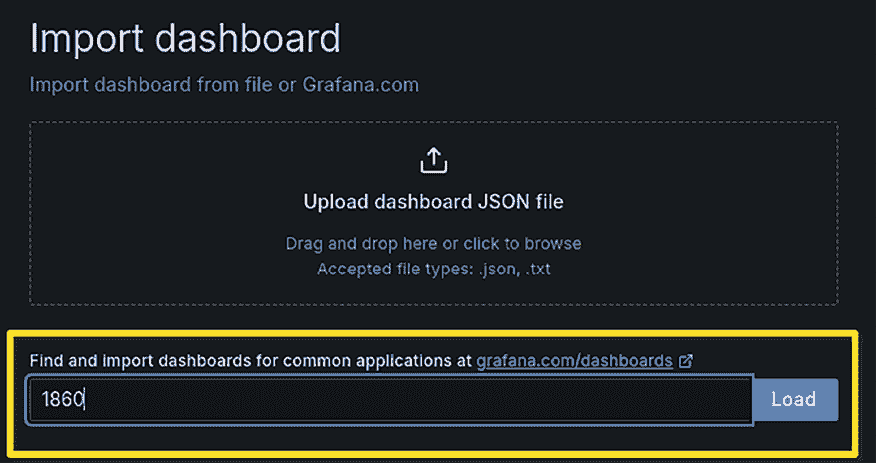

图 14.17：提供仪表板 ID 以在 Grafana 中导入

在下一个页面中，选择**Prometheus**作为数据源（之前已配置过的），然后点击**导入**按钮，如下所示。

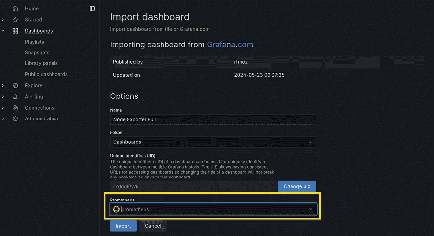

图 14.18：在 Grafana 中完成仪表板导入

就这样，你将看到一个漂亮的仪表板，内置了预配置的部件和图表，如下图所示。你可以探索仪表板，查看关于集群的详细信息，如 CPU、内存、网络流量等。

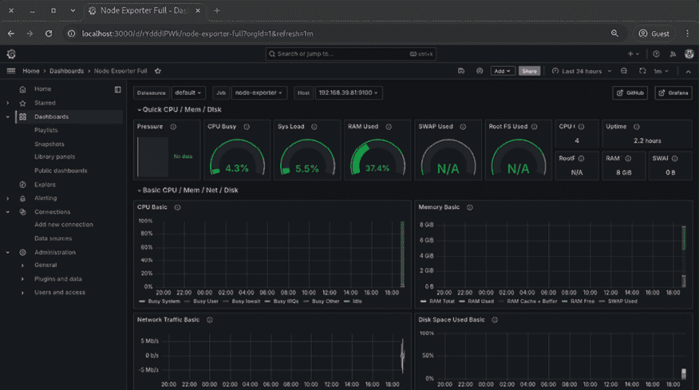

图 14.19：Node Exporter：在 Grafana 中导入的完整仪表板

恭喜你，成功在 Kubernetes 集群上部署了 Prometheus 和 Grafana 堆栈，并启用了 Node Exporter！

本章到此为止。正如你所看到的，使用 Helm 图表和 Operators，即使是复杂的多组件解决方案，也非常简单，并且可以为你的开发和生产环境带来诸多好处。

# 总结

本章介绍了如何使用 Helm、Helm 图表和 Kubernetes Operators。首先，你了解了软件包管理的目的以及 Helm 如何作为 Kubernetes 的软件包管理器工作。我们演示了如何在本地计算机上安装 Helm，并如何部署一个 WordPress 图表来测试安装。接着，我们介绍了 Helm 图表的结构，并展示了如何使用用户提供的值来配置图表中的 YAML 模板。随后，我们展示了如何使用 Helm 在 Kubernetes 集群上安装流行的解决方案。我们安装了 Kubernetes Dashboard 并探索了其组件。之后，我们学习了 Kubernetes Operators 和其他组件，包括自定义资源定义（CRD）。我们还使用 Helm 和 Operators 部署了 Prometheus 堆栈，包括 Grafana。

在下一部分，你将获得在不同云环境中有效部署 Kubernetes 集群所需的所有细节。我们将首先介绍如何在 Google Kubernetes Engine 上操作集群。

# 进一步阅读

+   **Helm 网站**： [`helm.sh/`](https://helm.sh/)

)

+   **Kubernetes 仪表板**： [`kubernetes.io/docs/tasks/access-application-cluster/web-ui-dashboard/`](https://kubernetes.io/docs/tasks/access-application-cluster/web-ui-dashboard/)

)

+   **访问仪表板**： [`github.com/kubernetes/dashboard/blob/master/docs/user/accessing-dashboard/README.md`](https://github.com/kubernetes/dashboard/blob/master/docs/user/accessing-dashboard/README.md)

)

+   **部署和访问 Kubernetes 仪表板**： [`kubernetes.io/docs/tasks/access-application-cluster/web-ui-dashboard/`](https://kubernetes.io/docs/tasks/access-application-cluster/web-ui-dashboard/)

)

+   **为仪表板访问创建一个示例用户**： [`github.com/kubernetes/dashboard/blob/master/docs/user/access-control/creating-sample-user.md`](https://github.com/kubernetes/dashboard/blob/master/docs/user/access-control/creating-sample-user.md)

)

+   **六步构建一个 Kubernetes Operator**： [`developers.redhat.com/articles/2021/09/07/build-kubernetes-operator-six-steps`](https://developers.redhat.com/articles/2021/09/07/build-kubernetes-operator-six-steps)

)

+   **自定义资源**：[`kubernetes.io/docs/concepts/extend-kubernetes/api-extension/custom-resources/`](https://kubernetes.io/docs/concepts/extend-kubernetes/api-extension/custom-resources/)

)

如需了解有关 Helm 和 Helm Charts 的更多信息，请参考以下 *Packt Publishing* 的书籍：

+   *学习 Helm*，作者 *Andrew Block*，*Austin Dewey* ([`www.packtpub.com/product/learn-helm/9781839214295`](https://www.packtpub.com/product/learn-helm/9781839214295))

你可以在以下 *Packt Publishing* 的书籍中了解更多关于 Elasticsearch 和 Prometheus 的内容：

+   *学习 Elasticsearch*，作者 *Abhishek Andhavarapu* ([`www.packtpub.com/product/learning-elasticsearch/9781787128453`](https://www.packtpub.com/product/learning-elasticsearch/9781787128453))

+   *使用 Prometheus 进行基础设施监控*，作者 *Joel Bastos*，*Pedro Araujo* ([`www.packtpub.com/product/hands-on-infrastructure-monitoring-with-prometheus/9781789612349`](https://www.packtpub.com/product/hands-on-infrastructure-monitoring-with-prometheus/9781789612349))

# 加入我们的社区，进入 Discord

加入我们社区的 Discord 空间，与作者和其他读者进行讨论：

[`packt.link/cloudanddevops`](https://packt.link/cloudanddevops)


