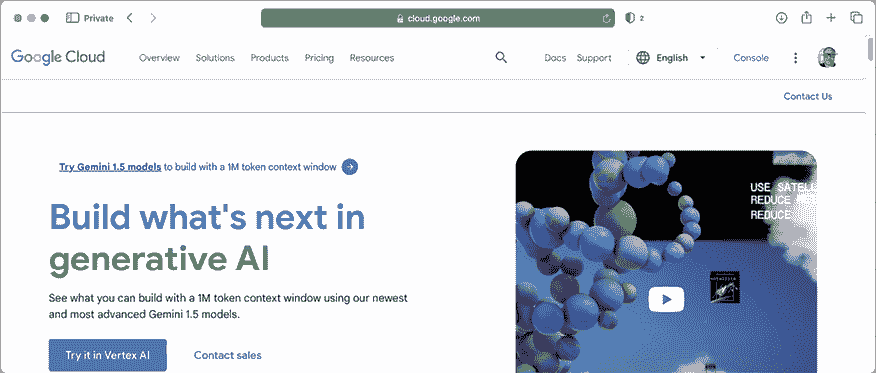
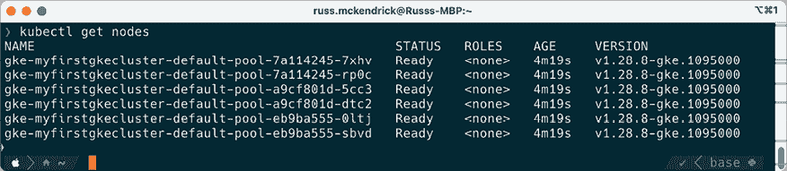

# 15

# Google Kubernetes Engine 上的 Kubernetes 集群

在本章中，我们将在**Google Cloud Platform**（**GCP**）上启动一个 Kubernetes 集群，这是我们在接下来几章中要介绍的三大公有云提供商中的第一个。

到本章结束时，你将注册 Google Cloud Platform，使用**Google Kubernetes Engine**（**GKE**）启动 Kubernetes 工作负载，并了解 GKE 的功能。

本章将涵盖以下主题：

+   什么是 Google Cloud Platform 和 Google Kubernetes Engine？

+   准备你的本地环境

+   启动你的第一个 Google Kubernetes Engine 集群

+   部署工作负载并与集群交互

+   更多关于集群节点的信息

# 技术要求

要跟随本章内容，你需要一个带有有效支付方式的 Google Cloud Platform 帐户。

按照本章中的说明操作将会产生财务费用。因此，在完成使用后，务必终止你启动的任何资源。本章中列出的所有价格在写作时是准确的，我们建议你在启动任何资源之前查看当前的费用。

# 什么是 Google Cloud Platform 和 Google Kubernetes Engine？

在我们动手注册 Google Cloud Platform 帐户并安装工具之前，我们需要启动一个由 GKE 支持的集群。我们还应该讨论一下 Google Kubernetes Engine 以及它是如何诞生的。

从此，我将在本章正文中将 Google Cloud Platform 称为 GCP，将 Google Kubernetes Engine 称为 GKE。

## Google Cloud Platform

在“**三大**”公有云提供商中，GCP 是最新的。在接下来的两章中，我们将探讨**Amazon Web Services**（**AWS**）和**Microsoft Azure**。

Google 进入公有云技术的方式与另外两家提供商不同。2008 年 4 月，Google 推出了其 Google App Engine 的公有预览版，这是其云服务的第一个组成部分。作为一项服务，App Engine 至今仍然可用，截止写作时（2024 年中期）。该服务允许开发者将应用程序部署在 Google 管理的运行时环境中，包括 PHP、Java、Ruby、Python、Node.js 和 C#，以及 Google 自家编程语言 Go，后者于 2009 年开源。

2010 年 5 月，**Google Cloud Storage**在 GCP 品牌下推出，紧接着是**Google BigQuery**和其预测 API 的预览版。2011 年 10 月，**Google Cloud SQL**上线。然后，在 2012 年 6 月，**Google Compute Engine**的预览版也上线了。

正如你所看到的，四年过去了，到了那时我们已经有了大多数人认为构成公有云服务的核心服务。

然而，大多数服务仍处于预览阶段；直到 2013 年，许多核心服务才会脱离预览并变为 **正式发布**（**GA**）。这意味着可以安全地在大规模生产工作负载中运行，且更为重要的是，提供了 **服务级别协议**（**SLA**），这对于 **中小型企业**（**SMEs**）和大型企业采用该服务至关重要。所有这些都发生在 Google 启动 Kubernetes 的前一年。

2014 年底，Google 发布了 GKE 的第一个 Alpha 版本。

## Google Kubernetes Engine

鉴于 Kubernetes 是在 Google 开发的，且 Google 在通过 Borg 项目大规模运行容器工作负载方面拥有丰富经验，因此 Google 成为第一个在 GKE 中提供自家 Kubernetes 服务的公共云提供商也就不足为奇了。

在 Kubernetes v1 发布并于 2015 年 7 月移交给 **云原生计算基金会**（**CNCF**）维护后，仅仅一个月，GKE 服务就已成为 GA。

GKE 服务允许你启动并管理一个 CNCF 认证的 Kubernetes 集群，利用 GCP 的本地计算、存储和网络服务。此外，它还允许与平台的监控、身份和访问管理功能进行深度集成。

我们将在 *第十七章* 的结尾讨论不同云端 Kubernetes 服务的差异，以及你为什么应该使用它们。

既然我们已经了解了该服务的一些历史背景，我们可以注册并安装一些用于启动集群的管理工具。

# 准备本地环境

我们需要做的第一件事是让你能够访问 GCP。为此，你必须注册一个新账户或登录现有账户。让我们学习一下如何操作。

要注册 GCP 账户，你需要访问 [`cloud.google.com/`](https://cloud.google.com/)。此页面会显示一个类似下面的界面：



图 15.1：Google Cloud 首页

如果你已经在使用 Google 服务，如 Gmail、YouTube，或拥有一部安卓手机，那么你已经拥有了一个 Google 账户。你可以使用这个账户进行注册，具体操作见 *图 15.1*。我已经登录到自己的 Google 账户，截图右上角的头像显示了这一点。

截至本文撰写时，Google 提供 $300 的信用额度，可以在 90 天内使用。你仍然需要输入有效的付款方式来利用这些免费信用。Google 这样做是为了确保不是一个自动化机器人在注册账户并滥用他们提供的信用额度。一旦信用额度使用完毕或过期，你将获得将账户升级为付费账户的选项。有关此优惠的更多细节，请参见以下链接：[`cloud.google.com/free/docs/free-cloud-features`](https://cloud.google.com/free/docs/free-cloud-features)。

如果你想利用免费的信用额度，可以点击这个链接：[`cloud.google.com/free/docs/free-cloud-features#try-it-for-yourself`](https://cloud.google.com/free/docs/free-cloud-features#try-it-for-yourself)。点击 **立即免费开始**；如果你符合条件，按照屏幕上的提示操作，确保你已阅读相关条款和条件。注册后，你将进入 GCP 控制台。或者，如果你已经有了 GCP 账户，你可以直接登录 GCP 控制台：[`console.cloud.google.com/`](https://console.cloud.google.com/)。

现在我们已经有了账户，让我们学习如何创建一个项目，在其中启动我们的资源。

## 创建项目

GCP 有一个概念，即资源被启动到项目中。如果你刚刚注册了一个账户，那么在注册过程中会为你创建一个“My First Project”项目。

如果你使用的是现有账户，我建议创建一个新的项目来启动你的 GKE 集群。为此，点击 **选择** 菜单，该菜单位于页面左上角 GCP 标志右侧的顶部栏中。

这将显示你可以访问的所有项目，并允许你创建一个新项目。为此，请按以下步骤操作：

1.  点击 **新建项目**。

1.  系统会要求你完成以下操作：

    +   给你的新项目命名。

    +   选择一个组织来附加到项目上。

    +   选择位置；这是一个存储项目的组织或文件夹。

1.  输入上一步骤的详细信息后，点击 **创建** 按钮。


图 15.2：创建新项目

既然我们已经有了一个启动资源的地方，我们可以开始安装 GCP 命令行工具了。

## 安装 GCP 命令行界面

在这里，我们将介绍如何在本地计算机上使用 GCP **命令行界面** (**CLI**) 。如果你不想安装或无法安装，也不用担心，因为有一种方法可以在云端运行 CLI。但让我们先从我选择的操作系统——macOS 开始。

### 在 macOS 上安装

如果你像我一样，在 macOS 上使用终端进行大量工作，那么你很可能在某个时候安装并使用过 Homebrew。

有关 Homebrew 的最新安装说明，请参见项目网站 [`brew.sh/`](https://brew.sh/)。

安装了 Homebrew 后，您可以使用以下命令安装 GCP CLI：

```
$ brew install --cask google-cloud-sdk 
```

您可以通过运行以下命令来测试安装：

```
$ gcloud version 
```

如果一切顺利，您应该会看到类似以下的输出：


图 15.3：在 macOS 上检查版本号

如果您遇到问题，可以查看上面链接的文档；有关 GCP CLI 安装的信息，请参见：

```
$ brew info --cask google-cloud-sdk 
```

一旦安装并正常运行 GCP CLI，您可以继续本章的 *初始化* 部分。

### 在 Windows 上安装

在 Windows 上有几种安装 GCP CLI 的方式。第一种是打开一个 PowerShell 会话，并运行以下命令通过 Chocolatey 安装它。

像 macOS 上的 Homebrew 一样，Chocolatey 是一个包管理器，允许您通过 PowerShell 在 Windows 上轻松且一致地安装各种软件包，使用相同的命令语法，而不必担心 Windows 上存在的多种安装方法——更多信息请参见 [`chocolatey.org/`](https://chocolatey.org/)。

如果您没有安装 Chocolatey，可以在以管理员权限启动的 PowerShell 会话中运行以下命令：

```
$ Set-ExecutionPolicy Bypass -Scope Process -Force; [System.Net.ServicePointManager]::SecurityProtocol = [System.Net.ServicePointManager]::SecurityProtocol -bor 3072; iex ((New-Object System.Net.WebClient).DownloadString('https://chocolatey.org/install.ps1')) 
```

一旦安装了 Chocolatey，或者如果您已经安装了它，运行以下命令：

```
$ choco install --ignore-checksum gcloudsdk 
```

另一种安装方式是从以下网址下载安装程序：

[`dl.google.com/dl/cloudsdk/channels/rapid/GoogleCloudSDKInstaller.exe`](https://dl.google.com/dl/cloudsdk/channels/rapid/GoogleCloudSDKInstaller.exe

)

下载后，双击可执行文件并按照屏幕上的提示进行操作。

安装完成后，打开一个新的 PowerShell 窗口并运行以下命令：

```
$ gcloud version 
```

如果一切顺利，您应该会看到类似于前一节 macOS 版本中截图所示的输出。再次提醒，安装并成功运行后，您可以继续本章的 *初始化* 部分。

### 在 Linux 上安装

虽然 Google Cloud CLI 包对于大多数发行版都可以使用，但为了涵盖各种包管理器，我们需要更多的空间，因此，我们将使用 Google 提供的全局安装脚本。

要运行此命令，您需要使用以下命令：

```
$ curl https://sdk.cloud.google.com | bash 
```

在安装过程中，脚本会询问您几个问题。对于大多数人来说，回答 `Yes` 就可以了。安装完成后，运行以下命令以重新加载会话，从而使其更新所有安装程序所做的更改：

```
$ exec -l $SHELL 
```

根据我们在前面章节中讨论的 macOS 和 Windows 安装方法，您可以运行以下命令来查看已安装的 GCP CLI 版本的详细信息：

```
$ gcloud version 
```

你可能已经注意到，尽管安装方法有所不同，但一旦安装完成并使用`gcloud`命令，我们会得到相同的结果。从这里开始，您运行的操作命令将适用于所有三种操作系统，因此您所运行的操作系统不再重要。

### 云 Shell

在我们开始安装 Google Cloud CLI 之前，我提到过还有第四个选项。该选项是 Google Cloud Shell，内置于 Google Cloud 控制台中。要访问此选项，请单击位于顶部菜单右侧的**Shell**图标。

配置完成后，您应该会看到一个基于 Web 的终端，您可以从中运行以下命令：

```
$ gcloud version 
```

输出略有不同，因为 Google 提供了完整的支持工具套件。但是，您将从以下屏幕看到，版本与我们在本地安装的版本匹配：


图 15.4：使用 GCP Cloud Shell

如果您使用 Google Cloud Shell，则可以跳过下面的初始化步骤，因为这已为您完成。

### 初始化

如果您选择在本地安装客户端，您需要执行最后一步操作，将其链接到您的 GCP 账户。为此，请运行以下命令：

```
$ gcloud init 
```

这将立即运行一个快速的网络诊断，以确保客户端具备运行所需的连接性。一旦诊断通过，您将被提示回答以下问题：

```
You must log in to continue. Would you like to log in (Y/n)? 
```

回答`Y`将打开一个浏览器窗口。如果没有打开，请复制并粘贴提供的 URL 到您的浏览器中，在那里您将选择要使用的账户后，将看到客户端请求的权限概述，如下屏幕所示：


图 15.5：审核权限

如果您同意授予权限，请点击**允许**按钮。返回到您的终端，您将收到登录用户的确认信息。然后，您将被要求选择要使用的云项目。列表中仅包含项目的唯一 ID，而不是您之前在 Google Cloud 控制台中看到或设置的友好名称。如果您有多个项目，请选择正确的项目。

如果您需要随时更新客户端使用的项目，可以运行以下命令：

```
$ gcloud config set project PROJECT_ID 
```

确保您用项目的唯一 ID 替换`PROJECT_ID`。

现在您已经安装了 Google Cloud CLI 并配置了您的账户，您可以准备启动您的 GKE 集群。

# 启动您的第一个 Google Kubernetes Engine 集群

由于集群需要几分钟才能完全部署，让我们运行命令来启动该过程，并详细讨论在启动过程中发生的情况。

在启动集群之前，我们必须确保启用了`container.googleapis.com`服务。为此，请运行以下命令：

```
$ gcloud services enable container.googleapis.com 
```

然后我们需要安装一个插件，允许我们使用`kubectl`对集群进行身份验证；为此，请运行以下命令：

```
$ gcloud components install gke-gcloud-auth-plugin 
```

一旦启用了服务和插件，启动名为`myfirstgkecluster`的两节点集群的命令如下，该集群将托管在美国中部地区的单一区域：

```
$ gcloud container clusters create myfirstgkecluster --num-nodes=2 --zone=us-central1-a 
```

大约五分钟后，您应该看到如下所示的输出：


图 15.6：启动集群

一旦集群启动，您应该能够按照输出中的 URL 并在 Google Cloud Console 中查看，如下所示：


图 15.7：在 Google Cloud Console 中查看集群

您可以访问 Google Cloud Console，网址为[`console.cloud.google.com/`](https://console.cloud.google.com/)。

现在我们的集群已启动并运行，我们可以部署工作负载并更详细地查看 Google Cloud Console。

# 部署工作负载并与您的集群互动

从启动集群时得到的反馈中需要注意的一点是：

```
$ gcloud container clusters create myfirstgkecluster --num-nodes=2 --zone=us-central1-a 
```

输出中的以下行：

```
kubeconfig entry generated for myfirstgkecluster. 
```

正如您可能猜到的，这已经下载并配置了所有必要的信息，将您的本地`kubectl`副本连接到新部署的 GKE 集群。

您可以通过运行以下命令来确认这一点：

```
$ kubectl get nodes 
```

您从命令中获得的输出应该显示两个以`gke`为前缀的节点，因此它应类似于以下终端输出：


图 15.8：使用 kubectl 列出节点

如果在运行上述输出时您的 GKE 集群节点已列出，并且您满意当前使用的`kubectl`配置，可以跳过本章的下一节，直接进入*启动示例工作负载*部分。

本章末尾的*进一步阅读*部分还提供了指向官方 GKE 文档的链接。

## 配置您的本地客户端

如果您需要配置另一个或您的`kubectl`安装以连接到您的集群，GCP CLI 提供了一个命令。

运行以下命令的前提是您已安装并配置了 GCP CLI。如果没有，请按照本章*安装 GCP 命令行界面*部分中的说明进行操作。

您需要运行的命令以下载凭据并配置`kubectl`如下：

```
$ gcloud container clusters get-credentials myfirstgkecluster --zone=us-central1-a 
```

如果需要切换到另一个配置（或称为上下文），可以运行以下命令。第一个命令列出当前的上下文：

```
$ kubectl config current-context 
```

以下命令列出了您已配置的所有上下文的名称：

```
$ kubectl config get-contexts -o name 
```

一旦你知道需要使用的上下文名称，可以运行以下命令，确保将`CONTEXT_NAME`替换为你修改后的上下文名称，如下所示：

```
$ kubectl config use-context CONTEXT_NAME 
```

现在你的 `kubectl` 客户端已配置为与 GKE 集群进行交互，我们可以启动示例工作负载。

### 启动示例工作负载

我们将启动的示例工作负载是官方 Kubernetes 文档中使用的 PHP/Redis Guestbook 示例。启动工作负载的第一步是创建 Redis Leader 部署和服务。为此，我们使用以下命令：

```
$ kubectl apply -f https://raw.githubusercontent.com/GoogleCloudPlatform/kubernetes-engine-samples/main/quickstarts/guestbook/redis-leader-deployment.yaml
$ kubectl apply -f https://raw.githubusercontent.com/GoogleCloudPlatform/kubernetes-engine-samples/main/quickstarts/guestbook/redis-leader-service.yaml 
```

接下来，我们需要重复这个过程，但这次是启动 Redis Follower 部署和服务，如下所示：

```
$ kubectl apply -f https://raw.githubusercontent.com/GoogleCloudPlatform/kubernetes-engine-samples/main/quickstarts/guestbook/redis-follower-deployment.yaml
$ kubectl apply -f https://raw.githubusercontent.com/GoogleCloudPlatform/kubernetes-engine-samples/main/quickstarts/guestbook/redis-follower-service.yaml 
```

现在我们已经启动了 Redis，接下来是启动前端部署和服务；这就是应用程序本身：

```
$ kubectl apply -f https://raw.githubusercontent.com/GoogleCloudPlatform/kubernetes-engine-samples/main/quickstarts/guestbook/frontend-deployment.yaml
$ kubectl apply -f https://raw.githubusercontent.com/GoogleCloudPlatform/kubernetes-engine-samples/main/quickstarts/guestbook/frontend-service.yaml 
```

几分钟后，你应该能够运行以下命令，获取你刚刚启动的服务的信息：

```
$ kubectl get service frontend 
```

命令的输出应该会给出一个外部 IP 地址，类似以下终端输出：


图 15.9：获取前端服务的信息

现在我们已经启动了应用程序，复制 `EXTERNAL-IP` 值并将 IP 地址输入浏览器；确保使用 `http://EXTERNAL-IP` 而不是 `https://EXTERNAL-IP`，因为 Guestbook 监听的是端口 `80` 而不是 `443`。

当你在浏览器中打开地址时，你应该看到简单的 Guestbook 应用程序。尝试提交一些消息，如下所示：


图 15.10：带有一些测试消息的 Guestbook 应用程序

现在我们已经启动了基本的工作负载，让我们回到并探索 Google Cloud Console。

## 探索 Google Cloud Console

我们已经在 Google Cloud Console 中看到了集群，接下来点击左侧菜单中的**工作负载**链接，该链接位于**Kubernetes Engine**部分。


图 15.11：在控制台中查看工作负载

如前所示，三个部署列出，并确认它们所属的命名空间和工作负载所属的集群。

如果我们有多个集群，且每个集群中有多个命名空间和部署，我们可以使用过滤器来深入查看我们的 GKE 工作负载。

### 工作负载

点击**前端**部署将让你查看更多信息：


图 15.12：获取前端部署的概览

在此页面上，你将能够通过部署名称下方的标签进一步深入查看你的部署，如下所示：

+   **概述**：此视图为你提供所选工作负载的概览。如之前的截图所示，你可以看到 CPU、内存和磁盘的使用情况，以及其他信息。

+   **详情**：此处列出了有关环境和工作负载本身的更多信息。在这里，你可以了解它是何时创建的、注解、标签（以及副本的详细信息）、更新策略以及 Pod 信息。

+   **可观测性**：在这里，你可以查看工作负载基础设施的所有指标。

+   **修订历史**：在这里，你会找到所有工作负载修订的列表。如果你的部署频繁更新并且需要跟踪部署何时更新，这将非常有用。

+   **事件**：如果你的工作负载有任何问题，这是查看的地方。所有事件，如扩展、Pod 可用性和其他错误，将列在这里。

+   **日志**：这是一个可搜索的日志列表，包含了运行该 Pod 的所有容器的日志。

+   **应用错误**：在这里，你会找到任何应用程序错误。

+   **YAML**：这是一个可导出的 YAML 文件，包含完整的部署配置。

此信息适用于你在项目中启动的所有 GKE 集群中的所有部署。

### 网关、服务和入口

在这个部分，我们将查看 **网关、服务和入口** 部分。正如你可能已经猜到的，这里列出了在你所有 GKE 集群中启动的所有服务。你可以通过点击 **网关、服务和入口** 来查看。

当你首次进入此部分时，它默认会显示 **网关** 标签页，但我们还没有启动网关，因此你需要点击 **服务** 标签页。当加载完成后，你将看到如下所示的界面：


图 15.13：在控制台中查看服务

如你所见，我们启动的三个服务都列在其中。然而，**前端** 服务有一个 **外部负载均衡器** 类型和一个公开的 IP 地址，而 **redis-leader** 和 **redis-follower** 服务则仅有一个 **集群 IP**。

这是因为，在这三个服务中，我们只希望前端服务能够公开访问，因为只有我们的前端服务使用了两个 Redis 服务。

当外部负载均衡器启动时，由于我们在公共云提供商上运行集群，Kubernetes 调度器知道要联系 Google Cloud API 并启动负载均衡器供使用。然后，它将其配置为与我们的集群节点进行通信，暴露工作负载；该部署在外部运行在端口 **80** 上，流量将传递回节点上的端口 **31740**。

和以前一样，点击三个运行中的服务之一会给你提供几个信息：

+   **概述**：此视图提供了服务配置和利用情况的总结。

+   **详情**：在这里，你可以找到有关服务的更多细节，并可以查看已在我们 Google Cloud 项目中启动的负载均衡器资源的链接。

+   **事件**：如前所述，你可以在这里找到任何影响服务的事件。这对于故障排除非常有用。

+   **日志**：这是 **工作负载** 部分中显示的日志的重复。

+   **应用程序错误**：你将在这里找到任何应用程序的错误。

+   **YAML**：同样，这是将完整的服务配置导出为 YAML 文件的一种方式。

虽然这涵盖了我们启动的基本工作负载，但 GKE 提供了许多其他选项和功能。让我们快速浏览左侧菜单中其他项目背后的功能。

### 其他 GKE 特性

GKE 支持两种类型的特性；以下列出的为标准特性。还有可以在你运行 GKE 企业版时启用的企业特性，我们将在本节末尾讨论这些特性：

+   **集群**：在这里，你可以管理你的集群；你将看到我们通过 GCP CLI 启动的集群，并可以使用引导式 Web 界面创建更多集群。

+   **工作负载**：如前所述，你将在这里找到你部署到集群中的工作负载。

+   **应用程序**：这里会显示你从市场中部署的所有应用程序，我们稍后会介绍这个内容。

+   **秘密和配置映射**：在这里，你可以安全地管理你的秘密和配置映射。

+   **存储**：你可以查看你在这里配置的任何持久存储声明，并管理存储类。

+   **对象浏览器**：可以将它视为 K8s 和 GCP API 的资源管理器；点击它，你可以看到你可以与之交互的所有 API 和端点的概览，以及当前已部署的对象/资源。

以下服务将 Google 原生服务引入 GKE：

+   **GKE 备份**：在这里，你可以使用 GCP 的备份服务（它是 GKE 提供服务之外的）来备份你在 GKE 中托管的工作负载和应用程序。就我个人而言，当我在云端运行 Kubernetes 工作负载时，里面的数据是临时的。对于像数据库这样的服务，我希望有备份，它们运行在一个受 SLA 支持的、云原生的服务中，位于我的集群之外——但如果由于某些原因你不能这样做，那么这个服务可以满足你的需求。

+   **网关、服务和入口**：我们已经介绍过这个选项。

+   **网络功能优化器**：你可以在这里将 GKE 工作负载连接到其他 GCP 资源的私有网络。这使你能够扩展你的集群网络，以便像 Google Cloud 数据库这样的服务可以通过集群资源私密访问。

+   **市场**：在这里，你可以找到可以在 GKE 集群中运行的预包装应用程序。这些应用程序由各种软件供应商发布，包括免费和商业产品。

如上所述，上述功能在 GKE 的标准版中是可用的；此版本类似于自己部署 Kubernetes，只是谷歌为您处理了节点部署和管理计划。

接下来是企业版；正如您可能已经猜到的那样，这引入了额外的功能，企业部署 Kubernetes 可能需要这些功能，例如托管服务网格、安全性、合规性和基于角色的访问控制选项。这些功能需要额外的费用，但对于可能在更受监管的行业中工作的大型组织来说是必不可少的。

### 删除您的集群

当您完成您的集群时，可以通过运行以下命令来删除它。第一个命令将删除我们创建的服务，第二个命令将终止集群本身：

```
$ kubectl delete service frontend
$ gcloud container clusters delete myfirstgkecluster --zone=us-central1-a 
```

删除集群可能需要几分钟，请确保在此过程完成之前等待。

这还应该删除您的工作负载启动的任何服务，例如负载均衡器。但是，我建议您在 Google Cloud 控制台上仔细检查是否有任何被遗弃的服务或资源，以确保您不会产生意外的费用。

我们一直在使用 `--zone=us-central1-a` 标志，在美国中部地区的一个可用区启动我们的集群。让我们讨论一下其他可用的集群选项。

# 关于集群节点的更多信息

在上一节的结尾，我提到了可用区和区域。在讨论一些集群部署选项之前，我们应该更好地理解一下我们所说的可用区和区域的含义：

+   **区域**：一个区域由多个区域组成。不同区域内的区域具有出色的低延迟网络连接，可实现高可用性、始终在线和容错工作负载的部署。

+   **可用区**：将可用区视为区域内的单独数据中心。这些区域具有不同的网络和电力，这意味着如果一个单一区域出现问题并且您在多个区域中运行您的工作负载，则您的工作负载不应受到影响。

关于区域的一点需要注意的是，并非所有机器类型在一个区域内的所有区域中都可用。因此，请在尝试部署工作负载之前进行检查。

谷歌的最佳实践建议您将您的工作负载跨单个区域内的最大区域数量部署，以获得最佳性能和可用性。

然而，可以通过使用多集群入口将您的工作负载分布在多个区域中 – 您只需考虑和允许共享服务之间的增加延迟，例如数据库。有关多集群入口的更多信息，请参见本章末尾的*进一步阅读*部分。

让我们重新看看如何在单个区域跨多个区域启动集群，通过检查我们在本章开头用于启动测试集群的命令：

```
$ gcloud container clusters create myfirstgkecluster --num-nodes=2 --zone=us-central1-a 
```

如我们所知，它将启动两个节点，但仅在一个区域内。我们只使用 `-zone` 标志传递了一个区域，在我们的例子中是 `us-central1` 区域和 `a` 区域。

让我们运行以下命令，但使用 `--region` 标志而不是 `--zone` 标志：

```
$ gcloud container clusters create myfirstgkecluster --num-nodes=2 --region=us-central1 
```

启动后，运行以下命令：

```
$ kubectl get nodes 
```

这应该会输出如下内容：



图 15.14：查看运行在区域中的节点

如你所见，我们在每个区域都有两个节点，总共六个节点。这是因为默认情况下，当你定义一个区域时，集群会分布在三个区域内。你可以通过使用`--node-locations`标志来覆盖此设置。

如果我们想从头开始部署一个集群，命令会像下面这样；正如你所见，我们现在有一个逗号分隔的可用区列表：

```
$ gcloud container clusters create myfirstgkecluster --num-nodes=2 --region=us-central1 --node-locations us-central1-a,us-central1-b,us-central1-c,us-central1-f 
```

我们仍然使用 `us-central1` 区域，但部署到 `a`、`b`、`c` 和 `f` 区域。

由于我们已经有一个正在运行的集群，我们可以运行以下命令来更新集群，添加新的可用区和两个新节点：

```
$ gcloud container clusters update myfirstgkecluster --min-nodes=2 --region=us-central1 --node-locations us-central1-a,us-central1-b,us-central1-c,us-central1-f 
```

运行 `kubectl get nodes` 命令现在会显示如下内容：


图 15.15：我们的集群现在跨四个可用区运行

如你所见，Google 已经使得在多个区域间部署集群变得简单。这意味着你可以轻松地将工作负载部署到一个完全冗余的集群中；考虑到手动使用虚拟机和网络来复制这种类型的部署所涉及的复杂性，这种简化是非常受欢迎的。

要删除使用 `--region` 标志部署的集群，你应该使用以下命令：

```
$ gcloud container clusters delete myfirstgkecluster --region=us-central1 
```

截至目前，我们在本章开始时启动的简单两节点集群每月约为 55 美元，而我们刚刚启动的八节点集群的费用约为每月 347 美元。有关更多费用信息，请参阅*进一步阅读*部分中的 Google Cloud 定价计算器链接。

这标志着我们对 GKE 的探讨结束。在我们继续讨论下一个公共云服务提供商之前，让我们总结一下我们已经覆盖的内容。

# 总结

在本章中，我们讨论了 GCP 和 GKE 服务的起源，然后介绍了如何注册帐户以及如何安装和配置 Google Cloud 命令行工具。

然后我们使用一个命令启动了一个简单的两节点集群，接着我们使用 `kubectl` 命令和 Google Cloud Console 部署并与工作负载进行交互。

最后，再次仅使用一个命令，我们重新部署了集群，以利用多个可用区，快速扩展到一个完全冗余且高度可用的八节点集群，跨四个可用区运行。

我相信你会同意，Google 在将复杂的基础架构配置的部署和维护工作变成相对简单和快速的任务方面做得非常出色。

此外，一旦你的工作负载部署完成，你可以像管理其他集群一样管理它们——我们实际上并没有因为集群在 GCP 上运行而做出任何特殊调整。

下一章将探讨如何使用 AWS 的 Amazon Elastic Kubernetes Service 部署 Kubernetes 集群，这是亚马逊完全托管的 Kubernetes 服务。

# 进一步阅读

下面是一些关于本章所涵盖的主题和工具的更多信息链接：

+   Google Kubernetes Engine：[`cloud.google.com/kubernetes-engine/`](https://cloud.google.com/kubernetes-engine/)

)

+   Google Kubernetes Engine 文档：[`cloud.google.com/kubernetes-engine/docs`](https://cloud.google.com/kubernetes-engine/docs)

)

+   Google Cloud 定价计算器：[`cloud.google.com/products/calculator`](https://cloud.google.com/products/calculator)

)

+   Guestbook 示例应用：[`github.com/GoogleCloudPlatform/kubernetes-engine-samples/tree/main/quickstarts/guestbook`](https://github.com/GoogleCloudPlatform/kubernetes-engine-samples/tree/main/quickstarts/guestbook)

+   Google Cloud Kubernetes 漫画：[`cloud.google.com/kubernetes-engine/kubernetes-comic`](https://cloud.google.com/kubernetes-engine/kubernetes-comic)

)

+   区域集群：[`cloud.google.com/kubernetes-engine/docs/concepts/regional-clusters`](https://cloud.google.com/kubernetes-engine/docs/concepts/regional-clusters)

)

+   多集群 Ingress：[`cloud.google.com/kubernetes-engine/docs/concepts/multi-cluster-ingress`](https://cloud.google.com/kubernetes-engine/docs/concepts/multi-cluster-ingress)

)

# 加入我们的社区，在 Discord 上进行交流

加入我们社区的 Discord 空间，与作者和其他读者进行讨论：

[`packt.link/cloudanddevops`](https://packt.link/cloudanddevops)


