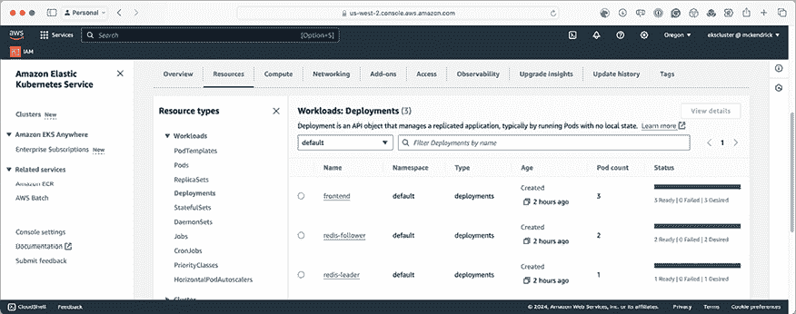

# 16

# 在 Amazon Web Services 上使用 Amazon Elastic Kubernetes Service 启动 Kubernetes 集群

让我们在前一章所学的基础上继续前进。我们在公共云中启动了一个 Kubernetes 集群，迈出了在“前三大”公共云服务提供商中运行 Kubernetes 的第一步。

现在我们已经了解了**Google Cloud Platform**（**GCP**）的 Kubernetes 服务，我们将继续介绍**Amazon Elastic Kubernetes Service**（**EKS**）由**Amazon Web Services**（**AWS**）提供的服务。

在本章中，你将学习如何设置 AWS 账户，并在 macOS、Windows 和 Linux 系统上安装相关工具集，最后启动并与 Amazon EKS 集群进行交互。

在本章中，我们将覆盖以下主题：

+   什么是 Amazon Web Services 和 Amazon Elastic Kubernetes Service？

+   准备你的本地环境

+   启动你的 Amazon Elastic Kubernetes Service 集群

+   部署工作负载并与集群进行交互

+   删除你的 Amazon Elastic Kubernetes Service 集群

# 技术要求

如果你计划跟随本章的内容进行操作，你需要一个附有有效支付方式的 AWS 账户。

按照本章中的说明操作将会产生费用，在使用完毕后，你必须终止你启动的所有资源。本章中列出的所有价格均为本书撰写时的有效价格，我们建议你在启动任何资源之前，查看当前的费用。

# 什么是 Amazon Web Services 和 Amazon Elastic Kubernetes Service？

你可能已经听说过 Amazon Web Services，简称 AWS。它是最早的公共云服务提供商之一，截至撰写本书时（2024 年 6 月），AWS 的市场份额最大，达到了 31%，微软 Azure 以 25% 排名第二，GCP 排名第三，占有 11% 的市场份额。

## Amazon Web Services

正如你可能已经猜到的，Amazon 拥有并运营 AWS。从 2000 年 Amazon 开始通过为零售合作伙伴开发和部署**应用程序编程接口**（**APIs**）来实验云服务，到现在 AWS 已发展成全球领先的云计算平台，服务于各行各业的各种规模的企业。

基于这项工作，Amazon 意识到他们需要构建一个更好、更标准化的基础设施平台，不仅要托管他们正在开发的服务，还要确保在更多零售网点使用这些软件服务并迅速增长时能够快速扩展。

Chris Pinkham 和 Benjamin Black 在 2003 年写了一篇白皮书，2004 年获得 Jeff Bezos 的批准，文中描述了一个可以通过编程方式部署计算和存储资源的基础设施平台。

AWS 首次公开承认其存在是在 2004 年末；然而，当时该术语用于描述一组工具和 API，允许第三方与 Amazon 的零售产品目录进行交互，而非我们今天所知的 AWS。

直到 2006 年，重新品牌化后的 AWS 才正式推出，从 3 月开始推出 **简单存储服务** (**S3**)。此服务允许开发者使用 Web API 写入和提供单个文件，而无需从传统的本地或远程文件系统中写入和读取数据。

下一个推出的服务是 **亚马逊简单队列服务** (**SQS**)，它是原始 AWS 工具集的一部分。这是一个分布式消息系统，开发者可以通过 API 控制和使用它。

最后推出的服务是 2006 年的 **亚马逊弹性计算云** (**Amazon EC2**) 的测试版，仅限现有的 AWS 客户。你仍然可以使用亚马逊开发的 API 启动 Amazon EC2 资源。

这对亚马逊来说是最后一块拼图。现在他们有了一个公共云平台的基础，不仅可以用于他们自己的零售平台，还可以将空间出售给其他公司和公众，比如你我。

让我们从 2006 年的 3 项服务开始，快速前进到 2024 年中期，当时已经有超过 200 项服务可用，所有这些服务都运行在 39 个区域的 125 个物理数据中心中，总面积超过 3800 万平方英尺。

所有 200 多个服务都遵循 2003 年白皮书中提出的核心原则。每个服务都是软件定义的，这意味着开发者只需发出一个简单的 API 请求来启动、配置，并在某些情况下消费该服务，然后再发出另一个 API 请求来终止它。

你可能已经注意到，从目前为止提到的服务来看，在 AWS 中运行的服务通常以亚马逊或 AWS 为前缀——这是为什么呢？因为以 Amazon 开头的服务是独立服务，而以 AWS 为前缀的服务则是设计为与以 Amazon 为前缀的服务一起使用的。

再也没有必要像过去那样去订购一项服务，等待某人构建并部署它，再交给你；这将部署时间从有时需要几周或几个月缩短到几秒钟。

我们不打算讨论所有 200 多项服务，这将需要一整套书籍；我们应该讨论本章将要研究的服务。

## 亚马逊弹性 Kubernetes 服务

虽然 AWS 是主要公有云提供商中第一个推出的，但它是最后一个推出独立 Kubernetes 服务的。亚马逊 EKS 于 2017 年底首次宣布，并于 2018 年 6 月在美国推出，首先在东部（北弗吉尼亚）和西部（俄勒冈）地区提供。

该服务旨在与其他 AWS 服务和功能一起使用并充分利用，例如以下内容：

+   **AWS 身份与访问管理** (**IAM**) 使您能够控制和管理终端用户以及程序化访问其他 AWS 服务的权限。

+   **Amazon Route 53** 是 Amazon 的 **域名系统**（**DNS**）服务。Amazon EKS 可以将其用作集群的 DNS 来源，意味着服务发现和路由可以在您的集群内轻松管理。

+   **Amazon Elastic Block Store**（**EBS**）：如果您需要为在 Amazon EKS 集群中运行的容器提供持久性块存储，**Amazon Elastic Block Store**（**EBS**）提供此存储，就像为您的 EC2 计算资源提供存储一样。

+   **EC2 自动扩展**：如果您的集群需要扩展，将采用相同的技术来扩展您的 EC2 实例。

+   **多可用区**（**AZs**）可以是一个有用的功能。Amazon EKS 管理层和集群节点可以配置为分布在给定区域内的多个 AZ 上，以为您的部署提供 **高可用性**（**HA**）和弹性。

在启动 Amazon EKS 集群之前，我们需要下载、安装并配置一些工具。

# 准备本地环境

我们需要安装两个命令行工具，但在安装之前，我们先快速讨论一下注册 AWS 新账户的步骤。如果您已经有 AWS 账户，请跳过此任务，直接进入 *安装 AWS 命令行界面* 部分。

## 注册 AWS 账户

注册 AWS 账户是一个简单的过程，如下所述：

1.  访问 [`aws.amazon.com/`](https://aws.amazon.com/) 并点击页面右上角的 **创建 AWS 账户** 按钮。

亚马逊为新用户提供了免费套餐。它仅限于某些服务和实例规格，且持续 12 个月。有关 AWS 免费套餐的详细信息，请参见 [`aws.amazon.com/free/`](https://aws.amazon.com/free/)。

1.  填写要求提供电子邮件地址的初始表单。该电子邮件地址将用于账户恢复和一些基本的管理功能。同时，提供您选择的 AWS 账户名称。如果您改变主意，不必担心；注册后可以在账户设置中更改该名称。然后，您需要验证您的电子邮件地址。验证电子邮件地址后，您将被要求为您的“根”账户设置密码。

1.  输入密码后，点击 **继续** 并按照屏幕上的指示操作。共有五个步骤；这些步骤将涉及您通过自动电话确认您的支付信息和身份。

一旦您创建并启用了账户，您将在可以开始使用 AWS 服务时收到通知——大多数情况下，这将是立即开始，但也可能需要长达 48 小时的时间。

现在，我们需要安装将用于启动 Amazon EKS 集群的命令行工具。

## 安装 AWS 命令行界面

接下来的任务是安装 AWS **命令行界面**（**CLI**）。正如我们在上一章 *第十五章*，*Google Kubernetes Engine 上的 Kubernetes 集群* 中所做的那样，我们将针对 Windows、Linux 和 macOS 进行操作，我们将首先查看 macOS 部分。

### 在 macOS 上安装

在 macOS 上使用 Homebrew 安装 AWS CLI 就像运行以下命令一样简单：

```
$ brew install awscli 
```

安装完成后，运行以下命令，它应该会给出版本号：

```
$ aws –version 
```

这将输出 AWS CLI 的版本，以及它所需的一些支持服务，如下图所示：


图 16.1：检查 AWS CLI 版本

安装完成后，你可以继续进行 AWS CLI 配置部分。

### 在 Linux 上安装

虽然每个发行版都有可用的软件包，但在 Linux 上安装 AWS CLI 最简单的方式是下载并运行安装程序。

这些指令假设你已经安装了`curl`和`unzip`软件包。如果没有，请使用你的发行版的包管理器安装它们。例如，在 Ubuntu 上，你需要运行`sudo apt-get install unzip curl`来安装这两个软件包。

要下载并安装 AWS CLI，请运行以下命令：

```
$ curl "https://awscli.amazonaws.com/awscli-exe-linux-x86_64.zip" -o "awscliv2.zip"
$ unzip awscliv2.zip
$ sudo ./aws/install 
```

安装完成后，你应该能够执行`aws --version`命令，你会看到类似于*在 macOS 上安装*部分中的输出，以及我们接下来会看的 Windows 版本。

### 在 Windows 上安装

与 macOS 类似，你也可以使用包管理器安装 AWS CLI。正如*第十五章*《*Google Kubernetes Engine 上的 Kubernetes 集群*》中所提到的，我们将使用 Chocolatey。你需要运行的命令如下所示：

```
$ choco install awscli 
```

使用 Chocolatey 安装后，执行下面的命令将给出类似于我们在 macOS 上看到的输出，操作系统和 Python 版本的变化如下所示：

```
$ aws --version 
```

同样，安装完成后，你可以继续下面的*AWS CLI 配置*部分。

## AWS CLI 配置

一旦你安装了 AWS CLI，并通过运行`aws --version`命令检查它是否正常运行，你必须将本地 CLI 安装与 AWS 账户链接。为此，你需要登录到 AWS 控制台，可以通过[`console.aws.amazon.com/`](http://console.aws.amazon.com/)访问。

登录后，在页面左上方的搜索框中输入**IAM**，它位于**服务**按钮旁边。然后，点击**IAM 身份中心**服务链接，进入**IAM 身份中心**页面。

我们需要创建一个具有编程访问权限的用户；为此，请按照以下步骤操作：

1.  根据你的 AWS 账户的年龄或访问权限，你可能需要启用**IAM 身份中心**。我的 AWS 账户是用于我个人项目的，所以点击**启用**按钮后，我选择了**仅在此 AWS 账户中启用**选项，而不是推荐的**与 AWS Organizations 一起启用**。我之所以这样做，是因为我没有，也不需要在单一组织中管理多个 AWS 账户。请按照屏幕上的指示启用该服务。

1.  一旦启用 **IAM 身份中心** 服务，我们必须创建一个仅限编程访问的用户。为此，请返回屏幕顶部菜单中的搜索框，再次搜索 **IAM**，但这次选择 **IAM**，该选项列为 **管理 AWS 资源访问**。页面加载后，点击左侧菜单中的 **用户**，可以在 **访问管理** 部分找到，然后点击 **创建用户** 按钮。

1.  输入 **ekscluster** 的用户名，并确保不要选择 **为用户提供 AWS 管理控制台访问权限 - 可选** 选项，然后点击 **下一步**。我们将在本章稍后讨论此选项，一旦我们启动了集群。


图 16.2：添加用户

1.  我们不会创建一个新的组，而是将现有策略附加到我们的用户。为此，选择 **直接附加现有策略**，选择 **AdministratorAccess** 策略，然后点击 **下一步**。


图 16.3：分配权限

由于这是在非生产环境的 AWS 账户中进行的测试，而且我们将在本章结束时删除该用户，因此我使用了一个相对宽松的策略。如果你打算将其部署到更接近生产环境的环境中，建议参考 AWS 文档，了解如何设置正确的权限和策略的详细指南。

1.  审核信息后，点击 **创建用户** 按钮。一旦用户创建完成，从列表中选择 **ekscluster** 用户，选择 **安全凭证** 标签，然后在 **访问密钥** 部分点击 **创建访问密钥** 按钮。选择 **命令行界面（CLI）** 并继续创建访问密钥，点击 **下一步** 然后点击 **创建访问密钥** 按钮；密钥创建后，点击 **下载 .csv 文件**，最后点击 **完成** 按钮。

保管好你下载的文件，因为它包含了访问你的 AWS 账户的有效凭证。

返回到终端，然后运行以下命令以创建一个默认的配置文件：

```
$ aws configure 
```

这将要求输入以下几项信息：

+   **AWS 访问密钥标识符**（**ID**）：这是我们从 **逗号分隔值**（**CSV**）文件中获取的访问密钥 ID。

+   **AWS 秘密访问密钥**：这是从 CSV 文件中获取的密钥。

+   **默认区域名称**：我输入了 `us-west-2`。

+   **默认输出格式**：我将其留空。

为了测试一切是否正常工作，你可以运行以下命令：

```
$ aws ec2 describe-regions 
```

这将列出可用的 AWS 区域，输出应该类似于以下内容：


图 16.4：测试 AWS CLI

现在我们已经安装并配置好了 AWS CLI 用于我们的账户，我们需要安装第二个命令行工具，使用它来启动 Amazon EKS 集群。

## 安装 eksctl，这是 Amazon EKS 的官方 CLI

虽然可以使用 AWS CLI 启动 Amazon EKS 集群，但它比较复杂并且有很多步骤。为了解决这个问题，Weaveworks 创建了一个简单的命令行工具，它生成 AWS CloudFormation 模板并启动你的集群。

不幸的是，Weaveworks 在 2024 年初停止了商业运营，但在停止运营之前，他们将该项目的控制权交给了 AWS 团队。

AWS CloudFormation 是 Amazon 的**基础设施即代码**(**IaC**)定义语言。它让你能够定义你的 AWS 资源，以便它们可以在多个账户之间或在同一个账户中反复部署。这在你需要不断创建环境时非常有用，例如，作为**持续集成**(**CI**)构建的一部分。

如你所料，在 macOS 和 Windows 上的安装遵循我们一直在使用的相同模式；macOS 用户可以运行以下命令：

```
$ brew install eksctl 
```

同样地，在 Windows 上，你可以运行：

```
$ choco install eksctl 
```

在 Linux 上安装`eksctl`与其他工具略有不同，命令如下：

```
$ PLATFORM=$(uname -s)_$(uname -m)
$ curl -sLO "https://github.com/eksctl-io/eksctl/releases/latest/download/eksctl_$PLATFORM.tar.gz"
$ tar -xzf eksctl_$PLATFORM.tar.gz -C /tmp && rm eksctl_$PLATFORM.tar.gz
$ sudo mv /tmp/eksctl /usr/local/bin 
```

安装完成后，你应该能够运行下面的命令来获取版本号：

```
$ eksctl version 
```

所以，我们现在已经准备好启动我们的 Amazon EKS 集群。

# 启动你的 Amazon Elastic Kubernetes Service 集群

在安装好所有前提条件后，我们终于可以开始部署我们的 Amazon EKS 集群。一旦部署完成，我们将能够开始与它互动，启动一个工作负载，就像我们在*第十五章*中所做的那样，*在 Google Kubernetes Engine 上部署 Kubernetes 集群*。

为此，我们将使用`eksctl`命令中内置的默认设置，因为这只是一个沙箱 Amazon EKS，我们可以在上面运行一些命令。这将启动一个具有以下属性的 Amazon EKS 集群：

+   在**us-west-1**区域

+   使用两个工作节点，采用**m5.large**实例类型

+   使用官方 AWS EKS **Amazon 机器镜像**(**AMI**)

+   使用**Amazon 的虚拟私有云**(**VPC**)作为其网络服务

+   使用自动生成的随机名称

所以，事不宜迟，让我们通过运行以下命令来启动我们的集群：

```
$ eksctl create cluster 
```

你可以去做点饮料或者处理一下电子邮件，因为这个过程可能需要最多 30 分钟才能完成。如果你不打算部署 Amazon EKS 集群，下面是我运行命令时的输出。

首先，显示一些关于`eksctl`版本的基本信息以及将使用的区域：

```
[i]  eksctl version 0.180.0-dev+763027060.2024-05-29T21:36:10Z
[i]  using region us-west-2 
```

接下来，它将提供一些关于网络和可用区(AZ)的信息，说明它将把资源部署到哪些地方，如下面的代码片段所示：

```
[i]  setting availability zones to [us-west-2d us-west-2b us-west-2c]
[i]  subnets for us-west-2d - public:192.168.0.0/19 private:192.168.96.0/19
[i]  subnets for us-west-2b - public:192.168.32.0/19 private:192.168.128.0/19
[i]  subnets for us-west-2c - public:192.168.64.0/19 private:192.168.160.0/19 
```

它现在将显示将要使用的 AMI 版本的详细信息，以及该镜像所支持的 Kubernetes 版本，如下所示：

```
[i]  nodegroup "ng-11c87ff4" will use "[AmazonLinux2/1.29]"
[i]  using Kubernetes version 1.29 
```

现在它已经知道了所有元素，将要创建一个集群。在这里，你可以看到它开始部署：

```
[i]  creating EKS cluster "hilarious-wardrobe-1717847351" in "us-west-2" region with managed nodes
[i]  will create 2 separate CloudFormation stacks for cluster itself and the initial managed nodegroup
[i]  if you encounter any issues, check CloudFormation console or try 'eksctl utils describe-stacks --region=us-west-2 --cluster=hilarious-wardrobe-1717847351'
[i]  Kubernetes API endpoint access will use default of {publicAccess=true, privateAccess=false} for cluster "hilarious-wardrobe-1717847351" in "us-west-2" 
```

如你所见，它已经将我的集群命名为`hilarious-wardrobe-1717847351`；这个名称将在整个构建过程中被引用。默认情况下，日志记录是禁用的，正如我们在这里所见：

```
[i]  CloudWatch logging will not be enabled for cluster "hilarious-wardrobe-1717847351" in "us-west-2"
[i]  you can enable it with 'eksctl utils update-cluster-logging --enable-types={SPECIFY-YOUR-LOG-TYPES-HERE (e.g. all)} --region=us-west-2 --cluster=hilarious-wardrobe-1717847351' 
```

现在是我们等待的时候，控制平面和集群正在部署：

```
[i]2 sequential tasks: { create cluster control plane "hilarious-wardrobe-1717847351",2 sequential sub-tasks: {wait for control plane to become ready, create managed nodegroup "ng-11c87ff4",}}
[i]  building cluster stack "eksctl-hilarious-wardrobe-1717847351-cluster"
[i]  waiting for CloudFormation stack "eksctl-hilarious-wardrobe-1717847351-cluster"
[i]  building managed nodegroup stack "eksctl-hilarious-wardrobe-1717847351-nodegroup-ng-11c87ff4"
[i]  deploying stack "eksctl-hilarious-wardrobe-1717847351-nodegroup-ng-11c87ff4"
[i]  waiting for CloudFormation stack "eksctl-hilarious-wardrobe-1717847351-nodegroup-ng-11c87ff4"
[i]  waiting for the control plane to become ready 
```

部署后，它将下载集群凭证并配置`kubectl`，如下所示：

```
[✔]  saved kubeconfig as "/Users/russ.mckendrick/.kube/config"
[i]  no tasks
[✔]  all EKS cluster resources for "hilarious-wardrobe-1717847351" have been created 
```

最后的步骤是等待节点变为可用，如此处所示：

```
2024-06-08 13:03:34 [✔]  created 0 nodegroup(s) in cluster "hilarious-wardrobe-1717847351"
2024-06-08 13:03:35 [i]  node "ip-192-168-34-120.us-west-2.compute.internal" is ready
2024-06-08 13:03:35 [i]  node "ip-192-168-67-233.us-west-2.compute.internal" is ready
2024-06-08 13:03:35 [i]  waiting for at least 2 node(s) to become ready in "ng-11c87ff4"
2024-06-08 13:03:35 [i]  nodegroup "ng-11c87ff4" has 2 node(s)
2024-06-08 13:03:35 [i]  node "ip-192-168-34-120.us-west-2.compute.internal" is ready
2024-06-08 13:03:35 [i]  node "ip-192-168-67-233.us-west-2.compute.internal" is ready
2024-06-08 13:03:35 [✔]  created 1 managed nodegroup(s) in cluster "hilarious-wardrobe-1717847351" 
```

现在我们已经让两个节点在线并准备就绪，是时候显示一条消息来确认一切已准备好，如下所示：

```
2024-06-08 13:03:36 [i]  kubectl command should work with "/Users/russ.mckendrick/.kube/config", try 'kubectl get nodes'
2024-06-08 13:03:36 [✔]  EKS cluster "hilarious-wardrobe-1717847351" in "us-west-2" region is ready 
```

现在集群已经准备好，让我们按照输出提示，运行`kubectl get nodes`。如预期所示，这将为我们提供组成集群的两个节点的详细信息，如下图所示：


图 16.5：查看两个 Amazon EKS 集群节点

现在我们的集群已经启动并运行，让我们部署与之前在**Google Kubernetes Engine**（**GKE**）集群中启动时相同的工作负载。

# 部署工作负载并与集群进行交互

在*第十五章*，*Google Kubernetes Engine 上的 Kubernetes 集群*中，我们使用了来自 GCP GKE 示例 GitHub 仓库的 Guestbook 示例。在这一部分，我们首先将部署工作负载，然后再探索基于 Web 的 AWS 控制台。所以现在让我们开始部署 Guestbook。

## 部署工作负载

即使我们的集群运行在 AWS 中，使用 Amazon EKS，我们仍然会使用之前在 GKE 中启动工作负载时所使用的相同 YAML 文件，并通过本地的`kubectl`进行操作；为此，请按照以下步骤操作：

1.  如之前所述，我们的第一步是通过运行以下两条命令来启动 Redis 主节点的部署和服务：

    ```
    $ kubectl apply -f https://raw.githubusercontent.com/GoogleCloudPlatform/kubernetes-engine-samples/main/quickstarts/guestbook/redis-leader-deployment.yaml
    $ kubectl apply -f https://raw.githubusercontent.com/GoogleCloudPlatform/kubernetes-engine-samples/main/quickstarts/guestbook/redis-leader-service.yaml 
    ```

1.  一旦 Redis 主节点部署完成，我们需要按以下步骤启动 Redis 从节点的部署和服务：

    ```
    $ kubectl apply -f https://raw.githubusercontent.com/GoogleCloudPlatform/kubernetes-engine-samples/main/quickstarts/guestbook/redis-follower-deployment.yaml
    $ kubectl apply -f https://raw.githubusercontent.com/GoogleCloudPlatform/kubernetes-engine-samples/main/quickstarts/guestbook/redis-follower-service.yaml 
    ```

1.  一旦 Redis 主节点和从节点启动并运行，就该使用以下命令启动前端部署和服务：

    ```
    $ kubectl apply -f https://raw.githubusercontent.com/GoogleCloudPlatform/kubernetes-engine-samples/main/quickstarts/guestbook/frontend-deployment.yaml
    $ kubectl apply -f https://raw.githubusercontent.com/GoogleCloudPlatform/kubernetes-engine-samples/main/quickstarts/guestbook/frontend-service.yaml 
    ```

1.  几分钟后，我们将能够运行以下命令以获取有关我们刚刚启动的服务的信息，其中应该包括访问工作负载的相关细节：

    ```
    $ kubectl get service frontend 
    ```

你会注意到，这次输出与我们在 GKE 上运行工作负载时得到的输出略有不同，如下图所示：


图 16.6：获取前端服务信息

如你所见，我们得到的不是**互联网协议**（**IP**）地址，而是**统一资源定位符**（**URL**）。将其复制到浏览器中。

一旦你打开了网址，鉴于我们使用了相同的命令和工作负载配置，你不会对看到**Guestbook**应用感到惊讶，如下图所示：

。登录后，选择屏幕右上角用户名旁边的**美国西部（俄勒冈）us-west-2**区域。

![计算机截图描述自动生成图 16.8：选择正确的区域选择正确的区域后，在右上角的搜索栏中搜索**弹性 Kubernetes 服务**，并选择该服务，它应该是第一个结果，进入俄勒冈区域的 EKS 页面。![计算机截图描述自动生成图 16.9：我们首次查看 AWS 控制台中的 EKS 集群到目前为止，一切顺利；好了，我们稍后会谈到它——点击你的集群名称，你将看到类似以下页面的内容：![计算机截图描述自动生成图 16.10：访问被拒绝！那么，让我们来分析一下这里发生了什么。你可能会想，*“这是我的主用户，肯定拥有完全访问权限吧？”*这么做是有原因的；当`eksctl`启动我们的集群时，它授予了我们之前创建的**ekscluster**用户权限，以便使用 AWS 服务与集群进行交互，因为我们已配置 AWS CLI 使用该用户连接，而不是我们当前登录的主用户。这意味着要在 AWS 控制台中查看工作负载等内容，我们需要以之前创建的用户身份登录。为此，返回到 AWS 控制台中的 IAM，进入**用户**页面，选择**ekscluster**用户；然后转到**安全凭证**标签页，点击**启用控制台访问**按钮：![计算机截图描述自动生成图 16.11：为 ekscluster 用户启用控制台访问选择**自动生成的密码**选项并启用访问；最后，像之前一样下载包含凭证的 CSV 文件。下载完成后，退出 AWS 控制台并打开你下载的 CSV 文件。进入控制台登录网址。这是一个允许 IAM 用户（如我们创建的用户）登录到你账户的 URL；使用 CSV 文件中的用户名和密码。登录后，返回 EKS 页面并选择你的集群；这次你将不再看到权限相关的警告。当你首次打开集群时，你将看到几个标签页。它们是：+   **概述**：显示各种集群详细信息，例如运行的 Kubernetes 版本、端点信息、集群状态、创建时间和日期等+   **资源**：提供有关节点、Pods、命名空间和工作负载的信息+   **计算**：显示节点信息、节点组以及与集群关联的任何 Fargate 配置文件的详细信息+   **网络**：详细说明 VPC 配置+   **附加组件**：列出已安装和可用的集群附加组件+   **访问**：显示 IAM 角色、AWS 认证 ConfigMap 和 Kubernetes RBAC 角色绑定+   **可观察性**：配置并显示日志、监控和最近的事件+   **升级洞察**：列出可用的 Kubernetes 版本升级和兼容性检查+   **更新历史**：提供集群和节点组更新的历史记录+   **标签**：列出并管理与 EKS 集群相关的标签下面，你可以看到有关节点的详细信息：

图 16.12：在计算选项卡中查看集群中的两个节点

点击**资源**，选择**部署**，并过滤到**default**工作区，将显示我们启动的工作负载：



图 16.13：查看我们的工作负载

点击其中一个部署将为你提供有关该部署的更多信息——包括 Pods、配置等详细信息。然而，当你四处点击时，你会发现实际上你只能查看有关服务的信息；没有图表、日志输出或任何提供比基本概述更多信息的内容。这是因为 AWS 控制台主要只是暴露 Kubernetes 本身的信息。

从 EKS 服务页面移开，进入 AWS 控制台的 EC2 服务部分，将显示两个节点，如下图所示：


图 16.14：查看原始 EC2 计算资源

在这里，你可以深入了解实例的更多信息，包括 CPU、RAM 和网络利用率；不过，这仅适用于实例本身，而不是我们的 Kubernetes 工作负载。

从左侧菜单的**负载均衡**部分选择**负载均衡器**，将显示我们在应用前端服务时启动和配置的弹性负载均衡器，如下图所示：


图 16.15：查看原始负载均衡器资源

我们使用的最后一个 AWS 服务是 AWS CloudFormation，因此在服务菜单中输入**CloudFormation**并点击链接将带你进入 CloudFormation 服务页面。

在这里，你将看到两个堆栈：一个是 EKS 节点，即我们的两个 EC2 实例，另一个是 EKS 集群，即我们的 Kubernetes 管理平面。这些堆栈在以下截图中有所展示：


图 16.16：构成我们集群的两个堆栈

选择其中一个堆栈将给出堆栈启动时发生的详细信息。它将列出在使用 `eksctl` 启动 Amazon EKS 集群时创建的所有资源。

你选择一个模板，然后在设计器中查看它；你甚至可以看到 `eksctl` 生成的 CloudFormation 模板，这是一个相当复杂的 JSON 文件——如果你点击 **在应用程序作曲器中查看** 按钮，你将能够获得堆栈的更易于理解的可视化表示。以下是此视图的截图：


图 16.17：在应用程序作曲器中查看 CloudFormation 模板

这就是我们在 AWS 控制台中能看到的所有内容。正如我们所看到的，虽然使用 `eksctl` 启动 Amazon EKS 相对简单，但与我们在上一章中启动的 GKE 集群相比，它与 AWS 控制台的集成程度可以做得更好。

虽然我们能够浏览并查看我们的工作负载，但我们无法进行过多交互；此外，集群的反馈也仅限于 Amazon EC2 服务提供的基本监控。

一旦你完成了对 Amazon EKS 集群的使用，你可以删除它。

# 删除你的 Amazon Elastic Kubernetes Service 集群

你可以通过运行以下命令删除你的集群，确保将集群名称替换为你自己的名称：

```
$ eksctl delete cluster --name hilarious-wardrobe-1717847351 
```

删除集群所需的时间比启动时更少；实际上，删除过程大约需要 5 分钟。

如前所述，`eksctl` 会在删除资源时提供其操作的详细信息：

```
[i]  deleting EKS cluster "hilarious-wardrobe-1717847351"
[i]  will drain 0 unmanaged nodegroup(s) in cluster "hilarious-wardrobe-1717847351"
[i]  starting parallel draining, max in-flight of 1
[i]  deleted 0 Fargate profile(s) 
```

第一个更新的是本地 kubectl 配置，如下所示：

```
[✔]  kubeconfig has been updated 
```

然后，任何作为将工作负载部署到我们集群的一部分而启动的资源都会被终止：

```
[i]  cleaning up AWS load balancers created by Kubernetes objects of Kind Service or Ingress 
```

然后，两个 AWS CloudFormation 堆栈被移除，从而移除了它们创建和配置的所有资源，如以下代码片段所示：

```
[i]  2 sequential tasks: { delete nodegroup "ng-11c87ff4", delete cluster control plane "hilarious-wardrobe-1717847351" [async] }
[i]  will delete stack "eksctl-hilarious-wardrobe-1717847351-nodegroup-ng-11c87ff4"
[i]  waiting for stack "eksctl-hilarious-wardrobe-1717847351-nodegroup-ng-11c87ff4" to get deleted
[i]  waiting for CloudFormation stack "eksctl-hilarious-wardrobe-1717847351-nodegroup-ng-11c87ff4"
[i]  will delete stack "eksctl-hilarious-wardrobe-1717847351-cluster"
[✔]  all cluster resources were deleted 
```

此时，我们的集群已完全删除。

请再次检查 AWS 控制台中的 EC2、EKS 和 CloudFormation 部分，确保所有服务已被正确删除，因为如果有任何孤立或闲置的资源留下，你将会被收费。虽然这种情况不太可能发生，但最好现在核对一下，而不是在月底收到意外的账单。

那么，我们的 Amazon EKS 集群运行一个月的费用大概是多少？

我们需要考虑两类费用：

+   第一个费用是针对 Amazon EKS 集群本身。每创建一个 Amazon EKS 集群，费用为每小时 0.10 美元（USD）；然而，每个 Amazon EKS 集群可以运行多个节点组，因此你不需要在每个区域启动多个集群。这意味着 Amazon EKS 集群的费用大约为每月 73 美元。

+   下一项考虑因素是集群使用的 AWS 资源，例如，在我们的案例中，EC2 集群节点的费用大约为每个 70 美元，运行我们集群一个月的总费用大约为 213 美元。我说的是大约，因为还会有带宽费用和 AWS **Elastic Load Balancing**（**ELB**）服务的费用，这将进一步增加我们的工作负载成本。

价格概览页面的链接可以在本章末尾的*进一步阅读*部分找到。

# 总结

在本章中，我们讨论了 AWS 和 Amazon EKS 的起源，然后介绍了如何注册账户，以及如何安装和配置两个命令行工具，便于轻松启动 Amazon EKS 集群。

一旦我们的集群启动并运行，我们就部署了与启动 GKE 集群时相同的工作负载。我们无需针对不同云提供商上的工作负载做出任何调整——它直接就能运行，甚至在我们没有指示的情况下，使用 AWS 原生的负载均衡服务部署了负载均衡器。

然而，我们确实发现，与我们之前查看的 Google 服务相比，Amazon EKS 与 AWS 控制台的集成程度较低。我们还了解到，由于使用 AWS CLI 启动集群的复杂性，我们不得不安装第二个命令行工具以便轻松启动集群。假设 Amazon VPC 配置和 IAM 角色已创建并部署，这大约需要八个步骤。

与其他提供商相比，缺乏集成以及启动和维护集群的复杂性让我不太愿意在 Amazon EKS 上运行 Kubernetes 工作负载——这一切感觉有些支离破碎，不如 Google 的服务流畅。

在下一章中，我们将讨论在 Microsoft Azure 上启动**Azure Kubernetes Service**（**AKS**）集群，这是我们将要介绍的三大公共提供商中的最后一个。

# 进一步阅读

以下是我们在本章中涉及的一些话题和工具的更多信息链接：

+   AWS: [`aws.amazon.com/`](https://aws.amazon.com/)

)

+   Amazon EKS: [`aws.amazon.com/eks/`](https://aws.amazon.com/eks/)

)

+   AWS CLI: [`aws.amazon.com/cli/`](https://aws.amazon.com/cli/)

)

+   eksctl: [`eksctl.io/`](https://eksctl.io/)

)

+   eksctl 支持状态更新: [`github.com/aws/containers-roadmap/issues/2280`](https://github.com/aws/containers-roadmap/issues/2280)

)

+   官方文档: [`docs.aws.amazon.com/eks/latest/userguide/what-is-eks.html`](https://docs.aws.amazon.com/eks/latest/userguide/what-is-eks.html)

)

+   Amazon EKS 定价: [`aws.amazon.com/eks/pricing/`](https://aws.amazon.com/eks/pricing/)

)

# 加入我们的 Discord 社区

加入我们社区的 Discord 空间，与作者和其他读者进行讨论：

[`packt.link/cloudanddevops`](https://packt.link/cloudanddevops)


