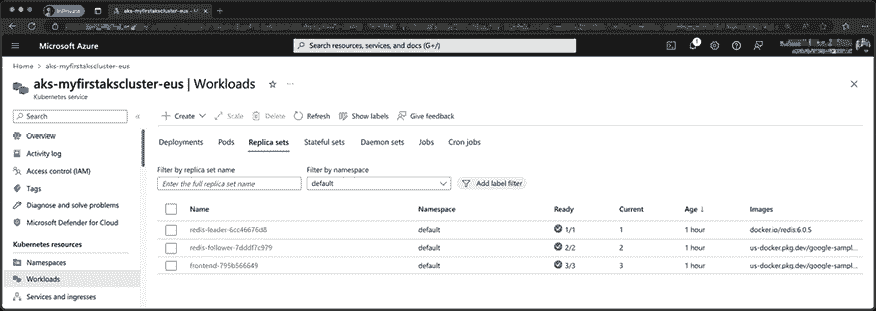

# 第十七章：在 Microsoft Azure 上使用 Azure Kubernetes 服务的 Kubernetes 集群

我们将要研究的最后一个公有云 Kubernetes 服务是 **Azure Kubernetes 服务** (**AKS**)，它托管在 Microsoft Azure 中，是“三大”公有云提供商之一 —— 另外两个我们已经在*第十五章*《Google Kubernetes Engine 上的 Kubernetes 集群》和*第十六章*《在 Amazon Web Services 上使用 Amazon Elastic Kubernetes 服务启动 Kubernetes 集群》中介绍过了。

在本章结束时，您将配置好本地环境，具备与 Microsoft Azure 账户交互并启动 AKS 集群所需的工具。

部署集群后，我们将启动与前几章相同的工作负载，并探索您的 AKS 集群与 Microsoft Azure 门户之间的集成水平。

最后，在本章结束时，我们将讨论我们在本章和前两章中介绍的三个服务，以及我推荐的服务。

为此，我们将涵盖以下主题：

+   什么是 Microsoft Azure 和 Azure Kubernetes 服务？

+   准备您的本地环境

+   启动您的 Azure Kubernetes 服务集群

+   部署工作负载并与集群交互

+   删除您的 Azure Kubernetes 服务集群

# 技术要求

如果您打算跟随本章中涵盖的示例操作，您需要一个有效支付方式关联的 Microsoft Azure 账户。

跟随本章中的示例操作将产生费用，因此完成操作后，终止您启动的所有资源以避免不必要的支出是非常重要的。本章中所列价格在印刷时是准确的，我们建议您在启动任何资源之前先查看当前费用。

# 什么是 Microsoft Azure 和 Azure Kubernetes 服务？

在我们开始安装支持工具之前，让我们快速讨论一下我们将要了解的服务的起源，从 Microsoft Azure 开始。

## Microsoft Azure

2008 年，微软正式宣布推出名为 Windows Azure 的新服务。

这个服务是一个名为 Project Red Dog 的项目的一部分，该项目自 2004 年以来一直在开发，旨在利用核心的 Windows 组件提供数据中心服务。

微软在 2008 年开发者大会上宣布的五个核心组件如下：

+   **Microsoft SQL Data Services**：这是微软 SQL 数据库服务的云版本，作为 **平台即服务** (**PaaS**) 运行，旨在消除托管 SQL 服务的复杂性。

+   **Microsoft .NET Services**：另一个 PaaS 服务，允许开发者将他们基于 .NET 的应用程序部署到 Microsoft 管理的 .NET 运行时中。

+   **Microsoft SharePoint**：流行的内部网产品的 **软件即服务** (**SaaS**) 版本。

+   **Microsoft Dynamics**：微软 CRM 产品的 SaaS 版本。

+   **Windows Azure**：一种**基础设施即服务**（**IaaS**）产品，像其他云服务提供商一样，允许用户启动虚拟机、存储以及支持计算工作负载所需的网络服务。

所有这些服务都是建立在 Red Dog 操作系统之上的，该操作系统为项目命名。这是一个专门版的 Windows 操作系统，内置了云层。

2014 年，Windows Azure 更名为 Microsoft Azure，体现了提供云服务的底层操作系统名称，同时也表明 Azure 运行着许多基于 Linux 的工作负载。作为这一宣布的一部分，新任微软 CEO 萨蒂亚·纳德拉展示了那张现在**著名**（或**臭名昭著**，取决于你的视角）“微软爱 Linux”幻灯片，幻灯片上用心形表情符号代表“爱”字。

我之所以说“著名”和“臭名昭著”，是因为前微软首席执行官史蒂夫·巴尔默曾引用过以下的话：

> “Linux 是一种癌症，它在知识产权意义上附着于它所接触到的所有事物。”

因此，这被视为一次重大转变，令许多人感到意外。

2020 年，公开数据显示超过 50%的虚拟机核心正在运行 Linux 工作负载，60%的 Azure Marketplace 镜像现在基于 Linux。这主要归因于微软对 Linux 和开源项目（如 Kubernetes）的拥抱，这也使我们走向了他们的本地 Kubernetes 服务。

## Azure Kubernetes 服务

最初，微软推出了一种名为**Azure Container Service**（**ACS**）的基于容器的服务。它允许用户部署容器工作负载，并选择由三种不同的编排工具之一来支持这些工作负载：Docker Swarm、DC/OS 或 Kubernetes。所有这些都提供了基于容器的集群解决方案。

很快，Kubernetes 显现出比另外两个编排工具更受欢迎，因此 ACS 逐渐被 AKS 取代。AKS 是一个符合 CNCF 标准、完全基于 Kubernetes 的服务。这一过渡大约花费了两年时间，AKS 在 2018 年开始全面发布，而 ACS 则在 2020 年初退休。

AKS 服务与 Azure Active Directory、策略以及其他关键的 Microsoft Azure 服务紧密集成。除了 AKS，微软还提供了其他容器服务；最新的是 Azure 容器应用。

Azure Container Apps 是一个无服务器平台，运行容器化应用程序，用户无需管理基础设施，提供如基于流量、事件、CPU 或内存负载的动态扩展、HTTPS 或 TCP 入口、Dapr 集成和自动扩展等功能。它允许使用各种 Azure 原生工具进行管理、安全秘密处理、内部服务发现以及部署策略的流量拆分。应用程序可以从任何注册表中运行容器，并与其他 Azure 服务集成。令人困惑的是，你也可以选择在 Azure 应用服务中启动基于容器的工作负载。

然而，与其讨论 Microsoft Azure 中可以用来运行基于容器的工作负载的所有服务，我发现亲自动手操作某个服务更为简便，因此不再拖延，接下来我们来看如何安装启动和管理 AKS 集群所需的工具。

# 准备您的本地环境

在启动集群之前，您需要完成一些任务。首先，您需要一个地方来启动集群，因此如果您还没有账户，您需要注册一个 Azure 账户。

## 创建一个免费的 Microsoft Azure 账户

如果您还没有账户，请访问 [`azure.microsoft.com/free/`](https://azure.microsoft.com/free/)，在此您可以注册一个免费账户：


图 17.1：查看您可以免费获得的 Microsoft Azure 服务

在撰写本文时，您的免费账户包括 12 个月的热门服务、$200 的信用额度，可用于探索和测试不同的 Azure 服务，并且可以访问超过 55 种始终免费的服务。

点击**开始免费**按钮，并按照屏幕上的指示操作。注册过程大约需要 15 分钟，您需要提供有效的信用卡或借记卡信息以完成注册并获得免费账户。

一旦您能够访问您的账户，下一步就是安装 Azure CLI。

## Azure CLI

Microsoft 提供了一个功能强大的跨平台命令行工具，用于管理您的 Microsoft Azure 资源。无论是在 macOS、Linux 还是 Windows 上安装它，都非常简单。

### 在 macOS 上安装

如果您已经跟随前两章的内容，您可能已经猜到我们将在 macOS 上使用 Homebrew 来安装 Azure CLI。

为此，运行以下命令：

```
$ brew install azure-cli 
```

安装完 Azure CLI 后，运行以下命令：

```
$ az --version 
```

这应该会返回类似以下截图的内容：


图 17.2：在 macOS 上检查 Azure CLI 版本

一旦安装了 Azure CLI，您可以继续查看*配置 Azure CLI*部分。

### 在 Linux 上安装

Microsoft 提供了一个覆盖大多数常见 Linux 发行版的安装脚本。要运行此脚本，请使用以下命令：

```
$ curl -L https://aka.ms/InstallAzureCli | bash 
```

这将下载、安装并配置运行 Azure CLI 所需的一切，适用于您选择的 Linux 发行版。安装完成后，您需要重启会话。

您可以通过注销然后重新登录，或者在某些发行版上运行以下命令来做到这一点：

```
$ source ~/.profile 
```

一旦您重启了会话，运行以下命令：

```
$ az --version 
```

这将返回几乎与我们在安装 CLI 时在 macOS 上所看到的输出完全相同，唯一的区别是操作系统的信息。安装完成 Azure CLI 后，继续进行*配置 Azure CLI*部分。

### 在 Windows 上安装

您可以通过几种方式在 Windows 机器上安装 Azure CLI。第一种选择是从[`aka.ms/installazurecliwindows`](https://aka.ms/installazurecliwindows)下载安装程序副本，然后通过双击安装程序来运行它。

下一个选项是使用以下 PowerShell 命令，它将从前面的 URL 下载安装程序并安装：

```
$ProgressPreference = 'SilentlyContinue'; Invoke-WebRequest -Uri https://aka.ms/installazurecliwindows -OutFile .\AzureCLI.msi; Start-Process msiexec.exe -Wait -ArgumentList '/I AzureCLI.msi /quiet'; Remove-Item .\AzureCLI.msi 
```

第三个选项是使用**Chocolatey**包管理器，运行以下命令：

```
$ choco install azure-cli 
```

无论您选择哪种方式安装包，安装完成后，运行以下命令以查看版本号：

```
$ az --version 
```

如您所料，这也将显示与我们在 macOS 上运行命令时所看到的类似的输出。现在我们已经安装了 Azure CLI，可以开始配置它。

### 配置 Azure CLI

配置 Azure CLI 是一个直接的过程；您需要运行以下命令：

```
$ az login 
```

这将打开您的默认浏览器，要求您登录。一旦登录，Azure CLI 将配置为使用您登录的账户。

如果您遇到问题或正在进行仅命令行的 Azure CLI 安装（例如在远程 Linux 服务器上），则运行以下命令将提供一个 URL 和唯一的登录代码供您使用：

```
$ az login --use-device-code 
```

登录后，您的命令行会话应返回一些有关您 Azure 账户的信息。您可以使用以下命令再次查看这些信息：

```
$ az account show 
```

如果您由于任何原因无法在本地安装 Azure CLI，您也不会失去任何东西，因为 Azure 门户中有一个基于 Web 的终端，您可以使用它。接下来我们将介绍这个内容。

### 访问 Azure Cloud Shell

要访问 Azure Cloud Shell，请打开[`portal.azure.com/`](https://portal.azure.com/)并使用您的凭据登录。一旦登录，点击页面顶部菜单栏中的 Cloud Shell 图标，它是位于中央搜索框旁边的第一个图标。

启动 Cloud Shell 时，您可以选择挂载存储。考虑到我们将使用 `kubectl`，希望我们的配置能够持久化，因此请选择**挂载存储账户**选项并选择您的订阅，如以下截图所示：


图 17.4：你希望如何创建存储帐户？

大约一分钟后，**Cloud Shell** 应该会打开，你将看到一个命令提示符：


图 17.5：已登录并准备使用

现在你有了命令提示符，运行下面的命令，就像我们在本地 Azure CLI 安装中所做的一样，可以获取已安装的 Azure CLI 版本信息：

```
$ az --version 
```

由于 Azure 门户在后台为你处理了此操作，因此你无需运行`az login`命令，当你的**Cloud Shell**实例启动时，它已经为你完成了登录。

现在你已经可以访问配置好的 Azure CLI，我们可以以某种方式启动我们的 AKS 集群。

# 启动你的 Azure Kubernetes 服务集群

在所有先决条件都准备就绪之后，我们现在可以启动我们的 AKS 集群了。为此，我们只需运行两个命令。

第一个命令创建了一个 Azure 资源组：

```
$ az group create --name rg-myfirstakscluster-eus --location eastus -o table 
```

在上述命令中，我们在`eastus`区域创建了一个名为`rg-myfirstakscluster-eus`的资源组，并将输出格式设置为表格，而不是默认的 JSON 格式，这是 Azure CLI 的默认输出类型。

**资源组**是一个逻辑容器，用于将相关的 Azure 资源进行分组。在资源组内启动的服务可以继承角色基础访问控制、锁定以及资源启动的区域等设置。

一旦资源组创建完成，你应该会看到类似下方格式化为表格的确认信息：


图 17.6：创建资源组

既然我们有了资源组作为容器来存储我们的资源，我们可以通过运行下面的命令来启动 AKS 集群。正如你所看到的，它引用了我们刚刚创建的资源组：

```
$ az aks create --resource-group rg-myfirstakscluster-eus --name aks-myfirstakscluster-eus --node-count 2 --enable-addons monitoring --generate-ssh-keys -o yaml 
```

启动和配置集群大约需要五分钟，因此在部署过程中，我将介绍我们传递给前面`az aks create`命令的选项：

+   `--resource-group`：正如你所猜测的，这是你希望启动 AKS 集群的资源组。集群将继承资源组的位置。在我们的示例中，我们使用的是前面创建的`rg-myfirstakscluster-eus`资源组，集群将在`eastus`区域创建。

+   `--name`：此参数传递你要启动的集群的名称。我们将它命名为`aks-myfirstakscluster-eus`。

+   `--node-count`：在这里，你设置想要启动的节点数量。我们将启动两个节点。在写作时，节点的默认实例类型为 Standard_DS2_v2，这意味着每个节点将拥有 2 个 vCPU 和 7 GB 的 RAM。

+   `--enable-addons`：此标志用于提供要在集群启动时启用的附加组件列表—我们仅启用监控附加组件。

+   `--generate-ssh-keys`：这将为集群生成 SSH 公钥和私钥文件。

+   `-o`：正如我们在讨论之前的命令时提到的，这个选项决定了命令的输出格式。这次我们将输出 YAML 格式的结果，因为这种格式比 JSON 和表格选项更易读。

一旦你的集群启动成功，你应该看到类似以下的输出：


图 17.7：查看集群启动输出

如你所见，有很多信息。不过我们不必担心这些，因为我们将使用 Azure CLI 和门户与集群交互，而不是手动构造 API 请求来访问 Azure 资源管理器 API。

现在我们的集群已经启动并运行，部署示例工作负载之前，最后需要做的是配置本地 `kubectl` 客户端与集群进行交互。

要执行此操作，请运行以下命令：

```
$ az aks get-credentials --resource-group rg-myfirstakscluster-eus --name aks-myfirstakscluster-eus 
```

执行此命令后，你应该能看到类似以下的内容：


图 17.8：下载集群凭证并配置 kubectl

随着集群的启动和本地 `kubectl` 的配置，我们现在可以开始向集群发出命令。如果你已经阅读过前两章，你会知道该命令是：

```
$ kubectl get nodes 
```

这将返回集群中的节点，如下图所示：


图 17.9：检查节点是否已启动并运行

我们现在可以启动之前两个章节中使用的示例 Guestbook 工作负载来测试我们的集群。

# 部署工作负载并与集群交互

我们将使用在*第十五章*，*Google Kubernetes Engine 上的 Kubernetes 集群*，以及*第十六章*，*使用 Amazon Elastic Kubernetes Service 在 Amazon Web Services 上启动 Kubernetes 集群*中启动的相同工作负载，因此我在这里不会详细介绍，除了覆盖命令部分。

## 启动工作负载

我们从 Redis 主节点部署和服务开始：

```
$ kubectl apply -f https://raw.githubusercontent.com/GoogleCloudPlatform/kubernetes-engine-samples/main/quickstarts/guestbook/redis-leader-deployment.yaml
$ kubectl apply -f https://raw.githubusercontent.com/GoogleCloudPlatform/kubernetes-engine-samples/main/quickstarts/guestbook/redis-leader-service.yaml 
```

接下来是 Redis 从节点：

```
$ kubectl apply -f https://raw.githubusercontent.com/GoogleCloudPlatform/kubernetes-engine-samples/main/quickstarts/guestbook/redis-follower-deployment.yaml
$ kubectl apply -f https://raw.githubusercontent.com/GoogleCloudPlatform/kubernetes-engine-samples/main/quickstarts/guestbook/redis-follower-service.yaml 
```

最后，我们可以使用以下命令启动前端部署和服务：

```
$ kubectl apply -f https://raw.githubusercontent.com/GoogleCloudPlatform/kubernetes-engine-samples/main/quickstarts/guestbook/frontend-deployment.yaml
$ kubectl apply -f https://raw.githubusercontent.com/GoogleCloudPlatform/kubernetes-engine-samples/main/quickstarts/guestbook/frontend-service.yaml 
```

然后，过几分钟后，我们将能够运行以下命令来获取前端服务的信息：

```
$ kubectl get service frontend 
```

和之前一样，我们已经部署了示例工作负载。这将为我们提供一个公共 IP 地址，供我们访问 Guestbook 应用程序：


图 17.10：获取前端服务的信息

将 IP 地址输入浏览器，并确保使用`http://<ipaddress>`，因为我们没有配置 SSL 证书，浏览器会显示 Guestbook 应用程序：


图 17.11：查看 Guestbook 应用程序

工作负载运行后，我们可以进入 Azure 门户。

## 探索 Azure 门户

如果你还没有登录，访问[`portal.azure.com/`](https://portal.azure.com/)并登录 Azure 门户。一旦登录，开始在页面顶部的“搜索资源、服务和文档”框中输入**Kubernetes**。

在服务列表中，你会看到**Kubernetes 服务**。点击这个服务，你将看到你用户有权限访问的订阅下运行的 Kubernetes 服务列表。


图 17.12：列出 Kubernetes 服务

点击`aks-myfirstakscluster-eus`将带你进入概览页面。这将是我们查看工作负载和集群信息的起点。


图 17.13：集群概览页面

在 Kubernetes 资源菜单左侧，你将看到几个选项。让我们逐一处理这些选项。

### 命名空间（Kubernetes 资源）

在这里，你可以找到集群中所有活动的命名空间。由于我们在启动工作负载时没有定义自定义命名空间，我们的部署和服务将列在`default`命名空间下。

除了`default`命名空间外，还有作为集群一部分部署的命名空间：`kube-node-lease`、`kube-public`和`kube-system`。我建议不要修改这些。

点击默认命名空间后，你将看到**概览**页面。在这里，你可以编辑定义命名空间的 YAML，查看事件日志，并配置可能已部署的服务网格；在我们的测试中，没有服务网格。

### 工作负载（Kubernetes 资源）

正如你可能已经猜到的，你可以在这里查看你的工作负载信息。在下面的截图中，我只筛选出显示`default`命名空间中的工作负载：


图 17.14：查看工作负载

点击其中一个部署将带你进入更详细的部署视图。例如，选择**frontend**部署显示如下内容：


图 17.15：深入查看部署

从左侧菜单可以看出，选项中有一些新增项：除了**YAML**和**事件**，现在我们还可以查看**Insights**。我们将在本节末尾更详细地讲解 Insights。

下一个选项是**实时日志**。在这里，你可以选择一个 pod 并实时流式传输日志：


图 17.16：实时查看 pod 日志

返回到 **Workloads** 屏幕并选择 **Pods** 标签，将显示构成您工作负载的 Pod 列表。列出了 IP 地址以及 Pod 所在的节点。这对于快速了解您正在运行的 Pod 很有帮助。


图 17.17：列出所有正在运行的 Pod

点击其中一个 Pod 将为您提供概览，并显示 Pod 的 YAML 和任何事件。

工作负载屏幕上的下一个标签是 **Replica sets**，它提供了一种方便的方式来一目了然地查看作为工作负载一部分部署的副本集。同样，点击列出的副本集会提供我们之前在其他标签中看到的 **概览**、**YAML** 和 **事件** 选项。



图 17.18：列出所有副本集

**Workloads** 中的下一个标签是 **Stateful sets**；我们在命名空间中没有任何有状态集，Microsoft 在其他命名空间中也没有，因此这里没有什么可以查看的。不过，如果有，选择它后，您将看到与在 **Workloads** 部分其他标签中看到的信息相同。

接下来，我们有 **Daemon sets** 标签。再次强调，我们的工作区没有守护进程集，但是有一些是由 Microsoft 作为集群的一部分启动的，您可以进行查看。

最后，我们有最后两个标签，**Jobs** 和 **Cron jobs**；在这里，您将找到您在集群中部署的任何作业和定时任务的详细信息。

### 服务和入口（Kubernetes 资源）

在这里，您可以找到在集群中部署的所有服务的列表。从以下截图中可以看到，您可以查看为服务使用的集群 IP 以及您配置的任何外部 IP：


图 17.19：查看服务

点击列出的其中一个服务将提供熟悉的视图，并允许您深入配置服务。

### 存储（Kubernetes 资源）

如果我们在集群中配置了任何持久存储，您可以在这里查看详细信息并进行管理；在我们的示例工作负载中，我们没有，因此几乎没有内容可查看。

### 配置（Kubernetes 资源）

在这里，您可以查看和编辑您在集群中配置的任何 ConfigMap 或 Secret。由于我们在工作负载中没有配置这些，所列出的项目是集群本身的，因此不建议对现有项目进行更改。

### 自定义资源（Kubernetes 资源）

在这里，您可以管理附加到集群的任何自定义资源。

### 事件（Kubernetes 资源）

这里是集群的所有实时事件；这些事件有助于您监控和排查集群和应用工作负载中的任何健康问题。

### 运行命令（Kubernetes 资源）

这是一个有用的补充；在这里，你可以直接从 Azure 门户运行任何 `kubectl` 命令，无需启动云终端或配置本地的 `kubectl`：


描述自动生成](img/B22019_17_20.png)

图 17.20：从门户运行命令以对集群进行操作

继续进入菜单的 **设置** 部分，我们有以下内容。

### 节点池（设置）

在这里，你可以找到有关节点池的详细信息，并可以升级节点池中运行的 Kubernetes 版本。此选项只有在升级控制平面上运行的 Kubernetes 版本时才可用。

你还可以扩展节点池，并有选项添加一个新的节点池。在以下截图中，我们可以看到扩展选项的样子：


描述自动生成](img/B22019_17_21.png)

图 17.21：查看扩缩选项

你还可以查看每个节点的信息，如下图所示：


描述自动生成](img/B22019_17_22.png)

图 17.22：查看节点

### 集群配置（设置）

在上一点中，我提到过，只有在升级控制平面时，你才能升级运行在节点池中的 Kubernetes 版本，而这个选项就是用来执行此操作的。Microsoft 管理控制平面，并将其与节点池分离。

Kubernetes 控制平面提供向后兼容性，最多支持三个版本的回退，因此你通常只能在当前运行的版本的三个版本内进行升级。

### 应用扩缩（设置）

在这里，你可以启用 **Kubernetes 事件驱动的自动扩缩器** (**KEDA**)，它会根据来自外部源的事件动态调整工作负载。在撰写本文时，使用 Azure 门户配置该服务时，支持的扩缩事件仍然存在一些限制。它支持以下来源的扩缩：Azure Service Bus、Cron、内存和 CPU。

### 网络（设置）

在这一部分，你可以查看并管理集群的网络设置。

### 扩展 + 应用（设置）

作为 Azure 市场的一部分，Microsoft 提供了可以部署到你的 AKS 集群中的第一方和第三方应用程序。在这一部分，你可以管理这些部署。

### 备份（设置）

Azure 本地备份服务现在支持备份你的 Kubernetes 工作负载和应用数据；所有这些都可以从这里进行管理。

### 其他选项（设置）

**设置** 菜单中的其他选项允许你配置集群的各个部分，并将集群连接到其他 Azure 本地服务。如果你需要更多信息，可以在本章末尾的 **进一步阅读** 部分找到 AKS 文档的链接。

### 见解（监控）

我们将要查看的 Azure 门户的最后一部分是位于集群视图中的 **监控** 菜单下的 **洞察** 选项。正如您记得的那样，当我们部署集群时，我们使用 `--enable-addons` 监控标志启用了监控附加组件。

这使得 Microsoft 的本地监控能够将数据从资源传输到 Azure 日志分析服务。一旦数据传输到该服务，Microsoft 会将这些信息以洞察的形式呈现给您。大多数 Azure 服务都有 **洞察** 选项，Azure Monitor 可以利用这里的数据创建并生成警报。


图 17.23：洞察页面

**洞察**页面上有几个标签，我们来看看：

+   **集群**：这是前述截图中所展示的，能快速查看整个集群的 CPU 和内存利用率，还显示节点和 Pod 的数量。

+   **报告**：在这里，您可以找到关于节点监控（性能）、资源监控（可用性）、计费和网络的预写报告。随着服务的成熟，将会有更多报告添加。

+   **节点**：在这里，您可以获得节点的概览。

+   **控制器**：这里是您可以找到已在集群中启动的控制器的详细信息，例如副本集和守护进程集。

+   **容器**：在这里，您可以找到有关您部署的 Pod 中所有运行的容器的详细信息。

现在，您可能会觉得前面的部分有很多重复——确实有一点；然而，如果您需要快速查看集群中的状况，您现在有一种方法可以在无需翻阅大量页面的情况下获取这些信息。

我建议您四处浏览，尽可能点击多个选项，探索集群与 Azure 门户的集成程度。完成后，我们就可以开始删除集群了。

# 删除您的 Azure Kubernetes 服务集群

我们要查看的最后一部分是如何删除集群。返回到 Azure CLI，我们只需运行以下命令来删除集群：

```
$ az aks delete --resource-group rg-myfirstakscluster-eus --name aks-myfirstakscluster-eus 
```

系统会询问您是否确认，回答“是”将继续删除集群。

这个过程大约需要五分钟。前述命令仅删除集群，而不删除资源组。要删除资源组，请运行以下命令：

```
$ az group delete --name rg-myfirstakscluster-eus 
```

系统会再次询问您是否要删除该组，您只需回答“是”即可。

那么，我们的集群运行的费用是多少？

与前两章我们讨论的其他两个云服务不同，集群管理对于非生产工作负载是免费的，您只需为计算资源付费。

在我们的例子中，两个位于美国东部地区的 Standard_DS2_v2 实例每月大约需要 $213，或者如果选择标准集群管理，则每月需 $286。

其他选项，例如新一代实例，可能会以更低的价格为我们提供类似大小的集群。例如，我们可以使用以下命令启动一个不同的集群：

```
$ az group create --name rg-myfirstakscluster-eus --location eastus -o table
$ az aks create --resource-group rg-myfirstakscluster-eus --name aks-myfirstakscluster-eus --node-count 2 --enable-addons monitoring --generate-ssh-keys --node-vm-size standard_ds3_v2 -o yaml 
```

如果选择非生产选项，这将为我们提供一个具有四个 vCPU 和 16GB 内存的双节点集群，费用大约为每月$140。

# 比较三大公共云服务

在本章结束之前，我们快速比较一下这三大公共云服务：

| **特性** | **谷歌 Kubernetes 引擎(GKE)** | **亚马逊弹性 Kubernetes 服务(EKS)** | **微软 AKS** |
| --- | --- | --- | --- |
| Kubernetes 版本支持 | 最新版本，频繁更新 | 在版本支持上略有滞后 | 最新版本，频繁更新 |
| 自动更新 | 控制平面和节点自动更新 | 控制平面按需更新，节点手动更新 | 控制平面和节点按需更新 |
| 易用性 | 高 – 直观的界面 | 中等 – 复杂的设置 | 高 – 直观的界面 |
| 与云服务的集成 | 强大的与 GCP 服务的集成 | 强大的与 AWS 服务的集成 | 强大的与 Azure 服务的集成 |
| 可扩展性 | 良好，支持自动扩展 | 良好，支持自动扩展 | 良好，支持自动扩展 |
| 安全特性 | 强大，集成 GCP 安全工具 | 强大，集成 AWS 安全工具 | 强大，集成 Azure 安全工具 |
| 定价 | 免费控制平面，按节点收费 | 控制平面和节点费用为每小时$0.10 | 免费控制平面，按节点收费 |
| 多区域集群支持 | 是 | 是 | 是 |
| 私有集群支持 | 是 | 是 | 是 |
| 无服务器计算选项 | 是，使用 Cloud Run for Anthos | 是，使用 Fargate for EKS | 是，使用 AKS 虚拟节点 |
| 定价 | 免费控制平面，按节点收费 | 控制平面和节点费用按小时计费 | 免费控制平面，按节点收费 |

表 17.1：三大公共云服务的比较

有几个关键点需要注意：

+   GKE 通常在 Kubernetes 版本支持和自动更新方面处于领先地位。

+   AKS 被大多数人认为是最用户友好的，尤其适合已经在使用 Azure 服务的用户。

+   EKS 对控制平面收费，而 GKE 和 AKS 仅对工作节点收费。

+   三个服务都与各自的云生态系统有着强大的集成。

+   GKE 因其先进的功能和性能而常受到赞誉，利用了谷歌作为 Kubernetes 的原创者的专业知识。

+   每个服务都有独特的优势：GKE 在性能和功能上，EKS 在 AWS 生态系统集成上，AKS 在易用性和 Azure 集成上。

+   最佳选择通常取决于您现有的云基础设施、需求以及对云服务商生态系统的熟悉程度。

如你所见，选择使用三种服务中的哪一种，与您已经在其中运行工作负载的云服务紧密相关；正如我们在过去三章中学到的那样，一旦集群启动，体验几乎是相同的。

# 总结

在本章中，我们探讨了 Microsoft Azure 的发展历程、微软容器服务的一些历史背景，以及他们最终如何选择 AKS。

然后，我们注册了一个 Azure 账户，并在启动我们自己的 AKS 集群之前安装并配置了 Azure CLI。集群启动后，我们部署了与我们在 GKE 和 Amazon EKS 集群中部署的相同工作负载。

一旦工作负载被部署，我们转到 Azure 门户，查看有关如何获取工作负载和集群的洞察以及一些集群管理选项。

最后，我们删除了已启动的资源，并讨论了集群运行的成本。

在过去三章中我们讨论的三大公共云服务中，我个人会将 Microsoft Azure AKS 排在第一位；它拥有最全面且功能丰富的产品，同时易于使用。我会将 Google 提供的服务，*第十五章，*《在 Google Kubernetes Engine 上部署 Kubernetes 集群*》排在第二；它很好，但它的定价需要调整，以与 Microsoft 的产品相竞争。

这也留下了亚马逊的服务，见于*第十六章，*《在 Amazon Web Services 上使用 Amazon Elastic Kubernetes Service 启动 Kubernetes 集群*》。AWS 是我个人推荐最少的服务。它的感觉远没有 Microsoft 和 Google 提供的服务那样成熟，它本应给人一种启动服务来补充云提供商其他服务的感觉，但实际上，它就像是在 AWS 中运行一个 Kubernetes 集群。

撇开个人意见不谈，从在三种完全不同的公共云服务中启动 Kubernetes 集群的关键收获是，一旦你启动了集群并且配置了 `kubectl` 客户端来与其交互，体验几乎是相同的，且你的工作负载并不关心它被部署在哪个平台。你也不必考虑三家服务提供商之间的差异——仅仅几年之前，这似乎是不可想象的情况，真正的云无关工作负载只是一种空想。

在下一章中，我们将探索 Kubernetes 的安全性方面，包括认证与授权、准入控制器、网络策略以及其他重要主题。

# 进一步阅读

以下是本章涵盖的一些主题和工具的更多信息链接：

+   **Microsoft Azure**: [`azure.microsoft.com/`](https://azure.microsoft.com/)

)

+   **AKS**: [`azure.microsoft.com/services/kubernetes-service/`](https://azure.microsoft.com/services/kubernetes-service/)

)

+   **AKS 官方文档**：[`docs.microsoft.com/en-us/azure/aks/`](https://docs.microsoft.com/en-us/azure/aks/)

)

+   **Microsoft 爱 Linux**：[`www.microsoft.com/en-us/windows-server/blog/2015/05/06/microsoft-loves-linux/`](https://www.microsoft.com/en-us/windows-server/blog/2015/05/06/microsoft-loves-linux/)

)

+   **Ballmer**：*“Linux 是一种癌症”*：[`www.theregister.com/2001/06/02/ballmer_linux_is_a_cancer/`](https://www.theregister.com/2001/06/02/ballmer_linux_is_a_cancer/)

+   **Ballmer**：*我可能曾把 Linux 称为癌症，但现在我爱它*：[`www.zdnet.com/article/ballmer-i-may-have-called-linux-a-cancer-but-now-i-love-it/`](https://www.zdnet.com/article/ballmer-i-may-have-called-linux-a-cancer-but-now-i-love-it/)

+   *Linux 是 Microsoft Azure 中使用最多的操作系统——超过 50% 的虚拟机核心*：[`build5nines.com/linux-is-most-used-os-in-microsoft-azure-over-50-percent-fo-vm-cores/`](https://build5nines.com/linux-is-most-used-os-in-microsoft-azure-over-50-percent-fo-vm-cores/)

# 在 Discord 上加入我们的社区

加入我们社区的 Discord 空间，与作者和其他读者进行讨论：

[`packt.link/cloudanddevops`](https://packt.link/cloudanddevops)


