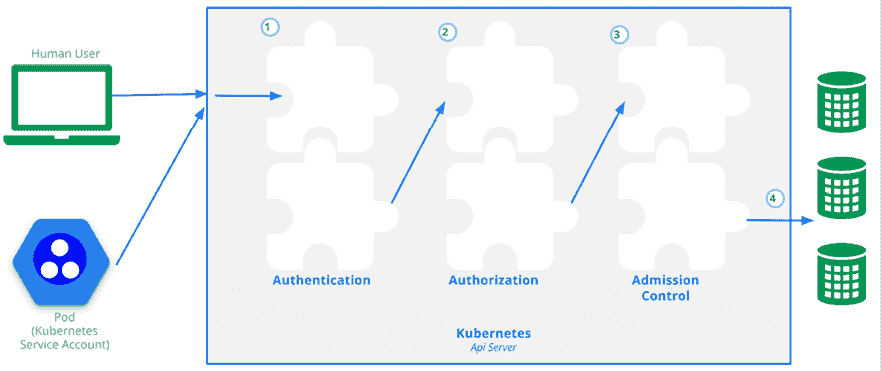
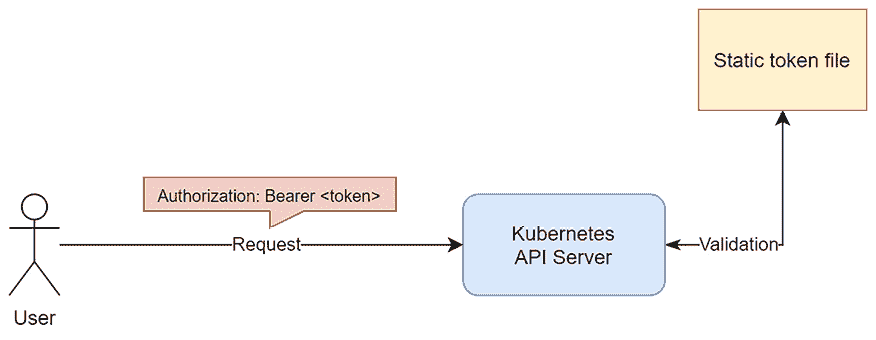
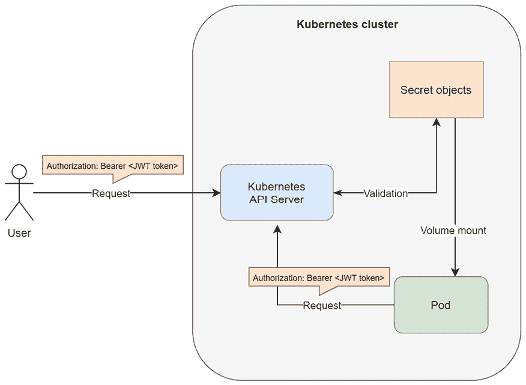
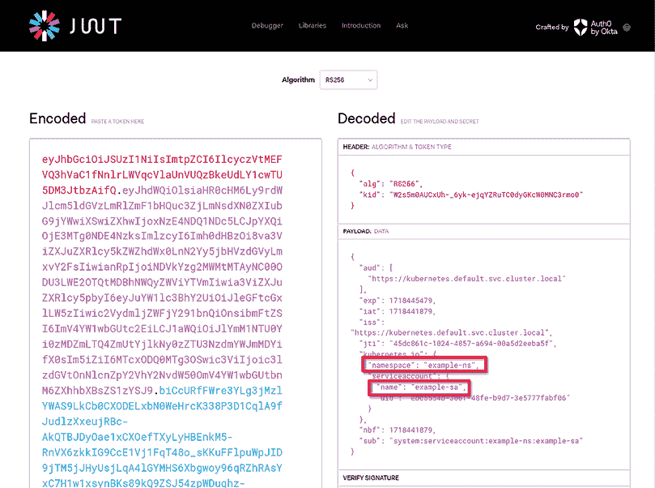
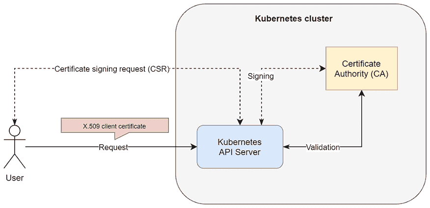
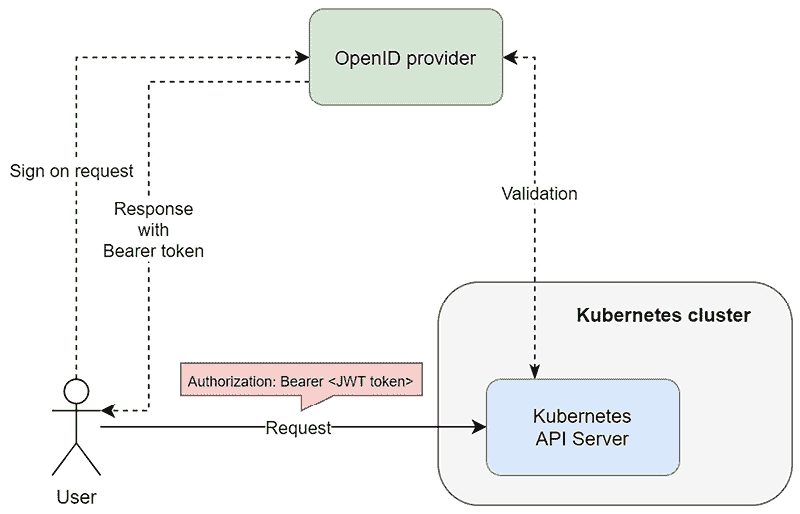
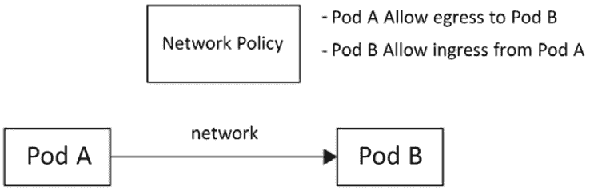
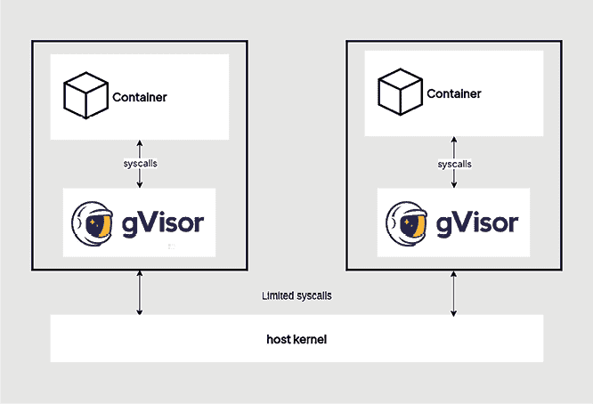
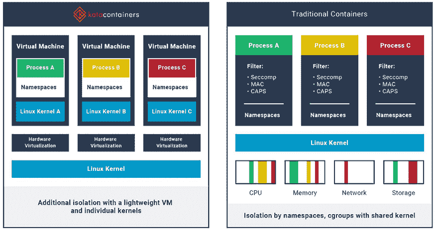

# 18

# Kubernetes 中的安全性

认证和授权是现代软件系统的基石，分别提供必要的身份管理和访问管理。尽管这两个过程有所不同，但许多人仍然混淆这两个术语。认证是指验证用户身份的过程，通常通过用户名和密码等机制来实现；而授权则是指一个已认证的用户可以访问或执行系统中的哪些操作。认证总是优先于授权，只有通过认证的用户，系统才会根据授权进行交互。Kubernetes 在此基础上进一步扩展了另一个模型，称为**基于角色的访问控制**（**RBAC**），该模型允许管理员定义具有特定权限的角色，并将这些角色分配给用户，从而有效地实施最小权限原则，并实现细粒度的访问控制。

除了身份和访问管理，Kubernetes 还拥有许多其他的安全机制，进一步加强其他组件的安全性。作为最成熟和最广泛采用的容器编排平台，Kubernetes 的设计非常重视集群、节点、容器、网络和应用程序中各种组件的安全性，通过在多个层次上缓解风险来确保安全。

接下来，本章将介绍一些基础的 Kubernetes 安全概念，包括系统灵活认证的不同方式——如 X509 客户端证书或来自 OpenID Connect 的令牌。在一些特殊情况下，例如与 LDAP 的集成，Kubernetes 提供了额外的选项。例如，使用认证代理或 Webhooks 的可能性也是推荐的。接着，我们将回顾平台中的**RBAC**模型，它赋予管理员对集群中资源访问的控制权，并允许他们管理用户、组和 ServiceAccounts。

我们还将介绍 Kubernetes 中的一个高级功能：Admission Controllers。Admission Controller 在资源进入集群时执行安全策略，以验证和控制资源。Admission Controllers 通过在资源创建和修改时强制执行策略，为资源请求提供了额外的防护层。

Pods 和容器本身需要得到保护，因为它们是工作负载或应用程序的运行时，可能会与敏感信息交互。Kubernetes 提供了一套 `securityContext` 选项，使管理员能够为容器声明特定的安全设置；这包括强制容器以非 root 用户身份运行。同样重要的是网络安全，我们将讨论如何通过 NetworkPolicies 提供一种机制，通过控制流量流动来在集群内隔离并保护 Pod 通信，从而实现细粒度的安全管理。

接下来我们将讨论容器运行时的安全性。我们将研究 gVisor 和 Kata Containers 作为运行时的选项，它们分别通过用户空间内核拦截系统调用或为每个容器提供轻量级虚拟机环境，在提供容器速度的同时增强虚拟机的安全性。

最后，也是最重要的，私有注册表凭证是确保集群内部容器镜像安全的关键。我们将逐步讲解 Kubernetes 如何安全地处理这些凭证——确保只有经过授权的组件可以访问它们。到本章结束时，您将更深入地理解 Kubernetes 中的这些高级安全概念和工具。您将确切了解如何增强集群的安全性，降低风险，并为可能的漏洞提供最好的防御。通过这些措施，您将能够在每一层保护您的 Kubernetes 部署，从身份管理到运行时隔离，并增强容器化应用程序的稳健性。

本章将涵盖以下主题：

+   认证与授权 —— 用户访问控制

+   入场控制 —— 安全策略和检查

+   保护 Pods 和容器

+   管理机密和注册表凭证

# 技术要求

本章所需的内容：

+   一个待部署的 Kubernetes 集群。我们推荐使用多节点的*云端* Kubernetes 集群。

+   已在您的本地机器上安装并配置 Kubernetes CLI（`kubectl`），用于管理您的 Kubernetes 集群。

本书的*第三章*《安装您的第一个 Kubernetes 集群》已涵盖了基础的 Kubernetes 集群部署（本地和云端）以及 `kubectl` 的安装。

本书的前几章（*第十五章*、*第十六章*、*第十七章*）已经为您提供了如何在不同的云平台上部署功能完备的 Kubernetes 集群的概述，并安装了管理它们所需的 CLI 工具。

您可以从官方 GitHub 仓库下载本章的最新代码示例：[`github.com/PacktPublishing/The-Kubernetes-Bible-Second-Edition/tree/main/Chapter18`](https://github.com/PacktPublishing/The-Kubernetes-Bible-Second-Edition/tree/main/Chapter18)。

# 认证与授权 —— 用户访问控制

认证为访问控制提供了依据，确保只有经过认证和授权的用户才能使用 Kubernetes 资源。认证验证用户的身份，而授权则决定认证用户在集群内可以执行的操作。Kubernetes 在认证方面提供了灵活性，支持 X509 证书、OpenID Connect、基于令牌等多种方式。结合验证过程，RBAC 确实提供了细粒度的控制，帮助管理员高效地管理各种权限——这是接下来章节将详细讨论的内容。

接下来，我们将在下一部分开始讲解认证。

## 认证和用户管理

Kubernetes API 服务器提供用于管理 Kubernetes 集群的 RESTful 端点，并充当集群共享状态的前端。所有与集群的交互，从用户到内部组件，都会通过 Kubernetes API 服务器进行，它充当集群共享状态的前端。

让我们在接下来的部分中看看 Kubernetes 中的认证机制是如何工作的。

### Kubernetes 中的认证工作流

就像一个高安全性设施一样，你的 Kubernetes 集群需要强大的安全措施来保护其资源。这涉及一种分层的方法，其中多个关键组件共同工作，如下图所示：



图 18.1：请求 Kubernetes API 会经过多个阶段（来源：https://kubernetes.io/docs/concepts/security/controlling-access/）

+   **认证**：它作为第一道防线，验证任何试图访问 Kubernetes API 服务器的人的身份。可以把它想象成门口的保安检查身份。用户可能使用密码、令牌或特殊证书来证明他们已获得授权。

+   **授权**：一旦某人的身份被确认，授权决定了他们在集群内实际上能做什么。可以把它理解为授予特定的访问权限。用户可能有权限查看资源，但不能修改它们，或者他们可能被授权在特定区域内创建新资源。

+   **准入控制**：这一阶段增加了额外的审查层。可以将其理解为入口处的安全扫描仪。准入控制模块可以检查传入的请求，确保它们符合预定义的安全政策。它们甚至可以修改请求，强制执行特定的规则，或者如果请求构成威胁，则完全拒绝。

+   **审计**：就像记录谁进出一个安全设施一样，Kubernetes 的审计功能会记录集群内的所有活动。这包括用户、应用程序，甚至控制平面本身的操作。这些日志对监控可疑活动和维持安全环境至关重要。

这些安全措施相互配合，形成了一个分层防御系统，确保只有授权用户能够访问你的 Kubernetes 集群，并且他们的行为符合已建立的安全政策。

我们将在下一部分了解更多关于认证机制的细节。

### Kubernetes API 的认证

Kubernetes API 认证确保只有授权的用户或服务可以与集群中的资源进行通信。每个传入请求都必须经过一系列身份验证模块的设置，这些模块已被配置。

对 API 的请求总是以下列之一进行：

+   与外部、普通用户或在 Kubernetes 集群中定义的 **ServiceAccount** 相关联。

+   如果集群已配置为允许匿名请求，则视为*匿名*请求。

这在*身份验证*过程中决定——整个 HTTP 请求作为输入传入该过程，但通常只分析请求头或客户端证书。身份验证由依赖于集群配置的身份验证模块执行。你的集群可能启用了多个身份验证模块，每个模块会按顺序执行，直到有一个成功。如果请求身份验证失败，API 服务器将响应`401 (unauthorized)` HTTP 状态码，或者如果启用了匿名请求，则将其视为匿名请求。

匿名请求本质上映射到一个特殊的用户名`system:anonymous`和一个叫做`system:unauthenticated`的组。这意味着你可以像管理其他用户或服务账户一样，管理这些请求的资源授权。

由于集群内外的所有操作必须通过 Kubernetes API 服务器，这意味着所有操作都必须经过身份验证过程。这包括内部集群组件和 Pod 的操作，它们会查询 API 服务器。作为集群的外部用户，你通过`kubectl`命令或直接向 Kubernetes API 服务器发出的任何请求也会经过身份验证过程：

+   **普通用户**：这些用户是*外部管理*的，独立于 Kubernetes 集群。目前，Kubernetes 没有提供任何对象来表示这些用户。外部管理用户的方式可以像通过`token-auth-file`参数在静态 Pod 定义文件`/etc/kubernetes/manifests/kube-apiserver.yaml`中将静态的用户密码文件传递给 API 服务器（这通常发生在控制平面节点，即主节点启动时），尽管这种方法简单（但*不*推荐）。在生产环境中，应利用现有的**身份提供者**（**IdPs**），如**Google**、**GitHub**、**Azure Active Directory**（**AAD**）或**AWS IAM**来管理用户。使用**OpenID Connect**（**OIDC**）令牌将 Kubernetes 集群与这些身份提供者集成，提供无缝的身份验证体验。请记住，Kubernetes 中的常规用户账户是全局性的，并且没有命名空间限制。

+   **ServiceAccount**: 这些由 Kubernetes 集群管理，并建模为 ServiceAccount 对象。您可以像在 Kubernetes 中管理任何其他资源一样，例如使用`kubectl`和 YAML 清单文件来创建和管理服务帐户。此类帐户适用于集群组件中或运行在 Pod 中的进程。ServiceAccounts 的凭据将作为 Secrets（手动创建或通过 TokenRequest API）创建，并挂载到 Pod 中，以便容器进程可以使用它们与 Kubernetes API 服务器进行通信。当进程使用`ServiceAccount`令牌进行身份验证时，它被视为名为`system:serviceaccount:<namespace>:<serviceAccountName>`的用户。请注意，ServiceAccounts 是命名空间的。

正如您所看到的，Kubernetes 中的用户管理是一种不同方法的混合，应该适合不同组织的所有需求。这里的关键是，在认证过程之后，请求将被拒绝（可选地视为匿名）或被视为来自特定用户。外部用户管理系统可以提供`username`属性，例如普通用户的情况，或者对于 ServiceAccounts，它将是`system:serviceaccount:<namespace>:<serviceAccountName>`。此外，请求将具有更多与之相关的属性，如**用户 ID**（**UID**）、**组**和**额外字段**。这些信息用于基于 RBAC 的授权过程，我们将在下一节中进行解释。

现在，让我们看看您可以在 Kubernetes 中使用的认证方法。

### Kubernetes 中的认证方法

通常情况下，各种认证方法帮助安全地控制对 Kubernetes API 服务器的访问。为了验证用户和服务，可以启用多种认证策略。每种策略都适用于不同的用例和安全级别。这些策略包括验证人类用户和与集群交互的应用程序身份的令牌和证书。Kubernetes API 服务器的一个优点是它支持多种认证机制，因此可以使用前述方法的组合来配置集群。在接下来的部分中，我们将介绍一些常见的认证方法，如静态令牌文件、ServiceAccount 令牌、X.509 客户端证书和 OpenID Connect 令牌。

#### 静态令牌文件

这种方法是 Kubernetes 提供给普通用户管理的最基本方法之一。这种方法在某种程度上类似于 Unix/Linux 系统中的`/etc/shadow`和`/etc/passwd`文件。但请注意，不建议在生产集群中使用，因为它被认为是不安全的。

在此方法中，您需要定义一个`.csv`文件，其中每行具有以下格式：

```
token,user,uid,"group1,group2,group3" 
```

然后，在启动 Kubernetes API 服务器进程时，你需要传递该文件，使用静态 Pod 定义文件 `/etc/kubernetes/manifests/kube-apiserver.yaml` 中的 `token-auth-file` 参数，文件位于你的控制平面节点（即主节点）中：

```
# /etc/kubernetes/manifests/kube-apiserver.yaml
...<removed for brevity>...
spec:
  containers:
  - command:
    - kube-apiserver
    - --advertise-address=192.168.59.154
    - --allow-privileged=true
    - --authorization-mode=Node,RBAC
    **-****--token-auth-file=/etc/kubernetes/user-tokens.csv**
    - --client-ca-file=/var/lib/minikube/certs/ca.crt
...<removed for brevity>... 
```

要对 API 服务器进行身份验证，你需要为请求使用标准的 HTTP **承载身份验证方案**。这意味着你的请求将需要使用以下格式的附加头：

```
Authorization: Bearer <token> 
```

基于此请求信息，Kubernetes API 服务器将根据静态令牌文件匹配令牌，并根据匹配的记录分配用户属性。

使用 `kubectl` 时，你必须修改你的 `kubeconfig`。你可以使用 `kubectl` 命令来做到这一点：

```
$ kubectl config set-credentials <contextUser> --token=<token> 
```

之后，你需要创建并使用此用户的上下文来进行请求，使用 `kubectl config use-context` 命令。

在 Kubernetes 1.19 版本之前，曾有一种类似的身份验证方法，允许我们使用 HTTP **基本身份验证方案** 和通过 `basic-auth-file` 参数传递给 API 服务器的文件。由于安全原因，该方法现在已不再支持。

以下图示化了这种身份验证方法背后的原理：



图 18.2: Kubernetes 中的静态令牌文件身份验证

现在我们可以总结使用静态令牌文件方法进行身份验证的优缺点。

静态令牌文件方法的优点如下：

+   配置起来很简单。

+   它容易理解。

静态令牌文件方法的缺点如下：

+   这是不安全的；暴露一个令牌文件会危及所有集群用户。

+   它要求我们手动管理用户。

+   添加新用户或删除现有用户需要我们重新启动 Kubernetes API 服务器。

+   轮换任何令牌需要我们重新启动 Kubernetes API 服务器。

+   当你拥有多个控制平面节点的高可用性控制平面时，复制令牌文件内容到每个控制平面节点需要额外的工作。

总之，这种方法适合开发环境和学习 Kubernetes 身份验证背后的原理，但不推荐在生产环境中使用。接下来，我们将介绍如何使用 ServiceAccount 令牌进行用户身份验证。

#### ServiceAccount 令牌

正如我们在本节开头提到的，ServiceAccounts 旨在为在 Pod 容器中运行的过程或集群组件提供集群内身份。然而，它们也可以用于验证外部请求。

ServiceAccounts 是 Kubernetes 对象，可以像集群中的其他资源一样进行管理；也就是说，可以使用 `kubectl` 或通过原始 HTTP 请求与 API 服务器进行交互。ServiceAccount 的令牌是 **JSON Web 令牌** (**JWTs**)，会根据需求或使用 `kubectl create token` 命令生成。

每个 Kubernetes 命名空间都有一个预创建的名为 `default` 的 ServiceAccount。没有指定 ServiceAccount 的 Pod 会自动继承该默认账户以进行集群内的授权。你可以使用 `kubectl get pods/<podname> -o yaml` 来验证 Pod 的 ServiceAccount，并检查 `spec.serviceAccountName` 字段。

通常，在定义 Pod 时，你可以指定用于容器中运行的进程的 ServiceAccount。你可以在 Pod 规范中使用 `.spec.serviceAccountName` 来实现这一点。JWT 令牌将被注入到容器中；然后，容器内的进程可以在 HTTP 承载身份验证方案中使用它来认证 Kubernetes API 服务器。只有当它与 API 服务器有任何交互时，这才是必要的，例如，如果它需要发现集群中的其他 Pod。我们已在下图中总结了这种身份验证方法：



图 18.3：Kubernetes 中的 ServiceAccount 身份验证

这也说明了为什么 ServiceAccount 令牌可以用于外部请求——API 服务器并不关心请求的来源；它关心的是随请求头一起传递的承载令牌。再次强调，你可以在 `kubectl` 中或者通过直接的 HTTP 请求发送到 API 服务器时使用此令牌。请注意，这通常不是推荐的使用 ServiceAccount 的方式，但在某些场景下它是可行的，尤其是当你无法为普通用户使用外部身份验证提供者时。

在 1.22 版本之前，Kubernetes 使用 Secrets 自动为 ServiceAccount 生成 API 凭证。这些 Secrets 包含 Pod 可以挂载以访问的令牌。这种方法有一些局限性：

+   **静态令牌**：Secrets 存储的令牌是明文的，如果泄露会带来安全风险。

+   **有限控制**：令牌的生命周期和权限不易管理。

从 1.22 版本开始，Kubernetes 转向了一种更安全的方法。Pod 现在通过 **TokenRequest** API 直接获取令牌。这些令牌如下所示：

+   **短生命周期**：令牌的生命周期有限，减少了潜在泄露的影响。

+   **自动挂载到 Pods 中**：令牌会自动挂载为卷，消除了预存 Secret 的需求。

虽然自动挂载是首选方法，但你仍然可以手动为服务账户令牌创建 Secrets。对于需要更长生命周期的令牌，这可能是有用的，但在大多数场景中，优先使用自动令牌挂载来增强安全性。

正如我们所学到的，Kubernetes 自动在 Pod 中挂载 Service Account API 凭据以简化访问。要禁用此行为并以不同方式管理令牌，请在 ServiceAccount 清单或 Pod 规范中设置 `automountServiceAccountToken: false`。此设置适用于所有引用该 ServiceAccount 的 Pod，除非由特定 Pod 配置覆盖。如果两者都定义了，则 Pod 的设置优先。有关详细信息，请参阅文档（[`kubernetes.io/docs/tasks/configure-pod-container/configure-service-account/#opt-out-of-api-credential-automounting`](https://kubernetes.io/docs/tasks/configure-pod-container/configure-service-account/#opt-out-of-api-credential-automounting)）。

现在我们将演示如何创建和管理 ServiceAccounts，以及在使用 `kubectl` 时如何使用 JWT 令牌进行身份验证。这还将让我们一窥即将在下一节详细介绍的 RBAC。请按照以下步骤操作：

1.  创建一个新的 Namespace 和一个 ServiceAccount 的 YAML 清单如下。我们将为此帐户配置 RBAC，使其仅能读取该命名空间中的 Pods：

    ```
    # 01_serviceaccount/example-sa-ns.yaml
    ---
    apiVersion: v1
    kind: Namespace
    metadata:
      name: example-ns
    ---
    apiVersion: v1
    kind: ServiceAccount
    metadata:
      name: example-sa
      namespace: example-ns 
    ```

请注意，您还可以使用 *命令式* 命令 `kubectl create serviceaccount example-sa` 创建资源。

1.  在 `example-ns` 命名空间中为名为 `pod-reader` 的 `Role` 对象创建一个 YAML 清单。此角色将允许您获取、监视和列出此命名空间中的 Pods。`01_serviceaccount/pod-reader-role.yaml` YAML 清单文件的内容如下：

    ```
    # 01_serviceaccount/pod-reader-role.yaml
    apiVersion: rbac.authorization.k8s.io/v1
    kind: Role
    metadata:
      namespace: example-ns
      name: pod-reader
    rules:
      - apiGroups: [""]
        resources: ["pods"]
        verbs: ["get", "watch", "list"] 
    ```

1.  创建一个名为 `reads-pods` 的 `RoleBinding` 的 YAML 清单。这是 *关联* 我们创建的角色与我们的 `example-sa` ServiceAccount 的操作 - 此帐户现在将具有对 Pods 的只读访问权限，没有其他权限。`01_serviceaccount/read-pods-rolebinding.yaml` YAML 清单文件的内容如下：

    ```
    # 01_serviceaccount/read-pods-rolebinding.yaml
    apiVersion: rbac.authorization.k8s.io/v1
    kind: RoleBinding
    metadata:
      name: read-pods
      namespace: example-ns
    subjects:
      - kind: ServiceAccount
        name: example-sa
        namespace: example-ns
    roleRef:
      kind: Role
      name: pod-reader
      apiGroup: rbac.authorization.k8s.io 
    ```

1.  现在，我们可以使用 `kubectl apply` 命令一次性将所有清单文件应用到集群中：

    ```
    $ kubectl apply -f 01_serviceaccount/
    namespace/example-ns created
    serviceaccount/example-sa created
    role.rbac.authorization.k8s.io/pod-reader created
    rolebinding.rbac.authorization.k8s.io/read-pods created 
    ```

1.  现在，我们将如下创建一个 ServiceAccount 的 Token：

    ```
    $ kubectl create token example-sa -n example-ns 
    ```

从命令输出中收集 JWT 令牌，您可以使用该令牌作为该 ServiceAccount 的身份验证。如果您感兴趣，可以使用 [`jwt.io/`](https://jwt.io/) 检查 JWT 的内容，如下图所示：



图 18.4：检查 ServiceAccount 的 JWT

如您所见，JWT 映射到 `example-ns` 命名空间中的 `example-sa` ServiceAccount。此外，您可以确定在 Kubernetes 中将映射到的实际用户名（在负载中标记为 `subject`）是 `system:serviceaccount:example-ns:example-sa`，正如我们之前解释的那样。

1.  使用此令牌，我们可以设置 kubeconfig 进行测试。首先，您需要使用以下命令在您的 `kubeconfig` 中创建一个用户：

    ```
    $ kubectl config set-credentials example-sa --token=<your-token>
    User "example-sa" set. 
    ```

其中 `example-sa` 是您创建的新 ServiceAccount，并将 `<your-token>` 替换为您之前收集的令牌字符串。

1.  创建一个使用此用户的新上下文，`kubeconfig`中也需要知道您当前连接的集群名称——您可以使用`kubectl config view`命令查看。使用`kubectl config set-context`命令创建新上下文：

    ```
    $ kubectl config set-context <new-context-name> --user=<new-user-created --cluster=<clusterName> 
    ```

例如，使用以下命令创建一个名为`example-sa-context`的新上下文，目标集群为 minikube，用户为`example-sa`：

```
$ kubectl config set-context example-sa-context --user=example-sa --cluster=minikube
Context "example-sa-context" created. 
```

1.  在切换到新创建的上下文之前，让我们在`example-ns`命名空间中创建一个简单的 nginx Pod。将示例 YAML 文件`Chapter18/references/sa-demo-nginx-pod.yaml`复制到`Chapter18/01_serviceaccount/nginx-pod.yaml`并应用配置：

    ```
    $ cp references/sa-demo-nginx-pod.yaml 01_serviceaccount/nginx-pod.yaml
    $ kubectl apply -f 01_serviceaccount/nginx-pod.yaml
    pod/nginx-pod created
    $  kubectl get po -n example-ns
    NAME        READY   STATUS    RESTARTS   AGE
    nginx-pod   1/1     Running   0          12m 
    ```

1.  此外，在切换到新上下文之前，您可能想要使用`kubectl config current-context`命令检查当前使用的上下文名称。这将使您更容易回到旧的集群管理员上下文：

    ```
    $ kubectl config current-context
    minikube 
    ```

1.  现在，使用以下命令切换到新上下文：

    ```
    $ kubectl config use-context example-sa-context
    Switched to context "example-sa-context". 
    ```

1.  您还可以通过以下方式验证您当前使用的凭证身份：

    ```
    $ kubectl auth whoami
    ATTRIBUTE                                           VALUE
    Username                                            system:serviceaccount:example-ns:example-sa
    UID                                                 ebc5554b-306f-48fe-b9d7-3e5777fabf06
    Groups                                              [system:serviceaccounts system:serviceaccounts:example-ns system:authenticated]
    Extra: authentication.kubernetes.io/credential-id   [JTI=45dc861c-1024-4857-a694-00a5d2eeba5f] 
    ```

1.  我们现在准备验证我们的身份验证是否有效，并且 RBAC 角色是否允许对`example-ns`命名空间中的 Pods 进行只读访问。首先，尝试获取 Pods：

    ```
    $ kubectl get po -n example-ns
    NAME        READY   STATUS    RESTARTS   AGE
    nginx-pod   1/1     Running   0          18m 
    ```

1.  这按预期工作！现在，尝试从`kube-system`命名空间获取 Pods：

    ```
    $ kubectl get pods -n kube-system
    Error from server (Forbidden): pods is forbidden: User "system:serviceaccount:example-ns:example-sa" cannot list resource "pods" in API group "" in the namespace "kube-system" 
    ```

1.  我们已经正确认证，但由于 RBAC 授权限制，操作被禁止，这正是我们预期的。最后，让我们尝试获取服务对象：

    ```
    $ kubectl get svc -n example-ns
    Error from server (Forbidden): services is forbidden: User "system:serviceaccount:example-ns:example-sa" cannot list resource "services" in API group "" in the namespace "example-ns" 
    ```

这也是预期的，因为 RBAC 未配置 ServiceAccount 以查看或列出`example-ns`命名空间中的服务资源。

如您所见，我们已经成功地使用 ServiceAccount 令牌进行身份验证，并验证了我们的权限正常工作。您现在可以使用`kubectl config use-context <context-name>`命令切换回您的旧`kubectl`上下文。

配置`kubectl`上下文与 bearer 令牌的上述过程也可以用于静态令牌文件身份验证方法。

让我们总结一下使用 ServiceAccount 令牌进行身份验证的优缺点。

使用 ServiceAccount 令牌的优点如下：

+   配置和使用简单，类似于静态令牌文件。

+   完全由 Kubernetes 集群管理，因此无需外部身份验证提供者。

+   ServiceAccounts 是命名空间级的。

使用 ServiceAccount 令牌的缺点如下：

+   ServiceAccounts 旨在为在 Pod 容器中运行的进程提供身份，并允许它们使用 Kubernetes RBAC。*用户使用 ServiceAccount 令牌并不是最佳实践*。

一般来说，使用 ServiceAccount 令牌进行外部认证仅适用于开发和测试场景，当你无法与外部认证提供商集成时。然而，对于生产集群来说，这不是最佳选择，主要是由于安全问题。现在，让我们来看看如何使用 X.509 客户端证书进行 Kubernetes API 认证。

#### X.509 客户端证书

使用 X.509 客户端证书是认证过程中一种行业标准。然而，有一个重要的注意事项——你需要有良好的证书签名、吊销和轮换管理手段。否则，你可能会遇到与使用 ServiceAccount 令牌类似的安全问题。你可以在 [`www.ssl.com/faqs/what-is-an-x-509-certificate/`](https://www.ssl.com/faqs/what-is-an-x-509-certificate/) 上了解更多关于 X.509 证书及其相关流程的信息。

该方法在 Kubernetes 中的工作原理如下：

1.  Kubernetes API 服务器通过 `client-ca-file` 参数启动。这个参数提供 **证书颁发机构**（**CA**）信息，用于验证提供给 API 服务器的客户端证书。你可以在这里配置自定义的 CA 证书，或者使用集群部署过程中创建的默认 CA。例如，如果你使用的是 minikube，你可以看到在 `kube-apiserver` 中已经配置了一个默认的 CA 文件，如下所示：

    ```
    # /etc/kubernetes/manifests/kube-apiserver.yaml
    ...<removed for brevity>...
    spec:
      containers:
      - command:
        - kube-apiserver
        - --advertise-address=192.168.59.154
        - --allow-privileged=true
        - --authorization-mode=Node,RBAC
        **-****--client-ca-file=/var/lib/minikube/certs/ca.crt**
    ...<removed for brevity>... 
    ```

1.  需要对 API 服务器进行认证的用户需要从 CA 请求一个 X.509 客户端证书。这应该是一个安全且经过审计的过程。证书的主题公共名称（证书主题中的 `CN` 属性）在认证成功时会作为 `username` 属性使用。请注意，从 Kubernetes 1.19 开始，你可以使用证书 API 来管理签名请求。更多信息请参阅官方文档：[`kubernetes.io/docs/reference/access-authn-authz/certificate-signing-requests/`](https://kubernetes.io/docs/reference/access-authn-authz/certificate-signing-requests/)。

1.  用户必须在认证过程中向 API 服务器提供客户端证书，服务器将证书与 CA 进行验证。基于此，请求会成功通过认证过程或被拒绝。再次提醒，如果你使用的是 minikube 集群，那么你已经在使用基于证书的认证，如下例所示：

    ```
    $ kubectl config view -o json | jq '.users[]'
    {
      "name": "example-sa",
      "user": {
        "token": "REDACTED"
      }
    }
    {
      "name": "minikube",
      "user": {
        "client-certificate": "/home/iamgini/.minikube/profiles/minikube/client.crt",
        "client-key": "/home/iamgini/.minikube/profiles/minikube/client.key"
      }
    } 
    ```

在使用 `kubectl` 命令时，用户可以通过 `kubectl config set-credentials` 命令在 kubeconfig 中配置这种认证方法，正如我们之前所学到的那样。我们在下图中总结了这个过程：



图 18.5：Kubernetes 中的 X.509 客户端证书认证

请注意，这展示的是用户初始 CSR 由 Kubernetes 集群中的证书 API 处理的情况。实际上，不必如此，因为 CA 可能位于集群外部，Kubernetes API 服务器可以依赖于 CA `.pem` 文件的副本。

在接下来的实操练习中，我们将生成并配置 Kubernetes 中的证书认证：

1.  使用 `openssl` 命令开始创建私钥：

    ```
    $ openssl genrsa -out iamgini.key 2048 
    ```

1.  生成**证书签名请求**（**CSR**）：

    ```
    $ openssl req -new -key iamgini.key -out iamgini.csr -subj "/CN=iamgini/O=web1/O=frontend" 
    ```

1.  收集 CSR 数据并使用 base64 编码：

    ```
    $ cat iamgini.csr | base64 -w 0 
    ```

1.  现在，我们需要使用**证书 API**创建一个 `证书签名请求` 资源；让我们按如下方式使用 `csr.yaml` 文件：

    ```
    # csr.yaml
    apiVersion: certificates.k8s.io/v1
    kind: CertificateSigningRequest
    metadata:
      name: iamgini
    spec:
      request: <**your****encoded****CSR****content****here****from****Step.3>**
      signerName: kubernetes.io/kube-apiserver-client
      usages:
        - client auth 
    ```

1.  创建 `证书签名请求`：

    ```
    $ kubectl apply -f csr.yaml
    certificatesigningrequest.certificates.k8s.io/iamgini created 
    ```

1.  现在，管理员（或具有 `certificatesigningrequests` 权限的用户）可以查看 CSR 资源：

    ```
    $ kubectl get csr
    NAME      AGE   SIGNERNAME                            REQUESTOR       REQUESTEDDURATION   CONDITION
    iamgini   25s   kubernetes.io/kube-apiserver-client   minikube-user   <none>              Pending 
    ```

1.  按如下方式检查并批准 CSR：

    ```
    $ kubectl certificate approve iamgini
    certificatesigningrequest.certificates.k8s.io/iamgini approved 
    ```

1.  一旦 CSR 被批准，从批准的 CSR 资源中获取证书数据，具体操作如下；以下命令会将数据提取到 `iamgini.crt` 文件：

    ```
    $ kubectl get csr iamgini -o json | jq -r '.status.certificate' | base64 --decode > iamgini.crt 
    ```

1.  现在，我们有了私钥和证书，具体如下（可以删除 `.csr` 文件，因为不再需要）：

    ```
    $ ls iamgini.*
    iamgini.crt  iamgini.csr  iamgini.key 
    ```

1.  现在，我们将使用新用户和上下文来配置 `kubeconfig`；按如下方式在 `kubeconfig` 中创建一个新用户条目（记得使用密钥和证书文件的完整路径）：

    ```
    $ kubectl config set-credentials iamgini --client-key=/full-path/iamgini.key --client-certificate=/full-path/iamgini.crt
    User "iamgini" set. 
    ```

1.  使用新用户创建一个新上下文：

    ```
    $ kubectl config set-context iamgini --cluster=minikube --user=iamgini
    Context "iamgini" created. 
    ```

1.  现在，kubeconfig 已更新为新用户和上下文。让我们测试访问权限。按如下方式更改 kubeconfig 上下文：

    ```
    $ kubectl config use-context iamgini
    Switched to context "iamgini". 
    ```

1.  验证上下文和连接：

    ```
    $ kubectl auth whoami
    ATTRIBUTE   VALUE
    Username    iamgini
    Groups      [web1 frontend system:authenticated] 
    ```

恭喜；你已经配置了基于 X509 证书的认证新用户。但请记住，在配置适当的 RBAC 资源之前，该用户无法执行任何操作。

基于我们所学的内容，我们可以总结此方法的优点如下：

+   这是一个比使用 ServiceAccount 令牌或静态令牌文件更安全的过程。

+   无法在集群中存储证书意味着无法危及所有证书。X.509 客户端证书可以用于高权限用户账户。

+   X.509 客户端证书可以按需撤销。这在发生安全事件时非常重要。

X.509 客户端证书认证的缺点如下：

+   证书有有效期，这意味着它们不能无限期有效。对于开发中的简单用例，这是一个缺点。从安全角度来看，在生产集群中，这是一个巨大的*优点。但请记住，确保证书安全存储，因为基于文件的认证机制存在安全风险；文件可能被窃取并用于未经授权的访问*。

+   必须处理证书到期、撤销和轮换监控。这应该是一个自动化过程，以便在发生安全事件时我们能够迅速响应。

+   在浏览器中使用客户端证书进行认证是麻烦的，例如，当您想要认证到 Kubernetes Dashboard 时。

关键要点是，使用 X.509 客户端证书是安全的，但需要复杂的证书管理，以便我们能获得所有的好处。现在，我们将看看 OpenID Connect 令牌，它是云环境中推荐的方法。

#### OpenID Connect 令牌

使用**OpenID Connect**（**OIDC**），您可以为您的 Kubernetes 集群（以及可能是组织中的其他资源）实现**单点登录**（**SSO**）体验。OIDC 是一个建立在 OAuth 2.0 之上的认证层，它允许第三方应用程序验证终端用户的身份并获取基本的用户个人信息。OIDC 使用 JWT，这些 JWT 可以通过符合 OAuth 2.0 规范的流程获取。使用 OIDC 进行 Kubernetes 认证的最大问题是 OpenID 提供者的可用性有限。但如果您在云环境中部署，所有一级云服务提供商，如 Microsoft Azure、Amazon Web Services 和 Google Cloud Platform，都有自己的 OpenID 提供者版本。云中托管的 Kubernetes 集群部署（如 AKS、Amazon EKS 和 Google Kubernetes Engine）的优势在于，它们提供与其本地 OpenID 提供者的即插即用集成，或者只需简单的配置开关。换句话说，您无需担心重新配置 Kubernetes API 服务器并使其与所选的 OpenID 提供者一起工作——您将与托管解决方案一起获得它。如果您有兴趣了解更多有关 OIDC 协议的信息，可以参考[`openid.net`](https://openid.net)的官方网站。

有关更多细节和更具体的流程，如 AAD 的上下文，请查看[`docs.microsoft.com/en-us/azure/active-directory/develop/v2-protocols-oidc`](https://docs.microsoft.com/en-us/azure/active-directory/develop/v2-protocols-oidc)。

在下图中，您可以看到 Kubernetes 中 OIDC 认证流程的基础：



图 18.6：Kubernetes 中的 OIDC 认证

最重要的是，OpenID 提供者负责单点登录（SSO）体验以及管理承载令牌。此外，Kubernetes API 服务器必须验证收到的承载令牌，并与 OpenID 提供者进行对比。

使用 OIDC 具有以下优点：

+   您可以获得单点登录（SSO）体验，您可以与组织中的其他服务一起使用。

+   大多数云服务提供商都有自己的 OpenID 提供者，这些提供者能够轻松与其托管的 Kubernetes 服务集成。

+   它也可以与其他 OpenID 提供者和非云部署一起使用——不过这需要更多的配置。

+   这是一个安全且可扩展的解决方案。

OIDC 方法的缺点可以总结如下：

+   Kubernetes 没有 Web 界面可以触发身份验证过程。这意味着你需要通过手动向 IdP 请求凭证来获取它们。在托管的云 Kubernetes 服务中，通常通过附加的简单工具来解决这一问题，这些工具可以生成带有凭证的 `kubeconfig`。

+   如果 IdP 支持令牌端点撤销功能，OIDC 令牌可以被撤销。这允许在令牌过期之前使其失效，例如当用户帐户被泄露时。然而，并非所有 IdP 都支持此功能，Kubernetes 也不处理令牌撤销。

##### 在 Kubernetes 中使用 OIDC

Kubernetes 不提供集成的 OpenID Connect 身份提供者。因此，它依赖于由云服务提供商或独立工具提供的外部身份提供者。如我们在本节前面提到的，最流行的云环境——如 AWS、GCP 和 Azure——在其托管的 Kubernetes 产品中原生提供 OIDC 集成，这使得启用单点登录（SSO）非常简单。或者，身份提供者还可以通过使用如 Dex、Keycloak、UAA 或 OpenUnison 等工具，为非云或自管理的 Kubernetes 集群独立设置。

##### Kubernetes 中的身份提供者要求

要使 OIDC 身份提供者与 Kubernetes 配合使用，它必须满足一些重要的前提条件：

+   **支持 OIDC 发现**：OIDC 发现简化了配置工作，因为通过它可以获取关于 IdP 端点和公钥的所有信息。Kubernetes 从发现端点读取 IdP 的公钥来验证 OIDC 令牌。

+   **传输层安全性**（**TLS**）**合规性**：身份提供者应处理 TLS 以处理非过时的加密算法，因为敏感的身份验证数据处理至关重要。

+   **CA 签名证书**：无论是使用商业 CA 还是自签名证书，身份提供者的证书必须将 `CA` 标志设置为 `TRUE`。这是因为 Kubernetes 使用 Go 的 TLS 客户端，严格执行这一要求，以便 Kubernetes 在用户令牌验证过程中能够安全地信任身份提供者的证书。

对于没有商业 CA 的身份提供者的自部署者，可以使用如 Dex gencert 脚本等工具来创建符合要求的 CA 证书及签名密钥。

以下列表包含一些适用于 Kubernetes 的流行 OIDC 身份提供者：

+   **Dex**：一种轻量级的开源流行身份提供者（IdP），适用于 Kubernetes 环境。它支持 OIDC，并且与 Kubernetes 预期的身份验证工作流兼容。Dex 通过连接到其他外部 IdP（如 LDAP、GitHub 和 Google）来工作，这使其成为具有更复杂身份场景的组织的理想选择。

+   **Keycloak**：这是一个开源身份提供者（IdP），提供强大的功能集，广泛支持 OIDC 和 SAML。除了核心功能外，Keycloak 还支持企业级功能，如用户联合和基于角色的访问控制（RBAC）。如果你希望在身份验证设置中拥有更多控制或定制，Keycloak 会是一个不错的选择。

+   **OpenUnison**：另一个为 Kubernetes 优化的 IdP 是 OpenUnison，具备像本地集成 Kubernetes RBAC 和身份联合等功能。它应该会受到准备好采用预构建解决方案、并根据自身需求对 Kubernetes 进行安全配置的企业的青睐。

+   **Cloud Foundry 用户账户与认证**（**UAA**）：这是一个开源的多用途身份提供者，源自 Cloud Foundry。它支持 OIDC，并在云平台和企业认证系统集成方面表现非常强大，非常适合在混合云环境中部署更复杂的 Kubernetes 集群。

##### 配置 Kubernetes API 服务器的 OIDC

在 Kubernetes 中启用 OIDC 需要对 Kubernetes API 服务器进行一些配置，使用特定的 OIDC 相关标志。主要配置包括以下内容：

+   `oidc-issuer-url`：OIDC 提供者的 URL。Kubernetes 使用它来验证令牌的真实性。

+   `oidc-client-id string`：在 Kubernetes 作为客户端时，用于与 IdP 进行身份验证时的客户端 ID。

+   `oidc-username-claim`：指定令牌中的哪个声明应该映射到 Kubernetes 用户名。

+   `oidc-groups-claim`：将 IdP 中的组映射到 Kubernetes 组，以便管理 RBAC 角色。

关于配置特定 OIDC 身份提供者的更多细节，你可以参考官方资源，例如 Kubernetes 指南中的 Dex ([`dexidp.io/docs/guides/kubernetes/`](https://dexidp.io/docs/guides/kubernetes/)) 或 Kubernetes 中的 OpenID Connect 认证 ([`kubernetes.io/docs/reference/access-authn-authz/authentication/`](https://kubernetes.io/docs/reference/access-authn-authz/authentication/))。

关于 OIDC 的一个关键要点是，这是配置 Kubernetes 身份验证时最好的选择，尤其是在你部署生产集群到云环境中时。

#### 其他方法

Kubernetes 提供了几种其他认证方法供你使用。这些方法主要用于高级用例，例如与 LDAP 或 Kerberos 集成。第一个是 **认证代理**。

当你在 Kubernetes API 服务器前使用认证代理时，可以配置 API 服务器使用某些 HTTP 头部来提取认证用户信息。换句话说，你的认证代理在执行用户认证的工作，并将这部分信息以附加头部的形式随请求一起传递。

你可以在官方文档中找到更多信息（[`kubernetes.io/docs/reference/access-authn-authz/authentication/#authenticating-proxy`](https://kubernetes.io/docs/reference/access-authn-authz/authentication/#authenticating-proxy)）。

另一种方法是**Webhook 令牌认证**，在这种方法中，Kubernetes API 服务器使用外部服务来验证持有令牌。外部服务通过 HTTP POST 请求从 API 服务器接收 TokenReview 对象，并执行验证，随后返回带有结果附加信息的 TokenReview 对象。

从官方文档中可以找到更多信息（[`kuberntes.io/docs/reference/access-authn-authz/authentication/#webhook-token-authentication`](https://kuberntes.io/docs/reference/access-authn-authz/authentication/#webhook-token-authentication)）。

Kubernetes 还使用另一种常见的认证方法，称为**引导令牌**。但引导令牌并不用于一般的认证，而是用于集群节点。引导令牌是 Kubernetes 中的一种特殊类型的秘密，用于简化将新节点添加到集群的过程。存储在 `kube-system` 命名空间中，这些短生命周期的令牌允许 API 服务器在初始连接时对 kubelet（运行在节点上的程序）进行认证。这简化了引导过程，使得加入新节点或从头创建新集群变得更加容易。它们可以与 kubeadm 工具一起使用，也可以独立使用，并与 Kubelet TLS 引导结合使用以实现安全通信。有关使用引导令牌和 TLS 引导认证的详细信息，请参阅文档（[`kubernetes.io/docs/reference/access-authn-authz/bootstrap-tokens`](https://kubernetes.io/docs/reference/access-authn-authz/bootstrap-tokens)）。

一般来说，当你希望与组织中现有的身份提供者集成，而这些身份提供者不被 Kubernetes 默认支持时，你需要使用认证代理和 Webhook 令牌认证方法。

在下一节中，我们将介绍 Kubernetes 中的授权和 RBAC。

## 授权与 RBAC 简介

Kubernetes 的安全性依赖于两个关键过程：**认证**和**授权**。认证验证试图访问系统的用户的身份，确保他们是自己所声称的人。这个初步步骤通常涉及检查用户名、密码或令牌等凭据。

成功认证后，授权过程开始发挥作用。此过程决定用户在系统内可以执行的操作。在 Kubernetes 中，API 服务器会评估用户的身份（来源于认证）以及其他请求属性，如请求的特定 API 端点或操作。基于预定义的策略或外部服务，授权模块决定是否允许或拒绝该请求。

身份验证是确定用户身份的第一步，而授权则是在验证用户是否可以执行其想要的操作时进行的下一步。

基于特定对象字段的访问控制由准入控制器处理，它们发生在授权之后，并且只有在授权允许请求的情况下才会执行。我们将在本章的后面部分学习准入控制器。

在 Kubernetes API 服务器中，认证请求会生成一组额外的请求属性，例如 **user**、**group**、**API 请求动词**、**HTTP 请求动词** 等。这些属性将被传递给进一步的授权模块，基于这些属性，模块会判断用户是否被允许执行该操作。如果任何模块拒绝该请求，用户将看到 HTTP 状态码 `403 (Forbidden)`。

这是 HTTP 状态码之间的重要区别。如果你收到 `401 (Unauthorized)`，这意味着你未被系统识别；例如，你提供了错误的凭据或用户不存在。如果你收到 `403 (Forbidden)`，这意味着身份验证已成功并且你已被识别，但你不被*允许*执行你请求的操作。这对于调试访问 Kubernetes 集群的问题非常有用。

Kubernetes 提供了一些授权模式，可以通过启动 Kubernetes API 服务器时使用 `authorization-mode` 参数来启用，具体如下：

```
# /etc/kubernetes/manifests/kube-apiserver.yaml
...<removed for brevity>...
spec:
  containers:
  - command:
    - kube-apiserver
    - --advertise-address=192.168.59.154
    - --allow-privileged=true
    **-****--authorization-mode=Node,RBAC**
...<removed for brevity>... 
```

以下是 Kubernetes 中可用的授权模式：

+   **RBAC**：这允许你通过角色和权限来组织访问控制和管理。RBAC 是访问管理的行业标准之一，也被广泛应用于 Kubernetes 之外。角色可以分配给系统中的用户，从而赋予他们一定的权限和访问权限。通过这种方式，你可以实现非常细粒度的访问管理，并且可以用来执行**最小权限原则**。例如，你可以在系统中定义一个角色，允许你访问网络共享上的某些文件。然后，你可以将这些角色分配给系统中的用户组中的个别用户，允许他们访问这些文件。这可以通过将用户与角色关联来实现——在 Kubernetes 中，你使用 **RoleBinding** 和 **ClusterRoleBinding** 对象来建模这种关系。通过这种方式，可以将多个角色分配给多个用户，单个用户也可以拥有多个角色。请注意，在 Kubernetes 中，RBAC 是*宽松的*，这意味着没有*拒绝*规则。默认情况下，一切都被拒绝，你需要定义*允许*规则。

+   **基于属性的访问控制（ABAC）**：这是一种访问控制范式的一部分，不仅在 Kubernetes 中使用，也可用于其他系统。它基于用户、资源和环境的属性来制定策略。这是一种非常细粒度的访问控制方法——例如，你可以定义用户可以访问某个文件，但前提是用户有权限访问机密数据（用户属性），该文件的所有者是 Mike（资源属性），并且用户是在内部网络中尝试访问该文件（环境属性）。因此，策略是一组必须共同满足的属性，才能执行某个操作。在 Kubernetes 中，这通过 Policy 对象进行建模。例如，你可以定义已认证的用户 `mike` 可以读取 `default` 命名空间中的任何 Pods。如果你希望将相同的访问权限授予用户 `bob`，则需要为用户 `bob` 创建一个新的 Policy。

+   **Node**：这是一个特殊用途的授权模式，用于授权集群中由 `kubelet` 发起的 API 请求。

+   **Webhook**：这种模式类似于身份验证的 Webhook。你可以定义一个外部服务，该服务需要处理 Kubernetes API 服务器发送的包含 **SubjectAccessReview** 对象的 HTTP POST 请求。此服务必须处理请求，并确定该请求是否应被允许或拒绝。该服务的响应应包含 `SubjectAccessReview`，以及有关是否允许该主体访问的详细信息。根据该信息，Kubernetes API 服务器将继续处理请求或使用 HTTP 状态码 `403` 拒绝请求。当你与组织中现有的访问控制解决方案集成时，这种方法非常有用。

+   **AlwaysAllow**：这授予所有请求不受限制的访问权限，仅适用于由于安全问题而限制在测试环境中使用。

+   **AlwaysDeny**：这会阻止所有请求，仅用于测试目的，用于建立授权的基准。

当前，RBAC 被认为是 Kubernetes 中的行业标准，因为它具有灵活性和易于管理的特点。因此，RBAC 是我们将详细描述的唯一身份验证模式。

### Kubernetes 中的 RBAC 模式

在 Kubernetes 中使用 RBAC 涉及以下几种 API 资源，它们属于 `rbac.authorization.k8s.io` API 组：

+   **Role** 和 **ClusterRole**：它们定义了一组权限。Role 中的每个 `rule` 都指定了哪些动词（verbs）可以对哪些 API 资源（resources）执行。Role 和 ClusterRole 唯一的区别是，Role 是基于命名空间的，而 ClusterRole 是全局范围的。

+   **RoleBinding** 和 **ClusterRoleBinding**：它们将用户或一组用户（或群组或 ServiceAccounts）与给定的 Role 关联。类似地，RoleBinding 是基于命名空间的，而 ClusterRoleBinding 是集群范围的。请注意，ClusterRoleBinding 与 ClusterRole 一起使用，而 RoleBinding 可与 ClusterRole 和 Role 一起使用。

所有这些 Kubernetes 对象都可以使用 `kubectl` 和 YAML 清单进行管理，就像你管理 Pods、Services 等一样。

我们现在将实际演示这一过程。在前一部分中，我们展示了一个基本的 RBAC 配置，用于通过 `kubectl` 进行身份验证的服务账户。我们将使用的这个示例会有所不同，它将涉及创建一个在 *专用* 服务账户下运行的 Pod，并定期查询 Kubernetes API 服务器以获取 Pod 列表。通常，为 Pod 创建专用的服务账户是一种好做法，这样可以确保最小权限原则。例如，如果你的 Pod 需要获取集群中 Pods 的列表，但不需要创建新的 Pod，则该 Pod 的 ServiceAccount 应该分配一个允许列出 Pods 的角色，而不做其他操作。按照以下步骤来配置这个示例：

1.  首先，使用以下 YAML 文件为对象创建一个专用的命名空间：

    ```
    # 02_rbac/rbac-demo-ns.yaml
    ---
    apiVersion: v1
    kind: Namespace
    metadata:
      name: rbac-demo-ns 
    ```

通过应用 YAML 来创建命名空间

```
$ kubectl apply -f 02_rbac/rbac-demo-ns.yaml
namespace/rbac-demo-ns created 
```

1.  为了演示，我们使用 `02_rbac/nginx-pod.yaml` 定义，在相同的命名空间中创建一个示例 nginx Pod：

    ```
    $  kubectl apply -f 02_rbac/nginx-pod.yaml
    pod/nginx-pod created 
    ```

请注意，`nginx` Pod 在这里并没有做任何事情；我们需要 `pod-logger-app` Pod 来获取稍后在 `rbac-demo-ns` 命名空间中的 `nginx` Pod 详情。

1.  现在，创建一个名为 `pod-logger` 的 ServiceAccount。创建一个名为 `pod-logger-serviceaccount.yaml` 的 YAML 清单：

    ```
    # 02_rbac/pod-logger-serviceaccount.yaml
    apiVersion: v1
    kind: ServiceAccount
    metadata:
      name: pod-logger
      namespace: rbac-demo-ns 
    ```

使用以下命令将清单应用到集群中：

```
$ kubectl apply -f 02_rbac/pod-logger-serviceaccount.yaml
serviceaccount/pod-logger created 
```

1.  创建一个名为 `pod-reader` 的角色。该角色仅允许对 Kubernetes RESTful API 中的 `pods` 资源执行 `get`、`watch` 和 `list` 操作。换句话说，这相当于 API 中的 `/api/v1/namespaces/rbac-demo-ns/pods` 端点。请注意，`apiGroups` 被指定为 `""` 意味着 `core` API 组。`pod-reader-role.yaml` 清单文件的结构如下：

    ```
    # 02_rbac/pod-reader-role.yaml
    apiVersion: rbac.authorization.k8s.io/v1
    kind: Role
    metadata:
      namespace: rbac-demo-ns
      name: pod-reader
    rules:
      - apiGroups: [""]
        resources: ["pods"]
        verbs: ["get", "watch", "list"] 
    ```

1.  使用以下命令将清单应用到集群中：

    ```
    $ kubectl apply -f 02_rbac/pod-reader-role.yaml
    role.rbac.authorization.k8s.io/pod-reader created 
    ```

1.  现在，我们通常会创建一个 RoleBinding 对象，将服务账户与角色关联。但为了使演示更加有趣，我们将创建一个在 `pod-logger` 服务账户下运行的 Pod。这将使该 Pod 无法查询 API 中的 Pods，因为它将是 *未授权* 的（记住，RBAC 中的默认设置是所有操作都被拒绝）。创建一个名为 `pod-logger-app.yaml` 的 YAML 清单，定义一个名为 `pod-logger-app` 的 Pod，且没有任何额外的控制器：

    ```
    # 02_rbac/pod-logger-app.yaml
    apiVersion: v1
    kind: Pod
    metadata:
      name: pod-logger-app
      namespace: rbac-demo-ns
    spec:
      serviceAccountName: pod-logger
      containers:
        - name: logger
          image: quay.io/iamgini/k8sutils:debian12
          command:
            - /bin/sh
            - -c
            - |
              SERVICEACCOUNT=/var/run/secrets/kubernetes.io/serviceaccount
              TOKEN=$(cat ${SERVICEACCOUNT}/token)
              while true
              do
                echo "Querying Kubernetes API Server for Pods in default namespace..."
                curl --cacert $SERVICEACCOUNT/ca.crt --header "Authorization: Bearer $TOKEN" -X GET https://kubernetes.default.svc.cluster.local/api/v1/namespaces/**rbac-demo-ns**/pods
                sleep 10
              done 
    ```

在这里，最重要的字段是 `.spec.serviceAccountName`，它指定 Pod 应该运行的服务账户；以及容器定义中的 `command`，我们已重写该命令，使其定期查询 Kubernetes API。

1.  让我们应用 `02_rbac/pod-logger-app.yaml` 来创建 Pod，如下所示：

    ```
    $ kubectl apply -f 02_rbac/pod-logger-app.yaml
    pod/pod-logger-app created
    $ kubectl get po -n rbac-demo-ns
    NAME             READY   STATUS    RESTARTS   AGE
    nginx-pod        1/1     Running   0          15m
    pod-logger-app   1/1     Running   0          9s 
    ```

1.  如前所述，为`pod-logger`服务帐户分配身份将导致将一个带有此帐户的 Bearer JWT 的 Secret 挂载到容器文件系统中的`/var/run/secrets/kubernetes.io/serviceaccount/token`。让我们使用`kubectl exec`验证这一点，如下所示：

    ```
    $ kubectl exec -it -n rbac-demo-ns pod-logger-app -- bash
    root@pod-logger-app:/# ls -l /var/run/secrets/kubernetes.io/serviceaccount/
    total 0
    lrwxrwxrwx 1 root root 13 Jul 14 03:33 ca.crt -> ..data/ca.crt
    lrwxrwxrwx 1 root root 16 Jul 14 03:33 namespace -> ..data/namespace
    lrwxrwxrwx 1 root root 12 Jul 14 03:33 token -> ..data/token 
    ```

1.  重写的命令在 Linux shell（例如 bash）中以 10 秒间隔运行无限循环。在每次迭代中，我们使用`curl`命令使用 HTTP `GET` 方法查询 Kubernetes API 端点（`https://kubernetes/api/v1/namespaces/rbac-demo-ns/pods`）中`rbac-demo-ns`命名空间中的 Pod。为了正确进行身份验证，我们将`/var/run/secrets/kubernetes.io/serviceaccount/token`的内容作为**bearer**令牌传递到请求的`Authorization`头中。此外，我们通过传递 CA 证书路径来使用`cacert`参数验证远程服务器。证书由 Kubernetes 运行时注入到`/var/run/secrets/kubernetes.io/serviceaccount/ca.crt`中。当您检查其日志时，您应该期望看到大量 HTTP 状态代码为`403 (Forbidden)`的消息。这是因为服务帐户尚未具有将其与`pod-reader`角色关联的 RoleBinding 类型。

1.  使用以下命令开始跟踪`pod-logger-app` Pod 的日志：

    ```
    $ kubectl logs -n rbac-demo-ns pod-logger-app -f
    Querying Kubernetes API Server for Pods in rbac-demo-ns namespace...
      % Total    % Received % Xferd  Average Speed   Time    Time     Time  Current
                                     Dload  Upload   Total   Spent    Left  Speed
    100   336  100   336    0     0  25611      0 --:--:-- --:--:-- --:--:-- 25846
    {
      "kind": "Status",
      "apiVersion": "v1",
      "metadata": {},
      "status": "Failure",
      "message": "pods is forbidden: User \"system:serviceaccount:rbac-demo-ns:pod-logger\" cannot list resource \"pods\" in API group \"\" in the namespace \"rbac-demo-ns\"",
      "reason": "Forbidden",
      "details": {
        "kind": "pods"
      },
      "code": 403
    } 
    ```

1.  在新的控制台窗口（或通过使用 *Ctrl + F* 命令结束日志），我们将创建并应用一个 RoleBinding，将`pod-logger`服务帐户与`pod-reader`角色关联起来。创建一个名为`read-pods-rolebinding.yaml`的 YAML 清单文件，其内容如下：

    ```
    # 02_rbac/read-pods-rolebinding.yaml
    apiVersion: rbac.authorization.k8s.io/v1
    kind: RoleBinding
    metadata:
      name: read-pods
      namespace: rbac-demo-ns
    subjects:
    - kind: ServiceAccount
      name: pod-logger
      namespace: rbac-demo-ns
    roleRef:
      kind: Role
      name: pod-reader
      apiGroup: rbac.authorization.k8s.io 
    ```

RoleBinding 清单中有三个关键组件：`name`，用于标识用户；`subjects`，引用用户、组或服务帐户；`roleRef`，引用角色。

1.  使用以下命令应用 RoleBinding 清单文件：

    ```
    $ kubectl apply -f 02_rbac/read-pods-rolebinding.yaml
    rolebinding.rbac.authorization.k8s.io/read-pods created 
    ```

1.  现在再次检查`pod-logger-app`的日志，您将看到 Pod 能够成功检索`rbac-demo-ns`命名空间中 Pod 的列表。换句话说，请求已成功授权：

    ```
    $ kubectl logs -n rbac-demo-ns pod-logger-app -f
    ...<removed for brevity>...
    Querying Kubernetes API Server for Pods in default namespace...
      % Total    % Received % Xferd  Average Speed   Time    Time     Time  Current
                                     Dload  Upload   Total   Spent    Left  Speed
    {
      "kind": "PodList",
      "apiVersion": "v1",
      "metadata": {
        "resourceVersion": "4889"
      },
      "items": 
        {
          "metadata": {
            "name": "nginx-pod",
            "namespace": "rbac-demo-ns",
            "uid": "b62b2bdb-2677-4809-a134-9d6cfa07ecad",
    ...<removed for brevity>... 
    ```

1.  最后，您可以使用以下命令删除 RoleBinding 类型：

    ```
    $ kubectl delete rolebinding read-pods -n rbac-demo-ns 
    ```

1.  现在，如果再次检查`pod-logger-app` Pod 的日志，您将再次看到请求被拒绝，HTTP 状态码为`403`。

恭喜！您已成功在 Kubernetes 中使用 RBAC 来读取集群中运行的 Pod 的权限。要清理 Kubernetes 环境，您可以删除`rbac-demo-ns`命名空间，这样您创建的资源将随命名空间一起删除。

正如我们已经探讨了身份验证和授权，在下一节中，让我们了解 Kubernetes 中的另一个安全功能，称为准入控制器。

# 准入控制 - 安全策略和检查

想象一个关键设施的安全检查点。Kubernetes 中的入场控制器对集群的作用类似。它们充当守门员，拦截请求到 Kubernetes API 服务器，在资源创建、删除或修改之前进行处理。这些控制器可以根据预定义规则验证或修改请求，确保只有经过授权且配置正确的资源进入系统。同时请注意，入场控制器不能（也无法）阻止读取（获取、监视或列出）对象的请求。

Kubernetes 的多个关键特性依赖于特定的入场控制器来正确运行。因此，没有适当入场控制器的 Kubernetes API 服务器是不完整的，无法支持所有预期的功能。

入场控制器有两种类型：

+   **验证控制器**：这些控制器会仔细检查传入的请求。如果发现任何可疑的或不符合设定策略的内容，它们将完全拒绝该请求。

+   **变更控制器**：这些控制器有权在请求被永久存储之前修改它们。例如，它们可以添加缺失的安全注解或调整资源限制。

现在，让我们来了解一下两阶段的入场处理流程。

## 两阶段入场处理流程

Kubernetes 的入场控制通过两步过程进行，确保只有符合要求的资源进入集群。

Kubernetes 入场控制的 Mutation 和 Validation 阶段的高层次流程如下面的图所示。这个流程将传入的请求送入 Kubernetes 进行处理，首先进行适当的变更，以修改或丰富请求，然后进行实际的验证，以检查请求是否符合所有必需的安全性和策略验证要求。

这个流程展示了 Kubernetes 如何强制执行一致性、安全性和策略合规性，在允许对集群状态进行任何更改之前：

）

以下是每个阶段的详细解析。

### Mutation 阶段

Mutation 阶段是 Kubernetes 中的一步入场控制，运行在变更控制器角色中的控制器将修改传入的 API 请求，使其符合集群策略，然后再进行后续处理。这些控制器基本上就像是“模具”，它们不仅确保请求与已设定的配置一致，还可以自动添加或调整设置，例如默认值或安全标签。这使得系统能够在没有人工干预的情况下，保持策略一致性和配置的对齐。

这里列出了该阶段的几个示例：

+   向 pods 添加缺失的安全注解。

+   根据预定义规则调整 pods 的资源请求和限制。

+   为特定功能注入侧车容器。

### 验证阶段

正是在验证阶段，Kubernetes Admission 控制完成了在前述变更阶段由控制器执行的操作。控制器随后会密切检查可能已被某些控制器修改的传入请求。通常被称为“守护者”，这些控制器检查请求是否符合集群策略和安全标准。这是防止错误配置和未经授权的更改的重要阶段，通过拒绝不符合设定标准的请求，保持集群的完整性和安全性。

一些示例操作如下所示：

+   如果请求符合设定的标准（例如资源配额、安全标准），则批准请求。

+   如果请求违反任何策略，则拒绝请求，并提供有用的错误信息。

在接下来的章节中，我们将学习如何在 Kubernetes 中启用和禁用 Admission 控制器。

## 启用和禁用 Admission 控制器

要检查启用了哪些 Admission 控制器，通常需要查看 **Kubernetes API 服务器** 的配置。这通常通过访问定义 API 服务器的配置文件来完成，该文件通常位于系统的配置目录中，或通过配置管理工具进行管理。查找 `--enable-admission-plugins` 标志，它指定当前启用的 Admission 控制器列表。

例如，在 minikube 环境中，可以使用 `minikube ssh` 命令 SSH 登录到 minikube 虚拟机。登录后，可以定位并检查 `kube-apiserver.yaml` 文件，通常位于 `/etc/kubernetes/manifests/`。使用 `sudo cat /etc/kubernetes/manifests/kube-apiserver.yaml` 查看其内容，并查找 `--enable-admission-plugins` 标志：

```
$ minikube ssh 'sudo grep -- '--enable-admission-plugins' /etc/kubernetes/manifests/kube-apiserver.yaml'
    - --enable-admission-plugins=NamespaceLifecycle,LimitRanger,ServiceAccount,DefaultStorageClass,DefaultTolerationSeconds,NodeRestriction,MutatingAdmissionWebhook,ValidatingAdmissionWebhook,ResourceQuota 
```

要修改启用的插件列表，可以使用 nano 或 vi 等文本编辑器编辑此文件，根据需要调整插件，然后保存更改。kubelet 会监视清单文件，并在检测到文件更改时自动重启 API 服务器（重新创建 Pod）。

还可以按如下方式关闭默认的 Admission 控制器：

```
kube-apiserver --disable-admission-plugins=PodNodeSelector,AlwaysDeny ... 
```

在接下来的章节中，我们将了解 Kubernetes 中可用的 Admission 控制器列表。

## 常见的 Admission 控制器

在 Kubernetes 中，Admission 控制器内置于 `kube-apiserver`，仅应由集群管理员配置。在这些控制器中，有两个特别值得注意：**MutatingAdmissionWebhook** 和 **ValidatingAdmissionWebhook**。这些控制器执行通过 API 配置的相应变更和验证 Admission 控制 Webhook：

+   **基础控制**：`AlwaysAdmit`（已弃用）、`AlwaysDeny`（已弃用）、`AlwaysPullImages`

+   **默认**：`DefaultStorageClass`、`DefaultTolerationSecond` 

+   **安全性**：`DenyEscalatingExec`、`DenyServiceExternalIPs`、`PodSecurityPolicy`、`SecurityContextDeny`

+   **资源管理**: `LimitRanger`、`ResourceQuota`、`RuntimeClass`

+   **对象生命周期**: `NamespaceAutoProvision`、`NamespaceExists`、`NamespaceLifecycle`、`PersistentVolumeClaimResize`、`StorageObjectInUseProtection`

+   **节点管理**: `NodeRestriction`、`TaintNodesByCondition`

+   **Webhooks**: `MutatingAdmissionWebhook`、`ValidatingAdmissionWebhook`

+   **其他**: `EventRateLimit`、`LimitPodHardAntiAffinityTopology`、`OwnerReferencesPermissionEnforcement`、`PodNodeSelector`（已弃用）、`Priority`、`ServiceAccount`

使用入驻控制器在 Kubernetes 集群中有许多优点，接下来我们将介绍其中的一些。

## 入驻控制器的好处

在你的 Kubernetes 集群中使用入驻控制器有多个优点，包括以下几点：

+   **增强的安全性**: 通过执行像 Pod 安全标准这样的安全策略，入驻控制器帮助保护你的集群免受未经授权或脆弱的部署。

+   **策略执行**: 你可以定义资源使用、镜像拉取等规则，入驻控制器将自动执行这些规则。

+   **一致性与标准化**: 入驻控制器确保集群中的资源遵循既定的最佳实践和配置。

总结来说，入驻控制器部分强调了入驻控制器在确保 Kubernetes 安全性方面的至关重要作用，具体体现在 Mutation 和 Validation 阶段。我们学习了 mutation 控制器如何对请求进行修改，以确保其符合集群策略，而 validation 控制器则确保只有符合安全标准的请求被处理。总体而言，这些过程通过保证合规性和禁止未经授权的更改，提升了 Kubernetes 集群的整体安全性。

在接下来的部分，我们将学习如何通过 Security Context 和 NetworkPolicies 在 Kubernetes 中保护工作负载。

# 保护 Pod 和容器

保护 Pod 和容器对于保持 Kubernetes 环境的健康状态至关重要，因为它们直接与工作负载和敏感数据交互。在接下来的部分，我们将讨论如何通过 securityContext 设置和 NetworkPolicies 强化访问控制和隔离，进一步增强集群中 Pod 和容器的安全性。

## 使用 Security Context 安全地保护 Kubernetes 中的 Pod 和容器

在 Kubernetes 中，**securityContext** 定义了一组安全设置，决定了 Pod 或容器在集群中如何操作。这使得你能够执行最佳的安全实践，通过限制权限和控制访问来最小化攻击面。

securityContext 的主要目的是通过定义 Pod 或容器在集群内如何运行，增强 Kubernetes 集群的安全性。通过指定安全设置，您可以确保应用程序遵循最小权限原则，减少恶意活动和意外配置错误的可能性。

securityContext 的一个典型用例是将容器以非 root 用户身份运行。这可以防止容器拥有不必要的权限，从而在容器被攻破时限制潜在的损害。此外，您还可以配置其他安全设置，例如只读文件系统和细粒度的能力，以进一步增强集群的安全性。

### 安全上下文的关键组件

下面是安全上下文的关键组件以及说明性示例的详细说明。

#### 用户和组

这个安全上下文指定了容器内部进程运行时的用户和组 ID。通过执行最小权限原则，它仅授予容器执行所需的最小权限。以下代码片段展示了一个典型的 Pod 定义，其中配置了 securityContext：

```
apiVersion: v1
kind: Pod
metadata:
  name: my-app
spec:
  containers:
  - name: app-container
    securityContext:
      runAsUser: 1000  # Run container processes as user ID 1000
      runAsGroup: 1000 # Run container processes as group ID 1000 
```

#### Linux 能力

能力是可以授予容器的特殊权限，超出了用户的限制。securityContext 允许您定义容器应该拥有的能力，启用特定功能而不提供完全的 root 权限，如以下示例所示：

```
apiVersion: v1
kind: Pod
metadata:
  name: privileged-container
spec:
  containers:
  - name: app-container
    securityContext:
      capabilities:
        add:
          - CAP_NET_ADMIN  # Grant network management capabilities 
```

请参考 Linux 能力文档以了解更多信息（[`linux-audit.com/kernel/capabilities/linux-capabilities-hardening-linux-binaries-by-removing-setuid/`](https://linux-audit.com/kernel/capabilities/linux-capabilities-hardening-linux-binaries-by-removing-setuid/)）。

#### 特权模式

```
privileged mode securityContext:
```

```
apiVersion: v1
kind: Pod
metadata:
  name: privileged-container
spec:
  containers:
  - name: app-container
    securityContext:
      privileged: true  # Run container in privileged mode (use cautiously) 
```

#### 只读根文件系统

这个 securityContext 允许您配置容器拥有只读的根文件系统。通过防止对基础系统的意外或恶意修改，从而提高安全性：

```
apiVersion: v1
kind: Pod
metadata:
  name: read-only-container
spec:
  containers:
  - name: app-container
    securityContext:
      **readOnlyRootFilesystem:****true**  # Mount root filesystem as read-only 
```

还有一些其他的 SecurityContext 设置，例如 **增强型安全 Linux**（**SELinux**）、**AppArmor**（[`kubernetes.io/docs/tutorials/security/apparmor/`](https://kubernetes.io/docs/tutorials/security/apparmor/)）、**Seccomp** 等等。请参考 [`kubernetes.io/docs/tasks/configure-pod-container/security-context/`](https://kubernetes.io/docs/tasks/configure-pod-container/security-context/) 了解更多。

您还需要了解在配置中应用 SecurityContext 的最佳位置；我们将在下一节学习这个内容。

### 在 Pod 和容器层级应用 SecurityContext

在 Kubernetes 中，securityContext 可以应用于 Pod 层级和容器层级，为您的应用程序定义安全设置提供灵活性。

#### Pod 层级的 SecurityContext

当在 Pod 级别应用时，securityContext 设置将由 Pod 内的所有容器继承。这对于设置应统一应用于 Pod 中所有容器的默认安全配置非常有用：

```
apiVersion: v1
kind: Pod
metadata:
  name: my-pod
spec:
  securityContext:
    runAsUser: 1000  # All containers in the pod run as user ID 1000
    runAsGroup: 1000 # All containers in the pod run as group ID 1000
  containers:
  - name: app-container
    image: my-app-image
  - name: sidecar-container
    image: my-sidecar-image 
```

#### 容器级别的 SecurityContext

当在容器级别应用时，securityContext 设置仅影响特定容器。这允许更细粒度的控制，使得同一 Pod 中的不同容器可以拥有不同的安全配置。

```
apiVersion: v1
kind: Pod
metadata:
  name: my-pod
spec:
  containers:
  - name: app-container
    image: my-app-image
    securityContext:
      runAsUser: 1000  # This container runs as user ID 1000
      capabilities:
        add: ["CAP_NET_ADMIN"]  # Grant specific capabilities
  - name: sidecar-container
    image: my-sidecar-image
    securityContext:
      runAsUser: 2000  # This container runs as user ID 2000
      readOnlyRootFilesystem: true  # This container has a read-only root filesystem 
```

在接下来的部分中，让我们通过一个示例 Pod 来展示 Security Context。

### 将 Security Context 应用到 Pod

以下示例创建一个 Pod，容器运行时具有 `read-only` 根文件系统，并指定非 root 用户和组 ID：

```
# pod-with-security-context.yaml
apiVersion: v1
kind: Pod
metadata:
  name: security-context-demo
spec:
  containers:
    - name: app-container
      image: nginx:latest
      securityContext:
        runAsUser: 1000                # Run container processes as user ID 1000
        runAsGroup: 1000               # Run container processes as group ID 1000
        readOnlyRootFilesystem: true   # Mount the root filesystem as read-only
      volumeMounts:
        - name: html-volume
          mountPath: /usr/share/nginx/html
  volumes:
    - name: html-volume
      emptyDir: {}                     # Volume to provide writable space 
```

在前面的 YAML 中，请注意以下几点：

+   `runAsUser` 和 `runAsGroup`：这些设置确保容器以特定的非 root 用户 ID 和组 ID 运行，遵循最小权限原则。

+   `readOnlyRootFilesystem`：此设置将容器的根文件系统挂载为只读，防止任何意外或恶意修改基础系统。

使用以下 YAML 创建 Pod：

```
$ kubectl apply -f pod-with-security-context.yaml
pod/security-context-demo created 
```

一旦 Pod 被创建，让我们在容器内测试一些命令，以验证我们应用的 securityContext：

```
$ kubectl exec -it security-context-demo -- /bin/sh
~ $ id
uid=1000 gid=1000 groups=1000
~ $ touch /testfile
touch: /testfile: Read-only file system 
```

你可以看到只读文件系统错误；这是预期的。

参考 [`kubernetes.io/docs/tasks/configure-pod-container/security-context/`](https://kubernetes.io/docs/tasks/configure-pod-container/security-context/) 了解更多关于 Kubernetes 中 securityContext 的信息。

下一部分介绍使用 **NetworkPolicy** 对象控制 Kubernetes 中的网络流量。你将看到如何直接在 Kubernetes 中构建一种网络防火墙，以防止 Pods 之间的相互访问。

## 使用 NetworkPolicy 对象保护 Pods

**NetworkPolicy** 对象是我们在本章中需要探索的最后一种资源类型，它将帮助我们全面了解本章的服务。NetworkPolicy 使你能够直接在集群中定义网络防火墙。

### 为什么需要 NetworkPolicy？

当你需要在生产环境中管理一个真实的 Kubernetes 工作负载时，你将不得不在其上部署越来越多的应用程序，且这些应用程序之间可能需要进行通信。

实现应用程序之间的通信实际上是微服务架构的一个基本目标。大多数通信将通过网络进行，而网络是你强制想要通过防火墙来保护的内容。

Kubernetes 有自己实现的网络防火墙，称为 NetworkPolicy。假设你希望某个 nginx 资源可以通过特定 IP 地址在端口 `80` 上访问，并且阻止任何不符合这些要求的其他流量。为此，你需要使用 NetworkPolicy 并将其附加到该 Pod。

NetworkPolicy 带来了以下三个好处：

+   你可以基于 **无类域间路由** (**CIDR**) 块来构建出口/入口规则。

+   你可以基于 Pods 的标签和选择器来构建出口/入口规则（就像我们之前在服务和 Pod 关联中看到的那样）。

+   你可以基于命名空间来构建出口/入口规则（这个概念将在下一章中介绍）。

最后，请记住，要使 NetworkPolicy 生效，你需要一个安装了 CNI 插件的 Kubernetes 集群。CNI 插件通常默认不在 Kubernetes 上安装。如果你是为了学习目的使用 minikube，好的消息是它与 Calico 集成，Calico 是一个支持 NetworkPolicy 的 CNI 插件，开箱即用。你只需要按以下方式重新创建 `minikube` 集群：

```
$ minikube start --network-plugin=cni --cni=calico --container-runtime=containerd 
```

如果你在云平台上使用 Kubernetes，我们建议你阅读云服务提供商的文档，以验证你的云平台提供哪些 CNI 选项以及是否实现了 NetworkPolicy 支持。

### 理解 Pods 默认不被隔离

默认情况下，在 Kubernetes 中，Pods 不被隔离，任何 Pod 都可以被任何其他 Pod 访问而没有任何约束。

如果你不使用 NetworkPolicy，Pods 将保持原样：任何 Pod 都可以被其他 Pod 访问，且没有任何约束。一旦你将 NetworkPolicy 附加到 Pod 上，NetworkPolicy 中描述的规则将应用于该 Pod。

要在两个与网络策略相关联的 Pods 之间建立通信，双方必须都是开放的。这意味着 Pod *A* 必须有到 Pod *B* 的出口规则，而 Pod *B* 必须有来自 Pod *A* 的入口规则；否则，流量将被拒绝。下图说明了这一点：



图 18.8：其中一个 Pod 被破坏，但服务仍会将流量转发到它

请记住，你需要进行 NetworkPolicy 的故障排除，因为它可能是许多问题的根源。现在让我们使用标签和选择器配置两个 Pods 之间的 NetworkPolicy。

### 配置带有标签和选择器的 NetworkPolicy

首先，让我们创建两个 nginx Pods 来演示我们的例子。为了展示隔离，我们将在此例中使用两个不同的命名空间。你将在 *第六章*，《Kubernetes 中的命名空间、配额和多租户限制》中了解到更多有关 Kubernetes 命名空间的信息。

在命名空间内实现完全的通信隔离可能会很复杂，并产生意想不到的后果。在应用任何限制之前，请仔细评估你的需求和潜在影响。

让我们创建命名空间并创建两个具有不同标签的 Pods，这样它们就可以更容易地与 NetworkPolicy 进行配对。

我们的 `web1` 命名空间包含 `nginx1` pod，将如下创建：

```
# web1-app.yaml
---
apiVersion: v1
kind: Namespace
metadata:
  labels:
    project: web1
  name: web1
---
apiVersion: v1
kind: Pod
metadata:
  name: nginx1
  namespace: web1
  labels:
    app: nginx1
spec:
  containers:
    - name: nginx1
      image: nginx 
```

同时，将创建一个包含 `nginx2` Pod 的 `web2` 命名空间，具体如下：

```
# web2-app.yaml
---
apiVersion: v1
kind: Namespace
metadata:
  labels:
    project: web2
  name: web2
---
apiVersion: v1
kind: Pod
metadata:
  name: nginx2
  namespace: web2
  labels:
    app: nginx2
spec:
  containers:
    - name: nginx2
      image: nginx 
```

在之前的代码示例中，我们使用了命名空间（`web1` 和 `web2`），而不是将部署放在 `default` 命名空间中。

让我们创建资源并验证 Pod，如下所示：

```
$ kubectl apply -f web-app1.yaml
namespace/web1 created
pod/nginx1 created
$ kubectl apply -f web-app2.yaml
namespace/web2 created
pod/nginx2 created
$ kubectl get po -o wide -n web1
NAME     READY   STATUS    RESTARTS   AGE   IP              NODE       NOMINATED NODE   READINESS GATES
nginx1   1/1     Running   0          3m    10.244.120.71   minikube   <none>           <none>
$ kubectl get po -o wide -n web2
NAME     READY   STATUS    RESTARTS   AGE     IP              NODE       NOMINATED NODE   READINESS GATES
nginx2   1/1     Running   0          2m53s   10.244.120.72   minikube   <none>           <none> 
```

现在，两个 Pod 已在不同的命名空间内使用不同的标签创建，我们使用 `-o wide` 标志来获取两个 Pod 的 IP 地址。从 `nginx1` Pod 执行 `curl` 命令以访问 `nginx2` Pod，以确认默认情况下允许网络流量，因为此时没有创建任何 NetworkPolicy。代码如下所示；`10.244.120.72` 是 `web2` 命名空间中 `nginx2` Pod 的 IP 地址：

```
$ kubectl -n web1 exec nginx1 -- curl 10.244.120.72
  % Total    % Received % Xferd  Average Speed   Time    Time     Time  Current
                                 Dload  Upload   Total   Spent    Left  Speed
100   615  100   615    0     0   698k      0 --:--:-- --:--:-- --:--:--  600k
<!DOCTYPE html>
<html>
<head>
<title>Welcome to nginx!</title>
...<removed for brevity>... 
```

正如你所看到的，我们从 `nginx2` Pod 正确地收到了 nginx 首页。

现在，让我们显式地阻止所有进入 `web2` 命名空间的流量。为此，我们可以创建一个默认策略，如下所示：

```
# default-deny-ingress.yaml
---
apiVersion: networking.k8s.io/v1
kind: NetworkPolicy
metadata:
  name: default-deny-ingress
spec:
  podSelector: {}
  policyTypes:
    - Ingress
  ingress: [] 
```

在前面的 YAML 片段中，注意以下几点：

+   `podSelector: {}`：选择适用 NetworkPolicy 的 Pod。在这种情况下，`{}` 选择命名空间中的所有 Pod。这意味着 NetworkPolicy 中定义的规则 *将应用于命名空间中的所有 Pod*，无论它们的标签如何。

+   `policyTypes: - Ingress`：指定应用的策略类型，这里是 “Ingress”。这意味着 NetworkPolicy 将控制进入（ingress）流量到所选 Pod。

+   `ingress: []`：定义了 NetworkPolicy 的进入规则列表。在这种情况下，列表为空（`[]`），表示没有定义特定的进入规则。因此，所有进入所选 Pod 的流量将默认被拒绝。

让我们将此拒绝策略应用到 `web2` 命名空间，以阻止所有进入（ingress）流量，如下所示：

```
$ kubectl apply -f default-deny-ingress.yaml -n web2
networkpolicy.networking.k8s.io/default-deny-ingress created 
```

现在，我们将尝试从 `nginx1` pod 访问 `nginx2` pod，并查看输出：

```
$ kubectl -n web1 exec nginx1 -- curl 10.244.120.72
  % Total    % Received % Xferd  Average Speed   Time    Time     Time  Current
                                 Dload  Upload   Total   Spent    Left  Speed
  0     0    0     0    0     0      0      0 --:--:--  0:02:15 --:--:--     0
curl: (28) Failed to connect to 10.244.120.72 port 80 after 135435 ms: Couldn't connect to server
command terminated with exit code 28 
```

从前面的输出可以清楚地看出，使用 `default-deny-ingress` NetworkPolicy 资源，`web2` 命名空间和 Pod 的流量被拒绝。

现在，我们将在 `web2` 命名空间中为 `nginx2` 添加 NetworkPolicy，以显式允许来自 `web1` 命名空间中 `nginx1` Pod 的流量。以下是如何使用 YAML 代码：

```
# allow-from-web1-netpol.yaml
apiVersion: networking.k8s.io/v1
kind: NetworkPolicy
metadata:
  name: allow-from-web1-netpol
  namespace: web2
spec:
  podSelector:
    matchLabels:
      app: nginx2
  policyTypes:
    - Ingress
  ingress:
    - from:
        - namespaceSelector:
            matchLabels:
              project: web1
        - podSelector:
            matchLabels:
              app: nginx1
      ports:
        - protocol: TCP
          port: 80 
```

请注意这里的 `namespaceSelector.matchLabels`，它带有 `project: web1` 标签，这是我们为此目的显式使用的 `web1` 命名空间。让我们应用此 NetworkPolicy，如下所示：

```
$ kubectl apply -f nginx2-networkpolicy.yaml
networkpolicy.networking.k8s.io/nginx2-networkpolicy created 
```

现在，让我们像之前一样运行相同的 `curl` 命令，如下所示：

```
$ kubectl -n web1 exec nginx1 -- curl 10.244.120.72
  % Total    % Received % Xferd  Average Speed   Time    Time     Time  Current
                                 Dload  Upload   Total   Spent    Left  Speed
100   615  100   615    0     0  1280k      0 --:--:-- --:--:-- --:--:--  600k
<!DOCTYPE html>
<html>
<head>
<title>Welcome to nginx!</title>
...<removed for brevity>... 
```

正如你所看到的，它像之前一样工作。为什么？原因有两个：

+   `nginx2` 现在显式地允许来自 `web1` 命名空间中 `nginx1` 的端口 `80` 的进入流量；其他所有流量都被拒绝。

+   `nginx1` 没有 NetworkPolicy，因此它的所有出口流量都被允许。

请记住，如果 Pod 上没有设置 NetworkPolicy，则会应用默认行为——所有流量对该 Pod 都是允许的。

我们强烈建议您养成与 Pod 一起使用 NetworkPolicy 的习惯。最后，请注意，NetworkPolicy 还可以用来基于 CIDR 块构建防火墙。特别是当您的 Pods 来自集群外部时，这可能会很有用。否则，当您需要在 Pods 之间配置防火墙时，建议继续使用标签和选择器，就像您在服务配置中已经做的那样。

接下来，我们将重点讨论另一个确保 Kubernetes 安全的重要方面，即通过 TLS 证书保障 Kubernetes 组件之间的通信安全。在本节中，我们将讨论 TLS 证书如何帮助保护传输中的数据，并确保 Kubernetes 生态系统中各个组件之间的安全交互。

## 保障通信安全 – Kubernetes 组件之间的 TLS 证书

在 Kubernetes 中，各个组件之间的安全通信至关重要。**传输层安全性**（**TLS**）和 **安全套接字层**（**SSL**）在加密数据传输和建立服务之间的信任方面起着至关重要的作用。

通过实施 **带有双向认证的 TLS**（**mTLS**），通信中的客户端和服务器都可以使用受信任的 CA 发放的数字证书验证彼此的身份。这增加了一层安全性，防止未经授权的访问，并确保数据完整性。

以下是 TLS 证书在 Kubernetes 中使用的一些示例：

+   **API 服务器与 etcd**：API 服务器（即中央控制平面组件）与分布式键值存储 etcd 通信，以管理集群状态。使用 mTLS 来保护这些组件之间的通信，防止敏感集群数据被拦截或篡改。

+   **Ingress 控制器与服务**：Ingress 控制器作为外部流量的单一入口点，将请求路由到后端服务。在 Ingress 控制器与服务之间实施 mTLS 确保只有授权服务能接收到流量，从而降低潜在的安全风险。

+   **内部服务通信**：集群内的服务也可以利用 mTLS 进行安全通信。这对于处理敏感数据或需要强认证的服务尤为重要。

+   **服务网格 – 例如 Istio：** 这类服务网格具有多种高级流量管理和安全功能，如微服务之间的自动 mTLS。这使得在不必将 TLS 配置嵌入开发人员管理的代码中的情况下，简化了服务间通信的安全过程。

+   **负载均衡器：** 部署在负载均衡器后的应用程序也可以使用 TLS 来保护负载均衡器与后端服务之间的通信。在这种配置中，数据将在整个路径中保持加密。

+   另一种安全机制是启用 Kubernetes 集群中的 IPSec，以加密节点之间的网络流量。这对于保护云环境中的流量或不同数据中心之间的流量可能非常有用。

通过部署带有 mTLS 的 TLS 证书，Kubernetes 管理员显著增强了集群的安全性。这种方法加密了通信路径，验证了通信组件的身份，并减轻了与未经授权的数据访问或篡改相关的风险。

在接下来的章节中，我们将学习如何通过使用特殊的容器（如 gVisor 和 Kata Containers）来启用容器安全性。

## 容器安全 – gVisor 和 Kata Containers

传统容器与主机操作系统内核共享，且与机器上运行的其他应用程序共享内核。如果容器存在漏洞，可能会允许访问底层系统，进而带来安全风险。**gVisor** 和 **Kata Containers** 作为替代的容器运行时技术，优先考虑安全性。我们将在接下来的章节中了解它们。

### gVisor（客户虚拟机监控器）

gVisor 是一个在用户空间实现的轻量级虚拟机。它作为每个容器的沙箱，将容器与主机内核和其他容器隔离开来。

下图展示了 gVisor 的高层架构。



图 18.9：gVisor 架构

通过为每个容器虚拟化内核功能，gVisor 确保容器漏洞不会直接危及主机系统。它建立了一个强大的隔离边界，即使在容器受到攻击的情况下也能保持隔离。尽管可能会带来更高的资源开销，gVisor 最适用于需要最高级别安全隔离的环境。

### Kata Containers

Kata Containers 利用轻量级虚拟机，这些虚拟机类似于传统的虚拟机，但经过优化以适应容器工作负载。Kata Containers 通过将容器隔离在轻量级虚拟机中，提供了一个安全的执行环境。与标准容器相比，这种增强的隔离性加强了安全性，同时保持了性能效率。

下图展示了 Kata Containers 如何与传统容器技术不同。



图 18.10：Kata Containers 与传统容器（来源：[`katacontainers.io/learn/`](https://katacontainers.io/learn/)）

当需要在强大安全性与最佳性能之间取得平衡时，特别是对于资源密集型工作负载，推荐使用 Kata Containers。

### 使用 RuntimeClass 配置安全配置文件

在 Kubernetes 中，利用 pod 规范中的 `runtimeClassName` 字段来指定容器运行时环境。以下是一个配置示例：

```
apiVersion: v1
kind: Pod
metadata:
  name: secure-pod
spec:
  runtimeClassName: kata-containers  # Specifies Kata Containers runtime
  containers:
  - name: my-app
    image: my-secure-image 
```

此设置指示 Kubernetes 使用 Kata Containers 运行时以增强安全隔离。

我们在本章中学到了 Kubernetes 安全的几个重要内容。在我们结束本章之前，让我们在下一节学习另一个安全主题，即访问私有注册表和容器镜像。

# 管理 Secrets 和 Registry 凭据

在 Kubernetes 中，注册表凭据对于安全地从需要认证的私有注册表中拉取容器镜像是必需的。没有这些凭据，Kubernetes Pod 无法访问存储在私有仓库中的镜像。安全地管理这些凭据对于确保只有授权的 Pod 可以检索和使用特定容器镜像至关重要。

使用 `kubectl create secret docker-registry` 简化了 Kubernetes 中容器注册表凭据的管理。它通过在静态情况下加密密钥来确保安全，仅授权的节点可以访问它们。与手动方法相比，这种方法减少了复杂性，减少了错误并提高了操作效率。此外，它与 Kubernetes Pod 规范无缝集成，允许直接配置 `imagePullSecrets` 以认证 Pod 访问私有容器注册表。

## 使用 kubectl 创建 Docker 注册表 secret

为了说明，这里是如何创建一个 Docker 注册表 secret 并集成到 Kubernetes Pod 配置中：

```
$ kubectl create secret docker-registry my-registry-secret \
  --docker-server=your-registry.com \
  --docker-username=your_username \
  --docker-password=your_password \
  --docker-email=your-email@example.com 
```

用您的实际注册详细信息替换 `your-registry.com`、`your_username`、`your_password` 和 `your-email@example.com`。

更新您的 Pod YAML，以使用新创建的 secret 从私有注册表中拉取镜像：

```
apiVersion: v1
kind: Pod
metadata:
  name: my-pod
spec:
  containers:
  - name: my-container
    image: your-registry.com/your-image:tag
  imagePullSecrets:
  - name: my-registry-secret 
```

确保 `my-registry-secret` 与创建 Docker 注册表 secret 时使用的名称匹配。

当 Kubernetes 创建 Pod 时，将使用 imagePullSecrets 作为认证凭据从私有注册表中拉取镜像。

恭喜，您已经完成了这一关于 Kubernetes 安全的长篇章节。

# 摘要

本章涵盖了 Kubernetes 中的*认证*和*授权*。首先，我们概述了 Kubernetes 中可用的认证方法，并解释了如何使用 ServiceAccount 令牌进行外部用户认证。接下来，我们专注于 Kubernetes 中的 RBAC。您学习了如何使用 Roles、ClusterRoles、RoleBindings 和 ClusterRoleBindings 来管理集群中的授权。我们通过创建一个 Pod 来演示了 RBAC 在 ServiceAccounts 中的实际用例，该 Pod 可以使用 Kubernetes API 列出集群中的 Pods（遵循最小权限原则）。

之后，我们学习了 Kubernetes 中的 Admission Controllers 以及有哪些控制器可用来保护你的 Kubernetes 集群。我们还学习了 SecurityContext 和不同的 securityContext 配置示例。我们还发现，如何通过使用一个叫做 NetworkPolicy 的对象来控制 Pod 之间的流量，它在集群中就像一个网络防火墙一样工作。作为容器安全的一部分，我们探讨了替代的容器运行时选项，如 Kata Containers 和 gVisor。最后，我们学习了如何为私有容器注册表配置凭证。在下一章中，我们将深入研究 Pod 调度的高级技巧。

# 进一步阅读

+   **控制对 Kubernetes API 的访问**：[`kubernetes.io/docs/concepts/security/controlling-access`](https://kubernetes.io/docs/concepts/security/controlling-access)

+   **管理服务账户**：[`kubernetes.io/docs/reference/access-authn-authz/service-accounts-admin/`](https://kubernetes.io/docs/reference/access-authn-authz/service-accounts-admin/)

+   **为 Pod 配置服务账户**：[`kubernetes.io/docs/tasks/configure-pod-container/configure-service-account/`](https://kubernetes.io/docs/tasks/configure-pod-container/configure-service-account/)

+   **证书与证书签名请求**：[`kubernetes.io/docs/reference/access-authn-authz/certificate-signing-requests/`](https://kubernetes.io/docs/reference/access-authn-authz/certificate-signing-requests/)

+   **授权**：[`kubernetes.io/docs/reference/access-authn-authz/authorization/`](https://kubernetes.io/docs/reference/access-authn-authz/authorization/)

+   **什么是 OpenID Connect**：[`openid.net/developers/how-connect-works/`](https://openid.net/developers/how-connect-works/)

+   **Admission Controller**：[`kubernetes.io/docs/reference/access-authn-authz/admission-controllers`](https://kubernetes.io/docs/reference/access-authn-authz/admission-controllers)

+   **安全上下文**：[`kubernetes.io/docs/tasks/configure-pod-container/security-context`](https://kubernetes.io/docs/tasks/configure-pod-container/security-context)

# 加入我们的社区，讨论区在 Discord 上

加入我们社区的 Discord 频道，与作者和其他读者一起讨论：

[`packt.link/cloudanddevops`](https://packt.link/cloudanddevops)


