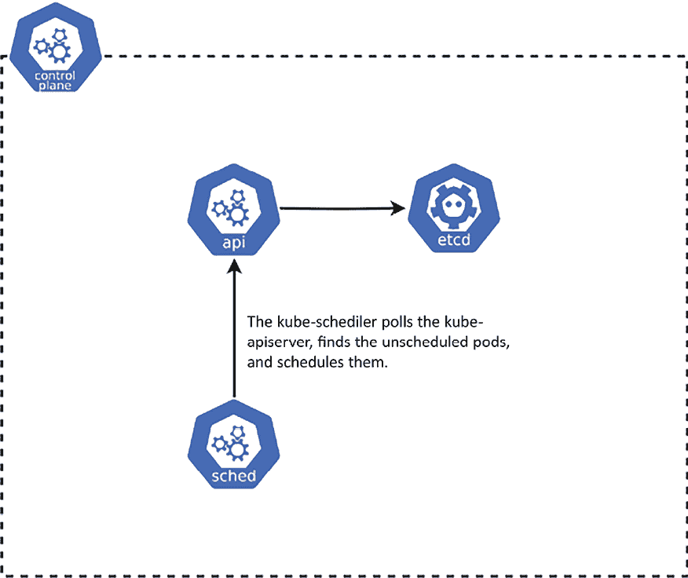

# 第十九章：Pods 调度的高级技术

在本书的 *第二章*，*Kubernetes 架构 – 从容器镜像到运行 Pods* 中，我们解释了 Kubernetes 调度器（`kube-scheduler`）控制平面组件背后的原理及其在集群中的关键作用。简而言之，它的责任是调度容器工作负载（Kubernetes Pods），并将它们分配到满足特定工作负载运行要求的健康节点。

本章将介绍如何控制集群中调度 Pods 的标准。我们将特别关注 Node **亲和性**、**污点**和 **容忍度**。我们还将深入探讨 **调度策略**，这为 `kube-scheduler` 提供了如何优先考虑 Pod 工作负载的灵活性。你会发现这些概念在云规模的生产集群运行中非常重要。

本章将覆盖以下内容：

+   温故 – 什么是 kube-scheduler？

+   管理 Node 亲和性

+   使用 Node 污点和容忍度

+   了解 Kubernetes 中的静态 Pods

+   Kubernetes 中的扩展调度器配置

# 技术要求

本章需要以下内容：

+   需要一个 *多节点* Kubernetes 集群。拥有一个多节点集群将使理解 Node 亲和性、污点和容忍度变得更加容易。

+   本地机器上已安装并配置用于管理 Kubernetes 集群的 Kubernetes CLI (`kubectl`)。

基本的 Kubernetes 集群部署（本地和云端）以及 `kubectl` 安装已在 *第三章*，*安装你的第一个 Kubernetes 集群* 中进行讲解。之前的 *第 15、16、17* 章为你提供了如何在不同的云平台上部署一个功能完整的 Kubernetes 集群的概述。

你可以从官方 GitHub 仓库下载本章的最新代码示例：[`github.com/PacktPublishing/The-Kubernetes-Bible-Second-Edition/tree/main/Chapter19`](https://github.com/PacktPublishing/The-Kubernetes-Bible-Second-Edition/tree/main/Chapter19)。

# 温故 – 什么是 kube-scheduler？

在 Kubernetes 集群中，kube-scheduler 是控制平面中的一个关键组件。该组件的主要职责是调度容器工作负载（Pods），并将它们**分配**到满足特定工作负载运行要求的健康计算节点（也称为工作节点）上。简而言之，Pod 是一个或多个共享网络和存储的容器组，是 Kubernetes 系统中最小的**部署单元**。你通常会使用不同的 Kubernetes 控制器，例如 Deployment 对象和 StatefulSet 对象，来管理 Pods，但最终是 kube-scheduler 将创建的 Pods 分配到集群中的特定节点。

对于云中的托管 Kubernetes 集群，例如 **Azure Kubernetes Service**（**AKS**）或 Amazon **Elastic Kubernetes Service**（**EKS**），通常无法访问控制平面或控制节点，因为它们由云服务提供商管理。这意味着你无法直接访问 `kube-scheduler` 等组件，也无法控制其配置（如调度策略）。然而，你仍然可以控制所有影响 Pod 调度的参数。

kube-scheduler 会定期查询 **Kubernetes API Server**（`kube-apiserver`），以列出尚未 *调度* 的 Pods。在创建时，Pods 会被标记为 *未* 调度—这意味着没有节点被选举来运行它们。一个未调度的 Pod 将在 `etcd` 集群状态中注册，但没有分配任何节点，因此没有运行的 kubelet 会知道这个 Pod。最终，Pod 规范中描述的容器此时不会运行。

在内部，Pod 对象在 `etcd` 中存储时具有一个名为 `nodeName` 的属性。顾名思义，这个属性应该包含将要托管该 Pod 的节点的名称。当这个属性被设置时，我们说 Pod 处于 `scheduled` 状态；否则，Pod 处于 `pending` 状态。

我们需要找到一种方法来填充这个`nodeName`值，而这正是 kube-scheduler 的作用。为此，kube-scheduler 会定期轮询 kube-apiserver。它会查找具有空 `nodeName` 属性的 Pod 资源。一旦找到这样的 Pod，它将执行算法来选举一个节点，并通过向 kube-apiserver 发出请求来更新 Pod 对象中的 `nodeName` 属性。在为 Pod 选择节点时，`kube-scheduler` 会考虑其内部的调度策略和你为 Pod 定义的标准。最后，负责在选定节点上运行 Pod 的 kubelet 会注意到该节点的 `scheduled` 状态下有一个新 Pod，并会尝试启动该 Pod。这些原则在下图中已可视化：



图 19.1：kube-scheduler 和 kube-apiserver 的交互

Pod 的调度过程分为两个阶段：

+   **过滤**：kube-scheduler 确定能够运行给定 Pod 的节点集合。这包括检查节点的实际状态，并验证 Pod 定义中指定的资源需求和标准。在此阶段，如果没有节点能够运行给定的 Pod，Pod 将无法调度，保持在待处理状态。

+   **评分**：kube-scheduler 根据一组 **调度策略** 为每个节点分配分数。然后，调度器将 Pod 分配给得分最高的节点。我们将在本章后面的部分讨论调度策略。

`kube-scheduler` 将考虑你可以选择传递到 Pod 规格中的标准和配置值。通过使用这些配置项，你可以精确控制 kube-scheduler 如何为 Pod 选择节点。为了控制 Pod 运行的位置，你可以设置约束，将其限制在特定节点上，或指明优先选择的节点。我们已经了解到，通常情况下，Kubernetes 会有效地处理 Pod 的分配，不需要任何手动约束，确保 Pods 在节点间分布，以避免资源短缺。然而，有时你可能需要影响 Pod 的位置，比如确保 Pod 运行在带有 SSD 的节点上，或将频繁通信的 Pods 安排在同一可用区内。

kube-scheduler 的决策只在 Pod 被调度的时刻有效。一旦 Pod 被调度并运行，kube-scheduler 就不会在 Pod 运行期间进行任何重新调度操作（这个过程可能持续数天甚至数月）。因此，即使 Pod 不再符合你的规则与节点匹配，它仍然会继续运行。只有当 Pod 被终止，并且需要调度新 Pod 时，才会进行重新调度。

你可以使用以下方法来影响 Kubernetes 中的 Pod 调度：

+   使用 `nodeSelector` 字段来匹配节点标签。

+   设置亲和性和反亲和性规则。

+   指定 `nodeName` 字段。

+   定义 Pod 拓扑分布约束。

+   污点和容忍。

在接下来的章节中，我们将讨论这些配置项以控制 Pods 的调度。在开始实际操作之前，请确保你有一个多节点的 Kubernetes 集群，以体验节点调度场景。

在我们的案例中，我们正在使用一个多节点的 Kubernetes 集群，并通过 `minikube` 进行部署，如下所示（你可以将驱动程序更改为 kvm2、Docker 或 Podman）：

```
$ minikube start \
  --driver=virtualbox \
  --nodes 3 \
  --cni calico \
  --cpus=2 \
  --memory=2g \
  --kubernetes-version=v1.30.0 \
  --container-runtime=containerd 
```

`--nodes=3` 参数将触发 minikube 部署一个 Kubernetes 集群，第一个节点作为控制节点（或主节点），第二个和第三个节点作为计算节点（或工作节点），如下所示：

```
$ kubectl get nodes
NAME           STATUS   ROLES           AGE     VERSION
minikube       Ready    control-plane   3m34s   v1.30.0
minikube-m02   Ready    <none>          2m34s   v1.30.0
minikube-m03   Ready    <none>          87s     v1.30.0 
```

如果你正在使用其他 Kubernetes 集群进行学习，可以跳过此 minikube 集群的设置。

现在，让我们来看看节点亲和性，以及节点名称和节点选择器。

# 管理节点亲和性

要了解 **节点亲和性** 在 Kubernetes 中是如何工作的，我们首先需要看一下最基本的调度选项，这些选项使用 **节点名称** 和 **节点选择器** 来调度 Pods。

## 使用 nodeName 来为 Pods 分配节点

如前所述，每个 Pod 对象都有一个 `nodeName` 字段，通常由 kube-scheduler 控制。然而，在你创建 Pod 时，或者创建使用 Pod 模板的控制器时，可以直接在 YAML 清单中设置该属性。这是将 Pod 静态调度到给定节点的最简单形式，通常*不推荐*使用——它不够灵活，也无法扩展。节点的名称可能随时间变化，而且你有可能在该节点上耗尽资源。

在调试场景中，当你想在特定节点上运行 Pod 时，明确设置 `nodeName` 可能会很有用。

我们将基于 *第十一章* 中介绍的示例 Deployment 对象演示所有调度原理，*使用 Kubernetes Deployment 管理无状态工作负载*。这是一个简单的 Deployment，管理着一个 `nginx` Web 服务器的 *五个* Pod 副本。

在我们在 Deployment 清单中使用 `nodeName` 之前，我们需要知道集群中有哪些节点，以便理解它们是如何调度的，以及我们如何能影响 Pod 的调度。你可以使用 `kubectl get nodes` 命令获取节点列表，如下所示：

```
$ kubectl get nodes
NAME           STATUS   ROLES           AGE     VERSION
minikube       Ready    control-plane   3m34s   v1.30.0
minikube-m02   Ready    <none>          2m34s   v1.30.0
minikube-m03   Ready    <none>          87s     v1.30.0 
```

在我们的示例中，我们运行的是一个三节点集群（稍后记得在清单中引用你正确的集群节点名称）。为了简化，我们将 `minikube` 称为 `Node1`，`minikube-m02` 称为 `Node2`，`minikube-m02` 称为 `Node3`。

在这个演示中，我们希望将所有五个 nginx Pods 调度到 `minikube-m02`。创建以下 YAML 清单，并命名为 `n01_nodename/nginx-deployment.yaml`：

```
# 01_nodename/nginx-deployment.yaml
apiVersion: apps/v1
kind: Deployment
metadata:
  name: nginx-app
spec:
  replicas: 5
  selector:
    matchLabels:
      app: nginx
      environment: test
  template:
    metadata:
      labels:
        app: nginx
        environment: test
    spec:
      containers:
        - name: nginx
          image: nginx:1.17
          ports:
            - containerPort: 80 
```

像往常一样应用 Deployment YAML：

```
$ kubectl apply -f 01_nodename/nginx-deployment.yaml
deployment.apps/nginx-app created 
```

Deployment 对象将创建五个 Pod 副本。使用 `kubectl get pods -o wide` 来查看 Pod 和节点名称。我们将使用如下的自定义输出：

```
$ kubectl get pods --namespace default --output=custom-columns="NAME:.metadata.name,STATUS:.status.phase,NODE:.spec.nodeName"
NAME                         STATUS    NODE
nginx-app-7b547cfd87-4g9qx   Running   minikube
nginx-app-7b547cfd87-m76l2   Running   minikube-m02
nginx-app-7b547cfd87-mjf78   Running   minikube-m03
nginx-app-7b547cfd87-vvrgk   Running   minikube-m02
nginx-app-7b547cfd87-w7jcw   Running   minikube-m03 
```

如你所见，默认情况下，Pods 已经均匀分配——Node1 收到了一个 Pod，Node2 收到了两个 Pods，Node3 收到了两个 Pods。这是 `kube-scheduler` 中启用的默认调度策略进行过滤和评分的结果。

如果你正在运行一个 **非托管** 的 Kubernetes 集群，你可以使用 `kubectl logs` 命令检查 kube-scheduler Pod 的日志，或者直接在控制平面节点中的 `/var/log/kube-scheduler.log` 查看。这可能还需要增加 kube-scheduler 进程的日志详细级别。你可以在 [`kubernetes.io/docs/reference/command-line-tools-reference/kube-scheduler/`](https://kubernetes.io/docs/reference/command-line-tools-reference/kube-scheduler/) 阅读更多信息。

此时，`.spec.template.spec` 中的 Pod 模板并不包含任何影响 Pod 副本调度的配置。

我们现在将通过在 Pod 模板中使用 `nodeName` 字段，**强制**将 Deployment 中的所有 Pod 分配到 **Node2**（在我们的例子中是 `minikube-m02`）。请更改 `nginx-deployment.yaml` YAML 清单，将该属性设置为 *你* 集群的正确节点名称：

```
# 01_nodename/nginx-deployment.yaml
apiVersion: apps/v1
kind: Deployment
metadata:
  name: nginx-app
spec:
  ...
  template:
  ...
    spec:
      **nodeName:****minikube-m02**
...<removed for brevity>... 
```

注意这一行 `nodeName: minikube-m02`；我们明确指出 `minikube-m02` 应该作为部署 nginx Pods 的节点。

使用 `kubectl apply -f ./nginx-deployment.yaml` 命令将清单应用到集群中：

```
$ kubectl apply -f 01_nodename/nginx-deployment.yaml
deployment.apps/nginx-app created 
```

现在，再次检查 Pod 状态和节点分配情况：

```
$ kubectl get pods --namespace default --output=custom-columns="NAME:.metadata.name,STATUS:.status.phase,NODE:.spec.nodeName"
NAME                         STATUS    NODE
nginx-app-85b577894f-8tqj7   Running   minikube-m02
nginx-app-85b577894f-9c6hd   Running   minikube-m02
nginx-app-85b577894f-fldxx   Running   minikube-m02
nginx-app-85b577894f-jrnjc   Running   minikube-m02
nginx-app-85b577894f-vs7c5   Running   minikube-m02 
```

正如预期的那样，*所有五个* Pod 现在都运行在 Node2（`minikube-m02`）上。这些都是新的 Pod——当你在 Deployment 规范中更改 Pod 模板时，它会导致一个新的 ReplicaSet 对象的内部回滚，而旧的 ReplicaSet 对象则会缩小，如 *第十一章* 中所述，*使用 Kubernetes Deployments 管理无状态工作负载*。

通过这种方式，我们实际上已经 *绕过* 了 `kube-scheduler`。如果你使用 `kubectl describe pod` 命令检查其中一个 Pod 的事件，你会看到它缺少任何带有 `Scheduled` 作为原因的事件。

接下来，我们将看看另一种基本的 Pod 调度方法，即 `nodeSelector`。

## 使用 nodeSelector 为 Pods 调度

Pod 规范有一个特殊字段 `.spec.nodeSelector`，该字段使你能够仅在具有特定标签值的节点上调度 Pod。这个概念类似于 **标签选择器** 用于 Deployments 和 StatefulSets，但不同之处在于，它仅允许对标签进行简单的 *等式比较*。你不能进行复杂的 *基于集合* 的逻辑操作。

这在以下情况下特别有用：

+   **混合集群**：通过将操作系统指定为调度标准，确保 Windows 容器在 Windows 节点上运行，而 Linux 容器在 Linux 节点上运行。

+   **资源分配**：将 Pods 定向到具有特定资源（CPU、内存、存储）的节点，以优化资源利用率。

+   **硬件要求**：仅在具有相关能力的节点上调度需要特殊硬件（例如 GPU）的 Pod。

+   **安全区域**：通过标签定义安全区域，并使用`nodeSelector`限制 Pods 只能在特定区域内运行，以增强安全性。

每个 Kubernetes 节点默认都带有一组标签，包括以下内容：

+   `kubernetes.io/arch`：描述节点的处理器架构，例如 `amd64` 或 `arm`。这也被定义为 `beta.kubernetes.io/arch`。

+   `kubernetes.io/os`：该标签的值为 `linux` 或 `Windows`。这也被定义为 `beta.kubernetes.io/os`。

+   `node-role.kubernetes.io/control-plane`：节点在 Kubernetes 集群中的角色。

如果你检查其中一个节点的标签，你会看到有很多标签。在我们的例子中，其中一些是特定于`minikube`集群的：

```
$ kubectl describe nodes minikube
Name:               minikube
Roles:              control-plane
Labels:             beta.kubernetes.io/arch=amd64
                    beta.kubernetes.io/os=linux
                    kubernetes.io/arch=amd64
                    kubernetes.io/hostname=minikube
                    kubernetes.io/os=linux
                    minikube.k8s.io/commit=5883c09216182566a63dff4c326a6fc9ed2982ff
                    minikube.k8s.io/name=minikube
                    minikube.k8s.io/primary=true
                    minikube.k8s.io/updated_at=2024_07_21T16_40_25_0700
                    minikube.k8s.io/version=v1.33.1
                    node-role.kubernetes.io/control-plane=
                    node.kubernetes.io/exclude-from-external-load-balancers=
...<removed for brevity>... 
```

当然，你可以为节点定义 *自己的* 标签，并使用这些标签来控制调度。请注意，通常你应该在 Kubernetes 中使用语义标签来标识资源，而不是仅仅为了调度的目的给资源添加特殊标签。让我们通过以下步骤演示如何操作：

1.  使用 `kubectl label nodes` 命令，将一个 `node-type` 标签（值为 `superfast`）添加到集群中的 `Node` `1` 和 `Node` `2`：

    ```
    $ kubectl label nodes minikube-m02 node-type=superfast
    node/minikube-m02 labeled
    $ kubectl label nodes minikube-m03 node-type=superfast
    node/minikube-m03 labeled 
    ```

1.  按照以下方式验证节点标签：

    ```
    $ kubectl get nodes --show-labels |grep superfast
    minikube-m02   Ready    <none>          2m59s   v1.31.0   beta.kubernetes.io/arch=amd64,beta.kubernetes.io/os=linux,kubernetes.io/arch=amd64,kubernetes.io/hostname=minikube-m02,kubernetes.io/os=linux,minikube.k8s.io/commit=5883c09216182566a63dff4c326a6fc9ed2982ff,minikube.k8s.io/name=minikube,minikube.k8s.io/primary=false,minikube.k8s.io/updated_at=2024_10_13T15_26_06_0700,minikube.k8s.io/version=v1.33.1,**node-type=superfast**
    minikube-m03   Ready    <none>          2m30s   v1.31.0   beta.kubernetes.io/arch=amd64,beta.kubernetes.io/os=linux,kubernetes.io/arch=amd64,kubernetes.io/hostname=minikube-m03,kubernetes.io/os=linux,minikube.k8s.io/commit=5883c09216182566a63dff4c326a6fc9ed2982ff,minikube.k8s.io/
    name=minikube,minikube.k8s.io/primary=false,minikube.k8s.io/updated_at=2024_10_13T15_26_34_0700,minikube.k8s.io/version=v1.33.1,**node-type=superfast** 
    ```

1.  编辑 `./nginx-deployment.yaml` 部署清单（或创建另一个名为 `02_nodeselector/nginx-deployment.yaml` 的清单），使 Pod 模板中的 `nodeSelector` 设置为 `node-type: superfast`，如下所示：

    ```
    # 02_nodeselector/nginx-deployment.yaml
    apiVersion: apps/v1
    kind: Deployment
    metadata:
      name: nginx-app
    spec:
      ...
      template:
        ...
        spec:
          nodeSelector:
            **node-type:****superfast**
    ...<removed for brevity> 
    ```

1.  使用 `kubectl apply -f 02_nodeselector/nginx-deployment.yaml` 命令将清单应用到集群中，然后再次检查 Pod 状态和节点分配。您可能需要等一段时间，直到 Deployment 完成滚动更新：

    ```
    $ kubectl get pods --namespace default --output=custom-columns="NAME:.metadata.name,STATUS:.status.phase,NODE:.spec.nodeName"
    NAME                        STATUS    NODE
    nginx-app-6c5b8b758-2dcsc   Running   minikube-m02
    nginx-app-6c5b8b758-48c5t   Running   minikube-m03
    nginx-app-6c5b8b758-pfmvg   Running   minikube-m03
    nginx-app-6c5b8b758-v6rhj   Running   minikube-m02
    nginx-app-6c5b8b758-zqvqm   Running   minikube-m02 
    ```

如前面的输出所示，Pod 现在已分配给 `minikube-m02` 和 `minikube-m03`（`minikube-m02` 已分配了三个 Pod，`minikube-m03` 分配了两个 Pod）。这些 Pod 已经分布在具有 `node-type=superfast` 标签的节点上。

1.  相反，如果您修改 `./nginx-deployment.yaml` 清单，使 Pod 模板中的 `nodeSelector` 设置为 `node-type: slow`，而集群中没有节点分配此标签，我们将看到 Pod 无法调度，Deployment 会被卡住。编辑清单（或将其复制到一个名为 `02_nodeselector/nginx-deployment-slow.yaml` 的新文件中）：

    ```
    # 02_nodeselector/nginx-deployment.yaml
    apiVersion: apps/v1
    kind: Deployment
    metadata:
      name: nginx-app
    spec:
      ...
      template:
        ...
        spec:
          nodeSelector:
            node-type: slow
    ...<removed for brevity> 
    ```

1.  以如下方式将清单应用到集群中：

    ```
    $ kubectl apply -f  02_nodeselector/nginx-deployment-slow.yaml 
    ```

再次检查 Pod 状态和节点分配：

```
$ kubectl get pods --namespace default --output=custom-columns="NAME:.metadata.name,STATUS:.status.phase,NODE:.spec.nodeName"
NAME                        STATUS    NODE
nginx-app-6c5b8b758-48c5t   Running   minikube-m03
nginx-app-6c5b8b758-pfmvg   Running   minikube-m03
nginx-app-6c5b8b758-v6rhj   Running   minikube-m02
nginx-app-6c5b8b758-zqvqm   Running   minikube-m02
nginx-app-9cc8544f4-7dwcd   Pending   <none>
nginx-app-9cc8544f4-cz947   Pending   <none>
nginx-app-9cc8544f4-lfqqj   Pending   <none> 
```

三个新 Pod 正处于挂起状态，四个旧 Pod 仍在运行的原因是 Deployment 对象中滚动更新的默认配置。默认情况下，`maxSurge` 设置为 Pod 副本的 `25%`（绝对数量会*向上取整*），因此在我们的情况下，允许创建超过五个 Pod 所需数量的两个 Pod。总的来说，现在我们有七个 Pod。同时，`maxUnavailable` 也是 Pod 副本的 `25%`（但绝对数量会*向下取整*），所以在我们的情况下，五个 Pod 中有一个 Pod 是不可用的。换句话说，四个 Pod 必须是 `Running` 状态。而且，由于新创建的 `Pending` 状态 Pod 在调度过程中无法获取节点，Deployment 被卡住，无法继续进行。通常，在这种情况下，您需要要么将 Deployment 回滚到之前的版本，要么将 `nodeSelector` 更改为与现有节点匹配的值。当然，您也可以选择添加一个带有匹配标签的新节点，或者向现有节点添加缺失的标签，而不进行回滚。

我们现在将继续讨论 Pod 调度的话题，首先介绍一些更高级的技术：**Node 亲和性**。

## 使用 Pod 的 nodeAffinity 配置

Node 亲和性的概念扩展了 `nodeSelector` 方法，并提供了一个更丰富的语言来定义哪些节点是 Pod 更倾向或避免的。在日常生活中，“affinity” 一词的定义是“*对某人或某事的自然喜好和理解*”，这正好描述了 Node 亲和性对 Pod 的目的。也就是说，您可以控制 Pod 将被*吸引*到哪些节点，或者哪些节点会被*排斥*。

通过使用 Node 亲和性，表示在 Pod 的 `.spec.affinity.nodeAffinity` 中，您可以获得比简单的 `nodeSelector` 更强大的功能：

+   您将获得一个更丰富的语言来表达匹配 Pod 到节点的规则。例如，您可以使用 `In`、`NotIn`、`Exists`、`DoesNotExist`、`Gt` 和 `Lt` 操作符来处理标签。

+   与`nodeAffinity`类似，也可以使用`Pod 间`亲和性（`podAffinity`）以及额外的`反亲和性`（`podAntiAffinity`）进行调度。反亲和性与亲和性具有相反的效果——你可以定义排斥 Pod 的规则。通过这种方式，你可以让 Pod 被吸引到*已经运行*某些 Pod 的节点上。如果你想将 Pod 协同调度以降低延迟，这尤其有用。

+   可以定义**软性**亲和性和反亲和性规则，表示*偏好*，而不是**硬性**规则。换句话说，即使调度器无法匹配软性规则，它仍然可以调度 Pod。软性规则在规范中由`preferredDuringSchedulingIgnoredDuringExecution`字段表示，而硬性规则由`requiredDuringSchedulingIgnoredDuringExecution`字段表示。

+   软性规则可以**加权**，并且可以添加多个不同权重值的规则。调度器将考虑这些权重值以及其他参数来做出亲和性决策。

尽管规范中没有提供一个专门的字段用于节点反亲和性，与 Pod 间反亲和性类似，你仍然可以通过使用`NotIn`和`DoesNotExist`操作符来实现类似效果。通过这种方式，你可以让 Pod 从带有特定标签的节点上被排斥，同样以软性方式进行。有关更多信息，请参见文档：[`kubernetes.io/docs/concepts/scheduling-eviction/assign-pod-node/#affinity-and-anti-affinity`](https://kubernetes.io/docs/concepts/scheduling-eviction/assign-pod-node/#affinity-and-anti-affinity)。

定义节点亲和性和 Pod 间亲和性/反亲和性规则的使用场景和案例是*无限的*。只要节点上有足够的标签，你就可以通过这种方式表达各种要求。例如，你可以建模类似的需求：仅将 Pod 调度到带有 Intel CPU 和高端存储的 Windows 节点上，并且位于西欧区域，但当前没有运行 MySQL 的 Pod，或者尽量不将 Pod 调度到可用区 1，但如果无法避免，那么可用区 1 仍然可以接受。

为了演示节点亲和性，我们将尝试为我们的部署建模以下需求：“*尽量*将 Pod 调度到带有`node-type`标签且值为`fast`或`superfast`的节点上，但如果无法满足这个条件，可以使用任何节点，但*严格*避免使用`node-type`标签值为`extremelyslow`的节点。”为此，我们需要使用：

+   **软性节点亲和性**规则，类型为`preferredDuringSchedulingIgnoredDuringExecution`，用于匹配`fast`和`superfast`节点。

+   **硬性节点亲和性**规则，类型为`requiredDuringSchedulingIgnoredDuringExecution`，用于严格排除带有`node-type`标签且值为`extremelyslow`的节点。我们需要使用`NotIn`操作符来实现反亲和性效果。

在我们的集群中，我们将首先为节点定义以下标签：

+   `Node1`: `slow`

+   `Node2`: `fast`

+   `Node3`：`superfast`

如你所见，根据我们的要求，Deployment Pods 应该被调度到 Node2 和 Node3，除非有某些因素阻止它们被分配到那里，比如缺乏 CPU 或内存资源。在这种情况下，Node1 也会被允许，因为我们使用了软性亲和性规则。

接下来，我们将按照以下方式重新标记节点：

+   `Node1`：`slow`

+   `Node2`：`extremelyslow`

+   `Node3`：`extremelyslow`

接下来，我们需要重新部署我们的 Deployment（例如，将其缩放为零，然后恢复到原始副本数，或者使用`kubectl rollout restart`命令），以便重新调度 Pods。之后，根据我们的要求，kube-scheduler 应该将所有 Pods 调度到 Node1（因为它仍然符合软性规则），但*无论如何都要避免*Node2 和 Node3。如果 Node1 没有资源来运行 Pod，那么 Pods 将处于`Pending`状态。

为了解决已经运行的 Pods 重新调度的问题（换句话说，让 kube-scheduler 重新考虑它们），有一个正在孵化的 Kubernetes 项目叫做**Descheduler**。你可以在这里了解更多信息：[`github.com/kubernetes-sigs/descheduler`](https://github.com/kubernetes-sigs/descheduler)。

为了进行演示，请按照以下步骤操作：

1.  使用`kubectl label nodes`命令为 Node1 添加一个`node-type`标签，值为`slow`，为 Node2 添加`fast`值标签，为 Node3 添加`superfast`值标签：

    ```
    $ kubectl label nodes --overwrite minikube node-type=slow
    node/minikube labeled
    $ kubectl label nodes --overwrite minikube-m02 node-type=fast
    node/minikube-m02 labeled
    $ kubectl label nodes --overwrite minikube-m03 node-type=superfast
    node/minikube-m03 not labeled
    # Note that this label was already present with this value 
    ```

1.  编辑`03_affinity/nginx-deployment.yaml` Deployment 清单，并按如下方式定义软性节点亲和性规则：

    ```
    # 03_affinity/nginx-deployment.yaml
    ...
    spec:
      ...
      template:
        ...
        spec:
          affinity:
            nodeAffinity:
              requiredDuringSchedulingIgnoredDuringExecution:
                nodeSelectorTerms:
                - matchExpressions:
                  - key: node-type
                    operator: NotIn
                    values:
                    - extremelyslow
              preferredDuringSchedulingIgnoredDuringExecution:
              - weight: 1
                preference:
                  matchExpressions:
                  - key: node-type
                    operator: In
                    values:
                    - fast
                    - superfast
    ...<removed for brevity>... 
    ```

如你所见，我们使用了`nodeAffinity`（而不是`podAffinity`或`podAntiAffinity`），并设置了`preferredDuringSchedulingIgnoredDuringExecution`，这样它只有一个软性规则：`node-type`应该具有`fast`值或`superfast`值。这意味着，如果这些节点上没有资源，它们仍然可以调度到其他节点。此外，我们在`requiredDuringSchedulingIgnoredDuringExecution`中指定了一个硬性反亲和性规则，要求`node-type`*不能是*`extremelyslow`。你可以在官方文档中找到 Pod 的`.spec.affinity`的完整规范：[`kubernetes.io/docs/concepts/scheduling-eviction/assign-pod-node/#affinity-and-anti-affinity`](https://kubernetes.io/docs/concepts/scheduling-eviction/assign-pod-node/#affinity-and-anti-affinity)。

1.  使用`kubectl apply -f 03_affinity/nginx-deployment.yaml`命令将清单应用到集群中，然后再次检查 Pod 的状态和节点分配情况。你可能需要等待一段时间，直到部署完成：

    ```
    $ kubectl get pods --namespace default --output=custom-columns="NAME:.metadata.name,STATUS:.status.phase,NODE:.spec.nodeName"
    NAME                         STATUS    NODE
    nginx-app-7766c596cc-4d4sl   Running   minikube-m02
    nginx-app-7766c596cc-4h6k6   Running   minikube-m03
    nginx-app-7766c596cc-ksld5   Running   minikube-m03
    nginx-app-7766c596cc-nw9hx   Running   minikube-m02
    nginx-app-7766c596cc-tmwhm   Running   minikube-m03 
    ```

我们的节点亲和性规则被定义为偏好具有`node-type`为`fast`或`superfast`的节点，实际上 Pods 只会调度到 Node2 和 Node3。

现在，我们将进行一次实验，演示节点亲和性的软性部分是如何与节点反亲和性的硬性部分协同工作的。我们将按照引言中描述的方式重新标记节点，重新部署 Deployment，并观察发生的变化。请按照以下步骤操作：

1.  使用 `kubectl label nodes` 命令为 `Node 0` 添加 `node-type` 标签，并将其值设置为 `slow`，为 `Node1` 设置值为 `extremelyslow`，为 `Node2` 设置值为 `extremelyslow`：

    ```
    $ kubectl label nodes --overwrite minikube node-type=slow
    node/minikube not labeled
    # Note that this label was already present with this value
    $ kubectl label nodes --overwrite minikube-m02 node-type=extremelyslow
    node/minikube-m02 labeled
    $ kubectl label nodes --overwrite minikube-m03 node-type=extremelyslow
    node/minikube-m03 labeled 
    ```

1.  此时，如果你使用 `kubectl get pods` 检查 Pod 分配情况，结果将没有变化。因为正如我们之前解释的，Pod 的节点分配只在调度时有效，之后除非 Pod 被重启，否则不会更改。为了强制重启 Pods，我们可以将 Deployment 缩放到零副本，然后再恢复到五个副本。但有一种更简单的方法，即使用 `kubectl rollout restart` 命令。这种方法的好处是不会使 Deployment 不可用，并且会进行滚动重启，而不会减少可用 Pod 的数量。执行以下命令：

    ```
    $ kubectl rollout restart deployment nginx-app
    deployment.apps/nginx-app restarted 
    ```

1.  再次检查 Pod 状态和节点分配。你可能需要等待一段时间，直到部署完成：

    ```
    $ kubectl get pods --namespace default --output=custom-columns="NAME:.metadata.name,STATUS:.status.phase,NODE:.spec.nodeName"
    NAME                         STATUS    NODE
    nginx-app-7d8c65464c-5d9cc   Running   minikube
    nginx-app-7d8c65464c-b97g8   Running   minikube
    nginx-app-7d8c65464c-cqwh5   Running   minikube
    nginx-app-7d8c65464c-kh8bm   Running   minikube
    nginx-app-7d8c65464c-xhpss   Running   minikube 
    ```

输出结果显示，如预期所示，所有 Pod 都已调度到标记为 `node-type=slow` 的 Node1 上。如果没有更好的节点可用，我们允许 Pod 调度到这样的节点，而此时，Node2 和 Node3 被标记为 `node-type=extremelyslow`，这被硬性节点反亲和性规则禁止。

为了实现更高的粒度和对 Pod 调度的控制，你可以使用 *Pod 拓扑分布约束*。更多细节请参考官方文档：[`kubernetes.io/docs/concepts/workloads/pods/pod-topology-spread-constraints/`](https://kubernetes.io/docs/concepts/workloads/pods/pod-topology-spread-constraints/)。

恭喜，你已经成功为我们的部署 Pod 配置了节点亲和性！接下来，我们将探索另一种调度 Pod 的方法——*污点和容忍*。

# 使用节点污点和容忍

使用节点和 Pod 之间的亲和性机制调度 Pods 非常强大，但有时你需要一种更简单的方式来指定哪些节点应该 *排斥* Pods。Kubernetes 提供了两个稍微旧一些、但更简单的功能来实现这一点——**污点**和**容忍**。你可以对某个节点应用污点（描述某种限制），而 Pod 必须定义一个特定的容忍才可以调度到这个被污点标记的节点上。如果 Pod 有容忍，并不意味着该节点上必须存在污点。*污点*的定义是“有不良或不希望出现的物质或特质的痕迹”，这个定义很符合我们的想法——如果节点上有污点，所有 Pod 都会 *避开* 这个节点，但我们可以指示 Pod *容忍* 特定的污点。

如果仔细观察污点和容忍度的描述，你会发现，你可以通过节点标签和节点的硬性和软性亲和性规则（使用`NotIn`操作符）实现类似的效果。有一个例外——你可以定义一个`NoExecute`效果的污点，如果 Pod 无法容忍这个污点，Pod 将会被终止。除非手动重启 Pod，否则你不能通过亲和性规则实现类似的效果。

节点的污点结构如下：`<key>=<value>:<effect>`。**key**和**value**对 *标识* 了污点，可以用于更精细的容忍度定义，例如，容忍所有具有给定 key 和任意 value 的污点。这类似于标签，但请记住，污点是独立的属性，定义污点不会影响节点标签。在我们的示例中，我们将使用`machine-check-exception`作为 key，`memory`作为 value。这当然是一个理论示例，表示主机的内存存在硬件问题，但你也可以使用相同的 key，而 value 可以是`cpu`或`disk`。

一般来说，你的污点应当 *语义上* 标明节点遇到的具体问题。虽然没有任何限制禁止你使用任意的 key 和 value 来创建污点，但如果它们具有语义意义，那么管理这些污点和定义容忍度会更容易。

污点可能会产生不同的效果：

+   `NoSchedule` – kube-scheduler *将不会调度* Pods 到此节点。通过使用硬性节点亲和性规则也可以实现类似的行为。

+   `PreferNoSchedule` – kube-scheduler *将尽量不调度* Pods 到这个节点。通过使用软性节点亲和性规则也可以实现类似的行为。

+   `NoExecute` – kube-scheduler *将不会调度* Pods 到此节点，并且会 *驱逐*（终止并重新调度）已在此节点上运行的 Pods。你不能通过节点亲和性规则实现类似的行为。注意，当你为 Pod 定义这种类型的污点的容忍度时，你可以控制 Pod 容忍该污点的时间长度，直到被驱逐，这可以通过`tolerationSeconds`来设置。

Kubernetes 通过监控节点主机自动管理许多`NoExecute`类型的污点。以下污点是由**NodeController**或`kubelet`内置并管理的：

+   `node.kubernetes.io/not-ready`：当节点条件`Ready`的状态为`false`时会添加此污点。

+   `node.kubernetes.io/unreachable`：当节点条件`Ready`的状态为`Unknown`时会添加此污点。这种情况发生在`NodeController`无法访问节点时。

+   `node.kubernetes.io/memory-pressure`：节点正在经历内存压力。

+   `node.kubernetes.io/disk-pressure`：节点正在经历磁盘压力。

+   `node.kubernetes.io/network-unavailable`：节点的网络当前不可用。

+   `node.kubernetes.io/unschedulable`：节点当前处于`unschedulable`状态。

+   `node.cloudprovider.kubernetes.io/uninitialized`：用于由外部云提供商准备的节点。当节点被`cloud-controller-manager`初始化时，这个污点会被移除。

要在节点上添加污点，您可以使用以下方式的`kubectl taint node`命令：

```
$ kubectl taint node <nodeName> <key>=<value>:<effect> 
```

所以，例如，如果我们想对 Node1 使用`machine-check-exception`作为 key，`memory`作为 value，并设置`NoExecute`效果，可以使用以下命令：

```
$ kubectl taint node minikube machine-check-exception=memory:NoExecute
node/minikube tainted 
```

要移除相同的污点，您需要使用以下命令（请记住污点定义末尾的`-`字符）：

```
$ kubectl taint node minikube machine-check-exception=memory:NoExecute-
node/minikube untainted 
```

您还可以删除具有指定`key`的所有污点：

```
$ kubectl taint node minikube machine-check-exception:NoExecute- 
```

为了抵消污点对特定 Pods 的影响，您可以在它们的规格中定义宽容度。换句话说，您可以使用宽容度忽略污点，并将 Pod 调度到这些节点上。如果一个节点上有多个污点，Pod 必须容忍所有这些污点。宽容度在 Pod 规格的`.spec.tolerations`中定义，并具有以下结构：

```
tolerations:
- key: <key>
  operator: <operatorType>
  value: <value>
  effect: <effect> 
```

操作符可以是`Equal`或`Exists`。`Equal`意味着污点的`key`和`value`必须完全匹配，而`Exists`则意味着只需匹配`key`，`value`不做考虑。在我们的示例中，如果我们想忽略污点，则宽容度将需要如下所示：

```
tolerations:
- key: machine-check-exception
  operator: Equal
  value: memory
  effect: NoExecute 
```

请注意，您可以为 Pod 定义多个宽容度，以确保 Pod 正确地放置。

对于`NoExecute`宽容度，您可以定义一个额外的字段`tolerationSeconds`，它指定 Pod 将容忍污点多长时间，直到被驱逐。因此，这是一种在超时后对污点进行部分宽容的方式。请注意，如果使用`NoExecute`污点，通常还需要添加`NoSchedule`污点。通过这种方式，您可以防止当 Pod 具有`NoExecute`宽容度并设置`tolerationSeconds`时发生**驱逐循环**。这是因为污点在指定的秒数内不起作用，这也包括*不*阻止 Pod 被调度到带污点的节点。

当 Pods 在集群中创建时，Kubernetes 会自动为`node.kubernetes.io/not-ready`和`node.kubernetes.io/unreachable`添加两个`Exists`宽容度，`tolerationSeconds`设置为`300`。

现在我们已经了解了污点和宽容度，我们将通过一些演示将这些知识付诸实践。请按照以下步骤进行污点和宽容度练习：

1.  如果您在前一个部分中定义了带有节点亲和性的`nginx-app`部署仍在运行，它当前会将所有 Pods 运行在 Node1（`minikube`）上。节点亲和性规则的构造方式使得 Pods 无法调度到 Node2 和 Node3 上。让我们看看如果您将 Node1 带上`machine-check-exception=memory:NoExecute`污点时会发生什么：

    ```
    $ kubectl taint node minikube machine-check-exception=memory:NoExecute
    node/minikube tainted 
    ```

1.  检查 Pod 状态和节点分配：

    ```
    $ kubectl get pods --namespace default --output=custom-columns="NAME:.metadata.name,STATUS:.status.phase,NODE:.spec.nodeName"
    NAME                         STATUS    NODE
    nginx-app-7d8c65464c-5j69n   Pending   <none>
    nginx-app-7d8c65464c-c8j58   Pending   <none>
    nginx-app-7d8c65464c-cnczc   Pending   <none>
    nginx-app-7d8c65464c-drpdh   Pending   <none>
    nginx-app-7d8c65464c-xss9b   Pending   <none> 
    ```

所有部署的 Pod 现在都处于 `Pending` 状态，因为 kube-scheduler 无法找到一个可以运行它们的 Node。

1.  编辑 `./nginx-deployment.yaml` 部署清单（或者检查 `04_taints/nginx-deployment.yaml`）并移除 `affinity`。取而代之的是，定义对 `machine-check-exception=memory:NoExecute` 的污点容忍，超时时间为 60 秒，如下所示：

    ```
    # 04_taints/nginx-deployment.yaml
    apiVersion: apps/v1
    kind: Deployment
    metadata:
      name: nginx-app
    spec:
      ...
      template:
        ...
        spec:
          tolerations:
            - key: machine-check-exception
              operator: Equal
              value: memory
              effect: NoExecute
              tolerationSeconds: 60
    ...<removed for brevity>... 
    ```

当这个清单应用到集群时，阻止调度到 Node2 和 Node3 的旧 Node 亲和规则将被移除。Pod 将能够在 Node2 和 Node3 上调度，但 Node1 有一个污点 `machine-check-exception=memory:NoExecute`。因此，Pod 应该*不*被调度到 `Node0`，因为 `NoExecute` 意味着 `NoSchedule`，*对吗*？让我们来检查一下。

1.  使用 `kubectl apply -f 04_taints/nginx-deployment.yaml` 命令将清单应用到集群，并再次检查 Pod 状态和 Node 分配。你可能需要等一段时间，直到部署完成：

    ```
    $ kubectl get pods --namespace default --output=custom-columns="NAME:.metadata.name,STATUS:.status.phase,NODE:.spec.nodeName"
    NAME                         STATUS    NODE
    nginx-app-84d755f746-4zkjd   Running   minikube
    nginx-app-84d755f746-58qmh   Running   minikube-m02
    nginx-app-84d755f746-5h5vk   Running   minikube-m03
    nginx-app-84d755f746-psmgf   Running   minikube-m02
    nginx-app-84d755f746-zkbc6   Running   minikube-m03 
    ```

这个结果可能有点令人惊讶。正如你所看到的，我们将 Pod 调度到了 Node2 和 Node3，但同时 Node1 也接收到了 Pod，并且它们每 60 秒就会进入驱逐循环！解释是，`NoExecute` 污点的 `tolerationSeconds` 表示该污点会被忽略 60 秒。因此，kube-scheduler 可以将 Pod 调度到 Node1，即使它会被稍后驱逐。

1.  让我们通过应用一个建议来修复这种行为：每当使用 `NoExecute` 污点时，使用一个 `NoSchedule` 污点。这样，驱逐的 Pod 就没有机会再次调度到被污点标记的 Node，除非它们也开始容忍这种类型的污点。执行以下命令来给 `Node0` 添加污点：

    ```
    $ kubectl taint node minikube machine-check-exception=memory:NoSchedule
    node/minikube tainted 
    ```

1.  再次检查 Pod 状态和 Node 分配：

    ```
    $ kubectl get pods --namespace default --output=custom-columns="NAME:.metadata.name,STATUS:.status.phase,NODE:.spec.nodeName"
    NAME                         STATUS    NODE
    nginx-app-84d755f746-58qmh   Running   minikube-m02
    nginx-app-84d755f746-5h5vk   Running   minikube-m03
    nginx-app-84d755f746-psmgf   Running   minikube-m02
    nginx-app-84d755f746-sm2cm   Running   minikube-m03
    nginx-app-84d755f746-zkbc6   Running   minikube-m03 
    ```

在输出中，你可以看到 Pod 现在在 Node2 和 Node3 之间分布——完全符合我们的预期。

1.  现在，移除 Node1 上的*两个*污点：

    ```
    $ kubectl taint node minikube machine-check-exception-
    node/minikube untainted 
    ```

1.  使用以下命令重启部署以重新调度 Pod：

    ```
    $ kubectl rollout restart deployment nginx-app
    deployment.apps/nginx-app restarted 
    ```

1.  再次检查 Pod 状态和 Node 分配：

    ```
    $ kubectl get pods --namespace default --output=custom-columns="NAME:.metadata.name,STATUS:.status.phase,NODE:.spec.nodeName"
    NAME                         STATUS    NODE
    nginx-app-5bdd957558-fj7bk   Running   minikube-m02
    nginx-app-5bdd957558-mrddn   Running   minikube-m03
    nginx-app-5bdd957558-mz2pz   Running   minikube-m02
    nginx-app-5bdd957558-pftz5   Running   minikube-m03
    nginx-app-5bdd957558-vm6k9   Running   minikube 
    ```

Pod 已经在所有三个 Node 上均匀分布。

1.  最后，让我们看看 `NoExecute` 和 `NoSchedule` 污点的组合是如何工作的，`NoExecute` 的 `tolerationSeconds` 设置为 `60`。再次对 Node1 应用两个污点：

    ```
    $ kubectl taint node minikube machine-check-exception=memory:NoSchedule
    node/minikube tainted
    $ kubectl taint node minikube machine-check-exception=memory:NoExecute
    node/minikube tainted 
    ```

1.  紧接着，开始监视 Pod 及其 Node 分配。一开始，你会看到 Pod 在 Node1 上运行了一段时间。但在 60 秒后，你会看到：

    ```
    $ kubectl get pods --namespace default --output=custom-columns="NAME:.metadata.name,STATUS:.status.phase,NODE:.spec.nodeName"
    NAME                         STATUS    NODE
    nginx-app-5bdd957558-7n42p   Running   minikube-m03
    nginx-app-5bdd957558-fj7bk   Running   minikube-m02
    nginx-app-5bdd957558-mrddn   Running   minikube-m03
    nginx-app-5bdd957558-mz2pz   Running   minikube-m02
    nginx-app-5bdd957558-pftz5   Running   minikube-m03 
    ```

正如我们预期的那样，Pod 在 60 秒后被驱逐，并且没有出现驱逐调度循环。

这演示了污点的一个更高级的使用场景，是你无法轻易通过 Node 亲和规则替代的。

让我们在下一节了解静态 Pod。

# 理解 Kubernetes 中的静态 Pod

静态 Pod 提供了在 Kubernetes 集群中管理 Pod 的另一种方式。与由集群的 Pod 调度器和 API 服务器控制的常规 Pod 不同，静态 Pod 由特定节点上的 kubelet 守护进程直接管理。除非通过 kubelet 为其创建的镜像 Pod，否则 API 服务器无法感知这些 Pod。

**关键特性**：

+   **节点特定**：静态 Pod 绑定到单个节点，无法在集群中其他地方移动。

+   **Kubelet 管理**：指定节点上的 kubelet 负责启动、停止和重启静态 Pod。

+   **镜像 Pod**：kubelet 在 API 服务器上创建镜像 Pod 以反映静态 Pod 的状态，但这些镜像 Pod 不能通过 API 控制。

静态 Pod 可以通过两种主要方法创建。第一种方法是文件系统托管配置，您将 Pod 定义以 YAML 或 JSON 格式放在节点上的特定目录中。kubelet 定期扫描此目录，并根据现有文件管理 Pod。第二种方法是 Web 托管配置，其中 Pod 定义托管在 Web 服务器上的 YAML 文件中。kubelet 配置该文件的 URL，并定期下载它以管理静态 Pod。

静态 Pod 通常用于在每个节点上引导集群的核心组件，例如 API 服务器或控制器管理器。然而，在集群中的每个节点上运行 Pod 时，通常推荐使用 DaemonSets。静态 Pod 有一些限制，比如不能引用其他 Kubernetes 对象（如 Secrets 或 ConfigMaps），并且不支持临时容器。在需要对 Pod 在各个节点上的位置进行严格控制的场景下，理解静态 Pod 会很有用。

到目前为止，我们已覆盖了控制 Pod 调度和位置的不同机制。在下一节中，我们将简要概述其他调度器配置和功能。

# Kubernetes 中的扩展调度器配置

除了调度器的自定义配置，Kubernetes 还支持一些高级调度配置，我们将在本节中讨论这些配置。

## 调度器配置

您可以使用配置文件自定义调度行为。该文件定义了调度器如何根据各种标准为 Pod 优先选择节点。

**关键概念**：

+   **调度配置文件**：配置文件可以指定多个调度配置文件。每个配置文件都有一个独特的名称，并且可以配置自己的插件集合。

+   **调度插件**：插件像是构建块，在调度过程中执行特定任务。它们可以基于资源可用性、硬件兼容性或其他因素过滤节点。

+   **扩展点**：这些是调度过程中可以插入插件的阶段。不同的插件适用于不同的阶段，比如过滤不适合的节点或为合适的节点评分。

**重要：调度策略（v1.23 版本之前的 Kubernetes）**

在 v1.23 版本之前，Kubernetes 允许通过 kube-scheduler 标志或 ConfigMap 指定调度策略。这些策略定义了调度器如何使用谓词（过滤标准）和优先级（评分函数）来选择节点作为 Pod 的调度目标。从 v1.23 开始，这一功能被调度器配置所取代。这种新方法为调度行为提供了更多的灵活性和控制力。

Kubernetes 调度器配置文件提供了多项优点，用于管理集群中 Pod 的调度位置。它为调度行为提供了灵活性，能够根据您的需求进行定制。例如，您可以将需要 GPU 的 Pods 优先调度到具有这些资源的节点上。此外，您还可以开发自定义插件来处理默认插件未涉及的独特调度需求。最后，定义多个配置文件的能力允许您通过为不同类型的 Pods 分配不同的调度配置文件来实现更精细的控制。

在结束本章之前，让我们来看看 Kubernetes 调度中的节点限制功能。

## 节点隔离与限制

Kubernetes 允许您使用节点标签将 Pods 隔离在特定节点上。这些标签可以定义诸如安全要求或合规性等属性，从而确保 Pods 仅在符合这些条件的节点上调度。为了防止被攻击的节点篡改标签以谋取私利，`NodeRestriction` 准入插件限制了 `kubelet` 修改具有特定前缀（例如，`node-restriction.kubernetes.io/`）的标签。要使用此功能，您需要启用 `NodeRestriction` 插件和 `Node authorizer`。然后，您可以将带有受限前缀的标签添加到您的节点，并在 Pod 的 `nodeSelector` 配置中引用它们。这确保了您的 Pods 只会在预定义的、隔离的环境中运行。

## 调优 Kubernetes 调度器性能

在大型 Kubernetes 集群中，调度器的高效性能至关重要。让我们来看看一个关键的调优参数：`percentageOfNodesToScore`。

`percentageOfNodesToScore` 设置决定了调度器在搜索合适的 Pod 放置位置时考虑多少个节点。较高的值意味着调度器会检查更多的节点，可能找到更合适的节点，但会耗费更多时间。相反，较低的值会加快调度速度，但可能导致不理想的节点选择。您可以在 kube-scheduler 配置文件中配置此值。有效范围是 1% 到 100%，默认值根据集群大小计算（100 个节点时为 50%，5000 个节点时为 10%）。

要将 `percentageOfNodesToScore` 设置为 50% 并应用于一个有数百个节点的集群，您需要在调度器文件中包含以下配置：

```
apiVersion: kubescheduler.config.k8s.io/v1alpha1
kind: KubeSchedulerConfiguration
algorithmSource:
  provider: DefaultProvider
...
percentageOfNodesToScore: 50 
```

最优值取决于你的优先级。如果快速调度至关重要，较低的值可能是可以接受的。然而，如果确保最佳的节点分配比速度更重要，建议选择较高的值。避免将其设置得过低，以免调度器忽视潜在的更优节点。

到此为止，我们已完成本章学习，并了解了 Kubernetes 中控制 Pod 在节点上分配的不同机制和策略，包括 `nodeName`、`nodeSelector`、`nodeAffinity`、污点和容忍度，以及其他有用的高级调度器配置。

# 总结

本章概述了 Kubernetes 中 Pod 调度的高级技术。首先，我们回顾了 kube-scheduler 实现背后的理论，并解释了调度 Pod 的过程。接下来，我们介绍了 Pod 调度中的节点亲和性概念。我们讨论了使用节点名称和节点选择器的基本调度方法，并基于此解释了更高级的节点亲和性是如何工作的。我们还解释了如何使用亲和性概念实现反亲和性，以及什么是 Pod 之间的亲和性/反亲和性。之后，我们讨论了节点的污点以及 Pod 指定的容忍度。你了解了污点的不同效果，并在一个涉及节点上 `NoExecute` 和 `NoSchedule` 污点的高级用例中将这些知识付诸实践。最后，我们讨论了 Kubernetes 中的一些高级调度特性，如调度器配置、节点隔离和静态 Pod。

在下一章，我们将讨论 Kubernetes 中 Pod 和节点的**自动扩缩**。这是一个展示 Kubernetes 如何在云环境中灵活运行工作负载的话题。

# 进一步阅读

+   Kubernetes 调度器: [`kubernetes.io/docs/concepts/scheduling-eviction/kube-scheduler/`](https://kubernetes.io/docs/concepts/scheduling-eviction/kube-scheduler/ )

+   将 Pod 分配到节点: [`kubernetes.io/docs/concepts/scheduling-eviction/assign-pod-node/`](https://kubernetes.io/docs/concepts/scheduling-eviction/assign-pod-node/ )

+   污点和容忍度: [`kubernetes.io/docs/concepts/scheduling-eviction/taint-and-toleration/`](https://kubernetes.io/docs/concepts/scheduling-eviction/taint-and-toleration/ )

+   调度器配置: [`kubernetes.io/docs/reference/scheduling/config/`](https://kubernetes.io/docs/reference/scheduling/config/ )

有关 Kubernetes 中 Pod 调度的更多信息，请参阅以下 PacktPub 书籍：

+   *《完整 Kubernetes 指南》*，*Jonathan Baier*，*Gigi Sayfan*，*Jesse White* 著 ([`www.packtpub.com/en-in/product/the-complete-kubernetes-guide-9781838647346`](https://www.packtpub.com/en-in/product/the-complete-kubernetes-guide-9781838647346))

+   *Kubernetes 入门 – 第三版*，由 *Jonathan Baier* 和 *Jesse White* 编写 ([`www.packtpub.com/en-in/product/getting-started-with-kubernetes-9781788997263`](https://www.packtpub.com/en-in/product/getting-started-with-kubernetes-9781788997263))

+   *Kubernetes for Developers*，由 *Joseph Heck* 编写 ([`www.packtpub.com/en-in/product/kubernetes-for-developers-9781788830607`](https://www.packtpub.com/en-in/product/kubernetes-for-developers-9781788830607))

你也可以参考官方文档：

+   Kubernetes 文档 ([`kubernetes.io/docs/home/`](https://kubernetes.io/docs/home/))，始终是关于 Kubernetes 的最新知识来源。

+   节点亲和性在 [`kubernetes.io/docs/concepts/scheduling-eviction/assign-pod-node/`](https://kubernetes.io/docs/concepts/scheduling-eviction/assign-pod-node/) 中有详细介绍。

+   污点和容忍度在 [`kubernetes.io/docs/concepts/scheduling-eviction/taint-and-toleration/`](https://kubernetes.io/docs/concepts/scheduling-eviction/taint-and-toleration/) 中有详细介绍。

+   Pod 优先级和抢占（本章未涉及）在 [`kubernetes.io/docs/concepts/configuration/pod-priority-preemption/`](https://kubernetes.io/docs/concepts/configuration/pod-priority-preemption/) 中有详细描述。

+   使用调度配置文件的高级 kube-scheduler 配置（本章未涉及）在 [`kubernetes.io/docs/reference/scheduling/config`](https://kubernetes.io/docs/reference/scheduling/config) 中有详细描述。

# 加入我们的 Discord 社区

加入我们社区的 Discord 空间，与作者和其他读者讨论：

[`packt.link/cloudanddevops`](https://packt.link/cloudanddevops)


