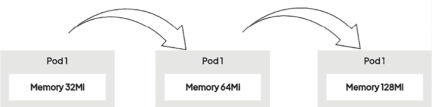
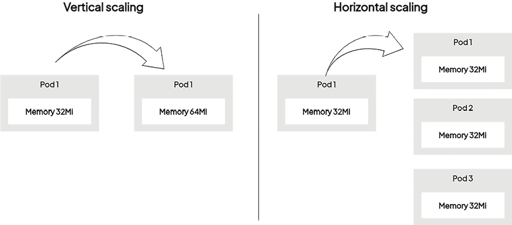
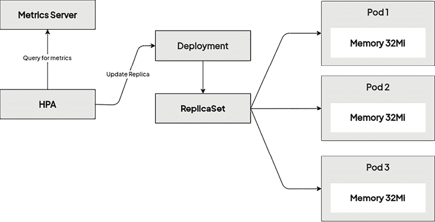
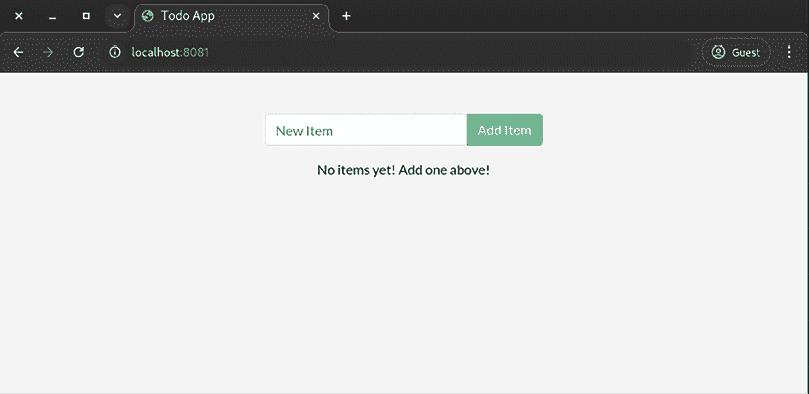
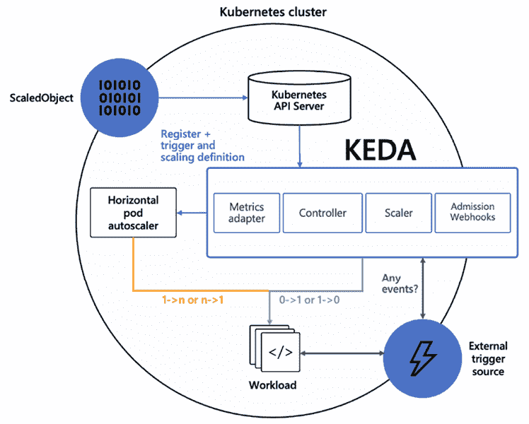
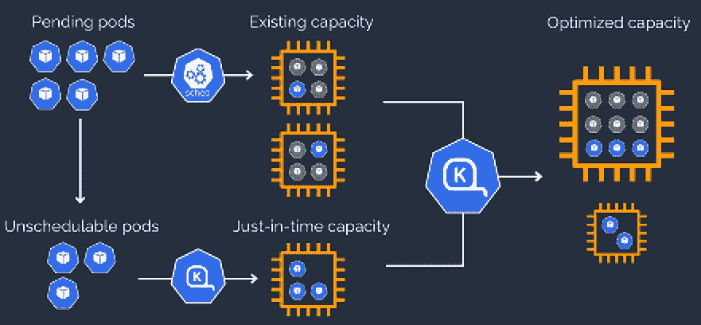

# 第二十章：Kubernetes Pods 和节点的自动扩展

不用多说，拥有**自动扩展**功能的云原生应用被认为是云端应用运行的圣杯。简而言之，自动扩展是指一种自动且动态调整应用可用计算资源（如 CPU 和内存）的方式。自动扩展的目标是根据最终用户的**活动和需求**来增加或减少资源。例如，某个应用在白天用户最活跃时可能需要更多的 CPU 和内存，但在夜间需求会大幅减少。类似地，例如，如果你支持一个电商业务基础设施，在所谓的*黑色星期五*期间，你可以预期会有巨大的需求激增。通过这种方式，你不仅可以为用户提供更好的、高可用的服务，还可以降低企业的**销售成本**（**COGS**）。你在云端消耗的资源越少，支付的费用也越少，企业可以将这些节省下来的资金投入到其他地方——这是一种*双赢*局面。当然，没有单一的规则适用于所有的用例，因此，良好的自动扩展需要基于关键的使用指标，并且应该具有**预测功能**，能够基于历史数据预测工作负载。

Kubernetes 作为最成熟的容器编排系统，拥有多种内建的自动扩展功能。这些功能中的一些在每个 Kubernetes 集群中都是原生支持的，而另一些则需要安装或特定类型的集群部署。你还可以使用多种*扩展维度*。

+   **Pod 的垂直扩展**：这涉及调整分配给 Pod 的 CPU 和内存资源。Pod 可以在指定的 CPU 和内存限制下运行，以防止过度消耗，但这些限制可能需要自动调整，而不是依赖人工操作员来猜测。这是通过**VerticalPodAutoscaler**（**VPA**）来实现的。

+   **Pod 的水平扩展**：这涉及动态调整你的 Deployment 或 StatefulSet 中 Pod 副本的数量。这些对象自带出色的扩展功能，但副本数量的调整可以通过**HorizontalPodAutoscaler**（**HPA**）自动化。

+   **节点的水平扩展**：这是水平扩展的另一种维度（向外扩展），但这次是在 Kubernetes 节点的层级上。你可以通过添加或移除节点来扩展整个集群。当然，这需要一个运行在支持动态机器配置的环境中的 Kubernetes Deployment，比如云环境。这是通过**Cluster Autoscaler**（**CA**）来实现的，某些云服务商提供了该功能。

在本章中，我们将涵盖以下主题：

+   Pod 资源请求和限制

+   使用 VerticalPodAutoscaler 对 Pod 进行垂直扩展

+   使用 HorizontalPodAutoscaler 对 Pod 进行水平扩展

+   使用集群自动扩展器（Cluster Autoscaler）进行 Kubernetes 节点的自动扩展

+   Kubernetes 的替代自动扩展器

# 技术要求

本章需要以下内容：

+   部署了一个 Kubernetes 集群。我们建议使用一个多节点的 Kubernetes 集群。

+   一个多节点**Google Kubernetes Engine**（**GKE**）集群。这是 VPA 和集群自动扩展的前提条件。

+   在您的本地机器上安装并配置了 Kubernetes CLI（`kubectl`），以管理您的 Kubernetes 集群。

基础 Kubernetes 集群部署（本地和基于云的）以及`kubectl`安装已在*第三章*《安装您的第一个 Kubernetes 集群》中涵盖。

本书的*第十五章*、*第十六章*和*第十七章*已为您概述了如何在不同的云平台上部署一个功能齐全的 Kubernetes 集群，并安装必要的 CLI 工具来管理它们。

本章的最新代码示例可以从官方 GitHub 仓库下载：[`github.com/PacktPublishing/The-Kubernetes-Bible-Second-Edition/tree/main/Chapter20`](https://github.com/PacktPublishing/The-Kubernetes-Bible-Second-Edition/tree/main/Chapter20)。

# Pod 资源请求和限制

在深入探讨 Kubernetes 中的自动扩展主题之前，我们需要更好地理解如何控制 Kubernetes 中 Pod 容器的 CPU 和内存资源（即**计算资源**）的使用。控制计算资源的使用非常重要，因为通过这种方式，可以强制执行**资源治理**——这有助于更好地规划集群容量，最重要的是，防止单个容器消耗所有计算资源，从而阻止其他 Pods 处理请求。

当您创建 Pod 时，可以指定其容器**需要**多少计算资源，并且设定**限制**，即允许的资源消耗量。Kubernetes 资源模型进一步区分了两类资源：**可压缩**和**不可压缩**。简而言之，可压缩资源可以轻松地进行限流，而不会产生严重后果。

这种资源的一个典型例子是 CPU——如果您需要限制某个容器的 CPU 使用量，该容器将正常运行，只是变慢。另一方面，我们还有不可压缩资源，无法在不产生严重后果的情况下进行限制——内存分配就是这种资源的一个例子。如果您不允许容器内运行的进程分配更多的内存，该进程将崩溃并导致容器重启。

要控制 Pod 容器的资源，您可以在其规格中指定两个值：

+   `requests`：此项指定由系统提供的某个资源的保证量。你也可以从另一个角度来看，这就是 Pod 容器从系统获取的，为了正常运行所需的资源量。这很重要，因为 Pod 调度依赖于`requests`值（而非`limits`），即`PodFitsResources`谓词和`BalancedResourceAllocation`优先级。

+   `limits`：此项指定由系统提供的某个资源的**最大**数量。如果与`requests`一起指定，则此值必须大于或等于`requests`。根据资源是否可压缩，超过限制会有不同的后果——可压缩资源（如 CPU）会被限制，而不可压缩资源（如 RAM）*可能*导致容器被终止并重新启动。

通过为`requests`和`limits`设置不同的值，你可以允许资源的过度分配。这样，系统就能够在优化整体资源利用率的同时，更加平稳地处理短时间内的高资源使用情况。这是因为所有容器在节点上同时达到资源限制的情况相对不太可能。因此，Kubernetes 可以在大多数时候更有效地使用可用资源。这有点像虚拟机的过度配置或航空公司超额预订，因为并不是每个人都会在同一时间使用所有分配的资源。这意味着你实际上可以在每个节点上运行更多的 Pods，从而提高整体资源利用率。

如果你完全不指定`limits`，容器就可以无限制地使用节点上的资源。这可以通过命名空间**资源配额**和**限制范围**来控制，我们在*第六章*《Kubernetes 中的命名空间、配额和多租户限制》中探讨过这些内容。

在更高级的场景中，还可以控制巨页和临时存储的`requests`和`limits`。

在深入配置细节之前，我们需要了解 Kubernetes 中 CPU 和内存的计量单位：

+   对于 CPU，基本单位是**Kubernetes CPU**（**KCU**），其中`1`等于例如 Azure 上的 1 个 vCPU、GCP 上的 1 个核心，或者裸机上的 1 个超线程核心。

+   允许使用分数值：`0.1`也可以表示为`100m`（*毫 KCPU*）。

+   对于内存，基本单位是**字节**；当然，你也可以指定标准的单位前缀，例如`M`、`Mi`、`G`或`Gi`。

要为前几章中使用的`nginx` Deployment 中的 Pod 容器启用计算资源的`requests`和`limits`，请对 YAML 清单`resource-limit/nginx-deployment.yaml`进行以下更改：

```
# resource-limit/nginx-deployment.yaml
apiVersion: apps/v1
kind: Deployment
metadata:
  name: nginx-deployment-example
spec:
  replicas: 5
.
...<removed for brevity>...
    spec:
      containers:
        - name: nginx
          image: nginx:1.17
          ports:
            - containerPort: 80
          **resources:**
            **limits:**
              **cpu:****200m**
              **memory:****60Mi**
            **requests:**
              **cpu:****100m**
              **memory:****50Mi** 
```

对于 Pod 中的每个容器，指定`.spec.template.spec.containers[*].resources`字段。在这种情况下，我们已将`limits`设置为`200m` KCU 和`60Mi`的 RAM，`requests`设置为`100m` KCPU 和`50Mi`的 RAM。

当你使用 `kubectl apply -f resource-limit/nginx-deployment.yaml` 将清单应用到集群时，描述集群中运行此部署的一个节点，你将看到关于计算资源配额和分配的详细信息：

```
$ kubectl describe node minikube-m03
...<removed for brevity>...
Non-terminated Pods:          (5 in total)
  Namespace                   Name                                         CPU Requests  CPU Limits  Memory Requests  Memory Limits  Age
  ---------                   ----                                         ------------  ----------  ---------------  -------------  ---
  default                     nginx-deployment-example-6d444cfd96-f5tnq    100m (5%)     200m (10%)  50Mi (2%)        60Mi (3%)      23s
  default                     nginx-deployment-example-6d444cfd96-k6j9d    100m (5%)     200m (10%)  50Mi (2%)        60Mi (3%)      23s
  default                     nginx-deployment-example-6d444cfd96-mqxxp    100m (5%)     200m (10%)  50Mi (2%)        60Mi (3%)      23s
  kube-system                 calico-node-92bdc                            250m (12%)    0 (0%)      0 (0%)           0 (0%)         6d23h
  kube-system                 kube-proxy-5cd4x                             0 (0%)        0 (0%)      0 (0%)           0 (0%)         6d23h
Allocated resources:
  (Total limits may be over 100 percent, i.e., overcommitted.)
  Resource           Requests    Limits
  --------           --------    ------
  cpu                550m (27%)  600m (30%)
  memory             150Mi (7%)  180Mi (9%)
  ephemeral-storage  0 (0%)      0 (0%)
  hugepages-2Mi      0 (0%)      0 (0%)
Events:              <none> 
```

现在，根据这些信息，你可以进行实验，将容器的 CPU `requests` 设置为高于集群中单个节点的容量；在我们的例子中，我们在 `resource-limit/nginx-deployment.yaml` 中修改该值如下：

```
...
          resources:
            limits:
              **cpu:****2000m**
              memory: 60Mi
            requests:
              **cpu:****2000m**
              memory: 50Mi
... 
```

按如下配置应用：

```
$ kubectl apply -f resource-limit/nginx-deployment.yaml
deployment.apps/nginx-deployment-example configured 
```

如下检查 Pod 状态，你将注意到新的 Pod 会挂在 `Pending` 状态，因为它们无法在匹配的节点上调度：

```
$ kubectl get pod
NAME                                        READY   STATUS    RESTARTS   AGE
nginx-deployment-example-59b669d85f-cdptx   1/1     Running   0          52s
nginx-deployment-example-59b669d85f-hdzdf   1/1     Running   0          54s
nginx-deployment-example-59b669d85f-ktn59   1/1     Running   0          54s
nginx-deployment-example-59b669d85f-vdn87   1/1     Running   0          52s
nginx-deployment-example-69bd6d55b4-n2mzq   0/1     Pending   0          3s
nginx-deployment-example-69bd6d55b4-qb62p   0/1     Pending   0          3s
nginx-deployment-example-69bd6d55b4-w7xng   0/1     Pending   0          3s 
```

通过如下方式描述 Pod，以调查 `Pending` 状态：

```
$ kubectl describe pod nginx-deployment-example-69bd6d55b4-n2mzq
...
Events:
  Type     Reason            Age                  From               Message
  ----     ------            ----                 ----               -------
  Warning  FailedScheduling  23m (x21 over 121m)  default-scheduler  **0/3 nodes are available:** 1 node(s) had untolerated taint {machine-check-exception: memory}, 2 Insufficient cpu. preemption: 0/3 nodes are available: 1 Preemption is not helpful for scheduling, 2 No preemption victims found for incoming pod. 
```

本章讨论的一些自动扩缩容机制目前处于 alpha 或 beta 版本，可能不完全稳定，因此不适合生产环境。对于更成熟的自动扩缩容解决方案，请参考本章的 Kubernetes 备用自动扩缩容器部分。

在前面的输出中，没有任何节点能够容纳一个需要 `2000m` KCU 的容器，因此该 Pod 此时无法调度。

现在了解了如何管理计算资源，我们将继续探讨自动扩缩容的主题：首先，我们将解释 Pod 的垂直自动扩缩容。

# 使用 VerticalPodAutoscaler 进行 Pod 的垂直自动扩缩容

在前一节中，我们手动管理了计算资源的 `requests` 和 `limits`。正确设置这些值需要一些准确的人类*猜测*、观察指标并进行基准测试以调整。使用过高的 `requests` 值会导致计算资源浪费，而将 `requests` 设置得过低可能导致 Pod 被过度密集地安排，从而出现性能问题。此外，在某些情况下，扩展 Pod 工作负载的唯一方式是通过增加其可以消耗的计算资源来**垂直**扩展。对于裸金属机器来说，这意味着升级 CPU 硬件并增加更多物理内存。对于容器来说，方法就简单多了，只需允许它们获得更多的计算资源配额。当然，这只在单个节点的容量范围内有效。如果要超出这一范围进行垂直扩展，你只能通过向集群添加更强大的节点来实现。

为了帮助解决这些问题，你可以使用 VPA，它可以动态增加或减少 Pod 容器的 CPU 和内存资源 `requests`。

下图显示了 Pod 的垂直扩展。



图 20.1：Pod 的垂直扩展

目标是更好地匹配容器的*实际*使用情况，而不是依赖于硬编码的、预定义的资源请求和限制值。控制`limits`在指定的比率范围内也是支持的。

VPA 由名为`VerticalPodAutoscaler`的**自定义资源定义**（**CRD**）对象创建。这意味着该对象不是标准 Kubernetes API 组的一部分，必须安装在集群中。VPA 是 Kubernetes 生态系统中**autoscaler**项目的一部分（[`github.com/kubernetes/autoscaler`](https://github.com/kubernetes/autoscaler)）。

VPA 的三个主要组件如下：

+   **Recommender**: 监视当前和过去的资源消耗，并为 Pod 容器提供建议的 CPU 和内存请求值。

+   **Updater**: 检查具有不正确资源的 Pod 并将其**删除**，以便可以使用更新后的`requests`和`limits`值重新创建 Pod。

+   **Admission plugin**: 设置由其控制器（例如，Deployment 对象）创建或重新创建的新 Pod 上的正确资源`requests`和`limits`，由于更新程序所做的更改。

更新程序需要终止 Pod 的原因，以及 VPA 必须依赖于 Admission 插件的原因，是因为 Kubernetes 不支持对资源`requests`和`limits`的动态更改。唯一的方法是终止 Pod 并使用新值创建新 Pod。

VPA 可以以推荐模式运行，其中您可以在 VPA 对象中看到建议的值，但不会将更改应用于 Pods。当前 VPA 被视为*实验性*，在重新创建 Pods 的模式下使用可能会导致应用程序停机。当实现 Pod `requests`和`limits`的原地更新时，情况可能会有所改变。

一些 Kubernetes 提供的服务具有一键或操作员支持来安装 VPA。两个很好的例子是 OpenShift 和 GKE。参考*使用垂直 Pod 自动缩放器自动调整 Pod 资源级别*文章（[`docs.openshift.com/container-platform/4.16/nodes/pods/nodes-pods-vertical-autoscaler.html`](https://docs.openshift.com/container-platform/4.16/nodes/pods/nodes-pods-vertical-autoscaler.html)）了解在 OpenShift 中实现 VPA。

## 启用 InPlacePodVerticalScaling

In-place pod resizing 是 Kubernetes 1.27 引入的α功能，允许动态调整 Pod 资源而无需重新启动，可能提高应用程序性能和资源效率。

**Alpha Feature Warning**

In-place pod resizing 是 Kubernetes 1.27 的α功能，未来版本可能会更改而没有提前通知。不应在生产集群上部署此功能，因为可能存在潜在的不稳定性；一般而言，α功能可能不适用于稳定版本，并可能随时更改。

要启用此功能，必须在所有集群节点上启用`InPlacePodVerticalScaling`特性门。

对于 Kubernetes 集群，请使用以下方法启用特性门：

1.  更新 `/etc/kubernetes/manifests/kube-apiserver.yaml`（或适用于您的 Kubernetes 集群的配置）。

1.  添加以下`feature-gates`：

    ```
    # /etc/kubernetes/manifests/kube-apiserver.yaml
    ...
      - command:
        - kube-apiserver
       ...<removed for brevity>...
        - --feature-gates=InPlacePodVerticalScaling=true 
    ```

对于 minikube 环境，请在集群启动时加入功能门控，方法如下：

```
$ minikube start --feature-gates=InPlacePodVerticalScaling=true 
```

现在，我们将快速解释如何在运行 GKE 集群的情况下启用 VPA。

## 在 GKE 中启用 VPA

在 **Google Kubernetes Engine**（**GKE**）中启用 VPA 就像运行以下命令一样简单：

```
$ gcloud container clusters update <cluster-name> --enable-vertical-pod-autoscaling 
```

请注意，这个操作会导致 Kubernetes 控制平面重启。

如果你想为一个新的集群启用 VPA，可以使用额外的参数 `--enable-vertical-pod-autoscaling`：

```
$ gcloud container clusters create k8sforbeginners --num-nodes=2 --zone=us-central1-a --enable-vertical-pod-autoscaling 
```

GKE 集群将会有一个 VPA CRD，你可以利用它来控制 Pods 的垂直自动扩展。

让我们在下一节中了解如何为标准 Kubernetes 集群启用 VPA。如果你使用的是其他类型的 Kubernetes 集群，请按照特定设置的说明进行操作。

## 为其他 Kubernetes 集群启用 VPA

对于像 AKS 或 EKS 等不同平台（甚至是用于测试的本地部署），你需要手动安装 VPA，通过向集群添加 VPA CRD。最新的安装步骤已在相应的 GitHub 仓库中记录： https://github.com/kubernetes/autoscaler/tree/master/vertical-pod-autoscaler#installation。

要在你的集群中安装 VPA，请执行以下步骤：

1.  克隆 Kubernetes autoscaler 仓库（[`github.com/kubernetes/autoscaler`](https://github.com/kubernetes/autoscaler)）：

    ```
    $ git clone https://github.com/kubernetes/autoscaler 
    ```

1.  进入 VPA 组件目录：

    ```
    $ cd autoscaler/vertical-pod-autoscaler 
    ```

1.  使用以下命令开始安装。这假设你当前的 `kubectl` 上下文指向了目标集群：

    ```
    $ ./hack/vpa-up.sh 
    ```

1.  这将创建一堆 Kubernetes 对象。使用以下命令验证主要组件 Pods 是否正确启动：

    ```
    $ kubectl get pods -n kube-system | grep vpa
    vpa-admission-controller-5b64b4f4c4-vsn9j   1/1     Running   0             5m34s
    vpa-recommender-54c76554b5-m7wnk            1/1     Running   0             5m34s
    vpa-updater-7d5f6fbf9b-rkwlb                1/1     Running   0             5m34s 
    ```

VPA 组件已经在运行，我们现在可以在实际 Pods 上测试 VPA。

## 使用 VPA

出于演示目的，我们需要一个带有 Pods 的 Deployment，这些 Pods 会实际消耗 CPU。Kubernetes autoscaler 仓库中有一个很好的简单示例，具有 **可预测** 的 CPU 使用： [`github.com/kubernetes/autoscaler/blob/master/vertical-pod-autoscaler/examples/hamster.yaml`](https://github.com/kubernetes/autoscaler/blob/master/vertical-pod-autoscaler/examples/hamster.yaml)。我们将稍微修改这个示例，并进行逐步演示。

**警告**

VPA 的使用很大程度上取决于底层 Kubernetes 的发行版和成熟度。有时，Pods 可能不会按预期重新调度，这可能导致应用程序的停机。因此，如果启用了 VPA 的完全自动化，在没有进行监控的情况下，可能会导致资源超额分配和集群不稳定等级联问题。

首先让我们准备好部署：

1.  首先，为你的 Kubernetes 集群启用度量服务器。你可以使用默认的度量服务器（[`github.com/kubernetes-sigs/metrics-server`](https://github.com/kubernetes-sigs/metrics-server)）并将其部署在你的 Kubernetes 集群中。如果你使用的是 minikube 集群，可以按照以下方式启用度量服务器：

    ```
    $ minikube addons enable metrics-server 
    ```

1.  为此创建一个新的 Namespace：

    ```
    # vpa/vpa-demo-ns.yaml
    ---
    apiVersion: v1
    kind: Namespace
    metadata:
      labels:
        project: vpa-demo
      name: vpa-demo 
    ```

使用以下 `kubectl apply` 命令创建 Namespace：

```
$ kubectl apply -f vpa/vpa-demo-ns.yaml
namespace/vpa-demo created 
```

1.  创建 `hamster-deployment.yaml` 的 `YAML 清单` 文件（查看 `vpa/hamster-deployment.yaml` 了解示例）：

    ```
    # vpa/hamster-deployment.yaml
    apiVersion: apps/v1
    kind: Deployment
    metadata:
      name: hamster
      namespace: vpa-demo
    spec:
      selector:
        matchLabels:
          app: hamster
      replicas: 5
      template:
        metadata:
          labels:
            app: hamster
        spec:
          containers:
            - name: hamster
              image: ubuntu:20.04
              resources:
                requests:
                  cpu: 100m
                  memory: 50Mi
              command:
                - /bin/sh
                - -c
                - while true; do timeout 0.5s yes >/dev/null; sleep 0.5s; done 
    ```

这是一只真正的仓鼠！Pod 的 `ubuntu` 容器中使用的 `command` 会重复最大限度地消耗 CPU 0.5 秒，然后空闲 0.5 秒。这意味着实际的 CPU 使用率平均保持在大约 `500m` KCPU。然而，资源的 `requests` 值指定了它需要 `100m` KCPU。这意味着 Pod 会消耗超过其声明的 CPU，但由于没有设置 `limits`，Kubernetes 不会限制容器的 CPU。这可能导致 Kubernetes 调度器做出错误的调度决策。

1.  使用以下命令将清单应用到集群中：

    ```
    $ kubectl apply -f vpa/hamster-deployment.yaml
    deployment.apps/hamster created 
    ```

1.  查看 vpa-demo Namespace 中的 Pods：

    ```
    $  kubectl get po -n vpa-demo
    NAME                      READY   STATUS    RESTARTS   AGE
    hamster-7fb7dbff7-hmzt5   1/1     Running   0          8s
    hamster-7fb7dbff7-lbk9f   1/1     Running   0          8s
    hamster-7fb7dbff7-ql6gd   1/1     Running   0          8s
    hamster-7fb7dbff7-qmxd8   1/1     Running   0          8s
    hamster-7fb7dbff7-qtrpp   1/1     Running   0          8s 
    ```

1.  让我们验证一下 Pod 的 CPU 使用情况。最简单的方法是使用 `kubectl top` 命令：

    ```
    $ kubectl top pod -n vpa-demo
    NAME                      CPU(cores)   MEMORY(bytes)
    hamster-7fb7dbff7-hmzt5   457m         0Mi            
    hamster-7fb7dbff7-lbk9f   489m         0Mi            
    hamster-7fb7dbff7-ql6gd   459m         0Mi            
    hamster-7fb7dbff7-qmxd8   453m         0Mi            
    hamster-7fb7dbff7-qtrpp   451m         0Mi 
    ```

正如我们预期的那样，部署中每个 Pod 的 CPU 消耗在大约 500m KCU 附近波动。

这样，我们就可以继续为我们的 Pods 创建 VPA 了。VPA 可以以四种 **模式** 运行，这些模式通过 `.spec.updatePolicy.updateMode` 字段进行指定：

+   `Recreate`：Pod 容器的 `limits` 和 `requests` 值在 Pod 创建时分配，并根据计算出的推荐动态更新。要更新这些值，必须重启 Pod。请注意，这可能会对您的应用程序产生干扰。

+   `Auto`：目前等同于 `Recreate`，但当 Pod 容器的 `requests` 和 `limits` 进行就地更新时，这可以自动切换到新的更新机制。

+   `Initial`：Pod 容器的 `limits` 和 `requests` 值仅在 Pod 创建时分配。

+   `Off`：VPA 以仅推荐模式运行。推荐的值可以在 VPA 对象中查看，例如，通过使用 `kubectl`。

首先，我们将为 `hamster` 部署创建一个 VPA，该部署以 `Off` 模式运行，稍后我们将启用 `Auto` 模式。为此，请按照以下步骤操作：

1.  创建一个名为 vpa/`hamster-vpa.yaml` 的 VPA YAML 清单：

    ```
    # vpa/hamster-vpa.yaml
    apiVersion: autoscaling.k8s.io/v1
    kind: VerticalPodAutoscaler
    metadata:
      name: hamster-vpa
      namespace: vpa-demo
    spec:
      targetRef:
        apiVersion: apps/v1
        kind: Deployment
        name: hamster
      updatePolicy:
        updateMode: 'Off'
      resourcePolicy:
        containerPolicies:
          - containerName: '*'
            minAllowed:
              cpu: 100m
              memory: 50Mi
            maxAllowed:
              cpu: 1
              memory: 500Mi
            controlledResources:
              - cpu
              - memory 
    ```

该 VPA 是为名为 `hamster` 的部署对象创建的，如 `.spec.targetRef` 中所指定。模式在 `.spec.updatePolicy.updateMode` 中设置为 `"Off"`（`"Off"` 需要加上引号，以避免被解释为布尔值），容器资源策略在 `.spec.resourcePolicy.containerPolicies` 中配置。我们使用的策略允许 Pod 容器的 CPU `requests` 在 `100m` KCU 和 `1000m` KCU 之间自动调整，内存在 `50Mi` 和 `500Mi` 之间调整。

1.  将清单文件应用到集群：

    ```
    $ kubectl apply -f vpa/hamster-vpa.yaml
    verticalpodautoscaler.autoscaling.k8s.io/hamster-vpa created 
    ```

1.  您需要稍等片刻以便首次计算推荐值。然后，描述 VPA 来检查推荐值：

    ```
    $ kubectl describe vpa hamster-vpa -n vpa-demo
    ...<removed for brevity>...
    Status:
      Conditions:
        Last Transition Time:  2024-08-11T09:20:44Z
        Status:                True
        Type:                  RecommendationProvided
      Recommendation:
        Container Recommendations:
          Container Name:  hamster
          Lower Bound:
            Cpu:     461m
            Memory:  262144k
          Target:
            Cpu:     587m
            Memory:  262144k
          Uncapped Target:
            Cpu:     587m
            Memory:  262144k
          Upper Bound:
            Cpu:     1
            Memory:  500Mi
    Events:          <none> 
    ```

VPA 已建议分配比预期的 `500m` KCU 和 `262144k` 内存略多的资源。这是有道理的，因为 Pod 应该有足够的缓冲区来应对 CPU 消耗。

1.  现在我们可以实践 VPA，并将其模式更改为 `Auto`。修改 `vpa/hamster-vpa.yaml`：

    ```
    # vpa/hamster-vpa.yaml
    apiVersion: autoscaling.k8s.io/v1
    kind: VerticalPodAutoscaler
    metadata:
      name: hamster-vpa
      namespace: vpa-demo
    spec:
    ...
      updatePolicy:
    **updateMode:****Auto**
    ... 
    ```

1.  将清单应用到集群中：

    ```
    $ kubectl apply -f vpa/hamster-vpa.yaml
    verticalpodautoscaler.autoscaling.k8s.io/hamster-vpa configured 
    ```

1.  一段时间后，您会注意到 Deployment 中的 Pods 正在被 VPA 重启：

    ```
    $ kubectl get po -n vpa-demo -w
    NAME                      READY   STATUS              RESTARTS   AGE
    hamster-7fb7dbff7-24p89   0/1     ContainerCreating   0          2s
    hamster-7fb7dbff7-6nz8f   0/1     ContainerCreating   0          2s
    hamster-7fb7dbff7-hmzt5   1/1     Running             0          20m
    hamster-7fb7dbff7-lbk9f   1/1     Running             0          20m
    hamster-7fb7dbff7-ql6gd   1/1     Terminating         0          20m
    hamster-7fb7dbff7-qmxd8   1/1     Terminating         0          20m
    hamster-7fb7dbff7-qtrpp   1/1     Running             0          20m
    hamster-7fb7dbff7-24p89   1/1     Running             0          2s
    hamster-7fb7dbff7-6nz8f   1/1     Running             0          2s 
    ```

1.  我们可以检查其中一个已重启的 Pod，以查看当前的资源 `requests`：

    ```
    $ kubectl describe pod hamster-7fb7dbff7-24p89 -n vpa-demo
    ...
    Annotations:      ...<removed for brevity>...
                      vpaObservedContainers: hamster
                      vpaUpdates: Pod resources updated by hamster-vpa: container 0: memory request, cpu request
    ...
    Containers:
      hamster:
        ...
        Requests:
          cpu:        587m
          memory:     262144k
    ...<removed for brevity>... 
    ```

如您所见，新启动的 Pod 已将 CPU 和内存的 `requests` 设置为 VPA 推荐的值！

目前不应将 VPA 与基于 CPU/内存指标的 HPA 一起使用。然而，您可以将 VPA 与基于自定义指标的 HPA 配合使用。

接下来，我们将讨论如何使用 HPA 实现 Pod 的水平自动扩展。

# 使用 HorizontalPodAutoscaler 实现 Pod 的水平自动扩展

虽然 VPA 起到了资源使用优化器的作用，但真正实现运行多个 Pod 副本的 Deployment 和 StatefulSets 扩展的是 HPA。从高层次来看，HPA 的目标是根据当前的 CPU 使用率或其他自定义指标（包括同时使用多个指标）自动扩展 Deployment 或 StatefulSets 中的副本数量。基于指标值确定目标副本数的算法细节可以在此找到：https://kubernetes.io/docs/tasks/run-application/horizontal-Pod-autoscale/#algorithm-details。

并非所有应用程序在使用 HPA 和 VPA 时都会同样高效。有些应用可能通过某一种方法运行得更好，但其他的应用可能不支持自动扩展，甚至可能受到该方法的负面影响。在使用任何自动扩展方法之前，请始终分析您的应用程序行为。

下图展示了垂直扩展和水平扩展的区别：



图 20.2：Pod 的垂直扩展与水平扩展

HPA 是高度可配置的，在本章中，我们将介绍一个标准场景，其中我们希望基于目标 CPU 使用率进行自动扩展。

HPA 是 Kubernetes 自动扩展 API 组中的一种 API 资源。目前的稳定版本是 `autoscaling/v2`，它支持基于内存和自定义指标进行扩展。当使用 `autoscaling/v1` 时，`autoscaling/v2` 中引入的新字段会作为注解保留。

HPA 的作用是监控 Pod 的配置指标，例如 CPU 使用率，并确定是否需要更改副本数。通常，HPA 会计算所有 Pod 当前指标值的平均值，并判断添加或删除副本是否能使指标值更接近指定的目标值。例如，假设您将目标 CPU 使用率设置为 50%。在某些情况下，应用程序的需求增加导致 Deployment Pods 的 CPU 使用率达到 80%。HPA 会决定添加更多 Pod 副本，以使所有副本的平均使用率降低，并接近 50%。然后这个过程会重复进行。换句话说，HPA 会尽力保持平均 CPU 使用率尽可能接近 50%。这就像一个持续的闭环控制器——温控器对建筑物内温度变化的反应是一个很好的例子。

下图展示了 Kubernetes HPA 组件的高级图示：



图 20.3：Kubernetes 中的 HPA 概览

HPA 还使用机制如 **稳定窗口** 来防止副本过快缩减，从而避免出现不必要的副本 **波动**。

GKE 提供了用于多维 Pod 自动扩展的 beta 功能，该功能同时结合了基于 CPU 指标的水平扩展和基于内存使用情况的垂直扩展。有关此功能的更多信息，请参阅官方文档：[`cloud.google.com/kubernetes-engine/docs/how-to/multidimensional-pod-autoscaling`](https://cloud.google.com/kubernetes-engine/docs/how-to/multidimensional-pod-autoscaling)。请注意，此功能适用于一般服务条款中的 Pre-GA 提供条款，并以“按原样”方式提供，支持有限；有关详细信息，请参阅发布阶段描述。

由于 HPA 是 Kubernetes 的内置功能，因此无需执行任何安装。我们只需要为测试准备一个 Deployment 并创建一个 `HorizontalPodAutoscaler` Kubernetes 资源。

## 部署应用以演示 HPA

要测试 HPA，我们将依赖于标准的 CPU 使用率指标。这意味着我们需要为 Deployment Pods 配置 `requests` 以保证 CPU，否则无法进行自动扩展，因为没有绝对的数值来计算百分比指标。此外，我们还需要一个可以消耗可预测 CPU 资源的 Deployment。当然，在实际使用场景中，变化的 CPU 使用率将来自终端用户对应用的实际需求。

首先，为您的 Kubernetes 集群启用度量服务器。您可以使用默认的度量服务器（[`github.com/kubernetes-sigs/metrics-server`](https://github.com/kubernetes-sigs/metrics-server)）并将其部署到您的 Kubernetes 集群中。如果您使用的是 minikube 集群，可以按照以下步骤启用度量服务器：

```
$ minikube addons enable metrics-server 
```

按照以下说明学习如何实现 HPA：

1.  为了隔离我们在本次演示中的资源，请创建一个新的命名空间，如下所示：

    ```
    # hpa/hpa-demo-ns.yaml
    ---
    apiVersion: v1
    kind: Namespace
    metadata:
      labels:
        project: hpa-demo
      name: hpa-demo 
    ```

1.  应用 YAML 并创建命名空间：

    ```
    $ kubectl apply -f hpa/hpa-demo-ns.yaml
    namespace/hpa-demo created 
    ```

1.  为了演示，我们将使用一个基于自定义镜像`quay.io/iamgini/one-page-web:1.0`的简单 Web 服务器容器。以下 YAML 包含一个简单的部署定义，将创建一个 Pod 副本：

    ```
    ---
    # hpa/todo-deployment.yaml
    apiVersion: apps/v1
    kind: Deployment
    metadata:
      name: todo-app
      namespace: hpa-demo
    spec:
      replicas: 1  # Adjust as needed
      selector:
        matchLabels:
          app: todo
      template:
        metadata:
          labels:
            app: todo
        spec:
          containers:
            - name: todoapp
              image: quay.io/ginigangadharan/todo-app:2.0
              ports:
                - containerPort: 3000
              resources:
                requests:
                  memory: "50Mi"   # Request 50 MiB of memory
                  cpu: "50m"      # Request 0.05 CPU core
                limits:
                  memory: "100Mi"  # Request 100 MiB of memory
                  cpu: "100m"      # Request 0.1 CPU core 
    ```

1.  应用配置并确保 Pod 按预期运行：

    ```
    $ kubectl apply -f hpa/todo-deployment.yaml
    deployment.apps/todo-app created
    $ kubectl get po -n hpa-demo
    NAME                        READY   STATUS    RESTARTS   AGE
    todo-app-5cfb496d77-l6r69   1/1     Running   0          8s 
    ```

1.  为了暴露应用程序，我们创建一个 Service，使用以下 YAML：

    ```
    # hpa/todo-service.yaml
    apiVersion: v1
    kind: Service
    metadata:
      name: todo-app
      namespace: hpa-demo
    spec:
      type: ClusterIP
      selector:
        app: todo
      ports:
        - port: 8081          # Port exposed within the cluster
          targetPort: 3000    # containerPort on the pods 
    ```

1.  应用配置并验证 Service 资源：

    ```
    $ kubectl apply -f hpa/todo-service.yaml
    service/todo-app created
    $ kubectl get svc -n hpa-demo
    NAME       TYPE        CLUSTER-IP     EXTERNAL-IP   PORT(S)    AGE
    todo-app   ClusterIP   10.96.171.71   <none>        8081/TCP   15s 
    ```

1.  现在应用程序正在运行，并通过`ClusterIP` Service 暴露，我们可以使用`kubectl port-forward`命令在集群外访问该应用程序：

    ```
    $ kubectl port-forward svc/todo-app -n hpa-demo 8081:8081
    Forwarding from 127.0.0.1:8081 -> 3000
    Forwarding from [::1]:8081 -> 3000 
    ```

1.  打开浏览器并访问`http://localhost:8081`，您将看到 Todo 应用程序如下所示：



图 20.4：Todo 应用程序在 Kubernetes 上运行

1.  在控制台上，按*Ctrl+C*结束`kubectl port-forward`任务。

现在我们已经在集群中运行了 Todo 应用程序的部署，是时候了解 HPA 的工作原理了。在下一节中，我们将学习如何创建 HPA，并向部署施加负载以观察自动扩展的效果。

## 实现 HPA

你已经学会了如何通过使用`kubectl scale`命令来扩展 Pod 的数量（例如，`kubectl scale deployment one-page-web -n hpa-demo --replicas 3`），但是在本示例中，我们想了解 HPA 如何基于工作负载进行自动扩展。

正如我们在本节前面所学，HPA 是根据指标触发扩展的，因此我们需要给 Pod 提供工作负载。为了进行压力测试和负载测试，有几个工具可以模拟 Web 应用程序的工作负载。在本次演示中，我们将使用一个叫做`hey`的小程序进行负载测试。hey 是一个用 Go 编写的轻量级 HTTP 负载测试工具。它的设计目的是简化基准测试，用户可以快速发送大量请求并查看响应时间、请求吞吐量等信息，以便评估 Web 应用程序在负载下的性能。

也可以使用其他方法增加负载。例如，您可以运行另一个容器，通过以下命令访问应用程序 Pod：

```
$ kubectl run -i --tty load-generator --rm --image=busybox:1.28 --restart=Never -- /bin/sh -c "while sleep 0.01; do wget -q -O- http://todo-app; done" 
```

然而，这种方法可能并不适合精确控制工作负载。

hey 应用程序适用于 Linux、macOS 和 Windows 系统（[`github.com/rakyll/hey`](https://github.com/rakyll/hey)），安装过程非常简单：

1.  下载适合您操作系统的 hey 包。

1.  设置可执行权限并将文件复制到可执行路径（例如，`ln -s ~/Downloads/hey_linux_amd64 ~/.local/bin/`）。

现在，创建 HPA 资源来根据工作负载扩展单页 Web 部署：

1.  准备 HPA 的 YAML 文件，如下所示：

    ```
    # hpa/todo-hpa.yaml
    apiVersion: autoscaling/v2
    kind: HorizontalPodAutoscaler
    metadata:
      name: todo-hpa
      namespace: hpa-demo
    spec:
      scaleTargetRef:
        apiVersion: apps/v1
        kind: Deployment
        name: todo-app
      minReplicas: 1
      maxReplicas: 5
      metrics:
        - resource:
            name: cpu
            target:
              averageUtilization: 80
              type: Utilization
          type: Resource 
    ```

1.  应用配置并创建 HPA：

    ```
    $ kubectl apply -f hpa/todo-hpa.yaml
    horizontalpodautoscaler.autoscaling/todo-hpa created
    $ kubectl get hpa -n hpa-demo
    NAME       REFERENCE             TARGETS              MINPODS   MAXPODS   REPLICAS   AGE
    todo-hpa   Deployment/todo-app   cpu: <unknown>/80%   1         5         0          6s 
    ```

1.  让我们再次使用`kubectl port-forward`命令从集群外部访问 Todo 应用程序：

    ```
    $ kubectl port-forward svc/todo-app -n hpa-demo 8081:8081
    Forwarding from 127.0.0.1:8081 -> 3000
    Forwarding from [::1]:8081 -> 3000 
    ```

1.  目前没有人在使用**todo**应用程序，因此 Pod 副本仍为 1。现在让我们使用`hey`工具来模拟负载。在另一个控制台中，执行如下的 hey 工作负载命令：

    ```
    $ hey -z 4m -c 25 http://localhost:8081 
    ```

请参见以下命令的参数和详细信息：

+   `-z 4m`：运行 4 分钟，维持更长时间的负载

+   `-c 25:` 使用 15 个并发连接以生成更高的负载，旨在将 CPU 使用率推向 80%

+   `http://localhost:8081`：访问 todo 应用程序的 URL（通过`kubectl port-forward`命令启用）

你会在`kubectl port-forward 控制台`中看到很多连接条目，因为 hey 正在模拟单页面 Web 应用程序的负载。

1.  打开第三个控制台（无需等待 hey 完成执行）并检查 Pod 资源的利用情况：

    ```
    $ watch 'kubectl get po -n hpa-demo;kubectl top pods -n hpa-demo'
    Every 2.0s: kubectl get po -n hpa-demo;kubectl top pods -n hpa-demo
    NAME                        READY   STATUS    RESTARTS   AGE
    todo-app-5cfb496d77-5kc27   1/1     Running   0          76s
    todo-app-5cfb496d77-l6r69   1/1     Running   0          10m
    todo-app-5cfb496d77-pb7tx   1/1     Running   0          76s
    NAME                        CPU(cores)   MEMORY(bytes)
    todo-app-5cfb496d77-5kc27   10m          14Mi
    todo-app-5cfb496d77-l6r69   100m         48Mi
    todo-app-5cfb496d77-pb7tx   7m           14Mi 
    ```

你可以看到现在已经创建了三个（或更多）Pod，因为`hey`正在为`todo`应用程序施加更多的工作负载，这触发了 HPA 来创建更多的副本。

1.  同时，检查部署的详细信息，确认副本数和事件，以查看扩展事件：

    ```
    $ kubectl describe deployments.apps todo-app -n hpa-demo
    Name:                   todo-app
    ...<removed for brevity>...
    Replicas:               3 desired | 3 updated | 3 total | 3 available | 0 unavailable
    StrategyType:           RollingUpdate
    ...<removed for brevity>...
    Events:
      Type    Reason             Age   From                   Message
      ----    ------             ----  ----                   -------
      Normal  ScalingReplicaSet  16m   deployment-controller  Scaled up replica set todo-app-749854577d to 1
      Normal  ScalingReplicaSet  13m   deployment-controller  Scaled up replica set todo-app-5cfb496d77 to 1
      Normal  ScalingReplicaSet  13m   deployment-controller  Scaled down replica set todo-app-749854577d to 0 from 1
      Normal  ScalingReplicaSet  4m9s  deployment-controller  Scaled up replica set todo-app-5cfb496d77 to 3 from 1 
    ```

恭喜！你已成功为你的部署配置了水平自动扩展（HPA）。作为后续操作的一部分，删除资源，通过删除`hpa-demo`命名空间（例如，`kubectl delete namespaces hpa-demo`）。在下一节中，我们将了解如何使用 CA 自动扩展 Kubernetes 节点，这与 HPA 结合时能够提供更大的灵活性。

# 使用集群自动缩放器自动扩展 Kubernetes 节点

到目前为止，我们讨论的是在单个 Pod 级别进行扩展，但这并不是你在 Kubernetes 上扩展工作负载的唯一方式。你也可以扩展集群本身，以适应计算资源需求的变化——某个时刻，我们需要更多的节点来运行更多的 Pod。你可以配置固定数量的节点来手动管理节点级别的容量。即使这些节点的设置、管理和退役过程是自动化的，这种方法仍然适用。

这是由 CA（集群自动缩放器）解决的，它是 Kubernetes 自动缩放器仓库的一部分（[`github.com/kubernetes/autoscaler/tree/master/cluster-autoscaler`](https://github.com/kubernetes/autoscaler/tree/master/cluster-autoscaler)）。CA 必须能够为 Kubernetes 集群提供和移除节点，这意味着必须实现特定供应商的插件。你可以在这里找到支持的云服务提供商列表：https://github.com/kubernetes/autoscaler/tree/master/cluster-autoscaler#deployment。

CA 会定期检查 Pod 和节点的状态，并决定是否需要采取行动：

+   如果由于集群资源不足，某些 Pod 无法调度且处于`Pending`状态，CA 将添加更多节点，直到达到预定义的最大规模。

+   如果节点未充分利用，而且即使集群中的节点数量更少，所有 Pod 仍能调度，CA 将从集群中移除这些节点，除非节点已达到预定义的最小数量。在节点被移除之前，它们会被优雅地排空。

+   对于一些云服务提供商，CA 还可以在不同的 VM SKU 之间进行选择，以更好地优化集群操作成本。

Pod 容器必须为计算资源指定 `requests`，以使 CA 正常工作。此外，这些值应反映实际使用情况；否则，CA 将无法为您的工作负载类型做出正确决策。

CA 可以补充 HPA 的功能。如果 HPA 决定某个部署或 StatefulSet 应该有更多 Pod，但无法调度更多 Pod，那么 CA 可以介入并增加集群的规模。

在我们深入探讨 CA 之前，让我们先了解一些基于 CA 的 Kubernetes 自动扩展的限制。

## CA 限制

CA 有一些约束条件，可能会影响其有效性：

+   从云服务提供商请求新节点到节点可用之间存在延迟。这个延迟通常为几分钟，可能会在需求高峰期间影响应用性能。

+   CA 的扩展决策仅基于 Pod 的资源请求和限制，而不是实际的 CPU 或内存利用率。如果 Pod 过度请求资源，可能会导致节点未充分利用，进而浪费资源。

+   CA 主要是为云环境设计的。尽管可以将其适配到本地或其他基础设施中，但这需要额外的工作。这包括使用自定义脚本或工具来管理节点的预配和去配，以及配置自动扩展器与这些机制的交互。没有基于云的自动扩展功能时，管理集群规模变得更加复杂，并需要更紧密的监控。

启用 CA 需要根据您的云服务提供商执行不同的步骤。此外，一些配置值是针对每个云服务商特定的。接下来我们将在下一节中首先看一下 GKE。

**警告 – 资源消耗通知**

对于 CA 配置要非常小心，因为许多此类配置可能会导致非常高的资源消耗，进而影响系统稳定性或引发意外的扩展行为。始终监控并微调配置，以避免资源耗尽或性能下降。

## 在 GKE 中启用 CA

对于 GKE，最简单的方式是从零开始创建启用了 CA 的集群。为此，您需要运行以下命令来创建一个名为`k8sbible`的集群：

```
$ gcloud container clusters create k8sbible \
  --enable-autoscaling \
  --num-nodes 3 \
  --min-nodes 2 \
  --max-nodes 10 \
  --region=us-central1-a
...<removed for brevity>...
Creating cluster k8sbible in us-central1-a... Cluster is being health-checked (master is healthy)...done.
Created [https://container.googleapis.com/v1/projects/k8sbible-project/zones/us-central1-a/clusters/k8sbible].
To inspect the contents of your cluster, go to: https://console.cloud.google.com/kubernetes/workload_/gcloud/us-central1-a/k8sbible?project=k8sbible-project
kubeconfig entry generated for k8sbible.
NAME      LOCATION       MASTER_VERSION      MASTER_IP      MACHINE_TYPE  NODE_VERSION        NUM_NODES  STATUS
k8sbible  us-central1-a  1.29.7-gke.1008000  <removed>      e2-medium     1.29.7-gke.1008000  3          RUNNING 
```

在前面的命令中：

+   `cloud container clusters create k8sbible`：创建一个名为`k8sbible`的新 Kubernetes 集群。

+   `--enable-autoscaling`：为集群的节点池启用`自动扩展`功能。

+   `--num-nodes 3`：将初始节点数设置为`3`。

+   `--min-nodes 2`：将最小节点数设置为`2`。

+   `--max-nodes 10`：将节点的最大数量设置为`10`。

+   `--region=us-central1-a`：指定区域为 `us-central1-a`。

你应该已经为你的 GCP 账户配置了适当的配置和权限，包括**虚拟私有云**（**VPC**）、网络、安全等。

对于已有集群，你需要在现有的 Node pool 上启用 CA。例如，如果你有一个名为 `k8sforbeginners` 的集群，并且有一个名为 `nodepool1` 的 Node pool，那么你需要运行以下命令：

```
$ gcloud container clusters update k8sforbeginners --enable-autoscaling --min-nodes=2 --max-nodes=10 --zone=us-central1-a --node-pool=nodepool1 
```

更新将需要几分钟时间。

使用 gcloud CLI 验证自动扩展功能，命令如下：

```
$ gcloud container node-pools describe default-pool --cluster=k8sdemo |grep autoscaling -A 1
autoscaling:
  enabled: true 
```

在 GKE 中了解更多关于自动扩展的内容，官方文档：[`cloud.google.com/kubernetes-engine/docs/concepts/cluster-autoscaler`](https://cloud.google.com/kubernetes-engine/docs/concepts/cluster-autoscaler)。

配置完成后，你可以继续进行 *使用 CA* 部分。

## 在 Amazon Elastic Kubernetes Service 中启用 CA

在 Amazon EKS 中设置 CA 目前无法通过一键操作或单一命令完成。你需要创建适当的 IAM 策略和角色，部署 CA 资源到 Kubernetes 集群，并进行手动配置。因此，我们在本书中不会涉及这一部分，建议你参考官方文档：[`docs.aws.amazon.com/eks/latest/userguide/cluster-autoscaler.html`](https://docs.aws.amazon.com/eks/latest/userguide/cluster-autoscaler.html)。

配置完成后，继续进行 *使用 CA* 部分。

## 在 Azure Kubernetes Service 中启用 CA

AKS 提供了与 GKE 类似的 CA 设置体验——你可以使用单一命令程序来部署一个启用了 CA 的新集群，或者更新现有集群以使用 CA。要从头开始在 `k8sforbeginners-rg` 资源组中创建一个名为 `k8sforbeginners-aks` 的新集群，执行以下命令：

```
$ az aks create --resource-group k8sforbeginners-rg \
  --name k8sforbeginners-aks \
  --node-count 1 \
  --enable-cluster-autoscaler \
  --min-count 1 \
  --max-count 10 \
  --vm-set-type VirtualMachineScaleSets \
  --load-balancer-sku standard \
  --generate-ssh-keys 
```

你可以通过使用 `--min-count` 参数控制自动扩展中的最小节点数，通过使用 `--max-count` 参数控制最大节点数。

要在现有的 AKS 集群 `k8sforbeginners-aks` 上启用 CA，执行以下命令：

```
$ az aks update --resource-group k8sforbeginners-rg --name k8sforbeginners-aks --enable-cluster-autoscaler --min-count 2 --max-count 10 
```

更新将需要几分钟时间。

在官方文档中了解更多：[`docs.microsoft.com/en-us/azure/aks/cluster-autoscaler`](https://docs.microsoft.com/en-us/azure/aks/cluster-autoscaler)。此外，AKS 中的 CA 有更多的参数可以通过 **autoscaler profile** 配置。更多详细信息请参考官方文档：[`docs.microsoft.com/en-us/azure/aks/cluster-autoscaler#using-the-autoscaler-profile`](https://docs.microsoft.com/en-us/azure/aks/cluster-autoscaler#using-the-autoscaler-profile)。

现在，让我们来看一下如何在 Kubernetes 集群中使用 CA。

## 使用 CA

我们刚刚为集群配置了 CA，它可能需要一些时间来执行第一次操作。这取决于 CA 配置，可能是厂商特定的。例如，在 AKS 的情况下，集群每 10 秒评估一次（`scan-interval`），以检查是否需要进行扩展或缩减。如果在扩展后需要缩减，则会有 10 分钟的延迟（`scale-down-delay-after-add`）。如果请求的资源总和除以容量低于 0.5（`scale-down-utilization-threshold`），则会触发缩减。

结果是，在启用 CA 后，集群可能会自动进行扩展、缩减或保持不变。

本示范中，我们使用的是一个包含两个节点的 GKE 集群：

```
$ kubectl get nodes -o custom-columns=NAME:.metadata.name,CPU_ALLOCATABLE:.status.allocatable.cpu,MEMORY_ALLOCATABLE:.status.allocatable.memory
NAME                                     CPU_ALLOCATABLE   MEMORY_ALLOCATABLE
gke-k8sdemo-default-pool-1bf4f185-6422   940m              2873304Ki
gke-k8sdemo-default-pool-1bf4f185-csv0   940m              2873312Ki 
```

+   基于此，我们在 GKE 集群中总共有 1.88 核 CPU 和 5611.34 Mi 内存的计算能力。

+   请记住，`kube-system` 命名空间的 Pods 会消耗一些 KCU。

+   使用 `kubectl top nodes` 命令查看集群中 CPU 和内存的精确使用情况。

不幸的是，容器中的 CPU 使用率并没有现成的简单方式来预测和变化。因此，我们需要设置一个带有 Pod 模板的部署来实现这一目标。在我们的示范中，我们将使用另一个仓鼠部署来创建一个 `elastic-hamster` 部署（请参阅 GitHub 仓库中的 `Chapter20/ca` 目录）。容器中持续运行的 `hamster.sh` 脚本将根据 `TOTAL_HAMSTER_USAGE` 值增加工作负载。我们将设置所有仓鼠在所有 Pods 上的总工作量。每个 Pod 将查询 Kubernetes API，以确定当前运行的副本数量。然后，我们将总的工作量除以副本数来确定每个仓鼠的工作量。

例如，如果我们将所有仓鼠的总工作量设置为 1.0，这代表集群中的总 KCU 消耗，并且部署五个副本，则每个仓鼠将执行 1.0/5 = 0.2 的工作量。这意味着它们将工作 0.2 秒并休息 0.8 秒。如果我们将部署规模扩展到 10 个副本，则每个仓鼠将工作 0.1 秒，休息 0.9 秒。因此，不论副本数量如何，仓鼠们的总工作时间始终为 1.0 秒。这模拟了一个现实场景，最终用户生成的流量需要被管理，这些负载被分配到 Pod 副本中。副本越多，每个副本处理的流量越少，导致平均 CPU 使用率降低。

你可以使用你熟悉的工具以其他方式增加工作负载。然而，为了避免在此上下文中引入额外的工具，我们采用了一种解决方法来演示工作负载的增加和扩展。

按照以下步骤在集群中实现并测试集群自动扩展：

1.  为了隔离测试，我们将使用一个 `ca-demo` 命名空间：

    ```
    # ca/ca-demo-ns.yaml
    ---
    apiVersion: v1
    kind: Namespace
    metadata:
      labels:
        project: ca-demo
      name: ca-demo 
    ```

1.  要通过 Kubernetes API 查询 Deployments，您需要设置额外的 RBAC 权限。更多细节可以参考*第十八章*，*Kubernetes 安全性*。请准备如下的`Role`定义：

    ```
    # ca/deployment-reader-role.yaml
    apiVersion: rbac.authorization.k8s.io/v1
    kind: Role
    metadata:
      namespace: ca-demo
      name: deployment-reader
    rules:
    - apiGroups: ["apps"]
      resources: ["deployments"]
      verbs: ["get", "watch", "list"] 
    ```

1.  为`hamster` Pods 准备一个`ServiceAccount`：

    ```
    # ca/elastic-hamster-serviceaccount.yaml
    apiVersion: v1
    kind: ServiceAccount
    metadata:
      name: elastic-hamster
      namespace: ca-demo 
    ```

1.  同时，准备一个`RoleBinding` YAML：

    ```
    # ca/read-deployments-rolebinding.yaml
    apiVersion: rbac.authorization.k8s.io/v1
    kind: RoleBinding
    metadata:
      name: read-deployments
      namespace: ca-demo
    subjects:
    - kind: ServiceAccount
      name: elastic-hamster
      namespace: default
    roleRef:
      kind: Role
      name: deployment-reader
      apiGroup: rbac.authorization.k8s.io 
    ```

1.  hamster 的部署非常简单，如下所示，但使用了一个特殊的容器镜像（请参考`ca/elastic-hamster-deployment.yaml`）：

    ```
    ...
        spec:
          serviceAccountName: elastic-hamster
          containers:
            - name: hamster
              image: quay.io/iamgini/elastic-hamster:1.0
              resources:
                requests:
                  cpu: 500m
                  memory: 50Mi
              env:
                - name: TOTAL_HAMSTER_USAGE
                  value: "1.0" 
    ```

我们已经创建了一个自定义容器镜像`elastic-hammer`，其中包含`hamster.sh`脚本（请参考`Chaper20`文件夹中的`ca/Dockerfile`和`ca/hamster.sh`）。

1.  最后，创建一个 HPA 来自动扩展 Pods：

    ```
    # elastic-hamster-hpa.yaml
    apiVersion: autoscaling/v1
    kind: HorizontalPodAutoscaler
    metadata:
      name: elastic-hamster-hpa
      namespace: ca-demo
    spec:
      minReplicas: 1
      maxReplicas: 25
      metrics:
        - resource:
            name: cpu
            target:
              averageUtilization: 75
              type: Utilization
          type: Resource
      scaleTargetRef:
        apiVersion: apps/v1
        kind: Deployment
        name: elastic-hamster 
    ```

1.  不要逐个应用 YAML 文件，让我们将它们一起应用；按如下方式应用`ca`目录下的所有 YAML 文件：

    ```
    $ kubectl apply -f ca/
    namespace/ca-demo created
    role.rbac.authorization.k8s.io/deployment-reader created
    deployment.apps/elastic-hamster created
    horizontalpodautoscaler.autoscaling/elastic-hamster-hpa created
    serviceaccount/elastic-hamster created
    rolebinding.rbac.authorization.k8s.io/read-deployments created 
    ```

现在，根据计算，我们在 HPA 中配置了`maxReplicas: 25`。根据脚本的计算，HPA 将尝试调度 25 个`cpu: 500m`请求的 Pods。实际上，集群没有足够的容量调度这些 Pods，CA 将开始扩展 Kubernetes 节点。

1.  检查 Pods，我们会发现由于容量问题，几个 Pods 处于 Pending 状态：

    ```
    $ kubectl get po -n ca-demo
    NAME                              READY   STATUS    RESTARTS   AGE
    elastic-hamster-87d4db7fd-4tmxn   0/1     Pending   0          7m20s
    elastic-hamster-87d4db7fd-59lcd   1/1     Running   0          8m4s
    elastic-hamster-87d4db7fd-5d2gf   0/1     Pending   0          7m20s
    elastic-hamster-87d4db7fd-5m27q   0/1     Pending   0          8m4s
    elastic-hamster-87d4db7fd-7nc48   0/1     Pending   0          7m19s
    ...<removed for brevity>...
    elastic-hamster-87d4db7fd-st7r5   0/1     Pending   0          7m34s
    elastic-hamster-87d4db7fd-twb86   1/1     Running   0          8m48s
    elastic-hamster-87d4db7fd-xrppp   0/1     Pending   0          7m34s 
    ```

1.  现在检查节点，您会发现集群中总共有 10 个节点（这是我们使用`--max-nodes 10`参数配置的最大数量）：

    ```
    $ kubectl top pod -n ca-demo
    NAME                                     CPU(cores)   CPU%   MEMORY(bytes)   MEMORY%  
    gke-k8sdemo-default-pool-1bf4f185-6422   196m         20%    1220Mi          43%      
    gke-k8sdemo-default-pool-1bf4f185-csv0   199m         21%    1139Mi          40%      
    gke-k8sdemo-default-pool-1bf4f185-fcsd   751m         79%    935Mi           33%      
    gke-k8sdemo-default-pool-1bf4f185-frq6   731m         77%    879Mi           31%      
    gke-k8sdemo-default-pool-1bf4f185-h8hw   742m         78%    846Mi           30%      
    gke-k8sdemo-default-pool-1bf4f185-j99r   733m         77%    923Mi           32%      
    gke-k8sdemo-default-pool-1bf4f185-k6xq   741m         78%    986Mi           35%      
    ...<removed for brevity>... 
    ```

这展示了 CA 如何与 HPA 协作，在同一时间无缝地扩展 Deployment 和集群，以适应工作负载（在我们的案例中，由于最大节点限制，工作负载并未满载）。我们现在将展示自动缩减的过程。请执行以下步骤：

1.  为了减少集群的负载，让我们减少 HPA 中的最大副本数量。虽然可以编辑 YAML 文件并将其应用到系统中，但我们这里将使用`kubectl patch`命令：

    ```
    $ kubectl patch hpa elastic-hamster-hpa -n ca-demo -p '{"spec": {"maxReplicas": 2}}'
    horizontalpodautoscaler.autoscaling/elastic-hamster-hpa patch 
    ```

1.  Pod 数量现在将根据更新后的 HPA 进行调整：

    ```
    $ kubectl get pod -n ca-demo
    NAME                              READY   STATUS    RESTARTS   AGE
    elastic-hamster-87d4db7fd-2qghf   1/1     Running   0          20m
    elastic-hamster-87d4db7fd-mdvpx   1/1     Running   0          19m 
    ```

1.  由于容量需求减少，CA 也将开始缩减节点。但在缩减时，CA 会允许 10 分钟的宽限期，以便将 Pods 从一个节点重新调度到其他节点，然后再强制终止该节点。所以，检查 10 分钟后的节点，您会看到不需要的节点已经从集群中移除。

    ```
    $ kubectl get nodes
    NAME                                     STATUS   ROLES    AGE    VERSION
    gke-k8sdemo-default-pool-1bf4f185-6422   Ready    <none>   145m   v1.29.7-gke.1008000
    gke-k8sdemo-default-pool-1bf4f185-csv0   Ready    <none>   145m   v1.29.7-gke.1008000 
    ```

这展示了 CA 在 HPA 缩减 Deployment 时如何高效地响应集群负载的减少。早些时候，在没有任何干预的情况下，集群短时间内扩展到 10 个节点，然后又缩减到仅 2 个节点。想象一下，始终运行一个八节点集群和使用 CA 智能地按需自动扩展之间的成本差异！

为了确保不会为任何不必要的云资源付费，您需要清理集群或禁用集群自动扩缩，以确保不会运行过多的节点。

本演示结束了我们关于 Kubernetes 自动扩展的章节。但是在进入总结之前，让我们在下一节中了解一些其他的 Kubernetes 自动扩展工具。

# Kubernetes 的替代自动扩展器

与基本的 Kubernetes 自动扩展器相比，其他自动扩展器如 **Kubernetes 事件驱动自动扩展**（**KEDA**）和 **Karpenter** 提供了更多的灵活性和效率，通过基于特定应用程序指标和工作负载来管理资源扩展。KEDA 允许基于集群外部的事件和自定义指标进行自动扩展。这非常适合事件驱动的应用程序。另一方面，Karpenter 通过自动调整节点数来简化节点的预配和扩展，基于工作负载需求高效地利用集群资源，降低成本。通过这些工具，能够实现精细化的扩展控制，从而使得应用程序能够在不同的负载条件下稳定运行。

让我们在接下来的章节中学习这两个常见的 Kubernetes 自动扩展工具。

## KEDA

KEDA ([`keda.sh`](https://keda.sh)) 的设计目的是通过根据自定义指标或外部事件来实现 Kubernetes 中的事件驱动扩展，从而允许你根据需要扩展 Pod 副本的数量。与传统的自动扩展器不同，传统自动扩展器依赖于 CPU 或内存使用率，KEDA 可以根据来自各种事件源的指标触发扩展，例如消息队列、HTTP 请求速率和自定义应用程序指标。这使得它特别适用于那些由特定事件或指标驱动的工作负载，而不是依赖于一般资源使用的工作负载。

KEDA 与现有的 Kubernetes HPA 无缝集成，能够根据动态工作负载扩展应用程序。通过支持多种事件源，KEDA 在扩展决策中提供了灵活性和精确度。KEDA 有助于确保根据实时需求高效地分配资源，从而优化成本并提升应用程序性能。

以下图表展示了 KEDA 的架构和组件：



图 20.5：KEDA 架构（图片来源：https://keda.sh/docs/2.15/concepts/）

KEDA 是一个由 CNCF 托管的开源项目，通过 GitHub 提供最佳努力支持，用于报告 bug 和功能请求。多个供应商将 KEDA 作为其产品的一部分并提供支持，包括 Azure 容器应用程序、Red Hat OpenShift 自动扩展器与自定义指标以及 KEDA Azure Kubernetes 服务插件。

## Karpenter

Karpenter ([`karpenter.sh`](https://karpenter.sh)) 是一个先进的 Kubernetes 集群自动扩展器，专注于优化集群内节点的预配和扩展。它通过根据工作负载的需求动态调整节点数量，自动化计算资源的扩展过程。Karpenter 旨在快速适应需求变化并优化集群容量，从而提高性能和成本效率。

下图展示了 Karpenter 如何在 Kubernetes 集群中工作。



图 20.6: Karpenter 的工作原理（图片来源: https://karpenter.sh）

Karpenter 提供了快速高效的节点扩展，具备容量优化和智能配置等功能。它确保能够提供满足工作负载需求的正确类型和数量的节点，从而最大限度地减少浪费和成本。通过提供复杂的扩展和配置功能，Karpenter 有助于保持集群性能，同时控制运营成本。

使用 KEDA 或 Karpenter 实现自动扩展超出了本书的范围；请参考文档 ([`keda.sh/docs/latest`](https://keda.sh/docs/latest)) 了解更多信息。

现在，让我们总结一下本章所学的内容。

# 总结

在这一章中，你了解了 Kubernetes 集群中的自动扩展技术。我们首先解释了 Pod 资源请求和限制的基础知识，以及它们在 Pod 的自动扩展和调度中的重要性。

接下来，我们介绍了 VPA，它可以根据当前和过去的指标自动调整 Pod 的请求和限制。之后，你了解了 HPA，它可以用于自动调整 Deployment 或 StatefulSet 副本的数量。这些调整是基于 CPU、内存或自定义指标进行的。最后，我们解释了 CA 在云环境中的作用。我们还展示了如何高效地将 HPA 与 CA 结合，以实现工作负载和集群的扩展。

在 VPA、HPA 和 CA 中可以配置的内容还有很多，所以我们只是触及了 Kubernetes 强大自动扩展功能的表面！我们还提到了其他的 Kubernetes 自动扩展器，如 KEDA 和 Karpenter。

在下一章中，我们将解释 Kubernetes 的高级主题，如使用 Ingress 进行流量管理、多集群策略和新兴技术。

# 深入阅读

+   横向 Pod 自动扩展: [`kubernetes.io/docs/tasks/run-application/horizontal-pod-autoscale/`](https://kubernetes.io/docs/tasks/run-application/horizontal-pod-autoscale/)

+   自动扩展工作负载: [`kubernetes.io/docs/concepts/workloads/autoscaling/`](https://kubernetes.io/docs/concepts/workloads/autoscaling/)

+   HorizontalPodAutoscaler 演练: https://kubernetes.io/docs/tasks/run-application/horizontal-pod-autoscale-walkthrough/

+   集群自动扩展: [`kubernetes.io/docs/concepts/cluster-administration/cluster-autoscaling/`](https://kubernetes.io/docs/concepts/cluster-administration/cluster-autoscaling/)。

关于 Kubernetes 中自动扩展的更多信息，请参阅以下 Packt 出版的书籍：

+   *完整 Kubernetes 指南*，作者 *Jonathan Baier*，*Gigi Sayfan*，*Jesse White* ([`www.packtpub.com/en-in/product/the-complete-kubernetes-guide-9781838647346`](https://www.packtpub.com/en-in/product/the-complete-kubernetes-guide-9781838647346))

+   *Kubernetes 入门（第三版）*，作者：*Jonathan Baier*，*Jesse White* ([`www.packtpub.com/en-in/product/getting-started-with-kubernetes-9781788997263`](https://www.packtpub.com/en-in/product/getting-started-with-kubernetes-9781788997263))

+   *Kubernetes 开发者指南*，作者：*Joseph Heck* ([`www.packtpub.com/en-in/product/kubernetes-for-developers-9781788830607`](https://www.packtpub.com/en-in/product/kubernetes-for-developers-9781788830607))

+   *Windows 上的 Kubernetes 实战*，作者：*Piotr Tylenda* ([`www.packtpub.com/product/hands-on-kubernetes-on-windows/9781838821562`](https://www.packtpub.com/product/hands-on-kubernetes-on-windows/9781838821562))

您还可以参考官方的 Kubernetes 文档：

+   Kubernetes 文档 ([`kubernetes.io/docs/home/`](https://kubernetes.io/docs/home/))。这是关于 Kubernetes 的一般知识来源，始终是最新的。

+   VPA 的一般安装说明可以在此找到：[`github.com/kubernetes/autoscaler/tree/master/vertical-pod-autoscaler#installation`](https://github.com/kubernetes/autoscaler/tree/master/vertical-pod-autoscaler#installation)。

+   EKS 的文档提供了其自己的指引版本：[`docs.aws.amazon.com/eks/latest/userguide/vertical-pod-autoscaler.html`](https://docs.aws.amazon.com/eks/latest/userguide/vertical-pod-autoscaler.html)。

# 加入我们的 Discord 社区

加入我们社区的 Discord 空间，与作者和其他读者讨论：

[`packt.link/cloudanddevops`](https://packt.link/cloudanddevops)


