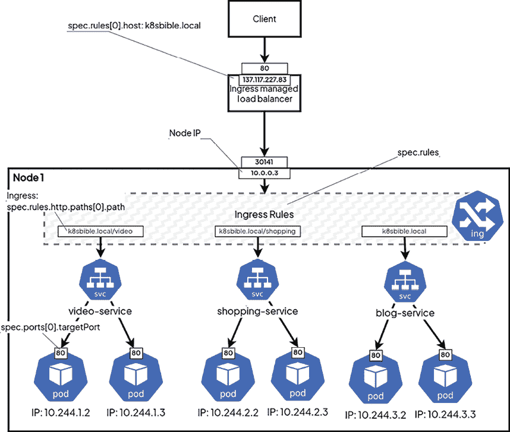
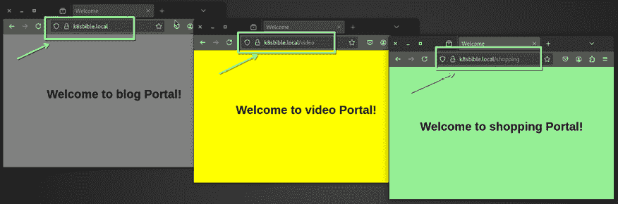
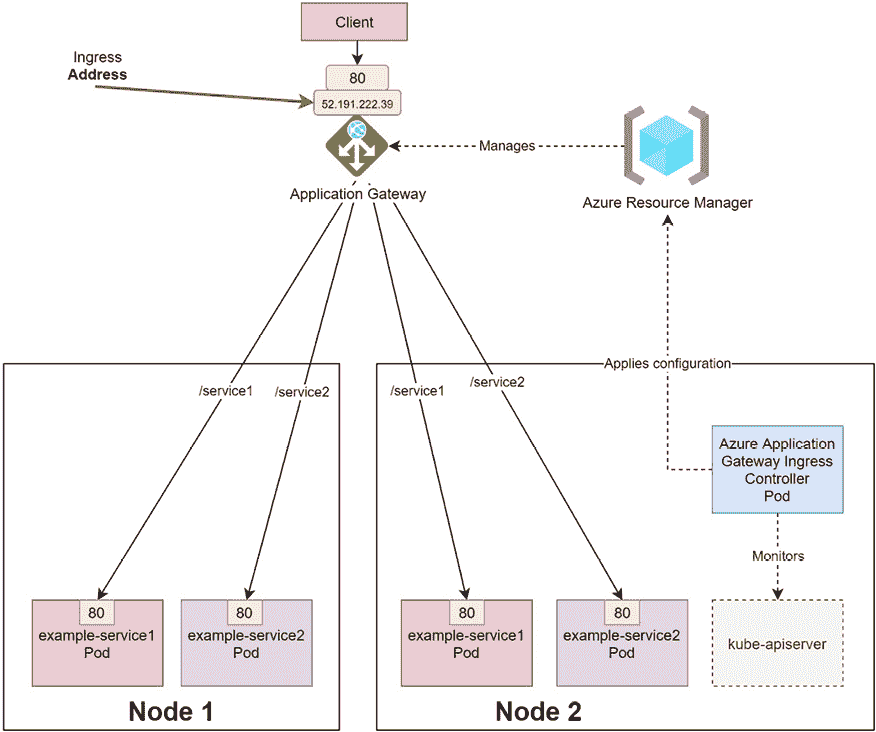
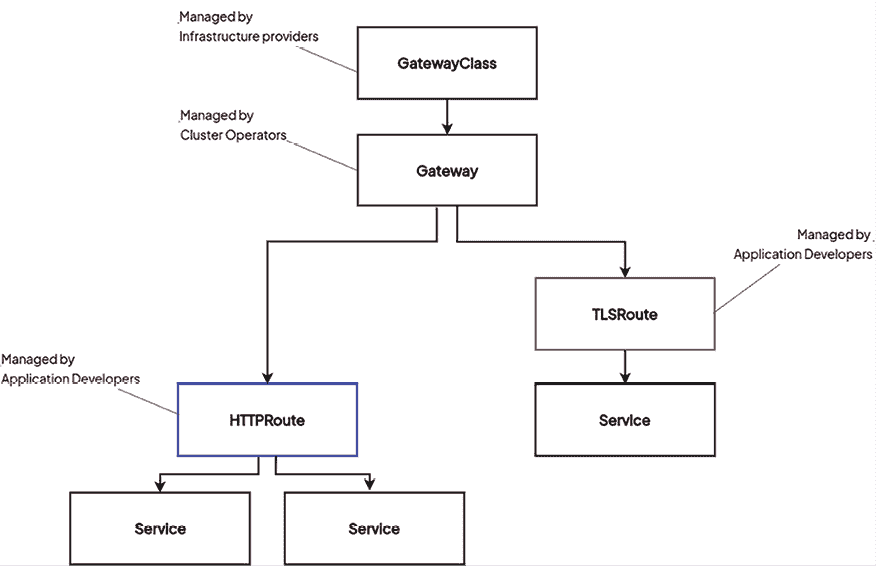
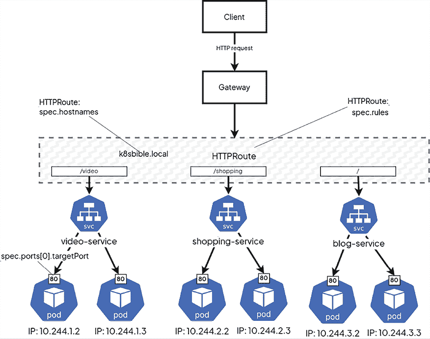

# 21

# 高级 Kubernetes：流量管理、多集群策略及更多

本章将讨论 Kubernetes 中的高级主题，这些主题超出了本书前几部分的内容。我们将从深入探讨如何利用 Ingress 实现一些复杂的路由到你的 Pods 开始，接着介绍有效的 Kubernetes 故障排除方法和加固 Kubernetes 安全性的技巧，并提供优化 Kubernetes 设置的最佳实践。

本章将介绍如何使用 Ingress 资源在 Kubernetes 中实现高级流量路由。简而言之，Ingress 允许你通过 HTTP 和 HTTPS 路由将运行在 Service 对象后面的 Pods 暴露给外部世界。到目前为止，我们已介绍了通过 Service 对象直接暴露应用程序的方法，特别是 LoadBalancer Service。但这种方法仅在有 cloud-controller-manager 运行的云环境中有效，它通过配置外部负载均衡器与该类型的 Service 一起使用。此外，每个 LoadBalancer Service 都需要一个单独的云负载均衡器实例，这会带来额外的成本和维护开销。接下来，我们将介绍 Ingress 和 Ingress Controller，它们可以在任何类型的环境中为你的应用程序提供路由和负载均衡能力。你还将了解如何使用 nginx Web 服务器作为 Ingress Controller，以及如何为你的 AKS 集群配置专用的 Azure **应用程序网关 Ingress Controller**（**AGIC**）。

此外，我们还将回顾一些近期的 Kubernetes 项目，包括用于虚拟化的 KubeVirt 和无服务器解决方案，如 Knative 和 OpenFaaS。你还将了解短暂容器及其在实时故障排除中的应用、不同 Kubernetes 插件的角色，以及多集群管理。虽然我们会概述大多数内容，但请注意，部分话题仅会进行高层次讲解，因为它们超出了本书的详细范围。

在本章中，我们将覆盖以下主题：

+   使用 Ingress 进行高级流量路由

+   网关 API

+   Kubernetes 的现代进展

+   维护 Kubernetes 集群——第二天任务

+   加固 Kubernetes 集群——最佳实践

+   故障排除 Kubernetes

# 技术要求

本章需要以下内容：

+   部署一个 Kubernetes 集群。我们建议使用一个多节点的基于云的 Kubernetes 集群。也可以在启用所需插件后，在 `minikube` 中使用 Ingress。

+   需要一个 AKS 集群来学习有关 Azure AGIC 的部分内容。

+   需要在本地机器上安装 Kubernetes CLI（`kubectl`）并进行配置，以便管理 Kubernetes 集群。

基本的 Kubernetes 集群部署（本地和基于云的）及 `kubectl` 安装内容已在*第三章*《安装你的第一个 Kubernetes 集群》中讨论。

本书的前几章，*第十五章*，*第十六章*，和*第十七章*，为您提供了如何在不同云平台上部署一个完全功能的 Kubernetes 集群，并安装所需的 CLI 工具来管理它们的概述。

您可以从官方 GitHub 仓库下载本章的最新代码示例，地址为[`github.com/PacktPublishing/The-Kubernetes-Bible-Second-Edition/tree/main/Chapter21`](https://github.com/PacktPublishing/The-Kubernetes-Bible-Second-Edition/tree/main/Chapter21)。

# 使用 Ingress 进行高级流量路由

本节将解释如何使用 Ingress 提供 Kubernetes 中的高级网络功能和流量路由机制。从根本上讲，Ingress 是一个反向代理 Kubernetes 资源。它将根据 Ingress 配置中指定的规则，将来自集群外部的传入请求路由到集群内部的服务。单个入口可以用于允许外部用户访问集群内部部署的应用程序。

在我们深入了解 Ingress 及其资源之前，让我们快速回顾一下我们已经使用过的几种 Kubernetes 服务类型来访问应用程序。

## 回顾 – Kubernetes 服务

在*第八章*，*通过服务暴露您的 Pod*中，您了解了可以用来暴露 Pod 以供负载均衡流量访问的 Service 对象，既包括内部流量也包括外部流量。在内部，它们作为由 kube-proxy 在每个节点上管理的虚拟 IP 地址实现。接下来，我们将快速回顾不同类型的服务：

+   `ClusterIP`: 通过由`kube-proxy`在每个节点上管理的内部可见虚拟 IP 地址暴露 Pod。这意味着该服务只能从集群内部访问。

+   `NodePort`: 像`ClusterIP`服务一样，可以通过任何节点的 IP 地址和指定端口进行访问。Kube-proxy 在`30000`到`32767`范围内暴露端口——默认情况下，这是可以配置的——并在每个节点上设置转发规则，将该端口的连接引导到相应的`ClusterIP`服务。

+   `LoadBalancer`: 通常用于有**软件定义网络**（**SDN**）的云环境，在这种环境中，您可以根据需要配置负载均衡器，将流量重定向到集群。在云控制器管理器中，云中负载均衡器的自动配置是通过特定于供应商的插件驱动的。这种类型的服务结合了`NodePort`服务的方式，并在其前面增加了外部负载均衡器，将流量路由到 NodePorts。

当然，您仍然可以通过其`ClusterIP`在内部使用该服务。

虽然总是使用 Kubernetes 服务来启用外部流量访问集群可能听起来很诱人，但始终使用它们也有一些缺点。接下来，我们将介绍 Ingress 对象，并讨论它为何是必需的，以及在什么情况下应该用它来替代服务处理外部流量。

## Ingress 对象概述

在上一节中，我们简要回顾了 Kubernetes 中的 Service 对象及其在路由流量中的作用。从传入流量的角度来看，最重要的是 NodePort 服务和 LoadBalancer 服务。通常，NodePort 服务仅与另一个路由和负载均衡组件一起使用，因为在所有 Kubernetes 节点上暴露多个外部端点并不安全。现在，这就留下了 LoadBalancer 服务，它在背后依赖 NodePort。然而，在某些使用场景中，使用这种服务有一些限制：

+   层 4（L4）的`LoadBalancer`服务基于 OSI 层 4，按 TCP/UDP 协议路由流量。大多数基于 HTTP/HTTPS 的应用程序要求 L7 负载均衡，这与 OSI 层 7 的应用程序相关。

+   HTTPS 流量无法在 L4 负载均衡器中终止和卸载。

+   无法使用相同的 L4 负载均衡器在多个域名之间进行基于名称的虚拟主机托管。

+   如果你拥有一个 L7 负载均衡器，可以实现基于路径的路由。实际上，你根本无法配置 L4 负载均衡器来代理像`https://<loadBalancerIp>/service1`这样的请求到名为`service1`的 Kubernetes 服务，以及像`https://<loadBalancerIp>/service2`的请求到名为`service2`的 Kubernetes 服务，因为 L4 负载均衡器完全无法识别 HTTP(S)协议。

+   一些特性，比如会话保持或 cookie 亲和性，要求使用 L7 负载均衡器。

在 Kubernetes 中，这些问题可以通过使用 Ingress 对象来解决，它可以用于实现和建模 L7 负载均衡。Ingress 对象仅用于定义路由和负载均衡规则；例如，哪个路径应路由到哪个 Kubernetes 服务。

让我们来看一个 Ingress 的 YAML 清单文件示例，`ingress/portal-ingress.yaml`：

```
# ingress/portal-ingress.yaml
apiVersion: networking.k8s.io/v1
kind: Ingress
metadata:
  name: portal-ingress
  namespace: ingress-demo
  annotations:
    nginx.ingress.kubernetes.io/rewrite-target: /
spec:
  rules:
    - host: **k8sbible.local**
      http:
        paths:
          - **path:****/video**
            pathType: Prefix
            backend:
              service:
                **name:****video-service**
                port:
                  number: 8080
          - **path:****/shopping**
            pathType: Prefix
            backend:
              service:
                **name:****shopping-service**
                port:
                  number: 8080 
```

我们可以通过以下图示来可视化 Ingress Controller 后面的发生情况：



图 21.1：在云环境中使用 nginx 作为 Ingress Controller

简单来说，Ingress 是服务的路由规则的抽象定义。单独使用 Ingress 并不执行任何操作；它需要 Ingress Controller 来实际处理和实现这些规则——你可以应用`manifest`文件，但此时它不会产生任何效果。但首先，我们将解释 Ingress HTTP 路由规则是如何构建的。规范中的每个规则都包含以下内容：

+   **可选主机**：我们在示例中没有使用这个字段，因此我们在这里定义的规则适用于所有传入流量。如果提供了该字段值，那么规则仅适用于目标为此主机的请求——你可以让多个主机名解析到同一个 IP 地址。`host`字段支持通配符。

+   **路径路由的列举**：每个路径都有一个关联的 Ingress 后端，您通过提供 `serviceName` 和 `servicePort` 来定义。在前面的示例中，所有到达以 `/video` 为前缀的路径的请求都将被路由到 `video-service` 服务的 Pods，而所有到达以 `/shopping` 为前缀的路径的请求都将被路由到 `shopping-service` 服务的 Pods。`path` 字段支持前缀匹配和精确匹配，您还可以使用特定实现的匹配方式，这些匹配由底层的 Ingress Controller 执行。

这样，您将能够配置涉及集群中多个服务的复杂路由规则，但在外部它们将作为一个单一的端点呈现，并且有多个可用的路径。

为了实现这些 Ingress 对象，我们需要在集群中安装一个 Ingress Controller，我们将在下一节中学习如何操作。

## 使用 nginx 作为 Ingress Controller

Ingress Controller 是一个 Kubernetes 控制器，通常以 DaemonSet 或 Deployment 对象的形式手动部署到集群中，专门负责处理传入流量的负载均衡和智能路由。它负责处理 Ingress 对象，也就是说，它负责那些指定要使用 Ingress Controller 的对象，并进行实时路由规则的动态配置。

与其他作为 `kube-controller-manager` 二进制文件的一部分运行的控制器不同，Ingress 控制器不会随着集群的启动而自动启动。Kubernetes 项目维护了多个 Ingress 控制器，包括 AWS、GCE 和 nginx Ingress 控制器。对于第三方 Ingress 控制器项目，请参阅文档以获取详细列表：

[`kubernetes.io/docs/concepts/services-networking/ingress-controllers/#additional-controllers`](https://kubernetes.io/docs/concepts/services-networking/ingress-controllers/#additional-controllers)

一个常用的 Kubernetes Ingress 控制器是 nginx。正确的术语是 **Nginx Ingress Controller**。Ingress Controller（[`www.f5.com/products/nginx/nginx-ingress-controller`](https://www.f5.com/products/nginx/nginx-ingress-controller)）作为 Deployment 安装在集群中，并设置处理 Ingress API 对象的规则。Ingress Controller 作为一个 Service 暴露，类型取决于安装方式——在云环境中，类型将是 `LoadBalancer`。

在云环境中，您经常会遇到专用的 Ingress 控制器，这些控制器利用云提供商提供的特殊功能，允许外部负载均衡器直接与 Pods 通信。在这种情况下，没有额外的 Pod 开销，甚至可能不需要 `NodePort` 服务。这种路由是在 SDN 和 CNI 层进行的，而负载均衡器可能会使用 Pods 的私有 IP 地址。我们将在下一节讨论时，回顾这种方法的一个示例，具体是关于 **AKS 的应用网关 Ingress 控制器**。

`ingress-nginx` 的安装方法已在官方文档中针对不同环境进行了描述：[`kubernetes.github.io/ingress-nginx/deploy/`](https://kubernetes.github.io/ingress-nginx/deploy/)。

请注意，虽然使用 Helm 是首选的部署方法，但某些环境可能需要特定的说明。对于云环境，安装 ingress-nginx 通常非常简单，只需应用一个 YAML 清单文件（或在创建云托管的 Kubernetes 集群时启用 ingress-nginx），即可创建多个 Kubernetes 对象。例如，可以通过以下单个命令，在 AKS 或 GKE 中部署所需的 ingress 控制器组件：

```
$ kubectl apply -f https://raw.githubusercontent.com/kubernetes/ingress-nginx/controller-v1.11.2/deploy/static/provider/cloud/deploy.yaml 
```

在编写本文及测试部署时，情况是这样的。要获取最新的稳定版本，请参考 Ingress 控制器的文档。还要注意，不同的 Kubernetes 发行版可能有不同的前提条件来实现这些功能；例如，您需要在 GKE 集群中拥有集群管理员权限，才能启用 ingress-nginx。请参考文档 ([`kubernetes.github.io/ingress-nginx/`](https://kubernetes.github.io/ingress-nginx/)) 以了解更多信息。

在 AWS 中，通过配置类型为 LoadBalancer 的服务来使用 **网络负载均衡器** (**NLB**) 来公开 Nginx Ingress 控制器：

```
$ kubectl apply -f https://raw.githubusercontent.com/kubernetes/ingress-nginx/controller-v1.11.2/deploy/static/provider/aws/deploy.yaml 
```

该 YAML 文件包含多个资源，用于在集群中设置 Ingress，包括 `Roles`、`RoleBinding`、`Namespace`、`ConfigMap` 等。

如果您没有云环境或基于云的 Kubernetes 部署，请参考以下部分，在 minikube 集群中部署 Ingress 控制器。

## 在 minikube 中部署 NGINX Ingress 控制器

可以使用以下命令部署一个多节点的 `minikube` Kubernetes 集群：

```
$ minikube start --cni calico --nodes 3 --kubernetes-version=v1.31.0 
```

一旦 Kubernetes 集群启动并运行，使用以下命令在 `minikube` 集群中启用 Ingress：

```
$ minikube addons enable ingress
💡  ingress is an addon maintained by Kubernetes. For any concerns contact minikube on GitHub.
...<removed for brevity>...
🔎  Verifying ingress addon...
🌟  The 'ingress' addon is enabled 
```

按照如下方式验证`ingress-nginx`命名空间中的 Pods：

```
$ kubectl get pods -n ingress-nginx
NAME                                        READY   STATUS      RESTARTS   AGE
ingress-nginx-admission-create-rsznt        0/1     Completed   0          78s
ingress-nginx-admission-patch-4c7xh         0/1     Completed   0          78s
ingress-nginx-controller-6fc95558f4-zdhp7   1/1     Running     0          78s 
```

现在，Ingress 控制器已准备好监控 Ingress 资源。在接下来的部分，我们将学习如何在 Kubernetes 集群中部署 Ingress 资源。

## 在 Kubernetes 中部署 Ingress 资源

现在，我们已准备好部署我们的应用程序；请参考存储库中的`Chapter21/ingress`目录，我们已在该目录中准备了以下 YAML 文件：

+   `00-ingress-demo-ns.yaml`：创建 `ingress-demo` 命名空间。

+   `video-portal.yaml`：创建一个包含 ConfigMap、Deployment 和 Service 的 `video` 门户。

+   `blog-portal.yaml`：创建一个包含 ConfigMap、Deployment 和 Service 的 `blog` 门户。

+   `shopping-portal.yaml`：创建一个包含 ConfigMap、Deployment 和 Service 的 `shopping` 门户。

+   `portal-ingress.yaml`：创建 ingress 资源，为我们的网站（`k8sbible.local`）创建基于路径的 ingress。

在 `portal-ingress.yaml` 文件中，以下规则告诉 ingress，当用户访问 `k8sbible.local/video` 时，服务 `video-service`：

```
# ingress/portal-ingress.yaml
...
spec:
  rules:
    - host: k8sbible.local
      http:
        paths:
          - path: /video
            pathType: Prefix
            backend:
              service:
                name: video-service
                port:
                  number: 8080
... 
```

以下规则告诉 ingress，当用户访问 `k8sbible.local/shopping` 时，服务 `shopping-service`：

```
...
          - path: /shopping
            pathType: Prefix
            backend:
              service:
                name: shopping-service
                port:
                  number: 8080
...
Finally, the following rule tells the ingress to serve the **blog-service** when users access **k8sbible.local/ or k8sbible.local:**
...
          - path: /
            pathType: Prefix
            backend:
              service:
                name: blog-service
                port:
                  number: 8080 
```

由于我们已经了解了 Deployment、ConfigMaps 和 Services，因此我们将跳过这些内容的解释；你可以参考仓库中的 YAML 文件获取更多信息。

按如下方式应用 ingress 目录中的 YAML 文件：

```
$ kubectl apply -f ingress/
namespace/ingress-demo created
configmap/blog-configmap created
deployment.apps/blog created
service/blog-service created
ingress.networking.k8s.io/portal-ingress created
configmap/shopping-configmap created
deployment.apps/shopping created
service/shopping-service created
configmap/video-configmap created
deployment.apps/video created
service/video-service created 
```

检查 Pods、Services 和 Ingress 资源：

```
$ kubectl get po,svc,ingress -n ingress-demo
NAME                            READY   STATUS    RESTARTS   AGE
pod/blog-675df44d5-5s8sg        1/1     Running   0          88s
pod/shopping-6f88c5f485-lw6ts   1/1     Running   0          88s
pod/video-7d945d8c9f-wkxc5      1/1     Running   0          88s
NAME                       TYPE        CLUSTER-IP      EXTERNAL-IP   PORT(S)    AGE
service/blog-service       ClusterIP   10.111.70.32    <none>        8080/TCP   88s
service/shopping-service   ClusterIP   10.99.103.137   <none>        8080/TCP   88s
service/video-service      ClusterIP   10.109.3.177    <none>        8080/TCP   88s
NAME                                       CLASS   HOSTS            ADDRESS         PORTS   AGE
ingress.networking.k8s.io/portal-ingress   nginx   k8sbible.local   192.168.39.18   80      88s 
```

如果你使用的是基于云的 Kubernetes 集群，那么 `k8sbible.local` 或你在 ingress 配置中使用的任何 `host` 应指向云负载均衡器的 IP 地址。如果你没有注册任何实际的域名，你可以通过本地 `/etc/hosts` 文件（Windows 机器中的路径为 `C:\windows\system32\drivers\etc\hosts`）模拟相同的效果。

例如，假设我们已经部署了一个 minikube 集群，并使用以下通过 `minikube ip` 命令获取的 VM IP 地址，将它们添加到 `/etc/hosts` 文件中：

```
# k8sbible minikube
192.168.39.18 k8sbible.local 
```

现在，你可以通过 `http://k8sbible.local` 访问你的门户。打开浏览器（或使用 `curl` 命令）并测试不同的服务，如下图所示。



图 21.2：Ingress 提供不同服务。

当你向 `http://k8sbible.local/video` 发起 HTTP 请求时，流量会通过 nginx 路由到 video-service。同样，当你使用 `/shopping` 路径时，流量将被路由到 shopping-service。注意，在此操作中你只使用了一个云负载均衡器（或一个公共 IP/主机名），实际的路由到 Kubernetes 服务是通过 Ingress Controller Pods 使用基于路径的路由来完成的。

实际操作中，如果你想要确保 HTTP 端点的安全性，应设置 SSL 证书。可以为入口设置 SSL，但你需要一个域名或本地环境替代方案——本地域名。为了简洁和清晰，我们在示例中不会设置本地域名。欲了解更多信息，请参阅 cert-manager 的文档：

[`cert-manager.io/docs/tutorials/acme/nginx-ingress/`](https://cert-manager.io/docs/tutorials/acme/nginx-ingress/)

恭喜！你已经成功配置了集群中的 Ingress 和 Ingress Controller。

正如我们在本节开头提到的，存在多种可供使用的 Ingress 控制器和方法。在我们学习另一种 Ingress 方法之前，让我们在下一节中学习 ingressClass。

## ingressClass 和多个 Ingress 控制器

在某些情况下，我们可能需要为 Ingress 控制器配置不同的设置。使用单个 Ingress 控制器时，可能无法实现这一点，因为自定义配置可能会影响 Kubernetes 集群中的其他 Ingress 对象。在这种情况下，您可以通过使用 `ingressClass` 机制，在单一的 Kubernetes 集群内部署多个 Ingress 控制器。以下是一些典型场景：

+   **不同需求的不同 Ingress 类**：Kubernetes Ingress 控制器可以使用特定的 Ingress 类进行标注，例如 `nginx-public` 和 `nginx-private`。这有助于引导不同类型的流量；例如，公共流量可以由性能优化的控制器处理，而内部服务则保持在更严格的访问控制后面。

+   **多协议支持**`:` 不同的应用程序将需要支持多种协议，包括 HTTP/HTTPS 和 TCP/UDP。这可以通过为每种协议配置不同的 Ingress 控制器来处理。这样，具有不同协议要求的应用程序可以在同一 Kubernetes 集群上得到支持，而无需依赖于单一的 Ingress 控制器来处理所有类型的协议。这样不仅能提升性能，还能减少配置的复杂性。

需要注意的是 `ingressClass` 资源的 `.metadata.name`，因为在指定 Ingress 对象的 `ingressClassName` 字段时，这个名称是必需的。该 `ingressClassName` 字段替代了早期通过注解将 Ingress 与特定控制器关联的方法，正如 **IngressSpec** v1 文档中所述。

如果在创建 Ingress 时未指定 `IngressClass`，且您的集群中只有一个被标记为默认的 `IngressClass`，Kubernetes 会自动将该默认 IngressClass 应用于 Ingress。要将 IngressClass 标记为默认，您应在该 IngressClass 上设置 `ingressclass.kubernetes.io/is-default-class` 注解，并将其值设为 true。尽管这是预期的规范，但需要注意的是，不同的 Ingress 控制器在实现这些功能时可能会有些许差异。

现在，让我们查看在之前的实践实验中使用的 nginx Ingress 控制器，来识别 ingressClass：

```
$ kubectl get IngressClass -o yaml
apiVersion: v1
items:
- apiVersion: networking.k8s.io/v1
  kind: IngressClass
  metadata:
    name: nginx
    annotations:
      ingressclass.kubernetes.io/is-default-class: "true"
...<removed for brevity>...
  spec:
    controller: k8s.io/ingress-nginx 
```

在前面的代码片段中，以下内容是正确的：

+   `ingressClass` 的名称是 `nginx`（`.metadata.name`）

+   您可以看到 `ingressclass.kubernetes.io/is-default-class: "true"`

在接下来的部分中，我们将探索一种针对 AKS 的特殊类型的 Ingress 控制器，名为 Azure 应用程序网关 Ingress 控制器。

## 针对 AKS 的 Azure 应用程序网关 Ingress 控制器

正如前面章节中详细讨论的那样，使用 nginx Ingress 控制器是一种相当灵活的 Kubernetes 集群内流量路由方式。尽管这种方法通常能很好地工作，但当选择像**Azure Kubernetes Service**（**AKS**）这样的云服务提供商时，由于多层负载均衡的存在，这种方式可能会变得有些复杂。这些负载均衡层可能会引入不必要的复杂性，并增加故障点的数量。

为了解决这些问题，AKS 提供了一种原生的 L7 负载均衡服务，称为**Azure 应用程序网关 Ingress 控制器**（**AGIC**）。AGIC 与 Azure 的网络服务协同工作，支持更高效、更可靠的流量路由，使得能够通过 Pods 的私有 IP 地址直接与 Pods 通信。这样的功能通过一些 Azure SDN 特性得以实现，例如 VNet 对等连接。

## 为什么选择 AGIC 用于 AKS？

选择 AGIC 用于 AKS 的原因如下：

+   **简化的负载均衡**：AGIC 消除了使用单独的 Azure 负载均衡器的需求，这个负载均衡器会将请求通过 NodePorts 代理到 nginx Ingress 控制器 Pods。相反，它直接将流量转发到 Pods。这减少了负载均衡过程中涉及的层数，并最小化了故障点的可能性。

+   **直接 Pod 通信**：AGIC 利用 Azure SDN 能力，允许与 Pods 进行直接通信，而不需要 kube-proxy 来管理服务的路由。

AGIC 的高层设计如下图所示：



图 21.3：AKS 中的应用程序网关 Ingress 控制器

可以在现有的 AKS 集群上配置 AGIC，具体方法可以参见官方文档：[`docs.microsoft.com/en-us/azure/application-gateway/tutorial-ingress-controller-add-on-existing`](https://docs.microsoft.com/en-us/azure/application-gateway/tutorial-ingress-controller-add-on-existing)。

为了简化操作，我们将通过单个命令创建一个启用了 AGIC 的新 AKS 集群。要在 `k8sforbeginners-rg` 资源组中部署一个名为 `k8sforbeginners-aks-agic` 的双节点集群，请执行以下命令：

```
$ az aks create --resource-group myResourceGroup --name myAKSCluster --node-count 2 --network-plugin azure --enable-managed-identity -a ingress-appgw --appgw-name MyAppGateway --appgw-subnet-cidr "10.2.0.0/16" --generate-ssh-keys 
```

这将创建一个名为 `AksApplicationGateway` 的 Azure 应用程序网关，子网 CIDR 为 `10.2.0.0/16`。

集群部署完成后，我们需要生成 `kubeconfig` 以便与 `kubectl` 一起使用。运行以下命令（它会切换到一个新的上下文，这样你以后仍然可以使用旧的上下文）：

```
$ az aks get-credentials --resource-group k8sforbeginners-rg --name k8sforbeginners-aks-agic
Merged "k8sforbeginners-aks-agic" as current context in .kube/config 
```

现在我们可以使用与前一节相同的 YAML 清单来定义 `ingress` 目录中的部署和服务——与 Book 仓库中的定义相同。但是，我们需要在 AGIC 的 YAML 中做一些修改；为了更清晰起见，我们将 `ingress` 目录的内容复制到 `aks_agic` 目录中，并在其中进行修改。修改 Ingress 资源定义如下：

```
# aks-agic/portal-ingress.yaml
...
spec:
  **ingressClassName:****azure-application-gateway**
... 
```

我们还将命名空间重命名为 `agic-demo`，以隔离测试。按照以下方式从 `aks_agic` 目录应用 YAML 定义：

```
$ kubectl apply -f aks_agic/ 
```

等待片刻，直到应用网关更新其配置。要获取 Ingress 的外部 IP 地址，运行以下命令：

```
$ kubectl get ingress
NAME              CLASS    HOSTS   ADDRESS         PORTS   AGE
example-ingress   <none>   *       52.191.222.39   80      36m 
```

在我们的例子中，IP 地址是 52.191.222.39。

通过使用获取到的 IP 地址，访问 `/video` 和 `/shopping` 路径来测试配置：

+   **服务 1**：`http://<external-IP>/video` 将由 `video-service` Pods 提供服务。

+   **服务 2**：`http://<external-IP>/shopping` 将由 `shopping-service` Pods 提供服务。

+   **默认服务**：`http://<external-IP>/` 将由 `blog-service` Pods 提供服务。

使用此设置，您已经成功配置并测试了 AKS 中的 AGIC。

在下一部分，我们将了解 Kubernetes 中的 Gateway API，这是一种相对较新且强大的方法，用于管理集群内的流量路由。

# Gateway API

Kubernetes Gateway API 是一组不断发展的资源，它提供了一种更具表现力和可扩展的方式来定义集群中的网络流量路由。

它的设计目的是最终取代 Ingress API，提供一个更强大、灵活的机制来配置负载均衡、HTTP 路由和其他网络相关功能。

组成 Gateway API 的三个主要 API 资源如下：

+   `GatewayClass` 代表一类共享共同配置集并由实现该资源的同一控制器管理的 Gateways。

+   `Gateway` 是一个通过控制器管理流量的环境实例，例如云负载均衡器。

+   `HTTPRoute` 定义了从 Gateway 监听器到后端网络端点的 HTTP 特定路由规则，通常表现为服务。

下图展示了使用 Gateway API 资源的高级流程：



图 21.4：Gateway API 资源模型

在这些功能中，使用 Gateway API 相比 Ingress API 的主要优势包括对复杂路由场景（如多级、跨命名空间路由）的灵活支持。此外，设计还强调可扩展性，第三方开发者可以编写自己的 Gateway 控制器，与 Kubernetes 无缝交互。此外，Gateway API 允许对路由规则、流量策略和负载均衡管理任务进行更精细的控制。

这里提供了一个典型的 `GatewayClass` 作为参考：

```
# gateway_api/gatewayclass.yaml
apiVersion: gateway.networking.k8s.io/v1
kind: GatewayClass
metadata:
  name: dev-cluster-gateway
spec:
  controllerName: "example.net/gateway-controller" 
```

`gateway-api/gateway_api/gateway.yaml` 包含一个典型的 `Gateway` 资源，指向 `dev-cluster-gateway` 作为 `gatewayClassName`：

```
apiVersion: gateway.networking.k8s.io/v1
kind: Gateway
metadata:
  name: dev-gateway
  namespace: gateway-api-demo
spec:
  gatewayClassName: dev-cluster-gateway
  listeners:
    - name: http
      protocol: HTTP
      port: 80 
```

最后，我们有 `HTTPRoute`（类似于 Ingress），其中的规则指向不同的服务：

```
# gateway-api/httproute.yaml
apiVersion: gateway.networking.k8s.io/v1
kind: HTTPRoute
metadata:
  name: dev-httproute
  namespace: gateway-api-demo
spec:
  parentRefs:
    - name: dev-cluster-gateway
      kind: Gateway
      namespace: gateway-api-demo
  hostnames:
    - "k8sbible.local"
  rules:
    - matches:
        - path:
            type: PathPrefix
            value: /video
      backendRefs:
        - name: video-service
          port: 80 
```

下图解释了 Gateway API 工作流中涉及的组件：



图 21.5：Gateway API 组件。

如果你想进一步探索，可以参考文档并在集群中实现 Gateway API。Gateway API 旨在替代 Ingress API，但它不直接支持 Ingress 资源类型。因此，你需要将现有的 Ingress 资源转换为 Gateway API 资源，这是一项一次性的迁移工作。有关如何执行此迁移的指南，请查阅 Ingress 迁移指南（[`gateway-api.sigs.k8s.io/guides/migrating-from-ingress`](https://gateway-api.sigs.k8s.io/guides/migrating-from-ingress)）。

在我们结束高级路由、Ingress 和 Gateway API 话题之前，让我们在下一节快速介绍一下 EndPointSlices。

## 理解 Endpoints 和 EndpointSlices

传统上，Kubernetes 通过 Pod 管理应用程序的部署，其中 Service 对象充当可靠的网络中介。Services 会作为某种入口进入 Pod，并维护一个对应的 Endpoints 对象，该对象列出了与 Service 的选择器标准匹配的活跃、健康的 Pods。当规模增长时，这种方式无法扩展。

假设一个 Service 代表多个 Pods。对应的 Endpoints 对象携带每个 Pod 的 IP 和端口，这些信息会传播到集群中，并用于网络配置。任何对此对象的更新，都会影响整个集群中的节点，即使是微小的变化，也会导致大量网络流量和节点处理负担。

为了解决这一挑战，**EndpointSlices** 将庞大的 Endpoints 对象拆分成更小的部分。每个 EndpointSlice 默认容纳 100 个端点，这些端点表示 Pod 的网络详细信息。

使用 EndpointSlices 更新将更加精确。与其重新下载整个 Endpoints 对象，只更新包含该 Pod 的切片。这样可以减少网络流量和节点工作负载，最重要的是，提高可扩展性和性能，这已被证明是 Kubernetes 进化中的一个令人兴奋的前景。

请参考 EndPointSlices 文档了解更多信息（[`kubernetes.io/docs/concepts/services-networking/endpoint-slices/`](https://kubernetes.io/docs/concepts/services-networking/endpoint-slices/)）。

在下一节中，我们将探索诸如无服务器计算、机器学习、虚拟化等先进技术，以及它们如何与 Kubernetes 集成。

# Kubernetes 的现代进展

Kubernetes 处于整合和支持一系列先进技术的前沿，这些技术正在重塑 IT 领域的格局。因此，Kubernetes 提供了一个灵活且可扩展的平台，可以轻松集成现代和前沿的无服务器计算解决方案，如**Knative**；函数即服务，如**OpenFaas**；虚拟机管理，如**KubeVirt**；或者机器学习工作流，如**Kubeflow**。这些解决方案扩展了 Kubernetes 的功能，从而帮助组织创新，并以更高效和快速的方式迈向采用新范式的目标。

在本章中，我们将深入探讨两大最强大的框架 Knative 和 OpenFaaS 及其主要用例。

## 使用 Knative 和 OpenFaaS 实现无服务器架构

无服务器计算正在改变构建和部署应用程序的范式，这使得开发人员可以只编写代码，而基础设施管理则交给自动化平台。在 Kubernetes 环境中，结合**Knative**和**OpenFaaS**，强大的无服务器功能可以部署、扩展和管理函数即服务。

**Knative** 是一个基于 Kubernetes 的平台，它抽象化了管理容器化应用程序的底层复杂性。它为诸如自动扩展、流量管理和事件驱动函数执行等任务提供了自动化。此外，这也使得 Knative 在处理可变工作负载或事件驱动任务时非常高效。你可以使用 Knative 在高峰期扩展微服务，处理后台任务，如用户上传处理，或构建超响应的事件驱动系统。

另一个灵活的框架是**OpenFaaS**，它在 Kubernetes 上部署函数时提供了极大的便利。OpenFaaS 允许在容器中部署轻量级的无服务器函数，从而确保易于扩展和管理。这在微服务架构中非常有用，可以根据需求单独扩展每个函数。OpenFaaS 非常适用于实时数据处理、事件触发的函数，或者构建 API 以调整图像大小或转换数据，而无需整个应用堆栈的开销。结合 Knative 和 OpenFaaS，组织可以更好地利用 Kubernetes 来减少复杂性，并以更高效的应用程序实现扩展。

## Kubeflow – Kubernetes 上的机器学习

**Kubeflow** 是一个开源平台，使得在 Kubernetes 上部署、扩展和管理机器学习工作流变得简单顺畅。它将各种工具和框架整合到一个系统中，使数据科学家和开发人员能够专注于创建和实验机器学习模型，而无需担心管理基础设施。

Kubeflow ([`www.kubeflow.org`](https://www.kubeflow.org)) 可以自动化整个机器学习周期，从数据准备到模型训练，再到部署和监控。它支持大多数流行的机器学习框架，如 **TensorFlow**、**PyTorch** 和 **XGBoost**，因此这些工具能够无缝集成到现有的工作流中。Kubeflow 运行在 Kubernetes 之上，借助 Kubernetes 层的可扩展性和弹性，意味着当需要时，您的机器学习工作负载可以扩展，并能够自动从故障中恢复。

特别是，Kubeflow 是管理大型机器学习项目的有效解决方案，适用于在分布式数据集上进行模型训练、将模型部署到生产环境或在新数据上重复训练模型的场景。这意味着，Kubeflow 可以实现一个真正强大且灵活的平台，加速机器学习应用程序在 Kubernetes 上的开发和部署。

在下一节中，我们将学习什么是 KubeVirt。

## KubeVirt – Kubernetes 上的虚拟机

**KubeVirt** (`https://kubevirt.io`) 是一个开源项目，它通过管理虚拟机（VMs）扩展了 Kubernetes，除了容器化的工作负载外，还支持虚拟机的管理。这一集成让组织能够在 Kubernetes 集群内运行虚拟机，使得依赖虚拟机的传统应用和现代容器化应用能够在同一管理平台上并行部署。

KubeVirt 允许虚拟机与容器平稳共存。它使得用户能够利用 Kubernetes 强大的编排和扩展功能来管理所有工作负载。这对那些正在迁移到云原生环境，但仍需要支持在虚拟机上运行的遗留应用的组织尤其有帮助。在这种情况下，KubeVirt 可以像容器化应用一样，在同一个 Kubernetes 环境中管理、扩展和编排这些虚拟机。

对于使用 Red Hat OpenShift 的用户，这就是 KubeVirt 的产品化版本，称为 OpenShift Virtualization。它将带来所有这些功能，使您能够直接在 OpenShift 内部运行和管理虚拟机，与容器化的工作负载并排运行。这将减少操作和复杂性，解锁资源的灵活高效使用，并在继续支持基于虚拟机的现有应用程序的同时，更轻松地实现 IT 基础设施的现代化。

我们讨论了新的集群构建，并且大多数时候，我们讨论的是用于开发环境的 Kubernetes，例如 minikube 集群。实际上，也有一些正在运行的 Kubernetes 集群，这些集群托管着生产关键应用程序，因此确保所有种类的集群维护任务作为第二天操作的一部分得到妥善处理至关重要。

在接下来的章节中，我们将探讨一些 Kubernetes 的维护任务。

# Kubernetes 集群的维护 – 第二天任务

在接下来的章节中，我们将重点介绍 Kubernetes 的标准维护任务，例如备份、升级、多集群管理等。

## Kubernetes 集群的备份与恢复

Kubernetes 的备份与恢复是确保数据完整性和业务连续性的关键问题，特别是在生产环境中。在 Kubernetes 集群的备份范围中，最重要的元素是`etcd`，即存储集群所有关键配置和状态的键值存储。对于本地或自管集群的`etcd`备份，涉及到创建快照并安全地存储它们。

### 备份 etcd

备份`etcd`集群对于所有 Kubernetes 对象的完整性至关重要，因为`etcd`存储了整个 Kubernetes 集群的状态。定期备份可以在丢失所有控制平面节点时帮助恢复集群。备份过程会创建一个包含所有 Kubernetes 状态和其他关键数据的快照文件。由于这些数据可能包含敏感信息，建议加密快照文件。

通过使用`etcdctl`备份的机制完全是在`etcd`项目层面。对于其他 Kubernetes 发行版，通常会提供适当的工具或机制来执行`etcd`备份。例如，这个`cluster-backup.sh`脚本是`OpenShift`中`etcd` `Cluster Operator`的一部分，它封装了执行`etcdctl snapshot save`的过程，简化了对`etcd`集群执行快照的操作。

`etcdctl`工具允许你直接从活跃的`etcd`成员创建`etcd`集群的快照。这个过程不会影响`etcd`实例的性能。

`etcdctl`和`etcdutl`工具可以从`etcd`发布页面安装([`github.com/etcd-io/etcd/releases/`](https://github.com/etcd-io/etcd/releases/))：

```
$ ETCDCTL_API=3 etcdctl \
  --endpoints=[https://127.0.0.1:2379] \
  --cacert=/etc/kubernetes/pki/etcd/ca.crt \
  --cert=/etc/kubernetes/pki/etcd/server.crt \
  --key=/etc/kubernetes/pki/etcd/server.key \
  snapshot save /tmp/snapshot-pre-patch.db 
```

这些文件（trusted-ca-file、cert-file 和 key-file）通常可以在`etcd` Pod 的描述中找到（例如，`/etc/kubernetes/manifests/etcd.yaml`）。

创建快照后，使用`etcdutl`工具验证其完整性：

```
$ etcdutl --write-out=table snapshot status snapshot.db 
```

此命令显示如哈希值、修订版本、总键数和快照大小等详细信息。

如果你的`etcd`数据存储在支持快照的卷上（例如，Amazon Elastic Block Store），你可以通过对存储卷进行快照来备份`etcd`数据。这种方法通常用于云环境，其中存储快照可以自动化。

在基于云的集群中，像**Google Kubernetes Engine**（**GKE**）、Amazon EKS 或 Azure AKS 等托管服务简化了备份过程。这些平台通常提供集成的自动化备份工具和简便的恢复方式。例如，你可以使用 AWS Backup for EKS 或 Azure Backup for AKS 定期备份集群的状态和配置，而无需人工干预。

### 使用 etcdutl 恢复 etcd 快照

从快照恢复`etcd`集群是一个关键且复杂的任务，特别是在多节点设置中，必须确保所有节点的一致性。该过程需要小心处理，以避免问题，尤其是当 API 服务器正在运行时。在启动恢复之前，重要的是停止所有 API 服务器实例，以防止不一致。一旦恢复完成，你应该重新启动 API 服务器，并且要重新启动 Kubernetes 的关键组件，如 kube-scheduler、kube-controller-manager 和 kubelet，以确保它们不会依赖过时的数据。

要执行恢复，使用`etcdutl`工具并指定恢复数据的目录：

```
$ etcdutl --data-dir <data-dir-location> snapshot restore snapshot.db 
```

在恢复过程中，指定的`<data-dir-location>`将被创建。

### 重新配置 Kubernetes API 服务器

如果恢复后`etcd`集群的访问 URL 发生变化，你需要重新配置并使用更新后的`etcd`服务器 URL 重新启动 Kubernetes API 服务器（将`$NEW_ETCD_CLUSTER`替换为 IP 地址）：

```
...
--etcd-servers=$NEW_ETCD_CLUSTER
... 
```

如果在`etcd`集群前使用了负载均衡器，需相应更新其配置。

### 利用基础设施即代码（IaC）和配置即代码（CaC）进行弹性集群管理

备份和恢复`etcd`是复杂的，考虑到其可以通过多种方式执行以保持数据一致性和系统稳定性。最重要的是，你需要在 Kubernetes 集群和应用中实施 IaC 和 CaC 实践，以避免这些挑战。这样，你就可以轻松从零开始重新构建一切，因为所有内容都是版本控制、可重复且一致的。

在采用 IaC 和 CaC 实践时，需要注意的是，在 Git 工作流中应该遵循四眼原则。通常，这意味着所有变更必须经过团队中至少两名成员的审查，才能合并。这一做法将提升代码质量，确保合规性，并在备份和恢复过程中减少错误的发生。

为了稳健地设置这一过程，把你的集群视为无状态且不可变的。为所有配置（如命名空间、操作符、**基于角色的访问控制**（**RBAC**）设置、NetworkPolicies 等）保留 YAML 文件。将这些文件版本化，提交到仓库，并自动应用到新的集群中。这能确保新集群与旧集群一致，从而尽可能减少停机时间，并降低人为错误的发生。

同样，将这一做法扩展到你的应用程序；从 ConfigMaps 和 Services 到 PVCs，所有与应用程序部署相关的内容都应该被编码化。在有状态应用程序中，数据存储在集群外的 PVs 中。由于你将数据与配置分离，恢复应用程序到先前状态时，只需重新应用其 YAML 文件并重新连接到数据即可。

此外，使用 Helm 模板和通过 GitOps 实现持续部署也是可选的，可以让这个过程更加顺畅。这种自动化确保了所有配置的一致性，因为更改会自动应用到环境中，从而减少了手动干预。全面的集群和应用程序管理方法确实有助于简化灾难恢复，同时提升可扩展性、安全性和操作效率。

在接下来的部分中，我们将探讨一些集群升级任务和注意事项。

## Kubernetes 集群升级

升级 Kubernetes 集群是确保你的环境安全、稳定，并且能随时使用新功能的重要任务之一。大多数托管 Kubernetes 发行版在基于云的集群中容易升级，因为底层的复杂性由托管服务处理。这些包括 Amazon EKS、GKE 和 Azure AKS。它们提供一键升级功能，可以轻松升级到 Kubernetes 的新版本，且几乎没有或完全没有停机时间。

这对于本地或定制集群会有所不同；例如，使用 `kubeadm` 构建的集群提供了由 Kubernetes 提供的文档化升级路径（[`kubernetes.io/docs/tasks/administer-cluster/kubeadm/kubeadm-upgrade`](https://kubernetes.io/docs/tasks/administer-cluster/kubeadm/kubeadm-upgrade)），该路径会引导你完成升级控制平面和节点的步骤。

无论你是使用基于云的集群还是管理本地部署的环境，遵循结构化的升级流程是至关重要的。以下是如何升级 Kubernetes 集群的详细概述。

### 升级前检查清单

在启动升级之前，准备集群至关重要。以下是一些关键步骤：

+   **验证兼容性**：确保新的 Kubernetes 版本与你现有的所有组件和附加功能兼容。请参考 Kubernetes 官方文档中的兼容性矩阵。

+   **备份 etcd**：`etcd` 是 Kubernetes 集群的核心。在进行升级之前，请始终创建备份，以保护你的集群配置。

+   **禁用交换空间**：Kubernetes 要求所有节点禁用交换空间。确保正确配置此设置，以防止潜在问题。

### 升级过程

升级过程通常涉及几个步骤：

+   **排空节点**：使用 `kubectl drain <node-to-drain> --ignore-daemonsets` 安全地将所有 pod 从计划升级的节点中驱逐出去。这样可以确保在升级过程中不会向节点分配新的工作。

+   **升级控制平面**：首先升级控制平面组件，例如 API 服务器、`etcd` 和 controller-manager。使用你的包管理器的更新和升级命令（例如 apt-get 或 yum）来安装最新版本。

+   **升级 kubeadm**：将 kubeadm 更新到所需版本。这可以确保与新的 Kubernetes 版本兼容。

+   **升级 kubelet 和 kubectl**：更新控制平面后，升级每个节点上的 kubelet 和 kubectl。这些组件与控制平面交互，并管理 pods。

+   **解除节点禁用**：升级节点后，使用 `kubectl uncordon <node-name>` 重新启用节点以调度 pods。

+   **升级计算节点**：对工作节点执行滚动升级，按照与控制平面相同的步骤进行。

+   **升级 CNI 插件**：确保您的 **容器网络接口**（**CNI**）插件与新的 Kubernetes 版本兼容。如果需要，进行更新。

### 升级后任务

升级后任务通常包括以下内容：

+   **验证集群状态**：使用 `kubectl get nodes` 确认所有节点处于 Ready 状态。

+   **监控 etcd**：在升级过程中和升级后，保持对 etcd 健康状况和性能的关注。

+   **切换包仓库**：如果尚未更新，请更新您的包仓库，指向新的 Kubernetes 版本源。

### 回滚计划

一个重要的事情是，应该为升级过程中的意外错误制定回滚计划。回滚计划应包括执行回退到先前配置和恢复备份所需的步骤。尽管 etcd 的 API 和数据结构的内部变化使得回滚变得困难，但做好准备可以减少时间和运营中断。确定需要由谁做什么，并在团队中协调响应，即使发生需要实施该计划的情况较少，也能保证及时和协调的反应。

### 额外提示

一些额外的提示如下：

+   **在预演环境中测试升级**：在升级生产集群之前，最好先在预演或开发环境中测试升级过程。

+   **考虑使用集群升级工具**：一些工具会自动执行升级过程中的某些操作，因此您需要手动做的工作会更少，发生错误的机会也更少。

+   **监控问题**：在升级过程中以及之后，监控集群，检查是否有任何异常迹象。

还可以通过使用 Ansible、Terraform、AWS CloudFormation 和 ARM 模板来进一步支持升级自动化，这些工具将代替节点配置、部署包和滚动更新来驱动升级过程。

在这种实际使用场景中，可以通过自动化在多云环境中升级集群。您可以使用 ArgoCD 或 Fleet 等工具管理多集群部署，确保跨不同环境的所有集群都能一致地升级。以上方法对管理多个集群的组织非常有用，从而减少了人工工作并保持环境的一致性。

我们将在下一部分探讨一些知名的多集群管理工具。

## 多集群管理

组织规模的指数增长也增加了在不同环境中管理大量 Kubernetes 集群的复杂性。正是在这里，多集群管理解决方案提供了一个单一的控制点，能够部署、监控和升级集群。许多这类解决方案具备自动化集群配置和滚动更新等功能，这些都能确保所有管理的集群保持一致性和安全性。

例如，在一个多云环境中，可以使用 Terraform 和 ArgoCD 在 AWS、Azure 和 Google Cloud 上配置和管理 Kubernetes 集群。在这种环境下，部署和升级可以自动化进行，极大地减少了人为错误的可能性，同时所有集群可以保持相同版本的 Kubernetes。这在一个大型组织中尤其有用，特别是当组织拥有多个团队或地区时，这样就能确保 Kubernetes 环境的一致性和实时性，以提高运营效率。

以下列表包含了一些知名的 Kubernetes 多集群管理工具和服务：

+   **Rancher**：Rancher 是一个开源平台，旨在简化 Kubernetes 管理。它使得跨不同环境的集群能够集中管理，无论是在本地还是云端。Rancher 提供了多集群应用部署、集成监控以及用于跨集群管理用户权限的 RBAC 等功能。

+   **Lens**：Lens 是一个 Kubernetes **集成开发环境** (**IDE**)，它使得从单一界面管理多个集群变得更加容易。它提供了实时洞察、内置终端以及资源管理视图，使得开发人员和运维人员能够更加轻松地可视化和控制他们的 Kubernetes 环境。

+   **Kops**`:` **Kubernetes Operations** (**Kops**) 是一个用于管理 Kubernetes 集群生命周期的工具，特别是在 AWS 上。它自动化了创建、升级和删除集群的过程，并因其能够简化不同云平台上的操作而受到好评。

+   **Red Hat Advanced Cluster Management for Kubernetes**：这个工具为管理跨混合云和多云环境的 Kubernetes 集群提供了全面的解决方案。它包括基于策略的治理、应用生命周期管理和集群可观察性等功能，确保集群符合合规性并且表现优化。

+   **Anthos (Google Cloud)**：这是谷歌云推出的一个多云和混合云管理平台，旨在简化跨不同环境管理 Kubernetes 集群的操作，无论集群是部署在本地还是不同的云服务提供商上。Anthos 提供了集中的治理、安全性，并确保在多种基础设施设置中，应用部署保持一致性，从而保证所有管理集群的统一运营体验。

+   **Azure Arc**：该服务将 Azure 的管理和治理功能扩展到任何运行的 Kubernetes 集群——无论是在本地、其他云环境还是边缘。使用 Azure Arc，您可以通过一个单一界面管理和保护跨多个环境的 Kubernetes 集群，从而实现一致的政策执行、安全管理和基础设施监控。

在接下来的部分，我们将学习 Kubernetes 集群强化的最佳实践。

# 保护 Kubernetes 集群 – 最佳实践

保护 Kubernetes 集群至关重要，以防止未经授权的访问、数据泄露和服务中断。通过实施强有力的安全措施，您可以保护敏感数据并确保系统的平稳运行。本节概述了帮助您保护集群免受意外和恶意威胁的安全指南和最佳实践。

本章将讨论的某些安全概念已经在*第十八章*《Kubernetes 安全》中有所涉及。在这里，我们重新审视这些要点，并强调它们作为 Kubernetes 最佳实践的一部分。

## 控制对 Kubernetes API 的访问

由于 Kubernetes 在很大程度上依赖于其 API，控制和限制访问是确保集群安全的第一步：

+   **使用 TLS 加密 API 流量**：Kubernetes 默认使用 TLS 加密 API 通信。大多数安装方法会自动处理所需的证书。然而，管理员应注意任何未加密的本地端口，并相应地进行加固。

+   **API 认证**：选择适合您需求的认证方法。对于较小的单用户集群，简单的证书或静态 Bearer Token 可能足够。较大的集群可能需要与现有的认证系统（如 OIDC 或 LDAP）集成。

+   **API 授权**：经过认证后，每个 API 请求必须通过授权检查。Kubernetes 使用 RBAC 将用户或组与角色中定义的一组权限匹配。这些权限与对资源的特定操作相关，并且可以作用于命名空间或整个集群。为了更好的安全性，建议将节点和 RBAC 授权一起使用。

### 控制对 Kubelet 的访问

Kubelet 负责管理节点和容器，暴露 HTTPS 端点，这些端点可能会赋予对节点的重大控制权。在生产环境中，请确保启用 Kubelet 认证和授权。

在生产环境中控制对 Kubelet 的访问时，应确保 Kubelet API 的认证和授权有效地限制并分配权限。默认情况下，仅允许通过 Kubernetes API 服务器发出的请求，这样可以阻止未经授权的直接访问 Kubelet。您还可以通过为用户和服务实施 RBAC 策略设置，进一步增强此限制，定义与 Kubelet 相关的 RBAC 权限，同时利用网络策略或防火墙规则限制 Kubelet 端点的网络暴露。

### 控制运行时工作负载或用户权限

Kubernetes 中的授权是高层次的，但你可以应用更细粒度的策略来限制资源使用并控制容器特权：

+   **限制资源使用**：使用资源配额和限制范围来控制命名空间可以使用的 CPU、内存或磁盘空间等资源的数量。这可以防止用户请求不合理的资源值。

+   **控制容器特权**：Pod 可以请求以特定用户或具有某些特权的身份运行。大多数应用程序不需要 root 访问权限，因此建议将容器配置为以非 root 用户身份运行。

+   **防止不必要的内核模块**：为了防止攻击者利用漏洞，阻止或卸载节点上不必要的内核模块。你还可以使用像 **SELinux** 这样的 Linux 安全模块来防止模块加载到容器中。

### 限制网络访问

Kubernetes 允许你在不同层次上控制网络访问：

+   **网络策略**：使用网络策略来限制其他命名空间中的哪些 Pod 可以访问你命名空间中的资源。你还可以使用配额和限制范围来控制节点端口请求或负载均衡服务。

+   **限制云元数据 API 访问**：云平台通常暴露包含敏感信息的元数据服务。使用网络策略限制对这些 API 的访问，并避免将云元数据用于存储秘密信息。

### 保护集群组件

为了确保集群安全，保护像 `etcd` 这样的关键组件并确保正确的访问控制非常重要：

+   **限制对 etcd 的访问**：获得对 `etcd` 的访问权限可能会导致对集群的完全控制。使用强认证凭据，并考虑将 `etcd` 服务器隔离在防火墙后面。例如，对于 AWS 上的 Kubernetes 集群，可以创建一个具有限制入站规则的安全组，仅允许 Kubernetes 控制平面的 IP 访问私有部署中 `etcd` 的 `2379` 端口。你还可以使用 `--client-cert-auth` 和 `--trusted-ca-file` 标志来配置 `etcd`，这样只有控制平面才能通过安全连接进行访问。

+   **启用审计日志**：审计日志记录 API 操作以供后续分析。启用并保护这些日志有助于检测和响应潜在的安全问题。Kubernetes 集群管理团队需要为创建、删除和更新事件定义一个自定义审计策略，并可以指示将日志安全存储在像 Elasticsearch 这样的安全日志工具中。以下代码片段展示了 kube-apiserver Pod 清单中的日志配置示例：

    ```
    ...
    --audit-log-path=/var/log/audit.log
    --audit-policy-file=/etc/kubernetes/audit-policy.yaml
    ... 
    ```

+   **频繁轮换基础设施凭证**：短生命周期的凭证减少了未经授权访问的风险。定期轮换证书、令牌和其他敏感凭证以保持安全性。例如，可以配置 `cert-manager`（[`cert-manager.io/`](https://cert-manager.io/)）自动更新 TLS 证书，并配置 kubelet 定期刷新其自身证书，使用 `RotateKubeletClientCertificate` 和 `RotateKubeletServerCertificate` 标志。

+   **审查第三方集成**：在添加第三方工具或集成时，仔细审查其权限。尽可能将它们的访问权限限制在特定的命名空间中，以减少风险。例如，在安装 Prometheus 或 Grafana 等工具时，只需通过创建只读角色并将该角色绑定到所需的命名空间中，从而限制数据暴露的量。

+   **加密静态秘密**：Kubernetes 支持对存储在 `etcd` 中的秘密进行静态加密。这确保了即使有人获得了 `etcd` 数据的访问权限，他们也无法轻易查看敏感信息。在 Kubernetes API 服务器配置中配置 `EncryptionConfig`，以对存储在 `etcd` 中的秘密使用 AES 加密，从而在 `etcd` 被泄露时，数据仍然会被加密，增加一层安全保护。

以下表格总结了 Kubernetes 安全强化的一些最佳实践：

| **部分** | **最佳实践** |
| --- | --- |
| 安全集群设置 | 启用 RBAC 并使用专用的服务账户。保持 Kubernetes 组件更新。使用 TLS 保护 API 服务器访问。 |
| 控制集群访问 | 使用强认证方法。强制执行严格的访问控制和最小权限原则。定期审计和审查访问权限。 |
| 保护网络通信 | 加密内部通信。实施网络分段。使用安全的网络插件并强制执行网络策略。 |
| 安全容器镜像 | 使用可信的容器镜像注册表。扫描镜像漏洞。强制实施 Pod 安全策略以限制容器权限。 |
| 监控和记录集群活动 | 实施日志记录和监控解决方案。启用审计。定期查看日志以查找可疑活动。 |
| 定期更新和修补 | 及时应用更新和修补程序以解决漏洞。遵循严格的更新管理流程。 |
| 持续教育和培训 | 教育团队了解安全最佳实践。保持对最新安全发展的了解。在组织内部推广安全文化。 |

表 21.1：Kubernetes 集群安全最佳实践

要获得更详细的 Kubernetes 安全加固指导，请参考官方文档和社区资源。此外，考虑查阅如 Kubernetes 加固指南等全面的安全加固准则，该指南由**国防信息系统局**（**DISA**）提供 ([`media.defense.gov/2022/Aug/29/2003066362/-1/-1/0/CTR_KUBERNETES_HARDENING_GUIDANCE_1.2_20220829.PDF`](https://media.defense.gov/2022/Aug/29/2003066362/-1/-1/0/CTR_KUBERNETES_HARDENING_GUIDANCE_1.2_20220829.PDF))。

在接下来的章节中，我们将学习一些常见的 Kubernetes 故障排除方法。

# 故障排除 Kubernetes

故障排除 Kubernetes 涉及诊断和解决影响集群和应用程序功能及稳定性的问题。常见错误可能包括 Pod 调度问题、容器崩溃、镜像拉取问题、网络问题或资源约束。高效地识别和解决这些错误对于维护健康的 Kubernetes 环境至关重要。

在接下来的章节中，我们将介绍你开始进行 Kubernetes 故障排除所需的基本技能。

## 获取资源的详细信息

在 Kubernetes 故障排除过程中，`kubectl get` 和 `kubectl describe` 命令是诊断和了解集群内资源状态的重要工具。你在前几章中已经多次使用过这些命令，我们现在再回顾一下这些命令。

`kubectl get` 命令提供了集群中各种资源的高级概览，例如 Pod、服务、部署和节点。例如，如果你怀疑某个 Pod 没有按预期运行，可以使用 `kubectl get pods` 列出所有 Pod 及其当前状态。该命令会显示 Pod 是否正在运行、等待中，或是否遇到错误，帮助你快速识别潜在问题。

另一方面，`kubectl describe` 可以深入查看特定资源的详细信息。该命令提供资源的全面描述，包括其配置、事件和最近的变更。例如，如果前面命令列出的 Pod 失败，你可以使用 `kubectl describe pod todo-app` 获取有关其失败原因的详细信息。

该输出包括 Pod 的事件，例如容器启动失败尝试或拉取镜像的问题。它还会显示详细的配置数据，如资源限制和环境变量，这些信息有助于 pinpoint misconfigurations 或其他问题。

举个例子，假设你正在排查部署问题。使用 `kubectl get deployments` 可以查看部署的状态和副本数。如果部署卡住或未正确更新，`kubectl describe deployment webapp` 将提供有关部署滚动历史、条件和更新过程中遇到的错误的详细信息。

在接下来的章节中，我们将学习在 Kubernetes 中查找日志和事件的重要方法，帮助我们简化故障排除过程。

## Kubernetes 日志和事件用于故障排除

Kubernetes 提供了强大的工具，如 **Events** 和 **Audit Logs**，可以有效地监控和保护你的集群。Events 是 **Event** 类型的集群范围资源，提供了关键操作的实时概览，比如 Pod 调度、容器重启和错误。这些事件有助于快速诊断问题，并了解集群的状态。你可以使用 `kubectl get events` 命令查看事件：

```
$ kubectl get events 
```

这个命令会输出一个事件时间线，帮助你识别和排查问题。你可以通过资源类型、命名空间或时间段来过滤特定的事件。例如，要查看与特定 Pod 相关的事件，可以使用以下命令：

```
$ kubectl get events --field-selector involvedObject.name=todo-pod 
```

审计日志（Audit Logs），表示为 Policy 类型，对于确保 Kubernetes 环境中的合规性和安全性至关重要。这些日志记录了对 Kubernetes API 服务器发出的 API 请求的详细记录，包括用户、执行的操作和结果。这些信息对于审计活动非常重要，如登录尝试或权限升级。要启用审计日志，您需要通过审计策略配置 API 服务器。有关详细信息，请参阅审计文档（[`kubernetes.io/docs/tasks/debug/debug-cluster/audit/`](https://kubernetes.io/docs/tasks/debug/debug-cluster/audit/)）。

在调试 Kubernetes 应用时，`kubectl logs` 命令是一个关键工具，可以用来获取和分析特定容器的日志，帮助有效地诊断和排查问题。

要从 Pod 获取日志，基本命令如下：

```
$ kubectl logs todo-app 
```

该命令会从 Pod 中的第一个容器获取日志。如果 Pod 包含多个容器，请指定容器名称：

```
$ kubectl logs todo-app -c app-container 
```

对于实时日志流，类似于 Linux 中的 tail `-f`，可以使用 `-f` 标志：

```
$ kubectl logs -f todo-app 
```

这对于监控实时进程非常有用。如果一个 Pod 已经重启，你可以通过以下命令访问它之前实例的日志：

```
$ kubectl logs todo-app --previous 
```

要根据标签过滤日志，可以将 `kubectl` 与 `jq` 等工具结合使用：

```
$ kubectl get pods -l todo -o json | jq -r '.items[] | .metadata.name' | xargs -I {} kubectl logs {} 
```

要有效地管理 Kubernetes 中的日志，实施日志轮转是至关重要的，以防止磁盘空间的过度占用，确保旧日志在生成新日志时被归档或删除。利用结构化日志（例如 JSON 格式）可以更轻松地使用 `jq` 等工具解析和分析日志。此外，设置像 **Elasticsearch**、**Fluentd**、**Kibana**（**EFK**）这样的集中式日志系统，可以帮助你在整个 Kubernetes 集群中汇总和高效搜索日志，从而全面了解应用程序的行为。

Kubernetes 事件和审计日志一起提供了全面的监控和安全能力。事件提供了对应用程序状态和行为的洞察，而审计日志确保集群内的所有操作都被追踪，帮助你维持安全和合规的环境。

## kubectl explain – 内联帮助工具

`kubectl explain`命令是 Kubernetes 中的一个强大工具，帮助你理解 Kubernetes 资源的结构和字段。它提供了关于特定资源类型的详细信息，允许你直接从命令行浏览 API 架构。这在编写或调试 YAML 清单时尤其有用，因为它确保你使用正确的字段和结构。

例如，要了解 Pod 资源，你可以使用以下命令：

```
$ kubectl explain pod 
```

该命令将显示 Pod 资源的概览，包括简要描述。要深入了解特定字段，例如`spec`字段，你可以像这样扩展命令：

```
$ kubectl explain pod.spec 
```

这将提供关于`spec`字段的详细解释，包括其嵌套字段和预期的数据类型，帮助你更好地理解如何正确配置 Kubernetes 资源。

## 使用`kubectl exec`进行交互式故障排除

使用`kubectl exec`是故障排除和与 Kubernetes 中运行的容器交互的强大方式。这个命令允许你直接在容器内执行命令，这对于调试、检查容器环境和进行快速修复非常有价值。无论你是需要检查日志、检查配置文件，甚至诊断网络问题，`kubectl exec`都提供了一个直接的方式来实时与应用程序交互。

要使用`kubectl exec`，你可以先执行一个简单的命令在容器内部执行（你可以使用`kubectl apply –f trouble/blog-portal.yaml`进行测试）：

```
$ kubectl get po -n trouble-ns
NAME                   READY   STATUS    RESTARTS   AGE
blog-675df44d5-gkrt2   1/1     Running   0          29m 
```

例如，要列出容器的环境变量，你可以使用以下命令：

```
$ kubectl exec blog-675df44d5-gkrt2 -- env 
```

如果 pod 有多个容器，你可以使用`-c`标志指定要交互的容器：

```
$ kubectl exec blog-675df44d5-gkrt2 -c blog -- env 
```

`kubectl exec`最常见的用法之一是打开容器内的交互式 shell 会话。这样，你可以实时运行诊断命令，例如检查日志文件或修改配置文件。你可以启动一个交互式 shell（如`/bin/sh`、`/bin/bash`等），如下所示：

```
$ kubectl exec -it blog-675df44d5-gkrt2 -n trouble-ns -- /bin/bash
root@blog-675df44d5-gkrt2:/app# whoami;hostname;uptime
root
blog-675df44d5-gkrt2
14:36:03 up 10:19,  0 user,  load average: 0.17, 0.07, 0.69
root@blog-675df44d5-gkrt2:/app# 
```

在这里，适用以下内容：

+   `-i`：这是一个交互式会话。

+   `-t`：分配伪终端。

这个交互式会话在需要探索容器环境或故障排除需要按顺序运行多个命令时尤其有用。

除了命令执行，`kubectl exec`还支持使用`kubectl cp`将文件复制到容器内外。这在你需要将脚本导入容器或获取日志文件进行进一步分析时特别方便。例如，下面是如何将文件从本地机器复制到容器中：

```
$ kubectl cp troubles/test.txt blog-675df44d5-gkrt2:/app/test.txt -n trouble-ns
$ kubectl exec -it blog-675df44d5-gkrt2 -n trouble-ns -- ls -l /app
total 8
-rw-r--r-- 1 root root 902 Aug 20 16:52 app.py
-rw-r--r-- 1 1000 1000  20 Aug 31 14:42 test.txt 
```

要将文件从容器复制到本地机器，你需要以下内容：

```
$ kubectl cp blog-675df44d5-gkrt2:/app/app.py /tmp/app.py  -n trouble-ns 
```

这一功能简化了在本地环境和 Kubernetes 集群中运行的容器之间传输文件的过程，使故障排除和调试更加高效。

在下一节中，我们将学习临时容器，它们在 Kubernetes 故障排除任务中非常有用。

## Kubernetes 中的临时容器

临时容器是 Kubernetes 中的一种特殊容器类型，设计用于临时的、即时的任务，如调试。与长期用于 Pod 内的常规容器不同，临时容器用于检查和故障排除，并且不会自动重启，也不能保证具有特定的资源。

这些容器可以添加到现有的 Pod 中，帮助诊断问题，当传统方法如 `kubectl exec` 失败时，它们特别有用。例如，如果 Pod 正在运行一个没有调试工具的 distroless 镜像，可以引入一个临时容器来提供 shell 和其他工具（例如 `nslookup`、`curl`、`mysql` 客户端等）进行检查。临时容器通过特定的 API 处理程序进行管理，不能通过 `kubectl edit` 添加或修改。

例如，在 *第八章*，*通过服务暴露你的 Pods* 中，我们使用了 `k8sutils`（[quay.io/iamgini/k8sutils:debian12](https://quay.io/iamgini/k8sutils:debian12)）作为一个独立的 Pod 来测试服务和其他任务。使用临时容器时，我们可以使用相同的容器镜像，但将容器插入到应用 Pod 内进行故障排除。

假设我们有一个名为 `video-service` 的 Pod 和 Service，运行在 `ingress-demo` 命名空间中（参见 `ingress/video-portal.yaml` 文件中的部署详情）。我们可以通过以下方式开始利用 `k8sutils` 容器镜像进行调试：

```
$ kubectl debug -it pod/video-7d945d8c9f-wkxc5 --image=quay.io/iamgini/k8sutils:debian12 -c k8sutils -n ingress-demo
root@video-7d945d8c9f-wkxc5:/# nslookup video-service
Server:         10.96.0.10
Address:        10.96.0.10#53
Name:   video-service.ingress-demo.svc.cluster.local
Address: 10.109.3.177
root@video-7d945d8c9f-wkxc5:/# curl http://video-service:8080
    <!DOCTYPE html>
    <html>
    <head>
      <title>Welcome</title>
      <style>
        body {
          background-color: yellow;
          text-align: center;
...<removed for brevity>... 
```

总结来说，临时容器提供了一种灵活的方式来检查正在运行的 Pod，而不会改变现有的设置或依赖于基础容器的限制。

在接下来的部分中，我们将演示一些常见的 Kubernetes 故障排除任务和方法。

## Kubernetes 中的常见故障排除任务

故障排除 Kubernetes 可能非常复杂，且高度依赖于你的集群设置和操作，因为潜在问题的清单可能非常广泛。相反，我们将重点关注一些最常见的 Kubernetes 问题及其故障排除方法，为提供一个实用的起点：

+   **Pod 处于 Pending 状态**：错误信息`Pending`表示 Pod 正在等待调度到节点。这可能是由于资源不足或配置错误引起的。要进行故障排除，使用`kubectl describe pod <pod_name>`查看描述 Pod 为何处于 Pending 状态的事件，如资源限制或节点条件。如果集群资源不足，Pod 将保持 Pending 状态。你可以调整资源请求或添加更多节点。（尝试使用`troubles/app-with-high-resource.yaml`来测试此情况。）

+   **CrashLoopBackOff 或容器错误**：当容器重复启动失败时，可能是由于配置错误、缺少文件或应用程序错误，`CrashLoopBackOff`错误就会发生。要进行故障排除，使用`kubectl logs <pod_name>`或`kubectl describe pod <pod_name>`查看日志以确定原因。查找错误消息或堆栈跟踪，帮助诊断问题。如果容器启动命令错误，它将无法启动，从而导致此错误。检查容器的退出代码和日志有助于修复问题。（应用`troubles/failing-pod.yaml`并测试此场景。）

+   **网络问题**：这类错误表明网络策略阻止了 Pod 的流量进出。要进行故障排除，可以使用`kubectl describe pod <pod_name>`检查影响 Pod 的网络策略，并使用`kubectl get svc`验证服务端点。如果网络策略过于严格，必要的流量可能会被阻止。例如，空的入口策略可能会阻止所有流量进入 Pod，调整策略将允许所需的服务进行通信。（使用`troubles/networkpolicy.yaml`来测试此场景。）

+   **节点未准备好或无法访问**：`NotReady`错误表示节点由于网络问题等原因未处于准备状态。要进行故障排除，使用`kubectl get nodes`和`kubectl describe node <node_name>`检查节点状态。此错误也可能由节点污点引起，污点会阻止调度。如果节点有`NoSchedule`污点，它将不会接受 Pod，直到问题解决或污点被移除。

+   **存储问题**：当**持久卷声明**（**PVC**）正在等待与之匹配的**持久卷**（**PV**）绑定时，会出现`Pending`错误。要进行故障排除，请使用`kubectl get pv`和`kubectl get pvc`检查 PV 和 PVC 的状态。对于 CSI，确保`storageClass`已正确配置并在 PVC 定义中进行了请求。（检查`troubles/pvc.yaml`以探索此场景。）

+   **服务不可用**：`Service Unavailable` 错误表示服务不可访问，可能是由于配置错误或网络问题。要进行故障排除，请使用 `kubectl describe svc <service_name>` 查看服务的详细信息。验证服务是否已正确配置，并通过适当的标签指向正确的 Pod。如果服务配置错误，可能无法将流量路由到预期的端点，导致服务不可用。你可以通过 `kubectl describe svc <service_name>` 命令验证服务的端点（Pods）。

+   **API 服务器或控制平面问题**：这些错误通常表明与 API 服务器的连接问题，通常是由于控制平面或网络中的问题导致的。由于 API 服务器宕机时 `kubectl` 命令无法工作，你需要直接登录到运行 API 服务器 Pod 的控制平面服务器。在登录后，可以使用 `crictl ps`（如果你使用的是 containerd）或 `docker ps`（如果你使用的是 Docker）等命令检查控制平面组件的状态，以确保 API 服务器 Pod 正常运行。此外，查看日志并检查网络连接，确保所有控制平面组件正常工作。

+   **认证和授权问题**：`Unauthorized` 错误表示用户权限或认证问题。要进行故障排除，请使用 `kubectl auth can-i <verb> <resource>` 验证用户权限。例如，如果用户缺少所需的角色或角色绑定，将遇到授权错误。根据需要调整角色和角色绑定，以授予所需的权限。

+   **资源耗尽**：`ResourceQuota` `Exceeded` 错误表示超出了资源配额，导致无法分配更多资源。要进行故障排除并监控资源使用情况，可以使用 `kubectl get quota`、`kubectl top nodes` 和 `kubectl top pods` 命令。如果配额设置过低，可能会阻止新的资源分配。调整资源配额或减少资源使用可以缓解此问题。

+   **Ingress 或负载均衡器问题**：`IngressController` 失败错误表明 ingress 控制器未正常工作，从而影响流量路由。要进行故障排除，请使用 `kubectl describe ingress <ingress_name>` 查看 Ingress 详细信息。确保 ingress 控制器已正确安装和配置，并且 ingress 规则正确映射到服务。如果 ingress 规则配置错误，可能会导致流量路由异常。此外，如果在 Ingress 配置中使用了可选的 `host` 字段，请确保主机名的 DNS 解析已就绪。

这是本书中的最后一个实践示范，接下来我们来总结一下你所学到的内容。

# 总结

在最后一章中，我们解释了如何使用 Ingress 对象和 Ingress 控制器在 Kubernetes 中实现高级流量路由方法。一开始，我们简单回顾了 Kubernetes 服务类型，刷新了关于 `ClusterIP`、`NodePort` 和 `LoadBalancer` 服务对象的知识。基于此，我们介绍了 Ingress 对象和 Ingress 控制器，并解释了它们如何融入 Kubernetes 中的流量路由体系。现在，你知道当需要 L4 负载均衡时，简单的服务通常会被使用，但如果你的应用有 HTTP 或 HTTPS 端点，最好使用 Ingress 和 Ingress 控制器提供的 L7 负载均衡。你学会了如何将 nginx Web 服务器部署为 Ingress 控制器，并在示例部署中进行了测试。

最后，我们解释了如何在具有 L7 负载均衡原生支持的云环境中使用 Ingress 和 Ingress 控制器，尤其是在 Kubernetes 集群外的情况。作为演示，我们部署了一个 AKS 集群，并使用**应用网关 Ingress 控制器**（**AGIC**）来处理 Ingress 对象。

我们还看到 Kubernetes 如何推进自己成为一个平台，集成诸如 Knative 和 KubeVirt 等前沿技术，扩展 Kubernetes 的能力，涵盖无服务器计算、虚拟机管理和机器学习等领域。我们了解了任何集群管理员必须执行的“第 2 天”操作，包括备份和升级、强化集群的基础安全最佳实践，以及一些关键的故障排除技术，可以帮助解决集群中可能出现的常见问题。这些原则是基本的，基于这些原则，工程师能够安全有效地操作和保护 Kubernetes 环境，确保创新解决方案的持续运行。

恭喜！这段旅程带领我们进入了激动人心的 Kubernetes 和容器编排领域。祝你在 Kubernetes 之路上好运，并感谢你的阅读。

# 进一步阅读

+   Ingress：[`kubernetes.io/docs/concepts/services-networking/ingress/`](https://kubernetes.io/docs/concepts/services-networking/ingress/)

)

+   Ingress 控制器：[`kubernetes.io/docs/concepts/services-networking/ingress-controllers/`](https://kubernetes.io/docs/concepts/services-networking/ingress-controllers/)

)

+   Ingress 安装指南：[`kubernetes.github.io/ingress-nginx/deploy`](https://kubernetes.github.io/ingress-nginx/deploy)

)

+   在 Minikube 上使用 NGINX Ingress 控制器设置 Ingress：[`kubernetes.io/docs/tasks/access-application-cluster/ingress-minikube/`](https://kubernetes.io/docs/tasks/access-application-cluster/ingress-minikube/)

)

+   短暂容器：[`kubernetes.io/docs/concepts/workloads/pods/ephemeral-containers/`](https://kubernetes.io/docs/concepts/workloads/pods/ephemeral-containers/)

)

+   什么是应用程序网关入口控制器：[`learn.microsoft.com/en-us/azure/application-gateway/ingress-controller-overview`](https://learn.microsoft.com/en-us/azure/application-gateway/ingress-controller-overview)

)

+   操作 Kubernetes 的 etcd 集群：[`kubernetes.io/docs/tasks/administer-cluster/configure-upgrade-etcd/`](https://kubernetes.io/docs/tasks/administer-cluster/configure-upgrade-etcd/)

)

+   集群安全：[`kubernetes.io/docs/tasks/administer-cluster/securing-a-cluster/`](https://kubernetes.io/docs/tasks/administer-cluster/securing-a-cluster/)

)

+   审计：[`kubernetes.io/docs/tasks/debug/debug-cluster/audit/`](https://kubernetes.io/docs/tasks/debug/debug-cluster/audit/)

)

有关 Kubernetes 自动扩展的更多信息，请参考以下 Packt 出版的书籍：

+   *The Complete Kubernetes Guide*，*Jonathan Baier*、*Gigi Sayfan* 和 *Jesse White* 著（[`www.packtpub.com/en-in/product/the-complete-kubernetes-guide-9781838647346`](https://www.packtpub.com/en-in/product/the-complete-kubernetes-guide-9781838647346)）

+   *Getting Started with Kubernetes – 第三版*，*Jonathan Baier* 和 *Jesse White* 著（[`www.packtpub.com/en-in/product/getting-started-with-kubernetes-9781788997263`](https://www.packtpub.com/en-in/product/getting-started-with-kubernetes-9781788997263)）

+   *Kubernetes for Developers*，*Joseph Heck* 著（[`www.packtpub.com/virtualization-and-cloud/kubernetes-developers`](https://www.packtpub.com/virtualization-and-cloud/kubernetes-developers)）

+   *Hands-On Kubernetes on Windows*，*Piotr Tylenda* 著（[`www.packtpub.com/product/hands-on-kubernetes-on-windows/9781838821562`](https://www.packtpub.com/product/hands-on-kubernetes-on-windows/9781838821562)）

你还可以参考以下官方文档：

+   Kubernetes 文档（[`kubernetes.io/docs/home/`](https://kubernetes.io/docs/home/)）始终是关于 Kubernetes 的最权威的最新知识来源。

+   许多可用的入口控制器列表可以在此找到：[`kubernetes.io/docs/concepts/services-networking/ingress-controllers/`](https://kubernetes.io/docs/concepts/services-networking/ingress-controllers/)。

+   类似于 AKS，GKE 提供了一个内建的、托管的入口控制器，名为 **GKE Ingress**。你可以在官方文档中了解更多信息：[`cloud.google.com/kubernetes-engine/docs/concepts/ingress`](https://cloud.google.com/kubernetes-engine/docs/concepts/ingress)。你也可以查看 GKE 中已实现的入口功能，链接为：[`cloud.google.com/kubernetes-engine/docs/how-to/ingress-features`](https://cloud.google.com/kubernetes-engine/docs/how-to/ingress-features)。

+   对于 Amazon EKS，有 **AWS Load Balancer Controller**。你可以在官方文档中找到更多信息：[`docs.aws.amazon.com/eks/latest/userguide/alb-ingress.html`](https://docs.aws.amazon.com/eks/latest/userguide/alb-ingress.html)。

# 加入我们的 Discord 社区

加入我们社区的 Discord 空间，与作者和其他读者进行讨论：

[`packt.link/cloudanddevops`](https://packt.link/cloudanddevops)


