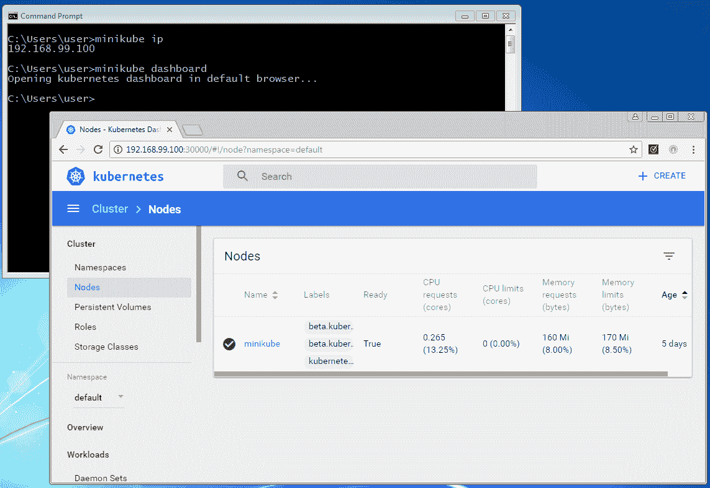
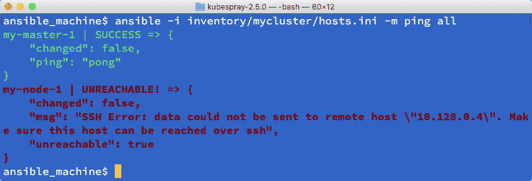

# 构建你自己的 Kubernetes 集群

在本章中，我们将介绍以下方案：

+   探索 Kubernetes 架构

+   通过 minikube 在 macOS 上设置 Kubernetes 集群

+   通过 minikube 在 Windows 上设置 Kubernetes 集群

+   通过 kubeadm 在 Linux 上设置 Kubernetes 集群

+   通过 Ansible (kubespray) 在 Linux 上设置 Kubernetes 集群

+   在 Kubernetes 中运行你的第一个容器

# 介绍

欢迎踏上 Kubernetes 之旅！在这一部分中，你将学习如何构建自己的 Kubernetes 集群。在理解每个组件并将它们连接在一起的过程中，你将学习如何在 Kubernetes 上运行第一个容器。拥有一个 Kubernetes 集群将帮助你在接下来的章节中继续学习。

# 探索 Kubernetes 架构

Kubernetes 是一个开源的容器管理工具。它是基于 Go 语言的 ([`golang.org`](https://golang.org))，轻量级且可移植的应用程序。你可以在基于 Linux 的操作系统上设置 Kubernetes 集群，以部署、管理和扩展多个主机上的 Docker 容器应用。

# 准备就绪

Kubernetes 由以下组件组成：

+   Kubernetes 主节点

+   Kubernetes 节点

+   etcd

+   Kubernetes 网络

这些组件通过网络连接，如下图所示：


上述图示可以总结如下：

+   **Kubernetes 主节点**：它通过 HTTP 或 HTTPS 连接到 etcd 以存储数据

+   **Kubernetes 节点**：它通过 HTTP 或 HTTPS 连接到 Kubernetes 主节点以获取命令并报告状态

+   **Kubernetes 网络**：它通过 L2、L3 或覆盖网络连接其容器应用程序

# 如何做到这一点...

在本节中，我们将解释如何使用 Kubernetes 主节点和节点来实现 Kubernetes 系统的主要功能。

# Kubernetes 主节点

Kubernetes 主节点是 Kubernetes 集群的主要组件。它提供多个功能，具体如下：

+   授权与认证

+   RESTful API 入口点

+   将容器部署调度到 Kubernetes 节点

+   扩展和复制控制器

+   读取配置以设置集群

下图展示了主节点守护进程如何协同工作，以实现上述功能：


有多个守护进程组成 Kubernetes 主节点的功能，如 `kube-apiserver`、`kube-scheduler` 和 `kube-controller-manager`。Hypercube，作为封装二进制文件，可以启动所有这些守护进程。

此外，Kubernetes 命令行界面 kubectl 可以控制 Kubernetes 主节点的功能。

# API 服务器（kube-apiserver）

API 服务器提供基于 HTTP 或 HTTPS 的 RESTful API，它是 Kubernetes 各组件之间的枢纽，如 kubectl、调度器、复制控制器、etcd 数据存储、在 Kubernetes 节点上运行的 kubelet 和 kube-proxy 等。

# 调度器（kube-scheduler）

调度器帮助选择容器运行的节点。它是一个简单的算法，定义了调度和将容器绑定到节点的优先级。例如：

+   CPU

+   内存

+   有多少个容器在运行？

# 控制器管理器（kube-controller-manager）

控制器管理器执行集群操作。例如：

+   管理 Kubernetes 节点

+   创建和更新 Kubernetes 内部信息

+   尝试将当前状态更改为目标状态

# 命令行接口（kubectl）

安装 Kubernetes 主节点后，你可以使用 Kubernetes 命令行接口`kubectl`来控制 Kubernetes 集群。例如，`kubectl get cs`返回各个组件的状态。此外，`kubectl get nodes`返回 Kubernetes 节点的列表：

```
//see the Component Statuses
# kubectl get cs
NAME                 STATUS    MESSAGE              ERROR
controller-manager   Healthy   ok                   nil
scheduler            Healthy   ok                   nil
etcd-0               Healthy   {"health": "true"}   nil

//see the nodes
# kubectl get nodes
NAME          LABELS                           STATUS    AGE
kub-node1   kubernetes.io/hostname=kub-node1   Ready     26d
kub-node2   kubernetes.io/hostname=kub-node2   Ready     26d
```

# Kubernetes 节点

Kubernetes 节点是 Kubernetes 集群中的从节点。它由 Kubernetes 主节点控制，用于通过 Docker（[`docker.com`](http://docker.com)）或 rkt（[`coreos.com/rkt/docs/latest/`](http://coreos.com/rkt/docs/latest/)）运行容器应用程序。在本书中，我们将使用 Docker 容器运行时作为默认引擎。

节点还是从节点？

“从节点”一词在计算机行业中用于表示集群工作节点；然而，它也与歧视相关。Kubernetes 项目在早期版本中使用 minion，在当前版本中使用节点（node）。

以下图展示了节点中守护进程的角色和任务：


节点也有两个守护进程，分别是 kubelet 和 kube-proxy，以支持其功能。

# kubelet

kubelet 是 Kubernetes 节点上的主要进程，它与 Kubernetes 主节点进行通信，处理以下操作：

+   定期访问 API 控制器进行检查并报告

+   执行容器操作

+   运行 HTTP 服务器以提供简单的 API

# 代理（kube-proxy）

代理处理每个容器的网络代理和负载均衡器。它通过更改 Linux iptables 规则（nat 表）来控制跨容器的 TCP 和 UDP 数据包。

启动 kube-proxy 守护进程后，它配置 iptables 规则；你可以使用`iptables -t nat -L`或`iptables -t nat -S`来检查 nat 表规则，如下所示：

```
//the result will be vary and dynamically changed by kube-proxy
# sudo iptables -t nat -S
-P PREROUTING ACCEPT
-P INPUT ACCEPT
-P OUTPUT ACCEPT
-P POSTROUTING ACCEPT
-N DOCKER
-N FLANNEL
-N KUBE-NODEPORT-CONTAINER
-N KUBE-NODEPORT-HOST
-N KUBE-PORTALS-CONTAINER
-N KUBE-PORTALS-HOST
-A PREROUTING -m comment --comment "handle ClusterIPs; NOTE: this must be before the NodePort rules" -j KUBE-PORTALS-CONTAINER
-A PREROUTING -m addrtype --dst-type LOCAL -m comment --comment "handle service NodePorts; NOTE: this must be the last rule in the chain" -j KUBE-NODEPORT-CONTAINER
-A PREROUTING -m addrtype --dst-type LOCAL -j DOCKER
-A OUTPUT -m comment --comment "handle ClusterIPs; NOTE: this must be before the NodePort rules" -j KUBE-PORTALS-HOST
-A OUTPUT -m addrtype --dst-type LOCAL -m comment --comment "handle service NodePorts; NOTE: this must be the last rule in the chain" -j KUBE-NODEPORT-HOST
-A OUTPUT ! -d 127.0.0.0/8 -m addrtype --dst-type LOCAL -j DOCKER
-A POSTROUTING -s 192.168.90.0/24 ! -o docker0 -j MASQUERADE
-A POSTROUTING -s 192.168.0.0/16 -j FLANNEL
-A FLANNEL -d 192.168.0.0/16 -j ACCEPT
-A FLANNEL ! -d 224.0.0.0/4 -j MASQUERADE
```

# 它是如何工作的……

还有两个组件补充 Kubernetes 节点的功能，数据存储 etcd 和容器间网络。你可以在以下小节中了解它们如何支持 Kubernetes 系统。

# etcd

etcd ([`coreos.com/etcd/`](https://coreos.com/etcd/))是一个分布式键值数据存储。可以通过 RESTful API 进行访问，从而在网络上执行 CRUD 操作。Kubernetes 使用 etcd 作为主要的数据存储。

你可以使用`curl`命令在 etcd（`/registry`）中查看 Kubernetes 的配置和状态，如下所示：

```
//example: etcd server is localhost and default port is 4001
# curl -L http://127.0.0.1:4001/v2/keys/registry
{"action":"get","node":{"key":"/registry","dir":true,"nodes":[{"key":"/registry/namespaces","dir":true,"modifiedIndex":6,"createdIndex":6},{"key":"/registry/pods","dir":true,"modifiedIndex":187,"createdIndex":187},{"key":"/registry/clusterroles","dir":true,"modifiedIndex":196,"createdIndex":196},{"key":"/registry/replicasets","dir":true,"modifiedIndex":178,"createdIndex":178},{"key":"/registry/limitranges","dir":true,"modifiedIndex":202,"createdIndex":202},{"key":"/registry/storageclasses","dir":true,"modifiedIndex":215,"createdIndex":215},{"key":"/registry/apiregistration.k8s.io","dir":true,"modifiedIndex":7,"createdIndex":7},{"key":"/registry/serviceaccounts","dir":true,"modifiedIndex":70,"createdIndex":70},{"key":"/registry/secrets","dir":true,"modifiedIndex":71,"createdIndex":71},{"key":"/registry/deployments","dir":true,"modifiedIndex":177,"createdIndex":177},{"key":"/registry/services","dir":true,"modifiedIndex":13,"createdIndex":13},{"key":"/registry/configmaps","dir":true,"modifiedIndex":52,"createdIndex":52},{"key":"/registry/ranges","dir":true,"modifiedIndex":4,"createdIndex":4},{"key":"/registry/minions","dir":true,"modifiedIndex":58,"createdIndex":58},{"key":"/registry/clusterrolebindings","dir":true,"modifiedIndex":171,"createdIndex":171}],"modifiedIndex":4,"createdIndex":4}}
```

# Kubernetes 网络

容器之间的网络通信是最困难的部分。因为 Kubernetes 管理多个运行着多个容器的节点（主机），这些不同节点上的容器可能需要彼此通信。

如果容器的网络通信仅限于单个节点内，你可以使用 Docker 网络或 Docker Compose 来发现对等体。然而，随着节点的增加，Kubernetes 使用叠加网络或**容器网络接口**（**CNI**）来实现多个容器之间的通信。

# 另请参见

本食谱描述了 Kubernetes 的基本架构和方法论以及相关组件。理解 Kubernetes 并不容易，但逐步学习如何设置、配置和管理 Kubernetes 真的很有趣。

# 使用 minikube 在 macOS 上设置 Kubernetes 集群

Kubernetes 由多个开源组件组成。这些组件由不同的方开发，使得很难找到并下载所有相关的包，并从零开始安装、配置并使其工作。

幸运的是，已经开发出一些不同的解决方案和工具，可以轻松设置 Kubernetes 集群。因此，强烈建议你使用这些工具来设置你环境中的 Kubernetes。

以下工具按不同类型的解决方案进行分类，帮助你构建自己的 Kubernetes：

+   包括以下自我管理解决方案：

    +   minikube

    +   kubeadm

    +   kubespray

    +   kops

+   包括以下企业解决方案：

    +   OpenShift ([`www.openshift.com`](https://www.openshift.com))

    +   Tectonic ([`coreos.com/tectonic/`](https://coreos.com/tectonic/))

+   包括以下云托管解决方案：

    +   Google Kubernetes 引擎 ([`cloud.google.com/kubernetes-engine/`](https://cloud.google.com/kubernetes-engine/))

    +   亚马逊弹性容器服务 Kubernetes（Amazon EKS, [`aws.amazon.com/eks/`](https://aws.amazon.com/eks/))

    +   Azure 容器服务（AKS, [`azure.microsoft.com/en-us/services/container-service/`](https://azure.microsoft.com/en-us/services/container-service/))

如果我们只是想快速构建一个开发环境或进行概念验证，自我管理解决方案是合适的。

通过使用 minikube ([`github.com/kubernetes/minikube`](https://github.com/kubernetes/minikube)) 和 kubeadm ([`kubernetes.io/docs/admin/kubeadm/`](https://kubernetes.io/docs/admin/kubeadm/))，我们可以轻松地在本地机器上构建所需的环境；然而，如果我们想要构建生产环境，这就不太实际了。

通过使用 kubespray ([`github.com/kubernetes-incubator/kubespray`](https://github.com/kubernetes-incubator/kubespray)) 和 kops ([`github.com/kubernetes/kops`](https://github.com/kubernetes/kops))，我们也可以快速从零开始构建生产级环境。

如果我们想创建一个生产环境，企业解决方案或云托管解决方案是最简单的起点。特别是**Google Kubernetes Engine**（**GKE**），这是 Google 多年来一直使用的解决方案，提供了全面的管理，意味着用户不需要过多关注安装和设置。此外，Amazon EKS 是 AWS 在 2017 年 re:Invent 上推出的一项新服务，由 AWS 上的 Kubernetes 服务进行管理。

Kubernetes 还可以通过自定义解决方案在不同的云平台和本地虚拟机上运行。为了入门，本章将展示如何在 macOS 台式机上使用 minikube 构建 Kubernetes。

# 准备工作

minikube 在 macOS 上的 Linux 虚拟机上运行 Kubernetes。它依赖于虚拟化程序（虚拟化技术），如 VirtualBox ([`www.virtualbox.org`](https://www.virtualbox.org))、VMWare Fusion ([`www.vmware.com/products/fusion.html`](https://www.vmware.com/products/fusion.html)) 或 hyperkit ([`github.com/moby/hyperkit`](https://github.com/moby/hyperkit))。此外，我们还需要 Kubernetes 的**命令行界面**（**CLI**）`kubectl`，用于通过虚拟化程序连接并控制 Kubernetes。

使用 minikube，你可以在 macOS 上运行整个 Kubernetes 堆栈，包括 Kubernetes 主节点、节点和 CLI。建议 macOS 有足够的内存来运行 Kubernetes。默认情况下，minikube 使用 VirtualBox 作为虚拟化程序。

然而，在本章中，我们将演示如何使用 hyperkit，它是最轻量级的解决方案。由于 Linux 虚拟机消耗 2 GB 的内存，建议至少使用 4 GB 内存。请注意，hyperkit 是建立在 macOS 上的虚拟化框架之上的 ([`developer.apple.com/documentation/hypervisor`](https://developer.apple.com/documentation/hypervisor))，因此需要 macOS 10.10 Yosemite 或更高版本。

下图显示了 kubectl、虚拟化程序、minikube 和 macOS 之间的关系：


# 如何操作...

macOS 没有官方的包管理工具，如 Linux 上的 yum 和 apt-get，但 macOS 有一些有用的工具可供使用。`Homebrew` ([`brew.sh`](https://brew.sh)) 是最受欢迎的包管理工具，管理着许多开源工具，包括 minikube。

为了在 macOS 上安装 `Homebrew`，请执行以下步骤：

1.  打开终端，然后输入以下命令：

```
$ /usr/bin/ruby -e "$(curl -fsSL https://raw.githubusercontent.com/Homebrew/install/master/install)"
```

1.  安装完成后，你可以输入 `/usr/local/bin/brew help` 来查看可用的命令选项。

如果你刚在 macOS 上安装或升级了 Xcode，`Homebrew` 安装可能会停止。在这种情况下，请打开 Xcode 接受许可协议，或者事先输入 `sudo xcodebuild -license`。

1.  接下来，安装 minikube 的 `hyperkit driver`。截至撰写本文时（2018 年 2 月），HomeBrew 不支持 hyperkit，因此输入以下命令进行安装：

```
$ curl -LO https://storage.googleapis.com/minikube/releases/latest/docker-machine-driver-hyperkit \
&& chmod +x docker-machine-driver-hyperkit \
&& sudo mv docker-machine-driver-hyperkit /usr/local/bin/ \
&& sudo chown root:wheel /usr/local/bin/docker-machine-driver-hyperkit \
&& sudo chmod u+s /usr/local/bin/docker-machine-driver-hyperkit
```

1.  接下来，让我们安装 Kubernetes CLI。使用 Homebrew 执行以下命令在您的 macOS 上安装 `kubectl` 命令：

```
//install kubectl command by "kubernetes-cli" package
$ brew install kubernetes-cli
```

最后，您可以安装 minikube。它不是由 Homebrew 管理的；但是，Homebrew 有一个扩展工具 `homebrew-cask` ([`github.com/caskroom/homebrew-cask`](https://github.com/caskroom/homebrew-cask))，它支持 minikube。

1.  若要通过 `homebrew-cask` 安装 minikube，只需输入以下命令：

```
//add "cask" option
$ brew cask install minikube
```

1.  如果您从未在您的机器上安装过 **Docker for Mac**，也需要通过 `homebrew-cask` 来安装它。

```
//only if you don't have a Docker for Mac
$ brew cask install docker

//start Docker
$ open -a Docker.app
```

1.  现在一切就绪！以下命令将显示是否已在您的 macOS 上安装所需的软件包：

```
//check installed package by homebrew
$ brew list
kubernetes-cli

//check installed package by homebrew-cask
$ brew cask list
minikube
```

# 工作原理...

minikube 适合在 macOS 上设置 Kubernetes，使用以下命令，它会下载并启动一个 Kubernetes 虚拟机实例，然后配置 kubectl 配置文件（`~/.kube/config`）：

```
//use --vm-driver=hyperkit to specify to use hyperkit
$ /usr/local/bin/minikube start --vm-driver=hyperkit
Starting local Kubernetes v1.10.0 cluster...
Starting VM...
Downloading Minikube ISO
 150.53 MB / 150.53 MB [============================================] 100.00% 0s
Getting VM IP address...
Moving files into cluster...
Downloading kubeadm v1.10.0
Downloading kubelet v1.10.0
Finished Downloading kubelet v1.10.0
Finished Downloading kubeadm v1.10.0
Setting up certs...
Connecting to cluster...
Setting up kubeconfig...
Starting cluster components...
Kubectl is now configured to use the cluster.
Loading cached images from config file.

//check whether .kube/config is configured or not
$ cat ~/.kube/config 
apiVersion: v1
clusters:
- cluster:
 certificate-authority: /Users/saito/.minikube/ca.crt
 server: https://192.168.64.26:8443
 name: minikube
contexts:
- context:
 cluster: minikube
 user: minikube
 name: minikube
current-context: minikube
kind: Config
preferences: {}
users:
- name: minikube
 user:
 as-user-extra: {}
 client-certificate: /Users/saito/.minikube/client.crt
 client-key: /Users/saito/.minikube/client.key 
```

获取所有必要的软件包后，请执行以下步骤：

1.  等待几分钟，直到 Kubernetes 集群设置完成。

1.  使用 `kubectl version` 检查 Kubernetes 主版本，使用 `kubectl get cs` 查看组件状态。

1.  另外，使用 `kubectl get nodes` 命令检查 Kubernetes 节点是否已准备好：

```
//it shows kubectl (Client) is 1.10.1, and Kubernetes master (Server) is 1.10.0
$ /usr/local/bin/kubectl version --short
Client Version: v1.10.1
Server Version: v1.10.0

//get cs will shows Component Status
$ kubectl get cs
NAME                 STATUS    MESSAGE              ERROR
controller-manager   Healthy   ok 
scheduler            Healthy   ok 
etcd-0               Healthy   {"health": "true"} 

//Kubernetes node (minikube) is ready
$ /usr/local/bin/kubectl get nodes
NAME       STATUS    ROLES     AGE       VERSION
minikube   Ready     master    2m        v1.10.0
```

1.  现在，您可以开始在机器上使用 Kubernetes。以下部分描述了如何使用 `kubectl` 命令操作 Docker 容器。

1.  请注意，在某些情况下，您可能需要维护 Kubernetes 集群，例如启动/停止虚拟机或完全删除它。以下命令用于维护 minikube 环境：

| **命令** | **目的** |
| --- | --- |
| `minikube start --vm-driver=hyperkit` | 使用 hyperkit 驱动程序启动 Kubernetes 虚拟机 |
| `minikube stop` | 停止 Kubernetes 虚拟机 |
| `minikube delete` | 删除 Kubernetes 虚拟机镜像 |
| `minikube ssh` | SSH 连接到 Kubernetes 虚拟机 |
| `minikube ip` | 显示 Kubernetes 虚拟机（节点）IP 地址 |
| `minikube update-context` | 如果虚拟机 IP 地址发生更改，检查并更新 `~/.kube/config` |
| `minikube dashboard` | 打开浏览器连接到 Kubernetes UI |

例如，minikube 默认启动一个仪表盘（Kubernetes UI）。如果您想访问仪表盘，输入 `minikube dashboard`，然后它会打开您的默认浏览器并连接到 Kubernetes UI，如下图所示：


# 另见

本教程描述了如何使用 minikube 在 macOS 上设置 Kubernetes 集群。这是开始使用 Kubernetes 的最简单方法。我们还学习了如何使用 kubectl，这是 Kubernetes 的命令行接口工具，它是控制 Kubernetes 集群的入口！

# 在 Windows 上使用 minikube 设置 Kubernetes 集群

本质上，Docker 和 Kubernetes 是基于 Linux 操作系统的。虽然使用 Windows 操作系统来探索 Kubernetes 并非理想选择，但许多人仍然将 Windows 操作系统作为桌面或笔记本电脑的操作系统。幸运的是，通过虚拟化技术，有很多方法可以在 Windows 上运行 Linux 操作系统，这使得在 Windows 机器上运行 Kubernetes 集群成为可能。然后，我们可以在本地 Windows 机器上构建开发环境或进行概念验证。

你可以通过在 Windows 上使用任何虚拟化软件从头开始设置 Kubernetes，来运行 Linux 虚拟机，但使用 minikube ([`github.com/kubernetes/minikube`](https://github.com/kubernetes/minikube)) 是在 Windows 上构建 Kubernetes 集群的最快方式。请注意，这个方法并不适用于生产环境，因为它会在 Windows 上设置一个运行 Kubernetes 的 Linux 虚拟机。

# 准备工作

在 Windows 上设置 minikube 需要一个虚拟化软件，可能是 VirtualBox ([`www.virtualbox.org`](https://www.virtualbox.org)) 或 Hyper-V，因为，minikube 使用 Windows 上的 Linux 虚拟机。这意味着你不能使用 Windows 虚拟机（例如，在 macOS 上通过 Parallels 运行 Windows 虚拟机）。

然而，`kubectl`，Kubernetes 的命令行工具，支持一个可以通过网络连接到 Kubernetes 的 Windows 本地二进制文件。因此，你可以在 Windows 机器上设置一个便携式 Kubernetes 套件。

下图展示了 kubectl、虚拟化软件、minikube 和 Windows 之间的关系：


Windows 8 Pro 或更高版本需要 Hyper-V。虽然许多用户仍然使用 Windows 7，但我们在这个教程中将使用 VirtualBox 作为 minikube 的虚拟化软件。

# 如何操作...

首先，需要安装 Windows 版的 VirtualBox：

1.  访问 VirtualBox 网站 ([`www.virtualbox.org/wiki/Downloads`](https://www.virtualbox.org/wiki/Downloads)) 下载 Windows 安装程序。

1.  安装过程非常简单，所以我们只需选择默认选项并点击“下一步”：


1.  接下来，创建一个 `Kubernetes` 文件夹，用于存储 minikube 和 kubectl 可执行文件。我们将在 `C:` 盘上创建一个 `k8s` 文件夹，如下图所示：


1.  这个文件夹必须在命令搜索路径中，因此打开系统属性，然后转到“高级”选项卡。

1.  点击“环境变量...”按钮，然后选择“Path”，接着点击“编辑...”按钮，如下图所示：


1.  然后，添加 `c:\k8s`，如下所示：


1.  单击“确定”按钮后，注销并重新登录 Windows（或重启）以应用此更改。

1.  接下来，下载适用于 Windows 的 minikube。它是一个单独的二进制文件，使用任何 Web 浏览器下载[`github.com/kubernetes/minikube/releases/download/v0.26.1/minikube-windows-amd64`](https://github.com/kubernetes/minikube/releases/download/v0.26.1/minikube-windows-amd64)，然后将其复制到`c:\k8s`文件夹中，但请将文件名更改为`minikube.exe`。

1.  接下来，下载适用于 Windows 的 kubectl，它可以与 Kubernetes 通信。它也是像 minikube 一样的单一二进制文件。所以，下载[`storage.googleapis.com/kubernetes-release/release/v1.10.2/bin/windows/amd64/kubectl.exe`](https://storage.googleapis.com/kubernetes-release/release/v1.10.2/bin/windows/amd64/kubectl.exe)，然后也将其复制到`c:\k8s`文件夹中。

1.  最终，你将在`c:\k8s`文件夹中看到两个二进制文件，如下图所示：


如果你正在运行防病毒软件，它可能会阻止你运行`kubectl.exe`和`minikube.exe`。如果是这种情况，请更新防病毒软件设置，允许运行这两个二进制文件。

# 它是如何工作的...

让我们开始吧！

1.  打开命令提示符并输入`minikube start`，如以下截图所示：


1.  minikube 下载 Linux 虚拟机镜像并在其上设置 Kubernetes；现在如果你打开 VirtualBox，你会看到 minikube 虚拟机已经注册，如下图所示：


1.  等待几分钟以完成 Kubernetes 集群的设置。

1.  如下图所示，输入`kubectl version`以检查 Kubernetes 主版本。

1.  使用`kubectl get nodes`命令检查 Kubernetes 节点是否已准备好：


1.  现在你可以开始在你的机器上使用 Kubernetes 了！再次强调，Kubernetes 运行在 Linux 虚拟机上，如下图所示。

1.  使用`minikube ssh`可以访问运行 Kubernetes 的 Linux 虚拟机：


因此，任何基于 Linux 的 Docker 镜像都能够在你的 Windows 机器上运行。

1.  输入`minikube ip`来验证 Linux 虚拟机使用的 IP 地址，同时输入`minikube dashboard`，以打开默认的 Web 浏览器并导航到 Kubernetes UI，如下图所示：



1.  如果你不再需要使用 Kubernetes，输入`minikube stop`，或者打开 VirtualBox 停止 Linux 虚拟机并释放资源，如下图所示：


# 另见

本教程描述了如何使用 minikube 在 Windows 操作系统上设置 Kubernetes 集群。这是开始使用 Kubernetes 的最简单方式。它还介绍了 kubectl，这是 Kubernetes 的命令行工具，是用来控制 Kubernetes 的入口工具。

# 通过 kubeadm 在 Linux 上设置 Kubernetes 集群

在本教程中，我们将展示如何在 Linux 服务器上使用 kubeadm 创建一个 Kubernetes 集群 ([`github.com/kubernetes/kubeadm`](https://github.com/kubernetes/kubeadm))。Kubeadm 是一个命令行工具，用于简化创建和管理 Kubernetes 集群的过程。Kubeadm 利用 Docker 的快速部署功能，将 Kubernetes 主节点和 etcd 服务器的系统服务作为容器运行。当通过 `kubeadm` 命令触发时，容器服务将直接联系 Kubernetes 节点上的 kubelet；kubeadm 还会检查每个组件是否正常。通过 kubeadm 的设置步骤，您可以避免在从头开始构建时需要执行一堆安装和配置命令。

# 准备就绪

我们将提供两种类型操作系统的说明：

+   Ubuntu Xenial 16.04 (LTS)

+   CentOS 7.4

在继续之前，请确保操作系统版本匹配。此外，软件依赖和网络设置也应在继续到下一步之前进行验证。检查以下项目以准备环境：

+   **每个节点都有唯一的 MAC 地址和产品 UUID**：某些插件使用 MAC 地址或产品 UUID 作为唯一机器 ID 来识别节点（例如，`kube-dns`）。如果它们在集群中重复，kubeadm 在启动插件时可能无法正常工作：

```
// check MAC address of your NIC $ ifconfig -a
// check the product UUID on your host
$ sudo cat /sys/class/dmi/id/product_uuid
```

+   **每个节点都有不同的主机名**：如果主机名重复，Kubernetes 系统可能会将来自多个节点的日志或状态收集到同一个节点。

+   **已安装 Docker**：如前所述，Kubernetes 主节点将作为容器运行其守护进程，并且集群中的每个节点都应安装 Docker。有关如何安装 Docker，可以按照官方网站上的步骤进行操作：（Ubuntu：[`docs.docker.com/engine/installation/linux/docker-ce/ubuntu/`](https://docs.docker.com/engine/installation/linux/docker-ce/ubuntu/)，CentOS：[`docs.docker.com/engine/installation/linux/docker-ce/centos/`](https://docs.docker.com/engine/installation/linux/docker-ce/centos/)）。在我们的机器上已经安装了 Docker CE 17.06；然而，只有 Docker 版本 1.11.2 至 1.13.1，以及 17.03.x 与 Kubernetes 版本 1.10 验证过。

+   **网络端口可用**：Kubernetes 系统服务需要网络端口进行通信。根据节点的角色，下面表格中的端口应当被占用：

| **节点角色** | **端口** | **系统服务** |
| --- | --- | --- |
| 主节点 | `6443` | Kubernetes API 服务器 |
| `10248/10250/10255` | kubelet 本地 healthz 端点/Kubelet API/Heapster（只读） |
| `10251` | kube-scheduler |
| `10252` | kube-controller-manager |
| `10249/10256` | kube-proxy |
| `2379/2380` | etcd 客户端/etcd 服务器通信 |
| 节点 | `10250/10255` | Kubelet API/Heapster（只读） |
| `30000~32767` | 用于将容器服务暴露给外部世界的端口范围 |

+   Linux 命令`netstat`可以帮助检查端口是否在使用中：

```
// list every listening port
$ sudo netstat -tulpn | grep LISTEN
```

+   安装网络工具包。`ethtool` 和 `ebtables` 是 kubeadm 所需的两个工具。它们可以通过 `apt-get` 或 `yum` 包管理工具下载并安装。

# 如何操作...

本菜谱将分别介绍两种 Linux 操作系统（Ubuntu 和 CentOS）的安装过程，因为它们的设置方式不同。

# 包安装

首先获取 Kubernetes 包！需要在包管理系统的源列表中设置下载仓库。然后，我们可以通过命令行轻松安装它们。

# Ubuntu

在 Ubuntu 中安装 Kubernetes 包，请执行以下步骤：

1.  一些仓库的 URL 使用 HTTPS。必须安装 `apt-transport-https` 包才能访问 HTTPS 端点：

```
$ sudo apt-get update && sudo apt-get install -y apt-transport-https
```

1.  下载用于访问 Google Cloud 上包的公钥，并按以下方式添加：

```
$ curl -s https://packages.cloud.google.com/apt/doc/apt-key.gpg | sudo apt-key add -
OK
```

1.  接下来，添加一个新的源列表用于 Kubernetes 包：

```
$ sudo bash -c 'echo "deb http://apt.kubernetes.io/ kubernetes-xenial main" > /etc/apt/sources.list.d/kubernetes.list'
```

1.  最后，最好安装 Kubernetes 包：

```
// on Kubernetes master
$ sudo apt-get update && sudo apt-get install -y kubelet kubeadm kubectl
// on Kubernetes node
$ sudo apt-get update && sudo apt-get install -y kubelet
```

# CentOS

在 CentOS 中安装 Kubernetes 包，请执行以下步骤：

1.  与 Ubuntu 一样，需要添加新的仓库信息：

```
$ sudo vim /etc/yum.repos.d/kubernetes.repo
[kubernetes]
name=Kubernetes
baseurl=https://packages.cloud.google.com/yum/repos/kubernetes-el7-x86_64
enabled=1
gpgcheck=1
repo_gpgcheck=1
gpgkey=https://packages.cloud.google.com/yum/doc/yum-key.gpg
 https://packages.cloud.google.com/yum/doc/rpm-package-key.gpg
```

1.  现在，我们已经准备好通过 `yum` 命令从 Kubernetes 源库拉取包：

```
// on Kubernetes master
$ sudo yum install -y kubelet kubeadm kubectl
// on Kubernetes node
$ sudo yum install -y kubelet
```

1.  无论是什么操作系统，检查你获取的包的版本！

```
// take it easy! server connection failed since there is not server running
$ kubectl version
Client Version: version.Info{Major:"1", Minor:"10", GitVersion:"v1.10.2", GitCommit:"81753b10df112992bf51bbc2c2f85208aad78335", GitTreeState:"clean", BuildDate:"2018-04-27T09:22:21Z", GoVersion:"go1.9.3", Compiler:"gc", Platform:"linux/amd64"}
The connection to the server 192.168.122.101:6443 was refused - did you specify the right host or port?
```

# 系统配置前提条件

在通过 kubeadm 启动整个系统之前，请确保 Docker 已在你的机器上运行。除此之外，为了避免在执行 kubeadm 时发生严重错误，我们将展示系统和 kubelet 上必要的服务配置。作为主节点，请在 Kubernetes 节点上设置以下配置，以确保 kubelet 能与 kubeadm 正常工作。

# CentOS 系统设置

在 CentOS 中还有其他附加设置，以确保 Kubernetes 正常工作。请注意，即使我们没有使用 kubeadm 来管理 Kubernetes 集群，以下设置仍应在运行 kubelet 时考虑：

1.  禁用 SELinux，因为 kubelet 完全不支持 SELinux：

```
// check the state of SELinux, if it has already been disabled, bypass below commands
$ sestatus
```

我们可以通过以下命令 `disable SELinux`，或者通过 `修改配置文件` 来禁用 SELinux：

```
// disable SELinux through command
$  sudo setenforce 0
// or modify the configuration file $ sudo sed –I 's/ SELINUX=enforcing/SELINUX=disabled/g' /etc/sysconfig/selinux

```

然后我们需要 `reboot` 机器：

```
// reboot is required
$ sudo reboot
```

1.  启用 iptables 的使用。为了防止发生一些路由错误，请添加运行时参数：

```
// enable the parameters by setting them to 1
$ sudo bash -c 'echo "net.bridge.bridge-nf-call-ip6tables = 1" > /etc/sysctl.d/k8s.conf'
$ sudo bash -c 'echo "net.bridge.bridge-nf-call-iptables = 1" >> /etc/sysctl.d/k8s.conf'
// reload the configuration
$ sudo sysctl --system
```

# 启动服务

现在我们可以启动服务了。首先启用并启动 Kubernetes 主节点上的 kubelet：

```
$ sudo systemctl enable kubelet && sudo systemctl start kubelet
```

在检查 kubelet 状态时，你可能会担心看到状态显示为激活（`auto-restart`）；并且你可能会更为沮丧，看到通过 `journalctl` 命令查看的详细日志，如下所示：

`error: unable to load client CA file /etc/kubernetes/pki/ca.crt: open /etc/kubernetes/pki/ca.crt: no such file or directory`

不用担心，kubeadm 会负责创建证书颁发机构文件。该文件在服务配置文件 `/etc/systemd/system/kubelet.service.d/10-kubeadm.conf` 中通过参数 KUBELET_AUTHZ_ARGS 来定义。如果没有这个文件，kubelet 服务将无法正常工作，因此可以尝试自行重启该守护进程。

继续通过 kubeadm 启动所有主节点守护进程。值得注意的是，使用 kubeadm 需要 root 权限来获得服务级别的特权。对于任何 sudo 用户，每个 kubeadm 命令都需要在 `sudo` 命令后运行：

```
$ sudo kubeadm init
```

在执行 `kubeadm init` 命令时，如果出现预检错误？使用以下命令来禁用交换分区，如描述所示。

`$ sudo kubeadm init --ignore-preflight-errors=Swap`

你将会在屏幕上看到 `Your Kubernetes master has initialized successfully!` 这句话。恭喜！你几乎完成了！只需按照问候信息下方的用户环境设置说明继续操作：

```
$ mkdir -p $HOME/.kube
$ sudo cp -i /etc/kubernetes/admin.conf $HOME/.kube/config
$ sudo chown $(id -u):$(id -g) $HOME/.kube/config
```

上述命令确保每个 Kubernetes 指令都由你的账户执行，并具有正确的凭据，并连接到正确的服务器门户：

```
// Your kubectl command works great now
$ kubectl version
Client Version: version.Info{Major:"1", Minor:"10", GitVersion:"v1.10.2", GitCommit:"81753b10df112992bf51bbc2c2f85208aad78335", GitTreeState:"clean", BuildDate:"2018-04-27T09:22:21Z", GoVersion:"go1.9.3", Compiler:"gc", Platform:"linux/amd64"}
Server Version: version.Info{Major:"1", Minor:"10", GitVersion:"v1.10.2", GitCommit:"81753b10df112992bf51bbc2c2f85208aad78335", GitTreeState:"clean", BuildDate:"2018-04-27T09:10:24Z", GoVersion:"go1.9.3", Compiler:"gc", Platform:"linux/amd64"}
```

更重要的是，kubelet 现在进入了健康状态：

```
// check the status of kubelet
$ sudo systemctl status kubelet
...
Active: active (running) Mon 2018-04-30 18:46:58 EDT; 2min 43s ago
...
```

# 容器的网络配置

在集群的主节点准备好处理任务并且服务正在运行之后，为了使容器通过网络互相访问，我们需要为容器间通信设置网络。在使用 kubeadm 构建 Kubernetes 集群时，这一步尤为重要，因为主进程都是以容器形式运行的。kubeadm 支持 CNI（[`github.com/containernetworking/cni`](https://github.com/containernetworking/cni)）。我们将通过 Kubernetes 网络附加组件来连接 CNI。

有许多第三方 CNI 解决方案提供安全可靠的容器网络环境。Calico（[`www.projectcalico.org`](https://www.projectcalico.org)）是一个提供稳定容器网络的 CNI。Calico 轻量简洁，但仍然很好地遵循 CNI 标准并与 Kubernetes 集成：

```
$ kubectl apply -f https://docs.projectcalico.org/v2.6/getting-started/kubernetes/installation/hosted/kubeadm/1.6/calico.yaml
```

在这里，无论你的主机操作系统是什么，`kubectl` 命令都可以执行任何子命令来利用资源和管理系统。我们使用 `kubectl` 将 Calico 的配置应用到我们的新 Kubernetes 集群中。

更高级的网络管理和 Kubernetes 附加组件将会在第七章中讨论，*在 GCP 上构建 Kubernetes*。

# 获取节点参与

让我们登录到你的 Kubernetes 节点，加入由 kubeadm 控制的群组：

1.  首先，启用并启动服务 `kubelet`。每台 Kubernetes 机器上都应该运行 `kubelet`：

```
$ sudo systemctl enable kubelet && sudo systemctl start kubelet
```

1.  之后，使用 `kubeadm` 加入命令，输入标志 token 和主节点的 IP 地址，通知主节点这是一个安全且授权的节点。你可以通过 `kubeadm` 命令在主节点上获取 token：

```
// on master node, list the token you have in the cluster
$ sudo kubeadm token list
TOKEN                     TTL       EXPIRES                     USAGES                   DESCRIPTION                                                EXTRA GROUPS
da3a90.9a119695a933a867   6h       2018-05-01T18:47:10-04:00   authentication,signing   The default bootstrap token generated by 'kubeadm init'.   system:bootstrappers:kubeadm:default-node-token
```

1.  在前面的输出中，如果 `kubeadm init` 成功，默认令牌将被生成。复制令牌并粘贴到节点上，然后组成以下命令：

```
// The master IP is 192.168.122.101, token is da3a90.9a119695a933a867, 6443 is the port of api server.
$ sudo kubeadm join --token da3a90.9a119695a933a867 192.168.122.101:6443 --discovery-token-unsafe-skip-ca-verification
```

如果你调用 `kubeadm token list` 来列出令牌，却发现它们都过期了怎么办？你可以通过以下命令手动创建一个新的令牌：`kubeadm token create`。

1.  请确保主节点的防火墙没有阻止任何到 `6443` 端口的流量，该端口用于 API 服务器通信。一旦你看到屏幕上显示 `Successfully established connection`，就可以检查主节点是否已经接收到新成员。

```
// fire kubectl subcommand on master
$ kubectl get nodes
NAME       STATUS    ROLES     AGE       VERSION
ubuntu01   Ready     master    11h       v1.10.2
ubuntu02   Ready     <none>    26s       v1.10.2
```

做得好！无论你的操作系统是 Ubuntu 还是 CentOS，kubeadm 都已安装并且 kubelet 正在运行。你可以轻松地按照前面的步骤来构建你的 Kubernetes 集群。

你可能会想了解在加入集群时使用的标志 `discovery-token-unsafe-skip-ca-verification`。还记得 kubelet 日志中提到找不到证书文件吗？就是因为这样，因为我们的 Kubernetes 节点是全新的，之前从未与主节点连接过，所以没有可供验证的证书文件。但现在，因为节点已经与主节点完成了握手，文件存在了。我们可以这样加入（在某些需要重新加入同一集群的情况下）：

`kubeadm join --token $TOKEN $MASTER_IPADDR:6443 --discovery-token-ca-cert-hash sha256:$HASH`

哈希值可以通过 `openssl` 命令获得：

```
// rejoining the same cluster
$ HASH=$(openssl x509 -pubkey -in /etc/kubernetes/pki/ca.crt | openssl rsa -pubin -outform der 2>/dev/null | openssl dgst -sha256 -hex | sed 's/^.* //')
$ sudo kubeadm join --token da3a90.9a119695a933a867 192.168.122.101:6443 --discovery-token-ca-cert-hash sha256:$HASH
```

# 它是如何工作的……

当 kubeadm init 设置主节点时，共有六个阶段：

1.  **为服务生成证书文件和密钥**：证书文件和密钥用于跨节点通信中的安全管理。它们位于 `/etc/kubernetes/pki` 目录下。以 kubelet 为例，如果没有通过身份验证，它无法访问 Kubernetes API 服务器。

1.  **编写 kubeconfig 文件**：`kubeconfig` 文件定义了 kubectl 操作的权限、身份验证和配置。在这种情况下，Kubernetes 控制器管理器和调度器有相关的 `kubeconfig` 文件，以处理任何 API 请求。

1.  **创建服务守护进程 YAML 文件**：在 kubeadm 控制下的服务守护进程就像在主节点上运行的计算组件一样。与设置磁盘上的部署配置类似，kubelet 会确保每个守护进程保持活动状态。

1.  **等待 kubelet 存活，运行作为 Pod 的守护进程**：当 kubelet 存活时，它会启动 `/etc/kubernetes/manifests` 目录下文件中描述的服务 Pod。此外，kubelet 确保这些 Pod 始终保持活动状态，如果 Pod 崩溃，它会自动重启。

1.  **为集群设置后配置**：一些集群配置仍然需要设置，例如配置 **基于角色的访问控制** (**RBAC**) 规则、创建命名空间和标记资源。

1.  **应用附加组件**：DNS 和代理服务可以与 kubeadm 系统一起添加。

当用户输入 kubeadm 并加入 Kubernetes 节点时，kubeadm 将像主节点一样完成前两个阶段。

如果你曾经面对过早期版本 Kubernetes 的复杂安装过程，那么使用 kubeadm 安装 Kubernetes 集群无疑是一种解脱。kubeadm 减少了配置每个守护进程并逐一启动它们的开销。用户仍然可以通过修改熟悉的文件`10-kubeadm.conf`以及`/etc/kubernetes/manifests`下的 YAML 文件，来定制 kubelet 和主节点服务。kubeadm 不仅有助于建立集群，还增强了安全性和可用性，节省了你的时间。

# 另见

我们讨论了如何构建 Kubernetes 集群。如果你准备好在集群上运行你的第一个应用程序，请查看本章的最后一个食谱并运行容器！如果需要更高级的集群管理，你还可以查看本书的第八章，*高级集群管理*：

+   *kubeconfig 中的高级设置*，详见第八章，*高级集群管理*

# 通过 Ansible（kubespray）在 Linux 上设置 Kubernetes 集群

如果你熟悉配置管理工具，如 Puppet、Chef 和 Ansible，kubespray（[`github.com/kubernetes-incubator/kubespray`](https://github.com/kubernetes-incubator/kubespray)）是从零开始设置 Kubernetes 集群的最佳选择。它提供了支持大多数 Linux 发行版和公共云（如 AWS 和 GCP）的 Ansible 剧本。

Ansible（[`www.ansible.com`](https://www.ansible.com)）是一个基于 Python 的 SSH 自动化工具，可以根据配置（称为剧本）将 Linux 配置为所需状态。本食谱描述了如何使用 kubespray 在 Linux 上设置 Kubernetes。

# 准备工作

截至 2018 年 5 月，kubespray 的最新版本为 2.5.0，支持以下操作系统来安装 Kubernetes：

+   RHEL/CentOS 7

+   Ubuntu 16.04 LTS

根据 kubespray 文档，它还支持 CoreOS 和 Debian 发行版。然而，这些发行版可能需要一些额外的步骤或遇到技术难题。本食谱使用 CentOS 7 和 Ubuntu 16.04 LTS。

此外，你还需要在你的机器上安装 Ansible。Ansible 支持 Python 2.6、2.7 和 3.5 或更高版本。由于大多数 macOS 和 Linux 发行版默认预装了 Python，因此 macOS 和 Linux 可能是安装 Ansible 的最佳选择。要检查你安装了哪个版本的 Python，请打开终端并输入以下命令：

```
//Use capital V
$ python -V
Python 2.7.5
```

总体来说，你至少需要三台机器，如下表所示：

| **主机类型** | **推荐操作系统/发行版** |
| --- | --- |
| Ansible | macOS 或任何具有 Python 2.6、2.7 或 3.5 的 Linux |
| Kubernetes 主节点 | RHEL/CentOS 7 或 Ubuntu 16.04 LTS |
| Kubernetes 节点 | RHEL/CentOS 7 或 Ubuntu 16.04 LTS |

由于存在一些相互通信的网络，因此你至少需要开放一个网络端口（例如，AWS 安全组或 GCP 防火墙规则），如：

+   **TCP/22（ssh）**：Ansible 到 Kubernetes 主节点/节点主机

+   **TCP/6443（Kubernetes API 服务器）**：Kubernetes 节点到主节点

+   **协议 4（IP 封装在 IP 中）**：Kubernetes 主节点和节点之间通过 Calico 通信

在协议 4（IP 封装在 IP 中）中，如果你使用 AWS，设置一个入口规则来指定 `aws ec2 authorize-security-group-ingress --group-id <your SG ID> --cidr <network CIDR> --protocol 4`。另外，如果你使用 GCP，设置防火墙规则，指定 `cloud compute firewall-rules create allow-calico --allow 4 --network <your network name> --source-ranges <network CIDR>`。

# 安装 pip

安装 Ansible 的最简单方法是使用 pip，Python 包管理器。某些较新的 Python 版本已经自带 `pip`（Python 2.7.9 或更高版本，Python 3.4 或更高版本）：

1.  要确认是否安装了 `pip`，可以使用类似 Python 命令的 `-V`：

```
//use capital V
$ pip -V
pip 9.0.1 from /Library/Python/2.7/site-packages (python 2.7)
```

1.  另一方面，如果你看到以下结果，你需要安装 `pip`：

```
//this result shows you don't have pip yet
$ pip -V
-bash: pip: command not found
```

1.  为了安装 pip，下载 `get-pip.py` 并使用以下命令安装：

```
//download pip install script
$ curl -LO https://bootstrap.pypa.io/get-pip.py

//run get-pip.py by privileged user (sudo)
$ sudo python get-pip.py 
Collecting pip
 Downloading pip-9.0.1-py2.py3-none-any.whl (1.3MB)
 100% |################################| 1.3MB 779kB/s 
Collecting wheel
 Downloading wheel-0.30.0-py2.py3-none-any.whl (49kB)
 100% |################################| 51kB 1.5MB/s 
Installing collected packages: pip, wheel
Successfully installed pip-9.0.1 wheel-0.30.0

//now you have pip command
$ pip -V
pip 9.0.1 from /usr/lib/python2.7/site-packages (python 2.7)
```

# 安装 Ansible

执行以下步骤来安装 Ansible：

1.  一旦你安装了 `pip`，你可以使用以下命令安装 Ansible：

```
//ran by privileged user (sudo)
$ sudo pip install ansible
```

`pip` 会扫描你的 Python 环境并安装 Ansible 所需的库，因此可能需要几分钟才能完成。

1.  一旦你成功通过 `pip` 安装了 Ansible，你可以通过以下命令进行验证，看到如下输出：

```
$ which ansible
/usr/bin/ansible

$ ansible --version
ansible 2.4.1.0
```

# 安装 python-netaddr

接下来，根据 kubespray 的文档（[`github.com/kubernetes-incubator/kubespray#requirements`](https://github.com/kubernetes-incubator/kubespray#requirements)），它需要 `python-netaddr` 包。这个包也可以通过 pip 安装，如下所示：

```
$ sudo pip install netaddr
```

# 设置 ssh 公钥认证

还有一件事，如前所述，Ansible 实际上是一个 ssh 自动化工具。如果你通过 ssh 登录主机，你必须拥有适当的凭证（用户名/密码或 ssh 公钥）才能访问目标机器。在这种情况下，目标机器指的是 Kubernetes 主节点和节点。

出于安全原因，特别是在公共云环境中，Kubernetes 只使用 ssh 公钥认证，而不使用 ID/密码认证。

为了遵循最佳实践，让我们将 ssh 公钥从你的 Ansible 机器复制到 Kubernetes 主节点/节点机器：

如果你已经设置了 Ansible 机器与 Kubernetes 候选机器之间的 ssh 公钥认证，你可以跳过此步骤。

1.  为了从你的 Ansible 机器创建 ssh 公私钥对，请输入以下命令：

```
//with –q means, quiet output
$ ssh-keygen -q
```

1.  它会要求你设置一个密码短语。你可以设置或跳过（留空），但你必须记住它。

1.  一旦成功创建了密钥对，你可以看到私钥为 `~/.ssh/id_rsa`，公钥为 `~/.ssh/id_rsa.pub`。你需要将公钥添加到目标机器的 `~/.ssh/authorized_keys` 文件中，如下图所示：


1.  你需要将你的公钥复制并粘贴到所有 Kubernetes 主节点和节点候选机器中。

1.  为了确保你的 ssh 公钥认证正常工作，只需从 Ansible 机器通过 ssh 登录目标主机，且不会要求输入登录密码，如下所示：

```
//use ssh-agent to remember your private key and passphrase (if you set)
ansible_machine$ ssh-agent bash
ansible_machine$ ssh-add
Enter passphrase for /home/saito/.ssh/id_rsa: Identity added: /home/saito/.ssh/id_rsa (/home/saito/.ssh/id_rsa)

//logon from ansible machine to k8s machine which you copied public key
ansible_machine$ ssh 10.128.0.2
Last login: Sun Nov  5 17:05:32 2017 from 133.172.188.35.bc.googleusercontent.com
k8s-master-1$
```

现在你已经准备好了！让我们从头开始使用 kubespray（Ansible）设置 Kubernetes。

# 如何操作...

kubespray 通过 GitHub 仓库提供（[`github.com/kubernetes-incubator/kubespray/tags`](https://github.com/kubernetes-incubator/kubespray/tags)），如下图所示：


因为 kubespray 是一个 Ansible playbook，而不是二进制文件，你可以直接将最新版本（截至 2018 年 5 月，版本 2.5.0 为最新）的`zip`或`tar.gz`文件下载到你的 Ansible 机器，并使用以下命令解压：

```
//download tar.gz format
ansible_machine$ curl -LO https://github.com/kubernetes-incubator/kubespray/archive/v2.5.0.tar.gz

//untar
ansible_machine$ tar zxvf v2.5.0.tar.gz 

//it unarchives under kubespray-2.5.0 directory
ansible_machine$ ls -F
get-pip.py  kubespray-2.5.0/  v2.5.0.tar.gz

//change to kubespray-2.5.0 directory
ansible_machine$ cd kubespray-2.5.0/
```

# 维护 Ansible 清单

为了执行 Ansible playbook，你需要维护自己的清单文件，其中包含目标机器的 IP 地址：

1.  在 inventory 目录下有一个示例清单文件，你可以使用以下命令复制它：

```
//copy sample to mycluster
ansible_machine$ cp -rfp inventory/sample inventory/mycluster 
//edit hosts.ini
ansible_machine$ vi inventory/mycluster/hosts.ini 
```

1.  在本手册中，我们使用的目标机器具有以下 IP 地址：

    +   Kubernetes 主节点：`10.128.0.2`

    +   Kubernetes 节点：`10.128.0.4`

1.  在这种情况下，`hosts.ini` 应该采用以下格式：


1.  请更改 IP 地址以匹配你的环境。

请注意，主机名（`my-master-1`和`my-node-1`）将由 kubespray playbook 根据此`hosts.ini`文件设置，因此可以自由分配有意义的主机名。

# 运行 Ansible 临时命令来测试你的环境

在运行 kubespray playbook 之前，让我们检查一下 `hosts.ini` 和 Ansible 本身是否正常工作：

1.  为了做到这一点，使用 Ansible 临时命令，使用 ping 模块，如下图所示：


1.  这个结果表示 `SUCCESS`。但如果你看到以下错误，可能是 IP 地址错误或目标机器宕机，请首先检查目标机器：



1.  接下来，检查你的权限是否能在目标机器上提升特权。换句话说，检查是否可以运行 `sudo`。这是因为你需要安装 Kubernetes、Docker 及一些相关的二进制文件和配置，这些操作需要 root 权限。为了确认这一点，添加 `-b`（提升）选项，如下图所示：


1.  使用`-b`选项时，实际上它会尝试在目标机器上执行 sudo 操作。如果看到`SUCCESS`，说明一切顺利！接下来请查看*工作原理*部分以运行 kubespray。

如果您不幸看到一些错误，请参考以下部分来解决 Ansible 问题。

# Ansible 故障排除

理想情况下，最好使用相同的 Linux 发行版、版本、设置和登录用户。然而，由于策略、兼容性等原因，环境可能会有所不同。Ansible 非常灵活，可以支持多种使用情况来运行`ssh`和`sudo`。

# 需要指定 sudo 密码

根据您的 Linux 机器设置，在添加`-b`选项时，您可能会看到以下错误。在这种情况下，您需要在运行`sudo`命令时输入密码：


在这种情况下，添加`-K`（请求`sudo`密码）并重新运行。当运行 Ansible 命令时，它会要求输入您的 sudo 密码，如下图所示：


如果您的 Linux 使用`su`命令而不是`sudo`，可以在运行 Ansible 命令时添加`--become-method=su`来解决问题。请查阅 Ansible 文档了解更多详细信息：[`docs.ansible.com/ansible/latest/become.html`](http://docs.ansible.com/ansible/latest/become.html)

# 需要指定不同的 ssh 登录用户

有时您可能需要使用不同的登录用户 ssh 到目标机器。在这种情况下，您可以在`hosts.ini`中为每个主机添加`ansible_user`参数。例如：

+   使用用户名`kirito`通过`ssh`登录到`my-master-1`

+   使用用户名`asuna`通过`ssh`登录到`my-node-1`

在这种情况下，修改`hosts.ini`，如下所示：

```
my-master-1 ansible_ssh_host=10.128.0.2 ansible_user=kirito
my-node-1 ansible_ssh_host=10.128.0.4 ansible_user=asuna
```

# 需要更改 ssh 端口

另一种情况是，您可能需要在某个特定端口号而非默认端口号`22`上运行 ssh 守护进程。Ansible 也支持这种情况，并在`hosts.ini`中为每个主机使用`ansible_port`参数，如下所示（在此示例中，`ssh`守护进程在`my-node-1`的`10022`端口上运行）：

```
my-master-1 ansible_ssh_host=10.128.0.2
my-node-1 ansible_ssh_host=10.128.0.4 ansible_port=10022
```

# 常见的 ansible 问题

Ansible 非常灵活，能够支持其他各种情况。如果您需要任何特定参数来定制目标主机的 ssh 登录，请查阅 Ansible 的清单文档，找到具体的参数：[`docs.ansible.com/ansible/latest/intro_inventory.html`](http://docs.ansible.com/ansible/latest/intro_inventory.html)

此外，Ansible 在`kubespray`目录上方有一个配置文件`ansible.cfg`，用于定义 Ansible 的常见设置。例如，如果您使用一个非常长的用户名，通常会导致 Ansible 错误，可以修改`ansible.cfg`文件，将`control_path`设置为解决此问题，如下所示：

```
[ssh_connection]
control_path = %(directory)s/%%h-%%r
```

如果你计划设置超过`10`个节点，可能需要增加 ssh 同时会话数。在这种情况下，添加`forks`参数的同时，还需要通过添加超时参数将 ssh 超时时间从`10`秒增加到`30`秒，如下所示：

```
[ssh_connection]
forks = 50
timeout = 30
```

以下截图包含了`ansible.cfg`中所有之前的配置：


欲了解更多详细信息，请访问 Ansible 配置文档：[`docs.ansible.com/ansible/latest/intro_configuration.html`](http://docs.ansible.com/ansible/latest/intro_configuration.html)

# 它是如何工作的...

现在你可以开始运行 kubepray playbook：

1.  你已经创建了一个库存文件`inventory/mycluster/hosts.ini`。除了`hosts.ini`，你还需要检查并更新位于`inventory/mycluster/group_vars/all.yml`中的全局变量配置文件。

1.  定义了很多变量，但至少有一个变量`bootstrap_os`需要从`none`更改为你的目标 Linux 机器。如果你使用的是 RHEL/CentOS7，设置 `bootstrap_os` 为 `centos`。如果你使用的是 Ubuntu 16.04 LTS，设置 `bootstrap_os` 为 `ubuntu`，如以下截图所示：


你还可以更新其他变量，例如 `kube_version`，以更改或安装 Kubernetes 版本。更多详情，请阅读文档：[`github.com/kubernetes-incubator/kubespray/blob/master/docs/vars.md`](https://github.com/kubernetes-incubator/kubespray/blob/master/docs/vars.md)。

1.  最后，你可以执行 playbook。使用`ansible-playbook`命令，而不是 Ansible 命令。ansible-playbook 会根据 playbook 中定义的任务和角色运行多个 Ansible 模块。

1.  要运行 kubespray playbook，输入带有以下参数的 ansible-playbook 命令：

```
//use –b (become), -i (inventory) and specify cluster.yml as playbook
$ ansible-playbook -b -i inventory/mycluster/hosts.ini cluster.yml 
```

ansible-playbook 参数与 Ansible 命令相同。所以，如果你需要使用 `-K`（要求输入 `sudo` 密码）或 `--become-method=su`，你也需要为 ansible-playbook 指定这些参数。

1.  根据机器配置和网络带宽，完成大约需要 5 到 10 分钟。但最终你可以看到 `PLAY RECAP`，如以下截图所示，以查看是否成功：


1.  如果你看到 `failed=0`，就像在前面的截图中一样，你已经成功设置了 Kubernetes 集群。你可以通过 ssh 登录到 Kubernetes 主机，并运行`/usr/local/bin/kubectl`命令查看状态，如下图所示：


1.  上述截图显示你已成功设置 Kubernetes 版本 1.10.2 的主节点和工作节点。你可以继续使用`kubectl`命令在接下来的章节中配置你的 Kubernetes 集群。

1.  不幸的是，如果你看到失败计数大于 0，可能是 Kubernetes 集群没有正确设置。因为失败的原因有很多，没有单一的解决方案。建议你添加 `-v` 选项以查看 Ansible 的详细输出，如以下代码所示：

```
//use –b (become), -i (inventory) and –v (verbose)
$ ansible-playbook -v -b -i inventory/mycluster/hosts.ini cluster.yml
```

1.  如果失败是由于超时，重新运行 ansible-playbook 命令可能会解决问题。因为 Ansible 设计为幂等性的，如果你重复执行 ansible-playbook 命令一次或多次，Ansible 仍然可以正确配置。

1.  如果失败是因为在运行 ansible-playbook 后更改目标 IP 地址（例如，重新使用 Ansible 机器设置另一个 Kubernetes 集群），你需要清理事实缓存文件。它位于 `/tmp` 目录下，你只需要删除该文件，如下图所示：


# 另见

本节描述了如何使用 kubespray 在 Linux 操作系统上设置 Kubernetes 集群。它是一个支持主流 Linux 发行版的 Ansible playbook。Ansible 简单易用，但由于它支持各种情况和环境，你需要关注一些不同的用例。尤其是在处理与 ssh 和 sudo 相关的配置时，你需要深入了解 Ansible，以便更好地适应你的环境。

# 在 Kubernetes 中运行第一个容器

恭喜！你已经在之前的教程中成功构建了自己的 Kubernetes 集群。现在，让我们开始运行你的第一个容器，nginx（[`nginx.org/`](http://nginx.org/)），它是一个开源的反向代理服务器、负载均衡器和 Web 服务器。通过本教程，你将创建一个简单的 nginx 应用并将其暴露给外部世界。

# 准备就绪

在你开始在 Kubernetes 中运行第一个容器之前，最好检查一下你的集群是否处于健康状态。以下检查清单可以确保你的 `kubectl` 子命令稳定运行并成功执行，避免因后台服务问题导致的未知错误：

1.  检查主节点守护进程。检查 Kubernetes 组件是否正在运行：

```
// get the components status
$ kubectl get cs
NAME                 STATUS    MESSAGE              ERROR
controller-manager   Healthy   ok
scheduler            Healthy   ok
etcd-0               Healthy   {"health": "true"}
```

1.  检查 Kubernetes 主节点的状态：

```
// check if the master is running
$ kubectl cluster-info
Kubernetes master is running at https://192.168.122.101:6443
KubeDNS is running at https://192.168.122.101:6443/api/v1/namespaces/kube-system/services/kube-dns/proxy

To further debug and diagnose cluster problems, use 'kubectl cluster-info dump'. 
```

1.  检查所有节点是否准备好：

```
$ kubectl get nodes
NAME       STATUS    ROLES     AGE       VERSION
ubuntu01   Ready     master    20m       v1.10.2
ubuntu02   Ready     <none>    2m        v1.10.2
```

理想的结果应该类似于前面展示的输出。你可以成功执行 `kubectl` 命令并得到正确的响应。如果其中任何一项检查失败，请根据你使用的管理工具，检查前面教程中的设置。

1.  检查 Docker 镜像仓库的访问权限，因为我们将使用官方的免费镜像作为示例。如果你想运行自己的应用，确保首先将其 Docker 化！你需要为自定义应用编写 Dockerfile（[`docs.docker.com/engine/reference/builder/`](https://docs.docker.com/engine/reference/builder/)），然后构建并推送到公共或私有的 Docker 仓库中。

测试节点与公共/私有 Docker 仓库的连接

在你的节点上，尝试使用 Docker pull nginx 命令测试是否能够从 Docker Hub 拉取镜像。如果你处于代理后面，请将`HTTP_PROXY`添加到你的 Docker 配置文件中（[`docs.docker.com/engine/admin/systemd/#httphttps-proxy`](https://docs.docker.com/engine/admin/systemd/#httphttps-proxy)）。如果你希望从 Docker Hub 的私有仓库中运行镜像，或者从私有 Docker 注册表中运行镜像，则需要 Kubernetes 密钥。有关说明，请查看*与密钥一起工作*，在第二章中，*通过 Kubernetes 概念工作*。

# 如何操作...

我们将使用官方的 nginx Docker 镜像作为示例。该镜像可以在 Docker Hub（[`store.docker.com/images/nginx`](https://store.docker.com/images/nginx)）以及 Docker Store（[`hub.docker.com/_/nginx/`](https://hub.docker.com/_/nginx/)）中找到。

许多官方和公开的镜像都可以在 Docker Hub 或 Docker Store 上找到，这样你就不需要从头开始构建它们。只需拉取它们，并在其基础上进行自定义设置。

Docker Store 与 Docker Hub

正如你所知道的，Docker Hub 是一个更为熟悉的官方仓库，旨在为社区提供基础镜像的共享。与 Docker Hub 相比，Docker Store 更专注于企业应用。它为企业级 Docker 镜像提供了一个平台，这些镜像可能是免费或付费的软件。你可能会在使用 Docker Store 上更可靠的镜像时感到更有信心。

# 运行 HTTP 服务器（nginx）

在 Kubernetes 主节点上，我们可以使用`kubectl run`命令创建一定数量的容器。然后，Kubernetes 主节点会调度 Pod 到节点上运行，命令格式如下：

```
$ kubectl run <replication controller name> --image=<image name> --replicas=<number of replicas> [--port=<exposing port>]
```

以下示例将从 nginx 镜像创建两个副本，名称为`my-first-nginx`，并暴露端口`80`。我们可以在所谓的 Pod 中部署一个或多个容器。在此情况下，我们将每个 Pod 中部署一个容器。就像正常的 Docker 行为一样，如果 nginx 镜像在本地不存在，它将默认从 Docker Hub 拉取：

```
// run a deployment with 2 replicas for the image nginx and expose the container port 80
$ kubectl run my-first-nginx --image=nginx --replicas=2 --port=80
deployment "my-first-nginx" created
```

部署名称<my-first-nginx>不能重复。

在同一个 Kubernetes 命名空间中，资源（Pod、服务、部署等）不能重复。如果你执行上述命令两次，以下错误将会弹出：

```
Error from server (AlreadyExists): deployments.extensions "my-first-nginx" already exists
```

让我们继续，使用`kubectl get pods`查看所有 Pod 的当前状态。通常，Pod 的状态会在 Pending 状态下停留一段时间，因为节点需要一些时间从注册表拉取镜像：

```
// get all pods
$ kubectl get pods
NAME                              READY     STATUS    RESTARTS   AGE
my-first-nginx-7dcd87d4bf-jp572   1/1       Running   0          7m
my-first-nginx-7dcd87d4bf-ns7h4   1/1       Running   0          7m
```

如果 Pod 状态长时间未运行

您可以随时使用 `kubectl get pods` 来检查 pods 的当前状态，使用 `kubectl describe pods` `$pod_name` 来查看 pod 的详细信息。如果您在镜像名称中拼写错误，可能会收到 `ErrImagePull` 错误信息；如果您在没有正确凭据的情况下从私有仓库或注册表拉取镜像，可能会收到 `ImagePullBackOff` 信息。如果您长时间获得 `Pending` 状态并查看节点容量，请确保您没有运行超过节点容量的过多副本。如果出现其他意外错误信息，您可以停止 pods 或整个复制控制器，迫使主节点重新调度任务。

您还可以检查有关部署的详细信息，以查看所有的 pods 是否已准备好：

```
// check the status of your deployment
$ kubectl get deployment
NAME             DESIRED   CURRENT   UP-TO-DATE   AVAILABLE   AGE
my-first-nginx   2         2         2            2           2m
```

# 暴露端口以供外部访问

我们可能还希望为 nginx 部署创建一个外部 IP 地址。在支持外部负载均衡器的云提供商（例如 Google Compute Engine）上，使用 `LoadBalancer` 类型将为外部访问配置一个负载均衡器。另一方面，即使您不在支持外部负载均衡器的平台上运行，您仍然可以通过创建 Kubernetes 服务来暴露端口，具体方法如下。稍后我们将描述如何进行外部访问：

```
// expose port 80 for replication controller named my-first-nginx
$ kubectl expose deployment my-first-nginx --port=80 --type=LoadBalancer
service "my-first-nginx" exposed
```

我们可以看到我们刚刚创建的服务状态：

```
// get all services
$ kubectl get service
NAME             TYPE           CLUSTER-IP      EXTERNAL-IP   PORT(S)        AGE
kubernetes       ClusterIP      10.96.0.1       <none>        443/TCP        2h
my-first-nginx   LoadBalancer   10.102.141.22   <pending>     80:31620/TCP   3m
```

如果服务守护进程作为容器运行（例如，使用 kubeadm 作为管理工具），您可能会看到一个额外的名为 `kubernetes` 的服务。它用于内部暴露 Kubernetes API 服务器的 REST API。`my-first-nginx` 服务外部 IP 的挂起状态表示它正在等待来自云提供商的特定公共 IP。请查看 第六章，*在 AWS 上构建 Kubernetes*，和 第七章，*在 GCP 上构建 Kubernetes*，以获取更多细节。

恭喜！您刚刚通过 Kubernetes pod 运行了第一个容器，并通过 Kubernetes 服务暴露了端口 `80`。

# 停止应用程序

我们可以使用诸如删除部署和服务的命令来停止应用程序。在此之前，我们建议您先阅读以下代码，以便更好地理解其工作原理：

```
// stop deployment named my-first-nginx
$ kubectl delete deployment my-first-nginx
deployment.extensions "my-first-nginx" deleted

// stop service named my-first-nginx
$ kubectl delete service my-first-nginx
service "my-first-nginx" deleted
```

# 它是如何工作的……

让我们通过 `kubectl` 命令中的 describe 查看服务的洞察。我们将创建一个类型为 `LoadBalancer` 的 Kubernetes 服务，将流量分发到两个端点 `192.168.79.9` 和 `192.168.79.10`，端口为 `80`：

```
$ kubectl describe service my-first-nginx
Name:                     my-first-nginx
Namespace:                default
Labels:                   run=my-first-nginx
Annotations:              <none>
Selector:                 run=my-first-nginx
Type:                     LoadBalancer
IP:                       10.103.85.175
Port:                     <unset>  80/TCP
TargetPort:               80/TCP
NodePort:                 <unset>  31723/TCP
Endpoints:                192.168.79.10:80,192.168.79.9:80
Session Affinity:         None
External Traffic Policy:  Cluster
Events:                   <none>
```

这里的端口是一个抽象的服务端口，它将允许集群内的任何其他资源访问该服务。`nodePort` 将指示外部端口以允许外部访问。`targetPort` 是容器允许流量进入的端口；默认情况下，它将与服务端口相同。

在下面的图示中，外部访问将通过 `nodePort` 访问服务。服务充当负载均衡器，将流量分发到使用端口 `80` 的 Pod。然后，Pod 会将流量传递到相应的容器，通过 `targetPort 80`：


在任何节点或主节点上，一旦设置了互连网络，你应该能够使用 `ClusterIP` `192.168.61.150` 和端口 `80` 访问 nginx 服务：

```
// curl from service IP
$ curl 10.103.85.175:80
<!DOCTYPE html>
<html>
<head>
<title>Welcome to nginx!</title>
<style>
 body {
 width: 35em;
 margin: 0 auto;
 font-family: Tahoma, Verdana, Arial, sans-serif;
 }
</style>
</head>
<body>
<h1>Welcome to nginx!</h1>
<p>If you see this page, the nginx web server is successfully installed and
working. Further configuration is required.</p>
<p>For online documentation and support please refer to
<a href="http://nginx.org/">nginx.org</a>.<br/>
Commercial support is available at
<a href="http://nginx.com/">nginx.com</a>.</p>
<p><em>Thank you for using nginx.</em></p>
</body>
</html>
```

如果我们直接 `curl` 到 Pod 的目标端口，结果是一样的：

```
// curl from endpoint, the content is the same as previous nginx html
$ curl 192.168.79.10:80
<!DOCTYPE html>
<html>
...
```

如果你想尝试外部访问，可以使用浏览器访问外部 IP 地址。请注意，外部 IP 地址取决于你所在的环境。

在 Google 计算引擎中，你可以通过 `ClusterIP` 访问，并设置适当的防火墙规则：

```
$ curl http://<clusterIP>
```

在自定义环境中，例如本地数据中心，你可以通过节点的 IP 地址访问：

```
$ curl http://<nodeIP>:<nodePort>
```

你应该能够使用网页浏览器看到以下页面：


# 另见

我们在本节中运行了我们的第一个容器。继续阅读下一章，获取更多关于 Kubernetes 的知识：

+   第二章，*深入了解 Kubernetes 概念*
