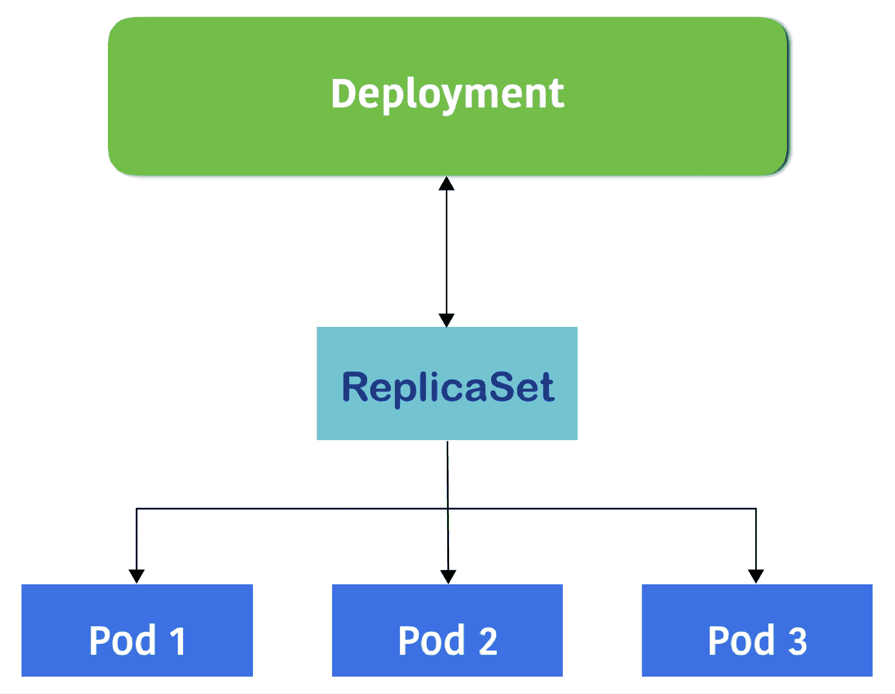

# 第二章：深入了解 Kubernetes 概念

本章将介绍以下操作：

+   链接 Pods 和容器

+   使用 ReplicaSets 管理 Pods

+   部署 API

+   使用服务（Services）

+   使用卷（Volumes）

+   使用 Secrets

+   使用名称

+   使用命名空间（Namespaces）

+   使用标签和选择器

# 简介

本章将从在 Kubernetes 系统上创建不同类型的资源开始。为了实现你的微服务结构应用，阅读本章的操作将是理解 Kubernetes 资源概念并加深理解的一个好开始。部署应用到 Kubernetes 后，你可以继续进行可扩展且高效的容器管理，同时也能完成微服务的 DevOps 交付流程。

# Kubernetes 概述

使用 Kubernetes 非常简单，可以通过**命令行接口**（**CLI**）或 API（RESTful）进行操作。本节将介绍如何通过 CLI 控制 Kubernetes。本章节使用的 CLI 版本是 1.10.2。

安装 Kubernetes master 后，你可以运行如下的`kubectl`命令。它显示了 kubectl 和 Kubernetes master 的版本（API 服务器和 CLI 版本都是 v1.10.2）：

```
$ kubectl version --short
Client Version: v1.10.2
Server Version: v1.10.2
```

`kubectl`通过 RESTful API 连接 Kubernetes API 服务器。默认情况下，如果`.kube/config`没有配置，它会尝试访问本地主机，否则你需要使用`--server`参数指定 API 服务器地址。因此，建议在 API 服务器机器上使用`kubectl`进行实践。

如果你通过网络使用 kubectl，你需要考虑 API 服务器的身份验证和授权。请参阅第七章，*在 GCP 上构建 Kubernetes*。

`kubectl`是 Kubernetes 集群的唯一命令，它控制 Kubernetes 集群管理器。更多信息请访问[`kubernetes.io/docs/user-guide/kubectl-overview/`](http://kubernetes.io/docs/user-guide/kubectl-overview/)。任何容器或 Kubernetes 集群操作都可以通过`kubectl`命令执行。

此外，kubectl 允许通过命令行的可选参数或文件（使用`-f`选项）输入信息；强烈建议使用文件，因为你可以将 Kubernetes 配置作为代码进行维护。本章将详细介绍这一点。

这是一个典型的`kubectl`命令行参数：

```
kubectl [command] [TYPE] [NAME] [flags]
```

前述命令的属性如下：

+   `command`：指定你希望对一个或多个资源执行的操作。

+   `TYPE`：指定资源类型。资源类型区分大小写，你可以指定单数、复数或缩写形式。

+   `NAME`：指定资源的名称。名称区分大小写。如果省略名称，则会显示所有资源的详细信息。

+   `flags`：指定可选的标志。

例如，如果你想启动 `nginx`，可以使用 `kubectl run` 命令或使用带有 YAML 文件的 `kubectl create -f` 命令，如下所示：

1.  使用 `run` 命令：

```
$ kubectl run my-first-nginx --image=nginx "my-first-nginx"
```

1.  使用带有 YAML 文件的 `create -f` 命令：

```
$ cat nginx.yaml 
apiVersion: apps/v1
kind: Deployment
metadata:
  name: my-first-nginx
  labels:
    app: nginx
spec:
  replicas: 1
  selector:
    matchLabels:
      app: nginx
  template:
    metadata:
      labels:
        app: nginx
    spec:
      containers:
      - name: nginx
        image: nginx 

//specify -f (filename) 
$ kubectl create -f nginx.yaml 
deployment.apps "my-first-nginx" created
```

1.  如果你想查看 Deployment 的状态，请输入 `kubectl get` 命令，如下所示：

```
$ kubectl get deployment
NAME             DESIRED   CURRENT   UP-TO-DATE   AVAILABLE   AGE
my-first-nginx   1         1         1            1           4s
```

1.  如果你还希望支持缩写，请输入以下内容：

```
$ kubectl get deploy
NAME             DESIRED   CURRENT   UP-TO-DATE   AVAILABLE   AGE
my-first-nginx   1         1         1            1           38s
```

1.  如果你想删除这些资源，请输入 `kubectl delete` 命令，如下所示：

```
$ kubectl delete deploy my-first-nginx
deployment.extensions "my-first-nginx" deleted
```

1.  `kubectl` 命令支持多种子命令；使用 `-h` 选项查看详细信息，例如：

```
//display whole sub command options 
$ kubectl -h 

//display sub command "get" options 
$ kubectl get -h 

//display sub command "run" options 
$ kubectl run -h 
```

本节描述了如何使用 `kubectl` 命令来控制 Kubernetes 集群。以下食谱描述了如何设置 Kubernetes 组件：

+   *使用 minikube 在 macOS 上设置 Kubernetes 集群* 和 *使用 minikube 在 Windows 上设置 Kubernetes 集群*，参见第一章，*构建你自己的 Kubernetes 集群*

+   *使用 kubeadm 在 Linux 上设置 Kubernetes 集群*，参见第一章，*构建你自己的 Kubernetes 集群*

+   *使用 kubespray（Ansible）在 Linux 上设置 Kubernetes 集群*，参见第一章，*构建你自己的 Kubernetes 集群*

# 链接 Pods 和容器

Pod 是一个或多个容器的集合，是 Kubernetes 中最小的可部署单元。Pod 总是被共同定位和共同调度，并在共享上下文中运行。每个 Pod 都由以下 Linux 命名空间进行隔离：

+   **进程 ID**（**PID**）命名空间

+   网络命名空间

+   **进程间通信**（**IPC**）命名空间

+   **Unix 时间共享**（**UTS**）命名空间

在容器化之前，它们会在同一台物理机或虚拟机上执行。

构建你自己的应用栈 Pod（例如，Web 服务器和数据库），它们由不同的 Docker 镜像混合而成是很有用的。

# 准备就绪

你必须拥有一个 Kubernetes 集群，并确保 Kubernetes 节点能够访问 Docker Hub（[`hub.docker.com`](https://hub.docker.com)）以便下载 Docker 镜像。

如果你正在运行 minikube，首先使用 `minikube ssh` 登录到 minikube 虚拟机，然后运行 `docker pull` 命令。

你可以通过以下方式使用 `docker pull` 命令模拟下载 Docker 镜像：

```
//this step only if you are using minikube
$ minikube ssh
                         _ _ 
            _ _ ( ) ( ) 
  ___ ___ (_) ___ (_)| |/') _ _ | |_ __ 
/' _ ` _ `\| |/' _ `\| || , < ( ) ( )| '_`\ /'__`\
| ( ) ( ) || || ( ) || || |\`\ | (_) || |_) )( ___/
(_) (_) (_)(_)(_) (_)(_)(_) (_)`\___/'(_,__/'`\____)

//run docker pull to download CentOS docker image
$ docker pull centos
Using default tag: latest
latest: Pulling from library/centos
d9aaf4d82f24: Pull complete 
Digest: sha256:4565fe2dd7f4770e825d4bd9c761a81b26e49cc9e3c9631c58cfc3188be9505a
Status: Downloaded newer image for centos:latest
```

# 如何操作...

以下是创建包含 2 个容器的 Pod 的步骤：

1.  登录到 Kubernetes 机器（如果使用 minikube，则无需登录），并准备以下 YAML 文件。它定义了启动 `nginx` 容器和 CentOS 容器。

1.  `nginx` 容器打开 HTTP 端口（TCP/`80`）。另一方面，CentOS 容器每三秒钟尝试使用 `curl` 命令访问 `localhost:80`：

```
$ cat my-first-pod.yaml 
apiVersion: v1
kind: Pod
metadata: 
  name: my-first-pod
spec:
  containers:
  - name: my-nginx
    image: nginx
  - name: my-centos
    image: centos
    command: ["/bin/sh", "-c", "while : ;do curl http://localhost:80/; sleep 10; done"]
```

1.  然后，执行 `kubectl create` 命令以启动 `my-first-pod`，如下所示：

```
$ kubectl create -f my-first-pod.yaml 
pod "my-first-pod" created 
```

这需要几秒钟到几分钟的时间，具体取决于 Docker Hub 的网络带宽和 Kubernetes 节点的规格。

1.  你可以通过 `kubectl get pods` 查看 Pod 的状态，如下所示：

```
//still downloading Docker images (0/2)
$ kubectl get pods
NAME           READY     STATUS              RESTARTS   AGE
my-first-pod   0/2       ContainerCreating   0          14s

//my-first-pod is running (2/2)
$ kubectl get pods
NAME           READY     STATUS    RESTARTS   AGE
my-first-pod   2/2       Running   0          1m
```

现在，`nginx` 容器（`my-nginx`）和 CentOS 容器（`my-centos`）都已经准备好。

1.  让我们检查一下 CentOS 容器是否能访问 `nginx`。你可以运行 `kubectl exec` 命令在 CentOS 容器上运行 bash，然后使用 `curl` 命令访问 `nginx`，如下所示：

```
//run bash on my-centos container
//then access to TCP/80 using curl
$ kubectl exec my-first-pod -it -c my-centos -- /bin/bash
[root@my-first-pod /]# 
[root@my-first-pod /]# curl -L http://localhost:80
<!DOCTYPE html>
<html>
<head>
<title>Welcome to nginx!</title>
<style>
    body {
        width: 35em;
        margin: 0 auto;
        font-family: Tahoma, Verdana, Arial, sans-serif;
    }
</style>
</head>
<body>
<h1>Welcome to nginx!</h1>
<p>If you see this page, the nginx web server is successfully installed and
working. Further configuration is required.</p>

<p>For online documentation and support please refer to
<a href="http://nginx.org/">nginx.org</a>.<br/>
Commercial support is available at
<a href="http://nginx.com/">nginx.com</a>.</p>

<p><em>Thank you for using nginx.</em></p>
</body>
</html>
```

如你所见，Pod 将两个不同的容器，`nginx` 和 `CentOS`，连接到同一个 Linux 网络命名空间中。

# 它是如何工作的...

启动 Pod 时，Kubernetes 调度器会将任务分配给 kubelet 进程，处理在一个 Kubernetes 节点上启动 `nginx` 和 `CentOS` 容器的所有操作。

下图展示了这两个容器和 Pod；这两个容器可以通过 localhost 网络进行通信，因为在 Pod 内的容器共享网络接口：


一个 Pod 有两个容器，它们可以通过 localhost 进行通信。

如果你有两个或更多节点，可以检查 `-o wide` 选项以找到运行某个 Pod 的节点：

```
//it indicates Node "minikube" runs my-first-pod 
$ kubectl get pods -o wide
NAME           READY     STATUS    RESTARTS   AGE       IP           NODE
my-first-pod   2/2       Running   0          43m       172.17.0.2   minikube
```

登录到该节点，然后可以使用 `docker ps | grep my-first-pod` 命令查看正在运行的容器，如下所示：


属于 my-first-pod 的容器列表

你可能会注意到 `my-first-pod` 包含三个容器；`centos`、`nginx` 和 `pause` 容器都在运行，而不是两个。因为每个 Pod 都属于一个特定的 Linux 命名空间，如果 CentOS 和 nginx 容器都死掉了，命名空间也会被销毁。因此，`pause` 容器会保留在 Pod 中，以维持 Linux 命名空间。

让我们启动第二个 Pod，将其重命名为 `my-second-pod`，并运行 `kubectl create` 命令，如下所示：

```
//just replace the name from my-first-pod to my-second-pod 
$ cat my-first-pod.yaml | sed -e 's/my-first-pod/my-second-pod/' > my-second-pod.yaml

//metadata.name has been changed to my-second-pod
$ cat my-second-pod.yaml 
apiVersion: v1
kind: Pod
metadata: 
  name: my-second-pod
spec:
  containers:
  - name: my-nginx
    image: nginx
  - name: my-centos
    image: centos
    command: ["/bin/sh", "-c", "while : ;do curl
http://localhost:80/; sleep 10; done"]

//create second pod
$ kubectl create -f my-second-pod.yaml 
pod "my-second-pod" created

//2 pods are running
$ kubectl get pods
NAME            READY     STATUS    RESTARTS   AGE
my-first-pod    2/2       Running   0          1h
my-second-pod   2/2       Running   0          43s
```

现在你有两个 Pod；每个 Pod 有两个容器，`centos` 和 `nginx`。因此，在 Kubernetes 集群中总共有四个容器，如下图所示：


从 my-first-pod 复制 Pod 到 my-second-pod

如果你想部署更多相同的 Pod，可以考虑使用 Deployment（ReplicaSet）。

测试完成后，你可以运行 `kubectl delete` 命令从 Kubernetes 集群中删除 Pod：

```
//specify --all option to delete all pods
$ kubectl delete pods --all
pod "my-first-pod" deleted
pod "my-second-pod" deleted

//pods are terminating
$ kubectl get pods
NAME            READY     STATUS        RESTARTS   AGE
my-first-pod    2/2       Terminating   0          1h
my-second-pod   2/2       Terminating   0          3m
```

# 另见

本章的这一配方描述了如何控制 Pods。它们是 Kubernetes 操作的基本组成部分。接下来的配方将描述如何使用 Deployments、Services 等进行高级 Pod 操作：

+   *使用 ReplicaSets 管理 Pods*

+   *Deployment API*

+   *与服务一起工作*

+   *使用标签和选择器*

# 使用 ReplicaSets 管理 Pods

ReplicaSet 是 Kubernetes 中指代 Pod 副本的 API 对象的术语。其目的是能够控制一组 Pod 的行为。ReplicaSet 确保用户指定数量的 Pod 始终在运行。如果 ReplicaSet 中的某些 Pod 崩溃并终止，系统将自动在健康节点上重新创建具有原始配置的 Pod，并保持一定数量的进程持续运行。在更改副本集大小时，用户可以轻松地扩展或缩减应用程序。根据这一特性，无论是否需要 Pod 的副本，你都可以依赖 ReplicaSet 进行自动恢复和可扩展性管理。在这个教程中，你将学习如何使用 ReplicaSet 管理 Pod：


ReplicaSet 和它们的 Pod 在两个节点上

ReplicaSet 通常处理一个应用层。正如在前面的图示中所看到的，我们启动了一个包含三个 Pod 副本的 ReplicaSet。以下是一些机制细节：

+   **kube-controller-manager** 守护进程帮助维持资源处于其期望的状态。例如，图示中 ReplicaSet 的期望状态是三个 Pod 副本。

+   **kube-scheduler** 守护进程（Kubernetes 的调度器）负责将任务分配给健康的节点。

+   ReplicaSet 的选择器用于决定它覆盖哪些 Pod。如果 Pod 标签中的键值对包含 ReplicaSet 选择器中的所有项，则该 Pod 属于该 ReplicaSet。如你所见，图示显示三个 Pod 由 ReplicaSet 管理。尽管 Pod 2 的 `env` 标签不同，但由于其他两个标签 `role` 和 `project` 与 ReplicaSet 的选择器匹配，它仍然被选中。

**ReplicationController？ReplicaSet？** 对于经验丰富的 Kubernetes 用户，你可能会注意到 ReplicaSet 看起来与 ReplicationController 非常相似。自 Kubernetes 1.2 版本以来，为了集中关注不同的功能，ReplicationController 的功能已被 ReplicaSet 和 Deployment 覆盖。ReplicaSet 关注 Pod 副本，确保特定的 Pod 始终保持在健康状态。另一方面，Deployment 是一个更高级的 API，可以管理 ReplicaSet，执行应用程序的滚动更新并公开服务。在 Kubernetes v1.8.3 中，用户仍然可以创建复制控制器。然而，建议使用与 ReplicaSet 一起使用的 Deployment，因为这些是最新的，并且具有更细粒度的配置。

# 准备就绪

创建 ReplicaSet 与创建任何 Kubernetes 资源相同；我们在 Kubernetes 主节点上执行 `kubectl` 命令。因此，我们需要确保你的 Kubernetes 环境已准备好接受命令。此外，Kubernetes 节点应能够访问 Docker Hub。接下来的几页演示中，我们将以官方的 `nginx` Docker 镜像为例，该镜像也存储在公共 Docker 注册表中。

**评估已准备好的 Kubernetes 系统**：你可以通过检查这里的项目来验证你的 Kubernetes 主节点是否是一个可用的系统：

+   **检查守护进程是否正在运行**：主节点上应该有三个正在运行的守护进程：`apiserver`、`scheduler`和`controller-manager`。

+   **检查命令 kubectl 是否存在且可用**：尝试使用命令`kubectl get cs`来检查此项目和第一个项目。你不仅可以验证组件的状态，还可以验证`kubectl`的可用性。

+   **检查节点是否准备好工作**：你可以通过使用命令`kubectl get nodes`来检查它们的状态。

如果这里列出的某些项目无效，请参考第一章，*构建你自己的 Kubernetes 集群*，根据你选择的安装方式获取正确的指导。

# 如何操作...

在本节中，我们将展示 ReplicaSet 从创建到销毁的生命周期。

# 创建 ReplicaSet

当尝试使用命令行立即启动 Kubernetes 服务时，我们通常会使用`kubectl run`。但是，它默认会创建一个 Deployment，不仅处理 Pod 副本，还提供容器更新机制。为了简单地创建一个独立的 ReplicaSet，我们可以利用一个配置 YAML 文件并执行它：

```
$ cat my-first-replicaset.yaml
apiVersion: extensions/v1beta1
kind: ReplicaSet
metadata:
  name: my-first-replicaset
  labels:
    version: 0.0.1
spec:
  replicas: 3
  selector:
    matchLabels:
      project: My-Happy-Web
      role: frontend
  template:
    metadata:
      labels:
        project: My-Happy-Web
        role: frontend
        env: dev
    spec:
      containers:
      - name: happy-web
        image: nginx:latest
```

上述文件是我们第一个 ReplicaSet 的 YAML 配置文件。它定义了一个名为`my-first-replicaset`的 ReplicaSet，具有三个 Pod 副本。标签和选择器是 ReplicaSet 最具特色的设置。这里有两组标签：一组用于 ReplicaSet，另一组用于 Pods。ReplicaSet 的第一个标签位于该资源的 metadata 下，在名称下方，主要用于描述。而位于模板 metadata 下的另一个标签值，用于 Pods，也是用于标识。ReplicaSet 管理其选择器所包含标签的 Pods。

在我们的示例配置文件中，ReplicaSet 的选择器会查找带有`project: My-Happy-Web`和`role: frontend`标签的 Pods。由于我们在此 ReplicaSet 的控制下启动 Pods，因此 Pods 的标签应该必定包含选择器所关注的标签。你在创建带有错误标签的 ReplicaSet 时可能会遇到以下错误信息：`` `selector` does not match template `labels` ``。

现在，让我们通过这个文件来创建 ReplicaSet：

```
$ kubectl create -f my-first-replicaset.yaml
replicaset.extensions "my-first-replicaset" created
```

**Kubernetes v1.9 中 ReplicaSet 的 API 版本**

当本书编写时，Kubernetes v1.9 已发布。ReplicaSet 的 API 版本变更为稳定版本`apps/v1`，不再是`apps/v1beta2`。如果你使用的是旧版 Kubernetes，请将`apiVersion`的值更改为`apps/v1beta2`，或者直接更新你的 Kubernetes 系统。

# 获取 ReplicaSet 的详细信息

在创建 ReplicaSet 后，子命令 `get` 和 `describe` 可以帮助我们获取其信息以及 Pod 的状态。在 Kubernetes 的 CLI 中，我们可以使用 `rs` 来代替完整的资源类型名称 ReplicaSet：

```
// use subcommand "get" to list all ReplicaSets
$ kubectl get rs
NAME                  DESIRED   CURRENT   READY     AGE
my-first-replicaset   3         3         3         4s
```

该结果大致显示 `my-first-replicaset` 的 Pod 副本都已成功运行；当前运行的 Pod 数量与期望的一致，并且它们都已准备好接受请求。

有关详细信息，请使用子命令 `describe` 查看：

```
// specify that we want to check ReplicaSet called my-first-replicaset
$ kubectl describe rs my-first-replicaset
Name:         my-first-replicaset
Namespace:    default
Selector:     project=My-Happy-Web,role=frontend
Labels:       version=0.0.1
Annotations:  <none>
Replicas:     3 current / 3 desired
Pods Status:  3 Running / 0 Waiting / 0 Succeeded / 0 Failed
Pod Template:
  Labels:  env=dev
           project=My-Happy-Web
           role=frontend
  Containers:
   happy-web:
    Image:        nginx:latest
    Port:         <none>
    Host Port:    <none>
    Environment:  <none>
    Mounts:       <none>
  Volumes:        <none>
Events:
  Type    Reason            Age   From                   Message
  ----    ------            ----  ----                   -------
  Normal  SuccessfulCreate  9s    replicaset-controller  Created pod: my-first-replicaset-8hg55
  Normal  SuccessfulCreate  9s    replicaset-controller  Created pod: my-first-replicaset-wtphz
  Normal  SuccessfulCreate  9s    replicaset-controller  Created pod: my-first-replicaset-xcrws
```

你可以看到输出列出了 ReplicaSet 配置的详细信息，就像我们在 YAML 文件中请求的那样。此外，Pod 创建的日志作为 ReplicaSet 的一部分显示出来，这确认了 Pod 副本已成功创建，并且被指定了唯一名称。你也可以通过名称检查 Pod：

```
// get the description according the name of Pod, please look at the Pod name shown on your screen, which should be different from this book.
$ kubectl describe pod my-first-replicaset-xcrws
```

# 更改 ReplicaSet 的配置

被称为 `edit`、`patch` 和 `replace` 的子命令可以帮助更新 Kubernetes 中的实时资源。所有这些功能通过修改配置文件的方式来更改设置。在这里我们以 `edit` 为例。

子命令 `edit` 允许用户通过编辑器修改资源配置。尝试通过命令 `kubectl edit rs $REPLICASET_NAME` 更新你的 ReplicaSet；你将通过默认编辑器访问这个资源，编辑一个 YAML 配置文件：

```
// demonstrate to change the number of Pod replicas.
$ kubectl get rs
NAME                  DESIRED   CURRENT   READY     AGE
my-first-replicaset   3         3         3         2m

// get in the editor, modify the replica number, then save and leave
$ kubectl edit rs my-first-replicaset
# Please edit the object below. Lines beginning with a '#' will be ignored,
# and an empty file will abort the edit. If an error occurs while saving this file will be
# reopened with the relevant failures.
#
apiVersion: extensions/v1beta1
kind: ReplicaSet
metadata:
  creationTimestamp: 2018-05-05T20:48:38Z
  generation: 1
  labels:
    version: 0.0.1
  name: my-first-replicaset
  namespace: default
  resourceVersion: "1255241"
  selfLink: /apis/extensions/v1beta1/namespaces/default/replicasets/my-first-replicaset
  uid: 18330fa8-cd55-11e7-a4de-525400a9d353
spec:
  replicas: 4
  selector:
    matchLabels:
...
replicaset "my-first-replicaset" edited
$ kubectl get rs
NAME                  DESIRED   CURRENT   READY     AGE
my-first-replicaset   4         4         4         4m
```

在演示中，我们成功地向该集合中添加了一个 Pod，但这不是自动扩缩容 Pod 的最佳实践。请查看第三章中*处理配置文件*的示例，参考其中的*容器操作*部分，并尝试修改其他值。

# 删除 ReplicaSet

为了从 Kubernetes 系统中删除 ReplicaSet，你可以依赖子命令 `delete`。当我们执行 `delete` 来删除资源时，它会强制删除目标对象：

```
$ time kubectl delete rs my-first-replicaset && kubectl get pod
replicaset.extensions "my-first-replicaset" deleted
real  0m2.492s
user  0m0.188s
sys   0m0.048s
NAME                        READY     STATUS        RESTARTS   AGE
my-first-replicaset-8hg55   0/1       Terminating   0          53m
my-first-replicaset-b6kr2   1/1       Terminating   0          48m
my-first-replicaset-wtphz   0/1       Terminating   0          53m
my-first-replicaset-xcrws   1/1       Terminating   0          53m
```

我们发现响应时间非常短，效果也立即体现。

**删除 ReplicaSet 下的 Pod** 如前所述，无法通过删除 Pod 来缩减 ReplicaSet 的规模，因为在删除 Pod 时，ReplicaSet 会处于不稳定状态：如果期望的 Pod 数量未达到，控制器管理器会要求 ReplicaSet 创建另一个 Pod。这个概念可以通过以下命令展示：

```
// check ReplicaSet and the Pods
 $ kubectl get rs,pod
 NAME DESIRED CURRENT READY AGE
 rs/my-first-replicaset 3 3 3 14s
 NAME READY STATUS RESTARTS AGE
 po/my-first-replicaset-bxf45 1/1 Running 0 14s
 po/my-first-replicaset-r6wpx 1/1 Running 0 14s
 po/my-first-replicaset-vt6fd 1/1 Running 0 14s

 // remove certain Pod and check what happened
 $ kubectl delete pod my-first-replicaset-bxf45
 pod "my-first-replicaset-bxf45" deleted
 $ kubectl get rs,pod
 NAME DESIRED CURRENT READY AGE
 rs/my-first-replicaset 3 3 3 2m
 NAME READY STATUS RESTARTS AGE
 po/my-first-replicaset-dvbpg 1/1 Running 0 6s
 po/my-first-replicaset-r6wpx 1/1 Running 0 2m
 po/my-first-replicaset-vt6fd 1/1 Running 0 2m

 // check the event log as well
 $ kubectl describe rs my-first-replicaset
 (ignored)
 :
 Events:
 Type Reason Age From Message
 ---- ------ ---- ---- -------
 Normal SuccessfulCreate 2m replicaset-controller Created pod: my-first-replicaset-bxf45
 Normal SuccessfulCreate 2m replicaset-controller Created pod: my-first-replicaset-r6wpx
 Normal SuccessfulCreate 2m replicaset-controller Created pod: my-first-replicaset-vt6fd
 Normal SuccessfulCreate 37s replicaset-controller Created pod: my-first-replicaset-dvbpg
```

你会发现，尽管 `my-first-replicaset-bxf45` Pod 被删除，但 `my-first-replicaset-dvbpg` Pod 会自动创建并附加到该 ReplicaSet 中。

# 它是如何工作的...

ReplicaSet 通过使用 Pod 模板和标签来定义一组 Pod。如前面章节中的思路，ReplicaSet 仅通过标签管理 Pod。这也意味着 Pod 模板和 Pod 配置可能不同。这也意味着，可以通过修改标签将独立的 Pod 添加到集合中。

让我们通过创建一个与本配方开头的图示类似的 ReplicaSet，来评估选择器和标签的概念：


ReplicaSet 会管理具有相同标签的 Pods，这些标签在其选择器中有所描述。

首先，我们将创建一个 CentOS Pod，并为其指定标签 `project: My-Happy-Web`、`role: frontend` 和 `env: test`：

```
// use subcommand "run" with tag restart=Never to create a Pod
$ kubectl run standalone-pod --image=centos --labels="project=My-Happy-Web,role=frontend,env=test" --restart=Never --command sleep 3600
pod "standalone-pod" created

// check Pod along with the labels
$ kubectl get pod -L project -L role -L env
NAME             READY     STATUS    RESTARTS   AGE       PROJECT        ROLE       ENV
standalone-pod   1/1       Running   0          3m        My-Happy-Web   frontend   test
```

添加此命令后，带有我们指定标签的 standalone Pod 会运行。

接下来，使用 YAML 文件再次创建你的第一个 ReplicaSet 示例：

```
$ kubectl create -f my-first-replicaset.yaml
replicaset.apps "my-first-replicaset" created

// check the Pod again
$ kubectl get pod -L project -L role -L env
NAME                        READY     STATUS    RESTARTS   AGE       PROJECT        ROLE       ENV
my-first-replicaset-fgdc8   1/1       Running   0          14s       My-Happy-Web   frontend   dev
my-first-replicaset-flc9m   1/1       Running   0          14s       My-Happy-Web   frontend   dev
standalone-pod              1/1       Running   0          6m        My-Happy-Web   frontend   test
```

如前述结果所示，只有两个 Pod 被创建。这是因为 Pod `standalone-pod` 被认为是 `my-first-replicaset` 所管理的一部分。请记住，`my-first-replicaset` 会管理带有标签 `project: My-Happy-Web` 和 `role:frontend` 的 Pod（忽略 `env` 标签）。去检查 standalone Pod，你会发现它也是 ReplicaSet 的一部分：

```
$ kubectl describe pod standalone-pod
Name:           standalone-pod
Namespace:      default
Node:           ubuntu02/192.168.122.102
Start Time:     Sat, 05 May 2018 16:57:14 -0400
Labels:         env=test
                project=My-Happy-Web
                role=frontend
Annotations:    <none>
Status:         Running
IP:             192.168.79.57
Controlled By:  ReplicaSet/my-first-replicaset ...
```

类似地，一旦我们删除该 ReplicaSet，独立的 Pod 也将与其一起被移除：

```
// remove the ReplicaSet and check pods immediately
$ kubectl delete rs my-first-replicaset && kubectl get pod
replicaset.extensions "my-first-replicaset" deleted
NAME                        READY     STATUS        RESTARTS   AGE
my-first-replicaset-fgdc8   0/1       Terminating   0          1m
my-first-replicaset-flc9m   0/1       Terminating   0          1m
standalone-pod              0/1       Terminating   0          7m
```

# 还有更多…

Kubernetes 提供了多种 Pod 管理资源。鼓励用户利用不同类型的资源以满足不同的需求。让我们将以下列出的资源类型与 ReplicaSet 进行比较：

+   **Deployment**：在一般情况下，Kubernetes Deployment 与 ReplicaSet 一起使用，以实现完整的 Pod 管理：容器滚动更新、负载均衡和服务暴露。

+   **Job**：有时，我们希望 Pod 作为作业而不是服务运行。Kubernetes 的 Job 适用于这种情况。可以把它看作是一个带有终止约束的 ReplicaSet。

+   **DaemonSet**：与 ReplicaSet 不同，Kubernetes DaemonSet 保证在集群中的每个节点上都运行指定的 Pod。换句话说，它是在每个节点上部署 ReplicaSet 的一个子集。

想要获得更多的想法和指导，可以查看 第三章中的配方 *确保容器的灵活使用*，《**玩转容器**》。

# 另请参见

现在你已经理解了 ReplicaSet 的概念。继续查阅本章中的其他配方，探索更多 Kubernetes 资源，进一步体验 ReplicaSet 的神奇效果：

+   *部署 API*

+   *使用服务*

+   *使用标签和选择器*

此外，由于你已经使用配置文件创建了一个简单的 ReplicaSet，请参考有关为 Kubernetes 资源创建自定义配置文件的更多详细信息：

+   *配置文件操作* 部分在 第三章，《**玩转容器**》

# 部署 API

Deployment API 是在 Kubernetes 1.2 版本中引入的。它取代了复制控制器。复制控制器的滚动更新和回滚功能是通过客户端（`kubectl`命令和`REST API`）来实现的，`kubectl`需要在更新复制控制器时保持连接。另一方面，Deployments 在服务器端处理滚动更新和回滚的过程。一旦请求被接受，客户端可以立即断开连接。

因此，Deployments API 被设计为一个更高层次的 API 来管理 ReplicaSet 对象。本节将探讨如何使用 Deployments API 来管理 ReplicaSets。

# 准备工作

为了创建 Deployment 对象，通常使用`kubectl run`命令，或者准备描述 Deployment 配置的 YAML/JSON 文件。这个示例使用`kubectl run`命令来创建`my-nginx` Deployment 对象：

```
//create my-nginx Deployment (specify 3 replicas and nginx version 1.11.0)
$ kubectl run my-nginx --image=nginx:1.11.0 --port=80 --replicas=3
deployment.apps "my-nginx" created

//see status of my-nginx Deployment
$ kubectl get deploy
NAME       DESIRED   CURRENT   UP-TO-DATE   AVAILABLE   AGE
my-nginx   3         3         3            3           8s

//see status of ReplicaSet
$ kubectl get rs
NAME                 DESIRED   CURRENT   READY     AGE
my-nginx-5d69b5ff7   3         3         3         11s

//see status of Pod
$ kubectl get pods
NAME                       READY     STATUS    RESTARTS   AGE
my-nginx-5d69b5ff7-9mhbc   1/1       Running   0          14s
my-nginx-5d69b5ff7-mt6z7   1/1       Running   0          14s
my-nginx-5d69b5ff7-rdl2k   1/1       Running   0          14s
```

如你所见，Deployment 对象`my-nginx`创建了一个`ReplicaSet`，它有一个标识符：`<Deployment name>-<hex decimal hash>`。然后 ReplicaSet 创建了三个 Pod，它们的标识符为：`<ReplicaSet id>-<random id>`。

在 Kubernetes v1.8 版本之前，`<Deployment name>-<pod-template-hash value (number)>` 被用作 ReplicaSet 的标识符，而不是十六进制哈希值。

更多细节，请查看拉取请求：[`github.com/kubernetes/kubernetes/pull/51538`](https://github.com/kubernetes/kubernetes/pull/51538)。

该图展示了**Deployment**、**ReplicaSet**和**Pod**之间的关系：



Deployment、ReplicaSet 和 Pod 的关系图

由于这种关系，如果你对`my-nginx` Deployment 对象执行`delete`操作，它也会尝试删除相应的 ReplicaSet 和 Pods：

```
//delete my-nginx Deployment
$ kubectl delete deploy my-nginx
deployment.extensions "my-nginx" deleted

//see status of ReplicaSet
$ kubectl get rs
No resources found.

//see status of Pod, it has been terminated
$ kubectl get pods
NAME                       READY     STATUS        RESTARTS   AGE
my-nginx-5d69b5ff7-9mhbc   0/1       Terminating   0          2m
my-nginx-5d69b5ff7-mt6z7   0/1       Terminating   0          2m
my-nginx-5d69b5ff7-rdl2k   0/1       Terminating   0          2m
```

这个示例只是一个简单的`create`和`delete`，此时可以轻松理解 Deployment 对象和 ReplicaSet 对象之间 1:1 的关系。然而，Deployment 对象可以管理多个 ReplicaSets 来保存历史记录。所以，实际的关系是 1:N，如下图所示：


Deployments 维护 ReplicaSet 的历史记录

为了理解 1:N 关系，让我们重新创建这个 Deployment 对象，并进行一些操作，看看 Deployment 如何管理 ReplicaSet 的历史记录。

# 如何操作...

你可以运行`kubectl run`命令来重新创建`my-nginx`，或者编写一个 Deployment 配置文件来实现相同的结果。这是一个很好的机会来学习 Deployment 配置文件。

这个示例等同于 `kubectl run my-nginx --image=nginx:1.11.0 --port=80 --replicas=3`：

```
$ cat deploy.yaml 
apiVersion: apps/v1
kind: Deployment
metadata:
  name: my-nginx
spec:
  replicas: 3
  selector:
    matchLabels:
      run: my-nginx
  template:
    metadata:
      labels:
        run: my-nginx
    spec:
      containers:
      - name: my-nginx
        image: nginx:1.11.0
        ports:
        - containerPort: 80
```

这些参数按键值对排序，具体描述如下：

| **Key** | **Value** | **Description** |
| --- | --- | --- |
| `apiVersion` | `apps/v1` | 在 Kubernetes v1.8 之前，使用的是 apps/v1Beta1，v1.8 使用的是 apps/v1Beta2，之后 v1.9 及更高版本使用 apps/v1 |
| `kind` | `deployment` | 表示这是一个 Deployment 配置集 |
| `metadata.name` | `my-nginx` | Deployment 的名称 |
| `spec.replicas` | `3` | 希望有三个 Pod |
| `spec.selector.matchLabels` | `run:my-nginx` | 控制具有此标签的 ReplicaSet/Pods |
| `spec.template.metadata.labels` | `run:my-nginx` | 创建 ReplicaSet/Pod 时分配此标签；必须与`spec.selector.matchLabels`匹配 |

| `spec.template.spec.containers` | name: `my-nginx`image: `nginx:1.11.0`port:`- containerPort:80` | ReplicaSet 创建和管理包含以下内容的 Pods：

+   名称为`my-nginx`

+   容器镜像为 nginx 版本 1.11.0

+   发布端口号`80`

|

如果你使用这个 YAML 文件来创建 Deployment，应该使用`kubectl create`命令，而不是`kubectl run`。

请注意，此时，你还应指定`--save-config`，这将允许你以后使用`kubectl apply`命令更新资源。此外，指定`--record`可以存储命令行历史记录。这两个选项并非管理 ReplicaSet 历史记录的必需，但有助于你更好地保存信息：

```
//use -f to specify YAML file
$ kubectl create -f deploy.yaml --save-config --record
deployment.apps "my-nginx" created 

//check my-nginx Deployment
$ kubectl get deploy
NAME       DESIRED   CURRENT   UP-TO-DATE   AVAILABLE   AGE
my-nginx   3         3         3            3           5s

$ kubectl describe deploy my-nginx
Name:                   my-nginx
Namespace:              default
CreationTimestamp:      Wed, 09 May 2018 03:40:09 +0000
Labels:                 <none>
Annotations:            deployment.kubernetes.io/revision=1
                        kubectl.kubernetes.io/last-applied-configuration={"apiVersion":"apps/v1","kind":"Deployment","metadata":{"annotations":{},"name":"my-nginx","namespace":"default"},"spec":{"replicas":3,"selector":{"mat...
                        kubernetes.io/change-cause=kubectl create --filename=deploy.yaml --save-config=true --record=true
Selector:               run=my-nginx
Replicas:               3 desired | 3 updated | 3 total | 3 available | 0 unavailable
StrategyType:           RollingUpdate
MinReadySeconds:        0
RollingUpdateStrategy:  25% max unavailable, 25% max surge
Pod Template:
  Labels:  run=my-nginx
  Containers:
   my-nginx:
    Image:        nginx:1.11.0
    Port:         80/TCP
    Host Port:    0/TCP
    Environment:  <none>
    Mounts:       <none>
  Volumes:        <none>
Conditions:
  Type           Status  Reason
  ----           ------  ------
  Available      True    MinimumReplicasAvailable
  Progressing    True    NewReplicaSetAvailable
OldReplicaSets:  <none>
NewReplicaSet:   my-nginx-54bb7bbcf9 (3/3 replicas created) Events:
  Type    Reason             Age   From                   Message
  ----    ------             ----  ----                   -------
  Normal  ScalingReplicaSet  34s   deployment-controller  Scaled up replica set my-nginx-54bb7bbcf9 to 3
```

你可以在前面的代码中看到`OldReplicaSets`和`NewReplicaSet`属性，它们表示 Deployment 和 ReplicaSet 之间的某些关联。

每当你更新容器模板的定义时，例如，将 nginx 镜像版本从 1.11.0 更改为 1.12.0，Deployment `my-nginx`将创建一个新的 ReplicaSet。然后，`NewReplicaSet`属性将指向使用 nginx 版本 1.12.0 的新 ReplicaSet。

另一方面，`OldReplicaSets`属性指向一个旧的 ReplicaSet，该 ReplicaSet 使用的是 nginx 版本 1.11.0，直到新的 ReplicaSet 完成并设置新的 Pod。

这些旧的/新的 ReplicaSet 与 Deployment 之间的关联，Kubernetes 管理员可以轻松地进行回滚操作，以防新的 ReplicaSet 出现问题。

此外，Deployment 可以保留与其之前关联的 ReplicaSet 的历史记录。因此，Deployment 可以随时回滚到任何旧的 ReplicaSet。

# 它是如何工作的...

如前所述，假设我们将 nginx 镜像版本从 1.11.0 升级到 1.12.0。有两种方法可以更改容器镜像：使用`kubectl set`命令，或更新 YAML 文件然后使用`kubectl apply`命令。

使用`kubectl set`命令更快捷，并且当使用`--record`选项时可提供更好的可视化效果。

另一方面，更新 YAML 并使用`kubectl apply`命令更适合保留整个 Deployment YAML 配置文件，在使用版本控制系统（如`git`）时更为有利。

# 使用 kubectl set 更新容器镜像

使用`kubectl set`命令允许我们覆盖`spec.template.spec.containers[].image`属性，这类似于使用`kubectl run`命令指定镜像文件。以下示例指定`my-nginx` Deployment，将容器`my-nginx`的镜像更改为 nginx 版本 1.12.0：

```
$ kubectl set image deployment my-nginx my-nginx=nginx:1.12.0 --record
deployment.apps "my-nginx" image updated

$ kubectl describe deploy my-nginx
Name:                   my-nginx
…
…
Conditions:
  Type           Status  Reason
  ----           ------  ------
  Available      True    MinimumReplicasAvailable
  Progressing    True    ReplicaSetUpdated
OldReplicaSets:  my-nginx-54bb7bbcf9 (3/3 replicas created)
NewReplicaSet:   my-nginx-77769b7666 (1/1 replicas created) Events:
  Type    Reason             Age   From                   Message
  ----    ------             ----  ----                   -------
  Normal  ScalingReplicaSet  27s   deployment-controller  Scaled up replica set my-nginx-54bb7bbcf9 to 3
  Normal  ScalingReplicaSet  2s    deployment-controller  Scaled up replica set my-nginx-77769b7666 to 1
```

如您所见，`OldReplicaSets`变为之前的`ReplicaSet`（`my-nginx-54bb7bbcf9`），而`NewReplicaSet`变为`my-nginx-77769b7666`。请注意，您可以看到`OldReplicaSets`属性，直到`NewReplicaSet`准备就绪，所以一旦新的`ReplicaSet`成功启动，`OldReplicaSet`将变为`<none>`，如下所示：

```
$ kubectl describe deploy my-nginx
Name:                   my-nginx
…
…
  Type           Status  Reason
  ----           ------  ------
  Available      True    MinimumReplicasAvailable
  Progressing    True    NewReplicaSetAvailable
OldReplicaSets:  <none>
NewReplicaSet:   my-nginx-77769b7666 (3/3 replicas created)
```

如果您可以通过`kubectl get rs`看到`ReplicaSet`列表，则可以看到两个`ReplicaSet`，如下所示：

```
$ kubectl get rs
NAME                  DESIRED   CURRENT   READY     AGE
my-nginx-54bb7bbcf9   0         0         0         3m
my-nginx-77769b7666   3         3         3         3m
```

如您所见，在旧的`ReplicaSet`（`my-nginx-54bb7bbcf9`）中，`DESIRED/CURRENT/READY`的 Pod 数都是零。

此外，由于前面的示例使用了`--record`选项，您可以使用`kubectl rollout history`命令查看 Deployment `my-nginx`的部署历史，如下所示：

```
$ kubectl rollout history deployment my-nginx
deployments "my-nginx"
REVISION  CHANGE-CAUSE
1         kubectl create --filename=deploy.yaml --save-config=true --record=true
2         kubectl set image deployment/my-nginx my-nginx=nginx:1.12.0 --record=true
```

# 更新 YAML 并使用 kubectl apply

出于演示目的，将`deploy.yaml`复制到`deploy_1.12.2.yaml`并将`nginx`版本更改为`1.12.2`，如下所示：

```
        image: nginx:1.12.2
```

然后运行带有`--record`选项的`kubectl apply`命令：

```
$ kubectl apply -f deploy_1.12.2.yaml --record
deployment.apps "my-nginx" configured
```

这将执行与`kubectl set`镜像命令相同的操作，因此您可以看到 nginx 镜像版本已升级到`1.12.2`；此外，`OldReplicaSets`/`NewReplicaSet`的组合已更改如下：

```
$ kubectl describe deploy my-nginx
Name:                   my-nginx
…
…
Pod Template:
  Labels: run=my-nginx
  Containers:
   my-nginx:
    Image: nginx:1.12.2
...
...
Conditions:
  Type           Status  Reason
  ----           ------  ------
  Available      True    MinimumReplicasAvailable
  Progressing    True    ReplicaSetUpdated
OldReplicaSets: my-nginx-77769b7666 (3/3 replicas created)
NewReplicaSet: my-nginx-69fbc98fd4 (1/1 replicas created)
```

几秒钟后，`NewReplicaSet`将准备就绪。然后系统中将总共有三个`ReplicaSets`：

```
$ kubectl get rs
NAME                  DESIRED   CURRENT   READY     AGE
my-nginx-54bb7bbcf9   0         0         0         7m
my-nginx-69fbc98fd4   3         3         3         1m
my-nginx-77769b7666   0         0         0         6m
```

您还可以查看部署历史：

```
$ kubectl rollout history deployment my-nginx
deployments "my-nginx"
REVISION  CHANGE-CAUSE
1         kubectl create --filename=deploy.yaml --save-config=true --record=true
2         kubectl set image deployment/my-nginx my-nginx=nginx:1.12.0 --record=true
3         kubectl apply --filename=deploy_1.12.2.yaml --record=true
```

每当您想要回滚到之前的`ReplicaSet`，即回到之前的 nginx 版本时，可以使用带有`--to-revision`选项的`kubectl rollout undo`。例如，如果您想回滚到历史记录中的修订版 2（`kubectl set image deployment/my-nginx my-nginx=nginx:1.12.0 --record=true`），可以指定`--to-revision=2`：

```
$ kubectl rollout undo deployment my-nginx --to-revision=2
deployment.apps "my-nginx" rolled back'
```

几秒钟后，Deployment 将停用当前使用`nginx`版本`1.12.2`的 Pod 模板的`ReplicaSet`，然后激活使用`nginx`版本`1.12`的`ReplicaSet`，如下所示：

```
$ kubectl get rs
NAME                  DESIRED   CURRENT   READY     AGE
my-nginx-54bb7bbcf9   0         0         0         8m
my-nginx-69fbc98fd4   0         0         0         2m
my-nginx-77769b7666   3         3         3         7m
```

# 另请参见

在本节中，您了解了 Deployment 的概念。它是 Kubernetes ReplicaSet 生命周期管理中的一个重要核心功能。它允许我们实现部署和回滚功能，并能集成到 CI/CD 中。在接下来的章节中，您将看到部署和回滚的详细操作：

+   在第三章中，*更新实时容器*部分，*与容器互动*

+   在第五章中，*设置持续交付流水线*部分，*构建持续交付流水线*

# 与服务合作

网络服务是一个接收请求并提供解决方案的应用程序。客户端通过网络连接访问服务。它们不需要了解服务的架构或其运行方式。客户端唯一需要验证的是服务的端点是否可访问，然后根据其使用策略获取服务器的响应。Kubernetes 服务具有类似的理念。并不需要在使用服务功能之前了解每个 Pod。对于 Kubernetes 系统之外的组件，它们只需通过暴露的网络端口访问 Kubernetes 服务，与运行中的 Pod 进行通信。无需了解容器的 IP 地址和端口。在 Kubernetes 服务的支持下，我们可以实现零停机时间更新容器程序，而无需费力：


Kubernetes 服务通过 Pod 的标签及其选择器覆盖 Pod

上图展示了**服务**的基本结构，并实现了以下概念：

+   与 **Deployment** 一样，**服务**将请求引导到具有包含服务选择器的标签的 Pod。换句话说，**服务**选择的 Pod 是基于其标签的。

+   发送到服务的请求负载将分配给三个 Pod。

+   **Deployment** 和 ReplicaSet 确保运行中的 Pod 数量符合期望状态。它监控为**服务**提供服务的 Pod，确保它们在接管服务职责时健康可用。

+   **服务**是一个抽象层，用于对 Pod 进行分组，允许 Pod 在不同节点之间进行扩展。

在本教程中，您将学习如何为 Pod 前端创建服务以处理请求。

# 准备工作

在应用 Kubernetes 服务之前，重要的是验证系统中所有节点是否都在运行 `kube-proxy`。守护进程 `kube-proxy` 作为节点中的网络代理工作。它帮助反映服务设置，例如 IP 或端口，并执行网络转发。要检查 `kube-proxy` 是否正在运行，可以查看网络连接：

```
// check by command netstat with proper tags for showing the information we need, t:tcp, u:udp, l:listening, p:program, n:numeric address
// use root privilege for grabbing all processes
$ sudo netstat -tulpn | grep kube-proxy
tcp        0      0 127.0.0.1:10249         0.0.0.0:*               LISTEN      2326/kube-proxy
tcp6       0      0 :::31723                :::*                    LISTEN      2326/kube-proxy
tcp6       0      0 :::10256                :::*                    LISTEN      2326/kube-proxy
```

一旦看到输出，进程 ID 为 `2326` 的 `kube-proxy` 正在本地主机的端口 `10249` 上监听，那么节点就已经准备好支持 Kubernetes 服务。继续验证 Kubernetes 集群中所有节点是否都在运行 `kube-proxy`。

# 如何操作...

如前所述，Kubernetes 服务通过选择对应的标签来暴露 Pod。然而，还有一个配置需要我们关注：网络端口。如以下图所示，服务和 Pod 有各自的键值对标签和端口：


服务和 Pod 之间的网络端口映射

因此，在创建 Service 时，必须设置 Service 的选择器，并将 Service 的暴露端口绑定到容器端口。如果其中任何一项设置不当，客户端将无法获得响应，或者会收到连接拒绝的错误。

我们可以通过 CLI 或配置文件定义并创建新的 Kubernetes Service。这里，我们将解释如何通过命令部署这些 Services。以下命令使用了子命令 `expose` 和 `describe` 来处理不同的场景。对于文件格式的创建，建议阅读第三章 *操作配置文件*，该章节会详细讨论相关内容。

# 为不同资源创建 Service

你可以将一个 Service 附加到 Pod、Deployment、Kubernetes 系统外部的一个端点，甚至另一个 Service。在本节中，我们将依次展示这些操作。Kubernetes Service 的创建类似于以下命令格式：`kubectl expose $RESOURCE_TYPE $RESOURCE_NAME [OTHER TAGS]` 或 `kubectl expose -f $CONFIG_FILE`。子命令 `expose` 支持资源类型（Pod、Deployment 和 Service）。配置文件也被支持，并且符合类型限制。因此，在后续的演示中，我们将通过配置文件将新创建的 Service 附加到端点。

# 为 Pod 创建 Service

Kubernetes Pods 需要标签才能被 Service 识别，以便 Service 知道应该管理哪个 Pod。在以下命令中，我们首先创建一个带标签的 Pod，并将一个 Service 附加到该 Pod 上：

```
// using subcommand "run" with "never" restart policy, and without replica, you can get a Pod
// here we create a nginx container with port 80 exposed to outside world of Pod
$ kubectl run nginx-pod --image=nginx --port=80 --restart="Never" --labels="project=My-Happy-Web,role=frontend,env=test"
pod "nginx-pod" created

// expose Pod "nginx-pod" with a Service officially with port 8080, target port would be the exposed port of pod
$ kubectl expose pod nginx-pod --port=8080 --target-port=80 --name="nginx-service"
service "nginx-service" exposed
```

你可能会发现，根据之前的命令，我们并没有为这个 Service 指定任何选择器。然而，由于 Service `nginx-service` 承担了 Pod `nginx-pod` 的端口转发任务，它会将 Pod 的标签作为自己的选择器。请继续使用子命令 `describe` 查看 Service 的详细信息：

```
// "svc" is the abbreviate of Service, for the description's resource type
$ kubectl describe svc nginx-service
Name:              nginx-service
Namespace:         default
Labels:            env=test
                   project=My-Happy-Web
                   role=frontend
Annotations:       <none>
Selector:          env=test,project=My-Happy-Web,role=frontend
Type:              ClusterIP
IP:                10.96.107.213
Port:              <unset>  8080/TCP
TargetPort:        80/TCP
Endpoints:         192.168.79.24:80
Session Affinity:  None
Events:            <none>
```

现在你可以看到，为了保证职责明确，成功暴露的 Service 将 Pod 的标签复制为自己的选择器。`Endpoints` 后面的值列表是 Pod 的 IP 地址和它暴露的端口 `80`。此外，Service 将 Pod 的标签作为自己的标签。根据这个例子，Pod 可以通过 Service 访问，URL 为 `10.96.107.213:8080`。

除了 Service 的选择器外，如果用户跳过某些参数，它们可以自动配置。一个参数是 Pod 的标签；另一个是 Service 的名称；还有一个是 Service 的暴露端口。我们来看一下如何管理这组简单的 Pod 和 Service：

```
// create a Pod and a Service for it
$ kubectl run nginx-no-label --image=nginx --port=80 --restart="Never" && kubectl expose pod nginx-no-label
pod "nginx-no-label" created
service "nginx-no-label" exposed
// take a lookat the configurations of the Service
$ kubectl describe svc nginx-no-label
Name:              nginx-no-label
Namespace:         default
Labels:            run=nginx-no-label
Annotations:       <none>
Selector:          run=nginx-no-label Type:              ClusterIP
IP:                10.105.96.243
Port:              <unset>  80/TCP
TargetPort:        80/TCP
Endpoints:         192.168.79.10:80
Session Affinity:  None
Events:            <none>
```

在这里，我们可以看到 Service 从 Pod 继承了名称、标签和端口。选择器被分配了一个虚拟标签，键名为 `run`，值为 Pod 的名称，这里是 Pod `nginx-no-label` 的虚拟名称。用户也应通过端口 `80` 访问该 Service。对于如此简单的设置，您还可以尝试以下命令，同时创建 Pod 和 Service：

```
// through leveraging tag "--expose", create the Service along with Pod
$ kubectl run another-nginx-no-label --image=nginx --port=80 --restart="Never" --expose
service "another-nginx-no-label" created
pod "another-nginx-no-label" created
```

# 为 Deployment 创建带有外部 IP 的 Service

Kubernetes Deployment 是 Service 的理想资源类型。对于由 ReplicaSet 和 Deployment 监控的 Pods，Kubernetes 系统有一个控制器管理器来管理它们的生命周期。它也有助于通过将现有的 Services 绑定到另一个 Deployment 来更新程序的版本或状态。对于以下命令，我们首先创建一个 Deployment，然后附加一个具有外部 IP 的 Service：

```
// using subcommand "run" and assign 2 replicas
$ kubectl run nginx-deployment --image=nginx --port=80 --replicas=2 --labels="env=dev,project=My-Happy-Web,role=frontend"
deployment.apps "nginx-deployment" created
// explicitly indicate the selector of Service by tag "--selector", and assign the Service an external IP by tag "--external-ip"
// the IP 192.168.122.102 demonstrated here is the IP of one of the Kubernetes node in system
$ kubectl expose deployment nginx-deployment --port=8080 --target-port=80 --name="another-nginx-service" --selector="project=My-Happy-Web,role=frontend" --external-ip="192.168.122.102"
service "another-nginx-service" exposed
```

让我们继续查看新创建的 Service `another-nginx-service` 的详细信息：

```
$ kubectl describe svc another-nginx-service
Name:              another-nginx-service
Namespace:         default
Labels:            env=dev
                   project=My-Happy-Web
                   role=frontend
Annotations:       <none>
Selector:          project=My-Happy-Web,role=frontend
Type:              ClusterIP
IP:                10.100.109.230
External IPs:      192.168.122.102
Port:              <unset>  8080/TCP
TargetPort:        80/TCP
Endpoints:         192.168.79.15:80,192.168.79.21:80,192.168.79.24:80
Session Affinity:  None
Events:            <none>
```

除了 Service IP（在前面的命令中是 `10.100.109.230`），它可以在 Kubernetes 系统内访问之外，Service 现在还可以通过 Kubernetes 系统外的外部 IP 连接（例如 `192.168.122.102`）。虽然 Kubernetes 主节点能够与每个节点通信，但在这种情况下，我们可以向 Service 发起如下命令请求：

```
$ curl 192.168.122.102:8080
<!DOCTYPE html>
<html>
<head>
<title>Welcome to nginx!</title>
...
```

# 为没有选择器的 Endpoint 创建 Service

首先，我们将创建一个指向外部服务的 Endpoint。Kubernetes Endpoint 是一种抽象，将 Kubernetes 以外的组件（例如，其他系统中的数据库）纳入 Kubernetes 资源的一部分。它为混合环境提供了可行的使用案例。要创建一个 Endpoint，需要提供 IP 地址和端口。请查看以下模板：

```
$ cat k8s-endpoint.yaml
apiVersion: v1
kind: Endpoints
metadata:
  name: k8s-ep
subsets:
  - addresses:
      - hostname: kubernetes-io
        ip: 45.54.44.100
    ports:
      - port: 80
```

模板定义了一个名为 `k8s-ep` 的 Endpoint，它指向官方 Kubernetes 网站主机的 IP（[`kubernetes.io`](https://kubernetes.io)）。无需在意这个 Endpoint 转发到的是普通的 HTML 页面；我们只是把这个 Endpoint 作为示例。如前所述，Endpoint 不是 Kubernetes API 支持的暴露资源：

```
// Give it a try!
$ kubectl expose -f k8s-endpoint.yaml
error: cannot expose a { Endpoints}
```

在 Kubernetes 中，Endpoint 不仅代表外部服务；内部的 Kubernetes Service 也是一个 Kubernetes Endpoint。您可以通过命令 `kubectl get endpoints` 检查 Endpoint 资源。您会发现，除了刚刚创建的名为 `k8s-ep` 的 Endpoint 外，还有许多与前面页面中 Service 同名的 Endpoint。当 Service 使用选择器并暴露某些资源（如 Pod、Deployment 或其他 Service）时，会同时创建一个同名的 Endpoint。

因此，我们仍然可以使用相同名称创建与 Endpoint 关联的 Service，如以下模板所示：

```
$ cat endpoint-service.yaml
apiVersion: v1
kind: Service
metadata:
  name: k8s-ep
spec:
  ports:
    - protocol: TCP
      port: 8080
      targetPort: 80
```

端点（Endpoints）与服务（Service）之间的关系是通过资源名称建立的。对于服务`k8s-ep`，我们没有指定选择器，因为它实际上并没有负责任何 Pod：

```
// go create the Service and the endpoint
$ kubectl create -f endpoint-service.yaml && kubectl create -f k8s-endpoint.yaml
service "k8s-ep" created
endpoints "k8s-ep" created
// verify the Service k8s-ep
$ kubectl describe svc k8s-ep
Name:              k8s-ep
Namespace:         default
Labels:            <none>
Annotations:       <none>
Selector:          <none>
Type:              ClusterIP
IP:                10.105.232.226
Port:              <unset>  8080/TCP
TargetPort:        80/TCP
Endpoints:         45.54.44.100:80
Session Affinity:  None
Events:            <none>
```

现在你可以看到，服务的端点就是在`k8s-endpoint.yaml`中定义的那个。通过 Kubernetes 服务访问外部世界对我们来说是很方便的！在之前的例子中，我们可以通过以下命令验证结果：

```
$ curl 10.105.232.226:8080
```

# 为另一个具有会话亲和性的服务创建服务

在构建一个服务时，我们可能会考虑多层端口转发。尽管是将流量从一个端口重定向到另一个端口，但暴露一个服务的操作实际上是在将一个服务的设置复制到另一个服务中。这个场景可以用作更新服务设置，而不会给当前客户端和服务器带来麻烦：

```
// create a Service by expose an existed one
// take the one we created for Deployment for example
$ kubectl expose svc another-nginx-service --port=8081 --target-port=80 --name=yet-another-nginx-service --session-affinity="ClientIP"
service "yet-another-nginx-service" exposed
// check the newly created Service
$ kubectl describe svc yet-another-nginx-service
Name:              yet-another-nginx-service
Namespace:         default
Labels:            env=dev
                   project=My-Happy-Web
                   role=frontend
Annotations:       <none>
Selector:          project=My-Happy-Web,role=frontend
Type:              ClusterIP
IP:                10.110.218.136
Port:              <unset>  8081/TCP
TargetPort:        80/TCP
Endpoints:         192.168.79.15:80,192.168.79.21:80,192.168.79.24:80
Session Affinity:  ClientIP
Events:            <none>
```

这里就是！我们成功地暴露了另一个具有类似设置的服务，名为`another-nginx-service`。命令和输出可以总结如下：

+   **需要新的服务名称**：虽然我们可以从另一个服务复制配置，但资源类型的名称应该始终是唯一的。当暴露一个没有 `--name` 标签的服务时，你会收到错误消息：`Error from server (AlreadyExists): services "another-nginx-service" already exists`。

+   **添加或更新配置是可行的**：我们可以添加新的配置，比如添加会话亲和性；或者我们可以更新服务的端口，例如这里，我们将端口从`8080`更改为`8081`。

+   **避免更改目标端口**：因为目标端口是与 Pods 的 IP 一起使用的，一旦暴露的服务更改了目标端口，新复制的服务将无法将流量转发到相同的端点。在前面的示例中，由于定义了新的目标端口，我们应该再次指出容器端口。这避免了新服务使用目标端口作为容器端口，避免了产生误导性的交易。

使用会话亲和性时，描述标签列表中的会话亲和性为`ClientIP`。对于当前的 Kubernetes 版本，客户端 IP 是唯一支持的会话亲和性选项。它的行为像哈希函数一样：使用相同的 IP 地址，请求将始终发送到相同的 Pod。然而，如果 Kubernetes 服务前面有负载均衡器或入口控制器，这可能会成为问题：请求会被视为来自相同的源，流量会被转发到单一的 Pod。用户必须自己处理这个问题，例如，通过建立一个 HA 代理服务器，而不是使用 Kubernetes 服务。

# 删除服务

如果您浏览本节中的每个命令，肯定会看到应该删除的一些演示的 Kubernetes 服务（我们统计了六个）。要删除服务，与任何其他 Kubernetes 资源一样，可以通过子命令`delete`删除带有名称或配置文件的服务。当您尝试同时删除服务和端点时，将发生以下情况：

```
// the resource abbreviation of endpoint is "ep", separate different resource types by comma
$ kubectl delete svc,ep k8s-ep
service "k8s-ep" deleted
Error from server (NotFound): endpoints "k8s-ep" not found
```

这是因为 Service 也是 Kubernetes 的 Endpoint。这就是为什么，尽管我们分别创建了 Service 和端点，但一旦它们被视为作为一个单元工作，删除 Service 时会删除 Endpoint。因此，错误消息表明没有名为`k8s-ep`的端点，因为它已随 Service 删除。

# 工作原理...

在网络协议栈上，Kubernetes 服务依赖于传输层，与**覆盖网络**和`kube-proxy`一起工作。Kubernetes 的覆盖网络通过分配子网租约从预配置的地址空间中建立集群网络，并将网络配置存储在`etcd`中；另一方面，`kube-proxy`通过`iptables`设置帮助将来自服务端点的流量转发到 Pod。

**代理模式和 Service** `kube-proxy` 目前有三种具有不同实现方法的模式：`userspace`、`iptables`和`ipvs`。这些模式影响客户端请求如何通过 Kubernetes 服务到达特定的 Pod：

+   `userspace`：`kube-proxy`为每个本地节点上的 Service 打开一个随机端口，称为代理端口，然后更新`iptables`规则，捕获发送到 Service 的任何请求并转发到代理端口。最终，发送到代理端口的任何消息都将传递给 Service 覆盖的 Pod。由于流量需要经过`kube-proxy`路由到 Pod，效率较低。

+   `iptables`：与`userspace`模式一样，重定向客户端流量也需要`iptables`规则。但是没有代理端口作为中介。更快但需要注意 Pod 的存活性。默认情况下，如果目标 Pod 失败，请求无法重试到另一个 Pod。为了避免访问不健康的 Pod，必须对 Pod 进行健康检查并及时更新`iptables`。

+   `ipvs`：`ipvs`是 Kubernetes v1.9 版本中的 Beta 功能。在这种模式下，`kube-proxy`在 Service 和其后端集之间建立名为 netlink 的接口。`ipvs`模式处理了`userspace`和`iptables`的缺点；它甚至更快，因为路由规则存储在内核空间的哈希表结构中，`kube-proxy`持续检查`netlinks`的一致性。`ipvs`甚至提供多种负载平衡选项。

系统选择最佳和稳定的作为`kube-proxy`的默认设置。目前，默认设置是`iptables`模式。

当一个 Pod 尝试与服务进行通信时，它可以通过环境变量或 DNS 主机查找来找到服务。让我们在下面的示例中尝试访问 Pod 中的服务：

```
// run a Pod first, and ask it to be alive 600 seconds
$ kubectl run my-1st-centos --image=centos --restart=Never sleep 600
pod "my-1st-centos" created
// run a Deployment of nginx and its Service exposing port 8080 for nginx
$ kubectl run my-nginx --image=nginx --port=80
deployment.apps "my-nginx" created
$ kubectl expose deployment my-nginx --port=8080 --target-port=80 --name="my-nginx-service"
service "my-nginx-service" exposed
// run another pod
$ kubectl run my-2nd-centos --image=centos --restart=Never sleep 600
pod "my-2nd-centos" created
//Go check the environment variables on both pods.
$ kubectl exec my-1st-centos -- /bin/sh -c export
$ kubectl exec my-2nd-centos -- /bin/sh -c export
```

你会发现 Pod `my-2nd-centos`显示了附加的变量，显示了服务`my-nginx-service`的相关信息，如下所示：

```
export MY_NGINX_SERVICE_PORT="tcp://10.104.218.20:8080"
export MY_NGINX_SERVICE_PORT_8080_TCP="tcp://10.104.218.20:8080"
export MY_NGINX_SERVICE_PORT_8080_TCP_ADDR="10.104.218.20"
export MY_NGINX_SERVICE_PORT_8080_TCP_PORT="8080"
export MY_NGINX_SERVICE_PORT_8080_TCP_PROTO="tcp"
export MY_NGINX_SERVICE_SERVICE_HOST="10.104.218.20"
export MY_NGINX_SERVICE_SERVICE_PORT="8080"
```

这是因为系统未能实时更新服务；只有之后创建的 Pod 才能通过环境变量访问服务。在这种依赖顺序的约束下，如果你的 Kubernetes 资源必须以这种方式相互交互，请注意按正确的顺序运行它们。表示服务主机的环境变量键将形成`<SERVICE NAME>_SERVICE_HOST`，而服务端口则类似`<SERVICE NAME>_SERVICE_PORT`。在前面的示例中，名称中的破折号也被转换为下划线：

```
// For my-2nd-centos, getting information of Service by environment variables
$ kubectl exec my-2nd-centos -- /bin/sh -c 'curl $MY_NGINX_SERVICE_SERVICE_HOST:$MY_NGINX_SERVICE_SERVICE_PORT'
<!DOCTYPE html>
<html>
<head>
<title>Welcome to nginx!</title>
...
```

然而，如果已安装`kube-dns`插件，作为 Kubernetes 系统中的 DNS 服务器，任何在相同命名空间中的 Pod 都可以访问服务，无论该服务何时创建。服务的主机名将形成`<SERVICE NAME>.<NAMESPACE>.svc.cluster.local`的形式。`cluster.local`是启动`kube-dns`时定义的默认集群域：

```
// go accessing my-nginx-service by A record provided by kube-dns
$ kubectl exec my-1st-centos -- /bin/sh -c 'curl my-nginx-service.default.svc.cluster.local:8080'
$ kubectl exec my-2nd-centos -- /bin/sh -c 'curl my-nginx-service.default.svc.cluster.local:8080'
```

# 还有更多内容...

Kubernetes 服务有四种类型：`ClusterIP`、`NodePort`、`LoadBalancer`和`ExternalName`。在本食谱的*如何操作...*部分，我们仅展示默认类型`ClusterIP`。`ClusterIP`类型表示 Kubernetes 服务在覆盖网络中被分配了一个唯一的虚拟 IP，这也意味着该服务在此 Kubernetes 集群中的身份。`ClusterIP`保证该服务在内部是可访问的。

以下图表表达了各类型的可用性覆盖范围及其入口点：


四种服务类型及其入口点

对于`NodePort`类型，它包含了`ClusterIP`的所有特性，具有一个对等访问的虚拟 IP，并且允许用户在每个节点上通过相同的端口暴露服务。`LoadBalancer`类型位于其他两种类型之上。`LoadBalancer`服务会在内部和节点上都暴露。更重要的是，如果你的云服务商支持外部负载均衡服务器，你可以将负载均衡器 IP 绑定到服务上，这将成为另一个暴露点。另一方面，`ExternalName`类型用于指向 Kubernetes 系统外部的端点。它类似于我们在前一部分使用配置文件创建的端点；此外，单个`ExternalName`服务可以提供此功能。

我们可以使用子命令`create`来创建不同类型的服务：

```
// create a NodePort Service
// the tag "tcp" is for indicating port configuration: SERVICE_PORT:TARGET_PORT
$ kubectl create service nodeport my-nginx --tcp=8080:80
service "my-nginx" created
$ kubectl describe svc my-nginx
Name:                     my-nginx
Namespace:                default
Labels:                   app=my-nginx
Annotations:              <none>
Selector:                 app=my-nginx
Type:                     NodePort
IP:                       10.105.106.134
Port:                     8080-80  8080/TCP
TargetPort:               80/TCP
NodePort:                 8080-80  31336/TCP
Endpoints:                <none>
Session Affinity:         None
External Traffic Policy:  Cluster
Events:                   <none>
```

在此`NodePort`类型服务的示例中，你可以看到它仍然具有虚拟 IP（`10.105.106.134`），并且可以通过任何 Kubernetes 节点的`31336`端口进行访问：

```
// run an nginx Deployment with the label as NodePort Service my-nginx's selector
$ kubectl run test-nodeport --image=nginx --labels="app=my-nginx"
deployment.apps "test-nodeport" created
// check the Kubernetes node with Service port on the node
$ curl ubuntu02:31336
<!DOCTYPE html>
<html>
<head>
<title>Welcome to nginx!</title>
...
```

在这里，我们演示了如何创建一个`ExternalName`服务，该服务暴露了`CNAME kubernetes.io`：

```
$ kubectl create service externalname k8s-website --external-name kubernetes.io
service "k8s-website" created
// create a CentOS Pod for testing the Service availability
$ kubectl run my-centos --image=centos --restart=Never sleep 600
pod "my-centos" created
//now you can check the Service by Service's DNS name
$ kubectl exec -it my-centos -- /bin/sh -c 'curl k8s-website.default.svc.cluster.local '
//Check all the Services we created in this section
//ExternalName Service has no cluster IP as defined
$ kubectl get svc
NAME                   TYPE           CLUSTER-IP       EXTERNAL-IP     PORT(S)          AGE
k8s-website            ExternalName   <none>           kubernetes.io   <none>           31m
kubernetes             ClusterIP      10.96.0.1        <none>          443/TCP          14d
my-nginx               NodePort       10.105.106.134   <none>          8080:31336/TCP   1h
```

然而，我们无法通过子命令`expose`在 CLI 中创建`ExternalName`服务，因为`expose`是用来暴露 Kubernetes 资源的，而`ExternalName`服务是用于外部世界的资源。因此，`ExternalName`服务无需定义选择器也是合理的。

**使用子命令`create`创建服务** 在使用子命令`create`创建服务时，命令行将是这样的：`kubectl create service <SERVICE TYPE> <SERVICE NAME> [OPTIONS]`。我们可以在`<SERVICE TYPE>`中指定服务类型，例如`clusterip`、`nodeport`、`loadbalancer`和`externalname`。使用这种方法时，我们不能指定服务的选择器。正如我们在这一部分中创建的`NodePort`服务一样，它只会创建一个默认选择器`app: my-nginx`，我们必须将此标签分配给后续创建的部署`test-nodeport`。除了`ExternalName`类型，其他服务类型可以使用子命令`expose`并通过`type`标签创建。尝试使用`kubectl expose`为现有资源创建`NodePort`服务！

# 另见

为了获得 Kubernetes 服务的最佳实践，建议阅读第二章中的以下食谱，*深入了解 Kubernetes 概念*：

+   *部署 API*

+   *使用 Secrets*

+   *使用标签和选择器*

还有更多高级知识可以使你的服务更具功能性和灵活性，敬请关注：

+   第三章中 *转发容器端口* 部分，*玩转容器*

+   第三章中 *确保容器灵活使用* 部分，*玩转容器*

# 使用卷

容器中的文件是短暂的。当容器被终止时，文件也会消失。Docker 引入了数据卷来帮助我们持久化数据（[`docs.docker.com/engine/admin/volumes/volumes`](https://docs.docker.com/engine/admin/volumes/volumes)）。然而，当涉及到多个主机时，作为容器集群，要管理所有容器和主机之间的卷以实现文件共享或动态提供卷就变得很困难。Kubernetes 引入了卷，它随着 Pod 的生命周期而存在。它支持多种类型的卷，包括流行的网络磁盘解决方案和不同公共云中的存储服务。以下是一些：

| **卷类型** | **存储提供商** |
| --- | --- |
| `emptyDir` | 本地主机 |
| `hostPath` | 本地主机 |
| `glusterfs` | GlusterFS 集群 |
| `downwardAPI` | Kubernetes Pod 信息 |
| `nfs` | NFS 服务器 |
| `awsElasticBlockStore` | 亚马逊 Web 服务 Amazon Elastic Block Store |
| `gcePersistentDisk` | Google Compute Engine 持久磁盘 |
| `azureDisk` | Azure 磁盘存储 |
| `projected` | Kubernetes 资源；当前支持`secret`、`downwardAPI`和`configMap` |
| `secret` | Kubernetes Secret 资源 |
| `vSphereVolume` | vSphere VMDK 卷 |
| `gitRepo` | Git 仓库 |

# 准备就绪

在使用 Kubernetes 中的卷时，需要存储提供程序，除了`emptyDir`，当 Pod 被删除时，它将被清除。对于其他存储提供程序，在 Pod 定义之前必须建立文件夹、服务器或集群。动态配置在 Kubernetes 版本 1.6 中提升为稳定版，允许根据支持的云提供商来配置存储。

在这一部分，我们将详细介绍`emptyDir`、`hostPath`、`nfs`、`glusterfs`、`downwardAPI`和`gitRepo`的细节。下一节将介绍用于存储凭据的`Secret`。另一方面，`Projected`是一种将其他卷资源分组到单个挂载点下的方法。由于它仅支持`secret`、`downwardAPI`和`configMap`，我们将在`Secret`部分介绍它。其余的卷类型具有类似的 Kubernetes 语法，只是具有不同的后端卷实现。

# 如何做...

卷在 Pod 定义的卷部分中使用唯一名称进行定义。每种类型的卷都有不同的配置需要设置。一旦定义了卷，可以在容器规范的`volumeMounts`部分中挂载它们。需要`volumeMounts.name`和`volumeMounts.mountPath`，分别表示您定义的卷的名称和容器内部的挂载路径。

我们将使用 YAML 格式的 Kubernetes 配置文件来创建带有卷的 Pod，如下例所示。

# emptyDir

`emptyDir`是最简单的卷类型，它将为同一 Pod 中的容器创建一个空卷。当删除 Pod 时，`emptyDir`中的文件也将被删除。`emptyDir`在创建 Pod 时创建。在以下配置文件中，我们将创建一个运行 Ubuntu 的 Pod，并使用命令休眠`3600`秒。如您所见，在卷部分定义了一个名为 data 的卷，并且卷将在 Ubuntu 容器中的`/data-mount`路径下挂载：

```
// configuration file of emptyDir volume
# cat 2-6-1_emptyDir.yaml
apiVersion: v1
kind: Pod
metadata:
  name: ubuntu
  labels:
    name: ubuntu
spec:
  containers:
    - image: ubuntu
      command:
        - sleep
        - "3600"
      imagePullPolicy: IfNotPresent
      name: ubuntu
      volumeMounts:
        - mountPath: /data-mount
          name: data
      volumes:
        - name: data
          emptyDir: {}

// create pod by configuration file emptyDir.yaml
# kubectl create -f 2-6-1_emptyDir.yaml
pod "ubuntu" created
```

**检查 Pod 运行在哪个节点上** 使用`kubectl describe pod <Pod name> | grep Node`命令，您可以检查 Pod 运行在哪个节点上。

Pod 运行后，您可以在目标节点上使用`docker inspect <container ID>`，您可以看到容器内部的详细挂载点：

```
  "Mounts": [
     ...
  {
                "Type": "bind",
                "Source": "/var/lib/kubelet/pods/98c7c676-e9bd-11e7-9e8d-080027ac331c/volumes/kubernetes.io~empty-dir/data",
                "Destination": "/data-mount",
                "Mode": "",
                "RW": true,
                "Propagation": "rprivate"
            }
     ...
]
```

Kubernetes 将`/var/lib/kubelet/pods/<id>/volumes/kubernetes.io~empty-dir/<volumeMount name>`挂载到 Pod 使用的`/data-mount`。如果创建一个具有多个容器的 Pod，它们都将以相同的源挂载到相同的目标`/data-mount`。默认的挂载传播方式是`rprivate`，这意味着主机上的任何挂载点在容器中是不可见的，反之亦然。

`emptyDir` 可以通过将 `emptyDir.medium` 设置为 `Memory` 来挂载为 `tmpfs`。

以之前的配置文件 `2-6-1_emptyDir_mem.yaml` 为例，内容如下：

```
volumes:
    -
      name: data
      emptyDir:
        medium: Memory
```

我们可以通过 `kubectl exec <pod_name> <commands>` 命令来验证是否成功挂载。在容器中运行 `df` 命令：

```
# kubectl exec ubuntu df
Filesystem 1K-blocks Used Available Use% Mounted on
...
tmpfs 1024036 0 1024036 0% /data-mount
...
```

请注意，`tmpfs` 存储在内存中，而不是文件系统中。不会创建文件，并且在每次重启时会被清空。此外，它受 Kubernetes 中内存限制的约束。有关容器资源限制的更多信息，请参见本章中的 *Working with Namespace*。

如果 Pod 内有多个容器，则 `Kubectl exec` 命令为 `kubectl exec <pod_name> <container_name> <commands>`。

# hostPath

`hostPath` 在 Docker 中充当数据卷。列在 `hostPath` 中的节点本地文件夹将被挂载到 Pod 中。由于 Pod 可以在任何节点上运行，因此在卷中发生的读写操作显式存在于 Pod 所运行的节点上。然而，在 Kubernetes 中，Pod 不应意识到节点的存在。请注意，使用 `hostPath` 时，配置和文件在不同节点上可能会有所不同。因此，通过相同的命令或配置文件创建的相同 Pod 在不同节点上可能会表现得不同。

通过使用 `hostPath`，您可以在容器和节点本地磁盘之间读取和写入文件。我们在定义卷时需要通过 `hostPath.path` 来指定节点上目标挂载文件夹：

```
apiVersion: v1
# cat 2-6-2_hostPath.yaml
kind: Pod
metadata:
  name: ubuntu
spec:
  containers:
    -
      image: ubuntu
      command:
        - sleep
        - "3600"
      imagePullPolicy: IfNotPresent
      name: ubuntu
      volumeMounts:
        -
          mountPath: /data-mount
          name: data
  volumes:
    -
      name: data
      hostPath:
 path: /tmp/data
```

使用 `docker inspect` 查看卷的详细信息，您将看到主机上的卷被挂载到 `/data-mount` 目录：

```
"Mounts": [
            {
                "Type": "bind",
                "Source": "/tmp/data",
                "Destination": "/data-mount",
                "Mode": "",
                "RW": true,
                "Propagation": "rprivate"
            },
                          ...
    ]
```

如果我们运行 `kubectl exec ubuntu touch /data-mount/sample`，我们应该能在主机的 `/tmp/data` 目录下看到一个名为 `sample` 的空文件。

# NFS

您可以将 **网络文件系统** (**NFS**) 挂载到 Pod 上，作为 `nfs volume`。多个 Pod 可以挂载并共享同一个 `nfs volume` 中的文件。存储到 `nfs volume` 中的数据将在 Pod 生命周期中持久存在。在使用 `nfs volume` 之前，您需要创建自己的 NFS 服务器，并确保 Kubernetes 节点上安装了 `nfs-utils` 包。

在离开之前，请检查您的 NFS 服务器是否正常工作。您应该检查 `/etc/exports` 文件，并确保正确的共享参数和目录设置，使用 `mount -t nfs <nfs server>:<share name> <local mounted point>` 命令检查是否可以在本地挂载。

带有 NFS 的卷类型配置文件与其他配置类似，但在卷定义中需要指定 `nfs.server` 和 `nfs.path`，以指定 NFS 服务器信息和挂载路径。`nfs.readOnly` 是一个可选字段，用于指定卷是否为只读（默认为 `false`）：

```
# configuration file of nfs volume
$ cat 2-6-3_nfs.yaml
apiVersion: v1
kind: Pod
metadata:
  name: nfs
spec:
  containers:
    -
      name: nfs
      image: ubuntu
      volumeMounts:
          - name: nfs
            mountPath: "/data-mount"
  volumes:
  - name: nfs
    nfs:
 server: <your nfs server>
 path: "/"
```

在运行`kubectl create –f 2-6-3_nfs.yaml`后，你可以通过`kubectl describe <pod name>`来描述你的 Pod，检查挂载状态。如果挂载成功，应该会显示条件，Ready 为 true，并显示你挂载的目标`nfs`：

```
Conditions:
  Type Status
  Ready True
Volumes:
  nfs:
    Type: NFS (an NFS mount that lasts the lifetime of a pod)
    Server: <your nfs server>
    Path: /
    ReadOnly: false
```

如果我们使用`docker`命令检查容器，我们可以在`Mounts`部分看到卷信息：

```
"Mounts": [
 {
            "Source": "/var/lib/kubelet/pods/<id>/volumes/kubernetes.io~nfs/nfs",
            "Destination": "/data-mount",
            "Mode": "",
            "RW": true
        },
                          ...
     ]
```

实际上，Kubernetes 会将你的`<nfs server>:<share name>`挂载到`/var/lib/kubelet/pods/<id>/volumes/kubernetes.io~nfs/nfs`，然后将其作为目标挂载到容器的`/data-mount`中。你也可以使用`kubectl exec`来触摸文件，测试它是否已经正确挂载。

# glusterfs

GlusterFS ([`www.gluster.org`](https://www.gluster.org)) 是一个可扩展的网络附加存储文件系统。`glusterfs`卷类型允许你将 GlusterFS 卷挂载到 Pod 中。就像 NFS 卷一样，`glusterfs`卷中的数据在 Pod 生命周期内是持久的。如果 Pod 终止，数据仍然可以在`glusterfs`卷中访问。在使用`glusterfs`卷之前，你应该先搭建好 GlusterFS 系统。

在继续之前，检查`glusterfs`是否有效。通过使用`glusterfs`卷信息，可以查看 GlusterFS 服务器上当前可用的卷。通过在本地使用`mount -t glusterfs <glusterfs server>:/<volume name> <local mounted point>`，你可以检查 GlusterFS 系统是否能够成功挂载。

由于 GlusterFS 中的卷副本必须大于`1`，假设我们在`gfs1`和`gfs2`服务器上有两个副本，卷的名称是`gvol`。

首先，我们需要创建一个端点，作为`gfs1`和`gfs2`的桥接：

```
$ cat 2-6-4_gfs-endpoint.yaml
kind: Endpoints
apiVersion: v1
metadata:
  name: glusterfs-cluster
subsets:
  -
    addresses:
      -
        ip: <gfs1 server ip>
    ports:
      -
        port: 1
  -
    addresses:
      -
        ip: <gfs2 server ip>
    ports:
      -
        port: 1

# create endpoints
$ kubectl create –f 2-6-4_gfs-endpoint.yaml
```

然后，我们可以使用`kubectl get endpoints`检查端点是否正确创建：

```
$kubectl get endpoints
NAME ENDPOINTS AGE
glusterfs-cluster <gfs1>:1,<gfs2>:1 12m
```

接下来，我们应该能够通过`glusterfs.yaml`创建一个带有`glusterfs`卷的 Pod。`glusterfs`卷定义的参数包括`glusterfs.endpoints`，它指定我们刚才创建的端点名称，以及`glusterfs.path`，它是卷的名称`gvol`。`glusterfs.readOnly`用于设置卷是否以只读模式挂载：

```
$ cat 2-6-4_glusterfs.yaml
apiVersion: v1
kind: Pod
metadata:
  name: ubuntu
spec:
  containers:
    -
      image: ubuntu
      command:
        - sleep
        - "3600"
      imagePullPolicy: IfNotPresent
      name: ubuntu
      volumeMounts:
        -
          mountPath: /data-mount
          name: data
  volumes:
    -
      name: data
      glusterfs:
 endpoints: glusterfs-cluster
 path: gvol
```

让我们使用`kubectl describle`检查卷设置：

```
Volumes:
  data:
    Type: Glusterfs (a Glusterfs mount on the host that shares a pod's lifetime)
    EndpointsName: glusterfs-cluster
    Path: gvol
    ReadOnly: false
```

使用`docker inspect`，你应该能够看到挂载源是`/var/lib/kubelet/pods/<id>/volumes/kubernetes.io~glusterfs/data`，目标是`/data-mount`。

# downwardAPI

`downwardAPI`卷用于将 Pod 信息暴露到容器中。`downwardAPI`的定义是一个项目列表。一个项目包含一个路径和`fieldRef`。Kubernetes 会将`fieldRef`中列出的指定元数据转储到`mountPath`下名为`path`的文件中，并将`<volume name>`挂载到你指定的目标。当前支持的`downwardAPI`卷元数据包括：

| **字段路径** | **作用域** | **定义** |
| --- | --- | --- |
| `spec.nodeName` | Pod | Pod 运行的节点 |
| `spec.serviceAccountName` | Pod | 与当前 Pod 关联的服务账户 |
| `metadata.name` | Pod | Pod 的名称 |
| `metadata.namespace` | Pod | Pod 所属的命名空间 |
| `metadata.annotations` | Pod | Pod 的注解 |
| `metadata.labels` | Pod | Pod 的标签 |
| `status.podIP` | Pod | Pod 的 IP |
| `limits.cpu` | Container | 容器的 CPU 限制 |
| `requests.cpu` | Container | 容器的 CPU 请求 |
| `limits.memory` | Container | 容器的内存限制 |
| `requests.memory` | Container | 容器的内存请求 |
| `limits.ephemeral-storage` | Container | 容器的临时存储限制 |
| `requests.ephemeral-storage` | Container | 容器的临时存储请求 |

如果作用域是 Pod，我们使用`fieldRef.fieldPath`；如果作用域是容器，则使用`resourceFieldRef`。例如，以下配置文件可以在 Ubuntu 容器中的`/data-mount`卷中暴露`metadata.labels`：

```
// pod scope example
# cat 2-6-5_downward_api.yaml
apiVersion: v1
kind: Pod
metadata:
  name: downwardapi
  labels:
    env: demo
spec:
  containers:
    -
      name: downwardapi
      image: ubuntu
      command:
        - sleep
        - "3600"
      volumeMounts:
          - name: podinfo
            mountPath: "/data-mount"
  volumes:
    - name: podinfo
      downwardAPI:
        items:
          - path: metadata
            fieldRef:
 fieldPath: metadata.labels
```

通过描述`pod`，我们可以检查卷是否成功挂载到`/data-mount`，并且`metadata.labels`指向`metadata`文件：

```
// describe the pod
# kubectl describe pod downwardapi
...
    Mounts:
      /data-mount from podinfo (rw)
...
Volumes:
  podinfo:
    Type: DownwardAPI (a volume populated by information about the pod)
    Items:
      metadata.labels -> metadata
```

我们可以使用`kubectl exec downwardapi cat /data-mount/metadata`命令检查容器内部的文件，你应该能够看到`env="example" presents`。

如果它在容器范围内，我们需要指定容器名称：

```
# cat 2-6-5_downward_api_container.yaml
apiVersion: v1
kind: Pod
metadata:
  name: downwardapi-container
spec:
  containers:
    -
      name: downwardapi
      image: ubuntu
      command:
        - sleep
        - "3600"
      volumeMounts:
          - name: podinfo
            mountPath: "/data-mount"
  volumes:
    - name: podinfo
      downwardAPI:
        items:
          - path: "cpu_limit"
            resourceFieldRef:
 containerName: downwardapi
 resource: limits.cpu
```

我们可以在节点内部使用`docker inspect <container_name>`命令来检查实现：

```
{
            "Source": "/var/lib/kubelet/pods/<id>/volumes/kubernetes.io~downward-api/<volume name>",
            "Destination": "/data-mount",
            "Mode": "",
            "RW": true
 }
```

Kubernetes 在源卷中暴露`pod`信息，并将其挂载到`/data-mount`。

对于 Pod 的 IP，使用环境变量在 Pod 规格中传播会更加容易：

```
spec:
  containers:
    - name: envsample-pod-info
      env:
        - name: MY_POD_IP
          valueFrom:
            fieldRef:
              fieldPath: status.podIP
```

Kubernetes GitHub 上的示例文件夹（[`kubernetes.io/docs/tasks/inject-data-application/downward-api-volume-expose-pod-information`](https://kubernetes.io/docs/tasks/inject-data-application/downward-api-volume-expose-pod-information)）包含更多关于环境变量和`downwardAPI`卷的示例。

# gitRepo

`gitRepo`是一种方便的卷类型，它将现有的 Git 仓库克隆到容器中：

```
// an example of how to use gitRepo volume type
# cat 2-6-6_gitRepo.yaml
apiVersion: v1
kind: Pod
metadata:
  name: gitrepo
spec:
  containers:
  - image: ubuntu
    name: ubuntu
    command:
      - sleep
      - "3600"
    volumeMounts:
    - mountPath: /app
      name: app-git
  volumes:
  - name: app-git
    gitRepo:
 repository: "https://github.com/kubernetes-cookbook/second-edition.git"
 revision: "9d8e845e2f55a5c65da01ac4235da6d88ef6bcd0"

# kubectl create -f 2-6-6_gitRepo.yaml
pod "gitrepo" created
```

在前面的例子中，卷插件挂载了一个空目录并运行`git clone <gitRepo.repolist>`来克隆仓库。然后，Ubuntu 容器将能够访问它。

# 还有更多...

在前面的情况中，用户需要了解存储提供者的详细信息。Kubernetes 提供了`PersistentVolumes`和`PersistentVolumeClaim`来抽象存储提供者和存储消费者的细节。

# PersistentVolumes

以下是`PersistentVolume`的示意图。首先，管理员提供`PersistentVolume`的规范。然后，消费者通过`PersistentVolumeClaim`请求存储。最后，Pod 通过`PersistentVolumeClaim`的引用挂载卷：


PersistentVolumeClaims 是一个抽象层，用于解耦 Pod 的卷和物理卷资源。

这是使用`NFS`的示例。管理员需要先提供并分配`PersistentVolume`：

```
# example of PV with NFS
$ cat 2-6-7_pv.yaml
  apiVersion: "v1"
  kind: "PersistentVolume"
  metadata:
    name: "pvnfs01"
  spec:
    capacity:
      storage: "3Gi"
    accessModes:
      - "ReadWriteOnce"
    nfs:
      path: "/"
      server: "<your nfs server>"
    persistentVolumeReclaimPolicy: "Recycle"

# create the pv
$ kubectl create -f 2-6-7_pv.yaml
persistentvolume "pvnfs01" created
```

我们可以看到这里有三个参数：`capacity`、`accessModes`和`persistentVolumeReclaimPolicy`。`capacity`是此`PersistentVolume`的大小。现在，`accessModes`是基于存储提供商的能力，并且可以在提供期间设置为特定模式。例如，NFS 支持多个读写者同时访问——那么我们可以将`accessModes`指定为`ReadWriteOnce`、`ReadOnlyMany`或`ReadWriteMany`之一。现在，`persistentVolumeReclaimPolicy`用于定义当`PersistentVolume`被释放时的行为。目前支持的策略是对于`nfs`和`hostPath`的保留和回收。在保留模式下，你必须自己清理卷；另一方面，Kubernetes 会在回收模式下清理卷。

PV 是像节点一样的资源。我们可以使用`kubectl get pv`查看当前提供的 PV：

```
# list current PVs
$ kubectl get pv
NAME LABELS CAPACITY ACCESSMODES STATUS CLAIM REASON AGE
pvnfs01 <none> 3Gi RWO Bound default/pvclaim01 37m
```

接下来，我们需要将`PersistentVolume`与`PersistentVolumeClaim`绑定，以便将其作为卷挂载到`pod`中：

```
# example of PersistentVolumeClaim
$ cat claim.yaml
apiVersion: "v1"
kind: "PersistentVolumeClaim"
metadata:
  name: "pvclaim01"
spec:
  accessModes:
    - ReadWriteOnce
  resources:
    requests:
      storage: 1Gi

# create the claim
$ kubectl create -f claim.yaml
persistentvolumeclaim "pvclaim01" created

# list the PersistentVolumeClaim (pvc)
$ kubectl get pvc
NAME LABELS STATUS VOLUME CAPACITY ACCESSMODES AGE
pvclaim01 <none> Bound pvnfs01 3Gi RWO 59m
```

`PersistentVolumeClaim`中可以设置`accessModes`和存储的约束。如果声明成功绑定，状态将变为`Bound`；另一方面，如果状态为`Unbound`，则表示当前没有 PV 与请求匹配。

然后，我们可以通过`PersistentVolumeClaim`的引用将 PV 挂载为卷：

```
# example of mounting into Pod
$ cat nginx.yaml
apiVersion: v1
kind: Pod
metadata:
  name: nginx
  labels:
    project: pilot
    environment: staging
    tier: frontend
spec:
  containers:
    -
      image: nginx
      imagePullPolicy: IfNotPresent
      name: nginx
      volumeMounts:
      - name: pv
        mountPath: "/usr/share/nginx/html"
      ports:
      - containerPort: 80
  volumes:
    - name: pv
      persistentVolumeClaim:
 claimName: "pvclaim01"

# create the pod
$ kubectl create -f nginx.yaml
pod "nginx" created
```

语法将与其他卷类型类似。只需在卷定义中添加`persistentVolumeClaim`的`claimName`。一切准备就绪！让我们检查详细信息，看看是否成功挂载：

```
# check the details of a pod
$ kubectl describe pod nginx
...
Volumes:
  pv:
    Type: PersistentVolumeClaim (a reference to a PersistentVolumeClaim in the same namespace)
    ClaimName: pvclaim01
    ReadOnly: false
...
```

我们可以看到我们在 Pod `nginx`中挂载了一个类型为`pv pvclaim01`的卷。使用`docker inspect`可以查看它是如何挂载的：

```
"Mounts": [
        {
            "Source": "/var/lib/kubelet/pods/<id>/volumes/kubernetes.io~nfs/pvnfs01",
            "Destination": "/usr/share/nginx/html",
            "Mode": "",
            "RW": true
        },
                ...
    ]
```

Kubernetes 将`/var/lib/kubelet/pods/<id>/volumes/kubernetes.io~nfs/<persistentvolume name>`挂载到 Pod 中的目标位置。

# 使用存储类

在云计算环境中，人们动态地提供存储或数据卷。虽然`PersistentVolumeClaim`是基于管理员提供的现有静态`PersistentVolume`，但如果云卷能够在需要时动态请求，那将是非常有益的。存储类旨在解决这个问题。为了使存储类在集群中可用，需要满足三个条件。首先，必须启用`DefaultStorageClass`准入控制器（参见第七章，*在 GCP 上构建 Kubernetes*）。然后，`PersistentVolumeClaim`需要请求一个存储类。最后一个条件很简单；管理员必须配置一个存储类，以使动态提供工作：


StorageClass 动态分配一个 PV 并将其与 PVC 关联

默认存储类有多种，基本上是基于你的底层云提供商。存储类是定义底层存储提供商的抽象方式。它们基于不同类型的提供商具有不同的语法。默认存储类可以更改，但不能删除。默认存储类上有注解`storageclass.beta.kubernetes.io/is-default-class=true`。移除该注解可以禁用动态配置。将注解移动到另一个存储类可以切换默认存储类。如果没有存储类具有该注解，则在创建新的`PersistentVolumeClaim`时不会触发动态配置。

# gcePersistentDisk

`gcePersistentDisk`卷将**Google Compute Engine**（**GCE**）**Persistent Disk**（**PD**）挂载到 Pod 中。如果你静态配置它，必须先使用`gcloud`命令或在 GCE 控制台中创建它。以下是示例：

```
# cat 2-6-8_gce/static_mount.yaml
apiVersion: v1
kind: Pod
metadata:
  name: gce-pd-pod
spec:
  containers:
  - image: nginx
    name: gce-pd-example
    volumeMounts:
    - mountPath: /mount-path
      name: gce-pd
      ports:
        - containerPort: 80
  volumes:
  - name: gce-pd
    gcePersistentDisk:
 pdName: example
 fsType: ext4
```

另外，更具成本效益的方法是使用动态配置。这样我们就不需要提前配置 PD。要启用动态配置，必须在 API 服务器上启用`DefaultStorageClass`准入控制器。在某些 Kubernetes 环境中，它已默认启用，例如在 GCE 中。我们也可以通过在 Pod/Deployment/ReplicaSet 配置文件中设置`storageClassName: ""`来显式禁用它。

接下来，我们将介绍如何创建一个非默认的`StorageClass`：

```
// list storageclasses (sc)
# kubectl get sc
NAME PROVISIONER
standard (default) kubernetes.io/gce-pd
```

我们可以看到我们有一个名为`standard`的默认存储类。如果这就是所需的提供商，那么你不需要创建自己的存储类。在以下示例中，我们将创建一个名为`example`的新存储类：

```
// gce storage class
# cat 2-6-8_gce/storageclass.yaml
kind: StorageClass
apiVersion: storage.k8s.io/v1
metadata:
  name: example
provisioner: kubernetes.io/gce-pd
parameters:
 type: pd-standard
 zones: us-central1-a

// create storage class
# kubectl create -f storageclass.yaml
   storageclass "example" created

// check current storage classes
# kubectl get sc
NAME PROVISIONER
example kubernetes.io/gce-pd
   standard (default) kubernetes.io/gce-pd
```

对于类型，你可以指定 GCE 支持的任何存储类型，例如`pd-ssd`。你也可以通过更改区域参数来指定区域。接下来，我们将添加一个`PersistentVolumeClaim`来使用这个存储类：

```
# 2-6-8_gce/pvc.yaml
apiVersion: v1
kind: PersistentVolumeClaim
metadata:
  name: gce-example
spec:
  accessModes:
    - ReadWriteOnce
 storageClassName: example
 resources:
 requests:
 storage: 5Gi

// create pvc
# kubectl create -f pvc.yaml
persistentvolumeclaim "gce-example" created

// check pvc status
# kubectl get pvc
NAME STATUS VOLUME CAPACITY ACCESS MODES STORAGECLASS AGE
gce-example Bound pvc-d04218e3-ede5-11e7-aef7-42010a8001f4 5Gi RWO example 1h
```

这个配置文件将通过指定名为`example`的存储类来创建一个 PVC。一个 PV 将由该声明创建。当 PVC 处于`Bound`状态时，Kubernetes 将始终将该 PV 绑定到匹配的 PVC。接下来，让我们创建一个 Pod 来使用这个 PVC：

```
# cat 2-6-8_gce/pod.yaml
kind: Pod
apiVersion: v1
metadata:
  name: gce-pd-pod
spec:
  volumes:
    - name: gce-pd
 persistentVolumeClaim:
 claimName: gce-example
 containers:
    - name: gce-pd-example
      image: nginx
      ports:
        - containerPort: 80
      volumeMounts:
        - mountPath: /mount-path
          name: gce-pd

// create a pod
# kubectl create -f pod.yaml
pod "gce-pd-pod" created

// check the volume setting in pod
# kubectl describe pod gce-pd-pod
...
Containers:
  gce-pd-example:
    Container ID: 
    Mounts:
      /mount-path from gce-pd (rw)
...
Volumes:
  gce-pd:
    Type: PersistentVolumeClaim (a reference to a PersistentVolumeClaim in the same namespace)
    ClaimName: gce-example
    ReadOnly: false
```

我们可以看到`gce-pd`挂载在`/mount-path`下。让我们看看该卷是否已动态配置。

另外，你可以在 GCE 的命令行工具中使用`gcloud compute disks list. gcloud`。

# awsElasticBlockStore

`awsElasticBlockStore`卷挂载**Amazon Web Service Elastic Block Store**（**AWS EBS**）卷。它是一个为 Amazon EC2 提供持久性块存储的服务。与 GCE 持久磁盘类似，我们可以静态或动态地配置它。

为了静态配置，管理员必须通过 AWS 控制台或 AWS CLI 提前创建一个 EBS 卷。以下是如何将现有 EBS 卷挂载到 Deployment 中容器的示例：

```
// example of how we used pre-created EBS volume.
# cat 2-6-8_aws/static_mount.yaml
kind: Deployment
apiVersion: apps/v1
metadata:
  name: aws-ebs-deployment
spec:
  replicas: 2
  selector:
    matchLabels:
      run: nginx
  template:
    metadata:
      labels:
        run: nginx
    spec:
      volumes:
 - name: aws-ebs
 awsElasticBlockStore:
 volumeID: <ebs volume ID>
 fsType: ext4
      containers:
      - name: aws-ebs-example
        image: nginx
        ports:
          - containerPort: 80
        volumeMounts:
          - mountPath: /mount-path
            name: aws-ebs
```

另一方面，要动态配置它，就像我们在 GCE 持久磁盘中演示的那样，我们首先创建一个非默认的存储类；你也可以自由使用默认存储类。在这里，我们的环境是通过 kops（[`github.com/kubernetes/kops`](https://github.com/kubernetes/kops)；更多信息，请参见第六章，*在 AWS 上构建 Kubernetes*）进行配置的。环境已经绑定了所需的 IAM 策略，如`ec2:AttachVolume`、`ec2:CreateVolume`、`ec2:DetachVolume`和`ec2:DeleteVolume`。如果你从头开始配置，请确保你已将所需策略附加到主节点：

```
// declare a storage class
# cat 2-6-8_aws/storageclass.yaml
kind: StorageClass
apiVersion: storage.k8s.io/v1
metadata:
  name: example-ebs
provisioner: kubernetes.io/aws-ebs
parameters:
 type: io1
 zones: us-east-1a

// create storage class
# kubectl create -f storageclass.yaml
storageclass "example-ebs" created

// check if example-ebs sc is created
# kubectl get sc
NAME PROVISIONER
default kubernetes.io/aws-ebs
example-ebs kubernetes.io/aws-ebs
gp2 (default) kubernetes.io/aws-ebs
```

接下来，我们创建一个 PVC，指定我们刚刚创建的存储类名称：

```
// declare a PVC
# cat 2-6-8_aws/pvc.yaml
apiVersion: v1
kind: PersistentVolumeClaim
metadata:
  name: aws-example
spec:
 accessModes:
 - ReadWriteOnce
 storageClassName: example-ebs
 resources:
 requests:
 storage: 5Gi

// create a PVC
# kubectl create -f pvc.yaml
persistentvolumeclaim "aws-example" created

// check if PVC has been created
# kubectl get pvc
NAME STATUS VOLUME CAPACITY ACCESS MODES STORAGECLASS AGE
aws-example Bound pvc-d1cddc08-ee31-11e7-8582-022bb4c3719e 5Gi RWO example-ebs 5s
```

当 Kubernetes 接收到`PersistentVolumeClaim`的请求时，它将尝试分配一个新的`PersistentVolume`，或者在可能的情况下绑定到现有的 PV：

```
// check if a PV is created by a PVC.
# kubectl get pv
NAME CAPACITY ACCESS MODES RECLAIM POLICY STATUS CLAIM STORAGECLASS REASON AGE
pvc-d1cddc08-ee31-11e7-8582-022bb4c3719e 5Gi RWO Delete Bound default/aws-example example-ebs 36m
```

我们也可以在 AWS 控制台中检查对应的 PV。

最后，我们通过在 spec 中指定`persistentVolumeClaim`来创建一个 Deployment，并使用此卷：

```
// create a deployment
# cat 2-6-8_aws/deployment.yaml
kind: Deployment
apiVersion: apps/v1
metadata:
  name: aws-ebs-deployment
spec:
  replicas: 2
  selector:
    matchLabels:
      run: nginx
  template:
    metadata:
      labels:
        run: nginx
    spec:
      volumes:
      - name: aws-ebs
        persistentVolumeClaim:
 claimName: aws-example
      containers:
      - name: aws-ebs-example
        image: nginx
        ports:
          - containerPort: 80
        volumeMounts:
          - mountPath: /mount-path
            name: aws-ebs
```

通过将`claimName`指定为`aws-example`，它将使用我们刚刚通过 PVC 创建的 EBS 卷，这个卷是动态请求到 AWS 的。如果我们使用`kubectl describe pod <pod_name>`查看 Pod 的描述，我们可以看到卷的详细信息：

```
// kubectl describe pod <pod_name>
# kubectl describe pod aws-ebs-deployment-68bdc6f546-246s7
Containers:
  aws-ebs-example:
    ...
    Mounts:
      /mount-path from aws-ebs (rw)
Volumes:
  aws-ebs:
    Type: AWSElasticBlockStore (a Persistent Disk resource in AWS)
    VolumeID: vol-0fccc3b0af8c17727
    FSType: ext4
    Partition: 0
    ReadOnly: false
...
```

EBS 卷`vol-0fccc3b0af8c17727`被挂载在容器内的`/mount-path`路径下。

如果卷是动态配置的，默认的回收策略设置为`delete`。如果你希望在 PVC 被删除时仍然保留它们，可以将其设置为`retain`。

**StorageObjectInUseProtection 准入控制器**

即使 PVC 正在被 Pod 使用，用户也可能不小心删除它。在 Kubernetes v1.10 中，增加了一个新的准入控制器来防止这种情况发生。`kubernetes.io/pv-protection`或`kubernetes.io/pvc-protection`终结器将由`StorageObjectInUseProtection`准入控制器添加到 PV 或 PVC 中。然后，当发送对象删除请求时，准入控制器会进行预删除检查，看看是否有 Pod 正在使用它。这将防止数据丢失。

# 另请参见

卷可以通过在 Pod 或 ReplicaSet 的 spec 中声明来挂载到 Pod 上。查看以下食谱帮助你回忆：

+   第二章中的*与 Pods 合作*部分，*走进 Kubernetes 概念*

+   第二章中的*与副本集合作*部分，*走进 Kubernetes 概念*

+   第二章中的*与 Secrets 合作*部分，*走进 Kubernetes 概念*

+   第八章中的*节点资源设置*部分，*高级集群管理*

+   第八章中的*认证与授权*部分，*高级集群管理*

# 与 Secrets 合作

Kubernetes Secrets 以键值对格式管理信息，且值是经过编码的。它可以是密码、访问密钥或令牌。通过使用 Secrets，用户不需要在配置文件中暴露敏感数据。Secrets 可以减少凭据泄露的风险，使我们的资源配置更加有序。

目前有三种类型的 Secret：

+   通用/不透明： [`en.wikipedia.org/wiki/Opaque_data_type`](https://en.wikipedia.org/wiki/Opaque_data_type)

+   Docker 注册表

+   TLS

通用/不透明是我们应用中使用的默认类型。Docker 注册表用于存储私有 Docker 注册表的凭据。TLS Secret 用于存储集群管理的 CA 证书包。

Kubernetes 会为用于访问 API 服务器的凭据创建内置的 Secret。

# 准备就绪

在使用 Secrets 之前，我们必须记住，Secret 应该总是在依赖的 Pod 之前创建，以便依赖的 Pod 可以正确引用它。此外，Secrets 有 1 MB 的大小限制。它适用于在单个 Secret 中定义大量信息。然而，Secret 并不设计用于存储大量数据。对于配置数据，建议使用 `ConfigMaps`。对于大量非敏感数据，建议使用卷（volumes）。

# 如何操作...

在下面的示例中，我们将演示如何创建一个通用/不透明类型的 Secret，并假设我们有一个需要在 Pod 中使用的访问令牌。

# 创建一个 Secret

创建 Secret 有两种方式。第一种是使用命令行中的 `kubectl create secret`，另一种是在配置文件中直接创建资源。

# 使用 kubectl create 命令行操作

通过使用 `kubectl create secret` 命令行，你可以从文件、目录或字面量值创建 Secret。使用这种方法时，你不需要自己编码 Secret，Kubernetes 会为你处理：

# 从文件中创建

1.  如果 Secret 的源是文件，我们需要先创建一个包含敏感数据的文本文件：

```
// assume we have a sensitive credential named access token.
# cat 2-7-1_access-token
9S!g0U61699r
```

1.  接下来，我们可以在命令行中使用 `kubectl create secret` 来创建 Secret。语法如下：

```
Kubectl create secret <secret-type> --from-file <file1> (--from-file <file2> ...)
```

1.  在我们的例子中，我们使用通用的 Secret 类型，因为访问令牌既不是 Docker 注册表的镜像拉取 Secret，也不是 TLS 信息：

```
# kubectl create secret generic access-token --from-file 2-7-1_access-token
secret "access-token" created
```

1.  你可以使用 `kubectl get secret` 命令查看详细的 Secret 信息：

```
// get the detailed information for a Secret.
# kubectl get secret access-token -o yaml
apiVersion: v1
data:
  2-7-1_access-token: OVMhZzBVNjE2OTlyCg==
kind: Secret
metadata:
  creationTimestamp: 2018-01-01T20:26:24Z
  name: access-token
  namespace: default
  resourceVersion: "127883"
  selfLink: /api/v1/namespaces/default/secrets/access-token
  uid: 0987ec7d-ef32-11e7-ac53-080027ac331c
type: Opaque
```

1.  你可以在 Linux 中使用 `base64` 命令 ([`linux.die.net/man/1/base64`](https://linux.die.net/man/1/base64)) 来解码编码过的 Secret：

```
// decode encoded Secret
# echo "OVMhZzBVNjE2OTlyCg==" | base64 --decode
9S!g0U61699r
```

# 从目录中创建

从目录中创建 Secret 与从文件中创建类似，使用相同的命令，只是指定 `directory`。Kubernetes 会遍历目录中的所有文件并为你创建 Secret：

```
// show directory structure
# tree
.
├── 2-7-1_access-token-dir
│ └── 2-7-1_access-token

// create Secrets from a directory
# kubectl create secret generic access-token --from-file 2-7-1_access-token-dir/
secret "access-token" created
```

你可以再次使用 `kubectl get secret access-token -o yaml` 命令检查 Secret，并查看它们是否与文件中的相同。

# 从字面量值创建

Kubernetes 同样支持通过单个命令行创建 Secret：

```
// create a Secret via plain text in command line
# kubectl create secret generic access-token --from-literal=2-7-1_access-token=9S\!g0U61699r
secret "access-token" created
```

然后我们可以使用`get secret`命令检查它们是否与之前的方法相同：

```
// check the details of a Secret
# kubectl get secret access-token -o yaml
apiVersion: v1
data:
  2-7-1_access-token: OVMhZzBVNjE2OTlyCg==
kind: Secret
metadata:
  creationTimestamp: 2018-01-01T21:44:32Z
  name: access-token
  ...
type: Opaque
```

# 通过配置文件

Secret 也可以通过配置文件直接创建；但是，你必须手动编码 Secret。只需使用 Secret 的类型：

```
// encode Secret manually
# echo '9S!g0U61699r' | base64
OVMhZzBVNjE2OTlyCg==

// create a Secret via configuration file, put encoded Secret into the file
# cat 2-7-1_secret.yaml
apiVersion: v1
kind: Secret
metadata:
  name: access-token
type: Opaque
data:
  2-7-1_access-token: OVMhZzBVNjE2OTlyCg==

// create the resource
# kubectl create -f 2-7-1_secret.yaml
secret "access-token" created

```

# 在 Pod 中使用 Secrets

要在 Pod 中使用 Secrets，我们可以选择将其暴露为环境变量或将 Secrets 挂载为卷。

# 通过环境变量

在 Pod 内部访问 Secrets 时，可以在容器规格中添加`env section`，如下所示：

```
// using access-token Secret inside a Pod
# cat 2-7-2_env.yaml
apiVersion: v1
kind: Pod
metadata:
  name: secret-example-env
spec:
  containers:
  - name: ubuntu
    image: ubuntu
    command: ["/bin/sh", "-c", "while : ;do echo $ACCESS_TOKEN; sleep 10; done"]
    env:
 - name: ACCESS_TOKEN
 valueFrom:
 secretKeyRef:
 name: access-token
 key: 2-7-1_access-token

// create a pod
# kubectl create -f 2-7-2_env.yaml
pod "secret-example-env" created
```

在上述示例中，我们将访问令牌 Secret 中的`2-7-1_access-token`键暴露为`ACCESS_TOKEN`环境变量，并通过一个无限循环打印出来。通过`kubectl`日志命令检查`stdout`：

```
// check stdout logs
# kubectl logs -f secret-example-env
9S!g0U61699r
```

注意，环境变量是在 Pod 创建时暴露的。如果 Secret 的新值被推送，必须重新启动或滚动更新 Pod 或 Deployment 以反映该更改。

如果我们描述`secret-example-env` Pod，可以看到已将一个环境变量设置为 Secret：

```
# kubectl describe pods secret-example-env
Name: secret-example-env
...
Environment:
      ACCESS_TOKEN: <set to the key '2-7-1_access-token' in secret 'access-token'> 
```

# 按卷

Secret 也可以通过使用 Secret 类型的卷进行挂载。以下是如何使用它的示例：

```
// example of using Secret volume
# cat 2-7-3_volumes.yaml
apiVersion: v1
kind: Pod
metadata:
  name: secret-example-volume
spec:
  containers:
  - name: ubuntu
    image: ubuntu
    command: ["/bin/sh", "-c", "while : ;do cat /secret/token; sleep 10; done"]
    volumeMounts:
      - name: secret-volume
        mountPath: /secret
        readOnly: true
  volumes:
    - name: secret-volume
      secret:
 secretName: access-token
 items:
 - key: 2-7-1_access-token
 path: token

// create the Pod
kubectl create -f 2-7-3_volumes.yaml
pod "secret-example-volume" created
```

上述示例将在 Pod 的`/secret mount`点挂载`secret-volume`。`/secret`将包含一个名为 token 的文件，文件中包含我们的访问令牌。如果我们检查 Pod 详情，将显示我们挂载了一个只读的 Secret 卷：

```
// check the Pod details
# kubectl describe pods secret-example-volume
Name: secret-example-volume
...
Containers:
  ubuntu:
    ...
    Mounts:
      /secret from secret-volume (ro)
      ...
Volumes:
  secret-volume:
    Type: Secret (a volume populated by a Secret)
    SecretName: access-token
    Optional: false
...
```

如果我们检查`stdout`，将显示 Pod 可以正确检索到预期的值：

```
# kubectl logs -f secret-example-volume
9S!g0U61699r
```

与环境变量一样，挂载卷中的文件是在 Pod 创建时创建的。当 Pod 创建时间后更新 Secret 值时，它不会动态更改。

# 删除 Secret

要删除 Secret，只需使用`kubectl delete secret`命令：

```
# kubectl delete secret access-token
secret "access-token" deleted
```

如果在 Secret 卷已附加时删除 Secret，当卷引用消失时，它将显示错误信息：

```
# kubectl describe pods secret-example-volume
...
Events:
  Warning FailedMount 53s (x8 over 1m) kubelet, minikube MountVolume.SetUp failed for volume "secret-volume" : secrets "access-token" not found
```

# 它是如何工作的...

为了减少泄露 Secrets 内容的风险，Secret 不会写入磁盘。相反，kubelet 在节点上创建一个`tmpfs`文件系统来存储 Secret。Kubernetes API 服务器将 Secret 推送到运行所需容器的节点。当容器销毁时，数据将被清除。

# 还有更多...

Secrets 存储少量敏感数据。对于应用程序配置，建议使用`ConfigMaps`存储非敏感信息。

# 使用 ConfigMaps

下面是使用`ConfigMaps`的示例：

```
# cat configmap/2-7-4_configmap.yaml
apiVersion: v1
kind: ConfigMap
metadata:
  name: config-example
data:
  app.properties: |
    name=kubernetes-cookbook
    port=443

// create configmap
# kubectl create -f configmap/2-7-4_configmap.yaml
configmap "config-example" created
```

类似于 Secret，`ConfigMaps`可以通过环境变量或卷来获取：

```
# cat configmap/2-7-4_env.yaml
apiVersion: v1
kind: Pod
metadata:
  name: configmap-env
spec:
  containers:
    - name: configmap
      image: ubuntu
      command: ["/bin/sh", "-c", "while : ;do echo $APP_NAME; sleep 10; done"]
      env:
 - name: APP_NAME
 valueFrom:
 configMapKeyRef:
 name: config-example
 key: app.properties

// create the pod
#kubectl create -f configmap/2-7-4_env.yaml
pod "configmap-env" created
```

或者，你可以使用`ConfigMaps`卷来获取配置信息：

```
// using configmap in a pod
# cat configmap/2-7-4_volumes.yaml
apiVersion: v1
kind: Pod
metadata:
  name: configmap-volume
spec:
  containers:
    - name: configmap
      image: ubuntu
      command: ["/bin/sh", "-c", "while : ;do cat /src/app/config/app.properties; sleep 10; done"]
      volumeMounts:
      - name: config-volume
        mountPath: /src/app/config
  volumes:
    - name: config-volume
      configMap:
 name: config-example
```

# 将 Secrets 和 ConfigMap 挂载到同一卷中

Projected volume 是一种将多个卷源组合到同一挂载点的方式。目前，它支持 Secrets、`ConfigMap`和`downwardAPI`。

以下是我们在本章中使用的 Secrets 和`ConfigMaps`示例如何分组的示例：

```
// using projected volume
# cat 2-7-5_projected_volume.yaml
apiVersion: v1
kind: Pod
metadata:
  name: projected-volume-example
spec:
  containers:
  - name: container-tes
    image: ubuntu
    command: ["/bin/sh", "-c", "while : ;do cat /projected-volume/configmap && cat /projected-volume/token; sleep 10; done"]
    volumeMounts:
    - name: projected-volume
      mountPath: "/projected-volume"
  volumes:
  - name: projected-volume
    projected:
 sources:
      - secret:
          name: access-token
          items:
            - key: 2-7-1_access-token
              path: token
      - configMap:
          name: config-example
          items:
            - key: app.properties
              path: configmap

// create projected volume
# kubectl create -f 2-7-5_projected_volume.yaml
pod "projected-volume-example" created
```

让我们检查`stdout`，看看它是否正常工作：

```
# kubectl logs -f projected-volume-example
name=kubernetes-cookbook
port=443
9S!g0U61699r
```

# 另见

+   *第二章，Kubernetes 概念解析* 中的 *工作与 Volumes* 部分

+   *第三章，玩转容器* 中的 *配置文件操作* 部分

+   *第五章，构建持续交付管道* 中的 *将单体迁移到微服务* 和 *与私有 Docker 注册表交互* 部分

+   *第七章，在 GCP 上构建 Kubernetes* 中的 *kubeconfig 的高级设置* 部分

# 使用名称

当你创建任何 Kubernetes 对象，例如 Pod、Deployment 和 Service 时，你可以为其指定一个名称。Kubernetes 中的名称是空间唯一的，这意味着你不能在 Pods 中分配相同的名称。

# 准备好

Kubernetes 允许我们为名称设置以下限制：

+   最多 253 个字符

+   小写字母和数字字符

+   中间可以包含特殊字符，但只能包含破折号 (-) 和点 (.)

# 如何做...

为 Pod 分配名称，请按照以下步骤操作：

1.  以下示例是 Pod 的 YAML 配置，将 Pod 名称指定为 `my-pod`，容器名称指定为 `my-container`；你可以如下成功创建它：

```
# cat my-pod.yaml
apiVersion: v1
kind: Pod
metadata:
  name: my-pod
spec:
  containers:
  - name: my-container
    image: nginx 

# kubectl create -f my-pod.yaml
pod "my-pod" created

# kubectl get pods
NAME      READY     STATUS    RESTARTS   AGE
my-pod    0/1       Running   0          4s
```

1.  你可以使用 `kubectl describe` 命令查看名为 `my-container` 的容器，如下所示：

```
$ kubectl describe pod my-pod
Name:         my-pod
Namespace:    default
Node:         minikube/192.168.64.12
Start Time:   Sat, 16 Dec 2017 10:53:38 -0800
Labels:       <none>
Annotations:  <none>
Status:       Running
IP:           172.17.0.3
Containers:
 my-container:
    Container ID:   docker://fcf36d0a96a49c5a08eb6de1ef27ca761b4ca1c6b4a3a4312df836cb8e0a5304
    Image:          nginx
    Image ID:       docker-pullable://nginx@sha256:2ffc60a51c9d658594b63ef5acfac9d92f4e1550f633a3a16d898925c4e7f5a7
    Port:           <none>
    State:          Running
      Started:      Sat, 16 Dec 2017 10:54:43 -0800
    Ready:          True
    Restart Count:  0
    Environment:    <none>
    Mounts:
      /var/run/secrets/kubernetes.io/serviceaccount from default-token-lmd62 (ro)
Conditions:
  Type           Status
  Initialized    True 
  Ready          True 
  PodScheduled   True 
Volumes:
  default-token-lmd62:
    Type:        Secret (a volume populated by a Secret)
    SecretName:  default-token-lmd62
    Optional:    false
QoS Class:       BestEffort
Node-Selectors:  <none>
Tolerations:     <none>
Events:
  Type    Reason                 Age   From               Message
  ----    ------                 ----  ----               -------
  Normal  Scheduled              1m    default-scheduler  Successfully assigned my-pod to minikube
  Normal  SuccessfulMountVolume  1m    kubelet, minikube  MountVolume.SetUp succeeded for volume "default-token-lmd62"
  Normal  Pulling                1m    kubelet, minikube  pulling image "nginx"
  Normal  Pulled                 50s   kubelet, minikube  Successfully pulled image "nginx"
  Normal  Created                50s   kubelet, minikube  Created container
  Normal  Started                50s   kubelet, minikube  Started container
```

1.  另一方面，以下示例包含两个容器，但分配了相同的名称 `my-container`；因此，`kubectl create` 命令会返回错误，无法创建 Pod：

```
//delete previous Pod
$ kubectl delete pod --all
pod "my-pod" deleted

$ cat duplicate.yaml 
apiVersion: v1
kind: Pod
metadata:
  name: my-pod
spec:
  containers:
  - name: my-container
    image: nginx
  - name: my-container
    image: centos
    command: ["/bin/sh", "-c", "while : ;do curl http://localhost:80/; sleep 3; done"]

$ kubectl create -f duplicate.yaml 
The Pod "my-pod" is invalid: spec.containers[1].name: Duplicate value: "my-container"
```

你可以添加 `--validate` 标志。

例如，命令 `kubectl create -f duplicate.yaml --validate` 使用模式在发送之前验证输入。

另一个示例中，YAML 包含一个 ReplicationController 和一个 Service，它们都使用相同的名称 `my-nginx`，但由于 Deployment 和 Service 是不同的对象，因此可以成功创建：

```
$ cat my-nginx.yaml 
apiVersion: apps/v1
kind: Deployment
metadata:
  name: my-nginx
spec:
  replicas: 3
  selector:
    matchLabels:
      run: my-label
  template:
    metadata:
      labels:
        run: my-label
    spec:
      containers:
      - name: my-container
        image: nginx
        ports:
        - containerPort: 80
---
apiVersion: v1
kind: Service
metadata:
  name: my-nginx
spec:
  ports:
    - protocol: TCP
      port: 80
  type: NodePort
  selector:
    run: my-label

//create Deployment and Service
$ kubectl create -f my-nginx.yaml 
deployment.apps "my-nginx" created
service "my-nginx" created

//Deployment "my-nginx" is created
$ kubectl get deploy
NAME       DESIRED   CURRENT   UP-TO-DATE   AVAILABLE   AGE
my-nginx   3         3         3            3           1m

//Service "my-nginx" is also created
$ kubectl get svc
NAME TYPE CLUSTER-IP EXTERNAL-IP PORT(S) AGE
kubernetes ClusterIP 10.0.0.1 <none> 443/TCP 13d
my-nginx NodePort 10.0.0.246 <none> 80:31168/TCP 1m
```

# 它是如何工作的...

名称只是一个唯一标识符，所有命名约定都可以使用；然而，建议查找并确认容器镜像。例如：

+   `memcached-pod1`

+   `haproxy.us-west`

+   `my-project1.mysql`

另一方面，以下示例因 Kubernetes 限制而无法使用：

+   `Memcache-pod1`（包含大写字母）

+   `haproxy.us_west`（包含下划线）

+   `my-project1.mysql.`（最后有点）

注意，Kubernetes 支持标签，它允许分配 `key=value` 样式的标识符，也允许重复。因此，如果你想分配以下信息，请改用标签：

+   环境（例如：staging，production）

+   版本（例如：v1.2）

+   应用角色（例如：frontend，worker）

此外，Kubernetes 还支持具有不同命名空间的名称。这意味着你可以在不同的命名空间中使用相同的名称（例如：`nginx`）。因此，如果你只想分配一个应用名称，可以使用命名空间来代替。

# 参见

本章中的这一部分描述了如何分配和查找对象的名称。这只是一个基本的方法论，但 Kubernetes 还有更强大的命名工具，如命名空间（Namespace）和选择器（selectors），用于管理集群：

+   *使用 Pods*

+   *部署 API*

+   *使用服务*

+   *使用命名空间*

+   *使用标签和选择器*

# 使用命名空间

在 Kubernetes 集群中，资源的名称在命名空间内是唯一标识符。使用 Kubernetes 命名空间可以将不同环境的用户空间隔离开，即使它们在同一个集群中。它为你提供了创建隔离环境和将资源分配给不同项目和团队的灵活性。你可以将命名空间看作是一个虚拟集群。Pods、Services 和 Deployments 被包含在特定的命名空间中。一些低级资源，如节点和 `persistentVolumes`，不属于任何命名空间。

在深入了解资源命名空间之前，让我们先了解一下 `kubeconfig` 和一些关键字：


kubeconfig 组件的关系

`kubeconfig` 用于调用配置 Kubernetes 集群访问权限的文件。作为系统的原始配置，Kubernetes 将 `$HOME/.kube/config` 视为 `kubeconfig` 文件。前面图示所说明的一些概念如下：

+   **kubeconfig 定义用户、集群和上下文**：`kubeconfig` 列出了多个用户以定义认证，并列出了多个集群以指示 Kubernetes API 服务器。此外，`kubeconfig` 中的上下文是用户和集群的组合：使用某种认证访问特定的 Kubernetes 集群。

+   **用户和集群可以在不同的上下文之间共享**：在前面的图示中，**上下文 1** 和 **上下文 3** 都以 **用户 1** 作为用户内容。然而，每个上下文只能有一个用户和一个集群定义。

+   **命名空间可以附加到上下文**：每个上下文都可以分配给一个现有的命名空间。如果没有，如 **上下文 3**，则与默认命名空间 `default` 一起使用。

+   **当前上下文是客户端的默认环境**：我们在 `kubeconfig` 中可能有多个上下文，但只有一个是当前上下文。当前上下文和附加在其上的命名空间将构建用户的默认计算环境。

现在你应该明白，正如名称空间与`kubeconfig`一起工作一样，用户可以通过切换`kubeconfig`中的当前上下文轻松切换默认资源的使用。然而，用户仍然可以在不同的名称空间中启动任何资源，只需指定名称空间即可。在本教程中，你将学习如何创建自己的名称空间，并如何使用它。

# 准备工作

默认情况下，Kubernetes 已创建名为`default`的名称空间。所有未指定名称空间的对象将被放入`default`名称空间。Kubernetes 还将创建另一个初始名称空间`kube-system`，用于存放 Kubernetes 系统对象，如附加组件或覆盖网络。尝试列出所有名称空间：

```
// check all Namespaces, "ns" is the resource abbreviation of Namespace
$ kubectl get ns
NAME          STATUS    AGE
default       Active    15d
kube-public   Active    15d
kube-system   Active    15d
```

你可能会在初始阶段发现一个附加的名称空间`kube-public`。它是为即使没有权限访问 Kubernetes 系统的用户提供一些公共配置而设计的。`minikube`和`kubeadm`这两个工具都会在系统启动时创建它。

名称空间（Namespace）的名称必须是一个 DNS 标签，并遵循以下规则：

+   最多 63 个字符

+   匹配正则表达式 a-z0-9

# 如何操作...

在本节中，我们将演示如何创建名称空间、更改默认名称空间以及删除名称空间。

# 创建名称空间

创建名称空间的步骤如下：

1.  在确定名称空间的期望名称后，让我们使用配置文件创建它：

```
$ cat my-first-namespace.yaml
apiVersion: v1
kind: Namespace
metadata:
  name: my-namespace

// create the resource by subcommand "create"
$ kubectl create -f my-first-namespace.yaml
namespace "my-namespace" created
// list the namespaces again
$ kubectl get ns
NAME           STATUS    AGE
default        Active    16d
kube-public    Active    16d
kube-system    Active    16d
my-namespace   Active    6s
```

1.  现在，你可以看到我们有一个名为`my-namespace`的附加名称空间。接下来，让我们在这个新名称空间中运行一个 Kubernetes 部署：

```
// run a Deployment with a flag specifying Namespace
$ kubectl run my-nginx --image=nginx --namespace=my-namespace
deployment.apps "my-nginx" created
```

1.  在尝试检查新创建的资源时，我们通常无法轻松找到它们：

```
$ kubectl get deployment
No resources found.
```

1.  相反，部署将显示与名称空间相关的标志：

```
// list any Deployment in all Namespaces
$ kubectl get deployment --all-namespaces
NAMESPACE      NAME                       DESIRED   CURRENT   UP-TO-DATE   AVAILABLE   AGE
kube-system    calico-kube-controllers    1         1         1            1           16d
kube-system    calico-policy-controller   0         0         0            0           16d
kube-system    kube-dns                   1         1         1            1           16d
my-namespace   my-nginx                   1         1         1            1           1m

// get Deployments from my-namespace
$ kubectl get deployment --namespace=my-namespace
NAME       DESIRED   CURRENT   UP-TO-DATE   AVAILABLE   AGE
my-nginx   1         1         1            1           1m
```

现在，你可以找到刚刚创建的资源。

# 更改默认名称空间

如前所述，我们可以通过将`kubeconfig`中的当前上下文切换到另一个上下文来更改默认的名称空间：

1.  首先，我们可以使用子命令`config`检查当前上下文：

```
// check the current context in kubeconfig
$ kubectl config current-context
kubernetes-admin@kubernetes
```

当检查当前上下文时，你可能对输出感到不熟悉。前述的当前上下文是由`kubeadm`定义和创建的。如果你使用`minikube`作为你的 Kubernetes 系统管理工具，你可能会在屏幕上看到`minikube`。

1.  无论你在检查`kubeconfig`中的当前上下文时得到了什么，使用子命令`config set-context`来创建一个新上下文：

```
// create a new context called "my-context"
// the new context is going to follow the cluster and the user of current context, but attached with new Namespace
//This is for kubeadm environment
$ kubectl config set-context my-context --namespace=my-namespace --cluster=kubernetes --user=kubernetes-admin
Context "my-context" created.
```

1.  上述命令是基于`kubeadm`管理的 Kubernetes；你也可以对`minikube`执行类似的命令，前提是`kubeconfig`中使用的是默认集群和用户的名称：

```
// for minikube environemt
$ kubectl config set-context my-context --namespace=my-namespace --cluster=minikube --user=minikube
```

1.  接下来，检查`kubeconfig`以验证更改：

```
//check kubectlconfig for the new context
$ kubectl config view
apiVersion: v1
clusters:
- cluster:
    certificate-authority-data: REDACTED
    server: https://192.168.122.101:6443
  name: kubernetes
contexts:
- context:
    cluster: kubernetes
    user: kubernetes-admin
  name: kubernetes-admin@kubernetes
- context:
 cluster: kubernetes namespace: my-namespace user: kubernetes-admin name: my-context current-context: kubernetes-admin@kubernetes
kind: Config
preferences: {}
users:
- name: kubernetes-admin
  user:
    client-certificate-data: REDACTED
    client-key-data: REDACTED
```

检查`kubeconfig`的配置时，在上下文部分，你可以找到一个与我们定义的上下文完全相同，并且包含我们新创建的名称空间。

1.  执行以下命令以切换到使用新上下文：

```
$ kubectl config use-context my-context
Switched to context "my-context".
// check current context
$ kubectl config current-context
my-context
```

现在当前上下文是我们自定义的一个，其中包含命名空间 `my-namespace`。

1.  由于默认命名空间更改为 `my-namespace`，我们可以不指定命名空间来获取部署：

```
$ kubectl get deployment
NAME       DESIRED   CURRENT   UP-TO-DATE   AVAILABLE   AGE
my-nginx   1         1         1            1           20m

//double check the namespace of resource
$ kubectl describe deployment my-nginx
Name:                   my-nginx
Namespace:              my-namespace CreationTimestamp:      Mon, 18 Dec 2017 15:39:46 -0500
Labels:                 run=my-nginx
:
(ignored)
```

# 删除命名空间

如果您在前面的 Kubernetes 资源页面中有所了解，可以知道子命令 `delete` 用于删除资源。在删除命名空间时也可以使用它，这将删除其下的所有资源：

```
// first, go ahead to remove the Namespace "my-namespace"
$ kubectl delete ns my-namespace
namespace "my-namespace" deleted
// check the Deployment again, the exited "my-nginx" is terminated
$ kubectl get deployment
No resources found.

// while trying to create anything, the error message showing the default Namespace is not existed
$ kubectl run my-alpine --image=alpine
Error from server (NotFound): namespaces "my-namespace" not found
```

要解决此问题，您可以将另一个命名空间附加到当前上下文，或者只需将当前上下文更改为之前的上下文：

```
// first solution: use set-context to update the Namespace
// here we just leave Namespace empty, which means to use default Namespace
$ kubectl config set-context my-context --namespace=""
Context "my-context" modified.

// second solution: switch current context to another context
// in this case, it is kubeadm environment
$ kubectl config use-context kubernetes-admin@kubernetes
Switched to context "kubernetes-admin@kubernetes".
```

# 工作原理如下…

虽然我们讨论了 `kubeconfig` 中的命名空间和上下文，但它们在 Kubernetes 系统中是独立的对象。`kubeconfig` 的上下文是客户端的概念，只能由特定用户控制，它使得在命名空间和集群中工作更加简便。另一方面，命名空间是服务器端的概念，用于在集群中进行资源隔离，并且可以在客户端之间共享。

# 还有更多内容…

我们不仅利用命名空间来分隔资源，还可以实现更精细的计算资源配置。通过限制命名空间的计算资源使用量，系统管理员可以避免客户端创建过多资源导致服务器超载。

# 创建限制范围

要设置每个命名空间的资源限制，应在 Kubernetes API 服务器中添加接入控制器 `LimitRanger`。如果您的系统管理器是 `minikube` 或 `kubeadm`，则无需担心此设置。

**Kubernetes API 服务器中的接入控制器** 接入控制器是 Kubernetes API 服务器中的一种设置，用于定义 API 服务器中的高级功能。在接入控制器中可以设置多种功能。用户可以在启动 API 服务器时通过配置文件或使用 CLI 标志 `--admission-control` 添加这些功能。依赖于 `minikube` 或 `kubeadm` 进行系统管理时，它们在接入控制器中具有各自的初始设置：

+   **kubeadm 中的默认接入控制器**：`Initializers`、`NamespaceLifecycle`、`LimitRanger`、`ServiceAccount`、`PersistentVolumeLabel`、`DefaultStorageClass`、`DefaultTolerationSeconds`、`NodeRestriction`、`ResourceQuota`

+   **minikube 中的默认接入控制器**：`NamespaceLifecycle`、`LimitRanger`、`ServiceAccount`、`DefaultStorageClass`、`ResourceQuota`

根据您的 API 服务器版本，在官方文档的建议列表中可以找到详细内容，网址为 [`kubernetes.io/docs/admin/admission-controllers/#is-there-a-recommended-set-of-admission-controllers-to-use`](https://kubernetes.io/docs/admin/admission-controllers/#is-there-a-recommended-set-of-admission-controllers-to-use)。获取更多想法！

一个简单的命名空间没有资源配额限制。最初，我们启动一个命名空间并查看其初始设置：

```
// create a Namespace by YAML file
$ kubectl create -f my-first-namespace.yaml
namespace "my-namespace" created            

$ kubectl describe ns my-namespace
Name:         my-namespace
Labels:       <none>
Annotations:  <none>
Status:       Active

No resource quota.

No resource limits.
```

之后，我们创建一个名为`LimitRange`的资源来指定命名空间的资源限制。以下是在命名空间中创建限制的一个好例子：

```
$ cat my-first-limitrange.yaml
apiVersion: v1
kind: LimitRange
metadata:
  name: my-limitrange
spec:
  limits:
  - type: Pod
    max:
      cpu: 2
      memory: 1Gi
    min:
      cpu: 200m
      memory: 6Mi
  - type: Container
    default:
      cpu: 300m
      memory: 200Mi
    defaultRequest:
      cpu: 200m
      memory: 100Mi
    max:
      cpu: 2
      memory: 1Gi
    min:
      cpu: 100m
      memory: 3Mi
```

然后，我们将在 Pod 中限制资源，设置 CPU 的最大值为`2`，最小值为`200m`，内存的最大值为`1Gi`，最小值为`6Mi`。对于容器，CPU 的限制范围为`100m - 2`，内存的限制范围为`3Mi - 1Gi`。如果设置了最大值，则必须在 Pod/容器的规范中指定限制；如果设置了最小值，则必须在 Pod/容器创建时指定请求值。LimitRange 中的`default`和`defaultRequest`部分用于指定容器规范中的默认限制和请求。

**LimitRange 中的 CPU 限制值** 文件`my-first-limitrange.yaml`中，Pod 的`2`和`200m`的限制值是什么意思？整数值表示 CPU 的数量；值中的“m”表示毫核，因此`200m`表示 0.2 CPU（200 * 0.001）。类似地，容器的默认 CPU 限制为 0.2 到 0.3，实际限制为 0.1 到 2。

之后，我们将在我们的简单命名空间中创建 LimitRange，并检查会发生什么：

```
// create the limitrange by file with the flag of Namespace
// the flag --namespace can be abbreviated to "n"
$ kubectl create -f my-first-limitrange.yaml -n my-namespace
limitrange "my-limitrange" created

// check the resource by subcommand "get"
$ kubectl get limitrange -n my-namespace
NAME            AGE
my-limitrange   23s

// check the customized Namespace
$ kubectl describe ns my-namespace
Name:         my-namespace
Labels:       <none>
Annotations:  <none>
Status:       Active

No resource quota.

Resource Limits
 Type       Resource  Min   Max  Default Request  Default Limit  Max Limit/Request Ratio
 ----       --------  ---   ---  ---------------  -------------  -----------------------
 Pod        cpu       200m  2    -                -              -
 Pod        memory    6Mi   1Gi  -                -              -
 Container  memory    3Mi   1Gi  100Mi            200Mi          -
 Container  cpu       100m  2    200m             300m           -
```

当你查询`my-namespace`的详细描述时，你将直接看到附加到命名空间的约束条件。无需添加 LimitRange。现在，所有在该命名空间中创建的 Pod 和容器必须遵循这里列出的资源限制。如果定义违反规则，将会抛出验证错误：

```
// Try to request an overcommitted Pod, check the error message
$ kubectl run my-greedy-nginx --image=nginx --namespace=my-namespace --restart=Never --requests="cpu=4"
The Pod "my-greedy-nginx" is invalid: spec.containers[0].resources.requests: Invalid value: "4": must be less than or equal to cpu limit
```

# 删除 LimitRange

我们可以使用子命令`delete`删除 LimitRange 资源。与创建 LimitRange 类似，在命名空间中删除`LimitRange`会自动移除该命名空间中的约束：

```
$ kubectl delete -f my-first-limitrange.yaml -n=my-namespace
limitrange "my-limitrange" deleted
$ kubectl describe ns my-namespace
Name:         my-namespace
Labels:       <none>
Annotations:  <none>
Status:       Active

No resource quota.

No resource limits.
```

# 另见

许多 Kubernetes 资源可以在命名空间下运行。为了实现良好的资源管理，请查看以下方法：

+   *与 Pods 的工作*

+   *部署 API*

+   *与名称的工作*

+   在*第七章，在 GCP 上构建 Kubernetes*中的*节点资源设置*部分

# 与标签和选择器的工作

**标签**是一组键/值对，它们附加到对象的元数据中。我们可以使用标签来选择、组织和分组对象，例如 Pods、ReplicaSets 和 Services。标签不一定是唯一的，对象可以携带相同的标签集。

标签选择器用于查询具有以下类型标签的对象：

+   基于等式：

    +   使用等号（`=` 或 `==`）或不等号（`!=`）运算符

+   基于集合：

    +   使用`in`或`notin`运算符

# 准备就绪

在设置对象的标签之前，你应该考虑键和值的有效命名约定。

有效的键应该遵循以下规则：

+   名称可选地带有前缀，前缀和名称之间用斜杠分隔。

+   前缀必须是一个 DNS 子域名，用点分隔，且不能超过 253 个字符。

+   名称必须少于 63 个字符，且由 [a-z0-9A-Z] 字符、破折号、下划线和点组成。请注意，符号如果放在开头或结尾是非法的。

有效值应遵循以下规则：

+   名称必须少于 63 个字符，且由 [a-z0-9A-Z] 字符、破折号、下划线和点组成。请注意，符号如果放在开头或结尾是非法的。

你还应该考虑目的。例如，有两个项目，`pilot` 和 `poc`。这些项目处于不同的环境中，如 `develop` 和 `production`。此外，一些项目包含多个层次，如 `frontend`、`cache` 和 `backend`。我们可以将标签的键值对组合如下：

```
  labels:
    project: pilot
    environment: develop
    tier: frontend
```

# 如何操作...

1.  让我们尝试创建几个带有之前标签的 Pods，以区分不同的项目、环境和层次，如下所示：

| **YAML 文件名** | **Pod 镜像** | **项目** | **环境** | **层次** |
| --- | --- | --- | --- | --- |
| `pilot-dev.yaml` | `nginx` | pilot | develop | `frontend` |
| `pilot-dev.yaml` | `memcached` | `cache` |
| `pilot-prod.yaml` | `nginx` | production | `frontend` |
| `pilot-prod.yaml` | `memcached` | `cache` |
| `poc-dev.yaml` | `httpd` | poc | develop | `frontend` |
| `poc-dev.yaml` | `memcached` | `cache` |

1.  为了方便起见，我们将准备三个包含两个 Pods 的 YAML 文件，Pods 之间用 `YAML 分隔符 ---` 分开：

+   `pilot-dev.yaml`：

```
apiVersion: v1
kind: Pod
metadata:
  name: pilot.dev.nginx
 labels:
 project: pilot
 environment: develop
 tier: frontend
spec:
  containers:
    - name: nginx
      image: nginx
---
apiVersion: v1
kind: Pod
metadata:
  name: pilot.dev.memcached
 labels:
 project: pilot
 environment: develop
 tier: cache
spec:
  containers:
    - name: memcached
      image: memcached
```

+   `pilot-prod.yaml`：

```
apiVersion: v1
kind: Pod
metadata:
  name: pilot.prod.nginx
 labels:
 project: pilot
 environment: production
 tier: frontend
spec:
  containers:
    - name : nginx
      image: nginx
---
apiVersion: v1
kind: Pod
metadata:
  name: pilot.prod.memcached
 labels:
 project: pilot
 environment: production
 tier: cache
spec:
  containers:
    - name: memcached
      image: memcached
```

+   `poc-dev.yaml`：

```
apiVersion: v1
kind: Pod
metadata:
  name: poc.dev.httpd
 labels:
 project: poc
 environment: develop
 tier: frontend
spec:
  containers:
    - name: httpd
      image: httpd
---
apiVersion: v1
kind: Pod
metadata:
  name: poc.dev.memcached
 labels:
 project: poc
 environment: develop
 tier: cache
spec:
  containers:
    - name: memcached
      image: memcached
```

1.  使用 `kubectl create` 命令创建这六个 Pods，如下所示，查看标签是如何定义的：

```
$ kubectl create -f pilot-dev.yaml
pod "pilot.dev.nginx" created
pod "pilot.dev.memcached" created

$ kubectl create -f pilot-prod.yaml
pod "pilot.prod.nginx" created
pod "pilot.prod.memcached" created

$ kubectl create -f poc-dev.yaml
pod "poc.dev.httpd" created
pod "poc.dev.memcached" created
```

1.  运行 `kubectl describe <Pod 名称>` 来查看标签，如下所示。它看起来不错，所以我们可以使用标签选择器按不同的标准查询这些 Pods：

```
$ kubectl describe pod poc.dev.memcache
Name: poc.dev.memcached
Namespace: default
Node: minikube/192.168.99.100
Start Time: Sun, 17 Dec 2017 17:23:15 -0800
Labels: environment=develop
 project=poc
 tier=cache
Annotations: <none>
Status: Running
...
```

# 它是如何工作的...

如本节前面所述，标签选择器有两种类型：基于等式的和基于集合的。这些类型有不同的操作符来指定标准。

# 基于等式的标签选择器

基于等式的选择器可以指定等于或不等于，并且使用逗号添加更多的标准。使用 `-l` 或 `--selector` 选项来指定这些标准，以过滤对象的名称；例如：

+   查询属于 pilot 项目的 Pods：

```
$ kubectl get pods -l "project=pilot"
NAME READY STATUS RESTARTS AGE
pilot.dev.memcached 1/1 Running 0 21m
pilot.dev.nginx 1/1 Running 0 21m
pilot.prod.memcached 1/1 Running 0 21m
pilot.prod.nginx 1/1 Running 0 21m
```

+   查询属于 `frontend` 层次的 Pods：

```
$ kubectl get pods -l "tier=frontend"
NAME READY STATUS RESTARTS AGE
pilot.dev.nginx 1/1 Running 0 21m
pilot.prod.nginx 1/1 Running 0 21m
poc.dev.httpd 1/1 Running 0 21m
```

+   查询属于 `frontend` 层次并且处于开发环境中的 Pods：

```
$ kubectl get pods -l "tier=frontend,environment=develop"
NAME READY STATUS RESTARTS AGE
pilot.dev.nginx 1/1 Running 0 22m
poc.dev.httpd 1/1 Running 0 21m
```

+   查询属于 `frontend` 层次且不在开发环境中的 Pods：

```
$ kubectl get pods -l "tier=frontend,environment!=develop"
NAME READY STATUS RESTARTS AGE
pilot.prod.nginx 1/1 Running 0 29m
```

# 基于集合的标签选择器

使用基于集合的选择器时，你可以使用 `in` 或 `notin` 操作符，这类似于 `SQL IN` 子句，可以指定多个关键字，如以下示例所示：

+   查询属于 `pilot` 项目的 `Pods`：

```
$ kubectl get pods -l "project in (pilot)"
NAME READY STATUS RESTARTS AGE
pilot.dev.memcached 1/1 Running 0 36m
pilot.dev.nginx 1/1 Running 0 36m
pilot.prod.memcached 1/1 Running 0 36m
pilot.prod.nginx 1/1 Running 0 36m

```

+   查询属于 pilot 项目和 `frontend` 层次的 `Pods`：

```
$ kubectl get pods -l "project in (pilot), tier in (frontend)"
NAME READY STATUS RESTARTS AGE
pilot.dev.nginx 1/1 Running 0 37m
pilot.prod.nginx 1/1 Running 0 37m
```

+   查询属于 `pilot` 项目并且属于 `frontend` 或 `cache` 层次的 `Pods`：

```
$ kubectl get pods -l "project in (pilot), tier in (frontend,cache)"
NAME READY STATUS RESTARTS AGE
pilot.dev.memcached 1/1 Running 0 37m
pilot.dev.nginx 1/1 Running 0 37m
pilot.prod.memcached 1/1 Running 0 37m
pilot.prod.nginx 1/1 Running 0 37m
```

+   查询属于试点项目且不属于`frontend`或`backend`层的`Pods`（注意，我们没有创建`backend`层对象）：

```
$ kubectl get pods -l "project in (pilot), tier notin (frontend, backend)"
NAME READY STATUS RESTARTS AGE
pilot.dev.memcached 1/1 Running 0 50m
pilot.prod.memcached 1/1 Running 0 50m
```

如前面例子所示，对于基于相等和基于集合的标签选择器，基于相等的选择器更简单，而基于集合的选择器则更具表现力。注意，你可以像下面这样混合使用这两种运算符：

+   查询不属于试点项目和开发环境的 Pods：

```
$ kubectl get pods -l "project notin (pilot), environment=develop"
NAME READY STATUS RESTARTS AGE
poc.dev.httpd 1/1 Running 0 2m
poc.dev.memcached 1/1 Running 0 2m
```

所以，你可以使用最有效的方式来筛选出 Kubernetes 对象。此外，你还可以使用一种或两种选择器来配置 Kubernetes Service、Deployments 等。然而，一些对象只支持基于相等的选择器，而一些对象支持两者。所以，让我们来看看如何定义它。

# 还有更多...

标签选择器不仅有助于列出对象，还可以指定 Kubernetes Service 和 Deployment 来绑定对象。

# 使用标签选择器将 Service 与 Pods 或 ReplicaSets 连接

从 Kubernetes 1.9 版本开始，Service 仅支持基于相等的选择器来绑定到 Pods 或 ReplicaSet。

让我们创建一个绑定到`nginx`的 Service，它属于生产环境和试点项目。记住，`nginx`也属于前端层：

```
//check your selector filter is correct or not
$ kubectl get pods -l 'environment=production,project=pilot,tier=frontend'
NAME READY STATUS RESTARTS AGE
pilot.prod.nginx 1/1 Running 0 19m

//create Service yaml that specify selector
$ cat pilot-nginx-svc.yaml 
apiVersion: v1
kind: Service
metadata:
  name: pilot-nginx-svc
spec:
  type: NodePort
  ports:
    - protocol: TCP
      port: 80
 selector:
    project: pilot
    environment: production tier: frontend

//create pilot-nginx-svc 
$ kubectl create -f pilot-nginx-svc.yaml 
service "pilot-nginx-svc" created

```

这里是等效的，你可以使用`kubectl expose`命令来指定标签选择器：

```
$ kubectl expose pod pilot.prod.nginx --name=pilot-nginx-svc2 --type=NodePort --port=80 --selector="project=pilot,environment=develop,tier=frontend"
service "pilot-nginx-svc2" exposed
```

根据你的 Kubernetes 环境，如果你使用的是 minikube，检查你的 Service 会更容易，可以通过`minikube service <Service name>`来查看，正如下面的截图所示。如果你没有使用 minikube，可以访问任何 Kubernetes 节点并查看分配的 Service 端口号。对于下面的截图，它将是`<node ip>:31981`或`<node ip>:31820`：


访问在 minikube 上运行的 Service

# 使用基于集合的选择器将 Deployment 与 ReplicaSet 连接

部署不仅支持基于相等的选择器，还支持基于集合的选择器，以指定`ReplicaSet`。为此，你可以写`spec.selector.matchExpressions[]`来指定键和值，以及`in`/`notin`运算符。例如，如果你想指定`project in (poc)，environment in (staging)，tier notin (backend,cache)`，那么`matchExpressions`将如下所示：

```
$ cat deploy_set_selector.yaml 
apiVersion: apps/v1
kind: Deployment
metadata:
  name: my-nginx
spec:
  replicas: 3
 selector:
 matchExpressions:
 - {key: project, operator: In, values: [poc]}
 - {key: environment, operator: In, values: [staging]}
 - {key: tier, operator: NotIn, values: [backend,cache]}
  template:
    metadata:
      labels:
        project: poc
        environment: staging
        tier: frontend
    spec:
      containers:
      - name: my-nginx
        image: nginx
        ports:
        - containerPort: 80
```

如你所见，YAML 数组表示为`*-*`，而映射对象表示为`{}`，用于指定键、运算符和值。注意，值也将是一个数组，因此使用方括号`[]`来指定一个或多个值。

你需要注意的一件事是一个名为`pod-template-hash`的标签，这是由 Deployment 创建的。当你创建一个 Deployment 时，它也会创建一个`ReplicaSet`对象。这时，Deployment 还会将`pod-template-hash`标签分配给`ReplicaSet`。让我们看看它是如何工作的：

```
$ kubectl create -f deploy_set_selector.yaml
deployment.apps "my-nginx" created

$ kubectl get rs
NAME                  DESIRED   CURRENT   READY     AGE
my-nginx2-764d7cfff   3         3         3         19s

$ kubectl describe rs my-nginx2-764d7cfff
Name:           my-nginx2-764d7cfff
Namespace:      default
Selector:       environment in (staging),pod-template-hash=320837999,project in (poc),tier notin (backend,cache)
...
...
Pod Template:
  Labels:  environment=staging
           pod-template-hash=320837999
           project=poc
           tier=frontend
...
...
```

如你所见，`ReplicaSet` `my-nginx2-764d7cfff` 使用基于相等性的选择器，因为 `pod-template-hash=320837999` 被附加到选择器和 Pod 模板中。它将用于生成带有特定哈希函数的 `ReplicaSet` 和 Pod 名称（例如，`my-nginx2-764d7cfff`）。  

# 另见  

在这一节中，你学到了为 Kubernetes 对象分配标签的灵活性。此外，基于相等性和集合的选择器允许我们通过标签过滤对象。选择器非常重要，可以松散地将对象（如 Service 和 ReplicaSet/Pod 以及 Deployment 和 ReplicaSet）进行耦合。  

接下来的章节也将使用标签和选择器的概念来管理容器：

+   *更新在线容器* 章节在 *第三章，玩转容器*  

+   *管理 Kubernetes* *集群在 GKE 上* 章节在 *第七章，在 GCP 上构建 Kubernetes*  
