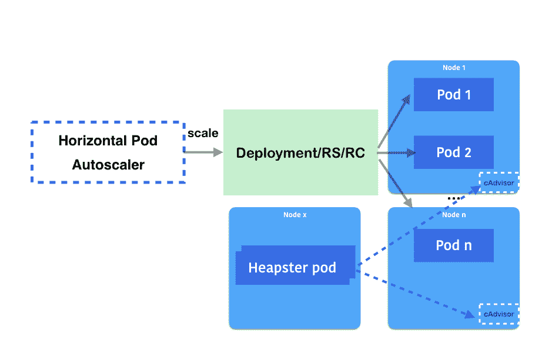
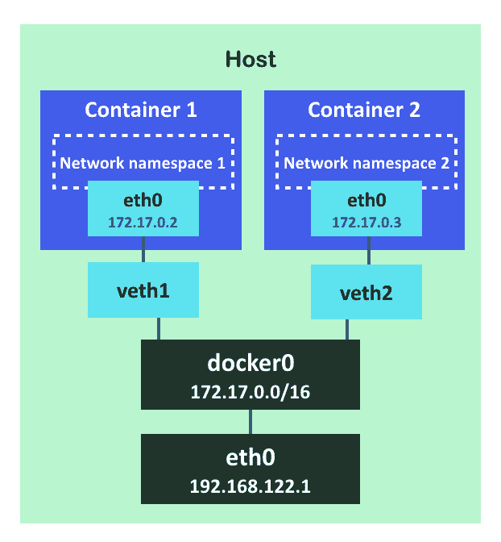
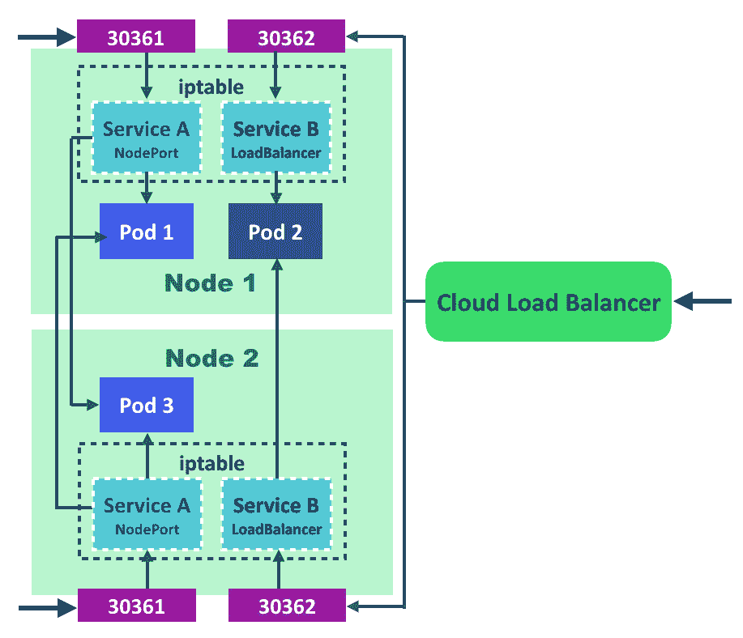
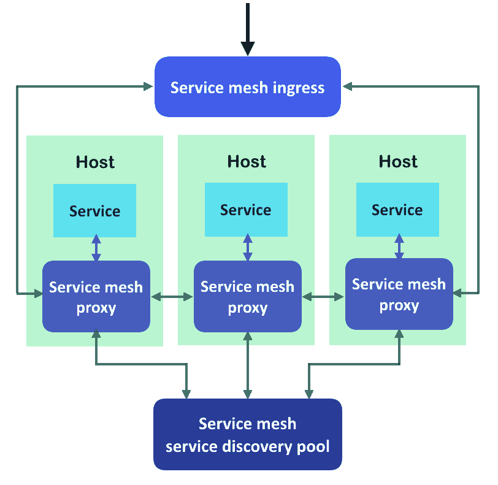
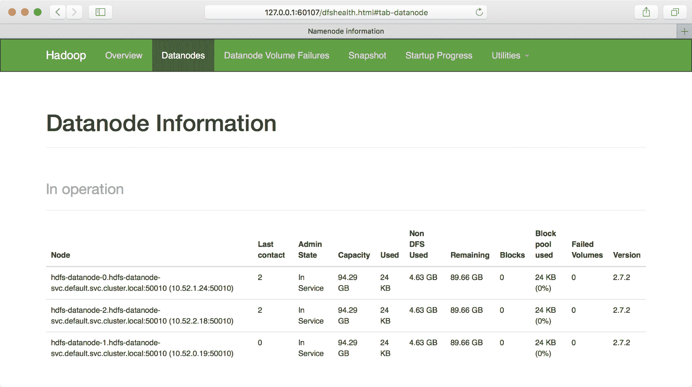
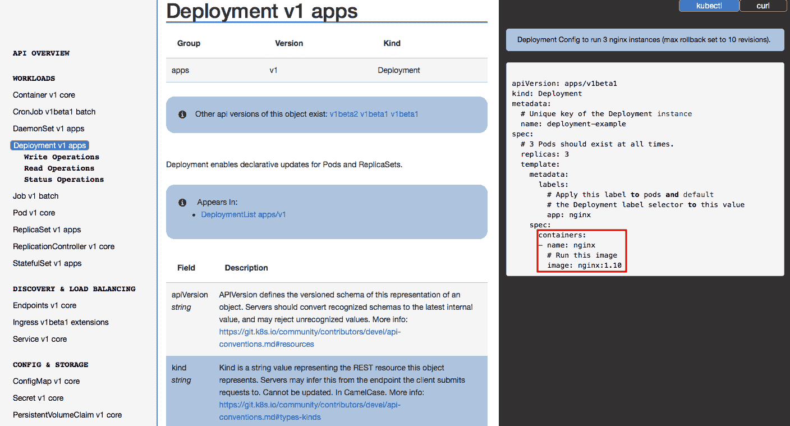
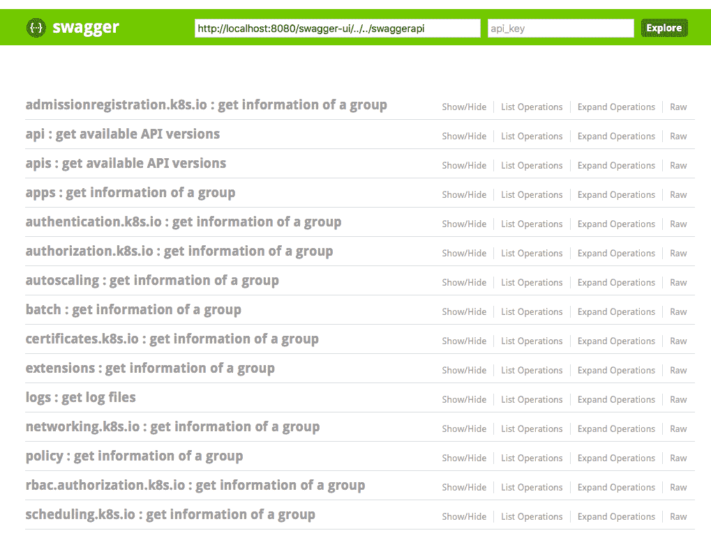

# 玩转容器

本章将介绍以下内容：

+   扩展你的容器

+   更新正在运行的容器

+   转发容器端口

+   确保容器的灵活使用

+   在 Kubernetes 上提交任务

+   配置文件操作

# 介绍

在谈论容器管理时，你需要了解与应用程序包管理（如`rpm`/`dpkg`）的一些区别，因为你可以在同一台机器上运行多个容器。你还需要注意网络端口冲突。本章将介绍如何使用 Kubernetes 更新、扩展和启动容器应用程序。

# 扩展你的容器

根据预定义标准对应用或服务进行扩展和缩减是利用计算资源的高效方式之一。在 Kubernetes 中，你可以手动扩展和缩减，也可以使用**水平 Pod 自动扩缩器**（**HPA**）来进行自动扩展。在本节中，我们将介绍如何执行这两种操作。

# 准备就绪

准备以下 YAML 文件，这是一个简单的 Deployment，启动两个`nginx`容器。同时，一个 NodePort 服务通过 TCP 暴露端口`30080`：

```
# cat 3-1-1_deployment.yaml
apiVersion: apps/v1
kind: Deployment
metadata:
  name: my-nginx
spec:
  replicas: 2
  selector:
    matchLabels:
      service : nginx
  template:
    metadata:
      labels:
        service : nginx
    spec:
      containers:
        - name: my-container
          image: nginx
---
apiVersion: v1
kind: Service
metadata:
  name: my-nginx
spec:
  ports:
    - protocol: TCP
      port: 80
      nodePort: 30080
  type: NodePort
  selector:
    service: nginx
```

`NodePort`会绑定到所有 Kubernetes 节点（端口范围：`30000`至`32767`）；因此，请确保`NodePort`没有被其他进程占用。

让我们使用`kubectl`来创建前述配置文件所用的资源：

```
// create deployment and service
# kubectl create -f 3-1-1_deployment.yaml
deployment "my-nginx" created
service "my-nginx" created
```

几秒钟后，我们应该能够看到`pods`已经被调度并且正在运行：

```
# kubectl get pods
NAME READY STATUS RESTARTS AGE
my-nginx-6484b5fc4c-9v7dc 1/1 Running 0 7s
my-nginx-6484b5fc4c-krd7p 1/1 Running 0 7s
```

服务也已启动：

```
# kubectl get services
NAME TYPE CLUSTER-IP EXTERNAL-IP PORT(S) AGE
kubernetes ClusterIP 10.96.0.1 <none> 443/TCP 20d
my-nginx NodePort 10.105.9.153 <none> 80:30080/TCP 59s
```

# 如何操作...

假设我们的服务在某个时间点会出现流量高峰。作为一名 DevOps 工程师，你可能希望在高峰时手动扩展服务，然后在流量高峰过后缩减服务。在 Kubernetes 中，我们可以使用`kubectl scale`命令来实现。或者，我们可以利用 HPA 根据计算资源条件或自定义指标自动进行扩展和缩减。

让我们看看如何在 Kubernetes 中手动和自动执行此操作。

# 使用`kubectl scale`命令手动扩展和缩减

假设今天我们想将`nginx` Pod 的数量从两个扩展到四个：

```
// kubectl scale --replicas=<expected_replica_num> deployment <deployment_name>
# kubectl scale --replicas=4 deployment my-nginx
deployment "my-nginx" scaled
```

让我们检查一下现在有多少个`pods`：

```
# kubectl get pods
NAME READY STATUS RESTARTS AGE
my-nginx-6484b5fc4c-9v7dc 1/1 Running 0 1m
my-nginx-6484b5fc4c-krd7p 1/1 Running 0 1m
my-nginx-6484b5fc4c-nsvzt 0/1 ContainerCreating 0 2s
my-nginx-6484b5fc4c-v68dr 1/1 Running 0 2s
```

我们可以发现两个 Pod 被调度了。一个已经在运行，另一个正在创建。最终，如果我们有足够的计算资源，我们将有四个 Pod 在运行。

`kubectl scale`（也包括`kubectl autoscale`！）同样支持**Replication Controller**（**RC**）和**Replica Set**（**RS**）。不过，推荐的方式是使用 Deployment 来部署 Pod。

我们也可以使用相同的`kubectl`命令进行缩减，只需将`replicas`参数设置为更低的值：

```
// kubectl scale –replicas=<expected_replica_num> deployment <deployment_name>
# kubectl scale --replicas=2 deployment my-nginx
deployment "my-nginx" scaled
```

现在，我们会看到两个 Pod 被调度以终止：

```
# kubectl get pods
NAME READY STATUS RESTARTS AGE
my-nginx-6484b5fc4c-9v7dc 1/1 Running 0 1m
my-nginx-6484b5fc4c-krd7p 1/1 Running 0 1m
my-nginx-6484b5fc4c-nsvzt 0/1 Terminating 0 23s
my-nginx-6484b5fc4c-v68dr 0/1 Terminating 0 23s
```

有一个选项，`--current-replicas`，它指定了期望的当前副本数。如果不匹配，Kubernetes 将不会执行扩展操作，如下所示：

```
// adding –-current-replicas to precheck the condistion for scaling.
# kubectl scale --current-replicas=3 --replicas=4 deployment my-nginx
error: Expected replicas to be 3, was 2
```

# 水平 Pod 自动扩缩器（HPA）

HPA 会定期查询指标来源，并根据获取到的指标由控制器决定是否需要扩展。可以获取的指标有两种：一种来自 Heapster（[`github.com/kubernetes/heapster`](https://github.com/kubernetes/heapster)），另一种来自 RESTful 客户端访问。在接下来的示例中，我们将展示如何使用 Heapster 监控 Pods 并将指标暴露给 HPA。

首先，Heapster 需要在集群中部署：

如果您正在运行 minikube，请使用`minikube addons enable heapster`命令在您的集群中启用 heapster。请注意，`minikube logs | grep heapster`命令也可以用来检查 heapster 的日志。

```
// at the time we're writing this book, the latest configuration file of heapster in kops is 1.7.0\. Check out https://github.com/kubernetes/kops/tree/master/addons/monitoring-standalone for the latest version when you use it. 
# kubectl create -f https://raw.githubusercontent.com/kubernetes/kops/master/addons/monitoring-standalone/v1.7.0.yaml
deployment "heapster" created
service "heapster" created
serviceaccount "heapster" created
clusterrolebinding "heapster" created
rolebinding "heapster-binding" created
```

检查`heapster` `pods`是否已经启动并运行：

```
# kubectl get pods --all-namespaces | grep heapster
kube-system heapster-56d577b559-dnjvn 2/2 Running 0 26m
kube-system heapster-v1.4.3-6947497b4-jrczl 3/3 Running 0 5d
```

假设我们紧接着*准备就绪*部分继续操作，我们将有两个`my-nginx` Pods 在我们的集群中运行：

```
# kubectl get pods
NAME READY STATUS RESTARTS AGE
my-nginx-6484b5fc4c-9v7dc 1/1 Running 0 40m
my-nginx-6484b5fc4c-krd7p 1/1 Running 0 40m
```

然后，我们可以使用`kubectl autoscale`命令来部署一个 HPA：

```
# kubectl autoscale deployment my-nginx --cpu-percent=50 --min=2 --max=5 
deployment "my-nginx" autoscaled 
# cat 3-1-2_hpa.yaml
apiVersion: autoscaling/v1
kind: HorizontalPodAutoscaler
metadata:
  name: my-nginx
spec:
  scaleTargetRef:
    kind: Deployment
    name: my-nginx
  minReplicas: 2
  maxReplicas: 5
  targetCPUUtilizationPercentage: 50
```

要检查它是否按预期运行：

```
// check horizontal pod autoscaler (HPA)
# kubectl get hpa
NAME REFERENCE TARGETS MINPODS MAXPODS REPLICAS AGE
my-nginx Deployment/my-nginx <unknown> / 50% 2 5 0 3s
```

我们发现目标显示为未知，副本数为 0。为什么会这样？它作为一个控制循环运行，默认间隔为 30 秒。可能会有延迟，直到它反映出真实的指标。

HPA 的默认同步周期可以通过更改控制管理器中的以下参数来修改：`--horizontal-pod-autoscaler-sync-period`。

等待几秒钟后，我们将发现当前的指标已经显示出来。目标列中显示的数字表示（`current / target`）。这意味着当前负载为`0%`，扩展目标是`50%`：

```
# kubectl get hpa
NAME REFERENCE TARGETS MINPODS MAXPODS REPLICAS AGE
my-nginx Deployment/my-nginx 0% / 50% 2 5 2 48m

// check details of a hpa
# kubectl describe hpa my-nginx
Name: my-nginx
Namespace: default
Labels: <none>
Annotations: <none>
CreationTimestamp: Mon, 15 Jan 2018 22:48:28 -0500
Reference: Deployment/my-nginx
Metrics: ( current / target )
  resource cpu on pods (as a percentage of request): 0% (0) / 50%
Min replicas: 2
Max replicas: 5
```

为了测试 HPA 是否能正确扩展 Pod，我们将手动生成一些负载到`my-nginx`服务：

```
// generate the load
# kubectl run -it --rm --restart=Never <pod_name> --image=busybox -- sh -c "while true; do wget -O - -q http://my-nginx; done"
```

在前面的命令中，我们运行了一个`busybox`镜像，它允许我们在上面运行简单的命令。我们使用`–c`参数指定了默认命令，即无限循环，以查询`my-nginx`服务。

大约一分钟后，您可以看到当前值发生了变化：

```
// check current value – it's 43% now. not exceeding scaling condition yet.
# kubectl get hpa
NAME REFERENCE TARGETS MINPODS MAXPODS REPLICAS AGE
my-nginx Deployment/my-nginx 43% / 50% 2 5 2 56m
```

使用相同的命令，我们可以反复运行不同 Pod 名称的负载。最后，我们看到条件已经满足，它正在将副本数扩展到`3`，然后是`4`：

```
# kubectl get hpa
NAME REFERENCE TARGETS MINPODS MAXPODS REPLICAS AGE
my-nginx Deployment/my-nginx 73% / 50% 2 5 3 1h

# kubectl get hpa
NAME REFERENCE TARGETS MINPODS MAXPODS REPLICAS AGE
my-nginx Deployment/my-nginx 87% / 50% 2 5 4 15m
Keeping observing it and deleting some busybox we deployed. It will eventually cool down and scale down without manual operation involved.
# kubectl get hpa
NAME REFERENCE TARGETS MINPODS MAXPODS REPLICAS AGE
my-nginx Deployment/my-nginx 40% / 50% 2 5 2 27m
```

我们可以看到，HPA 刚刚将我们的 Pods 从`4`缩放到`2`。

# 它是如何工作的...

请注意，cAdvisor 作为容器资源利用率监控服务，运行在每个节点的 kubelet 内部。我们刚才监控的 CPU 利用率是由 cAdvisor 收集的，并由 Heapster 汇总。Heapster 是一个在集群中运行的服务，用于监控和汇总指标。它从每个 cAdvisor 查询指标。当 HPA 部署后，控制器将持续观察 Heapster 报告的指标，并据此进行扩展和缩减。以下是该过程的示意图：



根据指定的指标，HPA 决定是否需要进行扩展

# 还有更多…

另外，你还可以使用自定义指标，如 Pod 指标或对象指标，来判断是否该进行扩展或缩减。Kubernetes 还支持多种指标，HPA 会按顺序考虑每一个指标。有关更多示例，请访问[`kubernetes.io/docs/tasks/run-application/horizontal-pod-autoscale`](https://kubernetes.io/docs/tasks/run-application/horizontal-pod-autoscale)。

# 另见

本教程描述了如何使用部署的扩展选项来更改 Pod 数量。这对于快速扩展和缩减你的应用非常有用。要了解更多关于如何更新容器的信息，请参考以下教程：

+   *更新实时容器* 在第三章，*与容器玩耍*

+   *确保容器灵活使用* 在第三章，*与容器玩耍*

# 更新实时容器

对于容器的好处，我们可以通过执行最新镜像来轻松发布新程序，减少环境设置的麻烦。但是，如何在运行中的容器上发布程序呢？在本地管理容器时，我们必须先停止正在运行的容器，然后才能启动使用最新镜像和相同配置的新容器。对于在 Kubernetes 系统中更新程序，有一些简单且高效的方法。一个方法叫做滚动更新，这意味着 Deployment 可以在不造成客户端停机的情况下更新其 Pods。另一个方法叫做*重建*，它会终止所有 Pods，然后创建一组新的 Pods。在本教程中，我们将演示如何应用这些解决方案。

在 Docker Swarm 中进行滚动更新为了实现零停机时间的应用更新，Docker Swarm 中有类似的管理功能。在 Docker Swarm 中，你可以利用命令 `docker service update` 配合 `--update-delay`、`--update-parallelism` 和 `--update-failure-action` 标志来进行管理。想要了解更多关于 Docker Swarm 滚动更新的信息，可以访问官方文档：[`docs.docker.com/engine/swarm/swarm-tutorial/rolling-update/`](https://docs.docker.com/engine/swarm/swarm-tutorial/rolling-update/)。

# 准备就绪

在接下来的演示中，我们将更新`nginx` Pods。请确保所有 Kubernetes 节点和组件都健康运行：

```
// check components
$ kubectl get cs
// check nodes
$ kubectl get node
```

此外，为了更好地理解 ReplicaSet 与 Deployment 之间的关系，请查阅*第二章*中的*Deployment API*部分，走进 Kubernetes 概念。

为了演示 Kubernetes 系统中容器的更新，我们将创建一个 Deployment，修改其应用配置，然后检查更新机制如何处理。让我们准备好所有资源：

```
// create a simple nginx Deployment with specified labels
$ kubectl run simple-nginx --image=nginx --port=80 --replicas=5 --labels="project=My-Happy-Web,role=frontend,env=test"
deployment.apps "simple-nginx" created
```

这个部署是使用`5`个副本创建的。通过这种方式，我们可以通过多个 Pod 来探索更新流程：

```
// expose the Deployment, and named the service "nginx-service"
$ kubectl expose deployment simple-nginx --port=8080 --target-port=80 --name="nginx-service"
service "nginx-service" exposed
// For minikube environment only, since Kubernetes is installed in a VM, add Service type as NodePort for accessing outside the VM.
$ kubectl expose deployment simple-nginx --port=8080 --target-port=80 --name="nginx-service" --type=NodePort service "nginx-service" exposed
```

在部署中附加一个服务有助于模拟客户的真实体验。

# 如何操作...

开始时，执行以下代码块查看你刚刚创建的 Deployment 及其 ReplicaSet：

```
$ kubectl describe deployment simple-nginx
Name:                   simple-nginx
Namespace:              default
CreationTimestamp:      Fri, 04 May 2018 12:14:21 -0400
Labels:                 env=test
                        project=My-Happy-Web
                        role=frontend
Annotations:            deployment.kubernetes.io/revision=1
Selector:               env=test,project=My-Happy-Web,role=frontend
Replicas:               5 desired | 5 updated | 5 total | 5 available | 0 unavailable
StrategyType:           RollingUpdate MinReadySeconds:        0
RollingUpdateStrategy:  1 max unavailable, 1 max surge
Pod Template:
  Labels:  env=test
           project=My-Happy-Web
           role=frontend
  Containers:
   simple-nginx:
    Image:        nginx
    Port:         80/TCP
    Environment:  <none>
    Mounts:       <none>
  Volumes:        <none>
Conditions:
  Type           Status  Reason
  ----           ------  ------
  Available      True    MinimumReplicasAvailable
  Progressing    True    NewReplicaSetAvailable
OldReplicaSets:  <none>
NewReplicaSet:   simple-nginx-585f6cddcd (5/5 replicas created)
Events:
  Type    Reason             Age   From                   Message
  ----    ------             ----  ----                   -------
  Normal  ScalingReplicaSet  1h    deployment-controller  Scaled up replica set simple-nginx-585f6cddcd to 5
// rs is the abbreviated resource key of replicaset
$ kubectl get rs
NAME                      DESIRED   CURRENT   READY     AGE
simple-nginx-585f6cddcd   5         5         5         1h
```

根据前面的输出，我们知道默认的部署更新策略是滚动更新。而且，随着 Deployment 创建，还会创建一个名为 `<Deployment 名称>-<十六进制哈希>` 的 ReplicaSet。

接下来，检查当前 Service 端点的内容，以便稍后验证我们的更新：

```
// record the cluster IP of Service "nginx-service"
$ export SERVICE_URL=$(kubectl get svc | grep nginx-service | awk '{print $3}'):8080

// For minikube environment only, record the VM host IP and port for the service
$ export SERVICE_URL=$(minikube service nginx-service --url)
$ curl $SERVICE_URL | grep "title"
<title>Welcome to nginx!</title>
```

我们将在 HTML 响应的标题中看到欢迎信息，并且使用原始的 `nginx` 镜像。

# 部署更新策略 – 滚动更新

以下将介绍子命令 `edit` 和 `set`，用于更新 Deployment 下的容器：

1.  首先，让我们使用新的命令更新 Deployment 中的 Pods：

```
// get into editor mode with the command below
// the flag "--record" is for recording the update
// add the command argument as below and save the change
$ kubectl edit deployment simple-nginx --record
spec:
  replicas: 5
  ...
  template:
    ...
    spec:
      containers:
      - image: nginx
 command:         - sh
 - -c - echo "Happy Programming with Kubernetes!" > /usr/share/nginx/html/index.html && service nginx stop && nginx -g "daemon off;"
        imagePullPolicy: Always
        ...
deployment.extensions "simple-nginx" edited
```

我们不仅仅是在做更新，我们还记录这个变化。使用 `--record` 标志，我们将命令行作为修订的标签保留。

1.  编辑 Deployment 后，立即检查滚动更新的状态，使用子命令 `rollout`：

```
// you may see different output on your screen, but definitely has the last line showing update successfully
$ kubectl rollout status deployment simple-nginx
Waiting for rollout to finish: 4 out of 5 new replicas have been updated...
Waiting for rollout to finish: 4 out of 5 new replicas have been updated...
Waiting for rollout to finish: 4 out of 5 new replicas have been updated...
Waiting for rollout to finish: 4 out of 5 new replicas have been updated...
Waiting for rollout to finish: 1 old replicas are pending termination...
Waiting for rollout to finish: 1 old replicas are pending termination...
Waiting for rollout to finish: 1 old replicas are pending termination...
Waiting for rollout to finish: 4 of 5 updated replicas are available...
deployment "simple-nginx" successfully rolled out
```

你可能会看到若干 `Waiting for …` 行，正如前面的代码所示。它们是标准输出，显示更新的状态。

1.  对于整个更新过程，检查 Deployment 的详细信息以列出其事件：

```
// describe the Deployment again
$ kubectl describe deployment simple-nginx
Name:                   simple-nginx
...
Events:
  Type    Reason             Age   From                   Message
  ----    ------             ----  ----                   -------
  Normal  ScalingReplicaSet  1h    deployment-controller  Scaled up replica set simple-nginx-585f6cddcd to 5
  Normal  ScalingReplicaSet  1h    deployment-controller  Scaled up replica set simple-nginx-694f94f77d to 1
  Normal  ScalingReplicaSet  1h    deployment-controller  Scaled down replica set simple-nginx-585f6cddcd to 4
  Normal  ScalingReplicaSet  1h    deployment-controller  Scaled up replica set simple-nginx-694f94f77d to 2
  Normal  ScalingReplicaSet  1h    deployment-controller  Scaled down replica set simple-nginx-585f6cddcd to 3
  Normal  ScalingReplicaSet  1h    deployment-controller  Scaled up replica set simple-nginx-694f94f77d to 3
  Normal  ScalingReplicaSet  1h    deployment-controller  Scaled down replica set simple-nginx-585f6cddcd to 2
  Normal  ScalingReplicaSet  1h    deployment-controller  Scaled up replica set simple-nginx-694f94f77d to 4
  Normal  ScalingReplicaSet  1h    deployment-controller  Scaled down replica set simple-nginx-585f6cddcd to 
  Normal  ScalingReplicaSet  1h    deployment-controller  Scaled up replica set simple-nginx-694f94f77d to 5
  Normal  ScalingReplicaSet  1h    deployment-controller  (combined from similar events): Scaled down replica set simple-nginx-585f6cddcd to 0
```

如你所见，`simple-nginx` 部署中创建了一个新的 `replica set simple-nginx-694f94f77d`。每当新的 ReplicaSet 成功扩展一个 Pod 时，旧的 ReplicaSet 会将一个 Pod 缩减。当新的 ReplicaSet 达到原定的 Pod 数量（如，`5` 个 Pod），且旧的 ReplicaSet 变为零个 Pod 时，扩展过程完成。

1.  继续检查此次更新的新的 ReplicaSet 和现有的 Service：

```
// look at the new ReplicaSet in detail, you will find it copied the labels of the old one
$ kubectl describe rs simple-nginx-694f94f77d
Name:           simple-nginx-694f94f77d
Namespace:      default
Selector:       env=test,pod-template-hash=2509509338,project=My-Happy-Web,role=frontend Labels:         env=test
                pod-template-hash=2509509338
                project=My-Happy-Web
                role=frontend
...
// send request to the same endpoint of Service.
$ curl $SERVICE_URL
Happy Programming with Kubernetes!
```

1.  让我们做另一次更新！这次，使用子命令 `set` 修改 Pod 的特定配置。

1.  要为 Deployment 中的某些容器设置新镜像，子命令的格式如下：`kubectl set image deployment <Deployment 名称> <Container 名称>=<镜像名称>`：

```
// change the image version with the subcommand "set"
// when describing the deployment, we can know that the container name is the same as the name of the Deployment
// record this change as well
$ kubectl set image deployment simple-nginx simple-nginx=nginx:stable --record
deployment.apps "simple-nginx" image updated
```

"set" 子命令还能帮助配置哪些内容？

set 子命令有助于定义应用程序的配置。直到版本 1.9，CLI 使用 set 可以分配或更新以下资源：

| **set 后的子命令** | **作用资源** | **更新项** |
| --- | --- | --- |
| `env` | Pod | 环境变量 |
| `image` | Pod | 容器镜像 |
| `resources` | Pod | 计算资源需求或限制 |
| `selector` | 任何资源 | 选择器 |
| `serviceaccount` | 任何资源 | ServiceAccount |
| `subject` | RoleBinding 或 ClusterRoleBinding | 用户、组或 ServiceAccount |

1.  现在，检查更新是否已完成，以及镜像是否已更改：

```
// check update status by rollout
$ kubectl rollout status deployment simple-nginx
...                                            
deployment "simple-nginx" successfully rolled out
// check the image of Pod in simple-nginx
$ kubectl describe deployment simple-nginx
Name:                   simple-nginx
...
Pod Template:
  Labels:  env=test
           project=My-Happy-Web
           role=frontend
  Containers:
   simple-nginx:
    Image:  nginx:stable
    Port:   80/TCP
    Host Port:  0/TCP
...
```

1.  你还可以查看 ReplicaSets。应该会有另一个负责管理 Pods 的 ReplicaSet：

```
$ kubectl get rs
NAME                      DESIRED   CURRENT   READY     AGE
simple-nginx-585f6cddcd   0         0         0         1h
simple-nginx-694f94f77d   0         0         0         1h
simple-nginx-b549cc75c    5         5         5         1h
```

# 回滚更新

Kubernetes 系统会记录每次 Deployment 的更新：

1.  我们可以使用子命令 `rollout` 列出所有修订：

```
// check the rollout history
$ kubectl rollout history deployment simple-nginx
deployments "simple-nginx"
REVISION  CHANGE-CAUSE
1         <none>
2         kubectl edit deployment simple-nginx --record=true
3         kubectl set image deployment simple-nginx simple-nginx=nginx:stable --record=true
```

对于`simple-nginx`部署，您将获得三个修订版本，就像前面的行一样。对于 Kubernetes 部署，每个修订版本都有一个匹配的`ReplicaSet`，并代表执行更新命令的一个阶段。第一个修订版本是`simple-nginx`的初始状态。虽然没有命令标签进行指示，但 Kubernetes 将其创建视为第一个版本。不过，在创建部署时，您仍然可以记录该命令。

1.  在子命令`create`或`run`后添加`--record`标志。

1.  通过修订版本，我们可以轻松恢复更改，即回滚更新。使用以下命令回滚到先前的修订版本：

```
// let's jump back to initial Deployment!
// with flag --to-revision, we can specify which revision for rollback processing
$ kubectl rollout undo deployment simple-nginx --to-revision=1
deployment.apps "simple-nginx"
// check if the rollback update is finished
$ kubectl rollout status deployment simple-nginx
...                                             
deployment "simple-nginx" successfully rolled out
// take a look at ReplicaSets, you will find that the old ReplicaSet takes charge of the business now
$ kubectl get rs
NAME                      DESIRED   CURRENT   READY     AGE
simple-nginx-585f6cddcd   5         5         5         4h
simple-nginx-694f94f77d   0         0         0         4h
simple-nginx-b549cc75c    0         0         0         3h
// go ahead and check the nginx webpage or the details of Deployment
$ curl $SERVICE_URL
$ kubectl describe deployment simple-nginx
```

1.  如果没有指定修订版本号，回滚过程将直接跳回到先前版本：

```
// just go back to previous status
$ kubectl rollout undo deployment simple-nginx
deployment.apps "simple-nginx"
// look at the ReplicaSets agin, now the latest one takes the job again
$ kubectl get rs
NAME                      DESIRED   CURRENT   READY     AGE
simple-nginx-585f6cddcd   0         0         0         4h
simple-nginx-694f94f77d   0         0         0         4h
simple-nginx-b549cc75c    5         5         5         4h
```

# 部署更新策略 – recreate

接下来，我们将介绍另一种更新策略，`recreate`，用于部署。虽然没有子命令或标志来创建`recreate`策略的部署，但用户可以通过覆盖默认元素并指定相应的配置来实现此创建：

```
// create a new Deployment, and override the update strategy.
$ kubectl run recreate-nginx --image=nginx --port=80 --replicas=5 --overrides='{"apiVersion": "apps/v1", "spec": {"strategy": {"type": "Recreate"}}}'
deployment.apps "recreate-nginx" created
// verify our new Deployment
$ kubectl describe deployment recreate-nginx
Name:               recreate-nginx
Namespace:          default
CreationTimestamp:  Sat, 05 May 2018 18:17:07 -0400
Labels:             run=recreate-nginx
Annotations:        deployment.kubernetes.io/revision=1
Selector:           run=recreate-nginx
Replicas:           5 desired | 5 updated | 5 total | 0 available | 5 unavailable
StrategyType:       Recreate ...
```

根据我们的理解，`recreate`模式适用于正在开发中的应用程序。在`recreate`模式下，Kubernetes 会将当前的 ReplicaSet 缩放至零个 Pod，然后创建一个具有所需 Pod 数量的新 ReplicaSet。因此，`recreate`比滚动更新（rolling-update）拥有更短的整体更新时间，因为它只是简单地缩放 ReplicaSet，一次性完成。由于开发中的部署不需要考虑用户体验，因此在更新过程中出现停机是可以接受的，同时可以享受更快的更新速度：

```
// try to update recreate-strategy Deployment
$ kubectl set image deployment recreate-nginx recreate-nginx=nginx:stable
deployment.apps "recreate-nginx" image updated
// check both the rollout status and the events of Deployment
$ kubectl rollout status deployment recreate-nginx
$ kubectl describe deployment recreate-nginx
...
Events:
  Type    Reason             Age   From                   Message
  ----    ------             ----  ----                   -------
  Normal  ScalingReplicaSet  3h    deployment-controller  Scaled up replica set recreate-nginx-9d5b69986 to 5
  Normal  ScalingReplicaSet  2h    deployment-controller  Scaled down replica set recreate-nginx-9d5b69986 to 0
  Normal  ScalingReplicaSet  2h    deployment-controller  Scaled up replica set recreate-nginx-674d7f9c7f to 5
```

# 它是如何工作的...

滚动更新作用于部署中的 ReplicaSet 单元。其效果是创建一个新的 ReplicaSet 来替代旧的 ReplicaSet。然后，新 ReplicaSet 将被扩展以满足所需的 Pod 数量，同时旧的 ReplicaSet 将缩减以终止其中的所有 Pod。新 ReplicaSet 中的 Pod 会附加到原始标签。因此，如果有任何服务暴露此部署，它将直接接管新创建的 Pods。

一个经验丰富的 Kubernetes 用户可能知道，资源 ReplicationController 也可以进行滚动更新。那么，ReplicationController 和部署之间的滚动更新有何不同呢？扩缩容处理使用的是 ReplicationController 与`kubectl`等客户端的组合。新的 ReplicationController 将被创建以替代旧的 ReplicationController。客户端在替换过程中不会感到任何中断，因为服务始终在 ReplicationController 前面。然而，开发者很难回滚到之前的 ReplicationController（因为它们已被删除），因为没有内置的机制来记录更新历史。

此外，如果在滚动更新过程中客户端连接被断开，滚动更新可能会失败。最重要的是，带有 ReplicaSet 的 Deployment 是比 ReplicationController 或独立 ReplicaSet 更推荐的部署资源。

在密切关注部署更新历史时，请注意它并不总是按顺序列出。添加修订版本的算法可以通过以下要点来说明：

+   以最后一个修订版本的编号为*N*

+   当新的滚动更新到来时，它将变为*N+1*

+   回滚到特定的修订版本号*X*，*X*将被删除，且它将变为*N+1*

+   回滚到上一个版本，即*N-1*，然后*N-1*将被删除，且它将变为*N+1*

通过这种修订管理，不会有过时或重叠的更新占用滚动历史记录。

# 还有更多...

考虑到部署更新，是构建 CI/CD（持续集成与持续交付）流水线的一个良好步骤。对于更常见的用法，开发者通常不会使用命令行来更新部署。相反，他们可能会选择从 CI/CD 平台发起 API 调用，或者从先前的配置文件中进行更新。以下是与子命令`apply`一起工作的示例：

```
// A simple nginx Kubernetes configuration file
$ cat my-update-nginx.yaml
apiVersion: apps/v1
kind: Deployment
metadata:
  name: my-update-nginx
spec:
  replicas: 5
  selector:
    matchLabels:
      run: simple-nginx
  template:
    metadata:
      labels:
        run: simple-nginx
    spec:
      containers:
      - name: simple-nginx
        image: nginx
        ports:
        - containerPort: 80

// create the Deployment by file and recording the command in the revision tag
$ kubectl create -f my-update-nginx.yaml --record
deployment.apps "my-update-nginx" created
```

作为演示，将容器镜像从`nginx`修改为`nginx:stable`（你可以查看代码包`my-update-nginx-updated.yaml`中的修改）。然后，我们可以使用更改后的文件通过子命令`apply`进行更新：

```
$ kubectl apply -f my-update-nginx-updated.yaml --record
Warning: kubectl apply should be used on resource created by either kubectl create --save-config or kubectl apply
deployment.apps "my-update-nginx" configured
// check the update revisions and status
$ kubectl rollout history deployment my-update-nginx
deployments "my-update-nginx"
REVISION  CHANGE-CAUSE
1         kubectl create --filename=my-update-nginx.yaml --record=true
2         kubectl apply --filename=my-update-nginx-updated.yaml --record=true
$ kubectl rollout status deployment my-update-nginx
deployment "my-update-nginx" successfully rolled out
```

现在，你可以学习另一种更新你的部署的方式。

深入了解 Deployment 的滚动更新时，我们可以利用一些参数来进行更新：

+   `minReadySeconds`：当 Pod 被认为已准备好后，系统仍然会等待一段时间才能进行下一步操作。这个时间段就是最小准备时间，这在等待应用完成后配置时非常有用。

+   `maxUnavailable`：更新期间可以不可用的最大 Pod 数。值可以是百分比（默认是 25%）或整数。如果`maxSurge`的值为`0`，表示不能容忍 Pod 数量超过期望数，那么`maxUnavailable`的值不能为`0`。

+   `maxSurge`：更新期间可以创建的超出期望 ReplicaSet 数量的最大 Pod 数。值可以是百分比（默认是 25%）或整数。如果`maxUnavailable`的值为`0`，表示服务中的 Pod 数应该始终符合期望值，那么`maxSurge`的值不能为`0`。

基于代码包中的配置文件`my-update-nginx-advanced.yaml`，你可以自己尝试操作这些参数，看看能否感受到它们的实际效果。

# 另见

你可以继续学习以下的配方，深入了解如何高效地部署 Kubernetes 资源：

+   扩展你的容器

+   使用配置文件

+   第五章中的*将单体应用迁移到微服务*，*与 Jenkins 集成*，*使用私有 Docker 镜像库*和*设置持续交付管道*的配方，*构建持续交付管道*

# 转发容器端口

在之前的章节中，你已经学会了如何使用 Kubernetes 服务来内部和外部转发容器端口。现在，是时候更进一步，了解它是如何工作的。

Kubernetes 中有四种网络模型，我们将在以下章节中详细探讨：

+   容器之间的通信

+   Pod 之间的通信

+   Pod 与服务的通信

+   外部到内部的通信

# 准备工作

在深入了解 Kubernetes 网络之前，我们先研究 Docker 的网络，以便理解基本概念。每个容器将拥有一个网络命名空间，具有自己的路由表和路由策略。默认情况下，网络桥接`docker0`连接物理网络接口和容器的虚拟网络接口，虚拟网络接口则是容器网络命名空间和主机网络命名空间之间的双向连接线。因此，单个容器有一对虚拟网络接口：容器内的以太网接口（**eth0**）和主机上的虚拟以太网接口（**veth-**）。

网络结构可以如以下图所示：



主机上的容器网络接口

什么是网络命名空间？网络命名空间是 Linux 内核提供的一种技术。通过这个特性，操作系统可以通过将网络能力分离为独立资源来实现网络虚拟化。每个网络命名空间都有自己的 iptables 设置和网络设备。

# 如何操作...

一个 Pod 包含一个或多个容器，这些容器运行在同一主机上。每个 Pod 在叠加网络上都有自己的 IP 地址；Pod 内的所有容器互相之间视为同一主机上的容器。Pod 内的容器将几乎同时创建、部署和删除。我们将展示容器、Pod 和服务之间的四种通信模型。

# 容器之间的通信

在这种场景中，我们将重点讨论单一 Pod 内容器之间的通信：

1.  让我们在一个 Pod 中创建两个容器：一个 nginx Web 应用和一个检查 localhost 上`80`端口的 CentOS 容器：

```
// configuration file of creating two containers within a pod
$ cat two-container-pod.yaml
apiVersion: v1
kind: Pod
metadata:
  name: two-container
spec:
  containers:
    - name: web
      image: nginx
      ports:
        - containerPort: 80
          hostPort: 80
    - name: centos
      image: centos
      command: ["/bin/sh", "-c", "while : ;do curl http://localhost:80/; sleep 30; done"]

// create the pod
$ kubectl create -f two-container-pod.yaml
pod "two-container" created
// check the status of the newly-created Pod
$ kubectl get pod two-container
NAME            READY     STATUS    RESTARTS   AGE
two-container   2/2       Running   0          5s
```

我们看到`READY`列中的计数变为`2/2`，因为这个 Pod 内有两个容器。

1.  使用`kubectl describe`命令，我们可以查看 Pod 的详细信息：

```
$ kubectl describe pod two-container
Name:         two-container
Namespace:    default
Node:         ubuntu02/192.168.122.102
Start Time:   Sat, 05 May 2018 18:28:22 -0400
Labels:       <none>
Annotations:  <none>
Status:       Running
IP:           192.168.79.198 Containers:
  web:
    Container ID:   docker://e832d294f176f643d604445096439d485d94780faf60eab7ae5d3849cbf15d75
...
  centos:
    Container ID:  docker://9e35275934c1acdcfac4017963dc046f9517a8c1fc972df56ca37e69d7389a72
...
```

我们可以看到 Pod 运行在节点`ubuntu02`上，且其 IP 地址是`192.168.79.198`。

1.  此外，我们可能会发现 Centos 容器能够访问 localhost 上的`nginx`：

```
$ kubectl logs two-container centos | grep "title"
<title>Welcome to nginx!</title>
...
```

1.  让我们登录到节点`ubuntu02`，检查这两个容器的网络设置：

```
// list containers of the Pod
$ docker ps | grep "two-container"
9e35275934c1        centos                                      "/bin/sh -c 'while..."   11 hours ago        Up 11 hours                             k8s_centos_two-container_default_113e727f-f440-11e7-ac3f-525400a9d353_0
e832d294f176        nginx                                       "nginx -g 'daemon ..."   11 hours ago        Up 11 hours                             k8s_web_two-container_default_113e727f-f440-11e7-ac3f-525400a9d353_0
9b3e9caf5149        gcr.io/google_containers/pause-amd64:3.1    "/pause"                 11 hours ago        Up 11 hours                             k8s_POD_two-container_default_113e727f-f440-11e7-ac3f-525400a9d353_0
```

现在，我们知道创建的两个容器是`9e35275934c1`和`e832d294f176`。另一方面，还有一个容器`9b3e9caf5149`，是由 Kubernetes 创建的，使用 Docker 镜像`gcr.io/google_containers/pause-amd64`。我们稍后会介绍它。之后，我们可以通过命令`docker inspect`对容器进行详细检查，并通过将命令`jq`([`stedolan.github.io/jq/`](https://stedolan.github.io/jq/))作为管道添加，可以解析输出信息，仅显示网络设置。

1.  看一下同一 Pod 中的两个容器：

```
// inspect the nginx container, and use jq to parse it
$ docker inspect e832d294f176 | jq '.[]| {NetworkMode: .HostConfig.NetworkMode, NetworkSettings: .NetworkSettings}'
{
  "NetworkMode": "container:9b3e9caf5149ffb0ec14c1ffc36f94b2dd55b223d0d20e4d48c4e33228103723",
  "NetworkSettings": {
    "Bridge": "",
    "SandboxID": "",
    "HairpinMode": false,
    "LinkLocalIPv6Address": "",
    "LinkLocalIPv6PrefixLen": 0,
    "Ports": {},
    "SandboxKey": "",
    "SecondaryIPAddresses": null,
    "SecondaryIPv6Addresses": null,
    "EndpointID": "",
    "Gateway": "",
    "GlobalIPv6Address": "",
    "GlobalIPv6PrefixLen": 0,
    "IPAddress": "",
    "IPPrefixLen": 0,
    "IPv6Gateway": "",
    "MacAddress": "",
    "Networks": {}
  }
}
// then inspect the centos one
$ docker inspect 9e35275934c1 | jq '.[]| {NetworkMode: .HostConfig.NetworkMode, NetworkSettings: .NetworkSettings}'
{
  "NetworkMode": "container:9b3e9caf5149ffb0ec14c1ffc36f94b2dd55b223d0d20e4d48c4e33228103723",
...
```

我们可以看到两个容器具有相同的网络设置；网络模式设置为映射容器模式，其他配置被清理。网络桥接容器是`container:9b3e9caf5149ffb0ec14c1ffc36f94b2dd55b223d0d20e4d48c4e33228103723`。这个容器是什么？它是 Kubernetes 创建的，容器 ID 为`9b3e9caf5149`，镜像为`gcr.io/google_containers/pause-amd64`。

“暂停”容器做什么？正如其名称所示，这个容器什么也不做，只是“暂停”。然而，它保留了 Pod 的网络设置和 Linux 网络命名空间。每次容器关闭并重新启动时，网络配置仍然保持不变，无需重新创建，因为“暂停”容器保存了它。你可以在[`github.com/kubernetes/kubernetes/tree/master/build/pause`](https://github.com/kubernetes/kubernetes/tree/master/build/pause)查看其代码和 Dockerfile，了解更多信息。

“暂停”容器是一个网络容器，当 Pod 创建时会生成它。

它被创建并用于处理 Pod 网络的路由。然后，两个容器将与暂停容器共享网络命名空间；这就是它们彼此视为 localhost 的原因。

在 Docker 中创建网络容器：你可以轻松地将容器转换为网络容器，与另一个容器共享网络命名空间。使用命令行：`$ docker run --network=container:<CONTAINER_ID 或 CONTAINER_NAME> [其他选项]`。然后，你就能够启动一个使用指定容器网络命名空间的容器。

# Pod 到 Pod 的通信

如前所述，Pod 中的容器共享相同的网络命名空间。Pod 是 Kubernetes 中的基本计算单元。Kubernetes 为 Pod 分配一个 IP，在其网络中，每个 Pod 都可以通过虚拟 IP 看到其他 Pod。谈到 Pod 之间的通信时，我们可以分为两种情况：在同一节点内通信的 Pod，或者跨节点通信的 Pod。对于单节点中的 Pod，由于它们有独立的 IP，它们的传输可以通过桥接完成，类似于 Docker 节点中的容器。然而，对于跨节点的 Pod 之间的通信，当 Pod 没有主机信息（主机 IP）时，如何进行包路由？

Kubernetes 使用 CNI 来处理集群网络。CNI 是一个用于管理连接容器的框架，负责为容器分配或删除网络资源。Kubernetes 将 CNI 作为插件，用户可以根据需要选择 CNI 的实现。常见的 CNI 类型包括以下几种：

+   **覆盖网络**：采用数据包封装技术。每个数据都被包装上主机 IP，因此可以在互联网上进行路由。一个例子是 flannel ([`github.com/coreos/flannel`](https://github.com/coreos/flannel))。

+   **L3 网关**：容器之间的传输首先经过一个网关节点。该网关会维护路由表，将容器子网与主机 IP 映射。一个例子是 Project Calico ([`www.projectcalico.org/`](https://www.projectcalico.org/))。

+   **L2 邻接**：发生在 L2 交换层。在以太网中，两个节点如果数据包可以直接从源节点传输到目标节点，而无需经过其他节点，则认为它们是邻接的。一个例子是 Cisco ACI ([`www.cisco.com/c/en/us/td/docs/switches/datacenter/aci/apic/sw/kb/b_Kubernetes_Integration_with_ACI.html`](https://www.cisco.com/c/en/us/td/docs/switches/datacenter/aci/apic/sw/kb/b_Kubernetes_Integration_with_ACI.html))。

每种 CNI 类型都有优缺点。前面列出的类型具有更好的可扩展性，但性能较差，而后者则具有更短的延迟，但需要复杂且定制化的设置。有些 CNI 在不同模式下涵盖了所有三种类型，例如 Contiv ([`github.com/contiv/netplugin`](https://github.com/contiv/netplugin))。您可以通过查看其规格了解更多有关 CNI 的信息，网址为：[`github.com/containernetworking/cni`](https://github.com/containernetworking/cni)。此外，还可以查看 Kubernetes 官方网站上的 CNI 列表，尝试这些 CNI：[`kubernetes.io/docs/concepts/cluster-administration/networking/#how-to-achieve-this`](https://kubernetes.io/docs/concepts/cluster-administration/networking/#how-to-achieve-this)。

在介绍了 Pod 之间数据包传输的基础知识后，我们将继续为您带来一个 Kubernetes API，`NetworkPolicy`，它提供了 Pod 之间通信的高级管理功能。

# 与 NetworkPolicy 一起工作

作为 Kubernetes 的资源，NetworkPolicy 使用标签选择器来配置 Pod 的防火墙，作用于基础设施层面。如果没有指定 NetworkPolicy，集群中的任何 Pod 默认都可以相互通信。另一方面，一旦将带有规则的 NetworkPolicy 附加到 Pod，无论是针对入口流量还是出口流量，或两者兼有，所有不符合规则的流量都将被阻止。

在演示如何构建 NetworkPolicy 之前，我们需要确保 Kubernetes 集群中的网络插件支持它。有几种 CNI 支持 NetworkPolicy：Calico、Contive、Romana ([`github.com/romana/kube`](https://github.com/romana/kube))，Weave Net ([`github.com/weaveworks/weave`](https://github.com/weaveworks/weave))，Trireme ([`github.com/aporeto-inc/trireme-kubernetes`](https://github.com/aporeto-inc/trireme-kubernetes))，等等。

在 minikube 中启用 CNI 并支持 NetworkPolicy 作为网络插件。在使用 minikube 时，用户不需要特别附加 CNI，因为它设计为单节点本地 Kubernetes。但是，为了启用 NetworkPolicy 的功能，必须启动一个支持 NetworkPolicy 的 CNI。需要注意的是，在配置 minikube 时，不同的 CNI 实现可能会有不同的配置选项和步骤。以下步骤展示了如何使用 CNI 和 Calico 启动 minikube：

1.  我们参考这个问题[`github.com/projectcalico/calico/issues/1013#issuecomment-325689943`](https://github.com/projectcalico/calico/issues/1013#issuecomment-325689943)来进行这些构建步骤。

1.  这里使用的 minikube 是最新版本 0.24.1。

1.  重启你的 minikube：`minikube start --network-plugin=cni \`

    `--host-only-cidr 172.17.17.1/24 \ --extra-config=kubelet.PodCIDR=192.168.0.0/16 \ --extra-config=proxy.ClusterCIDR=192.168.0.0/16 \` `--extra-config=controller-manager.ClusterCIDR=192.168.0.0/16`。

1.  使用代码包中的配置文件“minikube-calico.yaml”创建 Calico：`kubectl create -f minikube-calico.yaml`。

为了说明 NetworkPolicy 的功能，我们将创建一个 Pod 并将其暴露为服务，然后在 Pod 上附加一个 NetworkPolicy，看看会发生什么：

```
// start a pod of our favourite example, nginx
$ kubectl run nginx-pod --image=nginx --port=80 --restart=Never
pod "nginx-pod" created
//expose the pod as a service listening on port 8080
$ kubectl expose pod nginx-pod --port=8080 --target-port=80
service "nginx-pod" exposed
// check the service IP
$ kubectl get svc
NAME         TYPE        CLUSTER-IP       EXTERNAL-IP   PORT(S)    AGE
kubernetes   ClusterIP   10.96.0.1        <none>        443/TCP    1h
nginx-pod    ClusterIP   10.102.153.182   <none>        8080/TCP   1m
```

现在，我们可以继续检查来自简单部署`busybox`的 Pod 连接，使用`wget`命令并带上`--spider`标志来验证端点是否存在：

```
// check the accessibility of the service
// create busybox and open standard input and independent terminal by flag "i" and "t", similar to docker command
$ kubectl run busybox -it --image=busybox /bin/sh
If you don't see a command prompt, try pressing enter.
/ # wget --spider 10.102.153.182:8080
Connecting to 10.102.153.182:8080 (10.102.153.182:8080)
```

如前面的结果所示，我们知道`nginx`服务可以在没有任何限制的情况下访问。接下来，我们将运行一个`NetworkPolicy`，限制只有标签为`<test: inbound>`的 Pod 才能访问`nginx`服务：

```
// a configuration file defining NetworkPolicy of pod nginx-pod
$ cat networkpolicy.yaml
kind: NetworkPolicy
apiVersion: networking.k8s.io/v1
metadata:
  name: nginx-networkpolicy
spec:
  podSelector:
    matchLabels:
      run: nginx-pod
  ingress:
    - from:
      - podSelector:
          matchLabels:
            test: inbound
```

如你所见，在 NetworkPolicy 的 spec 中，它被配置为应用于标签为`<run: nginx-pod>`的 Pod，而我们在`pod nginx-pod`上正好有这个标签。此外，策略中还附加了一个入站规则，表示只有具有特定标签的 Pod 才能访问`nginx-pod`：

```
// create the NetworkPolicy
$ kubectl create -f networkpolicy.yaml
networkpolicy.networking.k8s.io "nginx-networkpolicy" created
// check the details of NetworkPolicy
$ kubectl describe networkpolicy nginx-networkpolicy
Name:         nginx-networkpolicy
Namespace:    default
Created on:   2018-05-05 18:36:56 -0400 EDT
Labels:       <none>
Annotations:  <none>
Spec:
  PodSelector:     run=nginx-pod
  Allowing ingress traffic:
    To Port: <any> (traffic allowed to all ports)
    From PodSelector: test=inbound
  Allowing egress traffic:
    <none> (Selected pods are isolated for egress connectivity)
  Policy Types: Ingress
```

很好，一切看起来如我们所预期的那样。接下来，检查之前的`busybox` Pod 上的相同服务端点：

```
// if you turned off the terminal, resume it with the subcommand attach
$ kubectl attach busybox-598b87455b-s2mfq -c busybox -i -t
// we add flag to specify timeout interval, otherwise it will just keep hanging on wget
/ # wget --spider 10.102.153.182:8080 --timeout=3
wget: download timed out
```

如预期的那样，附加 NetworkPolicy 后，我们无法访问`nginx-pod`服务。`nginx-pod`只能被标签为`<test: inbound>`的 Pod 访问：

```
// verify the connection by yourself with new busybox
$ kubectl run busybox-labelled --labels="test=inbound" -it --image=busybox /bin/sh
```

在第二章*，《Kubernetes 概念概览》*中，通过*《与标签和选择器的工作》*一节，了解标签和选择器的概念。

在这种情况下，您已学习如何通过 Pod 选择器创建一个带有入口限制的 NetworkPolicy。仍然，您可能希望在 Pod 上进行其他设置：

+   **出口限制**：出口规则可以通过`.spec.egress`进行设置，其配置方式与入口类似。

+   **端口限制**：每个入口和出口规则可以指明要接受或阻止的端口和端口协议。端口配置可以通过`.spec.ingress.ports`或`.spec.egress.ports`进行设置。

+   **命名空间选择器**：我们还可以对特定的命名空间设置限制。例如，系统守护进程的 Pods 可能只允许访问`kube-system`命名空间中的其他 Pod。命名空间选择器可以通过`.spec.ingress.from.namespaceSelector`或`.spec.egress.to.namespaceSelector`进行应用。

+   **IP 封锁**：一种更定制化的配置是对特定的 CIDR 范围设置规则，这与我们在 iptables 中使用的想法类似。我们可以通过`.spec.ingress.from.ipBlock`或`.spec.egress.to.ipBlock`来利用此配置。

建议查阅 API 文档中的更多详细信息：[`kubernetes.io/docs/reference/generated/kubernetes-api/v1.10/#networkpolicyspec-v1-networking`](https://kubernetes.io/docs/reference/generated/kubernetes-api/v1.10/#networkpolicyspec-v1-networking)。此外，我们还将展示一些有趣的设置，以满足常见的情况：

+   **应用于所有 Pod**：通过将`.spec.podSelector`设置为空值，可以轻松将 NetworkPolicy 推送到每个 Pod。

+   **允许所有流量**：我们可以通过将`.spec.ingress`设置为空值（空数组）来允许所有传入流量；同样，通过将`.spec.egress`设置为空值，可以不加任何限制地允许所有的传出流量。

+   **拒绝所有流量**：我们可以通过简单地指明 NetworkPolicy 的类型而不设置任何规则，来拒绝所有的传入或传出流量。NetworkPolicy 的类型可以在`.spec.policyTypes`中设置。同时，不设置`.spec.ingress`或`.spec.egress`。

请检查代码包中的示例文件`networkpolicy-allow-all.yaml`和`networkpolicy-deny-all.yaml`。

# Pod 与 Service 的通信

在普通情况下，Pods 可能会意外停止。然后，Pod 的 IP 可能会发生变化。当我们暴露一个 Pod 或 Deployment 的端口时，我们会创建一个 Kubernetes Service，它充当代理或负载均衡器。Kubernetes 会创建一个虚拟 IP，接收来自客户端的请求并将流量代理到 Service 中的 Pods。让我们回顾一下如何操作：

1.  首先，我们将创建一个 Deployment 并将其暴露为一个 Service：

```
$ cat nodeport-deployment.yaml
apiVersion: apps/v1
kind: Deployment
metadata:
  name: nodeport-deploy
spec:
  replicas: 2
  selector:
    matchLabels:
      app: nginx
  template:
    metadata:
      labels:
        app: nginx
    spec:
      containers:
      - name: my-nginx
        image: nginx
---
apiVersion: v1
kind: Service
metadata:
  name: nodeport-svc
spec:
  type: NodePort
  selector:
    app: nginx
  ports:
    - protocol: TCP
      port: 8080
      targetPort: 80
$ kubectl create -f nodeport-deployment.yaml
deployment.apps "nodeport-deploy" created
service "nodeport-svc" created
```

1.  此时，请使用子命令`describe`检查 Service 的详细信息：

```
$ kubectl describe service nodeport-svc
Name:                     nodeport-svc
Namespace:                default
Labels:                   <none>
Annotations:              <none>
Selector:                 app=nginx
Type:                     NodePort
IP:                       10.101.160.245
Port:                     <unset>  8080/TCP
TargetPort:               80/TCP
NodePort:                 <unset>  30615/TCP
Endpoints:                192.168.80.5:80,192.168.80.6:80
Session Affinity:         None
External Traffic Policy:  Cluster
Events:                   <none>
```

该服务的虚拟 IP 是`10.101.160.245`，暴露了端口`8080`。然后，服务将流量分发到两个端点`192.168.80.5:80`和`192.168.80.6:80`。此外，由于服务是以`NodePort`类型创建的，客户端可以通过每个 Kubernetes 节点的`<NODE_IP>:30615`访问此服务。正如我们在第二章《走进 Kubernetes 概念》中对*与服务一起工作*的理解，实际上是 Kubernetes 守护进程`kube-proxy`帮助在每个节点上维护和更新路由策略。

1.  继续检查任何 Kubernetes 节点上的`iptable`：

注意！如果你在 minikube 环境中，应该使用命令`minikube ssh`进入节点。

```
// Take a look at following marked "Chain"
$ sudo iptables -t nat -nL
...
Chain KUBE-NODEPORTS (1 references)
target     prot opt source               destination
KUBE-MARK-MASQ  tcp  --  0.0.0.0/0            0.0.0.0/0            /* default/nodeport-svc: */ tcp dpt:30615
KUBE-SVC-GFPAJ7EGCNM4QF4H  tcp  --  0.0.0.0/0            0.0.0.0/0            /* default/nodeport-svc: */ tcp dpt:30615
...
Chain KUBE-SEP-DIS6NYZTQKZ5ALQS (1 references)
target     prot opt source               destination
KUBE-MARK-MASQ  all  --  192.168.80.6         0.0.0.0/0            /* default/nodeport-svc: */
DNAT       tcp  --  0.0.0.0/0            0.0.0.0/0            /* default/nodeport-svc: */ tcp to:192.168.80.6:80
...
Chain KUBE-SEP-TC6HXYYMMLGUSFNZ (1 references)
target     prot opt source               destination
KUBE-MARK-MASQ  all  --  192.168.80.5         0.0.0.0/0            /* default/nodeport-svc: */
DNAT       tcp  --  0.0.0.0/0            0.0.0.0/0            /* default/nodeport-svc: */ tcp to:192.168.80.5:80
Chain KUBE-SERVICES (2 references)
target     prot opt source               destination
...
KUBE-SVC-GFPAJ7EGCNM4QF4H  tcp  --  0.0.0.0/0            10.101.160.245       /* default/nodeport-svc: cluster IP */ tcp dpt:8080
...
KUBE-NODEPORTS  all  --  0.0.0.0/0            0.0.0.0/0            /* kubernetes service nodeports; NOTE: this must be the last rule in this chain */ ADDRTYPE match dst-type LOCAL
...
Chain KUBE-SVC-GFPAJ7EGCNM4QF4H (2 references)
target     prot opt source               destination
KUBE-SEP-TC6HXYYMMLGUSFNZ  all  --  0.0.0.0/0            0.0.0.0/0            /* default/nodeport-svc: */ statistic mode random probability 0.50000000000
KUBE-SEP-DIS6NYZTQKZ5ALQS  all  --  0.0.0.0/0            0.0.0.0/0            /* default/nodeport-svc: */
...
```

会有很多规则显示出来。为了专注于与服务`nodeport-svc`相关的策略，请按照以下步骤检查所有规则。屏幕上的输出可能不会按预期的顺序列出：

1.  在链`KUBE-NODEPORTS`下查找带有注释`nodeport-svc`的目标。一个目标将以`KUBE-SVC-`为前缀命名。在前面的输出中，它是名为`KUBE-SVC-GFPAJ7EGCNM4QF4H`的目标。与另一个目标`KUBE-MARK-MASQ`一起，它们负责将端口`30615`上的流量转发到服务。

1.  在`Chain KUBE-SERVICES`下查找名为`KUBE-SVC-XXX`的特定目标。在这个案例中，它是名为`KUBE-SVC-GFPAJ7EGCNM4QF4H`的目标，规定允许来自“任何地方”的流量到达`nodeport-svc`的端点`10.160.245:8080`。

1.  在特定的`Chain KUBE-SVC-XXX`下查找目标。在此案例中，它是`Chain KUBE-SVC-GFPAJ7EGCNM4QF4H`。在服务链下，您将根据相应的 Pods 有多个目标，目标的前缀为`KUBE-SEP-`。在前面的输出中，它们是`KUBE-SEP-TC6HXYYMMLGUSFNZ`和`KUBE-SEP-DIS6NYZTQKZ5ALQS`。

1.  在特定的`Chain KUBE-SEP-YYY`下查找目标。在这个案例中，两个需要查看的链是`Chain KUBE-SEP-TC6HXYYMMLGUSFNZ`和`Chain KUBE-SEP-DIS6NYZTQKZ5ALQS`。它们各自包含两个目标，`KUBE-MARK-MASQ`和`DNAT`，用于处理从“任何地方”到 Pod 端点 `192.168.80.5:80` 或 `192.168.80.6:80` 的进出流量。

这里的一个关键点是，服务目标`KUBE-SVC-GFPAJ7EGCNM4QF4H`将其集群 IP 暴露到外部世界，并将流量转发到链`KUBE-SEP-TC6HXYYMMLGUSFNZ`和`KUBE-SEP-DIS6NYZTQKZ5ALQS`，并以随机概率 0.5 作为统计模式。两个链都有 DNAT 目标，负责将数据包的目标 IP 更改为特定 Pod 所在的私有子网 IP。

# 外部到内部的通信

为了在 Kubernetes 中发布应用程序，我们可以利用 Kubernetes Service，类型为 `NodePort` 或 `LoadBalancer`，或者 Kubernetes Ingress。对于 NodePort 服务，如前一节介绍的那样，节点的端口号会与 Service 配对。如下图所示，节点 1 和节点 2 上的端口 `30361` 指向 Service A，该 Service 会将流量调度到 Pod1 和一个具有静态概率的 Pod。

LoadBalancer Service，正如你在 第二章*“与 Services 一起工作”*中学到的内容，包含了 NodePort 的配置。此外，LoadBalancer Service 可以与外部负载均衡器一起工作，为用户提供在云基础设施与 Kubernetes 资源之间集成负载均衡过程的功能，例如 `healthCheckNodePort` 和 `externalTrafficPolicy` 的设置。下图中的 **Service B** 是一个 LoadBalancer Service。在内部，**Service B** 和 **Service A** 的工作方式相同，依赖 **iptables** 将数据包重定向到 Pod；在外部，云负载均衡器并不认识 Pod 或容器，它只是根据节点的数量分配流量。无论选择哪个节点来接收请求，它依然能将数据包传递到正确的 Pod。



Kubernetes 的 NodePort 类型和 LoadBalancer 类型 Services

# 使用 Ingress

在走访 Kubernetes 网络的过程中，用户会意识到每个 Pod 和 Service 都有自己的私有 IP 和相应的端口来监听请求。在实际应用中，开发人员可能会为内部客户端提供服务的端点、私有 IP 或 Kubernetes DNS 名称；或者，开发人员可能会通过 NodePort 或 LoadBalancer 类型将 Services 暴露给外部。尽管 Service 的端点比 Pod 更稳定，但 Services 是单独提供的，客户端应该记录这些 IP 地址，尽管这些 IP 对它们没有太大意义。在本节中，我们将介绍 `Ingress`，一种可以使你的 Services 作为一个整体工作的资源。更重要的是，我们可以轻松地将服务集打包成一个 API 服务器，同时设置 Ingress 规则来识别不同的 URL，然后 Ingress 控制器根据这些规则将请求转发到特定的 Services。

在我们尝试 Kubernetes Ingress 之前，我们应在集群中创建一个 ingress controller。与`kube-controller-manager`([`kubernetes.io/docs/reference/generated/kube-controller-manager/`](https://kubernetes.io/docs/reference/generated/kube-controller-manager/))中的其他控制器不同，ingress controller 是通过自定义实现运行的，而不是作为守护进程工作。在最新的 Kubernetes 版本 1.10 中，nginx ingress controller 是最稳定的，并且通常支持许多平台。有关部署的详细信息，请参见官方文档：[`github.com/kubernetes/ingress-nginx/blob/master/README.md`](https://github.com/kubernetes/ingress-nginx/blob/master/README.md)。我们只会在 minikube 上演示我们的示例；请查看以下信息框以了解 ingress controller 的设置。

在 minikube 中启用 Ingress 功能：Ingress 在 minikube 中是一个附加功能。按照以下步骤在你的环境中启动此功能：

1.  检查附加的 Ingress 是否启用：在终端执行命令`minikube addons list`。如果未启用，显示为`ingress: disabled`，则应按照以下步骤继续操作。

1.  启用 ingress：输入命令`minikube addons enable ingress`，你将看到类似`ingress was successfully enabled`的输出。

1.  再次检查附加组件列表，以验证上一步是否生效。我们期望 ingress 字段显示为`enabled`。

下面是一个示例，演示如何与 Ingress 配合使用。我们将运行两个 Deployment 及其对应的 Service，并创建一个额外的 Ingress，将它们作为一个联合体暴露出来。一开始，我们将在 Kubernetes master 的主机文件中添加一个新主机名。这是一个简单的演示方法。如果你在生产环境中工作，一般的使用案例是将主机名作为记录添加到 DNS 服务器中：

```
// add a dummy hostname in local host file
$ sudo sh -c "echo `minikube ip` happy.k8s.io >> /etc/hosts"
```

我们的第一个 Kubernetes Deployment 和 Service 将是 `echoserver`，这是一个显示服务器和请求信息的虚拟 Service。对于另一对 Deployment 和 Service，我们将重用前一节中的 NodePort Service 示例：

```
$ cat echoserver.yaml
apiVersion: apps/v1
kind: Deployment
metadata:
  name: echoserver-deploy
spec:
  replicas: 2
  selector:
    matchLabels:
      app: echo
  template:
    metadata:
      labels:
        app: echo
    spec:
      containers:
        - name: my-echo
          image: gcr.io/google_containers/echoserver:1.8
---
apiVersion: v1
kind: Service
metadata:
  name: echoserver-svc
spec:
  selector:
    app: echo
  ports:
    - protocol: TCP
      port: 8080
      targetPort: 8080
```

继续通过配置文件创建两组资源：

```
$ kubectl create -f echoserver.yaml
deployment.apps "echoserver-deploy" created
service "echoserver-svc" created
$ kubectl create -f nodeport-deployment.yaml
deployment.apps "nodeport-deploy" created
service "nodeport-svc" created
```

我们的第一个 Ingress 创建了两个在不同 URL `/nginx` 和 `/echoserver` 上监听的 Service，主机名为 `happy.k8s.io`，这是我们在本地主机文件中添加的虚拟主机。我们使用注解 `rewrite-target` 来确保流量重定向从根目录`/`开始。否则，客户端可能会因为路径错误而无法找到页面。我们可能会使用的更多注解列在[`github.com/kubernetes/ingress-nginx/blob/master/docs/user-guide/nginx-configuration/annotations.md`](https://github.com/kubernetes/ingress-nginx/blob/master/docs/user-guide/nginx-configuration/annotations.md)：

```
$ cat ingress.yaml
apiVersion: extensions/v1beta1
kind: Ingress
metadata:
  name: happy-ingress
  annotations:
 nginx.ingress.kubernetes.io/rewrite-target: spec:
  rules:
    - host: happy.k8s.io
      http:
        paths:
          - path: /nginx
            backend:
              serviceName: nodeport-svc
              servicePort: 8080
          - path: /echoserver
            backend:
              serviceName: echoserver-svc
              servicePort: 8080
```

然后，创建 Ingress 并立即检查其信息：

```
$ kubectl create -f ingress.yaml
ingress.extensions "happy-ingress" created
// "ing" is the abbreviation of "ingress"
$ kubectl describe ing happy-ingress
Name:             happy-ingress
Namespace:        default
Address:
Default backend:  default-http-backend:80 (172.17.0.3:8080)
Rules:
  Host          Path  Backends
  ----          ----  --------
  happy.k8s.io
                /nginx        nodeport-svc:8080 (<none>)
                /echoserver   echoserver-svc:8080 (<none>)
Annotations:
  nginx.ingress.kubernetes.io/rewrite-target
Events:
  Type    Reason  Age   From                Message
  ----    ------  ----  ----                -------
  Normal  CREATE  14s   ingress-controller  Ingress default/happy-ingress
```

你可能会发现描述字段中没有 IP 地址。它将在第一次进行 DNS 查找后附加上来：

```
// verify the URL set in ingress rules
$ curl http://happy.k8s.io/nginx
...
<title>Welcome to nginx!</title>
...
$ curl http://happy.k8s.io/echoserver
Hostname: echoserver-deploy-5598f5796f-d8cr4
Pod Information:
     -no pod information available-
Server values:
     server_version=nginx: 1.13.3 - lua: 10008
...
// the IP address would be added after connection
$ kubectl get ing
NAME            HOSTS          ADDRESS        PORTS     AGE
happy-ingress   happy.k8s.io   192.168.64.4   80        1m
```

尽管与 Ingress 一起使用并不像其他资源那样直接，因为你需要自己启动 Ingress 控制器实现，但它仍然使我们的应用得以暴露并具有灵活性。许多更稳定、用户友好的网络功能正在到来。跟上最新的更新，享受其中的乐趣吧！

# 还有更多...

在外部到内部通信的最后部分，我们了解了 Kubernetes Ingress——这个使服务协同工作并将请求调度到目标服务的资源。有没有什么类似的想法浮现在你脑海中？它听起来像是一个微服务架构，多个松耦合的服务组成的应用结构。一个复杂的应用会分布到多个较轻量的服务中。每个服务独立开发，同时都可以覆盖原有功能。像 Kubernetes 中的 Pods 等大量工作单元运行时是波动的，且可以由系统控制器在服务之间动态调度。然而，这种多层次的结构增加了网络的复杂性，并且可能带来额外的开销。

外部负载均衡器并不了解 Pods 的存在；它们只会将工作负载平衡到主机。如果某个主机上没有正在运行的服务 Pod，那么它会将负载重定向到其他主机。这种情况可能不符合用户对公平负载均衡的预期。而且，Pod 可能会意外崩溃，在这种情况下，进行故障转移并完成请求会变得非常困难。为弥补这些不足，专注于微服务网络管理的服务网格思想应运而生，旨在为像 Kubernetes 这样的编排系统提供更可靠和高效的通信：



简单的服务网格结构

上述图表展示了服务网格中的主要组件。它们协同工作，达成如下功能：

+   **服务网格 Ingress**：使用应用的 Ingress 规则来决定哪个服务应该处理传入的请求。它也可以是一个能够检查运行时策略的代理。

+   **服务网格代理**：每个节点上的代理不仅仅是引导数据包，还可以作为一个咨询代理，报告服务的整体状态。

+   **服务网格服务发现池**：为网格提供中央管理并推动对代理的控制。它的职责包括网络能力、身份验证、故障转移和负载均衡等过程。

尽管像 Linkerd ([`linkerd.io`](https://linkerd.io)) 和 Istio ([`istio.io`](https://istio.io)) 这样的知名服务网格实现还不成熟，尚未适合生产环境使用，但服务网格的理念不可忽视。

# 另见

Kubernetes 基于覆盖网络进行端口转发。在本章中，我们还使用 nginx 运行 Pods 和 Services。回顾前面的章节将帮助你更好地理解如何操作它。同时，看看以下的示例：

+   第一章中的*创建覆盖网络*和*在 Kubernetes 中运行你的第一个容器*教程，**构建你自己的 Kubernetes 集群**

+   第二章中的*与 Pods 的工作*和*与 Services 的工作*教程，**深入了解 Kubernetes 概念**

+   第五章中的*将单体应用迁移到微服务*教程，**构建持续交付管道**

# 确保容器的灵活使用

在 Kubernetes 中，Pod 指一组容器，它也是最小的计算单元。你可能已经在之前的教程中了解了 Pod 的基本用法。Pod 通常由 deployments 管理，并通过 services 暴露；在这种场景中，它们作为应用程序运行。

在本教程中，我们将讨论两个新特性：**DaemonSets**和**StatefulSets**。这两个特性可以管理具有更具体目的的 Pods。

# 准备工作

什么是**Daemon-like Pod**和**Stateful Pod**？Kubernetes 中的常规 Pod 将根据当前节点的资源使用情况和你的配置，确定并调度到特定的 Kubernetes 节点。

然而，**Daemon-like Pod**将在每个节点上创建。例如，如果你有三个节点，三个 Daemon-like Pods 将被创建并部署到每个节点上。每当添加新节点时，DaemonSets Pod 会自动部署到新节点。因此，它对于使用节点级别监控或日志收集非常有用。

另一方面，**Stateful Pod**会绑定到一些资源，如网络标识符（Pod 名称和 DNS）和**持久卷**（**PV**）。这也保证了在多个 Pod 的部署过程中以及滚动更新时的顺序。例如，如果你部署一个名为`my-pod`的 Pod，并将规模设置为**4**，那么 Pod 的名称将被分配为`my-pod-0`、`my-pod-1`、`my-pod-2`和`my-pod-3`。不仅 Pod 名称，DNS 和持久卷也会得到保留。例如，当`my-pod-2`由于资源短缺或应用崩溃被重新创建时，这些名称和卷将由一个新的 Pod 接管，并且这个 Pod 也会命名为`my-pod-2`。它对于一些基于集群的应用，如 HDFS 和 ElasticSearch，尤其有用。

在这个教程中，我们将演示如何使用 DaemonSets 和 StatefulSet；然而，为了更好地理解，建议使用多个 Kubernetes 节点的环境。为了实现这一点，minikube 并不理想，因此，建议使用 kubeadm/kubespray 来创建多节点环境。

使用 kubeadm 或 kubespray 设置 Kubernetes 集群的过程在第一章《构建你的 Kubernetes 集群》中有描述。

要确认是否有两个或更多节点，可以输入`kubectl get nodes`，如下所示，以检查你有多少个节点：

```
//this result indicates you have 2 nodes
$ kubectl get nodes
NAME          STATUS    ROLES         AGE       VERSION
node1         Ready     master,node   6h        v1.10.2
node2         Ready     node          6h        v1.10.2
```

此外，如果你想在本章稍后执行 StatefulSet 配方，你需要一个 StorageClass 来设置动态供应环境。它在 第二章 *处理存储卷* 部分中有描述，*了解 Kubernetes 概念*。建议使用公共云服务，如 AWS 和 GCP，并配置 CloudProvider；这将在 第六章 *在 AWS 上构建 Kubernetes* 和 第七章 *在 GCP 上构建 Kubernetes* 中进行详细描述。

要检查是否已配置 `StorageClass`，请使用 `kubectl get sc`：

```
//in Google Kubernetes Engine Environment
$ kubectl get sc
NAME                 PROVISIONER
standard (default)   kubernetes.io/gce-pd
```

# 如何操作...

我们没有 CLI 用于创建 DaemonSets 或 StatefulSets。因此，我们将通过编写 YAML 文件中的所有配置来构建这两种资源类型。

# Pod 作为 DaemonSets

如果创建了 Kubernetes DaemonSet，定义的 Pod 将会在每个节点上部署。确保每个节点上的运行容器占用相等的资源。在这种情况下，容器通常作为守护进程运行。

例如，以下模板包含一个 Ubuntu 镜像容器，该容器每半分钟检查一次其内存使用情况：

1.  要将其构建为 DaemonSet，请执行以下代码块：

```
$ cat daemonset-free.yaml
apiVersion: apps/v1
kind: DaemonSet
metadata:
  name: ram-check
spec:
  selector:
    matchLabels:
      name: checkRam
  template:
    metadata:
      labels:
        name: checkRam
    spec:
      containers:
      - name: ubuntu-free
        image: ubuntu
        command: ["/bin/bash","-c","while true; do free; sleep 30; done"]
      restartPolicy: Always
```

如同作业一样，选择器可以被忽略，但它会获取标签的值。我们将始终将 DaemonSet 的重启策略配置为 `Always`，确保每个节点都有一个 Pod 运行。

1.  `daemonset` 在 `kubectl` 命令中的缩写是 `ds`，为了方便，在 CLI 中使用这个简短的命令：

```
$ kubectl create -f daemonset-free.yaml
daemonset.apps "ram-check" created

$ kubectl get ds
NAME        DESIRED   CURRENT   READY     UP-TO-DATE   AVAILABLE   NODE SELECTOR   AGE
ram-check   2         2         2         2            2           <none>          5m
```

1.  在这里，我们有两个 Pods 运行在分开的节点上。它们仍然可以在 `pod` 渠道中被识别：

```
$ kubectl get pods -o wide
NAME              READY     STATUS    RESTARTS   AGE       IP               NODE
ram-check-6ldng   1/1       Running   0          9m        10.233.102.130   node1
ram-check-ddpdb   1/1       Running   0          9m        10.233.75.4      node2
```

1.  使用子命令 `kubectl logs` 评估结果是很好的：

```
$ kubectl logs ram-check-6ldng
              total        used        free      shared  buff/cache   available
Mem:        3623848      790144      329076        9128     2504628     2416976
Swap:             0           0           0
              total        used        free      shared  buff/cache   available
Mem:        3623848      786304      328028        9160     2509516     2420524
Swap:             0           0           0
              total        used        free      shared  buff/cache   available
Mem:        3623848      786344      323332        9160     2514172     2415944
Swap:             0           0           0
.
.
```

每当你将一个 Kubernetes 节点添加到现有集群时，DaemonSets 会自动识别并部署一个 Pod。

1.  让我们再次检查当前 DaemonSets 的状态，以下是由于有两个节点而部署的两个 Pods：

```
$ kubectl get ds
NAME        DESIRED   CURRENT   READY     UP-TO-DATE   AVAILABLE   NODE SELECTOR   AGE
ram-check   2         2         2         2            2           <none>          14m

$ kubectl get nodes
NAME          STATUS    ROLES         AGE       VERSION
node1         Ready     master,node   6h        v1.10.2
node2         Ready     node          6h        v1.10.2
```

1.  所以，现在我们通过 `kubespray` 或 `kubeadm` 添加一个新的节点到集群中，具体取决于你的设置：

```
$ kubectl get nodes
NAME          STATUS    ROLES         AGE       VERSION
node1         Ready     master,node   6h        v1.10.2
node2         Ready     node          6h        v1.10.2
node3         Ready     node          3m        v1.10.2
```

1.  几分钟后，DaemonSet 的大小自动变为 `3`，与节点的数量一致：

```
$ kubectl get ds
NAME        DESIRED   CURRENT   READY     UP-TO-DATE   AVAILABLE   NODE SELECTOR   AGE
ram-check   3         3         3         3            3           <none>          18m

$ kubectl get pods -o wide
NAME              READY     STATUS    RESTARTS   AGE       IP               NODE
ram-check-6ldng   1/1       Running   0          18m       10.233.102.130   node1
ram-check-ddpdb   1/1       Running   0          18m       10.233.75.4      node2
ram-check-dpdmt   1/1       Running   0          3m        10.233.71.0      node3
```

# 运行有状态的 Pod

让我们来看另一个使用场景。我们使用 Deployments/ReplicaSets 来复制 Pods。它扩展得很好且易于维护，Kubernetes 使用 Pod 的 IP 地址为 Pod 分配一个 DNS，例如 `<Pod IP 地址>.<namespace>.pod.cluster.local`。

以下示例展示了如何分配 Pod 的 DNS：

```
$ kubectl run apache2 --image=httpd --replicas=3
deployment "apache2" created

//one of Pod has an IP address as 10.52.1.8
$ kubectl get pods -o wide
NAME                       READY     STATUS    RESTARTS   AGE       IP          NODE
apache2-55c684c66b-7m5zq   1/1       Running   0          5s        10.52.1.8   gke-chap7-default-pool-64212da9-z96q
apache2-55c684c66b-cjkcz   1/1       Running   0          1m        10.52.0.7   gke-chap7-default-pool-64212da9-8gzm
apache2-55c684c66b-v78tq   1/1       Running   0          1m        10.52.2.5   gke-chap7-default-pool-64212da9-bbs6

//another Pod can reach to 10-52-1-8.default.pod.cluster.local $ kubectl exec apache2-55c684c66b-cjkcz -- ping -c 2 10-52-1-8.default.pod.cluster.local
PING 10-52-1-8.default.pod.cluster.local (10.52.1.8): 56 data bytes
64 bytes from 10.52.1.8: icmp_seq=0 ttl=62 time=1.642 ms
64 bytes from 10.52.1.8: icmp_seq=1 ttl=62 time=0.322 ms
--- 10-52-1-8.default.pod.cluster.local ping statistics ---
2 packets transmitted, 2 packets received, 0% packet loss
round-trip min/avg/max/stddev = 0.322/0.982/1.642/0.660 ms 
```

然而，这个 DNS 条目并不保证会一直用于这个 Pod，因为 Pod 可能由于应用错误或节点资源不足而崩溃。在这种情况下，IP 地址可能会改变：

```
$ kubectl delete pod apache2-55c684c66b-7m5zq
pod "apache2-55c684c66b-7m5zq" deleted

//Pod IP address has been changed to 10.52.0.7
$ kubectl get pods -o wide
NAME                       READY     STATUS        RESTARTS   AGE       IP          NODE
apache2-55c684c66b-7m5zq   0/1       Terminating   0          1m        <none>      gke-chap7-default-pool-64212da9-z96q
apache2-55c684c66b-cjkcz   1/1       Running       0          2m        10.52.0.7   gke-chap7-default-pool-64212da9-8gzm
apache2-55c684c66b-l9vqt   1/1       Running       0          7s        10.52.1.9   gke-chap7-default-pool-64212da9-z96q
apache2-55c684c66b-v78tq   1/1       Running       0          2m        10.52.2.5   gke-chap7-default-pool-64212da9-bbs6

//DNS entry also changed
$ kubectl exec apache2-55c684c66b-cjkcz -- ping -c 2 10-52-1-8.default.pod.cluster.local
PING 10-52-1-8.default.pod.cluster.local (10.52.1.8): 56 data bytes
92 bytes from gke-chap7-default-pool-64212da9-z96q.c.kubernetes-cookbook.internal (192.168.2.4): Destination Host Unreachable
92 bytes from gke-chap7-default-pool-64212da9-z96q.c.kubernetes-cookbook.internal (192.168.2.4): Destination Host Unreachable
--- 10-52-1-8.default.pod.cluster.local ping statistics ---
2 packets transmitted, 0 packets received, 100% packet loss
```

对于某些应用程序，这会导致问题；例如，如果您管理一个需要通过 DNS 或 IP 地址管理的集群应用程序。根据当前 Kubernetes 的实现，Pod 的 IP 地址不能被保留。那我们如何使用 Kubernetes 服务呢？服务可以保留 DNS 名称。不幸的是，创建与 Pod 相同数量的服务并不现实。在之前的情况下，创建三个服务，每个服务与三个 Pod 一一绑定。

Kubernetes 针对这种使用场景有一个解决方案，那就是使用 **StatefulSet**。它不仅保留 DNS，还保留持久卷，以确保绑定到相同的 Pod。即使 Pod 崩溃，StatefulSet 也能保证将相同的 DNS 和持久卷绑定到新 Pod。请注意，当前的 Kubernetes 实现并不会保留 IP 地址。

为了演示，使用 **Hadoop 分布式文件系统** (**HDFS**) 启动一个 NameNode 和三个 DataNode。为此，使用来自 [`hub.docker.com/r/uhopper/hadoop/`](https://hub.docker.com/r/uhopper/hadoop/) 的 Docker 镜像，该镜像包含 NameNode 和 DataNode 镜像。此外，从 [`gist.github.com/polvi/34ef498a967de563dc4252a7bfb7d582`](https://gist.github.com/polvi/34ef498a967de563dc4252a7bfb7d582) 借用 YAML 配置文件 `namenode.yaml` 和 `datanode.yaml`，并稍作修改：

1.  让我们为 `namenode` 和 `datanode` 启动一个服务和 StatefulSet：

```
//create NameNode
$ kubectl create -f https://raw.githubusercontent.com/kubernetes-cookbook/second-edition/master/chapter3/3-4/namenode.yaml 
service "hdfs-namenode-svc" created
statefulset "hdfs-namenode" created

$ kubectl get statefulset
NAME            DESIRED   CURRENT   AGE
hdfs-namenode   1         1         19s

$ kubectl get pods
NAME              READY     STATUS    RESTARTS   AGE
hdfs-namenode-0   1/1       Running   0          26s

//create DataNodes
$ kubectl create -f https://raw.githubusercontent.com/kubernetes-cookbook/second-edition/master/chapter3/3-4/datanode.yaml 
statefulset "hdfs-datanode" created

$ kubectl get statefulset
NAME            DESIRED   CURRENT   AGE
hdfs-datanode   3         3         50s
hdfs-namenode   1         1         5m

$ kubectl get pods
NAME              READY     STATUS    RESTARTS   AGE
hdfs-datanode-0   1/1       Running   0          9m
hdfs-datanode-1   1/1       Running   0          9m
hdfs-datanode-2   1/1       Running   0          9m
hdfs-namenode-0   1/1       Running   0          9m
```

如您所见，Pod 的命名约定是 `<StatefulSet-name>-<sequence number>`。例如，NameNode Pod 的名称是 `hdfs-namenode-0`。DataNode Pod 的名称分别是 `hdfs-datanode-0`、`hdfs-datanode-1` 和 `hdfs-datanode-2`。

此外，NameNode 和 DataNode 都配置为无头模式的服务（通过 `spec.clusterIP: None`）。因此，您可以使用 DNS 通过 `<pod-name>.<service-name>.<namespace>.svc.cluster.local` 来访问这些 Pods。在这种情况下，NameNode 的 DNS 条目可能是 `hdfs-namenode-0.hdfs-namenode-svc.default.svc.cluster.local`*。

1.  让我们检查 NameNode Pod 的 IP 地址，您可以使用 `kubectl get pods -o wide` 来获取，如下所示：

```
//Pod hdfs-namenode-0 has an IP address as 10.52.2.8
$ kubectl get pods hdfs-namenode-0 -o wide
NAME              READY     STATUS    RESTARTS   AGE       IP          NODE
hdfs-namenode-0   1/1       Running   0          9m        10.52.2.8   gke-chapter3-default-pool-97d2e17c-0dr5

```

1.  接下来，使用 `kubectl exec` 登录（运行 `/bin/bash`）到其中一个 DataNode，解析该 DNS 名称并检查 IP 地址是否为 `10.52.2.8`：

```
$ kubectl exec hdfs-datanode-1 -it -- /bin/bash
root@hdfs-datanode-1:/#
root@hdfs-datanode-1:/# ping -c 1 hdfs-namenode-0.hdfs-namenode-svc.default.svc.cluster.local
PING hdfs-namenode-0.hdfs-namenode-svc.default.svc.cluster.local (10.52.2.8): 56 data bytes
...
...
```

一切看起来都好！为了演示，我们访问 HDFS Web 控制台查看 DataNode 的状态。

1.  为此，使用 `kubectl port-forward` 访问 NameNode 的 Web 端口（tcp/`50070`）：

```
//check the status by HDFS web console
$ kubectl port-forward hdfs-namenode-0 :50070
Forwarding from 127.0.0.1:60107 -> 50070
```

1.  上述结果表明，您本地机器的 TCP 端口 `60107`（您的结果可能不同）已经转发到 NameNode Pod 的 TCP 端口 `50070`。因此，您可以通过网页浏览器访问 `http://127.0.0.1:60107/`，如以下所示：



HDFS Web 控制台显示三个 DataNode

如您所见，三个 DataNode 已成功注册到 NameNode。DataNode 也使用了无头服务，因此相同的命名约定为 DataNode 分配了 DNS 名称。

# 它是如何工作的...

DaemonSets 和 StatefulSets：这两个概念相似，但行为不同，尤其是在 Pod 崩溃时。我们来看看它是如何工作的。

# 通过 DaemonSets 恢复 Pod

DaemonSets 会持续监控每个 Kubernetes 节点，因此当 Pod 崩溃时，DaemonSets 会在同一 Kubernetes 节点上重新创建它。

为了模拟这一过程，请返回到 DaemonSets 示例并使用`kubectl delete pods`手动删除`node1`上的现有 Pod，如下所示：

```
$ kubectl delete pod ram-check-6ldng
pod "ram-check-6ldng" deleted

$ kubectl get pods -o wide
NAME              READY     STATUS        RESTARTS   AGE       IP               NODE
ram-check-6ldng   1/1       Terminating 0          29m       10.233.102.132   node1
ram-check-ddpdb   1/1       Running       0          29m       10.233.75.5      node2
ram-check-dpdmt   1/1       Running       0          13m       10.233.71.0      node3

$ kubectl get pods -o wide
NAME              READY     STATUS    RESTARTS   AGE       IP               NODE
ram-check-ddpdb   1/1       Running   0          30m       10.233.75.5      node2
ram-check-dh5hq   1/1       Running   0          24s       10.233.102.135   node1 ram-check-dpdmt   1/1       Running   0          14m       10.233.71.0      node3
```

如您所见，新的 Pod 已自动创建，以恢复`node1`中的 Pod。请注意，Pod 名称已从`ram-check-6ldng`更改为`ram-check-dh5hq`——它已被分配了一个随机的后缀名称。在这个用例中，Pod 名称并不重要，因为我们没有使用主机名或 DNS 来管理这个应用程序。

# 通过 StatefulSet 恢复 Pod

StatefulSet 在 Pod 重建时与 DaemonSet 行为不同。在 StatefulSet 管理的 Pod 中，Pod 的名称始终是按顺序分配的，如`hdfs-datanode-0`、`hdfs-datanode-1`和`hdfs-datanode-2`，如果删除其中一个，新的 Pod 将继承相同的 Pod 名称。

为了模拟这一过程，让我们删除一个 DataNode（`hdfs-datanode-1`），看看 StatefulSet 如何重新创建 Pod：

```
$ kubectl get pods
NAME              READY     STATUS    RESTARTS   AGE
hdfs-datanode-0   1/1       Running   0          3m
hdfs-datanode-1   1/1       Running   0          2m
hdfs-datanode-2   1/1       Running   0          2m
hdfs-namenode-0   1/1       Running   0          23m

//delete DataNode-1
$ kubectl delete pod hdfs-datanode-1
pod "hdfs-datanode-1" deleted

//DataNode-1 is Terminating
$ kubectl get pods
NAME              READY     STATUS        RESTARTS   AGE
hdfs-datanode-0   1/1       Running       0          3m
hdfs-datanode-1   1/1       Terminating   0          3m
hdfs-datanode-2   1/1       Running       0          2m
hdfs-namenode-0   1/1       Running       0          23m

//DataNode-1 is recreating automatically by statefulset 
$ kubectl get pods
NAME              READY     STATUS              RESTARTS   AGE
hdfs-datanode-0   1/1       Running             0          4m
hdfs-datanode-1   0/1       ContainerCreating   0          16s
hdfs-datanode-2   1/1       Running             0          3m
hdfs-namenode-0   1/1       Running             0          24m

//DataNode-1 is recovered
$ kubectl get pods
NAME              READY     STATUS    RESTARTS   AGE
hdfs-datanode-0   1/1       Running   0          4m
hdfs-datanode-1   1/1       Running   0          22s
hdfs-datanode-2   1/1       Running   0          3m
hdfs-namenode-0   1/1       Running   0          24m
```

如您所见，相同的 Pod 名称（`hdfs-datanode-1`）已被分配。大约 10 分钟后（由于 HDFS 的心跳间隔），HDFS web 控制台显示旧 Pod 已标记为死亡，而新 Pod 处于服务中状态，如下所示：


一个 DataNode 挂掉时的状态

请注意，这对 HDFS 来说并不是一个完美的理想情况，因为 DataNode-1 丢失了数据，并期望从其他 DataNode 重新同步。如果数据量较大，重新同步可能需要很长时间才能完成。

幸运的是，StatefulSets 具有一个功能，可以在替换 Pod 时保留持久存储卷。我们来看看 HDFS DataNode 在 Pod 重建时如何保持数据。

# 还有更多内容...

带持久存储卷的 StatefulSet；它需要一个动态分配存储卷的`StorageClass`。由于每个 Pod 都是由 StatefulSet 创建的，因此它会创建一个具有不同标识符的**持久卷声明**（**PVC**）。如果您的 StatefulSets 指定了 PVC 的静态名称，多个 Pod 尝试附加同一个 PVC 时会出现问题。

如果您的集群中有`StorageClass`，请更新`datanode.yaml`，并添加`spec.volumeClaimTemplates`，如下所示：

```
$ curl https://raw.githubusercontent.com/kubernetes-cookbook/second-edition/master/chapter3/3-4/datanode-pv.yaml
...
  volumeClaimTemplates:
  - metadata:
      name: hdfs-data
    spec:
      accessModes: [ "ReadWriteOnce" ]
      resources:
        requests:
          storage: 10Gi
```

这告诉 Kubernetes 在 StatefulSet 创建新 Pod 时创建 PVC 和 PV。因此，Pod 模板（`spec.template.spec.containers.volumeMounts`）应指定`hdfs-data`，如下所示：

```
$ curl https://raw.githubusercontent.com/kubernetes-cookbook/second-edition/master/chapter3/3-4/datanode-pv.yaml
...
          volumeMounts:
          - mountPath: /hadoop/dfs/data
            name: hdfs-data
```

让我们再次重建 HDFS 集群：

```
//delete DataNodes
$ kubectl delete -f https://raw.githubusercontent.com/kubernetes-cookbook/second-edition/master/chapter3/3-4/datanode.yaml
service "hdfs-datanode-svc" deleted
statefulset "hdfs-datanode" deleted

//delete NameNode
$ kubectl delete -f https://raw.githubusercontent.com/kubernetes-cookbook/second-edition/master/chapter3/3-4/namenode.yaml 
service "hdfs-namenode-svc" deleted
statefulset "hdfs-namenode" deleted

//create NameNode again
$ kubectl create -f https://raw.githubusercontent.com/kubernetes-cookbook/second-edition/master/chapter3/3-4/namenode.yaml
service "hdfs-namenode-svc" created
statefulset "hdfs-namenode" created

//create DataNode which uses Persistent Volume (datanode-pv.yaml)
$ kubectl create -f https://raw.githubusercontent.com/kubernetes-cookbook/second-edition/master/chapter3/3-4/datanode-pv.yaml
service "hdfs-datanode-svc" created
statefulset "hdfs-datanode" created

//3 PVC has been created automatically
$ kubectl get pvc
NAME STATUS VOLUME CAPACITY ACCESS MODES STORAGECLASS AGE
hdfs-data-hdfs-datanode-0 Bound pvc-bc79975d-f5bd-11e7-ac7a-42010a8a00ef 10Gi RWO standard 53s
hdfs-data-hdfs-datanode-1 Bound pvc-c753a336-f5bd-11e7-ac7a-42010a8a00ef 10Gi RWO standard 35s
hdfs-data-hdfs-datanode-2 Bound pvc-d1e10587-f5bd-11e7-ac7a-42010a8a00ef 10Gi RWO standard 17s

```

为了演示，使用`kubectl exec`访问 NameNode，然后将一些虚拟文件复制到 HDFS：

```
$ kubectl exec -it hdfs-namenode-0 -- /bin/bash
root@hdfs-namenode-0:/# hadoop fs -put /lib/x86_64-linux-gnu/* /
root@hdfs-namenode-0:/# exit
command terminated with exit code 255

//delete DataNode-1
$ kubectl delete pod hdfs-datanode-1
pod "hdfs-datanode-1" deleted
```

此时，`DataNode-1`正在重新启动，如下图所示。然而，`DataNode-1`的数据目录由 PVC 保持为`hdfs-data-hdfs-datanode-1`。新的 Pod `hdfs-datanode-1`将再次继承该 PVC：


StatefulSet 在重启时会保留 PVC/PV

因此，当 `hdfs-datanode-1` 恢复后，你访问 HDFS 时，不会看到任何数据丢失或重新同步过程：

```
$ kubectl exec -it hdfs-namenode-0 -- /bin/bash
root@hdfs-namenode-0:/# hdfs fsck /
Connecting to namenode via http://hdfs-namenode-0.hdfs-namenode-svc.default.svc.cluster.local:50070/fsck?ugi=root&path=%2F
FSCK started by root (auth:SIMPLE) from /10.52.1.13 for path / at Wed Jan 10 04:32:30 UTC 2018
....................................................................................................
.................................................................Status: HEALTHY
 Total size: 22045160 B
 Total dirs: 2
 Total files: 165
 Total symlinks: 0
 Total blocks (validated): 165 (avg. block size 133607 B)
 Minimally replicated blocks: 165 (100.0 %)
 Over-replicated blocks: 0 (0.0 %)
 Under-replicated blocks: 0 (0.0 %)
 Mis-replicated blocks: 0 (0.0 %)
 Default replication factor: 3
 Average block replication: 3.0
 Corrupt blocks: 0
 Missing replicas: 0 (0.0 %)
 Number of data-nodes: 3
 Number of racks: 1
FSCK ended at Wed Jan 10 04:32:30 UTC 2018 in 85 milliseconds

The filesystem under path '/' is HEALTHY
```

如你所见，Pod 和 PV 配对由 StatefulSets 完全管理。如果你希望通过 `kubectl scale` 命令将 HDFS DataNode 扩展为双倍或数百倍——根据需求，这种方式非常方便：

```
//make double size of HDFS DataNodes
$ kubectl scale statefulset hdfs-datanode --replicas=6
statefulset "hdfs-datanode" scaled

$ kubectl get pods
NAME READY STATUS RESTARTS AGE
hdfs-datanode-0 1/1 Running 0 20m
hdfs-datanode-1 1/1 Running 0 13m
hdfs-datanode-2 1/1 Running 0 20m
hdfs-datanode-3 1/1 Running 0 56s
hdfs-datanode-4 1/1 Running 0 38s
hdfs-datanode-5 1/1 Running 0 21s
hdfs-namenode-0 1/1 Running 0 21m

$ kubectl get pvc
NAME STATUS VOLUME CAPACITY ACCESS MODES STORAGECLASS AGE
hdfs-data-hdfs-datanode-0 Bound pvc-bc79975d-f5bd-11e7-ac7a-42010a8a00ef 10Gi RWO standard 21m
hdfs-data-hdfs-datanode-1 Bound pvc-c753a336-f5bd-11e7-ac7a-42010a8a00ef 10Gi RWO standard 21m
hdfs-data-hdfs-datanode-2 Bound pvc-d1e10587-f5bd-11e7-ac7a-42010a8a00ef 10Gi RWO standard 21m
hdfs-data-hdfs-datanode-3 Bound pvc-888b6e0d-f5c0-11e7-ac7a-42010a8a00ef 10Gi RWO standard 1m
hdfs-data-hdfs-datanode-4 Bound pvc-932e6148-f5c0-11e7-ac7a-42010a8a00ef 10Gi RWO standard 1m
hdfs-data-hdfs-datanode-5 Bound pvc-9dd71bf5-f5c0-11e7-ac7a-42010a8a00ef 10Gi RWO standard 1m
```

你也可以使用 PV 来持久化 NameNode 的元数据。然而，由于 HDFS 架构，`kubectl` 扩展不太好用。为了实现 HDFS NameNode 的高可用性或横向扩展，请访问 HDFS 联邦文档：[`hadoop.apache.org/docs/stable/hadoop-project-dist/hadoop-hdfs/Federation.html`](https://hadoop.apache.org/docs/stable/hadoop-project-dist/hadoop-hdfs/Federation.html)。

# 另见

在本教程中，我们深入讨论了通过 DaemonSets 和 StatefulSet 进行 Kubernetes Pod 管理。它以特定方式管理 Pod，如每个节点一个 Pod 和一致的 Pod 名称。当 Deployments/ReplicaSets 的无状态 Pod 管理方式无法覆盖你的应用场景时，这种方式非常有用。有关更多信息，请参阅以下内容：

+   在第二章中 *与 Pods 一起工作* 的教程，*深入了解 Kubernetes 概念*

+   使用配置文件

# 在 Kubernetes 上提交作业

你的容器应用不仅设计用于守护进程（如 nginx），还设计用于一些任务完成后会退出的批处理作业。Kubernetes 支持这种场景；你可以将容器提交为一个作业，Kubernetes 会将其调度到合适的节点并执行作业。

本教程将讨论两个新特性：**Jobs** 和 **CronJob**。这两个特性可以让 Pod 有更多的用途，充分利用你的资源。

# 准备工作

从 Kubernetes 版本 1.2 开始，Kubernetes 作业作为一个稳定功能引入（`apiVersion: batch/v1`）。此外，从 Kubernetes 版本 1.10 起，CronJob 是一个 Beta 特性（`apiVersion: batch/v1beta1`）。

两者在 **minikube** 上都能良好运行，minikube 在第一章中有介绍，*构建你自己的 Kubernetes 集群*。因此，本教程将使用 minikube 版本 0.24.1。

# 如何操作...

提交作业到 Kubernetes 时，你可以定义三种类型的作业：

+   单一作业

+   重复作业

+   并行作业

# Pod 作为单一作业

类似作业的 Pod 适用于测试你的容器，可以用于单元测试或集成测试；或者，也可以用于批处理程序：

1.  在以下示例中，我们将编写一个作业模板，检查 Ubuntu 镜像中安装的包：

```
$ cat job-dpkg.yaml
apiVersion: batch/v1
kind: Job
metadata:
  name: package-check
spec:
  template:
    spec:
      containers:
      - name: package-check
        image: ubuntu
        command: ["dpkg-query", "-l"]
      restartPolicy: Never
```

注意，Job 中创建的 Pod 的重启策略应该设置为 `Never` 或 `OnFailure`，因为一旦作业成功完成，Pod 就会终止。

1.  现在，你已经准备好使用模板创建一个 `job`：

```
$ kubectl create -f job-dpkg.yaml
job.batch "package-check" created
```

1.  创建 `job` 对象后，可以验证 Pod 和 Job 的状态：

```
$ kubectl get jobs
NAME            DESIRED   SUCCESSFUL   AGE
package-check   1         1            26s
```

1.  该结果表示 Job 已经完成，执行（通过 `SUCCESSFUL = 1`）在 `26` 秒内完成。在这种情况下，Pod 已经消失：

```
$ kubectl get pods
No resources found, use --show-all to see completed objects.
```

1.  如你所见，`kubectl` 命令提示我们可以使用 `--show-all` 或 `-a` 选项来查找已完成的 Pod，如下所示：

```
$ kubectl get pods --show-all
NAME                  READY     STATUS      RESTARTS   AGE
package-check-hmjxj   0/1       Completed   0          3m
```

好的。那么为什么 `Completed` Pod 对象仍然存在？因为你可能想在程序结束后查看结果。你会发现一个 Pod 正在启动来处理此任务。这个 Pod 在过程结束时将很快停止。

1.  使用子命令 `kubectl logs` 获取结果：

```
$ kubectl logs package-check-hmjxj
Desired=Unknown/Install/Remove/Purge/Hold
| Status=Not/Inst/Conf-files/Unpacked/halF-conf/Half-inst/trig-aWait/Trig-pend
|/ Err?=(none)/Reinst-required (Status,Err: uppercase=bad)
||/ Name                     Version                       Architecture Description
+++-========================-=============================-============-======================================================================
ii  adduser                  3.113+nmu3ubuntu4             all          add and remove users and groups
ii  apt                      1.2.24                        amd64        commandline package manager
ii  base-files               9.4ubuntu4.5                  amd64        Debian base system miscellaneous files
ii  base-passwd              3.5.39                        amd64        Debian base system master password and group files
ii  bash                     4.3-14ubuntu1.2               amd64        GNU Bourne Again SHell
.
.
.
```

1.  请继续使用子命令 `kubectl describe` 检查 `job package-check`；Pod 完成和其他消息的确认将作为系统信息显示：

```
$ kubectl describe job package-check
Name:           package-check
Namespace:      default
Selector:       controller-uid=9dfd1857-f5d1-11e7-8233-ae782244bd54
Labels:         controller-uid=9dfd1857-f5d1-11e7-8233-ae782244bd54
                job-name=package-check
Annotations:    <none>
Parallelism:    1
Completions:    1
Start Time:     Tue, 09 Jan 2018 22:43:50 -0800
Pods Statuses:  0 Running / 1 Succeeded / 0 Failed
.
.
.
```

1.  然后，删除你刚刚创建的 `job`，用名称删除它。这也会删除已完成的 Pod：

```
$ kubectl delete jobs package-check
job.batch "package-check" deleted

$ kubectl get pods --show-all
No resources found.
```

# 创建一个可重复的 Job

用户还可以决定每个 Job 中应完成的任务数量。这对于解决一些随机问题和采样问题非常有用。让我们尝试在前面示例中的相同模板上：

1.  添加 `spec.completions` 项来指示 Pod 的数量：

```
$ cat job-dpkg-repeat.yaml
apiVersion: batch/v1
kind: Job
metadata:
  name: package-check
spec:
  completions: 3
  template:
    spec:
      containers:
      - name: package-check
        image: ubuntu
        command: ["dpkg-query", "-l"]
      restartPolicy: Never
```

1.  创建该 Job 后，使用子命令 `kubectl describe` 检查 Pod 的状态：

```
$ kubectl create -f job-dpkg-repeat.yaml 
job.batch "package-check" created

$ kubectl describe jobs package-check
Name:           package-check
Namespace:      default
...
...
Annotations:    <none>
Parallelism:    1
Completions:    3
Start Time:     Tue, 09 Jan 2018 22:58:09 -0800
Pods Statuses:  0 Running / 3 Succeeded / 0 Failed
...
...
Events:
  Type    Reason            Age   From            Message
  ----    ------            ----  ----            -------
  Normal  SuccessfulCreate  42s   job-controller  Created pod: package-check-f72wk
  Normal  SuccessfulCreate  32s   job-controller  Created pod: package-check-2mnw8
  Normal  SuccessfulCreate  27s   job-controller  Created pod: package-check-whbr6
```

如你所见，创建了三个 Pods 来完成这个 Job。如果你需要在特定时间重复运行程序，这会很有用。然而，正如你可能从前面的 `Age` 列中看到的，这些 Pods 是顺序运行的，一个接一个。这意味着第二个 Job 在第一个 Job 完成后才开始，第三个 Job 在第二个 Job 完成后才开始。

# 创建一个并行 Job

如果你的批处理 Job 之间没有状态或依赖关系，你可以考虑并行提交 Job。类似于 `spec.completions` 参数，Job 模板有一个 `spec.parallelism` 参数，用来指定你希望并行运行多少个 Job：

1\. 重新使用可重复的 Job，但将其更改为指定 `spec.parallelism: 3`，如下所示：

```
$ cat job-dpkg-parallel.yaml 
apiVersion: batch/v1
kind: Job
metadata:
  name: package-check
spec:
  parallelism: 3
  template:
    spec:
      containers:
      - name: package-check
        image: ubuntu
        command: ["dpkg-query", "-l"]
      restartPolicy: Never
```

1.  结果类似于 `spec.completions=3`*，* 这使得 `3` 个 Pods 运行了你的应用程序：

```
$ kubectl get pods --show-all
NAME                  READY     STATUS      RESTARTS   AGE
package-check-5jhr8   0/1       Completed   0          1m
package-check-5zlmx   0/1       Completed   0          1m
package-check-glkpc   0/1       Completed   0          1m
```

1.  然而，如果通过 `kubectl describe` 命令查看到 `Age` 列，说明有 `3` 个 Pods 是同时运行的：

```
$ kubectl describe jobs package-check
Name:           package-check
Namespace:      default
Selector:       controller-uid=de41164e-f5d6-11e7-8233-ae782244bd54
Labels:         controller-uid=de41164e-f5d6-11e7-8233-ae782244bd54
                job-name=package-check
Annotations:    <none>
Parallelism:    3
Completions:    <unset>
…
Events:
  Type    Reason            Age   From            Message
  ----    ------            ----  ----            -------
  Normal  SuccessfulCreate  24s   job-controller  Created pod: package-check-5jhr8
  Normal  SuccessfulCreate  24s   job-controller  Created pod: package-check-glkpc
  Normal  SuccessfulCreate  24s   job-controller  Created pod: package-check-5zlmx
```

在这种设置下，Kubernetes 可以将应用程序调度到可用的节点上运行，并且轻松地扩展你的 Job。如果你需要运行类似工作程序的应用程序，将一批 Pods 分配到不同的节点，这会非常有用。

# 使用 CronJob 调度运行 Job

如果你熟悉 **UNIX CronJob** 或 **Java Quartz** ([`www.quartz-scheduler.org`](http://www.quartz-scheduler.org))，Kubernetes CronJob 是一个非常直观的工具，你可以定义特定的时间来重复运行你的 Kubernetes Job。

调度格式非常简单，它指定了以下五个项：

+   分钟（0 – 59）

+   小时（0 – 23）

+   每月的日期（1 – 31）

+   月份（1 – 12）

+   一周中的天数（0：星期日 - 6：星期六）

例如，如果您希望每年 11 月 12 日的早上 9:00 只运行一次 Job，向我发送生日祝福 :-)，那么计划格式可能是 `0 9 12 11 *`。

您还可以使用斜杠 (`/`) 来指定步长值；例如，前一个 Job 的“每 5 分钟运行一次”间隔将采用以下计划格式：`*/5 * * * *`。

此外，还有一个可选参数 `spec.concurrencyPolicy`，您可以指定一个行为，如果前一个 Job 还没有完成，但下一个 Job 的计划时间即将到来，可以决定下一个 Job 如何运行。您可以设置以下选项：

+   **允许**：允许执行下一个 Job

+   **禁止**：跳过执行下一个 Job

+   **替换**：删除当前的 Job，然后执行下一个 Job

如果您设置为 `允许`，可能会存在在 Kubernetes 集群中积累一些未完成的 Jobs 的潜在风险。因此，在测试阶段，您应该设置为 `禁止` 或 `替换` 来监控 Job 的执行和完成：

```
$ cat cron-job.yaml 
apiVersion: batch/v1beta1
kind: CronJob
metadata:
  name: package-check
spec:
  schedule: "*/5 * * * *"
  concurrencyPolicy: "Forbid"
  jobTemplate:
    spec:
      template:
        spec:
          containers:
          - name: package-check
            image: ubuntu
            command: ["dpkg-query", "-l"]
          restartPolicy: Never

//create CronJob
$ kubectl create -f cron-job.yaml 
cronjob.batch "package-check" created

$ kubectl get cronjob
NAME            SCHEDULE      SUSPEND   ACTIVE    LAST SCHEDULE   AGE
package-check   */5 * * * *   False     0         <none>
```

几秒钟后，Job 将根据您预定的时间被触发——在这种情况下是每 5 分钟一次。然后，您可以通过 `kubectl get jobs` 和 `kubectl get pods -a` 命令查看 Job 条目，如下所示：

```
//around 9 minutes later, 2 jobs have been submitted already
$ kubectl get jobs
NAME                       DESIRED   SUCCESSFUL   AGE
package-check-1515571800   1         1            7m
package-check-1515572100   1         1            2m

//correspond Pod are remain and find by -a option
$ kubectl get pods -a
NAME                             READY     STATUS      RESTARTS   AGE
package-check-1515571800-jbzbr   0/1       Completed   0          7m
package-check-1515572100-bp5fz   0/1       Completed   0          2m
```

CronJob 会一直保留，直到您删除它；这意味着每 5 分钟，CronJob 会创建一个新的 Job 条目，并且相关的 Pods 也会不断创建。这会影响 Kubernetes 资源的消耗。因此，默认情况下，CronJob 会保留最多 `3` 个成功的 Jobs（由 `spec.successfulJobsHistoryLimit` 控制）和一个失败的 Job（由 `spec.failedJobsHistoryLimit` 控制）。您可以根据需要更改这些参数。

总体而言，CronJob 补充了 Jobs，使得 Jobs 可以在您应用程序中按预期的时间自动运行。您可以利用 CronJob 来运行一些报告生成任务、每日或每周批处理任务等。

# 它是如何工作的...

尽管 Jobs 和 CronJob 是 Pods 的特殊工具，但 Kubernetes 系统在它们和 Pods 之间有不同的管理机制。

对于 Job，它的选择器不能指向现有的 Pod。将一个由 deployment/ReplicaSets 控制的 Pod 作为 Job 使用是一个不好的主意。deployment/ReplicaSets 有一个期望的 Pod 数量在运行，这与 Job 的理想情况相违背：Pod 应该在完成任务后被删除。而 Deployment/ReplicaSets 中的 Pod 不会进入结束状态。

# 另请参阅

在这个教程中，我们执行了 Jobs 和 CronJob，展示了 Kubernetes Pod 的另一种用法，该 Pod 具有完成状态。即使 Pod 完成后，Kubernetes 也可以保留日志和 Pod 对象，以便您轻松检索结果。欲了解更多信息，请参见：

+   在 第二章中，*与 Pods 一起工作*，*走进 Kubernetes 概念*

+   *与配置文件一起使用*

# 与配置文件一起使用

Kubernetes 支持两种不同的文件格式，*YAML* 和 *JSON*。这两种格式可以描述 Kubernetes 的相同功能。

# 准备就绪

在学习如何编写 Kubernetes 配置文件之前，学习如何编写正确的模板格式非常重要。我们可以从 YAML 和 JSON 的官方网站了解它们的标准格式。

# YAML

YAML 格式非常简单，语法规则少，因此即使是用户也很容易阅读和编写。要了解更多关于 YAML 的信息，可以参考以下网站链接：[`www.yaml.org/spec/1.2/spec.html`](http://www.yaml.org/spec/1.2/spec.html)。以下示例使用 YAML 格式来设置 `nginx` Pod：

```
$ cat nginx-pod.yaml
apiVersion: v1
kind: Pod
metadata:
  name: my-nginx
  labels:
    env: dev
spec:
  containers:
  - name: my-nginx
    image: nginx
    ports:
    - containerPort: 80
```

# JSON

JSON 格式同样简单且易于用户阅读，但更适合程序使用。因为它有数据类型（数字、字符串、布尔值和对象），所以在系统之间交换数据时非常流行。从技术角度来说，YAML 是 JSON 的超集，因此 JSON 是有效的 YAML，但反过来不成立。要了解更多关于 JSON 的信息，可以参考以下网站链接：[`json.org/`](http://json.org/)。

以下这个 Pod 示例与之前的 YAML 格式相同，只不过使用了 JSON 格式：

```
$ cat nginx-pod.json
{
  "apiVersion": "v1",
  "kind": "Pod",
  "metadata": {
       "name": "my-nginx",
       "labels": {
              "env": "dev"
       }
  },
  "spec": {
    "containers": [
      {
        "name": "my-nginx",
        "image": "nginx",
        "ports": [
          {
            "containerPort": 80    
          }
        ]
      } 
    ]
  }
}
```

# 如何操作...

Kubernetes 有一个通过验证配置格式定义的模式；在第一次使用配置文件运行子命令 `create` 后，可以生成该模式。缓存的模式将存储在 `.kube/cache/discovery/<SERVICE_IP>_<PORT>` 下，具体位置取决于你运行的 API 服务器版本：

```
// create the resource by either YAML or JSON file introduced before
$ kubectl create -f nginx-pod.yaml
// or
$ kubectl create -f nginx-pod.json
// as an example of v1.10.0, the content of schema directory may look like following
// you would have different endpoint of server
ll ~/.kube/cache/discovery/192.168.99.100_8443/
total 76
drwxr-xr-x 18 nosus nosus 4096 May 6 10:10 ./
drwxr-xr-x 4 nosus nosus 4096 May 6 10:00 ../
drwxr-xr-x 3 nosus nosus 4096 May 6 10:00 admissionregistration.k8s.io/
drwxr-xr-x 3 nosus nosus 4096 May 6 10:00 apiextensions.k8s.io/
drwxr-xr-x 4 nosus nosus 4096 May 6 10:00 apiregistration.k8s.io/
drwxr-xr-x 5 nosus nosus 4096 May 6 10:00 apps/
drwxr-xr-x 4 nosus nosus 4096 May 6 10:00 authentication.k8s.io/
drwxr-xr-x 4 nosus nosus 4096 May 6 10:00 authorization.k8s.io/
drwxr-xr-x 4 nosus nosus 4096 May 6 10:00 autoscaling/
drwxr-xr-x 4 nosus nosus 4096 May 6 10:00 batch/
drwxr-xr-x 3 nosus nosus 4096 May 6 10:00 certificates.k8s.io/
drwxr-xr-x 3 nosus nosus 4096 May 6 10:00 events.k8s.io/
drwxr-xr-x 3 nosus nosus 4096 May 6 10:00 extensions/
drwxr-xr-x 3 nosus nosus 4096 May 6 10:00 networking.k8s.io/
drwxr-xr-x 3 nosus nosus 4096 May 6 10:00 policy/
drwxr-xr-x 4 nosus nosus 4096 May 6 10:00 rbac.authorization.k8s.io/
-rwxr-xr-x 1 nosus nosus 3898 May 6 10:10 servergroups.json*
drwxr-xr-x 4 nosus nosus 4096 May 6 10:00 storage.k8s.io/
drwxr-xr-x 2 nosus nosus 4096 May 6 10:10 v1/
```

每个列出的目录代表一个 API 类别。在每个目录的最底层，你会看到一个名为 `serverresources.json` 的文件，它明确定义了该 API 类别所涵盖的每个资源。然而，也有一些替代且更简便的方式来查看模式。在 Kubernetes 的官方网站上，我们可以获取有关如何编写特定资源配置文件的详细信息。请继续查看最新版本的官方 API 文档：[`kubernetes.io/docs/reference/generated/kubernetes-api/v1.10/`](https://kubernetes.io/docs/reference/generated/kubernetes-api/v1.10/)。该网页包含三个面板：从左到右分别是资源列表、描述、以及 HTTP 请求的输入和输出，或者是 kubectl 命令。以 Deployment 为例，你可以点击资源列表中的 Deployment v1 app，最左边的面板就会显示以下截图：



Kubernetes 部署 API 文档

但是，我们怎么知道前面图示中标记的容器部分的设置细节呢？在对象描述的字段部分，有两个值。第一个值，像`apiVersion`，表示名称，第二个值，像`string`，表示类型。类型可以是整数、字符串、数组或其他资源对象。因此，为了搜索 deployment 的容器配置，我们需要了解对象层次结构的结构。首先，根据网页上的示例配置文件，容器的对象层次是`spec.template.spec.containers.`。因此，从点击 Deployment 字段下的超链接`spec DeploymentSpec`开始，这个字段是资源对象的类型，然后逐层搜索。最终，你可以在此页面找到详细信息：[`kubernetes.io/docs/reference/generated/kubernetes-api/v1.10/#container-v1-core`](https://kubernetes.io/docs/reference/generated/kubernetes-api/v1.10/#container-v1-core)。

用于追踪 Deployment 配置中容器的解决方案：以下是前面示例的解决方案：

+   点击 spec DeploymentSpec

+   点击模板 PodTemplateSpec

+   点击 spec PodSpec

+   点击容器 容器数组

现在你明白了！

仔细查看容器配置的定义。以下是一些常见的描述，你应该注意：

+   **类型**：用户应始终为每个项目设置相应的类型。

+   **可选与否**：某些项目标记为可选，意味着它不是必需的，可以作为默认值应用，如果没有指定，则可以不设置。

+   **不能更新**：如果某项标记为无法更新，则在资源创建时已固定。你需要重新创建一个新的，而不是更新它。

+   **只读**：一些项目标记为`只读`，例如 UID。这些项由 Kubernetes 生成。如果你在配置文件中指定了这些项，它们将被忽略。

另一种检查架构的方法是通过 Swagger UI。Kubernetes 使用 Swagger（[https://](https://swagger.io)[swagger.io/](https://swagger.io))和 OpenAPI（[`www.openapis.org`](https://www.openapis.org)）生成 REST API。然而，默认情况下，Swagger 的 Web 控制台在 API 服务器中是禁用的。要启用你自己的 Kubernetes API 服务器的 Swagger UI，只需在启动 API 服务器时添加`--enable-swagger-ui=true`标志。然后，通过访问`https://<KUBERNETES_MASTER>:<API_SERVER_PORT>/swagger-ui`，你可以成功地通过 Web 控制台浏览 API 文档：



Kubernetes API 的 Swagger Web 控制台

# 它是如何工作的...

让我们介绍一些在配置文件中创建 Pod、Deployment 和 Service 所必需的项目。

# Pod

| **项目** | **类型** | **示例** |
| --- | --- | --- |
| `apiVersion` | 字符串 | `v1` |
| `kind` | 字符串 | `Pod` |
| `metadata.name` | 字符串 | `my-nginx-pod` |
| `spec` | `v1.PodSpec` |  |
| `v1.PodSpec.containers` | 数组[`v1.Container`] |  |
| `v1.Container.name` | 字符串 | `my-nginx` |
| `v1.Container.image` | 字符串 | `nginx` |

# 部署

| **项** | **类型** | **示例** |
| --- | --- | --- |
| `apiVersion` | 字符串 | `apps`/`v1beta1` |
| `kind` | 字符串 | `Deployment` |
| `metadata.name` | 字符串 | `my-nginx-deploy` |
| `spec` | `v1.DeploymentSpec` |  |
| `v1.DeploymentSpec.template` | `v1.PodTemplateSpec` |  |
| `v1.PodTemplateSpec.metadata.labels` | 字符串映射 | `env: test` |
| `v1.PodTemplateSpec.spec` | `v1.PodSpec` | `my-nginx` |
| `v1.PodSpec.containers` | 数组[`v1.Container`] | 与 Pod 相同 |

# 服务

| **项** | **类型** | **示例** |
| --- | --- | --- |
| `apiVersion` | 字符串 | `v1` |
| `kind` | 字符串 | `Service` |
| `metadata.name` | 字符串 | `my-nginx-svc` |
| `spec` | `v1.ServiceSpec` |  |
| `v1.ServiceSpec.selector` | 字符串映射 | `env: test` |
| `v1.ServiceSpec.ports` | 数组[`v1.ServicePort`] |  |
| `v1.ServicePort.protocol` | 字符串 | `TCP` |
| `v1.ServicePort.port` | 整数 | `80` |

请检查代码包文件`minimal-conf-resource.yaml`，以找到这些具有最小配置的三个资源。

# 另见

本配方描述了如何查找和理解配置语法。Kubernetes 有一些详细的选项来定义容器和组件。更多细节将在以下配方中描述如何定义 Pod、Deployment 和 Service：

+   在第二章的*与 Pods 一起工作*、*Deployment API*和*与 Services 一起工作*配方中，*走进 Kubernetes 概念*
