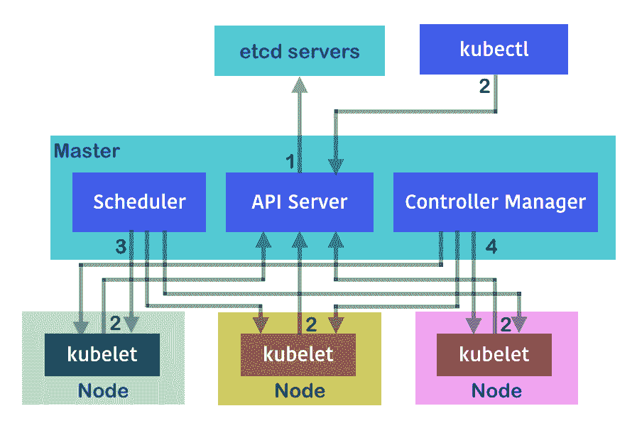

# 第四章：构建高可用性集群

在本章中，我们将覆盖以下内容：

+   etcd 集群化

+   构建多个主节点

# 简介

避免单点故障是我们始终需要牢记的一个概念。在本章中，你将学习如何在 Kubernetes 中构建高可用性组件。我们还将介绍如何构建一个三节点的 etcd 集群，并使用多节点的主控节点。

# etcd 集群化

etcd 存储着 Kubernetes 中的网络信息和状态。任何数据丢失都可能至关重要。在生产环境中，强烈建议对 etcd 进行集群化。etcd 支持集群功能；一个包含 N 个成员的集群可以容忍最多 (N-1)/2 个节点的故障。通常，有三种机制可以用来创建 etcd 集群，具体如下：

+   静态

+   etcd 发现

+   DNS 发现

静态方式是一种简单的启动 etcd 集群的方法，前提是我们在启动之前已经配置好了所有 etcd 成员。然而，通常情况下，我们会使用一个现有的 etcd 集群来引导新成员的加入。这时，发现方法就派上用场了。发现服务利用现有集群来启动自己，它允许新的 etcd 集群成员找到其他已存在的成员。在本章节中，我们将讨论如何通过静态方式和 etcd 发现手动引导 etcd 集群。

我们在第一章，*构建你自己的 Kubernetes 集群*中，已经学习了如何使用 kubeadm 和 kubespray。当本文撰写时，kubeadm 中的高可用性功能仍在开发中。官方文档中建议定期备份你的 etcd 节点。另一方面，我们介绍的另一个工具 kubespray 原生支持多节点的 etcd。在本章中，我们还将描述如何在 kubespray 中配置 etcd。

# 准备工作

在学习更灵活的 etcd 集群搭建方式之前，我们需要了解 etcd 目前有两个主要版本，分别是 v2 和 v3。etcd3 是一个较新的版本，旨在提供更稳定、高效和可靠的性能。以下是一个简单的比较，介绍它们在实现上的主要差异：

|  | **etcd2** | **etcd3** |
| --- | --- | --- |
| **协议** | http | gRPC |
| **键过期** | TTL 机制 | 租约 |
| **监视器** | HTTP 长轮询 | 通过双向 gRPC 流 |

etcd3 旨在成为 etcd2 的下一代版本。etcd3 默认支持 gRPC 协议。gRPC 使用 HTTP2，允许通过一个 TCP 连接进行多个 RPC 流。而在 etcd2 中，每个 HTTP 请求必须在每次请求时重新建立连接。为了处理键的过期问题，在 etcd2 中，TTL 会附加到一个键上；客户端应定期刷新键以检查是否有键过期。这将导致大量的连接建立。

在 etcd3 中，引入了租约（lease）概念。一个租约可以附加多个键；当租约到期时，它会删除所有附加的键。对于观察者，etcd2 客户端使用 HTTP 进行长轮询——这意味着每个观察都要开启一个 TCP 连接。而 etcd3 使用双向 gRPC 流实现，允许多个流共享同一个连接。

虽然推荐使用 etcd3，但是一些部署仍然使用 etcd2。我们仍然会介绍如何使用这些工具来实现集群，因为 etcd 中的数据迁移文档齐全且过程平稳。如需更多信息，请参考升级迁移步骤：[`coreos.com/blog/migrating-applications-etcd-v3.html`](https://coreos.com/blog/migrating-applications-etcd-v3.html)。

在我们开始构建 etcd 集群之前，必须决定需要多少个成员。etcd 集群的大小实际上取决于你要创建的环境。在生产环境中，至少推荐使用三个成员。这样，集群至少能容忍一次永久性故障。在本例中，我们将使用三个成员作为开发环境的示例：

| **名称/主机名** | **IP 地址** |
| --- | --- |
| `ip-172-31-3-80` | `172.31.3.80` |
| `ip-172-31-14-133` | `172.31.14.133` |
| `ip-172-31-13-239` | `172.31.13.239` |

其次，etcd 服务需要 `2379 端口`（对于旧版使用 `4001` 端口）进行 etcd 客户端通信，以及 `2380 端口` 进行对等节点通信。这些端口必须在你的环境中暴露。

# 如何操作...

有很多方法可以配置 etcd 集群。通常，你会使用 kubespray、kops（在 AWS 上）或其他配置工具。

在这里，我们将简单地展示如何进行手动安装。其实也很简单：

```
// etcd installation script
$ cat install-etcd.sh
ETCD_VER=v3.3.0

# ${DOWNLOAD_URL} could be ${GOOGLE_URL} or ${GITHUB_URL}
GOOGLE_URL=https://storage.googleapis.com/etcd
GITHUB_URL=https://github.com/coreos/etcd/releases/download
DOWNLOAD_URL=${GOOGLE_URL}

# delete tmp files
rm -f /tmp/etcd-${ETCD_VER}-linux-amd64.tar.gz
rm -rf /tmp/etcd && rm -rf /etc/etcd && mkdir -p /etc/etcd

curl -L ${DOWNLOAD_URL}/${ETCD_VER}/etcd-${ETCD_VER}-linux-amd64.tar.gz -o /tmp/etcd-${ETCD_VER}-linux-amd64.tar.gz
tar xzvf /tmp/etcd-${ETCD_VER}-linux-amd64.tar.gz -C /etc/etcd --strip-components=1
rm -f /tmp/etcd-${ETCD_VER}-linux-amd64.tar.gz

# check etcd version
/etc/etcd/etcd --version
```

这个脚本会将 `etcd` 二进制文件放到 `/etc/etcd` 文件夹中。你可以将它们放到不同的位置。在这种情况下，我们需要 `sudo` 权限才能将文件放到 `/etc` 下：

```
// install etcd on linux
# sudo sh install-etcd.sh
…
etcd Version: 3.3.0
Git SHA: c23606781
Go Version: go1.9.3
Go OS/Arch: linux/amd64
```

我们现在使用的版本是 3.3.0。检查 `etcd` 二进制文件在你的机器上是否能正常工作后，我们可以将其添加到默认的 `$PATH` 中。这样，每次执行 `etcd` 命令时就不需要包含 `/etc/etcd` 路径：

```
$ export PATH=/etc/etcd:$PATH
$ export ETCDCTL_API=3
```

你也可以将其放入 `.bashrc` 或 `.bash_profile` 中，让它默认生效。

在我们至少配置了三个 etcd 服务器后，就可以让它们配对在一起了。

# 静态机制

静态机制是建立集群的最简单方式。然而，每个成员的 IP 地址应该预先知道。这意味着如果你在云提供商环境中启动 etcd 集群，静态机制可能不太实用。因此，etcd 还提供了一个发现机制，可以从现有集群启动集群。

为了确保 etcd 通信的安全，etcd 支持 TLS 通道来加密对等节点之间的通信，以及客户端和服务器之间的通信。每个成员都需要拥有一个独特的密钥对。在本节中，我们将展示如何使用自动生成的证书来构建集群。

在 CoreOs GitHub 上，有一个方便的工具可以帮助我们生成自签名证书（[`github.com/coreos/etcd/tree/v3.2.15/hack/tls-setup`](https://github.com/coreos/etcd/tree/v3.2.15/hack/tls-setup)）。克隆仓库后，我们需要修改 `config/req-csr.json` 下的配置文件。以下是一个示例：

```
// sample config, put under $repo/config/req-csr.json
$ cat config/req-csr.json
{
  "CN": "etcd",
  "hosts": [
    "172.31.3.80",
    "172.31.14.133",
    "172.31.13.239"
  ],
  "key": {
    "algo": "ecdsa",
    "size": 384
  },
  "names": [
    {
      "O": "autogenerated",
      "OU": "etcd cluster",
      "L": "the internet"
    }
  ]
}
```

在下一步中，我们需要安装 Go（[`golang.org/`](https://golang.org/)）并设置 `$GOPATH`：

```
$ export GOPATH=$HOME/go
$ make
```

然后证书将在 `./certs/` 目录下生成。

首先，我们需要设置一个引导配置，声明哪些成员将包含在集群中：

```
// set as environment variables, or alternatively, passing by –-initial-cluster and –-initial-cluster-state parameters inside launch command.
# ETCD_INITIAL_CLUSTER="etcd0=http://172.31.3.80:2380,etcd1=http://172.31.14.133:2380,etcd2=http://172.31.13.239:2380"
ETCD_INITIAL_CLUSTER_STATE=new
```

在所有三个节点中，我们需要分别启动 etcd 服务器：

```
// first node: 172.31.3.80
# etcd --name etcd0 --initial-advertise-peer-urls https://172.31.3.80:2380 \
  --listen-peer-urls https://172.31.3.80:2380 \
  --listen-client-urls https://172.31.3.80:2379,https://127.0.0.1:2379 \
  --advertise-client-urls https://172.31.3.80:2379 \
  --initial-cluster-token etcd-cluster-1 \
  --initial-cluster etcd0=https://172.31.3.80:2380,etcd1=https://172.31.14.133:2380,etcd2=https://172.31.13.239:2380 \
  --initial-cluster-state new \
  --auto-tls \
  --peer-auto-tls

```

然后，你将看到以下输出：

```
2018-02-06 22:15:20.508687 I | etcdmain: etcd Version: 3.3.0
2018-02-06 22:15:20.508726 I | etcdmain: Git SHA: c23606781
2018-02-06 22:15:20.508794 I | etcdmain: Go Version: go1.9.3
2018-02-06 22:15:20.508824 I | etcdmain: Go OS/Arch: linux/amd64
…
2018-02-06 22:15:21.439067 N | etcdserver/membership: set the initial cluster version to 3.0
2018-02-06 22:15:21.439134 I | etcdserver/api: enabled capabilities for version 3.0

```

让我们启动第二个 `etcd` 服务：

```
// second node: 172.31.14.133
$ etcd --name etcd1 --initial-advertise-peer-urls https://172.31.14.133:2380 \
  --listen-peer-urls https://172.31.14.133:2380 \
  --listen-client-urls https://172.31.14.133:2379,https://127.0.0.1:2379 \
  --advertise-client-urls https://172.31.14.133:2379 \
  --initial-cluster-token etcd-cluster-1 \
  --initial-cluster etcd0=https://172.31.3.80:2380,etcd1=https://172.31.14.133:2380,etcd2=https://172.31.13.239:2380 \
  --initial-cluster-state new \
  --auto-tls \
  --peer-auto-tls
```

你将在控制台中看到类似的日志：

```
2018-02-06 22:15:20.646320 I | etcdserver: starting member ce7c9e3024722f01 in cluster a7e82f7083dba2c1
2018-02-06 22:15:20.646384 I | raft: ce7c9e3024722f01 became follower at term 0
2018-02-06 22:15:20.646397 I | raft: newRaft ce7c9e3024722f01 [peers: [], term: 0, commit: 0, applied: 0, lastindex: 0, lastterm: 0]
2018-02-06 22:15:20.646403 I | raft: ce7c9e3024722f01 became follower at term 1
…
2018-02-06 22:15:20.675928 I | rafthttp: starting peer 25654e0e7ea045f8...
2018-02-06 22:15:20.676024 I | rafthttp: started HTTP pipelining with peer 25654e0e7ea045f8
2018-02-06 22:15:20.678515 I | rafthttp: started streaming with peer 25654e0e7ea045f8 (writer)
2018-02-06 22:15:20.678717 I | rafthttp: started streaming with peer 25654e0e7ea045f8 (writer)
```

它开始与我们之前的节点（`25654e0e7ea045f8`）配对。让我们在第三个节点中触发以下命令：

```
// third node: 172.31.13.239
$ etcd --name etcd2 --initial-advertise-peer-urls https://172.31.13.239:2380 \
  --listen-peer-urls https://172.31.13.239:2380 \
  --listen-client-urls https://172.31.13.239:2379,https://127.0.0.1:2379 \
  --advertise-client-urls https://172.31.13.239:2379 \
  --initial-cluster-token etcd-cluster-1 \
  --initial-cluster etcd0=https://172.31.3.80:2380,etcd1=https://172.31.14.133:2380,etcd2=https://172.31.13.239:2380 \
  --initial-cluster-state new \
  --auto-tls \
  --peer-auto-tls

// in node2 console, it listens and receives new member (4834416c2c1e751e) added.
2018-02-06 22:15:20.679548 I | rafthttp: starting peer 4834416c2c1e751e...
2018-02-06 22:15:20.679642 I | rafthttp: started HTTP pipelining with peer 4834416c2c1e751e
2018-02-06 22:15:20.679923 I | rafthttp: started streaming with peer 25654e0e7ea045f8 (stream Message reader)
2018-02-06 22:15:20.680190 I | rafthttp: started streaming with peer 25654e0e7ea045f8 (stream MsgApp v2 reader)
2018-02-06 22:15:20.680364 I | rafthttp: started streaming with peer 4834416c2c1e751e (writer)
2018-02-06 22:15:20.681880 I | rafthttp: started peer 4834416c2c1e751e
2018-02-06 22:15:20.681909 I | rafthttp: added peer 4834416c2c1e751e
After all nodes are in, it'll start to elect the leader inside the cluster, we could find it in the logs:
2018-02-06 22:15:21.334985 I | raft: raft.node: ce7c9e3024722f01 elected leader 4834416c2c1e751e at term 27
...
2018-02-06 22:17:21.510271 N | etcdserver/membership: updated the cluster version from 3.0 to 3.3
2018-02-06 22:17:21.510343 I | etcdserver/api: enabled capabilities for version 3.3
```

集群已设置完毕。我们应该检查它是否正常运行：

```
$ etcdctl cluster-health
member 25654e0e7ea045f8is healthy: got healthy result from http://172.31.3.80:2379
member ce7c9e3024722f01 is healthy: got healthy result from http://172.31.14.133:2379
member 4834416c2c1e751e is healthy: got healthy result from http://172.31.13.239:2379
```

# 发现机制

发现机制提供了一种更灵活的方式来创建集群。它不需要提前知道其他对等节点的 IP。它利用现有的 etcd 集群来引导新的集群。在这一部分，我们将演示如何利用这一机制启动一个三节点的 etcd 集群：

1.  首先，我们需要一个现有的三节点配置的集群。幸运的是，`etcd` 官方网站提供了一个发现服务（`https://discovery.etcd.io/new?size=n`）；n 将是你 `etcd` 集群中的节点数，已经可以使用：

```
// get a request URL
# curl -w "n" 'https://discovery.etcd.io/new?size=3'
https://discovery.etcd.io/f6a3fb54b3fd1bb02e26a89fd40df0e8
```

1.  然后我们可以使用该 URL 来轻松引导集群。命令行与静态机制几乎相同。我们需要做的是将 `–initial-cluster` 改为 `–discovery`，这个参数用于指定发现服务的 URL：

```
// in node1, 127.0.0.1 is used for internal client listeneretcd -name ip-172-31-3-80 -initial-advertise-peer-urls http://172.31.3.80:2380  -listen-peer-urls http://172.31.3.80:2380  -listen-client-urls http://172.31.3.80:2379,http://127.0.0.1:2379  -advertise-client-urls http://172.31.3.80:2379  -discovery https://discovery.etcd.io/f6a3fb54b3fd1bb02e26a89fd40df0e8

// in node2, 127.0.0.1 is used for internal client listener
etcd -name ip-172-31-14-133 -initial-advertise-peer-urls http://172.31.14.133:2380  -listen-peer-urls http://172.31.14.133:2380  -listen-client-urls http://172.31.14.133:2379,http://127.0.0.1:2379  -advertise-client-urls http://172.31.14.133:2379  -discovery https://discovery.etcd.io/f6a3fb54b3fd1bb02e26a89fd40df0e8

// in node3, 127.0.0.1 is used for internal client listener
etcd -name ip-172-31-13-239 -initial-advertise-peer-urls http://172.31.13.239:2380  -listen-peer-urls http://172.31.13.239:2380  -listen-client-urls http://172.31.13.239:2379,http://127.0.0.1:2379  -advertise-client-urls http://172.31.13.239:2379  -discovery https://discovery.etcd.io/f6a3fb54b3fd1bb02e26a89fd40df0e8
```

1.  让我们仔细查看 node1 的日志：

```
2018-02-10 04:58:03.819963 I | etcdmain: etcd Version: 3.3.0
...
2018-02-10 04:58:03.820400 I | embed: listening for peers on http://172.31.3.80:2380
2018-02-10 04:58:03.820427 I | embed: listening for client requests on
127.0.0.1:2379
2018-02-10 04:58:03.820444 I | embed: listening for client requests on 172.31.3.80:2379
2018-02-10 04:58:03.947753 N | discovery: found self f60c98e749d41d1b in the cluster
2018-02-10 04:58:03.947771 N | discovery: found 1 peer(s), waiting for 2 more
2018-02-10 04:58:22.289571 N | discovery: found peer 6645fe871c820573 in the cluster
2018-02-10 04:58:22.289628 N | discovery: found 2 peer(s), waiting for 1 more
2018-02-10 04:58:36.907165 N | discovery: found peer 1ce61c15bdbb20b2 in the cluster
2018-02-10 04:58:36.907192 N | discovery: found 3 needed peer(s)
...
2018-02-10 04:58:36.931319 I | etcdserver/membership: added member 1ce61c15bdbb20b2 [http://172.31.13.239:2380] to cluster 29c0e2579c2f9563
2018-02-10 04:58:36.931422 I | etcdserver/membership: added member 6645fe871c820573 [http://172.31.14.133:2380] to cluster 29c0e2579c2f9563
2018-02-10 04:58:36.931494 I | etcdserver/membership: added member f60c98e749d41d1b [http://172.31.3.80:2380] to cluster 29c0e2579c2f9563
2018-02-10 04:58:37.116189 I | raft: f60c98e749d41d1b became leader at term 2
```

我们可以看到第一个节点等待其他两个成员加入，并将成员添加到集群中，在第二轮选举中成为了领导者：

1.  如果你查看其他服务器的日志，可能会发现一些线索，表明某些成员投票给了当前的领导者：

```
// in node 2
2018-02-10 04:58:37.118601 I | raft: raft.node: 6645fe871c820573 elected leader f60c98e749d41d1b at term 2
```

1.  我们还可以使用成员列表检查当前的领导者：

```
# etcdctl member list
1ce61c15bdbb20b2: name=ip-172-31-13-239 peerURLs=http://172.31.13.239:2380 clientURLs=http://172.31.13.239:2379 isLeader=false
6645fe871c820573: name=ip-172-31-14-133 peerURLs=http://172.31.14.133:2380 clientURLs=http://172.31.14.133:2379 isLeader=false
f60c98e749d41d1b: name=ip-172-31-3-80 peerURLs=http://172.31.3.80:2380 clientURLs=http://172.31.3.80:2379 isLeader=true
```

1.  然后我们可以确认当前领导者是 `172.31.3.80`。我们还可以使用 `etcdctl` 检查集群健康：

```
# etcdctl cluster-health
member 1ce61c15bdbb20b2 is healthy: got healthy result from http://172.31.13.239:2379
member 6645fe871c820573 is healthy: got healthy result from http://172.31.14.133:2379
member f60c98e749d41d1b is healthy: got healthy result from http://172.31.3.80:2379
cluster is healthy
```

1.  如果我们通过 `etcdctl` 命令移除当前领导者：

```
# etcdctl member remove f60c98e749d41d1b
```

1.  我们可能会发现当前领导者已经发生变化：

```
# etcdctl member list
1ce61c15bdbb20b2: name=ip-172-31-13-239 peerURLs=http://172.31.13.239:2380 clientURLs=http://172.31.13.239:2379 isLeader=false
6645fe871c820573: name=ip-172-31-14-133 peerURLs=http://172.31.14.133:2380 clientURLs=http://172.31.14.133:2379 isLeader=true
```

通过使用 `etcd` 发现机制，我们可以轻松地设置集群，`etcd` 还提供了许多 API 供我们使用。我们可以利用它来检查集群的统计信息：

1.  例如，使用 `/stats/leader` 来检查当前集群视图：

```
# curl http://127.0.0.1:2379/v2/stats/leader
{"leader":"6645fe871c820573","followers":{"1ce61c15bdbb20b2":{"latency":{"current":0.002463,"average":0.0038775,"standardDeviation":0.0014144999999999997,"minimum":0.002463,"maximum":0.005292},"counts":{"fail":0,"success":2}}}}
```

有关 API 的更多信息，请查看官方 API 文档：[`coreos.com/etcd/docs/latest/v2/api.html`](https://coreos.com/etcd/docs/latest/v2/api.html)。

在 EC2 中构建集群

CoreOS 在 AWS 中构建了 CloudFormation，以帮助您动态地引导 AWS 上的集群。我们需要做的就是启动一个 CloudFormation 模板并设置参数，然后就可以开始了。模板中的资源包含自动扩展设置和网络入口（安全组）。请注意，这些 etcd 是运行在 CoreOS 上的。要登录服务器，首先您需要在 KeyPair 参数中设置您的密钥对名称，然后使用命令 `ssh –i $your_keypair core@$ip` 登录到服务器。

# kubeadm

如果您正在使用 kubeadm ([`github.com/kubernetes/kubeadm`](https://github.com/kubernetes/kubeadm)) 来引导您的 Kubernetes 集群，很遗憾，在写作时，HA 支持仍在进行中（v.1.10）。该集群被创建为单一主节点，并配置了单个 etcd。您需要定期备份 etcd 以确保数据安全。有关更多信息，请参阅 Kubernetes 官方网站上的 kubeadm 限制说明 ([`kubernetes.io/docs/setup/independent/create-cluster-kubeadm/#limitations`](https://kubernetes.io/docs/setup/independent/create-cluster-kubeadm/#limitations))。

# kubespray

另一方面，如果您使用 kubespray 来配置服务器，kubespray 本地支持多节点 etcd。您需要做的就是在配置文件（`inventory.cfg`）中的 etcd 部分添加多个节点：

```
# cat inventory/inventory.cfg
my-master-1 ansible_ssh_host=<master_ip>
my-node-1 ansible_ssh_host=<node_ip>
my-etcd-1 ansible_ssh_host=<etcd1_ip>
my-etcd-2 ansible_ssh_host=<etcd2_ip>
my-etcd-3 ansible_ssh_host=<etcd3_ip>

[kube-master]
my-master-1

[etcd]
my-etcd-1
my-etcd-2
my-etcd-3

[kube-node]
my-master-1
my-node-1
```

然后您就可以配置一个包含三节点 etcd 的集群：

```
// provision a cluster 
$ ansible-playbook -b -i inventory/inventory.cfg cluster.yml
```

在启动 ansible playbook 后，它将配置角色、创建用户、检查是否已经在第一个主节点生成所有证书，并生成和分发证书。在部署的最后，ansible 会检查每个组件的健康状态。

# Kops

Kops 是在 AWS 上创建 Kubernetes 集群的最有效方式。通过 kops 配置文件，您可以轻松地在云端启动一个自定义集群。要构建一个 etcd 多节点集群，您可以在 kops 配置文件中使用以下部分：

```
etcdClusters:
  - etcdMembers:
    - instanceGroup: my-master-us-east-1a
      name: my-etcd-1
    - instanceGroup: my-master-us-east-1b
      name: my-etcd-2
    - instanceGroup: my-master-us-east-1c
      name: my-etcd-3
```

通常，instanceGroup 意味着自动扩展组。您还需要在配置文件中声明相关的 `intanceGroup my-master-us-east-1x`。我们将在 第六章，*在 AWS 上构建 Kubernetes* 中深入了解它。默认情况下，在本书撰写时，kops 仍使用 etcd2；您可以在 kops 配置文件中添加一个版本键，例如 **version: 3.3.0**，并在每个 `instanceGroup` 下设置。

# 另请参见

+   在 第一章，*构建您的 Kubernetes 集群* 中，*使用 kubespray 在 Linux 上设置 Kubernetes 集群*

+   本章的 *构建多个主节点* 部分

+   第六章，*在 AWS 上构建 Kubernetes*

+   在 第九章，*日志与监控* 中的 *处理 etcd 日志*

# 构建多个主节点

主节点在 Kubernetes 系统中作为核心组件。其职责包括以下几点：

1.  从 etcd 服务器推送和拉取信息

1.  充当请求的门户

1.  将任务分配给节点

1.  监控正在运行的任务

三个主要的守护进程使主节点能够履行上述职责；下图显示了前述要点的活动：



Kubernetes 主节点与其他组件之间的交互

如您所见，主节点是工作节点和客户端之间的通信者。因此，如果主节点崩溃，将会是一个问题。一个多主节点的 Kubernetes 系统不仅具有容错能力，而且还具备负载均衡的功能。如果其中一个主节点崩溃，也不会有问题，因为其他主节点仍然可以处理任务。我们称这种基础设施设计为*高可用性*，简称 HA。为了支持 HA 架构，不再只有一个 API 服务器用于访问数据存储和处理请求。多个 API 服务器分布在不同的主节点上，可以同时处理任务并缩短响应时间。

# 准备工作

关于构建多主节点系统，您需要了解以下几个简要概念：

+   在主节点前添加一个负载均衡器服务器。负载均衡器将成为节点和客户端访问的新端点。

+   每个主节点运行自己的 API 服务器。

+   系统中只能有一个调度器和一个控制器管理器，以避免不同守护进程在管理容器时发生冲突。为了实现这一设置，我们在调度器和控制器管理器中启用`--leader-elect`标志。只有获得租约的那个守护进程才能承担任务。

在本方法中，我们将通过*kubeadm*构建一个双主节点系统，这一方法在扩展更多主节点时类似。用户也可以使用其他工具来构建 HA Kubernetes 集群。我们的目标是阐明一般概念。

在开始之前，除了主节点外，您还需要准备系统中其他必要的组件：

+   两台 Linux 主机，稍后将作为主节点设置。这些机器应该配置为 kubeadm 主节点。请参考第一章中的*使用 kubeadm 设置 Kubernetes 集群*，*构建您自己的 Kubernetes 集群*。您应在两台主机上完成*软件包安装和系统配置先决条件*部分。

+   为主节点配置负载均衡器。如果您在公共云上操作，情况会更简单，例如 AWS 的 EL*B*和 GCE 的负载均衡。

+   一个 etcd 集群。请查看本章中的*集群* *etcd*配置方法。

# 如何实现…

我们将使用配置文件运行 kubeadm，以实现自定义的守护进程执行。请按照接下来的章节将多个主节点作为一个组来操作。

# 设置第一个主节点

首先，我们将设置一个主节点，准备好 HA 环境。就像最初的步骤一样，使用 kubeadm 启动集群时，开始时启用并启动 kubelet 是很重要的。这样，它就可以在`kube-system`命名空间中作为 Pod 运行的守护进程：

```
// you are now in the terminal of host for first master
$ sudo systemctl enable kubelet && sudo systemctl start kubelet
```

接下来，使用自定义的 kubeadm 配置文件启动主节点服务：

```
$ cat custom-init-1st.conf
apiVersion: kubeadm.k8s.io/v1alpha1
kind: MasterConfiguration
api:
  advertiseAddress: "<FIRST_MASTER_IP>"
etcd:
  endpoints:
  - "<ETCD_CLUSTER_ENDPOINT>"
apiServerCertSANs:
- "<FIRST_MASTER_IP>"
- "<SECOND_MASTER_IP>"
- "<LOAD_BALANCER_IP>"
- "127.0.0.1"
token: "<CUSTOM_TOKEN: [a-z0-9]{6}.[a-z0-9]{16}>"
tokenTTL: "0"
apiServerExtraArgs:
  endpoint-reconciler-type: "lease"
```

这个配置文件中有多个需要根据你的环境设置的值。IP 地址的设置比较简单。请注意，现在你正在设置第一个主节点；`<FIRST_MASTER_IP>`变量将是你当前主机的物理 IP 地址。`<ETCD_CLUSTER_ENDPOINT>`将是类似`"http://<IP>:<PORT>"`的格式，表示 etcd 集群的负载均衡器。`<CUSTOM_TOKEN>`应该符合指定格式（例如，`123456.aaaabbbbccccdddd`）。在分配好所有符合你系统的变量后，现在可以执行它：

```
$ sudo kubeadm init --config=custom-init-1st.conf
```

你可能会遇到“Swap 不支持”的错误信息。可以在`kubeadm init`命令后添加额外的`--ignore-preflight-errors=Swap`标志，避免这个中断。

确保在两个主节点的文件中都进行了更新。

我们需要通过以下命令完成客户端功能：

```
$ mkdir -p $HOME/.kube
$ sudo cp -i /etc/kubernetes/admin.conf $HOME/.kube/config
$ sudo chown $(id -u):$(id -g) $HOME/.kube/config
```

就像使用 kubeadm 启动单节点集群时一样，缺少容器网络接口时，附加组件`kube-dns`将始终处于挂起状态。我们将使用 CNI Calico 作为演示。你也可以应用其他适合 kubeadm 的 CNI：

```
$ kubectl apply -f https://docs.projectcalico.org/v2.6/getting-started/kubernetes/installation/hosted/kubeadm/1.6/calico.yaml
```

现在你可以添加更多的主节点了。

# 使用现有证书设置其他主节点

和上次的会话类似，首先启动并启用`kubelet`：

```
// now you're in the second master
$ sudo systemctl enable kubelet && sudo systemctl start kubelet
```

在设置好第一个主节点之后，我们应将新生成的证书和密钥共享到整个系统中。这确保了主节点在同样的安全方式下被保护：

```
$ sudo scp -r root@$FIRST_MASTER_IP:/etc/kubernetes/pki/* /etc/kubernetes/pki/
```

你会发现一些文件，如证书或密钥，已被直接复制到`/etc/kubernetes/pki/`，这些文件只能由 root 用户访问。然而，我们将删除`apiserver.crt`和`apiserver.key`文件，因为这些文件应该根据第二个主节点的主机名和 IP 地址生成，但共享的客户端证书`ca.crt`也参与了生成过程：

```
$ sudo rm /etc/kubernetes/pki/apiserver.*
```

接下来，在执行主节点初始化命令之前，请在配置文件中更改第二个主节点的 API 广播地址。它应该是第二个主节点的 IP 地址，也就是当前主机的 IP 地址。第二个主节点的配置文件与第一个主节点的配置文件非常相似。

区别在于我们需要指明`etcd`服务器的信息，并避免创建新的`etcd`服务器：

```
// Please modify the change by your case
$ cat custom-init-2nd.conf
apiVersion: kubeadm.k8s.io/v1alpha1
kind: MasterConfiguration
api:
  advertiseAddress: "<SECOND_MASTER_IP>"
...
```

继续执行`kubeadm init`命令，记录`init`命令最后一行显示的`kubeadm join`命令，以便稍后将节点添加进来，并启用客户端 API 权限：

```
$ sudo kubeadm init --config custom-init-2nd.conf
// copy the "kubeadm join" command showing in the output
$ mkdir -p $HOME/.kube
$ sudo cp -i /etc/kubernetes/admin.conf $HOME/.kube/config
$ sudo chown $(id -u):$(id -g) $HOME/.kube/config
```

然后，检查当前的节点；你会发现有两个主节点：

```
$ kubectl get nodes
NAME       STATUS    ROLES     AGE       VERSION
master01   Ready     master    8m        v1.10.2
master02   Ready     master    1m        v1.10.2
```

# 在 HA 集群中添加节点

一旦主节点准备好，你可以将节点添加到系统中。这个节点应该已经完成了作为 kubeadm 集群中的工作节点的先决配置。并且在开始时，你应该像主节点一样启动 kubelet：

```
// now you're in the second master
$ sudo systemctl enable kubelet && sudo systemctl start kubelet
```

之后，你可以继续推送你复制的加入命令。然而，请将主节点的 IP 地址更改为负载均衡器的 IP：

```
// your join command should look similar to following one
$ sudo kubeadm join --token <CUSTOM_TOKEN> <LOAD_BALANCER_IP>:6443 --discovery-token-ca-cert-hash sha256:<HEX_STRING>
```

然后，你可以跳到第一个主节点或第二个主节点来检查节点的状态：

```
// you can see the node is added
$ kubectl get nodes
NAME       STATUS    ROLES     AGE       VERSION
master01   Ready     master    4h        v1.10.2
master02   Ready     master    3h        v1.10.2
node01     Ready     <none>    22s       v1.10.2
```

# 它是如何工作的……

为了验证我们的高可用集群，查看 `kube-system` 命名空间中的 pod：

```
$ kubectl get pod -n kube-system
NAME                                      READY     STATUS    RESTARTS   AGE
calico-etcd-6bnrk                         1/1       Running   0          1d
calico-etcd-p7lpv                         1/1       Running   0          1d
calico-kube-controllers-d554689d5-qjht2   1/1       Running   0          1d
calico-node-2r2zs                         2/2       Running   0          1d
calico-node-97fjk                         2/2       Running   0          1d
calico-node-t55l8                         2/2       Running   0          1d
kube-apiserver-master01                   1/1       Running   0          1d
kube-apiserver-master02                   1/1       Running   0          1d
kube-controller-manager-master01          1/1       Running   0          1d
kube-controller-manager-master02          1/1       Running   0          1d
kube-dns-6f4fd4bdf-xbfvp                  3/3       Running   0          1d
kube-proxy-8jk69                          1/1       Running   0          1d
kube-proxy-qbt7q                          1/1       Running   0          1d
kube-proxy-rkxwp                          1/1       Running   0          1d
kube-scheduler-master01                   1/1       Running   0          1d
kube-scheduler-master02                   1/1       Running   0          1d
```

这些 pod 作为系统守护进程在工作：Kubernetes 系统服务，如 API 服务器，Kubernetes 附加组件，如 DNS 服务器，以及 CNI 组件；这里我们使用的是 Calico。但等等！当你仔细查看这些 pod 时，你可能会好奇，为什么控制器管理器和调度器会在两个主节点上运行？难道高可用集群中不应该只有一个主节点吗？

正如我们在前一节中理解的那样，我们应该避免在 Kubernetes 系统中运行多个控制器管理器和多个调度器。因为它们可能会同时尝试接管请求，这不仅会产生冲突，还会浪费计算资源。实际上，在通过 kubeadm 启动整个系统时，控制器管理器和调度器默认启用了 `leader-elect` 标志：

```
// check flag leader-elect on master node
$ sudo cat /etc/kubernetes/manifests/kube-controller-manager.yaml
apiVersion: v1
kind: Pod
metadata:
  annotations:
    scheduler.alpha.kubernetes.io/critical-pod: ""
  creationTimestamp: null
  labels:
    component: kube-controller-manager
    tier: control-plane
  name: kube-controller-manager
  namespace: kube-system
spec:
  containers:
  - command:
    - kube-controller-manager
...
    - --leader-elect=true...
```

你可能会发现调度器也设置了 `leader-elect`。然而，为什么还是有多个 pod？事实是，具有相同角色的 pod 中有一个是空闲的。我们可以通过查看系统端点来获取详细信息：

```
// ep is the abbreviation of resource type "endpoints"
$ kubectl get ep -n kube-system
NAME                      ENDPOINTS                                   AGE
calico-etcd               192.168.122.201:6666,192.168.122.202:6666   1d
kube-controller-manager   <none>                                      1d
kube-dns                  192.168.241.67:53,192.168.241.67:53         1d
kube-scheduler            <none>                                      1d

// check endpoint of controller-manager with YAML output format
$ kubectl get ep kube-controller-manager -n kube-system -o yaml
apiVersion: v1
kind: Endpoints
metadata:
  annotations:
    control-plane.alpha.kubernetes.io/leader: '{"holderIdentity":"master01_bf4e22f7-4f56-11e8-aee3-52540048ed9b","leaseDurationSeconds":15,"acquireTime":"2018-05-04T04:51:11Z","renewTime":"2018-05-04T05:28:34Z","leaderTransitions":0}'
  creationTimestamp: 2018-05-04T04:51:11Z
  name: kube-controller-manager
  namespace: kube-system
  resourceVersion: "3717"
  selfLink: /api/v1/namespaces/kube-system/endpoints/kube-controller-manager
  uid: 5e2717b0-0609-11e8-b36f-52540048ed9b
```

以 `kube-controller-manager` 的端点为例：它没有附加到 pod 或服务的虚拟 IP（与 `kube-scheduler` 相同）。如果我们进一步深入查看这个端点，会发现 `kube-controller-manager` 的端点依赖于 `annotations` 来记录租约信息；它还依赖于 `resourceVersion` 来进行 pod 映射和传递流量。根据 `kube-controller-manager` 端点的注释信息，是我们的第一个主节点控制了这个权限。让我们检查两个主节点上的控制器管理器：

```
// your pod should be named as kube-controller-manager-<HOSTNAME OF MASTER>
$ kubectl logs kube-controller-manager-master01 -n kube-system | grep "leader"
I0504 04:51:03.015151 1 leaderelection.go:175] attempting to acquire leader lease kube-system/kube-controller-manager...
...
I0504 04:51:11.627737 1 event.go:218] Event(v1.ObjectReference{Kind:"Endpoints", Namespace:"kube-system", Name:"kube-controller-manager", UID:"5e2717b0-0609-11e8-b36f-52540048ed9b", APIVersion:"v1", ResourceVersion:"187", FieldPath:""}): type: 'Normal' reason: 'LeaderElection' master01_bf4e22f7-4f56-11e8-aee3-52540048ed9b became leader
```

如你所见，只有一个主节点作为领导者并处理请求，而另一个主节点则保持空闲，获取租约但不执行任何操作。

为了进行进一步的测试，我们正在尝试移除当前的主控 pod，以观察会发生什么。在通过 `kubectl` 请求删除系统 pod 的部署时，kubeadm Kubernetes 会创建一个新的 pod，因为它确保会启动任何位于`/etc/kubernetes/manifests` 目录下的应用程序。因此，为了避免 kubeadm 的自动恢复，我们将配置文件从清单目录中移除。这样可以使停机时间足够长，以便放弃主控权限：

```
// jump into the master node of leader
// temporary move the configuration file out of kubeadm's control
$ sudo mv /etc/kubernetes/manifests/kube-controller-manager.yaml ./
// check the endpoint
$ kubectl get ep kube-controller-manager -n kube-system -o yaml
apiVersion: v1
kind: Endpoints
metadata:
  annotations:
    control-plane.alpha.kubernetes.io/leader: '{"holderIdentity":"master02_4faf95c7-4f5b-11e8-bda3-525400b06612","leaseDurationSeconds":15,"acquireTime":"2018-05-04T05:37:03Z","renewTime":"2018-05-04T05:37:47Z","leaderTransitions":1}'
  creationTimestamp: 2018-05-04T04:51:11Z
  name: kube-controller-manager
  namespace: kube-system
  resourceVersion: "4485"
  selfLink: /api/v1/namespaces/kube-system/endpoints/kube-controller-manager
  uid: 5e2717b0-0609-11e8-b36f-52540048ed9b
subsets: null
```

`/etc/kubernetes/manifests` 目录在 kubelet 中由 `--pod-manifest-path flag` 定义。检查 `/etc/systemd/system/kubelet.service.d/10-kubeadm.conf`*，* 这是 kubelet 的系统守护进程配置文件，更多详细信息请参见 kubelet 的帮助信息。

现在轮到另一个节点唤醒它的控制器管理器并使其开始工作。一旦你把控制器管理器的配置文件放回去，你会发现旧的领导者现在正在等待租约：

```
$ kubectl logs kube-controller-manager-master01 -n kube-system
I0504 05:40:10.218946 1 controllermanager.go:116] Version: v1.10.2
W0504 05:40:10.219688 1 authentication.go:55] Authentication is disabled
I0504 05:40:10.219702 1 insecure_serving.go:44] Serving insecurely on 127.0.0.1:10252
I0504 05:40:10.219965 1 leaderelection.go:175] attempting to acquire leader lease kube-system/kube-controller-manager...
```

# 另见

在阅读本食谱之前，你应该已经掌握了通过 kubeadm 安装单主节点的基本概念。参考此处提到的相关食谱，了解如何自动构建一个多主节点系统：

+   在 第一章 中，*通过 kubeadm 设置 Kubernetes 集群在 Linux 上*，*构建你自己的 Kubernetes 集群*

+   集群化 etcd
