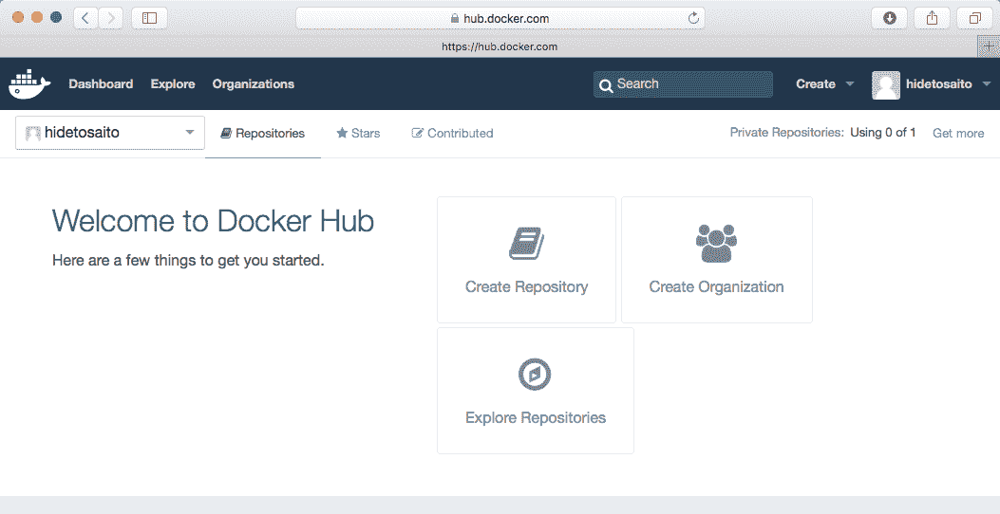
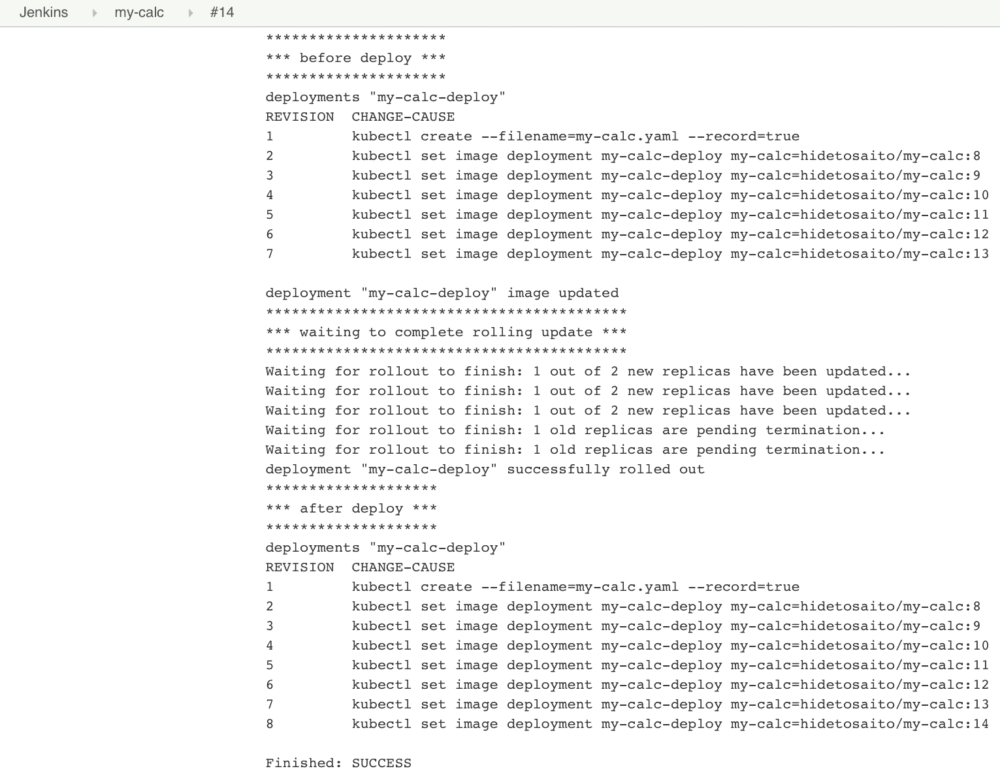

# 第五章：构建持续交付管道

在本章中，我们将涵盖以下内容：

+   从单体架构迁移到微服务

+   与私有 Docker 注册表的配合

+   与 Jenkins 集成

# 介绍

Kubernetes 非常适合具有微服务架构的应用程序。然而，大多数旧应用程序是以单体式架构构建的。我们将给你一个关于如何从单体架构过渡到微服务世界的思路。至于微服务，如果你手动进行部署，它将变得很繁琐。我们将学习如何通过协调 Jenkins、Docker 注册表和 Kubernetes 来构建自己的持续交付管道。

# 从单体架构迁移到微服务

通常，应用程序架构是单体设计，包含 **模型-视图-控制器**（**MVC**）并将所有组件打包成一个大型二进制文件。单体设计有一些好处，例如组件之间的延迟较低，所有功能都在一个简单的包中，且容易部署和测试。

然而，单体设计有一些缺点，因为二进制文件会变得越来越大。每次添加或修改代码时，你总是需要注意副作用，因此发布周期会变得更长。

使用容器和 Kubernetes 在你的应用程序中使用微服务时提供了更多的灵活性。微服务架构非常简单，可以将其分为一些模块或一些服务类，并结合 MVC 进行组织：


单体与微服务设计

每个微服务通过 RESTful 或一些标准网络 API 提供 **远程过程调用**（**RPC**）给其他微服务。其好处在于每个微服务是独立的，添加或修改代码时副作用最小。可以独立发布周期，因此它与敏捷软件开发方法论完美契合，并允许这些微服务的重用来构建另一个应用程序，从而建立微服务生态系统。

# 准备就绪

准备简单的微服务程序。为了推送和拉取你的微服务，请提前注册 Docker hub ([`hub.docker.com/`](https://hub.docker.com/)) 并创建一个免费的 Docker ID。

如果你将 Docker 镜像推送到 Docker hub，它将是公开的；任何人都可以拉取你的镜像。因此，请不要将任何机密信息放入镜像中。

一旦你成功登录到 Docker ID，你将被重定向到你的 Dashboard 页面，如下所示：



登录 Docker hub 后

# 如何操作...

准备好微服务和前端 WebUI 作为 Docker 镜像。然后，使用 Kubernetes 复制控制器和服务进行部署。

# 微服务

通过以下步骤构建一个提供简单数学功能的微服务：

1.  这是一个使用 Python `Flask` 的简单微服务 ([`flask.pocoo.org/`](http://flask.pocoo.org/))：

```
$ cat entry.py
from flask import Flask, request 
app = Flask(__name__)

@app.route("/")
def hello():
    return "Hello World!" 

@app.route("/power/<int:base>/<int:index>")
def power(base, index): 
    return "%d" % (base ** index)

@app.route("/addition/<int:x>/<int:y>")
def add(x, y):
    return "%d" % (x+y)

@app.route("/substraction/<int:x>/<int:y>")
def substract(x, y):
    return "%d" % (x-y)

if __name__ == "__main__":
    app.run(host='0.0.0.0')

```

1.  准备一个如下所示的 `Dockerfile` 来构建 Docker 镜像：

```
$ cat Dockerfile
FROM ubuntu:14.04 

# Update packages
RUN apt-get update -y

# Install Python Setuptools
RUN apt-get install -y python-setuptools git telnet curl

# Install pip
RUN easy_install pip

# Bundle app source
ADD . /src
WORKDIR /src

# Add and install Python modules
RUN pip install Flask

# Expose
EXPOSE 5000

# Run
CMD ["python", "entry.py"]
```

1.  然后，使用 `docker build` 命令构建 Docker 镜像，如下所示：

```
//name as “your_docker_hub_id/my-calc”
$ sudo docker build -t hidetosaito/my-calc .
Sending build context to Docker daemon 3.072 kB
Step 1 : FROM ubuntu:14.04
 ---> 6cc0fc2a5ee3
Step 2 : RUN apt-get update -y
 ---> Using cache

(snip)

Step 8 : EXPOSE 5000
 ---> Running in 7c52f4bfe373
 ---> 28f79bb7481f
Removing intermediate container 7c52f4bfe373
Step 9 : CMD python entry.py
 ---> Running in 86b39c727572
 ---> 20ae465bf036
Removing intermediate container 86b39c727572
Successfully built 20ae465bf036

//verity your image
$ sudo docker images
REPOSITORY            TAG                 IMAGE ID            CREATED             VIRTUAL SIZE
hidetosaito/my-calc   latest              20ae465bf036        19 seconds ago      284 MB
ubuntu                14.04               6cc0fc2a5ee3        3 weeks ago         187.9 MB
```

1.  然后，使用 `docker login` 命令登录到 Docker hub：

```
//type your username, password and e-mail address in Docker hub
$ sudo docker login
Username: hidetosaito
Password:
Email: hideto.saito@yahoo.com
WARNING: login credentials saved in /home/ec2-user/.docker/config.json
Login Succeeded
```

1.  最后，使用 `docker push` 命令将镜像注册到您的 Docker hub 仓库，如下所示：

```
//push to your docker index
$ sudo docker push hidetosaito/my-calc
The push refers to a repository [docker.io/hidetosaito/my-calc] (len: 1)
20ae465bf036: Pushed

(snip)

92ec6d044cb3: Pushed
latest: digest: sha256:203b81c5a238e228c154e0b53a58e60e6eb3d1563293483ce58f48351031a474 size: 19151
```

1.  访问 Docker hub 后，您可以在仓库中看到您的微服务：


您的微服务 Docker 镜像在 Docker hub 上

# 前端 WebUI

按照以下步骤构建使用前述微服务的 WebUI：

1.  这是一个简单的前端 WebUI，它也使用 Python `Flask`：

```
$ cat entry.py
import os
import httplib
from flask import Flask, request, render_template

app = Flask(__name__)

@app.route("/")
def index():
    return render_template('index.html')

@app.route("/add", methods=['POST'])
def add():
    #
    # from POST parameters
    #
    x = int(request.form['x'])
    y = int(request.form['y'])

    #
    # from Kubernetes Service(environment variables)
    #
    my_calc_host = os.environ['MY_CALC_SERVICE_SERVICE_HOST']
    my_calc_port = os.environ['MY_CALC_SERVICE_SERVICE_PORT']

    #
    # REST call to MicroService(my-calc)
    #
    client = httplib.HTTPConnection(my_calc_host, my_calc_port)
    client.request("GET", "/addition/%d/%d" % (x, y))
    response = client.getresponse()
    result = response.read()
    return render_template('index.html', add_x=x, add_y=y,
add_result=result)

if __name__ == "__main__":
    app.debug = True
    app.run(host='0.0.0.0')
```

Kubernetes 服务会生成 Kubernetes 服务名称和端口号作为环境变量，传递给其他 pods。因此，环境变量的名称和 Kubernetes 服务名称必须一致。在这种情况下，`my-calc` 服务名称必须是 `my-calc-service`。

1.  前端 WebUI 使用 `Flask` HTML 模板；它类似于 PHP 和 JSP，`entry.py` 会将参数传递给模板（`index.html`）以渲染 HTML：

```
$ cat templates/index.html
<html>
   <body>
   <div>
         <form method="post" action="/add">
           <input type="text" name="x" size="2"/>
           <input type="text" name="y" size="2"/>
           <input type="submit" value="addition"/>
       </form>
       
       <p>Answer : {{ add_x }} + {{ add_y }} = {{ add_result }}</p>
       
   </div>
   </body>
</html>
```

1.  `Dockerfile` 与微服务 `my-calc` 完全相同。因此，最终，文件结构将如下所示。请注意，`index.html` 是一个 jinja2 模板文件，因此将其放在 `/templates` 目录下：

```
/Dockerfile
/entry.py
/templates/index.html
```

1.  然后，构建 Docker 镜像并推送到 Docker hub，如下所示：

为了将您的镜像推送到 Docker hub，您需要使用 Docker 登录命令进行登录。只需要登录一次；系统会检查 `~/.docker/config.json` 来读取凭证。

```
//build frontend Webui image 
$ sudo docker build -t hidetosaito/my-frontend .

//login to docker hub
$ sudo docker login

//push frontend webui image
$ sudo docker push hidetosaito/my-frontend
```

1.  访问 Docker hub 后，您可以在仓库中看到您的 WebUI 应用程序：


微服务和前端 WebUI 镜像在 Docker Hub 上

# 它是如何工作的……

让我们准备两个 YAML 配置文件，使用 Kubernetes 启动微服务容器和前端 WebUI 容器。

# 微服务

微服务（`my-calc`）使用 Kubernetes 部署和服务，但它只需要与其他 pod 进行通信。换句话说，不需要将其暴露到外部 Kubernetes 网络中。因此，服务类型设置为 `ClusterIP`：

```
$ cat my-calc.yaml 
apiVersion: apps/v1
kind: Deployment
metadata:
  name: my-calc-deploy
spec:
  replicas: 2
  selector:
    matchLabels:
      run: my-calc
  template:
    metadata:
      labels:
        run: my-calc
    spec:
      containers:
      - name: my-calc
        image: hidetosaito/my-calc
---
apiVersion: v1
kind: Service
metadata:
  name: my-calc-service
spec:
  ports:
    - protocol: TCP
      port: 5000
  type: ClusterIP
  selector:
     run: my-calc
```

使用 `kubectl` 命令加载 `my-calc` pod，如下所示：

```
$ kubectl create -f my-calc.yaml 
deployment.apps "my-calc-deploy" created
service "my-calc-service" created
```

# 前端 WebUI

前端 WebUI 也使用部署和服务，但它暴露端口（TCP 端口 `30080`），以便从外部网页浏览器访问：

```
$ cat my-frontend.yaml 
apiVersion: apps/v1
kind: Deployment
metadata:
  name: my-frontend-deploy
spec:
  replicas: 2
  selector:
    matchLabels:
      run: my-frontend
  template:
    metadata:
      labels:
        run: my-frontend
    spec:
      containers:
      - name: my-frontend
        image: hidetosaito/my-frontend
---
apiVersion: v1
kind: Service
metadata:
  name: my-frontend-service
spec:
  ports:
    - protocol: TCP
      port: 5000
      nodePort: 30080
  type: NodePort
  selector:
     run: my-frontend

$ kubectl create -f my-frontend.yaml 
deployment.apps "my-frontend-deploy" created
service "my-frontend-service" created
```

让我们尝试使用网页浏览器访问 `my-frontend-service`。您可以访问任何 Kubernetes 节点的 IP 地址；指定端口号 30080。如果您使用的是 minikube，只需输入 `minikube service my-frontend-service` 进行访问。然后，您可以看到 `my-frontend` 应用程序，如下所示：


访问前端 WebUI

当您点击加号按钮时，它将参数传递给微服务（`my-calc`）。微服务计算加法（没错，就是加法！），然后将结果返回到前端 WebUI，如下所示：


从微服务中获取结果并渲染 HTML

所以现在，可以独立地扩展前端 WebUI 和微服务的 Pod。例如，将 WebUI Pod 从 `2` 扩展到 `8`，将微服务 Pod 从 `2` 扩展到 `16`，如图所示：

```
$ kubectl get deploy
NAME                 DESIRED   CURRENT   UP-TO-DATE   AVAILABLE   AGE
my-calc-deploy       2         2         2            2           30m
my-frontend-deploy   2         2         2            2           28m

$ kubectl scale deploy my-frontend-deploy --replicas=8
deployment "my-frontend-deploy" scaled

$ kubectl scale deploy my-calc-deploy --replicas=16
deployment "my-calc-deploy" scaled

$ kubectl get deploy
NAME                 DESIRED   CURRENT   UP-TO-DATE   AVAILABLE   AGE
my-calc-deploy       16        16        16           16          31m
my-frontend-deploy   8         8         8            8           29m

```

此外，如果需要修复一些 bug，例如，如果前端需要进行验证

输入参数以检查它是数字还是字符串（是的，如果您输入字符串并

然后提交，它会显示错误！），它不会影响构建和部署周期。

微服务：


前端和微服务 Pod 和服务

此外，如果您想添加另一个微服务，例如减法微服务，您可能需要创建另一个 Docker 镜像，并使用另一个部署和服务进行部署，这样它将与当前的微服务独立。然后，您可以不断积累自己的微服务生态系统，以便在其他应用程序中重用。

# 使用私有 Docker 注册表

一旦您开始通过 Docker 构建微服务应用程序，您将需要一个 Docker 注册表来存放您的容器镜像。Docker hub 为您提供免费的公共仓库，但在某些情况下，由于业务需求或组织政策，您可能希望将您的镜像设为私有。

Docker hub 提供**私有仓库**，仅允许经过身份验证的用户推送和拉取您的镜像，并且对其他用户不可见。然而，免费计划只有一个配额（仓库）。您可以付费增加私有仓库的数量，但如果您采用微服务架构，您将需要大量的私有仓库：


Docker hub 私有仓库价格表

使用付费计划的 Docker hub 是设置私有注册表的最简单方式，但也有一些其他方法可以设置自己的私有 Docker 注册表，且不受限制的 Docker 镜像配额位于您的网络内。此外，您还可以使用其他云提供的注册表服务来管理您的私有注册表。

# 准备工作

在本食谱中，我们将向您展示设置自己私有注册表的三种不同方式：

+   使用 Kubernetes 运行私有注册表镜像 ([`hub.docker.com/_/registry/`](https://hub.docker.com/_/registry/))

+   使用 Amazon 弹性容器注册表 ([`aws.amazon.com/ecr/`](https://aws.amazon.com/ecr/))

+   使用 Google 容器注册表 ([`cloud.google.com/container-registry/`](https://cloud.google.com/container-registry/))

使用 Kubernetes 设置私有注册表时，您可以使用您自己的 Kubernetes 集群，无论是在私有云还是公共云中，这样您可以完全控制并利用大部分物理资源。

另一方面，当使用公共云提供的服务，如 AWS 或 GCP 时，你可以省心地管理服务器和存储。无论你需要什么，这些公共云都为你提供弹性资源。我们只需要将凭据设置到 Kubernetes 并让节点知晓。接下来的几种方案将介绍这三种不同的选择。

# 使用 Kubernetes 运行 Docker 注册表服务器

如果你想使用 Kubernetes 启动一个私有注册表服务器，你需要有自己的 Kubernetes 集群。在本书的学习过程中，你将设置自己的 Kubernetes。如果你还没有设置，请阅读第一章《*构建你的 Kubernetes 集群*》，选择最简单的方式。

请注意，Docker 注册表会存储一些你的 Docker 镜像。你必须有一个 `PersistentVolume` 来通过 Kubernetes 管理存储。此外，由于可扩展性，我们应该预期多个 Pod 会同时读取和写入同一个 `PersistentVolume`。因此，你必须拥有 `PersistentVolume` 的 **ReadWriteMany** (**RWX**) 访问模式，例如 GlusterFS 或 NFS。

`PersistentVolume` 的详细信息在第二章《*深入理解 Kubernetes 概念*》的 *工作与卷* 部分进行了描述。我们来创建一个使用 NFS 的 `PersistentVolume`，名称为 `pvnfs01`，并分配 `100` GB：

```
//my NFS server(10.138.0.5) shares /nfs directory
$ showmount -e 10.138.0.5
Export list for 10.138.0.5:
/nfs *

//please change spec.nfs.path and spec.nfs.server to yours
$ cat pv_nfs.yaml 
apiVersion: "v1"
kind: "PersistentVolume"
metadata:
  name: pvnfs01
spec:
  capacity:
    storage: "100Gi"
  accessModes:
    - "ReadWriteMany"
  nfs:
    path: "/nfs"
    server: "10.138.0.5"

$ kubectl create -f pv_nfs.yaml 
persistentvolume "pvnfs01" created

$ kubectl get pv
NAME    CAPACITY ACCESS MODES RECLAIM POLICY STATUS    CLAIM STORAGECLASS REASON AGE
pvnfs01 100Gi    RWX          Retain         Available                           5s
```

如果你无法准备 RWX `PersistentVolume`，你仍然可以通过 Kubernetes 设置 Docker 注册表，但你只能启动一个 Pod（副本数：1）。作为替代，你可以使用 AWS S3 或 GCP PD 作为私有注册表的后端存储；请访问 [`docs.docker.com/registry/configuration/`](https://docs.docker.com/registry/configuration/) 了解如何为你的注册表配置后端存储。

接下来，创建一个 `PersistentVolumeClaim`，它将 NFS `PersistentVolume` 和 Pod 配置解耦。我们来创建一个名为 `pvc-1` 的 `PersistentVolumeClaim`。确保 `accessModes` 设置为 `ReadWriteMany`，并且在创建后 `STATUS` 变为 `Bound`：

```
$ cat pvc-1.yml 
apiVersion: v1
kind: PersistentVolumeClaim
metadata:
    name: pvc-1
spec:
  storageClassName: ""
  accessModes:
    - ReadWriteMany
  resources:
    requests:
      storage: 100Gi

$ kubectl create -f pvc-1.yml 
persistentvolumeclaim "pvc-1" created

$ kubectl get pvc
NAME STATUS VOLUME CAPACITY ACCESS MODES STORAGECLASS AGE
pvc-1 Bound pvnfs01 100Gi RWX 5s
```

这就足以设置你的私有注册表了。它有一些前提条件；作为替代，使用公共云则简单得多。

# 使用 Amazon 弹性容器注册表

Amazon **弹性容器注册表** (**ECR**) 是作为 Amazon **弹性容器服务** (**ECS**) 的一部分推出的。本方案不会涉及 ECS 本身；我们只是使用 ECR 作为私有注册表。

要使用 Amazon ECR，你必须拥有 AWS 账户并在你的机器上安装 AWS CLI。具体步骤将在第六章《*在 AWS 上构建 Kubernetes*》中详细说明。你需要创建一个 IAM 用户，拥有 `ACCESS KEY ID` 和 `SECRET ACCESS KEY`，并且关联 `AmazonEC2ContainerRegistryFullAccess` 策略，这将授予你对 Amazon ECR 的完全管理员访问权限：

```
{
  "Version": "2012-10-17",
  "Statement": [
    {
      "Effect": "Allow",
      "Action": [
        "ecr:*"
      ],
      "Resource": "*"
    }
  ]
}
```

然后通过 `aws configure` 命令配置 AWS CLI 的默认设置：

```
$ aws configure
AWS Access Key ID [None]: <Your AWS ACCESS KEY ID>
AWS Secret Access Key [None]: <Your AWS SECRET ACCESS KEY>
Default region name [None]: us-east-1
Default output format [None]: 
```

然后我们可以开始使用 Amazon ECR。

# 使用 Google 云注册表

**Google 容器注册表**（[`cloud.google.com/container-registry/`](https://cloud.google.com/container-registry/)）是 GCP 的一部分。与 AWS 类似，使用 GCP 账户是必需的，还需要 Cloud SDK（[`cloud.google.com/sdk/`](https://cloud.google.com/sdk/)），它是 GCP 中的命令行界面。关于 GCP 的更多细节将在第七章中介绍，*在 GCP 上构建 Kubernetes*。

在 GCP 上，我们只需要创建一个项目并为项目启用计费和容器注册表 API。否则，任何在`gcloud`中的操作都会显示错误：

```
$ gcloud container images list 
ERROR: (gcloud.container.images.list) Bad status during token exchange: 403 
```

为了启用计费和容器注册表 API，访问 GCP Web 控制台（[`console.cloud.google.com`](https://console.cloud.google.com)），导航到计费页面和容器注册表页面，然后启用这些功能。激活完成后，你可以使用`gcloud container`命令：

```
$ gcloud container images list 
Listed 0 items.  
```

现在我们可以开始使用 Google 容器注册表了。

# 如何操作...

我们已经完成了准备步骤。接下来，让我们一步一步地看看如何配置你的私有注册表。

# 使用 Kubernetes 启动私有注册表服务器

为了启动私有注册表，需要配置这些文件，以便使用适当的安全设置配置私有注册表：

+   SSL 证书

+   HTTP 密钥

+   HTTP 基本认证文件

# 创建自签名的 SSL 证书

有一个陷阱——人们往往在开始时设置一个没有身份验证的纯 HTTP（禁用 TLS）注册表。然后还需要配置 Docker 客户端（Kubernetes 节点），允许不安全的注册表等。这是一种不良做法，设置一个不安全环境需要很多步骤。

最好的做法是始终使用由证书授权机构颁发的官方 SSL 证书。然而，自签名证书总是非常方便，特别是在测试阶段。官方证书可以等到我们定义了 FQDN 后再使用。因此，本教程将向你展示如何使用 OpenSSL 通过以下步骤创建自签名的 SSL 证书：

1.  创建`secrets`目录：

```
$ mkdir secrets
```

1.  运行`openssl`命令，指定选项生成证书（`domain.crt`）和私钥（`domain.key`），并将其保存在 secrets 目录下。注意，你可以输入`.`跳过输入位置和电子邮件信息：

```
$ openssl req -newkey rsa:4096 -nodes -sha256 -keyout secrets/domain.key -x509 -days 365 -out secrets/domain.crt
Generating a 4096 bit RSA private key
.............................................++
...........................................................++
writing new private key to 'secrets/domain.key'
-----
You are about to be asked to enter information that will be incorporated
into your certificate request.
What you are about to enter is what is called a Distinguished Name or a DN.
There are quite a few fields but you can leave some blank
For some fields there will be a default value,
If you enter '.', the field will be left blank.
-----
Country Name (2 letter code) []:us
State or Province Name (full name) []:California
Locality Name (eg, city) []:Cupertino
Organization Name (eg, company) []:packtpub
Organizational Unit Name (eg, section) []:chapter5
Common Name (eg, fully qualified host name) []:.
Email Address []:.
```

1.  检查`secrets`目录下是否生成了证书和私钥：

```
$ ls secrets/
domain.crt domain.key
```

# 创建 HTTP 密钥

关于 HTTP 密钥，它将在默认情况下由私有注册表实例在启动时随机生成。然而，如果你运行多个 pod，这就成了一个问题，因为每个 pod 可能有不同的 HTTP 密钥，导致 Docker 客户端推送或拉取镜像时出现错误。所以我们明确声明，所有 pod 将使用相同的 HTTP 密钥，方法如下：

1.  使用`openssl`命令在`secrets`目录下创建`http.secret`文件：

```
//create 8 byte random HEX string by OpenSSL 
$ openssl rand -hex -out secrets/http.secret 8
```

1.  检查`secrets`目录，目前该目录下有三个文件：

```
$ ls secrets/
domain.crt domain.key http.secret
```

# 创建 HTTP 基本认证文件

最后，关于 HTTP 基本认证文件，如果你设置了私有仓库，交互时需要进行身份验证。你必须执行`docker login`以获取令牌，才能在推送和拉取镜像时使用。为了创建 HTTP 基本认证文件，使用由 Apache2 提供的`htpasswd`命令，因为这是最简单的。让我们通过以下步骤创建一个 HTTP 基本认证文件：

1.  使用 Apache2 Docker 镜像（`httpd`）运行 Docker，执行`htpasswd`命令并使用`bcrypt`（`-B`）选项生成基本认证文件（`registry_passwd`），该文件将位于`secrets`目录下：

```
//set user=user01, passwd=my-super-secure-password
$ docker run -i httpd /bin/bash -c 'echo my-super-secure-password | /usr/local/apache2/bin/htpasswd -nBi user01' > secrets/registry_passwd

```

1.  检查`secrets`目录，此时你应该有四个文件：

```
$ ls secrets/
domain.crt domain.key http.secret registry_passwd
```

# 创建 Kubernetes 密钥以存储安全文件

共有四个文件。我们使用**Kubernetes Secret**，使所有 Pod 能够通过环境变量访问，或者挂载卷并将其作为文件访问。有关密钥的更多详情，请参阅第二章《Kubernetes 概念详解》中的*与密钥配合使用*部分。你可以使用`kubectl`命令通过以下步骤将这四个文件加载到 Kubernetes 密钥中：

1.  运行`kubectl create`命令，并使用`--from-file`参数指定密钥目录：

```
$ kubectl create secret generic registry-secrets --from-file secrets/
secret "registry-secrets" created
```

1.  通过`kubectl describe`命令检查状态：

```
$ kubectl describe secret registry-secrets
Name:         registry-secrets
Namespace:    default
Labels:       <none>
Annotations:  <none>
Type:  Opaque
Data
====
domain.key:       3243 bytes
http.secret:      17 bytes
registry_passwd:  69 bytes
domain.crt:       1899 bytes
```

# 配置私有仓库以加载 Kubernetes 密钥

另一方面，私有仓库本身支持将 HTTP 密钥作为字符串格式的环境变量读取。它还可以支持将 SSL 证书和 HTTP 基本认证文件的文件路径指定为环境变量：

| **环境变量名称** | **描述** | **示例值** |
| --- | --- | --- |
| `REGISTRY_HTTP_SECRET` | HTTP 密钥字符串 | `valueFrom`: `secretKeyRef:` `name: registry-secrets` `key: http.secret` |
| `REGISTRY_HTTP_TLS_CERTIFICATE` | 证书文件路径（`domain.crt`） | `/mnt/domain.crt` |
| `REGISTRY_HTTP_TLS_KEY` | 私钥文件路径（`domain.key`） | `/mnt/domain.key` |
| `REGISTRY_AUTH_HTPASSWD_REALM` | 注册表服务器进行身份验证的领域 | `basic-realm` |
| `REGISTRY_AUTH_HTPASSWD_PATH` | `htpasswd`文件路径（`registry_passwd`） | `/mnt/registry_passwd` |
| `REGISTRY_HTTP_HOST` | 指定 Kubernetes 节点的 IP 和`nodePort` | `10.138.0.3:30500` |

理想情况下，你应该有一个负载均衡器，并将 Kubernetes 服务类型设置为`LoadBalancer`。然后`REGISTRY_HTTP_HOST`可以是负载均衡器的 IP 和端口号。为了简便起见，本示例中我们将使用`NodePort`。有关`LoadBalancer`的更多信息，请参阅第二章《Kubernetes 概念详解》中的*与服务配合使用*部分，以及第三章《玩转容器》中的*转发容器端口*部分。

我们将进行一个部署到 Kubernetes YAML 文件中，以创建一个注册表，并将前面的变量包含在其中，这样注册表的 Pod 就可以使用它们。现在我们有 `PersistentVolumeClaim` 作为 `pvc-1`，它为容器镜像存储提供支持，并通过 Secret `registry-secrets` 挂载 SSL 证书文件（`domain.crt` 和 `domain.key`）以及 HTTP 基本认证文件（`registry_passwd`）。还通过 Secret `registry-secrets` 读取 HTTP Secret 字符串作为环境变量。整个 YAML 配置如下：

```
$ cat private_registry.yaml 
apiVersion: apps/v1
kind: Deployment
metadata:
  name: my-private-registry
spec:
  replicas: 1
  selector:
    matchLabels:
      run: my-registry
  template:
    metadata:
      labels:
        run: my-registry
    spec:
      containers:
      - name: my-registry
        image: registry
        env:
          - name: REGISTRY_HTTP_HOST
            value: 10.138.0.3:30500
          - name: REGISTRY_HTTP_SECRET
            valueFrom:
               secretKeyRef:
                 name: registry-secrets
                 key: http.secret
          - name: REGISTRY_HTTP_TLS_CERTIFICATE
            value: /mnt/domain.crt
          - name: REGISTRY_HTTP_TLS_KEY
            value: /mnt/domain.key
          - name: REGISTRY_AUTH_HTPASSWD_REALM
            value: basic-realm
          - name: REGISTRY_AUTH_HTPASSWD_PATH
            value: /mnt/registry_passwd
        ports:
          - containerPort: 5000
        volumeMounts:
          - mountPath: /var/lib/registry
            name: registry-storage
          - mountPath: /mnt
            name: certs
      volumes:
      - name: registry-storage
        persistentVolumeClaim:
          claimName: "pvc-1"
      - name: certs
        secret:
           secretName: registry-secrets
           items:
           - key: domain.key
             path: domain.key
           - key: domain.crt
             path: domain.crt
           - key: registry_passwd
             path: registry_passwd
---
apiVersion: v1
kind: Service
metadata:
  name: private-registry-svc
spec:
  ports:
    - protocol: TCP
      port: 5000
      nodePort: 30500
  type: NodePort
  selector:
     run: my-registry

$ kubectl create -f private_registry.yaml 
deployment.apps "my-private-registry" created
service "private-registry-svc" created 

//can scale to multiple Pod (if you have RWX PV set)
$ kubectl scale deploy my-private-registry --replicas=3
deployment "my-private-registry" scaled

$ kubectl get deploy
NAME                  DESIRED   CURRENT   UP-TO-DATE   AVAILABLE   AGE
my-private-registry   3         3         3            3           2m 
```

现在你自己的私有注册表已经准备好使用了！

# 在 AWS 弹性容器注册表上创建仓库

为了将容器镜像推送到 Amazon ECR，你需要提前创建一个仓库。与 Docker Hub 或私有注册表不同，Amazon ECR 在第一次推送镜像时不会自动创建仓库。因此，如果你想推送三个容器镜像，你需要提前创建三个仓库：

输入 `aws ecr create-repository` 命令来指定仓库名称是很简单的：

```
$ aws ecr create-repository --repository-name my-nginx
{
    "repository": {
        "registryId": "************", 
        "repositoryName": "my-nginx", 
        "repositoryArn": "arn:aws:ecr:us-east-1:************:repository/my-nginx", 
        "createdAt": 1516608220.0, 
        "repositoryUri": "************.dkr.ecr.us-east-1.amazonaws.com/my-nginx"
    }
}
```

就这样！你需要记住 `repositoryUri`（在前面的例子中是 `************.dkr.ecr.us-east-1.amazonaws.com/my-nginx`），它将作为私有镜像 URL 使用。

上述 URL 被掩码为 ID `************`，它与您的 AWS 账户 ID 绑定。

另一方面，如果你看到如下错误信息，说明你的 IAM 用户没有 `CreateRepository` 操作的权限。在这种情况下，你需要附加 `AmazonEC2ContainerRegistryFullAccess` 的 IAM 策略：

```
$ aws ecr create-repository --repository-name chapter5
An error occurred (AccessDeniedException) when calling the CreateRepository operation: User: arn:aws:iam::************:user/ecr-user is not authorized to perform: ecr:CreateRepository on resource: *
```

# 确定在 Google 容器注册表上的仓库 URL

为了将容器镜像推送到 Google 容器注册表，需要考虑仓库 URL 的一个重要问题。首先，有多个 Google 容器注册表区域主机可用：

+   `gcr.io`（当前为美国地区）

+   `us.gcr.io`（美国地区）

+   `eu.gcr.io`（欧洲地区）

+   `asia.gcr.io`（亚洲地区）

请注意，这些区域主机是为了网络延迟优化，并不意味着限制在特定区域内。它们在全球范围内仍然可访问。

其次，在为容器镜像打标签时，你还需要指定你已启用计费和 API 的 `project-id`。因此，整个仓库 URL 可能是：

```
<gcr region>/<project-id>/<image name>:tag
```

在我的例子中，我使用了默认的美国区域，项目 ID 为 `kubernetes-cookbook`，镜像名称为 `my-nginx`；因此，我的仓库 URL 是：

```
gcr.io/kubernetes-cookbook/my-nginx:latest
```

除此之外，Google 容器注册表现在已准备就绪！

# 它是如何工作的...

当你开始在 Kubernetes 中使用私有注册表时，必须正确配置凭证。Amazon ECR 和 Google Cloud 注册表需要特别的考虑。让我们为私有注册表、Amazon ECR 和 Google Cloud 注册表配置凭证。

# 从你的私有注册表推送和拉取镜像

现在你可以将容器镜像推送到你的私有仓库。因为我们已经设置了 HTTP 基本认证，所以需要先进行 `docker login`。否则，你会遇到 `no basic auth credentials` 错误：

```
//just tag nginx to your own private image
$ docker tag nginx 10.138.0.3:30500/my-nginx

//will be failed when push without login information. using complete image name with private registry as prefix
$ docker push 10.138.0.3:30500/my-nginx
The push refers to a repository [10.138.0.3:30500/my-nginx]
a103d141fc98: Preparing 
73e2bd445514: Preparing 
2ec5c0a4cb57: Preparing 
no basic auth credentials
```

因此，你需要使用 `docker login` 来指定用户名和密码，这些密码会被设置到 `registry_passwd` 文件中：

```
//docker login
$ docker login 10.138.0.3:30500
Username: user01
Password: 
Login Succeeded

//successfully to push
$ docker push 10.138.0.3:30500/my-nginx
The push refers to a repository [10.138.0.3:30500/my-nginx]
a103d141fc98: Pushed 
73e2bd445514: Pushed 
2ec5c0a4cb57: Pushed 
latest: digest: sha256:926b086e1234b6ae9a11589c4cece66b267890d24d1da388c96dd8795b2ffcfb size: 948
```

另一方面，对于从私有仓库拉取镜像，Kubernetes 节点也需要为你的私有仓库提供凭证。但在每个节点上使用 `docker login` 命令并不现实。相反，Kubernetes 支持将凭证存储为 Kubernetes 秘密，并且每个节点在拉取镜像时都会使用这些凭证。

为此，我们需要创建一个 `docker-registry` 资源，该资源需要指定：

+   `--docker-server`：在本示例中，`10.138.0.3:30500`

+   `--docker-username`：在本示例中，`user01`

+   `--docker-password`：在本示例中，`my-super-secure-password`

+   `--docker-email`：你的电子邮件地址

```
//create secret named "my-private-credential"
$ kubectl create secret docker-registry my-private-credential \
> --docker-server=10.138.0.3:30500 \
> --docker-username=user01 \
> --docker-password=my-super-secure-password \
> --docker-email=hideto.saito@example.com
secret "my-private-credential" created

//successfully to created
$ kubectl get secret my-private-credential
NAME TYPE DATA AGE
my-private-credential kubernetes.io/dockerconfigjson 1 18s
```

最后，你可以从指定 `my-private-credential` 秘密的私有仓库中拉取私有镜像。为此，设置 `spec.imagePullSecrets` 如下：

```
$ cat private-nginx.yaml 
apiVersion: v1
kind: Pod
metadata:
  name: private-nginx
spec:
  containers:
  - name: private-nginx
    image: 10.138.0.3:30500/my-nginx
  imagePullSecrets:
  - name: my-private-credential

$ kubectl create -f private-nginx.yaml 
pod "private-nginx" created

//successfully to launch your Pod using private image
$ kubectl get pods private-nginx
NAME            READY     STATUS    RESTARTS   AGE
private-nginx   1/1       Running   0          10s 
```

恭喜！现在你可以自由地将私有镜像推送到由 Kubernetes 运行的私有仓库中。同时，也可以从 Kubernetes 中拉取镜像。在任何时候，你都可以根据客户端流量进行横向扩展。

# 从 Amazon ECR 推送和拉取镜像

Amazon ECR 具有身份验证机制，用于提供对私有仓库的访问。AWS CLI 提供了一个功能，可以通过 `aws ecr get-login` 命令生成访问令牌：

```
$ aws ecr get-login --no-include-email

```

它会输出带有 ID 和密码的 `docker login` 命令：

```
docker login -u AWS -p eyJwYXlsb2FkIjoiNy(very long strings)... https://************.dkr.ecr.us-east-1.amazonaws.com
```

因此，只需将命令复制并粘贴到终端中，即可从 AWS 获取令牌。然后尝试使用 `docker push` 将 Docker 镜像上传到 ECR：

```
$ docker tag nginx ************.dkr.ecr.us-east-1.amazonaws.com/my-nginx

$ docker push ************.dkr.ecr.us-east-1.amazonaws.com/my-nginx
The push refers to repository [************.dkr.ecr.us-east-1.amazonaws.com/my-nginx]
a103d141fc98: Pushed 
73e2bd445514: Pushing 8.783MB/53.23MB
2ec5c0a4cb57: Pushing 4.333MB/55.26MB
```

另一方面，从 ECR 拉取镜像到 Kubernetes 的步骤与使用 Kubernetes 秘密存储令牌的私有仓库完全相同：

```
$ kubectl create secret docker-registry my-ecr-secret \
> --docker-server=https://************.dkr.ecr.us-east-1.amazonaws.com \
> --docker-email=hideto.saito@example.com \
> --docker-username=AWS \
> --docker-password=eyJwYXlsb2FkIjoiS...
secret "my-ecr-secret" created

$ kubectl get secret my-ecr-secret
NAME            TYPE                             DATA      AGE
my-ecr-secret   kubernetes.io/dockerconfigjson   1         10s
```

现在，`spec.imagePullSecrets` 需要指定 `my-ecr-secret`。除了镜像 URL，它还指定了 ECR 仓库：

```
$ cat private-nginx-ecr.yaml 
apiVersion: v1
kind: Pod
metadata:
  name: private-nginx-ecr
spec:
  containers:
  - name: private-nginx-ecr
    image: ************.dkr.ecr.us-east-1.amazonaws.com/my-nginx
  imagePullSecrets:
  - name: my-ecr-secret

$ kubectl create -f private-nginx-ecr.yaml 
pod "private-nginx-ecr" created

$ kubectl get pods private-nginx-ecr
NAME                READY     STATUS    RESTARTS   AGE
private-nginx-ecr   1/1       Running   0          1m
```

请注意，这个令牌是短期有效的：它的有效期为 12 小时。因此，12 小时后，你需要再次运行 `aws ecr get-login` 来获取新的令牌，然后更新 `my-ecr-secret` 秘密。这样做显然不是最理想的。

好消息是，Kubernetes 支持通过 `CloudProvider` 自动更新 ECR 令牌。然而，它要求你的 Kubernetes 运行在 AWS 环境中，如 EC2 实例上。此外，EC2 实例需要拥有与 `AmazonEC2ContainerRegistryReadOnly` 策略相同或更高权限的 IAM 角色。这将在 第六章 中描述，*在 AWS 上构建 Kubernetes*。

如果你真的想在 AWS 之外使用 Kubernetes 集群，通过从 ECR 仓库拉取镜像，面临的挑战是你需要每 12 小时更新一次 ECR 令牌。也许你可以通过定时任务（cron job）或者采用一些自动化工具来实现这一点。

欲了解更多详情，请访问 AWS 在线文档 [`docs.aws.amazon.com/AmazonECR/latest/userguide/Registries.html`](https://docs.aws.amazon.com/AmazonECR/latest/userguide/Registries.html)。

# 从 Google 云注册表推送和拉取镜像

根据 GCP 文档 ([`cloud.google.com/container-registry/docs/advanced-authentication`](https://cloud.google.com/container-registry/docs/advanced-authentication))，有几种方法可以推送/拉取到容器注册表。

# 使用 gcloud 封装 Docker 命令

`gcloud` 命令具有一个封装功能，可以运行 `docker` 命令来推送和拉取。例如，如果你想推送镜像 `gcr.io/kubernetes-cookbook/my-nginx`，可以使用 `gcloud` 命令：

```
$ gcloud docker -- push gcr.io/kubernetes-cookbook/my-nginx 
```

从你的机器推送镜像已足够，但如果与 Kubernetes 集成则不理想。这是因为在 Kubernetes 节点上封装 `gcloud` 命令并不容易。

幸运的是，有一个解决方案可以创建一个 GCP 服务账户并授予它权限（角色）。

# 使用 GCP 服务账户授予长期凭证

我们需要集成以从 Kubernetes 节点拉取镜像，这需要一个长期凭证，可以将其存储到 Kubernetes 密钥中。为此，请执行以下步骤：

1.  创建一个 GCP 服务账户（`container-sa`）：

```
$ gcloud iam service-accounts create container-sa 
Created service account [container-sa]. 

//full name is as below 
$ gcloud iam service-accounts list | grep container 
container-sa@kubernetes-cookbook.iam.gserviceaccount.com 
```

1.  将 `container-sa`（使用全名）分配给 `roles/storage.admin` 角色：

```
$ gcloud projects add-iam-policy-binding kubernetes-cookbook \
> --member serviceAccount:container-sa@kubernetes-cookbook.iam.gserviceaccount.com \
> --role=roles/storage.admin 
```

1.  为 `container-sa` 生成一个密钥文件 (`container-sa.json`)：

```
$ gcloud iam service-accounts keys create container-sa.json \
> --iam-account container-sa@kubernetes-cookbook.iam.gserviceaccount.com 

created key [f60a81235a1ed9fbce881639f621470cb087149c] of type [json] as [container-sa.json] for [container-sa@kubernetes-cookbook.iam.gserviceaccount.com] 
```

1.  使用 `docker login` 检查密钥文件是否有效：

```
//note that username must be _json_key 
$ cat container-sa.json | docker login --username _json_key --password-stdin gcr.io 
Login Succeeded
```

1.  使用 `docker pull` 检查是否可以从容器注册表拉取：

```
$ docker pull gcr.io/kubernetes-cookbook/my-nginx 
Using default tag: latest 
latest: Pulling from kubernetes-cookbook/my-nginx 
e7bb522d92ff: Pulling fs layer  
6edc05228666: Pulling fs layer  
... 
```

一切看起来都很完美！现在你可以像使用私人注册表或 AWS ECR 一样使用 Kubernetes 密钥。

1.  创建一个 Kubernetes 密钥 (`my-gcr-secret`)，以指定 `_json_key` 和 `container-sa.json`：

```
$ kubectl create secret docker-registry my-gcr-secret \
> --docker-server=gcr.io \
> --docker-username=_json_key \
> --docker-password=`cat container-sa.json` \
> --docker-email=hideto.saito@example.com
secret "my-gcr-secret" created
```

1.  将 `my-gcr-secret` 指定给 `imagePullSecrets` 以启动一个 pod：

```
$ cat private-nginx-gcr.yaml 
apiVersion: v1
kind: Pod
metadata:
  name: private-nginx-gcr
spec:
  containers:
  - name: private-nginx-gcr
    image: gcr.io/kubernetes-cookbook/my-nginx
  imagePullSecrets:
  - name: my-gcr-secret

$ kubectl create -f private-nginx-gcr.yaml 
pod "private-nginx-gcr" created

$ kubectl get pods
NAME                READY     STATUS    RESTARTS   AGE
private-nginx-gcr   1/1       Running   0          47s
```

恭喜！现在你可以使用 Google 容器注册表作为完全由 GCP 管理的私人注册表，Kubernetes 可以从那里拉取你的私人镜像。

# 与 Jenkins 集成

在软件工程中，**持续集成**（**CI**） ([`en.wikipedia.org/wiki/Continuous_integration`](https://en.wikipedia.org/wiki/Continuous_integration)) 和 **持续交付**（**CD**） ([`en.wikipedia.org/wiki/Continuous_delivery`](https://en.wikipedia.org/wiki/Continuous_delivery))，简称 CI/CD，具有简化传统开发流程的能力，通过持续开发、测试和交付机制，减少严重冲突的恐慌，即一次交付小的变更，并能立即缩小问题范围（如果有的话）。此外，通过自动化工具，CI/CD 系统交付的产品可以提高效率并缩短市场时间。

Jenkins 是一个著名的 CI 系统，可以配置为持续交付系统。Jenkins 可以从源代码控制系统拉取你的项目代码，运行测试，然后根据你的配置进行部署。在本食谱中，我们将向你展示如何将 Jenkins 与 Kubernetes 集成以实现持续交付。

# 准备工作

在开始本食谱之前，准备一个 Docker hub 账户（[`hub.docker.com`](https://hub.docker.com)），或者你也可以使用前一节描述的私有注册表。但重要的是，你必须有拉取和推送到注册表的凭据。如果使用 Docker hub，请确保 `docker login` 使用你的凭据能够正常工作。

接下来，确保你的 Kubernetes 已经准备就绪。我们将使用 RBAC 认证来访问 Jenkins pod 到 Kubernetes master API。如果你使用 `minikube`，启动 minikube 时需要添加 `--extra-config=apiserver.Authorization.Mode=RBAC` 选项：

```
//enable RBAC and allocate 8G memory
$ minikube start --memory=8192 --extra-config=apiserver.Authorization.Mode=RBAC
```

然后，你可以通过 Kubernetes 设置自己的 Jenkins 服务器；具体细节请见本节。

一些 minikube 版本存在 `kube-dns` 问题，无法解析外部域名，如 [`github.com/`](https://github.com/) 和 [`jenkins.io/`](https://jenkins.io/)，导致无法执行本食谱。可以通过以下命令将 `kube-dns` 插件替换为 `coredns` 插件来解决该问题：

`$ minikube addons disable kube-dns`

`$ minikube addons enable coredns`

# 如何操作...

在 Jenkins 设置中有两个重要部分需要处理：

1.  Jenkins 需要运行 `docker` 命令来构建你的应用程序以组成容器镜像。

1.  Jenkins 需要与 Kubernetes master 通信以控制部署。

为了实现步骤 1，有一个棘手的部分需要类似于 **Docker-in-Docker**（**dind**）的解决方案。这是因为 Jenkins 作为一个 pod（Docker 容器）由 Kubernetes 运行，Jenkins 还需要调用 `docker` 命令来构建你的应用程序。可以通过将 Kubernetes 节点的 `/var/run/docker.sock` 挂载到可以与 Jenkins、Kubernetes 节点和 Docker 守护进程通信的 Jenkins pod 来实现。

Docker-in-Docker 和挂载 `/var/run/docker.sock` 的方案已在 [`blog.docker.com/2013/09/docker-can-now-run-within-docker/`](https://blog.docker.com/2013/09/docker-can-now-run-within-docker/) 和 [`jpetazzo.github.io/2015/09/03/do-not-use-docker-in-docker-for-ci/`](http://jpetazzo.github.io/2015/09/03/do-not-use-docker-in-docker-for-ci/) 中有所描述。

为了实现步骤 2，我们将设置一个 Kubernetes 服务账户并分配一个 `ClusterRole`，以便 Jenkins 服务账户能够获得必要的权限。

让我们一步步来。

# 设置自定义的 Jenkins 镜像

使用 Kubernetes 运行 Jenkins，我们使用官方镜像（[`hub.docker.com/u/jenkins/`](https://hub.docker.com/u/jenkins/)），但对其进行自定义以安装以下应用程序：

+   Docker CE

+   kubectl 二进制文件

+   Jenkins Docker 插件

为此，准备一个 `Dockerfile` 来维护你自己的 Jenkins 镜像：

```
$ cat Dockerfile
FROM jenkins/jenkins:lts

EXPOSE 8080 50000

# install Docker CE for Debian : https://docs.docker.com/engine/installation/linux/docker-ce/debian/
USER root
RUN apt-get update
RUN apt-get install -y sudo apt-transport-https ca-certificates curl gnupg2 software-properties-common
RUN curl -fsSL https://download.docker.com/linux/$(. /etc/os-release; echo "$ID")/gpg | apt-key add -
RUN add-apt-repository "deb [arch=amd64] https://download.docker.com/linux/$(. /etc/os-release; echo "$ID") $(lsb_release -cs) stable"
RUN apt-get update && apt-get install -y docker-ce

# install kubectl binary
RUN curl -LO https://storage.googleapis.com/kubernetes-release/release/v1.9.2/bin/linux/amd64/kubectl
RUN chmod +x ./kubectl
RUN mv ./kubectl /usr/local/bin/kubectl

# setup Jenkins plubins : https://github.com/jenkinsci/docker#script-usage
RUN /usr/local/bin/install-plugins.sh docker

```

使用 `docker build` 构建你的 Jenkins 镜像，然后使用 `docker push` 命令上传到你自己的 Docker Hub 注册中心，如下所示：

```
//build your own Jenkins image
$ docker build -t <your-docker-hub-account>/my-jenkins .

//push to Docker Hub
$ docker push <your-docker-hub-account>/my-jenkins
```

或者，你也可以将其上传到你的私有注册中心或任何其他云提供的注册中心。

好极了！现在我们的构建系统镜像已经准备好了。

# 设置 Kubernetes 服务账户和 ClusterRole

想象一下，在成功使用 Jenkins 构建了你的应用容器后，你随后使用 `kubectl` 更新部署以发布新的二进制文件。为了做到这一点，你需要从 Jenkins pod 内部调用 `kubectl` 命令。在这种情况下，我们需要凭证来与 Kubernetes 主节点进行通信。

幸运的是，Kubernetes 支持这种场景，使用服务账户来完成。详细说明可以在 第八章，*高级集群管理* 中找到。所以，本示例将使用最简单的方式，使用 `default` 命名空间和 `cluster-admin ClusterRole`。

要检查是否启用了 RBAC，并且 `cluster-admin ClusterRole` 是否存在，可以输入 `kubectl get clusterrole` 命令：

```
$ kubectl get clusterrole cluster-admin
NAME            AGE
cluster-admin   42m
```

接下来，创建一个服务账户 `jenkins-sa`，该账户将由 Jenkins pod 使用。准备以下 YAML 配置，并输入 `kubectl create` 命令来创建：

```
$ cat jenkins-serviceaccount.yaml 
apiVersion: v1
kind: ServiceAccount
metadata:
  name: jenkins-sa
  namespace: default

$ kubectl create -f jenkins-serviceaccount.yaml 
serviceaccount "jenkins-sa" created 
```

现在我们可以将 `jenkins-sa` 服务账户与 `cluster-admin` `ClusterRole` 关联。准备一个 `ClusterRoleBinding` 配置并运行 `kubectl create` 命令：

```
$ cat jenkins-cluteradmin.yaml 
apiVersion: rbac.authorization.k8s.io/v1
kind: ClusterRoleBinding
metadata:
  name: jenkins-cluster-admin
roleRef:
  apiGroup: rbac.authorization.k8s.io
  kind: ClusterRole
  name: cluster-admin
subjects:
- kind: ServiceAccount
  name: jenkins-sa
  namespace: default

$ kubectl create -f jenkins-cluster-admin.yaml 
clusterrolebinding.rbac.authorization.k8s.io "jenkins-cluster-admin" created 
```

结果是，如果使用服务账户 `jenkins-sa` 启动了一个 pod，那么该 Pod 拥有控制 Kubernetes 集群的权限，因为它具有 `cluster-admin ClusterRole`。

它应该会创建一个自定义的 `ClusterRole`，该角色具有 Jenkins 使用所需的最小权限。但本示例的重点是 Jenkins 的设置。如果你想创建自定义的 `ClusterRole`，请参阅 第八章，*高级集群管理*。

# 通过 Kubernetes 部署启动 Jenkins 服务器

基于前面的示例，现在你有了：

+   一个自定义的 Jenkins 容器镜像

+   一个服务账户

最后，你可以在 Kubernetes 集群上启动自定义的 Jenkins 服务器。记住，我们需要在 Docker 环境中运行 `docker` 命令，这需要从本地 Kubernetes 节点挂载 `/var/run/docker.sock`。

此外，我们还需要使用 `jenkins-sa` 服务账户来启动 Jenkins pod。在部署配置中，需要指定 `spec.template.spec.serviceAccountName: jenkins-sa`。

还建议使用一个 `PersistentVolume` 来保存 Jenkins 主目录（`/var/jenkins_home`），以防 pod 被重启。我们简单地使用 `hostPath /data/jenkins-data` 目录（假设你使用的是 minikube）。你可以根据你的环境更改为其他路径或其他类型的 `PersistentVolume`。

总体而言，Jenkins 的部署 YAML 配置如下：

```
$ cat jenkins.yaml 
apiVersion: apps/v1
kind: Deployment
...
    spec:
      serviceAccountName: jenkins-sa
      containers:
      - name: my-jenkins
        image: hidetosaito/my-jenkins
        readinessProbe:
          initialDelaySeconds: 40
          tcpSocket:
            port: 8080
        volumeMounts: 
        - mountPath: /var/run/docker.sock
          name: docker-sock 
        - mountPath: /var/jenkins_home
          name: jenkins-data
      volumes: 
      - name: docker-sock
        hostPath: 
          path: /var/run/docker.sock
      - name: jenkins-data
        hostPath:
          path: /data/jenkins-data
...

$ kubectl create -f jenkins.yaml 
deployment.apps "my-jenkins" created
service "my-jenkins-service" created
```

几分钟后，Kubernetes 会拉取你的自定义 Jenkins 镜像并运行一个 Jenkins pod，该 pod 能够运行 `docker` 命令和 `kubectl` 命令，无需任何配置，因为已经挂载了 `/var/run/docker.sock` 和 `jenkins-sa` 服务账户：

```
//check Jenkins Pod status
$ kubectl get pods
NAME                          READY     STATUS    RESTARTS   AGE
my-jenkins-758b89849c-t2sm9   1/1       Running   0          17m

//access to Jenkins Pod
$ kubectl exec -it my-jenkins-758b89849c-t2sm9 -- /bin/bash

//within Jenkins Pod, you can run docker command
root@my-jenkins-758b89849c-t2sm9:/# docker pull nginx
Using default tag: latest
latest: Pulling from library/nginx
e7bb522d92ff: Pull complete 
6edc05228666: Pull complete 
cd866a17e81f: Pull complete 
Digest: sha256:926b086e1234b6ae9a11589c4cece66b267890d24d1da388c96dd8795b2ffcfb
Status: Downloaded newer image for nginx:latest 

//within Jenkins Pod, you can run kubectl command
root@my-jenkins-758b89849c-t2sm9:/# kubectl get nodes
NAME                                      STATUS    ROLES     AGE       VERSION
gke-chapter5-default-pool-97f6cad9-19vm   Ready     <none>    1h        v1.8.6-gke.0
gke-chapter5-default-pool-97f6cad9-1qxc   Ready     <none>    1h        v1.8.6-gke.0
gke-chapter5-default-pool-97f6cad9-cglm   Ready     <none>    1h        v1.8.6-gke.0

//go back to your terminal
root@my-jenkins-758b89849c-t2sm9:/# exit
exit 
```

一切就绪！现在你可以配置 Jenkins 作业来构建你的应用程序，构建容器并部署到 Kubernetes。

# 它是如何工作的……

现在我们开始配置 Jenkins 来构建你的应用程序。然而，为了访问你自定义 Jenkins 的 WebUI，你需要访问绑定到 Jenkins pod 的 Kubernetes 服务。使用 `kubectl port-forward` 远程访问来配置 Jenkins 会更方便：

```
//check pod name
$ kubectl get pods
NAME                         READY     STATUS    RESTARTS   AGE
my-jenkins-cbdd6446d-ttxj5   1/1       Running   0          1m

//port forward from your machine :58080 to Jenkins :8080
$ kubectl port-forward my-jenkins-cbdd6446d-ttxj5 58080:8080
Forwarding from 127.0.0.1:58080 -> 8080
```

Jenkins 的初始配置通过以下步骤完成：

1.  访问 `http://127.0.0.1:58080` Jenkins WebUI，它会要求你输入 `initialAdminPassword`。

1.  使用 `kubectl exec` 获取 `initialAdminPassword`。然后将其复制并粘贴到 Jenkins WebUI 进行初始配置，安装推荐的插件并创建一个管理员用户：

```
$ kubectl get pods
NAME                         READY     STATUS    RESTARTS   AGE
my-jenkins-cbdd6446d-ttxj5   1/1       Running   0          1m

//now you see initialAdminPassword
$ kubectl exec my-jenkins-cbdd6446d-ttxj5 -- /bin/bash -c 'cat /var/jenkins_home/secrets/initialAdminPassword'
47e236f0bf334f838c33f80aac206c22
```

1.  你将看到 Jenkins 的首页。然后点击“管理 Jenkins”，再点击“配置系统”：


导航到 Jenkins 配置

1.  滚动到页面底部，找到云部分。点击“添加新云”并选择 Docker：


添加 Docker 设置

1.  将名称设置为你想要的名称（例如：`my-docker`），并指定 Docker 主机 URI 和 Docker 域套接字为 `unix:///var/run/docker.sock`：


配置 Jenkins 上的 Docker

# 使用 Jenkins 构建 Docker 镜像

让我们配置一个 Jenkins 作业来构建一个示例微服务应用程序，该应用程序在前面的配方中有介绍（`my-calc`）。执行以下步骤来配置和构建 Docker 镜像：

1.  在左侧导航栏中，点击“新建项目”：


导航到创建新项目

1.  输入你想要的项目名称（例如：`my-calc`），选择“自由风格项目”，然后点击“确定”：


创建一个新的 Jenkins 作业

1.  在源代码管理选项卡中，选择 Git 并将仓库 URL 设置为 [`github.com/kubernetes-cookbook/my-calc.git`](https://github.com/kubernetes-cookbook/my-calc.git)，或者你也可以使用你自己的仓库，其中包含 `Dockerfile`：


源代码管理设置

1.  在构建环境选项卡中，点击“添加构建步骤”以添加构建/发布 Docker 镜像：


构建环境设置

1.  在“构建/发布 Docker 镜像”面板中：

    1.  将 `Dockerfile` 的目录设置为当前目录（`.`）

    1.  选择我们设置的云中的 my-docker

    1.  将镜像地址设置为你的 Docker 仓库，但在末尾添加 `:${BUILD_NUMBER}`（例如：`hidetosaito/my-calc:${BUILD_NUMBER}`）

    1.  启用推送镜像

    1.  点击“添加”以添加你的 Docker hub ID 凭证

    1.  然后点击“保存”：


Docker 构建/发布设置

1.  最后，你可以点击“立即构建”来触发构建；为了测试，你可以点击五次看看它是如何工作的：


触发构建

1.  注意，你可以看到一个控制台，它知道正在执行 Docker 构建和推送：


显示构建日志

1.  访问你的 Docker hub 仓库；它已经被推送了五次（因为点击了五次构建）：


Docker hub 仓库

就这样！你可以通过持续集成构建 Docker 镜像，当你在 GitHub 上更新源代码时，Jenkins 可以持续构建并将最新的镜像推送到你的 Docker hub 仓库。

# 将最新的容器镜像部署到 Kubernetes

每次构建后，Jenkins 都会在 CI 流程结束时将你的容器镜像推送到 Docker hub 仓库。接下来，更新 Jenkins 任务配置，使用最新镜像部署到 Kubernetes，步骤如下：

1.  第一次，我们通过`kubectl deploy --record`手动预部署了微服务应用。请注意，你可能需要将`spec.template.spec.containers.image: hidetosaito/my-calc`修改为你自己的仓库：

```
$ cat my-calc.yaml 
apiVersion: apps/v1
kind: Deployment
metadata:
  name: my-calc-deploy
spec:
  replicas: 2
  selector:
    matchLabels:
      run: my-calc
  template:
    metadata:
      labels:
        run: my-calc
    spec:
      containers:
      - name: my-calc
        image: hidetosaito/my-calc

//use --record to trace the history
$ kubectl create -f my-calc-deploy.yaml --record
deployment.apps "my-calc-deploy" created
```

1.  打开 Jenkins 任务配置；在构建选项卡上，点击 Docker 构建设置后的“添加构建步骤”，然后选择“执行 Shell”：


添加构建步骤

1.  添加这个 Shell 脚本并点击保存：

```
#!/bin/sh

set +x

# These 2 are defined in Deployment YAML
DEPLOYMENT_NAME=my-calc-deploy
CONTAINER_NAME=my-calc

# change to your Docker Hub repository
REPOSITORY=hidetosaito/my-calc

echo "*********************"
echo "*** before deploy ***"
echo "*********************"
kubectl rollout history deployment $DEPLOYMENT_NAME
kubectl set image deployment $DEPLOYMENT_NAME $CONTAINER_NAME=$REPOSITORY:$BUILD_NUMBER

echo "******************************************"
echo "*** waiting to complete rolling update ***"
echo "******************************************"
kubectl rollout status --watch=true deployment $DEPLOYMENT_NAME

echo "********************"
echo "*** after deploy ***"
echo "********************"
kubectl rollout history deployment $DEPLOYMENT_NAME

```

1.  触发一次新构建；你可以看到在 Docker push 后，它会运行前面的脚本：



Kubernetes 部署结果

现在你可以将持续集成扩展到持续交付！你可以在上述脚本中增加单元测试、集成测试和回滚机制，以增强你的 CI/CD 流程。
