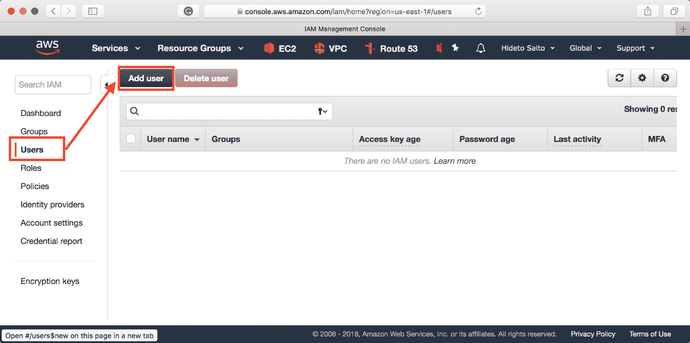

# 第六章：在 AWS 上构建 Kubernetes

本章涵盖以下内容：

+   玩转 Amazon Web Services

+   使用 kops 设置 Kubernetes

+   使用 AWS 作为 Kubernetes 云提供商

+   使用 kops 管理 AWS 上的 Kubernetes 集群

# 介绍

根据云原生计算基金会（CNCF）最近的调查，**Amazon Web Services**（**AWS**）是生产级 Kubernetes 系统的主流解决方案 ([`www.cncf.io/blog/2017/12/06/cloud-native-technologies-scaling-production-applications/`](https://www.cncf.io/blog/2017/12/06/cloud-native-technologies-scaling-production-applications/))。在本章中，您将了解 AWS 的云服务，以及这些服务如何协同工作以提供一个强大的 Kubernetes 系统。我们还将介绍 Kubernetes 运维工具 kops 的工作原理，帮助我们管理 Kubernetes 集群。让我们一起探索 AWS 上的 Kubernetes 世界！

# 玩转 Amazon Web Services

Amazon Web Services ([`aws.amazon.com`](https://aws.amazon.com/)) 是最受欢迎的公共云服务。它提供虚拟服务器（EC2）、软件定义网络（VPC）、对象存储（S3）等在线服务。它是搭建 Kubernetes 集群的合适基础设施。我们将探索 AWS，了解其基础功能。

# 准备工作

首先，您需要注册 AWS。AWS 提供免费的层级服务，允许您在 12 个月内免费使用一定数量的 AWS 资源。请访问 [`aws.amazon.com/free/`](https://aws.amazon.com/free/) 注册您的信息和信用卡。验证和激活您的账户可能需要 24 小时。

一旦您的 AWS 账户激活，我们需要创建一个**身份与访问管理**（**IAM**）用户，该用户将通过 API 控制您的 AWS 基础设施。然后，安装 AWS CLI 到您的计算机上。

# 创建一个 IAM 用户

执行以下步骤创建一个 IAM 用户：

1.  访问 AWS Web 控制台 [`console.aws.amazon.com`](https://console.aws.amazon.com)。

1.  点击 IAM（使用搜索框，这样更容易找到）：


访问 IAM 控制台

1.  在左侧导航栏中点击 Users，然后点击 Add user：



创建一个 IAM 用户

1.  输入用户名 `chap6`，然后选择程序访问：


创建 chap6 用户

1.  选择“直接附加现有策略”（如以下截图所示），然后选择以下策略：

    +   AmazonEC2FullAccess

    +   AmazonRoute53FullAcccess

    +   AmazonS3FullAccess

    +   AmazonVPCFullAccess

    +   IAMFullAccess


附加必要的策略

1.  最终，它会生成访问密钥 ID 和秘密访问密钥。复制并粘贴到您的文本编辑器中，或者点击下载 .csv 以保存到您的计算机：


下载访问密钥 ID 和秘密访问密钥

# 在 macOS 上安装 AWS CLI

使用 HomeBrew 在 macOS 上安装 `awscli`（[`brew.sh`](https://brew.sh)）；这是最简单的方法。HomeBrew 已经在 第一章中介绍过，*构建你自己的 Kubernetes 集群*，同时安装 minikube。

在你的 Mac 上通过 HomeBrew 安装 awscli，执行以下步骤：

1.  输入以下命令以更新最新的公式：

```
$ brew update
```

1.  指定安装 `awscli`：

```
$ brew install awscli
```

1.  使用 `--version` 选项验证 `aws` 命令：

```
$ aws --version
aws-cli/1.15.0 Python/3.6.5 Darwin/17.5.0 botocore/1.10.0
```

# 在 Windows 上安装 AWS CLI

在 Windows 上安装 awscli；有一个 Windows 安装程序包，这是在 Windows 上安装 awscli 的最简单方法：

1.  访问 AWS 命令行接口页面（[`aws.amazon.com/cli/`](https://aws.amazon.com/cli/)）。

1.  下载 Windows 安装程序 64 位（[`s3.amazonaws.com/aws-cli/AWSCLI64.msi`](https://s3.amazonaws.com/aws-cli/AWSCLI64.msi)）或 32 位（[`s3.amazonaws.com/aws-cli/AWSCLI32.msi`](https://s3.amazonaws.com/aws-cli/AWSCLI32.msi)），取决于你的 Windows 操作系统。

1.  启动 AWS CLI 安装程序，然后选择默认选项继续安装：


在 Windows 上安装 AWS CLI

1.  安装完成后，启动命令提示符。然后，输入 `aws` 命令并使用 `--version` 选项进行验证：


在 Windows 上显示 aws 命令

# 如何操作...

首先，你需要为 awscli 设置你的 AWS Access Key ID 和 AWS Secret Access Key。我们已经为 IAM 用户获取了 `chap6`。我们将使用该用户的 Access Key ID 和 Secret Access Key。

1.  启动终端（Windows 的命令提示符），然后使用 `aws` 命令设置 `Access Key ID` 和 `Secret Access Key`。同时，设置默认区域为 `us-east-1`：

```
$ aws configure
AWS Access Key ID [None]: <Your Access KeyID>
AWS Secret Access Key [None]: <Your Secret Access Key>
Default region name [None]: us-east-1
Default output format [None]:
```

1.  使用以下命令检查 `chap6` IAM 用户：

```
$ aws iam get-user
{
   "User": {
       "Path": "/",
       "UserName": "chap6",
       "UserId": "*********************",
       "Arn": "arn:aws:iam::***************:user/chap6",
       "CreateDate": "2018-04-14T04:22:21Z"
    }
}
```

就这样！现在你可以开始使用 AWS 启动自己的网络和实例。

# 它是如何工作的...

让我们探索 AWS 来启动一个典型的基础设施。使用 awscli 构建自己的 VPC、子网、网关和安全组。然后，启动 EC2 实例，了解 AWS 的基本使用。

# 创建 VPC 和子网

**虚拟私有云** (**VPC**) 是一种软件定义的网络。你可以在 AWS 上配置一个虚拟网络。子网位于 VPC 内，定义了网络块（**无类域间路由**（**CIDR**）），例如 `192.168.1.0/24`。

让我们通过以下步骤创建一个 VPC 和两个子网：

1.  创建一个新的 VPC，CIDR 块为 `192.168.0.0/16`（IP 范围：`192.168.0.0` – `192.168.255.255`）。然后，捕获 `VpcId`：

```
$ aws ec2 create-vpc --cidr-block 192.168.0.0/16
{
    "Vpc": {
        "CidrBlock": "192.168.0.0/16",
        "DhcpOptionsId": "dopt-3d901958",
        "State": "pending",
        "VpcId": "vpc-69cfbd12",
        "InstanceTenancy": "default",
       "Ipv6CidrBlockAssociationSet": [],
        "CidrBlockAssociationSet": [
            {
                "AssociationId": "vpc-cidr-assoc-c35411ae",
                "CidrBlock": "192.168.0.0/16",
                "CidrBlockState": {
                    "State": "associated"
                }
            }
        ],
        "IsDefault": false,
        "Tags": []
    }
}
```

1.  在 VPC (`vpc-69cfbd12`) 下创建第一个子网，该子网有 `192.168.0.0/24` 的 CIDR 块（IP 范围：`192.168.0.0` – `192.168.0.255`），并指定可用区为 `us-east-1a`。然后，捕获 `SubnetId:`

```
$ aws ec2 create-subnet --vpc-id vpc-69cfbd12 --cidr-block 192.168.0.0/24 --availability-zone us-east-1a
{
    "Subnet": {
        "AvailabilityZone": "us-east-1a",
        "AvailableIpAddressCount": 251,
        "CidrBlock": "192.168.0.0/24",
        "DefaultForAz": false,
        "MapPublicIpOnLaunch": false,
        "State": "pending",
        "SubnetId": "subnet-6296863f",
        "VpcId": "vpc-69cfbd12",
       "AssignIpv6AddressOnCreation": false,
       "Ipv6CidrBlockAssociationSet": []
    }
}
```

1.  在 `us-east-1b` 上创建第二个子网，CIDR 块为 `192.168.1.0/24`（IP 范围：`192.168.1.0` – `192.168.1.255`）。然后，捕获 `SubnetId`：

```
$ aws ec2 create-subnet --vpc-id vpc-69cfbd12 --cidr-block 192.168.1.0/24 --availability-zone us-east-1b
{
    "Subnet": {
        "AvailabilityZone": "us-east-1b",
        "AvailableIpAddressCount": 251,
        "CidrBlock": "192.168.1.0/24",
        "DefaultForAz": false,
        "MapPublicIpOnLaunch": false,
        "State": "pending",
        "SubnetId": "subnet-ce947da9",
        "VpcId": "vpc-69cfbd12",
       "AssignIpv6AddressOnCreation": false,
       "Ipv6CidrBlockAssociationSet": []
    }
}
```

1.  使用以下命令检查 VPC（`vpc-69cfbd12`）下的子网列表：

```
$ aws ec2 describe-subnets --filters "Name=vpc-id,Values=vpc-69cfbd12" --query "Subnets[*].{Vpc:VpcId,CIDR:CidrBlock,AZ:AvailabilityZone,Id:SubnetId}" --output=table
---------------------------------------------------------------------
|                          DescribeSubnets                          |
+------------+------------------+-------------------+---------------+
|     AZ     |      CIDR        |       Id          |      Vpc      |
+------------+------------------+-------------------+---------------+
|  us-east-1a|  192.168.0.0/24  |  subnet-6296863f  |  vpc-69cfbd12 |
|  us-east-1b|  192.168.1.0/24  |  subnet-ce947da9  |  vpc-69cfbd12 |
+------------+------------------+-------------------+---------------+
```

看起来不错！

# Internet 网关

要访问您的 VPC 网络，您需要有一个从互联网访问它的网关。**Internet 网关**（**IGW**）就是将互联网连接到您的 VPC 的网关。

然后，在 VPC 下的子网中，您可以设置默认路由是否指向 IGW。如果指向 IGW，该子网将被归类为公共子网。然后，您可以在公共子网上分配全球 IP 地址。

让我们通过以下步骤配置第一个子网（`192.168.0.0/24`）作为指向 IGW 的公共子网：

1.  创建 IGW 并捕获 `InternetGatewayId`：

```
$ aws ec2 create-internet-gateway
{
   "InternetGateway": {
       "Attachments": [],
       "InternetGatewayId": "igw-e50b849d",
       "Tags": []
    }
}
```

1.  将 IGW（`igw-e50b849d`）附加到您的 VPC（`vpc-69cfbd12`）上：

```
$ aws ec2 attach-internet-gateway --vpc-id vpc-69cfbd12 --internet-gateway-id igw-e50b849d
```

1.  在 VPC（`vpc-69cfbd12`）上创建路由表，然后捕获 `RouteTableId`：

```
$ aws ec2 create-route-table --vpc-id vpc-69cfbd12
{
    "RouteTable": {
       "Associations": [],
       "PropagatingVgws": [],
       "RouteTableId": "rtb-a9e791d5",
       "Routes": [
            {
               "DestinationCidrBlock": "192.168.0.0/16",
               "GatewayId": "local",
               "Origin": "CreateRouteTable",
               "State": "active"
            }
        ],
       "Tags": [],
       "VpcId": "vpc-69cfbd12"
    }
}
```

1.  将路由表（`rtb-a9e791d5`）的默认路由（`0.0.0.0/0`）设置为 IGW（`igw-e50b849d`）：

```
$ aws ec2 create-route --route-table-id rtb-a9e791d5 --gateway-id igw-e50b849d --destination-cidr-block 0.0.0.0/0
```

1.  将路由表（`rtb-a9e791d5`）关联到公共子网（`subnet-6296863f`）：

```
$ aws ec2 associate-route-table --route-table-id rtb-a9e791d5 --subnet-id subnet-6296863f
```

1.  在公共子网（`subnet-6296863f`）上启用自动分配公共 IP：

```
$ aws ec2 modify-subnet-attribute --subnet-id subnet-6296863f --map-public-ip-on-launch
```

# NAT-GW

如果子网的默认路由没有指向 IGW，会发生什么情况？该子网将被归类为私有子网，并且无法连接到互联网。然而，在某些情况下，您在私有子网中的虚拟机可能需要访问互联网。例如，下载一些安全补丁。

在这种情况下，您可以设置 NAT-GW。它允许您从私有子网访问互联网。然而，它仅允许出站流量，因此不能为私有子网分配公共 IP 地址。因此，它适用于后端实例，如数据库。

让我们创建 NAT-GW，并通过以下步骤将第二个子网（`192.168.1.0/24`）配置为指向 NAT-GW 的私有子网：

1.  NAT-GW 需要一个全球 IP 地址，因此创建**弹性 IP**（**EIP**）：

```
$ aws ec2 allocate-address
{
   "PublicIp": "18.232.18.38",
   "AllocationId": "eipalloc-bad28bb3",
   "Domain": "vpc"
}
```

1.  在公共子网（`subnet-6296863f`）上创建 NAT-GW 并分配 EIP（`eipalloc-bad28bb3`）。然后，捕获 `NatGatewayId`。

由于 NAT-GW 需要访问互联网，它必须位于公共子网，而不是私有子网。

输入以下命令：

```
$ aws ec2 create-nat-gateway --subnet-id subnet-6296863f --allocation-id eipalloc-bad28bb3
{
   "NatGateway": {
       "CreateTime": "2018-04-14T18:49:36.000Z",
       "NatGatewayAddresses": [
            {
               "AllocationId": "eipalloc-bad28bb3"
            }
       ],
       "NatGatewayId": "nat-0b12be42c575bba43",
       "State": "pending",
       "SubnetId": "subnet-6296863f",
       "VpcId": "vpc-69cfbd12"
    }
}
```

1.  创建路由表并捕获`RouteTableId`：

```
$ aws ec2 create-route-table --vpc-id vpc-69cfbd12
{
   "RouteTable": {
       "Associations": [],
       "PropagatingVgws": [],
       "RouteTableId": "rtb-70f1870c",
       "Routes": [
            {
               "DestinationCidrBlock": "192.168.0.0/16",
               "GatewayId": "local",
               "Origin": "CreateRouteTable",
               "State": "active"
            }
        ],
       "Tags": [],
       "VpcId": "vpc-69cfbd12"
    }
}
```

1.  将路由表（`rtb-70f1870c`）的默认路由（`0.0.0.0/0`）设置为 NAT-GW（`nat-0b12be42c575bba43`）：

```
$ aws ec2 create-route --route-table-id rtb-70f1870c --nat-gateway-id nat-0b12be42c575bba43 --destination-cidr-block 0.0.0.0/0
```

1.  将路由表（`rtb-70f1870c`）关联到私有子网（`subnet-ce947da`9）：

```
$ aws ec2 associate-route-table --route-table-id rtb-70f1870c --subnet-id subnet-ce947da9
```

# 安全组

在启动虚拟服务器（EC2）之前，您需要创建一个具有适当安全规则的安全组。现在，我们有两个子网，公共子网和私有子网。我们来设置公共子网，使其允许来自互联网的`ssh`（`22/tcp`）和`http`（`80/tcp`）。然后，设置私有子网，使其允许从公共子网进行 ssh 连接：

1.  在 VPC（`vpc-69cfbd12`）上为公共子网创建一个安全组：

```
$ aws ec2 create-security-group --vpc-id vpc-69cfbd12 --group-name public --description "public facing host"
{
   "GroupId": "sg-dd8a3f94"
}
```

1.  向公共安全组（`sg-dd8a3f94`）添加允许 ssh 的规则：

```
$ aws ec2 authorize-security-group-ingress --group-id sg-dd8a3f94 --protocol tcp --port 22 --cidr 0.0.0.0/0
```

1.  向公共安全组（`sg-dd8a3f94`）添加允许`http`的规则：

```
$ aws ec2 authorize-security-group-ingress --group-id sg-dd8a3f94 --protocol tcp --port 80 --cidr 0.0.0.0/0
```

1.  在 VPC（`vpc-69cfbd12`）上为私有子网创建第二个安全组：

```
$ aws ec2 create-security-group --vpc-id vpc-69cfbd12 --group-name private --description "private subnet host"
{
   "GroupId": "sg-a18c39e8"
}
```

1.  向私有安全组 (`sg-a18c39e8`) 添加一个 `ssh` 允许规则：

```
$ aws ec2 authorize-security-group-ingress --group-id sg-a18c39e8 --protocol tcp --port 22 --source-group sg-dd8a3f94
```

1.  使用以下命令检查安全组列表：

```
$ aws ec2 describe-security-groups --filters "Name=vpc-id, Values=vpc-69cfbd12" --query "SecurityGroups[*].{id:GroupId,name:GroupName}" --output table
----------------------------
|  DescribeSecurityGroups  |
+--------------+-----------+
|      id      |   name    |
+--------------+-----------+
|  sg-2ed56067 |  default  |
|  sg-a18c39e8 |  private  |
|  sg-dd8a3f94 |  public   |
+--------------+-----------+
```

# EC2

现在你需要上传你的 ssh 公钥，然后启动公共子网和私有子网的 EC2 实例：

1.  上传你的 ssh 公钥（假设你的公钥位于 `~/.ssh/id_rsa.pub`）：

```
$ aws ec2 import-key-pair --key-name=chap6-key --public-key-material "`cat ~/.ssh/id_rsa.pub`"
```

1.  启动第一个 EC2 实例，使用以下参数：

    +   使用 Amazon Linux 镜像：`ami-1853ac65`（Amazon Linux）

    +   T2.nano 实例类型：`t2.nano`

    +   Ssh 密钥：`chap6-key`

    +   公共子网：`subnet-6296863f`

    +   公共安全组：`sg-dd8a3f94`

```
$ aws ec2 run-instances --image-id ami-1853ac65 --instance-type t2.nano --key-name chap6-key --security-group-ids sg-dd8a3f94 --subnet-id subnet-6296863f
```

1.  启动第二个 EC2 实例，使用以下参数：

    +   使用 Amazon Linux 镜像：`ami-1853ac65`

    +   T2.nano 实例类型：`t2.nano`

    +   Ssh 密钥：`chap6-key`

    +   私有子网：`subnet-ce947da9`

    +   私有安全组：`sg-a18c39e8`

```
$ aws ec2 run-instances --image-id ami-1853ac65 --instance-type t2.nano --key-name chap6-key --security-group-ids sg-a18c39e8 --subnet-id subnet-ce947da9
```

1.  检查 EC2 实例的状态：

```
$ aws ec2 describe-instances --filters "Name=vpc-id,Values=vpc-69cfbd12" --query "Reservations[*].Instances[*].{id:InstanceId,PublicIP:PublicIpAddress,PrivateIP:PrivateIpAddress,Subnet:SubnetId}" --output=table
-------------------------------------------------------------------------------
|                             DescribeInstances                              |
+---------------+-----------------+------------------+------------------------+
|   PrivateIP   |   PublicIP     |     Subnet       |          id            |
+---------------+-----------------+------------------+------------------------+
|  192.168.0.206|  34.228.228.140|  subnet-6296863f|  i-03a0e49d26a2dafa4   |
|  192.168.1.218|  None           | subnet-ce947da9|  i-063080766d2f2f520   |
+---------------+-----------------+------------------+------------------------+
```

1.  从你的计算机通过 SSH（使用 `-A` 选项转发你的认证信息）连接到公共 EC2 主机：

```
$ ssh -A ec2-user@34.228.228.140
The authenticity of host '34.228.228.140 (34.228.228.140)' can't be established.
ECDSA key fingerprint is SHA256:lE7hoBhHntVDvRItnasqyHRynajn2iuHJ7U3nsWySRU.
Are you sure you want to continue connecting (yes/no)? yes
Warning: Permanently added '34.228.228.140' (ECDSA) to the list of known hosts.
       __|  __|_  )
       _|  (    /   Amazon Linux AMI
      ___|\___|___|
https://aws.amazon.com/amazon-linux-ami/2017.09-release-notes/
8 package(s) needed for security, out of 13 available
Run "sudo yum update" to apply all updates.
[ec2-user@ip-192-168-0-206 ~]$
```

1.  安装并启动 nginx 到公共 EC2 主机：

```
[ec2-user@ip-192-168-0-206 ~]$ sudo yum -y install nginx
[ec2-user@ip-192-168-0-206 ~]$ sudo service nginx start
Starting nginx:                                            [ OK  ]
```

1.  确保你能够从机器访问 nginx 服务器（见下图）：


访问公共主机上的 nginx 网络服务器

1.  从公共主机通过 SSH 连接到私有主机（必须使用私有 IP 地址）：

```
$ ssh 192.168.1.218
```

1.  确保私有主机能通过 NAT-GW 执行 yum 更新：

```
[ec2-user@ip-192-168-1-218 ~]$ sudo yum -y update
```

恭喜！你可以在 AWS 上设置自己的基础设施，如下图所示，包含以下内容：

+   一个 CIDR 为 `192.168.0.0/16` 的 VPC

+   IGW

+   NAT-GW

+   两个子网

    +   公共子网：`192.168.0.0/24` 路由到 IGW

    +   私有子网：192.168.1.0/24 路由到 NAT-GW

+   两个 EC2 实例（公共和私有）

+   两个安全组（允许公共 http/ssh 和私有 ssh）

现在，来看一下下面的图示：


AWS 组件图

在这一部分，你已经学习了如何从零开始使用 AWS。我们涵盖了它的基本用法，但在设置 Kubernetes 到 AWS 时，了解这些内容非常重要。接下来，我们将探索如何在 AWS 上设置 Kubernetes。

# 使用 kops 设置 Kubernetes

什么是 kops？它是 Kubernetes 操作的缩写（[`github.com/kubernetes/kops`](https://github.com/kubernetes/kops)）。类似于 kubeadm、minikube 和 kubespray，kops 减少了我们自己构建 Kubernetes 集群的繁重任务。它帮助创建集群，并为用户提供管理集群的接口。此外，kops 实现了更自动化的安装过程，并交付了生产级别的系统。它旨在支持主流云平台，如 AWS、GCE 和 VMware vSphere。在本教程中，我们将讨论如何使用 kops 运行 Kubernetes 集群。

# 准备就绪

在我们进行主要教程之前，需要在本地主机上安装 kops。这个步骤很简单，下载二进制文件并将其移动到执行文件的系统目录中：

```
// download the latest stable kops binary
$ curl -LO https://github.com/kubernetes/kops/releases/download/$(curl -s https://api.github.com/repos/kubernetes/kops/releases/latest | grep tag_name | cut -d '"' -f 4)/kops-linux-amd64
$ chmod +x kops-linux-amd64
$ sudo mv kops-linux-amd64 /usr/local/bin/kops
// verify the command is workable
$ kops version
Version 1.9.0 (git-cccd71e67)
```

接下来，我们需要在您的主机上准备一些 AWS 配置和集群所需的服务。请参考以下项目，并确保它们已经准备好：

+   **IAM 用户**：由于 kops 需要为您创建和构建多个 AWS 服务组件，您必须拥有一个具有 kops 所需权限的 IAM 用户。在前面的部分中，我们创建了一个名为 chap6 的 IAM 用户，并为其配置了以下具有 kops 所需权限的策略：

    +   AmazonEC2FullAccess

    +   AmazonRoute53FullAccess

    +   AmazonS3FullAccess

    +   IAMFullAccess

    +   AmazonVPCFullAccess

然后，暴露 AWS 访问密钥 ID 和密钥作为环境变量，可以使该角色在执行`kops`命令时应用于主机：

```
$ export AWS_ACCESS_KEY_ID=${string of 20 capital character combination}
$ export AWS_SECRET_ACCESS_KEY=${string of 40 character and number combination}
```

+   **为存储集群配置的 S3 桶做好准备**：在接下来的演示中，S3 桶的名称将是`kubernetes-cookbook`。

+   **为集群访问点准备一个 Route53 DNS 域名**：在接下来的演示中，我们使用的域名将是`k8s-cookbook.net`。

# 如何操作...

我们可以通过包含完整配置的参数，轻松运行一个单一命令来启动 Kubernetes 集群。以下表格描述了这些参数：

| **参数** | **描述** | **示例中的值** |
| --- | --- | --- |
| `--name` | 这是集群的名称，也将是集群入口点的域名。因此，您可以使用自定义名称的 Route53 DNS 域名，例如`{您的集群名称}.{您的 Route53 域名}`。 | `my-cluster.k8s-cookbook.net` |
| `--state` | 这是指示存储集群状态的 S3 桶，格式为`s3://{桶名称}`。 | `s3://kubernetes-cookbook` |
| `--zones` | 这是您需要构建集群的可用区。 | `us-east-1a` |
| `--cloud` | 这是云服务提供商。 | `aws` |
| `--network-cidr` | 这里，kops 帮助创建一个新的 VPC 的独立 CIDR 范围。 | `10.0.0.0/16` |
| `--master-size` | 这是 Kubernetes master 的实例大小。 | `t2.large` |
| `--node-size` | 这是 Kubernetes 节点的实例大小。 | `t2.medium` |
| `--node-count` | 这是集群中的节点数量。 | `2` |
| `--network` | 这是在该集群中使用的覆盖网络。 | `calico` |
| `--topology` | 这帮助您决定集群是否为公开的。 | `private` |
| `--ssh-public-key` | 这帮助您为堡垒服务器分配 SSH 公钥，然后我们可以通过私钥登录。 | `~/.ssh/id_rsa.pub` |
| `--bastion` | 这告诉您创建堡垒服务器。 | N/A |
| `--yes` | 这给出确认立即执行的权限。 | N/A |

现在我们准备好将配置组合成一个命令并执行它：

```
$ kops create cluster --name my-cluster.k8s-cookbook.net --state=s3://kubernetes-cookbook --zones us-east-1a --cloud aws --network-cidr 10.0.0.0/16 --master-size t2.large --node-size t2.medium --node-count 2 --networking calico --topology private --ssh-public-key ~/.ssh/id_rsa.pub --bastion --yes
...
I0408 15:19:21.794035   13144 executor.go:91] Tasks: 105 done / 105 total; 0 can run
I0408 15:19:21.794111   13144 dns.go:153] Pre-creating DNS records
I0408 15:19:22.420077   13144 update_cluster.go:248] Exporting kubecfg for cluster
kops has set your kubectl context to my-cluster.k8s-cookbook.net Cluster is starting.  It should be ready in a few minutes.
...
```

几分钟后，命令会输出前面的日志，显示 AWS 服务已为您创建并提供服务，供您使用 kops 构建的 Kubernetes 集群。您甚至可以检查 AWS 控制台，以验证它们的关系，查看类似下面的图示：


由 kops 创建的 AWS 上 Kubernetes 集群的组件

# 它是如何工作的...

从本地用户可以通过 kops 命令与 AWS 上的集群进行交互：

```
//check the cluster
$ kops get cluster --state s3://kubernetes-cookbook
NAME                         CLOUD  ZONES
my-cluster.k8s-cookbook.net  aws    us-east-1a
```

# 使用 kops 构建的 AWS 集群

此外，正如你在上一节中看到的，kops 集群创建的最后几条日志显示，客户端的环境也已经准备好。这意味着 kops 也帮助将 API 服务器安全地绑定到我们的主机。我们可以像在 Kubernetes 主节点上一样使用 `kubectl` 命令。我们需要做的就是手动安装 kubectl。安装过程与安装 kops 一样简单，只需下载二进制文件：

```
// install kubectl on local
$ curl -LO https://storage.googleapis.com/kubernetes-release/release/$(curl -s https://storage.googleapis.com/kubernetes-release/release/stable.txt)/bin/linux/amd64/kubectl
$ chmod +x kubectl
$ sudo mv kubectl /usr/local/bin/
// check the nodes in cluster on AWS
$ kubectl get nodes
NAME                          STATUS    ROLES     AGE       VERSION
ip-10-0-39-216.ec2.internal   Ready     master    2m        v1.8.7
ip-10-0-40-26.ec2.internal    Ready     node      31s       v1.8.7
ip-10-0-50-147.ec2.internal   Ready     node      33s       v1.8.7
```

然而，你仍然可以访问集群中的节点。由于集群部署在私有网络中，我们需要先登录到堡垒机服务器，然后跳转到节点进行下一步操作：

```
//add private key to ssh authentication agent
$ ssh-add ~/.ssh/id_rsa

//use your private key with flag “-i”
//we avoid it since the private key is in default location, ~/.ssh/id_rsa
//also use -A option to forward an authentication agent
$ ssh -A admin@bastion.my-cluster.k8s-cookbook.net

The programs included with the Debian GNU/Linux system are free software;
the exact distribution terms for each program are described in the
individual files in /usr/share/doc/*/copyright.

Debian GNU/Linux comes with ABSOLUTELY NO WARRANTY, to the extent
permitted by applicable law.
Last login: Sun Apr  8 19:37:31 2018 from 10.0.2.167
// access the master node with its private IP
admin@ip-10-0-0-70:~$ ssh 10.0.39.216

The programs included with the Debian GNU/Linux system are free software;
the exact distribution terms for each program are described in the
individual files in /usr/share/doc/*/copyright.

Debian GNU/Linux comes with ABSOLUTELY NO WARRANTY, to the extent
permitted by applicable law.
Last login: Sun Apr  8 19:36:22 2018 from 10.0.0.70
admin@ip-10-0-39-216:~$
```

# 删除 kops 构建的 AWS 集群

我们可以简单地使用 kops 命令删除集群，命令如下：

```
$ kops delete cluster --name my-cluster.k8s-cookbook.net --state s3://kubernetes-cookbook --yes
Deleted cluster: "my-cluster.k8s-cookbook.net"
```

它会为你清理 AWS 服务。但是一些你自己创建的服务，比如 S3 存储桶、具有强大授权的 IAM 角色，以及 Route53 域名；kops 不会删除它们。记得手动删除你不再使用的 AWS 服务。

# 另见

+   *玩转亚马逊 Web 服务*

+   *将 AWS 作为 Kubernetes 云提供商*

+   *通过 kops 管理 AWS 上的 Kubernetes 集群*

+   在第一章中，*通过 kubeadm 在 Linux 上设置 Kubernetes 集群*，*构建你自己的 Kubernetes 集群*

+   在第一章中，*通过 kubespray 在 Linux 上设置 Kubernetes 集群*，*构建你自己的 Kubernetes* *集群*

# 将 AWS 作为 Kubernetes 云提供商

从 Kubernetes 1.6 开始，引入了 **云控制器管理器** (**CCM**)，它定义了一套接口，使得不同的云提供商能够在 Kubernetes 发布周期之外演进自己的实现。谈到云提供商，你不能忽视最大的玩家：亚马逊 Web 服务。根据云原生计算基金会的数据，在 2017 年，63% 的 Kubernetes 工作负载运行在 AWS 上。AWS CloudProvider 支持的服务有 **弹性负载均衡器** (**ELB**) 和亚马逊 **弹性块存储** (**EBS**) 作为 StorageClass。

在本书编写时，Amazon Elastic Container Service for Kubernetes（Amazon EKS）仍处于预览阶段，它是 AWS 中的托管 Kubernetes 服务。理想情况下，它将与 Kubernetes 更好地集成，例如**应用负载均衡器**（**ALB**）用于 Ingress、授权和网络。目前，在 AWS 中，VPC 中每个路由表的路由限制是 50；根据要求，最多可达到 100。然而，AWS 官方文档指出，如果路由超过 50，可能会影响网络性能。虽然 kops 默认使用 kubenet 网络，它为每个节点分配一个/24 CIDR，并在 AWS VPC 的路由表中配置路由。如果集群有超过 50 个节点，这可能会导致性能下降。使用 CNI 网络可能解决这个问题。

# 正在准备中

为了跟随本食谱中的示例，您需要在 AWS 中创建一个 Kubernetes 集群。以下示例使用 kops 在 AWS 中提供一个名为`k8s-cookbook.net`的 Kubernetes 集群；如前面所示的食谱所示，设置`$KOPS_STATE_STORE`为一个 s3 桶来存储您的 kops 配置和元数据：

```
# kops create cluster --master-count 1 --node-count 2 --zones us-east-1a,us-east-1b,us-east-1c --node-size t2.micro --master-size t2.small --topology private --networking calico --authorization=rbac --cloud-labels "Environment=dev" --state $KOPS_STATE_STORE --name k8s-cookbook.net 
I0408 16:10:12.212571 34744 create_cluster.go:1318] Using SSH public key: /Users/k8s/.ssh/id_rsa.pub I0408 16:10:13.959274 34744 create_cluster.go:472] Inferred --cloud=aws from zone "us-east-1a" 
I0408 16:10:14.418739 34744 subnets.go:184] Assigned CIDR 172.20.32.0/19 to subnet us-east-1a 
I0408 16:10:14.418769 34744 subnets.go:184] Assigned CIDR 172.20.64.0/19 to subnet us-east-1b I0408 16:10:14.418777 34744 subnets.go:184] Assigned CIDR 172.20.96.0/19 to subnet us-east-1c 
I0408 16:10:14.418785 34744 subnets.go:198] Assigned CIDR 172.20.0.0/22 to subnet utility-us-east-1a I0408 16:10:14.418793 34744 subnets.go:198] Assigned CIDR 172.20.4.0/22 to subnet utility-us-east-1b 
I0408 16:10:14.418801 34744 subnets.go:198] Assigned CIDR 172.20.8.0/22 to subnet utility-us-east-1c ... 
Finally configure your cluster with: kops update cluster k8s-cookbook.net --yes
```

一旦我们运行推荐的`kops update cluster <cluster_name> --yes`命令，几分钟后，集群就会启动并运行。我们可以使用`kops validate cluster`来检查集群组件是否已全部启动：

```
# kops validate cluster
Using cluster from kubectl context: k8s-cookbook.net
Validating cluster k8s-cookbook.net
INSTANCE GROUPS
NAME                  ROLE   MACHINETYPE   MIN    MAX    SUBNETS
master-us-east-1a     Master t2.small      1      1      us-east-1a
nodes                 Node   t2.micro      2      2      us-east-1a,us-east-1b,us-east-1c
NODE STATUS           
NAME                              ROLE   READY                 
ip-172-20-44-140.ec2.internal     node   True
ip-172-20-62-204.ec2.internal     master True
ip-172-20-87-38.ec2.internal      node   True
Your cluster k8s-cookbook.net is ready
```

我们可以开始了！

# 如何操作...

在 AWS 上运行 Kubernetes 时，我们可以使用两种可能的集成方式：作为`LoadBalancer`类型的服务的 ELB，以及作为`StorageClass`的 Amazon Elastic Block Store。

# 作为 LoadBalancer 服务的弹性负载均衡器

让我们创建一个`LoadBalancer`服务，并在其下创建 Pod，这是我们在第三章中学到的，*与容器玩耍*：

```
# cat aws-service.yaml
apiVersion: apps/v1
kind: Deployment
metadata:
  name: nginx
spec:
  replicas: 3
  selector:
    matchLabels:
      run: nginx
  template:
    metadata:
      labels:
        run: nginx
    spec:
      containers:
        - image: nginx
          name: nginx
          ports:
            - containerPort: 80
---
apiVersion: v1
kind: Service
metadata:
  name: nginx
spec:
  ports:
    - port: 80
      targetPort: 80
  type: LoadBalancer
  selector:
    run: nginx
```

在前面的模板中，我们声明了一个 nginx Pod，并将其与`LoadBalancer`服务关联。该服务将数据包定向到容器端口`80`：

```
# kubectl create -f aws-service.yaml 
deployment.apps "nginx" created 
service "nginx" created 
```

让我们描述一下我们的`nginx`服务：

```
# kubectl describe svc nginx
Name:                     nginx
Namespace:                default
Labels:                   <none>
Annotations:              <none>
Selector:                 run=nginx
Type:                     LoadBalancer
IP:                       100.68.35.30
LoadBalancer Ingress:     a9da4ef1d402211e8b1240ef0c7f25d3-1251329976.us-east-1.elb.amazonaws.com
Port:                     <unset>  80/TCP
TargetPort:               80/TCP
NodePort:                 <unset>  31384/TCP
Endpoints:                100.124.40.196:80,100.99.102.130:80,100.99.102.131:80
Session Affinity:         None
External Traffic Policy:  Cluster
Events:
  Type    Reason                Age   From                Message
  ----    ------                ----  ----                -------
  Normal  EnsuringLoadBalancer  2m    service-controller  Ensuring load balancer
  Normal  EnsuredLoadBalancer   2m    service-controller  Ensured load balancer 
```

服务创建后，我们会发现 AWS CloudProvider 将提供一个经典负载均衡器，端点为`adb576a05401911e8b1240ef0c7f25d3-1637943008.us-east-1.elb.amazonaws.com`。我们可以通过 aws 命令行界面检查其详细设置（[`aws.amazon.com/cli/`](https://aws.amazon.com/cli/)）。

要安装 AWS CLI，您可以在 Mac 或 Linux 上使用 pip 安装（`pip install awscli`）；对于 Windows 用户，您需要从官方网站下载安装程序。

AWS CLI 命令的组合是`aws [options] <command> <subcommand> [<subcommand> ...] [parameters]`。要列出负载均衡器，我们将使用`aws elb describe-load-balancers`作为主要命令。使用`--load-balancer-names`参数将按名称筛选负载均衡器，对于`--output`参数，您可以选择文本、JSON 或表格格式：

```
# aws elb describe-load-balancers --load-balancer-names a9da4ef1d402211e8b1240ef0c7f25d3 --output text
LOADBALANCERDESCRIPTIONS     a9da4ef1d402211e8b1240ef0c7f25d3-1251329976.us-east-1.elb.amazonaws.com Z35SXDOTRQ7X7K 2018-04-14T20:30:45.990Z       a9da4ef1d402211e8b1240ef0c7f25d3-1251329976.us-east-1.elb.amazonaws.com a9da4ef1d402211e8b1240ef0c7f25d3    internet-facing       vpc-07374a7c
AVAILABILITYZONES     us-east-1a
AVAILABILITYZONES     us-east-1b
AVAILABILITYZONES     us-east-1c
HEALTHCHECK   2      10     TCP:31384     5      6
INSTANCES     i-03cafedc27dca591b
INSTANCES     i-060f9d17d9b473074
LISTENER      31384  TCP    80     TCP
SECURITYGROUPS sg-3b4efb72
SOURCESECURITYGROUP   k8s-elb-a9da4ef1d402211e8b1240ef0c7f25d3   516726565417
SUBNETS subnet-088f9d27
SUBNETS subnet-e7ec0580
SUBNETS subnet-f38191ae
```

如果我们访问此 ELB 端点端口`80`，我们将看到 nginx 欢迎页面：


访问 ELB 端点以访问 LoadBalancer Service

在后台，AWS CloudProvider 创建了一个 AWS 弹性负载均衡器，并通过我们刚刚定义的 Service 配置了其入口规则和监听器。以下是流量进入 Pods 的示意图：


Kubernetes 资源与 AWS 资源对于 LoadBalancer 类型 Service 的示意图

外部负载均衡器接收请求并使用轮询算法将其转发到 EC2 实例。对于 Kubernetes，流量通过 NodePort 进入 Service，启动 Service 到 Pod 的通信。关于外部到 Service 和 Service 到 Pod 的通信，您可以参考第三章，*与容器玩耍*。

# 弹性块存储作为 StorageClass

我们在第二章，*Kubernetes 概念解析* 中了解了 Volumes。我们知道 `PersistentVolumeClaims` 用于将存储资源从用户中抽象出来。它可以通过 `StorageClass` 动态提供 `PersistentVolume`。`StorageClass` 中的默认提供者在 **AWS CloudProvider 中是弹性块存储服务**‎ (**aws-ebs**)。每当你请求一个 PVC 时，aws-ebs 提供者会在 AWS EBS 中创建一个卷。

让我们检查一下我们集群中的存储类：

```
// list all storageclass
# kubectl get storageclass
NAME            PROVISIONER             AGE
default         kubernetes.io/aws-ebs   2h
gp2 (default)   kubernetes.io/aws-ebs   2h
In this recipe, we'll reuse the PVC example we mentioned in Chapter 2-6:
# cat chapter2/2-6_volumes/2-6-7_pvc.yaml
apiVersion: "v1"
kind: "PersistentVolumeClaim"
metadata:
  name: "pvclaim01"
spec:
  accessModes:
    - ReadWriteOnce
  resources:
    requests:
      storage: 1Gi
// create pvc
# kubectl create -f chapter2/2-6_volumes/2-6-7_pvc.yaml
persistentvolumeclaim "pvclaim01" created
// check pvc is created successfully.
# kubectl get pvc
NAME        STATUS    VOLUME                                     CAPACITY   
pvclaim01   Bound     pvc-e3d881d4-402e-11e8-b124-0ef0c7f25d36   1Gi        
ACCESS    MODES   STORAGECLASS   AGE
RWO            gp2            16m
```

创建 PVC 后，将创建一个关联的 PV：

```
# kubectl get pv
NAME                                       CAPACITY   ACCESS MODES   
pvc-e3d881d4-402e-11e8-b124-0ef0c7f25d36   1Gi        RWO
RECLAIM POLICY   STATUS    CLAIM               STORAGECLASS   REASON    AGE
Delete           Bound     default/pvclaim01   gp2                      16m
```

你可以在这里更仔细地查看 PV：

```
# kubectl describe pv pvc-e3d881d4-402e-11e8-b124-0ef0c7f25d36
Name:            pvc-e3d881d4-402e-11e8-b124-0ef0c7f25d36
Labels:          failure-domain.beta.kubernetes.io/region=us-east-1
                 failure-domain.beta.kubernetes.io/zone=us-east-1a
Annotations:     kubernetes.io/createdby=aws-ebs-dynamic-provisioner
                 pv.kubernetes.io/bound-by-controller=yes
                 pv.kubernetes.io/provisioned-by=kubernetes.io/aws-ebs
Claim:           default/pvclaim01
...
Source:
    Type:       AWSElasticBlockStore (a Persistent Disk resource in AWS)
    VolumeID:   aws://us-east-1a/vol-035ca31b9cc1820d7
    FSType:     ext4
    Partition:  0
    ReadOnly:   false
```

我们可以发现它与我们刚刚创建的 `pvclaim01` 相关联，并且源类型是 `AWSElasticBlockStore`，正如预期的那样。

我们可以使用 AWS CLI 检查我们在 EBS 中创建的卷。使用 `--filter Name=tag-`value 我们可以筛选 EBS 中的卷：

```
// aws ec2 describe-volumes --filter Name=tag-value,Values=$PV_NAME
# aws ec2 describe-volumes --filter Name=tag-value,Values="pvc-e3d881d4-402e-11e8-b124-0ef0c7f25d36"{
    "Volumes": [
        {
            "AvailabilityZone": "us-east-1a",
             "Tags": [
                {   "Value": "k8s-cookbook.net",
                    "Key": "KubernetesCluster" },
                {   "Value": "default",
                    "Key": "kubernetes.io/created-for/pvc/namespace" },
                {   "Value": "k8s-cookbook.net-dynamic-pvc-e3d881d4-402e-11e8-b124-0ef0c7f25d36",
                    "Key": "Name" },
                {   "Value": "pvclaim01",
                    "Key": "kubernetes.io/created-for/pvc/name" },
                {   "Value": "owned",
                    "Key": "kubernetes.io/cluster/k8s-cookbook.net" },
                {   "Value": "pvc-e3d881d4-402e-11e8-b124-0ef0c7f25d36",
                    "Key": "kubernetes.io/created-for/pv/name" }],
            "VolumeType": "gp2",
            "VolumeId": "vol-035ca31b9cc1820d7",
         ...
        }    
   ]
}
```

我们可以看到 EBS 资源已经被标记了许多不同的值：通过观察这些标签，我们可以知道这个 EBS 卷与哪个 Kubernetes 集群、命名空间、PVC 和 PV 相关联。

由于 StorageClass 和 CloudProvider 支持动态提供，卷管理不再是一个巨大痛点。我们可以即时创建和销毁 PV。

# 还有更多…

在编写本书时，Kubernetes 1.10 尚未提供支持 AWS CloudProvider 中 Ingress 集成的原生方式（理想情况下是通过应用负载均衡器）。作为替代方案，kops 提供了可以实现这一功能的附加组件。第一个是 ingress-nginx ([`github.com/kubernetes/kops/tree/master/addons/ingress-nginx`](https://github.com/kubernetes/kops/tree/master/addons/ingress-nginx))，它由 nginx ([`nginx.org`](https://nginx.org)) 和 AWS 弹性负载均衡器支持。请求会通过 ELB 到达 nginx，nginx 会根据 Ingress 中的路径定义分发请求。另一个替代方案是运行 skipper 作为 kubernetes-ingress-controller ([`zalando.github.io/skipper/dataclients/kubernetes`](https://zalando.github.io/skipper/dataclients/kubernetes))。kops 还提供了附加组件，帮助您部署并利用 skipper 和 AWS 应用负载均衡器 ([`github.com/kubernetes/kops/tree/master/addons/kube-ingress-aws-controller`](https://github.com/kubernetes/kops/tree/master/addons/kube-ingress-aws-controller))。

我们预计 CCM 和 Amazon EKS ([`aws.amazon.com/eks/`](https://aws.amazon.com/eks/)) 将通过 AWS 应用负载均衡器提供更多原生的 Ingress 集成，未来还会有更多更新！

# 使用 kops 管理 AWS 上的 Kubernetes 集群

在 kops 中，Kubernetes 主节点和节点都作为 AWS 中的自动扩展组运行。在 kops 中，这个概念被称为 **实例组** (**ig**)，表示集群中相同类型的实例。类似于跨可用区的节点，或每个可用区的主节点，我们可以通过 kops 命令行检查：

```
// kops get instancegroups or kops get ig 
# kops get instancegroups --name k8s-cookbook.net 
NAME ROLE MACHINETYPE MIN MAX ZONES 
master-us-east-1a Master t2.small 1 1 us-east-1a 
nodes Node t2.micro 2 2 us-east-1a,us-east-1b,us-east-1c 
```

使用 kops，您可以更改实例类型，调整实例组（主节点和节点）大小，进行滚动更新，升级集群。kops 还支持针对特定 AWS 功能的配置，例如为集群中的实例启用 AWS 详细监控。

# 准备工作

执行本配方时，您需要在 AWS 上通过 kops 部署的 Kubernetes 集群。您需要按照本章前面的配方来启动一个集群。这里，我们将使用之前配方中创建的相同集群：

```
# kops validate cluster
Using cluster from kubectl context: k8s-cookbook.net
Validating cluster k8s-cookbook.net
INSTANCE GROUPS
NAME                  ROLE   MACHINETYPE   MIN    MAX    SUBNETS
master-us-east-1a     Master t2.small      1      1      us-east-1a
nodes                 Node   t2.micro      2      2      us-east-1a,us-east-1b,us-east-1c
NODE STATUS
NAME                         ROLE   READY
ip-172-20-44-140.ec2.internal       node   True
ip-172-20-62-204.ec2.internal       master True
ip-172-20-87-38.ec2.internal node   True
Your cluster k8s-cookbook.net is ready
```

在之前的配方中，我们将 `KOPS_STATE_STORE` 环境变量设置为我们的 S3 存储桶名称之一，格式为 `s3://<bucket_name>`，用于存储 kops 配置和元数据。

# 操作步骤...

接下来的子节将介绍集群管理员可能会遇到的一些常见操作示例。

# 修改和调整实例组

如果您手动部署所有实例，修改实例组可能会很麻烦。您需要逐一更新实例或重新启动它们。而使用 kops，我们可以轻松地执行更新而不感到困难。

# 更新节点

使用 kops edit 命令，我们可以修改实例类型和节点数量：

```
// kops edit ig nodes
# kops edit instancegroups nodes --name k8s-cookbook.net
apiVersion: kops/v1alpha2
kind: InstanceGroup
metadata:
  creationTimestamp: 2018-04-14T19:06:47Z
  labels:
    kops.k8s.io/cluster: k8s-cookbook.net
  name: nodes
spec:
  image: kope.io/k8s-1.8-debian-jessie-amd64-hvm-ebs-2018-02-08
  machineType: t2.micro
  maxSize: 2
  minSize: 2
  nodeLabels:
    kops.k8s.io/instancegroup: nodes
  role: Node
  subnets:
  - us-east-1a
  - us-east-1b
  - us-east-1c
```

在本示例中，我们将 minSize 和 maxSize 从 `2` 修改为 `3`。修改后，我们需要运行 kops update 来使其生效：

```
# kops update cluster k8s-cookbook.net --yes
...
I0414 21:23:52.505171   16291 update_cluster.go:291] Exporting kubecfg for cluster
kops has set your kubectl context to k8s-cookbook.net
Cluster changes have been applied to the cloud.
Changes may require instances to restart: kops rolling-update cluster
```

某些更新需要滚动更新集群。在这个示例中，kops 已经更新了 AWS 自动扩展组中的配置。AWS 将启动一个新实例以适应这个变化。以下是来自 AWS 自动扩展组控制台的截图：


nodes_in_AWS_Auto_Scaling_Groups

我们可以看到配置已更新，AWS 正在扩展新实例。几分钟后，我们可以通过 `kops validate` 或 `kubectl get nodes` 检查集群状态：

```
# kops validate cluster
Using cluster from kubectl context: k8s-cookbook.net
Validating cluster k8s-cookbook.net
INSTANCE GROUPS
NAME                  ROLE   MACHINETYPE   MIN    MAX    SUBNETS
master-us-east-1a     Master t2.small      1      1      us-east-1a
nodes                 Node   t2.micro      3      3      us-east-1a,us-east-1b,us-east-1c
NODE STATUS
NAME                         ROLE   READY
ip-172-20-119-170.ec2.internal      node   True
ip-172-20-44-140.ec2.internal       node   True
ip-172-20-62-204.ec2.internal       master True
ip-172-20-87-38.ec2.internal node   True
```

一切看起来都很好！

# 更新主节点

更新主节点与更新节点相同。请注意，同一可用区中的主节点在同一实例组内。这意味着你无法向主节点实例组中添加额外的子网。在以下示例中，我们将把主节点数量从 1 调整为 2。

在这个配方中，我们只将主节点数量设为 1。在实际应用中，推荐的做法是将主节点部署到至少两个可用区，每个可用区配置三个主节点（一个 kops 实例组）。你可以通过启动集群时使用 `--master-count` 和 `--master-zones` 参数来实现。

现在请看以下命令：

```
# kops edit ig master-us-east-1a
apiVersion: kops/v1alpha2
kind: InstanceGroup
metadata:
  creationTimestamp: 2018-04-14T19:06:47Z
  labels:
    kops.k8s.io/cluster: k8s-cookbook.net
  name: master-us-east-1a
spec:
  image: kope.io/k8s-1.8-debian-jessie-amd64-hvm-ebs-2018-02-08
  machineType: t2.small
  maxSize: 1
  minSize: 1
  nodeLabels:
    kops.k8s.io/instancegroup: master-us-east-1a
  role: Master
  subnets:
  - us-east-1a
```

在应用更改之前，我们可以在 dry run 模式下运行更新集群命令，不带 `--yes` 参数：

```
# kops update cluster k8s-cookbook.net
...
Will modify resources:
  AutoscalingGroup/master-us-east-1a.masters.k8s-cookbook.net
       MinSize                1 -> 2
       MaxSize                1 -> 2
Must specify --yes to apply changes
```

在验证 dry run 消息符合预期后，我们可以按以下方式执行更新。在这种情况下，我们必须进行滚动更新。

如何判断是否需要滚动更新

如果我们在之前的示例中没有运行 kops 滚动更新，当运行 kops validate cluster 时，kops 会显示验证错误：

验证错误

KIND                NAME                          MESSAGE

InstanceGroup     `master-us-east-1a` 实例组 `master-us-east-1a` 的节点不足，1 对 2

记得将 k8s-cookbook.net 替换为你的集群名称。

```
# kops update cluster k8s-cookbook.net –-yes && kops rolling-update cluster
...
Using cluster from kubectl context: k8s-cookbook.net
NAME                  STATUS NEEDUPDATE    READY  MIN    MAX    NODES
master-us-east-1a     Ready  0             2      2      2      1
nodes                 Ready  0             3      3      3      3
No rolling-update required.
```

就像修改节点一样，我们可以使用 `kubectl get nodes` 和 `kops validate cluster` 来检查新主节点是否已加入集群。

# 升级集群

为了演示如何升级 Kubernetes 版本，我们将首先使用 1.8.7 版本启动集群。有关参数的详细说明，请参考本章前面的配方。请输入以下命令：

```
// launch a cluster with additional parameter --kubernetes-version 1.8.7 # kops create cluster --master-count 1 --node-count 2 --zones us-east-1a,us-east-1b,us-east-1c --node-size t2.micro --master-size t2.small --topology private --networking calico --authorization=rbac --cloud-labels "Environment=dev" --state $KOPS_STATE_STORE --kubernetes-version 1.8.7 --name k8s-cookbook.net --yes 
```

几分钟后，我们可以看到主节点和节点都已经升级到版本 1.8.7：

```
# kubectl get nodes 
NAME STATUS ROLES AGE VERSION 
ip-172-20-44-128.ec2.internal Ready master 3m v1.8.7 
ip-172-20-55-191.ec2.internal Ready node 1m v1.8.7 
ip-172-20-64-30.ec2.internal Ready node 1m v1.8.7
```

在以下示例中，我们将演示如何通过 kops 将 Kubernetes 集群从 1.8.7 升级到 1.9.3。首先，运行 kops upgrade cluster 命令，kops 将显示我们可以升级到的最新版本：

```
# kops upgrade cluster k8s-cookbook.net --yes 
ITEM PROPERTY OLD NEW 
Cluster KubernetesVersion 1.8.7 1.9.3 
Updates applied to configuration. You can now apply these changes, 
using `kops update cluster k8s-cookbook.net` 
```

这表明配置已经更新，我们现在需要更新集群。我们先运行 dryrun 模式的命令，检查将要修改的内容：

```
// update cluster
# kops update cluster k8s-cookbook.net
...
Will modify resources:
  LaunchConfiguration/master-us-east-1a.masters.k8s-cookbook.net
       UserData
                             ...
                             +   image: gcr.io/google_containers/kube-apiserver:v1.9.3
                             -   image: gcr.io/google_containers/kube-apiserver:v1.8.7
                             ...
                             +   image: gcr.io/google_containers/kube-controller
manager:v1.9.3
                             -   image: gcr.io/google_containers/kube-controller-manager:v1.8.7
                             ...
                                 hostnameOverride: '@aws'
                             +   image: gcr.io/google_containers/kube-proxy:v1.9.3
                             -   image: gcr.io/google_containers/kube-proxy:v1.8.7
                                 logLevel: 2
                               kubeScheduler:
                             +   image: gcr.io/google_containers/kube-scheduler:v1.9.3
                             -   image: gcr.io/google_containers/kube
scheduler:v1.8.7
                             ...
Must specify --yes to apply changes
```

我们可以看到所有组件已从 v1.8.7 升级到 v1.9.3，并出现在自动扩展启动配置中。验证一切正常后，我们可以运行相同的命令，并添加 `--yes` 参数：

```
// run the same command with --yes 
# kops update cluster k8s-cookbook.net --yes 
... 
kops has set your kubectl context to k8s-cookbook.net 
Cluster changes have been applied to the cloud. 
Changes may require instances to restart: kops rolling-update cluster 
```

在这种情况下，我们需要对集群执行滚动更新：

```
# kops rolling-update cluster --yes
Using cluster from kubectl context: k8s-cookbook.net
NAME                  STATUS        NEEDUPDATE    READY  MIN    MAX    NODES
master-us-east-1a     NeedsUpdate   1             0      1      1      1
nodes                 NeedsUpdate   2             0      2      2      2
I0414 22:45:05.887024   51333 rollingupdate.go:193] Rolling update completed for cluster "k8s-cookbook.net"!
```

所有节点已升级到 1.9.3！在执行滚动更新时，kops 会首先清空一个实例，然后将节点标记为不可调度（cordon）。自动扩展组将启动另一个带有更新用户数据的节点，该数据包含包含更新的 Kubernetes 组件镜像。为了避免停机，您应该将多个主节点和节点作为基本部署。

滚动更新完成后，我们可以通过`kubectl get nodes`检查集群版本：

```
# kubectl get nodes
NAME                            STATUS    ROLES     AGE       VERSION
ip-172-20-116-81.ec2.internal   Ready     node      14m       v1.9.3
ip-172-20-41-113.ec2.internal   Ready     master    17m       v1.9.3
ip-172-20-56-230.ec2.internal   Ready     node      8m        v1.9.3
```

所有节点已升级到 1.9.3！

# 还有更多内容...

在 kops 中，有许多有用的插件，如自动扩展节点（[`github.com/kubernetes/kops/tree/master/addons/cluster-autoscaler`](https://github.com/kubernetes/kops/tree/master/addons/cluster-autoscaler)）和将服务映射到 Route53 中的记录（[`github.com/kubernetes/kops/tree/master/addons/route53-mapper`](https://github.com/kubernetes/kops/tree/master/addons/route53-mapper)）。请参考插件页面以了解更多信息！

# 另请参见

+   第二章中的*部署 API*，*走进 Kubernetes 概念*

+   第四章中的*构建多个主节点*，*构建高可用性集群*

+   第七章中的*管理 GKE 上的 Kubernetes 集群*，*在 GCP 上构建 Kubernetes*
