# 第七章：在 GCP 上构建 Kubernetes

在本章中，我们将在以下配方中使用**Google Cloud Platform**（**GCP**）：

+   玩转 GCP

+   通过**Google Kubernetes Engine**（**GKE**）设置托管的 Kubernetes

+   在 GKE 上探索 Kubernetes CloudProvider

+   在 GKE 上管理 Kubernetes 集群

# 玩转 GCP

GCP 在公有云行业越来越受欢迎。它有一些类似于 AWS 的概念，比如 VPC、计算引擎、持久磁盘、负载均衡和多个托管服务。最有趣的服务是 GKE，这是一个托管的 Kubernetes 集群。我们将探索如何使用 GCP 和 GKE。

# 准备工作

要使用 GCP，你需要有一个 Google 账户，如 Gmail（[`mail.google.com/mail/`](https://mail.google.com/mail/)），很多人已经拥有。然后，按照以下步骤使用你的 Google 账户注册 GCP：

1.  访问[`cloud.google.com`](https://cloud.google.com)网站，然后点击“免费试用”按钮

1.  使用你的 Google 账户登录 Google

1.  在 GCP 注册并输入你的个人信息和账单信息

就这样！

注册完成后，你会看到 GCP Web 控制台页面。刚开始时，它可能会要求你创建一个项目；默认名称可能是“我的第一个项目”。你可以保留这个名称，但我们将在本章中创建另一个项目，更好地帮助你理解。

GCP Web 控制台作为第一步已经足够。但不推荐 DevOps 持续使用 Web 控制台，因为人工输入总是会引发人为错误，而且 Google 未来可能会更改 Web 控制台的设计。

因此，我们将使用 CLI。GCP 提供了一款名为 Cloud SDK 的 CLI 工具（[`cloud.google.com/sdk/`](https://cloud.google.com/sdk/)）。所以，让我们创建一个新的 GCP 项目，并在你的机器上安装 Cloud SDK。

# 创建一个 GCP 项目

我们将按照以下步骤从零开始创建一个新项目。这将帮助你理解 GCP 项目是如何工作的：

1.  点击“我的第一个项目”链接，进入项目页面：

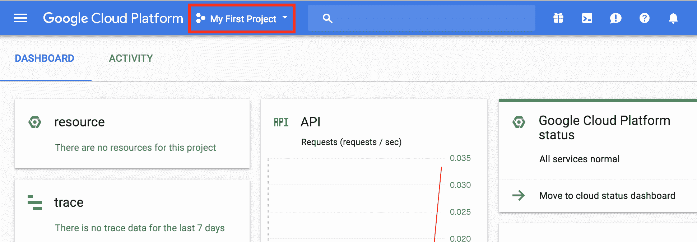

导航到项目链接

1.  你可能会看到自己的项目供你选择，但这次点击+按钮创建一个新项目：

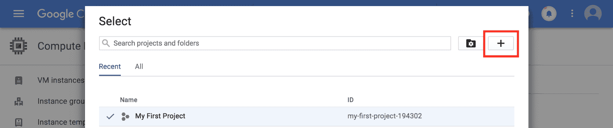

创建一个新项目

1.  输入项目名称为`Kubernetes Cookbook`。然后，GCP 会生成并分配一个项目 ID，例如 kubernetes-cookbook-12345。请记住这个项目 ID。

你可能会注意到，你的项目 ID 并不是 kubernetes-cookbook，就像下面截图中显示的 kubernetes-cookbook-194302 一样。即使你点击编辑尝试更改为 kubernetes-cookbook，也不允许更改，因为项目 ID 是所有 GCP 用户唯一的字符串。我们已经使用了 kubernetes-cookbook 这个项目 ID。

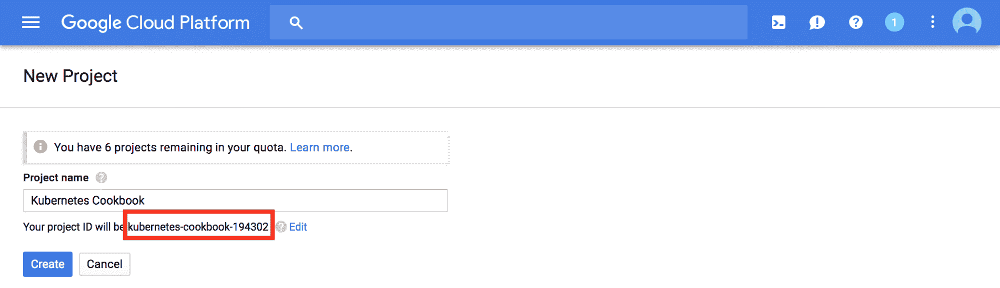

项目名称和项目 ID

1.  几分钟后，你的项目就准备好了。返回顶部横幅的项目选择页面，然后选择你的 Kubernetes Cookbook 项目：

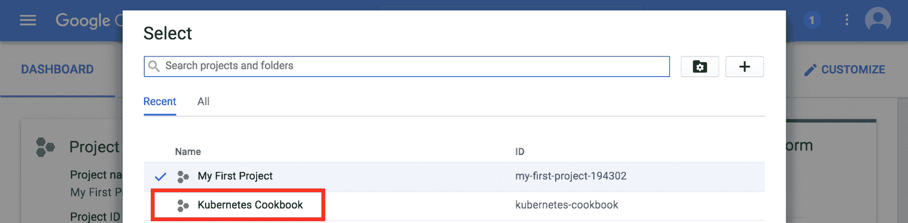

选择 Kubernetes Cookbook 项目

完成！你可以随时切换到你的项目和 Kubernetes Cookbook 项目。这是一个隔离的环境；任何 VPC、VM、IAM 用户，甚至计费方式都是独立的。

# 安装 Cloud SDK

接下来，在你的机器上安装 Cloud SDK。它支持 Windows、Mac 和 Linux 平台。所有这些平台都需要 Python 解释器版本 2.7，但大多数 macOS 和 Linux 安装使用默认值。

另一方面，Windows 默认没有 Python 解释器。然而，在 Windows 的 Cloud SDK 安装程序中，可以安装 Python。让我们一步步在 Windows 和 macOS 上安装 Cloud SDK。

# 在 Windows 上安装 Cloud SDK

Cloud SDK 提供了适用于 Windows 的安装程序。它还包括 Windows 上的 Python 解释器。请按照以下步骤在你的 Windows 机器上安装：

1.  在 Windows 上下载 Cloud SDK 安装程序（[`dl.google.com/dl/cloudsdk/channels/rapid/GoogleCloudSDKInstaller.exe`](https://dl.google.com/dl/cloudsdk/channels/rapid/GoogleCloudSDKInstaller.exe)）。

1.  运行 Cloud SDK 安装程序。

如果你从未在 Windows 机器上安装过 Python 解释器，你需要选择 Bundled Python 选项：

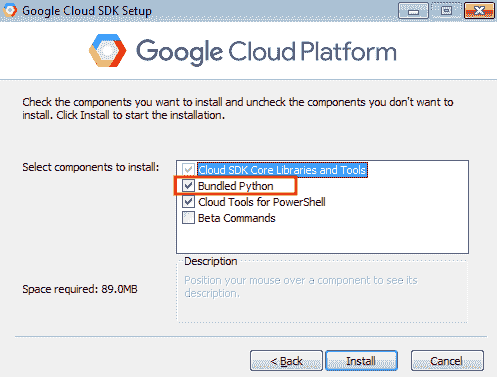

Windows 的 Cloud SDK 安装程序

1.  除此之外，继续使用默认选项完成安装。

1.  安装完成后，你可以在 Google Cloud SDK 程序组中找到 Google Cloud SDK Shell。点击它启动 Google Cloud SDK Shell：

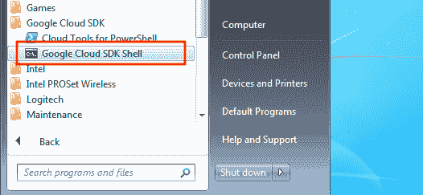

Google Cloud SDK 程序组中的 Google Cloud SDK Shell

1.  输入 `gcloud info` 来检查是否能看到 Cloud SDK 版本：

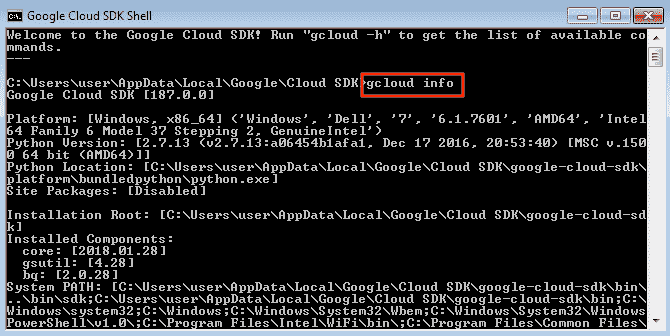

在 Windows 上运行 gcloud 命令

# 在 Linux 和 macOS 上安装 Cloud SDK

在 Linux 和 macOS 上安装 Cloud SDK 遵循此处列出的步骤。让我们在你的主目录下安装 Cloud SDK：

1.  打开终端。

1.  输入以下命令以下载并运行 Cloud SDK 安装程序：

```
$ curl https://sdk.cloud.google.com | bash
```

1.  它会询问你希望的安装目录。默认情况下，它会安装在你的主目录下。所以，输入 `return`：

```
Installation directory (this will create a google-cloud-sdk subdirectory) (/Users/saito):
```

1.  它会询问是否发送用户使用数据；当发生崩溃时，它会发送一些信息。根据你的隐私政策，如果你不希望将任何数据发送给 Google，选择 `n`。否则选择 `Y` 来改善其质量：

```
Do you want to help improve the Google Cloud SDK (Y/n)? n
```

1.  它会询问是否通过添加 `gcloud` 命令到你的命令搜索路径中来更新 `.bash_profile`；输入 `y` 继续：

```
Modify profile to update your $PATH and enable shell command
completion?
Do you want to continue (Y/n)?  y
The Google Cloud SDK installer will now prompt you to update an rc
file to bring the Google Cloud CLIs into your environment.
Enter a path to an rc file to update, or leave blank to use
[/Users/saito/.bash_profile]:
```

1.  打开另一个终端，或者输入 `exec -l $SHELL` 来刷新你的命令搜索路径：

```
//reload .bash_profile
$ exec -l $SHELL

//check gcloud command is in your search path
$ which gcloud
/Users/saito/google-cloud-sdk/bin/gcloud
```

1.  输入 `gcloud info` 来检查是否能看到 Cloud SDK 版本：

```
$ gcloud info
Google Cloud SDK [187.0.0]
Platform: [Mac OS X, x86_64] ('Darwin', 'Hideto-Saito-no-MacBook.local', '17.4.0', 'Darwin Kernel Version 17.4.0: Sun Dec 17 09:19:54 PST 2017; root:xnu-4570.41.2~1/RELEASE_X86_64', 'x86_64', 'i386')
Python Version: [2.7.14 (default, Jan 21 2018, 12:22:04)  [GCC 4.2.1 Compatible Apple LLVM 9.0.0 (clang-900.0.38)]]
Python Location: [/usr/local/Cellar/python/2.7.14_2/Frameworks/Python.framework/Versions/2.7/Resources/Python.app/Contents/MacOS/Python]
```

现在，你可以开始配置 Cloud SDK 了！

# 配置 Cloud SDK

你可以通过以下步骤配置 Windows 和 Linux/macOS 版 Cloud SDK：

1.  启动 Google Cloud SDK Shell（Windows）或打开终端（Linux/macOS）。

1.  输入`gcloud init`；它会要求你登录到 Google 账户。输入`y`并按回车：

```
You must log in to continue. Would you like to log in (Y/n)? y
```

1.  它将打开一个浏览器，导航到 Google 登录页面；请使用你的 Google 账户登录 GCP 账户。

1.  它会询问 Cloud SDK 是否可以访问你的 Google 账户信息。点击`ALLOW`按钮。

1.  回到终端——它会询问你想使用哪个项目。我们选择你创建的 Kubernetes Cookbook 项目：

```
Pick cloud project to use:
 [1] my-first-project-194302
 [2] kubernetes-cookbook
 [3] Create a new project
Please enter numeric choice or text value (must exactly match list item):  2
```

1.  它会询问你是否配置`Compute Engine`。这次我们输入`n`跳过此步骤：

```
Do you want to configure Google Compute Engine
(https://cloud.google.com/compute) settings (Y/n)?  n
```

现在你可以开始使用 Cloud SDK 控制 GCP 了。我们将创建 VPC、子网和防火墙规则，然后启动一个 VM 实例来设置我们的 GCP 基础设施。

如果你选择了错误的项目，或者想重新尝试，随时可以通过`gcloud init`命令重新配置你的设置。

# 如何操作...

我们将通过 GCP 的基本功能来设置 Kubernetes Cookbook 项目下的基础设施。通过使用`gcloud`命令，我们将创建以下组件：

+   一个新的 VPC

+   在 VPC 中有两个子网（`us-central1`和`us-east1`）

+   三个防火墙规则（`public-ssh`，`public-http`，和`private-ssh`）

+   我们将把你的 ssh 公钥添加到项目范围的元数据中

总体而言，你的基础设施将类似于以下内容。让我们逐一配置这些组件：

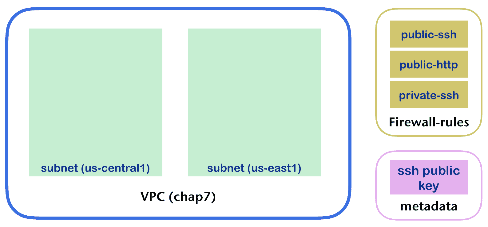

目标基础设施

# 创建 VPC

GCP 中的 VPC 与 AWS 类似，但无需绑定特定区域，也无需设置 CIDR 地址范围。这意味着你可以创建一个覆盖所有区域的 VPC。默认情况下，你的 Kubernetes Cookbook 项目有一个默认的 VPC。

然而，为了更好地理解，我们将按照以下步骤创建一个新的 VPC：

1.  运行`gcloud compute networks`命令创建一个新的 VPC。名称为`chap7`，子网模式为`custom`，这意味着子网不会自动创建。所以下一步我们将手动添加子网：

```
$ gcloud compute networks create chap7 --subnet-mode=custom
```

1.  检查 VPC 列表；你应该有两个 VPC，`default` VPC 和`chap7` VPC：

```
$ gcloud compute networks list
NAME     SUBNET_MODE  BGP_ROUTING_MODE  IPV4_RANGE  GATEWAY_IPV4
chap7    CUSTOM       REGIONAL
default  AUTO         REGIONAL
```

# 创建子网

我们将按照以下步骤，在`chap7` VPC（网络）下创建两个子网：

1.  为了创建一个子网，你必须选择区域。通过输入`gcloud compute regions list`，你可以查看哪些区域对你可用：

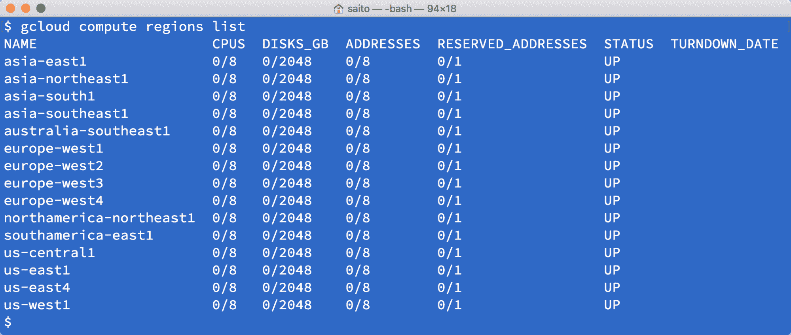

显示 GCP 区域列表

1.  我们选择`us-central1`和`us-east1`，在`chap7` VPC 下创建两个子网，配置如下：

| **子网名称** | **VPC** | **CIDR 范围** | **区域** |
| --- | --- | --- | --- |
| `chap7-us-central1` | `chap7` | `192.168.1.0/24` | `us-central1` |
| `chap7-us-east1` | `chap7` | `192.168.2.0/24` | `us-east1` |

```
$ gcloud compute networks subnets create chap7-us-central1 --network=chap7 --range=192.168.1.0/24 --region us-central1

$ gcloud compute networks subnets create chap7-us-east1 --network=chap7 --range=192.168.2.0/24 --region us-east1
```

1.  查看以下命令，以检查子网是否配置正确：

```
$ gcloud compute networks subnets list --network=chap7
NAME               REGION       NETWORK  RANGE
chap7-us-east1     us-east1     chap7    192.168.2.0/24
chap7-us-central1  us-central1  chap7    192.168.1.0/24
```

# 创建防火墙规则

防火墙规则类似于 AWS 的安全组，你可以定义入站和出站数据包过滤器。它们使用网络标签，作为标签，用来区分防火墙规则和 VM 实例。因此，VM 实例可以指定零个或多个网络标签，防火墙规则将应用于具有相同网络标签的 VM 实例。

因此，我们需要在创建防火墙规则时设置目标网络标签。总体来说，我们将创建三条防火墙规则，具有以下配置：

| **防火墙规则名称** | **目标 VPC** | **允许端口** | **允许来自** | **目标网络标签** |
| --- | --- | --- | --- | --- |
| `public-ssh` | `chap7` | `ssh` (22/tcp) | All (`0.0.0.0/0`) | public |
| `public-http` | `chap7` | `http` (80/tcp) | All (`0.0.0.0/0`) | public |
| `private-ssh` | `chap7` | `ssh` (22/tcp) | Host which has a public network tag | private |

1.  创建一个`public-ssh`规则：

```
$ gcloud compute firewall-rules create public-ssh --network=chap7 --allow="tcp:22" --source-ranges="0.0.0.0/0" --target-tags="public"
```

1.  创建一个`public-http`规则：

```
$ gcloud compute firewall-rules create public-http --network=chap7 --allow="tcp:80" --source-ranges="0.0.0.0/0" --target-tags="public"
```

1.  创建一个`private-ssh`规则：

```
$ gcloud compute firewall-rules create private-ssh --network=chap7 --allow="tcp:22" --source-tags="public" --target-tags="private"
```

1.  检查所有防火墙规则：

```
$ gcloud compute firewall-rules list --filter='NETWORK=chap7'
NAME         NETWORK  DIRECTION  PRIORITY  ALLOW   DENY
private-ssh  chap7    INGRESS    1000      tcp:22
public-http  chap7    INGRESS    1000      tcp:80
public-ssh   chap7    INGRESS    1000      tcp:22
```

# 将你的 SSH 公钥添加到 GCP

在启动 VM 实例之前，你需要上传你的 SSH 公钥，以便登录到 VM。如果你没有任何 SSH 密钥，你需要运行`ssh-keygen`命令生成一对密钥（公钥和私钥）。假设你有一个公钥`~/.ssh/id_rsa.pub`和一个私钥`~/.ssh/id_rsa`

1.  使用`whoami`命令检查你的登录用户名，然后使用`gcloud compute config-ssh`通过以下命令上传你的密钥：

```
$ whoami
saito

$ gcloud compute config-ssh --ssh-key-file=~/.ssh/id_rsa
```

1.  检查你的 SSH 公钥是否已作为元数据注册：

```
$ gcloud compute project-info describe --format=json
{
  "commonInstanceMetadata": {
    "fingerprint": "fAqDGp0oSMs=",
    "items": 
      {
        "key": "ssh-keys",
        "value": "saito:ssh-rsa AAAAB3NzaC1yc2EAAAADAQABAAABAQDAr1cHrrONuaPgN20sXCPH8uT2lOjWRB3zEncOTxOI2lCW6DM6Mr31boboDe0kAtUMdoDU43yyMe4r734SmtMuh...

```

就这样。这些是启动 VM 实例所需的最小配置。那么，让我们在这个基础设施上启动一些 VM 实例。

# 工作原理...

现在你有了自己的 VPC、子网和防火墙规则。这些基础设施将被计算引擎（VM 实例）、Kubernetes 引擎和一些其他 GCP 产品使用。让我们将两个 VM 实例部署到你的 VPC 中，看看它是如何工作的，正如下面的图所示：

![最终状态# 启动 VM 实例我们将通过以下配置在`us-central1`和`us-east1`上启动两个 VM 实例：| **VM 实例名称** | **目标 VPC** | **区域（见下文步骤）** | **目标子网** | **分配网络标签** || --- | --- | --- | --- | --- || `chap7-public` | `chap7` | `us-central1-a` | `chap7-us-central1` | public || `chap7-private` | `chap7` | `us-east1-b` | `chap7-us-east1` | private |1.  使用以下命令检查`us-central1`和`us-east1`中的可用区域：```$ gcloud compute zones list --filter='name:(us-east1,us-central1)'NAME           REGION       STATUS  NEXT_MAINTENANCE  TURNDOWN_DATEus-east1-b     us-east1     UPus-east1-c     us-east1     UPus-east1-d     us-east1     UPus-central1-c  us-central1  UPus-central1-a  us-central1  UPus-central1-f  us-central1  UPus-central1-b  us-central1  UP```所以，我们选择`us-central1-a`作为`chap7-public`的区域，`us-east1-b`作为`chap7-private`的区域：1.  输入以下命令以创建两个 VM 实例：```$ gcloud compute instances create chap7-public --network=chap7 --subnet=chap7-us-central1 --zone=us-central1-a --tags=public --machine-type=f1-micro$ gcloud compute instances create chap7-private --network=chap7 --subnet=chap7-us-east1 --zone=us-east1-b --tags=private --machine-type=f1-micro```1.  通过以下命令检查 VM 实例的外部 IP 地址：```$ gcloud compute instances listNAME           ZONE           MACHINE_TYPE  PREEMPTIBLE  INTERNAL_IP  EXTERNAL_IP    STATUSchap7-public   us-central1-a  f1-micro                   192.168.1.2  35.224.14.45   RUNNINGchap7-private  us-east1-b     f1-micro                   192.168.2.2  35.229.95.179  RUNNING```1.  运行`ssh-agent`以记住你的 SSH 密钥：```$ ssh-add ~/.ssh/id_rsa```1.  使用`-A`选项（转发身份验证）和外部 IP 地址从你的机器 SSH 连接到`chap7-public`：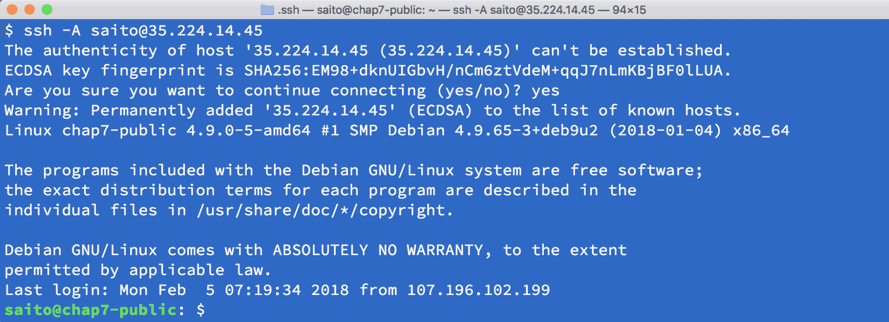

SSH 连接到公共 VM 实例

1.  从 `chap7-public` 通过内部 IP 地址 ssh 连接到 `chap7-private`：

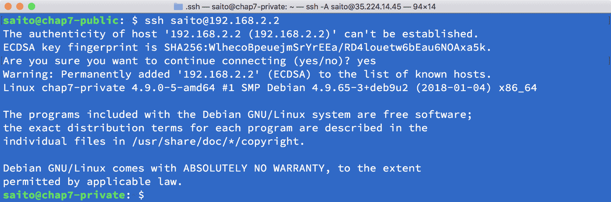

ssh 连接到私有 VM 实例

1.  输入 `exit` 命令返回到 `chap7-public` 主机，然后使用 `apt-get` 命令安装 `nginx`：

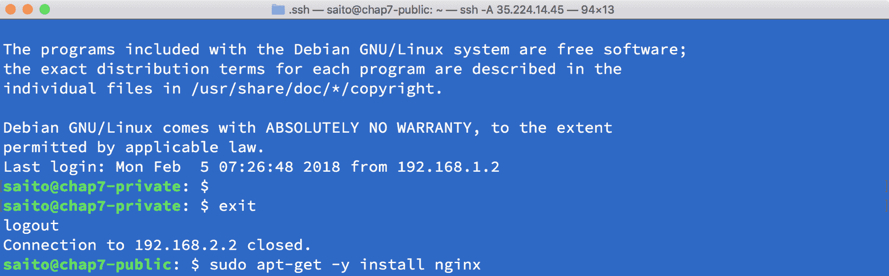

在公共 VM 实例上安装 nginx

1.  使用以下命令启动 `nginx`：

```
$ sudo systemctl start nginx
```

1.  使用 Web 浏览器通过外部 IP 访问 `chap7-public`：

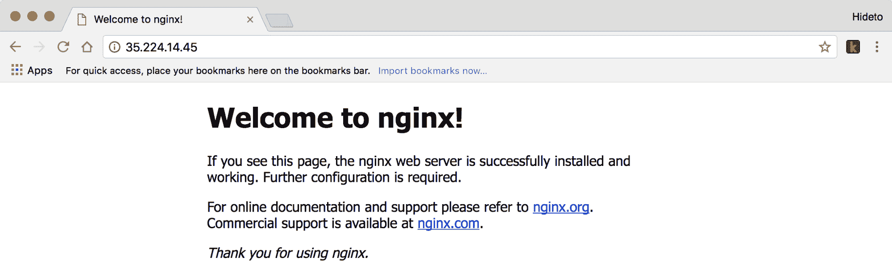

访问公共 VM 实例上的 nginx Web 服务器

恭喜！你已经完成了 GCP VPC、子网和防火墙规则的设置，并启动了 VM 实例！这些是 Google Compute Engine 的基本和常见用法。你可以登录并在这些机器上安装软件，甚至从零开始构建 Kubernetes 集群。然而，GCP 还提供了一种托管的 Kubernetes 产品，叫做 Kubernetes Engine。我们将在本章中探讨它。

# 玩转 Google Kubernetes Engine

Kubernetes 是由 Google 设计的，并且在 Google 内部广泛使用多年。Google Cloud Platform 提供了托管的 GKE。使用 GKE，我们无需从零构建集群，而是可以按需启动和关闭集群。

# 准备工作

我们可以在 GCP 控制台中的 Kubernetes Engine 仪表盘或通过 gcloud CLI 启动并配置集群。使用控制台非常直接且直观。然而，使用 CLI 是一种更灵活的方法，可以使操作可重复执行，或将其与现有管道集成。在本食谱中，我们将介绍如何使用 gcloud 启动并设置 Kubernetes 集群，以及 GCP 中的一些重要概念。

在 GCP 中，一切都与项目相关联。GCP 项目是使用 GCP 服务、计费和权限控制的基本单位。一开始，我们需要从 GCP 控制台创建一个项目：[`console.cloud.google.com`](https://console.cloud.google.com)。

项目 ID 在 GCP 中是全局唯一的。项目创建完成后，我们会看到分配了一个唯一的项目编号。在首页仪表盘中，我们可以清晰地看到已使用的资源数量。我们可以在这里设置权限、存储、网络、计费和其他资源。在继续之前，我们需要安装 gcloud。gcloud 是 Google Cloud SDK 的一部分。除了 gcloud，它可以执行 GCP 中大多数常见操作，Google Cloud SDK 还包括其他常见的 GCP 工具，例如 gsutil（用于管理 Cloud Storage）、bq（BigQuery 的命令行工具）和 core（Cloud SDK 库）。这些工具可以在 Google Cloud SDK 下载页面获取：[`cloud.google.com/sdk/docs/#install_the_latest_cloud_tools_version_cloudsdk_current_version`](https://cloud.google.com/sdk/docs/#install_the_latest_cloud_tools_version_cloudsdk_current_version)。

安装 gcloud 后，运行 `gcloud init` 进行登录，设置身份并创建一个名为 **k8s-cookbook-2e** 的项目。我们可以使用 gcloud 来操作 Google Cloud 中几乎所有的服务；主要的命令组是：

```
gcloud container [builds|clusters|images|node-pools|operations] | $COMMAND $FLAG…
```

gcloud 容器命令行集用于管理我们在 Google Kubernetes Engine 中的容器和集群。在启动集群时，最重要的参数是网络设置。让我们花一些时间来理解 GCP 中的网络术语。和 AWS 一样，GCP 也有 VPC 概念。这是一种更私密和安全的方式，用来将计算、存储和云资源与公共互联网隔离。它可以跨项目建立对等连接，或与本地数据中心通过 VPN 建立连接，创建混合云环境：

```
// create GCP VPC, it might take few minutes.
# gcloud compute networks create k8s-network
Created [https://www.googleapis.com/compute/v1/projects/kubernetes-cookbook/global/networks/k8s-network].
NAME         SUBNET_MODE  BGP_ROUTING_MODE  IPV4_RANGE  GATEWAY_IPV4
k8s-network  AUTO         REGIONAL
```

该网络上的实例在防火墙规则创建之前是无法访问的。举个例子，你可以通过运行以下命令允许所有内部流量在实例之间传递，同时允许 SSH、RDP 和 ICMP：

```
$ gcloud compute firewall-rules create <FIREWALL_NAME> --network k8s-network --allow tcp,udp,icmp --source-ranges <IP_RANGE>
$ gcloud compute firewall-rules create <FIREWALL_NAME> --network k8s-network --allow tcp:22,tcp:3389,icmp
```

默认情况下，VPC 是以自动模式创建的，这将为每个区域创建一个子网。我们可以通过子命令 `describe` 来观察这一点：

```
// gcloud compute networks describe <VPC name>
# gcloud compute networks describe k8s-network
autoCreateSubnetworks: true
creationTimestamp: '2018-02-25T13:54:28.867-08:00'
id: '1580862590680993403'
kind: compute#network
name: k8s-network
routingConfig:
  routingMode: REGIONAL
selfLink: https://www.googleapis.com/compute/v1/projects/kubernetes-cookbook/global/networks/k8s-network
subnetworks:
- https://www.googleapis.com/compute/v1/projects/kubernetes-cookbook/regions/australia-southeast1/subnetworks/k8s-network
- https://www.googleapis.com/compute/v1/projects/kubernetes-cookbook/regions/europe-west4/subnetworks/k8s-network
- https://www.googleapis.com/compute/v1/projects/kubernetes-cookbook/regions/northamerica-northeast1/subnetworks/k8s-network
- https://www.googleapis.com/compute/v1/projects/kubernetes-cookbook/regions/europe-west1/subnetworks/k8s-network
- https://www.googleapis.com/compute/v1/projects/kubernetes-cookbook/regions/southamerica-east1/subnetworks/k8s-network
- https://www.googleapis.com/compute/v1/projects/kubernetes-cookbook/regions/us-central1/subnetworks/k8s-network
- https://www.googleapis.com/compute/v1/projects/kubernetes-cookbook/regions/us-east1/subnetworks/k8s-network
- https://www.googleapis.com/compute/v1/projects/kubernetes-cookbook/regions/asia-east1/subnetworks/k8s-network
- https://www.googleapis.com/compute/v1/projects/kubernetes-cookbook/regions/us-west1/subnetworks/k8s-network
- https://www.googleapis.com/compute/v1/projects/kubernetes-cookbook/regions/europe-west3/subnetworks/k8s-network
- https://www.googleapis.com/compute/v1/projects/kubernetes-cookbook/regions/asia-southeast1/subnetworks/k8s-network
- https://www.googleapis.com/compute/v1/projects/kubernetes-cookbook/regions/us-east4/subnetworks/k8s-network
- https://www.googleapis.com/compute/v1/projects/kubernetes-cookbook/regions/europe-west2/subnetworks/k8s-network
- https://www.googleapis.com/compute/v1/projects/kubernetes-cookbook/regions/asia-northeast1/subnetworks/k8s-network
- https://www.googleapis.com/compute/v1/projects/kubernetes-cookbook/regions/asia-south1/subnetworks/k8s-network
x_gcloud_bgp_routing_mode: REGIONAL
x_gcloud_subnet_mode: AUTO
```

在 GCP 中，每个子网跨越一个区域。区域是区域中的一个隔离位置，类似于 AWS 中的可用区概念。

或者，你可以通过添加参数 `--subnet-mode=custom` 来创建自定义模式的网络，这样可以定义你所需的 IP 范围、区域和所有路由规则。更多细节请参考上一节。

自动模式还可以帮助你设置所有默认的路由规则。路由用于定义特定 IP 范围的目的地。例如，此路由将数据包引导到虚拟网络 `10.158.0.0/20`：

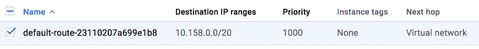

默认路由示例

路由用于将数据包引导到外部世界。此路由的下一跳是默认的互联网网关，类似于 AWS 中的 igw。然而，在 GCP 中，你不需要显式地创建互联网网关：

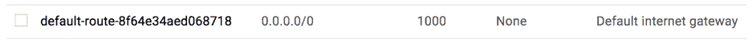

用于互联网访问的默认路由

GCP 网络中的另一个重要概念是防火墙规则，用于控制实例的入站和出站流量。在 GCP 中，防火墙规则与虚拟机实例之间的关联通过网络标签实现。

防火墙规则也可以分配给网络中的所有实例或具有特定服务账户的实例组（仅限入站）。服务账户是 GCP 中虚拟机实例的身份。可以为服务账户分配一个或多个角色，以便它能够访问其他 GCP 资源。这类似于 AWS 中的实例配置文件。

一个虚拟机实例可以拥有多个网络标签，这意味着可以应用多个网络路由。此图显示了标签是如何工作的。在下图中，第一个防火墙规则应用于 VM1 和 VM2，VM2 与两个防火墙规则相关联：

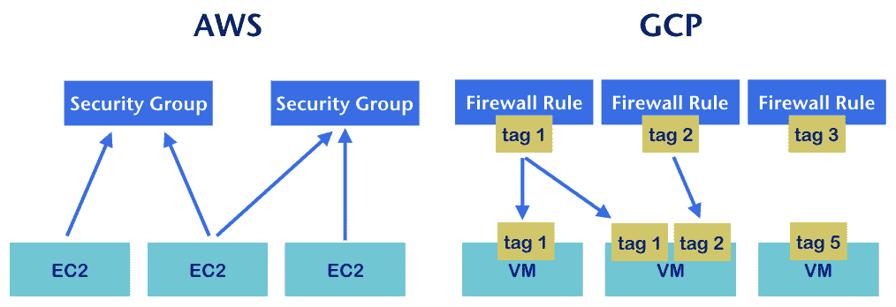

AWS 安全组和 GCP 防火墙规则示意图

在**AWS**中，一个或多个入站/出站规则被定义在**安全组**中，且一个或多个安全组可以分配给一个**EC2**实例。而在**GCP**中，定义一个或多个防火墙规则，这些规则与一个或多个标签相关联。一个或多个标签可以分配给一个实例。通过映射网络标签，防火墙规则可以控制和限制进出实例的访问。

# 如何操作…

我们已经了解了 GCP 中的基本网络概念。现在让我们启动我们的第一个 GKE 集群：

| **参数** | **描述** | **示例中的值** |
| --- | --- | --- |
| `--cluster-version` | 支持的集群版本（请参阅[`cloud.google.com/kubernetes-engine/release-notes`](https://cloud.google.com/kubernetes-engine/release-notes)） | `1.9.2-gke.1` |
| `--machine-type` | 节点的实例类型（请参阅[`cloud.google.com/compute/docs/machine-types`](https://cloud.google.com/compute/docs/machine-types)） | `f1-micro` |
| `--num-nodes` | 集群中的节点数量 | `3` |
| `--network` | 目标 VPC 网络 | `k8s-network`（我们刚刚创建的网络） |
| `--zone` | 目标区域 | `us-central1-a`（你可以自由选择任何区域） |
| `--tags` | 要附加到节点的网络标签 | private |
| `--service-account &#124; --scopes` | 节点身份（有关更多范围值，请参见[`cloud.google.com/sdk/gcloud/reference/container/clusters/create`](https://cloud.google.com/sdk/gcloud/reference/container/clusters/create)） | `storage-rw`,`compute-ro` |

参考前面的参数，我们通过`gcloud`命令启动一个三节点的集群：

```
// create GKE cluster
$ gcloud container clusters create my-k8s-cluster --cluster-version 1.9.2-gke.1 --machine-type f1-micro --num-nodes 3 --network k8s-network --zone us-central1-a --tags private --scopes=storage-rw,compute-ro
WARNING: The behavior of --scopes will change in a future gcloud release: service-control and service-management scopes will no longer be added to what is specified in --scopes. To use these scopes, add them explicitly to --scopes. To use the new behavior, set container/new_scopes_behavior property (gcloud config set container/new_scopes_behavior true).
WARNING: Starting in Kubernetes v1.10, new clusters will no longer get compute-rw and storage-ro scopes added to what is specified in --scopes (though the latter will remain included in the default --scopes). To use these scopes, add them explicitly to --scopes. To use the new behavior, set container/new_scopes_behavior property (gcloud config set container/new_scopes_behavior true).
Creating cluster my-k8s-cluster...done.
Created [https://container.googleapis.com/v1/projects/kubernetes-cookbook/zones/us-central1-a/clusters/my-k8s-cluster].
To inspect the contents of your cluster, go to: https://console.cloud.google.com/kubernetes/workload_/gcloud/us-central1-a/my-k8s-cluster?project=kubernetes-cookbook
kubeconfig entry generated for my-k8s-cluster.
NAME            LOCATION       MASTER_VERSION  MASTER_IP    MACHINE_TYPE  NODE_VERSION  NUM_NODES  STATUS
my-k8s-cluster  us-central1-a  1.9.2-gke.1     35.225.24.4  f1-micro      1.9.2-gke.1   3          RUNNING
```

集群启动并运行后，我们可以通过配置`kubectl`开始连接到集群：

```
# gcloud container clusters get-credentials my-k8s-cluster --zone us-central1-a --project kubernetes-cookbook
Fetching cluster endpoint and auth data.
kubeconfig entry generated for my-k8s-cluster.
```

让我们查看集群是否健康：

```
// list cluster components
# kubectl get componentstatuses
NAME                 STATUS    MESSAGE              ERROR
controller-manager   Healthy   ok
scheduler            Healthy   ok
etcd-0               Healthy   {"health": "true"}
etcd-1               Healthy   {"health": "true"}
```

我们可以检查集群中的节点：

```
// list the nodes in cluster
# kubectl get nodes
NAME                                            STATUS    ROLES     AGE       VERSION
gke-my-k8s-cluster-default-pool-7d0359ed-0rl8   Ready     <none>    21m       v1.9.2-gke.1
gke-my-k8s-cluster-default-pool-7d0359ed-1s2v   Ready     <none>    21m       v1.9.2-gke.1
gke-my-k8s-cluster-default-pool-7d0359ed-61px   Ready     <none>    21m       v1.9.2-gke.1
```

我们还可以使用`kubectl`检查集群信息：

```
// list cluster info
# kubectl cluster-info
Kubernetes master is running at https://35.225.24.4
GLBCDefaultBackend is running at https://35.225.24.4/api/v1/namespaces/kube-system/services/default-http-backend:http/proxy
Heapster is running at https://35.225.24.4/api/v1/namespaces/kube-system/services/heapster/proxy
KubeDNS is running at https://35.225.24.4/api/v1/namespaces/kube-system/services/kube-dns:dns/proxy
kubernetes-dashboard is running at https://35.225.24.4/api/v1/namespaces/kube-system/services/https:kubernetes-dashboard:/proxy
Metrics-server is running at https://35.225.24.4/api/v1/namespaces/kube-system/services/https:metrics-server:/proxy
```

# 它是如何工作的…

在幕后，gcloud 创建了一个包含三个节点的 Kubernetes 集群，以及一个控制器管理器、调度器和两个成员的 etcd 集群。我们还可以看到主节点启动了一些服务，包括控制器使用的默认后端、用于监控的 heapster、集群中的 KubeDNS 用于 DNS 服务、用于 Kubernetes UI 的仪表盘，以及用于资源使用度量的 metrics-server。

我们看到`Kubernetes-dashboard`有一个 URL；让我们尝试访问它：

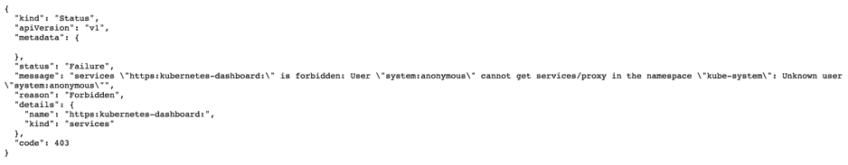

禁止访问 Kubernetes 仪表盘

我们得到了`HTTP 403 Forbidden`。那么我们从哪里获得访问权限和凭证呢？一种方法是通过`kubectl proxy`命令运行代理。它会将主节点 IP 绑定到本地`127.0.0.1:8001`：

```
# kubectl proxy
Starting to serve on 127.0.0.1:8001
```

之后，当我们访问`http://127.0.0.1:8001/ui`时，它将被重定向到`http://127.0.0.1:8001/api/v1/namespaces/kube-system/services/https:kubernetes-dashboard:/proxy`。

自 Kubernetes 1.7 起，仪表盘支持基于持有令牌或`Kubeconfig`文件的用户认证：

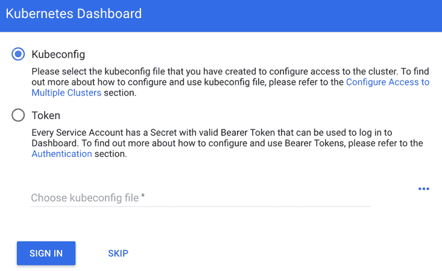

登录到 Kubernetes 控制台

你可以创建一个用户并将其绑定到当前的上下文（请参考第八章中的 *身份验证与授权* 配方，*高级集群管理*）。为了方便起见，我们可以检查是否已有现有用户。首先，我们需要知道当前上下文的名称。上下文结合了集群信息、用于身份验证的用户和命名空间：

```
// check our current context name
# kubectl config current-context
gke_kubernetes-cookbook_us-central1-a_my-k8s-cluster
```

知道了上下文名称后，我们可以通过 `kubectl` 配置视图 `$CONTEXT_NAME` 来描述它：

```
// kubectl config view $CONTEXT_NAME
# kubectl config view gke_kubernetes-cookbook_us-central1-a_my-k8s-cluster
current-context: gke_kubernetes-cookbook_us-central1-a_my-k8s-cluster
kind: Config
preferences: {}
users:
- name: gke_kubernetes-cookbook_us-central1-a_my-k8s-cluster
  user:
    auth-provider:
      config:
        access-token: $ACCESS_TOKEN
        cmd-args: config config-helper --format=json
        cmd-path: /Users/chloelee/Downloads/google-cloud-sdk-2/bin/gcloud
        expiry: 2018-02-27T03:46:57Z
        expiry-key: '{.credential.token_expiry}'
        token-key: '{.credential.access_token}'
      name: gcp
```

我们可能会发现集群中存在一个默认用户；使用其`$ACCESS_TOKEN`，你可以查看 Kubernetes 控制台。

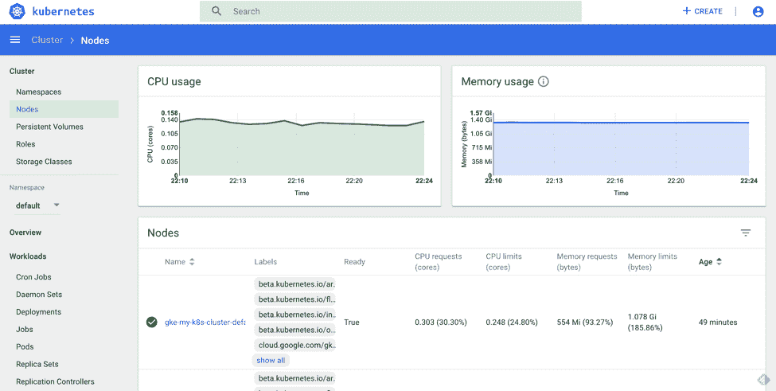

Kubernetes 控制台概览

我们的 GKE 集群已经启动并运行！让我们尝试看看能否在其上运行一个简单的部署：

```
# kubectl run nginx --image nginx --replicas=2
deployment "nginx" created
# kubectl get pods
NAME                   READY     STATUS    RESTARTS   AGE
nginx-8586cf59-x27bj   1/1       Running   0          12s
nginx-8586cf59-zkl8j   1/1       Running   0          12s
```

让我们检查一下 Kubernetes 控制台：

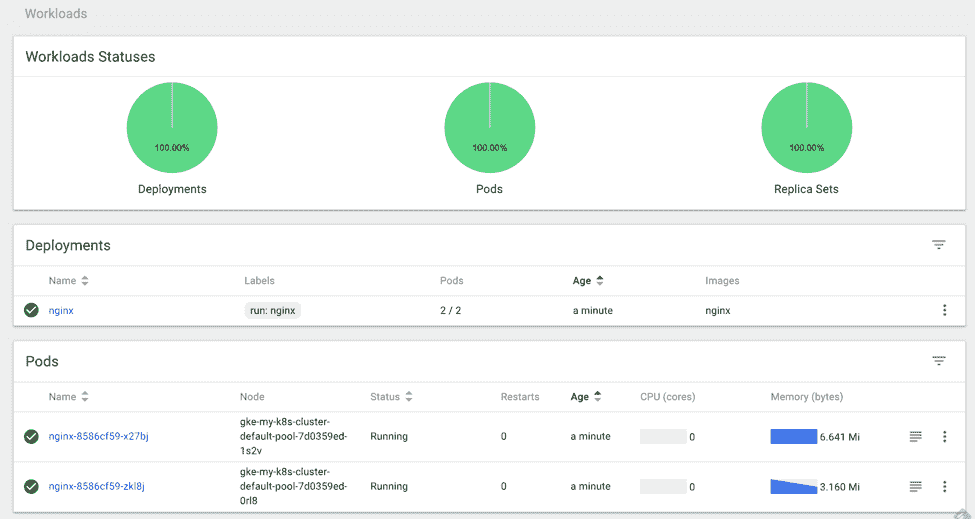

Kubernetes 控制台中的工作负载

耶！部署已创建，结果有两个 Pod 被调度并创建。

# 另请参见

+   第八章中的 *kubeconfig 中的高级设置*，*高级集群管理*

+   第八章中的 *在节点中设置资源*，*高级集群管理*

+   第八章中的 *玩转 Web UI*，*高级集群管理*

+   第八章中的 *在 Kubernetes 集群中设置 DNS 服务器*，*高级集群管理*

+   第八章中的 *身份验证与授权*，*高级集群管理*

# 在 GKE 上探索 CloudProvider

GKE 作为本地 Kubernetes 云提供商，与 Kubernetes 中的资源无缝集成，允许按需提供资源，例如网络的 VPC 路由、StorageClass 的 **持久磁盘**（**PD**）、服务的 L4 负载均衡器以及入口的 L4 负载均衡器。

# 准备就绪

默认情况下，当你在 Google Cloud Platform 中创建网络并启动 Kubernetes 集群并配置适当的路由时，容器之间就可以无需显式设置网络而相互通信。除了之前列出的资源外，在大多数情况下我们不需要显式设置任何配置。GKE 将自动工作。

# 如何做……

让我们看看 GKE 在存储、网络等方面提供了多少便利。

# StorageClass

在 第二章中，*Kubernetes 概念简介*，我们学习了如何声明 `PersistentVolume` 和 `PersistentVolumeClaim`。通过动态供给，你可以定义一组不同物理存储后端的 `StorageClass`，并在 `PersistentVolume` 或 `PersistentVolumeClaim` 中使用它们。让我们看看它是如何工作的。

要检查当前的默认 `StorageClass`，可以使用 `kubectl get storageclasses` 命令：

```
# kubectl get storageclasses
NAME                 PROVISIONER            AGE
standard (default)   kubernetes.io/gce-pd   1h
```

我们可以看到有一个名为 standard 的默认存储类，其提供者是 GCE PD。

让我们创建一个 `PersistentVolumeClaim` 请求，并使用标准的 `StorageClass` 作为后端：

```
# cat gke-pvc.yaml
apiVersion: v1
kind: PersistentVolumeClaim
metadata:
    name: pvc-example-pv
spec:
  storageClassName: standard
  accessModes:
    - ReadWriteOnce
  resources:
    requests:
      storage: 10Gi

// create resources
# kubectl create -f gke-pvc.yaml
persistentvolumeclaim "pvc-example-pv" created
```

`storageClassName` 是指定 `StorageClass` 名称的地方。如果填写一个不存在的名称，PVC 将无法创建，因为没有适当的映射 `StorageClass` 可以使用：

```
// check pvc status
# kubectl get pvc
NAME              STATUS    VOLUME                                     CAPACITY   ACCESS MODES   STORAGECLASS   AGE
pvc-example-pv    Bound     pvc-1491b08e-1cfc-11e8-8589-42010a800360   10Gi       RWO            standard       12m

// describe the details of created PVC
# kubectl describe pvc pvc-example-pv
Name:          pvc-example-pv
Namespace:     default
StorageClass:  standard
Status:        Bound
Volume:        pvc-1491b08e-1cfc-11e8-8589-42010a800360
Labels:        <none>
Annotations:   pv.kubernetes.io/bind-completed=yes
               pv.kubernetes.io/bound-by-controller=yes
               volume.beta.kubernetes.io/storage-provisioner=kubernetes.io/gce-pd
Finalizers:    []
Capacity:      10Gi
Access Modes:  RWO
Events:
  Type    Reason                 Age   From                         Message
  ----    ------                 ----  ----                         -------
  Normal  ProvisioningSucceeded  12m   persistentvolume-controller  Successfully provisioned volume pvc-1491b08e-1cfc-11e8-8589-42010a800360 using kubernetes.io/gce-pd
```

我们可以看到卷 `pvc-1491b08e-1cfc-11e8-8589-42010a800360` 已经创建并绑定。如果列出 GCP 磁盘，我们会发现创建了一个持久磁盘；磁盘名称的后缀表示 Kubernetes 中的卷名称。这就是动态卷提供的魔力：

```
# gcloud compute disks list
NAME                                                             ZONE           SIZE_GB  TYPE         STATUS
gke-my-k8s-cluster-5ef-pvc-1491b08e-1cfc-11e8-8589-42010a800360  us-central1-a  10       pd-standard  READY
```

除了默认的 `StorageClass`，你还可以创建自己的存储类。回顾一下第二章，*Kubernetes 概念详解*。

# 服务（LoadBalancer）

`LoadBalancer` 类型的服务只在支持外部负载均衡器的云环境中工作。这允许外部流量路由到目标 Pod。在 GCP 中，`LoadBalancer` 类型的服务将创建一个 TCP 负载均衡器：

1.  用于允许负载均衡器与节点之间流量的防火墙规则将自动创建：

```
// leveraging LoadBalancer service
# cat gke-service.yaml
apiVersion: apps/v1
kind: Deployment
metadata:
  name: nginx
spec:
  replicas: 1
  selector:
    matchLabels:
      run: nginx
  template:
    metadata:
      labels:
        run: nginx
    spec:
      containers:
        - image: nginx
          name: nginx
          ports:
            - containerPort: 80
---
apiVersion: v1
kind: Service
metadata:
  name: nginx
spec:
  ports:
    - port: 80
      targetPort: 80
  type: LoadBalancer
  selector:
    run: nginx

// create resources
# kubectl create -f gke-service.yaml
deployment "nginx" created
service "nginx" created
```

1.  让我们检查服务。如果负载均衡器仍在配置中，`EXTERNAL-IP` 将显示 `<pending>`。稍等片刻，负载均衡器的 IP 会最终显示出来：

```
# kubectl get svc nginx
NAME      TYPE           CLUSTER-IP      EXTERNAL-IP      PORT(S)        AGE
nginx     LoadBalancer   10.35.250.183   35.225.223.151   80:30383/TCP   11m
```

1.  让我们用 `curl` 测试 `$EXTERNAL-IP:80`，看看它是否正常工作：

```
# curl -I 35.225.223.151
HTTP/1.1 200 OK
Server: nginx/1.13.9
Date: Thu, 01 Mar 2018 03:57:05 GMT
Content-Type: text/html
Content-Length: 612
Last-Modified: Tue, 20 Feb 2018 12:21:20 GMT
Connection: keep-alive
ETag: "5a8c12c0-264"
Accept-Ranges: bytes
```

1.  如果我们检查 GCP 中的转发规则，我们可以找到一条规则，定义了流量如何从外部 IP 转发到目标池：

```
# gcloud compute forwarding-rules list
NAME                              REGION       IP_ADDRESS      IP_PROTOCOL  TARGET
ae1f2ad0c1d0211e8858942010a80036  us-central1  35.225.223.151  TCP          us-central1/targetPools/ae1f2ad0c1d0211e8858942010a80036
```

1.  目标池是一组实例，这些实例接收来自转发规则的流量。我们也可以使用 gcloud 命令检查目标池：

```
// list target pools
# gcloud compute target-pools list
NAME                              REGION       SESSION_AFFINITY  BACKUP  HEALTH_CHECKS
ae1f2ad0c1d0211e8858942010a80036  us-central1  NONE                      k8s-1a4c86537c370d21-node

// check target pools info, replace $GCP_REGION as your default region.
# gcloud compute target-pools describe ae1f2ad0c1d0211e8858942010a80036 --region=$GCP_REGION
creationTimestamp: '2018-02-28T19:45:46.052-08:00'
description: '{"kubernetes.io/service-name":"default/nginx"}'
healthChecks:
- https://www.googleapis.com/compute/v1/projects/kubernetes-cookbook/global/httpHealthChecks/k8s-1a4c86537c370d21-node
id: '3515096241941432709'
instances:
- https://www.googleapis.com/compute/v1/projects/kubernetes-cookbook/zones/us-central1-a/instances/gke-my-k8s-cluster-default-pool-36121894-71wg
- https://www.googleapis.com/compute/v1/projects/kubernetes-cookbook/zones/us-central1-a/instances/gke-my-k8s-cluster-default-pool-36121894-04rv
- https://www.googleapis.com/compute/v1/projects/kubernetes-cookbook/zones/us-central1-a/instances/gke-my-k8s-cluster-default-pool-36121894-3mxm
kind: compute#targetPool
name: ae1f2ad0c1d0211e8858942010a80036
region: https://www.googleapis.com/compute/v1/projects/kubernetes-cookbook/regions/us-central1
selfLink: https://www.googleapis.com/compute/v1/projects/kubernetes-cookbook/regions/us-central1/targetPools/ae1f2ad0c1d0211e8858942010a80036
sessionAffinity: NONE
```

我们可以看到目标池内有三个节点。这些节点与我们 Kubernetes 集群中的三个节点相同。负载均衡器将根据源/定义的 IP 和端口的哈希值将流量分发到某个节点。虽然 `LoadBalancer` 类型的服务看起来很方便，但它无法执行基于路径的路由。此时，Ingress 就派上用场了。Ingress 支持虚拟主机、基于路径的路由和 TLS 终止，这是对 Web 服务更灵活的处理方式。

# Ingress（入口）

在第五章，*构建持续交付管道*，我们学习了入口（Ingress）的概念，以及何时和如何使用它。Ingress 定义了一组规则，允许入站连接访问 Kubernetes 集群服务。它在 L7 层路由流量到集群，控制器将流量带到节点。当 GCP 是云服务提供商时，如果创建了 Ingress，还会创建 L7 负载均衡器，以及相关的防火墙规则、健康检查、后端服务、转发规则和 URL 映射。GCP 中的 URL 映射是一个包含一组规则的机制，将请求转发到相应的后端服务。

在这个食谱中，我们将重用来自 第五章的示例，*构建持续交付流水线*，`Nodeport-deployment.yaml` 和 `echoserver.yaml`。接下来是这两个服务在 第五章，*构建持续交付流水线* 中的工作原理图示：

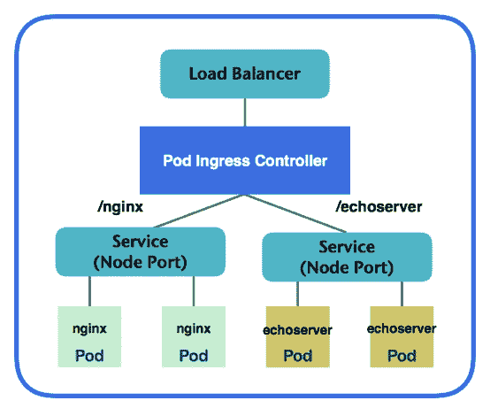

Ingress 图示

我们将为 nginx 和 echoserver 创建一个 ingress，路由到不同的服务。当流量到达时，pod ingress 控制器将决定路由到哪个服务。

这里是 ingress 的示例。请注意，如果你希望底层服务始终从某个特定主机名访问，你可能需要在规则部分添加主机名：

```
# cat INGRESS.yaml
apiVersion: extensions/v1beta1
kind: INGRESS
metadata:
  name: my-INGRESS
  annotations:
    INGRESS.kubernetes.io/rewrite-target: /
spec:
  rules:
    - http:
        paths:
          - path: /
            # default backend
            backend:
              serviceName: nodeport-svc
              servicePort: 8080
          - path: /nginx
            # nginx service
            backend:
              serviceName: nodeport-svc
              servicePort: 8080
          - path: /echoserver
            # echoserver service
            backend:
              serviceName: echoserver-svc
              servicePort: 8080

// create nodeport-svc (nginx) service
# kubectl create -f nodeport-deployment.yaml
deployment "nodeport-deploy" created
service "nodeport-svc" created

// create echoserver-svc (echoserver) service
# kubectl create -f echoserver.yaml
deployment "echoserver-deploy" created
service "echoserver-svc" created

// create INGRESS
# kubectl create -f INGRESS.yaml
INGRESS "my-INGRESS" created
```

请再次确认底层服务已配置为 `NodePort` 类型。否则，你可能会遇到如 `googleapi: Error 400: Invalid value for field 'namedPorts[1].port': '0'. Must be greater than or equal to 1, invalid error` 来自 `loadbalancer-controller` 的错误。

几分钟后，L7 负载均衡器将被创建，你可以通过 GCP 控制台或使用 gcloud 命令查看它。让我们使用 `kubectl` 检查 INGRESS 中的后端服务是否健康：

```
// kubectl describe INGRESS $INGRESS_name
# kubectl describe INGRESS my-INGRESS

curl Name:             my-INGRESS
Namespace:        default
Address:          35.190.46.137
Default backend:  default-http-backend:80 (10.32.2.3:8080)
Rules:
  Host  Path  Backends
  ----  ----  --------
  *
        /             nodeport-svc:8080 (<none>)
        /nginx        nodeport-svc:8080 (<none>)
        /echoserver   echoserver-svc:8080 (<none>)
Annotations:
  backends:         {"k8s-be-31513--91cf30ccf285becb":"HEALTHY","k8s-be-31780--91cf30ccf285becb":"HEALTHY","k8s-be-32691--91cf30ccf285becb":"HEALTHY"}
  forwarding-rule:  k8s-fw-default-my-INGRESS--91cf30ccf285becb
  rewrite-target:   /
  target-proxy:     k8s-tp-default-my-INGRESS--91cf30ccf285becb
  url-map:          k8s-um-default-my-INGRESS--91cf30ccf285becb
Events:
  Type    Reason   Age               From                     Message
  ----    ------   ----              ----                     -------
  Normal  Service  2m (x11 over 1h)  loadbalancer-controller  no user specified default backend, using system default
```

我们可以看到三个后端是健康的，相关的转发规则、目标代理和 URL 映射都已创建。我们可以通过访问 GKE 中的发现和负载均衡，或通过网络服务中的负载均衡选项卡，从 GCP 控制台获取全面的视图：

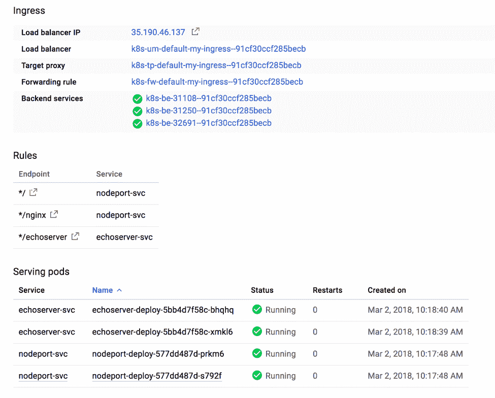

发现与负载均衡

后端在这里进行说明：

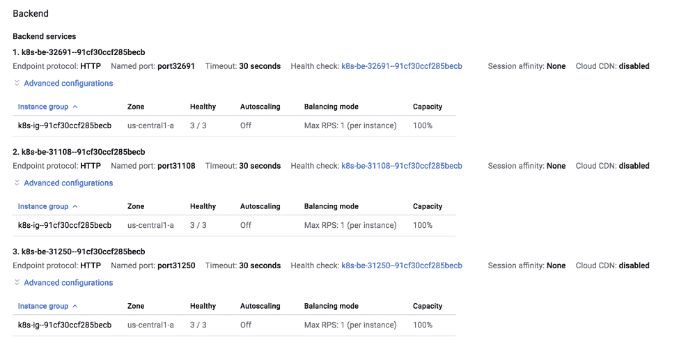

后端服务

有时，你的 ingress 资源可能会遇到更新。当你重新部署时，无法保证 GCP 会为你的负载均衡器分配相同的 IP 地址。这可能会在 IP 地址与 DNS 名称关联时引发问题。每次 IP 地址更改时，都需要更新目标 IP 地址。可以通过静态外部 IP 地址加上 `kubernetes.io/INGRESS.global-static-ip-name` 注解来解决这个问题：

```
// allocate static IP as my-external-ip
# gcloud compute addresses create my-external-ip –global

// check external-ip
# gcloud compute addresses list
NAME            REGION  ADDRESS        STATUS
my-external-ip          130.211.37.61  RESERVED
After external IP is prepared, we could start launching our INGRESS now.
# cat INGRESS-static-ip.yaml
apiVersion: extensions/v1beta1
kind: INGRESS
metadata:
  name: my-INGRESS-static-ip
  annotations:
    INGRESS.kubernetes.io/rewrite-target: /
    kubernetes.io/INGRESS.global-static-ip-name: my-external-ip
spec:
  rules:
    - http:
        paths:
          - path: /
            # default backend
            backend:
              serviceName: nodeport-svc
              servicePort: 8080
          - path: /nginx
            # nginx service
            backend:
              serviceName: nodeport-svc
              servicePort: 8080
          - path: /echoserver
            # echoserver service
            backend:
              serviceName: echoserver-svc
              servicePort: 8080

# kubectl create -f INGRESS-static-ip.yaml
INGRESS "my-INGRESS-stati-ip" created
```

让我们描述 `my-INGRESS`，看看它是否与我们创建的外部 IP 正确绑定：

```
# kubectl describe INGRESS my-INGRESS
Name:             my-INGRESS
Namespace:        default
Address:          130.211.37.61
Default backend:  default-http-backend:80 (10.32.2.3:8080)
Rules:
  Host  Path  Backends
  ----  ----  --------
  *        /             nodeport-svc:8080 (<none>)
        /nginx        nodeport-svc:8080 (<none>)        /echoserver   echoserver-svc:8080 (<none>)Annotations:
  backends:         {"k8s-be-31108--91cf30ccf285becb":"HEALTHY","k8s-be-31250--91cf30ccf285becb":"HEALTHY","k8s-be-32691--91cf30ccf285becb":"HEALTHY"}  forwarding-rule:  k8s-fw-default-my-INGRESS--91cf30ccf285becb  rewrite-target:   /  target-proxy:     k8s-tp-default-my-INGRESS--91cf30ccf285becb  url-map:          k8s-um-default-my-INGRESS--91cf30ccf285becbEvents:  Type    Reason   Age               From                     Message  ----    ------   ----              ----                     -------  Normal  ADD      27m               loadbalancer-controller  default/my-INGRESS  Normal  CREATE   25m               loadbalancer-controller  ip: 130.211.37.61
  Normal  Service  4m (x6 over 25m)  loadbalancer-controller  no user specified default backend, using system default
```

我们已经准备好了。`Nginx` 和 `echoserver` 可以通过外部静态 IP `130.211.37.61` 进行访问，我们可以通过 GCP 的云 DNS 服务将其与 DNS 名称关联。

# 还有更多内容……

在 Kubernetes v.1.9 中，Kubernetes 云控制器管理器被提升为 Alpha 版本。云控制器管理器旨在通过其自身的发布周期，使云提供商发布功能支持，这些支持可以独立于 Kubernetes 发布周期。随后，它也可以与 Kubernetes 核心发布周期独立。它提供了每个云提供商可以实现的公共接口，从而与 Kubernetes 核心逻辑解耦。未来，我们将看到来自不同云提供商的更全面支持！

# 另见

+   第二章中的*与服务协作*，*深入理解 Kubernetes 概念*

+   第二章中的*与卷协作*，*深入理解 Kubernetes 概念*

+   第三章中的*转发容器端口*，*玩转容器*

# 在 GKE 上管理 Kubernetes 集群

Google Kubernetes Engine 为我们提供了运行 Kubernetes 的无缝体验；它还使 Kubernetes 管理变得非常简单。根据预期的高峰时段，我们可能需要扩展或缩减 Kubernetes 节点。或者，我们可以使用 Autoscaler 为节点进行自动扩展。Kubernetes 是一个不断发展的平台，发布速度很快。我们可能需要时不时地升级集群版本，这非常简单。我们还可以使用 Autoupgrade 功能，通过启用 GKE 中的自动调度功能来升级集群。让我们看看如何操作。

# 准备工作

在设置 GCP 提供的管理功能之前，我们必须先启动并运行集群。我们将重用本章中在《玩转 Google Kubernetes Engine》一节中创建的集群。

# 如何操作…

在本食谱中，我们将介绍如何根据使用情况和需求管理节点数。同时，我们将学习如何处理集群升级。最后，我们将了解如何在 GKE 中配置一个多区集群，以防止物理区域故障。

# 节点池

节点池是 GCP 中一组共享相同配置的实例。当我们通过`gcloud`命令启动集群时，我们传递`--num-node=3`及其余参数。然后，三台实例将在同一池中启动，分享相同配置，使用相同的方法：

```
# gcloud compute instance-groups list NAME LOCATION SCOPE NETWORK MANAGED INSTANCES gke-my-k8s-cluster-default-pool-36121894-grp us-central1-a zone k8s-network Yes 3 
```

假设你的服务有一个预期的高峰时段。作为 Kubernetes 管理员，你可能希望调整集群中节点池的规模。

```
# gcloud container clusters resize my-k8s-cluster --size 5 --zone us-central1-a --node-pool default-pool
Pool [default-pool] for [my-k8s-cluster] will be resized to 5.
Do you want to continue (Y/n)?  y
Resizing my-k8s-cluster...done.
Updated [https://container.googleapis.com/v1/projects/kubernetes-cookbook/zones/us-central1-a/clusters/my-k8s-cluster].
# kubectl get nodes
NAME                                               STATUS    ROLES     AGE       VERSION
gke-my-k8s-cluster-default-pool-36121894-04rv      Ready     <none>    6h        v1.9.2-gke.1
gke-my-k8s-cluster-default-pool-36121894-71wg      Ready     <none>    6h        v1.9.2-gke.1
gke-my-k8s-cluster-default-pool-36121894-8km3      Ready     <none>    39s       v1.9.2-gke.1
gke-my-k8s-cluster-default-pool-36121894-9j9p      Ready     <none>    31m       v1.9.2-gke.1
gke-my-k8s-cluster-default-pool-36121894-9jmv      Ready     <none>    36s       v1.9.2-gke.1
```

resize 命令可以帮助你扩展和缩减。如果调整大小后节点数量少于调整前，调度程序将把 Pod 迁移到可用节点上运行。

你可以在规格中为每个容器设置计算资源的边界。你为 Pod 容器设置请求和限制。假设我们有一个超级 nginx，它需要 1024 MB 内存：

```
# cat super-nginx.yaml
apiVersion: apps/v1
kind: Deployment
metadata:
  name: super-nginx
  labels:
    app: nginx
spec:
  replicas: 1
  selector:
    matchLabels:
      app: nginx
  template:
    metadata:
      labels:
        app: nginx
    spec:
      containers:
      - name: nginx
        image: nginx
        resources:
          requests:
            memory: 1024Mi 

// create super nginx deployment
# kubectl create -f super-nginx.yaml
deployment "super-nginx" created

# kubectl get pods
NAME                           READY     STATUS    RESTARTS   AGE
super-nginx-df79db98-5vfmv      0/1       Pending   0          10s
# kubectl describe po super-nginx-779494d88f-74xjp
Name:           super-nginx-df79db98-5vfmv
Namespace:      default
Node:           <none>
Labels:         app=nginx
                pod-template-hash=89358654
Annotations:    kubernetes.io/limit-ranger=LimitRanger plugin set: cpu request for container nginx
Status:         PendingIP:
Controlled By:  ReplicaSet/super-nginx-df79db98
...
Events:
  Type     Reason            Age                From               Message
  ----     ------            ----               ----               -------
  Warning  FailedScheduling  11s (x5 over 18s)  default-scheduler  0/5 nodes are available: 5 Insufficient memory.
```

我们创建的节点大小是 `f1-micro`，每个节点只有 0.6 GB 内存。这意味着调度器永远找不到具有足够内存来运行 `super-nginx` 的节点。在这种情况下，我们可以通过创建另一个节点池，向集群中添加更多内存更大的节点。我们以 `g1-small` 为例，它包含 1.7 GB 内存：

```
// create a node pool named larger-mem-pool with n1-standard-1 instance type
# gcloud container node-pools create larger-mem-pool --cluster my-k8s-cluster --machine-type n1-standard-1 --num-nodes 2 --tags private --zone us-central1-a --scopes=storage-rw,compute-ro
...
Creating node pool larger-mem-pool...done.
Created [https://container.googleapis.com/v1/projects/kubernetes-cookbook/zones/us-central1-a/clusters/my-k8s-cluster/nodePools/larger-mem-pool].
NAME             MACHINE_TYPE   DISK_SIZE_GB  NODE_VERSION
larger-mem-pool  n1-standard-1  100           1.9.2-gke.1

// check node pools
# gcloud container node-pools list --cluster my-k8s-cluster --zone us-central1-a
NAME             MACHINE_TYPE   DISK_SIZE_GB  NODE_VERSION
default-pool     f1-micro       100           1.9.2-gke.1
larger-mem-pool  n1-standard-1  100           1.9.2-gke.1

// check current nodes
# kubectl get nodes
NAME                                               STATUS    ROLES     AGE       VERSION
gke-my-k8s-cluster-default-pool-36121894-04rv      Ready     <none>    7h        v1.9.2-gke.1
gke-my-k8s-cluster-default-pool-36121894-71wg      Ready     <none>    7h        v1.9.2-gke.1
gke-my-k8s-cluster-default-pool-36121894-8km3      Ready     <none>    9m        v1.9.2-gke.1
gke-my-k8s-cluster-default-pool-36121894-9j9p      Ready     <none>    40m       v1.9.2-gke.1
gke-my-k8s-cluster-default-pool-36121894-9jmv      Ready     <none>    9m        v1.9.2-gke.1
gke-my-k8s-cluster-larger-mem-pool-a51c8da3-f1tb   Ready     <none>    1m        v1.9.2-gke.1
gke-my-k8s-cluster-larger-mem-pool-a51c8da3-scw1   Ready     <none>    1m        v1.9.2-gke.1
```

看起来我们有了两个更强大的节点。让我们看看我们的超级 nginx 状态：

```
# kubectl get pods
NAME                         READY     STATUS    RESTARTS   AGE
super-nginx-df79db98-5vfmv   1/1       Running   0          23m
```

运行了！Kubernetes 调度器将始终尝试找到足够的资源来调度 Pod。在这种情况下，集群中添加了两个新节点，可以满足资源需求，因此 Pod 被调度并运行：

```
// check the event of super nginx
# kubectl describe pods super-nginx-df79db98-5vfmv
...
Events:
  Warning  FailedScheduling       3m (x7 over 4m)     default-scheduler                                          0/5 nodes are available: 5 Insufficient memory.
  Normal   Scheduled              1m                  default-scheduler                                          Successfully assigned super-nginx-df79db98-5vfmv to gke-my-k8s-cluster-larger-mem-pool-a51c8da3-scw1
  Normal   SuccessfulMountVolume  1m                  kubelet, gke-my-k8s-cluster-larger-mem-pool-a51c8da3-scw1  MountVolume.SetUp succeeded for volume "default-token-bk8p2"
  Normal   Pulling                1m                  kubelet, gke-my-k8s-cluster-larger-mem-pool-a51c8da3-scw1  pulling image "nginx"
  Normal   Pulled                 1m                  kubelet, gke-my-k8s-cluster-larger-mem-pool-a51c8da3-scw1  Successfully pulled image "nginx"
  Normal   Created                1m                  kubelet, gke-my-k8s-cluster-larger-mem-pool-a51c8da3-scw1  Created container
  Normal   Started                1m                  kubelet, gke-my-k8s-cluster-larger-mem-pool-a51c8da3-scw1  Started container
```

从 Pod 的事件中，我们可以知道它的运行路径。最初，它无法找到任何具有足够资源的节点，最终被调度到一个名为 `gke-my-k8s-cluster-larger-mem-pool-a51c8da3-scw1` 的新节点上。

为了让用户在调度 Pod 到特定节点时具有偏好，`nodeSelector` 被引入。你可以在 Pod 规范中使用内置节点标签，比如 `beta.kubernetes.io/instance-type: n1-standard-1`，或者使用自定义标签来实现。更多信息请参阅 [`kubernetes.io/docs/concepts/configuration/assign-pod-node`](https://kubernetes.io/docs/concepts/configuration/assign-pod-node)。

Kubernetes 还支持**集群自动扩展器**，它可以根据容量自动调整集群大小，如果所有节点的资源不足以运行请求的 Pod。为了实现这一点，我们在创建新节点池时添加 `–enable-autoscaling`，并指定最大和最小节点数：

```
# cloud container node-pools create larger-mem-pool --cluster my-k8s-cluster --machine-type n1-standard-1 --tags private --zone us-central1-a --scopes=storage-rw,compute-ro --enable-autoscaling --min-nodes 1 --max-nodes 5
...
Creating node pool larger-mem-pool...done.
Created [https://container.googleapis.com/v1/projects/kubernetes-cookbook/zones/us-central1-a/clusters/my-k8s-cluster/nodePools/larger-mem-pool].
NAME             MACHINE_TYPE   DISK_SIZE_GB  NODE_VERSION
larger-mem-pool  n1-standard-1  100           1.9.2-gke.1
```

几分钟后，我们可以看到集群中有了一个新节点：

```
#  kubectl get nodes
NAME                                               STATUS    ROLES     AGE       VERSION
gke-my-k8s-cluster-default-pool-36121894-04rv      Ready     <none>    8h        v1.9.2-gke.1
gke-my-k8s-cluster-default-pool-36121894-71wg      Ready     <none>    8h        v1.9.2-gke.1
gke-my-k8s-cluster-default-pool-36121894-8km3      Ready     <none>    1h        v1.9.2-gke.1
gke-my-k8s-cluster-default-pool-36121894-9j9p      Ready     <none>    1h        v1.9.2-gke.1
gke-my-k8s-cluster-default-pool-36121894-9jmv      Ready     <none>    1h        v1.9.2-gke.1
gke-my-k8s-cluster-larger-mem-pool-a51c8da3-s6s6   Ready     <none>    15m       v1.9.2-gke.1
```

现在，让我们通过 `kubectl` 编辑或创建新部署，将我们的超级 nginx 的副本从 1 改为 4：

```
// check current pods
# kubectl get pods
NAME                         READY     STATUS    RESTARTS   AGE
super-nginx-df79db98-5q9mj   0/1       Pending   0          3m
super-nginx-df79db98-72fcz   1/1       Running   0          3m
super-nginx-df79db98-78lbr   0/1       Pending   0          3m
super-nginx-df79db98-fngp2   1/1       Running   0          3m
```

我们发现有两个 Pod 状态为待定：

```
// check nodes status
# kubectl get nodes
NAME                                               STATUS     ROLES     AGE       VERSION
gke-my-k8s-cluster-default-pool-36121894-04rv      Ready   <none>    8h        v1.9.2-gke.1
gke-my-k8s-cluster-default-pool-36121894-71wg      Ready      <none>    8h        v1.9.2-gke.1
gke-my-k8s-cluster-default-pool-36121894-9j9p      Ready      <none>    2h        v1.9.2-gke.1
gke-my-k8s-cluster-larger-mem-pool-a51c8da3-d766   Ready      <none>    4m        v1.9.2-gke.1
gke-my-k8s-cluster-larger-mem-pool-a51c8da3-gtsn   Ready      <none>    3m        v1.9.2-gke.1
gke-my-k8s-cluster-larger-mem-pool-a51c8da3-s6s6   Ready      <none>    25m       v1.9.2-gke.1
```

几分钟后，我们看到在更大的内存池中有了新成员，所有的 Pod 都开始运行：

```
// check pods status
# kubectl get pods
NAME                         READY     STATUS    RESTARTS   AGE
super-nginx-df79db98-5q9mj   1/1       Running   0          3m
super-nginx-df79db98-72fcz   1/1       Running   0          3m
super-nginx-df79db98-78lbr   1/1       Running   0          3m
super-nginx-df79db98-fngp2   1/1       Running   0          3m
```

集群自动扩展器非常有用且具有成本效益。当节点过度配置时，节点池中的额外节点将被自动终止。

# 多区域和区域性集群

我们的 `my-k8s-cluster` 当前部署在 `us-central1-a` 区域。虽然区域是一个物理隔离的位置，但它可能会发生故障。Google Kubernetes Engine 支持多区域和区域性部署。多区域集群在一个区域创建一个主节点，并在多个区域配置节点；而区域性集群则在三个区域创建多个主节点，并在多个区域配置节点。

# 多区域集群

要启用多区域集群，在创建集群时在命令中添加 `--additional-zones $zone2, $zone3, …`。

就像 AWS 一样，GCP 也有服务配额限制。你可以使用 `gcloud compute project-info describe –project $PROJECT_NAME` 来检查配额，并在需要时通过 GCP 控制台请求增加配额。

先让我们每个区域启动一个两节点的集群：

```
// launch a multi-zone cluster with 2 nodes per zone.
# gcloud container clusters create my-k8s-cluster --cluster-version 1.9.2-gke.1 --machine-type f1-micro --num-nodes 2 --network k8s-network --tags private --scopes=storage-rw,compute-ro --zone us-central1-a --additional-zones us-central1-b,us-central1-c
Creating cluster my-k8s-cluster...done.
Created [https://container.googleapis.com/v1/projects/kubernetes-cookbook/zones/us-central1-a/clusters/my-k8s-cluster].
To inspect the contents of your cluster, go to: https://console.cloud.google.com/kubernetes/workload_/gcloud/us-central1-a/my-k8s-cluster?project=kubernetes-cookbook
kubeconfig entry generated for my-k8s-cluster.
NAME            LOCATION       MASTER_VERSION  MASTER_IP      MACHINE_TYPE  NODE_VERSION  NUM_NODES  STATUS
my-k8s-cluster  us-central1-a  1.9.2-gke.1     35.226.67.179  f1-micro      1.9.2-gke.1   6          RUNNING
```

我们发现现在有六个节点：

```
# kubectl get nodes
NAME                                            STATUS    ROLES     AGE       VERSION
gke-my-k8s-cluster-default-pool-068d31a2-q909   Ready     <none>    8m        v1.9.2-gke.1
gke-my-k8s-cluster-default-pool-068d31a2-rqzw   Ready     <none>    8m        v1.9.2-gke.1
gke-my-k8s-cluster-default-pool-64a6ead8-qf6z   Ready     <none>    8m        v1.9.2-gke.1
gke-my-k8s-cluster-default-pool-64a6ead8-x8cc   Ready     <none>    8m        v1.9.2-gke.1
gke-my-k8s-cluster-default-pool-798c4248-2r4p   Ready     <none>    8m        v1.9.2-gke.1
gke-my-k8s-cluster-default-pool-798c4248-skdn   Ready     <none>    8m        v1.9.2-gke.1
```

让我们检查节点是否分布在我们指定的三个区域：

```
# gcloud compute instance-groups list NAME LOCATION SCOPE NETWORK MANAGED INSTANCES gke-my-k8s-cluster-default-pool-068d31a2-grp us-central1-a zone k8s-network Yes 2 gke-my-k8s-cluster-default-pool-64a6ead8-grp us-central1-c zone k8s-network Yes 2 gke-my-k8s-cluster-default-pool-798c4248-grp us-central1-b zone k8s-network Yes 2 
```

# 区域集群

区域集群仍处于 Beta 阶段。要使用这些功能，我们必须启用 gcloud beta 命令。可以通过以下命令启用：

```
# export CLOUDSDK_CONTAINER_USE_V1_API_CLIENT=false # gcloud config set container/use_v1_api false 
Updated property [container/use_v1_api].
```

然后我们应该能够使用`gcloud v1beta`命令来启动区域集群：

```
# gcloud beta container clusters create my-k8s-cluster --cluster-version 1.9.2-gke.1 --machine-type f1-micro --num-nodes 2 --network k8s-network --tags private --scopes=storage-rw,compute-ro --region us-central1 

Creating cluster my-k8s-cluster...done. Created [https://container.googleapis.com/v1beta1/projects/kubernetes-cookbook/zones/us-central1/clusters/my-k8s-cluster]. To inspect the contents of your cluster, go to: https://console.cloud.google.com/kubernetes/workload_/gcloud/us-central1/my-k8s-cluster?project=kubernetes-cookbook 

kubeconfig entry generated for my-k8s-cluster. NAME LOCATION MASTER_VERSION MASTER_IP MACHINE_TYPE NODE_VERSION NUM_NODES STATUS my-k8s-cluster us-central1 1.9.2-gke.1 35.225.71.127 f1-micro 1.9.2-gke.1 6 RUNNING
```

这个命令与创建集群的命令非常相似，只是有两个不同之处：在组名容器之前添加了一个 beta 标志，表示这是一个`v1beta`命令。第二个不同之处是将`--zone`更改为`--region`：

```
// list instance groups
# gcloud compute instance-groups list
NAME                                          LOCATION       SCOPE  NETWORK      MANAGED  INSTANCES
gke-my-k8s-cluster-default-pool-074ab64e-grp  us-central1-a  zone   k8s-network  Yes      2
gke-my-k8s-cluster-default-pool-11492dfc-grp  us-central1-c  zone   k8s-network  Yes      2
gke-my-k8s-cluster-default-pool-f2c90100-grp  us-central1-b  zone   k8s-network  Yes      2
```

# 集群升级

Kubernetes 是一个快速发布的项目。GKE 也在不断支持新版本。每个月出现多个小版本更新并不罕见。请查看 GKE 控制台：

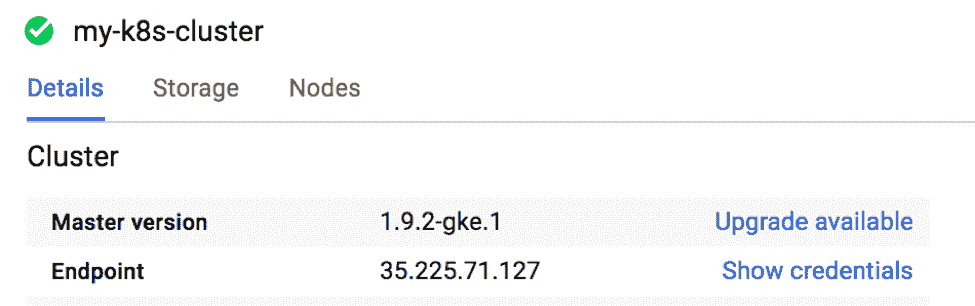

在 GCP 控制台中查看升级信息

我们看到升级已可用。截图中的 1.9.3-gke.1 刚刚发布，我们的集群可以进行升级：

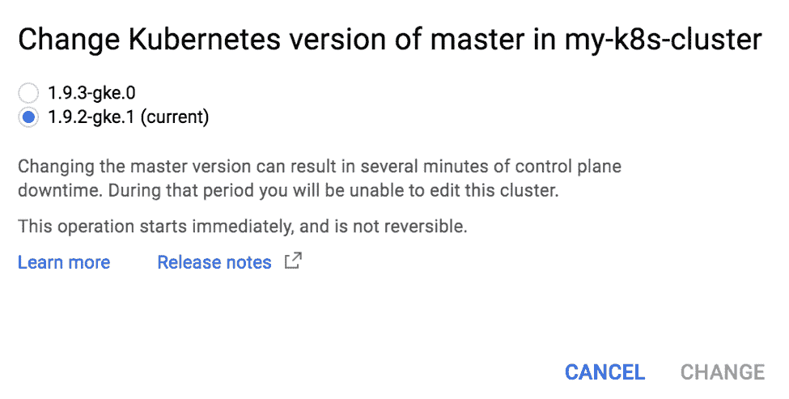

升级可用至 1.9.3-gke.0

我们可以通过 GKE 控制台或使用 gcloud 命令来升级集群。在下一个示例中，我们将使用单区（`us-central1-a`）集群来演示如何升级。升级集群时，主节点始终是第一个进行升级的节点。所需的节点版本不能高于当前主节点的版本。

```
# gcloud container clusters upgrade my-k8s-cluster --zone us-central1-a --cluster-version 1.9.3-gke.0 –master
Master of cluster [my-k8s-cluster] will be upgraded from version
[1.9.2-gke.1] to version [1.9.3-gke.0]. This operation is long-running
 and will block other operations on the cluster (including delete)
until it has run to completion.
Do you want to continue (Y/n)?  y
Upgrading my-k8s-cluster...done.
Updated [https://container.googleapis.com/v1/projects/kubernetes-cookbook/zones/us-central1-a/clusters/my-k8s-cluster].
```

让我们检查主节点的版本：

```
# kubectl version
...
Server Version: version.Info{Major:"1", Minor:"9+", GitVersion:"v1.9.3-gke.0", GitCommit:"a7b719f7d3463eb5431cf8a3caf5d485827b4210", GitTreeState:"clean", BuildDate:"2018-02-16T18:26:01Z", GoVersion:"go1.9.2b4", Compiler:"gc", Platform:"linux/amd64"}
```

看起来不错。主节点已升级到`v1.9.3-gke.0`，但我们的节点还没有升级：

```
# kubectl get nodes
NAME                                            STATUS    ROLES     AGE       VERSION
gke-my-k8s-cluster-default-pool-978ca614-3jxx   Ready     <none>    8m        v1.9.2-gke.1
gke-my-k8s-cluster-default-pool-978ca614-njrs   Ready     <none>    8m        v1.9.2-gke.1
gke-my-k8s-cluster-default-pool-978ca614-xmlw   Ready     <none>    8m        v1.9.2-gke.1
```

对于节点升级，GKE 不是一次性地升级所有节点，而是执行滚动升级。它首先会将一个节点从节点池中排空并注销，删除旧实例，并以所需的版本提供新实例，然后将其添加回集群：

```
// perform node upgrades.
# gcloud container clusters upgrade my-k8s-cluster --zone us-central1-a --cluster-version 1.9.3-gke.0
All nodes (3 nodes) of cluster [my-k8s-cluster] will be upgraded from
version [1.9.2-gke.1] to version [1.9.3-gke.0]. This operation is
long-running and will block other operations on the cluster (including
 delete) until it has run to completion.
Do you want to continue (Y/n)?  y
Upgrading my-k8s-cluster...done.
Updated [https://container.googleapis.com/v1/projects/kubernetes-cookbook/zones/us-central1-a/clusters/my-k8s-cluster].
```

节点池可以通过在集群创建时使用`--enable-autoupgrade`标志来配置为自动升级，或者使用 gcloud 容器的`node-pools`更新命令来更新现有节点池。有关更多信息，请参阅[`cloud.google.com/kubernetes-engine/docs/concepts/node-auto-upgrades`](https://cloud.google.com/kubernetes-engine/docs/concepts/node-auto-upgrades)。

这将需要超过 10 分钟。之后，集群中的所有节点将升级到`1.9.3-gke.0`。

# 另见

+   在第八章的*在 kubeconfig 中的高级设置*，*高级集群管理*

+   在第八章的*设置节点资源*中，*高级集群管理*
