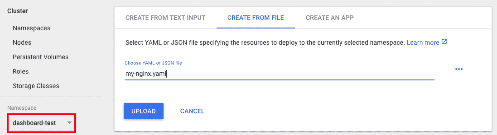
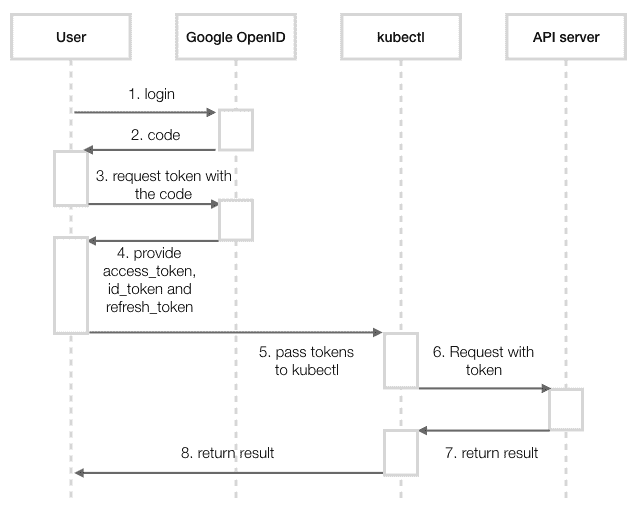

# 第八章：高级集群管理

本章我们将介绍以下几个小节：

+   kubeconfig 的高级设置

+   设置节点中的资源

+   玩转 WebUI

+   使用 RESTful API

+   使用 Kubernetes DNS

+   认证和授权

# 介绍

本章我们将讨论一些高级管理主题。首先，你将学习如何使用 kubeconfig 管理不同的集群。接着，我们将处理节点中的计算资源。Kubernetes 提供了一个友好的用户界面，展示了资源的当前状态，例如部署、节点和 Pod。你将学习如何构建和管理它。

接下来，你将学习如何使用 Kubernetes 暴露的 RESTful API。这将是与其他系统集成的一个便捷方式。最后，我们将构建一个安全的集群；最后一节将介绍如何在 Kubernetes 中设置认证和授权。

# kubeconfig 的高级设置

**kubeconfig** 是一个配置文件，用于在 Kubernetes 中管理集群、上下文和认证设置，位于客户端。通过使用 `kubeconfig` 文件，我们可以设置不同的集群凭据、用户和命名空间，以便在集群或集群内切换上下文。它可以通过命令行使用 `kubectl config` 子命令进行配置，或者直接更新配置文件。在这一部分，我们将描述如何使用 `kubectl config` 操控 kubeconfig，以及如何直接输入 kubeconfig 文件。

如果你已经阅读了第二章《走进 Kubernetes 概念》中的 *使用命名空间* 部分，第一次提到 kubeconfig，你会了解其基本概念。让我们回顾一些要点：


kubeconfig 包含三个参数：用户、集群和上下文

从上面的图示中，我们可以注意到以下几点：

+   **kubeconfig 中有三个参数**：用户、集群和上下文—用户有自己的认证，集群决定特定的 API 服务器以及专用计算资源。上下文包含 *用户* 和集群。

+   **为各种设置组合构建多个上下文**：用户和集群可以在不同的上下文中共享。

+   **命名空间可以在一个上下文中对齐**：命名空间的当前上下文设置规则。所有请求应遵循当前上下文中的用户和集群映射。

# 准备就绪

请运行两个 Kubernetes 集群并为它们指定主机名。你可以在主节点上直接更新 hostfile（`/etc/hosts`）。一个在 localhost 上，API 服务器端点为 `http://localhost:8080`，另一个在远程节点上，端点为 `http://$REMOTE_MASTER_NODE:8080`。我们将使用这两个集群进行演示。这里的 API 服务器端点是非安全通道。这是一个简单的 API 服务器配置，用于访问权限的模拟。

**在 kubeadm 上启用 API 服务器的不安全端点**

在运行 `kubeadm init` 时，我们必须向 API 服务器传递额外的参数。在这种情况下，应应用通过标志 `--config` 指定的自定义配置文件：

```
// you can also get this file through code bundle
$ cat additional-kubeadm-config
apiVersion: kubeadm.k8s.io/v1alpha1
kind: MasterConfiguration
apiServerExtraArgs:
  insecure-bind-address: "0.0.0.0"
  insecure-port: "8080"
// start cluster with additional system settings
$ sudo kubeadm init --config ./additional-kubeadm-config
```

启动具有不安全访问 API 服务器端点的两个集群后，确保您可以在本地集群中访问它们：

```
// on localhost cluster, the following commands should be successful
$ curl http://localhost:8080
$ curl http://$REMOTE_MASTER_NODE:8080
```

请注意，不安全地址配置仅供我们接下来的教程使用。用户在实际系统中设置时应小心谨慎。

在开始之前，我们应该检查默认的 kubeconfig，以便观察更新后的变化。执行命令 `kubectl config view` 来查看您的初始 kubeconfig：

```
// the settings created by kubeadm
$ kubectl config view
apiVersion: v1
clusters:
- cluster:
    certificate-authority-data: REDACTED
    server: https://192.168.122.101:6443
  name: kubernetes
contexts:
- context:
    cluster: kubernetes
    user: kubernetes-admin
  name: kubernetes-admin@kubernetes
current-context: kubernetes-admin@kubernetes kind: Config
preferences: {}
users:
- name: kubernetes-admin
  user:
    client-certificate-data: REDACTED
    client-key-data: REDACTED
```

根据您的安装方式，可能会有一些不同的设置。但我们也可能会发现工具已经初始化了一个基本的上下文，在 kubeadm 中是 `kubernetes-admin@kubernetes`。接下来，继续复制物理 `kubeconfig` 文件，作为后续更新的基础，并且在实践后恢复原始环境时使用。

```
// in default, the kubeconfig used by client is the one under $HOME
$ cp ~/.kube/config ~/original-kubeconfig
```

# 如何操作...

在本教程中，我们将使用本地集群作为主要控制台，通过上下文切换集群。首先，在两个集群中运行不同数量的 `nginx`，并确保所有 pod 都在运行：

```
// in the terminal of localhost cluster
$ kubectl run local-nginx --image=nginx --replicas=2 --port=80
deployment "local-nginx" created
// check the running pods
$ kubectl get pod
NAME                           READY     STATUS    RESTARTS   AGE
local-nginx-6484bbb57d-xpjp2   1/1       Running   0          1m
local-nginx-6484bbb57d-z4qgp   1/1       Running   0          1m
// in the terminal of remote cluster
$ kubectl run remote-nginx --image=nginx --replicas=4 --port=80
deployment "remote-nginx" created
$ kubectl get pod
NAME                            READY     STATUS    RESTARTS   AGE
remote-nginx-5dd7b9cb7d-fxr9m   1/1       Running   0          29s
remote-nginx-5dd7b9cb7d-gj2ft   1/1       Running   0          29s
remote-nginx-5dd7b9cb7d-h7lmj   1/1       Running   0          29s
remote-nginx-5dd7b9cb7d-hz766   1/1       Running   0          29s
```

# 设置新凭据

接下来，我们将为每个集群设置两个凭据。使用子命令 `set-credentials`，命令格式为 `kubectl config set-credentials <CREDENTIAL_NAME>` 将凭据添加到 kubeconfig 中。Kubernetes 支持不同的身份验证方法。我们可以使用密码、客户端证书或令牌。在此示例中，我们将使用 HTTP 基本身份验证来简化场景。Kubernetes 还支持客户端证书和令牌身份验证。如需更多信息，请使用 `set-credentials` 命令并带上 `-h` 标志，详细了解其功能：

```
// check the details of setting up credentials
$ kubectl config set-credentials -h
// in localhost cluster, copy the based file into a new one
$ cp ~/original-kubeconfig ~/new-kubeconfig
// add a user "user-local" with credential named "myself@localhost" in kubeconfig "new-kubeconfig"
$ kubectl config set-credentials myself@localhost --username=user-local --password=passwordlocal --kubeconfig="new-kubeconfig"
User "myself@local" set.
```

通过前面的步骤，我们成功地在 `"new-kubeconfig"` `kubeconfig` 文件中添加了一个新凭据。默认情况下，kubeconfig 文件将以 YAML 格式进行格式化——您可以通过文本编辑器查看该文件。使用这种方法，我们能够自定义新配置，而不会干扰当前的设置。另一方面，如果没有 `--kubeconfig` 标志，更新将直接附加到 `live kubeconfig`：

```
// renew live kubeconfig file with previous update
$ cp ~/new-kubeconfig ~/.kube/config
// add another credential in localhost cluster, this time, let's update current settings directly
$ kubectl config set-credentials myself@remote --username=user-remote --password=passwordremote
User "myself@remote" set.
```

此时，检查您的实时 kubeconfig 设置，查看新凭据：

```
$ kubectl config view
...
users:
- name: myself@local
  user:
    password: passwordlocal
    username: user-local
- name: myself@remote
  user:
    password: passwordremote
    username: user-remote
```

# 设置新集群

要设置新集群，我们使用`kubectl config set-cluster <CLUSTER_NAME>`命令。需要使用额外的`--server`标志来指示访问的集群。其他标志用于定义安全级别，例如`--insecure-skip-tls-verify`标志，它跳过对服务器证书的检查。如果你正在设置一个可信的 HTTPS 服务器，你需要使用`--certificate-authority=$PATH_OF_CERT --embed-certs=true`来代替。有关更多信息，可以使用`-h`标志来查看命令帮助。以下命令中，我们在本地主机环境中设置了两个集群配置：

```
// in localhost cluster, create a cluster information pointing to itself
 $ kubectl config set-cluster local-cluster --insecure-skip-tls-verify=true --server=http://localhost:8080
 Cluster "local-cluster" set.
 // another cluster information is about the remote one
 $ kubectl config set-cluster remote-cluster --insecure-skip-tls-verify=true --server=http://$REMOTE_MASTER_NODE:8080
 Cluster "remote-cluster" set.
 // check kubeconfig in localhost cluster, in this example, the remote master node has the hostname "node01"
 $ kubectl config view
 apiVersion: v1
 clusters:
 ...
 - cluster:
     insecure-skip-tls-verify: true
     server: http://localhost:8080
   name: local-cluster
 - cluster:
     insecure-skip-tls-verify: true
     server: http://node01:8080
   name: remote-cluster
 ...
```

我们尚未将任何内容与**用户**和**集群**关联。我们将在下一节通过**上下文**将它们链接起来。

# 设置上下文并切换当前上下文

一个上下文包含一个集群、一个命名空间和一个用户。根据当前的上下文，客户端将使用指定的*用户*信息和命名空间来向集群发送请求。要设置上下文，我们将使用`kubectl config set-context <CONTEXT_NAME> --user=<CREDENTIAL_NAME> --namespace=<NAMESPACE> --cluster=<CLUSTER_NAME>`命令来创建或更新它：

```
// in localhost cluster, create a context for accessing local cluster's default namespace
$ kubectl config set-context default/local/myself --user=myself@local --namespace=default --cluster=local-cluster
Context "default/local/myself" created.
// furthermore, create another context for remote cluster
$ kubectl config set-context default/remote/myself --user=myself@remote --namespace=default --cluster=remote-cluster
Context "default/remote/myself" created.
```

让我们检查当前的 kubeconfig。我们可以找到两个新的上下文：

```
$ kubectl config view
...
contexts:
- context:
    cluster: local-cluster
    namespace: default
    user: myself@local
  name: default/local/myself
- context:
    cluster: remote-cluster
    namespace: default
    user: myself@remote
  name: default/remote/myself
...
```

创建上下文后，我们可以切换上下文以管理不同的集群。在这里，我们将使用`kubectl config use-context <CONTEXT_NAME>`命令：

```
// check current context
$ kubectl config current-context
kubernetes-admin@kubernetes

// use the new local context instead
$ kubectl config use-context default/local/myself
Switched to context "default/local/myself".
// check resource for the status of context
$ kubectl get pod
NAME                           READY     STATUS    RESTARTS   AGE
local-nginx-6484bbb57d-xpjp2   1/1       Running   0          2h
local-nginx-6484bbb57d-z4qgp   1/1       Running   0          2h
```

是的，看来没问题。那如果我们切换到具有远程集群设置的上下文呢：

```
// switch to the context of remote cluster
$ kubectl config use-context default/remote/myself
Switched to context "default/remote/myself".
// check the pods
$ kubectl get pod
NAME                            READY     STATUS    RESTARTS   AGE
remote-nginx-5dd7b9cb7d-fxr9m   1/1       Running   0          2h
remote-nginx-5dd7b9cb7d-gj2ft   1/1       Running   0          2h
remote-nginx-5dd7b9cb7d-h7lmj   1/1       Running   0          2h
remote-nginx-5dd7b9cb7d-hz766   1/1       Running   0          2h
```

我们所做的所有操作都在本地主机集群中。kubeconfig 使得在多个集群和多个用户之间工作的场景变得更加简单。

# 清理 kubeconfig

我们仍然可以利用`kubectl config`来删除 kubeconfig 中的配置。对于集群和上下文，你可以使用`delete-cluster`和`delete-context`子命令删除不需要的配置。或者，对于这三类配置，`unset`子命令可以完成删除：

```
// delete the customized local context
$ kubectl config delete-cluster local-cluster
deleted cluster local-cluster from $HOME/.kube/config

// unset the local user
// to remove cluster, using property clusters.CLUSTER_NAME; to remove contexts, using property contexts.CONTEXT_NAME
$ kubectl config unset users.myself@local
Property "users.myself@local" unset.
```

尽管前面的命令效果会立即应用于当前的 kubeconfig，但一个更快且更可靠的方法是更新另一个 kubeconfig 文件进行替换。kubeconfig 文件是文本文件`new-kubeconfig`，即我们刚才更新的文件，或者是我们从初始语句`original-kubeconfig`中复制的文件：

```
// remove all of our practices
$ cp ~/original-kubeconfig ~/.kube/config
// check your kubeconfig to make sure it has been cleaned
$ kubectl config view
```

# 还有更多内容...

正如我们在前一节中提到的，涉及凭证和权限的实际用例不能忽视，就像穿越不安全的端点一样，就像我们演示中的情况。为了避免安全问题，在授予用户权限时，你可以参考官方文档（见[`kubernetes.io/docs/admin/authentication/`](https://kubernetes.io/docs/admin/authentication/)）。

# 另见

kubeconfig 管理集群、凭证和命名空间设置。请参阅以下配方了解完整概念：

+   第二章中的*与秘密协作*配方，*逐步讲解 Kubernetes 概念*

+   第二章中 *与命名空间的协作* 章节，*走进 Kubernetes 概念*

# 设置节点中的资源

计算资源管理在任何基础设施中都非常重要。我们应该充分了解我们的应用程序，并保留足够的 CPU 和内存容量，以避免资源耗尽。在本节中，我们将介绍如何管理 Kubernetes 节点中的节点容量。此外，我们还将描述如何管理 pod 的计算资源。

Kubernetes 有资源**服务质量**（**QoS**）的概念。它允许管理员优先分配资源给 pod。根据 pod 的设置，Kubernetes 将每个 pod 分类为以下之一：

+   Guaranteed pod

+   Burstable pod

+   BestEffort pod

优先级为 Guaranteed > Burstable > BestEffort。例如，如果一个 BestEffort pod 和一个 Guaranteed pod 存在于同一个 Kubernetes 节点上，且该节点遇到 CPU 问题或内存耗尽时，Kubernetes master 会首先终止 BestEffort pod。让我们来看看它是如何工作的。

# 准备工作

有两种方式可以设置资源 QoS：pod 配置或命名空间配置。如果您将资源 QoS 设置为命名空间，它将应用于所有属于该命名空间的 pod。如果您将资源 QoS 设置为 pod，它只会应用于该 pod。此外，如果同时设置了命名空间和 pod 的资源 QoS，系统会首先从命名空间配置中获取值，然后用 pod 配置覆盖。因此，我们将设置两个命名空间，一个配置了资源 QoS，另一个没有，以便观察它们的不同：

1.  使用 `kubectl` 命令创建两个命名空间，如下所示：

```
$ kubectl create namespace chap8-no-qos
namespace "chap8-no-qos" created

$ kubectl create namespace chap8-qos
namespace "chap8-qos" created
```

1.  准备一个 YAML 文件，设置 `spec.limits.defaultRequest.cpu: 0.1`，如下所示：

```
$ cat resource-request-cpu.yml
apiVersion: v1
kind: LimitRange
metadata:
  name: resource-request-cpu
spec:
  limits:
  - defaultRequest:
 cpu: 0.1
    type: Container
```

1.  通过输入 `kubectl` 命令，仅使其应用于 `chap8-qos` 命名空间：

```
$ kubectl create -f resource-request-cpu.yml --namespace=chap8-qos
limitrange "resource-request-cpu" created
```

1.  使用 `kubectl` 命令检查 `chap8-qos` 和 `chap8-no-qos` 上的资源限制：

```
//chap8-no-qos doesn't have any resource limits value
$ kubectl describe namespaces chap8-no-qos
Name:         chap8-no-qos
Labels:       <none>
Annotations:  <none>
Status:       Active
No resource quota.
No resource limits.

//chap8-qos namespace has a resource limits value
$ kubectl describe namespaces chap8-qos
Name:         chap8-qos
Labels:       <none>
Annotations:  <none>
Status:       Active
No resource quota.
Resource Limits
 Type       Resource  Min  Max  Default Request  Default Limit  Max Limit/Request Ratio
 ----       --------  ---  ---  ---------------  -------------  -----------------------
 Container  cpu       -    -    100m             -              -
```

# 如何操作...

让我们一步一步配置一个 BestEffort pod、一个 Guaranteed pod，然后一个 Burstable pod。

# 配置 BestEffort pod

BestEffort pod 在资源 QoS 类别中优先级最低。因此，在资源短缺的情况下，这个 BestEffort pod 会被 Kubernetes 调度器终止，并将 CPU 和内存资源让给其他更高优先级的 pod。

要将一个 pod 配置为 BestEffort，您需要将资源限制设置为 `0`（显式），或者不指定资源限制（隐式）。

1.  准备一个 pod 配置，明确设置 `spec.containers.resources.limits` 为 `0`：

```
$ cat besteffort-explicit.yml
apiVersion: v1
kind: Pod
metadata:
  name: besteffort
spec:
  containers:
  - name: nginx
    image: nginx
    resources:
      limits:
 cpu: 0
 memory: 0
```

1.  在 `chap8-qos` 和 `chap8-no-qos` 命名空间中创建 pod：

```
$ kubectl create -f besteffort-explicit.yml --namespace=chap8-qos
pod "besteffort" created

$ kubectl create -f besteffort-explicit.yml --namespace=chap8-no-qos
pod "besteffort" created
```

1.  检查 `QoS` 类别；两个 pod 都属于 `BestEffort` 类别：

```
$ kubectl describe pods besteffort --namespace=chap8-qos | grep QoS
QoS Class:       BestEffort

$ kubectl describe pods besteffort --namespace=chap8-no-qos | grep QoS
QoS Class:       BestEffort
```

有一个陷阱：如果你在 Pod 配置中没有设置任何资源设置，Pod 将从命名空间的默认设置中获取值。因此，如果你创建一个没有资源设置的 Pod，`chap8-qos`和`chap8-no-qos`之间的结果将会不同。以下示例演示了命名空间设置如何影响结果：

1.  删除`chap8-qos`和`chap8-no-qos`命名空间中的前置 Pod：

```
$ kubectl delete pod --all --namespace=chap8-qos
pod "besteffort" deleted

$ kubectl delete pod --all --namespace=chap8-no-qos
pod "besteffort" deleted
```

1.  准备一个没有资源设置的 Pod 配置：

```
$ cat besteffort-implicit.yml
apiVersion: v1
kind: Pod
metadata:
  name: besteffort
spec:
  containers:
  - name: nginx
    image: nginx
```

1.  在两个命名空间中创建 Pod：

```
$ kubectl create -f besteffort-implicit.yml --namespace=chap8-qos
pod "besteffort" created

$ kubectl create -f besteffort-implicit.yml --namespace=chap8-no-qos
pod "besteffort" created
```

1.  `QoS`类的结果是不同的：

```
$ kubectl describe pods besteffort --namespace=chap8-no-qos |grep QoS
QoS Class:       BestEffort

$ kubectl describe pods besteffort --namespace=chap8-qos |grep QoS
QoS Class:       Burstable
```

因为`chap8-qos`命名空间的默认设置是`request.cpu: 0.1`，这导致 Pod 配置为`Burstable`类。因此，我们将使用`chap8-no-qos`命名空间，避免这种意外结果。

# 配置一个 Guaranteed Pod

Guaranteed 类具有资源`QoS`类中的最高优先级。在资源短缺的情况下，Kubernetes 调度器会尽量保留 Guaranteed Pod 直到最后。

为了将 Pod 配置为`guaranteed`类，明确设置资源限制和资源请求为相同值，或者只设置资源限制：

1.  准备一个`resources.limit`和`resources.request`具有相同值的 Pod 配置：

```
$ cat guaranteed.yml
apiVersion: v1
kind: Pod
metadata:
  name: guaranteed-pod
spec:
  containers:
  - name: nginx
    image: nginx
    resources:
      limits:
 cpu: 0.3
 memory: 350Mi
 requests:
 cpu: 0.3
 memory: 350Mi
```

1.  在`chap8-no-qos`命名空间中创建 Pod：

```
$ kubectl create -f guaranteed.yml --namespace=chap8-no-qos
pod "guaranteed-pod" created
```

1.  检查`QoS 类`；它有`Guaranteed`类：

```
$ kubectl describe pods guaranteed-pod --namespace=chap8-no-qos |grep QoS
QoS Class:       Guaranteed
```

# 配置一个 Burstable Pod

Burstable Pod 的优先级高于 BestEffort，但低于 Guaranteed。为了将 Pod 配置为 Burstable Pod，你需要设置`resources.request`。`resources.limit`是可选的，但`resources.request`和`resources.limit`的值不能相等：

1.  准备一个仅包含`resources.request`的 Pod 配置：

```
$ cat burstable.yml
apiVersion: v1
kind: Pod
metadata:
  name: burstable-pod
spec:
  containers:
  - name: nginx
    image: nginx
    resources:
      requests:
 cpu: 0.1
 memory: 10Mi
 limits:
 cpu: 0.5
 memory: 300Mi
```

1.  创建 Pod：

```
$ kubectl create -f burstable.yml --namespace=chap8-no-qos
pod "burstable-pod" created
```

1.  检查`QoS`类；它是`Burstable`：

```
$ kubectl describe pods burstable-pod --namespace=chap8-no-qos |grep QoS
QoS Class:       Burstable
```

# 它是如何工作的...

让我们看看资源请求/限制如何影响资源管理。一个前置的 burstable YAML 配置声明了不同阈值的请求和限制，如下所示：

| **资源定义类型** | **资源名称** | **值** | **描述** |
| --- | --- | --- | --- |
| **requests** | CPU | 0.1 | 至少占 1 个 CPU 核心的 10% |
| 内存 | 10Mi | 至少 10MB 内存 |
| **limits** | CPU | 0.5 | 最大 50%的 1 个 CPU 核心 |
| 内存 | 300Mi | 最大 300MB 内存 |

对于 CPU 资源，接受的值表达式可以是核心数（0.1、0.2 … 1.0、2.0）或毫 CPU（100 m、200 m … 1000 m、2000 m）。1000 m 相当于 1.0 核心。例如，如果 Kubernetes 节点有 2 个 CPU 核心（或 1 个核心带超线程），则总共有 2.0 个核心或 2000 毫 CPU，如下图所示：


表示 2.0 CPU 资源

通过输入`kubectl describe node <node name>`，你可以查看节点上可用的资源：

```
//Find a node name
$ kubectl get nodes
NAME       STATUS    ROLES     AGE       VERSION
minikube   Ready     <none>    22h       v1.9.0

//Specify node name 'minikube' 
$ kubectl describe nodes minikube
Name:               minikube
Roles:              <none>
Labels:             beta.kubernetes.io/arch=amd64
...
...
Allocatable:
 cpu:     2 memory:  1945652Ki pods:    110
```

这显示了 `minikube` 节点，它有 2.0 CPU 和大约 1,945 MB 内存。如果你运行 nginx 示例（`requests.cpu: 0.1`），它至少占用 0.1 核，如下图所示：


请求 0.1 CPU 资源

只要 CPU 有足够的空间，它最多可以占用 0.5 核（`limits.cpu: 0.5`），如下图所示：


它最多可以占用 0.5 CPU 资源

因此，如果你将 `requests.cpu` 设置为超过 2.0，pod 将无法分配到此节点，因为可分配的 CPU 为 2.0，而 nginx pod 已经占用了至少 0.1 CPU。

# 另请参见

在本节中，你学习了如何通过设置资源请求和限制来配置资源 QoS。命名空间的默认值会影响最终的 pod 配置，因此你应该明确指定资源请求和限制。

请回顾以下章节，重温如何配置命名空间：

+   在第二章中，*与命名空间一起工作*，*了解 Kubernetes 概念*

# 使用 WebUI

Kubernetes 提供了一个 WebUI，用于可视化资源和机器的状态，也作为一个额外的界面来管理你的应用程序，无需命令行。在这个教程中，我们将介绍 Kubernetes 仪表板。

# 准备就绪

Kubernetes 仪表板 ([`github.com/kubernetes/dashboard`](https://github.com/kubernetes/dashboard)) 类似于一个服务器端应用程序。开始时，只需确保你有一个健康的 Kubernetes 集群在运行，我们将在接下来的页面中介绍安装和相关设置。由于仪表板将通过浏览器访问，我们可以使用一个通过 minikube 启动、在笔记本电脑上运行的 Kubernetes 系统，并减少转发网络端口或设置防火墙规则的步骤。

对于通过 minikube 启动的 Kubernetes 系统，请检查 minikube 和系统本身是否正常工作：

```
// check if minikube runs well
$ minikube status
minikube: Running
cluster: Running
kubectl: Correctly Configured: pointing to minikube-vm at 192.168.99.100
// check the Kubernetes system by components
$ kubectl get cs
NAME                 STATUS    MESSAGE              ERROR
scheduler            Healthy   ok
controller-manager   Healthy   ok
etcd-0               Healthy   {"health": "true"}
```

# 如何操作...

在使用 minikube 启动 Kubernetes 系统时，默认情况下会帮助创建仪表板。因此，我们将分别讨论这两种情况。

# 依赖 minikube 创建的仪表板

因为 Kubernetes 仪表板已经启动，我们要做的就是通过特定的 URL 打开 Web UI。这非常方便，你只需要在终端中执行一个命令：

```
$ minikube dashboard
Opening kubernetes dashboard in default browser...
```

然后，你将看到你喜欢的浏览器打开一个新网页，正如我们在第一章中介绍的，*构建你自己的 Kubernetes 集群*。其 URL 看起来像 [`MINIKUBE_VM_IP:30000/#!/overview?namespace=default`](http://MINIKUBE_VM_IP:30000/#!/overview?namespace=default)。最重要的是，我们绕过了预期的网络代理和身份验证程序。

# 在使用其他启动工具的系统上手动创建仪表板

要运行 Kubernetes 仪表板，我们只需执行一个命令来应用配置文件，所有资源将自动创建：

```
$ kubectl create -f
https://raw.githubusercontent.com/kubernetes/dashboard/master/src/deploy/recommended/kubernetes-dashboard.yaml
secret "kubernetes-dashboard-certs" created
serviceaccount "kubernetes-dashboard" created
role "kubernetes-dashboard-minimal" created
rolebinding "kubernetes-dashboard-minimal" created
deployment "kubernetes-dashboard" created
service "kubernetes-dashboard" created
```

接下来，让我们使用命令 `kubectl proxy` 打开连接本地主机和 API 服务器的网关。然后，我们可以通过浏览器访问仪表板：

```
$ kubectl proxy
Starting to serve on 127.0.0.1:8001
```

一旦您看到如前所示的停止结果，您现在可以通过 URL 访问仪表板：[`localhost:8001/api/v1/namespaces/kube-system/services/https:kubernetes-dashboard:/proxy/`](http://localhost:8001/api/v1/namespaces/kube-system/services/https:kubernetes-dashboard:/proxy/)。在那里，您将在浏览器中看到以下屏幕：


Kubernetes 仪表板的登录门户

为了快速进入我们的演示，我们将使用现有服务帐户的令牌进行登录。无论您使用什么启动工具，使用仪表板创建的工具在任何情况下都是合适的：

```
// check the service account in your system
$ kubectl get secret -n kube-system
NAME                               TYPE                                  DATA      AGE
default-token-7jfmd                kubernetes.io/service-account-token   3         51d
kubernetes-dashboard-certs         Opaque                                0         2d
kubernetes-dashboard-key-holder    Opaque                                2         51d
kubernetes-dashboard-token-jw42n   kubernetes.io/service-account-token   3         2d
// grabbing token by checking the detail information of the service account with prefix "kubernetes-dashboard-token-"
$ kubectl describe secret kubernetes-dashboard-token-jw42n -n kube-system
Name:         kubernetes-dashboard-token-jw42n
Namespace:    kube-system
Labels:       <none>
Annotations:  kubernetes.io/service-account.name=kubernetes-dashboard
              kubernetes.io/service-account.uid=253a1a8f-210b-11e8-b301-8230b6ac4959
Type:  kubernetes.io/service-account-token
Data
====
ca.crt:     1066 bytes
namespace:  11 bytes
token:     
eyJhbGciOiJSUzI1NiIsInR5cCI6IkpXVCJ9.eyJpc3MiOiJrdWJlcm5ldGVzL3NlcnZpY2VhY2NvdW50Ii....
```

复制令牌并粘贴到浏览器控制台中，然后单击“SIGN IN”：


使用服务帐户的令牌进行身份验证

欢迎访问仪表板主页：


Kubernetes 仪表板的主页

# 工作原理...

Kubernetes 仪表板有两个主要功能：检查资源状态和部署资源。它可以覆盖我们在客户端终端上使用 `kubectl` 命令的大部分工作，但图形界面更加友好。

# 通过仪表板浏览您的资源

我们可以在仪表板上检查硬件和软件资源。例如，要查看集群中的节点，请在左侧菜单的**集群**部分下单击**节点**；当前集群中的每个节点将显示在页面上，并显示一些基本信息：


仪表板上的 Kubernetes 节点状态

由于基于您的环境，您在屏幕上看到的结果可能与前面的截图不同。继续单击一个节点的名称；将显示更多详细信息。其中一些以美观的图表形式呈现：


计算节点的资源状态

要显示软件资源，让我们看一下持有此仪表板的资源。在左侧菜单中，将命名空间更改为 kube-system，并单击概述，这将在单个页面上将所有资源汇集在一起，并使用清晰的图表显示出任何问题：


kube-system 命名空间的资源概述

还有更多内容；单击 kubernetes-dashboard 的部署，然后单击副本集中唯一 Pod 右侧的小文本文件图标。您可以查看容器的日志：


kubernetes-dashboard 的部署信息


仪表板应用程序的日志

现在，我们看到 Kubernetes 仪表盘提供了一个出色的界面，用于显示资源状态，涵盖节点、Kubernetes 工作负载和控制器，以及应用日志。

# 通过仪表盘部署资源

在这里，我们将准备一个 YAML 配置文件，用于在新的命名空间下创建 Kubernetes 部署和相关服务。它将通过仪表盘构建资源：

```
// the configuration file for creating Deployment and Service on new Namespace: dashboard-test
$ cat my-nginx.yaml
apiVersion: apps/v1beta2
kind: Deployment
metadata:
  name: my-nginx
  namespace: dashboard-test
spec:
  replicas: 3
  selector:
    matchLabels:
      run: demo
  template:
    metadata:
      labels:
        run: demo
    spec:
      containers:
      - name: my-container
        image: nginx
        ports:
        - containerPort: 80
---
apiVersion: v1
kind: Service
metadata:
  name: my-nginx
  namespace: dashboard-test
spec:
  ports:
    - protocol: TCP
      port: 80
  type: NodePort
  selector:
    run: demo
```

首先，点击网页右上角的 CREATE 按钮。

部署有三种方法。我们选择第二种并上传先前介绍的配置文件。点击 UPLOAD 按钮：


通过配置文件创建资源

不幸的是，发生了错误：


由于部署问题，显示的错误信息

仪表盘根据给定的命名空间显示资源，该命名空间由*用户*在左侧菜单中选择。这个错误消息弹出并告诉用户，文件中提到的命名空间与仪表盘中的命名空间不匹配。我们需要做的是创建一个新命名空间并切换到它。

这次，我们将使用纯文本创建一个命名空间。再次点击 CREATE 按钮，选择从文本输入创建的方法。将以下内容粘贴到网页中，以创建一个新的命名空间：

```
apiVersion: v1
kind: Namespace
metadata:
  name: dashboard-test
```

现在，我们有了一个新的命名空间，`dashboard-test`。在仪表盘中选择它作为主要命名空间，然后再次提交`my-nginx.yaml`文件：



提交配置文件之前，选择正确的命名空间

现在你可以看到该部署的概览！黄色圆圈表示待处理状态。一旦 pod 准备就绪，它们会变成绿色，如果失败，则变为红色。但是，如果你按照以下步骤进行操作，你将看不到红色标记：


创建资源的状态图

# 通过仪表盘删除资源

我们还可以通过仪表盘删除 Kubernetes 资源。尝试自己找到我们刚刚创建的服务`my-nginx`！执行以下操作：

+   将左侧菜单中的命名空间更改为 dashboard-test

+   点击左侧菜单中的服务部分，在“发现与负载均衡”下选择服务

+   点击超链接名称上的服务`my-nginx`

+   点击页面右上角的 DELETE 按钮，在 CREATE 按钮下方

就这样！当你看到屏幕上出现确认信息时，只需点击确认。最后，你不仅创建了一个资源，还从 Kubernetes 仪表盘中删除了它。

# 另见

本教程描述了如何启动一个 Web 界面，它将帮助你轻松地探索和管理 Kubernetes 实例，如 pod、部署和服务，而无需使用`kubectl`命令。有关如何通过`kubectl`命令获取详细信息的其他教程，请参见下方。

+   在《第二章》*走进 Kubernetes 概念*中，*使用 Pods*，*Deployment API*和*使用 Services*的示例

# 使用 RESTful API

用户可以通过`kubectl`命令控制 Kubernetes 集群；它支持本地和远程执行。但是，某些管理员或操作员可能需要集成程序来控制 Kubernetes 集群。

Kubernetes 具有 RESTful API 通过 API 控制 Kubernetes 集群，类似于`kubectl`命令。让我们学习如何通过提交 API 请求管理 Kubernetes 资源。

# 准备就绪

在此示例中，为了绕过额外的网络设置和验证权限的需求，我们将演示一个由*minikube*创建的集群，并使用 Kubernetes 代理：在主机上创建一个 Kubernetes 集群并启用本地 API 服务器的代理入口非常容易。

首先，启动一个代理以快速转发 API 请求：

```
//curl by API endpoint
$ kubectl proxy
Starting to serve on 127.0.0.1:8001
```

使用 Kubernetes 代理工作一段时间后，您可能会发现`kubectl proxy`命令会在终端上阻塞，强制您打开新的通道来执行后续命令，这有点让人恼火。为了避免这种情况，只需在您的命令中添加`&`作为最后一个参数。这个 shell 中的`&`符号将使您的命令在后台运行：

```
$ kubectl proxy &
[1] 6372
Starting to serve on 127.0.0.1:8001
```

请注意，如果不使用代理，则应手动终止此进程：

```
$ kill -j9 6372
```

然后，最好尝试简单路径`/api`的端点：

```
$ curl http://127.0.0.1:8001/api
{
  "kind": "APIVersions",
  "versions": [
    "v1"
  ],
  "serverAddressByClientCIDRs": [
    {
      "clientCIDR": "0.0.0.0/0",
      "serverAddress": "10.0.2.15:8443"
    }
  ]
}
```

一旦您看到像上面的基本 API 服务器信息显示的代码，恭喜！您现在可以与 Kubernetes 的 RESTful API 互动了。

**安全访问 Kubernetes API 服务器的方法**

但是，如果您考虑访问更安全的 API 服务器，例如 kubeadm 集群，则应注意以下事项：

+   API 服务器的端点

+   用于认证的令牌

我们可以通过以下命令获取所需信息。然后，您可以成功地发出版本的 API 请求：

```
$ APISERVER=$(kubectl config view | grep server | cut -f 2- -d ":" | tr -d " ")
// get the token of default service account
$ TOKEN=$(kubectl get secret --field-selector type=kubernetes.io/service-account-token -o name | grep default-token- | head -n 1 | xargs kubectl get -o 'jsonpath={.data.token}' | base64 -d)
$ curl $APISERVER/api -H "Authorization: Bearer $TOKEN" --insecure
```

另一方面，当访问 kubeadm 中的资源时，您可能会看到`permission denied`的消息。如果是这样，请将默认服务账户绑定到 kubeadm 系统中的管理员角色，即`cluster-admin`。我们在代码包中提供了配置文件`rbac.yaml`，如果需要，请查看：

```
$ curl $APISERVER/api/v1/namespaces/default/services -H "Authorization: Bearer $TOKEN" --insecure
...
 "status": "Failure",
 "message": "services is forbidden: User \"system:serviceaccount:default:default\" cannot list services in the namespace \"default\"",
 "reason": "Forbidden",
...
$ kubectl create -f rbac.yaml
clusterrolebinding "fabric8-rbac" created
// now the API request is successful
$ curl $APISERVER/api/v1/namespaces/default/services -H "Authorization: Bearer $TOKEN" --insecure
{
   "kind": "ServiceList",
   "apiVersion": "v1",
   "metadata": {
      "selfLink": "/api/v1/namespaces/default/services",
      "resourceVersion": "291954"
    },
...
```

要小心使用`--insecure`标志，因为端点使用 HTTPS 协议，并且`-H`，添加带有令牌的标头。这些与我们的天真演示设置相比是额外的。

# 如何做...

在本节中，我们将向您展示如何通过 RESTful API 管理资源。通常情况下，`curl`命令行模式将涵盖以下想法：

+   **操作**：未指定操作的`curl`默认将触发`GET`。要指定您的操作，请添加带有`X`标志的操作。

+   **请求体数据**：就像通过`kubectl`创建 Kubernetes 资源一样，我们使用`d`标志来应用资源配置。带有`@`符号的值可以附加文件。此外，`h`标志有助于添加请求头；在这里我们需要以 JSON 格式添加内容类型。

+   **URL**：根据不同的功能，端点后面有各种路径。

让我们使用以下 JSON 配置文件创建一个部署：

```
$ cat nginx-deployment.json
{
  "apiVersion": "apps/v1",
  "kind": "Deployment",
  "metadata": {
    "name": "my-nginx"
  },
  "spec": {
    "replicas": 2,
       "selector": {
      "matchLabels": {
        "app": "nginx"
      }
    },
    "template": {
      "metadata": {
        "labels": {
          "app": "nginx"
        }
      },
      "spec": {
        "containers": [
          {
            "image": "nginx",
            "name": "my-nginx"
          }
        ]
      }
    }
  }
}
```

我们可以在 API 参考页面获取每个功能（[`kubernetes.io/docs/reference/generated/kubernetes-api/v1.10/`](https://kubernetes.io/docs/reference/generated/kubernetes-api/v1.10/)）。这类似于在编写配置文件时搜索资源的配置。要提交 API 请求，你应该知道要操作的资源类型，以及要执行的操作。按照以下步骤，在参考网页上找到相应的信息：

1.  选择一个资源。

1.  选择一个操作，例如，读取或写入。

1.  选择操作的详细信息，例如，创建或删除。

1.  信息将在网页的中间面板显示。一个可选步骤是将`kubectl`切换为`curl`，位于控制台的右上角。更多细节，例如命令标志，将显示在右侧面板。

要检查创建部署的信息，你的网页控制台可能会像这张截图一样：


查找 API 路径以创建部署的步骤

根据参考页面，我们现在可以组合一个指定的`curl`命令并发出请求：

```
$ curl -X POST -H "Content-type: application/json" -d @nginx-deployment.json http://localhost:8001/apis/apps/v1/namespaces/default/deployments
{
  "kind": "Deployment",
  "apiVersion": "apps/v1",
  "metadata": {
    "name": "my-nginx",
    "namespace": "default",
    "selfLink": "/apis/apps/v1/namespaces/default/deployments/my-nginx",
    "uid": "6eca324e-2cc8-11e8-806a-080027b04dc6",
    "resourceVersion": "209",
    "generation": 1,
    "creationTimestamp": "2018-03-21T05:26:39Z",
    "labels": {
      "app": "nginx"
    }
  },
...
```

对于成功的请求，服务器返回资源的状态。继续检查我们是否能通过`kubectl`命令找到新的部署：

```
$ kubectl get deployment
NAME       DESIRED   CURRENT   UP-TO-DATE   AVAILABLE   AGE
my-nginx   2         2         2            2           1m
```

当然，通过 RESTful API 检查时也可以正常工作：

```
// the operation "-X GET" can be ignored, since
$ curl -X GET http://localhost:8001/apis/apps/v1/namespaces/default/deployments
```

接下来，尝试删除这个新的部署`my-nginx`，这也是一种`写`操作：

```
$ curl -X DELETE http://localhost:8001/apis/apps/v1/namespaces/default/deployments/my-nginx
{
  "kind": "Status",
  "apiVersion": "v1",
  "metadata": {
  },
  "status": "Success",
  "details": {
    "name": "my-nginx",
    "group": "apps",
    "kind": "deployments",
    "uid": "386a3aaa-2d2d-11e8-9843-080027b04dc6"
  }
}
```

# 它是如何工作的...

RESTful API 允许进行 CRUD（创建、读取、更新和删除）操作，这些概念在每个现代 Web 应用程序中都是相同的。有关更多详细信息，请参阅[`en.wikipedia.org/wiki/Create,_read,_update_and_delete`](https://en.wikipedia.org/wiki/Create,_read,_update_and_delete)。

根据 CRUD 结构，Kubernetes 的 RESTful API 有以下基本方法：

| **操作** | **HTTP 方法** | **示例** |
| --- | --- | --- |
| 创建 | `POST` | `POST /api/v1/namespaces/default/pods` |
| 读取 | `GET` | `GET /api/v1/componentstatuses` |
| 更新 | `PUT` | `PUT /apis/apps/v1/namespaces/default/deployments/my-nginx` |
| 删除 | `DELETE` | `DELETE /api/v1/namespaces/default/services/nginx-service` |

正如我们在 第三章的配方 *使用配置文件* 中提到的，*玩转容器*，Kubernetes 使用 *swagger* ([`swagger.io/`](https://swagger.io)) 和 OpenAPI ([`www.openapis.org`](https://www.openapis.org)) 构建了 RESTful API。我们可以打开集群的 swagger UI 控制台来查看 API 功能。不过，建议通过我们在上一节演示的官方网站来查看它们，网站上的描述更加详细且用户友好。

# 还有更多内容...

利用 Kubernetes API 的一种更具程序化的方式是使用客户端库 ([`kubernetes.io/docs/reference/client-libraries/`](https://kubernetes.io/docs/reference/client-libraries/))。充分利用这些客户端工具不仅能节省资源管理的时间，还能打造一个强大而可靠的 CI/CD 环境。在这里，我们将介绍 Python 的 Kubernetes 客户端库：[`github.com/kubernetes-client/python`](https://github.com/kubernetes-client/python)。首先，你需要安装 Kubernetes 的 Python 库：

```
$ pip install kubernetes
```

然后，请将以下 Python 文件与 JSON 配置文件 `nginx-deployment.json` 放在同一位置，并确保执行 `kubectl` 时系统可以正常工作：

```
$ cat create_deployment.py
from kubernetes import client, config
import json
config.load_kube_config()
resource_config = json.load(open("./nginx-deployment.json"))
api_instance = client.AppsV1Api()
response = api_instance.create_namespaced_deployment(body=resource_config, namespace="default")
print("success, status={}".format(response.status))
```

现在你甚至不需要启用 Kubernetes 代理，直接运行这个脚本，看看会发生什么：

```
$ python create_deployment.py
```

# 另请参见

本配方描述了如何通过程序使用 Kubernetes RESTful API。将其远程集成到自动化程序中非常重要。有关详细的参数和安全性增强，请参考以下配方：

+   第三章中的 *使用配置文件* 配方，*玩转容器*

+   第七章中的 *身份验证与授权* 配方，*在 GCP 上构建 Kubernetes*

# 使用 Kubernetes DNS

当你将多个 pod 部署到 Kubernetes 集群时，服务发现是最重要的功能之一，因为 pod 可能依赖于其他 pod，但 pod 的 IP 地址在重启时会发生变化。你需要有一种灵活的方式将 pod 的 IP 地址传递给其他 pod。Kubernetes 提供了一个名为 `kube-dns` 的插件功能，能够帮助解决这个问题。它可以注册并查找 pod 和 Kubernetes 服务的 IP 地址。

在本节中，我们将探讨如何使用 `kube-dns`，它为你提供了在 Kubernetes 集群中配置 DNS 的灵活方式。

# 准备工作

自 Kubernetes 1.3 版本起，`kube-dns` 已经与 Kubernetes 一起发布，并默认启用。要检查 `kube-dns` 是否正常工作，可以使用以下命令检查 `kube-system` 命名空间：

```
$ kubectl get deploy kube-dns --namespace=kube-system
NAME       DESIRED   CURRENT   UP-TO-DATE   AVAILABLE   AGE
kube-dns   1         1         1            1           1d
```

如果你正在使用 minikube，请输入以下命令查看插件的状态：

```
$ minikube addons list |grep kube-dns
- kube-dns: enabled
```

如果显示为禁用状态，你需要使用以下命令启用它：

```
$ minikube addons enable kube-dns
```

此外，准备两个命名空间，`chap8-domain1`和`chap8-domain2`，以演示`kube-dns`如何分配域名：

```
$ kubectl create namespace chap8-domain1
namespace "chap8-domain1" created

$ kubectl create namespace chap8-domain2
namespace "chap8-domain2" created

//check chap8-domain1 and chap8-domain2
$ kubectl get namespaces
NAME            STATUS    AGE
chap8-domain1   Active    16s
chap8-domain2 Active    14s
default         Active    4h
kube-public     Active    4h
kube-system     Active    4h 
```

# 如何执行...

`kube-dns`为 Pods 和 Kubernetes 服务分配**完全限定域名**（**FQDN**）。我们来看一些差异。

# Pod 的 DNS

Kubernetes 为 Pod 分配的域名格式为`<IP 地址>.<命名空间名>.pod.cluster.local`。由于它使用 Pod 的 IP 地址，FQDN 不保证始终存在，但如果应用程序需要 FQDN，这样做会很方便。

让我们在`chap8-domain1`和`chap8-domain2`上部署 apache2（`httpd`），如下所示：

```
$ kubectl run my-apache --image=httpd --namespace chap8-domain1
deployment "my-apache" created

$ kubectl run my-apache --image=httpd --namespace chap8-domain2
deployment "my-apache" created
```

输入`kubectl get pod -o wide`以捕获这些 Pods 的 IP 地址：

```
$ kubectl get pods -o wide --namespace=chap8-domain1
NAME                         READY     STATUS    RESTARTS   AGE       IP           NODE
my-apache-55fb679f49-qw58f   1/1       Running   0          27s        172.17.0.4   minikube

$ kubectl get pods -o wide --namespace=chap8-domain2
NAME                         READY     STATUS    RESTARTS   AGE       IP           NODE
my-apache-55fb679f49-z9gsr   1/1       Running   0          26s        172.17.0.5   minikube
```

这显示了`chap8-domain1`上的`my-apache-55fb679f49-qw58f`使用`172.17.0.4`。另一方面，`chap8-domain2`上的`my-apache-55fb679f49-z9gsr`使用`172.17.0.5`。

在这种情况下，FQDN 将是：

+   `172-17-0-4.chap8-domain1.pod.cluster.local`（`chap8-domain1`）

+   `172-17-0-5.chap8-domain2.pod.cluster.local`（`chap8-domain2`）

请注意，IP 地址中的点（`.`）被改为连字符（`-`）。这是因为点是用来区分子域的分隔符。

为了检查名称解析是否有效，在前台启动 busybox pod（使用`-it`选项）。然后使用`nslookup`命令将 FQDN 解析为 IP 地址，具体步骤如下：

1.  使用`-it`选项运行`busybox`：

```
$ kubectl run -it busybox --restart=Never --image=busybox
```

1.  在 busybox pod 中，输入`nslookup`来解析`chap8-domain1`上 apache 的 FQDN：

```
# nslookup 172-17-0-4.chap8-domain1.pod.cluster.local
Server: 10.96.0.10
Address 1: 10.96.0.10 kube-dns.kube-system.svc.cluster.local

Name: 172-17-0-4.chap8-domain1.pod.cluster.local
Address 1: 172.17.0.4
```

1.  同样，输入`nslookup`来解析`chap8-domain2`上 apache 的 FQDN：

```
# nslookup 172-17-0-5.chap8-domain2.pod.cluster.local
Server: 10.96.0.10
Address 1: 10.96.0.10 kube-dns.kube-system.svc.cluster.local

Name: 172-17-0-5.chap8-domain2.pod.cluster.local
Address 1: 172.17.0.5
```

1.  退出 busybox pod，然后删除它以释放资源：

```
# exit
$ kubectl delete pod busybox
pod "busybox" deleted
```

# Kubernetes 服务的 DNS

首先，Kubernetes 服务的 DNS 在服务发现方面最为重要。因为应用程序通常连接到 Kubernetes 服务，而不是直接连接到 Pod。这就是为什么应用程序查询 Kubernetes 服务的 DNS 条目比查询 Pod 的 DNS 条目更频繁的原因。

其次，Kubernetes 服务的 DNS 条目将使用 Kubernetes 服务的名称，而不是 IP 地址。例如，它将像这样：`<服务名称>.<命名空间名>.svc.cluster.local`。

最后，Kubernetes 服务对 DNS 有两种不同的行为；即普通服务或无头服务。普通服务有自己的 IP 地址，而无头服务使用 Pod 的 IP 地址。我们先从普通服务开始。

普通服务是默认的 Kubernetes 服务。它将分配一个 IP 地址。按照以下步骤创建普通服务并检查 DNS 如何工作：

1.  为`chap8-domain1`和`chap8-domain2`上的 apache 创建普通服务：

```
$ kubectl expose deploy my-apache --namespace=chap8-domain1 --name=my-apache-svc --port=80 --type=ClusterIP
service "my-apache-svc" exposed

$ kubectl expose deploy my-apache --namespace=chap8-domain2 --name=my-apache-svc --port=80 --type=ClusterIP
service "my-apache-svc" exposed
```

1.  通过运行以下命令检查这两个服务的 IP 地址：

```
$ kubectl get svc my-apache-svc --namespace=chap8-domain1 
NAME            TYPE        CLUSTER-IP      EXTERNAL-IP   PORT(S)   AGE
my-apache-svc   ClusterIP   10.96.117.206   <none>        80/TCP    32s

$ kubectl get svc my-apache-svc --namespace=chap8-domain2
NAME            TYPE        CLUSTER-IP     EXTERNAL-IP   PORT(S)   AGE
my-apache-svc   ClusterIP   10.105.27.49   <none>        80/TCP    49s
```

1.  为了执行名称解析，请在前台使用 busybox pod：

```
$ kubectl run -it busybox --restart=Never --image=busybox 

```

1.  在 busybox pod 中，使用`nslookup`命令查询这两个服务的 IP 地址：

```
//query Normal Service on chap8-domain1
# nslookup my-apache-svc.chap8-domain1.svc.cluster.local
Server: 10.96.0.10
Address 1: 10.96.0.10 kube-dns.kube-system.svc.cluster.local 

Name: my-apache-svc.chap8-domain1.svc.cluster.local
Address 1: 10.96.117.206 my-apache-svc.chap8-domain1.svc.cluster.local

//query Normal Service on chap8-domain2
# nslookup my-apache-svc.chap8-domain2.svc.cluster.local
Server: 10.96.0.10
Address 1: 10.96.0.10 kube-dns.kube-system.svc.cluster.local 

Name: my-apache-svc.chap8-domain2.svc.cluster.local
Address 1: 10.105.27.49 my-apache-svc.chap8-domain2.svc.cluster.local
```

1.  访问 apache 服务，检查流量是否可以分发到后端 apache pod：

```
# wget -q -O - my-apache-svc.chap8-domain1.svc.cluster.local
<html><body><h1>It works!</h1></body></html>

# wget -q -O - my-apache-svc.chap8-domain2.svc.cluster.local
<html><body><h1>It works!</h1></body></html>
```

1.  退出`busybox` pod 并删除它：

```
# exit 
$ kubectl delete pod busybox
pod "busybox" deleted
```

普通服务的 DNS 表现得像一个代理；流量会发送到普通服务，然后调度到 pod。那么无头服务呢？这一点将在*如何工作...*部分讨论。

# StatefulSet 的 DNS

StatefulSet 在第三章《与容器一起玩》中已描述。它为 pod 分配带有序号的名称——例如，`my-nginx-0`，`my-nginx-1`，`my-nginx-2`。StatefulSet 还使用这些 pod 名称来分配 DNS 条目，而不是 IP 地址。因为它使用 Kubernetes 服务，完全合格域名（FQDN）如下所示：`<StatefulSet 名称>-<序号>.<服务名称>.<命名空间名称>.svc.cluster.local`。

让我们创建 StatefulSet，检查 StatefulSet 中的 DNS 是如何工作的：

1.  准备 StatefulSet 和普通服务的 YAML 配置，如下所示：

```
$ cat nginx-sts.yaml 
apiVersion: v1
kind: Service
metadata:
  name: nginx-sts-svc
  labels:
    app: nginx-sts
spec:
  ports:
  - port: 80
  selector:
    app: nginx-sts
---
apiVersion: apps/v1beta1
kind: StatefulSet
metadata:
  name: nginx-sts
spec:
  serviceName: "nginx-sts-svc"
  replicas: 3
  template:
    metadata:
      labels:
        app: nginx-sts
    spec:
      containers:
        - name: nginx-sts
          image: nginx
          ports:
          - containerPort: 80
      restartPolicy: Always
```

1.  在`chap8-domain2`上创建 StatefulSet：

```
$ kubectl create -f nginx-sts.yaml --namespace=chap8-domain2
service "nginx-sts-svc" created
statefulset "nginx-sts" created
```

1.  使用`kubectl`命令检查 pod 和服务的创建状态：

```
//check StatefulSet (in short sts)
$ kubectl get sts --namespace=chap8-domain2
NAME        DESIRED   CURRENT   AGE
nginx-sts   3         3         46s

//check Service (in short svc)
$ kubectl get svc nginx-sts-svc --namespace=chap8-domain2
NAME            TYPE        CLUSTER-IP      EXTERNAL-IP   PORT(S)   AGE
nginx-sts-svc   ClusterIP   10.104.63.124   <none>        80/TCP    8m 

//check Pod with "-o wide" to show an IP address
$ kubectl get pods --namespace=chap8-domain2 -o wide
NAME                         READY     STATUS    RESTARTS   AGE       IP            NODE
my-apache-55fb679f49-z9gsr   1/1       Running   1          22h       172.17.0.4    minikube
nginx-sts-0                  1/1       Running   0          2m        172.17.0.2    minikube
nginx-sts-1                  1/1       Running   0          2m        172.17.0.9    minikube
nginx-sts-2                  1/1       Running   0          1m        172.17.0.10   minikube
```

1.  在前台启动`busybox` pod：

```
$ kubectl run -it busybox --restart=Never --image=busybox 
```

1.  使用`nslookup`命令查询服务的 IP 地址：

```
# nslookup nginx-sts-svc.chap8-domain2.svc.cluster.local
Server:    10.96.0.10
Address 1: 10.96.0.10 kube-dns.kube-system.svc.cluster.local

Name:      nginx-sts-svc.chap8-domain2.svc.cluster.local
Address 1: 10.104.63.124 nginx-sts-svc.chap8-domain2.svc.cluster.local
```

1.  使用`nslookup`命令查询单个 pod 的 IP 地址：

```
# nslookup nginx-sts-0.nginx-sts-svc.chap8-domain2.svc.cluster.local
Server:    10.96.0.10
Address 1: 10.96.0.10 kube-dns.kube-system.svc.cluster.local
Name:      nginx-sts-0.nginx-sts-svc.chap8-domain2.svc.cluster.local
Address 1: 172.17.0.2 nginx-sts-0.nginx-sts-svc.chap8-domain2.svc.cluster.local

# nslookup nginx-sts-1.nginx-sts-svc.chap8-domain2.svc.cluster.local
Server:    10.96.0.10
Address 1: 10.96.0.10 kube-dns.kube-system.svc.cluster.local
Name:      nginx-sts-1.nginx-sts-svc.chap8-domain2.svc.cluster.local
Address 1: 172.17.0.9 nginx-sts-1.nginx-sts-svc.chap8-domain2.svc.cluster.local

# nslookup nginx-sts-2.nginx-sts-svc.chap8-domain2.svc.cluster.local
Server:    10.96.0.10
Address 1: 10.96.0.10 kube-dns.kube-system.svc.cluster.local
Name:      nginx-sts-2.nginx-sts-svc.chap8-domain2.svc.cluster.local
Address 1: 172.17.0.10 nginx-sts-2.nginx-sts-svc.chap8-domain2.svc.cluster.local
```

1.  清理`busybox` pod：

```
# exit
$ kubectl delete pod busybox
pod "busybox" deleted
```

# 如何工作...

我们已经设置了几个组件来查看 DNS 条目是如何最初创建的。Kubernetes 服务名称在确定 DNS 名称时尤其重要。

然而，Kubernetes 服务有两种模式，要么是普通服务，要么是无头服务。普通服务在前面部分已经描述过；它有自己的 IP 地址。另一方面，无头服务没有 IP 地址。

让我们看看如何创建无头服务，以及名称解析是如何工作的：

1.  为`chap8-domain1`和`chap8-domain2`上的 apache 创建无头服务（指定`--cluster-ip=None`）：

```
$ kubectl expose deploy my-apache --namespace=chap8-domain1 --name=my-apache-svc-hl --port=80 --type=ClusterIP --cluster-ip=None
service "my-apache-svc-hl" exposed

$ kubectl expose deploy my-apache --namespace=chap8-domain2 --name=my-apache-svc-hl --port=80 --type=ClusterIP --cluster-ip=None
service "my-apache-svc-hl" exposed
```

1.  使用以下命令检查这两个无头服务没有 IP 地址：

```
$ kubectl get svc my-apache-svc-hl --namespace=chap8-domain1
NAME               TYPE        CLUSTER-IP   EXTERNAL-IP   PORT(S)   AGE
my-apache-svc-hl   ClusterIP   None         <none>        80/TCP    13m

$ kubectl get svc my-apache-svc-hl --namespace=chap8-domain2
NAME               TYPE        CLUSTER-IP   EXTERNAL-IP   PORT(S)   AGE
my-apache-svc-hl   ClusterIP   None         <none>        80/TCP    13m
```

1.  在前台启动`busybox` pod：

```
$ kubectl run -it busybox --restart=Never --image=busybox

```

1.  在`busybox` pod 中查询这两个服务。它必须显示作为 pod 地址的地址（`172.168.0.4` 和 `172.168.0.5`）：

```
# nslookup my-apache-svc-hl.chap8-domain1.svc.cluster.local
Server: 10.96.0.10
Address 1: 10.96.0.10 kube-dns.kube-system.svc.cluster.local

Name: my-apache-svc-hl.chap8-domain1.svc.cluster.local
Address 1: 172.17.0.4 # nslookup my-apache-svc-hl.chap8-domain2.svc.cluster.local
Server: 10.96.0.10
Address 1: 10.96.0.10 kube-dns.kube-system.svc.cluster.local

Name: my-apache-svc-hl.chap8-domain2.svc.cluster.local
Address 1: 172.17.0.5 
```

1.  退出`busybox` pod 并删除它：

```
# exit
$ kubectl delete pod busybox
pod "busybox" deleted
```

# 当 pod 扩展时的无头服务

上面的示例只显示了一个 IP 地址，因为我们只设置了一个 Pod。如果使用`kubectl scale`命令增加一个实例，会发生什么？

让我们将`chap8-domain1`上的 Apache 实例从 1 个增加到 3 个，然后查看无头服务 DNS 是如何工作的：

```
//specify --replicas=3 
$ kubectl scale deploy my-apache --namespace=chap8-domain1 --replicas=3
deployment "my-apache" scaled

//Now there are 3 Apache Pods
$ kubectl get pods --namespace=chap8-domain1 -o wide
NAME                         READY     STATUS    RESTARTS   AGE       IP           NODE
my-apache-55fb679f49-c8wg7   1/1       Running   0          1m        172.17.0.7   minikube
my-apache-55fb679f49-cgnj8   1/1       Running   0          1m        172.17.0.8   minikube
my-apache-55fb679f49-qw58f   1/1       Running   0          8h       172.17.0.4   minikube

//launch busybox to run nslookup command
$ kubectl run -it busybox --restart=Never --image=busybox

//query Headless service name
# nslookup my-apache-svc-hl.chap8-domain1.svc.cluster.local
Server: 10.96.0.10

Address 1: 10.96.0.10 kube-dns.kube-system.svc.cluster.local
Name: my-apache-svc-hl.chap8-domain1.svc.cluster.local
Address 1: 172.17.0.4
Address 2: 172.17.0.7
Address 3: 172.17.0.8

//quit busybox and release it
# exit
$ kubectl delete pod busybox 
pod "busybox" deleted
```

结果很简单：一个 DNS 条目，`my-apache-svc-hl.chap8-domain1.svc.cluster.local` 返回了 3 个 IP 地址。因此，当你的 HTTP 客户端尝试访问 Kubernetes 服务 `my-apache-svc-hl.chap8-domain1.svc.cluster.local` 时，它会从`kube-dns`获取这 3 个 IP 地址，然后直接访问其中一个，如下图所示：


访问无头服务和 pod 的顺序

因此，Kubernetes 无头服务并不进行任何流量调度，这就是它被称为无头的原因。

# 另见

本节描述了`kube-dns`如何在 DNS 中为 Pods 和服务命名。理解普通服务和无头服务之间的区别对于理解如何连接到应用程序非常重要。以下食谱中还描述了 StatefulSet 的使用场景：

+   在第三章《与容器玩耍》中，*确保容器的灵活使用*

# 认证与授权

认证与授权对于像 Kubernetes 这样的平台至关重要。认证确保用户的身份是他们所声称的，而授权则验证用户是否拥有执行特定操作的足够权限。Kubernetes 支持各种认证和授权插件。

# 准备工作

当请求到达 API 服务器时，它首先通过验证客户端证书与 API 服务器中的**证书颁发机构**（**CA**）建立 TLS 连接。API 服务器中的 CA 通常位于`/etc/kubernetes/`，而客户端证书通常位于`$HOME/.kube/config`。握手完成后，进入认证阶段。在 Kubernetes 中，认证模块是链式的。我们可以使用多个认证模块。当请求到来时，Kubernetes 会逐个尝试所有认证器，直到成功为止。如果所有认证模块都失败，请求将被拒绝并返回 HTTP 401 未授权。如果认证器中的某一个验证了用户身份，则请求通过认证。接下来，Kubernetes 的授权模块开始工作。它们通过一套策略验证*用户*是否具有执行请求的权限。授权模块会逐个检查。与认证模块类似，如果所有模块都失败，请求将被拒绝。如果用户有资格发起请求，请求将通过认证和授权模块，并进入准入控制模块。请求将依次通过各个准入控制器的检查。如果任何准入控制器失败，请求将立即被拒绝。

下图演示了这一顺序：


请求通过 Kubernetes API 服务器

# 如何操作...

在 Kubernetes 中，有两种类型的账户：服务账户和用户账户。它们之间的主要区别在于，用户账户不在 Kubernetes 中存储和管理，且不能通过 API 调用添加。以下表格是一个简单的对比：

|  | **服务账户** | **用户账户** |
| --- | --- | --- |
| **范围** | 命名空间 | 全局 |
| **使用者** | 进程 | 普通用户 |
| **创建者** | API 服务器或通过 API 调用 | 管理员，无法通过 API 调用添加 |
| **由谁管理** | API 服务器 | 集群外部 |

服务账户用于 Pod 内部的进程与 API 服务器进行通信。Kubernetes 默认会创建一个名为**default**的服务账户。如果 Pod 没有关联服务账户，它将被分配给默认的服务账户：

```
// check default service accoun
# kubectl describe serviceaccount default
Name:                default
Namespace:           default
Labels:              <none>
Annotations:         <none>
Image pull secrets:  <none>
Mountable secrets:   default-token-q4qdh
Tokens:              default-token-q4qdh
Events:              <none>
```

我们可能会发现与该服务账户相关联的一个密钥。这个密钥由令牌控制器管理。当创建一个新的服务账户时，控制器将创建一个令牌并将其与服务账户通过`kubernetes.io/service-account.name`注解关联，从而允许 API 访问。在 Kubernetes 中，令牌的格式是密钥格式。任何具有密钥查看权限的人都可以查看该令牌。以下是创建服务账户的示例：

```
// configuration file of a ServiceAccount named chapter8-serviceaccount
# cat serviceaccount.yaml
apiVersion: v1
kind: ServiceAccount
metadata:
  name: chapter8-serviceaccount
// create service account
# kubectl create -f serviceaccount.yaml
serviceaccount "chapter8-serviceaccount" created
// describe the service account we just created
# kubectl describe serviceaccount chapter8-serviceaccount
Name:                chapter8-serviceaccount
Namespace:           default
Labels:              <none>
Annotations:         <none>
Image pull secrets:  <none>
Mountable secrets:   chapter8-serviceaccount-token-nxh47
Tokens:              chapter8-serviceaccount-token-nxh47
Events:              <none>
```

# 身份验证

Kubernetes 支持几种账户身份验证策略，从客户端证书、承载令牌、静态文件到 OpenID 连接令牌。可以选择多个选项并与其他选项结合使用，形成身份验证链。在本食谱中，我们将介绍如何使用令牌、客户端证书和 OpenID 连接令牌身份验证器。

# 服务账户令牌身份验证

我们在上一节中已经创建了一个服务账户，现在让我们看看如何使用服务账户令牌进行身份验证。我们需要先获取令牌：

```
// check the details of the secret
# kubectl get secret chapter8-serviceaccount-token-nxh47 -o yaml
apiVersion: v1
data:
  ca.crt: <base64 encoded>
  namespace: ZGVmYXVsdA==
  token: <bearer token, base64 encoded>
kind: Secret
metadata:
  annotations:
    kubernetes.io/service-account.name: chapter8-serviceaccount
    name: chapter8-serviceaccount-token-nxh47
  namespace: default
  ...
type: kubernetes.io/service-account-token
```

我们可以看到数据下的三个项目都是 base64 编码的。我们可以通过 Linux 中的`echo "encoded content" | base64 --decode`命令轻松解码它们。例如，我们可以解码编码的命名空间内容：

```
# echo "ZGVmYXVsdA==" | base64 --decode 
default 
```

使用相同的命令，我们可以获取承载令牌，并将其用于请求。API 服务器期望请求中带有 HTTP 头`Authorization: Bearer $TOKEN`。以下是如何使用令牌进行身份验证并直接向 API 服务器发起请求的示例。

首先，我们需要获取我们解码后的令牌：

```
// get the decoded token from secret chapter8-serviceaccount-token-nxh47 
# TOKEN=`echo "<bearer token, base64 encoded>" | base64 --decode` 
```

其次，我们还需要解码`ca.crt`：

```
// get the decoded ca.crt from secret chapter8-serviceaccount-token-nxh47 
# echo "<ca.crt, base64 encoded>" | base64 --decode > cert 
```

接下来，我们需要知道 API 服务器的地址。通过`kubectl config view`命令，我们可以获得服务器列表：

```
# kubectl config view
apiVersion: v1
clusters:
- cluster:
    certificate-authority-data: REDACTED
    server: https://api.demo-k8s.net
  name: demo-k8s.net
- cluster:
    certificate-authority: /Users/chloelee/.minikube/ca.crt
    server: https://192.168.99.100:8443
  name: minikube
...
```

找到你当前使用的那个。在这个例子中，我们使用的是 minikube。服务器地址是`https://192.168.99.100:8443`。

你可以使用`kubectl config current-context`命令来查找当前的上下文。

然后我们就可以开始操作了！我们将通过`https://$APISERVER/api`直接请求 API 端点，并使用`--cacert`和`--header`选项。

```
# curl --cacert cert https://192.168.99.100:8443/api --header "Authorization: Bearer $TOKEN"
{
  "kind": "APIVersions",
  "versions": [
    "v1"
  ],
  "serverAddressByClientCIDRs": [
    {
      "clientCIDR": "0.0.0.0/0",
      "serverAddress": "10.0.2.15:8443"
    }
  ]
}
```

我们可以看到可用的版本是`v1`。让我们看看`/api/v1`端点里有什么：

```
# curl --cacert cert https://192.168.99.100:8443/api/v1 --header "Authorization: Bearer $TOKEN"
{
  "kind": "APIResourceList",
  "groupVersion": "v1",
  "resources": [
   ...
   {
      "name": "configmaps",
      "singularName": "",
      "namespaced": true,
      "kind": "ConfigMap",
      "verbs": [
        "create",
        "delete",
        "deletecollection",
        "get",
        "list",
        "patch",
        "update",
        "watch"
      ],      
      "shortNames": ["cm"]
    }
  ],  ...
}
```

它将列出我们请求的所有端点和动词。以`configmaps`为例，并使用`grep`命令过滤名称：

```
# curl --cacert cert https://192.168.99.100:8443/api/v1/configmaps --header "Authorization: Bearer $TOKEN" |grep \"name\"
        "name": "extension-apiserver-authentication",
        "name": "ingress-controller-leader-nginx",
        "name": "kube-dns",
        "name": "nginx-load-balancer-conf",
```

在我的集群中列出了四个默认的 configmaps。我们可以使用`kubectl`来验证这一点。结果应该与我们之前获得的结果一致：

```
# kubectl get configmaps --all-namespaces
NAMESPACE     NAME                                 DATA      AGE
kube-system   extension-apiserver-authentication   6         6d
kube-system   ingress-controller-leader-nginx      0         6d
kube-system   kube-dns                             0         6d
kube-system   nginx-load-balancer-conf             1         6d
```

# X509 客户端证书

用户账户的一种常见身份验证策略是使用客户端证书。在以下示例中，我们将创建一个名为 Linda 的用户，并为她生成客户端证书：

```
// generate a private key for Linda
# openssl genrsa -out linda.key 2048
Generating RSA private key, 2048 bit long modulus
..............+++
..............+++
e is 65537 (0x10001)
// generate a certificate sign request (.csr) for Linda. Make sure /CN is equal to the username.
# openssl req -new -key linda.key -out linda.csr -subj "/CN=linda"
```

接下来，我们将通过私钥和签名请求文件生成一个证书，并包括我们的集群的 CA 和私钥：

在 minikube 中，它位于 `~/.minikube/`。对于其他自托管解决方案，通常位于 `/etc/kubernetes/` 下。如果使用 `kops` 部署集群，则路径位于 `/srv/kubernetes`，您可以在 `/etc/kubernetes/manifests/kube-apiserver.manifest` 文件中找到该路径。

```
// generate a cert
# openssl x509 -req -in linda.csr -CA ca.crt -CAkey ca.key -CAcreateserial -out linda.crt -days 30
Signature ok
subject=/CN=linda
Getting CA Private Key
```

我们通过集群证书签署了 Linda，现在可以将其设置到 `kubeconfig` 文件中：

```
# kubectl config set-credentials linda --client-certificate=linda.crt --client-key=linda.key 
User "linda" set. 
```

我们可以使用 `kubectl config view` 来验证用户是否已设置：

```
# kubectl config view
current-context: minikube
kind: Config
users:
  - name: linda
  user:
    client-certificate: /k8s-cookbooks-2e/ch8/linda.crt
    client-key: /k8s-cookbooks-2e/ch8/linda.key
...
```

用户创建后，我们可以创建一个上下文，将命名空间和集群与该用户关联：

```
# kubectl config set-context linda-context --cluster=minikube --user=linda
```

之后，Kubernetes 应该能够识别 Linda，并将其传递到授权阶段。

# OpenID Connect 令牌

另一种流行的身份验证策略是 OpenID Connect 令牌。将身份验证委托给 OAuth2 提供者，是一种方便的用户管理方式。要启用此功能，必须为 API 服务器设置两个必需的标志：`--oidc-issuer-url`，该标志表示发行者 URL，允许 API 服务器发现公共签名密钥；以及 `--oidc-client-id`，它是您的应用的客户端 ID，用于与您的发行者关联。有关完整信息，请参阅官方文档 [`kubernetes.io/docs/admin/authentication/#configuring-the-api-server`](https://kubernetes.io/docs/admin/authentication/#configuring-the-api-server)。以下是我们在 minikube 集群中设置 Google OpenID 身份验证的示例。以下步骤可以轻松编程实现身份验证。

首先，我们需要向 Google 请求一个包含客户端 ID、客户端密钥和重定向 URL 的集合。以下是从 Google 请求和下载密钥的步骤：

1.  在 GCP 控制台中，转到 APIs & Services | Credentials | Create credentials | OAuth client ID。

1.  在应用类型中选择 Other 并点击 Create。

1.  下载 JSON 文件。

之后，凭证成功创建。我们可以查看 JSON 文件。以下是我们从示例项目 kubernetes-cookbook 中得到的文件：

```
# cat client_secret_140285873781-f9h7d7bmi6ec1qa0892mk52t3o874j5d.apps.googleusercontent.com.json
{
    "installed":{
        "client_id":"140285873781
f9h7d7bmi6ec1qa0892mk52t3o874j5d.apps.googleusercontent.com",
        "project_id":"kubernetes-cookbook",
        "auth_uri":"https://accounts.google.com/o/oauth2/auth",
        "token_uri":"https://accounts.google.com/o/oauth2/token",
        "auth_provider_x509_cert_url":"https://www.googleapis.com/oauth2/v1/certs",
        "client_secret":"Ez0m1L7436mlJQErhalp3Gda",
        "redirect_uris":[
            "urn:ietf:wg:oauth:2.0:oob",
            "http://localhost"
        ]
    }
}
```

现在，我们应该能够启动我们的集群。别忘了，OIDC 标志必须传递。 在 minikube 中，可以通过 `--extra-config` 参数来完成：

```
// start minikube cluster and passing oidc parameters. 
# minikube start --extra-config=apiserver.Authorization.Mode=RBAC --extra-config=apiserver.Authentication.OIDC.IssuerURL=https://accounts.google.com --extra-config=apiserver.Authentication.OIDC.UsernameClaim=email --extra-config=apiserver.Authentication.OIDC.ClientID="140285873781-f9h7d7bmi6ec1qa0892mk52t3o874j5d.apps.googleusercontent.com" 
```

集群启动后，用户必须登录到身份提供者以获取 `access_token`*，* `id_token`*，* 和 `refresh_token`。在 Google 中，您登录后会得到一个代码，然后通过请求将代码传递以获取令牌。然后，我们通过 kubectl 将令牌传递给 API 服务器的请求。以下是该过程的时序图：



Google OpenID Connect 身份验证的时间图

要请求代码，您的应用应发送如下格式的 HTTP 请求：

```
// https://accounts.google.com/o/oauth2/v2/auth?client_id=<client_id>&response_type=code&scope=openid%20email&redirect_uri=urn:ietf:wg:oauth:2.0:oob
# https://accounts.google.com/o/oauth2/v2/auth?client_id=140285873781-f9h7d7bmi6ec1qa0892mk52t3o874j5d.apps.googleusercontent.com&response_type=code&scope=openid%20email&redirect_uri=urn:ietf:wg:oauth:2.0:oob
```

然后，浏览器窗口会弹出，要求您登录 Google。登录后，代码将显示在控制台中：


接下来，我们将请求令牌的代码传递到 `https://www.googleapis.com/oauth2/v4/token`。然后，我们应该能够从响应中获取 `access_token`、`refresh_token` 和 `id_token`：

```
// curl -d "grant_type=authorization_code&client_id=<client_id>&client_secret=<client_secret>&redirect_uri=urn:ietf:wg:oauth:2.0:oob&code=<code>" -X POST https://www.googleapis.com/oauth2/v4/token
# curl -d "grant_type=authorization_code&client_id=140285873781-f9h7d7bmi6ec1qa0892mk52t3o874j5d.apps.googleusercontent.com&client_secret=Ez0m1L7436mlJQErhalp3Gda&redirect_uri=urn:ietf:wg:oauth:2.0:oob&code=4/AAAd5nqWFkpKmxo0b_HZGlcAh57zbJzggKmoOG0BH9gJhfgvQK0iu9w" -X POST https://www.googleapis.com/oauth2/v4/token
{
 "access_token": "ya29.GluJBQIhJy34vqJl7V6lPF9YSXmKauvvctjUJHwx72gKDDJikiKzQed9iUnmqEv8gLYg43H6zTSYn1qohkNce1Q3fMl6wbrGMCuXfRlipTcPtZnFt1jNalqMMTCm",
 "token_type": "Bearer",
 "expires_in": 3600,
 "refresh_token": "1/72xFflvdTRdqhjn70Bcar3qyWDiFw-8KoNm6LdFPorQ",
 "id_token": "eyJhbGc...mapQ"
}
```

假设我们将使用用户 `chloe-k8scookbook@gmail.com` 来关联该 Google 账户。让我们在集群中创建它。我们可以将用户信息追加到我们的 kubeconfig 文件中。文件的默认位置是 `$HOME/.kube/config`：

```
// append to kubeconfig file.
- name: chloe-k8scookbook@gmail.com
  user:
    auth-provider:
      config:
        client-id: 140285873781-f9h7d7bmi6ec1qa0892mk52t3o874j5d.apps.googleusercontent.com
        client-secret: Ez0m1L7436mlJQErhalp3Gda
        id-token: eyJhbGc...mapQ
        idp-issuer-url: https://accounts.google.com
        refresh-token: 1/72xFflvdTRdqhjn70Bcar3qyWDiFw-8KoNm6LdFPorQ
      name: oidc
```

之后，让我们使用该用户列出节点并查看是否可以通过身份验证：

```
# kubectl --user=chloe-k8scookbook@gmail.com get nodes 
Error from server (Forbidden): nodes is forbidden: User "chloe-k8scookbook@gmail.com" cannot list nodes at the cluster scope 
```

我们遇到了授权错误！在验证身份后，下一步将检查用户是否有足够的权限执行该请求。

# 授权

在通过身份验证阶段后，进行授权操作。我们在进入授权策略之前，先讨论一下 `Role` 和 `RoleBinding`。

# Role 和 RoleBinding

Kubernetes 中的 `Role` 包含一组规则。规则通过指定 `apiGroups`、`resources` 和 `verbs` 来定义特定操作和资源的权限。例如，以下角色为 `configmaps` 定义了一个只读规则：

```
# cat role.yaml
kind: Role
apiVersion: rbac.authorization.k8s.io/v1
metadata:
  name: configmap-ro
rules:
  - apiGroups: ["*"]
    resources: ["configmaps"]
    verbs: ["watch", "get", "list"]
```

`RoleBinding` 用于将角色与一组账户关联。以下示例展示了我们将 `configmap-ro` 角色分配给一组主体，在此案例中只有用户 `linda`：

```
# cat rolebinding.yaml
kind: RoleBinding
apiVersion: rbac.authorization.k8s.io/v1
metadata:
  name: devops-role-binding
subjects:
- apiGroup: ""
  kind: User
  name: linda
roleRef:
  apiGroup: ""
  kind: Role
  name: configmap-ro
```

`Role` 和 `RoleBinding` 是命名空间级的。它们的作用范围仅限于单个命名空间。要访问集群范围的资源，我们需要使用 `ClusterRole` 和 `ClusterRoleBinding`。

要将命名空间添加到 `Role` 或 `RoleBinding`，只需在配置文件中的元数据部分添加命名空间字段。

# ClusterRole 和 ClusterRoleBinding

`ClusterRole` 和 `ClusterRoleBinding` 基本上与 `Role` 和 `RoleBinding` 类似。与 `Role` 和 `RoleBinding` 仅限于单个命名空间的作用域不同，`ClusterRole` 和 `ClusterRoleBinding` 用于授予集群范围的资源。因此，`ClusterRole` 可以授予对所有命名空间的资源、非命名空间资源和非资源端点的访问权限，我们可以使用 `ClusterRoleBinding` 将用户与角色绑定。

我们还可以将服务账户与 `ClusterRole` 绑定。由于服务账户是命名空间级的，我们必须指定其完整名称，包括它所在的命名空间：

```
system:serviceaccount:<namespace>:<serviceaccountname>
```

以下是 `ClusterRole` 和 `ClusterRoleBinding` 的示例。在此角色中，我们为多个资源（如 `deployments`、`replicasets`、`ingresses`、`pods` 和 `services`）授予所有操作权限，并将命名空间和事件的权限限制为只读：

```
# cat serviceaccount_clusterrole.yaml
apiVersion: rbac.authorization.k8s.io/v1
kind: ClusterRole
metadata:
  name: cd-role
rules:
- apiGroups: ["extensions", "apps"]
  resources:
  - deployments
  - replicasets
  - ingresses
  verbs: ["*"]
- apiGroups: [""]
  resources:
  - namespaces
  - events
  verbs: ["get", "list", "watch"]
- apiGroups: [""]
  resources:
  - pods
  - services
  - secrets
  - replicationcontrollers
  - persistentvolumeclaims
  - jobs
  - cronjobs
  verbs: ["*"]---
apiVersion: rbac.authorization.k8s.io/v1
kind: ClusterRoleBinding
metadata:
  name: cd-role-binding
roleRef:
  apiGroup: rbac.authorization.k8s.io
  kind: ClusterRole
  name: cd-role
subjects:
- apiGroup: rbac.authorization.k8s.io
  kind: User
  name: system:serviceaccount:default:chapter8-serviceaccount
```

注意 `apiGroup` 中的 [`""`]；这表示 Kubernetes 中的核心组。要查看完整的资源和动词列表，请查看 Kubernetes API 参考网站：[`kubernetes.io/docs/reference/`](https://kubernetes.io/docs/reference/)。

在这种情况下，我们创建了一个 `cd-role`，这是用于执行持续部署的角色。同时，我们创建了一个 `ClusterRoleBinding`，将服务账号 `chapter8-serviceaccount` 与 `cd-role` 关联起来。

# 基于角色的访问控制（RBAC）

基于角色的访问控制的概念涉及到 `Role`、`ClusterRole`、`RoleBinding` 和 `ClusterRoleBinding`。通过之前展示的 `role.yaml` 和 `rolebinding.yaml` 文件，Linda 应该获得对 `configmaps` 资源的只读访问权限。为了将授权规则应用于 `chloe-k8scookbook@gmail.com`，只需将 `ClusterRole` 和 `ClusterRoleBinding` 与其关联即可：

```
# cat oidc_clusterrole.yaml
kind: ClusterRole
apiVersion: rbac.authorization.k8s.io/v1
metadata:
  name: oidc-admin-role
rules:
  - apiGroups: ["*"]
    resources: ["*"]
    verbs: ["*"]
---
kind: ClusterRoleBinding
apiVersion: rbac.authorization.k8s.io/v1
metadata:
  name: admin-binding
subjects:
  - kind: User
    name: chloe-k8scookbook@gmail.com
    apiGroup: rbac.authorization.k8s.io
roleRef:
  kind: ClusterRole
  name: oidc-admin-role
  apiGroup: rbac.authorization.k8s.io
```

然后，我们应该能够看到是否可以使用 `chloe-k8scookbook@gmail.com` 用户获取节点：

```
# kubectl --user=chloe-k8scookbook@gmail.com get nodes 
NAME STATUS ROLES AGE VERSION minikube Ready <none> 6d v1.9.4 
```

它像魔法一样起作用。我们再也没有遇到“Forbidden”错误。

在 RBAC 之前，Kubernetes 提供了 **基于属性的访问控制** (**ABAC**)，它允许集群管理员通过将一组用户授权策略定义为文件格式，每行一个 JSON。但该文件必须在启动 API 服务器时存在，这使得它在实际操作中不可用。自从 Kubernetes 1.6 引入了 RBAC 后，ABAC 成为遗留技术，并被弃用。

# 准入控制

准入控制模块在 Kubernetes 验证请求者身份并检查请求者是否具有足够权限执行操作后发挥作用。与身份验证和授权不同，准入控制可以查看请求的内容，甚至具备验证或修改请求的能力。如果请求未通过某个准入控制器，系统将立即拒绝该请求。要在 Kubernetes 中启用准入控制器，只需在启动 API 服务器时传递 `--admission-control (version < 1.10)` 或 `--enable-admission-plugins (version >= 1.10)` 参数。

根据您如何配置集群，传递 `--enable-admission-plugin` 参数的方法可能有所不同。在 minikube 中，添加 `--extra-config=apiserver.Admission.PluginNames= $ADMISSION_CONTROLLERS` 并用逗号分隔控制器，应该就能解决问题。

不同的准入控制器有不同的用途。在以下的配方中，我们将介绍一些重要的准入控制器以及 Kubernetes 官方推荐的用户应当使用的准入控制器。版本 >= 1.6.0 的推荐列表如下：`NamespaceLifecycle`、`LimitRanger`、`ServiceAccount`、`PersistentVolumeLabel`、`DefaultStorageClass`、`DefaultTolerationSeconds`、`ResourceQuota`。

请注意，准入控制器的顺序很重要，因为请求会按顺序依次通过（在 1.10 之前的版本中，使用 `--admission-control` 选项；在 v1.10 中，参数被替换为 `--enable-admission-plugins`，顺序不再重要）。我们不希望先进行 `ResourceQuota` 检查，然后在检查完长链条的准入控制器后发现资源信息已过时。

如果版本大于或等于 1.9.0，`MutatingAdmissionWebhook`和`ValidatingAdmissionWebhook`将在`ResourceQuota`之前添加。如需了解更多关于`MutatingAdmissionWebhook`和`ValidatingAdmissionWebhook`的信息，请参见本食谱中的*更多内容*部分。

# NamespaceLifecycle

当命名空间被删除时，该命名空间中的所有对象也会被驱逐。此插件确保在终止或不存在的命名空间中无法创建新的对象请求。它还可以防止 Kubernetes 本地命名空间被删除。

# LimitRanger

该插件确保`LimitRange`能够正常工作。通过`LimitRange`，我们可以在命名空间中设置默认的请求和限制，在启动 pod 时，如果没有指定请求和限制，将使用这些默认值。

# ServiceAccount

如果打算在用例中使用 ServiceAccount 对象，则必须添加 ServiceAccount 插件。有关 ServiceAccount 的更多信息，请回顾本食谱中关于 ServiceAccount 的部分。

# PersistentVolumeLabel（自 v1.8 起已弃用）

`PersistentVolumeLabel`为新创建的 PV 添加标签，这些标签基于底层云服务商提供的标签。从 1.8 版本起，该准入控制器已被弃用。此控制器的功能现在由云控制器管理器处理，该管理器定义了特定于云的控制逻辑并以守护进程方式运行。

# DefaultStorageClass

该插件确保默认存储类能够按预期工作，如果在`PersistentVolumeClaim`中未设置`StorageClass`。不同的云服务商使用不同的配置工具将利用`DefaultStorageClass`（例如，GKE 使用 Google Cloud Persistent Disk）。确保已启用此功能。

# DefaultTolerationSeconds

污点和容忍度用于防止一组 pod 在某些节点上调度运行。污点应用于节点，而容忍度则为 pod 指定。污点的值可以是`NoSchedule`或`NoExecute`。如果运行在有污点的节点上的 pod 没有匹配的容忍度，则该 pod 将被驱逐。

`DefaultTolerationSeconds`插件用于为没有设置容忍度的 pod 进行设置。然后，它将为`notready:NoExecute`和`unreachable:NoExecute`的污点应用默认容忍度，持续 300 秒。如果节点不可用或无法访问，则在 pod 从节点驱逐之前，等待 300 秒。

# ResourceQuota

就像`LimitRange`一样，如果你使用`ResourceQuota`对象来管理不同级别的 QoS，必须启用此插件。`ResourceQuota`应始终放在准入控制插件列表的末尾。正如我们在`ResourceQuota`部分中提到的，如果使用的配额小于硬配额，则资源配额使用情况将被更新，以确保集群有足够的资源来接受请求。将其放在 ServiceAccount 准入控制器列表的末尾可以防止请求在最终被以下控制器拒绝之前提前增加配额使用量。

# DenyEscalatingExec

此插件拒绝任何 kubectl exec 和 kubectl attach 命令的提升权限模式。具有提升权限模式的 Pods 可以访问宿主机命名空间，这可能会成为安全风险。

# AlwaysPullImages

拉取策略定义了 kubelet 拉取镜像时的行为。默认的拉取策略是 `IfNotPresent`；也就是说，当镜像在本地不存在时，它将拉取镜像。如果启用此插件，默认的拉取策略将变为 Always，即始终拉取最新的镜像。如果你的集群由不同团队共享，此插件还提供了另一个好处。每当一个 pod 被调度时，无论镜像是否存在于本地，它都会始终拉取最新的镜像。这样，我们就可以确保 pod 创建请求始终经过镜像的授权检查。

要查看完整的准入控制器列表，请访问官方站点 ([`kubernetes.io/docs/admin/admission-controllers`](https://kubernetes.io/docs/admin/admission-controllers)) 获取更多信息。

# 还有更多内容…

在 Kubernetes 1.7 之前，准入控制器需要与 API 服务器一起编译，并在 API 服务器启动之前进行配置。**动态准入控制**旨在突破这些限制。由于动态准入控制中的两个主要组件在我们编写这本书时尚未 GA，除了将它们添加到准入控制链中外，还需要在 API 服务器中进行额外的运行时配置：`--runtime-config=admissionregistration.k8s.io/v1alpha1`。

在 minikube 中，ServiceAccount 运行时配置设置为 `api/all`，因此默认启用。

# 初始化器（alpha）

初始化器是在对象初始化阶段的一组任务。它们可以是一组检查或变更，用于执行强制策略或注入默认值。例如，你可以实现一个初始化器，将一个 sidecar 容器或一个包含测试数据的卷注入到 pod 中。初始化器在对象的 `metadata.initializers.pending` 中配置。在对应的初始化器控制器（通过名称识别）完成任务后，它会将其名称从元数据中移除。如果由于某些原因某个初始化器工作不正常，所有使用该初始化器的对象将停留在 ServiceAccount 未初始化阶段，且在 API 中不可见。使用时请谨慎。

# Webhook 准入控制器（v1.9 中的 beta）

截至 v1.10，有两种类型的 Webhook 准入控制器：

+   `ValidatingAdmissionWebhook`：它可以进行额外的自定义验证来拒绝请求。

+   `MutatingAdmissionWebhooks`：它可以改变对象，以强制执行默认策略。

如需更多实现信息，请参阅官方文档：

[`kubernetes.io/docs/admin/extensible-admission-controllers/`](https://kubernetes.io/docs/admin/extensible-admission-controllers/)

# 另见

以下配方与本节相关：

+   在第二章中，*与命名空间一起工作*，*深入了解 Kubernetes 概念*。

+   *设置持续交付流水线* 在第五章，*构建持续交付流水线*

+   *kubeconfig 中的高级设置* 在第八章，*高级集群管理*

+   *使用 ServiceAccount RESTful API* 在第八章，*高级集群管理*
