# 第九章：日志记录和监控

本章将涵盖以下食谱：

+   使用 EFK

+   使用 Google Stackdriver

+   监控主节点和工作节点

# 介绍

日志记录和监控是 Kubernetes 中最重要的两项任务。然而，Kubernetes 中有许多方式可以实现日志记录和监控，因为有很多开源日志记录和监控应用程序，也有许多公共云服务。

Kubernetes 有一个设置日志记录和监控基础设施的最佳实践，大多数 Kubernetes 配置工具都将其作为附加组件支持。此外，托管的 Kubernetes 服务，如 Google Kubernetes Engine，开箱即集成了 GCP 日志和监控服务。

让我们在你的 Kubernetes 集群上设置日志记录和监控服务。

# 使用 EFK

在容器世界中，日志管理总是面临技术难题，因为容器有自己的文件系统，当容器崩溃或被驱逐时，日志文件就会消失。此外，Kubernetes 可以轻松地扩展和缩减 Pod，因此我们需要关注一个集中式的日志持久机制。

Kubernetes 有一个用于设置集中式日志管理的附加组件，称为 EFK。EFK 代表 **Elasticsearch**、**Fluentd** 和 **Kibana**。这些应用程序的堆栈为你提供了完整的日志收集、索引和 UI 功能。

# 准备工作

在 第一章，*搭建你自己的 Kubernetes 集群* 中，我们使用了几种不同的配置工具来搭建 Kubernetes 集群。根据你使用的 Kubernetes 配置工具，有一种简单的方法来搭建 EFK 堆栈。请注意，Elasticsearch 和 Kibana 是重量级的 Java 应用程序，它们每个至少需要 2 GB 内存。

因此，如果你使用 minikube，你的机器至少应该有 8 GB 内存（推荐 16 GB）。如果你使用 kubespray 或 kops 来设置 Kubernetes 集群，则 Kubernetes 节点应该至少具有 4 核 CPU 和 16 GB 内存（换句话说，如果你有 2 个节点，每个节点应该至少有 2 核 CPU 和 8 GB 内存）。

此外，为了演示如何高效地收集应用程序日志，我们创建了一个额外的命名空间。它将帮助你轻松搜索应用程序日志：

```
$ kubectl create namespace chap9
namespace "chap9" created
```

# 如何实现…

在本食谱中，我们将使用以下 Kubernetes 配置工具来搭建 EFK 堆栈。根据你的 Kubernetes 集群，请阅读本食谱中适当的部分：

+   minikube

+   kubespray（ansible）

+   kops

请注意，对于 Google Cloud Platform 上的 GKE，我们将在下一篇食谱中介绍另一种设置日志基础设施的方法。

# 使用 minikube 设置 EFK

minikube 为 EFK 提供了开箱即用的附加功能，但默认情况下是禁用的。因此，你需要手动启用 minikube 上的 EFK。EFK 消耗大量堆内存，而 minikube 默认仅分配 2GB 内存，这显然不足以在 minikube 中运行 EFK 堆栈。因此，我们需要明确增大 minikube 的内存大小。

此外，由于在编写本手册时，针对 EFK 做了多个 bug 修复，你应该使用最新版本的 minikube。因此，我们使用 minikube 版本 0.25.2。让我们通过以下步骤配置 minikube 以启用 EFK：

1.  如果你已经在运行`minikube`，首先停止`minikube`：

```
$ minikube stop
```

1.  更新到最新版本的 minikube：

```
//if you are using macOS 
$ brew update
$ brew cask upgrade

//if you are using Windows, download a latest binary from
https://github.com/kubernetes/minikube/releases 
```

1.  由于 EFK 消耗大量堆内存，启动`minikube`时分配 5GB 内存：

```
$ minikube start --vm-driver=hyperkit --memory 5120
```

1.  确保`kube-system`命名空间中的所有 Pods 都已启动，因为 EFK 依赖于`kube-addon-manager-minikube`：

```
$ kubectl get pods --all-namespaces
NAMESPACE     NAME                                    READY     STATUS    RESTARTS   AGE
kube-system   kube-addon-manager-minikube             1/1       Running   0          1m
kube-system   kube-dns-54cccfbdf8-rc7gf               3/3       Running   0          1m
kube-system   kubernetes-dashboard-77d8b98585-hkjrr   1/1       Running   0          1m
kube-system   storage-provisioner                     1/1       Running   0          1m
```

1.  启用`efk`附加组件：

```
$ minikube addons enable efk
efk was successfully enabled
```

1.  等待一会儿；Elasticsearch、Fluentd 和 Kibana Pod 会自动部署在`kube-system`命名空间中。等待`STATUS`变为`Running`。这通常需要至少 10 分钟才能完成：

```
$ kubectl get pods --namespace=kube-system
NAME                                    READY     STATUS              RESTARTS   AGE
$ kubectl get pods --all-namespaces
NAMESPACE     NAME                                    READY     STATUS    RESTARTS   AGE
kube-system   elasticsearch-logging-t5tq7             1/1       Running   0          9m
kube-system   fluentd-es-8z2tr                        1/1       Running   0          9m
kube-system   kibana-logging-dgql7                    1/1       Running   0          9m
kube-system   kube-addon-manager-minikube             1/1       Running   1          34m
…
```

1.  使用`kubectl logs`查看等待状态变为`green`的 Kibana。这还需要额外的五分钟：

```
$ kubectl logs -f kibana-logging-dgql7  --namespace=kube-system
{"type":"log","@timestamp":"2018-03-25T18:53:54Z","tags":["info","optimize"],"pid":1,"message":"Optimizing and caching bundles for graph, ml, kibana, stateSessionStorageRedirect, timelion and status_page. This may take a few minutes"}

*(wait for around 5min)*

{"type":"log","@timestamp":"2018-03-25T19:03:10Z","tags":["status","plugin:elasticsearch@5.6.2","info"],"pid":1,"state":"yellow","message":"Status changed from yellow to yellow - No existing Kibana index found","prevState":"yellow","prevMsg":"Waiting for Elasticsearch"}
{"type":"log","@timestamp":"2018-03-25T19:03:15Z","tags":["status","plugin:elasticsearch@5.6.2","info"],"pid":1,"state":"green","message":"Status changed from yellow to green - Kibana index ready","prevState":"yellow","prevMsg":"No existing Kibana index found"}
```

1.  使用`minikube service`命令访问 Kibana 服务：

```
$ minikube service kibana-logging --namespace=kube-system
Opening kubernetes service kube-system/kibana-logging in default browser...
```

现在，你可以从你的机器访问 Kibana UI。你只需要设置一个索引。由于 Fluentd 持续发送带有索引名称`logstash-yyyy.mm.dd`的日志，默认的索引模式是`logstash-*`。点击创建按钮：

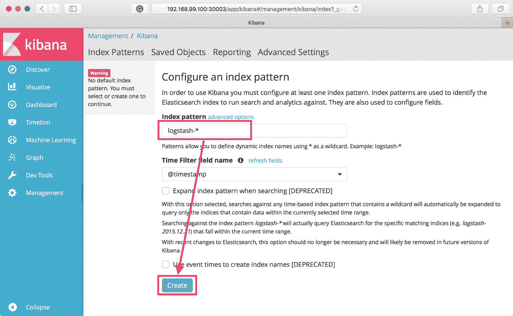

# 使用 kubespray 设置 EFK

kubespray 有一个配置项，决定是否启用 EFK。默认情况下是禁用的，因此你需要通过以下步骤手动启用它：

1.  打开`<kubespray dir>/inventory/mycluster/group_vars/k8s-cluster.yaml`。

1.  在`k8s-cluster.yml`文件的第 152 行附近，将`efk_enabled`的值更改为`true`：

```
# Monitoring apps for k8s
efk_enabled: true
```

1.  运行`ansible-playbook`命令来更新你的 Kubernetes 集群：

```
$ ansible-playbook -b -i inventory/mycluster/hosts.ini cluster.yml
```

1.  检查 Elasticsearch、Fluentd 和 Kibana Pod 的`STATUS`是否变为 Running；如果你看到`Pending`状态超过 10 分钟，检查`kubectl describe pod <Pod name>`查看状态。在大多数情况下，你会看到内存不足的错误。如果是这样，你需要添加更多节点或增加可用的 RAM：

```
$ kubectl get pods --all-namespaces
NAMESPACE     NAME                                        READY     STATUS    RESTARTS   AGE
kube-system   calico-node-9wnwn                           1/1       Running   0          2m
kube-system   calico-node-jg67p                           1/1       Running   0          2m
kube-system   elasticsearch-logging-v1-776b8b856c-97qrq   1/1       Running   0          1m kube-system   elasticsearch-logging-v1-776b8b856c-z7jhm   1/1       Running   0          1m kube-system   fluentd-es-v1.22-gtvzg                      1/1       Running   0          49s kube-system   fluentd-es-v1.22-h8r4h                      1/1       Running   0          49s kube-system   kibana-logging-57d98b74f9-x8nz5             1/1       Running   0          44s kube-system   kube-apiserver-master-1                     1/1       Running   0          3m
kube-system   kube-controller-manager-master-1            1/1       Running   0          3m
…
```

1.  查看 Kibana 日志，检查状态是否变为`green`：

```
$ kubectl logs -f kibana-logging-57d98b74f9-x8nz5 --namespace=kube-system
ELASTICSEARCH_URL=http://elasticsearch-logging:9200
server.basePath: /api/v1/proxy/namespaces/kube-system/services/kibana-logging
{"type":"log","@timestamp":"2018-03-25T05:11:10Z","tags":["info","optimize"],"pid":5,"message":"Optimizing and caching bundles for kibana and statusPage. This may take a few minutes"}

*(wait for around 5min)*

{"type":"log","@timestamp":"2018-03-25T05:17:55Z","tags":["status","plugin:elasticsearch@1.0.0","info"],"pid":5,"state":"yellow","message":"Status changed from yellow to yellow - No existing Kibana index found","prevState":"yellow","prevMsg":"Waiting for Elasticsearch"}
{"type":"log","@timestamp":"2018-03-25T05:17:58Z","tags":["status","plugin:elasticsearch@1.0.0","info"],"pid":5,"state":"green","message":"Status changed from yellow to green - Kibana index ready","prevState":"yellow","prevMsg":"No existing Kibana index found"}
```

1.  运行`kubectl cluster-info`，确认 Kibana 正在运行，并捕获 Kibana 的 URL：

```
$ kubectl cluster-info
Kubernetes master is running at http://localhost:8080
Elasticsearch is running at http://localhost:8080/api/v1/namespaces/kube-system/services/elasticsearch-logging/proxy
Kibana is running at http://localhost:8080/api/v1/namespaces/kube-system/services/kibana-logging/proxy KubeDNS is running at http://localhost:8080/api/v1/namespaces/kube-system/services/kube-dns:dns/proxy
```

1.  为了从你的机器远程访问 Kibana WebUI，使用 ssh 端口转发从你的机器到 Kubernetes 主节点会更方便：

```
$ ssh -L 8080:127.0.0.1:8080 <Kubernetes master IP address>
```

1.  使用以下 URL 从你的机器访问 Kibana WebUI：`http://localhost:8080/api/v1/namespaces/kube-system/services/kibana-logging/proxy`。

现在你可以从你的机器访问 Kibana。你还需要配置索引。只需确保索引名称的默认值为 `logstash-*`。然后，点击 Create 按钮：

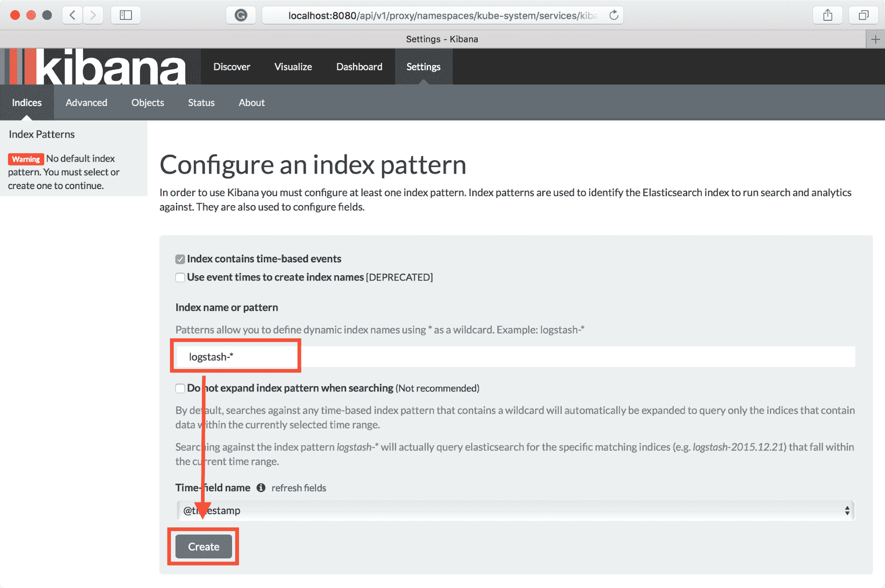

# 使用 kops 设置 EFK

kops 还提供了一个插件，便于在 Kubernetes 集群上轻松设置 EFK 堆栈。请按照以下步骤在 Kubernetes 上运行 EFK 堆栈：

1.  运行 `kubectl create` 来指定 kops EFK 插件：

```
$ kubectl create -f https://raw.githubusercontent.com/kubernetes/kops/master/addons/logging-elasticsearch/v1.6.0.yaml
serviceaccount "elasticsearch-logging" created
clusterrole "elasticsearch-logging" created
clusterrolebinding "elasticsearch-logging" created
serviceaccount "fluentd-es" created
clusterrole "fluentd-es" created
clusterrolebinding "fluentd-es" created
daemonset "fluentd-es" created
service "elasticsearch-logging" created
statefulset "elasticsearch-logging" created
deployment "kibana-logging" created
service "kibana-logging" created
```

1.  等待所有 Pod 的 `STATUS` 变为 `Running`：

```
$ kubectl get pods --all-namespaces
NAMESPACE     NAME                                                  READY     STATUS    RESTARTS   AGE
kube-system   dns-controller-dc46485d8-pql7r                        1/1       Running   0          5m
kube-system   elasticsearch-logging-0                               1/1       Running   0          1m kube-system   elasticsearch-logging-1                               1/1       Running   0          53s kube-system   etcd-server-events-ip-10-0-48-239.ec2.internal        1/1       Running   0          5m
kube-system   etcd-server-ip-10-0-48-239.ec2.internal               1/1       Running   0          5m
kube-system   fluentd-es-29xh9                                      1/1       Running   0          1m kube-system   fluentd-es-xfbd6                                      1/1       Running   0          1m kube-system   kibana-logging-649d7dcc87-mrtzc                       1/1       Running   0          1m kube-system   kube-apiserver-ip-10-0-48-239.ec2.internal            1/1       Running   0          5m
...
```

1.  检查 Kibana 的日志，等待状态变为 `green`：

```
$ kubectl logs -f kibana-logging-649d7dcc87-mrtzc --namespace=kube-system
ELASTICSEARCH_URL=http://elasticsearch-logging:9200
server.basePath: /api/v1/proxy/namespaces/kube-system/services/kibana-logging
{"type":"log","@timestamp":"2018-03-26T01:02:04Z","tags":["info","optimize"],"pid":6,"message":"Optimizing and caching bundles for kibana and statusPage. This may take a few minutes"}

*(wait for around 5min)*

{"type":"log","@timestamp":"2018-03-26T01:08:00Z","tags":["status","plugin:elasticsearch@1.0.0","info"],"pid":6,"state":"yellow","message":"Status changed from yellow to yellow - No existing Kibana index found","prevState":"yellow","prevMsg":"Waiting for Elasticsearch"}
{"type":"log","@timestamp":"2018-03-26T01:08:03Z","tags":["status","plugin:elasticsearch@1.0.0","info"],"pid":6,"state":"green","message":"Status changed from yellow to green - Kibana index ready","prevState":"yellow","prevMsg":"No existing Kibana index found"}
```

1.  运行 `kubetl cluster-info` 来获取 Kibana 的 URL：

```
$ kubectl cluster-info
Kubernetes master is running at https://api.chap9.k8s-devops.net
Elasticsearch is running at https://api.chap9.k8s-devops.net/api/v1/namespaces/kube-system/services/elasticsearch-logging/proxy
Kibana is running at https://api.chap9.k8s-devops.net/api/v1/namespaces/kube-system/services/kibana-logging/proxy KubeDNS is running at https://api.chap9.k8s-devops.net/api/v1/namespaces/kube-system/services/kube-dns:dns/proxy
```

1.  使用 `kubectl proxy` 将你的机器转发到 Kubernetes API 服务器：

```
$ kubectl proxy --port=8080
Starting to serve on 127.0.0.1:8080
```

1.  使用以下 URL 从你的机器访问 Kibana WebUI：`http://127.0.0.1:8080/api/v1/namespaces/kube-system/services/kibana-logging/proxy`。请注意，IP 地址是 127.0.0.1，这是正确的，因为我们正在使用 kubectl proxy。

现在，你可以开始使用 Kibana。按照前面 minikube 和 kubespray 部分中的说明配置索引。

# 它是如何工作的...

如你所见，已安装的 Kibana 版本会根据 Kubernetes 配置工具的不同而有所不同。但本手册将探讨 Kibana 的基本功能。因此，无需担心版本特定的操作。

让我们启动一个示例应用程序，然后学习如何使用 Kibana 监控应用程序日志：

1.  准备一个示例应用程序，它会不断将 `DateTime` 和问候消息打印到 `stdout`：

```
$ cat myapp.yaml
apiVersion: v1
kind: Pod
metadata:
  name: myapp
spec:
  containers:
  - image: busybox
    name: application
    args:
      - /bin/sh
      - -c
      - >
        while true; do
        echo "$(date) INFO hello";
        sleep 1;
        done
```

1.  在 `chap9` 命名空间中创建一个示例应用程序：

```
$ kubectl create -f myapp.yaml --namespace=chap9
pod "myapp" created
```

1.  访问 Kibana WebUI，然后点击 Discover 标签：

1.  确保时间范围设置为 `Last 15 minutes`，然后在搜索框中输入 `kubernetes.namespace_name: chap9` 并按下 *Enter* 键：

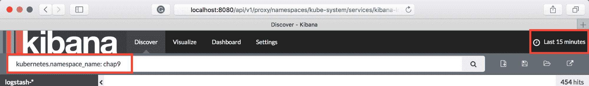

在 15 分钟内搜索 chap9 命名空间日志

1.  你可以看到 `chap9` 命名空间中的所有日志，如下所示。截图显示了比你预期的更多信息。通过点击 `kubernetes.host`、`kubernetes.pod_name` 和 `log` 的添加按钮，只会显示此目的所需的字段：

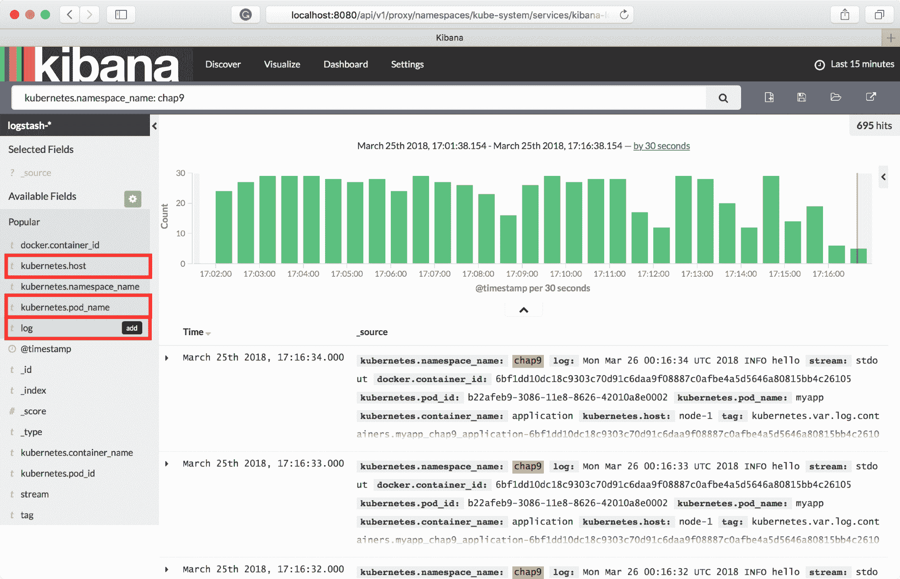

选择日志列

1.  现在，你可以看到这个应用程序的更简单日志视图：

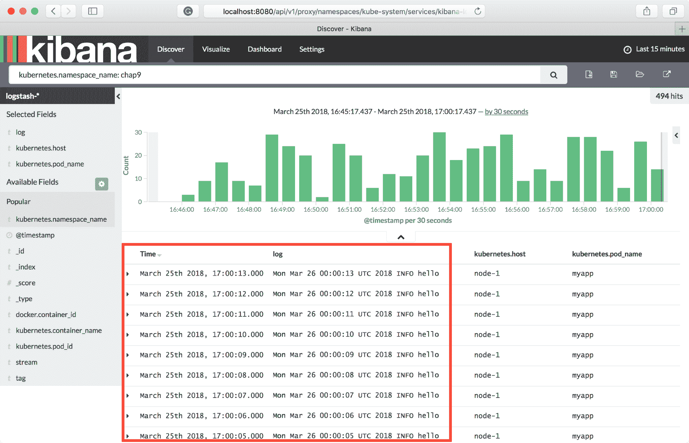

显示自定义 Kibana 视图的最终状态

恭喜！现在你已经在 Kubernetes 集群中建立了一个集中的日志管理系统。你可以观察一些 Pod 的部署，看看如何查看应用程序日志。

# 还有更多...

上述 EFK 堆栈仅收集 Pod 的日志，因为 Fluentd 正在监控 Kubernetes 节点主机上的 `/var/log/containers/*`。这足以监控应用程序的行为，但作为 Kubernetes 管理员，你还需要一些 Kubernetes 系统日志，例如主节点和工作节点日志。

有一种简单的方法可以实现与 EFK 堆栈集成的 Kubernetes 系统日志管理；添加一个 Kubernetes 事件导出器（Event Exporter），它会持续监控 Kubernetes 事件。当有新事件发生时，日志会发送到 Elasticsearch。因此，你也可以通过 Kibana 监控 Kubernetes 事件。

我们已准备好一个 Eventer（事件导出器）插件 ([`raw.githubusercontent.com/kubernetes-cookbook/second-edition/master/chapter9/9-1/eventer.yml`](https://raw.githubusercontent.com/kubernetes-cookbook/second-edition/master/chapter9/9-1/eventer.yml))。它基于 Heapster ([`github.com/kubernetes/heapster`](https://github.com/kubernetes/heapster))，并预计在 EFK 插件之上运行。我们可以使用这个 Eventer 通过 EFK 来监控 Kubernetes 事件：

Heapster 的详细信息将在下一节中描述——*监控主节点和节点*。

1.  将 Eventer 添加到现有的 Kubernetes 集群中：

```
$ kubectl create -f https://raw.githubusercontent.com/kubernetes-cookbook/second-edition/master/chapter9/9-1/eventer.yml
deployment "eventer-v1.5.2" created
serviceaccount "heapster" created
clusterrolebinding "heapster" created
```

1.  确保 Eventer Pod 的 `STATUS` 为 `Running`：

```
$ kubectl get pods --all-namespaces
NAMESPACE     NAME                                        READY     STATUS    RESTARTS   AGE
kube-system   elasticsearch-logging-v1-776b8b856c-9vvfl   1/1       Running   0          9m
kube-system   elasticsearch-logging-v1-776b8b856c-gg5gx   1/1       Running   0          9m
kube-system   eventer-v1.5.2-857bcc76d9-9gwn8             1/1       Running   0          29s
kube-system   fluentd-es-v1.22-8prkn                      1/1       Running   0          9m
...
```

1.  使用 `kubectl logs` 来持续观察 Heapster 是否能够捕获事件：

```
$ kubectl logs -f eventer-v1.5.2-857bcc76d9-9gwn8 --namespace=kube-system
I0327 03:49:53.988961       1 eventer.go:68] /eventer --source=kubernetes:'' --sink=elasticsearch:http://elasticsearch-logging:9200?sniff=false
I0327 03:49:53.989025       1 eventer.go:69] Eventer version v1.5.2
I0327 03:49:54.087982       1 eventer.go:95] Starting with ElasticSearch Sink sink
I0327 03:49:54.088040       1 eventer.go:109] Starting eventer
I0327 03:49:54.088048       1 eventer.go:117] Starting eventer http service
I0327 03:50:00.000199       1 manager.go:100] Exporting 0 events
```

1.  为了测试，打开另一个终端，然后创建一个 `nginx` Pod：

```
$ kubectl run my-nginx --image=nginx
deployment "my-nginx" created
```

1.  观察 Heapster 的日志，已经捕获了一些新的事件：

```
I0327 03:52:00.000235       1 manager.go:100] Exporting 0 events
I0327 03:52:30.000166       1 manager.go:100] Exporting 8 events
I0327 03:53:00.000241       1 manager.go:100] Exporting 0 events
```

1.  打开 Kibana，导航至设置 | 索引 | 添加新索引。这将添加一个新的索引。

1.  将索引名称设置为 `heapster-*`，将时间字段名称设置为 `Metadata.creationTimestamp`，然后点击创建：

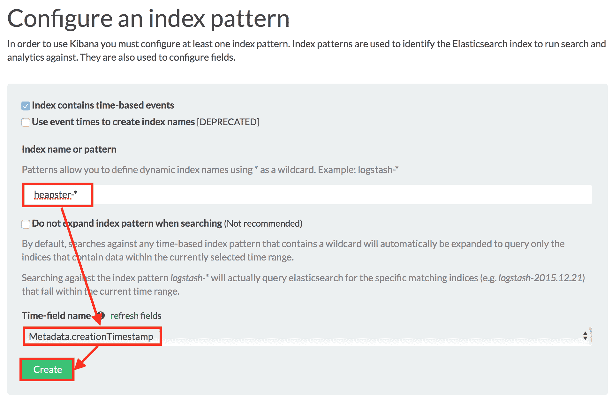

配置 Heapster 索引

1.  返回到发现页面，然后从左侧面板选择 `heapster-*` 索引。

1.  选择（点击添加按钮）Message、Source.component 和 Source.host：

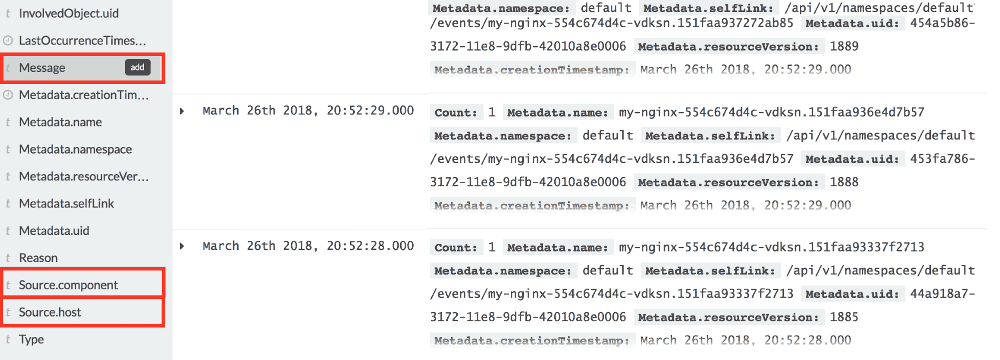

选择必要的列

1.  现在你可以看到 Kubernetes 系统日志，其中显示了 `nginx` Pod 创建事件，如下所示：

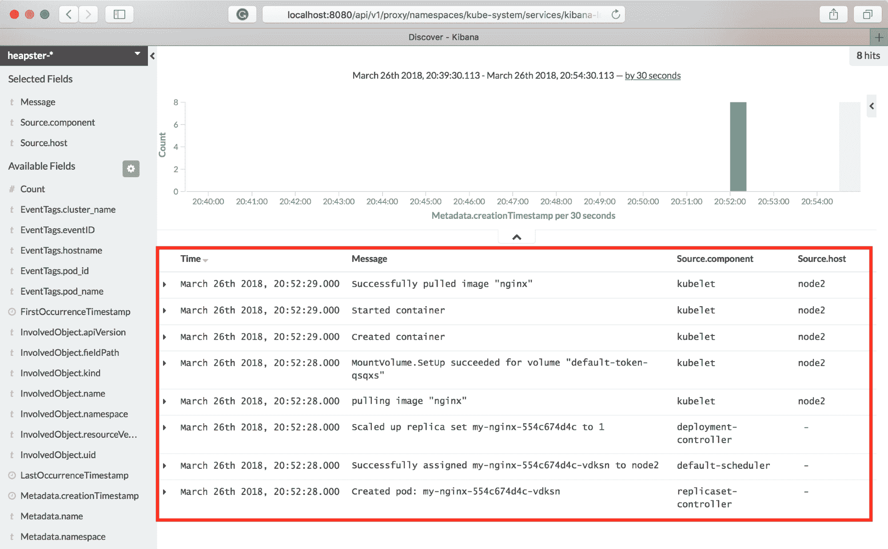

显示 Kibana 中系统日志视图的最终状态

现在，你不仅可以监控应用程序日志，还可以在 EFK 堆栈中监控 Kubernetes 系统日志。通过在 `logstash-*`（应用程序日志）或 `heapster-*`（系统日志）之间切换索引，你将拥有一个灵活的日志管理环境。

# 另见

在本书中，我们学习了如何为 Kubernetes 集群启用 EFK 堆栈。Kibana 是一个强大的工具，你可以使用它创建自己的仪表板，并更高效地查看日志。请访问 Kibana 的在线文档了解如何使用它：

+   Kibana 用户指南参考：[`www.elastic.co/guide/en/kibana/index.html`](https://www.elastic.co/guide/en/kibana/current/index.html)

# 使用 Google Stackdriver

在第七章，*在 GCP 上构建 Kubernetes* 中，我们介绍了 GKE。它有一个集成的日志机制，叫做 Google Stackdriver。在本节中，我们将探讨 GKE 与 Stackdriver 之间的集成。

# 准备工作

要使用 Stackdriver，你只需要一个 GCP 账户。如果你从未使用过 GCP，请回到并阅读 第七章，*在 GCP 上构建 Kubernetes*，以设置 GCP 账户和 `gcloud` 命令行界面。

要在 GKE 上使用 Stackdriver，无需任何操作，因为 GKE 默认使用 Stackdriver 作为日志平台。但如果你想明确启用 Stackdriver，可以在使用 `gcloud` 命令启动 Kubernetes 时，指定 `--enable-cloud-logging`，如下所示：

```
$ gcloud container clusters create my-gke --cluster-version 1.9.4-gke.1 --enable-cloud-logging --network default --zone us-west1-b
```

如果因为某些原因你的 GKE 没有启用 Stackdriver，你可以使用 `gcloud` 命令在之后启用它：

```
$ gcloud container clusters update my-gke --logging-service logging.googleapis.com --zone us-west1-b
```

# 如何操作...

为了演示 Stackdriver 与 GKE 的结合使用，我们将在 Kubernetes 上创建一个命名空间，然后启动一个示例 Pod，以便查看 Stackdriver 上的日志，具体步骤如下所示：

1.  创建 `chap9` 命名空间：

```
$ kubectl create namespace chap9
namespace "chap9" created
```

1.  准备一个示例应用程序 Pod：

```
$ cat myapp.yaml 
apiVersion: v1
kind: Pod
metadata:
  name: myapp
spec:
  containers:
  - image: busybox
    name: application
    args:
      - /bin/sh
      - -c
      - >
        while true; do
        echo "$(date) INFO hello";
        sleep 1;
        done
```

1.  在 `chap9` 命名空间中创建 Pod：

```
$ kubectl create -f myapp.yaml --namespace=chap9
pod "myapp" created
```

1.  访问 GCP Web 控制台并导航到 Logging | Logs。

1.  选择已审计资源 | GKE 容器 | 你的 GKE 集群名称（例如：my-gke） | chap9 命名空间：

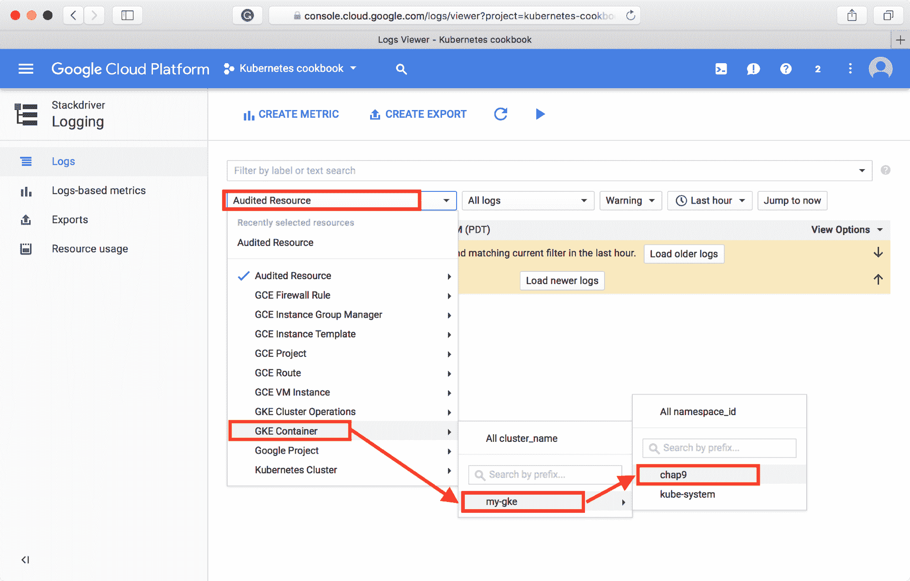

选择 chap9 命名空间 Pod 日志

1.  作为访问 `chap9` 命名空间日志的替代方法，你可以选择一个高级筛选器。然后，输入以下标准到文本框中并点击提交筛选按钮：

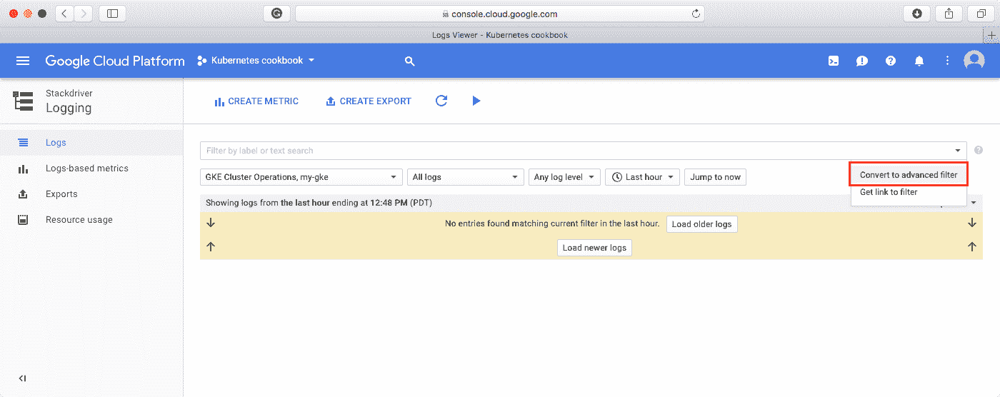

使用高级筛选器

```
resource.type="container" 
resource.labels.cluster_name="<Your GKE name>"
resource.labels.namespace_id="chap9"
```

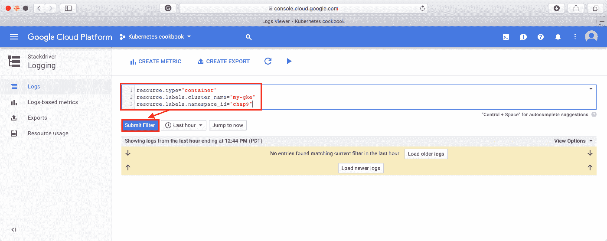

输入高级筛选器标准

1.  现在，你可以在 Stackdriver 上看到 `myapp` 的日志：

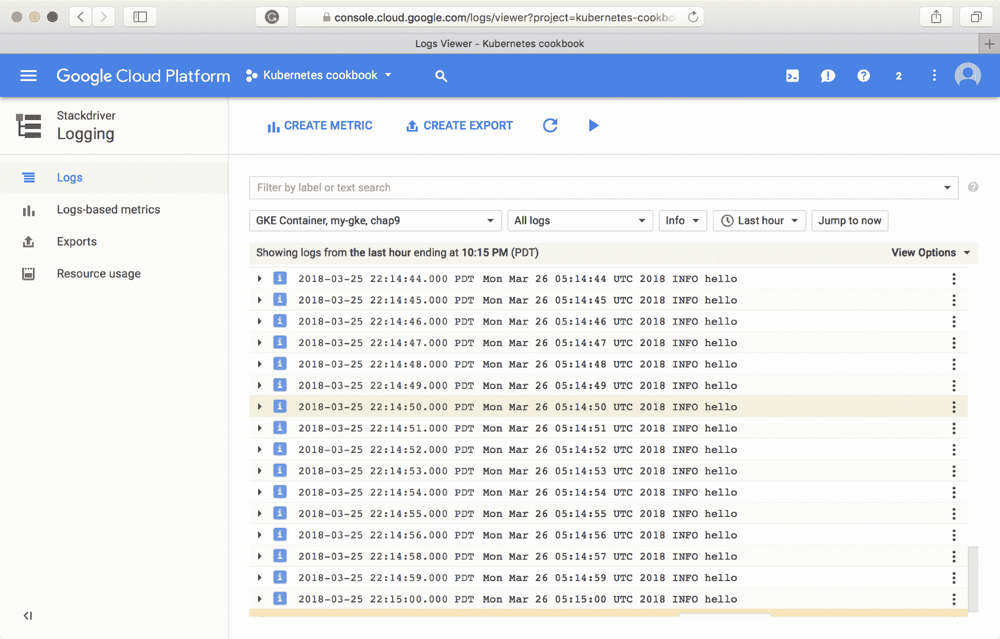

在 Stackdriver 中显示 chap9 Pod 日志

# 它是如何工作的...

Stackdriver 提供了基本功能，可以按日期、严重性和关键字进行筛选。这有助于监控应用程序的行为。那么，系统级行为，比如主节点和节点活动呢？Stackdriver 也支持搜索系统级别的日志。实际上，`fluentd` 不仅捕获应用程序日志，还捕获系统日志。通过执行以下步骤，你可以在 Stackdriver 中查看系统日志：

1.  选择 GKE 集群操作 | 你的 GKE 名称（例如，my-gke） | 所有位置：

你应该选择所有位置，而不是特定位置，因为一些 Kubernetes 操作日志不包含位置值。

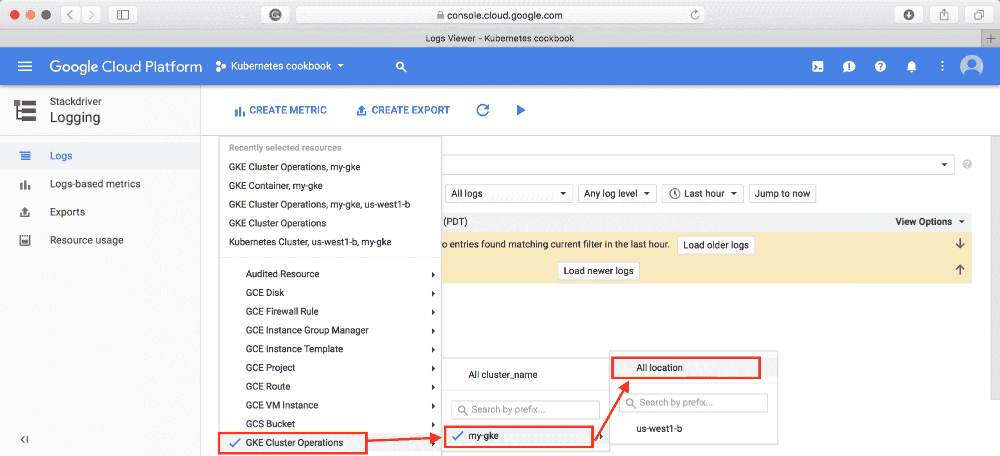

选择 Stackdriver 中的 GKE 系统日志

1.  作为替代方法，输入以下高级筛选器：

```
resource.type="gke_cluster"
resource.labels.cluster_name="<Your GKE name>"
```

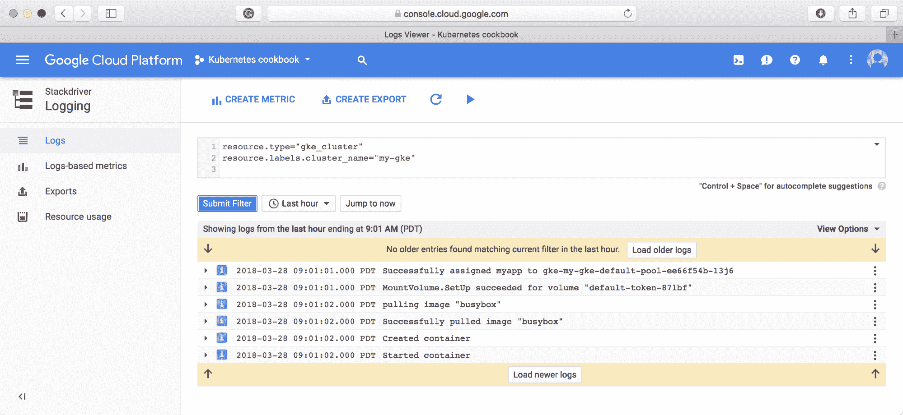

在 Stackdriver 中显示 GKE 系统日志

# 参见

在这个示例中，我们介绍了 Google Stackdriver。它是 Google Kubernetes Engine 的内置功能。Stackdriver 是一个简单但强大的日志管理工具。此外，Stackdriver 还能够监控系统状态。你可以创建内置或自定义的指标来监控并提供关于事件的警报。这将在下一个示例中详细描述。

此外，请阅读以下章节，回顾 GCP 和 GKE 的基础知识：

+   第七章，*在 GCP 上构建 Kubernetes*

# 监控主节点和工作节点

在前面几个示例的过程中，你学习了如何构建自己的集群，运行各种资源，体验不同的使用场景，甚至提升集群管理能力。现在，Kubernetes 集群有了新的视角。在本例中，我们将讨论监控。通过监控工具，用户不仅能了解节点的资源消耗情况，还能监控 Pods 的状态。这将帮助我们在资源利用效率上取得更大提升。

# 准备就绪

与之前的示例一样，你只需准备一个健康的 Kubernetes 集群。以下命令与 `kubectl` 一起使用，可以帮助你验证 Kubernetes 系统的状态：

```
// check the components
$ kubectl get cs
```

为了后续演示，我们将在 `minikube-booted` 集群上部署监控系统。然而，它同样适用于任何已安装良好的集群。

# 如何操作…

本节内容将介绍如何安装监控系统并介绍其仪表盘。该监控系统基于 *Heapster*（[`github.com/kubernetes/heapster`](https://github.com/kubernetes/heapster)），它是一个收集和分析资源使用情况的工具。Heapster 与 kubelet 通信，获取机器和容器的资源使用情况。配合 Heapster，我们还使用 influxDB（[`influxdata.com`](https://influxdata.com)）进行存储，Grafana（[`grafana.org`](http://grafana.org)）作为前端仪表盘，能够通过多个用户友好的图表展示资源状态：

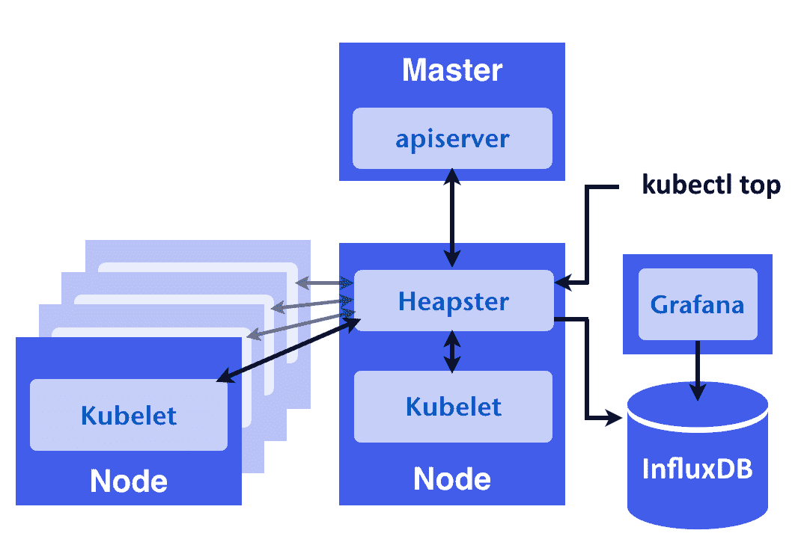

监控组件的交互

Heapster 从每个节点上的**kubelet**收集信息，并为其他平台提供数据。在我们的案例中，influxDB 用作保存历史数据的接收端。它允许用户进行进一步的数据分析，例如预测峰值工作负载，然后进行相应的资源调整。我们使用 Grafana 作为一个友好的 Web 控制台；用户可以通过浏览器管理监控状态。此外，`kubectl` 还具有 `top` 子命令，提供通过 Heapster 提取集群范围信息的功能：

```
// try kubectl top before installing Heapster
$ kubectl top node
Error from server (NotFound): the server could not find the requested resource (get services http:heapster:)
```

该命令返回错误信息。

安装监控系统比预想的要简单得多。通过应用开源社区和公司提供的配置文件，我们可以通过少量命令轻松在 Kubernetes 上设置组件监控：

```
// installing influxDB
$ kubectl create -f https://raw.githubusercontent.com/kubernetes/heapster/master/deploy/kube-config/influxdb/influxdb.yaml
deployment "monitoring-influxdb" created
service "monitoring-influxdb" created
// installing Heapster
$ kubectl create -f https://raw.githubusercontent.com/kubernetes/heapster/master/deploy/kube-config/influxdb/heapster.yaml
serviceaccount "heapster" created
deployment "heapster" created
//installing Grafana
$kubectl create -f https://raw.githubusercontent.com/kubernetes/heapster/master/deploy/kube-config/influxdb/grafana.yaml
deployment "monitoring-grafana" created
service "monitoring-grafana" created
```

你会发现，使用在线资源也是创建 Kubernetes 应用程序的可行方案。

# 它是如何工作的…

安装完 influxDB、Heapster 和 Grafana 后，让我们来学习如何获取资源的状态。首先，你可以现在使用 `kubectl top`。检查节点和 Pods 的使用情况，同时验证监控功能：

```
// check the status of nodes
$ kubectl top node
NAME       CPU(cores)   CPU%      MEMORY(bytes)   MEMORY%
minikube   236m         11%       672Mi           35%
// check the status of Pods in Namespace kube-system
$ kubectl top pod -n kube-system
NAME                                    CPU(cores)   MEMORY(bytes)
heapster-5c448886d-k9wt7                1m           18Mi
kube-addon-manager-minikube             36m          32Mi
kube-dns-54cccfbdf8-j65x6               3m           22Mi
kubernetes-dashboard-77d8b98585-z8hch   0m           12Mi
monitoring-grafana-65757b9656-8cl6d     0m           13Mi
monitoring-influxdb-66946c9f58-hwv8g    1m           26Mi
```

目前，`kubectl top`仅涵盖节点和 Pods，并且只显示它们的 CPU 和 RAM 使用情况。

根据`kubectl top`的输出，**m**表示什么，关于 CPU 使用量的数量？它代表“毫”，如同毫秒和毫米一样。Millicpu 被认为是 10^(-3) CPU。例如，如果 Heapster Pod 使用 1 m CPU，这时它只消耗 0.1%的 CPU 计算能力。

# 介绍 Grafana 仪表板

现在，让我们来看看 Grafana 仪表板。在我们的案例中，对于 minikube 启动的集群，我们应该打开代理，以便从本地主机访问 Kubernetes 集群：

```
$ kubectl proxy
Starting to serve on 127.0.0.1:8001
```

你可以通过以下网址访问 Grafana：`http://localhost:8001/api/v1/namespaces/kube-system/services/monitoring-grafana/proxy/`。使我们能够查看网页的魔法是由 Kubernetes 的 DNS 服务器和代理完成的：

**在非 minikube Kubernetes 中访问 Grafana 仪表板**

要通过浏览器访问 Grafana，取决于节点的网络配置和 Grafana 的 Kubernetes 服务。请按照以下步骤将网页转发到你的客户端：

+   **升级 Grafana 的服务类型**：我们应用的配置文件创建了一个 ClusterIP 服务的 Grafana。你应该将其更改为`NodePort`或`LoadBalancer`，以便将 Grafana 暴露到外部。

+   **检查防火墙**：确保你的客户端或负载均衡器能够访问集群中的节点。

+   **通过目标端口访问仪表板**：你可以通过简单的 URL 来访问 Grafana，而不是像我们在 minikube 集群中使用的详细 URL，例如`NODE_ENTRYPOINT:3000`（默认情况下，Grafana 请求端口 3000）或负载均衡器的入口点。

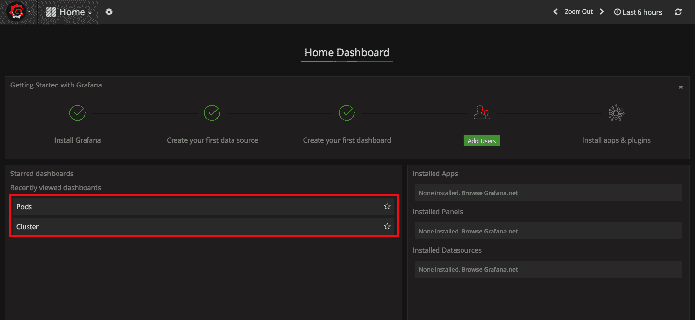

Grafana 的主页

在 Grafana 的默认设置中，我们有两个仪表板，**Cluster**和**Pods**。**Cluster**仪表板显示节点的资源利用情况，例如 CPU、内存、网络流量和存储。**Pods**仪表板为每个 Pod 提供类似的图表，你可以检查 Pod 中每个容器的情况：

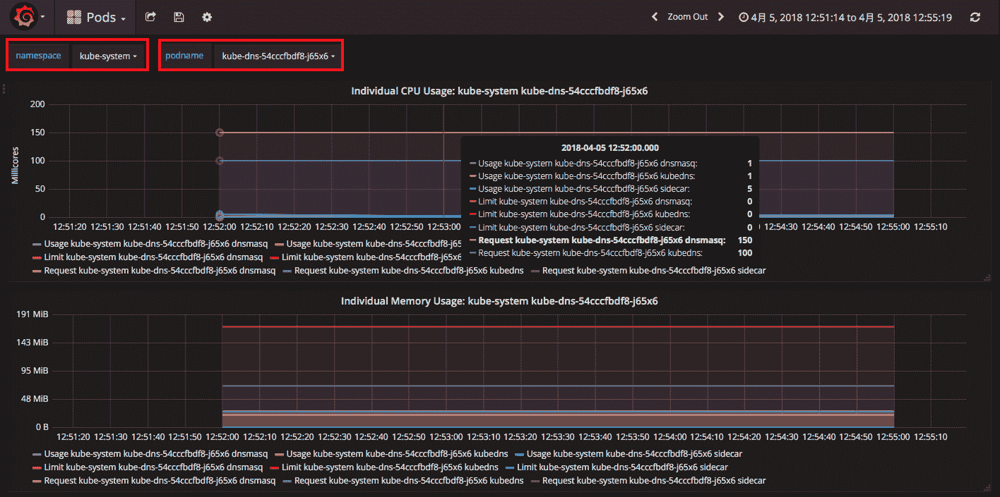

查看 Pod kube-dns 的 Pod 仪表板

正如前面的截图所示，例如，我们可以观察命名空间`kube-system`中的`kube-dns` Pod 中单个容器的 CPU 利用率，这个 Pod 是 DNS 服务器的集群。你会发现这个 Pod 中有三个容器，`kubedns`、`dnsmasq`和`sidecar`，图表中的线条分别表示容器的 CPU 限制、请求和实际使用情况。

# 创建新的指标来监控 Pod

对于正在运行的应用程序，度量标准是我们可以收集和用来分析其行为和性能的数据。度量标准可以来自系统方面，比如 CPU 的使用，也可以基于应用程序的功能，比如某些功能的请求频率。Heapster 提供了几个监控用的度量标准（[`github.com/kubernetes/heapster/blob/master/docs/storage-schema.md`](https://github.com/kubernetes/heapster/blob/master/docs/storage-schema.md)）。我们将向您展示如何自己创建一个定制面板。请按照以下步骤操作：

1.  转到 Pod 的仪表板，并将网页拖到底部。有一个名为“ADD ROW”的按钮；点击它以添加一个度量标准。然后，选择图表类别作为表达这个度量标准的新面板：

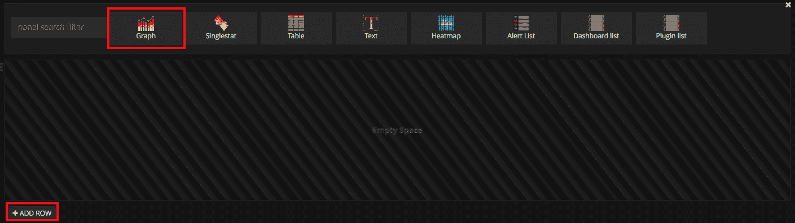

使用图表表达添加一个新的度量标准

1.  一个空的面板块出现了。继续点击进行进一步配置。当你选择面板后显示编辑块时，选择编辑：

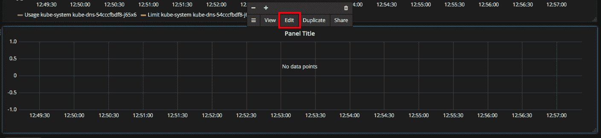

开始编辑面板

1.  首先，给你的面板取一个名字。例如，`CPU Rate`。我们想创建一个显示 CPU 利用率的面板：

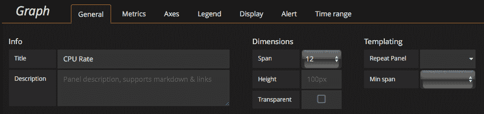

在“通用”页面上给面板一个标题

1.  设置以下参数以特定数据查询。请参考以下截图：

    +   FROM：`cpu/usage_rate`

    +   WHERE：`type = pod_container`

    +   AND：`namespace_name=$namespace, pod_name=$podname value`

    +   按`tag(container_name)`分组

    +   由`$tag_container_name`别名

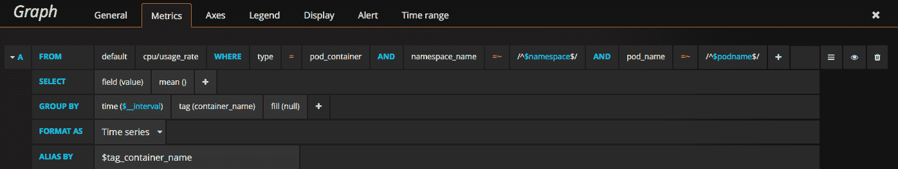

数据查询参数的 CPU 利用率度量标准

1.  是否显示任何状态线？如果没有，在显示页面中修改配置将帮助您建立最佳外观的图表。使 Null 值连接，您将找到显示的线：

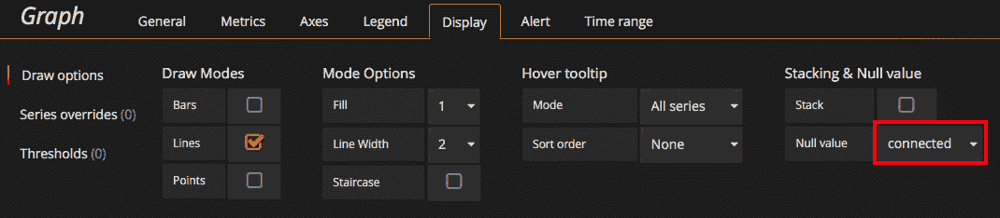

编辑度量标准的外观。检查 Null 值以“连接”显示线

1.  就这样！随意关闭编辑模式。您现在每个 Pod 都有一个新的度量标准。

只需尝试发现 Grafana 仪表板和 Heapster 监控工具的更多功能。通过监控系统的信息，您将获取有关系统、服务和容器的进一步详细信息。

# 还有更多...

我们建立了一个基于 Heapster 的监控系统，该系统由 Kubernetes 团队维护。然而，许多专注于容器集群的工具和平台纷纷涌现，旨在支持社区，比如 Prometheus（[`prometheus.io`](https://prometheus.io)）。另一方面，公有云可能默认在虚拟机上运行守护进程来抓取指标，并提供相应的服务来执行相关操作。我们不必在集群内部构建此类服务。接下来，我们将介绍 AWS 和 GCP 上的监控方法。你可能希望查看 C*hapter 6*，*在 AWS 上构建 Kubernetes*，以及 C*hapter 7*，*在 GCP 上构建 Kubernetes*，来构建一个集群并学习更多概念。

# 在 AWS 上监控你的 Kubernetes 集群

在使用 AWS 时，我们通常依赖 AWS CloudWatch（[`aws.amazon.com/cloudwatch/`](https://aws.amazon.com/cloudwatch/)）来进行监控。你可以创建一个仪表板，选择任何你想要的基本指标。CloudWatch 已经为你收集了大量的指标：

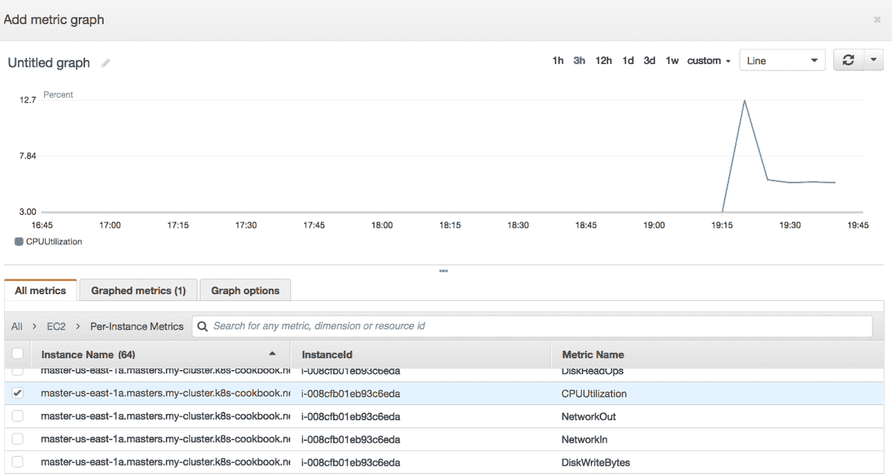

使用 AWS CloudWatch 创建新的指标

但是，对于 Kubernetes 资源，例如 Pods，需要将它们的自定义指标通过手动配置发送到 CloudWatch。如果是通过 kops 安装，建议使用 Heapster 或 Prometheus 来构建你的监控系统。

AWS 有自己的容器集群服务——Amazon ECS。这可能是 AWS 没有深度支持 Kubernetes 的原因，我们需要通过 kops 和 terraform 构建集群，并配合其他附加服务。然而，根据最近的新闻，将推出一项名为 **Amazon Elastic Container Service for Kubernetes**（**Amazon EKS**）的新服务。我们可以期待 Kubernetes 与 AWS 其他服务的集成。

# 在 GCP 上监控你的 Kubernetes 集群

在我们查看 GCP 的监控平台之前，GKE 集群的节点应该允许扫描任何应用状态：

```
// add nodes with monitoring scope
$ gcloud container clusters create my-k8s-cluster --cluster-version 1.9.7-gke.0 - -machine-type f1-micro --num-nodes 3 --network k8s-network --zone us-central1-a - -tags private --scopes=storage-rw,compute-ro, https://www.googleapis.com/auth/monitoring
```

*Google Stackdriver* 提供了一个混合云环境下的系统监控。除了它自己的 GCP，它还可以覆盖你在 AWS 上的计算资源。要访问其 Web 控制台，可以在左侧菜单中找到其相应部分。Stackdriver 中有多个服务类别，选择 Monitoring 来查看相关功能。

作为新用户，你将获得 30 天的免费试用。初始配置非常简单；只需启用一个账户并绑定你的项目。你可以避免安装代理和设置 AWS 账户，因为我们只是想查看 GKE 集群。一旦成功登录 Stackdriver，点击左侧面板的 Resources，并在基础设施类型下选择 Kubernetes Engine：

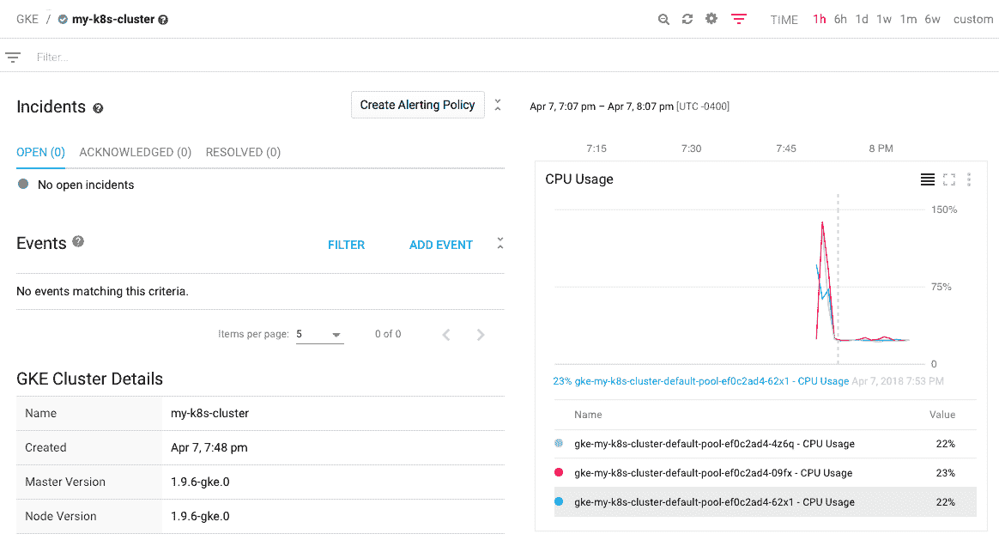

GKE 在 Stackdriver 上的主页面

已经设置了多个用于计算从节点到容器的资源的指标。请花时间探索并查看官方介绍，了解更多特性：[`cloud.google.com/kubernetes-engine/docs/how-to/monitoring`](https://cloud.google.com/kubernetes-engine/docs/how-to/monitoring)。

# 另见

本文展示了如何在 Kubernetes 系统中监控机器。然而，明智的做法是研究主组件和守护进程的配方。你可以更多地了解工作流程和资源使用情况。此外，既然我们已经与多个服务合作建立了我们的监控系统，再次回顾关于 Kubernetes 服务的配方将帮助你更清晰地了解如何构建这个监控系统：

+   第一章中的*探索架构*配方，*构建你自己的 Kubernetes 集群*

+   第二章中的*与服务协作*配方，*走进 Kubernetes 概念*

Kubernetes 是一个不断发展并快速升级的项目。跟上进度的推荐方式是查看其官方网站上的新特性：[`kubernetes.io`](http://kubernetes.io)。你也可以随时在 GitHub 上获取新的 Kubernetes 版本：[`github.com/kubernetes/kubernetes/releases`](https://github.com/kubernetes/kubernetes/releases)。保持 Kubernetes 系统的最新状态，并通过实践学习新特性，是持续接触 Kubernetes 技术的最佳方法。
