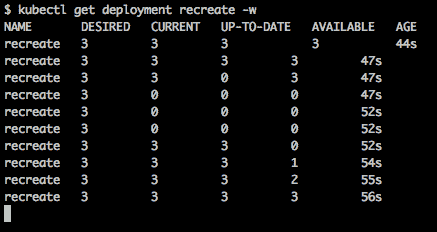

# Kubernetes 设计模式

设计模式是日常问题最佳实践的形式化。将设计模式应用于日常工作中，为您创建了一个共同的语言和沟通平台。在实际工作中，经验丰富的工程师不会解释如何将一个接口转换为另一个接口；相反，他们会决定实现一个适配器。设计模式隐藏了复杂性和通信细节，并创造了一个共同的平台。此外，通过积累的设计模式知识，将业务需求转化为代码变得更加轻松。

Kubernetes 是一个崛起的、著名的开源容器编排系统，由 Google 设计。它的基本功能包括自动化、扩展和容器化应用程序的调度。为了构建一个可扩展且可靠的云原生应用程序，Kubernetes 是您工具集中的关键部分。从初创公司到大型企业，各种规模的公司都在使用 Kubernetes 来安装和管理云原生应用程序。

这一软件开发的范式转变始于创建微服务，而不是构建庞大的软件系统块。随着 "新" 最佳实践的出现，它们与事实上的云原生编排工具 Kubernetes 对接。全书将介绍 Kubernetes 设计模式和扩展能力。书中首先解释最佳实践，展示如何创建 Kubernetes 原生应用程序。接下来，将解释如何通过编程访问 Kubernetes，并丰富这一有史以来最强大的编排工具。最后，将通过更高层次的自动化扩展 Kubernetes 本身。最终，您将拥有不仅能创建运行在 Kubernetes 上的应用程序的技术知识和实践经验，还能扩展 Kubernetes 系统本身的能力。

在本章的第一部分，将介绍 Kubernetes 设计模式，从设计模式的基础开始。接下来，您将使用结构模式构建 Kubernetes 解决方案，使用行为模式组装系统，最后根据部署策略安装应用程序。

本章结束时，您将能够：

+   定义设计模式的基本概念

+   解释模式的分类

+   使用 Kubernetes 设计模式解决实际问题

+   使用结构模式构建解决方案

+   使用行为模式组装复杂系统

+   使用部署策略安装应用程序

# 软件设计模式

在软件开发中，设计模式是解决广泛问题的可重复解决方案，因为它普遍适用于解决您之前遇到的相同问题。设计模式有两个主要优点。第一个优点是它们是经过验证的解决方案，第二个优点是它们为开发人员之间创造了一个沟通平台。凭借这些优点，模板和规范经过多年的规范化，形成了一个知识和经验池。

设计模式并不是可以直接转化为代码的完成设计——它们只是最佳实践和一系列方法。

软件开发被视为一个相对年轻且不断发展的学科领域；然而，在各种情况下解决的大多数问题都是相似的。例如，在各种软件系统中创建单一实例组件是常见的做法，如支付系统、日志管理器、**企业资源规划** (**ERP**) 系统或在线游戏。因此，利用过去积累的知识可以帮助开发团队快速进步。

设计模式和相应的业务需求看起来可能显得人工且仅与软件相关。然而，问题和解决方案的根源实际上源自现实生活。例如，单例模式被提出作为实现配置管理器的最佳实践。采用相同的思路，适配器模式被提出作为与不同版本 API 协作的最佳实践。正如其名字所示，它类似于在现实生活中使用电气适配器来适配不同国家的插头和插座类型。正如这些例子所示，软件设计模式及其背后的理念都源于现实生活经验。

# 软件设计模式的用途

设计模式有两个主要用途。首先，设计模式为开发者创建了一个通用的平台，带有专有术语。例如，在一次技术讨论中，假设已经做出了使用组件单例的设计决策。所有其他开发人员，至少是那些了解设计模式的开发人员，将不需要进一步了解单例模式的属性。尽管这看起来微不足道，但它是技术沟通的丰富化，带有最佳实践的技术专业知识。其次，了解并利用工程学中的最佳实践能让开发进程更加迅速。假设你在设计一辆车——你应该始终从发明最好的轮子开始。这使得整个过程更加高效，并且避免了从过去的经验中吸取教训的重复过程。

错误。

# 软件设计模式的分类

设计模式有三种分类方法。随着新技术和编程语言的不断涌现，新的分类方法也被提出，但分类的主要思想保持不变——它们的控制器之间的交互。

以及其他应用：


总结这一部分，设计模式是正式化的最佳实践，源于现实生活和软件设计。它们为开发者创造了一个共同的沟通平台，并作为一个知识集合，具有重要的价值。

在下一章节中，介绍了 Kubernetes 的设计模式，作为创建、管理和部署现代云原生应用的最佳实践。

# Kubernetes 设计模式

微服务和容器技术的发展改变了软件应用程序的设计、开发和部署方式。如今，现代云原生应用程序更加关注可扩展性、灵活性和可靠性，以满足业务需求。例如，十年前，数千个实例可靠运行的应用程序可扩展性并不是一个问题。同样，当没有 Kubernetes 这种编排工具来处理这些问题时，自我意识和自我修复功能也不在考虑范围之内。

新的需求和云原生特性揭示了它们自身的最佳实践和设计模式。Kubernetes 被各种公司广泛使用并被采纳，包括初创公司和大型企业，这使得最佳实践能够被形式化并汇集起来。在本节中，将描述 Kubernetes 中广为人知的基本设计模式和部署策略。借助这些模式，你将能够利用 Kubernetes 自身所形式化的最佳实践。

# 结构模式

结构模式侧重于将构建块组合成更高层次的复杂资源。在微服务架构中，应用程序被打包并作为容器部署。这种方法使得应用程序可以更容易地扩展，减少了开销并增强了隔离性。然而，这也使得在成千上万节点的集群中并排或按顺序运行相关容器变得困难。例如，如果你想将前端和后端容器一起运行在一个集群中，你需要找到一种机制，使得它们始终能够被调度到同一节点上。同样，如果在启动应用程序之前需要填充配置文件模板，那么就需要确保配置处理容器在应用程序之前已经运行。

在 Kubernetes 中，容器是被封装在 Pod 中的构建块。作为容器编排工具，Kubernetes 提供了内置功能，用于在 Pod 内组织容器。在本节中，将解释 Kubernetes 的辅助车模式和初始化结构设计模式。

Pod 是 Kubernetes 中最小的可部署资源，由一个或多个共享资源的容器组成。Pod 中的容器始终被调度到同一节点，以便它们可以共享网络和存储等资源。

关于 Pod 概念的更多信息可以在 Kubernetes 官方文档中找到：[`kubernetes.io/docs/concepts/workloads/pods/pod`](https://kubernetes.io/docs/concepts/workloads/pods/pod)。

# 辅助车模式

现代软件应用程序通常需要外部功能，如监控、日志记录、配置和网络。当这些功能紧密集成到应用程序中时，它们可以作为单个进程运行。然而，

这违反了隔离原则，并且为单点故障提供了机会。基于这一思想，云原生应用中的容器应该遵循 Unix 哲学：

+   容器应该只有一个任务

+   容器应该协同工作

+   容器应该处理文本流

**单点故障（SPOF）**是指系统中的一个组件，其失败可能导致整个系统的崩溃。为了拥有可靠且可扩展的云原生应用程序，SPOF 是不可取的，系统设计应该检查是否存在 SPOF。

Unix 哲学专注于设计一个具有清晰服务接口的小型操作系统。为了拥有这样一个系统，应当进行简单、精确、清晰且模块化的软件开发，同时考虑开发人员和维护人员。此外，哲学还强调应该组合子系统，而不是创建一个庞大、单一的设计。

基于这个思想，分离主应用程序并运行一些附加的 sidecar 容器已成为一种常规方法，这些 sidecar 提供额外的功能。使用 sidecar 的主要优势如下：

+   它们有独立的编程语言和运行时依赖

+   它们密切监控主应用程序，并最小化延迟

+   它们扩展了黑箱应用程序

在以下活动中，将在 Kubernetes 中安装一个基于 Web 的游戏。正如预期的那样，应该至少有一个容器在运行 Web 服务器。然而，还有一个附加要求是持续的源代码同步。

根据 Unix 哲学，期望容器只承担一个主要任务。它们还应该独立工作，并且协同工作以实现必要的需求。最后，这些容器应该更新它们的状态，并将日志信息通知控制台。以下活动将涵盖这三点。

# 活动：运行带同步功能的 Web 服务器

**场景**

你被分配的任务是在 Kubernetes 中部署一个基于 Web 的 2048 游戏。然而，游戏仍在开发中，开发人员一天之内会频繁推送更改。在这个安装中，游戏应该经常

更新以包括最近的更改。

**目标**

在成功部署后，Kubernetes 中应该有一个 Pod 正在运行，且包含两个容器。一个容器应该负责提供游戏，另一个容器，即 sidecar 容器，应该持续更新游戏的源代码。通过 Kubernetes，你需要创建一个云原生解决方案，其中服务器和同步任务协同工作，但彼此独立。

**前提条件**

使用 git Docker 镜像进行 sidecar 容器中的持续同步，并且使用 2048 游戏的开源代码库。

**完成步骤**

1.  创建一个 Pod 定义。

1.  包括两个容器：

    +   使用 httpd 为游戏提供服务。

    +   使用 git 进行源代码同步。

1.  部署 Pod。

1.  显示同步的日志。

1.  检查游戏是否已启动。

本章中的所有代码文件都可以在 GitHub 上的 `Lesson-1` 文件夹中找到，网址是 [`goo.gl/gM8W3p`](https://goo.gl/gM8W3p)。

你需要创建一个 2048 游戏，如下图所示：


# 初始化模式

初始化是软件工程各个领域的广泛模式，包括编程语言和操作系统。为了处理 Kubernetes 中应用的初始化，提出了初始化容器。初始化容器，也叫**initContainers**，是 pod 定义的一部分。通过将容器的生命周期分离来处理关注点分离：

+   初始化容器

+   主容器

定义为 initContainers 的容器会依次执行，且都期望成功退出。完成后，主容器将启动。以下是启动容器的一些示例用途：

+   创建配置文件

+   等待并确保依赖服务可用

+   创建卷并准备文件

+   将服务注册到发现系统

在接下来的活动中，将在 Kubernetes 中安装一个 Web 服务器。如预期所示，应该至少有一个容器正在运行 Web 服务器。然而，还有一个附加要求，即在 Web 服务器启动之前更改提供的文件。这些操作的生命周期被分离到初始化容器和主容器中。这些容器可能具有不同的容器镜像和可执行文件；然而，它们预计会在共享资源上工作。生命周期分离和协作问题将在接下来的活动中处理，并在 Kubernetes 中实现初始化模式。

# 活动：在内容准备完成后运行 Web 服务器

**场景**

你被分配了一个任务，需要为一个 Web 服务器制作 Kubernetes 安装。然而，在提供服务之前，需要执行一些手动任务来更改文件。你需要确保在内容提供之前始终应用这些更改。此外，还需要显示初始化的状态，并检查 Web 服务器的最终输出。

**目标**

在成功部署后，Kubernetes 中应该有一个 pod 正在运行，包含一个主容器和一个初始化容器。在初始化容器中，将 `Welcome from Packt` 写入主索引文件。当主容器启动时，该文件应由主容器提供服务。

**前提条件**

+   使用基本的 Docker 镜像作为初始化容器，例如 busybox。

+   对于主容器，应使用一个能够运行 Web 服务器的镜像，例如 nginx。

**完成步骤**

1.  创建一个 pod 定义。

1.  包含一个初始化容器：

    +   更改文件的内容。

1.  包含一个主容器：

    +   创建一个 Web 服务器。

1.  部署 pod。

1.  检查初始化容器的状态。

1.  检查 Web 服务器的输出。

你应该看到以下输出：


本章中活动的所有代码文件都可以在 GitHub 的 `Lesson-1` 文件夹中找到，链接地址：[`goo.gl/gM8W3p`](https://goo.gl/gM8W3p)。

# 行为模式

在软件开发中，行为设计模式专注于对象之间的通信和交互。交互和通信包括责任分配、行为封装和请求委托。在微服务架构中，行为模式专注于微服务之间的通信以及服务与编排工具的交互。

例如，假设我们考虑一个每天检查用户配额的微服务执行。它可以通过一个包含 24 小时睡眠和执行配额检查的无限循环来实现。尽管它有效，但在睡眠期间会消耗额外资源，且创建了低效的架构。通过“定时作业模式”的行为模式，编排工具可以处理微服务的调度，并确保它每 24 小时执行一次。

在 Kubernetes 中，容器被封装在 Pod 内，Pod 是行为模式的主要关注点。行为模式专注于 Kubernetes 资源之间的交互和通信，即 Pod 与 Kubernetes 服务之间的交互。控制器系统中的通信和交互可能包括将 Pod 分配到节点、Pod 的调度，或由 Kubernetes 主控和节点组件进行元数据分发。

以下行为模式将在接下来的章节中介绍：

+   作业模式

+   定时作业模式

+   守护进程服务模式

+   单例服务模式

+   内省模式

# 作业模式

在 Kubernetes 中，Pod 的一般使用场景是用于长时间运行、始终保持启动的进程。为此，Kubernetes 提供了更高级别的资源，如副本集或部署。这些高级资源通过创建副本、检查健康状态和控制更新机制来管理 Pod 的生命周期。另一方面，微服务有时需要执行一个任务，并在完成后成功退出。例如，数据库初始化、备份或视频转换等应该只执行一次并退出，不消耗额外的资源。针对这种需求，Kubernetes 提供了一个名为 Job 的高级资源。Kubernetes 作业表示一个独立的工作执行直到完成，非常适合只需要运行一次的用例。

作业和由副本控制的 Pod 之间最重要的区别是 `restartPolicy` 字段：

+   对于始终运行的 Pod，`restartPolicy` 被设置为 `Always`

+   对于作业，`restartPolicy` 可以设置为 `OnFailure` 或 `Never`

# 定时作业模式

分布式系统和微服务架构不依赖于时间性事件来运行服务；相反，它们关注触发事件，如 HTTP 请求、新的数据库条目或消息队列。然而，调度任务并期望它在指定时间间隔内运行是“定时作业模式”的常见方法。用于维护操作、发送每日电子邮件或检查过期文件的微服务应按固定间隔调度，并且必须运行以满足业务需求。Kubernetes 提供 CronJob 资源来创建定时任务，并确保这些作业在运行。

# 守护进程服务模式

守护进程应用程序通常用于操作系统和编程语言中，作为长期运行的应用程序或线程，以后台进程的形式运行。守护进程应用程序的名称包括 httpd、sshd 和 containerd；结尾的字母表示这些服务是守护进程。在微服务架构中，有些服务应该独立运行和扩展，而与消费者使用无关。这些应用程序应该在集群中的每个节点上运行，以确保守护进程应用程序的要求，例如：

+   **集群存储守护进程**：glusterd，ceph。

+   **日志收集守护进程**：fluentd，logstash。

+   **节点监控守护进程**：collectd，Datadog 代理，New Relic 代理。

在 Kubernetes 中，**DaemonSets**旨在部署需要在所有或某些节点上运行的持续后台任务。在没有其他管理考虑的情况下，Kubernetes 会自动处理这些守护进程 Pod 在新加入节点上的运行。

# 单例服务模式

运行一个——且仅有一个——实例是应用程序的要求，因为多个实例可能会导致不稳定。尽管这似乎与可扩展的微服务架构相悖，但仍有一些应用程序需要遵循单例模式：

+   数据库实例和连接器

+   配置管理器

+   尚未扩展的应用程序

Kubernetes StatefulSet 的副本数为 1，确保集群中只运行一个 Pod 实例。通过这种小型配置，可以在云原生环境中创建并使用单例服务。然而，集群中只有一个应用实例也带来了缺点。例如，应该小心处理单例应用程序的停机问题。这个问题的主要关注点是如何处理由于自动

StatefulSet 的更新。在 Kubernetes 中有两种可能的解决方案：

+   容忍更新期间的偶尔停机

+   设置`PodDistruptionBudget`，`minAvailable=1`：

    +   由于已设置`PodDistruptionBudget`，取消自动更新

    +   通过操作步骤为中断做准备

    +   删除`PodDistruptionBudget`资源并继续更新

    +   为下次中断重新创建`PodDistruptionBudget`

# 内省模式

运行在裸金属集群上的应用程序能够准确知道它们运行的位置、系统规格以及网络信息。这些信息帮助它们在自我感知的环境中工作。例如，这些应用可以调整资源使用，增强日志内容，或者发送与节点相关的度量数据。在微服务架构中，应用程序被认为是短暂的，其对环境的依赖较少。然而，对运行时信息的自我感知，即内省模式，可以提高应用在分布式系统中的实用性和可发现性。

在 Kubernetes 中，Downward API 确保为 pod 提供以下环境和运行时数据：

+   **环境：** 节点名称、命名空间、CPU 和内存限制。

+   **网络配置：** Pod IP。

+   **授权：** 服务账户。

在以下活动中，将创建并安装一个简单但具备自我感知的 Kubernetes 应用程序。该应用程序拥有所有的运行时信息，这些信息由 Kubernetes 作为环境变量提供。作为单一应用，它将所有这些变量记录到控制台。然而，本活动中开发的 pod 定义展示了如何在容器内部使用 Downward API 来实现 Kubernetes 中的内省模式。

# 活动：将数据注入应用程序

**场景**

你被指派的任务是为一个简单的具备自我感知功能的应用程序做 Kubernetes 安装。在这个安装中，应用程序应收集来自 Kubernetes 的所有运行时信息并写入其日志。

**目标**

在成功部署后，Kubernetes 中应有一个仅包含一个容器的 pod 在运行。在这个容器中，所有可用的运行时信息应作为环境变量注入。此外，应用程序应记录运行时信息。

**前提条件**

使用 Kubernetes Downward API 收集运行时信息。

**完成步骤**

1.  创建一个包含一个容器的 pod 定义：

    +   从 Downward API 定义环境变量。

    +   创建一个 shell 脚本以写入环境变量。

1.  部署 pod。

1.  检查 pod 的状态。

1.  检查容器的日志。

本章活动的所有代码文件已上传至 GitHub，位于 `Lesson-1` 文件夹，地址为 [`goo.gl/gM8W3p`](https://goo.gl/gM8W3p)。

# 部署策略

设计和开发云原生应用程序，并采用微服务架构，对于未来的可靠且可扩展的应用至关重要。同样，云中的应用程序部署和更新与设计和开发一样重要。交付应用程序有多种技术，因此选择合适的配置对于最大限度地利用变更对消费者的影响至关重要。通过使用合适的 Kubernetes 资源子集并选择合适的部署策略，可以实现可扩展和可靠的云原生应用。

在本节中，介绍了以下部署策略，并且你需要完成这些练习，以便能够看到 Kubernetes 资源的实际操作：

+   重建策略

+   滚动更新策略

+   蓝绿策略

+   A/B 测试策略

# 重建策略

重建策略基于关闭旧版本实例，然后创建下一个版本实例的思想。使用这种策略时，停机是不可避免的，这取决于应用程序的关闭和启动时间。在 Kubernetes 中，可以使用重建策略来创建部署资源，并采用重建策略。

剩下的操作由 Kubernetes 处理。在幕后，重建策略的步骤如下：

1.  用户请求通过负载均衡器路由到**V1**实例：


1.  **V1**实例被关闭，且由于没有可用的实例，停机时间已开始：


1.  **V2**实例被创建；然而，直到它们准备好之前，不会处理用户请求：


1.  用户请求被路由到**V2**实例：


重建策略的主要优点是其简单明了，并且没有额外的开销。除此之外，每次更新时，实例都会完全重建，并且不会有两个版本同时运行。然而，这种策略的缺点是在更新过程中不可避免地会有停机时间。

# 使用重建策略部署应用

你正在 Kubernetes 上运行一个高可用性应用，需要一个部署策略来处理更新。这个应用能够承受短暂的停机时间，但不应有任何时候两个版本一起运行。这个应用依赖的服务无法处理同时运行两个不同版本的情况。我们希望使用重建部署策略，这样 Kubernetes 就能通过删除旧实例并创建新实例来处理更新。

你可以在以下链接找到`recreate.yaml`文件：[`goo.gl/2woHbx`](https://goo.gl/2woHbx)。

让我们按照以下步骤开始：

1.  使用以下命令创建部署：

```
 kubectl apply -f recreate.yaml

```

1.  在另一个终端中，监控部署变化，直到所有三个实例都可用：

```
kubectl get deployment recreate -w 
```

1.  更新部署的版本：

```
kubectl patch deployment recreate -p '{"spec":{"template":{"spec":{"containers":[{"name":"nginx", "image":"nginx:1.11"}]}}}}'
```

1.  在我们在*步骤 2*中打开的终端中，应该能够看到 pod 的删除和停机情况，此时`Available`为零。之后，可以跟踪新实例的创建，`Available`从`0`增加到`3`：



1.  你可以运行以下命令进行清理：

```
 kubectl delete -f recreate.yaml

```

# 滚动更新策略

滚动更新策略，也称为增量或逐步更新，是通过替换先前版本来慢慢发布新版本的策略。在此策略中，首先，一组应用程序在负载均衡器后面运行。然后，启动新版本实例，当它们启动并运行时，负载均衡器将请求重定向到新实例。同时，之前版本的实例将被关闭。在 Kubernetes 中，滚动更新策略是部署的默认策略，因此对*deployment*的任何更新都已经在实施滚动更新策略。

在 Kubernetes 处理此过程时，滚动更新策略的步骤可以如下跟踪：

1.  用户的请求通过负载均衡器路由到**V1**实例：


1.  **V2**实例被创建，用户被引导到它们，同时，**V1**实例被删除。在这个阶段，两个版本都在运行并提供请求服务：


1.  **V2**实例的创建和**V1**实例的删除是逐一进行，直到没有**V1**实例剩余：


1.  最后，所有来自用户的请求都被路由到**V2**实例：


滚动更新策略的主要优点是简单易行，并且是 Kubernetes 的默认方法。它还有助于通过在新实例启动期间平衡负载，慢慢发布新版本。另一方面，Kubernetes 自动处理版本的发布和回滚，且这些操作的持续时间无法预知。滚动更新中最复杂的问题之一是集群中两个版本同时运行，且流量无法控制。

# 使用滚动更新策略部署应用程序

你正在 Kubernetes 上运行一个高可用的应用程序，需要一个部署策略来处理更新。假设这个应用程序是你客户公司的前端，必须始终保持可用，停机是不可接受的。在任何时候，多个版本的应用程序都可能同时工作；然而，客户不希望在更新过程中增加额外资源的成本。我们将使用滚动更新部署策略来运行应用程序，以便 Kubernetes 通过增量创建新实例并逐个删除旧实例来处理更新。我们按照以下步骤开始：

1.  使用以下命令创建部署：

```
kubectl apply -f rolling.yaml
```

1.  在另一个终端中，启动 Kubernetes 集群中的 cURL 实例：

```
kubectl run curl --image=tutum/curl --rm -it

```

1.  当命令提示符准备好时，通过使用 HTTP 请求查看部署的版本：

```
while sleep 0.5; do curl -s http://rolling/version | grep nginx; done

```

1.  使用以下命令更新部署的版本：

```
kubectl patch deployment rolling -p '{"spec":{"template":{"spec":{"containers":[{"name":"nginx", "image":"nginx:1.11"}]}}}}'
```

1.  在我们在*步骤 2*中打开的终端中，预计我们应该看到 Kubernetes 处理版本的增量变化。在更新过程中，服务不会中断。然而，两个版本同时运行，并且处理请求的版本分别是 1.10.3 和 1.11.13，并且它们可以互换使用：


1.  清理时，使用*Ctrl* + *C*停止 cURL 命令并通过输入 exit 退出 Pod。退出时，Pod 会被 Kubernetes 删除。运行以下命令：

```
kubectl delete -f rolling.yaml

```

你可以在以下位置找到`rolling.yaml`文件：[`goo.gl/eo8cJw`](https://goo.gl/eo8cJw)。

# 蓝绿策略

蓝绿策略的思想是有两个活跃的生产环境，即蓝色和绿色。蓝色环境是活跃的并且在处理请求。绿色环境包含新版本，并且正在进行更新测试。当测试成功完成后，负载均衡器会从蓝色实例切换到绿色实例。在 Kubernetes 中，蓝绿部署是通过安装两个版本并更改服务或资源的配置来处理的。

1.  蓝绿策略的主要步骤可以定义如下：**V1**和**V2**实例都已部署，负载均衡器已为**V1**实例配置：


1.  测试后，负载均衡器已为**V2**实例配置：


蓝绿策略的优点包括即时的发布和回滚，以及在更新过程中没有版本不匹配。另一方面，这种策略的缺点是你需要使用双倍的资源，因为需要维护两个环境。需要注意的是，在使用此策略之前，应该进行详尽的端到端应用程序测试。

# 使用蓝绿策略部署应用程序

你正在 Kubernetes 上运行一个高可用的应用，需要一个部署策略来处理更新。例如，这个应用是一个抵押贷款计算引擎 API，拥有不同版本，因此会导致不同的计算结果。因此，客户端需要在发布前进行广泛的测试，并且能够在版本之间进行即时切换。我们将使用蓝绿部署策略运行一个应用，使得两个版本都在运行，并且 Kubernetes 服务处理版本的即时切换。让我们开始执行以下步骤：

1.  使用以下命令创建部署的两个版本以及公共服务：

```
kubectl apply -f blue-green.yaml

```

1.  使用以下命令检查集群中是否部署了两个版本：

```
kubectl get pods
```

你应该看到以下输出：


1.  在一个单独的终端中，启动 Kubernetes 集群中的 cURL 实例：

```
kubectl run curl --image=tutum/curl --rm -it

```

1.  当命令提示符准备好时，通过使用 HTTP 请求监控部署的版本：

```
while sleep 0.5; do curl -s http://blue-green/version | grep nginx; done

```

1.  使用以下命令更新服务，将流量路由到新版本：

```
kubectl patch service blue-green -p '{"spec":{"selector":{"version":"1.11"}}}'
```

1.  在我们在第 3 步中打开的终端中，我们应该看到 Kubernetes 服务在没有任何中断的情况下处理版本的即时切换：


1.  为了清理，使用 *Ctrl* + *C* 停止 cURL 命令，并通过输入 exit 退出 pod。退出时，Kubernetes 将删除该 pod。运行以下命令：

```
kubectl delete -f blue-green.yaml
```

# A/B 测试策略

A/B 测试策略基于消费者分离的思想，并提供不同功能子集。A/B 测试允许你并行运行多个功能变体。通过用户行为分析，可以将用户路由到更合适的版本。以下是可以用于分散流量的条件示例：

+   Cookies

+   位置

+   技术，如浏览器、屏幕大小和移动性

+   语言

在下图中，两个版本都已安装，用户根据其技术特征（即移动设备或桌面）被路由：


A/B 测试策略的主要优势在于你可以完全控制流量。然而，分发流量需要一个智能负载均衡器，而不是常规的 Kubernetes 服务。以下是一些流行的应用：

+   Linkerd

+   Traefik

+   NGINX

+   HAProxy

+   Istio

Linkerd、Traefik、NGINX 和 HAProxy 是数据平面应用，专注于在服务实例之间转发和观察网络数据包。另一方面，Istio 是一个控制平面应用，专注于配置和

管理路由流量的代理。

# 部署策略总结

在选择部署策略之前，应该考虑到没有一种“灵丹妙药”能够解决所有生产环境的需求。因此，检查和比较策略的优缺点并选择最合适的方案是至关重要的：


# 总结

本章介绍了 Kubernetes 设计模式，这些设计模式是云原生应用程序的最佳实践。首先，通过它们的使用和分类解释了设计模式的概念。接着，介绍了 Kubernetes 设计模式，并进行了若干课堂活动。作为云原生应用程序的突出框架，Kubernetes 拥有满足所有业务需求的灵活性和覆盖范围。然而，如何有效地使用 Kubernetes 资源至关重要，这正是本章所讲解的内容。
