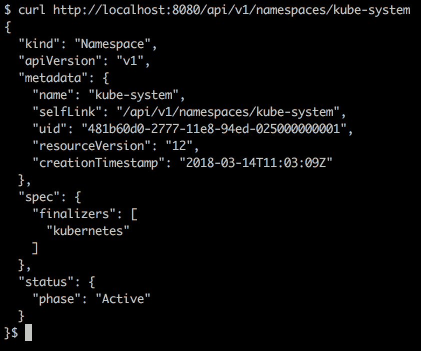
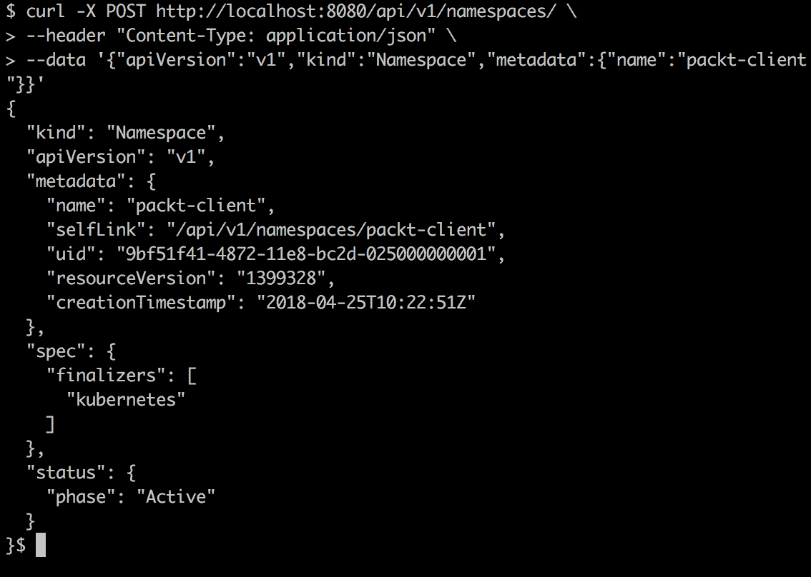
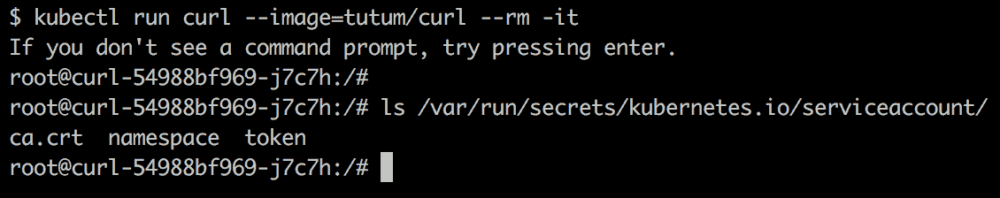
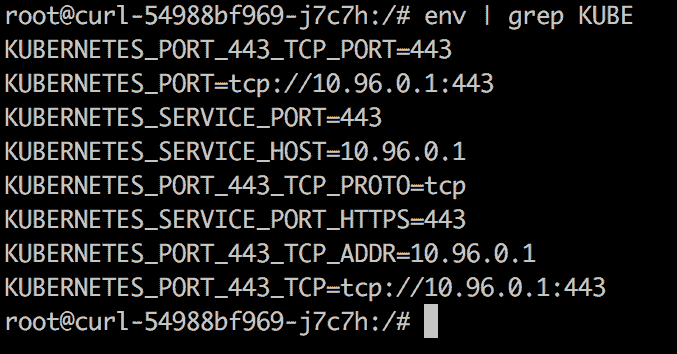
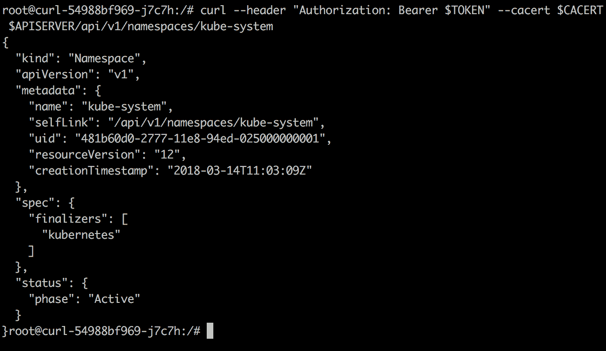
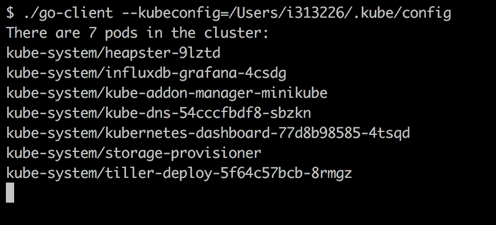
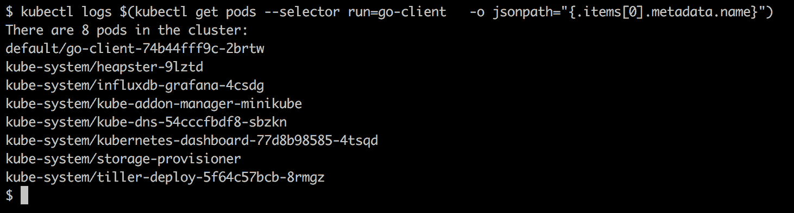
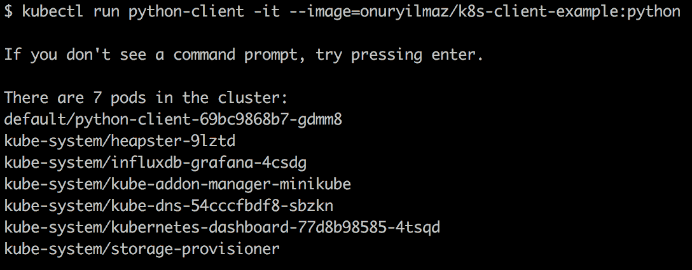

# Kubernetes 客户端库

Kubernetes 提供多种选项来使用 Kubernetes API 创建应用程序。这些选项包括 `kubectl`、`helm`、`kops` 和 `kubeadm` 等工具；以及官方支持的或社区维护的客户端库。然而，了解客户端的能力和局限性是至关重要的，只有这样才能创建与 Kubernetes 交互的应用程序。

在本章中，您将学习如何直接访问 Kubernetes API 并使用 Kubernetes 客户端库。首先，将解释如何直接访问 Kubernetes API，并演示从 Kubernetes API 返回的响应。接下来，将介绍官方和社区维护的库，包括详细信息和示例应用程序。在本章中，您将开发与 Kubernetes API 连接的应用程序，既包括集群内的，也包括集群外的。

本章结束时，您将能够：

+   评估 Kubernetes API 请求和响应风格

+   使用 HTTP 连接到 Kubernetes API

+   查找并使用官方客户端库

+   编写、运行并部署客户端库应用程序

+   评估社区维护的客户端库，以支持进一步的项目

# 访问 Kubernetes API

Kubernetes 由多个松散耦合的组件组成，主要目的是管理版本化资源。Kubernetes 组件可以分为两大部分：控制平面和节点组件。控制平面包括 API 服务器、控制器管理器和调度器。API 服务器是核心管理组件，具有以下功能：

+   为集群外的客户端和集群内的 Kubernetes 组件提供 REST API 服务

+   创建、删除和更新所有 Kubernetes 资源，例如 Pod、部署和服务

+   将对象的状态存储在分布式键值存储中

# Kubernetes API 风格

Kubernetes API 是一种 RESTful 服务，要求所有客户端使用 HTTP 请求（如 `GET`、`PUT`、`POST` 和 `DELETE`）来创建、读取、更新和删除资源。客户端应用程序，如 `kubectl` 或各种编程语言中的客户端库，实施 API 的请求和响应类型。为了通信，Kubernetes API 接受并返回 JSON 数据，就像大多数可用的 RESTful 服务一样。

**表现状态转移**（**REST**）是一种 Web 应用程序架构风格，使其能够使用 HTTP 请求。按照惯例，`GET` 用于读取资源，`POST` 用于创建资源，`PUT` 用于更新资源，`DELETE` 用于删除资源。

应用 RESTful API 的服务器应确保客户端无需了解服务器结构。服务器也应提供所有相关信息，以便客户端能够操作并与其交互。

**JavaScript 对象表示法**（**JSON**）是一种流行的轻量级数据交换格式。JSON 适用于机器解析和生成，并且具有可读性和表达性。尽管 JSON 是用 JavaScript 编写的，但它被多种语言支持，并且是现代异步浏览器/服务器通信中的关键数据类型。

在接下来的部分，将通过调用 API 服务器的 REST 端点来探索 Kubernetes API 响应的风格。

# 从 Kubernetes API 获取 JSON 响应

本部分展示了如何通过使用 `kubectl` 从 Kubernetes API 获取原始数据，并将数据作为 JSON 对象进行分析，获取资源的各个部分。

让我们开始实现以下步骤：

1.  使用以下命令获取原始数据：

```
kubectl get --raw /api/v1/namespaces/kube-system
```

1.  结果是，你将看到一个 JSON 响应。让我们获取相同的命令并格式化输出：

```
kubectl get --raw /api/v1/namespaces/kube-system | python -m json.tool

```

如果 Python 未安装，可以通过复制并粘贴输出，使用任何在线 JSON 格式化工具。

1.  JSON 响应显示了 Kubernetes API 资源的结构：

```
{
"apiVersion": "v1",
"kind": "Namespace",
"metadata": {
    "creationTimestamp": "2018-04-15T10:21:34Z",
    "name": "kube-system",
    "resourceVersion": "81",
    "selfLink": "/api/v1/namespaces/kube-system",
    "uid": "c5db1188-4096-11e8-903d-0800273b4d24"
},

```

Kubernetes API 资源有 `"apiVersion"`，因为所有资源在系统中都是版本化的。`"kind"` 显示资源的类型，`"metadata"` 包含所有元数据，如创建时间戳、标签或注解。`"spec"` 是列出所有资源属性的部分。最后，大多数资源有一个 `"status"` 部分，用来显示它们的状态、错误或信息（如果有的话）。

# 访问 Kubernetes API

Kubernetes API 服务器是安全的，要求所有传入的连接都进行身份验证。有两种常见的连接方式，可以与 Kubernetes API 服务器进行安全通信。第一种是通过 kubectl 使用反向代理功能，第二种是通过 API 服务器凭证。这些方法可以总结如下：

+   使用 kubectl 反向代理 Kubernetes API：

    +   Kubectl 代理命令启动了一个本地主机与 Kubernetes API 服务器之间的代理服务器。

    +   所有传入请求都被转发到远程 Kubernetes API 服务器端口。

    +   API 服务器身份通过自签名证书进行验证，以防止发生**中间人攻击**（**MITM**）。

    +   kubectl 负责与 API 服务器的身份验证。这是官方 Kubernetes 文档中推荐的做法。

    +   进一步的开发正在进行中；未来可能会提供客户端负载均衡和故障转移功能。

+   直接提供 API 服务器地址和凭证：

    +   API 服务器的地址和凭证可以在集群内部或外部获取，并且可以作为参数提供。

    +   这是一种替代方法，应该在客户端应用无法与反向代理协作时作为最后手段使用。

    +   为了防止 MITM 攻击，证书应导入客户端，例如通过浏览器。

在接下来的活动中，通过使用`kubectl`代理连接到 Kubernetes API，以创建一个新的 Kubernetes 命名空间。通过这种方法，`kubectl`使用自己的凭证安全地连接到 API 服务器，并为本地系统上的应用程序创建代理。

# 连接到 Kubernetes API 并创建命名空间

在本节中，你的任务是通过使用 Kubernetes API 为测试创建命名空间。测试在集群外部运行，并与 Kubernetes API 进行通信。为了在自己的命名空间中运行测试，你需要创建一个命名空间。在完成此任务后，通过发送 JSON 数据将在 Kubernetes 中创建一个新的命名空间。让我们在开始示例之前确保遵循以下步骤：

+   使用 kubectl 创建代理，并使其对本地系统上的所有应用程序可用

+   使用 JSON 和 cURL 与 Kubernetes API 进行通信

+   通过查询 kubesystem 来获取命名空间资源的 JSON 结构，并将其作为模板使用

让我们从实现以下步骤开始：

1.  使用以下命令启动反向代理：

```
kubectl proxy --port=8080

```

1.  在另一个终端中，创建一个指向转发端口的 HTTP 请求：

```
curl http://localhost:8080/api/v1/namespaces/kube-system

```

预期的响应应为类似以下的 JSON 结构：



1.  使用*步骤 2*的响应作为模板，创建一个简单的命名空间 JSON 对象：

```
{
"apiVersion":"v1",
"kind":"Namespace",
"metadata":{
"name":"packt-client"
}
}
```

1.  使用`curl`并使用*步骤 3*中的负载数据创建新的命名空间：

```
curl -X POST http://localhost:8080/api/v1/namespaces/ \
--header "Content-Type: application/json" \
--data \
'{"apiVersion":"v1","kind":"Namespace","metadata":{"name":"packt-client"}}'

```

执行此命令后，将接收到新创建的命名空间数据：



1.  你可以运行以下命令进行清理：

```
kubectl delete namespace packt-client

```

# 访问集群内的 Kubernetes API

访问集群外部的 Kubernetes API 大多数是用于需要人工交互的操作基础。此外，访问 Kubernetes API 并向 API 服务器发送请求也可以在集群内部进行。这使得可以在集群内部编写应用程序并运行它们，从而将操作知识转化为应用程序。

对于集群中的所有 Pod，Kubernetes 会注入服务账户——它们是推荐的认证 Kubernetes API 服务器的方式。对于每个 Pod，以下与服务账户相关的信息和凭证都会被挂载

默认情况下：

+   **服务账户和令牌**：`/var/run/secrets/kubernetes.io/serviceaccount/token`

+   **证书包**：`/var/run/secrets/kubernetes.io/serviceaccount/ca.crt`

+   **命名空间**：`/var/run/secrets/kubernetes.io/serviceaccount/namespace`

在集群内部使用这些信息形成了一种安全的方式来连接 Kubernetes API 服务器并进行请求。服务账户作为 Kubernetes 中的一种身份验证机制，使用签名的令牌来验证请求。这些令牌由 Kubernetes API 服务器创建和管理。对于在 Kubernetes 中运行的每个 Pod，都会挂载服务账户令牌，它们使 Pod 能够与 Kubernetes API 服务器进行通信。更多信息可以参考官方文档：[`kubernetes.io/docs/admin/authentication`](https://kubernetes.io/docs/admin/authentication)。

# 在集群内部连接 Kubernetes API

在本节中，我们将创建一个简单的应用程序，用于查询 Kubernetes API 并获取 kube-system 命名空间的详细信息。然而，这个应用程序应该在集群内部运行，并作为 Kubernetes 本地应用程序工作。我们将在集群内部查询 Kubernetes API，并在 Pod 中注入环境变量和证书。

让我们从实现以下步骤开始：

1.  在集群内部启动一个 cURL 实例，并等待它启动并运行：

```
kubectl run curl --image=tutum/curl --rm -it

```

1.  在 Pod 内部检查安全凭证：

```
ls /var/run/secrets/kubernetes.io/serviceaccount/

```

您将获得以下输出：



1.  检查 Kubernetes API 服务器是否具有相关的环境变量：

```
env | grep KUBE 
```

您将获得以下输出：



1.  使用以下命令将所有凭据和地址信息结合起来：

```
APISERVER=https://$KUBERNETES_SERVICE_HOST:$KUBERNETES_SERVICE_PORT
TOKEN=$(cat /var/run/secrets/kubernetes.io/serviceaccount/token)
CACERT=/var/run/secrets/kubernetes.io/serviceaccount/ca.crt
NAMESPACE=$(cat /var/run/secrets/kubernetes.io/serviceaccount/namespace)
```

1.  使用 *步骤 4* 中收集到的环境变量，通过 cURL 创建并发送 HTTP 请求：

```
curl --header "Authorization: Bearer $TOKEN" --cacert
$CACERT $APISERVER/api/v1/namespaces/kube-system 
```

使用上述命令时，将向 `/api/v1/namespaces/kube-system` 端点发送一个 GET 请求。为了对 API 服务器进行身份验证，将作为标头发送一个承载令牌，并提供证书授权信息。

执行此命令后，将从 API 服务器获取请求的命名空间信息：



Kubernetes API 是核心管理服务，它是一个安全的 RESTful 服务，使用 JSON 格式。它要求所有客户端都进行身份验证，并且既可以是外部连接，也可以是集群内部连接。在接下来的部分中，将介绍多种编程语言的客户端库，这些库实现了 Kubernetes API。

# 官方客户端库

消费 Kubernetes REST API 的应用程序应实现 API 调用，包括请求和响应类型。考虑到 Kubernetes 提供的丰富资源集，开发和维护 API 实现变得复杂。幸运的是，Kubernetes 提供了一套丰富的官方客户端库，涵盖了各种编程语言。这些客户端库不仅处理请求和响应，还处理与 API 服务器的身份验证。此外，大多数客户端库能够发现并连接到集群内部运行的 Kubernetes API 服务器。

本节将介绍官方的 Go 和 Python 客户端库，包括客户端代码库、文档、安装方法，以及如何创建在集群内外运行的简单应用程序。

# Go 客户端库

Go，也被称为 Golang，是 Google 在 2009 年创建的编程语言。Go 的显著特点包括：

+   它是静态类型的，因此编译器可以确保对象类型和转换的正确性

+   它具有内存安全性，且无需担心开发问题

+   它具有垃圾回收功能，且开销最小

+   对象的结构化类型基于其组成

+   它具有原生的并发处理能力，提供了诸如 Go 协程和通道等原语

Go 是一种免费、开源的编程语言，具有编译器和环境工具。Go 因其上述特点在云原生应用中得到了广泛应用，因这些特点非常适合可扩展和可靠应用的需求。一些最著名的使用 Go 作为主要语言的项目如下：

+   Docker

+   Kubernetes

+   Terraform

+   OpenShift

+   Consul

+   比特币闪电网络

+   InfluxDB

+   CockroachDB

# 仓库

Kubernetes 的 Go 客户端，即 client-go，是 Kubernetes 官方项目的一部分，代码库可在 [`github.com/kubernetes/client-go`](https://github.com/kubernetes/client-go) 查阅。

它是最古老且最全面的客户端库。该客户端库的 Kubernetes 资源处理程序是通过 Kubernetes 官方源代码生成器生成的。此外，client-go 在 Kubernetes 项目中得到了广泛应用。

如 kubectl、helm 和 kops 等工具。

# 文档

Go 客户端代码库包含以下包及其相关领域：

+   `kubernetes`：访问 Kubernetes API 的客户端集

+   `discovery`：发现 Kubernetes API 服务器支持的 API

+   `dynamic`：执行通用 API 访问的动态客户端

+   `transport`：认证和连接启动

+   `tools/cache`：用于编写控制器的助手

Go 客户端遵循 Go 语言官方文档风格，文档可在 [`godoc.org/k8s.io/client-go`](https://godoc.org/k8s.io/client-go) 查阅。

# 安装

在 Go 语言中，其工具集提供了 `go get` 命令作为下载和安装包及其依赖项的标准方法。此命令从源控制版本提供者下载默认分支和最新更改。然而，Kubernetes 客户端的特定版本是设计为与特定版本的依赖项一起工作的。因此，标准的 `go get` 命令不可用。相反，应该使用为 Go 提出的依赖管理解决方案，以便可靠地使用 `client-go`。

换句话说，应该确定所需的 client-go 版本，然后通过依赖管理器下载它和相应的依赖。这种处理依赖关系的方式叫做 **vendoring**。因此，依赖管理器将收集依赖库并将其放入 `vendor` 文件夹。

对于一个使用 `client-go` 库的 Go 应用程序，所有相关的库及其依赖项应当被收集到 vendor 文件夹中，以便进行可靠且可重复的构建。

Kubernetes Go 客户端支持多种依赖管理工具，如 dep、godeps 和 glide。此外，对于不想使用任何依赖管理工具的普通用户，client-go 官方文档中也提供了所需的步骤：[`github.com/kubernetes/client-go/blob/master/INSTALL.md`](https://github.com/kubernetes/client-go/blob/master/INSTALL.md)。

# 创建配置

Go 客户端库提供了连接 Kubernetes API 服务器所需的功能。它可以轻松地创建配置，以便与集群外部和内部进行通信。你可以使用以下代码片段来实现：

```
// Create configuration outside the cluster config, err = clientcmd.BuildConfigFromFlags("", kubeconfigPath)
// Create configuration inside the cluster config, err = rest.InClusterConfig()
```

# 创建 Clientset

Clientset 包含每组资源的客户端，并提供访问这些资源的权限。在其简化版本中，如以下代码所示，可以看到每一组资源的客户端都在客户端库中得到了实现：

```
type Clientset struct {
       ...
       appsV1 *appsv1.AppsV1Client
       ...
       batchV1 *batchv1.BatchV1Client
       coreV1 *corev1.CoreV1Client
       eventsV1beta1 *eventsv1beta1.EventsV1beta1Client
       networkingV1 *networkingv1.NetworkingV1Client

       rbacV1 *rbacv1.RbacV1Client
       storageV1beta1 *storagev1beta1.StorageV1beta1Client
       storageV1 *storagev1.StorageV1Client
 }
```

使用前一步骤中的配置，可以使用以下代码片段创建 clientset：

```
// Create clientset from configuration
 clientset, err := kubernetes.NewForConfig(config)

```

# 进行 API 调用

创建配置和 clientset 后，API 调用最终可以执行。可以使用提供的 clientset 中的客户端列出、更新、创建或删除所有 Kubernetes 资源。以下代码片段展示了一些示例：

```
// Request all pods from all namespaces
pods, err :=
clientset.CoreV1().Pods(v1.NamespaceAll).List(metav1.ListOptions{})
 // Get deployment packt from the default namespace
deployments, err := clientset.AppsV1().Deployments(v1.NamespaceDefault).Get("packt", metav1.GetOptions{})
// Delete statefulset test from namespace packt
clientset.AppsV1().StatefulSets("packt").Delete("test", &amp;metav1.DeleteOptions{})

```

之前的章节中提供了配置、客户端创建和使用 Kubernetes Go 客户端进行 API 调用的代码片段。完整的应用程序代码可以在 `go/main.go` 中找到，它将所有片段整合在一起，链接地址为 [`goo.gl/wJBjG5`](https://goo.gl/wJBjG5)。

我们可以注意到在 `main.go` 文件中的以下几点：

+   在*第 19 行*启动的主函数中，所有变量都被定义，并且在*第 30 行*解析了命令行参数。

+   配置是从 `kubeconfig` 创建的，并且作为备用方法，它是通过集群内的方法在*第 33 行*和*第 42 行*之间创建的。

+   Clientset 在*第 45 行*创建。

+   在*第 51 行*和*第 65 行*之间，定义了一个无限循环，迭代结束时会有 10 秒的休眠。

+   在此循环的每次迭代中，来自所有命名空间的 pods 会在*第 53 行*被请求。响应会在*第 58 行*和*第 62 行*之间打印到控制台。

在以下示例中，构建并运行了一个结合了前面各节代码片段的应用程序。它向你展示了如何构建一个 Go 应用并在集群外使用它。尽管该应用看起来很简单，但其流程和代码库为复杂的自动化需求奠定了基础。

# 在集群外使用 Kubernetes Go 客户端

本节中，我们将学习如何构建并运行一个 Go 应用，使用 Kubernetes Go 客户端，并将应用连接到集群外部。Go 应用是通过使用 Go 工具集命令（如 go build）构建的。然而，这需要在本地安装 Go。在本示例中，我们将使用 Go 语言的官方 Docker 镜像，而无需在本地机器上进行任何安装：

1.  使用以下命令通过官方 Docker 容器创建跨平台构建：

```
cd go
make build
```

1.  使用我们在*步骤 1*中创建的可执行文件和 `kubeconfig` 文件位置启动应用：

```
./client --kubeconfig=$HOME/.kube/config

```

你将看到以下输出：



# 活动：在集群内使用 Kubernetes Go 客户端

**场景**

你被分配了一个任务，部署一个列出 Kubernetes 中所有 Pod 的 Go 应用。除此之外，该应用将运行在集群内，并获取有关集群的信息。

**目标**

运行一个消耗 Go 客户端库的应用程序，位于 Kubernetes 集群内。

**前提条件**

1.  使用 Docker 镜像 `onuryilmaz/k8s-client-example:go`，该镜像包含了前面示例中的可执行文件。

1.  部署应用并检查日志，查看它是否按预期工作。

**完成步骤**

1.  使用前一个示例中的 Docker 镜像创建一个部署。

1.  等待直到 Pod 正在运行。

1.  获取部署 Pod 的日志。

使用此命令，通过子命令获取 Pod 的日志。在子命令中，通过 `run` 标签选择器等于 `go-client` 获取所有 Pod，并收集第一个 Pod 的名称。日志应显示客户端本身以及集群中的其他 Pod：



1.  运行以下命令进行清理：

```
kubectl delete deployment go-client
```

# Python 客户端库

Python 是一种高级通用编程语言，首次发布于 1990 年。它是最受欢迎的开源编程语言之一，广泛应用于多个领域，包括机器学习、数据处理、Web 开发和脚本编写。Python 的主要特点是该语言是解释型的，且支持动态类型检查。Python 的流行得益于其简洁的编程风格和注重代码可读性。在现代云原生环境中，Python 主要用于基础设施和自动化。除了其流行度和广泛应用外，Kubernetes 也有一个官方的客户端库，使用 Python 实现。

# 仓库

Kubernetes Python 客户端是官方客户端库的一部分，可以在 [`github.com/kubernetes-client/python`](https://github.com/kubernetes-client/python) 上找到。

Python 客户端是符合 OpenAPI 标准的客户端，这意味着 Swagger 工具会生成资源定义。客户端库仍在进行中，使用前应检查其功能是否适用于生产环境。像其他 Kubernetes 客户端一样，Python 客户端试图支持一组预定义的功能，根据其覆盖范围，它被分类为“银级”。

OpenAPI 是一种描述 RESTful API 的规范。通过使用 OpenAPI 规范，可以为客户端和服务创建实现，包括所有相关操作。

Swagger 是用于开发 API 的工具生态系统，它在 OpenAPI 中有所定义。Swagger 提供了开源和商业工具，用于根据所提供的规范创建应用程序。

# 安装

安装客户端库有两种方法，您可以创建开发环境。第一种方法是下载源代码并构建：

```
$ git clone --recursive https://github.com/kubernetes-client/
python.git
$ cd python
$ python setup.py install
```

第二种方法是通过使用像 `pip` 这样的包管理器，从 Python 包索引下载包：

```
$ pip install kubernetes
```

# 客户端使用

在前一章节中，开发了一个列出所有 pods 的 Go 应用程序。本章节用 Python 实现了与前一个应用相同的功能。凭借 Python 的简洁代码和可读性哲学，相同的功能大约用十行代码实现，如下所示：

```
from kubernetes import client, config
import time
config.load_incluster_config()
v1 = client.CoreV1Api()
while True:
         ret = v1.list_pod_for_all_namespaces(watch=False)
         print('There are {:d} pods in the cluster:'.format(len(ret.items)))
         for i in ret.items:
                print('{:s}/{:s}'.format((i.metadata.namespace, i.metadata.name))
         time.sleep(10)

```

以下是关于前面代码片段的关键点：

+   在*第 3 行*，创建了集群内配置，在*第 5 行*，为 `corev1` API 创建了客户端。

+   从*第 8 行*开始，进入一个无限循环，每次迭代暂停 10 秒。

+   在*第 9 行*，从 `v1` 客户端请求所有 pods，并解析响应并写入控制台。

# 打包

Python 应用程序应该像 Kubernetes 上运行的所有服务一样，运行在容器内。因此，本节中定义的客户端库与以下 Dockerfile 一起打包。此容器定义使应用程序能够在包含其依赖项的隔离环境中运行：

```
FROM python:3
RUN pip install kubernetes
ADD . /client.py
CMD ["python", "./client.py"]
```

请参阅完整代码：[`goo.gl/z78SKr`](https://goo.gl/z78SKr)。

以下是对前面代码的注释：

+   容器基于支持 Python 3 版本的基础构建。

+   Kubernetes Python 客户端库通过 `pip` 在*第 3 行*安装。

+   客户端应用程序在*第 5 行*被复制到容器中，并在*第 7 行*启动。

在接下来的章节中，展示的 Python 代码片段用于在 Kubernetes 集群中工作。完整的代码被打包成一个包含其依赖的 Docker 容器。通过这个容器，应用程序以隔离的方式部署到 Kubernetes 中，遵循微服务架构。

# 在集群内使用 Kubernetes Python 客户端

在本节中，我们将部署一个 Python 应用程序，该应用程序列出所有 pod，并在 Kubernetes 内部使用 Python 客户端库。此外，应用程序将在集群内运行并收集关于集群的信息。

在开始实现之前，我们需要使用 Docker 镜像 `onuryilmaz/k8s-client-example:python`，该镜像是通过上一节中的 Dockerfile 构建的。我们还需要将应用程序作为部署进行部署，并检查日志以查看其是否按预期工作。让我们从执行以下步骤开始：

1.  使用示例客户端的 Docker 镜像创建部署：

```
kubectl run python-client -it --image=onuryilmaz/k8sclient-example:python
```

使用此命令，将创建一个名为 python-client 的部署，使用 Docker 镜像 `onuryilmaz/k8s-client-example:python` 以交互模式运行，以便日志能够打印到控制台。

日志应显示客户端本身，以及集群中的其他 pod：



1.  运行以下命令进行清理：

```
 kubectl delete deployment python-client

```

# 其他官方客户端库

在本章中，介绍了两个官方的 Kubernetes 客户端库：

+   **Go**：这是一种静态类型的基于编译器的语言

+   **Python**：这是一种动态类型和解释型语言

官方客户端库还包括一些额外的编程语言：

+   **Java**：[`github.com/kubernetes-client/java`](https://github.com/kubernetes-client/java)

+   **.NET**：[`github.com/kubernetes-client/csharp`](https://github.com/kubernetes-client/csharp)

+   **JavaScript**：[`github.com/kubernetes-client/javascript`](https://github.com/kubernetes-client/javascript)

对于这些库的功能和难题，您应该查看它们相应的仓库，因为它们都仍处于开发阶段。

# 社区维护的客户端库

Kubernetes 拥有一个活跃且合作的开源社区，这也提高了它的普及度。在 Kubernetes 文档中列出了大约 20 个由社区维护的客户端库，涵盖了以下语言：

+   Clojure

+   Go

+   Java

+   Lisp

+   Node.js

+   Perl

+   PHP

+   Python

+   Ruby

+   Scala

+   dotNet

+   Elixir

在使用社区维护的客户端库之前，有一些关键点需要考虑：

+   **库的目标**：考虑开发团队和库的目标非常重要。尽管这看起来与软件本身没有直接关系，但它会影响客户端库的开发方式。例如，一些库注重简洁性，可能在功能覆盖上做出妥协。如果你的应用程序愿景与客户端库不匹配，长远来看将难以维护应用程序。

+   **版本和支持**：官方库支持特定的 Kubernetes API 版本，并维护兼容性矩阵。使用与 Kubernetes 集群兼容的客户端库至关重要，同时确保能够获得未来 Kubernetes 版本的支持。一个由社区维护的客户端库今天可能非常适合，但如果没有得到支持，六个月后可能会被弃用。

+   **社区兴趣**：如果考虑的客户端库是开源的，那么它的社区应该是活跃的，并且有兴趣使该库变得更好。我们常常看到一些库起步很好，但由于缺乏社区支持，最终没有得到维护。不建议使用那些存在旧问题且很久没有评论或没有经过审查的拉取请求的客户端库。

# 总结

本章讨论了 Kubernetes API 访问和客户端库。尽管有多种工具可以与 Kubernetes 进行通信，但了解 Kubernetes API 本身和客户端库对于创建具有革命性的自动化和编排任务至关重要。

首先，介绍了 Kubernetes API 的风格以及如何使用 HTTP 客户端进行连接。接着，讲解了 Kubernetes 的客户端库，重点介绍了两个官方客户端库。我们通过演示和实践，展示了如何安装、编写代码、打包并将代码部署到集群的步骤。

最后，展示了针对不同语言偏好或自定义需求的社区维护库。通过掌握 Kubernetes 客户端库的知识和实践经验，能够实现更高层次的自动化，并扩展 Kubernetes。在接下来的章节中，将第一章介绍的最佳实践与本章包含的客户端库汇总在一起，创建扩展 Kubernetes 的应用程序。
