# 第三章：Kubernetes 扩展

Kubernetes 是高度可定制和可扩展的，因此系统的任何部分都可以进行全面配置并扩展新功能。Kubernetes 的扩展点并不专注于内建资源的低级配置，如 Pods 或 StatefulSets。然而，扩展 Kubernetes 意味着扩展 Kubernetes 本身的操作。这些扩展点使得许多实践成为可能，包括创建新的 Kubernetes 资源、自动化 Kubernetes 和人类交互，以及干预资源的创建或编辑及其调度机制。

本章将介绍扩展点和模式，并涵盖最常见和最基本的扩展点。首先，将增强 Kubernetes API，并将人类知识转化为 Kubernetes 操作员的自动化。其次，将通过 Webhooks 和 Initializers 扩展 Kubernetes 的访问控制机制。最后，将以高度可定制的选项配置 Kubernetes 的默认调度器，并演示如何开发和部署自定义调度器。在这些章节中，你将能够通过创建使用 Kubernetes API 的应用程序来实现并部署扩展。

# Kubernetes 扩展点

Kubernetes 本身及其内建资源是高度可配置的，因此任何现代云原生应用都可以配置在云环境中运行。在添加新功能、将人类知识转化为代码并实现更多自动化时，Kubernetes 扩展提供了帮助。幸运的是，为了扩展 Kubernetes 的功能，用户无需下载源代码、进行修改、构建和部署完整的系统。凭借其模块化，Kubernetes 的扩展点已经定义并准备好使用。

Kubernetes 扩展点专注于当前 Kubernetes 及其环境的功能。内建组件及如何扩展 Kubernetes 总结如下几类：

+   **Kubernetes 客户端**：通过编写 `kubectl` 插件，可以扩展客户端应用程序，如 `kubectl`。这些扩展将帮助你减少与 `kubectl` 的人工交互，例如自动选择 Kubernetes 集群上下文。同样，使用 OpenAPI 规范生成的客户端可以扩展客户端库，如 `client-go`。使用这些生成的客户端，你可以在自定义应用程序中以编程方式使用 Kubernetes API。

+   **Kubernetes API 类型**：Kubernetes API 资源，如 Pods、Deployments 等，具有高度的可配置性，但也可以添加新的资源，称为自定义资源。

+   **Kubernetes API 控制器**：Kubernetes 的控制平面，包括 Kubernetes API 服务器，处理所有操作，如自动扩展或自我修复；但是，也可以开发自定义控制器。

+   **访问控制器**：处理身份验证、授权和准入控制的访问控制机制可以通过连接到 Webhook 服务器或介入初始化程序来扩展。

+   **调度**：`kube-scheduler`已经处理了将 pods 调度到节点的任务；然而，也可以创建自定义调度器并将其部署到集群中。

+   **基础设施**：Kubernetes 的基础设施部分是标准化的，包括服务器、网络和存储，使用**容器运行时接口**（**CRI**）、**容器网络接口**（**CNI**）和**容器存储接口**（**CSI**）。这些接口的实现提供了扩展底层 Kubernetes 集群基础设施的方法。

为了方便使用，我将前面提到的各个类别放入了以下表格中：

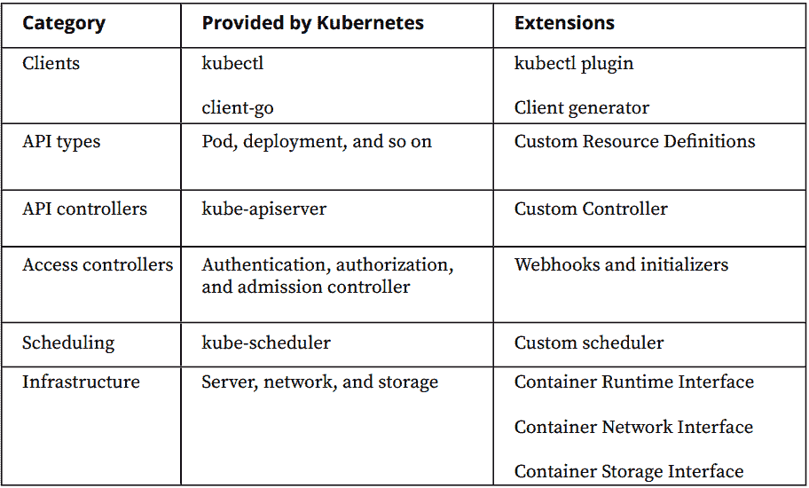

# 扩展 Kubernetes 客户端

Kubernetes 客户端应用程序和库是访问 Kubernetes API 的主要入口点。通过这些应用程序和库，可以自动化并扩展 Kubernetes 操作。

对于官方 Kubernetes 客户端应用程序，可以通过编写插件应用程序来扩展`kubectl`。一些最受欢迎的插件增强了`kubectl`的功能：

+   它自动切换 Kubernetes 集群上下文。

+   它计算并显示 pods 的正常运行时间信息。

+   它通过 SSH 连接到具有特定用户的容器。

官方 Kubernetes 代码生成器可以生成官方 Kubernetes 客户端库和 Kubernetes 服务器代码。这些生成器为内部版本化的类型、客户端信息器和 protobuf 编解码器创建所需的源代码。

通过客户端应用程序和库的扩展点，可以增强与 Kubernetes 交互的操作。如果你的自定义需求超出了`kubectl`或客户端库的功能，Kubernetes 提供了定制化的扩展点。

# 扩展 Kubernetes API

Kubernetes 已经拥有丰富的资源，从 pods 作为构建块，到 stateful sets 和 deployments 等更高级别的资源。现代云原生应用可以通过 Kubernetes 资源及其高级配置选项进行部署。然而，当需要人工专业知识和操作时，这些资源并不充分。Kubernetes 使得通过新资源扩展自己的 API 成为可能，并将其作为 Kubernetes 原生对象操作，具有以下特点：

+   **RESTful API**：新资源直接包含在 RESTful API 中，以便通过它们的特殊端点进行访问。

+   **身份验证与授权**：所有新的资源请求都需要经过身份验证和授权步骤，就像本地请求一样。

+   **OpenAPI 发现**：可以发现新资源并将其集成到 OpenAPI 规范中。

+   **客户端库**：如`kubectl`或`client-go`等客户端库可以用来与新资源进行交互。

扩展 Kubernetes API 时涉及两个主要步骤：

+   创建一个新的 Kubernetes 资源来引入新的 API 类型

+   控制和自动化操作，以实现作为附加 API 控制器的自定义逻辑。

# 自定义资源定义

在 Kubernetes 中，所有资源都有自己的 REST 端点，这些端点位于 Kubernetes API 服务器中。REST 端点通过使用`/api/v1/namespaces/default/pods`来执行特定对象（如 Pods）的操作。自定义资源是 Kubernetes API 的扩展，可以在运行时动态地添加或移除。它们使集群的用户能够对扩展资源进行操作。

自定义资源是在**自定义资源定义**（**CRD**）对象中定义的。通过使用内置的 Kubernetes 资源，即 CRD，可以通过 Kubernetes API 本身来添加新的 Kubernetes API 端点。

在接下来的部分中，将为那些通常需要人工交互的 Kubernetes 需求创建一个新的自定义资源。

# 创建和部署自定义资源定义

假设一个客户端希望以可扩展的云原生方式在 Kubernetes 中查看天气报告。我们需要扩展 Kubernetes API，以便客户端和未来的应用程序能够本地使用天气报告资源。我们希望创建`CustomResourceDefinitions`并将其部署到集群中，以检查它们的效果，并使用新定义的资源来创建扩展对象。

你可以在以下位置找到`crd.yaml`文件：[`goo.gl/ovwFX1`](https://goo.gl/ovwFX1)。

让我们开始执行以下步骤：

1.  使用 kubectl 部署自定义资源定义，执行以下命令：

```
kubectl apply -f k8s-operator-example/deploy/crd.yaml
```

自定义资源定义是 Kubernetes 资源，它们支持新自定义资源的动态注册。一个关于`WeatherReport`的示例自定义资源可以在`k8s-operator-example/deploy/crd.yaml`文件中定义，示例如下：

```
apiVersion: apiextensions.k8s.io/v1beta1
kind: CustomResourceDefinition
metadata:
      name: weatherreports.k8s.packt.com
spec:
      group: k8s.packt.com
      names:
            kind: WeatherReport
            listKind: WeatherReportList
             plural: weatherreports
             singular: weatherreport
scope: Namespaced
version: v1

```

和所有其他 Kubernetes 资源一样，CRD 包含 API 版本、类型、元数据和规格组。此外，CRD 的规格包括新自定义资源的定义。对于`WeatherReport`，将会在`k8s.packt.com`下创建一个版本为`v1`的 REST 端点，并且其复数和单数形式将在客户端中使用。

1.  使用以下命令检查部署到集群中的自定义资源：

```
 kubectl get crd
```

你将得到以下输出：

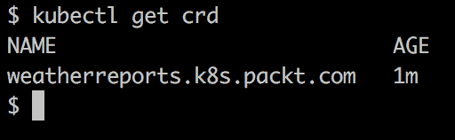

如上图所示，天气报告的 CRD 已经定义了复数名称和组名称。

1.  检查 API 服务器中新自定义资源的 REST 端点：

```
kubectl proxy &
curl -s localhost:8001 |grep packt 
```

你将得到以下输出：

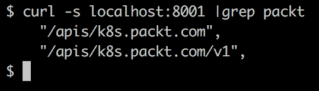

创建了新的端点，这表明 Kubernetes API 服务器已经扩展，可以与我们的新自定义资源`weatherreports`一起工作。

1.  使用 Kubernetes 客户端（如`kubectl`）检查天气报告实例：

```
kubectl get weatherreports
```

你将得到以下输出：

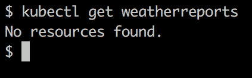

尽管`No resources found`的输出看起来像是错误的指示，但它告诉我们没有如预期那样的`weatherreports`资源的活动实例。这告诉我们，在没有任何额外配置的情况下，仅创建`CustomResourceDefinition`，Kubernetes API 服务器已通过新端点进行扩展，客户端已准备好与新的自定义资源进行交互。

在定义自定义资源后，现在可以使用`WeatherReport`创建、更新和删除资源。`WeatherReport`的示例如下所示，可以在`k8s-operator-example/deploy/cr.yaml`文件中定义：

```
apiVersion: "k8s.packt.com/v1"
kind: WeatherReport
metadata:
      name: amsterdam-daily
spec:
     city: Amsterdam
     days: 1

```

你可以在以下链接找到`cr.yaml`文件：[`goo.gl/4A3VD2`](https://goo.gl/4A3VD2)。

`WeatherReport`资源具有相同的结构，包含内置资源，并由 API 版本、类型、元数据和规范组成。在此示例中，规范表示该资源是针对`阿姆斯特丹`城市过去 1 天的天气报告。

1.  使用以下命令部署天气报告示例：

```
 kubectl apply -f k8s-operator-example/deploy/cr.yaml

```

1.  使用以下命令检查新创建的天气报告：

```
kubectl get weatherreports
```

你将看到以下输出：

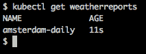

1.  使用以下命令进行清理：

```
kubectl delete -f k8s-operator-example/deploy/cr.yaml
kubectl delete -f k8s-operator-example/deploy/crd.yaml

```

# 自定义控制器

在上一节和练习中，我们展示了自定义资源使我们能够扩展 Kubernetes API。然而，针对自定义资源采取行动和自动化任务也是必要的。换句话说，当创建一个新的`weatherreport`资源时，谁来生成天气报告并收集结果？这个问题的答案是 Kubernetes 中的自定义控制器，也被称为**操作器**。

借助 Kubernetes 内置资源，可以轻松部署、扩展和管理无状态的 Web 应用程序、移动后端和 API 服务。当涉及到需要额外操作的有状态应用程序时，诸如初始化、存储、备份和监控等操作需要领域知识和人类专长。

对于有状态应用程序，诸如初始化、存储、备份和监控等操作需要领域知识和人类专长。

自定义控制器，也称为操作器，是一个将领域知识和人类专长转化为代码的应用程序。操作器与自定义资源一起工作，并在自定义资源被创建、更新或删除时采取所需的行动。操作器的主要任务可以分为三个部分，**观察**、**分析**和**行动**，如下图所示：

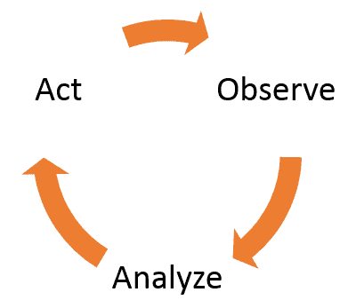

各个阶段解释如下：

+   **观察**：监视自定义资源和相关的内置资源（如 pods）的变化。

+   **分析**：对观察到的变化进行分析，并决定采取哪些行动。

+   **行动**：根据分析和需求采取行动，并继续观察变化。

对于天气报告示例，期望的操作模式如下：

+   **观察**：等待天气报告资源的创建、更新和删除。

+   **分析**：

    +   如果请求新的报告，则创建一个 pod 以收集天气报告结果并更新天气报告资源。

    +   如果天气报告更新，则更新 pod 以收集新的天气报告结果。

    +   如果天气报告被删除，则删除相应的 pod。

+   **操作**：对集群执行**分析**步骤中的操作，并继续使用**观察**进行监控。

操作员已经在 Kubernetes 环境中得到应用，因为它们使复杂的应用程序能够在云端运行，且需要最小的人类干预。存储提供商（Rook）、数据库应用程序（MySQL、CouchDB、PostgreSQL）、 

大数据解决方案（Spark）、分布式键值存储（Consul、etcd）以及更多现代云原生应用程序，都通过其官方操作员在 Kubernetes 上安装。

# 操作员开发

操作员是原生 Kubernetes 应用程序，并且它们与 Kubernetes API 进行了广泛的交互。因此，符合 Kubernetes API 的要求，并通过简单明了的方式将领域知识转化为软件，对于操作员开发至关重要。考虑到这些因素，开发操作员有两条路径，具体内容将在以下章节中解释。

# Kubernetes 示例控制器

在官方 Kubernetes 仓库中，维护了一个示例控制器，用于实现自定义资源的监控。该仓库展示了如何注册新的自定义资源以及如何对新资源执行基本操作，如创建、更新或列出。此外，还实现了控制器逻辑，展示了如何执行操作。该仓库与 Kubernetes API 的交互展示了如何创建类似 Kubernetes 的自定义控制器。

# Operator Framework

Operator Framework 于 2018 年 KubeCon 上宣布，是一个用于管理 Kubernetes 原生应用程序的开源工具包。Operator SDK 是该框架的一部分，它通过提供更高级的 API 抽象和代码生成来简化操作员开发。Operator Framework 及其环境工具集是开源的，由社区维护，控制权归 CoreOS 所有。

本章中选择了 Operator Framework 中的 Operator SDK，因为 SDK 抽象了许多低级操作，如工作队列、处理程序注册和通知管理。通过这些抽象，使用 SDK 包处理**观察**和**操作**部分变得更加简单，这样我们可以专注于**分析**部分。

在以下部分，将涵盖操作员开发的完整生命周期，主要步骤如下：

+   **创建操作项目**：对于 `WeatherReport` 自定义资源，通过使用 Operator Framework SDK CLI 创建了一个 Go 语言的操作项目。

+   **定义自定义资源规范**：`WeatherReport` 自定义资源的规范在 Go 中定义。

+   **实现处理程序逻辑**：手动操作所需的天气报告收集逻辑在 Go 中实现。

+   **构建操作符**：操作符项目使用 Operator Framework SDK CLI 构建。

+   **部署操作符**：操作符被部署到集群中，并通过创建自定义资源进行测试。

# 创建和部署 Kubernetes 操作符

一个客户希望自动化天气报告收集的操作。他们目前正在连接第三方数据提供者并获取结果。此外，他们希望在集群中使用云原生的 Kubernetes 解决方案。

我们预计通过实现一个 Kubernetes 操作符来自动化天气报告数据收集的操作。

我们将通过使用 Operator Framework SDK 创建一个 Kubernetes 操作符，并通过创建自定义资源、自定义控制器逻辑，最终部署到集群中来使用它。让我们开始实现以下步骤：

1.  使用以下命令，利用 Operator Framework SDK 工具创建操作符项目：

```
operator-sdk new k8s-operator-example --api-version=k8s.
packt.com/v1 --kind=WeatherReport

```

该命令创建一个全新的 Kubernetes 操作符项目，名称为 `k8s-operator-example`，并监控 `WeatherReport` 自定义资源的变化，该资源在 `k8s.packt.com/v1` 下定义。生成的操作符项目保存在 `k8s-operator-example` 文件夹中。

1.  一个自定义资源定义已经在 `deploy/crd.yaml` 文件中生成。然而，自定义资源的规范被留空，供开发人员填写。自定义资源的规范和状态在 Go 中编码，如 `pkg/apis/k8s/v1/types.go` 中所示：

```
type WeatherReport struct {
               metav1.TypeMeta 'json:",inline"'
               metav1.ObjectMeta 'json:"metadata"'
               Spec WeatherReportSpec
'json:"spec"'
               Status WeatherReportStatus
'json:"status,omitempty"'
}
type WeatherReportSpec struct {
               City string 'json:"city"'
               Days int 'json:"days"'
}

```

你可以参考完整的代码，网址是：[`goo.gl/PSyf25`](https://goo.gl/PSyf25)。

在前面的代码片段中，`WeatherReport` 由 `metadata`、`spec` 和 `status` 组成，就像任何内置的 Kubernetes 资源一样。`WeatherReportSpec` 包括配置项，在我们的示例中是 `City` 和 `Days`。`WeatherReportStatus` 包括状态和 Pod，用于跟踪状态以及为天气报告收集创建的 pod。

1.  操作符的一个最关键的部分是处理程序逻辑，在这里，领域知识和专业知识被转化为代码。在这个示例活动中，当创建一个新的 `WeatherReport` 对象时，我们将发布一个查询天气服务的 pod，并将结果写入控制台输出。所有这些步骤都在 `pkg/stub/handler.go` 文件中编码，如下所示：

```
func (h *Handler) Handle(ctx types.Context, event types.Event) error {
   switch o := event.Object.(type) {
        case *apiv1.WeatherReport:
           if o.Status.State == "" {
               weatherPod := weatherReportPod(o)
               err := action.Create(weatherPod)
               if err != nil && !errors.IsAlreadyExists(err) {
                   logrus.Errorf("Failed to create weather report pod : %v", err)
```

你可以参考完整的代码，网址是：[`goo.gl/uxW4jv`](https://goo.gl/uxW4jv)。

在 `Handle` 函数中，处理携带对象的事件。此处理程序函数是从监视已注册对象变化的 informer 中调用的。如果对象是 `WeatherReport` 且其状态为空，则会创建一个新的天气报告 pod，并使用结果更新状态。

1.  使用 Operator SDK 和工具集构建完整的项目作为 Docker 容器：

```
operator-sdk build <DOCKER_IMAGE:DOCKER_TAG>
```

结果 Docker 容器推送到 Docker Hub，命名为`onuryilmaz/k8s-operator-example`，以便在集群中进一步使用。

1.  使用以下命令将操作符部署到集群中：

```
kubectl create -f deploy/crd.yaml
kubectl create -f deploy/operator.yaml

```

成功部署操作符后，可以按如下方式检查日志：

```
kubectl logs -l name=k8s-operator-example
```

输出如下：

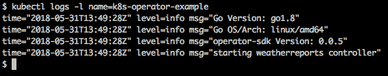

1.  部署自定义资源定义和自定义控制器后，接下来是创建一些资源并收集结果。按照以下方式创建一个新的`WeatherReport`实例：

```
kubectl create -f deploy/cr.yaml
```

通过其成功创建，可以检查`WeatherReport`的状态：

```
 kubectl describe weatherreport amsterdam-daily

```

你将看到以下输出：

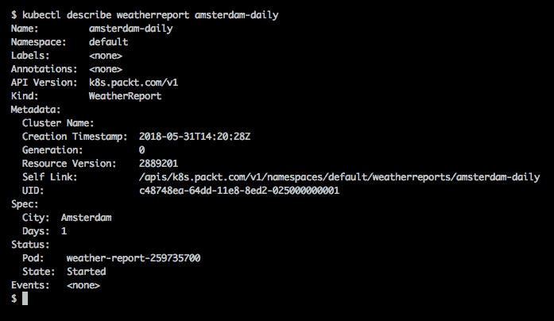

1.  由于操作符为新的天气报告创建了一个 pod，我们应该看到它的运行并收集结果：

```
kubectl get pods
```

你将看到以下结果：

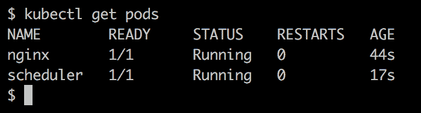

1.  使用以下命令获取天气报告的结果：

```
kubectl logs $(kubectl get weatherreport amsterdam-daily -o jsonpath={.status.pod})

```

你将看到以下输出：

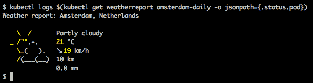

1.  使用以下命令清理：

```
kubectl delete -f deploy/cr.yaml
kubectl delete -f deploy/operator.yaml
kubectl delete -f deploy/crd.yaml

```

# Kubernetes 动态准入控制

Kubernetes API 服务器负责每个请求。API 服务器请求生命周期中的扩展点是用于动态准入控制。准入控制器是请求生命周期中最重要的阶段之一，因为它拦截并检查请求是否应该被批准。

对每个 API 请求，首先会通过身份验证和授权检查请求者。之后，准入控制器运行并决定是否批准或拒绝请求。最后，进行验证步骤，并将结果对象存储：

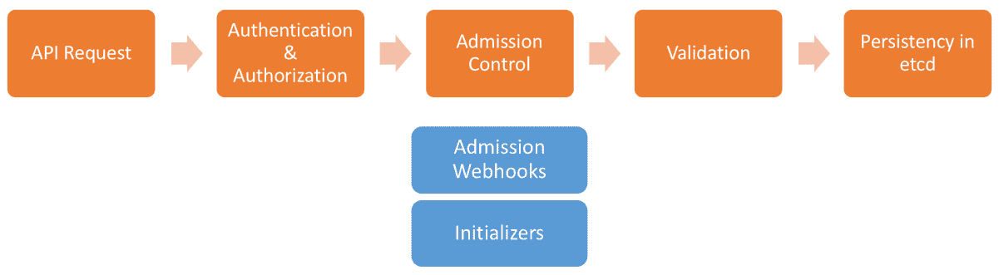

Kubernetes API 请求的生命周期

准入控制的*动态*部分源于它们可以在 Kubernetes 集群运行时动态添加、移除或更新。除了内置的准入控制器外，还有扩展准入控制器的方法：

+   用于限制集群中镜像的镜像策略 webhook

+   用于批准或拒绝创建或更新的准入 webhook

+   用于修改对象的初始化器，在对象创建之前进行更改

# 准入 Webhook

准入 webhook 是扩展点，API 服务器可以接收准入请求，然后返回接受或拒绝的响应。由于它们是 webhook，API 服务器期望收到 HTTP 请求和响应。支持两种类型的准入 webhook：

+   用于拒绝或接受 CRUD 请求的验证准入 webhook

+   用于更改请求以强制执行自定义默认值的变更准入 webhook

动态准入 Webhook 配置在运行时作为`MutatingWebhookConfiguration`或`ValidatingWebhookConfiguration`对象部署到集群中。当收到 API 请求时，API 服务器会在准入 Webhook 阶段创建必要的控制。如果为该请求定义了 Webhook 配置，准入控制器会向指定的服务器发送请求并收集响应。如果所有检查都通过，则继续进行验证和持久化步骤以处理 API 请求。

Admission Webhook 适用于所有请求类型，如创建、更新或删除，并且它们功能强大且广泛使用。然而，它们无法查询资源，因为 Webhook 不是 Kubernetes API 服务器的一部分。此外，Admission Webhook 尚未完全可用，仍在开发中。

# 初始化器

初始化器是 Kubernetes 工作流中的动态运行时元素，允许在资源实际创建之前对其进行修改。换句话说，初始化器允许开发人员干预并对资源进行任何更改，

例如部署或 Pod，并包括自定义修改逻辑，以便在 Kubernetes 资源生命周期中使用。

初始化器的一些可能使用案例如下：

+   注入侧车容器

+   注入带有证书的卷

+   防止创建违反自定义限制的资源

初始化器是动态控制器，它们在运行时通过`InitializerConfiguration`资源进行定义或移除。`InitializerConfiguration`将一组资源和初始化器结合在一起，以便当创建匹配的资源时，API 服务器将相应的初始化器添加到资源定义中。

初始化器的列表保存在`metadata.initializers.pending`字段中。另一方面，初始化器始终在监视新的资源，以便它们可以对对象实现自定义逻辑。当*Initializer X*在第一个位置，即`metadata.initializers.pending[0]`时，*Initializer X*获取资源和修改器。然后，它将自己，*Initializer X*，从`metadata.initializers.pending`列表中移除，以便下一个初始化器可以工作。当所有初始化器完成其操作并且列表为空时，资源被释放并继续创建生命周期。

初始化器易于开发，并且是扩展准入控制机制的极其灵活的方式。然而，初始化器的正常运行时间至关重要，因为它们会阻塞 API 服务器。此外，初始化器尚未完全可用，仍在开发中。

# 扩展 Kubernetes 调度器

Pod 是 Kubernetes 调度运行在节点上的基本工作单元。默认情况下，Kubernetes 具有内置调度器，它通过确保有足够的空闲资源来尽量均匀地将 Pod 分配到节点上。针对可扩展和可靠的云原生应用的自定义需求，有一些使用场景需要配置和扩展 Kubernetes 的调度器行为：

+   在专用硬件上运行特定的 Pod。

+   将一些 Pod 与交互服务共同部署。

+   将一些节点专门分配给特定用户。

调度器定制和扩展模式，从基础到复杂，列举如下：

+   分配节点标签并使用节点选择器。

+   使用亲和性和反亲和性规则。

+   为节点标记污点，并为 Pod 配置容忍度。

+   创建和部署自定义调度算法。

# 节点标签。

调度的基本概念是基于 Kubernetes 中节点的标签。内置调度器以及任何自定义调度器都需要根据节点的标签来检查节点的规格。基于这一概念，存在一些

集成的节点标签，例如以下标签：

```
kubernetes.io/hostname
failure-domain.beta.kubernetes.io/zone
failure-domain.beta.kubernetes.io/region
beta.kubernetes.io/instance-type
beta.kubernetes.io/os
beta.kubernetes.io/arch 
```

这些标签及其值由云服务提供商分配，但请注意，标签值尚未标准化。对于 Minikube，只有一个主节点，可以通过以下命令检查其标签：

```
$ kubectl get nodes --show-labels
NAME STATUS ROLES AGE VERSION LABELS
minikube Ready master 9m v1.10.0 beta.
kubernetes.io/arch=amd64,beta.kubernetes.io/os=linux,kubernetes.
io/hostname=minikube, node-role.kubernetes.io/master=
```

如上所述，主机名为`minikube`的节点，其架构为 amd64，操作系统为`linux`，并且`node-role`为`master`。

# 节点选择器。

节点选择器是可以与 Kubernetes 调度器一起使用的最简单的约束条件。节点选择器是 Pod 规格的一部分，它们是键值对映射。节点选择器的键需要与节点标签匹配。

这些值是调度器的约束条件。

它们包含在 Pod 规格中，如下所示：

```
apiVersion: v1
kind: Pod
metadata:
  name: nginx
spec:
  containers:
  - name: nginx
    image: nginx
nodeSelector:
 beta.kubernetes.io/arch: amd64
```

使用该 Pod 定义后，Kubernetes 调度器会限制将 Pod `nginx`分配给架构为`amd64`的节点。如果没有符合约束的节点，Pod 将处于 Pending 状态，直到有满足条件的节点出现。

限制加入集群。

# 节点亲和性。

节点亲和性是比`nodeSelector`更具表现力的节点选择器规范，它包含了两组约束条件：

+   `requiredDuringSchedulingIgnoredDuringExecution`：这组约束表示在调度 Pod 到节点之前必须满足的条件。这组约束类似于`nodeSelector`，但是它支持更灵活的定义。

+   `preferredDuringSchedulingIgnoredDuringExecution`：这组约束表示在调度时优先考虑的条件，但不保证满足。

简而言之，第一组包含了调度器的硬性限制，而第二组则包含了软性限制。`IgnoredDuringExecution`部分表示，如果标签在运行时发生变化且约束未满足，调度器将不做任何更改。

使用这些节点亲和性规则，可以轻松定义复杂的规则以限制调度器。例如，在下面的 pod 定义中，使用 `requiredDuringSchedulingIgnoredDuringExecution` 组，pods 被限制仅在 PowerPC 环境中运行。此外，使用 `preferredDuringSchedulingIgnoredDuringExecution` 组时，pods 会尽可能尝试在可用区 A 的节点上运行：

```
apiVersion: v1
...
   requiredDuringSchedulingIgnoredDuringExecution:
...
spec:
  affinity:
        - key: kubernetes.io/arch
          operator: In
          values:
          - ppc64_le
preferredDuringSchedulingIgnoredDuringExecution:
- weight: 1
preference:
matchExpressions:
- key: failure-domain.beta.kubernetes.io/zone
  operator: In
  values:
  - availability-zone-a

```

# Pod 亲和性

上一节中的节点亲和性规则定义了 pod 和节点的分配关系。它们描述了一组限制条件，要求 pods 只能在一组节点上运行。采用相同的方法，Pod 间亲和性和反亲和性规则可以根据其他 pods 定义约束。例如，使用 pod 亲和性规则时，pods 可以在有限的节点集上一起调度。同样，使用 pod 反亲和性规则时，pods 可以基于特定的拓扑键（例如，节点）相互排斥。对于 pod 亲和性，可以使用 `requiredDuringSchedulingIgnoredDuringExecution` 和 `preferredDuringSchedulingIgnoredDuringExecution` 定义硬性和软性限制。

在以下 pod 定义中，pod 亲和性确保 pods 仅在同一可用区的节点上运行，即具有 `service=backend` 标签的 pods。换句话说，亲和性规则会尽量确保我们的 pod 被调度到同一可用区，与后端服务一起运行，因为它们正在相互交互。使用 pod 反亲和性时，调度器将尽量避免在已经运行 `service=backend` 标签的节点上运行 pods。换句话说，若可能，它们将不会与后端服务调度到相同节点，以避免单点故障的出现：

```
apiVersion: v1
...
    podAffinity:
 requiredDuringSchedulingIgnoredDuringExecution:
...
spec:
  affinity:
         - key: service
           operator: In
           values:
          - backend
        topologyKey: failure-domain.beta.kubernetes.io/zone podAntiAffinity:
        preferredDuringSchedulingIgnoredDuringExecution:
          - key: service
            operator: In
            values:
           - backend
          topologyKey: kubernetes.io/hostname
```

# 污点和容忍

亲和性规则为调度器定义了约束条件，使其能够将 pods 调度到合适的节点上。另一方面，Kubernetes 提供了一种通过污点和容忍从节点的角度拒绝 pods 的方式。污点和容忍协同工作，以确保一组 pods 不会被调度到一组节点上。污点应用于节点，用于拒绝某些 pods，而容忍则允许 pod 在某些节点上接受调度。

污点为节点打上标签，标记为“不可调度”。例如，使用以下命令，除非为键和值定义了匹配的容忍，否则不会将任何 pods 调度到 `nodeA`：

```
kubectl taint nodes nodeA key=value:NoSchedule
```

容忍为 pods 打上标签，以确保污点不会应用到这些 pods。例如，在 pod 规范中使用以下容忍，前面的污点将不会被应用：

```
apiVersion: v1
kind: Pod
metadata:
  name: with-pod-toleration
spec:
  tolerations:
  - key: "key"
    operator: "Equal"
    value: "value"
    effect: "NoSchedule"
containers:
- name: with-pod-toleration
  image: k8s.gcr.io/pause:2.0
```

容忍和污点协同工作，使节点可以带有某些用户组或特定标签，容忍则可以在 pod 定义中为以下使用场景定义：

+   专用节点

+   带有特殊硬件的节点

+   基于污点的驱逐行为，以应对节点故障

# 自定义调度器开发

Kubernetes 调度器可以通过节点选择器、节点亲和性、pod 亲和性、污点和容忍规则进行高度配置。在有自定义调度需求的情况下，也可以开发并部署自定义调度器。

Kubernetes 集群。Kubernetes 默认支持运行多个调度器。Kubernetes 中的自定义调度器可以使用任何编程语言开发。然而，由于它将与 Kubernetes API 广泛交互，通常使用具有 Kubernetes 客户端库的编程语言：

通常使用具有 Kubernetes 客户端库的编程语言：

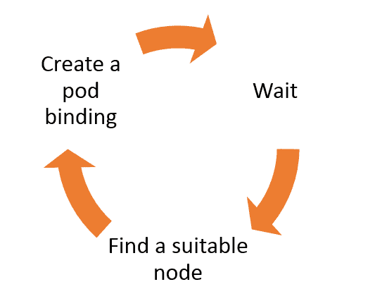

调度器的基本工作流可以分为三个主要的连续阶段。调度器等待具有特定调度器名称且未分配节点的 pod。当找到这样的 pod 时，调度器运行其自定义算法以找到合适的节点。最后，调度器创建一个绑定，它是 Kubernetes 中 pod 的内置子资源。

使用 Go 实现的自定义调度器位于 `k8s-scheduler-example/main.go` 文件中，以下代码片段将 *等待*、*查找合适的节点* 和 *创建 pod 绑定* 阶段组合在一起：

```
 for {
     // Request pods from all namespaces
     pods, err := clientset.CoreV1().Pods(v1.NamespaceAll).List(metav1.ListOptions{})
  ...
     // Check for pods
for _, pod := range pods.Items {
    // If scheduler name is set and node is not assigned
    if pod.Spec.SchedulerName == *schedulerName && pod.Spec.
    NodeName == "" {
      // Schedule the pod to a random node
      err := schedule(pod.Name, randomNode(), pod.Namespace)
      ...
    }
  }
     ...
} 
```

以下代码片段中的 `schedule` 函数用于在 pod 和节点之间创建绑定。`Bind` 方法在函数的最后一行调用，它位于 `clientset` 中的 pod 下，因为它是 pod 的一个子资源：

```
func schedule(pod, node, namespace string) error {
   fmt.Printf("Assigning %s/%s to %s\n", namespace, pod, node)
   // Create a binding with pod and node
   binding := v1.Binding{
      ObjectMeta: metav1.ObjectMeta{
         Name: pod,
      },
      Target: v1.ObjectReference{
         Kind: "Node",
         APIVersion: "v1",
         Name: node,
      }}
return clientset.CoreV1().Pods(namespace).Bind(&binding)
}
```

这个自定义调度器会将节点随机分配给名为 `packt-scheduler` 的 pod。构建文件和文档已在 `k8s-scheduler-example` 文件夹下提供，并准备好部署到集群中。在接下来的部分中，将介绍在 Kubernetes 集群中部署和使用多个调度器。

# 部署并使用自定义 Kubernetes 调度器

假设有一个客户端拥有一个 Kubernetes 集群，并需要为带有预定义标签的 pod 配置一个额外的调度器。新的调度器应与内置调度器并行工作，并且需要部署到集群中。我们将部署并使用一个自定义的 Kubernetes 调度器，并检查调度器在集群中的工作情况。在部署 Kubernetes 调度器之前，需要确保完成以下步骤：

+   使用本练习中的随机分配调度器。

+   调度器容器已经存在于 Docker hub 上：`onuryilmaz/k8sscheduler-example`。

+   使用 `packt-scheduler` 作为自定义调度器名称。

+   如果自定义调度器未运行，则显示 pod 的状态。

你可以在以下链接找到 `pod.yaml` 文件：[`goo.gl/aCRppt`](https://goo.gl/aCRppt)。

让我们从实现开始：

1.  创建一个使用自定义调度器名称的 pod，名称定义为 `packt-scheduler`：

```
kubectl apply -f k8s-scheduler-example/deploy/pod.yaml
```

部署 pod 后，可以检查其状态：

```
kubectl get pods 
```

你应该看到以下输出：

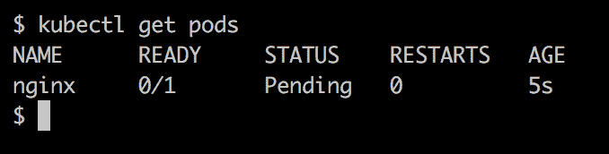

由于没有名为 `packt-scheduler` 的调度器部署到集群中，因此其状态将永远停留在 `Pending`。

1.  使用以下命令将调度器部署到集群中：

```
kubectl apply -f k8s-scheduler-example/deploy/scheduler.yaml 
```

您可以在以下地址找到 `scheduler.yaml` 文件：[`goo.gl/AaSu8o`](https://goo.gl/AaSu8o)。

1.  使用以下命令检查 Pods：

```
kubectl get pods

```

您将获得以下输出：


如前所示，调度器在一个 Pod 中运行，并且此前处于 Pending 状态的 `nginx` Pod，现在已经显示为 `Running` 状态。

1.  此外，请检查调度器的日志：

```
 kubectl logs scheduler

```

您将获得以下输出：

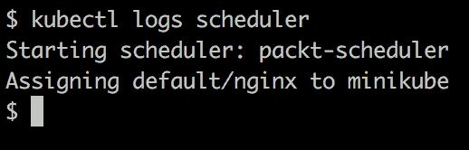

1.  使用以下命令进行清理：

```
kubectl delete -f k8s-scheduler-example/deploy/pod.yaml
kubectl delete -f k8s-scheduler-example/deploy/scheduler.yaml

```

# 扩展 Kubernetes 基础设施

Kubernetes 集群运行在实际的裸金属集群上，并与运行在服务器上的基础设施系统进行交互。基础设施的扩展点仍处于设计阶段，尚不成熟，无法进行标准化。然而，它们可以按如下方式分组：

+   **服务器**：Kubernetes 节点组件与 Docker 等容器运行时进行交互。目前，Kubernetes 被设计为可以与任何实现 **容器运行时接口** (**CRI**) 规范的容器运行时一起工作。CRI 包括库、协议缓冲区和 gRPC API，用于定义 Kubernetes 与容器环境之间的交互。

+   **网络**：Kubernetes 和容器架构需要高性能的网络，且与容器运行时解耦。容器与网络接口之间的连接通过 **容器网络接口** (**CNI**) 的抽象进行定义。CNI 包含一组接口，用于将容器添加到或从 Kubernetes 网络中移除。

+   **存储**：Kubernetes 资源的存储由与云提供商或主机系统通信的存储插件提供。例如，运行在 AWS 上的 Kubernetes 集群可以轻松地从 AWS 获取存储并附加到其有状态集合。包括存储提供和在容器运行时中消费的操作在 **容器存储接口** (**CSI**) 下进行了标准化。在 Kubernetes 中，任何实现 CSI 的存储插件都可以作为存储提供者使用。

Kubernetes 的基础设施可以扩展，以便与实现 CRI 的服务器、符合 CNI 的网络提供商和实现 CSI 的存储提供商一起工作。

# 总结

本章讨论了扩展 Kubernetes，我们启用了将领域知识转化为自动化并介入 Kubernetes 操作的能力。首先，介绍了 Kubernetes 中的扩展点，展示了其内置的扩展功能。

功能。在本章中，Kubernetes API 添加了新的资源，并自动化了它们的操作，以便 Kubernetes 除了支持内置资源外，还能为自定义资源提供服务。接着，资源创建逻辑通过动态准入控制器进行了扩展，展示了如何将操作要求纳入 Kubernetes API 资源生命周期。

最后，展示了 Kubernetes 调度器的配置，涵盖了所有广泛的

节点和 Pod 之间关系的要求。如何编写、部署和使用自定义调度器也有展示。通过本章中包含的扩展功能，可以将 Kubernetes 用作容器编排器，不仅如此，还可以作为一个

平台，能够处理云原生应用程序的所有自定义需求。

本书介绍了 Kubernetes 设计模式和扩展，从其基础到在云原生微服务架构中的实现。首先，在第一章中，涵盖了 Kubernetes 的最佳实践。设计模式及其在 Kubernetes 云原生架构中的反映得到了说明，以便创建最佳实践知识。在第二章中，展示了如何以编程方式连接到 Kubernetes。关于客户端库的实操活动旨在为与 Kubernetes 通信的应用程序做好准备。这些 Kubernetes API 消费应用程序将帮助你与 Kubernetes 深度互动，实现比普通 Kubernetes 用户更多的功能。最后一章，讲解了 Kubernetes 的扩展点。Kubernetes 扩展点使得将领域专长转化为自动化并介入 Kubernetes 操作成为可能。通过本章中包含的扩展能力，可以将 Kubernetes 用作容器编排器，不仅如此，还可以作为一个平台，能够处理云原生应用程序复杂的需求。
