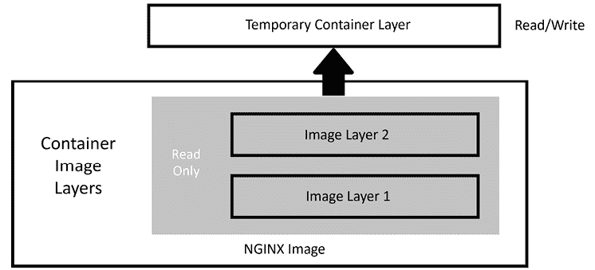

# 第一章：Docker 和容器基础

**容器**已经成为一项极受欢迎且具有重大影响的技术，给传统应用带来了显著变化。从科技公司到大型企业再到终端用户，每个人都广泛采用容器来处理日常任务。值得注意的是，传统的安装现成商业应用的方法正逐渐转变为完全容器化的配置。考虑到这一技术变革的巨大规模，信息技术领域的从业者必须掌握并理解容器的概念。

本章将概述容器旨在解决的问题。我们将从强调容器的重要性开始。然后，我们将介绍 **Docker**，这一在容器化兴起过程中发挥了关键作用的运行时，并讨论它与 **Kubernetes** 的关系。

本章旨在帮助你理解如何在 Docker 中运行容器。你可能听过一个常见问题：“Docker 和 Kubernetes 之间有什么关系？”好吧，在今天的世界里，Docker 完全与 Kubernetes 无关——你不需要 Docker 来运行 Kubernetes，也不需要它来创建容器。本章讨论 Docker，旨在提供让你在本地运行容器并在部署到 Kubernetes 集群之前测试镜像的技能。

到本章结束时，你将清楚地理解如何安装 Docker，以及如何有效使用常用的 **Docker 命令行界面**（**CLI**）命令。

本章将涵盖以下主要内容：

+   理解容器化的需求

+   理解为什么 Kubernetes 移除了 Docker

+   理解 Docker

+   安装 Docker

+   使用 Docker CLI

# 技术要求

本章有以下技术要求：

+   一台运行 Docker 的 Ubuntu 22.04+ 服务器，至少 4 GB 的内存，建议 8 GB。

+   来自仓库 `chapter1` 文件夹的脚本，你可以通过以下链接访问：[`github.com/PacktPublishing/Kubernetes-An-Enterprise-Guide-Third-Edition`](https://github.com/PacktPublishing/Kubernetes-An-Enterprise-Guide-Third-Edition)

# 理解容器化的需求

你可能在办公室或学校经历过这样的对话：

**开发者**：“*这是新应用程序。它经过了几周的测试，你是第一个获得新版本的人。*”

….. 一会儿后 …..

**用户**：“*它不工作。当我点击提交按钮时，显示一个关于缺少依赖项的错误。*”

**开发者**：“*这很奇怪，它在我的机器上运行得很好。*”

在部署应用程序时，遇到此类问题可能会让开发人员感到非常沮丧。这些问题通常是由于最终包中缺少开发人员自己机器上有的某个库所致。有人可能认为一个简单的解决方法是将所有库都包含在发布包中，但如果这个发布包中包含了一个更新版本的库，而这个版本替换了一个较旧版本的库，而另一个应用程序仍依赖于该旧版本的库呢？

开发人员必须仔细考虑他们的新版本及其可能与用户工作站上现有软件产生的冲突。这变成了一个微妙的平衡行为，通常需要更大的部署团队在各种系统配置上彻底测试应用程序。这种情况可能导致开发人员增加额外的工作，或者在极端情况下，使应用程序与现有应用程序完全不兼容。

多年来，已经有几个尝试简化应用程序交付的方案。一种解决方案是 VMware 的**ThinApp**，其目的是虚拟化一个应用程序（不要与虚拟化整个操作系统（OS）混淆）。它允许你将应用程序及其依赖项打包成一个可执行文件。这样，所有应用程序的依赖项都包含在包内，消除了与其他应用程序依赖项的冲突。这不仅确保了应用程序的隔离性，还增强了安全性并减少了操作系统迁移的复杂性。

你可能直到现在才接触到诸如应用程序打包或“随身应用”之类的术语，但它似乎是解决臭名昭著的“在我的机器上能运行”问题的一个不错的解决方案。然而，这种方法未能如预期那样广泛采用，也有其原因。首先，这个领域的大多数解决方案都是收费的，需要进行大量的投资。此外，它们需要一个“干净的 PC”，也就是说，每次想要虚拟化一个应用程序时，必须从一个全新的系统开始。你创建的包会捕捉基础安装和后续更改之间的差异。这些差异随后会被打包成一个分发文件，可以在任何工作站上执行。

我们提到应用程序虚拟化，是为了突出“在我的机器上能运行”之类的应用程序问题近年来有过不同的解决方案。像**ThinApp**这样的产品只是其中一种尝试。其他尝试还包括使用**Citrix**、**远程桌面**、**Linux 容器**、**chroot 监狱**，甚至是**虚拟机**来运行应用程序。

# 理解为什么 Kubernetes 移除了 Docker

Kubernetes 在版本 1.24 中移除了对 Docker 作为支持的容器运行时的所有支持。虽然它已被移除作为运行时引擎选项，但你仍然可以使用 Docker 创建新的容器，它们将能够在任何支持 **开放容器倡议**（**OCI**）规范的运行时上运行。OCI 是一套关于容器及其运行时的标准，这些标准确保了容器的可移植性，无论容器平台或执行它们的运行时是什么。

当你使用 Docker 创建容器时，你实际上是在创建一个完全符合 **开放容器规范**（**OCI**）的容器，因此它仍然可以在运行任何与 Kubernetes 兼容的容器运行时的 Kubernetes 集群上运行。

为了全面解释影响及其支持的替代方案，我们需要了解什么是容器运行时。一个高级定义是，容器运行时是运行和管理容器的软件层。像 Kubernetes 集群中的许多组件一样，运行时并不包含在 Kubernetes 中——它是一个可插拔模块，需要由供应商或你自己提供，以创建一个功能正常的集群。

有许多技术原因导致了弃用和移除 Docker 的决定，但从高层次来看，主要的担忧如下：

+   Docker 在 Docker 运行时内部包含多个组件，用于支持其自己的远程 API 和 **用户体验**（**UX**）。而 Kubernetes 只需要可执行文件中的一个组件，dockerd，它是管理容器的运行时进程。可执行文件中的所有其他组件对在 Kubernetes 集群中使用 Docker 没有任何贡献。这些额外的组件使得二进制文件臃肿，并可能导致额外的漏洞、安全性或性能问题。

+   Docker 不符合 **容器运行时接口**（**CRI**）标准，后者的引入旨在创建一套标准，以便在 Kubernetes 中轻松集成容器运行时。由于 Docker 不符合该标准，Kubernetes 团队不得不额外做很多工作，仅仅是为了支持 Docker。

在本地容器测试和开发时，你仍然可以在工作站或服务器上使用 Docker。考虑到之前的陈述，如果你在 Docker 上构建一个容器，并且该容器能够在 Docker 运行时系统上成功运行，那么它也能在不使用 Docker 作为运行时的 Kubernetes 集群上运行。

移除 Docker 对大多数新集群中的 Kubernetes 用户影响很小。容器将仍然以任何标准方式运行，就像 Docker 作为容器运行时时一样。如果你恰好管理一个集群，在排查 Kubernetes 节点问题时，你可能需要学习新的命令——因为节点上将没有 Docker 命令来查看正在运行的容器、清理卷等。

Kubernetes 支持多种替代 Docker 的运行时。以下是两个最常用的运行时：

+   containerd

+   CRI-O

虽然这两种是常用的运行时，但也有许多其他兼容的运行时可用。你可以随时在 Kubernetes 的 GitHub 页面查看最新支持的运行时，网址是 [`github.com/kubernetes/community/blob/master/contributors/devel/sig-node/container-runtime-interface.md`](https://github.com/kubernetes/community/blob/master/contributors/devel/sig-node/container-runtime-interface.md)。

关于弃用和移除 Docker 的影响的更多细节，请参考 Kubernetes.io 网站上的文章 *Don’t Panic: Kubernetes and Docker*，网址是 [`kubernetes.io/blog/2020/12/02/dont-panic-kubernetes-and-docker/`](https://kubernetes.io/blog/2020/12/02/dont-panic-kubernetes-and-docker/)。

## 引入 Docker

无论是行业还是最终用户，都在寻求一个既方便又实惠的解决方案，这就是**Docker**容器的出现。虽然容器在不同的时间以不同方式被使用，但 Docker 通过为普通用户和开发者提供运行时和工具，带来了变革。

Docker 为大众带来了一个抽象层，它易于使用，不需要为每个应用程序创建包时都清理 PC，从而解决了依赖性问题，但最吸引人的一点是，它是免费的。Docker 成为 GitHub 上许多项目的标准，团队通常会创建一个 Docker 容器，并将 Docker 镜像或 Dockerfile 分发给团队成员，提供标准的测试或开发环境。这种最终被最终用户接受的方式，促使 Docker 进入企业，并最终使其成为今天的标准。

在本书的范围内，我们将重点关注在尝试使用本地 Kubernetes 环境时需要了解的内容。Docker 具有悠久而有趣的发展历史，如何演变成今天我们使用的标准容器镜像格式。我们鼓励你了解这家公司，以及他们如何引领我们今天所知道的容器世界。

虽然我们的重点不是从头到尾教授 Docker，但我们认为对于那些 Docker 新手来说，快速了解一般容器概念会带来帮助。

如果你有一些 Docker 经验，并且理解像是短暂（ephemeral）和无状态（stateless）这样的术语，你可以跳到*安装 Docker*部分。

## Docker 与 Moby

当 Docker 运行时被开发时，它是一个单一的代码库。这个单一的代码库包含了 Docker 提供的所有功能，无论你是否使用过它们。这导致了效率低下，并开始阻碍 Docker 和容器的整体发展。

下表显示了 Docker 和 Moby 项目的区别。

| **功能** | **Docker** | **Moby** |
| --- | --- | --- |
| 开发 | 主要贡献者是 Docker，并有一些社区支持 | 它是开源软件，拥有强大的社区开发和支持 |
| 项目范围 | 包括构建和运行容器所需的所有组件的完整平台 | 它是一个模块化平台，用于构建基于容器的组件和解决方案 |
| 所有权 | 这是一个由 Docker, Inc. 提供的品牌产品 | 它是一个开源项目，用于构建各种容器解决方案 |
| 配置 | 包含完整的默认配置，使用户能够快速使用 | 提供更多可用的自定义选项，帮助用户满足特定需求 |
| 商业支持 | 提供完整支持，包括企业级支持 | 作为开源软件提供；Moby 项目不直接提供支持 |

表格 1.1：Docker 与 Moby 的功能对比

总结一下——**Moby** 是一个由 Docker 启动的项目，但它不是完整的 Docker 运行时。Docker 运行时使用来自 Moby 的组件来创建 Docker 运行时，其中包含 Moby 的开源组件和 Docker 自身的开源组件。

现在，让我们更进一步了解 Docker，看看你如何使用它来创建和管理容器。

# 理解 Docker

本书假设你已经具备了 Docker 和容器概念的基础理解。然而，我们知道并非每个人都拥有 Docker 或容器的使用经验。因此，我们在书中加入了这部分速成课程，旨在向你介绍容器概念，并指导你如何使用 Docker。

如果你是容器新手，我们建议你阅读 Docker 网站上的文档，获取更多信息：[`docs.docker.com/`](https://docs.docker.com/)。

## 容器是短暂的

首先需要理解的是，容器是短暂的（暂时存在的）。

“短暂”（ephemeral）一词指的是存在时间较短的事物。**容器**可以被故意终止，或者在没有用户干预或后果的情况下自动重新启动。为了更好地理解这个概念，我们来看一个例子——假设某人在容器中运行的网页服务器上交互式地添加了文件。这些上传的文件是临时的，因为它们最初并不属于基础镜像的一部分。

这意味着一旦容器被构建并运行，任何对容器所做的更改都不会在容器被移除或销毁后保存。让我们来看一个完整的示例：

1.  你在主机上启动一个运行 **NGINX** 的容器，但没有任何基础的 **HTML** 页面。

1.  使用 Docker 命令，你执行 `copy` 命令将一些网页文件复制到容器的文件系统中。

1.  为了验证复制是否成功，你访问网站并确认它是否提供正确的网页。

1.  满意结果后，你停止容器并将其从主机中移除。当天稍晚，你想向同事展示网站，便启动了 **NGINX** 容器。你再次访问网站，但当页面打开时，收到 `404` 错误（页面未找到错误）。

你在停止并从主机上移除容器之前上传的文件去哪了？

你在容器重启后找不到网页的原因是所有容器都是临时性的。每次容器首次启动时，基础容器镜像中的内容就是唯一会被包含的内容。你在容器内部所做的任何更改都是短暂的。

如果你需要向现有镜像添加永久文件，你需要重新构建镜像并将文件包含其中，或者正如我们将在本章稍后的*持久化数据*部分中解释的，你可以在容器中挂载一个 Docker 卷。

在这一点上，主要的概念是容器是**临时的**。

等等！你可能会想，“如果容器是临时的，那我怎么把网页添加到服务器中？”**临时**只是意味着更改不会被保存；它并不阻止你对运行中的容器进行更改。

对运行中的容器所做的任何更改都会写入一个临时层，这个层被称为**容器层**，它是本地文件系统上的一个目录。Docker 使用**存储驱动程序**，负责处理使用容器层的请求。存储驱动程序负责在 Docker 主机上管理和存储镜像及容器。它控制与存储和管理它们相关的机制和过程。

这个位置将存储容器文件系统中的所有更改，因此，当你将 HTML 页面添加到容器时，它们会存储在本地主机上。容器层与运行镜像的**容器 ID**绑定，并且它会一直保留在主机系统上，直到容器从 Docker 中移除，无论是通过 CLI 命令还是运行 Docker **清理任务**（参见下一页的*图 1.1*）。

考虑到容器是临时的并且是只读的，你可能会好奇，如何在容器内部修改数据。Docker 通过利用**镜像层叠**来解决这个问题，镜像层叠涉及创建相互连接的层，这些层共同作为一个单一的文件系统。通过这种方式，可以对容器的数据进行更改，即使底层镜像保持**不可变**。

## Docker 镜像

一个 Docker 镜像由多个镜像层组成，每个镜像层都附带一个**JavaScript 对象表示法**（**JSON**）文件，用于存储该层特定的元数据。当启动容器镜像时，这些层会被组合成用户交互的应用程序。

你可以在 Docker 的 GitHub 上查看更多关于镜像内容的信息，链接：[`github.com/moby/moby/blob/master/image/spec/v1.1.md`](https://github.com/moby/moby/blob/master/image/spec/v1.1.md)。

## 镜像层

正如我们在前一部分中提到的，运行中的容器使用一个位于基础**镜像层**“之上”的**容器层**，如下图所示：



图 1.1：Docker 镜像层

镜像层是只读状态，不能写入，但临时容器层是可写的。你添加到容器中的任何数据都会存储在这个层中，并且只要容器在运行，这些数据就会被保留。

为了高效地处理多个层次，Docker 实现了**写时复制**（copy-on-write），这意味着如果文件已经存在，它不会被重新创建。然而，如果当前镜像中不存在某个需要的文件，它将会被写入。在容器世界中，如果某个文件存在于较低的层次，位于它之上的层次就不需要再次包含这个文件。例如，如果第一层包含一个名为`/opt/nginx/index.xhtml`的文件，那么第二层就不需要在它的层次中包含相同的文件。

这解释了系统如何处理已存在或不存在的文件，但如果文件被修改了怎么办？有时你需要替换较低层次中的文件。你可能在构建镜像时需要这么做，或者作为临时修复正在运行的容器问题。写时复制系统知道如何处理这些问题。由于镜像是从上到下读取的，容器只会使用最上层的文件。如果你的系统在第一层有一个`/opt/nginx/index.xhtml`文件，并且你修改并保存了该文件，那么运行中的容器会将新文件保存在容器层中。由于容器层是最上层，新版本的`index.xhtml`会始终在镜像层中的旧版本之前被读取。

## 持久数据

仅限于临时容器会极大限制 Docker 的使用场景。你可能会遇到需要持久存储的情况，或者即使容器停止运行也必须保留数据。

记住，当你将数据存储在容器镜像层时，基础镜像本身并不会改变。当容器从主机中删除时，容器层也会被删除。如果使用相同的镜像启动新容器，则会创建一个新的容器镜像层。虽然容器本身是临时的，但你可以通过结合 Docker 卷来实现数据持久化。通过使用**Docker 卷**，数据可以存储在容器外部，使其能够在容器生命周期之外持久存在。

## 访问运行在容器中的服务

与物理机器或虚拟机不同，容器不会直接连接到网络。当容器需要发送或接收流量时，它会通过 Docker 主机系统使用桥接的**网络地址转换**（**NAT**）连接。这意味着当你运行容器并希望接收传入的流量请求时，你需要为每个希望接收流量的容器暴露端口。在基于 Linux 的系统中，`iptables` 有规则将流量转发到 Docker 守护进程，后者将为每个容器分配的端口提供服务。你无需担心 `iptables` 规则是如何创建的，因为 Docker 会在启动容器时通过使用提供的端口信息来为你处理。如果你是 Linux 新手，`iptables` 可能对你来说是一个新概念。

从高层次来看，`iptables` 用于管理网络流量并确保集群内的安全。它控制集群中各个组件之间的网络连接流向，决定哪些连接被允许，哪些被阻止。

这部分内容介绍了容器基础知识和 Docker 概念。在下一部分，我们将引导你完成在主机上安装 Docker 的过程。

# 安装 Docker

本书中的动手练习要求你拥有一个正常工作的 Docker 主机。为了安装 Docker，我们在本书的 GitHub 仓库中包含了一个脚本，该脚本位于 `chapter1` 目录下，名为 `install-docker.sh`。

今天，你可以在几乎所有硬件平台上安装 Docker。每个版本的 Docker 在不同平台上的表现和外观都是一致的，这使得开发跨平台应用程序变得更加容易。通过确保不同平台之间的功能和命令相同，开发者无需学习不同的容器运行时来运行镜像。

以下是 Docker 可用平台的表格。如你所见，有多个操作系统的安装版本，以及多种架构：

| **桌面平台** | **x86_64/amd64** | **arm64 (Apple Silicon)** |
| --- | --- | --- |
| Docker Desktop (Linux) |  |  |
| Docker Desktop (macOS) |  |  |
| Docker Desktop (Windows) |  |  |
| **服务器平台** | **x86_64/amd64** | **arm64/aarch64** | **arm (32-bit)** | **ppcc64le** | **s390x** |
| CentOS |  |  |  |  |  |
| Debian |  |  |  |  |  |
| Fedora |  |  |  |  |  |
| Raspberry Pi OS |  |  |  |  |  |
| RHEL (s390) |  |  |  |  |  |
| SLES |  |  |  |  |  |
| Ubuntu |  |  |  |  |  |

表 1.2：可用的 Docker 平台

使用单一架构创建的镜像不能在不同架构上运行。这意味着你不能基于 x86 硬件创建一个镜像，并期望它能够在运行 ARM 处理器的 Raspberry Pi 上运行。同样需要注意的是，虽然你可以在 Windows 机器上运行 Linux 容器，但无法在 Linux 机器上运行 Windows 容器。

虽然镜像默认情况下不具备跨架构兼容性，但现在有新的工具可以创建所谓的多平台镜像。多平台镜像是可以在不同架构或处理器上使用的镜像，这样你就不需要为**NGINX**在 x86 架构、为**ARM**架构、以及为**PowerPC**架构分别创建多个镜像，而是可以在一个容器中使用多个架构的镜像。这将帮助你简化容器化应用程序的管理和部署。由于多平台镜像包含不同架构的多个版本，因此在部署镜像时需要指定架构。幸运的是，容器运行时会自动从镜像清单中选择正确的架构。

使用多平台镜像可以为你的容器提供跨云平台、边缘部署和混合基础设施的可移植性、灵活性和可扩展性。随着行业中基于 ARM 的服务器的使用不断增长，以及学习 Kubernetes 的人们广泛使用 Raspberry Pi，跨平台镜像将有助于加快容器的使用，并使其更加容易。

例如，在 2020 年，苹果发布了 M1 芯片，结束了苹果使用英特尔处理器的时代，转而使用 ARM 处理器。我们不打算深入讨论它们之间的差异，只要知道它们是不同的，而这为容器开发人员和用户带来了重要的挑战。Docker 确实有**Docker Desktop**，这是一款 macOS 工具，允许你使用与 Linux、Windows 或 x86 macOS 上 Docker 安装相同的工作流来运行容器。Docker 会尝试在拉取或构建镜像时匹配底层主机的架构。在基于 ARM 的系统上，如果你尝试拉取没有 ARM 版本的镜像，Docker 会因架构不兼容而抛出错误。如果你尝试构建一个镜像，它将在 macOS 上构建一个 ARM 版本，但这个版本不能在 x86 机器上运行。

创建多平台镜像可能比较复杂。如果你想了解更多关于创建多平台镜像的细节，可以访问 Docker 官网的*多平台* *镜像*页面：[`docs.docker.com/build/building/multi-platform/`](https://docs.docker.com/build/building/multi-platform/)。

安装 Docker 的过程在不同平台之间有所不同。幸运的是，Docker 在其官网上记录了许多安装方法：[`docs.docker.com/install/`](https://docs.docker.com/install/)。

本章将指导你在 **Ubuntu 22.04** 系统上安装 Docker。如果你没有 Ubuntu 机器进行安装，仍然可以阅读安装步骤，因为每个步骤都会详细解释，并且不需要实际系统就能理解整个过程。如果你使用的是其他 Linux 发行版，可以参考 Docker 官网提供的安装步骤：[`docs.docker.com/`](https://docs.docker.com/)。官网为 CentOS、Debian、Fedora 和 Ubuntu 提供了具体步骤，并为其他 Linux 发行版提供了通用步骤。

## 准备安装 Docker

现在我们已经介绍了 Docker，下一步是选择安装方法。Docker 的安装方式不仅在不同的 Linux 发行版之间有所不同，甚至同一 Linux 发行版的不同版本也会有所变化。我们的脚本基于使用 Ubuntu 22.04 服务器，因此在其他版本的 Ubuntu 上可能无法使用。你可以通过以下两种方法之一来安装 Docker：

+   将 Docker 仓库添加到主机系统

+   使用 Docker 脚本进行安装

第一个选项被认为是最佳选择，因为它便于安装和更新 Docker 引擎。第二个选项旨在用于测试/开发环境的 Docker 安装，不建议在生产环境中部署。

由于首选方法是将 Docker 仓库添加到主机中，我们将选择此选项。

## 在 Ubuntu 上安装 Docker

现在我们已经添加了所需的仓库，下一步是安装 Docker。

我们在 Git 仓库的 `chapter1` 文件夹中提供了一个名为 `install`-`docker.sh` 的脚本。当你执行此脚本时，它将自动安装运行 Docker 所需的所有必要二进制文件。

简要概述一下脚本，它首先会修改 `/etc/needrestart/needrestart.conf` 文件中的特定值。在 Ubuntu 22.04 中，守护进程的重启方式发生了变化，用户可能需要手动选择哪些系统守护进程需要重启。为了简化本书中描述的操作，我们将 `needsrestart.conf` 文件中的 `restart` 值更改为“自动”，而不是每次提示重新启动被更改的服务。

接下来，我们安装一些实用工具，如 `vim`、`ca-certificates`、`curl` 和 `GnuPG`。前三个工具比较常见，而最后一个 `GnuPG` 可能对一些读者来说是新的，可能需要一些解释。`GnuPG` 是 **GNU 隐私保护工具**（GNU Privacy Guard）的缩写，它为 Ubuntu 提供了一系列加密功能，如 **加密**、**解密**、**数字签名** 和 **密钥管理**。

在我们的 Docker 部署中，我们需要添加 Docker 的 **GPG 公钥**，这是一个加密密钥对，用于保护通信并保持数据完整性。GPG 密钥使用非对称加密，即使用两把不同但相关的密钥，称为 **公钥** 和 **私钥**。这两把密钥一起生成，但它们执行不同的功能。私钥保持机密，用于对下载的文件生成数字签名。公钥是公开的，用于验证由私钥创建的数字签名。

接下来，我们需要将 Docker 仓库添加到我们的本地仓库列表中。当我们将仓库添加到列表时，还需要包含 Docker 证书。`docker.gpg` 证书由脚本从 Docker 网站下载，并保存在本地服务器的 `/etc/apt/keyings/docker.gpg` 路径下。当我们将仓库添加到仓库列表时，我们通过在 `/etc/apt/sources.list.d/docker.list` 文件中使用 signed-by 选项来添加该密钥。完整的命令如下所示：

```
deb [arch=amd64 signed-by=/etc/apt/keyrings/docker.gpg] https://download.docker.com/linux/ubuntu   jammy stable 
```

通过将 Docker 仓库添加到我们本地的 `apt` 仓库列表中，我们可以轻松地安装 Docker 二进制文件。此过程涉及使用简单的 `apt-get install` 命令，它将安装 Docker 所需的五个基本二进制文件：`docker-ce`、`docker-ce-cli`、`containerd.io`、`docker-buildx-plugin` 和 `docker-compose-plugin`。如前所述，所有这些文件都经过 Docker 的 GPG 密钥签名。由于服务器上已包含 Docker 的密钥，我们可以确信这些文件是安全的，并且来自可靠的来源。

一旦 Docker 成功安装，下一步是使用 `systemctl` 命令启用并配置 Docker 守护进程，以便在系统启动时自动启动。此过程遵循应用于大多数在 Linux 服务器上安装的系统守护进程的标准程序。

我们没有逐行解释每个脚本中的代码，而是在脚本中加入了注释，帮助你理解每个命令和步骤的执行方式。如果某些主题需要帮助，我们将在章节中提供部分代码供参考。

安装 Docker 后，我们来处理一些配置。首先，你在实际操作中很少以 root 身份执行命令，因此我们需要授权你的用户使用 Docker。

## 授予 Docker 权限

在默认安装中，Docker 需要 root 权限，因此你需要以 **root** 身份运行所有 Docker 命令。为了避免每次都使用 `sudo` 执行 Docker 命令，你可以将你的用户账户添加到服务器上一个新的组中，该组提供 Docker 访问权限，而无需为每个命令使用 `sudo`。

如果你以普通用户身份登录并尝试运行 Docker 命令，你将收到一个错误提示：

```
Got permission denied while trying to connect to the Docker daemon socket at unix:///var/run/docker.sock: Get http://%2Fvar%2Frun%2Fdocker.sock/v1.40/images/json: dial unix /var/run/docker.sock: connect: permission denied 
```

为了让你的用户，或你可能希望添加的其他用户，执行 Docker 命令，你需要将这些用户添加到一个名为`docker`的新组，该组是在安装 Docker 时创建的。以下是你可以使用的命令示例，将当前登录用户添加到该组：

```
sudo usermod -aG docker $USER 
```

要将新成员添加到你的账户中，你可以选择注销并重新登录 Docker 主机，或者使用`newgrp`命令激活组变更：

```
newgrp docker 
```

现在，让我们通过运行标准的`hello-world`镜像来测试 Docker 是否正常工作（请注意，我们不需要`sudo`来运行 Docker 命令）：

```
docker run hello-world 
```

你应该看到以下输出，验证你的用户有权限访问 Docker：

```
Unable to find image 'hello-world:latest' locally
latest: Pulling from library/hello-world
2db29710123e: Pull complete
Digest: sha256:37a0b92b08d4919615c3ee023f7ddb068d12b8387475d64c622ac30f45c29c51
Status: Downloaded newer image for hello-world:latest
Hello from Docker! 
```

该消息显示你的安装工作正常——恭喜！

为了生成此消息，Docker 执行了以下步骤：

1.  Docker 客户端已联系 Docker 守护进程。

1.  Docker 守护进程从 Docker Hub 拉取了`hello-world`镜像（amd64）。

1.  Docker 守护进程从镜像创建了一个新容器，并运行该可执行文件，生成你当前所看到的输出。

1.  Docker 守护进程将该输出流式传输到 Docker 客户端，客户端将其发送到你的终端。

如果你想尝试更有挑战性的操作，可以使用以下命令运行一个 Ubuntu 容器：

```
$ docker run -it ubuntu bash 
```

有关更多示例和想法，请访问[`docs.docker.com/get-started/`](https://docs.docker.com/get-started/)。

现在我们已经授予了 Docker 权限，可以开始解锁最常用的 Docker 命令，学习如何使用 Docker CLI。

# 使用 Docker CLI

当你运行`hello-world`容器测试安装时，你使用了 Docker CLI。Docker 命令是你与 Docker 守护进程交互时将使用的命令。通过这个单一的可执行文件，你可以执行以下操作，甚至更多：

+   启动和停止容器

+   拉取和推送镜像

+   在活动容器中运行一个 Shell

+   查看容器日志

+   创建 Docker 卷

+   创建 Docker 网络

+   清理旧的镜像和卷

本章并不打算详尽地解释每个 Docker 命令；相反，我们将解释一些你在与 Docker 守护进程和容器交互时需要使用的常见命令。

你可以将 Docker 命令分为两类：一般的 Docker 命令和 Docker 管理命令。标准的 Docker 命令允许你管理容器，而管理命令允许你管理 Docker 选项，如管理卷和网络。

## docker help

忘记命令的语法或选项是很常见的，Docker 对此已有考虑。如果你发现自己无法记起某个命令，随时可以依赖`docker help`命令。它会提供该命令的功能说明以及如何使用它的帮助。

## docker run

要运行容器，使用`docker run`命令并提供相应的镜像名称。但在执行`docker run`命令之前，你应该了解在启动容器时可以提供的选项。

在最简单的形式下，你可以使用的命令来运行一个 NGINX Web 服务器是 `docker run bitnami/nginx:latest`。这将启动一个运行 NGINX 的容器，并且它将在前台运行，显示容器中运行应用程序的日志。按下 *Ctrl* + *C* 将停止正在运行的容器并终止 NGINX 服务器：

```
nginx 22:52:27.42
nginx 22:52:27.42 Welcome to the Bitnami nginx container
nginx 22:52:27.43 Subscribe to project updates by watching https://github.com/bitnami/bitnami-docker-nginx
nginx 22:52:27.43 Submit issues and feature requests at https://github.com/bitnami/bitnami-docker-nginx/issues
nginx 22:52:27.44
nginx 22:52:27.44 INFO  ==> ** Starting NGINX setup **
nginx 22:52:27.49 INFO  ==> Validating settings in NGINX_* env vars
nginx 22:52:27.50 INFO  ==> Initializing NGINX
nginx 22:52:27.53 INFO  ==> ** NGINX setup finished! **
nginx 22:52:27.57 INFO  ==> ** Starting NGINX ** 
```

如你所见，当你使用 *Ctrl* + *C* 停止容器时，NGINX 也停止了。在大多数情况下，你希望容器启动并继续运行，而不处于前台，这样系统可以运行其他任务，同时容器也能继续运行。要将容器作为后台进程运行，你需要在 Docker 命令中添加 `-d` 或 `--detach` 选项，这将使容器以分离模式运行。现在，当你运行一个分离的容器时，你只会看到容器 ID，而不是交互式或附加的屏幕：

```
[root@localhost ~]# docker run -d bitnami/nginx:latest
13bdde13d0027e366a81d9a19a56c736c28feb6d8354b363ee738d2399023f80
[root@localhost ~]# 
```

默认情况下，容器启动后会被赋予一个随机名称。在我们之前的分离示例中，如果我们列出正在运行的容器，我们将看到容器被赋予了名称 `silly_keldysh`，如下所示的输出：

```
CONTAINER ID      IMAGE                      NAMES
13bdde13d002      bitnami/nginx:l 
```

如果没有为容器指定名称，当你在单个主机上运行多个容器时，很容易造成混乱。为了简化管理，你应该始终为容器指定一个名称，这样有助于更好地管理。Docker 提供了另一个选项来配合 `run` 命令使用：`--name` 选项。基于我们之前的示例，我们将容器命名为 `nginx-test`。我们的新 `docker run` 命令如下所示：

```
docker run --name nginx-test -d bitnami/nginx:latest 
```

就像运行任何分离镜像一样，这将返回容器 ID，但不会显示你指定的名称。为了验证容器是否以 `nginx-test` 的名称运行，我们可以使用 `docker ps` 命令列出容器，接下来我们将对此进行解释。

## docker ps

通常，你需要检索正在运行的容器列表或已停止的容器列表。Docker CLI 有一个名为 `ps` 的标志，它会列出所有正在运行和已停止的容器，方法是将额外的标志添加到 `ps` 命令中。输出将列出容器，包括它们的容器 ID、镜像标签、`entry` 命令、创建日期、状态、端口和容器名称。以下是当前正在运行的容器的示例：

```
CONTAINER ID   IMAGE                  COMMAND                 CREATED
13bdde13d002   bitnami/nginx:latest   "/opt/bitnami/script…"  Up 4 hours
3302f2728133   registry:2             "/entrypoint.sh /etc…"  Up 3 hours 
```

这对于你要查找的容器当前正在运行时很有帮助，但如果容器已经停止，或者更糟的是，容器未能启动然后停止了呢？你可以通过在 `docker ps` 命令中添加 `-a` 标志，查看所有容器的状态，包括以前运行过的容器。当你执行 `docker ps -a` 时，你将看到与标准 `ps` 命令相同的输出，但你会注意到列表中可能包含额外的容器。

如何判断哪些容器正在运行，哪些容器已经停止？如果你查看列表中的`STATUS`字段，正在运行的容器会显示运行时间；例如，`Up xx hours` 或 `Up xx days`。然而，如果容器因为某种原因已经停止，状态会显示容器停止的时间；例如，`Exited (0) 10 minutes ago`。

```
IMAGE                  COMMAND                  CREATED         STATUS
bitnami/nginx:latest   "/opt/bitnami/script…"   10 minutes ago  Up 10 minutes
bitnami/nginx:latest   "/opt/bitnami/script…"   12 minutes ago  Exited (0) 10 minutes ago 
```

停止的容器并不意味着运行镜像时发生了问题。有些容器可能只执行一个任务，完成后容器可能会优雅地停止。判断退出是否优雅或是否由于启动失败的一种方法是查看退出状态码。有多种退出码可以帮助你查找容器退出的原因。

| **退出码** | **描述** |
| --- | --- |
| `0` | 命令成功执行，没有任何问题。 |
| `1` | 由于意外错误，命令执行失败。 |
| `2` | 命令无法找到指定的资源或遇到类似的问题。 |
| `125` | 由于 Docker 相关错误，命令执行失败。 |
| `126` | 命令执行失败，因为 Docker 二进制文件或脚本无法执行。 |
| `127` | 命令执行失败，因为无法找到 Docker 二进制文件或脚本。 |
| `128+` | 由于特定的与 Docker 相关的错误或异常，命令执行失败。 |

表 1.3：Docker 退出码

## docker 启动和停止

你可能需要停止一个容器，因为系统资源有限，限制了你同时运行的容器数量。要停止一个正在运行的容器并释放资源，可以使用`docker stop`命令，后面跟上你要停止的容器名称或容器 ID。

如果你需要在未来某个时刻重新启动该容器进行额外的测试或开发，可以执行`docker start <name>`，这将以原始启动时的所有选项启动容器，包括任何分配的网络或卷。

## docker attach

为了排查问题或查看日志文件，可能需要与容器进行交互。连接到当前正在运行的容器的一种方法是使用`docker attach <容器 ID/名称>`命令。当你执行此操作时，你将与运行容器的活动进程建立连接。如果你连接到一个正在执行进程的容器，通常不会看到任何提示信息。事实上，很可能你会看到一个空白屏幕，直到容器开始产生并显示在屏幕上的输出。

当连接到一个容器时，你应该始终保持谨慎。很容易不小心停止正在运行的进程，从而停止容器。让我们以连接一个运行 NGINX 的 Web 服务器为例。首先，我们需要通过`docker ps`验证容器是否正在运行：

```
CONTAINER ID   IMAGE                 COMMAND                   STATUS
4a77c14a236a   nginx                 "/docker-entrypoint.…"    Up 33 seconds 
```

使用`attach`命令，我们执行`docker attach 4a77c14a236a`。

当您附加到一个进程时，您将只能与正在运行的进程交互，并且您看到的唯一输出是发送到标准输出的数据。以 NGINX 容器为例，`attach` 命令已附加到 NGINX 进程。为了展示这一点，我们将退出附加并从另一个会话中对 Web 服务器执行 `curl`。一旦我们对容器执行 `curl`，我们将看到日志输出到附加的控制台：

```
[root@astra-master manifests]# docker attach 4a77c14a236a
172.17.0.1 - - [15/Oct/2021:23:28:31 +0000] "GET / HTTP/1.1" 200 615 "-" "curl/7.61.1" "-"
172.17.0.1 - - [15/Oct/2021:23:28:33 +0000] "GET / HTTP/1.1" 200 615 "-" "curl/7.61.1" "-"
172.17.0.1 - - [15/Oct/2021:23:28:34 +0000] "GET / HTTP/1.1" 200 615 "-" "curl/7.61.1" "-"
172.17.0.1 - - [15/Oct/2021:23:28:35 +0000] "GET / HTTP/1.1" 200 615 "-" "curl/7.61.1" "-"
172.17.0.1 - - [15/Oct/2021:23:28:36 +0000] "GET / HTTP/1.1" 200 615 "-" "curl/7.61.1" "-" 
```

我们提到过，一旦你附加到容器，就需要小心。对于新手来说，可能会附加到 NGINX 镜像，假设服务器上没有发生任何事情，或者进程似乎卡住了，因此他们可能决定使用标准的 *Ctrl* + *C* 键盘命令跳出容器。这将停止容器并将他们带回 Bash 提示符，在这里他们可以运行 `docker ps` 来查看正在运行的容器：

```
root@localhost:~# docker ps
CONTAINER ID      IMAGE  COMMAND    CREATED    STATUS
root@localhost:~# 
```

NGINX 容器发生了什么？我们没有执行 `docker stop` 命令，而容器一直在运行，直到我们附加到容器。为什么我们附加到容器后，容器会停止？

正如我们提到的，当附加到容器时，您实际上是附加到正在运行的进程上。所有键盘命令的行为就像您在一台运行 NGINX 的物理服务器上的常规 shell 中一样。这意味着，当用户使用 *Ctrl* + *C* 返回到提示符时，他们实际上停止了正在运行的 NGINX 进程。

如果我们按下 *Ctrl* + *C* 来退出容器，我们将看到一个输出，显示进程已被终止。以下输出展示了在我们的 NGINX 示例中发生的情况：

```
2023/06/27 19:38:02 [notice] 1#1: signal 2 (SIGINT) received, exiting2023/06/27 19:38:02 [notice] 31#31: exiting2023/06/27 19:38:02 [notice] 30#30: exiting2023/06/27 19:38:02 [notice] 29#29: exiting2023/06/27 19:38:02 [notice] 31#31: exit2023/06/27 19:38:02 [notice] 30#30: exit2023/06/27 19:38:02 [notice] 29#29: exit2023/06/27 19:38:02 [notice] 32#32: exiting2023/06/27 19:38:02 [notice] 32#32: exit2023/06/27 19:38:03 [notice] 1#1: signal 17 (SIGCHLD) received from 312023/06/27 19:38:03 [notice] 1#1: worker process 29 exited with code 02023/06/27 19:38:03 [notice] 1#1: worker process 31 exited with code 02023/06/27 19:38:03 [notice] 1#1: worker process 32 exited with code 02023/06/27 19:38:03 [notice] 1#1: signal 29 (SIGIO) received2023/06/27 19:38:03 [notice] 1#1: signal 17 (SIGCHLD) received from 292023/06/27 19:38:03 [notice] 1#1: signal 17 (SIGCHLD) received from 302023/06/27 19:38:03 [notice] 1#1: worker process 30 exited with code 02023/06/27 19:38:03 [notice] 1#1: exit 
```

如果容器的运行进程停止，容器也会停止，这就是为什么 `docker ps` 命令没有显示正在运行的 NGINX 容器。

要退出附加会话，而不是使用 *Ctrl* + *C* 返回到提示符，您应该使用 *Ctrl* + *P*，然后按 *Ctrl* + *Q*，这将退出容器而不停止正在运行的进程。

有一个替代 `attach` 命令的方法：`docker exec` 命令。`exec` 命令与 `attach` 命令不同，因为您需要提供要在容器中执行的进程。

## docker exec

在与正在运行的容器交互时，一个更好的选择是 `exec` 命令。与其附加到容器，您可以使用 `docker exec` 命令在容器中执行进程。您需要提供容器名称以及您想在镜像中执行的进程。当然，进程必须包含在运行的镜像中——如果镜像中没有 Bash 可执行文件，在尝试执行 Bash 时将会出现错误。

我们将再次使用 NGINX 容器作为示例。我们将使用 `docker ps` 来验证 NGINX 是否在运行，然后使用容器 ID 或名称执行进入容器的操作。命令语法是 `docker exec <options> <container name> <command>`：

```
root@localhost:~# docker exec -it nginx-test bash
I have no name!@a7c916e7411:/app$ 
```

我们包含的选项是`-it`，它告诉`exec`在交互式 TTY 会话中运行。在这里，我们希望执行的进程是 Bash。

注意到提示符的名称已经从原来的用户名和主机名发生了变化。主机名是`localhost`，而容器名称是`a7c916e7411`。你可能还注意到当前的工作目录从`~`变成了`/app`，并且提示符显示不是以 root 用户身份运行（如显示的`$`提示符）。

你可以像使用标准的**SSH**连接一样使用这个会话；你在容器中运行 Bash，并且因为我们没有附加到容器中的运行进程，*Ctrl* + *C*不会停止任何正在运行的进程。

要退出交互式会话，你只需要输入`exit`，然后按*Enter*，这将退出容器。如果你接着运行`docker ps`，你会注意到容器仍然处于运行状态。

接下来，让我们看看我们能从 Docker 日志文件中学到什么。

## docker logs

`docker logs`命令允许你使用容器名称或容器 ID 从容器中获取日志。你可以查看`ps`命令中列出的任何容器的日志，无论该容器是否正在运行或已停止。

日志文件通常是排查容器无法启动或处于退出状态的唯一方法。例如，如果你尝试运行一个镜像，镜像启动后突然停止，你可以通过查看该容器的日志来找到问题所在。

要查看容器的日志，你可以使用`docker logs <容器 ID 或名称>`命令。

要查看容器 ID 为`7967c50b260f`的容器的日志，你可以使用以下命令：

```
docker logs 7967c50b260f 
```

这将把容器的日志输出到你的屏幕上，日志内容可能非常长且冗杂。由于许多日志可能包含大量信息，你可以通过为`logs`命令添加额外选项来限制输出。下表列出了查看日志时可用的选项：

| **日志选项** | **描述** |
| --- | --- |
| `-f` | 跟踪日志输出（也可以使用`--follow`）。 |
| `--tail xx` | 从文件末尾开始显示日志输出并检索`xx`行。 |
| `--until xxx` | 显示在`xxx`时间戳之前的日志输出。`xxx`可以是时间戳，例如`2020-02-23T18:35:13`；`xxx`也可以是相对时间，例如`60m`。 |
| `--since xxx` | 显示从`xxx`时间戳之后的日志输出。`xxx`可以是时间戳，例如`2020-02-23T18:35:13`；`xxx`也可以是相对时间，例如`60m`。 |

表 1.4：日志选项

查看日志文件是你经常需要做的一个操作，由于日志文件可能非常长，了解像`tail`、`until`和`since`这样的选项可以帮助你更快地找到日志中的信息。

## docker rm

一旦你为容器指定了一个名称，除非使用`docker rm`命令删除它，否则该名称不能用于其他容器。如果你有一个名为`nginx-test`的容器，并且它已停止运行，尝试启动另一个名为`nginx-test`的容器时，Docker 守护进程会返回一个错误，提示该名称正在使用：

```
Conflict.  The container name "/nginx-test" is already in use 
```

原始的`nginx-test`容器没有运行，但守护进程知道该容器名称之前已被使用，并且它仍然存在于之前运行的容器列表中。

当你想要重用一个特定名称时，必须先删除已有的容器，然后才能用相同的名称启动一个新的容器。这种情况通常发生在容器镜像测试期间。你可能最初启动了一个容器，但遇到了应用或镜像问题。在这种情况下，你会停止容器，解决镜像或应用的问题，并希望使用相同的名称重新部署它。然而，由于之前的容器仍存在于 Docker 历史记录中，因此在重新利用该名称之前必须先将其删除。

你还可以向 Docker 命令中添加`--rm`选项，以在容器停止后自动删除镜像。

要删除`nginx-test`容器，只需执行`docker rm nginx-test`：

```
root@localhost ~:# docker rm nginx-test
nginx-test
root@localhost ~:# 
```

假设容器名称正确并且该容器未运行，你看到的唯一输出将是你已删除的镜像名称。

我们还没有讨论 Docker 卷，但当删除一个附带卷的容器时，最好在删除命令中添加`-v`选项。将`-v`选项添加到`docker rm`命令中将删除任何附加到容器的卷。

## docker pull/run

在运行`pull`时，确保指定架构。`docker`的`pull`和`run`用于拉取镜像或运行镜像。如果你尝试运行一个在 Docker 主机上尚不存在的容器，它将启动一个`pull`请求来获取该容器并运行它。

当你尝试`pull`或`run`一个容器时，Docker 会下载与主机架构兼容的容器。如果你想下载基于不同架构的镜像，可以在`build`命令中添加`--platform`标签。例如，如果你使用的是 arm64 架构的系统，并且想要拉取一个 x86 镜像，你需要将`linux/arm64`作为平台。运行`pull`时，确保指定架构：

```
root@localhost ~:# docker pull --platform=linux/amd64 ubuntu:22.04
22.04: Pulling from library/ubuntu6b851dcae6ca: Pull completeDigest: sha256:6120be6a2b7ce665d0cbddc3ce6eae60fe94637c6a66985312d1f02f63cc0bcdStatus: Downloaded newer image for ubuntu:22.04WARNING: image with reference ubuntu was found but does not match the specified platform: wanted linux/amd64, actual: linux/arm64/v8docker.io/library/ubuntu:22.04 
```

添加`--platform=linux/amd64`就是告诉 Docker 获取正确的平台。你可以对`docker run`使用相同的参数，以确保使用正确的容器镜像平台。

## docker build

与`pull`和`run`类似，Docker 会尝试基于主机架构`arm64`来构建镜像。假设你是在一个基于 arm64 的镜像系统上构建，你可以通过使用`buildx`子命令来让 Docker 创建一个 x86 镜像：

```
root@localhost ~:# docker buildx build --platform linux/amd64 --tag docker.io/mlbiam/openunison-kubernetes-operator --no-cache -f ./src/main/docker/Dockerfile . 
```

这个附加选项告诉 Docker 生成 `x86` 版本，它将在任何基于 x86 的硬件上运行。

# 总结

在本章中，你学习了 Docker 如何解决常见的开发问题，包括让人头痛的“它在我的机器上能运行”问题。我们还介绍了你在日常使用中会用到的最常用的 Docker CLI 命令。

在下一章中，我们将开始 Kubernetes 之旅，介绍 **KinD**，这是一个实用工具，提供了一种在单台工作站上运行多节点 Kubernetes 测试服务器的简便方法。

# 问题

1.  **单一** Docker 镜像可以在任何 Docker 主机上使用，无论使用什么架构。

    1.  正确

    1.  错误

答案：b

我们增加了跨平台镜像的主题

1.  Docker 用什么来将多个镜像层合并为一个单一的文件系统？

    1.  合并文件系统

    1.  NTFS 文件系统

    1.  EXT4 文件系统

    1.  联合文件系统

答案：d

1.  Kubernetes 仅与 Docker 运行时引擎兼容。

    1.  正确

    1.  错误

答案：b

1.  当你交互式编辑容器的文件系统时，变更会写入哪个层？

    1.  操作系统层

    1.  最底层

    1.  容器层

    1.  临时层

答案：c

1.  假设镜像包含所需的二进制文件，哪个 Docker 命令允许你访问正在运行的容器的 bash 提示符？

    1.  `docker shell -it <container> /bin/bash`

    1.  `docker run -it <container> /bin/bash`

    1.  `docker exec -it <container> /bin/bash`

    1.  `docker spawn -it <container> /bin/bash`

答案：c

1.  如果你使用简单的 `run` 命令启动一个容器，并且没有任何标志，而且容器被停止，Docker 守护进程将删除容器的所有痕迹。

    1.  正确

    1.  错误

答案：b

1.  哪个命令将显示所有容器的列表，包括任何已停止的容器？

    1.  `docker ps -all`

    1.  `docker ps -a`

    1.  `docker ps -list`

    1.  `docker list all`

答案：b

# 加入我们书籍的 Discord 空间

加入本书的 Discord 工作区，参加每月一次的*问我任何问题*环节，与作者们互动：

[`packt.link/K8EntGuide`](https://packt.link/K8EntGuide)


