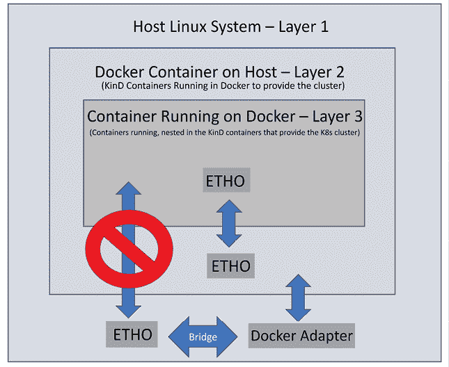

# 2

# 使用 KinD 部署 Kubernetes

和许多 IT 专业人士一样，在笔记本电脑上拥有一个 Kubernetes 集群对于展示和测试产品非常有利。在某些情况下，您可能需要运行一个具有多个节点或集群的集群，用于复杂的演示或测试，比如多集群服务网格。这些场景需要多个服务器来创建所需的集群，这也意味着需要大量的 RAM 和一个 **虚拟化管理程序** 来运行虚拟机。

要对多集群场景进行全面测试，您需要为每个集群创建多个节点。如果您使用虚拟机创建集群，您需要有足够的资源来运行多个虚拟机。每台机器都会有 **开销**，包括磁盘空间、内存和 CPU 使用率。

想象一下，如果可以仅通过容器来建立一个集群。通过使用容器代替完整的虚拟机，您可以由于减少了系统要求，从而获得运行额外节点的优势。这种方法使您可以在几分钟内使用单个命令快速创建和删除集群。此外，您还可以使用脚本来简化集群创建，甚至在一台主机上运行多个集群。

使用容器来运行 Kubernetes 集群为您提供了一个环境，这个环境对于大多数人来说，由于资源限制，用虚拟机或物理硬件部署是很困难的。幸运的是，有一个名为 **KinD**（**Kubernetes in Docker**）的工具可以实现这一目标，它允许我们在一台机器上运行 Kubernetes 集群。与 Minikube 等其他替代工具相比，KinD 更小，甚至比 K3s 更小，使其成为大多数用户在自己系统上运行的理想选择。

我们将使用 KinD 部署一个多节点集群，您将在后续章节中使用该集群来测试和部署组件，例如 Ingress 控制器、身份验证、**RBAC**（**基于角色的访问控制**）、安全策略等。

在本章中，我们将讨论以下主要主题：

+   介绍 Kubernetes 组件和对象

+   使用开发集群

+   安装 KinD

+   创建一个 KinD 集群

+   审查您的 KinD 集群

+   添加自定义负载均衡器到 Ingress

让我们开始吧！

# 技术要求

本章具有以下技术要求：

+   一台运行 Docker 的 Ubuntu 22.04+ 服务器，至少 4 GB 内存，建议使用 8 GB 内存

+   来自 `chapter2` 文件夹的脚本，可以通过访问本书的 GitHub 仓库来获得：[`github.com/PacktPublishing/Kubernetes-An-Enterprise-Guide-Third-Edition`](https://github.com/PacktPublishing/Kubernetes-An-Enterprise-Guide-Third-Edition)

我们认为必须强调的是，本章将提到各种 Kubernetes 对象，其中一些可能缺乏广泛的上下文。然而，在*第三章*，*Kubernetes Bootcamp* 中，我们将深入探讨 Kubernetes 对象，并提供许多示例命令来增强您的理解。为了确保实践学习体验，我们建议在阅读 Bootcamp 章节时拥有一个集群。

本章涵盖的大多数基本 Kubernetes 主题将在后续章节中讨论，所以如果在阅读本章后某些主题变得有些模糊，不必担心！它们将在后面的章节中详细讨论。

# 介绍 Kubernetes 组件和对象

由于本章将讨论各种常见的 Kubernetes 对象和组件，我们已经包括了一个包含每个术语简要定义的表格。这将为您提供必要的上下文，并帮助您在阅读本章时理解术语。

在*第三章*，*Kubernetes Bootcamp* 中，我们将介绍 Kubernetes 组件以及集群中包含的基本对象集。由于我们将在本模块中使用一些基本对象，因此我们在下表中提供了一些常见的 Kubernetes 组件和资源。


图 2.1：Kubernetes 组件和对象

虽然这些仅是 Kubernetes 集群中可用的一些对象，但它们是我们将在本章中讨论的对象。了解每个资源是什么，并对其功能有基本的了解，将有助于您理解本章内容。

## 与集群交互

要与集群交互，您需要使用 `kubectl` 可执行文件。我们将在*第三章*，*Kubernetes Bootcamp* 中介绍 `kubectl`，但是由于在本章中我们将使用一些命令，因此我们想提供一张包含我们将使用的基本命令的表格，并解释这些选项提供的功能：


图 2.2：基本 kubectl 命令

在本章中，您将使用这些基本命令来部署我们将在本书中使用的集群部分。

接下来，我们将介绍开发集群的概念，然后重点介绍一种最流行的用于创建开发集群的工具，KinD。

# 使用开发集群

随着时间的推移，已经开发出多种解决方案来简化开发 Kubernetes 集群的安装，从而使管理员和开发人员能够在本地系统上进行测试。虽然这些工具在基本的 Kubernetes 测试中已证明有效，但它们通常存在某些限制，使它们在更复杂的场景下表现不佳。

以下是一些最常见的解决方案：

+   Docker Desktop

+   K3s

+   KinD

+   kubeadm

+   minikube

+   Rancher Desktop

每个解决方案都有其优点、限制和使用场景。有些解决方案只允许你使用单个节点来运行控制平面和工作节点。其他解决方案虽然支持多节点，但需要额外的资源来创建多个虚拟机。根据你的开发或测试需求，这些解决方案可能无法完全满足你的需求。

要真正深入了解 Kubernetes，你需要拥有一个至少包含一个控制平面和一个工作节点的集群。你可能想要测试一些场景，比如突然移除一个工作节点，看看工作负载如何反应；在这种情况下，你需要创建一个包含一个控制平面节点和三个工作节点的集群。为了创建这些不同类型的集群，我们可以使用 Kubernetes **特别兴趣小组**（**SIG**）中的一个项目，叫做 **KinD**。

**KinD**（**Kubernetes in Docker**）提供了在单一主机上创建多个集群的能力，其中每个集群可以拥有多个控制平面和工作节点。这个特性便于进行高级测试场景，而这些场景如果使用其他解决方案的话，通常需要额外的资源分配。社区对 KinD 的反馈非常积极，从其活跃的 GitHub 社区可以看出这一点，[`github.com/kubernetes-sigs/kind`](https://github.com/kubernetes-sigs/kind) 和专门的 Slack 频道（#kind）也证明了这一点。

虽然 KinD 是一个很好的开发集群工具，但不要将 KinD 用作生产集群，也不要将 KinD 集群暴露到互联网。尽管 KinD 集群提供了你在生产集群中所需要的大多数功能，但它并**非**为生产环境设计。

## 为什么我们选择了 KinD 来编写本书？

当我们开始编写本书时，我们的目标是将理论知识与实际动手经验相结合。KinD 成为了实现这个目标的重要工具，它使我们能够编写脚本快速创建和销毁集群。尽管其他解决方案可能提供类似的功能，但 KinD 的独特之处在于它能够在几分钟内建立多节点集群。我们希望提供一个同时包含控制平面和工作节点的集群，以模拟一个更“现实”的集群环境。为了减少硬件需求并简化 Ingress 配置，我们选择将本书中的大部分练习场景限制为单一的控制平面节点和单一的工作节点。

你们中的一些人可能会问，为什么我们不使用 kubeadm 或其他工具来部署一个具有多个节点的集群，其中包括控制平面和工作节点。正如我们所说，尽管 KinD 不是为了生产环境设计，它所需要的资源更少，能够模拟一个多节点集群，使大多数读者能够在一个表现得像标准企业级 Kubernetes 集群的集群上工作。

可以在几分钟内创建一个多节点集群，测试完成后，集群可以在几秒钟内拆除。能够快速创建和销毁集群，使得 KinD 成为本书练习的完美平台。KinD 的要求非常简单：您只需要一个运行中的 Docker 守护进程即可创建集群。这意味着它与大多数操作系统兼容，包括以下：

+   Linux

+   运行 Docker Desktop 的 macOS

+   运行 Docker Desktop 的 Windows

+   运行 WSL2 的 Windows

在撰写本文时，KinD 尚未正式支持 Chrome OS。KinD 的 Git 仓库中有许多帖子，描述了如何在运行 Chrome OS 的系统上使 KinD 工作的必要步骤；然而，这并没有得到团队的官方支持。

虽然 KinD 支持大多数操作系统，但我们选择了 **Ubuntu 22.04** 作为主机系统。本书中的一些练习要求文件位于特定的目录中并执行命令；选择单一的 Linux 版本有助于确保这些练习按设计运行。如果您在家中没有访问 Ubuntu 服务器的权限，您可以在像 **Google Cloud Platform**（**GCP**）这样的云服务提供商处创建计算实例。谷歌提供 $300 的信用额度，这足以运行一台 Ubuntu 服务器几个星期。您可以访问 [`cloud.google.com/free/`](https://cloud.google.com/free/) 查看 GCP 的免费选项。

最后，用于部署练习的脚本都固定了特定版本的 KinD 和其他依赖项。Kubernetes 和云原生世界发展非常迅速，我们不能保证在您阅读本书时，所有内容都能在最新版本的系统中按预期工作。

现在，让我们解释一下 KinD 如何工作以及一个基本的 KinD Kubernetes 集群是什么样子的。在我们继续创建集群之前，我们将首先在书中的练习中使用它。

## 使用基本的 KinD Kubernetes 集群

从更广泛的角度来看，KinD 集群可以看作是由单个 Docker 容器组成，该容器负责运行控制平面节点和工作节点，创建一个 Kubernetes 集群。为了确保简单和可靠的部署，KinD 将所有 Kubernetes 对象打包成一个统一的镜像，称为节点镜像。这个节点镜像包含了创建单节点或多节点集群所需的所有 Kubernetes 组件。

要查看在 KinD 容器中运行的内容，我们可以利用 Docker 在控制平面节点容器内执行命令，并检查进程列表。在进程列表中，您将观察到在控制平面节点上运行的标准 Kubernetes 组件。如果我们执行以下命令：`docker exec cluster01-worker ps -ef`。


图 2.3：显示控制平面组件的主机进程列表

如果你进入一个工作节点检查组件，你会看到所有标准的工作节点组件：


图 2.4：显示工作组件的主机进程列表

我们将在*第三章*、*Kubernetes 启动营*中介绍标准的 Kubernetes 组件，包括 `kube-apiserver`、`kubelets`、`kube-proxy`、`kube-scheduler` 和 `kube-controller-manager`。

除了标准的 Kubernetes 组件外，两个 KinD 节点（控制平面节点和工作节点）还包含一个额外的组件，这个组件并不是大多数标准 Kubernetes 安装的一部分，称为 **Kindnet**。Kindnet 是一个 **容器网络接口** (**CNI**) 解决方案，它包含在默认的 KinD 部署中，并为 Kubernetes 集群提供网络连接。

Kubernetes CNI 是一个规范，它允许 Kubernetes 利用大量的网络软件解决方案，包括**Calico**、**Flannel**、**Cilium**、**Kindnet**等。

虽然 Kindnet 是默认的 CNI，但你可以选择停用它并选择其他 CNI，如 Calico，这是我们将为 KinD 集群使用的 CNI。虽然 Kindnet 可以完成我们需要运行的大多数任务，但它并不是一个你会在实际的 Kubernetes 集群中看到的 CNI。由于本书旨在帮助你踏上 Kubernetes 企业之旅，我们希望将 CNI 替换为像 Calico 这样更常用的 CNI。

现在你已经讨论了每个节点和 Kubernetes 组件，让我们来看一下基础 KinD 集群包含了什么。为了展示完整的集群以及正在运行的所有组件，我们可以运行 `kubectl get pods --all` 命令。这将列出集群上所有正在运行的组件，包括我们将在*第三章*、*Kubernetes 启动营*中讨论的基础组件。除了基础集群组件外，你可能还会注意到在名为 `local-path-storage` 的命名空间中运行着一个 Pod，以及一个名为 `local-path-provisioner` 的 Pod。这个 Pod 运行的是 KinD 附带的一个附加组件，它为集群提供了自动配置 `PersistentVolumeClaims` 的能力：


图 2.5：显示 `local-path-provisioner` 的 kubectl get pods 输出

每种开发集群选项通常提供类似的功能，满足测试部署的基本需求。这些选项通常包括一个 Kubernetes 控制平面、工作节点和一个默认的**容器网络接口**（**CNI**）以满足网络需求。虽然大多数选项都能满足这些基本需求，但有些则提供额外的功能。随着 Kubernetes 工作负载的推进，你可能会发现需要像 `local-path-provisioner` 这样的附加组件。在本书中，我们在各种练习中大量依赖这个组件，因为它在本书中许多示例的部署中发挥了关键作用。如果没有它，完成这些练习将变得非常困难。

为什么在开发集群中使用持久卷如此重要？这关乎你将在使用大多数企业级 Kubernetes 集群时遇到的知识。随着 Kubernetes 的发展，众多组织已经将有状态工作负载迁移到容器中，这就要求为其数据提供持久存储。具备在 KinD 集群中与存储资源互动的能力，为你提供了学习如何处理存储的机会，而这一切都无需额外资源。

本地提供者非常适合开发和测试，但不应在生产环境中使用。大多数运行 Kubernetes 的生产集群都会为开发人员提供持久存储。通常，存储将由基于块存储的存储系统、**S3**（**简单存储服务**）或**NFS**（**网络文件系统**）支持。

除了 NFS，大多数家庭实验室很少有资源来运行一个功能齐全的存储系统。`local-path-provisioner`通过提供本地磁盘资源，使用户能够在 KinD 集群中使用一个昂贵存储解决方案所提供的所有功能，从而消除了这一限制。

在*第三章*，*Kubernetes 入门*中，我们将讨论一些 Kubernetes 存储相关的 API 对象。我们将讨论 `CSIdrivers`、`CSInodes` 和 `StorageClass` 对象。这些对象被集群用来提供对后端存储系统的访问。一旦安装和配置完成，Pods 会使用 `PersistentVolumes` 和 `PersistentVolumeClaims` 对象来消费存储。存储对象非常重要，但在它们首次发布时，大多数人很难进行测试，因为它们不包含在大多数 Kubernetes 开发版本中。

KinD 认识到这一限制，并选择捆绑一个来自 Rancher Labs（现为 SUSE 一部分）的项目 `local-path-provisioner`，该项目是基于 Kubernetes 本地持久卷框架构建的，该框架最初在 **Kubernetes 1.10** 中引入。

你可能会想知道为什么需要一个附加组件，因为 Kubernetes 本身就支持本地主机持久卷。虽然 Kubernetes 已经为本地持久存储添加了支持，但 Kubernetes 并没有添加自动配置功能。虽然**CNCF**（**Cloud Native Computing Foundation**）确实提供了一个自动配置器，但它必须作为单独的 Kubernetes 组件进行安装和配置。KinD 的配置器去除了这一配置步骤，因此你可以在开发集群中轻松使用持久卷。Rancher 的项目为 KinD 提供了以下功能：

+   当创建`PersistentVolumeClaim`请求时，`PersistentVolumes`将自动创建。

+   一个名为 standard 的默认`StorageClass`。

当自动配置器看到`PersistentVolumeClaim`（**PVC**）请求命中 API 服务器时，将创建一个`PersistentVolume`，并且 pod 的 PVC 将与新创建的`PersistentVolume`绑定。此后，PVC 可以被需要持久存储的 pod 使用。

`local-path-provisioner`为 KinD 集群添加了一个功能，极大地扩展了你可以运行的潜在测试场景。如果没有自动配置持久磁盘的能力，测试需要持久磁盘的部署将是一项挑战。

在 Rancher 的帮助下，KinD 为你提供了解决方案，使你能够实验动态卷、存储类以及其他存储测试，这些测试在没有昂贵的家庭实验室或数据中心的情况下是无法运行的。

我们将在多个章节中使用配置器为不同的部署提供卷。了解如何在 Kubernetes 集群中使用持久存储是一个非常有用的技能，在未来的章节中，你将看到配置器的实际应用。

现在，让我们继续解释 KinD 节点镜像，它用于部署控制平面和工作节点。

## 了解节点镜像

节点镜像赋予了 KinD 在 Docker 容器内运行 Kubernetes 的“魔力”。这是一个令人印象深刻的成就，因为 Docker 依赖于一个运行`systemd`的系统以及其他大多数容器镜像中没有包含的组件。

KinD 从一个基础镜像开始，这是团队开发的一个镜像，包含了 Docker、Kubernetes 和`systemd`所需的一切。由于节点镜像是基于基础 Ubuntu 镜像的，团队去除了不需要的服务，并为 Docker 配置了`systemd`。

如果你想了解基础镜像是如何创建的，可以查看 KinD 团队在 GitHub 仓库中的 Docker 文件：[`github.com/kubernetes-sigs/kind/blob/main/images/base/Dockerfile`](https://github.com/kubernetes-sigs/kind/blob/main/images/base/Dockerfile)。

## KinD 和 Docker 网络

当使用 KinD 时，KinD 依赖 Docker 或 Red Hat 的 **Podman** 作为容器引擎来运行集群节点，重要的是要注意，集群通常会有与标准 Docker 容器相关的相同网络限制。虽然这些限制不会妨碍从本地主机测试 KinD Kubernetes 集群，但在尝试从网络中其他机器测试容器时，可能会引发一些复杂问题。

**Podman** 超出了本书的范围；它被提及为 KinD 现在支持的一个替代方案。从宏观角度来看，它是 Red Hat 提供的一个开源产品，旨在替代 Docker 作为运行时引擎。对于许多企业用例，它在安全性、无需系统守护进程等方面提供了比 Docker 更优的优势。尽管它有这些优势，但对于容器世界新手来说，它也可能带来额外的复杂性。

当你在 Docker 主机上安装 KinD 时，将会创建一个新的 Docker 桥接网络，名为 `kind`。这个网络配置是在 `KinD v0.8.0` 中引入的，解决了之前版本使用默认 Docker 桥接网络时的一些问题。大多数用户不会注意到这个变化，但了解这一点还是很重要的；当你开始创建更复杂的 KinD 集群并添加更多容器时，可能需要与 KinD 在同一个网络上运行。如果你需要在 KinD 网络上运行额外的容器，你将需要在 `docker run` 命令中添加 `--net=kind`。

除了 Docker 网络配置，Kubernetes CNI 也是我们必须考虑的因素。KinD 支持多个不同的 CNI，包括 Kindnet、Calico、Cilium 等。官方支持的唯一 CNI 是 Kindnet，但你也可以选择禁用默认的 Kindnet 安装，这样就会创建一个没有安装 CNI 的集群。集群部署完成后，你需要部署像 Calico 这样的 CNI。由于许多 Kubernetes 安装，无论是小型开发集群还是企业集群，都使用 Tigera 的 Calico 作为 CNI，因此我们选择将其作为本书练习中的 CNI。

### 跟踪套娃

部署像 KinD 这样的解决方案，它采用容器内容器的方式，可能会变得令人困惑。我们将其比作俄罗斯套娃的概念，一个娃娃套在另一个娃娃里，依此类推。在使用 KinD 构建自己的集群时，可能会失去对主机、Docker 和 Kubernetes 节点之间通信路径的追踪。为了保持清晰和理智，彻底了解每个容器的位置以及如何与它们交互是至关重要的。

*图 2.6*展示了 KinD 集群的三层架构及其网络流向。至关重要的是，要认识到每一层只能与其上面直接相邻的层进行交互，因此第三层的 KinD 容器只能与第二层运行的 Docker 镜像进行通信，而 Docker 镜像只能访问第一层操作的 Linux 主机。如果你希望在主机与 KinD 集群中运行的容器之间建立直接通信，你将需要通过 Docker 层来访问第三层的 Kubernetes 容器。

了解这一点非常重要，这样你才能有效地使用 KinD 作为测试环境：



图 2.6：KinD 网络流量

假设你打算将 Web 服务器作为示例部署到 Kubernetes 集群中。在成功部署 Ingress 控制器到 KinD 集群后，你想要使用 Chrome 在你的 Docker 主机或网络上的另一台工作站上测试该网站。然而，当你尝试通过端口`80`访问主机时，浏览器无法建立连接。为什么会出现这个问题？

这个失败的原因在于，Web 服务器的 Pod 在第 3 层运行，无法直接接收来自主机或网络机器的流量。要从主机访问 Web 服务器，必须将流量从 Docker 层转发到 KinD 层。具体来说，你需要为端口`80`和端口`443`启用端口转发。当一个容器通过端口规范启动时，Docker 守护进程会负责将来自主机的传入流量路由到正在运行的 Docker 容器。


图 2.7：主机通过 Ingress 控制器与 KinD 通信

通过在 Docker 容器上暴露端口`80`和`443`，Docker 守护进程现在会接受来自端口`80`和`443`的请求，从而使 NGINX Ingress 控制器能够接收流量。这之所以可行，是因为我们已经在两个地方暴露了端口`80`和`443`，首先是在 Docker 层，然后在 Kubernetes 层通过在主机上运行 NGINX 控制器，使用端口`80`和`443`。

现在，让我们来看一下这个示例的流量流向。

在主机上，你发出一个对 Web 服务器的请求，该 Web 服务器在你的 Kubernetes 集群中有一个 Ingress 规则：

1.  请求会查看被请求的 IP 地址（在这种情况下，是本地 IP 地址），然后流量会发送到运行在主机上的 Docker 容器。

1.  在运行 Kubernetes 节点的 Docker 容器中的 NGINX Web 服务器监听端口`80`和`443`的 IP 地址，因此请求被接受并发送到正在运行的容器。

1.  在你的 Kubernetes 集群中的 NGINX Pod 已配置为使用主机的端口`80`和`443`，因此流量会被转发到该 Pod。

1.  用户通过 NGINX Ingress 控制器从 Web 服务器接收请求的网页。

这有点让人困惑，但只要您更多地使用 KinD 并与之交互，您会发现变得越来越容易。

为了利用 KinD 集群满足您的开发需求，了解 KinD 的工作原理非常重要。到目前为止，您已经掌握了节点镜像及其在集群创建中的作用。您还熟悉了在 KinD 中，Docker 主机与运行集群的容器之间的网络流量流动。凭借这些基础知识，接下来我们将进入创建 Kubernetes 集群的第一步——安装 KinD。

# 安装 KinD

截至本文撰写时，KinD 的当前版本为`0.22.0`，支持 Kubernetes 集群版本最高到 `1.30.x`。

部署 KinD 所需的文件以及我们在各章中将使用的集群组件，都位于仓库中的 `chapter2` 文件夹下。位于 `chapter2` 目录根目录下的脚本 create-cluster.sh 将执行本章其余部分讨论的所有步骤。在阅读本章时，您无需执行命令；虽然可以按照步骤操作，但在执行仓库中的安装脚本之前，必须删除任何可能已经部署的 KinD 集群。

部署脚本包含了行内备注，解释每个步骤；但是，我们将在下一节中详细解释每个安装步骤。

## 安装 KinD – 前提条件

有多种方法可以安装 KinD，但最简单和最快的方式是下载 KinD 二进制文件以及标准的 Kubernetes `kubectl` 可执行文件，后者用于与集群进行交互。

### 安装 kubectl

由于 KinD 是一个单一的可执行文件，它并不会安装 `kubectl`。如果您没有安装 `kubectl` 并且使用的是 Ubuntu 22.04 系统，可以通过运行 `snap install` 安装，或者直接从 Google 下载。

要使用 `snap` 安装 `kubectl`，只需要运行一个命令：

```
sudo snap install kubectl --classic 
```

若要直接从 Google 安装 `kubectl`，您需要下载二进制文件，授予其执行权限，并将其移动到系统路径中的某个位置。您可以按照下面的步骤完成此操作：

```
curl -LO https://storage.googleapis.com/kubernetes-release/release/`curl -s https://storage.googleapis.com/kubernetes-release/release/stable.txt`/bin/linux/amd64/kubectl
chmod +x ./kubectl
sudo mv ./kubectl /usr/local/bin/kubectl 
```

看上面的 `curl` 命令，您可以看到初始 URL 用于查找当前的发布版本，截至本文撰写时是 v1.30.0。通过 `curl` 命令返回的值，我们可以从 Google 存储下载该版本。

现在您已经拥有了 `kubectl`，我们可以继续下载 KinD 可执行文件，以便开始创建集群。

## 安装 KinD 二进制文件

现在我们已经有了`kubectl`，接下来需要下载 KinD 二进制文件，这是一个单独的可执行文件，用于创建和删除集群。可以通过以下 URL 直接下载 KinD v0.22.0 的二进制文件：[`github.com/kubernetes-sigs/kind/releases/download/v0.22.0/kind-linux-amd64`](https://github.com/kubernetes-sigs/kind/releases/download/v0.22.0/kind-linux-amd64)。`create-cluster.sh`脚本将下载该二进制文件，重命名为`kind`，将其标记为可执行文件，并将其移动到`/usr/bin`。若要手动下载 KinD 并将其移动到`/usr/bin`，可以执行以下命令，正如脚本所做的那样：

```
curl -Lo ./kind https://github.com/kubernetes-sigs/kind/releases/download/v0.22.0/kind-linux-amd64
chmod +x ./kind
sudo mv ./kind /usr/bin 
```

KinD 可执行文件提供了你所需要的所有选项来维护集群的生命周期。当然，KinD 可执行文件可以创建和删除集群，但它还提供了以下功能：

+   可以创建自定义构建基础和节点镜像

+   可以导出`kubeconfig`或日志文件

+   可以检索集群、节点或`kubeconfig`文件

+   可以将镜像加载到节点中

在成功安装 KinD 二进制文件后，你就快要创建你的第一个 KinD 集群了。

由于在本书的一些练习中我们需要其他可执行文件，因此脚本还会下载 Helm 和 jq。若要手动下载这些工具，可以执行以下命令：

```
curl -fsSL -o get_helm.sh https://raw.githubusercontent.com/helm/helm/master/scripts/get-helm-3
chmod 700 get_helm.sh
./get_helm.sh
sudo snap install jq --classic 
```

如果你对这些工具不熟悉，`Helm`是一个 Kubernetes 包管理器，旨在简化应用程序和服务的部署与管理。它简化了在集群中创建、安装和管理应用程序的过程。另一种选择是，`jq`允许你提取、过滤、转换和格式化来自文件、命令输出和 API 的 JSON 数据。它提供了一系列处理 JSON 数据的功能，使得数据操作和分析更加简便。

既然我们已经具备了所需的先决条件，就可以继续创建集群。然而，在创建第一个集群之前，理解 KinD 提供的各种创建选项非常重要。了解这些选项可以确保集群创建过程顺利进行。

# 创建一个 KinD 集群

KinD 工具提供了灵活性，可以创建单节点集群或更复杂的设置，包括多个控制平面节点和工作节点。在本节中，我们将深入探讨 KinD 可执行文件提供的各种选项。到本章结束时，你将拥有一个完全操作的双节点集群，其中包括一个控制平面节点和一个工作节点。

**注意**

Kubernetes 集群概念，包括控制平面和工作节点，将在下一章《第三章：Kubernetes 入门》中详细讲解。

本书中的练习将设置一个多节点集群。下一节提供的简单集群配置作为入门示例，不应在书中的练习中使用。

## 创建一个简单的集群

我们将在本章稍后创建一个集群，但在此之前，让我们解释一下如何使用 KinD 创建不同类型的集群。

要创建一个简单的集群，在单个容器中运行控制平面和工作节点，你只需执行带有 `create cluster` 选项的 KinD 可执行文件。

通过执行此命令，将会创建一个名为 `kind` 的集群，将所有必要的 Kubernetes 组件包含在一个 Docker 容器中。该 Docker 容器本身将被命名为 `kind-control-plane`。如果你更喜欢使用自定义集群名称而不是默认名称，你可以在 `create cluster` 命令中加入 `--name <集群名称>` 选项，例如 `kind create cluster --name custom-cluster`：

```
Creating cluster "kind" ...
  Ensuring node image (kindest/node:v1.30.0) 
  Preparing nodes 
  Writing configuration 
  Starting control-plane 
  Installing CNI 
  Installing StorageClass 
Set kubectl context to "kind-kind"
You can now use your cluster with:
kubectl cluster-info --context kind-kind
Have a question, bug, or feature request? Let us know! https://kind.sigs.k8s.io/#community  
```

`create` 命令将创建集群并修改 kubectl `config` 文件。KinD 会将新集群添加到当前的 kubectl `config` 文件中，并将新集群设置为默认上下文。如果你是 Kubernetes 新手并且不了解上下文的概念，它是用于访问集群和命名空间的配置文件，并包含一组凭据。

一旦集群部署完成，你可以通过使用 `kubectl get nodes` 命令列出节点，验证集群是否已成功创建。该命令会返回集群中运行的节点，对于一个基本的 KinD 集群来说，只有一个节点：

```
NAME                STATUS   ROLES                  AGE  VERSION
kind-control-plane  Ready    control-plane,master   32m  v1.30.0 
```

部署这个单节点集群的主要目的是向你展示 KinD 如何快速创建一个可以用于测试的集群。对于我们的练习，我们希望将控制平面和工作节点分开，因此我们可以按照下一节中的步骤删除此集群。

## 删除集群

当你不再需要该集群时，可以使用 KinD `delete` cluster 命令删除它。`delete` 命令会快速删除集群，包括与 KinD 集群相关的任何 `kubeconfig` 文件中的条目。

如果你在执行删除命令时没有提供集群名称，它将只尝试删除一个名为 `kind` 的集群。在我们之前的示例中，我们在创建集群时没有提供集群名称，因此使用了默认名称 `kind`。如果你在创建时指定了集群名称，那么 `delete` 命令将需要 `--name` 选项来删除正确的集群。例如，如果我们创建了一个名为 `cluster01` 的集群，我们需要执行 `kind delete cluster --name cluster01` 来删除它。

虽然快速的单节点集群对许多用例来说很有用，但你可能希望为各种测试场景创建一个多节点集群。创建一个更复杂的集群，包含多个节点，需要你创建一个配置文件。

## 创建集群配置文件

在创建多节点集群时，例如创建一个带有自定义选项的双节点集群，我们需要创建一个集群配置文件。该配置文件是一个 YAML 文件，格式应该很熟悉。通过在该文件中设置值，你可以自定义 KinD 集群，包括节点数量、API 选项等。本书中用于创建集群的配置文件如下所示——它已包含在本书的代码仓库中，路径为`/chapter2/cluster01-kind.yaml`：

```
kind: Cluster
apiVersion: kind.x-k8s.io/v1alpha4
runtimeConfig:
  "authentication.k8s.io/v1beta1": "true"
  "admissionregistration.k8s.io/v1beta1": true
featureGates:
  "ValidatingAdmissionPolicy": true
networking:
  apiServerAddress: "0.0.0.0"
  disableDefaultCNI: true
  apiServerPort: 6443
  podSubnet: "10.240.0.0/16"
  serviceSubnet: "10.96.0.0/16"
nodes:
- role: control-plane
  extraPortMappings:
  - containerPort: 2379
    hostPort: 2379
  extraMounts:
  - hostPath: /sys/kernel/security
    containerPath: /sys/kernel/security
- role: worker
  extraPortMappings:
  - containerPort: 80
    hostPort: 80
  - containerPort: 443
    hostPort: 443
  - containerPort: 2222
    hostPort: 2222
  extraMounts:
  - hostPath: /sys/kernel/security
    containerPath: /sys/kernel/security 
```

文件中每个自定义选项的详细信息如下表所示：

| **配置选项** | **选项详细信息** |
| --- | --- |
| `apiServerAddress` | 该配置选项告诉安装程序 API 服务器将监听的 IP 地址。默认情况下，它将使用`127.0.0.1`，但由于我们计划从其他联网的机器访问集群，因此选择监听所有 IP 地址。 |
| `disableDefaultCNI` | 这个设置用于启用或禁用 Kindnet 的安装。默认值是`false`，但由于我们计划使用 Calico 作为 CNI，因此需要将其设置为`true`。 |
| `podSubnet` | 设置将被 Pods 使用的 CIDR 范围。 |
| `serviceSubnet` | 设置将被服务使用的 CIDR 范围。 |
| `Nodes` | 这一部分用于定义集群中的节点。对于我们的集群，我们将创建一个控制平面节点和一个工作节点。 |
| `- role: control-plane` | 角色部分允许你为节点设置选项。第一个角色部分是用于`control-plane`的。 |
| `- role: worker` | 这是第二个节点部分，允许你配置工作节点将使用的选项。由于我们将部署一个 Ingress 控制器，因此我们还添加了 NGINX pod 将使用的额外端口。 |
| `extraPortMappings` | 要向 KinD 节点暴露端口，你需要将它们添加到配置文件的`extraPortMappings`部分。每个映射有两个值，一个是容器端口，另一个是主机端口。主机端口是你用来访问集群的端口，而容器端口是容器监听的端口。 |

表 2.1：KinD 配置选项

理解可用选项使你能够根据具体需求定制 KinD 集群。这包括集成高级组件如 ingress 控制器，帮助高效地将外部流量路由到集群内的服务。它还提供了在集群内部署多个节点的能力，允许你进行测试和故障/恢复操作，确保集群的弹性和稳定性。通过利用这些功能，你可以微调集群以满足应用程序和基础设施的精确需求。

现在你已经了解了如何创建一个简单的全功能容器来运行集群，并使用配置文件创建多节点集群，接下来我们来讨论一个更复杂的集群示例。

## 多节点集群配置

如果您只想要一个没有任何额外选项的多节点集群，您可以创建一个简单的配置文件，列出您希望在集群中拥有的节点数量和类型。以下示例 `config` 文件将创建一个包含三个控制平面节点和三个工作节点的集群：

```
kind: Cluster
apiVersion: kind.x-k8s.io/v1alpha4
nodes:
- role: control-plane
- role: control-plane
- role: control-plane
- role: worker
- role: worker
- role: worker 
```

引入多个控制平面服务器会增加复杂性，因为我们的 `kubectl` 配置文件只能指向单个主机或 IP。为了使这个解决方案能够在所有三个控制平面节点上工作，需要在集群前面部署一个负载均衡器。这个负载均衡器将帮助将控制平面流量分配到控制平面服务器之间。需要注意的是，默认情况下，`HAProxy` 不会对工作节点之间的流量进行负载均衡。要对工作节点的流量进行负载均衡更为复杂，我们将在本章后面讨论这个问题。

KinD 已经考虑到了这一点，如果您部署多个控制平面节点，安装过程中将创建一个额外的容器，运行一个 HAProxy 负载均衡器。在创建多节点集群时，您将看到一些额外的行，关于配置额外的负载均衡器、加入额外的控制平面节点以及额外的工作节点——如下所示，我们使用示例集群配置创建了一个包含三个控制平面和工作节点的集群：

```
Creating cluster "multinode" ...
  Ensuring node image (kindest/node:v1.30.0) 
  Preparing nodes 
  Configuring the external load balancer 
  Writing configuration 
  Starting control-plane 
  Installing StorageClass 
  Joining more control-plane nodes 
  Joining worker nodes 
Set kubectl context to "kind-multinode"
You can now use your cluster with:
kubectl cluster-info --context kind-multinode
Thanks for using kind!  
```

在上面的输出中，您将看到一行显示 `Configuring the external load balancer`。这一步会部署一个负载均衡器，将传入的流量路由到 API 服务器，并分配到三个控制平面节点。

如果我们查看来自多节点控制平面配置的正在运行的容器，我们会看到六个节点容器在运行，并且有一个 HAProxy 容器：

| **容器 ID** | **镜像** | **端口** | **名称** |
| --- | --- | --- | --- |
| `d9107c31eedb` | `kindest/haproxy:` `haproxy:v20230606-42a2262b` | `0.0.0.0:6443` | `multinode-external-load-balancer` |
| `03a113144845` | `kindest/node:v1.30.0` | `127.0.0.1:44445->6443/tcp` | `multinode-control-plane3` |
| `9b078ecd69b7` | `kindest/node:v1.30.0` |  | `multinode-worker2` |
| `b779fa15206a` | `kindest/node:v1.30.0` |  | `multinode-worker` |
| `8171baafac56` | `kindest/node:v1.30.0` | `127.0.0.1:42673->6443/tcp` | `multinode-control-plane` |
| `3ede5e163eb0` | `kindest/node:v1.30.0` | `127.0.0.1:43547->6443/tcp` | `multinode-control-plane2` |
| `6a85afc27cfe` | `kindest/node:v1.30.0` |  | `multinode-worker3` |

表 2.2：KinD 配置选项

由于我们只有一个 KinD 主机，每个控制平面节点和 HAProxy 容器必须在不同的端口上运行。为了允许传入请求，必须将每个容器暴露在唯一的端口上，因为只有一个进程可以绑定到一个网络端口。在这种情况下，您可以看到端口 `6443` 是 HAProxy 容器的分配端口。如果您检查您的 Kubernetes 配置文件，您会看到它指向 `https://0.0.0.0:6443`，表示分配给 HAProxy 容器的端口。

当使用 `kubectl` 执行命令时，它会直接发送到 HAProxy 服务器的 `6443` 端口。通过 KinD 在集群创建时生成的配置文件，HAProxy 容器知道如何在三个控制平面节点之间路由流量，从而为测试提供高可用的控制平面。

包含的 HAProxy 镜像是不可配置的。它仅用于处理控制平面和负载均衡控制平面 API 流量。由于这个限制，如果你想为工作节点使用负载均衡器，你需要提供自己的负载均衡器。本章稍后我们将解释如何部署第二个 HAProxy 实例，用于在多个工作节点之间进行流量负载均衡。

这种配置通常用于需要在多个工作节点之间使用入口控制器的场景。在这种情况下，需要一个负载均衡器来接受 `80` 和 `443` 端口的传入请求，并在工作节点之间分配流量，每个工作节点上都托管一个入口控制器实例。本章稍后将展示一个配置，使用自定义的 HAProxy 设置在工作节点之间进行流量负载均衡。

在创建集群时，你经常会发现需要为测试添加额外的 API 设置。在下一节中，我们将展示如何向集群添加额外选项，包括添加 **OIDC 值** 和启用 **功能开关**。

## 自定义控制平面和 Kubelet 选项

你可能希望超越简单的集群，测试诸如 **OIDC** 集成或 Kubernetes **功能开关** 等特性。

**OIDC** 通过 OpenID Connect 协议为 Kubernetes 提供身份验证和授权，基于用户身份实现对 Kubernetes 集群的安全访问。

Kubernetes 中的 **功能开关** 用于启用实验性或 Alpha 级功能。它像一个切换开关，允许管理员根据需要激活或禁用 Kubernetes 中的特定功能。

这需要你修改组件的启动选项，比如 API 服务器。KinD 使用与 `kubeadm` 安装相同的配置，使你能够添加任何所需的可选参数。举个例子，如果你想将集群与 OIDC 提供者集成，你可以将所需的选项添加到配置补丁部分：

```
kind: Cluster
apiVersion: kind.x-k8s.io/v1alpha4
kubeadmConfigPatches:
- |
  kind: ClusterConfiguration
  metadata:
    name: config
  apiServer:
    extraArgs:
      oidc-issuer-url: "https://oidc.testdomain.com/auth/idp/k8sIdp"
      oidc-client-id: "kubernetes"
      oidc-username-claim: sub
      oidc-client-id: kubernetes
      oidc-ca-file: /etc/oidc/ca.crt
nodes:
- role: control-plane
- role: control-plane
- role: control-plane
- role: worker
- role: worker
- role: worker 
```

这只是部署 KinD 集群时可以进行的定制化的一小部分示例。有关可用配置选项的完整列表，请查看 Kubernetes 网站上的 *使用 kubeadm 自定义控制平面配置* 页面：[`kubernetes.io/docs/setup/production-environment/tools/kubeadm/control-plane-flags/`](https://kubernetes.io/docs/setup/production-environment/tools/kubeadm/control-plane-flags/)。

现在你已经创建了集群文件，我们继续讲解如何使用配置文件来创建你的 KinD 集群。

## 创建一个自定义的 KinD 集群

最后！现在你已经熟悉了 KinD，我们可以继续创建我们的集群。

我们需要创建一个可控的已知环境，因此我们将为集群命名并提供集群配置文件。

在开始之前，请确保你在 `chapter2` 目录中的克隆仓库内。你将使用我们提供的脚本 `create-cluster.sh` 来创建整个集群。

这个脚本将使用名为 `cluster01-kind.yaml` 的配置文件创建一个集群，集群名为 `cluster01`，并包含一个控制平面和工作节点，在工作节点上暴露 `80` 和 `443` 端口供我们的 `ingress` 控制器使用。

我们没有为每一步提供详细步骤，而是记录了脚本本身。你可以通过查看脚本的源代码来了解每一步的作用。以下是脚本执行的步骤的高级概述：

1.  下载 KinD v 0.22.0 二进制文件，将其设为可执行文件，并移动到 `/usr/bin`。

1.  下载 `kubectl`，将其设为可执行文件，并移动到 `/usr/bin`。

1.  下载 **Helm** 安装脚本并执行它。

1.  安装 `jq`。

1.  执行 KinD 来创建集群，使用配置文件并声明要使用的镜像（这样做是为了避免新版本发布和我们的章节脚本之间的任何问题）。

1.  为工作节点标记 Ingress。

1.  使用 `chapter2/calico` 中的两个清单文件 `custom-resources.yaml` 和 `tigera-operator.yaml` 来部署 **Calico**。

1.  使用 `chapter2/nginx-ingress` 目录中的 `nginx-deploy.yaml` 清单部署 NGINX Ingress。

我们在步骤 7 和 8 中使用的清单是来自 Calico 和 NGINX-Ingress 项目的标准部署清单。我们将它们存储在仓库中，以加快部署速度，并避免在部署更新时出现与 KinD 集群不兼容的问题。

恭喜！现在你已经有了一个完全正常运行的、包含 Calico 和 Ingress 控制器的两节点 Kubernetes 集群。

# 审查你的 KinD 集群

现在你已经拥有一个完全功能的 Kubernetes 集群，我们可以深入探讨几个关键的 Kubernetes 对象，特别是存储对象。在下一章 *Kubernetes Bootcamp* 中，我们将深入了解 Kubernetes 集群中可用的其他对象。尽管那一章会探索集群中可用的大量对象，但在此时介绍与存储相关的对象非常重要，因为 KinD 提供了存储功能。

在本节中，我们将熟悉无缝集成在 KinD 中的存储对象。这些专用存储对象扩展了集群中工作负载的持久存储能力，确保数据持久性和弹性。通过熟悉这些存储对象，我们为在 Kubernetes 生态系统中实现无缝数据管理奠定了基础。

## KinD 存储对象

请记住，KinD 包括 Rancher 的自动提供程序，为集群提供自动化持久磁盘管理。Kubernetes 具有多个存储对象，但自动提供程序不需要一个对象，因为它使用基本的 Kubernetes 特性：`CSIdriver` 对象。由于能够使用本地主机路径作为 PVC 的功能是 Kubernetes 的一部分，因此我们在 KinD 集群中不会看到任何用于本地存储的 `CSIdriver` 对象。

我们 KinD 集群中的第一个对象是 `CSInodes`。任何能运行工作负载的节点都会有一个 `CSInode` 对象。在我们的 KinD 集群中，两个节点都有一个 `CSInode` 对象，您可以通过执行 `kubectl get csinodes` 来验证：

```
NAME                      DRIVERS   AGE
cluster01-control-plane   0         20m
cluster01-worker          0         20m 
```

如果我们使用 `kubectl describe csinodes <节点名称>` 描述其中一个节点，您将看到对象的详细信息：

```
Name:               cluster01-worker
Labels:             <none>
Annotations:        storage.alpha.kubernetes.io/migrated-plugins:
                      kubernetes.io/aws-ebs,kubernetes.io/azure-disk,kubernetes.io/azure-file,kubernetes.io/cinder,kubernetes.io/gce-pd,kubernetes.io/vsphere-vo...
CreationTimestamp:  Tue, 20 Jun 2023 16:45:54 +0000
Spec:
  Drivers:
    csi.tigera.io:
      Node ID:  cluster01-worker
Events:         <none> 
```

需要指出的主要内容是输出的 `Spec` 部分。这部分列出了可能安装以支持后端存储系统的任何驱动程序的详细信息。在驱动程序部分，您将看到一个名为 `csi.tigera.io` 的驱动程序条目，这是在安装 Calico 时部署的。此驱动程序用于 Calico，以启用 Calico 的 **Felix**（处理网络策略执行）与 **Dikastes**（管理 Kubernetes 网络策略转换和执行的 Pod）之间的安全连接，通过挂载共享卷实现。

需要注意的是，此驱动程序不适用于标准 Kubernetes 部署的持久存储。

由于本地提供程序不需要驱动程序，因此我们在集群中看不到用于本地存储的额外驱动程序。

## 存储驱动程序

在 Kubernetes 中，存储驱动程序在处理容器化应用程序与底层存储基础设施之间的通信中发挥着重要作用。其主要功能是控制为部署在 Kubernetes 集群中的应用程序提供存储资源的配置、附加和管理。

如前所述，您的 KinD 集群对于本地提供程序不需要任何额外的存储驱动程序，但我们为 Calico 的通信提供了一个驱动程序。如果执行 `kubectl get csidrivers`，您将在列表中看到 `csi.tigera.io`。

## KinD 存储类

要附加到任何集群提供的存储，集群需要一个 `StorageClass` 对象。Rancher 的提供者创建了一个名为 `standard` 的默认存储类。它还将该类设置为默认的 `StorageClass`，因此你不需要在 PVC 请求中提供 `StorageClass` 名称。如果没有设置默认的 `StorageClass`，每个 PVC 请求都需要在请求中指定 `StorageClass` 名称。如果没有启用默认类，且 PVC 请求未能设置 `StorageClass` 名称，PVC 分配将失败，因为 API 服务器将无法将请求与 `StorageClass` 关联。

在生产集群中，建议避免设置默认的 `StorageClass`。这种做法有助于防止部署忘记指定存储类，而默认存储系统不符合部署要求时可能出现的问题。这类问题可能仅在生产环境中变得关键时才会显现，从而影响业务收入和声誉。通过不分配默认类，开发人员将在遇到 PVC 请求失败时识别问题，从而在对业务产生负面影响之前发现并解决问题。此外，这种方法还鼓励开发人员明确选择符合所需性能要求的 `StorageClass`，使他们能够为非关键系统使用经济实惠的存储，或为关键工作负载选择高速存储。

要列出集群中的存储类，执行 `kubectl get storageclasses`，或者使用 `sc` 来代替 `storageclasses`：

```
NAME            ATTACHREQUIRED   PODINFOOwhoNT   STORAGECAPACITY  
csi.tigera.io   true             true             false 
```

现在你已经了解了 Kubernetes 用于存储的对象，接下来让我们学习如何使用提供者。

## 使用 KinD 的存储提供者

使用内置的提供者非常简单。由于它可以自动配置存储并被设置为默认类，所有进入的 PVC 请求都会被配置的 Pod 看到，接着它会创建 `PersistentVolume` 和 `PersistentVolumeClaim`。

为了展示这个过程，让我们一步步走过必要的步骤。以下是运行 `kubectl get pv` 和 `kubectl get pvc` 在基本 KinD 集群中的输出：

```
kubectl get pv
No resources found 
```

`PVs` 不是命名空间对象，这意味着它们是集群级资源，因此我们不需要在命令中添加命名空间选项。PVCs 是命名空间对象，因此当我们告诉 Kubernetes 显示可用的 PV 时，需要通过 `kubectl get pvc` 命令指定命名空间。由于这是一个新的集群，且没有默认的工作负载需要持久磁盘，因此当前没有 PV 或 PVC 对象。

如果没有自动提供者，我们需要在 PVC 能够声明卷之前创建 PV。由于我们的集群中运行着 Rancher 提供者，我们可以通过部署一个带有 PVC 请求的 Pod 来测试创建过程，如下所示，我们将其命名为 `pvctest.yaml`：

```
kind: PersistentVolumeClaim
apiVersion: v1
metadata:
  name: test-claim
spec:
  accessModes:
    - ReadWriteOnce
  resources:
    requests:
      storage: 1Mi 
```

这个 PVC 将被命名为 `test-claim`，位于默认命名空间中，因为我们没有提供命名空间，其卷大小设置为 1 MB。同样，我们确实需要包括 `StorageClass` 选项，因为 KinD 为集群设置了默认的 `StorageClass`。

要生成 PVC，我们可以通过执行 `kubectl` 命令来创建，使用 `create` 命令以及 `pvctest.yaml` 文件，命令为 `kubectl create -f pvctest.yaml`。Kubernetes 会通过确认 PVC 的创建来回应。然而，重要的是要理解，这一确认并不保证 PVC 完整功能的实现。虽然 PVC 对象本身已成功创建，但 PVC 请求中的某些依赖项可能不正确或缺失。在这种情况下，尽管对象已经创建，PVC 请求本身可能不会被履行，甚至可能失败。

创建 PVC 后，你可以通过两种方式之一检查其实际状态。第一种是简单的 `get` 命令，也就是 `kubectl get pvc`。由于我们的请求位于默认命名空间中，我无需在 `get` 命令中包含命名空间值（注意，我们必须缩短卷名称以使其适应页面）：

```
NAME       STATUS   VOLUME         CAPACITY   ACCESS MODES  STORAGECLASS   AGE
test-claim Bound    pvc-b6ecf50…   1Mi        RWO           standard       15s 
```

我们知道，通过提交 PVC 清单创建了 PVC 对象，但我们并没有创建 PV 请求。如果现在查看 PV，我们可以看到一个 PV 已从我们的 PVC 请求中创建。同样，为了将输出缩短到一行，我们也缩短了 PV 的名称：

```
NAME        CAPACITY  ACCESS MODES RECLAIM POLICY STATUS   CLAIM
pvc-b6ecf…  1Mi       RWO          Delete         Bound    default/test-claim 
```

鉴于越来越多的工作负载依赖持久磁盘，了解 Kubernetes 工作负载如何与存储系统集成变得尤为重要。在前一部分中，你已经了解了 KinD 如何通过自动配置器增强集群。在 *第三章*，*Kubernetes Bootcamp* 中，我们将进一步加深对这些 Kubernetes 存储对象的理解。

在下一部分，我们将讨论使用负载均衡器与我们的 KinD 集群配合，以启用高可用集群的复杂话题，使用 HAproxy。

# 为 Ingress 添加自定义负载均衡器

我们添加了这一部分，以帮助那些可能想了解如何在多个工作节点之间进行负载均衡的人。

本节讨论了一个复杂的主题，涉及添加一个自定义的 HAProxy 容器，你可以用它来为 KinD 集群中的工作节点进行负载均衡。你不应该在我们将在剩余章节中使用的 KinD 集群上部署这个负载均衡器。

由于你将在大多数企业环境中与负载均衡器交互，我们希望添加一节内容，讲解如何为工作节点配置自己的 HAProxy 容器，以便在三个 KinD 节点之间进行负载均衡。

首先，我们不会在本书的任何章节中使用这个配置。我们希望让每个人都能进行练习，因此为了限制所需的资源，我们将始终使用本章中之前创建的两节点集群。如果你想使用负载均衡器测试 KinD 节点，建议使用不同的 Docker 主机，或者等到你完成本书并删除 KinD 集群后再进行测试。

## 创建 KinD 集群配置

我们提供了一个名为`create-multinode.sh`的脚本，位于`chapter2/HAdemo`目录中，它将为控制平面和工作节点创建一个包含三个节点的集群。该脚本将创建一个名为`multimode`的集群，这意味着控制平面节点将命名为`multinode-control-plane`、`multinode-control-plane2`和`multinode-control-plane3`，而工作节点将命名为`multinode-worker`、`multinode-worker2`和`multinode-worker3`。

由于我们将使用一个暴露在`80`和`443`端口上的 HAProxy 容器，你不需要在`KinD`配置文件中暴露任何工作节点端口。我们在脚本中使用的配置文件如下所示：

```
kind: Cluster
apiVersion: kind.x-k8s.io/v1alpha4
networking:
  apiServerAddress: "0.0.0.0"
  disableDefaultCNI: true
  apiServerPort: 6443
  podSubnet: "10.240.0.0/16"
  serviceSubnet: "10.96.0.0/16"
nodes:
- role: control-plane
- role: control-plane
- role: control-plane
- role: worker
- role: worker
- role: worker 
```

请注意，我们没有在任何端口上暴露工作节点以供入口使用，因此无需直接在节点上暴露端口。一旦我们部署了 HAProxy 容器，它将暴露在`80`和`443`端口上，并且由于它与 KinD 集群位于同一主机上，HAProxy 容器将能够使用 Docker 网络与节点进行通信。

到目前为止，你应该已经有了一个正常工作的多节点集群，其中包含一个负载均衡器用于 API 服务器，另一个负载均衡器用于工作节点。一个工作节点将运行 NGINX 入口控制器，但它可以是任意一个节点，那么 HAProxy 服务器是如何知道哪个节点在运行 NGINX 的呢？它会对所有节点进行健康检查，任何返回 200（成功连接）的节点都在运行 NGINX，并会被添加到后端服务器列表中。

在下一节中，我们将解释 HAProxy 用来控制后端服务器以及执行健康检查的配置文件。

## HAProxy 配置文件

HAProxy 在 Docker Hub 上提供了一个容器，易于部署，只需一个配置文件即可启动容器。

要创建配置文件，你需要知道集群中每个工作节点的 IP 地址。包含的创建集群并部署 HAProxy 的脚本将为你找到这些信息，创建配置文件并启动 HAProxy 容器。

由于配置 HAProxy 对许多人来说可能不太熟悉，我们将对脚本进行详细解析，解释我们配置的主要部分。该脚本通过查询工作节点容器的 IP 地址为我们创建文件：

```
global  log /dev/log local0  log /dev/log local1 notice  daemon
defaults  log global  mode tcp  timeout connect 5000  timeout client 50000  timeout server 50000
frontend workers_https  bind *:443  mode tcp  use_backend ingress_https backend ingress_https  option httpchk GET /healthz  mode tcp  server worker 172.18.0.8:443 check port 80  server worker2 172.18.0.7:443 check port 80  server worker3 172.18.0.4:443 check port 80
frontend stats
  bind *:8404
  mode http
  stats enable
  stats uri /
  stats refresh 10s
frontend workers_http  bind *:80  use_backend ingress_http backend ingress_http  mode http  option httpchk GET /healthz  server worker 172.18.0.8:80 check port 80  server worker2 172.18.0.7:80 check port 80  server worker3 172.18.0.4:80 check port 80 
```

前端部分是配置的关键。这部分告诉 HAProxy 绑定的端口以及用于后端流量的服务器组。让我们来看看第一个前端条目：

```
frontend workers_https
 bind *:443
 mode tcp
 use_backend ingress_https 
```

这将一个名为`workers_https`的前端绑定到 TCP 端口`443`。最后一行`use_backend`告诉 HAProxy 哪个服务器组将接收端口`443`上的流量。

接下来，我们声明后端服务器，或运行所需端口或 URL 工作负载的节点集合。第一个后端部分包含属于`workers_https`组的服务器。

```
backend ingress_https
 option httpchk GET /healthz
 mode tcp
 server worker 172.18.0.8:443 check port 443
 server worker2 172.18.0.7:443 check port 443
 server worker3 172.18.0.4:443 check port 443 
```

第一行包含规则的名称；在我们的示例中，我们将规则命名为`ingress-https`。选项`httpchk`告诉 HAProxy 如何对每个后端服务器进行健康检查。如果检查成功，HAProxy 将把它添加为健康的后端目标。如果检查失败，服务器将不会将流量转发到失败的节点。最后，我们提供服务器列表；每个端点都有自己的一行，从服务器名称开始，后面跟着名称、IP 地址和需要检查的端口——在我们的示例中是端口`443`。

你可以使用类似的配置块为任何其他希望 HAProxy 进行负载均衡的端口配置。在我们的脚本中，我们将 HAProxy 配置为监听 TCP 端口`80`和`443`，并使用相同的后端服务器。

我们还添加了一个后端部分，以暴露 HAProxy 的状态页面。状态页面必须通过 HTTP 暴露，并且运行在端口`8404`上。由于状态页面是 Docker 容器的一部分，因此不需要将其转发到任何服务器组。我们只需将其添加到配置文件中，在执行 HAProxy 容器时，需要为端口`8404`添加端口映射（你将在下一个段落描述的`docker run`命令中看到）。我们将在下一节中展示状态页面以及如何使用它。

最后的步骤是启动一个运行 HAProxy 的 Docker 容器，并使用我们创建的配置文件，该文件包含三个工作节点，这些节点暴露在 Docker 主机的端口`80`和`443`上，并连接到 Docker 中的 KinD 网络：

```
# Start the HAProxy Container for the Worker Nodes
docker run --name HAProxy-workers-lb --network $KIND_NETWORK -d -p 8404:8404 -p 80:80 -p 443:443 -v ~/HAProxy:/usr/local/etc/HAProxy:ro haproxy -f /usr/local/etc/HAProxy/HAProxy.cfg 
```

现在你已经学习了如何为你的工作节点创建和部署自定义的 HAProxy 负载均衡器，接下来我们来看看 HAProxy 通信是如何工作的。

## 理解 HAProxy 流量流向

集群将总共运行八个容器。其中六个容器将是标准的 Kubernetes 组件——即三个控制平面服务器和三个工作节点。其他两个容器分别是 KinD 的 HAProxy 服务器和你自己的自定义 HAProxy 容器（由于格式问题，`docker ps`的输出已被简化）：

| **容器** | **ID** | **名称** |
| --- | --- | --- |
| `3d876a9f8f02` | `Haproxy` | `HAProxy-workers-lb` |
| `183e86be2be3` | `kindest/node:v1.30.1` | `multinode-worker3` |
| `ce2d2174a2ba` | `kindest/haproxy:v20230606-42a2262b` | `multinode-external-load-balancer` |
| `697b2c2bef68` | `kindest/node:v1.30.1` | `multinode-control-plane` |
| `f3938a66a097` | `kindest/node:v1.30.1` | `multinode-worker2` |
| `43372928d2f2` | `kindest/node:v1.30.1` | `multinode-control-plane2` |
| `baa450f8fe56` | `kindest/node:v1.30.1` | `multinode-worker` |
| `ee4234ff4333` | `kindest/node:v1.30.1` | `multinode-control-plane3` |

表 2.3：集群中运行的八个容器

名为 `HAProxy-workers-lb` 的容器通过主机的 `80` 和 `443` 端口进行暴露。这意味着任何访问主机 `80` 或 `443` 端口的请求都会被定向到自定义的 HAProxy 容器，然后由它将流量发送到 Ingress 控制器。

默认的 NGINX Ingress 部署仅有一个副本，这意味着控制器仅运行在单个节点上，但它可以随时迁移到其他节点之一。让我们使用前一部分提到的 HAProxy 状态页面来查看 Ingress 控制器正在运行在哪个节点上。通过浏览器，我们需要指向 Docker 主机的 IP 地址，端口是 `8404`。在我们的示例中，主机地址是 `192.168.149.129`，因此在浏览器中输入 `http://192.168.149.129:8404`，这将打开 HAProxy 状态页面，类似于下方 *图 2.8* 中展示的内容：


图 2.8：HAProxy 状态页面

在状态页面的详细信息中，您将看到我们在 HAProxy 配置中创建的后端以及每个服务的状态，包括哪个工作节点在运行 Ingress 控制器。为了更详细地说明这一点，让我们关注传入的 SSL 流量的详细信息。在状态页面上，我们将重点关注 **ingress_https** 部分，如 *图 2.9* 所示。


图 2.9：HAProxy HTTPS 状态

在 HAProxy 配置中，我们创建了一个名为 `ingress_https` 的后端，它包含了集群中的所有工作节点。由于我们只有一个副本在运行控制器，只有一个节点会运行 Ingress 控制器。在节点列表中，您会看到有两个节点处于 DOWN 状态，而 `worker2` 节点处于 UP 状态。DOWN 状态是预期的，因为任何未运行 Ingress 控制器副本的节点，其 HTTPS 健康检查都会失败。

虽然我们在生产环境中通常会运行至少三个副本，但由于我们只有三个节点，我们希望展示当 Ingress 控制器 Pod 从活动节点迁移到新节点时，`HAProxy` 如何更新后端服务。因此，我们将模拟一个节点故障，以证明 HAProxy 为我们的 NGINX Ingress 控制器提供了高可用性。

## 模拟 kubelet 故障

在我们的示例中，我们想证明 HAProxy 为 NGINX 提供高可用性支持。为了模拟故障，我们可以停止某个节点上的 kubelet 服务，这将通知 `kube-apisever`，使其不再在该节点上调度任何额外的 Pod。我们知道运行中的容器在 `worker2` 上，因此我们希望关闭该节点。

停止 `kubelet` 最简单的方法是向容器发送 `docker exec` 命令：

```
docker exec multinode-worker2 systemctl stop kubelet 
```

您将不会看到该命令的任何输出，但如果您等待几分钟，让集群接收到更新后的节点状态，您可以通过查看节点列表来验证节点是否已关闭：

```
kubectl get nodes 
```

您将收到以下输出：

```
NAME                       		STATUS     	ROLES           		AGE	VERSION
multinode-control-plane    Ready      	control-plane		29m  	v1.30.0
multinode-control-plane2   Ready      	control-plane		29m  	v1.30.0
multinode-control-plane3   Ready      	control-plane		29m  	v1.30.0
multinode-worker           	Ready      	<none>          		28m   	v1.30.0
multinode-worker2          	NotReady   	<none>          		28m   	v1.30.0
multinode-worker3          	Ready      	<none>          		28m   	v1.30.0 
```

这验证了我们刚刚模拟了`kubelet`故障，并且`worker2`现在处于`NotReady`状态。

在`kubelet`“故障”发生之前运行的任何 Pods 将继续运行，但`kube-scheduler`将不会在该节点上调度任何工作负载，直到`kubelet`问题解决。由于我们知道 Pod 不会在该节点上重新启动，我们可以删除该 Pod，以便它可以重新调度到另一个节点上。

你需要获取 Pod 名称，然后删除它以强制重启：

```
kubectl get pods -n ingress-nginx 
```

这将返回命名空间中的 Pods，例如以下内容：

```
nginx-ingress-controller-7d6bf88c86-r7ztq 
```

使用`kubectl`删除 Ingress 控制器 Pod：

```
kubectl delete pod nginx-ingress-controller-7d6bf88c86-r7ztq -n ingress-nginx 
```

这将强制调度器在另一个工作节点上启动该容器。它还将导致 HAProxy 容器更新后端列表，因为 NGINX 控制器已迁移到另一个工作节点。

为了验证这一点，我们可以查看 HAproxy 状态页面，你会看到活动节点已经更改为**worker3**。由于我们模拟的故障发生在**worker2**上，当我们终止 Pod 时，Kubernetes 会将该 Pod 重新调度到另一个健康的节点上。


图 2.10：HAproxy 后端节点更新

如果你计划使用这个 HA 集群进行额外的测试，你将需要重新启动`multinode-worker2`上的 kubelet。

如果你计划删除 HA 集群，只需运行 KinD 集群删除命令，所有节点将被删除。由于我们将集群命名为`multinode`，你可以运行以下命令来删除 KinD 集群：

```
kind delete cluster –name multinode 
```

你还需要删除我们为工作节点部署的 HAProxy 容器，因为我们是通过 Docker 运行该容器的，而它并不是由 KinD 部署创建的。要清理工作节点的 HAProxy 部署，请执行以下命令：

```
docker stop HAProxy-workers-lb && docker rm HAProxy-workers-lb 
```

本章已完成！我们在本章中提到了很多不同的`Kubernetes`服务，但我们仅仅触及了集群中对象的表面。在下一部分中，我们将进行一个训练营，介绍构成集群的组件，并概述集群中的基础对象。

# 总结

本章提供了 KinD 项目的概述，这是一个 Kubernetes SIG 项目。我们介绍了在 KinD 集群中安装可选组件的过程，例如用于 CNI 的 Calico 和用于 Ingress 控制的 NGINX。此外，我们还探索了 KinD 集群中包含的 Kubernetes 存储对象。

现在你应该理解 KinD 能为你和你的组织带来的潜在好处。它提供了一种用户友好且高度可定制的 Kubernetes 集群部署方式，并且单个主机上的集群数量仅受限于可用的主机资源。

在下一章节，我们将深入探讨 Kubernetes 对象。我们将下一章称为*Kubernetes 训练营*，因为它将涵盖大多数基本的 Kubernetes 对象以及每个对象的用途。下一章可以视为“Kubernetes 便携指南”，它包含了 Kubernetes 对象的快速参考及其功能，以及使用它们的时机。

这是一个紧凑的章节，旨在为有 Kubernetes 经验的读者提供快速复习；或者，它是为 Kubernetes 新手设计的速成课程。我们编写本书的意图是超越 Kubernetes 的基本对象，因为市面上已经有许多书籍很好地介绍了 Kubernetes 的基础知识。

# 问题

1.  在创建`PersistentVolumeClaim`之前必须创建什么对象？

    1.  PVC

    1.  一个磁盘

    1.  `PersistentVolume`

    1.  `VirtualDisk`

答案：c

1.  KinD 包括一个动态磁盘供应器。哪个公司创建了这个供应器？

    1.  微软

    1.  CNCF

    1.  VMware

    1.  Rancher

答案：d

1.  如果你创建了一个包含多个工作节点的 KinD 集群，你会安装什么来将流量引导到每个节点？

    1.  负载均衡器

    1.  代理服务器

    1.  没有

    1.  副本数设置为 3

答案：a

1.  对还是错？一个 Kubernetes 集群只能安装一个 CSIdriver。

    1.  正确

    1.  错误

答案：b
