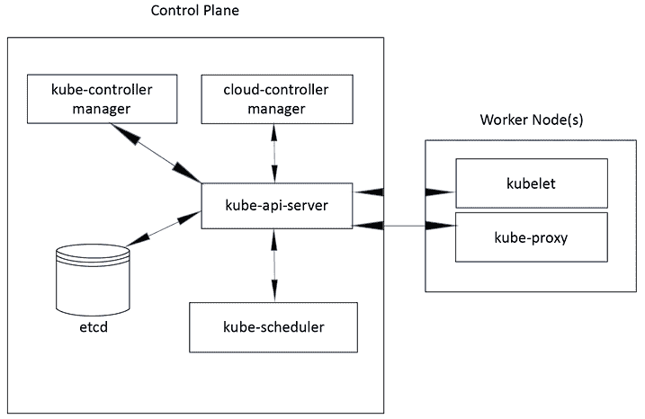
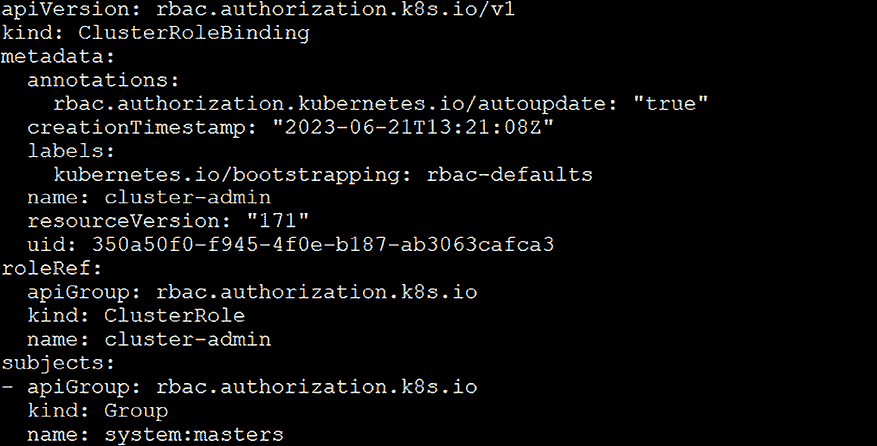
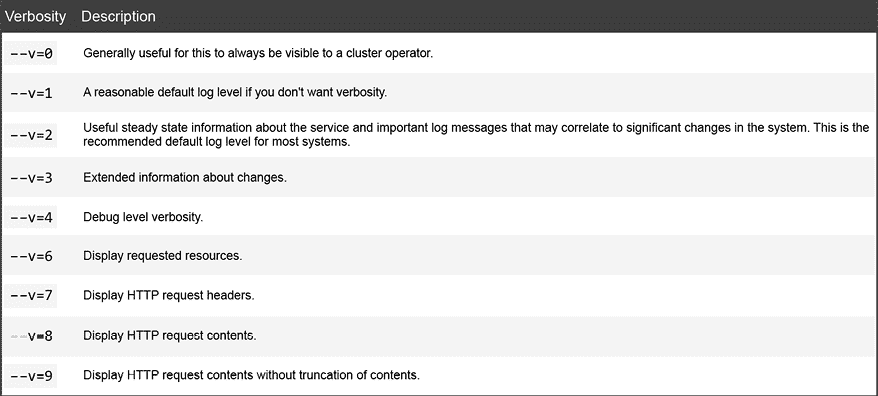
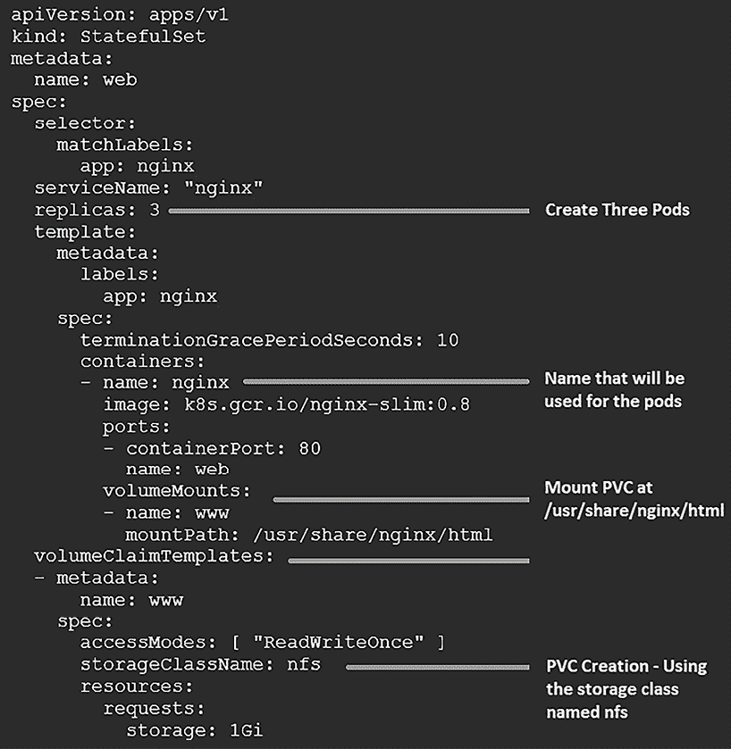

# 3

# Kubernetes 训练营

上一章介绍了如何使用 KinD（Kubernetes in Docker）部署 Kubernetes 集群，这对于在单台机器上使用容器而非虚拟机创建开发集群非常有用。此方法减少了系统资源的需求，并简化了整个设置过程。我们介绍了 KinD 的安装和配置，如何创建集群，包括 Ingress 控制器、Calico 作为 CNI 以及如何使用持久存储。

我们理解，很多人已经具备 Kubernetes 的使用经验，无论是运行生产环境中的集群，还是尝试使用`kubeadm`、minikube 或 Docker Desktop 等工具。本书的目的是超越 Kubernetes 的基础知识，因此我们不打算重复介绍所有的基础内容。相反，我们在本章中提供了一个针对新手或接触 Kubernetes 较少的人的训练营。

在本章中，我们将探讨 Kubernetes 集群的基本组件，包括控制平面和工作节点。我们将详细解释每个 Kubernetes 资源及其相应的使用场景。如果你以前有 Kubernetes 经验，并且能够熟练使用`kubectl`，同时了解像**DaemonSets**、**StatefulSets**和**ReplicaSets**这样的 Kubernetes 资源，那么本章将作为一个有益的复习，帮助你为进入*第四章*做准备，在该章节中我们将深入讨论**服务**、**负载均衡**、**外部 DNS**、**全局负载均衡**以及**K8GB**。

由于这是一个训练营章节，我们不会对每个话题进行详细探讨。然而，在本章结束时，你应该能够扎实地理解 Kubernetes 的基础概念，这对于理解接下来的章节至关重要。即使你已经有了 Kubernetes 的扎实基础，本章也能作为一次复习，为接下来深入讨论更高级的主题做好准备。本章将涉及以下内容：

+   Kubernetes 组件概述

+   探索控制平面

+   理解工作节点组件

+   与 API 服务器交互

+   介绍 Kubernetes 资源

到本章结束时，你将对最常用的集群资源有扎实的理解。了解 Kubernetes 资源对集群操作员和集群管理员都非常重要。

# 技术要求

本章没有技术要求。

如果你在学习资源时想执行命令，可以使用上一章中部署的 KinD 集群。

# Kubernetes 组件概述

理解基础设施中系统组件的构成对于高效提供服务至关重要。在当今众多安装选项中，许多 Kubernetes 用户可能没有意识到完全理解不同 Kubernetes 组件的集成是必要的。

几年前，建立 Kubernetes 集群需要手动安装和配置每个组件。这个过程具有陡峭的学习曲线，并且常常会导致挫败感。因此，许多人和组织得出结论：“Kubernetes 过于复杂。”然而，手动安装的好处在于它能提供关于各个组件之间交互的深入理解。如果在安装后集群出现问题，你会清楚知道该从哪里开始调查。

要理解 Kubernetes 组件如何协同工作，首先必须了解 Kubernetes 集群的不同组件。

下图来自[`Kubernetes.io`](http://Kubernetes.io)网站，展示了 Kubernetes 集群组件的高级概览：



图 3.1：Kubernetes 集群组件

如你所见，Kubernetes 集群由多个组件组成。在本章接下来的内容中，我们将讨论这些组件以及它们在 Kubernetes 集群中的作用。

# 探索控制平面

如其名称所示，控制平面对集群的各个方面具有控制权。如果控制平面无法正常工作，集群将失去调度工作负载、创建新部署和管理 Kubernetes 对象的能力。鉴于控制平面的重要性，强烈建议在部署时支持**高可用性**（**HA**），并至少部署三个控制平面节点。许多生产环境甚至使用三个以上的控制平面节点，但关键原则是保持奇数个节点，这样即使丢失一个`etcd`节点，我们也能保持高可用的控制平面。

现在，让我们深入探讨控制平面的重要性及其组件，全面理解它们在集群中至关重要的作用。

## Kubernetes API 服务器

在集群中要理解的第一个组件是`kube-apiserver`组件。由于 Kubernetes 是**应用程序编程接口**（**API**）驱动的，所有进入集群的请求都会通过 API 服务器。让我们来看一个简单的`get nodes`请求，使用控制平面的 IP 地址，通过 API 端点发送请求。在企业环境中，控制平面通常会通过负载均衡器来前置。在我们的示例中，负载均衡器有一个指向三个控制平面节点的条目，IP 为`10.240.100.100`：

[`10.240.100.100:6443/api/v1/nodes?limit=500`](https://10.240.100.100:6443/api/v1/nodes?limit=500)

如果你尝试在没有任何凭证的情况下进行 API 调用，你将收到权限拒绝的请求。直接使用纯 API 请求是非常常见的做法，尤其是在创建应用程序部署管道或 Kubernetes 附加组件时。然而，用户与 Kubernetes 交互的最常见方式是使用`kubectl`工具。

每个使用`kubectl`发出的命令在幕后调用一个 API 端点。在前面的示例中，如果我们执行了`kubectl get nodes`命令，将向`kube-apiserver`进程发送一个 API 请求，使用地址`10.240.100.100`和端口`6443`。

API 调用请求了`/api/vi/nodes`端点，返回了集群中节点的列表：

```
NAME                     STATUS    ROLES                  AGE     VERSION
home-k8s-control-plane   Ready     control-plane,master   45d     v1.27.3
home-k8s-control-plane2  Ready     control-plane,master   45d     v1.27.3
home-k8s-control-plane3  Ready     control-plane,master   45d     v1.27.3
home-k8s-worker          Ready     worker                 45d     v1.27.3
home-k8s-worker2         Ready     worker                 45d     v1.27.3
home-k8s-worker3         Ready     worker                 45d     v1.27.3 
```

在没有正常运行的 API 服务器的情况下，所有发送到集群的请求都将失败。因此，确保`kube-apiserver`的持续运行和健康状态至关重要。

通过运行三个或更多的控制平面节点，可以最小化由于控制平面节点丢失可能造成的任何潜在影响。

请记住，从上一章可以得知，当运行多个控制平面节点时，需要在集群的 API 服务器前面使用负载均衡器。Kubernetes API 服务器可以由大多数标准解决方案（包括 F5、HAProxy 和 Seesaw）提供支持。

## etcd 数据库

把`etcd`描述为你的 Kubernetes 集群的基础并不为过。`etcd`作为一个强大而高效的分布式键值数据库，Kubernetes 依赖它来存储所有集群数据。集群中的每个资源都与`etcd`数据库中的特定键关联。如果你可以访问托管`etcd`的节点或 Pod，你可以使用`etcdctl`可执行文件来探索数据库中存储的所有键。下面提供的代码片段展示了从基于 KinD 的集群中提取的示例：

```
etcdctl-3.5.12 --endpoints=https://127.0.0.1:2379 --cacert=/etc/kubernetes/pki/etcd/ca.crt --key=/etc/kubernetes/pki/etcd/server.key --cert=/etc/kubernetes/pki/etcd/server.crt get / --prefix --keys-only 
```

前面命令的输出包含太多数据，无法在本章节中全部列出。一个基本的 KinD 集群将返回大约 314 个条目。

所有键都以`/registry/<resource>`开头。例如，返回的键之一是`ClusterRole`为`cluster-admin`的键，如下所示：`/registry/clusterrolebindings/cluster-admin`。

我们可以使用键名通过略微修改之前的命令来使用`etcdctl`实用程序检索值，如下所示：

```
etcdctl-3.5.12 --endpoints=https://127.0.0.1:2379 --cacert=/etc/kubernetes/pki/etcd/ca.crt --key=/etc/kubernetes/pki/etcd/server.key --cert=/etc/kubernetes/pki/etcd/server.crt get /registry/clusterrolebindings/cluster-admin 
```

输出将包含无法由你的 Shell 解释的字符，但你将了解到存储在`etcd`中的数据。对于`cluster-admin`键，输出向我们展示了以下内容：

```
/registry/clusterrolebindings/cluster-admin
k8s
2
rbac.authorization.k8s.io/v1ClusterRoleBinding▒
▒
cluster-admin"*$7b235e81-52de-4001-b354-994dad0279ee2▒▒▒▒Z,
rbac-defaultsb3otstrapping
+rbac.authorization.kubernetes.io/autoupdatetrue▒▒
kube-apiserverUpdaterbac.authorization.k8s.io/v▒▒▒▒FieldsV1:▒
▒{"f:metadata":{"f:annotations":{".":{},"f:rbac.authorization.kubernetes.io/autoupdate":{}},"f:labels":{".":{},"f:kubernetes.io/bootstrapping":{}}},"f:roleRef":{},"f:subjects":{}}B4
Grouprbac.authorization.k8s.iosystem:masters"7
rbac.authorization.k8s.io
cluster-admin"           ClusterRole 
```

我们描述了`etcd`中的条目，以便理解 Kubernetes 如何存储和利用数据来管理集群对象。虽然你已经观察到了`cluster-admin`键的直接数据库输出，但在典型情况下，你会使用`kubectl get clusterrolebinding cluster-admin -o yaml`命令来查询 API 服务器获取相同的数据。使用`kubectl`，该命令将返回以下信息：



图 3.2：kubectl ClusterRoleBinding 输出

如果你查看 `kubectl` 命令的输出，并与 `etcdctl` 查询的输出进行比较，你会发现两者信息一致。你很少需要直接与 `etcd` 进行交互；你只需要执行 `kubectl` 命令，请求会发送到 API 服务器，后者再查询 `etcd` 数据库以获取资源信息。

值得注意的是，虽然 `etcd` 是 Kubernetes 中最常用的后端数据库，但它并不是唯一的。最初为边缘使用场景简化 Kubernetes 的 **k3s** 项目将 `etcd` 替换为关系型数据库。当我们深入了解使用 k3s 的 `vclusters` 时，我们会看到它使用的是 **SQLite** 而非 `etcd`。

## kube-scheduler

正如其名称所示，`kube-scheduler` 组件负责监督将 Pod 分配到节点的过程。它的主要任务是持续监控那些尚未分配到任何特定节点的 Pod。调度器随后评估每个 Pod 的资源需求，以确定最合适的放置位置。这个评估考虑了多个因素，包括节点资源的可用性、约束条件、选择器以及亲和性/反亲和性规则。满足这些要求的节点被视为可行节点。最终，调度器从符合条件的节点列表中选择最合适的节点来调度 Pod。

## kube-controller-manager

**Kubernetes 控制器管理器** 是 Kubernetes 控制平面的核心控制系统；它负责管理和协调其他控制器，这些控制器处理集群中的特定任务。

控制器管理器包含多个控制器，每个控制器负责集群中某个特定功能。这些控制器持续监控集群的当前状态，并动态调整以维持所需的配置。

所有控制器都包含在一个可执行文件中，减少了复杂性和管理工作。部分包含的控制器如 *表 3.1* 所示。

每个控制器为集群提供独特的功能，以下是各个控制器及其功能：

| **控制器** | **职责** |
| --- | --- |
| Endpoints | 监控新服务并为具有匹配标签的 Pod 创建端点 |
| Namespace | 监控命名空间的操作 |
| Node | 监控集群中节点的状态，检测节点故障或新增节点，并采取适当的行动以维持所需的节点数量 |
| Replication | 监控 Pod 的副本，采取行动以删除或添加 Pod 以达到所需状态 |
| Service Accounts | 监控服务账户 |

表 3.1：控制器及其功能

每个控制器运行一个非终止（永不停歇）的控制循环。这些控制循环监控每个资源的状态，并根据需要进行更改，以使资源的状态恢复正常。例如，如果你需要将一个部署从一个节点扩展到三个节点，复制控制器会发现当前状态是运行了一个 Pod，而期望的状态是有三个 Pod 运行。为了将当前状态移动到期望状态，复制控制器会请求再增加两个 Pod。

## cloud-controller-manager

这是一个你可能没有接触过的组件，具体取决于你的集群配置。与 `kube-controller-manager` 组件类似，这个控制器包含四个控制器，在一个二进制文件中运行。

云控制器提供与特定云提供商的 Kubernetes 服务相关的集成功能，使得可以利用云特定的功能，如负载均衡器、持久存储、自动扩展组等其他特性。

# 理解工作节点组件

工作节点，顾名思义，负责在 Kubernetes 集群中执行任务。在我们之前讨论控制平面中 `kube-scheduler` 组件时，我们强调了当一个新的 Pod 需要调度时，`kube-scheduler` 会选择合适的节点来执行该任务。`kube-scheduler` 依赖工作节点提供的数据来做出这一决定。这些数据会定期更新，以确保 Pod 在集群中的分布，使集群资源得到充分利用。

每个工作节点都有两个主要组件，`kubelet` 和 `kube-proxy`。

## kubelet

你可能听到工作节点被称为 `kubelet`。`kubelet` 是一个在所有工作节点上运行的代理，负责确保容器在节点上运行并保持健康。

## kube-proxy

与名称相反，`kube-proxy` 根本不是一个代理服务器（尽管它在 Kubernetes 的最初版本中是一个代理服务器）。

根据集群中部署的 CNI，你的节点可能会有也可能没有 `kube-proxy` 组件。像 **Cilium** 这样的 CNI 可以与 `kube-proxy` 一起运行，或者在 `kube-proxyless` 模式下运行。在我们的 KinD 集群中，我们部署了 Calico，它依赖 `kube-proxy` 的存在。

当 `kube-proxy` 被部署时，它的主要目的是管理集群中 Pods 和服务的网络连接，为目标 Pod(s) 提供网络流量路由。

## 容器运行时

每个节点还需要一个容器运行时。容器运行时负责运行容器。你可能首先想到的是 Docker，虽然 Docker 是一个容器运行时，但它并不是唯一的运行时选项。近年来，其他选项已经取代了 Docker，成为集群中首选的容器运行时。

最突出的两种 Docker 替代品是 **CRI-O** 和 **containerd**。在撰写本章时，KinD 仅官方支持 Docker 和 Red Hat 的 **Podman**。

# 与 API 服务器进行交互

正如我们之前提到的，你可以通过直接的 API 请求或使用 `kubectl` 工具与 API 服务器进行交互。虽然我们在本书中主要集中使用 `kubectl` 进行交互，但在适用的地方我们也会提到如何使用直接的 API 调用。

## 使用 Kubernetes 的 kubectl 工具

`kubectl` 是一个单一的可执行文件，它允许你通过 **命令行界面**（**CLI**）与 Kubernetes API 进行交互。它支持大多数主流操作系统和架构，包括 Linux、Windows 和 macOS。

注意：我们已经使用 KinD 脚本安装了 `kubectl`，该脚本创建了我们的集群，详见 *第二章*。大多数操作系统的安装说明可以在 Kubernetes 网站上找到，网址为 [`kubernetes.io/docs/tasks/tools/install-kubectl/`](https://kubernetes.io/docs/tasks/tools/install-kubectl/)。由于我们使用 Linux 作为本书练习的操作系统，接下来将介绍如何在 Linux 机器上安装 `kubectl`。请按照以下步骤操作：

1.  要下载最新版本的 `kubectl`，你可以运行一个 `curl` 命令来下载它，如下所示：

    ```
    curl -LO https://storage.googleapis.com/kubernetes-release/release/`curl -s https://storage.googleapis.com/kubernetes-release/release/stable.txt`/bin/linux/amd64/kubectl 
    ```

1.  下载后，你需要运行以下命令使该文件变为可执行文件：

    ```
    chmod +x ./kubectl 
    ```

1.  最后，我们将把可执行文件移动到系统路径中，如下所示：

    ```
    sudo mv ./kubectl /usr/local/bin/kubectl 
    ```

现在，你的系统上已经安装了最新版本的 `kubectl` 工具，并且可以从任何工作目录执行 `kubectl` 命令。

Kubernetes 大约每 4 个月更新一次。这包括对基础 Kubernetes 集群组件和 `kubectl` 工具的升级。你可能会遇到集群与 `kubectl` 命令版本不匹配的情况，这时你需要升级或下载新的 `kubectl` 可执行文件。你可以通过运行 `kubectl` `version` 命令来检查两个版本，这个命令会输出 API 服务器和 `kubectl` 客户端的版本信息。版本检查的输出如下所示——请注意，你的输出可能与我们的示例输出不同：

```
Client Version: v1.30.0-6+43a0480e94cee1
Kustomize Version: v5.0.4-0.20230601165947-6ce0bf390ce3
Server Version: v1.30.0-6+43a0480e94cee1 
```

从输出结果中可以看到，`kubectl` 客户端正在运行 `1.30.0` 版本，集群则运行 `1.30.0` 版本。两者之间的微小版本差异不会造成任何问题。事实上，官方支持的版本差异最多为一个主版本号。因此，如果你的客户端版本为 1.29，而集群版本为 1.30.0，你仍然在支持的版本差异范围内。尽管这可能是被支持的，但如果你试图使用更高版本中包含的新命令或资源，可能会遇到一些问题。通常情况下，你应该尽量保持集群和客户端版本的一致性，以避免任何问题。

在本章的其余部分，我们将讨论 Kubernetes 资源以及如何与 API 服务器交互来管理每个资源。但在深入了解不同的资源之前，我们想提到一个经常被忽视的 `kubectl` 工具选项：`verbose` 选项。

## 理解详细选项

当你执行 `kubectl` 命令时，默认情况下你看到的唯一输出是对你的命令的任何直接响应。如果你查看 `kube-system` 命名空间中的所有 Pod，你将得到一个所有 Pod 的列表。在大多数情况下，这是所期望的输出，但如果你发出 `get` `Pods` 请求并收到 API 服务器的错误，怎么办？你如何获取更多信息来找出导致错误的原因？

通过在 `kubectl` 命令中添加 `verbose` 选项，你可以获取有关 API 调用本身以及 API 服务器的任何回复的附加信息。通常，API 服务器的回复会包含一些额外的信息，这些信息可能对找到问题的根本原因很有帮助。

`verbose` 选项有多个级别，范围从 0 到 9，数字越高，输出的内容就越多。

以下截图来自 Kubernetes 官方网站，详细说明了每个级别及其输出内容：



图 3.3：详细程度描述

你可以通过向任何 `kubectl` 命令添加 `-v` 或 `--v` 选项来实验不同的级别。

## 一般 kubectl 命令

CLI 允许你以命令式和声明式两种方式与 Kubernetes 进行交互。使用命令式命令意味着你告诉 Kubernetes 做什么——例如，`kubectl run nginx --image nginx`。这告诉 API 服务器创建一个名为 `nginx` 的 Pod，并运行一个名为 `nginx` 的镜像。虽然命令式命令在开发、快速修复或测试中很有用，但在生产环境中你将更多使用声明式命令。在声明式命令中，你告诉 Kubernetes 你想要什么。要使用声明式命令，你需要向 API 服务器发送一个声明性清单，该清单使用 **JavaScript 对象表示法** (**JSON**) 或 **YAML 不是标记语言** (**YAML**) 编写，声明你希望 Kubernetes 创建的内容。

`kubectl` 包含可以提供一般集群信息或有关资源信息的命令和选项。下表包含了一些命令及其用途的小抄。我们将在未来的章节中使用这些命令，因此你将在本书中看到它们的实际应用：

| **集群命令** |
| --- |
| `api-resources` | 列出支持的 API 资源 |
| `api-versions` | 列出支持的 API 版本 |
| `cluster-info` | 列出集群信息，包括 API 服务器和其他集群端点 |
| **对象命令** |
| `get <object>` | 获取所有对象的列表（例如，pods、ingress 等） |
| `describe <object>` | 提供对象的详细信息 |
| `logs <pod name>` | 获取某个 Pod 的日志 |
| `edit <object>` | 交互式编辑一个对象 |
| `delete <object>` | 删除一个对象 |
| `label <object>` | 给对象打标签 |
| `annotate <object>` | 给对象添加注解 |
| `run` | 创建一个 pod |

表 3.2：集群和对象命令

通过理解每个 Kubernetes 组件以及如何使用命令式命令与 API 服务器交互，我们现在可以继续了解 Kubernetes 资源以及如何使用 `kubectl` 来管理它们。

# 介绍 Kubernetes 资源

在这一部分，我们将提供大量的信息。然而，由于这是一个训练营，我们不会深入讨论每个资源的详尽细节。值得注意的是，每个资源都可能需要单独一章，甚至是一本书的多个章节。由于许多关于基础 Kubernetes 的书籍已经广泛讨论了这些资源，我们将集中讨论每个资源的基本理解所必需的核心内容。在接下来的章节中，我们将随着通过书中练习扩展集群，补充更多关于资源的细节。

在深入全面理解 Kubernetes 资源之前，让我们先介绍一下 Kubernetes 清单的概念。

## Kubernetes 清单

我们将用来创建 Kubernetes 资源的文件被称为清单。清单可以使用 YAML 或 JSON 创建——大多数清单使用 YAML，这也是我们在本书中使用的格式。

需要注意的是，在使用 YAML 文件时，`kubectl` 会将所有 YAML 转换为 JSON 来与您的 API 服务器交互。所有 API 调用都是使用 JSON，即使清单是用 YAML 编写的。

清单的内容会根据将要创建的资源或多个资源而有所不同。最基本的，所有清单都需要包含一个基础配置，其中包括 `apiVersion`、资源的 `kind` 和 `metadata` 字段，如下所示：

```
apiVersion: apps/v1
kind: Deployment
metadata:
  labels:
    app: grafana
  name: grafana
  namespace: monitoring 
```

上面的清单本身并不完整；我们仅展示了一个完整 `Deployment` 清单的开头。如您所见，文件中开始部分包含了所有清单必须具备的三个字段：`apiVersion`、`kind` 和 `metadata` 字段。

您可能还会注意到文件中的字段格式。YAML 格式非常严格，如果任何一行的格式错位了哪怕一个空格，您在尝试部署清单时会收到错误。这需要时间来适应，即使是创建清单很长时间的人，格式问题也时常会出现。

## 什么是 Kubernetes 资源？

当你想要添加或删除集群中的某个资源时，你实际上是在与 Kubernetes 资源进行交互。这种交互是你声明所需资源状态的方式，可能是创建、删除或扩展资源。根据期望的状态，API 服务器会确保当前状态与期望状态一致。例如，如果你有一个从单个副本开始的部署，你可以将该部署资源的副本数从 1 更改为 3。当 API 服务器发现当前状态为 1 时，它会通过创建额外的 2 个 Pod 将部署扩展到 3 个副本。

要获取集群支持的资源列表，可以使用`kubectl api-resources`命令。API 服务器将返回一个资源列表，其中包括所有有效的短名称、命名空间支持以及支持的 API 组。

一个 Kubernetes 集群大约包含 58 个基础资源，但在生产集群中，通常会有超过 58 个资源。许多附加组件，如 Calico，会通过新对象扩展 Kubernetes API。随着集群中部署了不同的附加组件，别对 100+个资源的列表感到惊讶。

显示了以下最常见资源的简要列表：

| **NAME** | **SHORT NAMES** | **API VERSION** | **NAMESPACED** |
| --- | --- | --- | --- |
| apiservices | apiregistration.k8s.io/v1 | FALSE |  |
| certificatesigningrequests | Csr | certificates.k8s.io/v1 | FALSE |
| clusterrolebindings | rbac.authorization.k8s.io/v1 | FALSE |  |
| clusterroles | rbac.authorization.k8s.io/v1 | FALSE |  |
| componentstatuses | Cs | v1 | FALSE |
| configmaps | Cm | v1 | TRUE |
| controllerrevisions | apps/v1 | TRUE |  |
| cronjobs | Cj | batch/v1 | TRUE |
| csidrivers | storage.k8s.io/v1 | FALSE |  |
| csinodes | storage.k8s.io/v1 | FALSE |  |
| csistoragecapacities | storage.k8s.io/v1 | TRUE |  |
| customresourcedefinitions | crd,crds | apiextensions.k8s.io/v1 | FALSE |
| daemonsets | Ds | apps/v1 | TRUE |
| deployments | Deploy | apps/v1 | TRUE |
| endpoints | Ep | v1 | TRUE |
| endpointslices | discovery.k8s.io/v1 | TRUE |  |
| events | Ev | v1 | TRUE |
| events | Ev | events.k8s.io/v1 | TRUE |
| flowschemas | flowcontrol.apiserver.k8s.io/v1beta3 | FALSE |  |
| horizontalpodautoscalers | Hpa | autoscaling/v2 | TRUE |
| ingressclasses | networking.k8s.io/v1 | FALSE |  |
| ingresses | Ing | networking.k8s.io/v1 | TRUE |
| jobs | batch/v1 | TRUE |  |
| limitranges | Limits | v1 | TRUE |
| localsubjectaccessreviews | authorization.k8s.io/v1 | TRUE |  |
| mutatingwebhookconfigurations | admissionregistration.k8s.io/v1 | FALSE |  |
| namespaces | Ns | v1 | FALSE |
| networkpolicies | Netpol | networking.k8s.io/v1 | TRUE |
| nodes | No | v1 | FALSE |
| persistentvolumeclaims | Pvc | v1 | TRUE |
| persistentvolumes | pv | v1 | FALSE |
| poddisruptionbudgets | pdb | policy/v1 | TRUE |
| pods | po | v1 | TRUE |
| podtemplates | v1 | TRUE |  |
| priorityclasses | pc | scheduling.k8s.io/v1 | FALSE |
| prioritylevelconfigurations | flowcontrol.apiserver.k8s.io/v1beta3 | FALSE |  |
| profiles | projectcalico.org/v3 | FALSE |  |
| replicasets | rs | apps/v1 | TRUE |
| replicationcontrollers | rc | v1 | TRUE |
| resourcequotas | quota | v1 | TRUE |
| rolebindings | rbac.authorization.k8s.io/v1 | TRUE |  |
| roles | rbac.authorization.k8s.io/v1 | TRUE |  |
| runtimeclasses | node.k8s.io/v1 | FALSE |  |
| secrets | v1 | TRUE |  |
| selfsubjectaccessreviews | authorization.k8s.io/v1 | FALSE |  |
| selfsubjectrulesreviews | authorization.k8s.io/v1 | FALSE |  |
| serviceaccounts | sa | v1 | TRUE |
| services | svc | v1 | TRUE |
| statefulsets | sts | apps/v1 | TRUE |
| storageclasses | sc | storage.k8s.io/v1 | FALSE |
| subjectaccessreviews | authorization.k8s.io/v1 | FALSE |  |
| tokenreviews | authentication.k8s.io/v1 | FALSE |  |
| validatingwebhookconfigurations | admissionregistration.k8s.io/v1 | FALSE |  |
| volumeattachments | storage.k8s.io/v1 | FALSE |  |

表 3.3: Kubernetes API 资源

由于本章作为入门训练营，我们将简要概述*表 3.3*中列出的资源。为了有效理解后续章节，您需要对这些对象及其各自的功能有深入了解。

一些资源将在后续章节中更详细地解释，包括 `Ingress`、`RoleBindings`、`ClusterRoles`、`StorageClasses` 等。

## 审查 Kubernetes 资源

集群中的大多数资源运行在命名空间中，要创建、编辑或读取它们，您应当在任何`kubectl`命令中提供`-n <namespace>`选项。要查找接受命名空间选项的资源列表，您可以参考*表 3.3*的输出。如果某个资源可以通过命名空间进行引用，则`NAMESPACED`列会显示`TRUE`。如果资源仅能通过集群级别进行引用，则`NAMESPACED`列会显示`FALSE`。

### Apiservices

Apiservices 提供 Kubernetes 组件与所有外部资源（如用户、应用程序和其他服务）之间通信和交互的主要入口点。它们提供一组端点，允许用户和应用程序执行各种操作，例如创建、更新和删除 Kubernetes 资源（如 Pods、Deployments、Services 和 Namespaces）。

Apiservices 处理请求的身份验证、授权和验证，只有经过授权的用户和应用程序才能访问或修改资源。它们还处理资源版本控制和 Kubernetes 集群的其他关键方面。

它们还可以通过开发自定义控制器、操作器或其他与 API Services 交互的组件来扩展 Kubernetes 功能，从而管理和自动化集群行为的各个方面。一个例子是我们的 CNI 插件 Calico，它为集群添加了 31 个额外的 `api-resources`。

### CertificateSigningRequests

**证书签名请求**（**CSR**）允许你向证书授权机构请求证书。这些请求通常用于获得可信证书，以保障 Kubernetes 集群内的通信安全。

### ClusterRoles

`ClusterRole`是权限的集合，它使得与集群 API 的交互成为可能。它将操作或动词与 API 组配对，定义特定的权限。例如，如果你想限制**持续集成/持续交付**（**CI/CD**）管道只能执行补丁操作以更新镜像标签，你可以使用类似于以下的`ClusterRole`：

```
apiVersion: rbac.authorization.k8s.io/v1
kind: ClusterRole
metadata:
  name: patch-deployment
  rules:
  - apiGroups: ["apps/v1"]
    resources: ["deployments"]
    verbs: ["get", "list", "patch"] 
```

`ClusterRole`可以应用于集群和命名空间级别的 API。

### ClusterRoleBindings

一旦你指定了`ClusterRole`，下一步是通过`ClusterRoleBinding`创建`ClusterRole`与主体之间的关联。这个绑定将`ClusterRole`与用户、组或服务账户关联，授予它们在`ClusterRole`中定义的权限。

我们将在*第七章*，*RBAC 策略和审计*中详细探讨`ClusterRoleBinding`。

### ComponentStatus

Kubernetes 控制平面是集群的关键组成部分，对于集群的正常运行至关重要。`ComponentStatus`是一个对象，展示不同 Kubernetes 控制平面组件的健康状况和状态。它提供了组件整体健康的指示，显示组件是否正常运行或是否存在错误。

### ConfigMaps

ConfigMap 是一种存储键值对数据的资源，使配置与应用程序分离。`ConfigMaps`可以保存各种类型的数据，包括文字值、文件或目录，从而在管理应用程序配置时提供灵活性。

这里是一个命令式示例：

```
kubectl create configmap <name> <data> 
```

`<data>`选项将根据`ConfigMap`的来源而有所不同。要使用文件或目录，你需要提供`--from-file`选项，并指定文件路径或整个目录，如下所示：

```
kubectl create configmap config-test --from-file=/apps/nginx-config/nginx.conf 
```

这将创建一个新的名为`config-test`的`ConfigMap`，其中`nginx.conf`键包含`nginx.conf`文件的内容作为值。

如果你需要在一个`ConfigMap`中添加多个键，可以将每个文件放入一个目录，并使用该目录中的所有文件创建`ConfigMap`。例如，你在`~/config/myapp`目录中有三个文件，分别是`config1`、`config2`和`config3`。每个文件都包含数据。为了创建一个将每个文件添加为键的`ConfigMap`，你需要提供`--from-file`选项，并指向该目录，如下所示：

```
kubectl create configmap config-test --from-file=/apps~/config/myapp 
```

这将创建一个新的`ConfigMap`，包含三个键值`config1`、`config2`和`config3`。每个键的值将等于目录中每个文件的内容。

为了快速显示一个 `ConfigMap`，使用上述示例，我们可以通过 `get` 命令 `kubectl get configmaps config-test` 来检索 `它`，并得到以下输出：

```
NAME             DATA    AGE
config-test      3       7s 
```

`ConfigMap` 包含三个键，`DATA` 列下有数字 `3` 表示这一点。为了更详细地检查，我们可以使用带有额外“`-o yaml`”选项的 `kubectl get` 命令，附加到 `kubectl get configmaps config-test` 命令中。这将显示每个键的值，以 YAML 格式表示，如下所示：

```
apiVersion: v1
data:
  config1: |
    First Configmap Value
  config2: |
    Yet Another Value from File2
  config3: |
    The last file - Config 3
kind: ConfigMap
metadata:
  creationTimestamp: "2023-06-10T01:38:51Z"
  name: config-test
  namespace: default
  resourceVersion: "6712"
  uid: a744d772-3845-4631-930c-e5661d476717 
```

通过检查输出，显示每个 `ConfigMap` 中的键与目录中的文件名相对应——`config1`、`config2` 和 `config3`。每个键保留从其相应文件中的数据获得的值。

`ConfigMaps` 的一个限制是，数据对于任何拥有资源访问权限的人来说都很容易访问。从前面的输出可以看出，一个简单的 `get` 命令就能以明文显示数据。

由于这个设计，你永远不应该在 `ConfigMap` 中存储敏感信息，如密码。在本节后面，我们将介绍一个专门用于存储秘密数据的资源，叫做 `Secret`。

### ControllerRevisions

`ControllerRevision` 类似于控制器设置的特定版本或更新的快照。它主要由特定控制器使用，比如 `StatefulSet` 控制器，用来跟踪和管理随着时间推移对其配置所做的更改。

每当有控制器管理的资源的配置被修改或更新时，都会创建一个新的 `ControllerRevision`。每个修订版包含控制器的期望设置和修订号。这些修订版存储在 Kubernetes API 服务器中，允许你在需要时参考或恢复它们。

### CronJobs

如果你曾使用过 Linux 的 cronjobs，那么你已经知道 Kubernetes 的 `CronJob` 资源是什么。如果你没有 Linux 背景，cronjob 用于创建一个计划任务。举个例子，如果你是 Windows 用户，它类似于 Windows 的计划任务。

以下代码片段显示了一个创建 `CronJob` 的示例清单：

```
apiVersion: batch/v1
kind: CronJob
metadata:
  name: hello-world
spec:
  schedule: "*/1 * * * *"
  jobTemplate:
    spec:
      template:
        spec:
          containers:
          - name: hello-world
            image: busybox
            args:
            - /bin/sh
            - -c
            - date; echo Hello World!
  restartPolicy: OnFailure 
```

`schedule` 格式遵循标准的 `cron` 格式。从左到右，每个 `*` 代表以下内容：

+   分钟（0–59）

+   小时（0–23）

+   天（1–31）

+   月（1–12）

+   星期几（0–6）（星期天 = 0，星期六 = 6）

`CronJob` 接受步骤值，这允许你创建一个可以每分钟、每 2 分钟或每小时执行的计划。

我们的示例清单将创建一个 `CronJob`，每分钟运行一个名为 `hello-world` 的镜像，并在 Pod 日志中输出 `Hello World!`。

### CSI 驱动程序

Kubernetes 使用 `CsiDriver` 资源将节点连接到存储系统。

你可以通过执行 `kubectl get csidriver` 命令列出集群中所有可用的 CSI 驱动程序。在我们的一个实验室集群中，我们使用 NetApp 的 SolidFire 存储，因此我们的集群已安装 Trident CSI 驱动程序，如下所示：

```
NAME CREATED AT
csi.trident.netapp.io 2019-09-04T19:10:47Z 
```

### CSI 节点

为了避免将存储信息存储在节点的 API 资源中，`CSINode` 资源被添加到 API 服务器中，以存储由 CSI 驱动程序生成的信息。存储的信息包括将 Kubernetes 节点名称映射到 CSI 节点名称、CSI 驱动程序的可用性和存储卷拓扑。

### CSIStorageCapacities

`CSIStorageCapacity` 是一个存储有关给定 CSI 存储容量的组件，表示给定 `StorageClass` 的可用存储容量。当 Kubernetes 决定在哪里创建新的 `PersistentVolumes` 时，使用这些信息。

### CustomResourceDefinitions

**CustomResourceDefinition**（**CRD**）是一种让用户在 Kubernetes 集群中创建自定义资源的方式。

它概述了自定义资源的结构、格式和行为，包括其 API 端点和支持的操作。一旦 CRD 被创建并添加到集群中，它就成为一个内建的资源类型，可以使用常规的 Kubernetes 工具和 API 来管理。

### DaemonSets

`DaemonSet` 使得在集群中的每个节点或特定节点集上部署 pod 成为可能。它通常用于部署诸如日志记录等在集群每个节点上都需要的关键组件。一旦设置了 `DaemonSet`，它会自动在每个现有节点上创建一个 pod。

此外，随着新节点加入集群，`DaemonSet` 会确保在新加入的节点上部署一个 pod。

### Deployments

我们之前提到过，你不应该直接部署一个 pod。这样做的一个原因是，你无法对 pod 进行扩缩容或执行滚动升级。`Deployments` 为你提供了许多优势，包括以声明方式管理升级以及能够回滚到先前的修订版本。创建一个 `Deployment` 实际上是一个三步过程，由 API 服务器执行：首先创建一个 `Deployment`，然后创建一个 `ReplicaSet`，接着该 `ReplicaSet` 会为应用程序创建 pod(s)。

即使你不打算对应用程序进行扩缩容或执行滚动升级，默认情况下你仍然应该使用 `Deployments`，以便将来能够利用其功能。

### Endpoints

`Endpoint` 将一个服务映射到一个或多个 pod。当我们解释 `Service` 资源时，这将更容易理解。现在，你只需要知道，你可以使用 CLI 执行 `kubectl get endpoints` 命令来检索端点。在一个新的 KinD 集群中，你将看到默认命名空间中的 Kubernetes API 服务器值，如下的代码片段所示：

```
NAMESPACE   NAME         ENDPOINTS         AGE
default     Kubernetes   172.17.0.2:6443   22h 
```

输出显示，集群中有一个名为 `kubernetes` 的服务，其端点位于 **互联网协议** (**IP**) 地址 `172.17.0.2` 的 `6443` 端口。我们示例中返回的 IP 是分配给 Docker 控制平面容器的地址。

稍后，你将看到如何通过查看端点来解决服务和入口问题。

### EndPointSlices

`Endpoints` 的扩展性较差——它们将所有端点存储在一个单一的资源中。当处理一个小规模的部署时，可能只有几个 Pod，这时不会出现问题。然而，随着集群的扩展和应用程序的规模增长，端点数量也会增加，这会影响控制平面的性能并造成额外的网络流量，因为端点会发生变化。

`EndPointSlices` 旨在处理更大规模的场景，这些场景需要可扩展性并对网络端点进行精确控制。默认情况下，每个 `EndPointSlice` 最多可以容纳 100 个端点，可以通过向 `kube-controller-manager` 添加 `--max-endpoints-per-slice` 选项来增加该数量。

假设你在 Kubernetes 中部署了一个包含大量 Pod 的服务。如果其中一个 Pod 被删除，Kubernetes 只会更新包含该 Pod 信息的特定切片。当更新后的切片分发到集群时，它将只包含更小子集的 Pod 详细信息。通过这种方式，集群网络保持高效，避免因过多数据而被淹没。

### Events

`Events` 资源将显示命名空间中的所有事件。要获取 `kube-system` 命名空间的事件列表，可以使用 `kubectl get events -n kube-system` 命令。

### FlowSchemas

Kubernetes 集群具有预定义的设置来管理并发请求的处理，以确保流量不会超载 API 服务器。然而，你可以灵活地自定义并配置自己的流量模式和请求的优先级级别，以便根据你的具体要求和工作负载调整 API 服务器的行为。

例如，你有一个命名空间，其中部署了一个重要的应用程序。你可以创建一个高优先级的 `FlowSchema`，这样 API 服务器就会先处理该命名空间的请求，再处理其他请求。

### HorizontalPodAutoscalers

在 Kubernetes 集群上运行工作负载的最大优势之一就是能够自动扩展你的 Pods。虽然你可以使用 `kubectl` 命令或通过编辑清单的副本数量来进行扩展，但这些都不是自动化的，需要手动干预。

**水平 Pod 自动扩展器** (**HPAs**) 提供了根据一组标准扩展应用程序的能力。使用 CPU 和内存使用率或你自己定义的自定义指标，你可以设置规则，当你需要更多的 Pod 来维持服务水平时，就会扩展 Pod 数量。

在冷却期过后，Kubernetes 将根据策略将应用程序的 Pod 数量缩减到最小值。

要快速为 NGINX 部署创建一个 HPA，我们可以执行一个 `kubectl` 命令，并使用 `autoscale` 选项，具体如下：

```
kubectl autoscale deployment nginx --cpu-percent=50 --min=1 --max=5 
```

你还可以创建一个 Kubernetes 清单来创建你的 HPA。使用与 CLI 中相同的选项，我们的清单看起来是这样的：

```
apiVersion: autoscaling/v1
kind: HorizontalPodAutoscaler
metadata:
  name: nginx-deployment
spec:
  maxReplicas: 5
  minReplicas: 1
  scaleTargetRef:
    apiVersion: apps/v1
    kind: Deployment
    name: nginx-deployment
  targetCPUUtilizationPercentage: 50 
```

两个选项都将创建一个 HPA，当 `Deployment` 的 CPU 利用率达到 50% 时，`nginx-deployment` 会扩展到 5 个副本。一旦 `Deployment` 使用量降到 50% 以下，并且冷却期已达到（默认情况下为 5 分钟），副本数量将减少到 1。

### IngressClasses

`IngressClasses` 允许你定义和管理各种类型的 Ingress 控制器。它们提供了根据特定需求个性化和调整这些控制器行为的能力，提供可定制的传入流量路由到服务的功能。`IngressClasses` 使你能够管理和精细调整 Ingress 控制器，确保流量以符合你需求的方式进行处理。

`IngressClass` 最重要的作用是让你在单一集群中定义多个 Ingress 控制器。例如，Kubernetes Dashboard 版本 3 使用特定的 `IngressClass`，确保其 `Ingress` 对象绑定到没有 `LoadBalancer` 的 NGINX 实例，这样它就不能从集群外部访问。你也可以使用这个功能将 Ingress 控制器连接到不同的网络。

### Ingress

`Ingress` 资源是一个工具，允许你为传入的 HTTP 和 HTTPS 流量创建规则，通过主机名、路径或请求头等选项来服务。它充当外部流量与集群中运行的服务之间的中介。通过使用 `Ingress`，你可以定义不同类型的流量应该如何路由到特定的服务，从而对传入请求的流量进行细粒度的控制。

我们将在下一章深入讨论 `Ingress`，但快速描述 `Ingress` 提供的功能是，它允许你使用指定的 URL 将你的应用程序暴露到外部世界。

### Jobs

`Jobs` 允许你执行一定数量的 Pod 或 Pod 执行。与 `CronJob` 资源不同，这些 Pod 不会按固定计划运行，而是会在创建时执行一次。

### LimitRanges

我们将在本章后面讨论`Quota`资源，但`LimitRange`是一种配置，允许你为指定命名空间内的 Pod 和容器建立并强制执行资源分配的特定边界和限制。通过使用`LimitRanges`，你可以定义资源限制，例如 CPU、内存和存储，确保 Pod 和容器高效运行，并防止对整个集群环境造成负面影响。

### LocalSubjectAccessReview

`LocalSubjectAccessReview`是一个功能，帮助你检查集群中某个用户或用户组是否具备在本地资源上执行特定操作所需的权限。它使你能够直接在集群内审查访问权限，而无需依赖外部 API 请求。

使用`LocalSubjectAccessReview`，你可以指定用户或用户组的身份以及你希望评估的操作和资源。然后，Kubernetes API 服务器将根据本地访问控制策略验证权限，并响应请求的操作是允许还是拒绝。

### 变更 Webhook 配置（MutatingWebhookConfiguration）

`MutatingWebhookConfiguration`用于创建能够拦截并修改发送到 API 服务器请求的 webhook，提供了一种自动修改请求资源的方式。

`MutatingWebhookConfiguration`包含一组规则，决定哪些请求应该被拦截并由 Webhook 处理。当请求与定义的规则匹配时，`MutatingWebhookConfiguration`会触发相应的 webhook，这些 webhook 可以修改请求的数据包。修改内容可以包括添加、删除或修改正在创建或更新的资源中的字段和注释。

### 命名空间（Namespaces）

`Namespace`是一个资源，用于将集群划分为逻辑单元。每个`Namespace`允许对资源进行细粒度的管理，包括权限、配额和报告。

`Namespace`资源用于命名空间任务，这是集群级别的操作。使用`namespace`资源，你可以执行包括`create`、`delete`、`edit`和`get`等命令。

命令的语法是`kubectl <verb> ns <namespace name>`。

例如，要描述`kube-system`命名空间，我们将执行`kubectl describe namespaces kube-system`命令。

这将返回该命名空间的信息，包括任何标签、注释和分配的配额，如下面的代码片段所示：

```
Name: kube-system
Labels: <none>
Annotations: <none>
Status: Active
No resource quota.
No LimitRange
 resource. 
```

在前面的输出中，你可以看到该命名空间没有分配任何标签、注释或资源配额。

本节仅旨在介绍命名空间的概念，作为多租户集群中的管理单元。如果你计划运行具有多个租户的集群，你需要了解如何使用命名空间来保护集群。

### 网络策略（NetworkPolicies）

`NetworkPolicy` 资源允许你定义网络流量的进出方式（即入站流量和出站流量）。它们使你能够使用 Kubernetes 的本地构造定义哪些 Pod 可以与其他 Pod 通信。如果你曾经在 **Amazon Web Services**（**AWS**）中使用过安全组来限制两个系统组之间的访问，那么它的概念类似。举个例子，以下策略将允许来自任何具有 `app.kubernetes.io/name: ingress-nginx` 标签的命名空间的流量访问 `myns` 命名空间中的端口 `443` 的 Pod（这是 `nginx-ingress` 命名空间的默认标签）：  

```
apiVersion: networking.k8s.io/v1
kind: NetworkPolicy
metadata:
  name: allow-from-ingress
  namespace: myns
spec:
  PodSelector: {}
  policyTypes:
  - Ingress
  ingress:
  - from:
    - namespaceSelector:
        matchLabels:
          app.kubernetes.io/name: ingress-nginx
    ports:
    - protocol: TCP
      port: 443 
```

`NetworkPolicy` 是你可以用来保护集群的另一个资源。它们应该在所有生产集群中使用，但在多租户集群中，应该被视为**必需**的，以确保集群中每个命名空间的安全。  

### Nodes  

`nodes` 资源是一个集群级别的资源，用于与集群的节点进行交互。此资源可以与各种操作一起使用，包括 `get`、`describe`、`label` 和 `annotate`。  

要使用 `kubectl` 获取集群中所有节点的列表，你需要执行 `kubectl get nodes` 命令。在一个新创建的 KinD 集群中运行一个简单的单节点集群时，显示内容如下：  

```
NAME                STATUS   ROLES   AGE   VERSION
kind-control-plane  Ready    master  22h   v1.30.0 
```

你还可以使用节点资源通过 `describe` 命令获取单个节点的详细信息。要获取先前列出的 KinD 节点描述，我们可以执行 `kubectl describe node kind-control-plane`，这将返回节点的详细信息，包括消耗的资源、运行的 Pod、IP **无类域间路由**（**CIDR**）范围等。  

### PersistentVolumeClaims  

PVC 是一个命名空间资源，供 Pod 使用以消耗持久存储。PVC 使用**持久卷**（**PV**）来映射实际的存储资源，这些资源可以位于任何支持的存储系统上，包括**NFS**和**iSCSI**。  

与我们讨论的大多数资源一样，你可以对 PVC 资源执行 `get`、`describe` 和 `delete` 命令。由于这些是由命名空间中的 Pod 使用的，因此 PVC 必须在与将使用该 PVC 的 Pod 相同的命名空间中创建。  

### PersistentVolumes

PV 被 PVC 使用来创建 PVC 与底层存储系统之间的链接。手动维护 PV 是一项繁琐的手动任务，应避免进行。相反，Kubernetes 包括通过**容器存储接口**（**CSI**）管理大多数常见存储系统的能力。  

大多数在企业集群中使用的 CSI 解决方案提供自动配置支持，正如我们在*第二章*中介绍 Rancher 的本地配置器时所讨论的那样。支持自动配置的解决方案可以消除手动创建 PV 所需的管理工作负担，自动处理 PV 的创建和与 PVC 的映射。  

### PodDisruptionBudgets  

`PodDisruptionBudget`（PDB）是一种资源，用于限制在任何给定时间内不可用的 Pod 的最大数量。其目的是防止多个 Pod 同时终止，导致服务中断或故障。通过定义最小可用 Pod 数量，称为 `"minAvailable"` 参数，你可以确保在维护或其他中断事件期间，特定数量的 Pod 保持可用。

在云环境中，`kube-scheduler` 将使用这些信息来确定如何在升级过程中替换节点。使用 `PodDisruptionBudget` 时需要小心，因为你可能会遇到升级被暂停的情况。

### Pods

Pod 资源用于与运行容器的 Pod 进行交互。使用 `kubectl` 工具，你可以使用诸如 `get`、`delete` 和 `describe` 等命令。例如，如果你想列出 `kube-system` 命名空间中的所有 Pod，可以执行 `kubectl get Pods -n kube-system` 命令，它会返回该命名空间中的所有 Pod，如下所示：

```
NAME                                             READY  STATUS   RESTARTS   AGE
calico-kube-controllers-c6c8dc655-vnrt7          1/1    Running  0          15m
calico-node-4d9px                                1/1    Running  0          15m
calico-node-r4zsj                                1/1    Running  0          15m
coredns-558bd4d5db-8mxzp                         1/1    Running  0          15m
coredns-558bd4d5db-fxnkt                         1/1    Running  0          15m
etcd-cluster01-control-plane                     1/1    Running  0          15m
kube-apiserver-cluster01-control-plane           1/1    Running  0          15m
kube-controller-manager-cluster01-control-plane  1/1    Running  0          15m
kube-proxy-npxqd                                 1/1    Running  0          15m
kube-proxy-twn7s                                 1/1    Running  0          15m
kube-scheduler-cluster01-control-plane           1/1    Running  0          15m 
```

尽管你可以直接创建 Pod，但除非你仅使用 Pod 进行快速故障排除，否则不应直接创建。直接创建的 Pod 无法使用 Kubernetes 提供的许多功能，包括扩展、自动重启或滚动升级。

与其直接创建 Pod，不如使用 `Deployment`、`StatefulSet` 或在某些特殊情况下使用 `ReplicaSet` 资源或复制控制器。

### PodTemplates

`PodTemplates` 提供了一种创建 Pod 模板或蓝图的方法。它们作为可重用的配置，包括 Pod 的所需规格和设置。它们包含 Pod 的元数据和规格，包括名称、标签、容器、卷以及其他属性。

`PodTemplates` 通常用于其他 Kubernetes 对象，如 `ReplicaSets`、`Deployments` 和 `StatefulSets`。这些资源依赖于 `PodTemplate` 来生成和管理具有一致配置和行为的 Pod 集合。

### 优先级类（PriorityClasses）

`PriorityClasses` 提供了一种根据 Pod 重要性来优先处理的方式。这使得 Kubernetes 调度器能够在资源分配和 Pod 调度方面做出更好的决策。

定义 `PriorityClasses` 时，你需要创建一个新的 `PriorityClass` 资源，并为其分配数字值，以表示优先级水平。具有更高优先级值的 Pod 会在资源分配和调度时优先于较低优先级的 Pod。

使用 `PriorityClasses`，你可以确保关键工作负载在资源分配和调度时优先获得所需的资源，从而保证其平稳运行。

### 优先级配置（PriorityLevelConfigurations）

`PriorityLevelConfigurations` 是帮助定义请求发送到 API 服务器时的优先级的对象。它们控制 API 请求在集群中如何处理和优先级排序。通过使用 `PriorityLevelConfigurations`，您可以建立多个优先级，并为特定属性分配优先级。这些属性包括设置每秒最大查询数（QPS）和特定优先级下的并发请求数量。这使得根据不同 API 请求的重要性，能够更有效地管理和分配资源。

`PriorityLevelConfigurations` 允许您强制执行策略，确保关键请求始终能够获得足够的资源，从而提供灵活性来管理 API 请求的处理和资源分配。

### ReplicaSets

`ReplicaSets` 可以用来创建一个 Pod 或一组 Pod（副本）。与 `ReplicationController` 资源类似，`ReplicaSet` 会保持副本计数中定义的 Pod 数量。如果 Pod 数量过少，Kubernetes 会补充差额并创建缺失的 Pod。如果 `ReplicaSet` 中的 Pod 数量过多，Kubernetes 会删除 Pod，直到数量与设置的副本数相等。

一般来说，您应避免直接创建 `ReplicaSets`。相反，您应该创建一个 `Deployment`，它将创建并管理一个 `ReplicaSet`。

### 复制控制器

复制控制器将管理正在运行的 Pod 数量，始终保持所需副本的运行。如果您创建一个复制控制器并将副本计数设置为 `5`，控制器将始终保持五个应用程序 Pod 运行。

复制控制器已被 `ReplicaSet` 资源所取代，我们已经在其单独的部分进行了讨论。虽然您仍然可以使用复制控制器，但应考虑使用 `Deployment` 或 `ReplicaSet`。

### ResourceQuotas

在多个团队共享一个 Kubernetes 集群的情况下，**多租户集群**变得非常常见。由于您将有多个团队在同一个集群中工作，您应该创建配额，以限制单个租户消耗集群或节点上所有资源的潜力。

大多数集群资源都可以设置限制，包括以下内容：

+   中央处理单元（CPU）

+   内存

+   PVCs

+   `ConfigMaps`

+   部署

+   Pods，等等

设置限制后，一旦达到限制，将停止创建任何额外的资源。如果您为命名空间设置了 10 个 Pod 的限制，而用户创建了一个新的 `Deployment`，试图启动 11 个 Pod，第 11 个 Pod 将无法启动，用户将收到错误信息。

创建内存和 CPU 配额的基本清单文件如下所示：

```
apiVersion: v1
kind: ResourceQuota
metadata:
  name: base-memory-cpu
spec:
  hard:
    requests.cpu: "2"
    requests.memory: 8Gi
    limits.cpu: "4"
    limits.memory: 16Gi 
```

这将设置命名空间可以用于 CPU 和内存请求及限制的总资源量限制。

你可以在配额中设置的许多选项是显而易见的，如 pods、PVCs、services 等。当你设置限制时，这意味着设置的限制是该命名空间中该资源的最大允许值。例如，如果你将 pod 的限制设置为 5，当尝试在该命名空间中创建第六个 pod 时，它将被拒绝。

一些配额有多个可以设置的选项：特别是 CPU 和内存。在我们的示例中，两个资源都设置了请求和限制。理解这两个值对于确保资源的高效使用以及限制应用程序的潜在可用性非常重要。

请求本质上是对特定资源的预留。当 pod 被部署时，你应该始终为 CPU 和内存设置请求，且该值应为启动应用程序所需的最小值。调度程序将使用这个值来寻找满足请求的节点。如果没有节点有可用的请求资源，pod 将无法调度。

现在，由于请求会保留资源，这意味着一旦集群中的所有节点都分配了 100% 的请求，任何额外的 pod 创建都将被拒绝，因为请求已经达到 100%。即使你实际集群的 CPU 或内存使用率只有 10%，由于请求或 **预留** 已达到 100%，pod 仍然无法调度。如果请求没有经过仔细考虑，就会导致资源浪费，从而增加运行平台的成本。

CPU 和内存的限制设置了 pod 可以使用的最大值。这与请求不同，因为限制不是对资源的预留。然而，从应用程序的角度来看，限制仍然需要仔细规划。如果你将 CPU 限制设置得太低，应用程序可能会出现性能问题，如果你将内存限制设置得太低，pod 将被终止，影响可用性，直到重新启动。

一旦创建了配额，你可以使用 `kubectl describe` 命令查看资源的使用情况。在我们的示例中，我们将 `ResourceQuota` 命名为 `base-memory-cpu`。

要查看使用情况，我们将执行 `kubectl get resourcequotas base-memory-cpu` 命令，结果如下所示：

```
Name: base-memory-cpu
Namespace: default
Resource Used Hard
-------- ---- ----
limits.cpu 0 4
limits.memory 0 16Gi
requests.cpu 0 2
requests.memory 0 8Gi 
```

`ResourceQuotas` 作为一种手段，用于管理和控制集群内资源的分配。它们允许你为每个命名空间分配特定的 CPU 和内存资源，确保每个租户都有足够的资源来有效地运行他们的应用程序。此外，`ResourceQuotas` 还充当保护机制，防止优化不良或资源密集型的应用程序对集群中其他应用程序的性能产生不利影响。

### RoleBindings

`RoleBinding` 资源用于将 `Role` 或 `ClusterRole` 与主体和命名空间关联起来。例如，以下的 `RoleBinding` 将允许 `aws-codebuild` 用户将 `patch-openunison ClusterRole` 应用到 `openunison` 命名空间：

```
apiVersion: rbac.authorization.k8s.io/v1
kind: RoleBinding
metadata:
  name: patch-openunison
  namespace: openunison
subjects:
- kind: User
  name: aws-codebuild
  apiGroup: rbac.authorization.k8s.io
roleRef:
  kind: ClusterRole
  name: patch-deployment
  apiGroup: rbac.authorization.k8s.io 
```

尽管这里引用了一个 `ClusterRole`，它只会应用于 `openunison` 命名空间。如果 `aws-codebuild` 用户尝试修补另一个命名空间中的 Deployment，API 服务器会阻止它。

### Roles

与 `ClusterRole` 类似，Roles 结合了 API 组和操作，定义了一组可以分配给主体的权限。`ClusterRole` 和 `Role` 的区别在于，`Role` 只能拥有在命名空间级别定义的资源，并且仅适用于特定的命名空间。

### RuntimeClasses

`RuntimeClasses` 用于设置和定制不同的运行时环境，以便运行容器。它们提供了灵活性，可以选择和配置最适合工作负载的容器运行时。通过使用 `RuntimeClasses`，你可以根据特定的需求来微调容器运行时。

每个 `RuntimeClass` 都与特定的容器运行时（如 Docker 或 Containerd）相关联。它们包含可配置的参数，定义所选容器运行时的行为。这些参数包括资源限制、安全配置和环境变量。

### Secrets

之前，我们描述了如何使用 `ConfigMap` 资源来存储配置信息。我们提到过，`ConfigMap` 永远不应该用于存储任何类型的敏感数据。这是 `Secret` 的职责。

`Secrets` 作为 Base64 编码的字符串存储，这并不是一种加密方式。那么，为什么要将 `Secrets` 与 `ConfigMap` 分开存储呢？提供一个独立的资源类型可以更容易地维护访问控制，并且能够使用外部的秘密管理系统来注入敏感信息。

`Secrets` 可以通过文件、目录或文字字符串来创建。例如，我们有一个 MySQL 镜像，想要执行它，并且希望通过 Secret 将密码传递给 Pod。在我们的工作站中，我们的当前工作目录下有一个名为 `dbpwd` 的文件，里面存储了密码。使用 `kubectl` 命令，我们可以通过执行 `kubectl create secret generic mysql-admin --from-file=./dbpwd` 来创建一个 `Secret`。

这将创建一个名为 `mysql-admin` 的新 `Secret`，内容为 `dbpwd` 文件中的内容。使用 `kubectl`，我们可以通过运行 `kubectl get secret mysql-admin -o yaml` 命令来获取该 `Secret` 的输出，结果如下：

```
apiVersion: v1
data:
  dbpwd: c3VwZXJzZWNyZXQtcGFzc3dvcmQK
kind: Secret
metadata:
  creationTimestamp: "2020-03-24T18:39:31Z"
  name: mysql-admin
  namespace: default
  resourceVersion: "464059"
  uid: 69220ebd-c9fe-4688-829b-242ffc9e94fc
type: Opaque 
```

从前面的输出可以看到，`data` 部分包含了我们的文件名，然后是一个 Base64 编码的值，这是由文件内容生成的。

如果我们从 `Secret` 中复制 Base64 值，并将其传递给 `base64` 工具，我们可以轻松解码密码，如下所示：

```
echo c3VwZXJzZWNyZXQtcGFzc3dvcmQK | base64 -d
supersecret-password 
```

使用`echo`命令对字符串进行 Base64 编码时，添加`-n`标志以避免添加额外的`\n`。改用`echo -n 'test' | base64`，而不是`echo 'test' | base64`。

所有内容都存储在`etcd`中，但我们担心有人可能会入侵`etcd`节点并窃取`etcd`数据库的副本。一旦有人获得了数据库的副本，他们可以轻松使用`etcdctl`工具浏览内容，检索我们所有的 Base64 编码的 Secrets。幸运的是，Kubernetes 添加了一个功能，在写入数据库时加密`Secrets`。

启用此功能对于许多用户来说可能相当复杂，尽管它听起来是个好主意，但它确实存在一些潜在的问题，你应该在实施之前考虑这些问题。如果你想阅读有关加密静态 Secrets 的步骤，可以访问 Kubernetes 网站的[`kubernetes.io/docs/tasks/administer-cluster/encrypt-data/`](https://kubernetes.io/docs/tasks/administer-cluster/encrypt-data/)。

另一个保护 Secrets 的选项是使用第三方秘密管理工具，如 HashiCorp 的 Vault 或 CyberArk 的 Conjur。我们将在*第九章*，*Kubernetes 中的 Secrets 管理*中介绍与秘密管理工具的集成。

### SelfSubjectAccessReviews

`SelfSubjectAccessReviews`对象使用户或实体能够检查他们在命名空间内执行特定操作所需的权限。

要使用`SelfSubjectAccessReviews`，用户提供用户名以及要检查的操作和资源。集群根据命名空间中的访问控制策略评估提供的用户权限，API 服务器会响应是否允许或拒绝请求的操作。

`SelfSubjectAccessReviews`和下一个资源`SelfSubjectRulesReviews`看起来非常相似，但它们的功能不同。记住`SelfSubjectAccessReviews`的关键点是，它评估针对特定操作和资源的单独访问权限。

### SelfSubjectRulesReviews

`SelfSubjectRulesReviews`对象用于确定用户或实体在命名空间内具有权限的规则集，提供了调查自己操作和资源的访问控制规则的能力。

要使用`SelfSubjectRulesReview`，你需要提供你的身份，API 服务器将评估在命名空间中与该身份关联的权限。

`SelfSubjectRulesReviews`提供比`SelfSubjectAccessReviews`更全面的视图，深入理解用户在命名空间内的权限规则集。

### 服务账户

Kubernetes 使用`ServiceAccounts`来启用工作负载的访问控制。当你创建`Deployment`时，可能需要访问其他服务或 Kubernetes 资源。

由于 Kubernetes 是一个安全的系统，你的应用程序尝试访问的每个资源或服务将评估**基于角色的访问控制**（**RBAC**）规则，以接受或拒绝请求。

使用清单创建服务账户是一个简单的过程，只需要在清单中添加几行代码。以下代码片段展示了一个服务账户清单，用于为 Grafana 部署创建一个服务账户：

```
apiVersion: v1
kind: ServiceAccount
metadata:
  name: grafana
  namespace: monitoring 
```

你将服务账户与角色绑定和`Roles`结合，允许访问所需的服务或对象。

我们将在*第六章*《将企业身份验证集成到你的集群》中深入讲解如何使用`ServiceAccounts`。

### 服务

当你创建一个 Pod 时，它将从集群创建时分配的 CIDR 范围中获得一个 IP 地址。在大多数集群中，分配的 IP 仅在集群内部可访问，这种模式称为“**岛屿模式**”。由于 Pod 是临时性的，分配的 IP 地址可能会在应用生命周期中发生变化，这在任何服务或应用需要连接到 Pod 时会造成问题。为了解决这个问题，我们可以创建一个 Kubernetes 服务，它也会获得一个 IP 地址，但由于服务在应用生命周期中不会被删除，因此地址将保持不变。

服务将动态维护一个 Pod 列表，以根据与服务选择器匹配的标签来确定目标 Pod，创建服务的端点列表。

服务存储有关如何暴露应用程序的信息，包括运行应用程序的 Pod 以及访问这些 Pod 的网络端口。

每个服务都有一个在创建时分配的网络类型，包括以下几种：

+   `ClusterIP`：一种仅能在集群内部访问的网络类型。通过使用 Ingress 控制器，仍然可以用于外部请求，这将在后续章节中讨论。`ClusterIP`类型是默认类型，当创建服务时，如果未指定类型，则会使用此类型。

+   `NodePort`：一种将服务暴露到`30000`至`32767`之间随机端口的网络类型。此端口可以通过目标集群中任何工作节点的分配`NodePort`来访问。创建后，集群中的每个节点将收到端口信息，传入请求将通过`kube-proxy`进行路由。

+   `LoadBalancer`：此类型需要集群内的附加组件。如果你在公共云提供商上运行 Kubernetes，此类型将创建一个外部负载均衡器，并为你的服务分配一个 IP 地址。大多数本地 Kubernetes 安装不支持`LoadBalancer`类型，但像谷歌的 Anthos 等一些产品支持此类型。在后续章节中，我们将解释如何将一个开源项目`MetalLB`添加到 Kubernetes 集群中，以支持`LoadBalancer`类型。

+   `ExternalName`：这种类型与其他三种类型不同。与其他三种选项不同，这种类型不会为服务分配 IP 地址。相反，它用于将内部 Kubernetes **域名系统**（**DNS**）名称映射到外部服务。

作为示例，我们已经部署了一个运行 Nginx 的 Pod，监听端口`80`。我们希望创建一个服务，使得这个 Pod 能够在集群内部接收端口`80`的传入请求。相关代码如下所示：

```
apiVersion: v1
kind: Service
metadata:
  labels:
    app: nginx-web-frontend
  name: nginx-web
spec:
  ports:
  - name: http
    port: 80
    targetPort: 80
  selector:
    app: nginx-web 
```

在我们的清单中，我们创建了一个名为`app`的标签，并将其值设置为`nginx-web-frontend`。我们将服务本身命名为`nginx-web`，并将服务暴露在端口`80`上，目标 Pod 端口为`80`。清单的最后两行用于指定服务将转发到的 Pod，也称为端点（Endpoints）。在这个清单中，任何具有`app`标签并且值为`nginx-web`的 Pod 都会被添加为服务的端点。最后，你可能已经注意到，我们没有在清单中指定服务类型。由于没有指定类型，它将创建为默认的`ClusterIP`服务类型。

### StatefulSets

`StatefulSets`在创建 Pod 时提供了一些独特的功能。它们提供了其他 Pod 创建方法没有的功能，包括以下内容：

+   已知的 Pod 名称

+   有序部署和扩展

+   有序更新

+   持久化存储创建

理解`StatefulSet`的优势最好的方法是查看 Kubernetes 网站上的示例清单，如下截图所示：



图 3.4：StatefulSet 清单示例

现在，我们可以查看`StatefulSet`创建的资源。

该清单指定应该有三个名为`nginx`的 Pod 副本。当我们获取 Pod 列表时，你会看到三个 Pod 是以`nginx`为名称创建的，并附加了一个短横线和递增的数字。这就是我们在概述中提到的 Pod 将以已知名称创建的意思，如下代码片段所示：

```
NAME   READY  STATUS   RESTARTS  AGE
web-0  1/1    Running  0         4m6s
web-1  1/1    Running  0         4m2s
web-2  1/1    Running  0         3m52s 
```

Pod 也是按顺序创建的——`web-0`必须完全部署后，`web-1`才能创建，最后是`web-2`。

最后，对于这个示例，我们还在清单中使用`VolumeClaimTemplate`为每个 Pod 添加了一个 PVC。如果你查看`kubectl get pvc`命令的输出，你会看到三个 PVC 已经被创建，并且命名符合我们的预期（注意，由于空间限制，我们删除了`VOLUME`列），如下代码片段所示：

```
NAME       STATUS  CAPACITY  ACCESS MODES   STORAGECLASS AGE
www-web-0  Bound   1Gi       RWO            nfs          13m
www-web-1  Bound   1Gi       RWO            nfs          13m
www-web-2  Bound   1Gi       RWO            nfs          12m 
```

在清单的`VolumeClaimTemplate`部分，你会看到我们将 PVC 声明命名为`www`。当你在`StatefulSet`中分配一个卷时，PVC 名称将结合声明模板中使用的名称和 Pod 的名称。通过这种命名方式，你可以理解为什么 Kubernetes 将 PVC 命名为`www-web-0`、`www-web-1`和`www-web-2`。

### 存储类

存储类用于定义存储端点。每个存储类可以分配标签和策略，使开发人员能够选择最佳的存储位置来存储其持久化数据。您可以为一个后端系统创建一个存储类，该系统拥有所有**非易失性内存快闪存储器**（**NVMe**）硬盘，并将其命名为 `fast`，同时为运行标准硬盘的 NetApp **网络文件系统**（**NFS**）卷分配一个不同的存储类，命名为 `standard`。

当请求 PVC 时，用户可以分配他们希望使用的 `StorageClass`。当 API 服务器收到请求时，它会找到匹配的名称，并使用 `StorageClass` 配置通过供给器在存储系统中创建卷。

从高层次来看，`StorageClass` 清单不需要太多信息。以下是一个使用 Kubernetes 孵化项目中的供给器来提供 NFS 自动供给卷的存储类示例，名为 `nfs`：

```
apiVersion: storage.k8s.io/v1
kind: StorageClass
metadata:
name: nfs
provisioner: nfs 
```

存储类允许您为用户提供多种存储解决方案。您可以创建一个便宜、较慢的存储类，同时提供另一个支持高吞吐量以满足高数据需求的存储类。通过为每个提供的存储解决方案提供不同的存储类，您允许开发者选择最适合其应用的选项。

### SubjectAccessReviews

`SubjectAccessReviews` 用于检查实体是否有权限在资源上执行特定操作。它们允许用户请求访问审查并获取有关其权限的信息。通过提供身份、所需操作和资源，API 服务器确定该操作是否被允许或拒绝。这有助于用户验证他们对资源的权限，进而帮助识别 Kubernetes 资源的访问问题。

例如，Scott 想要验证自己是否有权限在名为 `sales` 的命名空间中创建 pod。为此，Scott 在 `sales` 命名空间中创建了一个 `SubjectAccessReview`，其中包含他的用户名、创建操作和目标资源（pods）。

API 服务器验证用户是否有权限在 `sales` 命名空间中创建 pod，并返回响应。API 服务器的响应包括请求的操作是否被允许或拒绝。

知道一个实体是否有权限在资源上执行操作，有助于减少由于权限问题导致部署失败时的挫败感。

### TokenReviews

`TokenReviews` 是用于验证和验证与集群中的用户或实体相关联的身份验证令牌的 API 对象。如果令牌有效，API 服务器将检索与该令牌关联的用户或实体的详细信息。

当用户向 Kubernetes API 服务器提交身份验证令牌时，服务器会将令牌与内部身份验证系统进行验证。它会验证令牌是否合法，并确定与其相关联的用户或实体。

API 服务器提供有关令牌有效性以及用户或实体的信息，包括用户名、**用户标识符**（**UID**）和组成员信息。

### ValidatingWebhookConfigurations

`ValidatingWebhookConfiguration` 是一组规则，决定哪些准入请求会被 Webhook 拦截和处理。每条规则都包含 Webhook 应处理的特定资源和操作。

它提供了一种通过对准入请求应用验证逻辑来强制执行特定策略或规则的方法。许多 Kubernetes 的附加组件提供 `ValidatingWebhookConfiguration`，其中最常见的之一是 NGINX ingress 控制器。

您可以通过执行 `kubectl get validatingwebhookconfigurations` 查看集群中所有的 `ValidatingWebhookConfigurations`。对于我们部署的 KinD 集群，您将看到一个针对 NGINX Ingress 准入的条目：

```
NAME                      		WEBHOOKS   	AGE ingress-nginx-admission   		1       	3d10h 
```

### VolumeAttachments

`VolumeAttachments` 在集群中的外部存储卷和节点之间创建连接。它们控制持久化卷与特定节点的关联，使得节点能够访问和利用存储资源。

# 总结

在本章中，您接受了一个快速节奏的 Kubernetes 启动训练营，您接触到了大量的技术信息。请记住，随着您深入 Kubernetes 的世界，一切将变得更加可管理，且更容易掌握。需要注意的是，本章中讨论的许多资源将在后续章节中进一步探讨和解释，帮助您更深入地理解。

您深入了解了每个 Kubernetes 组件及其相互依赖关系，这些组件共同构成了集群。凭借这些知识，您现在具备了调查和识别集群内错误或问题根源的必要技能。我们探讨了控制平面，其中包括 `api-server`、`kube-scheduler`、`etcd` 和控制器管理器。此外，您还熟悉了运行 `kubelet` 和 `kube-proxy` 组件的 Kubernetes 节点，以及容器运行时。

我们还深入探讨了 `kubectl` 工具的实际应用，它将是您与集群互动的主要工具。您了解了几个基本命令，如访问日志和提供描述性信息的命令，这些命令将是您日常使用的工具。

在下一章中，我们将创建一个开发用的 Kubernetes 集群，它将作为剩余章节的基础集群。在本书的剩余部分，我们将引用本章中呈现的许多资源，并通过实际案例来帮助解释这些资源。

# 问题

1.  以下哪个组件不包含在 Kubernetes 控制平面中？

    1.  api-server

    1.  kube-scheduler

    1.  etcd

    1.  Ingress 控制器

答案：d

1.  保持所有集群信息的组件是什么名称？

    1.  api-server

    1.  主控制器

    1.  kubelet

    1.  etcd

答案：d

1.  哪个组件负责选择将运行工作负载的节点？

    1.  kubelet

    1.  api-server

    1.  kube-scheduler

    1.  Pod 调度器

答案：c

1.  你会在 `kubectl` 命令中添加哪个选项，以查看命令的附加输出？

    1.  详细模式

    1.  -v

    1.  –verbose

    1.  -log

答案：b

1.  哪种服务类型会创建一个随机生成的端口，使得所有进入分配端口的工作节点流量都可以访问该服务？

    1.  负载均衡器

    1.  ClusterIP

    1.  无—这是所有服务的默认设置

    1.  NodePort

答案：d

1.  如果你需要在 Kubernetes 集群上部署一个需要已知 Pod 名称和控制每个 Pod 启动顺序的应用程序，你会创建哪个对象？

    1.  StatefulSet

    1.  Deployment

    1.  ReplicaSet

    1.  ReplicationController

答案：a

# 加入我们书籍的 Discord 空间

加入本书的 Discord 工作区，参加每月与作者的 *问我任何问题*（Ask Me Anything）环节：

[`packt.link/K8EntGuide`](https://packt.link/K8EntGuide)


