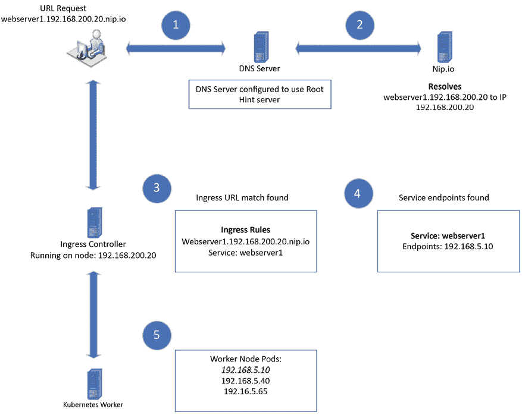

# 4

# 服务、负载均衡和网络策略

在上一章中，我们开始了 Kubernetes Bootcamp，为你提供了一个简明但全面的 Kubernetes 基础和对象介绍。我们首先分析了 Kubernetes 集群的主要部分，重点讲解了控制平面和工作节点。控制平面是集群的大脑，负责管理所有任务，包括调度任务、创建部署以及跟踪 Kubernetes 对象。工作节点用于运行应用程序，包括`kubelet`服务，保持容器健康，并通过`kube-proxy`处理网络连接。

我们研究了如何使用`kubectl`工具与集群交互，这个工具允许你直接运行命令，或者使用 YAML 或 JSON 清单声明你希望 Kubernetes 执行的操作。我们还探讨了大部分 Kubernetes 资源。我们讨论的一些常见资源包括`DaemonSets`，它确保 Pod 在所有或特定的节点上运行；`StatefulSets`，用于管理具有稳定网络身份和持久存储的有状态应用；以及`ReplicaSets`，用于保持一定数量的 Pod 副本运行。

Bootcamp 章节应该帮助你建立对 Kubernetes 架构、关键组件和资源以及基本资源管理的扎实理解。拥有这些基础知识将为你在接下来的章节中深入学习更高级的主题打下基础。

在本章中，你将学习如何管理和路由网络流量到你的 Kubernetes 服务。我们将首先解释负载均衡器的基本概念，并展示如何配置它们来处理访问你应用程序的请求。你将理解使用服务对象的重要性，以确保即使 Pod 的 IP 地址是临时的，连接也能保持可靠。

此外，我们还将讲解如何使用 Ingress 控制器将你的 Web 服务暴露给外部流量，以及如何使用`LoadBalancer`服务处理更复杂的非 HTTP/S 工作负载。你将通过部署 Web 服务器亲身体验这些概念的实际操作。

由于许多读者可能没有 DNS 基础设施来支持名称解析，而这是 Ingress 正常工作的前提，我们将使用一个免费的互联网服务 nip.io 来管理 DNS 名称。

最后，我们将探讨如何使用网络策略来保护你的 Kubernetes 服务，确保内部和外部的通信都受到保护。

本章将涵盖以下主题：

+   负载均衡器简介及其在流量路由中的作用。

+   理解 Kubernetes 中的服务对象及其重要性。

+   使用 Ingress 控制器暴露 Web 服务。

+   使用`LoadBalancer`服务处理复杂工作负载。

+   部署 NGINX Ingress 控制器并设置 Web 服务器。

+   使用 nip.io 服务来管理 DNS 名称。

+   使用网络策略保护服务，确保通信安全。

本章结束时，你将深入理解在 Kubernetes 集群中暴露和保护工作负载的各种方法。

# 技术要求

本章有以下技术要求：

+   一台运行 Docker 的 Ubuntu 22.04+ 服务器，至少 4 GB 的 RAM，建议 8 GB。

+   从仓库中的 `chapter4` 文件夹中获取脚本，你可以通过访问本书的 GitHub 仓库来获取：[`github.com/PacktPublishing/Kubernetes-An-Enterprise-Guide-Third-Edition`](https://github.com/PacktPublishing/Kubernetes-An-Enterprise-Guide-Third-Edition)。

# 将工作负载暴露给请求

通过我们的经验，我们意识到 Kubernetes 中有三个概念可能会让人感到困惑：**Services、Ingress 控制器和 LoadBalancer Services**。了解这些概念对将你的工作负载暴露给外部世界至关重要。理解这些对象的功能及其不同选项是非常关键的。接下来，我们将深入探讨这些话题。

## 理解 Services 的工作原理

正如我们之前提到的，当工作负载在 pod 中运行时，它会被分配一个 IP 地址。然而，存在某些情况，pod 可能会重启，重启时它会获得一个新的 IP 地址。因此，直接针对 pod 的工作负载进行访问并不是一个好主意，因为其 IP 地址可能会发生变化。

Kubernetes 最酷的一点是它能够扩展你的部署。当你扩展一个部署时，Kubernetes 会添加更多的 pod 以应对增加的资源需求。这些 pod 每个都有自己独特的 IP 地址。但有一点需要注意：大多数应用程序设计时仅针对单个 IP 地址或名称。

想象一下，如果你的应用程序从运行一个 pod 扩展到突然运行 10 个 pod，你如何利用这些额外的 pod，因为你只能针对一个 IP 地址？这就是我们接下来要探索的内容。

Kubernetes 中的 `Services` 利用标签在服务和处理工作负载的 pods 之间建立连接。当 pods 启动时，它们会被分配标签，所有具有相同标签的 pods（如部署中定义的标签）会被分组在一起。

以 NGINX 网页服务器为例。在我们的 `Deployment` 中，我们会创建一个像这样的清单：

```
apiVersion: apps/v1
kind: Deployment
metadata:
  labels:
    run: nginx-frontend
  name: nginx-frontend
spec:
  replicas: 3
  selector:
    matchLabels:
      run: nginx-frontend
  template:
    metadata:
      labels:
        run: nginx-frontend
    spec:
      containers:
      - image: bitnami/nginx
        name: nginx-frontend 
```

这个部署将创建三个 NGINX 服务器，每个 pod 将标记为 `run=nginx-frontend`。我们可以通过使用 `kubectl` 列出 pods，并添加 `--show-labels` 选项 `kubectl get pods --show-labels` 来验证 pods 是否被正确标记。

这将列出每个 pod 及其相关标签：

```
nginx-frontend-6c4dbf86d4-72cbc           1/1     Running            0          19s    pod-template-hash=6c4dbf86d4,run=nginx-frontend
nginx-frontend-6c4dbf86d4-8zlwc           1/1     Running            0          19s    pod-template-hash=6c4dbf86d4,run=nginx-frontend
nginx-frontend-6c4dbf86d4-xfz6m           1/1     Running            0          19s    pod-template-hash=6c4dbf86d4,run=nginx-frontend 
```

在这个示例中，每个 pod 都会被分配一个标签 `run=nginx-frontend`。这个标签在为你的应用程序配置服务时起着至关重要的作用。通过在服务配置中利用这个标签，服务将自动生成所需的端点，无需手动干预。

### 创建一个服务

在 Kubernetes 中，`Service` 是使应用程序能够被其他程序或用户访问的一种方式。可以将其视为应用程序的网关或入口点。

Kubernetes 中有四种不同类型的服务，每种类型都有其特定的用途。本章将详细介绍每种类型，但现在让我们简单地了解一下它们：

| **服务类型** | **描述** |
| --- | --- |
| `ClusterIP` | 创建一个仅能从集群内部访问的服务。 |
| `NodePort` | 创建一个可以通过分配的端口从集群内部或外部访问的服务。 |
| `LoadBalancer` | 创建一个可以从集群内部或外部访问的服务。对于外部访问，需要额外的组件来创建负载均衡对象。 |
| `ExternalName` | 创建一个不针对集群中端点的服务。相反，它用于提供一个服务名称，该名称将任何外部 DNS 名称作为端点。 |

表 4.1：Kubernetes 服务类型

还可以创建一种额外的服务类型，称为无头服务（headless service）。Kubernetes 的无头服务是一种服务类型，它允许与单个 pod 进行直接通信，而不是像其他服务那样将流量分配到多个 pod 上。与将固定 IP 地址分配给一组 pod 的常规 `Service` 不同，`Headless Service` 不分配集群 IP。

通过在 `Service` 定义中为 `clusterIP` 规格指定 `none` 来创建一个 `Headless Service`。

要创建服务，您需要创建一个包含 `kind`、`selector`、`type` 以及将用于连接服务的任何端口的 `Service` 对象。以我们的 NGINX `Deployment` 示例为例，我们希望将 `Service` 暴露在 `80` 和 `443` 端口上。我们已将部署标记为 `run=nginx-frontend`，因此在创建清单时，我们将使用该名称作为选择器：

```
apiVersion: v1
kind: Service
metadata:
  labels:
    run: nginx-frontend
  name: nginx-frontend
spec:
  selector:
    run: nginx-frontend
  ports:
  - name: http
    port: 80
    protocol: TCP
    targetPort: 80
  - name: https
    port: 443
    protocol: TCP
    targetPort: 443
  type: ClusterIP 
```

如果在服务清单中未定义类型，Kubernetes 将默认分配 `ClusterIP` 类型。

现在服务已经创建，我们可以通过几个 `kubectl` 命令来验证它是否正确定义。我们将执行的第一个检查是验证服务对象是否已创建。要检查我们的服务，我们使用 `kubectl get services` 命令：

```
NAME              TYPE        CLUSTER-IP    EXTERNAL-IP     PORT(S)           AGE
nginx-frontend    ClusterIP   10.43.142.96  <none>          80/TCP,443/TCP    3m49s 
```

在验证服务已创建后，我们可以验证 `Endpoints`/`Endpointslices` 是否已创建。请记住，正如 Bootcamp 章节所述，`Endpoints` 是任何具有与我们服务中使用的标签匹配的 pod。使用 `kubectl`，我们可以通过执行 `kubectl get ep <service name>` 来验证 `Endpoints`：

```
NAME              ENDPOINTS
nginx-frontend    10.42.129.9:80,10.42.170.91:80,10.42.183.124:80 + 3 more... 
```

我们可以看到 `Service` 显示了三个 `Endpoints`，但它还显示了 `+3 more` 在端点列表中。由于输出被截断，因此 `get` 输出是有限的，不能显示所有端点。由于无法看到完整列表，我们可以通过描述端点来获得更详细的列表。使用 `kubectl`，您可以执行 `kubectl describe ep <service name>` 命令：

```
Name:         nginx-frontend
Namespace:    default
Labels:       run=nginx-frontend
Annotations:  endpoints.kubernetes.io/last-change-trigger-time: 2020-04-06T14:26:08Z
Subsets:
  Addresses:          10.42.129.9,10.42.170.91,10.42.183.124
  NotReadyAddresses:  <none>
  Ports:
    Name        Port  Protocol
    ----        ----  --------
    http        80    TCP
    https       443   TCP
Events:  <none> 
```

如果你比较 `get` 命令和 `describe` 命令的输出，可能会发现 `Endpoints` 似乎不匹配。`get` 命令显示了总共六个 `Endpoints`：它显示了三个 IP `Endpoints`，并且因为输出被截断了，所以还列出了 `+3`，总共是六个 `Endpoints`。而 `describe` 命令的输出仅显示了三个 IP 地址，并没有显示六个。为什么这两个输出看起来有不同的结果？

`get` 命令会列出每个端点和端口的地址列表。由于我们的服务定义了暴露两个端口，每个地址会有两个条目，分别对应每个暴露的端口。地址列表始终会包含该服务的每个 socket，这可能会导致每个端点地址出现多次，每次对应一个 socket。

`describe` 命令的处理方式不同，它将地址列在一行上，并将所有端口列在地址下面。乍一看，可能会觉得 `describe` 命令遗漏了三个地址，但由于它将输出分成了多个部分，它只会列出地址一次。所有端口都会被分开列在地址列表下方；在我们的示例中，它显示了端口 `80` 和 `443`。

两个命令显示相似的数据，但它们以不同的格式呈现。

现在服务已经暴露到集群中，你可以使用分配的服务 IP 地址连接到应用程序。虽然这样可行，但如果`Service`对象被删除并重新创建，地址可能会发生变化。因此，最好不要直接使用 IP 地址，而是使用在创建服务时分配给服务的 DNS。

在接下来的章节中，我们将解释如何使用内部 DNS 名称来解析服务。

### 使用 DNS 解析服务

到目前为止，我们已经向你展示了在 Kubernetes 中创建某些对象时，系统会为这些对象分配 IP 地址。问题是，当你删除像 pod 或 service 这样的对象时，重新部署该对象时，它可能会收到不同的 IP 地址。由于 Kubernetes 中的 IP 是临时的，我们需要一种方法，通过其他方式（而非变化的 IP 地址）来定位对象。这就是 Kubernetes 集群中内建 DNS 服务的作用。

当创建一个服务时，会自动生成一个内部 DNS 记录，允许集群内的其他工作负载通过名称查询它。如果所有 pod 都位于同一个命名空间内，我们可以方便地使用像 `mysql-web` 这样的简单短名称来访问服务。然而，在服务被多个命名空间使用，并且工作负载需要与不同命名空间中的服务通信时，必须使用服务的完整名称来进行访问。

以下表格提供了如何从不同命名空间访问服务的示例：

| 集群名称: `cluster.local` 目标服务: `mysql-web` 目标服务命名空间: database |
| --- |
| **Pod 命名空间** | **连接 MySQL 服务的有效名称** |
| `database` | `mysql-web` |
| `kube-system` | `mysql-web.database.svc mysql-web.database.svc.cluster.local` |
| `productionweb` | `mysql-web.database.svc``mysql-web.database.svc.cluster.local` |

表 4.2：内部 DNS 示例

如上表所示，你可以通过使用标准命名约定 `.<namespace>.svc.<cluster name>` 来访问另一个命名空间中的服务。在大多数情况下，当你访问不同命名空间中的服务时，无需添加集群名称，因为集群名称应自动附加。

为了进一步扩展服务的整体概念，让我们深入探讨每种服务类型的具体内容，了解它们如何被用来访问我们的工作负载。

## 了解不同的服务类型

创建服务时，你可以指定服务类型，但如果未指定类型，默认将使用 `ClusterIP` 类型。分配的服务类型将配置服务是暴露给集群内部还是外部流量。

### ClusterIP 服务

最常用且经常被误解的服务类型是 `ClusterIP`。如果你回顾一下*表 4.1*，你会发现 `ClusterIP` 类型的描述指出，服务允许从集群内部连接该服务。`ClusterIP` 类型不允许任何外部通信连接到暴露的服务。

仅将服务暴露给集群内部工作负载的想法可能是一个令人困惑的概念。在下一个示例中，我们将描述一个只将服务暴露给集群自身的用例，这样做既有意义又能提高安全性。

暂时把外部流量放到一边，专注于我们当前的部署。我们的主要目标是理解每个组件如何协同工作来形成我们的应用。以 NGINX 为例，我们将通过添加一个后端数据库来增强该部署，Web 服务器将使用这个数据库。

到目前为止，这是一个简单的应用：我们创建了部署，名为 `web frontend` 的 NGINX 服务器服务，以及名为 `mysql-web` 的数据库服务。为了配置 Web 服务器的数据库连接，我们决定使用一个 `ConfigMap`，该配置映射将指向数据库服务。

你可能会想，既然我们使用的是单一数据库服务器，是否可以直接使用 pod 的 IP 地址。虽然这样一开始可以正常工作，但每次 pod 重启时，地址会发生变化，导致 Web 服务器无法连接到数据库。由于 pod IP 是临时性的，因此即使只是针对单个 pod，也应始终使用服务。

虽然我们可能希望在某个时候将 Web 服务器暴露给外部流量，但为什么我们需要暴露`mysql-web`数据库服务呢？因为 Web 服务器在同一个集群中，并且在这种情况下，处于相同的命名空间，我们只需要使用`ClusterIP`地址类型，这样 Web 服务器就可以连接到数据库服务器。由于数据库无法从集群外部访问，因此它更安全，因为它不允许任何来自集群外部的流量。

通过使用服务名称而不是 Pod IP 地址，当 Pod 重启时我们不会遇到问题，因为服务是通过标签来定位的，而不是 IP 地址。我们的 Web 服务器将简单地查询**Kubernetes DNS 服务器**来查找`mysql-web`服务名称，该服务名称将包含任何与`mysql-web`标签匹配的 Pod 的端点。

### NodePort 服务

`NodePort`服务为集群中的服务提供内部和外部访问。一开始，它似乎是暴露服务的理想选择，因为它可以让每个人都能访问。然而，它是通过在节点上分配一个端口来实现的（默认情况下使用`30000-32767`范围内的端口）。依赖`NodePort`可能会让用户在需要通过网络访问服务时感到困惑，因为他们需要记住分配给服务的具体端口。稍后你将看到如何通过`NodePort`访问服务，展示为什么我们不建议在生产工作负载中使用它。

尽管在大多数企业环境中，你不应将`NodePort`服务用于任何生产工作负载，但还是有一些合理的理由可以使用它，主要是用于排查访问工作负载的问题。当我们接到来自应用程序的报告，且问题被归咎于 Kubernetes 平台或 Ingress 控制器时，我们可以临时将服务从`ClusterIP`更改为`NodePort`，以测试连接性而不使用 Ingress 控制器。通过使用`NodePort`访问应用程序，我们绕过了 Ingress 控制器，将该组件排除为潜在问题源。如果我们能够使用`NodePort`访问工作负载并且它正常工作，就知道问题不在应用程序本身，我们可以将工程资源指向查看 Ingress 控制器或其他潜在根本原因。

要创建一个使用`NodePort`类型的服务，只需在清单中将类型设置为`NodePort`。我们可以使用之前用于暴露`ClusterIP`示例中 NGINX 部署的相同清单，只需将`type`更改为`NodePort`：

```
apiVersion: v1
kind: Service
metadata:
  labels:
    run: nginx-frontend
  name: nginx-frontend
spec:
  selector:
    run: nginx-frontend
  ports:
  - name: http
    port: 80
    protocol: TCP
    targetPort: 80
  - name: https
    port: 443
    protocol: TCP
    targetPort: 443
  type: NodePort 
```

我们可以像查看`ClusterIP`服务那样使用`kubectl`查看端点。运行`kubectl get services`将显示新创建的服务：

```
NAME              TYPE       CLUSTER-IP      EXTERNAL-IP   PORT(S)                       AGE
nginx-frontend    NodePort   10.43.164.118   <none>        80:31574/TCP,443:32432/TCP    4s 
```

输出显示了类型是`NodePort`，并且我们已暴露了服务的 IP 地址和端口。如果你查看这些端口，你会注意到，与`ClusterIP`服务不同，`NodePort`服务显示了两个端口而不是一个。第一个端口是暴露的端口，集群内部的服务可以访问它，第二个端口号是随机生成的端口，可以从集群外部访问。

由于我们为服务暴露了`80`和`443`两个端口，我们将会有两个`NodePort`被分配。如果有人需要从集群外部访问该服务，他们可以通过任何工作节点和相应的端口来访问服务。


图 4.1：使用 NodePort 的 NGINX 服务

每个节点都维护着一个`NodePort`和其分配服务的列表。由于这个列表是与所有节点共享的，你可以使用任何正常工作的节点并通过该端口进行访问，Kubernetes 会将请求路由到正在运行的 pod。

为了可视化流量，我们创建了一个图形，展示了向 NGINX pod 发送的 Web 请求：


图 4.2：NodePort 流量概览

使用`NodePort`暴露服务时，有一些问题需要考虑：

+   如果你删除并重新创建服务，分配的`NodePort`会发生变化。

+   如果你目标节点处于离线状态或遇到问题，您的请求将失败。

+   使用`NodePort`为太多服务可能会变得混乱。你需要记住每个服务的端口，并且要记住服务没有*外部*名称。这可能会让目标集群内服务的用户感到困惑。

由于这里列出的限制，你应该限制使用`NodePort`服务。

### LoadBalancer 服务

许多初学者在阅读 Kubernetes 服务时发现，`LoadBalancer`类型会为服务分配一个外部 IP 地址。由于外部 IP 地址可以被网络中的任何机器直接访问，这对于服务来说是一个有吸引力的选项，这也是许多人首先尝试使用它的原因。不幸的是，由于许多用户可能从使用本地 Kubernetes 集群开始，他们会在尝试创建`LoadBalancer`服务时遇到失败。

`LoadBalancer`服务依赖于一个与 Kubernetes 集成的外部组件来创建分配给服务的 IP 地址。大多数本地 Kubernetes 安装没有包括这种类型的服务。没有额外的组件，当你尝试使用`LoadBalancer`服务时，你会发现服务的`EXTERNAL-IP`状态栏显示为`<pending>`。

我们将在本章稍后解释`LoadBalancer`服务以及如何实现它。

### ExternalName 服务

`ExternalName` 服务是一种独特的服务类型，具有特定的使用场景。当你查询使用 `ExternalName` 类型的服务时，最终的端点不是集群中运行的 pod，而是一个外部 DNS 名称。

为了使用你可能熟悉的 Kubernetes 之外的例子，这类似于使用 `c-name` 来别名主机记录。当你查询 DNS 中的 `c-name` 记录时，它会解析为主机记录，而不是 IP 地址。

在使用这种服务类型之前，你需要了解它可能对应用程序造成的潜在问题。如果目标端点使用 SSL 证书，可能会遇到问题。因为你查询的主机名可能与目标服务器证书上的名称不一致，因此由于名称不匹配，你的连接可能会失败。如果遇到这种情况，你可以尝试使用添加了**主题备用名称**（**SANs**）的证书。为证书添加备用名称，可以将多个名称与证书关联。

为了说明为什么你可能想使用 `ExternalName` 服务，让我们使用以下示例：

**FooWidgets 应用程序需求**

FooWidgets 在他们的 Kubernetes 集群上运行一个应用程序，该应用程序需要连接到运行在名为 `sqlserver1.foowidgets.com`（`192.168.10.200`）的 Windows 2019 服务器上的数据库服务器。

当前应用程序部署在一个名为 `finance` 的命名空间中。

SQL 服务器将在下个季度迁移到容器中。

你有两个需求：

+   配置应用程序，使其仅使用集群的 DNS 服务器连接外部数据库服务器。

+   在 SQL 服务器迁移后，FooWidgets 不能对应用程序进行任何配置更改。

根据需求，使用 `ExternalName` 服务是完美的解决方案。那么，我们如何完成这些需求呢？（这是一个理论性练习，你无需在 KinD 集群上执行任何操作。）以下是步骤：

1.  第一步是创建一个清单，以创建用于数据库服务器的 `ExternalName` 服务：

    ```
    apiVersion: v1
    kind: Service
    metadata:
      name: sql-db
      namespace: finance
    spec:
      type: ExternalName
      externalName: sqlserver1.foowidgets.com 
    ```

1.  创建服务后，下一步是配置应用程序使用我们新服务的名称。由于服务和应用程序位于同一命名空间中，你可以配置应用程序以使用 `sql-db` 名称。

1.  现在，当应用程序查询 `sql-db` 时，它将解析为 `sqlserver1.foowidgets.com`，并将 DNS 请求转发到外部 DNS 服务器，在那里名称被解析为 `192.168.10.200` 的 IP 地址。

这完成了初步需求，通过仅使用 Kubernetes DNS 服务器将应用程序连接到外部数据库服务器。

你可能会想，为什么我们不直接配置应用程序使用数据库服务器的名称？关键在于第二个需求：限制在 SQL 服务器迁移到容器后进行任何重新配置。

由于一旦 SQL 服务器迁移到集群，我们将无法重新配置应用程序，因此我们不能在应用程序设置中更改 SQL 服务器的名称。如果我们将应用程序配置为使用原始名称`sqlserver1.foowidgets.com`，那么迁移后应用程序将无法正常工作。通过使用`ExternalName`服务，我们可以通过将`ExternalHost`服务名称替换为指向 SQL 服务器的标准 Kubernetes 服务，从而更改内部 DNS 服务名称。

为了实现第二个目标，请按照以下步骤操作：

1.  由于我们已经为`sql-db`名称在 DNS 中创建了一个新的条目，所以应该删除`ExternalName`服务，因为它已经不再需要。

1.  创建一个名为`sql-db`的新服务，使用`app=sql-app`作为选择器。清单将如下所示：

    ```
    apiVersion: v1
    kind: Service
    metadata:
      labels:
        app: sql-db
      name: sql-db
      namespace: finance
    spec:
      ports:
      - port: 1433
        protocol: TCP
        targetPort: 1433
      name: sql
      selector:
        app: sql-app
      type: ClusterIP 
    ```

由于我们为新服务使用相同的服务名称，因此不需要对应用程序进行任何更改。应用程序仍然会使用`sql-db`名称，这个名称现在指向集群中部署的 SQL 服务器。

现在你了解了服务后，我们可以继续讨论负载均衡器，负载均衡器将允许你通过标准的 URL 名称和端口将服务暴露到外部。

# 负载均衡器简介

在第二部分中，我们将讨论使用第 7 层（Layer 7）和第 4 层（Layer 4）负载均衡器的基础知识。要理解不同类型负载均衡器之间的区别，首先需要了解**开放系统互联**（**OSI**）模型。理解 OSI 模型的不同层次将帮助你了解不同解决方案如何处理传入的请求。

## 理解 OSI 模型

在 Kubernetes 中，有多种方法可以将应用程序暴露出去，你将经常遇到关于第 7 层或第 4 层负载均衡的提及。这些术语表示它们在 OSI 模型中的位置，每一层提供不同的功能。每个在第 7 层运行的组件，与第 4 层的相比，提供了不同的能力。

首先，让我们简要概述一下七个层次并描述每一层。在本章中，我们主要关注两个高亮部分，**第 4 层**和**第 7 层**：

| **OSI 层** | **名称** | **描述** |
| --- | --- | --- |
| 7 | 应用层 | 提供应用程序流量，包括 HTTP 和 HTTPS |
| 6 | 表示层 | 形成数据包并进行加密 |
| 5 | 会话层 | 控制流量 |
| 4 | 传输层 | 设备之间的通信流量，包括 TCP 和 UDP |
| 3 | 网络层 | 设备之间的路由，包括 IP |
| 2 | 数据链路层 | 执行物理连接（MAC 地址）的错误检查 |
| 1 | 物理层 | 设备的物理连接 |

表 4.3：OSI 模型层

你不需要成为 OSI 层的专家，但你应该理解第 4 层和第 7 层负载均衡器提供的功能，以及如何在集群中使用它们。

让我们更深入地了解第 4 层和第 7 层的细节：

+   **第 4 层**：正如图表中所述，第 4 层负责设备间流量的通信。运行在第 4 层的设备可以访问 TCP/UDP 信息。基于第 4 层的负载均衡器为你的应用程序提供了服务所有 TCP/UDP 端口的能力。

+   **第 7 层**：第 7 层负责为应用程序提供网络服务。当我们说到应用程序流量时，我们并不是指像 Excel 或 Word 这样的应用程序；而是指支持这些应用程序的协议，如 HTTP 和 HTTPS。

这对于一些人来说可能是全新的，要完全理解每一层需要多章节的内容——这超出了本书的范围。我们希望你从这个介绍中得到的主要信息是，像数据库这样的应用程序不能通过第 7 层负载均衡器暴露到外部。要暴露不使用 HTTP/S 流量的应用程序，必须使用第 4 层负载均衡器。

在接下来的章节中，我们将解释每种负载均衡器类型以及如何在 Kubernetes 集群中使用它们来暴露你的服务。

# 第 7 层负载均衡器

Kubernetes 提供了作为第 7 层负载均衡器的 Ingress 控制器，这些控制器提供了一种访问你的应用程序的方法。你可以在 Kubernetes 集群中启用 Ingress 的各种选项，包括以下几种：

+   NGINX

+   Envoy

+   Traefik

+   HAProxy

你可以把第 7 层负载均衡器看作是网络流量的指挥员。它的作用是将进入的请求分发到托管网站或应用程序的多个服务器上。

当你访问一个网站或使用一个应用程序时，你的设备会向服务器发送请求，要求获取特定的网页或数据。在使用第 7 层负载均衡器时，你的请求不会直接到达单一服务器，而是通过负载均衡器转发。第 7 层负载均衡器会检查请求的内容，了解请求的是哪个网页或数据。通过分析后端服务器健康状况、当前负载，甚至是你的位置，负载均衡器智能地选择最佳服务器来处理你的请求。

第 7 层负载均衡器确保所有服务器得到了高效利用，用户体验顺畅且响应迅速。可以把它想象成在一个有多个结账柜台的商店，商店经理会引导顾客到最不繁忙的柜台，减少等待时间，确保每个人都能及时服务。

总结来说，第 7 层负载均衡器优化了整体系统的性能和可靠性。

## 名称解析和第 7 层负载均衡器

要在 Kubernetes 集群中处理第 7 层流量，你需要部署一个 Ingress 控制器。Ingress 控制器依赖于传入的域名来将流量路由到正确的服务。这比传统的服务器部署模型要简单得多，后者需要在用户通过域名外部访问应用程序之前，先创建 DNS 记录并将其映射到 IP 地址。

部署在 Kubernetes 集群上的应用程序也不例外——用户将使用分配的 DNS 名称来访问应用程序。最常见的实现方式是创建一个新的通配符域名，通过外部负载均衡器（如 **F5**、**HAProxy** 或 **Seesaw**）指向 `Ingress` 控制器。通配符域名会将所有流量指向同一目的地。例如，如果你的通配符域名是 `foowidgets.com`，则该域名的主要入口会是 `*.foowidgets.com`。使用通配符域名分配的任何 Ingress URL 名称，其流量都会被指向外部负载均衡器，然后通过你的 Ingress 规则 URL 将流量指向定义的服务。

以 [foowidgets.com](http://foowidgets.com) 域名为例，我们有三个 Kubernetes 集群，通过外部负载均衡器和多个 Ingress 控制器端点进行管理。我们的 DNS 服务器将为每个集群设置条目，使用指向负载均衡器虚拟 IP 地址的通配符域名：

| **域名** | **IP 地址** | **K8s 集群** |
| --- | --- | --- |
| `*.clusterl.foowidgets.com` | `192.168.200.100` | Production001 |
| `*.cluster2.foowidgets.com` | `192.168.200.101` | Production002 |
| `*.cluster3.foowidgets.com` | `192.168.200.102` | Development001 |

表 4.4：Ingress 的通配符域名示例

下图展示了请求的完整流动过程：


图 4.3：多名称 Ingress 流量流动

*图 4.3* 中的每一步都在这里详细说明：

1.  使用浏览器，用户请求此 URL：`https://timesheets.cluster1.foowidgets.com`。

1.  DNS 查询被发送到 DNS 服务器。DNS 服务器查找 `cluster1.foowidgets.com` 的区域详细信息。DNS 区域中有一个条目解析为分配给该域的负载均衡器上的**虚拟 IP**（**VIP**）地址。

1.  负载均衡器的 `cluster1.foowidgets.com` 的 VIP 地址有三个后端服务器分配，指向部署了 Ingress 控制器的三个工作节点。

1.  使用其中一个端点，请求被发送到 Ingress 控制器。

1.  Ingress 控制器将请求的 URL 与 Ingress 规则列表进行比较。当找到匹配的请求时，Ingress 控制器会将请求转发到分配给该 Ingress 规则的服务。

为了更好地理解 Ingress 的工作原理，创建一个集群上的 Ingress 规则并观察其运行情况会很有帮助。目前，最关键的要点是，Ingress 使用请求的 URL 将流量定向到正确的 Kubernetes 服务。

## 使用 nip.io 进行名称解析

许多个人开发集群，例如我们的 KinD 安装，可能无法访问 DNS 基础设施或没有权限添加记录。为了测试 Ingress 规则，我们需要将唯一的主机名映射到由 Ingress 控制器指向的 Kubernetes 服务。如果没有 DNS 服务器，你需要创建一个本地文件，其中包含多个名称，并指向 Ingress 控制器的 IP 地址。

例如，如果你部署了四个 web 服务器，你需要将这四个名称添加到本地 hosts 文件中。下面是一个示例：

```
192.168.100.100 webserver1.test.local
192.168.100.100 webserver2.test.local
192.168.100.100 webserver3.test.local
192.168.100.100 webserver4.test.local 
```

这也可以用单行而不是多行表示：

```
192.168.100.100 webserver1.test.local webserver2.test.local webserver3.test.local webserver4.test.local 
```

如果你使用多台机器进行部署测试，你需要编辑每台你计划用于测试的机器上的 host 文件。在多台机器上维护多个文件是一场行政噩梦，会导致问题并使测试变得具有挑战性。

幸运的是，我们可以使用免费的 DNS 服务，而无需为 KinD 集群配置复杂的 DNS 基础设施。

nip.io 是我们将用于 KinD 集群名称解析的服务。以我们之前的 web 服务器示例为例，我们无需创建任何 DNS 记录。我们仍然需要将不同服务器的流量发送到运行在`192.168.100.100`上的 NGINX 服务器，以便 Ingress 可以将流量路由到相应的服务。nip.io 使用一种命名格式，将 IP 地址包含在主机名中，从而将名称解析为 IP 地址。例如，假设我们有四个需要测试的 web 服务器，分别是 `webserver1`、`webserver2`、`webserver3` 和 `webserver4`，并且这些服务器的 Ingress 规则运行在 `192.168.100.100` 上的 Ingress 控制器中。

如前所述，我们无需创建任何记录即可实现这一点。相反，我们可以使用命名约定，让 nip.io 为我们解析名称。每个 web 服务器将使用以下命名标准的名称：

`<desired name>.<INGRESS IP>.nip.io`

四个 web 服务器的名称列在下面的表格中：

| **Web 服务器名称** | **Nip.io DNS 名称** |
| --- | --- |
| `webserverl` | `webserver1.192.168.100.100.nip.io` |
| `webserver2` | `webserver2.192.168.100.100.nip.io` |
| `webserver3` | `webserver3.192.168.100.100.nip.io` |
| `webserver4` | `webserver4.192.168.100.100.nip.io` |

表格 4.5: nip.io 示例域名

当你使用上述任意名称时，`nip.io` 会将它们解析为 `192.168.100.100`。你可以在以下截图中看到每个名称的示例 ping：


图 4.4: 使用 nip.io 进行名称解析示例

请记住，Ingress 规则需要唯一的名称才能正确地将流量路由到正确的服务。虽然在某些场景下可能不需要知道服务器的 IP 地址，但在 Ingress 规则中它变得至关重要。每个名称应该是唯一的，通常使用完整名称的第一部分。在我们的示例中，唯一名称是 `webserver1`、`webserver2`、`webserver3` 和 `webserver4`。

通过提供此服务，`nip.io` 使你能够在 Ingress 规则中使用任何名称，而无需在开发集群中设置 DNS 服务器。

现在你知道如何使用 `nip.io` 来解析集群的名称，接下来让我们解释如何在 Ingress 规则中使用 nip.io 名称。

## 创建 Ingress 规则

请记住，Ingress 规则使用名称将传入请求路由到正确的服务。

以下是一个图形表示，展示了传入请求如何通过 Ingress 路由流量：



图 4.5：Ingress 流量流动

*图 4.5* 显示了 Kubernetes 如何处理传入的 Ingress 请求的高层概览。为了更深入地解释每个步骤，让我们详细介绍五个步骤。通过使用 *图 4.5* 中提供的图形，我们将逐一解释每个编号步骤，展示 Ingress 如何处理请求：

1.  用户在浏览器中请求名为 `http://webserver1.192.168.200.20.nio.io` 的 URL。一个 DNS 请求被发送到本地 DNS 服务器，最终传递给 `nip.io` DNS 服务器。

1.  `nip.io` 服务器将域名解析为 `192.168.200.20` 的 IP 地址，并将其返回给客户端。

1.  客户端将请求发送给运行在 `192.168.200.20` 上的 Ingress 控制器。请求包含完整的 URL 名称，`webserver1.192.168.200.20.nio.io`。

1.  Ingress 控制器会在配置的规则中查找请求的 URL 名称，并将其匹配到一个服务。

1.  服务端点将用于将流量路由到分配的 pods。

1.  请求被路由到运行 Web 服务器的端点 pod。

使用前述的流量流动示例，我们来创建一个 NGINX pod、服务和 Ingress 规则，看看它是如何工作的。在 `chapter4/ingress` 目录下，我们提供了一个名为 `nginx-ingress.sh` 的脚本，它将部署 Web 服务器并使用 `webserver.w.x.y.nip.io` 的 Ingress 规则将其暴露。当你执行脚本时，它将输出一个完整的 URL，你可以用来测试 Ingress 规则。

脚本将执行以下步骤来创建我们的新 NGINX 部署并使用 Ingress 规则将其暴露：

1.  一个新的名为 `nginx-web` 的 NGINX 部署被创建，Web 服务器使用端口 `8080`。

1.  我们创建了一个名为 `nginx-web` 的服务，使用端口 `8080` 上的 `ClusterIP` 服务（默认设置）。

1.  主机的 IP 地址被发现并用于创建一个新的 Ingress 规则，将使用主机名 `webserver.w.x.y.z.nip.io`。`w.x.y.z` 的 Web 服务器将被替换为你主机的 IP 地址。

部署后，你可以通过使用脚本提供的 URL，从本地网络上的任何机器访问该 Web 服务器来进行测试。在我们的例子中，主机的 IP 地址是 `192.168.200.20`，所以我们的 URL 将是 `webserver.192.168.200.20.nip.io`。


图 4.6：使用 nip.io 的 NGINX Web 服务器作为 Ingress

根据本节提供的细节，可以为多个容器生成使用唯一主机名的 ingress 规则。需要注意的是，你并不局限于使用像 `nip.io` 这样的服务进行名称解析；你可以使用在你的环境中可访问的任何名称解析方法。在生产集群中，通常会有企业级 DNS 基础设施。然而，在实验环境中，比如我们的 KinD 集群，nip.io 是一个非常适合测试需要准确命名约定的场景的工具。

由于我们将在本书中使用 nip.io 命名标准，因此在继续下一章之前，理解命名约定非常重要。

## 在 Ingress 控制器中解析名称

如前所述，`Ingress` 控制器主要是第七层负载均衡器，主要关注的是 HTTP/S。那么，`Ingress` 控制器是如何获取主机名的呢？你可能认为它包含在网络请求中，但事实并非如此。客户端使用的是 DNS 名称，但在网络层面上，没有名称，只有 IP 地址。

那么，`Ingress` 控制器是如何知道你要连接哪个主机的呢？这取决于你是否使用 HTTP 或 HTTPS。如果你使用 HTTP，`Ingress` 控制器将从 `Host` HTTP 头部获取主机名。例如，这里有一个从 HTTP 客户端到集群的简单请求：

```
GET / HTTP/1.1
Host: k8sou.apps.192-168-2-14.nip.io
User-Agent: curl/7.88.1
Accept: */* 
```

第二行告诉 `Ingress` 控制器你希望请求去往哪个主机以及哪个 `Service`。这在 HTTPS 中更为复杂，因为连接是加密的，解密需要发生在你能够读取 `Host` 头部之前。

你会发现，当使用 HTTPS 时，`Ingress` 控制器会根据你要连接的 `Service` 以及主机名，提供不同的证书。为了在还无法访问 `Host` HTTP 头部的情况下进行路由，Ingress 控制器将使用一种叫做**服务器名称指示**（**SNI**）的协议，该协议将请求的主机名作为 TLS 密钥交换的一部分。通过使用 SNI，`Ingress` 控制器能够在请求被解密之前，确定适用于请求的 `Ingress` 配置对象。

## 使用 Ingress 控制器处理非 HTTP 流量

使用 SNI 提供了一个有趣的副作用，这意味着 `Ingress` 控制器在使用 TLS 时可以在某种程度上充当 4 层负载均衡器。大多数 `Ingress` 控制器提供了一个名为 TLS passthrough 的功能，在这种情况下，`Ingress` 控制器不会解密流量，而是根据请求的 SNI 将其路由到相应的 `Service`。以我们之前提到的 web 服务器的后端数据库为例，如果你为你的 `Ingress` 对象配置了 TLS passthrough 注解（每个控制器的配置不同），那么你就可以通过 `Ingress` 来暴露你的数据库。

鉴于创建 `Ingress` 对象是如此容易，你可能会认为这是一项安全问题。这也是本书大量内容都专注于安全的原因。环境配置错误是非常容易发生的！

使用 TLS passthrough 的一个主要缺点是，除了潜在的安全问题之外，还会失去很多 `Ingress` 控制器的本地路由和控制功能。例如，如果你正在部署一个维护自己会话状态的 Web 应用程序，你通常会配置 `Ingress` 对象使用粘性会话，以便每个用户的请求都返回到相同的容器。这通常是通过在 HTTP 响应中嵌入 cookies 来实现的，但如果控制器只是传递流量，它就无法做到这一点。

像 NGINX Ingress 这样的 7 层负载均衡器常用于各种工作负载，包括 Web 服务器。然而，其他部署可能需要更为复杂的负载均衡器，在 OSI 模型的更低层次上运行。随着我们向下移动模型，我们将获得一些更低层次的特性，这些特性对于某些工作负载是必需的。

在继续讲解 4 层负载均衡器之前，如果你在集群中部署了 NGINX 示例，你应该先删除所有对象再继续。为了方便删除对象，你可以在 `chapter4/ingress` 目录下执行 `ngnix-ingress-remove.sh` 脚本。该脚本会删除部署、服务和 ingress 规则。

# 4 层负载均衡器

类似于 7 层负载均衡器，4 层负载均衡器也是网络的流量控制器，但与 7 层负载均衡器相比，它有许多不同之处。

7 层负载均衡器理解传入请求的内容，并根据请求的具体信息（如请求的网页或数据）做出决策。4 层负载均衡器则在更低层次上工作，查看传入网络流量中的基本信息，例如 IP 地址和端口，而不检查实际的数据内容。

当你访问一个网站或使用一个应用时，你的设备会向服务器发送一个请求，其中包含一个独特的 IP 地址和一个特定的端口号——也称为**套接字**。第四层负载均衡器观察这个地址和端口，以便高效地将传入的流量分配到多个服务器上。为了帮助你理解第四层负载均衡器的工作方式，可以将其想象为一个交通警察，能够高效地将进入的汽车引导到高速公路的不同车道上。负载均衡器并不知道每辆车的具体目的地或用途；它只会查看车牌号，并将它们引导到合适的车道，以确保交通流畅。

通过这种方式，第四层负载均衡器确保服务器公平地接收到传入的请求，并确保网络高效运行。它是确保网站和应用程序能够处理大量用户而不被压垮的必备工具，帮助维护一个稳定可靠的网络。

在此过程中有一些较低层次的网络操作，超出了本书的范围。HAProxy 在其官网上提供了术语的良好总结和示例配置，[`www.haproxy.com/fr/blog/loadbalancing-faq/`](https://www.haproxy.com/fr/blog/loadbalancing-faq/)。

总结来说，第四层负载均衡器是一种根据 IP 地址和端口号分配传入流量的网络工具，它使得网站和应用程序能够高效运行，提供无缝的用户体验。

## 第四层负载均衡器选项

如果你想为 Kubernetes 集群配置第四层负载均衡器，有多个选项可供选择。以下是一些选项：

+   HAProxy

+   NGINX Pro

+   Seesaw

+   F5 Networks

+   MetalLB

每个选项都提供第四层负载均衡，但在本书中，我们将使用**MetalLB**，它已成为为 Kubernetes 集群提供第四层负载均衡器的流行选择。

## 使用 MetalLB 作为第四层负载均衡器

记住，在*第二章*，*使用 KinD 部署 Kubernetes*中，我们展示了一个图表，显示了工作站和 KinD 节点之间的流量流动。由于 KinD 运行在嵌套的 Docker 容器中，所以在网络连接性方面，第四层负载均衡器会遇到一些限制。如果没有对 Docker 主机进行额外的网络配置，你将无法访问 Docker 主机外部使用`LoadBalancer`类型的服务。然而，如果你将**MetalLB**部署到运行在主机上的标准 Kubernetes 集群中，就不再受限于只能在主机内访问服务。

MetalLB 是一个免费的、易于配置的第四层负载均衡器。它包括强大的配置选项，使其能够在开发实验室或企业集群中运行。由于其高度的可配置性，它已成为许多需要第四层负载均衡的集群的流行选择。

我们将重点介绍以层 2 模式安装 MetalLB。这是一种简单的安装方式，适用于开发或小型 Kubernetes 集群。MetalLB 还提供了使用 BGP 模式部署的选项，这允许你建立对等伙伴以交换网络路由。如果你想了解 **MetalLB 的 BGP 模式**，可以访问 MetalLB 网站阅读：[`metallb.universe.tf/concepts/bgp/`](https://metallb.universe.tf/concepts/bgp/)。

### 安装 MetalLB

在我们部署 `MetalLB` 并查看其运行效果之前，我们应当从新集群开始。虽然这不是必须的，但它可以避免之前章节中你可能测试过的资源引起的任何问题。要删除集群并重新部署一个新的集群，请按照以下步骤操作：

1.  使用 `kind delete` 命令删除集群。

    ```
    kind delete cluster --name cluster01 
    ```

1.  要重新部署一个新集群，切换到 `chapter2` 目录（即你克隆仓库的地方）

1.  使用 `chapter2` 目录根目录中的 `create-cluster.sh` 创建一个新集群。

1.  部署完成后，切换到 `chapter4/metallb` 目录

我们在 `chapter4/metallb` 目录中包含了一个名为 `install-metallb.sh` 的脚本。该脚本将使用名为 `metallb-config.yaml` 的预构建配置文件部署 `MetalLB v0.13.10`。完成后，集群将会部署 MetalLB 组件，包括控制器和发言人。

你可以查看脚本，了解每一步做了什么，查看注释后，执行以下步骤在集群中部署 MetalLB：

1.  MetalLB 已经部署到集群中，脚本会等待 MetalLB 控制器完全部署好。

1.  脚本将会查找 Docker 网络中使用的 IP 范围。这些范围将用于创建两个不同的池，用于负载均衡器服务。

1.  脚本将根据地址池的值，将 IP 范围注入到两个资源中——`metallb-pool.yaml` 和 `metallb-pool-2.yaml`。

1.  第一个池通过 `kubectl apply` 部署，并且它还会部署 `l2advertisement` 资源。

1.  脚本将显示 MetalLB 命名空间中的 Pod，以确认它们已经被部署。

1.  最后，一个名为 `nginx-lb` 的 NGINX Web 服务器 Pod 将被部署，并且通过 MetalLB 的 IP 地址提供对部署的访问的负载均衡器服务。

MetalLB 资源，如地址池和 `l2advertisement` 资源，将在接下来的章节中进行讲解。

如果你想了解在部署 MetalLB 时可用的选项，可以访问 MetalLB 网站上的安装页面：[`metallb.universe.tf/installation/`](https://metallb.universe.tf/installation/)。

既然 MetalLB 已经部署到集群中，接下来我们来解释 MetalLB 配置文件，了解它如何处理请求。

### 了解 MetalLB 的自定义资源

**MetalLB**是通过两个自定义资源进行配置的，这些资源包含了 MetalLB 的配置。我们将在第二层模式下使用 MetalLB，并创建两个自定义资源：第一个是用于 IP 地址范围的`IPAddressPool`，第二个是配置哪些池被广播，称为`L2Advertisement 资源`。

OSI 模型和各层可能对许多读者来说是新的——第二层是指 OSI 模型中的一层；它在启用本地网络内的通信中起着至关重要的作用。这一层决定了设备如何利用网络基础设施，比如以太网电缆，并确定如何识别其他设备。第二层只处理本地网络段的事务；它不负责不同网络之间流量的转发。这是第三层（网络层）在 OSI 模型中的责任。

简单来说，你可以将第二层视为使同一网络内的设备能够通信的媒介。它通过为设备分配 MAC 地址（唯一地址）并提供发送和接收数据的方式来实现这一点，这些数据被组织成网络包。我们已经在`chapter4/metallb`目录中提供了预配置的资源，分别是`metallb-pool.yaml`和`l2advertisement.yaml`。这些文件将以第二层模式配置 MetalLB，并使用 Docker 网络的一部分 IP 地址范围，通过 L2Advertisement 资源进行广播。

为了简化配置，我们将使用 KinD 运行的 Docker 子网中的一个小范围。如果你在标准 Kubernetes 集群中运行 MetalLB，你可以分配任何在你的网络中可路由的范围，但 KinD 集群在处理网络流量时有一些限制。

让我们来详细了解一下我们是如何创建自定义资源的。首先，我们需要广告的 IP 范围，对于我们的 KinD 集群，这意味着我们需要知道 Docker 使用的网络范围。我们可以通过检查 KinD 所使用的桥接网络来获取子网，使用`docker`的`network inspect`命令：

```
docker network inspect kind | grep -i subnet 
```

在输出中，你将看到分配的子网，类似于以下内容：

```
"Subnet": "172.18.0.0/16" 
```

这是一个完整的**B 类**地址范围。我们知道我们不会使用所有的 IP 地址来运行容器，因此我们将在 MetalLB 配置中使用子网中的一个小范围。

注意：**B 类**这个术语是指 IP 地址如何根据不同网络规模的地址范围和结构进行分类。主要的分类有**A 类**、**B 类**和**C 类**。每个类别有一个特定的地址范围，并用于不同的目的。

这些类别有助于有效地组织和分配 IP 地址，确保不同规模的网络拥有适当的地址空间。对于私有网络——即未直接连接到互联网的网络——每个类别都有一个专门的 IP 范围保留用于内部使用：

+   A 类私有地址范围：`10.0.0.0` 到 `10.255.255.255`

+   B 类私有地址范围：`172.16.0.0` 到 `172.31.255.255`

+   C 类私有地址范围：`192.168.0.0` 到 `192.168.255.255`

理解子网和类别范围非常重要，但超出了本书的范围。如果你是 TCP/IP 的新手，建议你阅读有关子网划分和类别范围的资料。

如果我们查看`metallb-pool.yaml`配置文件，我们将看到`IPAddressPool`的配置：

```
apiVersion: metallb.io/v1beta1
kind: IPAddressPool
metadata:
  name: pool-01
  namespace: metallb-system
spec:
  addresses:
  - 172.18.200.100-172.18.200.125 
```

这个清单定义了一个新的`IPAddressPool`，名为`pool-01`，位于`metallb-system`命名空间中，IP 范围设置为`172.18.200.100` 到 `172.18.200.125`。

`IPAddressPool`仅定义了将分配给`LoadBalancer`服务的 IP 地址。要发布这些地址，你需要将池与`L2Advertisement`资源关联。在`chapter4/metallb`目录中，我们有一个预定义的`L2Advertisement`，名为`l2advertisement.yaml`，它与我们创建的地址池关联，如下所示：

```
apiVersion: metallb.io/v1beta1
kind: L2Advertisement
metadata:
  name: l2-all-pools
  namespace: metallb-system 
```

在检查前面的清单时，你可能会注意到配置内容很少。正如我们之前提到的，`IPAddressPool`需要与`L2Advertisement`关联，但在我们当前的配置中，我们并未指定任何与我们创建的地址池的链接。那么，现在的问题是，我们的`L2Advertisement`如何发布或使用我们创建的`IPAddressPool`？

如果在`L2Advertisement`资源中没有指定任何池，则每个创建的`IPAddressPool`都会被公开。然而，如果你的场景只需要公开少数几个地址池，你可以将池的名称添加到`L2Advertisement`资源中，这样只会公开已分配的池。例如，如果我们在集群中有三个名为`pool1`、`pool2`和`pool3`的池，而我们只希望公开`pool1`和`pool3`，我们可以像下面这样创建一个`L2Advertisement`资源：

```
apiVersion: metallb.io/v1beta1
kind: L2Advertisement
metadata:
  name: l2-all-pools
  namespace: metallb-system
spec:
  ipAddressPools:
    - pool1
    - pool3 
```

配置完成后，我们将继续解释 MetalLB 的各个组件如何协作，将 IP 地址分配给服务。

### MetalLB 组件

我们的部署使用了 MetalLB 项目提供的标准清单，将创建一个`Deployment`来安装 MetalLB 控制器，并创建一个`DaemonSet`，将第二个组件部署到所有节点，名为发言者。

#### 控制器

控制器将从每个工作节点上的发言者接收公告。这些公告显示了每个请求了`LoadBalancer`服务的服务，并展示了控制器为该服务分配的 IP 地址：

```
{"caller":"main.go:49","event":"startUpdate","msg":"start of service update","service":"my-grafana-operator/grafana-operator-metrics","ts":"2020-04-21T21:10:07.437701161Z"}
{"caller":"service.go:98","event":"ipAllocated","ip":"10.2.1.72","msg":"IP address assigned by controller","service":"my-grafana-operator/grafana-operator-metrics","ts":"2020-04-21T21:10:07.438079774Z"}
{"caller":"main.go:96","event":"serviceUpdated","msg":"updated service object","service":"my-grafana-operator/grafana-operator-metrics","ts":"2020-04-21T21:10:07.467998702Z"} 
```

在前面的示例输出中，一个名为`my-grafana-operator/grafana-operator-metrics`的`Service`已被部署，MetalLB 分配了 IP 地址`10.2.1.72`。

#### 发言者

speaker 组件是 MetalLB 用于将 `LoadBalancer` 服务的 IP 地址公告到本地网络的组件。该组件在每个节点上运行，确保网络配置和路由器知晓分配给 `LoadBalancer` 服务的 IP 地址。这使得 `LoadBalancer` 可以在分配的 IP 地址上接收流量，而无需在每个节点上进行额外的网络接口配置。

MetalLB 中的 speaker 组件负责告诉本地网络如何访问你在 Kubernetes 集群中设置的服务。可以把它看作是传递信息的信使，告诉网络中的其他设备如何路由数据到达你的应用程序。

它主要负责四个任务：

+   **服务检测**：当在 Kubernetes 中创建服务时，speaker 组件始终在监视 `LoadBalancer` 服务。

+   **IP 地址管理**：speaker 负责管理 IP 地址。它决定哪些 IP 地址应被分配，以使服务能够进行外部通信。

+   **路由公告**：在 MetalLB 的 speaker 确定需要外部访问的服务并分配 IP 地址后，它会在本地网络中传播路由信息。它向网络提供如何通过指定的 IP 地址连接到服务的指示。

+   **负载均衡**：MetalLB 执行网络负载均衡。如果你有多个 pod，所有应用程序都应该有，speaker 会将传入的网络流量分配到各个 pod，确保负载均衡，从而提高性能和可靠性。

默认情况下，它作为 `DaemonSet` 部署以实现冗余——无论部署了多少个 speaker，任何时候只有一个是活动的。主 speaker 会将所有 `LoadBalancer` 服务请求公告给控制器，如果该 speaker pod 出现故障，另一个 speaker 实例将接管公告任务。

如果我们查看某个节点的 speaker 日志，我们可以看到类似以下示例的公告：

```
{"caller":"main.go:176","event":"startUpdate","msg":"start of service update","service":"my-grafana-operator/grafana-operator-metrics","ts":"2020-04-21T21:10:07.437231123Z"}
{"caller":"main.go:189","event":"endUpdate","msg":"end of service update","service":"my-grafana-operator/grafana-operator-metrics","ts":"2020-04-21T21:10:07.437516541Z"}
{"caller":"main.go:176","event":"startUpdate","msg":"start of service update","service":"my-grafana-operator/grafana-operator-metrics","ts":"2020-04-21T21:10:07.464140524Z"}
{"caller":"main.go:246","event":"serviceAnnounced","ip":"10.2.1.72","msg":"service has IP, announcing","pool":"default","protocol":"layer2","service":"my-grafana-operator/grafana-operator-metrics","ts":"2020-04-21T21:10:07.464311087Z"}
{"caller":"main.go:249","event":"endUpdate","msg":"end of service update","service":"my-grafana-operator/grafana-operator-metrics","ts":"2020-04-21T21:10:07.464470317Z"} 
```

上述公告是为 `Grafana` 组件发出的。在公告中，你可以看到该服务被分配了 `10.2.1.72` 的 IP 地址——此公告也会发送到 MetalLB 控制器，正如我们在前面的部分所展示的那样。

现在你已经安装了 MetalLB，并且了解了各组件如何创建服务，让我们在 KinD 集群上创建第一个 `LoadBalancer` 服务。

## 创建 LoadBalancer 服务

在第七层负载均衡部分，我们创建了一个运行 NGINX 的部署，通过创建服务和 Ingress 规则将其暴露。在这一部分结束时，我们删除了所有资源以为此次测试做准备。如果你按照 Ingress 部分的步骤操作并且还没有删除服务和 Ingress 规则，请在创建 `LoadBalancer` 服务之前删除它们。

MetalLB 的部署脚本包含了一个带有`LoadBalancer`服务的 NGINX 服务器。它将创建一个带有`LoadBalancer`服务的 NGINX`Deployment`，并将监听端口`80`。`LoadBalancer`服务将从我们定义的地址池中分配一个 IP 地址，由于这是第一个使用地址池的服务，可能会分配到`172.18.200.100`。

你可以通过在 Docker 主机上使用`curl`来测试该服务。使用分配给该服务的 IP 地址，输入以下命令：

```
curl 172.18.200.100 
```

你将收到以下输出：


图 4.7：使用`curl`访问运行 NGINX 的 LoadBalancer 服务的输出

将 MetalLB 添加到集群中，允许你暴露那些无法通过 7 层负载均衡器暴露的应用程序。将 7 层和 4 层服务添加到你的集群中，使你能够暴露几乎任何类型的应用程序，包括数据库。

在接下来的章节中，我们将解释一些用于创建高级`IPAddressPool`配置的高级选项。

## 高级池配置

MetalLB 的`IPAddressPool`资源提供了许多在不同场景中有用的高级选项，包括禁用自动分配地址、使用静态 IP 地址和多个地址池、将池范围限制在某个命名空间或服务中，以及处理网络故障。

### 禁用自动地址分配

当创建一个池时，它会自动开始为任何请求`LoadBalancer`类型的服务分配地址。虽然这是常见的实现方式，但你可能有特殊的用例，要求池只有在明确请求时才分配地址。

### 为服务分配静态 IP 地址

当一个服务从池中分配到 IP 地址时，服务将保持该 IP，直到服务被删除并重新创建。根据创建的`LoadBalancer`服务的数量，有可能在重新创建时分配相同的 IP 地址，但不能保证，我们必须假设 IP 可能会发生变化。

如果我们有像`external-dns`这样的附加组件（将在下一章介绍），你可能不关心服务的 IP 地址变化，因为你可以使用与分配的 IP 地址注册的名称。在某些场景下，你可能无法选择是否使用 IP 或名称来访问服务，如果地址在重新部署时发生变化，可能会遇到问题。

截至本文写作时，Kubernetes 包括了通过向服务资源中添加`spec.loadBalancerIP`并指定所需的 IP 地址，来为服务分配 IP 地址的能力。通过使用此选项，你可以“静态”地为服务分配 IP 地址，并且如果服务被删除并重新部署，它将保持不变。这在多种场景中非常有用，包括将已知 IP 添加到其他系统，如**Web 应用防火墙**（**WAF**）和防火墙规则中。

从`Kubernetes 1.24`开始，`loadBalancerIP`规格已被废弃，尽管在`Kubernetes 1.27`中仍然有效，但该字段可能会在未来的 K8s 版本中被移除。由于该选项将来会被移除，建议使用你部署的四层负载均衡器中包含的解决方案。对于 MetalLB，它们添加了一个注释`metallb.universe.tf/loadBalancerIPs`，用于分配 IP 地址。将此字段设置为所需的 IP 地址，将实现与已废弃的`spec.loadBalancerIP`相同的目标。

你可能会认为分配静态 IP 可能会带来一些潜在风险，比如 IP 冲突，导致连接问题。幸运的是，MetalLB 提供了一些功能来缓解这些潜在风险。如果 MetalLB 不是所请求地址的所有者，或者该地址已经被其他服务使用，IP 分配将失败。如果发生这种情况，MetalLB 将生成一个警告事件，可以通过运行`kubectl describe service <service name>`命令来查看。

以下清单展示了如何使用 Kubernetes 原生的`loadBalancerIP`和 MetalLB 的注释来为服务分配静态 IP 地址。第一个示例展示了已经废弃的`spec.loadBalancerIP`，将 IP 地址`172.18.200.210`分配给服务：

```
apiVersion: v1
kind: Service
metadata:
  name: nginx-web
spec:
  ports:
  - port: 80
    targetPort: 8080
  selector:
    app: nginx-web
  type: LoadBalancer
  loadBalancerIP: 172.18.200.210 
```

以下示例展示了如何设置 MetalLB 的注释以分配相同的 IP 地址：

```
apiVersion: v1
kind: Service
metadata:
  name: nginx-web
  annotations:
    metallb.universe.tf/loadBalancerIPs: 172.18.200.210
spec:
  ports:
  - port: 80
    targetPort: 8080
  selector:
    app: nginx-web
  type: LoadBalancer 
```

下一部分将讨论如何将额外的地址池添加到你的 MetalLB 配置中，以及如何使用新池为服务分配 IP 地址。

### 使用多个地址池

在我们原来的示例中，我们为集群创建了一个单节点池。对于一个集群来说，拥有一个单一地址池并不罕见，但在更复杂的环境中，你可能需要添加额外的池来将流量引导到某个特定网络，或者仅仅因为原始池的地址用尽而需要添加额外的池。

你可以在集群中创建任意数量的地址池。我们在第一个池中分配了若干个地址，现在需要添加一个额外的池来处理集群中的工作负载数量。要创建一个新的池，我们只需要部署一个新的`IPAddressPool`，如下所示：

```
apiVersion: metallb.io/v1beta1
kind: IPAddressPool
metadata:
  name: pool-02
  namespace: metallb-system
spec:
  addresses:
  - 172.18.201.200-172.18.201.225 
```

当前版本的 MetalLB 需要重新启动 MetalLB 控制器，以便新地址池可用。

请注意，这个池的名称是`pool-01`，其范围是`172.18.201.200` – `172.18.201.225`，而我们原来的池是`pool-01`，其范围是`172.18.200.200` – `172.18.200.225`。由于我们已经部署了一个`L2Advertisement`资源，它公开了`IPAddressPools`，因此我们无需为新池进行任何额外的配置。

现在我们在集群中有两个活动的池，我们可以使用 MetalLB 的一个注释`metallb.universe.tf/address-pool`，在服务中指定我们想要从中获取 IP 地址的池，如下所示：

```
apiVersion: v1
kind: Service
metadata:
  name: nginx-web
  annotations: 
    metallb.universe.tf/address-pool: pool-02
spec:
  ports:
  - port: 80
    targetPort: 8080
  selector:
    app: nginx-web
    type: LoadBalancer 
```

如果我们部署此服务清单，并查看命名空间中的服务，我们会看到它已从新的地址池`pool-02`中分配了一个 IP 地址：

```
NAME              TYPE         CLUSTER-IP      EXTERNAL-IP        PORT(S)       AGE
nginx-lb-pool02   LoadBalancer 10.96.52.153    172.18.201.200     80:30661/TCP  3m8s 
```

我们的集群现在为`LoadBalancer`服务提供了基于工作负载需求选择使用`pool-01`或`pool-02`的选项。

你可能会想知道，如果一个服务请求没有明确指定使用哪个地址池，多个地址池是如何工作的。这个问题非常好，我们可以通过在创建地址池时为其设置一个值，称为优先级，来控制这一点，从而定义分配 IP 地址的池的顺序。

地址池是一个强大的功能，提供了高度可配置和灵活的解决方案，将适当的 IP 地址池提供给特定的服务。

MetalLB 的灵活性不仅仅体现在地址池上。你可能会发现有需求需要创建一个仅允许特定命名空间使用的池。这被称为**IP 池作用域**，在下一节中，我们将讨论如何配置作用域以根据命名空间限制池的使用。

当多个`IPAddressPools`可用时，MetalLB 通过根据优先级对匹配的池进行排序来确定 IP 地址的可用性。排序从最高优先级（最低优先级数字）开始，然后按优先级从高到低排列。如果多个`IPAddressPools`具有相同的优先级，MetalLB 会随机选择其中一个。如果一个池没有设置特定的优先级或优先级为 0，它将被视为最低优先级，仅在无法使用具有定义优先级的池时才会进行分配。

在以下示例中，我们创建了一个新的地址池，名为`pool-03`，并设置了`50`的优先级，另一个池名为`pool-04`，优先级为`70`：

```
apiVersion: metallb.io/v1beta1
kind: IPAddressPool
metadata:
  name: pool-03
  namespace: metallb-system
spec:
  addresses:
    - 172.168.210.0/24
   serviceAllocation:
    priority: 50
apiVersion: metallb.io/v1beta1
kind: IPAddressPool
metadata:
  name: pool-04
  namespace: metallb-system
spec:
  addresses:
    - 172.168.211.0/24
   serviceAllocation:
    priority: 70 
```

如果你创建一个服务而没有选择池，请求将匹配前面显示的两个池。由于`pool-03`的优先级数字较低，因此它的优先级较高，将优先于`pool-04`使用，除非该池已用完地址，这时请求将使用来自`pool-04`地址池的 IP。

如你所见，地址池功能强大且灵活，提供了多种选项来满足不同的工作负载需求。我们已经讨论了如何使用注释选择池，以及不同优先级的池是如何工作的。在下一节中，我们将讨论如何将地址池与特定命名空间关联，从而限制哪些工作负载可以从特定的地址池请求 IP 地址。

### IP 池作用域

多租户集群在企业环境中很常见，并且默认情况下，MetalLB 地址池可供任何部署的`LoadBalancer`服务使用。虽然对于许多组织来说这可能不是问题，但你可能需要限制某个或某些池，仅允许特定命名空间使用，从而限制哪些工作负载可以使用特定的地址池。

要定义地址池的作用域，我们需要向`IPAddressPool`资源添加一些字段。在我们的示例中，我们希望部署一个地址池，将整个**C 类**范围仅限于`web`和`sales`两个命名空间：

```
apiVersion: metallb.io/v1beta1
kind: IPAddressPool
metadata:
  name: ns-scoped-pool
  namespace: metallb-system
spec:
  addresses:
    - 172.168.205.0/24
   serviceAllocation:
    priority: 50
    namespaces:
      - web
      - sales 
```

部署该资源后，只有位于`web`或`sales`命名空间中的服务才能从该池中请求地址。如果从任何其他命名空间请求`ns-scoped-pool`，则会被拒绝，并且不会分配`172.168.205.0`范围内的 IP 地址给该服务。

我们将在下一节讨论的最后一个选项是处理有问题的网络。

### 处理有问题的网络

MetalLB 有一个字段，某些网络可能需要处理以`.0`或`.255`结尾的 IP 块。较旧的网络设备可能会将该流量标记为潜在的**Smurf**攻击并阻止它。如果你碰到这种情况，你需要将`IPAddressPool`资源中的`AvoidBuggyIPs`字段设置为`true`。

从高层次来看，**Smurf**攻击会向特殊地址发送大量网络消息，这些消息会到达网络上的所有计算机。流量使所有计算机都认为流量来自某个特定地址，导致所有计算机向该特定机器发送响应。此流量会导致**拒绝服务**攻击，使机器脱机，并中断正在运行的任何服务。

为了避免这个问题，设置`AvoidBuggyIPs`字段可以防止使用`.0`和`.255`地址。这里展示了一个示例清单：

```
apiVersion: metallb.io/v1beta1
kind: IPAddressPool
metadata:
  name: buggy-example-pool
  namespace: metallb-system
spec:
  addresses:
    - 172.168.205.0/24
    avoidBuggyIPs: true 
```

将 MetalLB 作为第 4 层负载均衡器添加到集群中，可以帮助你迁移可能不适用于简单第 7 层流量的应用程序。

随着更多应用程序被迁移或重构为容器，你将遇到许多需要多个协议才能支持单一服务的应用程序。在下一节中，我们将解释一些需要为单一服务使用多个协议的场景。

## 使用多个协议

早期版本的 Kubernetes 不允许为`LoadBalancer`服务分配多个协议。如果你尝试为单一服务同时分配 TCP 和 UDP，你会收到一个错误，提示不支持多协议，且该资源将无法部署。

尽管 MetalLB 仍然提供对这个功能的支持，但由于 Kubernetes 的更新版本在`1.20`版本中引入了一个名为`MixedProtocolLBService`的 alpha 功能开关，使用这些注释的动力已经不大。这个功能自 Kubernetes 版本`1.26`开始提供通用可用性，成为基础功能，允许在定义多个端口时为`LoadBalancer`类型的服务使用不同协议。

以**CoreDNS**为例，我们需要将 CoreDNS 暴露给外部世界。我们将在下一章中解释一个用例，其中需要使用 TCP 和 UDP 同时暴露一个 CoreDNS 实例。

由于 DNS 服务器在某些操作中使用 TCP 和 UDP 端口`53`，我们需要创建一个服务，将我们的服务暴露为`LoadBalancer`类型，监听 TCP 和 UDP 的端口`53`。通过以下示例，我们创建一个同时定义了 TCP 和 UDP 的服务：

```
apiVersion: v1
kind: Service
metadata:
  name: coredns-ext
  namespace: kube-system
spec:
  selector:
    k8s-app: kube-dns
  ports:
  - name: dns-tcp
    port: 53
    protocol: TCP
    targetPort: 53
  - name: dns-udp
    port: 53
    protocol: UDP
    targetPort: 53
  type: LoadBalancer 
```

如果我们部署了清单文件，然后查看`kube-system`命名空间中的服务，我们会看到服务已成功创建，并且 TCP 和 UDP 的端口`53`都已暴露：

```
NAME          TYPE           CLUSTER-IP    EXTERNAL-IP      PORT(S)                     AGE
coredns-ext   LoadBalancer   10.96.192.4   172.18.200.101   53:31889/TCP,53:31889/UDP   6s 
```

您将看到新创建的服务`coredns-ext`，被分配了 IP 地址`172.18.200.101`，并在 TCP 和 UDP 端口`53`上暴露。这将允许服务通过这两种协议接受端口`53`上的连接。

许多负载均衡器面临的一个问题是，它们没有为服务 IP 提供名称解析。用户更愿意使用容易记住的名称而不是随机的 IP 地址来访问服务。Kubernetes 不提供为服务创建外部可访问名称的能力，但有一个孵化器项目可以启用此功能。在*第五章*中，我们将解释如何为 Kubernetes 服务提供外部名称解析。

在本章的最后部分，我们将讨论如何使用网络策略来保护我们的工作负载。

# 引入网络策略

安全性是所有 Kubernetes 用户从第一天起就应该关注的内容。默认情况下，集群中的每个 Pod 都可以与集群中的任何其他 Pod 通信，甚至是您可能不拥有的其他命名空间。虽然这是 Kubernetes 的基本概念，但对于大多数企业来说并不理想，尤其是在使用多租户集群时，这会成为一个巨大的安全隐患。我们需要提高工作负载的安全性和隔离性，这可能是一项非常复杂的任务，而这正是网络策略发挥作用的地方。

`NetworkPolicies`为用户提供了控制其网络流量的能力，适用于出站和入站流量，使用一组定义的规则来控制 Pods、命名空间和外部端点之间的流量。可以将网络策略视为集群的防火墙，基于各种参数提供细粒度的访问控制。使用网络策略，您可以控制哪些 Pods 可以与其他 Pods 通信，限制流量到特定的协议或端口，并强制执行加密和身份验证要求。

像我们讨论的其他大多数 Kubernetes 对象一样，网络策略允许基于标签和选择器进行控制。通过匹配网络策略中指定的标签，Kubernetes 可以确定哪些 Pods 和命名空间应该被允许或拒绝网络访问。

网络策略是 Kubernetes 中的一个可选功能，集群中使用的 CNI 必须支持它们才能使用。在我们创建的 KinD 集群中，我们部署了**Calico**，它支持网络策略。然而，并非所有网络插件都能开箱即用地支持网络策略，因此在部署集群之前，计划好您的需求非常重要。

在本节中，我们将解释网络策略提供的选项，以增强您应用程序和集群的整体安全性。

## 网络策略对象概述

网络策略提供了许多选项来控制`ingress`和`egress`流量。它们可以非常精细地控制，允许特定的 Pod、命名空间甚至 IP 地址来管理网络流量。

网络策略有四个部分。每个部分在下表中进行了描述。

| **Spec** | **描述** |
| --- | --- |
| `podSelector` | 使用标签选择器来限制策略应用的工作负载范围。如果未提供选择器，策略将影响命名空间中的所有 Pod。 |
| `policyTypes` | 这定义了策略规则。有效的类型有`ingress`和`egress`。 |
| `ingress` | （可选）定义了进入流量的规则。如果没有定义规则，它将匹配所有进入的流量。 |
| `egress` | （可选）定义了外出流量的规则。如果没有定义规则，它将匹配所有外出的流量。 |

表 4.6：网络策略的组成部分

策略中的`ingress`和`egress`部分是可选的。如果你不想阻止任何`egress`流量，只需省略`egress`部分。如果没有定义部分，则所有流量将被允许。

### Pod 选择器

`podSelector`字段用于告诉你网络策略将影响哪些工作负载。如果你希望策略只影响某个部署，你可以定义一个与部署中的标签匹配的标签。标签选择器不限于单个条目；你可以将多个`标签选择器`添加到网络策略，但所有选择器必须匹配才能将策略应用于 Pod。如果你希望策略应用于所有 Pod，留空`podSelector`，它将把策略应用于命名空间中的每个 Pod。

在以下示例中，我们定义了该策略只会应用于匹配标签`app=frontend`的 Pod：

```
spec:
  podSelector:
    matchLabels:
      app: frontend 
```

下一字段是策略类型，这是定义`ingress`和`egress`策略的位置。

### 策略类型

`policyType`字段指定所定义的策略类型，决定`NetworkPolicy`的范围和行为。`policyType`有两个可用选项：

| **policyType** | **描述** |
| --- | --- |
| `ingress` | `ingress`控制 Pod 的进入网络流量。它定义了控制允许访问与`NetworkPolicy`中指定的`podSelector`匹配的 Pod 的源的规则。流量可以从特定的 IP CIDR 范围、命名空间或集群内的其他 Pod 允许通过。 |
| `egress` | `egress`控制从 Pod 发出的网络流量。它定义了控制 Pod 允许通信的目标的规则。可以通过特定的 IP CIDR 范围、命名空间或集群内的其他 Pod 来限制外出流量。 |

表 4.7：策略类型

策略可以包含`ingress`、`egress`或两者。如果未包含某种策略类型，则不会影响该流量类型。例如，如果你只包括`ingress`的`policyType`，则所有的 egress 流量将在网络的任何位置都被允许。

如我们所述，当你为`ingress`或`egress`流量创建规则时，你可以提供没有标签、单个标签或多个标签，必须匹配这些标签才能使策略生效。以下示例展示了一个具有三个标签的`ingress`块；为了使策略影响一个工作负载，所有三个声明的字段必须匹配：

```
 ingress:
    - from:
        - ipBlock:
            cidr: 192.168.0.0/16
        - namespaceSelector:
            matchLabels:
              app: backend
        - podSelector:
            matchLabels:
              app: database 
```

在前面的示例中，任何传入的流量都需要来自一个在`192.168.0.0`子网中的工作负载，位于标签为`app=backend`的命名空间，并且请求的 Pod 必须具有`app=database`的标签。

虽然示例展示了`ingress`流量的选项，但相同的选项也适用于`egress`流量。

现在我们已经涵盖了网络策略中可用的选项，让我们继续使用一个实际示例创建完整的策略。

## 创建网络策略

我们在本书的 GitHub 仓库中的`chapter4/netpol`目录下包含了一个网络策略脚本，名为`netpol.sh`。当你执行该脚本时，它将创建一个名为`sales`的命名空间，其中包含几个带有标签的 Pod 和一个网络策略。创建的策略将是我们在本节中讨论的策略的基础。

当你创建网络策略时，你需要理解所需的网络限制。最了解应用程序流量流动的人最适合帮助创建有效的策略。你需要考虑应该能够通信的 Pod 或命名空间，哪些协议和端口应该被允许，以及是否需要额外的安全措施，如加密或身份验证。

像其他 Kubernetes 对象一样，你需要使用`NetworkPolicy`对象创建一个清单，并提供元数据，比如策略的名称和它将被部署的命名空间。

让我们举一个例子，假设你有一个后台 Pod 在与 Web 服务器同一个命名空间中运行`PostgreSQL`。我们知道，唯一需要与数据库服务器通信的 Pod 是 Web 服务器本身，其他任何通信都不应允许访问数据库。

首先，我们需要创建我们的清单，它将通过声明 API、类型、策略名称和命名空间来开始：

```
apiVersion: networking.k8s.io/v1
kind: NetworkPolicy
metadata:
  name: backend-netpol
  namespace: sales 
```

下一步是添加 Pod 选择器，以指定将受策略影响的 Pod。这是通过创建一个`podSelector`部分来完成的，在这里你定义了基于匹配标签的 Pod 选择器。对于我们的示例，我们希望将策略应用于作为后台数据库应用程序一部分的 Pod。应用程序的 Pod 都已标记为`app=backend-db`：

```
spec:
  podSelector:
    matchLabels:
      app.kubernetes.io/name: postgresql 
```

现在我们已经声明了要匹配的 pods，我们需要定义`ingress`和`egress`规则，这些规则通过策略的`spec.ingress`或`spec.egress`部分进行定义。对于每种规则类型，您可以设置允许的协议和端口，并控制外部请求从哪里访问该端口。以我们的示例为基础，我们希望添加一个`ingress`规则，允许带有标签`app=backend`的 pods 从端口`5432`访问：

```
spec:
  podSelector:
    matchLabels:
      app: frontend
  ingress:
  - from:
    - podSelector:
        matchLabels:
          app: frontend
    ports:
    - protocol: TCP
      port: 5432 
```

作为最后一步，我们将定义我们的策略类型。由于我们只关心 `PostgreSQL` pod 的传入流量，我们只需要声明一种类型，`ingress`：

```
 policyTypes:
    - Ingress 
```

一旦该策略部署，`sales`命名空间中具有`app=backend-db`标签的 pods 只会接收来自带有`app=frontend`标签的 pods 在 TCP 端口`5432`上的流量。来自前端 pod 的任何非端口`5432`的请求都会被拒绝。该策略使得我们的 `PostgreSQL` 部署非常安全，因为任何传入流量都会严格锁定到特定工作负载和 TCP 端口。

当我们从仓库执行脚本时，它将部署 `PostgreSQL` 到集群并向部署中添加一个标签。我们将使用该标签将网络策略与 `PostgreSQL` pod 绑定。为了测试连接性和网络策略，我们将运行一个 `netshoot` pod，并使用 `telnet` 测试连接到端口 `5432` 上的 pod。

我们需要知道 IP 地址来测试网络连接。要获取数据库服务器的 IP 地址，我们只需使用`-o wide`选项列出命名空间中的 pods，以列出 pods 的 IP 地址。现在 `PostgreSQL` 正在运行，我们将通过运行一个标签与 `app: frontend` 不匹配的 `netshoot` pod 来模拟连接，这将导致连接失败。请看以下内容：

```
kubectl get pods -n sales -o wide
NAME              READY   STATUS    RESTARTS   AGE   IP
db-postgresql-0   0/1     Running   0          45s   10.240.189.141
kubectl run tmp-shell --rm -i --tty --image nicolaka/netshoot --labels app=wronglabel -n sales
tmp-shell ~ telnet 10.240.189.141:5432 
```

由于传入的请求带有标签`app=wronglabel`，连接最终会超时。策略会查看传入请求的标签，如果没有匹配的标签，它将拒绝连接。

最后，让我们看看我们是否正确地创建了策略。我们将再次运行`netshoot`，但这次使用正确的标签，我们将看到连接成功：

```
kubectl run tmp-shell --rm -i --tty --image nicolaka/netshoot --labels app=frontend -n sales
tmp-shell ~ telnet 10.240.189.141:5432
Connected to 10.240.189.141:5432 
```

注意那一行，写着`Connected to 10.240.189.141:5432`。这表明 `PostgreSQL` pod 接受了来自 `netshoot` pod 的传入请求，因为该 pod 的标签与网络策略匹配，而网络策略在寻找标签`app=frontend`。

那么，为什么网络策略只允许端口`5432`呢？我们没有设置任何选项来拒绝流量；我们只定义了允许的流量。网络策略遵循默认的拒绝所有规则，对于任何未定义的策略都会拒绝所有流量。在我们的示例中，我们只定义了端口`5432`，因此任何不在端口`5432`上的请求都会被拒绝。对于任何未定义的通信执行拒绝所有策略有助于通过避免任何无意的访问来保障您的工作负载的安全。

如果你想创建一个拒绝所有流量的网络策略，你只需创建一个新策略，其中包含`ingress`和`egress`，而不添加其他值。以下是一个示例：

```
apiVersion: networking.k8s.io/v1
kind: NetworkPolicy
metadata:
  name: deny-all
  namespace: sales
spec:
  podSelector: {}
  policyTypes:
  - Ingress
  - Egress 
```

在这个示例中，我们将`podSelector`设置为`{}`，这意味着该策略将应用于命名空间中的所有 Pods。在`spec.ingress`和`spec.egress`选项中，我们没有设置任何值，默认行为是拒绝任何没有规则的通信，因此此规则将拒绝所有的入站和出站流量。

## 创建网络策略的工具

手动创建网络策略可能会很困难。尤其是在你不是应用程序所有者的情况下，知道需要打开哪些端口可能会有挑战。

在*第十三章*中，*KubeArmor 保障你的运行时*，我们将讨论一个名为**KubeArmor**的工具，它是一个由名为**AccuKnox**的公司捐赠的**CNCF**项目。KubeArmor 最初是一个用于保护容器运行时的工具，但最近他们添加了监控 Pods 之间网络流量的功能。通过监控流量，它们可以了解 Pod 的“正常行为”，并为每个观察到的网络策略在命名空间中创建一个`ConfigMap`。

我们将在*第十三章*中详细介绍；现在，我们只是想让你知道，有一些工具可以帮助你创建网络策略。

在下一章中，我们将学习如何使用**CoreDNS**通过一个名为`external-dns`的孵化器项目在 DNS 中创建服务名称条目。我们还将介绍一个令人兴奋的 CNCF 沙盒项目——**K8GB**，它提供了一个具有 Kubernetes 原生全局负载均衡功能的集群。

# 总结

在本章中，你学习了如何将你的工作负载暴露给 Kubernetes 中的其他集群资源和外部流量。

本章的第一部分介绍了服务及其可以分配的多种类型。三种主要的服务类型是`ClusterIP`、`NodePort`和`LoadBalancer`。请记住，选择服务类型将配置你的应用如何暴露。

在第二部分中，我们介绍了两种负载均衡器类型，分别是第 4 层和第 7 层，每种类型都有其独特的功能来暴露工作负载。你通常会使用`ClusterIP`服务与入口控制器一起提供访问第 7 层的服务。有些应用可能需要额外的通信，这些通信第 7 层负载均衡器无法提供。这些应用可能需要使用第 4 层负载均衡器来暴露它们的服务。在负载均衡部分，我们展示了如何安装和使用**MetalLB**，一种流行的开源第 4 层负载均衡器。

我们在本章最后讨论了如何保护 `ingress` 和 `egress` 网络流量。由于 Kubernetes 默认允许集群中所有 pods 之间的通信，大多数企业环境需要一种方法来保护工作负载之间的通信，仅限于应用所需的流量。网络策略是保护集群并限制进出流量的一种强大工具。

你可能对暴露工作负载还有一些问题，例如：我们如何处理使用 `LoadBalancer` 类型的服务的 DNS 条目？或者，也许，我们如何在两个集群之间使部署具有高可用性？

在下一章，我们将扩展讨论一些有用的工具，它们可以帮助你暴露工作负载，例如名称解析和全局负载均衡。

# 问题

1.  服务如何知道哪些 pods 应该作为服务的端点？

    1.  通过服务端口

    1.  通过命名空间

    1.  作者

    1.  通过选择器标签

答案：d

1.  哪个 `kubectl` 命令可以帮助你排查可能无法正常工作的服务？

    1.  `kubectl get services <service name>`

    1.  `kubectl get ep <service name>`

    1.  `kubectl get pods <service name>`

    1.  `kubectl get servers <service name>`

答案：b

1.  所有 Kubernetes 发行版都支持使用 `LoadBalancer` 类型的服务。

    1.  正确

    1.  错误

答案：b

1.  哪种负载均衡器类型支持所有 TCP/UDP 端口，并且接受无论数据包内容如何的流量？

    1.  第七层

    1.  Cisco 层

    1.  第二层

    1.  第四层

答案：d
