# 第五章：外部 DNS 和全局负载均衡

在本章中，我们将在*第四章*的基础上进行讲解。我们将讨论一些负载均衡器功能的局限性，以及如何配置集群来解决这些局限性。

我们知道 Kubernetes 有一个内置的 DNS 服务器，它动态地为资源分配名称。这些名称用于应用程序在集群内部进行通信。虽然这个功能对集群内部通信有利，但它并不为外部工作负载提供 DNS 解析。既然它提供 DNS 解析，为什么我们还说它有局限性呢？

在上一章中，我们使用动态分配的 IP 地址来测试我们的`LoadBalancer`服务工作负载。虽然我们的示例对于学习很有帮助，但在企业环境中，没人想通过 IP 地址访问运行在集群上的工作负载。为了解决这一限制，Kubernetes SIG 开发了一个名为**ExternalDNS**的项目，它提供了动态为我们的`LoadBalancer`服务创建 DNS 条目的功能。

此外，在企业环境中，您通常会运行多个集群上的服务，以为您的应用提供故障转移。到目前为止，我们讨论的选项无法处理故障转移场景。在本章中，我们将解释如何实现一个解决方案，为工作负载提供自动故障转移，使其在多个集群之间高度可用。

本章您将学习以下内容：

+   外部 DNS 解析和全局负载均衡简介

+   在 Kubernetes 集群中配置和部署 ExternalDNS

+   自动化 DNS 名称注册

+   将 ExternalDNS 与企业 DNS 服务器集成

+   使用 GSLB 提供跨多个集群的全局负载均衡

现在，让我们进入这一章的内容！

# 技术要求

本章具有以下技术要求：

+   运行 Docker 的 Ubuntu 22.04+服务器，至少需要 4GB 的内存，推荐 8GB

+   运行**MetalLB**的 KinD 集群——如果您已完成*第四章*，那么您应该已经拥有一个运行 MetalLB 的集群

+   仓库中`chapter5`文件夹中的脚本，您可以通过访问本书的 GitHub 仓库来获取：[`github.com/PacktPublishing/Kubernetes-An-Enterprise-Guide-Third-Edition`](https://github.com/PacktPublishing/Kubernetes-An-Enterprise-Guide-Third-Edition)

# 使服务名称对外可用

如我们在简介中提到的，您可能还记得我们曾使用 IP 地址来测试我们创建的`LoadBalancer`服务，而对于我们的`Ingress`示例，我们使用了域名。为什么我们必须使用 IP 地址而不是主机名来访问我们的`LoadBalancer`服务呢？

尽管 Kubernetes 负载均衡器为服务分配了一个标准的 IP 地址，但它不会自动为工作负载生成一个 DNS 名称来访问服务。相反，你必须依赖 IP 地址来连接集群中的应用程序，这变得混乱且低效。此外，手动为每个由 **MetalLB** 分配的 IP 注册 DNS 名称会带来维护挑战。为了提供更接近云的体验并简化 `LoadBalancer` 服务的名称解析，我们需要一个能够解决这些限制的附加组件。

类似于维护 KinD 的团队，有一个 Kubernetes SIG 正在为 Kubernetes 开发这个功能，叫做 **ExternalDNS**。该项目的主页面可以在 SIG 的 GitHub 上找到：[`github.com/kubernetes-sigs/external-dns`](https://github.com/kubernetes-sigs/external-dns)。

在编写时，`ExternalDNS` 项目支持 34 种兼容的 DNS 服务，包括以下内容：

+   AWS Cloud Map

+   亚马逊的 Route 53

+   Azure DNS

+   Cloudflare

+   CoreDNS

+   Google Cloud DNS

+   Pi-hole

+   RFC2136

根据你所运行的主 DNS 服务器类型，有多种方法可以扩展 CoreDNS 来解析外部名称。许多支持的 DNS 服务器会动态注册任何服务。ExternalDNS 会看到创建的资源并使用本机调用自动注册服务，像 **Amazon’s Route 53**。并非所有 DNS 服务器默认都允许这种类型的动态注册。

在这些情况下，你需要手动配置主 DNS 服务器，将所需的域请求转发到运行在集群中的 CoreDNS 实例。这就是我们将在本章示例中使用的内容。

我们的 Kubernetes 集群目前使用 CoreDNS 来处理集群的 DNS 名称解析。然而，可能不太为人所知的是，CoreDNS 提供的不仅仅是内部集群的 DNS 解析。它可以扩展其功能，执行外部名称解析，实际上可以解析由 CoreDNS 部署管理的任何 DNS 区域的名称。

现在，让我们继续介绍 ExternalDNS 的安装过程。

## 设置 ExternalDNS

现在，我们的 CoreDNS 只为内部集群名称解析名称，因此我们需要为新的 `LoadBalancer` DNS 条目设置一个区域。

对于我们的示例，一个公司 **FooWidgets** 想让所有 Kubernetes 服务都进入 `foowidgets.k8s` 域，因此我们将使用该域作为新的区域。

## 集成 ExternalDNS 和 CoreDNS

**ExternalDNS** 不是一个实际的 DNS 服务器；它是一个控制器，负责监控请求新 DNS 条目的对象。一旦控制器看到请求，它会将信息发送到实际的 DNS 服务器（如 CoreDNS）进行注册。

服务注册的过程如下面的图所示。

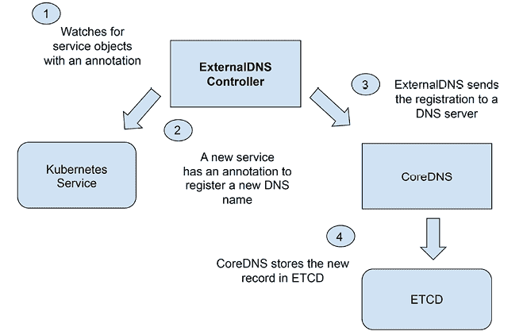

图 5.1：ExternalDNS 注册流程

在我们的示例中，我们使用 CoreDNS 作为我们的 DNS 服务器；然而，正如我们之前提到的，ExternalDNS 支持 34 种不同的 DNS 服务，并且支持的服务列表还在不断增加中。因为我们将使用 CoreDNS 作为我们的 DNS 服务器，我们需要添加一个组件来存储 DNS 记录。为了实现这一点，我们需要在集群中部署一个 ETCD 服务器。

对于我们的示例部署，我们将使用 ETCD Helm chart。

Helm 是一个用于 Kubernetes 的工具，它使得部署和管理应用程序变得更加容易。它使用 Helm charts，这些模板包含了应用程序所需的配置和资源值。它自动设置复杂应用程序的环境，确保它们在配置上保持一致和可靠。这是一个强大的工具，您会发现许多项目和供应商默认使用 Helm charts 提供他们的应用程序。您可以在他们的主页 [`v3.helm.sh/`](https://v3.helm.sh/) 上了解更多关于 Helm 的信息。

Helm 如此强大的一个原因是它能够使用自定义选项，在运行 `helm install` 命令时声明这些选项。同样的选项也可以在通过 `-f` 选项传递给安装的文件中声明。这些选项使得部署复杂系统变得更加简单和可重现，因为可以在任何部署中使用相同的值文件。

对于我们的部署示例，我们已经包含了一个位于 `chapter5/etcd` 目录中的 `values.yaml` 文件，我们将使用它来配置我们的 ETCD 部署。

现在，最后，让我们部署 ETCD 吧！我们在 `chapter5/etcd` 目录中包含了一个名为 `deploy-etcd.sh` 的脚本，它将在名为 `etcd-dns` 的新命名空间中部署一个单副本的 ETCD。在 `chapter5/etcd` 目录中执行该脚本。

由于 Helm 的帮助，脚本只需两个命令 – 它将创建一个新的命名空间，然后执行一个 `Helm install` 命令来部署我们的 ETCD 实例。在实际环境中，您可能希望将副本数量更改至至少 3 以实现高可用的 ETCD 部署，但我们希望限制我们的 KinD 服务器的资源需求。

现在我们已经为我们的 DNS 配置了 ETCD，我们可以继续将我们的 CoreDNS 服务与我们的新 ETCD 部署集成。

## 添加一个 ETCD 区域到 CoreDNS

正如我们在上一节的图表中展示的那样，CoreDNS 将在一个 ETCD 实例中存储 DNS 记录。这要求我们配置一个 CoreDNS 服务器，其中包括我们想要在其中注册名称的 DNS 区域以及将存储记录的 ETCD 服务器。

为了保持资源需求较低，我们将使用大多数 Kubernetes 安装中包含的 CoreDNS 服务器作为我们新域的基本集群创建的一部分。在实际环境中，您应该部署一个专用的 CoreDNS 服务器来处理仅限于 ExternalDNS 注册的任务。

在本节结束时，你将执行一个脚本来部署一个完全配置的 ExternalDNS 服务，其中包含本节中讨论的所有选项和配置。本节中使用的命令仅供参考；你不需要在集群中执行这些命令，因为脚本将为你完成这些操作。

在我们可以集成 CoreDNS 之前，我们需要知道新 ETCD 服务的 IP 地址。你可以通过使用`kubectl`列出`etcd-dns`命名空间中的服务来获取地址：

```
kubectl get svc etcd-dns -n etcd-dns 
```

这将显示我们的 ETCD 服务以及该服务的 IP 地址：

```
NAME       TYPE        CLUSTER-IP      EXTERNAL-IP   PORT(S)             AGE
etcd-dns   ClusterIP   10.96.149.223   <none>        2379/TCP,2380/TCP   4m 
```

你在服务列表中看到的`Cluster-IP`将用于配置新的 DNS 区域，作为存储 DNS 记录的位置。

部署 ExternalDNS 时，你可以通过两种方式配置 CoreDNS：

+   向 Kubernetes 集成的 CoreDNS 服务添加区域。

+   部署一个新的 CoreDNS 服务，该服务将用于 ExternalDNS 注册。

为了便于测试，我们将向 Kubernetes CoreDNS 服务添加一个区域。这需要我们编辑位于`kube-system`命名空间中的 CoreDNS `ConfigMap`。当你执行本节末尾的脚本时，修改将自动完成，它会在`ConfigMap`中添加下方**加粗**的部分。

```
apiVersion: v1
data:   Corefile: |     .:53 {
        errors         health {
           lameduck 5s         }
        ready         kubernetes cluster.local in-addr.arpa ip6.arpa {
           pods insecure            fallthrough in-addr.arpa ip6.arpa            ttl 30         }
        prometheus :9153         forward . /etc/resolv.conf         **etcd****foowidgets.k8s** **{**
**stubzones****path****/skydns****endpoint****http://10.96.149.223:2379** **}**
        cache 30         loop         reload         loadbalance     } 
```

添加的行配置了一个名为`foowidgets.k8s`的区域，该区域集成了 ETCD。我们添加的第一行告诉 CoreDNS，该区域名称`foowidgets.com`已与 ETCD 服务集成。

下一行`stubzone`告诉 CoreDNS 允许你将 DNS 服务器设置为某个区域的“存根解析器”。作为存根解析器，这个 DNS 服务器直接查询特定名称服务器的区域信息，而不需要在整个 DNS 层次结构中进行递归解析。

第三项添加是`path /skydns`选项，这可能看起来有些混淆，因为它没有提到 CoreDNS。尽管该值是`skydns`，但它也是 CoreDNS 集成的默认路径。

最后一行告诉 CoreDNS 将记录存储在哪里。在我们的示例中，我们运行了一个 ETCD 服务，使用 IP 地址`10.96.149.223`，并在默认的 ETCD 端口`2379`上运行。

你可以在这里使用服务的主机名而不是 IP。我们使用 IP 来展示 Pod 和服务之间的关系，但`etcd-dns.etcd-dns.svc`这个名称也可以使用。你选择哪种方式取决于你的具体情况。在我们的 KinD 集群中，我们不需要担心丢失 IP，因为集群是可丢弃的。在实际应用中，你应该使用主机名来避免 IP 地址变化带来的问题。

现在你理解了如何在 CoreDNS 中添加 ETCD 集成的区域，下一步是更新 ExternalDNS 所需的部署选项，以便与 CoreDNS 集成。

## ExternalDNS 配置选项。

ExternalDNS 可以配置为注册入口或服务对象。这在 ExternalDNS 的部署文件中使用 source 字段进行配置。以下示例显示了我们将在本章中使用的部署选项部分。

我们还需要配置 ExternalDNS 将使用的提供程序，由于我们使用的是 CoreDNS，因此我们将提供程序设置为`coredns`。

最后的选项是我们想要设置的日志级别，我们将其设置为`info`，以使日志文件更小且更易于阅读。我们将使用的参数如下所示：

```
 spec:
      serviceAccountName: external-dns
      containers:
      - name: external-dns
        image: registry.k8s.io/external-dns/external-dns:v0.13.5
        args:
        - --source=service
        - --provider=coredns
        - --log-level=info 
```

现在，我们已经讲解了 ETCD 选项和部署，如何配置一个新的区域以使用 ETCD，以及如何配置 ExternalDNS 使用 CoreDNS 作为提供程序，我们可以在集群中部署 ExternalDNS 了。

我们在`chapter5/externaldns`文件夹中包含了一个名为`deploy-externaldns.sh`的脚本。在该目录下执行脚本，以将 ExternalDNS 部署到您的 KinD 集群中。当您执行该脚本时，它将完全配置并部署一个集成了 ETCD 的 ExternalDNS。

**注意**

如果在脚本更新`ConfigMap`时看到警告，您可以安全地忽略它。由于我们的`kubectl`命令使用`apply`来更新对象，Kubernetes 会查找最后应用的配置注释（last-applied-configuration），如果有设置的话。由于您可能在现有对象中没有该注释，因此会看到缺失的警告。这只是一个警告，不会阻止`ConfigMap`的更新，您可以通过查看`kubectl`更新命令的最后一行来确认，那里显示`ConfigMap`已被更新：`configmap/coredns configured`

现在，我们已经为开发人员添加了创建动态注册 DNS 名称的能力，接下来，让我们通过创建一个新的服务来看它的实际效果，该服务将自己注册到我们的 CoreDNS 服务器中。

## 创建一个与 ExternalDNS 集成的 LoadBalancer 服务

我们的 ExternalDNS 将监视所有服务，查找包含所需 DNS 名称的注释。这只是一个单一的注释，格式为`annotation external-dns.alpha.kubernetes.io/hostname`，值为您想要注册的 DNS 名称。以我们的示例为例，我们想要注册名称`nginx.foowidgets.k8s`，因此我们会在 NGINX 服务中添加一个注释：`external-dns.alpha.kubernetes.io/hostname: nginx.foowidgets.k8s`。

在`chapter5/externaldns`目录下，我们包含了一个清单文件，该文件将通过一个包含注册 DNS 名称注释的`LoadBalancer`服务来部署 NGINX Web 服务器。

使用`kubectl create -f nginx-lb.yaml`部署清单，这将把资源部署到默认命名空间。该部署是一个标准的 NGINX 部署，但服务具有必要的注释，告诉 ExternalDNS 服务您希望注册一个新的 DNS 名称。服务的清单如下所示，注释部分为**粗体**：

```
apiVersion: v1
kind: Service
metadata:
  annotations:
    external-dns.alpha.kubernetes.io/hostname: nginx.foowidgets.k8s
  name: nginx-ext-dns
  namespace: default
spec:
  ports:
  - port: 80
    protocol: TCP
    targetPort: 80
  selector:
    app: nginx
  type: LoadBalancer 
```

当 ExternalDNS 看到该注释时，它会在区域中注册请求的名称。来自注释的主机名将在 ExternalDNS Pod 中记录一条条目 – 我们的新条目`nginx.foowidgets.k8s`的注册信息如下所示：

```
time="2023-08-04T19:16:00Z" level=debug msg="Getting service (&{ 0 10 0 \"heritage=external-dns,external-dns/owner=default,external-dns/resource=service/default/nginx-ext-dns\" false 0 1  /skydns/k8s/foowidgets/a-nginx/39ca730e}) with service host ()"
time="2023-08-04T19:16:00Z" level=debug msg="Getting service (&{172.18.200.101 0 10 0 \"heritage=external-dns,external-dns/owner=default,external-dns/resource=service/default/nginx-ext-dns\" false 0 1  /skydns/k8s/foowidgets/nginx/02b5d1d5}) with service host (172.18.200.101)"
time="2023-08-04T19:16:00Z" level=debug msg="Creating new ep (nginx.foowidgets.k8s 0 IN A  172.18.200.101 []) with new service host (172.18.200.101)" 
```

正如您在日志的最后一行看到的，记录已作为 A 记录添加到 DNS 服务器中，指向 IP 地址`172.18.200.101`。

确认 ExternalDNS 完全正常工作的最后一步是测试与应用程序的连接。由于我们使用的是 KinD 集群，因此必须从集群中的 Pod 进行测试。为了将新名称提供给外部资源，我们需要配置主 DNS 服务器，将对`foowidgets.k8s`域的请求转发到 CoreDNS 服务器。在本节末尾，我们将展示如何将 Windows DNS 服务器（这可以是您网络中的任何主 DNS 服务器）与 Kubernetes CoreDNS 服务器集成的步骤。

现在我们可以使用从注释中获得的 DNS 名称测试 NGINX 部署。由于您没有将 CoreDNS 服务器作为主 DNS 提供商，我们需要使用集群中的容器来测试名称解析。有一个很棒的工具叫做**Netshoot**，它包含许多有用的故障排除工具；这是一个很好的工具，可以用来测试和排查集群及 Pod 的问题。

要运行 Netshoot 容器，我们可以使用`kubectl run`命令。我们只需要在使用它进行集群测试时运行 Pod，因此我们将告诉`kubectl run`命令运行一个交互式 Shell，并在退出后删除 Pod。要运行 Netshoot，请执行：

```
kubectl run tmp-shell --rm -i --tty --image nicolaka/netshoot -- /bin/bash 
```

Pod 可能需要一两分钟才能变得可用，但一旦启动，您将看到`tmp-shell`提示符。在此提示符下，我们可以使用`nslookup`来验证 DNS 条目是否已成功添加。如果您尝试查找`nginx.foowidgets.k8s`，应该会收到该服务的 IP 地址作为回应。

```
nslookup nginx.foowidgets.k8s 
```

您的回复应类似于以下示例：

```
Server:		10.96.0.10
Address:	10.96.0.10#53
Name:   nginx.foowidgets.k8s
Address: 172.18.200.101 
```

这确认了我们的注释是成功的，并且 ExternalDNS 已在 CoreDNS 服务器中注册了我们的主机名。

`nslookup`仅能证明`nginx.foowidgets.k8s`有条目；它并没有测试应用程序。为了证明我们有一个成功的部署，并且当有人在浏览器中输入该名称时它能够工作，我们可以使用 Netshoot 中包含的`curl`工具。

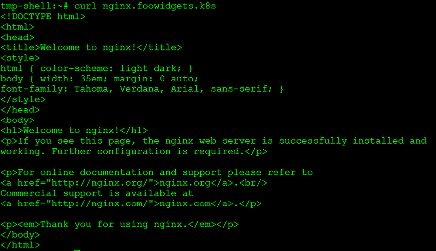

图 5.2：使用 ExternalDNS 名称的 curl 测试

curl 输出确认我们可以使用动态创建的服务名称访问 NGINX Web 服务器。

我们意识到这些测试可能不太令人兴奋，因为无法通过标准浏览器进行测试。为了让 CoreDNS 能够在集群外部使用，我们需要将 CoreDNS 与您的主 DNS 服务器集成，这需要将 CoreDNS 中区域的所有权委托给主 DNS 服务器。当您委托一个区域时，任何针对主 DNS 服务器的请求，如果请求的主机位于该委托的区域中，都会将请求转发到包含该区域的 DNS 服务器。

在下一节中，我们将集成在集群中运行的 CoreDNS 与 Windows DNS 服务器。虽然我们使用 Windows 作为 DNS 服务器，但不同操作系统和 DNS 服务器之间的区域委托概念是相似的。

### 将 CoreDNS 与企业 DNS 服务器集成

本节将展示如何使用主 DNS 服务器将 `foowidgets.k8s` 区域的名称解析转发到运行在 Kubernetes 集群中的 CoreDNS 服务器。

这里提供的步骤是将企业 DNS 服务器与 Kubernetes DNS 服务集成的示例。由于外部 DNS 的要求和额外的设置，这些步骤仅供参考，**不应在您的 KinD 集群上执行**。

要在委托的区域中查找记录，主 DNS 服务器使用一种称为递归查询的过程。递归查询是由 DNS 解析器发起的 DNS 查询，代表用户进行操作。在递归查询过程中，DNS 解析器承担了通过层级模式联系多个 DNS 服务器的任务。其目标是找到请求域的权威 DNS 服务器，并启动请求的 DNS 记录检索。

下图展示了通过将区域委托给 CoreDNS 服务器来提供 DNS 解析的流程，在企业环境中尤为适用。

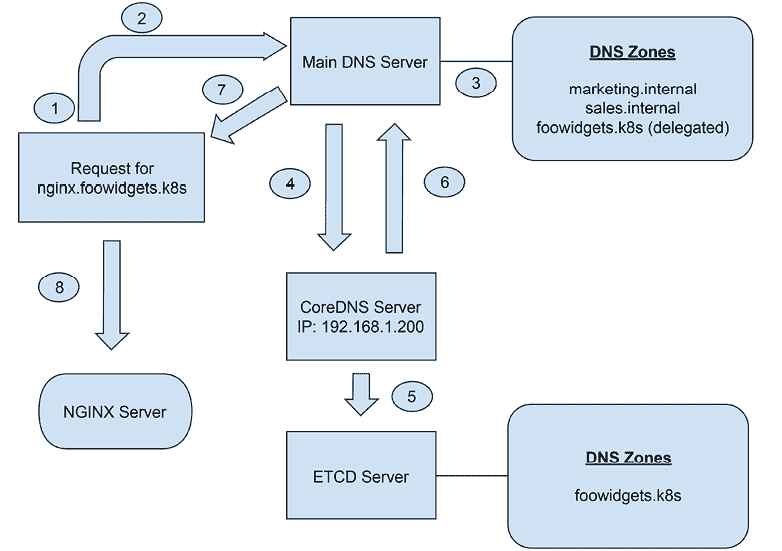

图 5.3：DNS 委托流程

1.  本地客户端将查看其 DNS 缓存中的请求名称。

1.  如果名称不在本地缓存中，将向主 DNS 服务器请求 `nginx.foowidgets.k8s`。

1.  DNS 服务器接收到查询后，会查看它知道的区域。它找到 `foowidgets.k8s` 区域，并发现该区域已被委托给运行在 `192.168.1.200` 上的 CoreDNS。

1.  主 DNS 服务器将查询发送到委托的 CoreDNS 服务器。

1.  CoreDNS 在 `foowidgets.k8s` 区域中查找名称 `nginx`。

1.  CoreDNS 将 `foowidgets.k8s` 的 IP 地址返回给主 DNS 服务器。

1.  主 DNS 服务器将包含 `nginx.foowidgets.k8s` 地址的回复发送给客户端。

1.  客户端通过从 CoreDNS 返回的 IP 地址连接到 NGINX 服务器。

让我们继续来看一个现实世界的例子。在我们的场景中，主 DNS 服务器运行在 Windows 2019 服务器上，我们将把一个区域委托给 CoreDNS 服务器。

部署的组件如下：

+   我们的网络子网是 `10.2.1.0/24`

+   运行 DNS 的 Windows 2019 或更高版本服务器

+   一个 Kubernetes 集群

+   一个 MetalLB 地址池，范围为 `10.2.1.70`-`10.2.1.75`

+   使用 `LoadBalancer` 服务部署的 CoreDNS 实例，分配了来自我们的 IP 池的 IP 地址 `10.2.1.74`

+   部署的附加组件，使用本章中的配置，包括 ExternalDNS、CoreDNS 的 ETCD 部署，以及一个新的 CoreDNS ETCD 集成区域

+   Bitnami NGINX 部署用于测试委托

现在，让我们通过配置步骤来集成我们的 DNS 服务器。

# 将 CoreDNS 暴露给外部请求

我们已经覆盖了如何部署大多数你需要集成的资源——ETCD、ExternalDNS，并通过一个新的 ETCD 集成区域配置 CoreDNS。为了提供对 CoreDNS 的外部访问，我们需要创建一个新的服务，将 CoreDNS 显示在 TCP 和 UDP 端口 `53` 上。完整的服务清单如下所示。

```
apiVersion: v1
kind: Service
metadata:
  labels:
    k8s-app: kube-dns
    kubernetes.io/cluster-service: "true"
    kubernetes.io/name: CoreDNS
  name: kube-dns-ext
  namespace: kube-system   
spec:
  ports:
  - name: dns
    port: 53
    protocol: UDP
    targetPort: 53
   selector:
    k8s-app: kube-dns
  type: LoadBalancer
  loadBalancerIP: 10.2.1.74 
```

服务中有一个新的选项我们尚未讨论——我们在部署中添加了`spec.loadBalancerIP`。这个选项允许你为服务分配一个 IP 地址，即使服务被重新创建，它仍然会保持一个稳定的 IP 地址。我们需要一个静态 IP，因为我们需要启用从主 DNS 服务器到 Kubernetes 集群中的 CoreDNS 服务器的转发。

一旦 CoreDNS 通过端口 `53` 使用 `LoadBalancer` 公开，我们可以配置主 DNS 服务器将 `foowidgets.k8s` 域中的主机请求转发到我们的 CoreDNS 服务器。

## 配置主 DNS 服务器

在我们的主 DNS 服务器上，首先要做的就是创建一个条件转发器，指向运行 CoreDNS Pod 的节点。

在 Windows DNS 主机上，我们需要为 `foowidgets.k8s` 创建一个新的条件转发器，指向我们分配给新 CoreDNS 服务的 IP 地址。在我们的示例中，CoreDNS 服务已分配给主机 `10.2.1.74`：

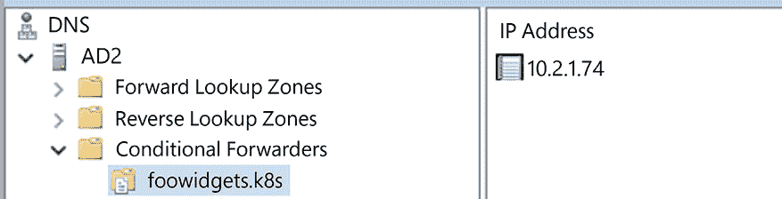

图 5.4：Windows 条件转发器设置

这配置了 Windows DNS 服务器，将任何对 `foowidgets.k8s` 域中主机的请求转发到运行在 IP 地址 `10.2.1.74` 上的 CoreDNS 服务。

## 测试 DNS 转发到 CoreDNS

为了测试配置，我们将使用一台已配置为使用 Windows DNS 服务器的主网络工作站。

我们将运行的第一个测试是对 MetalLB 注解创建的 NGINX 记录进行 `nslookup`：

从命令提示符中，我们执行 `nslookup nginx.foowidgets.k8s` 命令：

```
Server:  AD2.hyper-vplanet.com
Address:  10.2.1.14
Name:    nginx.foowidgets.k8s
Address:  10.2.1.75 
```

由于查询返回了我们期望的记录 IP 地址，我们可以确认 Windows DNS 服务器正在正确地将请求转发到 CoreDNS。

我们可以从笔记本浏览器上再做一个额外的 NGINX 测试。在 Chrome 中，我们可以使用在 CoreDNS 中注册的 URL `nginx.foowidgets.k8s`。

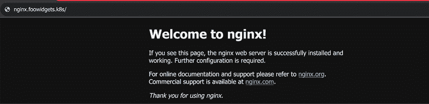

图 5.5：使用 CoreDNS 从外部工作站成功浏览

一个测试确认转发工作正常，但我们还想创建一个额外的部署来验证系统完全正常运行。

为了测试一个新服务，我们部署了一个不同的 NGINX 服务器，名为 microbot，并为其服务添加了一个注解，指定了名称`microbot.foowidgets.k8s`。MetalLB 为该服务分配了 IP 地址 `10.2.1.65`。

如同我们之前的测试一样，我们使用`nslookup`测试名称解析：

```
Name:    AD2.hyper-vplanet.com
Address:  10.2.1.65 
```

为了确认 Web 服务器是否正确运行，我们从工作站浏览该 URL：

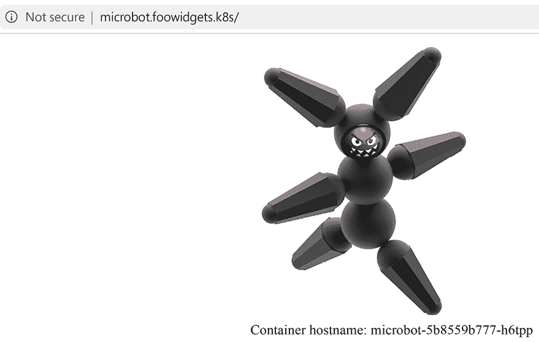

图 5.6：使用 CoreDNS 从外部工作站成功浏览

成功！我们现在已将企业 DNS 服务器与运行在 Kubernetes 集群上的 CoreDNS 服务器集成。这一集成使用户能够通过简单地向服务添加注释来动态注册服务名称。

# 跨多个集群的负载均衡

配置多个集群中运行的服务有多种方法，通常涉及复杂且昂贵的附加组件，如全局负载均衡器。全局负载均衡器可以看作是一个交通警察——它知道如何在多个端点之间指引传入流量。从高层次来看，你可以创建一个新的 DNS 条目，供全局负载均衡器控制。这个新的条目将有后端系统被添加到端点列表中，并根据健康状况、连接数或带宽等因素，它将把流量指向这些端点节点。如果某个端点因任何原因不可用，负载均衡器将把它从端点列表中移除。通过将其从列表中移除，流量只会发送到健康的节点，从而提供流畅的终端用户体验。对客户来说，最糟糕的情况就是当他们尝试访问网站时，遇到“网站未找到”的错误。

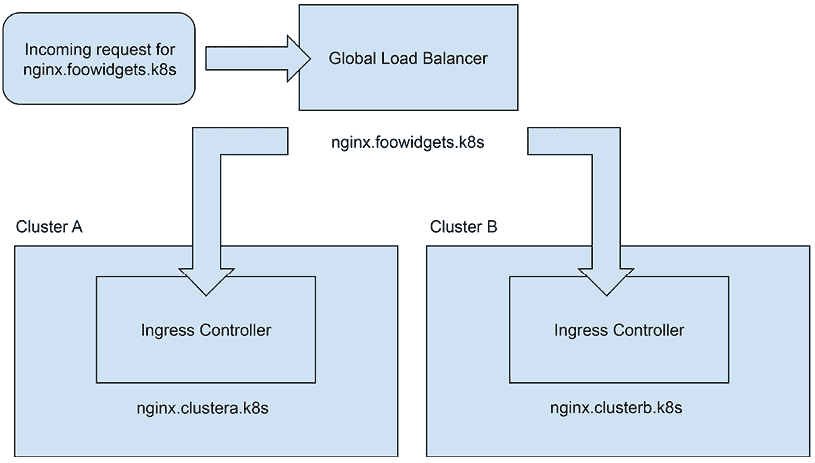

图 5.7：全局负载均衡流量流程

上图展示了一个健康的工作流，其中两个集群都在运行我们进行负载均衡的应用程序。当请求到达负载均衡器时，它将以轮询方式在两个集群之间分配流量。`nginx.foowidgets.k8s`请求最终将流量发送到`nginx.clustera.k8s`或`nginx.clusterb.k8s`。

在*图 5.8*中，我们看到集群 B 中的 NGINX 工作负载发生故障。由于全局负载均衡器对正在运行的工作负载进行了健康检查，它将从`nginx.foowidgets.k8s`条目中移除集群 B 的端点。

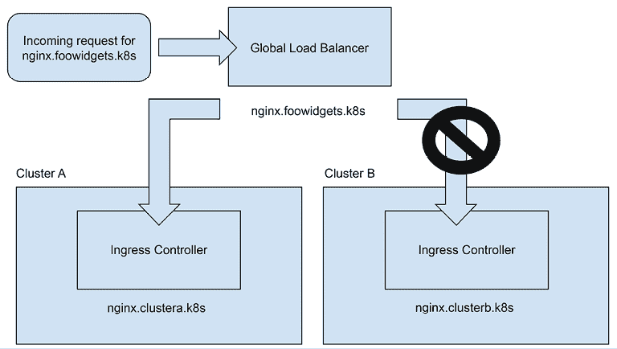

图 5.8：全局负载均衡流量流程（带站点故障）

现在，对于任何请求`nginx.foowidgets.k8s`进入负载均衡器的流量，唯一会被用于流量的端点是在集群 A 上运行的。一旦集群 B 的问题得到解决，负载均衡器将自动将集群 B 的端点重新添加到`nginx.foowidgets.k8s`记录中。

这样的解决方案在企业中广泛应用，许多组织利用**F5**、**Citrix**、**Kemp**和**A10**等公司提供的产品，以及像**Route 53**和**Traffic Director**这样的 CSP 本地解决方案来管理跨多个集群的工作负载。然而，也有一些与 Kubernetes 集成的具有类似功能的项目，而且这些项目几乎不需要成本。虽然这些项目可能没有一些供应商解决方案的所有功能，但它们通常能够满足大多数用例的需求，而无需完整的昂贵功能。

其中一个项目是 **K8GB**，一个创新的开源项目，将 **全球服务器负载均衡** (**GSLB**) 引入 Kubernetes。通过 K8GB，组织可以轻松地将传入的网络流量分配到位于不同地理位置的多个 Kubernetes 集群。通过智能地路由请求，K8GB 保证了低延迟、最佳响应时间和冗余，为任何企业提供了卓越的解决方案。

本节将介绍 K8GB，但如果你想了解更多关于该项目的内容，请访问项目的主页 [`www.k8gb.io`](https://www.k8gb.io)。

由于我们使用 KinD 和单一主机来搭建集群，本书的这一部分旨在向你介绍该项目及其带来的好处。本节内容仅供参考，因为这是一个复杂的话题，涉及多个组件，其中一些组件超出了 Kubernetes 的范畴。如果你决定自己实现解决方案，我们已经在本书的代码库中包含了示例文档和脚本，位于 `chapter5/k8gs-example` 目录下。

K8GB 是一个 CNCF 沙箱项目，这意味着它处于早期阶段，在本章写作后，任何更新的版本都可能对对象和配置做出更改。

## 介绍 Kubernetes 全球负载均衡器

为什么你应该关心像 K8GB 这样的项目？

让我们以一个内部企业云为例，企业在生产站点运营一个 Kubernetes 集群，并在灾难恢复站点运营另一个集群。为了确保顺畅的用户体验，重要的是让应用程序能够在这些数据中心之间无缝过渡，且在灾难恢复事件期间不需要任何人工干预。挑战在于，当多个集群同时为这些应用程序提供服务时，如何满足企业对微服务高可用性的需求。我们需要有效地解决跨地理分布的 Kubernetes 集群中持续和不中断服务的需求。

这就是 **K8GB** 的作用。

是什么使得 K8GB 成为解决我们高可用性需求的理想方案？正如其网站所记录的，关键特性包括以下内容：

+   负载均衡是通过一个非常可靠、适用于全球部署的抗时间考验的 DNS 协议提供的

+   不需要管理集群

+   没有单点故障

+   它使用原生 Kubernetes 健康检查来做负载均衡决策

+   配置和创建一个 Kubernetes CRD 一样简单

+   它适用于任何 Kubernetes 集群 —— 无论是本地集群还是云端集群

+   它是免费的！

正如你将在本节中看到的，K8GB 提供了一种简单直观的配置方式，使得为你的组织提供全球负载均衡变得容易。这可能让 K8GB 看起来没有做太多事情，但在幕后，它提供了许多先进的功能，包括：

+   **全球负载均衡**：促进将传入的网络流量分配到位于不同地理区域的多个 Kubernetes 集群。由此，它能够优化应用交付，减少延迟并改善用户体验。

+   **智能流量路由**：利用复杂的路由算法，智能地将客户端请求引导至最近或最合适的 Kubernetes 集群，考虑诸如接近度、服务器健康状况和特定应用规则等因素。这种方法确保了高效且响应迅速的流量管理，优化了应用的性能。

+   **高可用性和冗余性**：通过在集群、应用或数据中心发生故障时自动重定向流量，确保应用的高可用性和容错性。这种故障转移机制最大限度减少了灾难恢复场景中的停机时间，确保了对用户的不间断服务交付。

+   **自动故障切换**：通过启用数据中心之间的自动故障切换，简化了操作，免去了人工干预的需求。这消除了对人为触发的**灾难恢复**（**DR**）事件或任务的要求，确保了快速和不间断的服务交付以及精简的运营。

+   **与 Kubernetes 的集成**：提供与 Kubernetes 的无缝集成，简化了为部署在集群中的应用配置 GSLB 的设置过程。通过利用 Kubernetes 的原生能力，K8GB 提供了一个可扩展的解决方案，提升了全球负载均衡操作的整体管理和效率。

+   **本地部署和云服务商支持**：为企业提供了一种有效管理多个 Kubernetes 集群的 GSLB 方式，使复杂的多区域部署和混合云场景的处理变得无缝。这确保了在不同环境中优化应用交付，提升了基础设施的整体性能和韧性。

+   **定制化和灵活性**：为用户提供定义个性化流量路由规则和策略的自由，使组织能够灵活定制 GSLB 配置，精确满足其独特需求。这使企业能够根据具体需求优化流量管理，并确保能无缝适应不断变化的应用需求。

+   **监控、度量和追踪**：包括监控、度量和追踪功能，使管理员能够访问跨多个集群的流量模式、健康状况和性能指标的洞察。这提供了增强的可视性，帮助管理员做出明智的决策，并优化 GSLB 设置的整体性能和可靠性。

现在我们已经讨论了 K8GB 的主要特性，接下来我们将深入了解细节。

## K8GB 的要求

对于像全球负载均衡这样提供复杂功能的产品，K8GB 不需要大量的基础设施或资源就可以为您的集群提供负载均衡。最新版本（截至本章节编写时）是`0.12.2`——它只有少数几个要求：

+   CoreDNS 服务器的负载均衡器 IP 地址，使用命名标准 `gslb-ns-<k8gb-name>-gb.foowidgets.k8s`——例如，`gslb-ns-us-nyc-gb.foowidgets.k8s` 和 `gslb-ns-us-buf-gb.foowidgets.k8s`

如果您使用的是像 **Route 53**、**Infoblox** 或 **NS1** 这样的服务，CoreDNS 服务器将自动添加到域中。由于我们的示例使用的是运行在 Windows 2019 服务器上的本地 DNS 服务器，我们需要手动创建记录。

+   一个 Ingress 控制器

+   在集群中部署的 K8GB 控制器，它将部署：

    +   K8GB 控制器

    +   配置了 CoreDNS CRD 插件的 CoreDNS 服务器——这已经包含在 K8GB 的部署中

由于我们在前面的章节中已经探讨了 NGINX Ingress 控制器，现在我们将重点关注额外的要求：在集群内部署和配置 K8GB 控制器。

在下一节中，我们将讨论实现 K8GB 的步骤。

## 将 K8GB 部署到集群

我们已在 GitHub 仓库的 `chapter5/k8gb-example` 目录下包含了示例文件。脚本基于我们将在本章余下部分中使用的示例。如果您决定在开发集群中使用这些文件，您需要满足以下要求：

+   两个 Kubernetes 集群（每个集群可以使用一个单节点的 `kubeadm` 集群）

+   在每个集群中部署的 CoreDNS

+   在每个集群中部署 K8GB

+   一个边缘 DNS 服务器，您可以用来委派 K8GB 的域

安装 K8GB 已经变得非常简单——您只需要使用已为您的基础设施配置好的 `values.yaml` 文件部署一个单一的 Helm 图表。

要安装 K8GB，您需要将 K8GB 仓库添加到您的 Helm 仓库列表中，然后更新图表：

```
helm repo add k8gb https://www.k8gb.io
helm repo update 
```

在执行 `helm install` 命令之前，我们需要为每个集群部署自定义 Helm `values.yaml` 文件。我们已经在 `chapter5/k8gb-example` 目录中包含了我们示例中使用的两个集群的 values 文件，分别是 `k8gb-buff-values.yaml` 和 `k8gb-nyc-values.yaml`。这些选项将在 *自定义 Helm 图表值* 一节中讨论。

### 了解 K8GB 的负载均衡选项

在我们的示例中，我们将配置 K8GB 作为两个本地集群之间的故障切换负载均衡器；然而，K8GB 不仅仅局限于故障切换。像大多数负载均衡器一样，K8GB 提供多种解决方案，可以根据每个负载均衡的 URL 配置不同的策略。它提供了最常用的策略，包括轮询、加权轮询、故障切换和 GeoIP。

每个策略的描述如下：

+   **轮询（Round Robin）**：如果未指定策略，它将默认为简单的轮询负载均衡配置。使用轮询意味着请求将在配置的集群之间进行分配——请求 1 将发送到集群 1，请求 2 将发送到集群 2，请求 3 将发送到集群 1，请求 4 将发送到集群 2，以此类推。

+   **加权轮询（Weighted Round Robin）**：类似于轮询，该策略提供了指定流量百分比发送到某个集群的能力；例如，75%的流量将发送到集群 1，15%的流量将发送到集群 2。

+   **故障转移（Failover）**：除非某个部署的所有 Pod 不可用，否则所有流量将发送到主集群。如果集群 1 中的所有 Pod 都宕机，集群 2 将接管工作负载，直到集群 1 中的 Pod 恢复可用，届时集群 1 将重新成为主集群。

+   **GeoIP：** 将请求定向到与客户端连接最近的集群。如果最近的主机宕机，它将使用另一个集群，类似于故障转移策略的工作方式。要使用此策略，你需要创建一个 GeoIP 数据库（示例可参考此处：[`github.com/k8gb-io/coredns-crd-plugin/tree/main/terratest/geogen`](https://github.com/k8gb-io/coredns-crd-plugin/tree/main/terratest/geogen)），并且你的 DNS 服务器需要支持**EDNS0**扩展。

**EDNS0**基于 RFC 2671，该规范概述了 EDNS0 的工作原理及其各个组成部分，包括启用 EDNS0 的 DNS 消息格式、EDNS0 选项的结构以及其实现指南。RFC 2671 的目标是提供一种标准化的方法，用于扩展 DNS 协议的功能，突破其原有的局限性，允许加入新功能、选项和增强特性。

现在你已经了解了可用的策略，我们来回顾一下我们集群的示例基础设施：

| **集群/服务器详情** | **详情** |
| --- | --- |
| 企业 DNS 服务器 – 纽约市 IP：`10.2.1.14` | 主要企业区域`foowidgets.k8s`CoreDNS 服务器的主机记录`gslb-ns-us-nyc-gb.foowidgets.k8s``gslb-ns-us-buf-gb.foowidgets.k8s`全球域名配置，委派给集群中的 CoreDNS 服务器`gb.foowidgets.k8s` |
| `纽约市`，纽约 – 集群 1 主站 CoreDNS 负载均衡 IP：`10.2.1.221`Ingress IP：`10.2.1.98` | 使用 HostPort 公开的 NGINX Ingress Controller，使用 MetalLB 公开的 CoreDNS 部署 |
| `布法罗`，纽约 – 集群 2 次要站 CoreDNS 负载均衡 IP：`10.2.1.224`Ingress IP：`10.2.1.167` | 使用 HostPort 公开的 NGINX Ingress Controller，使用 MetalLB 公开的 CoreDNS 部署 |

表 5.1：集群详情

我们将使用上表中的详情来解释如何在我们的示例基础设施中部署 K8GB。

通过基础设施的详细信息，我们现在可以为每个部署创建我们的 Helm `values.yaml`文件。在接下来的部分，我们将展示我们需要使用示例基础设施配置的值，并解释每个值的含义。

### 自定义 Helm 图表值

每个集群将有一个类似的值文件；主要的变化是我们使用的标签值。下面的值文件是纽约市集群的配置：

```
k8gb:
  dnsZone: "gb.foowidgets.k8s" 
  edgeDNSZone: "foowidgets.k8s" 
  edgeDNSServers:
    - 10.2.1.14     
  clusterGeoTag: "us-buf" 
  extGslbClustersGeoTags: "us-nyc"
coredns:
  isClusterService: false
  deployment:
    skipConfig: true
  image:
    repository: absaoss/k8s_crd
    tag: v0.0.11
  serviceAccount:
    create: true
    name: coredns
  serviceType: LoadBalancer 
```

对于 NYC 集群，除了 `clusterGeoTag` 和 `extGslbClustersGeoTags` 值外，其他文件内容相同，对于 NYC 集群，这些值需要设置为：

```
clusterGeoTag: "us-nyc"
extGslbClustersGeoTags: "us-buf" 
```

如你所见，这个配置并不冗长，仅需要少数选项来配置通常复杂的全局负载均衡配置。

现在，让我们来了解一下我们使用的部分主要配置项。

我们将解释的主要内容是 K8GB 部分的配置值，这些值配置了 K8GB 用于负载均衡的所有选项。

| **Chart 值** | **描述** |
| --- | --- |
| `dnsZone` | 这是你将用于 K8GB 的 DNS 区域——基本上，这是用于存储我们全局负载均衡的 DNS 记录的 DNS 区域。 |
| `edgeDNSZone` | 包含用于前一个选项（`dnsZone`）的 CoreDNS 服务器的 DNS 记录的主要 DNS 区域。 |
| `edgeDNSServers` | 边缘 DNS 服务器——通常是用于名称解析的主要 DNS 服务器。 |
| `clusterGeoTag` | 如果你有多个 K8GB 控制器，使用此标签来指定彼此之间的实例。在我们的示例中，我们将其设置为 `us-buf` 和 `us-nyc` 来表示我们的集群。 |
| `extGslbClusterGeoTags` | 指定要与之配对的其他 K8GB 控制器。在我们的示例中，每个集群会添加另一个集群的 `clusterGeoTags` —— `Buffalo` 集群添加 `us-nyc` 标签，NYC 集群添加 `us-buf` 标签。 |
| `isClusterService` | 设置为 `true` 或 `false`。用于服务升级；你可以在 [`www.k8gb.io/docs/service_upgrade.xhtml`](https://www.k8gb.io/docs/service_upgrade.xhtml) 阅读更多信息。 |
| `exposeCoreDNS` | 如果设置为 `true`，将创建一个 `LoadBalancer` 服务，公开在 `k8gb` 命名空间中部署的 CoreDNS，使用端口 `53`/UDP 供外部访问。 |
| `deployment.skipConfig` | 设置为 true 或 false。设置为 false 时，告诉部署使用 K8GB 附带的 CoreDNS。 |
| `image.repository` | 配置用于 CoreDNS 镜像的仓库。 |
| `image.tag` | 配置拉取镜像时使用的标签。 |
| `serviceAccount.create` | 设置为 `true` 或 `false`。设置为 true 时，将创建一个服务帐户。 |
| `serviceAccount.name` | 设置来自前一个选项的服务帐户名称。 |
| `serviceType` | 配置 CoreDNS 的服务类型。 |

表 5.2：K8GB 配置选项

### 使用 Helm 安装 K8GB

完成 K8GB 概述和 Helm 值文件配置后，我们可以开始在集群中安装 K8GB。我们已经包含了将 K8GB 部署到 `Buffalo` 和 `NYC` 集群的脚本。在 `chapter5/k8gb-example/k8gb` 目录下，你会看到两个脚本，分别是 `deploy-k8gb-buf.sh` 和 `deploy-k8gb-nyc.sh` —— 这些脚本应在各自的集群中运行。

脚本将执行以下步骤：

1.  将 K8GB Helm 仓库添加到服务器的仓库列表中

1.  更新仓库

1.  使用适当的 Helm 值文件部署 K8GB

1.  创建一个 **Gslb 记录**（在下一部分中讲解）

1.  创建一个名为 `demo` 的命名空间中的部署，用于测试

部署完成后，您将看到在 `k8gb` 命名空间中运行的两个 pod，一个是 `k8gb` 控制器，另一个是用于解析负载均衡名称的 CoreDNS 服务器：

```
NAME                           READY   STATUS    RESTARTS    AGE
k8gb-8d8b4cb7c-mhglb           1/1     Running   0           7h58m
k8gb-coredns-7995d54db5-ngdb2  1/1     Running   0           7h37m 
```

我们还可以验证已经创建了服务来处理传入的 DNS 请求。由于我们使用 `LoadBalancer` 类型进行了暴露，我们将看到在端口 `53` 上使用 UDP 协议的 `LoadBalancer` 服务：

```
NAME		TYPE           CLUSTER-IP     EXTERNAL-IP   PORT(S)		AGE   
k8gb-coredns	LoadBalancer   10.96.185.56   10.2.1.224    53:32696/UDP	2d18h 
```

在 K8GB 部署完成并在两个集群中验证后，让我们继续下一部分，解释如何为我们的负载均衡区创建边缘委派。

### 委派我们的负载均衡区

在我们的示例中，我们使用 Windows 服务器作为边缘 DNS 服务器，在这里我们的 K8s DNS 名称将被注册。在 DNS 方面，我们需要为 CoreDNS 服务器添加两个 DNS 记录，然后我们需要将负载均衡区委派给这些服务器。

这两个 A 记录需要位于主边缘 DNS 区域中。在我们的示例中，这是 `foowidgets.k8s` 区域。在此区域中，我们需要为通过 `LoadBalancer` 服务暴露的 CoreDNS 服务器添加两个条目：

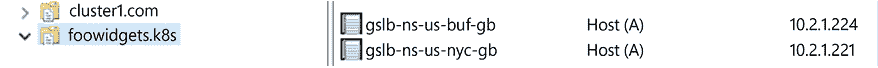

图 5.9：将我们的 CoreDNS 服务器添加到边缘区域

接下来，我们需要创建一个新的委派区，用于我们的负载均衡服务名称。在 Windows 中，这是通过 *右键单击* 区域并选择 **新建委派** 来完成的；在委派向导中，系统会要求您提供 **委派域**。在我们的示例中，我们将委派 **gb** 域作为我们的域。

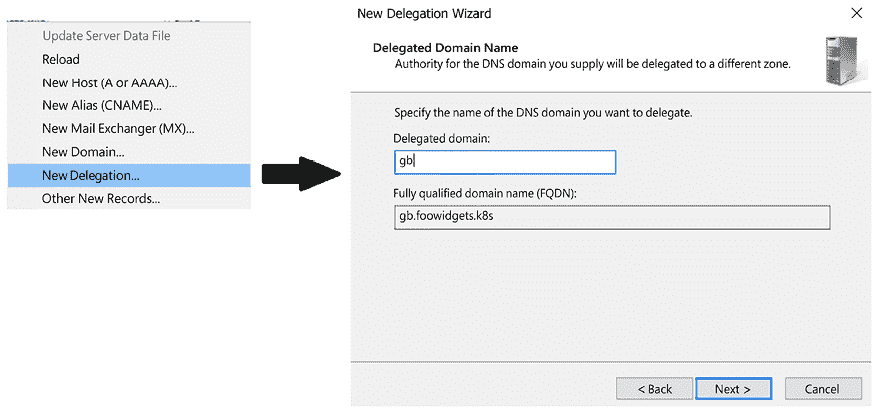

图 5.10：创建一个新的委派区

在输入区域名称并点击 **下一步** 后，您将看到一个新的屏幕，要求您为委派域添加 DNS 服务器；点击 **添加** 后，您将输入 CoreDNS 服务器的 DNS 名称。记住我们在主域 `foowidgets.com` 中创建了两个 A 记录。当您添加条目时，Windows 会验证输入的名称是否正确解析，DNS 查询是否正常工作。添加了两个 CoreDNS 服务器后，摘要屏幕将显示它们的 IP 地址。

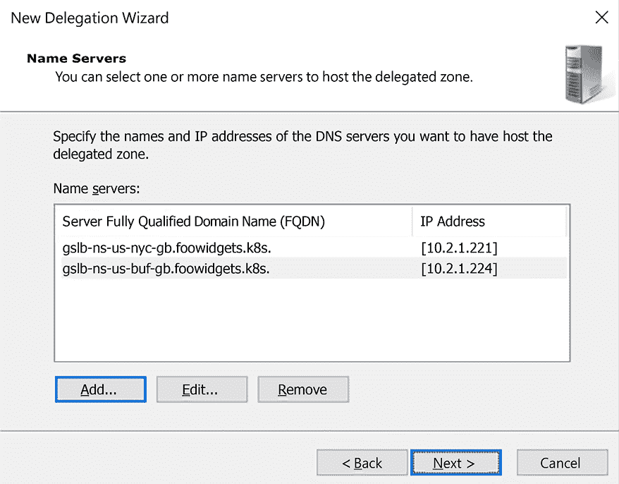

图 5.11：为 CoreDNS 服务器添加 DNS 名称

这完成了边缘服务器的配置。对于某些边缘服务器，K8GB 会自动创建委派记录，但只有少数几台服务器支持此功能。对于那些不能自动创建委派服务器的边缘服务器，您需要像本节中那样手动创建它们。

现在我们已经在集群中部署了 CoreDNS，并且委派了负载均衡区，接下来我们将部署一个具有全球负载均衡的应用程序来测试我们的配置。

## 使用 K8GB 部署一个高可用应用程序

启用应用程序的全局负载均衡有两种方法。你可以使用 K8GB 提供的自定义资源创建一个新记录，或者你也可以为 Ingress 规则添加注释。为了演示 K8GB，我们将在集群中部署一个简单的 NGINX Web 服务器，并使用原生提供的自定义资源将其添加到 K8GB。

### 使用自定义资源将应用程序添加到 K8GB

当我们部署 K8GB 时，一个新的 **自定义资源定义** (**CRD**) 名为 `Gslb` 被添加到了集群中。这个 CRD 扮演着管理标记为全局负载均衡的应用程序的角色。在 `Gslb` 对象中，我们定义了 Ingress 名称的规范，格式与常规的 Ingress 对象相同。标准 Ingress 和 `Gslb` 对象之间唯一的区别在于清单的最后部分，即策略。

策略定义了我们想要使用的负载均衡类型，在我们的示例中是故障转移策略，以及该对象要使用的主 GeoTag。在我们的示例中，NYC 集群是我们的主集群，因此我们的 `Gslb` 对象将设置为 `us-buf`。

要部署一个将利用负载均衡的应用程序，我们需要在两个集群中创建以下内容：

1.  应用程序的标准部署和服务。我们将把部署命名为 `nginx`，使用标准的 NGINX 镜像。

1.  每个集群中的一个 `Gslb` 对象。对于我们的示例，我们将使用以下清单，该清单将声明 Ingress 规则，并将策略设置为故障转移，使用 `us-buf` 作为主要的 K8GB。由于 `Gslb` 对象包含 Ingress 规则的信息，你无需创建 Ingress 规则；`Gslb` 会为我们创建 Ingress 对象。以下是一个示例：

    ```
    apiVersion: k8gb.absa.oss/v1beta1
    kind: Gslb
    metadata:
      name: gslb-failover-buf
      namespace: demo
    spec:
      ingress:
        ingressClassName: nginx
        rules:
        - host: fe.gb.foowidgets.k8s      # Desired GSLB enabled FQDN
          http:
            paths:
            - backend:
                service:
                  name: nginx             # Service name to enable GSLB for
                  port:
                    number: 80
              path: /
              pathType: Prefix
      strategy:
        type: failover                    # Global load balancing strategy
        primaryGeoTag: us-buf             # Primary cluster geo tag 
    ```

当你部署 `Gslb` 对象的清单时，它将创建两个 Kubernetes 对象，分别是 `Gslb` 对象和 Ingress 对象。

如果我们查看 `Buffalo` 集群中的 `demo` 命名空间下的 `Gslb` 对象，我们将看到以下内容：

```
NAMESPACE   NAME                STRATEGY   GEOTAG
demo        gslb-failover-buf   failover   us-buf 
```

如果我们查看 NYC 集群中的 Ingress 对象，我们会看到：

```
NAME                CLASS   HOSTS                  ADDRESS      PORTS   AGE
gslb-failover-buf   nginx   fe.gb.foowidgets.k8s   10.2.1.167   80      15h 
```

我们还将在 NYC 集群中有类似的对象，具体内容将在 *理解 K8GB 如何提供全局负载均衡* 部分进行解释。

### 使用 Ingress 注释将应用程序添加到 K8GB

将应用程序添加到 K8GB 的第二种方法是向标准的 Ingress 规则添加两个注释，这主要是为了允许开发人员将现有的 Ingress 规则添加到 K8GB。

要将 Ingress 对象添加到全局负载均衡列表中，你只需要向 Ingress 对象添加两个注释：`strategy` 和 `primary-geotag`。以下是注释的示例：

```
k8gb.io/strategy: "failover"
k8gb.io/primary-geotag: "us-buf" 
```

这将使用 `us-buf` GeoTag 作为主标签，通过故障转移策略将 Ingress 添加到 K8GB。

现在我们已经部署了所有必需的基础设施组件和所有必需的对象，以便为应用程序启用全局负载均衡，让我们看看它的实际运行情况。

## 理解 K8GB 如何提供全局负载均衡

K8GB 的设计很复杂，但一旦你部署了应用程序并了解了 K8GB 如何维护区域文件，理解起来就会变得容易。这个话题相当复杂，它假设你对 DNS 如何工作有一些先验知识，但在本节结束时，你应该能够解释 K8GB 是如何工作的。

### 保持 K8GB CoreDNS 服务器同步

第一个要讨论的话题是 K8GB 如何保持两个或更多区域文件同步，以提供我们部署的无缝故障切换。无缝故障切换是一个确保即使在系统出现问题或故障时，应用程序仍能平稳运行的过程。它会自动切换到备份系统或资源，保持用户体验不中断。

如前所述，每个 K8GB CoreDNS 服务器必须在主 DNS 服务器中有一条记录。

这是我们为边缘值在 `values.yaml` 文件中配置的 DNS 服务器和区域：

```
edgeDNSZone: "foowidgets.k8s"
edgeDNSServer: "10.2.1.14" 
```

所以，在边缘 DNS 服务器（`10.2.1.14`）中，我们为每个 CoreDNS 服务器使用所需的 K8GB 命名约定配置了主机记录：

```
gslb-ns-us-nyc-gb.gb.foowidgets.k8s    10.2.1.221  (The NYC CoreDNS load balancer IP)
gslb-ns-us-buf-gb.gb.foowidgets.k8s    10.2.1.224  (The BUF CoreDNS load balancer IP) 
```

K8GB 会在所有 CoreDNS 服务器之间进行通信，并更新任何因新增、删除或更新而需要更新的记录。

通过一个例子，这个过程变得更容易理解。使用我们的集群示例，我们已部署了一个 NGINX Web 服务器，并在两个集群中创建了所有必需的对象。部署后，我们将在每个集群中拥有一个 `Gslb` 和一个 Ingress 对象，如下所示：

| 集群：NYC 部署：`nginx` `Gslb: gslb-failover-nyc` Ingress：`fe.gb.foowidgets.k8s` NGINX Ingress IP：`10.2.1.98` | 集群：`Buffalo`（主集群）部署：`nginx` `Gslb: gslb-failover-buf` Ingress：`fe.gb.foowidgets.k8s` NGINX Ingress IP：`10.2.1.167` |
| --- | --- |

表 5.3：每个集群中的对象

由于部署在两个集群中都处于健康状态，CoreDNS 服务器将为 `fe.gb.foowidgets.k8s` 配置一个 IP 地址 `10.2.1.167`，这是主部署。我们可以通过在任何使用边缘 DNS 服务器（`10.2.1.14`）的客户端机器上运行 `dig` 命令来验证这一点：

```
; <<>> DiG 9.16.23-RH <<>> fe.gb.foowidgets.k8s
;; global options: +cmd
;; Got answer:
;; ->>HEADER<<- opcode: QUERY, status: NOERROR, id: 6654
;; flags: qr rd ra; QUERY: 1, ANSWER: 1, AUTHORITY: 0, ADDITIONAL: 1
;; OPT PSEUDOSECTION:
; EDNS: version: 0, flags:; udp: 4000
;; QUESTION SECTION:
;fe.gb.foowidgets.k8s.          IN      A
;; ANSWER SECTION:
fe.gb.foowidgets.k8s.   30      IN      A       10.2.1.167
;; Query time: 3 msec
;; SERVER: 10.2.1.14#53(10.2.1.14)
;; WHEN: Mon Aug 14 08:47:12 EDT 2023
;; MSG SIZE  rcvd: 65 
```

正如你在 `dig` 输出中看到的，由于应用程序在主集群中处于健康状态，主机解析为 `10.2.1.167`。如果我们使用 curl 查询该 DNS 名称，将看到 `Buffalo` 中的 NGINX 服务器回应：

```
# curl fe.gb.foowidgets.k8s
<html>
<h1>Welcome</h1>
</br>
<h1>Hi! This is a webserver in Buffalo for our K8GB example... </h1> 
```

我们将通过将 `Buffalo` 集群中部署的副本数缩放为 `0` 来模拟故障，这将使 K8GB 看起来像是应用程序故障。当 NYC 集群中的 K8GB 控制器发现应用程序不再有任何健康的端点时，它将更新所有服务器中的 CoreDNS 记录，使用备用 IP 地址将服务切换到辅助集群。

一旦缩小规模，我们可以使用 `dig` 来验证返回了哪个主机：

```
; <<>> DiG 9.16.23-RH <<>> fe.gb.foowidgets.k8s
;; global options: +cmd
;; Got answer:
;; ->>HEADER<<- opcode: QUERY, status: NOERROR, id: 46104
;; flags: qr rd ra; QUERY: 1, ANSWER: 1, AUTHORITY: 0, ADDITIONAL: 1
;; OPT PSEUDOSECTION:
; EDNS: version: 0, flags:; udp: 4000
;; QUESTION SECTION:
;fe.gb.foowidgets.k8s.          IN      A
;; ANSWER SECTION:
fe.gb.foowidgets.k8s.   27      IN      A       10.2.1.98
;; Query time: 1 msec
;; SERVER: 10.2.1.14#53(10.2.1.14)
;; WHEN: Mon Aug 14 08:49:27 EDT 2023
;; MSG SIZE  rcvd: 65 
```

我们将再次使用 `curl` 来验证工作负载是否已移动到 NYC 集群。当我们执行 curl 时，将看到 NGINX 服务器现在位于 NYC 集群中：

```
# curl fe.gb.foowidgets.k8s
<html>
<h1>Welcome</h1>
</br>
<h1>Hi! This is a webserver in NYC for our K8GB example... </h1>
</html> 
```

请注意，返回的 IP 地址现在是`Buffalo`集群中的部署 IP 地址，即次要集群的`10.2.1.98`。这证明了 K8GB 正常工作并为我们提供了一个由 Kubernetes 控制的全球负载均衡器。

一旦应用程序在主集群中变得健康，K8GB 将更新 CoreDNS，任何请求将再次解析到主集群。为了测试这一点，我们将`Buffalo`集群中的部署规模重新扩展到`1`，并运行了另一个 dig 测试：

```
; <<>> DiG 9.16.23-RH <<>> fe.gb.foowidgets.k8s
;; global options: +cmd
;; Got answer:
;; ->>HEADER<<- opcode: QUERY, status: NOERROR, id: 6654
;; flags: qr rd ra; QUERY: 1, ANSWER: 1, AUTHORITY: 0, ADDITIONAL: 1
;; OPT PSEUDOSECTION:
; EDNS: version: 0, flags:; udp: 4000
;; QUESTION SECTION:
;fe.gb.foowidgets.k8s.          IN      A
;; ANSWER SECTION:
fe.gb.foowidgets.k8s.   30      IN      A       10.2.1.167
;; Query time: 3 msec
;; SERVER: 10.2.1.14#53(10.2.1.14)
;; WHEN: Mon Aug 14 08:47:12 EDT 2023
;; MSG SIZE  rcvd: 65 
```

我们可以看到 IP 已经更新，反映了位于`10.2.1.167`的纽约 Ingress 控制器，这是主位置。

最后，再次使用 curl 验证工作负载是否来自`Buffalo`集群：

```
# curl fe.gb.foowidgets.k8s
<html>
<h1>Welcome</h1>
</br>
<h1>Hi! This is a webserver in Buffalo for our K8GB example... </h1>
</html> 
```

K8GB 是一个独特且令人印象深刻的 CNCF 项目，它提供类似于其他更昂贵产品的全球负载均衡。

这是一个我们在密切关注的项目，如果你需要在多个集群中部署应用程序，你应该考虑随着 K8GB 项目的成熟而进行深入了解。

# 总结

在本章中，你学习了如何为任何使用`LoadBalancer`服务的服务提供自动 DNS 注册。你还学习了如何使用 CNCF 项目 K8GB 来部署一个高可用性服务，K8GB 为 Kubernetes 集群提供全球负载均衡。

这些项目已成为许多企业的核心，提供了之前需要多个团队努力且常常需要大量文书工作的功能，帮助将应用程序交付给客户。现在，你的团队可以使用标准的敏捷实践迅速部署和更新应用程序，为你的组织提供竞争优势。

在下一章《将身份验证集成到你的集群》中，我们将探讨实现 Kubernetes 中安全身份验证的最佳方法和实践。你将学习如何使用 OpenID Connect 协议集成企业身份验证，以及如何使用 Kubernetes 假冒身份。我们还将讨论在集群中管理凭据的挑战，并提供实际解决方案，以便对用户和流水线进行身份验证。

# 问题

1.  Kubernetes 不支持同时在服务中使用 TCP 和 UDP。

    1.  正确

    1.  错误

答案：b

1.  ExternalDNS 只与 CoreDNS 集成。

    1.  正确

    1.  错误

答案：b

1.  你需要在边缘 DNS 服务器上配置什么，以便 K8GB 为一个域提供负载均衡？

    1.  什么都不需要，它在没有额外配置的情况下就能正常工作

    1.  它必须指向一个由云提供的 DNS 服务器

    1.  你必须委托一个指向你集群 IP 的区域

    1.  创建一个委托指向你的 CoreDNS 实例

答案：d

1.  K8GB 不支持什么策略？

    1.  故障转移

    1.  轮询

    1.  随机分布

    1.  GeoIP

答案：c

# 加入我们书籍的 Discord 空间

加入本书的 Discord 工作区，参加每月一次的*问我任何问题*环节，与作者互动：

[`packt.link/K8EntGuide`](https://packt.link/K8EntGuide)


